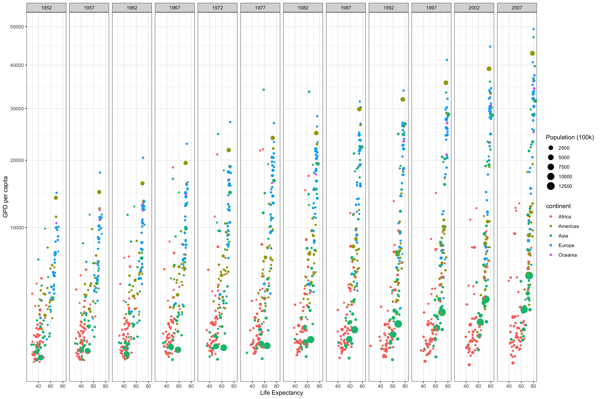
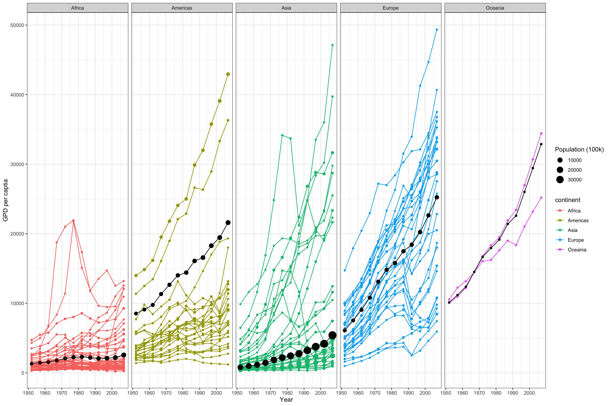

***Chance Lister***

# Background

In this case study I learned a few different things about making plots/graphs. The first being how to edit the x and y axis. I also thought the "gg.save" function was neat and how it automatically saves the images. I also learned how to combine graphs such as I did in the second graph with the colored graph and the black average graph.

# Visualizations

library(ggplot2)
library(gapminder)
library(dplyr)

glimpse(gapminder)

### Removing Kuwait
no_kuwait <- filter(gapminder, country != "Kuwait")

no_kuwait

## Graph 1

ggplot(data = no_kuwait) +
  geom_point(mapping = aes(x = lifeExp, y = gdpPercap,
                           size = pop/100000, 
                           color = continent)) +
  xlab("Life Expectancy") +
  ylab("GPD per capita") +
  scale_y_continuous(trans = "sqrt") +
  scale_size_continuous(name = "Population (100k)") +
  facet_wrap(~year, ncol = 12) +
  theme_bw() 
  

  
### Saving Graph 1
ggsave(
  filename = "CaseStudy2_graph1.png",
  plot = last_plot(),
  width = 15,
  units = c("in"),
  dpi = 300
)

## Graph 2

### Graph 2 Data
graph_2 <- no_kuwait %>%
  select(continent,year, gdpPercap, pop) %>%
  group_by(continent, year) %>%
  summarize( gdp =weighted.mean(gdpPercap, pop),sum = sum(pop))

graph_2

### Graph 2
ggplot(data = no_kuwait) +
  geom_point(mapping = aes(x = year, y = gdpPercap, 
                            size = pop/100000, 
                            color = continent)) +
  geom_path(mapping = aes(x = year, y = gdpPercap, color = continent, group = country)) +
  geom_point(data = graph_2, mapping = aes(x = year, y = gdp, size = sum/100000)) +
  geom_line(data = graph2_data, mapping = aes(x = year, y = gdp)) +
  xlab("Year") +
  ylab("GPD per captia") +
  scale_size_continuous(name = "Population (100k)") +
  facet_wrap(~continent, ncol = 5) +
  theme_bw()

### Saving Graph 2
ggsave(
  filename = "CaseStudy2_graph2.png",
  plot = last_plot(),
  width = 15,
  units = c("in"),
  dpi = 300
)

