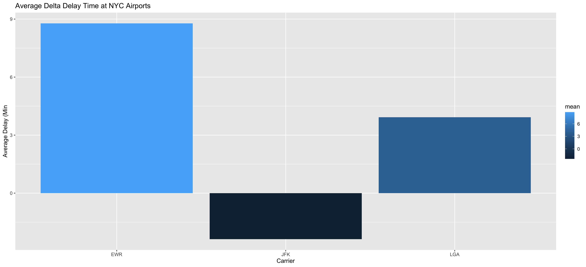
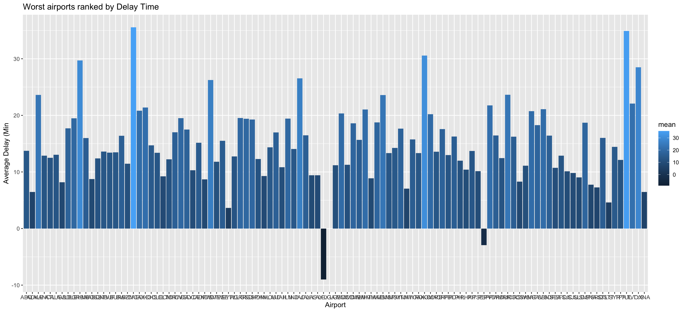

** Chance Lister **

# Case Study 4 Introduction

In this case study I answered two seperate questions within the NYC Flights data. The first question being "Which origin airport is best to minimize my chances of a late arrival when I am using Delta Airlines?" and the second question: "Which destination airport is the worst airport for arrival time?". In this data I used the average to represent the data and cleaned some data to help rid of nulls. 

## Question 2

library(tidyverse)
library(nycflights13)
library(ggplot2)
library(ggbeeswarm)
library(ggrepel)

delta <- filter(flights, carrier == "DL")
glimpse(delta)

delta_origin <- group_by(delta, origin)
glimpse(delta_origin)

delta_origin <- summarise(delta_origin,
                          mean = mean(arr_delay, na.rm = TRUE),
                          sd = sd(arr_delay, na.rm = TRUE))

delta_origin

delta_vis <- ggplot(data = delta_origin) +
  geom_col(mapping =aes(x = origin, y = mean, fill = mean)) +
  labs(title = "Average Delta Delay Time at NYC Airports",
       x = "Carrier",
       y = "Average Delay (Min") +
  theme_grey()

delta_vis

ggsave(
  filename = "Case4_graph1.png",
  plot = last_plot(),
  width = 15,
  units = c("in"),
  dpi = 300
)

## Question 3

worst_airports <- group_by(flights,dest)

worst_airports <- summarise(worst_airports,
                            mean = mean(dep_delay, na.rm = TRUE),
                            sd = sd(dep_delay, na.rm = TRUE))

ws_vis <- ggplot(data = worst_airports) +
  geom_col(mapping =aes(x = dest, y = mean, fill = mean)) +
  labs(title = "Worst airports ranked by Delay Time",
       x = "Airport",
       y = "Average Delay (Min") +
  theme_grey()

ws_vis

ggsave(
  filename = "Case4_graph.png",
  plot = last_plot(),
  width = 15,
  units = c("in"),
  dpi = 300
)

