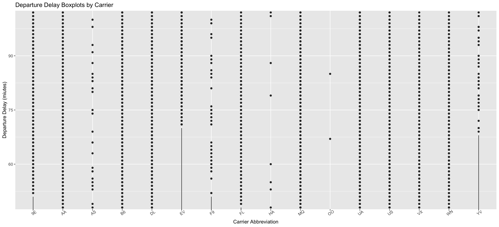
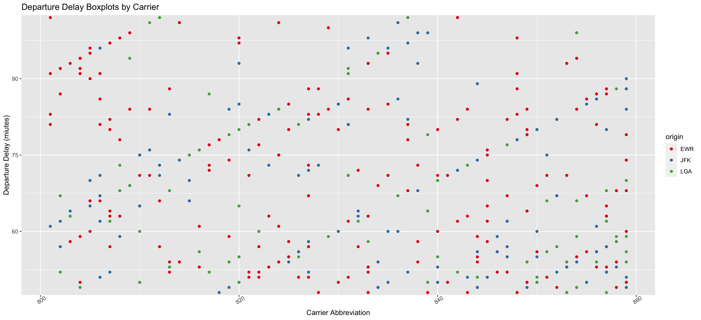
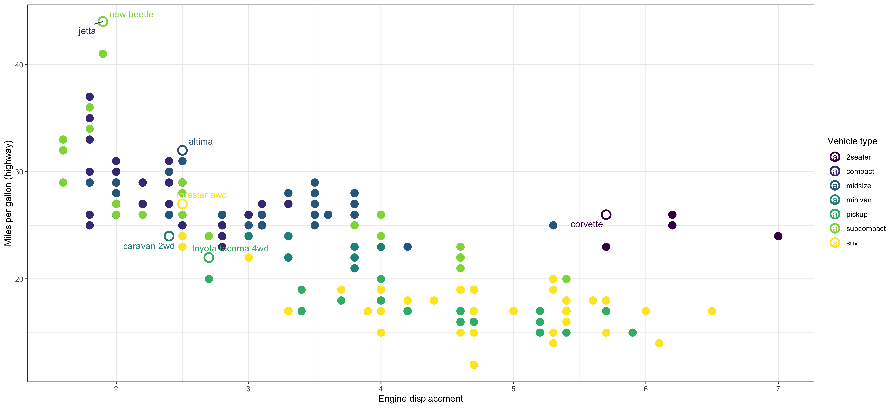

**Chance Lister**

library(ggplot2)
library(dplyr)
library(nycflights13)
library(viridis)
library(ggplot2)

flights <- nycflights13::flights

## Exercise 1

head(flights, 10)
tail(flights, 10)

nrow(flights)
There is 336,776 rows in our data.

summary(flights)
There is NA's in dep_time, dep_delay, arr_time, arr_delay and air_time.

## Base Plot

fl_bp <- flights %>%
  ggplot(aes(x = carrier, y = dep_delay))
fl_sc <- flights %>%
  filter(dep_time > 800, dep_time < 900) %>%
  ggplot(aes(x = dep_time, y = dep_delay))

fl_bp + geom_boxplot()

fl_sc + geom_point()

## Exercise 2

fl_bp + geom_boxplot() + labs(title = "Departure Delay Boxplots by Carrier", x = "Carrier Abbreviation", y = "Departure Delay (miutes)")

fl_sc + geom_point() + labs(title = "Departure Delay for Each Departure Time", x = "Departure Time", y = "Departure Delay (minutes)")

## Exercise 3

fl_bp + geom_boxplot() + 
  labs(title = "Departure Delay Boxplots by Carrier", x = "Carrier Abbreviation", y = "Departure Delay (miutes)") +
  coord_cartesian(ylim = c(50,100)) +
  scale_y_continuous(breaks = c(60, 75, 90))

fl_sc + geom_point() + 
  labs(title = "Departure Delay for Each Departure Time", x = "Departure Time", y = "Departure Delay (minutes)") +
  coord_cartesian(ylim = c(50,100)) +
  scale_y_continuous(breaks = c(60, 75, 90))

## Exercise 4

fl_sc + geom_point(aes(color = origin)) + 
  labs(title = "Departure Delay Boxplots by Carrier", x = "Carrier Abbreviation", y = "Departure Delay (miutes)") +
  coord_cartesian(ylim = c(50,100)) +
  scale_y_continuous(breaks = c(60, 75, 90)) +
  scale_color_brewer(palette = "Set1")

## Exercise 5

### Graph 1

fl_bp + geom_boxplot() + 
  labs(title = "Departure Delay Boxplots by Carrier", x = "Carrier Abbreviation", y = "Departure Delay (miutes)") +
  coord_cartesian(ylim = c(50,100)) +
  scale_y_continuous(breaks = c(60, 75, 90)) +
  theme_grey() +
  theme(axis.text.x = element_text(angle = 35))

ggsave(
  filename = "Task10_graph1.png",
  plot = last_plot(),
  width = 15,
  units = c("in"),
  dpi = 300
)

### Graph 2

fl_sc + geom_point(aes(color = origin)) + 
  labs(title = "Departure Delay Boxplots by Carrier", x = "Carrier Abbreviation", y = "Departure Delay (miutes)") +
  coord_cartesian(ylim = c(50,100)) +
  scale_y_continuous(breaks = c(60, 75, 90)) +
  scale_color_brewer(palette = "Set1") +
  theme_grey() +
  theme(axis.text.x = element_text(angle = 35))

ggsave(
  filename = "Task10_graph2.png",
  plot = last_plot(),
  width = 15,
  units = c("in"),
  dpi = 300
)

# Exercise 6

best_in_class <- mpg %>%
  group_by(class) %>%
  filter(row_number(desc(hwy)) == 1)

best_in_class_plot <- ggplot(mpg, aes(displ, hwy)) +
  geom_point(aes(colour = class), size = 4) +
  geom_point(aes(color = class), size = 4, shape = 21, stroke = 1.5, fill = "white", data = best_in_class) +
  ggrepel::geom_label_repel(aes(label = model, color = class), label.size = NA, fill = NA, data = best_in_class) +
  labs(x = "Engine displacement", y = "Miles per gallon (highway)", color = "Vehicle type" ) +
  scale_colour_viridis_d() +
  theme_bw()

best_in_class_plot

ggsave(
  filename = "Task10_graph3.png",
  plot = last_plot(),
  width = 15,
  units = c("in"),
  dpi = 300
)
