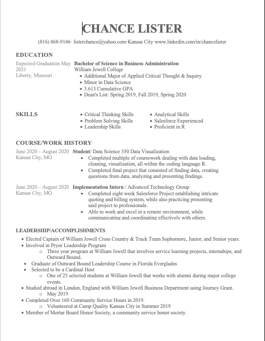
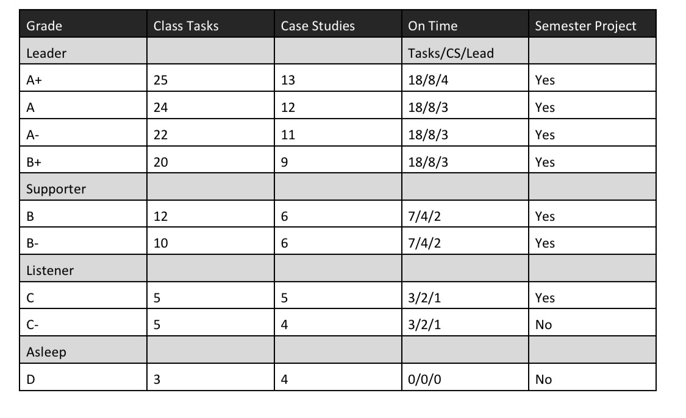

### Chance Lister

# My Cover Letter
Dear Hiring Manager,

I, Chance Lister, am submitting my resume for consideration for the position Data Scientist at Future Employer at the Kansas City location. Given the skills and experience in my enclosed resume, I believe I could be a worthy asset to your team. 

In my final semester at William Jewell College, I completed a multitude of coursework dealing with data loading, data cleaning, data visualization, and R coding capabilities. Through these principles, I have learned and applied skills such as critical thinking, problem-solving, leadership, and analytical skills.

The principles I learned during this coursework were taught through daily tasks that included coding and analysis practice, case studies that involved looking at real data and coming to conclusions from the data, and the semester long project where I complied data, created questions about the data, and then answered and presented my findings.

Finally, from these principles I have learned the applied skill of thinking critically from doing multiple case studies on real world issues. I have learned problem-solving skills from working with the coding language of R and finding answers to my own questions. I also learned leadership skills through leading multiple team meetings on case studies throughout the semester. Finally, I have grown my analytic skills from multiple instances of data analysis. 

From my experiences and practical skills listed above, I believe I could be a great addition to your team. As I start my journey into my professional career, I could not think of a better place to begin than at Future employer. Thank you for your time and I am eager to hear back from you!

Best Regards,
Chance Lister 

# My Resume


# Task List

```{r setup, include=FALSE}
knitr::opts_chunk$set(echo = TRUE)
```

### Semester Project [X]

Part of your project will be completed in Case Study 1, Task 3, Task 7, and Task 8.  The other tasks associated with your project are:

- [X] Finalize your project analysis
  - [X] Choose your flavor of .Rmd for your presentation.
  - [X] Build a stand-alone analysis that helps a reader answer the question at hand with that available data.
- [X] Present your visualization based analysis that addresses your question. (15-20 minutes)
  - [X] Present your analysis to your roommates and update your presentation based on the feedback.
  - [ ] Get feedback from 2-3 fellow classmates on your presentation and update it based on their feedback.
  - [ ] Present your draft presentation to a data scientist to review for clarity.
  - [X] Present your work in class.
  
### Leadership [X]

Leadership in data science requires you to be prepared to answer the clients questions when the team meeting is scheduled. We are treating class like the team meeting and you need to be prepared to answer and ask questions about the driving objectives from the client.  Two aspects of leadership we will focus on are completing work **on time**, and **leading** team discussions.

- [X] The number of tasks I completed on time:12
- [X] The number of Case Studies I completed on time: 7
- [X] The number of times I was a team lead for a team meeting: 3
- [X] The total number of tasks I completed: 13.75
- [X] The total number of Case Studies I completed: 7

### Portfolio [X]

Case Study 14 provides the checklist items for your portfolio.  This portfolio will be the basis of your final grade.

- [X] Join the Jewell GitHub and Slack groups and make sure your picture is placed in your profile.
- [X] Create a cover letter to me stating the key concepts and techniques that you learned during our Case Studies, Tasks, and your project and your goals to continue learning in this area.  Include a grade request that represents your knowledge and task completion.
- [X] Create a current resume that includes the skills you have learned during our Case Studies, Tasks, and your project which you would submit to any future jobs.
- [X] Create a semester task form that records your completed tasks during the semester (electronic).
- [X] Semester project submission on GitHub.
- [X] Submit this material electronically to your repository and schedule a visit with me.

### Coding Challenges

There are three coding challenges throughout the semester.  You will not be able to work with others, but will be able to ask questions of Dr. Martin during class.  The coding challenges will use the techniques and programming developed from the course.  The last coding challenge must be completed in order to keep the grade earned from your completed tasks.  Failure to pass the last challenge will lower your grade 1-2 steps.

# Grade


- The number of tasks I completed on time: 12 (B)
- The number of Case Studies I completed on time: 7 (B)
- The number of times I was a team lead for a team meeting: 3 (B)
- The total number of tasks I completed: 13.75 (B)
- The total number of Case Studies I completed: 7 (B)

- Overall Grade After Above Chart (B-)

- DTS Final Semester Project: (?)

- DTS Coding Challenge (F)


## Case Studies

### Case Study 1 [X]

- [X] Find 4-5 examples of data-driven answers and write a one-paragraph review of each.
  - [X] List 2-3 items that are unique/good
  - [X] Identify 1 issue within each example
- [X] Create an .Rmd file in R-Studio
  - [X] Title it Case Study 1 in the YAML
  - [X] Display the visualizations you found
  - [X] Include links to the visualization post you found 
  - [X] Write a one paragraph critique of each visualization
  - [X] Add the R code given in the Case Study to your .Rmd file
  - [X] Knit the file to .html and keep the .md file as well
- [X]Create an account on Slack.
  - [X] You must use your Jewell email address to create your account.
  - [X] You might create a catchy username that matches your other social media usernames and that can follow you for your career.  
  - [X] On Slack, share something about yourself (for example a favorite place, an interesting tidbit, or a boring fact, etc.), and then ask a question of Dr. Martin.
- [X] Upload your intermediary .md file to the general channel in our Slack group.

### Case Study 2 [X]

- [X] Recreate the two graphics shown in the Case Study file using gapminder dataset from library(gapminder).  Get them to match as closely as you can.  There are many different ways you can do this.  See below if you need some hints.
  - [X] Use library(tidyverse) to load ggplot2 and dplyr and the theme_bw() to duplicate the first plot.  
  - [X] Use scale_y_continuous(trans = "sqrt") to get the correct scale on the y-axis.
  - [X] Build weighted average data set using weighted.mean() and GDP with summarise() and group_by() that will be the black continent average line on the second plot.
  - [X] Use theme_bw() to duplicate the second plot.  You will need to use the new data to make the black lines and dots showing the continent average.
  - [X] Use ggsave() and save each plot as a .png with a width of 15 inches.
- [X] Build an .Rmd file that has the following features:
  - [X] The title is Case Study 2.
  - [X] You have two sections - 1) Background, 2) Images
  - [X] In the background section write a few sentences about what you learned making these plots.
  - [X] In the image section have two chunks.  One for each image.
- [X] Save your .Rmd, .md, and the two .png's of the plots.

### Case Study 3 [X]

- [X] Download the CensusAtSchool.csv file from Moodle and import into an R script.
- [X] Create a new data frame called df_inch which converts all of the measurements given in centimeters to inches.
- [X] Create a new data frame called df_environment which selects from the original data set only those rows that list at least a 750 score in any of the importance columns and has the rows ordered from youngest to oldest.
- [X] Create a new data frame called df_extra which does not include any of the importance columns from the original data set.
- [X] Create a new data frame called df_numbers which comes from the original data set and gives for each country 
  1.  the number of males in the sample from that country.
  2.  the number of females in the sample from that country.
  3.  the average score of all of the importance columns for each country.  (Decide on a convention for the empty responses.)
- [X] Create a new data frame called df_gender which comes from the original data set and gives for each country and each gender the 
  1.  average score of each of the importance columns.
  2.  the standard deviation for each importance column
  3.  order the columns so it is country, gender, mean_importance_reducing_pollution,  standdev_reducing_pollution, mean_importance_recycling_rubbish, standdev_recycling_rubbish, etc.
- [X] Create any other data frames or visualizations that you think might help you determine areas of strength or weakness in the importance categories.
- [X] Create an .Rmd file that has two sections:
  - Section 1:  Gives the first 10 rows of each of the data frames you created
  - Section 2:  Includes a summary of your findings to the question which includes at least one visualization to support your findings.

### Case Study 4 [X]

- [X] Address at least two of the three questions stated in the background description (if you have time try to tackle all three).
- [X] Make sure to include one or more visualization that shows the complexity of the data.
- [X] Create one .rmd file that has your report.
  - [X] Have a section for each question.
  - [X] Make sure your code is in the report but defaults to hidden.  (In the YAML include `code_folding:  'hide'`)
  - [X] Write an introduction section that describes your results.
  - [X] Make a plot of the data to show the answer to the specific question.
- [X] Push your .Rmd, .md, and .html to your GitHub repo Week_04 file.
- [X] Be prepared to discuss your analysis in the upcoming class.
- [X] Complete the recommended reading on posting issues.
- [X] Find two other student’s compiled files in their repository and provide feedback using the issues feature in GitHub (If they already have two issues find a different student to critique)
- [X] Address 1-2 of the issues posted on your project and push the updates to GitHub

### Case Study 6 [X]

- [X] Explore the data set.
  - [X] Make visualizations to give the distribution of each of the x, y, and z variables in the `diamonds` data set.
  - [X] Explore the distribution of `price`.  Is there anything unusual or surprising?
  - [X] Can you determine what variable in the diamonds dataset is most important for predicting the price of a diamond?  How is that variable correlated with cut?  Why does the combination of those two relationships lead to lower quality diamonds being more expensive?
  - [X] Make a visualization of carat partitioned by price.
  - [X] How does the price distribution of very large diamonds compare to small diamonds?  Does the data agree with your expectations?
  - [X] Visualize a combined distribution of cut, carat, and price.
- [X] Make a clean report of your findings and a few of your visualizations in an `.Rmd` file, and then push all of your case study files to your GitHub repo.


### Case Study 7 [X]

- [X] Use the correct functions from `library(haven)` , `library(readr)`, and `library(readxl)` to load the 6 data sets listed [here](https://moodle.jewell.edu/mod/resource/view.php?id=168559).
- [X] Tidy the Worldwide estimates `.xlsx` file.
  - [X] Make sure the file is in long format with year as a column. See [here](https://moodle.jewell.edu/mod/resource/view.php?id=168572) for an example of the final format.
  - [X] Use the `separate()` and `mutate()` functions to create a decade column.
- [X] Import the other five datasets into R and combine them into one tidy dataset.
  - [X] This dataset should have the following columns - birth_year, height.cm, height.in, and study_id.
  - [X] The BLS wage data does not have birth information. Let’s assume it is mid-twentieth century and use 1950.
- [X] Save the two tidy datasets to your repository - The world country estimates and the row-combined individual measurements.
- [X] Make a plot with decade on the x-axis and height in inches on the y-axis with the points from Germany highlighted based on the data from the `.xlsx` file.
- [X] Make a small-multiples plot of the five studies to examine the question of height distribution across centuries.
- [X] Create an `.Rmd` file with 1-2 paragraphs summarizing your graphics and how those graphics answer the driving question.
- [X] Compile your `.md` and `.html` file into your git repository.
- [X] Find two other student’s compiled files in their repository and provide feedback using the issues feature in GitHub (If they already have three issues find a different student to critique).
- [X] Address 1-2 of the issues posted on your project and push the updates to GitHub.

### Case Study 14 [X]

- [X] Create a cover letter to me stating the key concepts and techniques that you learned during our Case Studies, Tasks, and your project and your goals to continue learning in this area.  Include a grade request that represents your knowledge and task completion.
- [X] Create a current resume that includes the skills you have learned during our Case Studies, Tasks, and your project which you would submit to any future jobs.
- [X] Create a semester task form that records your completed tasks during the semester (electronic).
- [X] Semester project submission on GitHub.
- [X] Submit this material electronically to your repository and schedule a visit with me.

## Tasks

### Task 1 [X]

- [X] Read the course syllabus and make sure you understand our class routine and grading.
- [X] Get R and R-Studio running on your computer
  - [X] Fix your settings in R-Studio to use the [code diagnostics](https://support.rstudio.com/hc/en-us/articles/205753617-Code-Diagnostics)
- [X] Watch the John Rauser Presentation
  - [X] Use the following [google spreadsheet](https://docs.google.com/spreadsheets/d/12BBTMxKs5iFCIqOEcV1cHsTKypbB0VeigdoMQtWLT4c/edit?usp=sharing) to input your three favorite segments of the video. Use your Jewell standardized name lastname firstletterfirstname – For example mine is martine.
- [X] Read the material about [learning online](https://www.newyorker.com/science/maria-konnikova/being-a-better-online-reader) and be prepared for a conversation in class.


### Task 2 [X]

- [X] Make an R script that has the code examples from [Chapter 4](https://r4ds.had.co.nz/workflow-basics.html) and [Chapter 1](https://moderndive.com/1-getting-started.html)
- [X] Write a short **comment** in your R script that explains 1-2 new concepts you learned about R.
- [X] Use the iris data to show a faceted visualization with a color, shape, and size layer or geometry.
  - [X] Write a driving question associated to your visualization.
  - [X] Write a sentance about how your visualization helps you answer your driving question.
  - [X] Be prepared to share your visualization in class.
- [X] Create a [GitHub](https://github.com/join?source=header-home) account and post your github username on the [google docs sheet](https://docs.google.com/spreadsheets/d/1g2bDhN_oKX0JzGAM9jwh-IzvDVh7gjtfKGf_wtDJQMs/edit?usp=sharing).
- [X] Post a professional picture to your GitHub icon.


### Task 3 [x]

- [X] Take notes on your reading of the specified 'R for Data Science' chapter in a .R script or a .md file.
- [X] Practice using DPLYR
  - [X] Arrange the iris data by Sepal.Length and display the first six rows.
  - [X] Select the Species and Petal.Width columns and put them into a new data set called testdat.
  - [X] Create a new table that has the mean for each variable by Species.
  - [X] Read about the ?summarize_all() function and get a new table with the means and standard deviations for each species.
- [X] Develop a few novel questions that data can answer.
  - [ ] Get feedback from 5-10 people on their interest in your questions and summarize this feedback.
  - [ ] Find other examples of people addressing your question.
  - [ ] Present your question to a professional in the area related to your question.  Ideally this would be a data scientist, but it could be a business professor, biologist, mathematician, etc.  Get feedback on the quality of the question and if it can be addressed in 2 months.
- [X] Create one .Rmd file that has your dplyr practice and report.
  - [X] Have a section dplyr and for each question.
- [X] Be prepared to discuss your results in the upcoming class.


### Task 4 [X]

- [X] Complete all of the exercises from the Day4script file from class. 
- [X] Make sure your GitHub account is registered and you have an email invitation from Dr. Martin.
- [X] Follow the installation instructions in [GitHub , Git, and DTS 350](https://moodle.jewell.edu/mod/resource/view.php?id=158651).
- [X] Transfer all of your class files to your GitHub repo.  Make sure you add, commit, and push with Git.
  - [X] Put your Task2.R file in your GitHub Week_02/Class_Task_02 folder.
  - [X] Put your files for your Case Study 1 in your GitHub Week_01 folder.
  - [X] Put your .R or .md script of your notes from Chapter 5 of 'R for Data Science' in your Week_02/Class_Task_03 folder.
  - [X] Put your .Rmd file from Task 3 that has your dplyr practice and report in your GitHub Week_02/Class_Task_03 folder.
  - [X] Put your all of your files from Case Study 2 in the Week_02 file on GitHub.
  - [X] Put your .R script file with your Task4Script solutions in the Week_03/Class_Task_04 folder.
- [X] Make sure Git works in R-Studio.
  - [X] Update your README.md in your repository.
    - [X] Type one or two sentences that describe you.
    - [X] Make sure you pull and push.
- [X] Post a message on Slack that includes a snippet of code and some comment.


### Task 5 [X]

- [X] Take notes on your reading of the specified 'R for Data Science' chapters in the README.md or in a .R script in the class task folder.
- [X] Work through all of the examples and answer all of the questions on the Day5Examples file (posted on Moodle) in an .R file.
- [X] Create a .Rmd file with the following:
  - [X] The title from this task.
  - [X] The first section should include an explanation of what you learned and what you found difficult.
  - [X] In the second section, 
    - [X] download a data file from [FiveThirtyEight](https://data.fivethirtyeight.com).
    - [X] Read that data file in as a data frame.
    - [X] Perform some manipulations of the data
    - [X] Write the manipulated data to a new csv file.
  - [X] Good organization of the file with sections, subsections, explanations, etc.
- [X] Push your `.Rmd`, `.md`, and `.html` files to your GitHub repo.

### Task 7 [X]

- [X] Find an insightful relationship between two of the variables (columns) and display that relationship in a table or graphic.
  - [X] Provide a distributional summary of the relevant variable in nycflights13::flights.
  - [X] Build bivariate summaries of the relevant variables.
  - [X] document the iterative script that built to your insightful relationship.
- [X] Review the "What do people do with new data" link above and write one quote that resonated with you in your .R file.
- [X] In your .R script include also your data visualization development with 1-2 commented paragraphs summarizing your 2 finalized graphics and the choices you made in the data presentation.
- [X] Save your .png images of each your final graphics and push all your work (including your .R file) to your repository.


### Task 8 [X]

- [X] Take notes on your reading of the specified 'R for Data Science' Chapters in the README.md or in a '.R' script in the class task folder.
- [X] In an .Rmd file include links to sources with a description of the quality of each data source.
  - [X] Find 3-5 potential data sources (that are free) and document some information about the source.
  - [X] Build an R script that reads in, formats, and visualizes the data using the principles of exploratory analysis.
  - [X] Write a short summary in your .Rmd file of the read in process and some coding secrets you learned.
  - [X] Include 2-3 quick visualizations in your .Rmd file that you used to check the quality of your data.
  - [X] Summarize the limitations of your final compiled data in addressing your original question.
- [X] After formatting your data, identify any follow up or alternate questions that you could use for your project.


### Task 9 [X]

- [X] In an .Rmd file write a self-evaluation of this course.
  - [X] Include a section that explains your strengths in the class.
  - [X] Include a section that explains areas you could improve on.
  - [X] Include a section that lists your goals for the course and your plan to achieve those goals.
- [X] Push your .Rmd and .html files to GitHub.
- [X] Since this task should not take a lot of time, use your extra time to complete any previous tasks or case studies.


### Task 10 [X]

- [X] Complete the exercises from the Day10Exercise.Rmd file.  Save your final plots for your two data sets: `fl_bp` and `fl_sc`.  Also save your plot from Exercise 6.
- [X] Include your plots in an `.Rmd` file with a short paragrph describing your plots and what you learned from creating the plot.
- [X] Push your `.Rmd`, `.md`, `.html`, and your three `.png` files to your GitHub repo.

### Task 12 [X]

- [X] Take notes on your reading of the specified R for Data Science chapter in the README.md or in a .R script in the class task folder.
- [X] Import the [messy_data.xlsx](https://github.com/WJC-Data-Science/DTS350/raw/master/messy_data.xlsx) file.  All of the courses listed in this file are R or Python classes.  Here is a list of the course names:
      - CS 241: Python 
      - CS 450: Data Mining
      - MATH 325: Statistics with R
      - MATH 335: Data Visualization
      - MATH 425: Applied Linear Regression
  - [X] Use the `library(downloader)` R package and the `download(mode = "wb")` function to download the xlsx data because read_xlsx() cannot read files from the web path.
  - [X] Use `tempfile()` to download and save the file.
- [X] Look at the data and diagram how this file will need to be changed to be tidy (and remove so much of the blank space).
- [X] Tidy the data.
- [X] Create a visualiztion to show how R and Python classes are affecting students.
- [X] Create an `.Rmd` file that shows the first 20 rows of your tidy table and your visualization along with a short paragraph describing your graph.
- [X] Push your `.Rmd`, `.md`, and `.html` files to your GitHub repo.


### Task 13 [X]

- [X] Use the appropriate functions in `library(readr)`, `library(haven)`, `library(readxl)` to read in the five files found on [GitHub](https://github.com/WJC-Data-Science/DTS350/tree/master/Dart_Expert_Dow_6month_anova).
  - [X] Use `read_rds(url("WEBLOCATION.rds"))` to download and read the `.rds` file type.
  - [X] Use the `library(downloader)` R package and use the `download(mode = "wb")` function to download the xlsx data as `read_xlsx()` cannot read files from the web path.
  - [X] Use the `tempfile()` function to download and save the file.
- [X] Check that all five files you have imported into R are in fact the same with `all_equal()`.  You might need to include `convert = TRUE` in the function.  Read about the function for more information.
- [X] Use one of the files to make a graphic showing the performance of the Dart, DJIA, and Pro stock selections.
  - [X] Include a boxplot, the jittered returns, and the average return in your graphic
- [X] Tidy the data.
  - [X] The `contestant_period` column is not “tidy”.  We want to create a `month_end` and `year_end` column from the information it contains.
- [X] Save your “tidy” data as an `.rds` object.
- [X] Create a plot that shows the six-month returns by the year in which the returns are collected.
- [X] Create a table using code of the DJIA returns that matches the table shown below (“spread” the data).
- [X] Include your plots in an `.Rmd` file with short paragraph describing your plots. Make sure to display the tidyr code in your file.
- [X] Push your `.Rmd`, `.md`, and `.html` to your GitHub repo

### Task 15 [X]

- [X] Take notes on your reading of the specified 'R for Data Science' chapter in the README.md or in a '.R' script in the class task folder.
- [X] Install the `library(Lahman)` and examine the available data sets available.
  - [X] Find the 4-5 different data sets that you will need to show full college and player names as well as their annual earnings.  You might want to draw a diagram to show how the data sets are related.
- [X] Install the `library(blscrapeR)` and use the `inflation_adjust(2017)` function to get all earnings in 2017 dollars.
- [X] Make a plot showing how professional baseball player earnings that played baseball at Mizzou compared to the players from other Missouri schools.
- [X] Create a report in an `.Rmd` file with your code hidden but with repoducible data that explains your conclusions and includes your graphic.  Save your `.Rmd`, `.md`, `.html` and `.R` script and image to your repository.


### Task 16 [X]

Coding Challenge I

### Task 21 [X]

- [X] Take notes on your reading of the new R package in the README.md or in a ‘.R’ script in the class task folder.
- [X] Build the `library(dygraphs)` plot that shows the Kroger (KR) stock price performance over 5 years.
- [X] Image that you invested \$10,000 in kroger about two years ago on April 5th. Make a graph with dygraph that shows performance using `dyRebased()` to $10,000.
- [X] Annotate the graphic with a note of the reason at two or more time points, or intervals, where the price had significant shifts.
- [X] Create an `.Rmd` file with 1-2 paragraphs summarizing your graphics and the choices you made in the data presentation.
- [X] Compile your `.md` and `.html` file into your git repository.

### Task 23 [X]

Coding Challenge II

#Analysis Final Project

## Task 1

### Data Driven Answers

#### Visualization #1
##### "The Most Affordable Places to Buy a Home in America"


https://www.refiguide.org/wp-content/uploads/2020/08/image3-768x748.png

In this first visualization I wanted to point out how I like the feature of the percentage bar next to the affordability % as it is nice to have a visual reference. I also like how the visualization is simple and to the point with visualizing the data. One thing I think this visualization could improve upon would be taking into consideration more than just income/house prices such as utilities and cost of living etc. Also Independence and KCK are listed in the top 40!

### Visualization #2
#### "Average Renters Insurance Premium vs Percentage of City that is Black"


https://goodcover.ghost.io/content/images/size/w1000/2020/08/scatterplot-wm-1.png

In this visualization I like that a simple scatter plot is used and efficiently presents the data. I also like that this visualization presents a trendline for the data. One thing I think this visualization could do better on would be showing the data in a less zoomed view as most of the data is between the 0% and 10% interval. 

#### Visualization #3
##### "Popularity of Solar Versus Days of Sun in Metro Areas"


https://pix-media.priceonomics-media.com/blog/1415/solarversussun.png

In this visualization I like that the visualization has distinct lines that show the variables on the x and y axis. This makes it easier for me to read the numerical significance. I also like that this visualization also has a trendline. I understand that that labeling each dot would make the visualization not as clean, but I wish I knew what some of the cities are that are not listed.

#### Visualization #4
##### "How Valuable is Data to Your Organizations Overall Sucess"


https://pix-media.priceonomics-media.com/blog/1412/image1.png

In this visualization I like the bar chart are it is simple and effective with displaying the data. I also like how the colors within the visualization stand out (the pink). What I do not like how this visualization is its bias and would be curios to see what categories data is not valuable in.

## Task 3

### Novel Questions

#### Does the college you attend have a direct correlation to your post grad salary?

https://www.theatlantic.com/ideas/archive/2018/12/does-it-matter-where-you-go-college/577816/

#### Is there a correlation between a parents income and child's highschool/college graduation percentage?
https://www.irp.wisc.edu/publications/focus/pdfs/foc272e.pdf

https://www.ncbi.nlm.nih.gov/pmc/articles/PMC2891175/

#### Do socially responsible companies see more profits?

https://business-ethics.com/2015/05/05/does-corporate-social-responsibility-increase-profits/

https://www.business.com/articles/can-you-make-a-profit-and-be-socially-responsible/

https://stampme.com/how-can-corporate-social-responsibility-impact-loyalty-programs/

## Task 7

### Quote from "What do people do with new data"

"The first thing I do is fool around abit to try to figure out what the data set looks like". I like this quote as often I feel lost when I start coding, and one way I can feel less lost is to start looking at my data and what it means.

## Task 8
```{r, message=FALSE}
library(readxl)
library(readr)
library(ggplot2)
library(dplyr)
```
### Data Sources

#### Data Set 1 Tesla Stock
```{r, message=FALSE}
TSLA <- read_csv("TSLA.csv")
```
Tesla stock price since 2010, with highs, lows, opens, closing prices, and volume.A good data set for Tesla but lacks more overall information for proposed question.

##### Tesla Visualization Example
```{r}
tesla_stock <- ggplot(data = TSLA) +
  geom_path(mapping = aes(x = Date, y = High)) +
  theme_grey() +
  labs(title = "Tesla Stock High Since 2010")
tesla_stock
```

#### Data Set 2 Tidyquants

library(tidyverse)
library(tidyquant)

Tidyquant is a package within the tidyverse that provides the stock data of every stock in the NASDAQ, NYSE, and AMEX. Within each stock there is the symbol, date, open, high, low, close, and volume.

```{r, message=FALSE}
library(tidyquant)
library(tidyverse)
library(lubridate)
library(timetk)
library(dygraphs)
```

##### Tidyquant Visualization Example

```{r, warning=FALSE}
KR_prices1 <- tq_get("KR", get = "stock.prices", from = "2015-11-01", to = "2020-11-01")
KR_prices2 <- tq_get("KR", get = "stock.prices", from = "2018-04-05", to = "2020-11-01")

Yearly_Returns <- bind_rows(KR_prices1) %>%
  select(symbol, date, adjusted) %>%
  pivot_wider(names_from = symbol, values_from = adjusted) %>%
  tk_xts(date_var = date)
dygraph(Yearly_Returns, main = "Kroger Stock Price Performance Over 5 Years")
```

#### Read-in Proccess Summary

The read in process was fairly simple on both of these data sets, especially the latter as there is truly no "loading in" with this data as tidyquant contains all the data I need without being in a physical location.

#### Limitations

Some limitations on the Tesla data is that it is of course only Tesla data, so there is a lack of ability to answer my overarching question as I cannot look at other companies. The limitations on my Tidyquant data is that it is a very large frame of data, so to use the data I have to filter through years and which variable I deem most important to measure.

## Project Analysis

```{r, message=FALSE}
library(tidyquant)
library(tidyverse)
library(lubridate)
library(timetk)
library(dygraphs)
```

## Is Social Responsiblity a Prominent Indicator of Better Preforming Companies?

### Preface
Social resonsibiloy is defined as companies acting in the best interest of their environment and society as a whole.Examples include sustainable environmental practices, treating employees fairly through wages/safety, and being engaged and active in their communities. 

I choose stock prices as my measurable to compare companies as stock prices are a (mostly) accurate indicator of a companies financial health as stock prices are a reflection of the companies immediate future. That being said it is not a fair assumption to compare stock prices at a base level price for price, which is why I will be observing merely the trends of the stock price and not the stock price in it of itself.


### My Hypothesis
I think there is so many other factors such as overall market health, world events, and government policies, and the company itself that are correlated to the companies financial health and stock price movement, that I find it difficult for social responsibility to be the sole indicator of a company preforming better than another. Meaning, I do not think social responsibility will be a direct indicator of a better preforming stock price movement. 

### My Methodology
To accurately compare a socially responsible company and a non-socially responsible company I researched and created four industry categories to compare. These industry categories include, Resource Collecting (Timber/Oil), Renewable and Non Renewable Energy (Natural Gas/Coal), Automobile, and Energy Collecting (Wind/Fracking). I researched two companies for each category for a head to head comparison, one that ran on socially responsible principles and one that did not.

## The Companies

### The Socially Responsible Companies

##### Weyerhaeuser (WY)
Weyerhaeuser is an American timberland company that has developed a socially responsible way to grow and harvest tress in a responsible environmental manner. Their values revolve around sustainability and and environmental stewardship.
https://www.weyerhaeuser.com/sustainability/

##### Brookfield Renewable Partners (BEP)
Brookfield Renewable Partners is partnership of organizations that owns and operates renewable power assets across Canada. Brookfield is run off of ESG practices (Environmental Social Governance) and publish their yearly ESG report to maintain transparency and set the standard for other companies.
https://bep.brookfield.com/responsibility

##### Tesla (TSLA)
Tesla is an electric vehicle and clean energy company whose products include electric cars, battery storage from home to grid scale, solar panels and solar roof tiles. Tesla's slogan is "Electric Cars, Solar & Clean Energy" and to practice what they preach they have provided a annual company sustainability and impact report every year since 2016. 
https://www.tesla.com/ns_videos/tesla-impact-report-2019.pdf

##### Equinor ASA (EQNR)
Equinor ASA is an energy company that develops wind and solar energy projects in offshore operations. In addition to having the largest wind farm off the coast of England, Equinor has provided solar farms in Africa and has built multiple modern secondary schools in multiple locations including Africa and Ukraine.
https://www.equinor.com/en/what-we-do/wind.html
https://www.equinor.com/en/where-we-are/russia/our-social-investment-projects.html

### The Not So Socially Responsible Companies

##### BP (BP)
BP is a British multinational oil and gas company and is one of the seven "supermajor" oil and gas companies in the world. BP is known for having one of the worst industrial disasters in the world, The Deepwater Horizon Oil Spill in 2010 off the Gulf of Mexico spilled 4.9 million barrels of oil into the ocean. 
https://www.britannica.com/event/Deepwater-Horizon-oil-spill

##### Alliance Resource Partners (ARLP)
Alliance Resource Partners is a diversified coal producer with significant operations in the eastern United States. Alliance is a significant contributor to Greenhouse gases, and since 2010 has had 700 safety related offenses given by OSHA.
https://violationtracker.goodjobsfirst.org/prog.php?parent=alliance-resource-partners&page=7

##### Ford Motor Company (F)
Ford is an American automobile company that was founded in 1903 and creates a wide range of vesicles. Ford is not on the same level as most of these other non responsible companies, but Ford does not have any fully electric cars currently and has produced the 5th most cars in the history of automobile creation.
https://en.wikipedia.org/wiki/List_of_manufacturers_by_motor_vehicle_production

##### EOG Resources Inc. (EOG)
EOG Resources Inc. is a hydrocarbon (fracking) company engaged in hydrocarbon exploration here in the United States. Fracking is fairly new process but is considered to have harmful short and long term implications to the environment.
https://www.nrdc.org/stories/fracking-101

## The Anlaysis
```{r warning=FALSE}
WY_stock <- tq_get("WY", get = "stock.prices", from = "2010-01-01", to = "2020-12-07")
BEP_stock <- tq_get("BEP", get = "stock.prices", from = "2010-01-01", to = "2020-12-07")
TSLA_stock <- tq_get("TSLA", get = "stock.prices", from = "2010-01-01", to = "2020-12-07")
EQNR_stock <- tq_get("EQNR", get = "stock.prices", from = "2010-01-01", to = "2020-12-07")

BP_stock <- tq_get("BP", get = "stock.prices", from = "2010-01-01", to = "2020-12-07")
ARLP_stock <- tq_get("ARLP", get = "stock.prices", from = "2010-01-01", to = "2020-12-07")
F_stock <- tq_get("F", get = "stock.prices", from = "2010-01-01", to = "2020-12-07")
EOG_stock <- tq_get("EOG", get = "stock.prices", from = "2010-01-01", to = "2020-12-07")
```
### All of the Companies
```{r, warning=FALSE}
all_Returns <- bind_rows(WY_stock,BEP_stock, TSLA_stock, EQNR_stock,BP_stock,ARLP_stock, F_stock, EOG_stock) %>%
  select(symbol, date, adjusted) %>%
  pivot_wider(names_from = symbol, values_from = adjusted) %>%
  tk_xts(date_var = date)

dygraph(all_Returns, main = "All Companies in Sample Size")
```

### The Responsible Companies
```{r, warning=FALSE}
good_Returns <- bind_rows(WY_stock,BEP_stock, TSLA_stock, EQNR_stock) %>%
  select(symbol, date, adjusted) %>%
  pivot_wider(names_from = symbol, values_from = adjusted) %>%
  tk_xts(date_var = date)

dygraph(good_Returns, main = "Socially Responsible Companies Performance Over Ten Years")
```
My first visualization is dominated by Tesla, and it is difficult to come to any conclusion with Tesla being such an outlier. 

### The Responsible Companies Excluding Tesla
```{r, warning=FALSE}
good_Returns2 <- bind_rows(WY_stock,BEP_stock, EQNR_stock) %>%
  select(symbol, date, adjusted) %>%
  pivot_wider(names_from = symbol, values_from = adjusted) %>%
  tk_xts(date_var = date)

dygraph(good_Returns2, main = "Socially Responsible Companies Performance Over Ten Years Excluding Tesla")
```
From this visualization we see that BEP is currently trending towards/ is at its highest price, while EQNR & WY are currently on a bearish trend with peak trends for EQNR in September of 2018 and WY with peak trends in 2010.

### The Non Responsible Companies
```{r, warning=FALSE}
bad_Returns <- bind_rows(BP_stock,ARLP_stock, F_stock, EOG_stock) %>%
  select(symbol, date, adjusted) %>%
  pivot_wider(names_from = symbol, values_from = adjusted) %>%
  tk_xts(date_var = date)

dygraph(bad_Returns, main = "Non-Responsible Companies Performance Over Ten Years")
```
In this visualization we see EOG has had mostly bullish tendencies with its peak being in October of 2018 but has been on a gradual decline since. ARLP, F, and BP have remained mostly stagnant since 2010 with a few rises and falls. ARLP and F both had their peaks in January of 2015 and January 2014. BP meanwhile had its peak in October of 2018.

### Comparision of Resource Collecting Companies
```{r, warning=FALSE}
land_Returns <- bind_rows(WY_stock,BP_stock) %>%
  select(symbol, date, adjusted) %>%
  pivot_wider(names_from = symbol, values_from = adjusted) %>%
  tk_xts(date_var = date)

dygraph(land_Returns, main = "Weyerhaeuser (WY) & BP (BP) Comparision ")
```
In this visualization we see similar trends between our two resource collecting companies, with BP having the higher trend for most of the century, but since 2020 WY has a better trend comparatively. Overall the not so socially responsible company BP has the higher trend over the longer period of time.

### Comaprison of Renewable Energy & Non Renewable Energy
```{r, warning=FALSE}
renew_Returns <- bind_rows(BEP_stock,ARLP_stock) %>%
  select(symbol, date, adjusted) %>%
  pivot_wider(names_from = symbol, values_from = adjusted) %>%
  tk_xts(date_var = date)

dygraph(renew_Returns, main = "Brookfield Renewable Partners (BEP) & Alliance Resource Partners (ARLP) Comparison")
```
In the second visualization comparing our energy companies we see that the socially responsible company BEP has been trending mostly upwards since 2010, whole ARLP has trended down since the end of 2014.

### Comparison of Automobile Companies Part 1
```{r, warning=FALSE}
auto_Returns <- bind_rows(TSLA_stock,F_stock) %>%
  select(symbol, date, adjusted) %>%
  pivot_wider(names_from = symbol, values_from = adjusted) %>%
  tk_xts(date_var = date)

dygraph(auto_Returns, main = "TESLA (TSLA) & Ford (F) Comparison (2010's)")
```
This visualization more or less speaks for itself. 

### Comparision of Automobile Companies Part 2
```{r, warning=FALSE}
TSLA_stock2 <- tq_get("TSLA", get = "stock.prices", from = "2000-01-01", to = "2020-07-01")

F_stock2 <- tq_get("F", get = "stock.prices", from = "1950-01-01", to = "2020-07-01")


auto_Returns2 <- bind_rows(TSLA_stock2,F_stock2) %>%
  select(symbol, date, adjusted) %>%
  pivot_wider(names_from = symbol, values_from = adjusted) %>%
  tk_xts(date_var = date)

dygraph(auto_Returns2, main = "TESLA (TSLA) & Ford (F) Comparison (All Time)")
```
Even going back forty years, Ford's stock movement does not compare.

### Comparision of Energy Collecting Companies
```{r, warning=FALSE}
energy_Returns <- bind_rows(EQNR_stock,EOG_stock) %>%
  select(symbol, date, adjusted) %>%
  pivot_wider(names_from = symbol, values_from = adjusted) %>%
  tk_xts(date_var = date)

dygraph(energy_Returns, main = "Equinor ASA (EQNR) & EOG Resources (EOG) Comparison")
```
In our final visualization we see that EOG was trending upwards from late 2012 to late 2018 before declining heavily. Meanwhile EQNR has stayed mostly level throughout the decade with little change in stock price since 2010 (14.73) and currently (16.50). In this instance I would give EOG the upper hand as they did have a longer period (6 years) of upward trending stock price but it is worth noting they have had a much more significant fall than EQNR.

## In Conclusion

#### I think a point should be made that since 2019 most of the socially responsible companies are trending more upwards than the not so socially responsible companies.That being said, I think the conclusion is Social Responsibility does not play as significant of a role when comparing stock price trends. From above we saw a split two and two when comparing head to head from the same industry, and I do not think there is reasonable justification to believe from this evidence that social responsibility is a leading indicator of a better preforming company.


