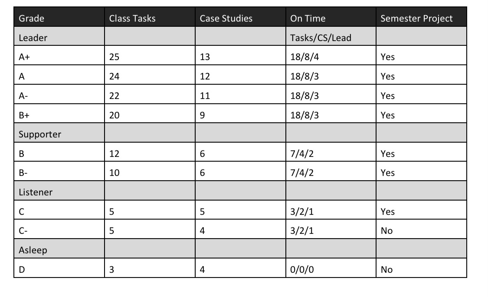

### Chance Lister

# My Cover Letter
Dear Hiring Manager,

I, Chance Lister, am submitting my resume for consideration for the position Data Scientist at Future Employer at the Kansas City location. Given the skills and experience in my enclosed resume, I believe I could be a worthy asset to your team. 

In my final semester at William Jewell College, I completed a multitude of coursework dealing with data loading, data cleaning, data visualization, and R coding capabilities. Through these principles, I have learned and applied skills such as critical thinking, problem-solving, leadership, and analytical skills.

The principles I learned during this coursework were taught through daily tasks that included coding and analysis practice, case studies that involved looking at real data and coming to conclusions from the data, and the semester long project where I complied data, created questions about the data, and then answered and presented my findings.

Finally, from these principles I have learned the applied skill of thinking critically from doing multiple case studies on real world issues. I have learned problem-solving skills from working with the coding language of R and finding answers to my own questions. I also learned leadership skills through leading multiple team meetings on case studies throughout the semester. Finally, I have grown my analytic skills from multiple instances of data analysis. 

From my experiences and practical skills listed above, I believe I could be a great addition to your team. As I start my journey into my professional career, I could not think of a better place to begin than at Future employer. Thank you for your time and I am eager to hear back from you!

Best Regards,
Chance Lister 

# My Resume


# Task List


### Semester Project [X]

Part of your project will be completed in Case Study 1, Task 3, Task 7, and Task 8.  The other tasks associated with your project are:

- [X] Finalize your project analysis
  - [X] Choose your flavor of .Rmd for your presentation.
  - [X] Build a stand-alone analysis that helps a reader answer the question at hand with that available data.
- [X] Present your visualization based analysis that addresses your question. (15-20 minutes)
  - [X] Present your analysis to your roommates and update your presentation based on the feedback.
  - [ ] Get feedback from 2-3 fellow classmates on your presentation and update it based on their feedback.
  - [ ] Present your draft presentation to a data scientist to review for clarity.
  - [X] Present your work in class.
  
### Leadership [X]

Leadership in data science requires you to be prepared to answer the clients questions when the team meeting is scheduled. We are treating class like the team meeting and you need to be prepared to answer and ask questions about the driving objectives from the client.  Two aspects of leadership we will focus on are completing work **on time**, and **leading** team discussions.

- [X] The number of tasks I completed on time:12
- [X] The number of Case Studies I completed on time: 7
- [X] The number of times I was a team lead for a team meeting: 3
- [X] The total number of tasks I completed: 13.75
- [X] The total number of Case Studies I completed: 7

### Portfolio [X]

Case Study 14 provides the checklist items for your portfolio.  This portfolio will be the basis of your final grade.

- [X] Join the Jewell GitHub and Slack groups and make sure your picture is placed in your profile.
- [X] Create a cover letter to me stating the key concepts and techniques that you learned during our Case Studies, Tasks, and your project and your goals to continue learning in this area.  Include a grade request that represents your knowledge and task completion.
- [X] Create a current resume that includes the skills you have learned during our Case Studies, Tasks, and your project which you would submit to any future jobs.
- [X] Create a semester task form that records your completed tasks during the semester (electronic).
- [X] Semester project submission on GitHub.
- [X] Submit this material electronically to your repository and schedule a visit with me.

### Coding Challenges

There are three coding challenges throughout the semester.  You will not be able to work with others, but will be able to ask questions of Dr. Martin during class.  The coding challenges will use the techniques and programming developed from the course.  The last coding challenge must be completed in order to keep the grade earned from your completed tasks.  Failure to pass the last challenge will lower your grade 1-2 steps.

# Grade


- The number of tasks I completed on time: 12 (B)
- The number of Case Studies I completed on time: 7 (B)
- The number of times I was a team lead for a team meeting: 3 (B)
- The total number of tasks I completed: 13.75 (B)
- The total number of Case Studies I completed: 7 (B)

- Overall Grade After Above Chart (B-)

- DTS Final Semester Project: (?)

- DTS Coding Challenge (F)


## Case Studies

### Case Study 1 [X]

- [X] Find 4-5 examples of data-driven answers and write a one-paragraph review of each.
  - [X] List 2-3 items that are unique/good
  - [X] Identify 1 issue within each example
- [X] Create an .Rmd file in R-Studio
  - [X] Title it Case Study 1 in the YAML
  - [X] Display the visualizations you found
  - [X] Include links to the visualization post you found 
  - [X] Write a one paragraph critique of each visualization
  - [X] Add the R code given in the Case Study to your .Rmd file
  - [X] Knit the file to .html and keep the .md file as well
- [X]Create an account on Slack.
  - [X] You must use your Jewell email address to create your account.
  - [X] You might create a catchy username that matches your other social media usernames and that can follow you for your career.  
  - [X] On Slack, share something about yourself (for example a favorite place, an interesting tidbit, or a boring fact, etc.), and then ask a question of Dr. Martin.
- [X] Upload your intermediary .md file to the general channel in our Slack group.

### Case Study 2 [X]

- [X] Recreate the two graphics shown in the Case Study file using gapminder dataset from library(gapminder).  Get them to match as closely as you can.  There are many different ways you can do this.  See below if you need some hints.
  - [X] Use library(tidyverse) to load ggplot2 and dplyr and the theme_bw() to duplicate the first plot.  
  - [X] Use scale_y_continuous(trans = "sqrt") to get the correct scale on the y-axis.
  - [X] Build weighted average data set using weighted.mean() and GDP with summarise() and group_by() that will be the black continent average line on the second plot.
  - [X] Use theme_bw() to duplicate the second plot.  You will need to use the new data to make the black lines and dots showing the continent average.
  - [X] Use ggsave() and save each plot as a .png with a width of 15 inches.
- [X] Build an .Rmd file that has the following features:
  - [X] The title is Case Study 2.
  - [X] You have two sections - 1) Background, 2) Images
  - [X] In the background section write a few sentences about what you learned making these plots.
  - [X] In the image section have two chunks.  One for each image.
- [X] Save your .Rmd, .md, and the two .png's of the plots.

### Case Study 3 [X]

- [X] Download the CensusAtSchool.csv file from Moodle and import into an R script.
- [X] Create a new data frame called df_inch which converts all of the measurements given in centimeters to inches.
- [X] Create a new data frame called df_environment which selects from the original data set only those rows that list at least a 750 score in any of the importance columns and has the rows ordered from youngest to oldest.
- [X] Create a new data frame called df_extra which does not include any of the importance columns from the original data set.
- [X] Create a new data frame called df_numbers which comes from the original data set and gives for each country 
  1.  the number of males in the sample from that country.
  2.  the number of females in the sample from that country.
  3.  the average score of all of the importance columns for each country.  (Decide on a convention for the empty responses.)
- [X] Create a new data frame called df_gender which comes from the original data set and gives for each country and each gender the 
  1.  average score of each of the importance columns.
  2.  the standard deviation for each importance column
  3.  order the columns so it is country, gender, mean_importance_reducing_pollution,  standdev_reducing_pollution, mean_importance_recycling_rubbish, standdev_recycling_rubbish, etc.
- [X] Create any other data frames or visualizations that you think might help you determine areas of strength or weakness in the importance categories.
- [X] Create an .Rmd file that has two sections:
  - Section 1:  Gives the first 10 rows of each of the data frames you created
  - Section 2:  Includes a summary of your findings to the question which includes at least one visualization to support your findings.

### Case Study 4 [X]

- [X] Address at least two of the three questions stated in the background description (if you have time try to tackle all three).
- [X] Make sure to include one or more visualization that shows the complexity of the data.
- [X] Create one .rmd file that has your report.
  - [X] Have a section for each question.
  - [X] Make sure your code is in the report but defaults to hidden.  (In the YAML include `code_folding:  'hide'`)
  - [X] Write an introduction section that describes your results.
  - [X] Make a plot of the data to show the answer to the specific question.
- [X] Push your .Rmd, .md, and .html to your GitHub repo Week_04 file.
- [X] Be prepared to discuss your analysis in the upcoming class.
- [X] Complete the recommended reading on posting issues.
- [X] Find two other student’s compiled files in their repository and provide feedback using the issues feature in GitHub (If they already have two issues find a different student to critique)
- [X] Address 1-2 of the issues posted on your project and push the updates to GitHub

### Case Study 6 [X]

- [X] Explore the data set.
  - [X] Make visualizations to give the distribution of each of the x, y, and z variables in the `diamonds` data set.
  - [X] Explore the distribution of `price`.  Is there anything unusual or surprising?
  - [X] Can you determine what variable in the diamonds dataset is most important for predicting the price of a diamond?  How is that variable correlated with cut?  Why does the combination of those two relationships lead to lower quality diamonds being more expensive?
  - [X] Make a visualization of carat partitioned by price.
  - [X] How does the price distribution of very large diamonds compare to small diamonds?  Does the data agree with your expectations?
  - [X] Visualize a combined distribution of cut, carat, and price.
- [X] Make a clean report of your findings and a few of your visualizations in an `.Rmd` file, and then push all of your case study files to your GitHub repo.


### Case Study 7 [X]

- [X] Use the correct functions from `library(haven)` , `library(readr)`, and `library(readxl)` to load the 6 data sets listed [here](https://moodle.jewell.edu/mod/resource/view.php?id=168559).
- [X] Tidy the Worldwide estimates `.xlsx` file.
  - [X] Make sure the file is in long format with year as a column. See [here](https://moodle.jewell.edu/mod/resource/view.php?id=168572) for an example of the final format.
  - [X] Use the `separate()` and `mutate()` functions to create a decade column.
- [X] Import the other five datasets into R and combine them into one tidy dataset.
  - [X] This dataset should have the following columns - birth_year, height.cm, height.in, and study_id.
  - [X] The BLS wage data does not have birth information. Let’s assume it is mid-twentieth century and use 1950.
- [X] Save the two tidy datasets to your repository - The world country estimates and the row-combined individual measurements.
- [X] Make a plot with decade on the x-axis and height in inches on the y-axis with the points from Germany highlighted based on the data from the `.xlsx` file.
- [X] Make a small-multiples plot of the five studies to examine the question of height distribution across centuries.
- [X] Create an `.Rmd` file with 1-2 paragraphs summarizing your graphics and how those graphics answer the driving question.
- [X] Compile your `.md` and `.html` file into your git repository.
- [X] Find two other student’s compiled files in their repository and provide feedback using the issues feature in GitHub (If they already have three issues find a different student to critique).
- [X] Address 1-2 of the issues posted on your project and push the updates to GitHub.

### Case Study 14 [X]

- [X] Create a cover letter to me stating the key concepts and techniques that you learned during our Case Studies, Tasks, and your project and your goals to continue learning in this area.  Include a grade request that represents your knowledge and task completion.
- [X] Create a current resume that includes the skills you have learned during our Case Studies, Tasks, and your project which you would submit to any future jobs.
- [X] Create a semester task form that records your completed tasks during the semester (electronic).
- [X] Semester project submission on GitHub.
- [X] Submit this material electronically to your repository and schedule a visit with me.

## Tasks

### Task 1 [X]

- [X] Read the course syllabus and make sure you understand our class routine and grading.
- [X] Get R and R-Studio running on your computer
  - [X] Fix your settings in R-Studio to use the [code diagnostics](https://support.rstudio.com/hc/en-us/articles/205753617-Code-Diagnostics)
- [X] Watch the John Rauser Presentation
  - [X] Use the following [google spreadsheet](https://docs.google.com/spreadsheets/d/12BBTMxKs5iFCIqOEcV1cHsTKypbB0VeigdoMQtWLT4c/edit?usp=sharing) to input your three favorite segments of the video. Use your Jewell standardized name lastname firstletterfirstname – For example mine is martine.
- [X] Read the material about [learning online](https://www.newyorker.com/science/maria-konnikova/being-a-better-online-reader) and be prepared for a conversation in class.


### Task 2 [X]

- [X] Make an R script that has the code examples from [Chapter 4](https://r4ds.had.co.nz/workflow-basics.html) and [Chapter 1](https://moderndive.com/1-getting-started.html)
- [X] Write a short **comment** in your R script that explains 1-2 new concepts you learned about R.
- [X] Use the iris data to show a faceted visualization with a color, shape, and size layer or geometry.
  - [X] Write a driving question associated to your visualization.
  - [X] Write a sentance about how your visualization helps you answer your driving question.
  - [X] Be prepared to share your visualization in class.
- [X] Create a [GitHub](https://github.com/join?source=header-home) account and post your github username on the [google docs sheet](https://docs.google.com/spreadsheets/d/1g2bDhN_oKX0JzGAM9jwh-IzvDVh7gjtfKGf_wtDJQMs/edit?usp=sharing).
- [X] Post a professional picture to your GitHub icon.


### Task 3 [x]

- [X] Take notes on your reading of the specified 'R for Data Science' chapter in a .R script or a .md file.
- [X] Practice using DPLYR
  - [X] Arrange the iris data by Sepal.Length and display the first six rows.
  - [X] Select the Species and Petal.Width columns and put them into a new data set called testdat.
  - [X] Create a new table that has the mean for each variable by Species.
  - [X] Read about the ?summarize_all() function and get a new table with the means and standard deviations for each species.
- [X] Develop a few novel questions that data can answer.
  - [ ] Get feedback from 5-10 people on their interest in your questions and summarize this feedback.
  - [ ] Find other examples of people addressing your question.
  - [ ] Present your question to a professional in the area related to your question.  Ideally this would be a data scientist, but it could be a business professor, biologist, mathematician, etc.  Get feedback on the quality of the question and if it can be addressed in 2 months.
- [X] Create one .Rmd file that has your dplyr practice and report.
  - [X] Have a section dplyr and for each question.
- [X] Be prepared to discuss your results in the upcoming class.


### Task 4 [X]

- [X] Complete all of the exercises from the Day4script file from class. 
- [X] Make sure your GitHub account is registered and you have an email invitation from Dr. Martin.
- [X] Follow the installation instructions in [GitHub , Git, and DTS 350](https://moodle.jewell.edu/mod/resource/view.php?id=158651).
- [X] Transfer all of your class files to your GitHub repo.  Make sure you add, commit, and push with Git.
  - [X] Put your Task2.R file in your GitHub Week_02/Class_Task_02 folder.
  - [X] Put your files for your Case Study 1 in your GitHub Week_01 folder.
  - [X] Put your .R or .md script of your notes from Chapter 5 of 'R for Data Science' in your Week_02/Class_Task_03 folder.
  - [X] Put your .Rmd file from Task 3 that has your dplyr practice and report in your GitHub Week_02/Class_Task_03 folder.
  - [X] Put your all of your files from Case Study 2 in the Week_02 file on GitHub.
  - [X] Put your .R script file with your Task4Script solutions in the Week_03/Class_Task_04 folder.
- [X] Make sure Git works in R-Studio.
  - [X] Update your README.md in your repository.
    - [X] Type one or two sentences that describe you.
    - [X] Make sure you pull and push.
- [X] Post a message on Slack that includes a snippet of code and some comment.


### Task 5 [X]

- [X] Take notes on your reading of the specified 'R for Data Science' chapters in the README.md or in a .R script in the class task folder.
- [X] Work through all of the examples and answer all of the questions on the Day5Examples file (posted on Moodle) in an .R file.
- [X] Create a .Rmd file with the following:
  - [X] The title from this task.
  - [X] The first section should include an explanation of what you learned and what you found difficult.
  - [X] In the second section, 
    - [X] download a data file from [FiveThirtyEight](https://data.fivethirtyeight.com).
    - [X] Read that data file in as a data frame.
    - [X] Perform some manipulations of the data
    - [X] Write the manipulated data to a new csv file.
  - [X] Good organization of the file with sections, subsections, explanations, etc.
- [X] Push your `.Rmd`, `.md`, and `.html` files to your GitHub repo.

### Task 7 [X]

- [X] Find an insightful relationship between two of the variables (columns) and display that relationship in a table or graphic.
  - [X] Provide a distributional summary of the relevant variable in nycflights13::flights.
  - [X] Build bivariate summaries of the relevant variables.
  - [X] document the iterative script that built to your insightful relationship.
- [X] Review the "What do people do with new data" link above and write one quote that resonated with you in your .R file.
- [X] In your .R script include also your data visualization development with 1-2 commented paragraphs summarizing your 2 finalized graphics and the choices you made in the data presentation.
- [X] Save your .png images of each your final graphics and push all your work (including your .R file) to your repository.


### Task 8 [X]

- [X] Take notes on your reading of the specified 'R for Data Science' Chapters in the README.md or in a '.R' script in the class task folder.
- [X] In an .Rmd file include links to sources with a description of the quality of each data source.
  - [X] Find 3-5 potential data sources (that are free) and document some information about the source.
  - [X] Build an R script that reads in, formats, and visualizes the data using the principles of exploratory analysis.
  - [X] Write a short summary in your .Rmd file of the read in process and some coding secrets you learned.
  - [X] Include 2-3 quick visualizations in your .Rmd file that you used to check the quality of your data.
  - [X] Summarize the limitations of your final compiled data in addressing your original question.
- [X] After formatting your data, identify any follow up or alternate questions that you could use for your project.


### Task 9 [X]

- [X] In an .Rmd file write a self-evaluation of this course.
  - [X] Include a section that explains your strengths in the class.
  - [X] Include a section that explains areas you could improve on.
  - [X] Include a section that lists your goals for the course and your plan to achieve those goals.
- [X] Push your .Rmd and .html files to GitHub.
- [X] Since this task should not take a lot of time, use your extra time to complete any previous tasks or case studies.


### Task 10 [X]

- [X] Complete the exercises from the Day10Exercise.Rmd file.  Save your final plots for your two data sets: `fl_bp` and `fl_sc`.  Also save your plot from Exercise 6.
- [X] Include your plots in an `.Rmd` file with a short paragrph describing your plots and what you learned from creating the plot.
- [X] Push your `.Rmd`, `.md`, `.html`, and your three `.png` files to your GitHub repo.

### Task 12 [X]

- [X] Take notes on your reading of the specified R for Data Science chapter in the README.md or in a .R script in the class task folder.
- [X] Import the [messy_data.xlsx](https://github.com/WJC-Data-Science/DTS350/raw/master/messy_data.xlsx) file.  All of the courses listed in this file are R or Python classes.  Here is a list of the course names:
      - CS 241: Python 
      - CS 450: Data Mining
      - MATH 325: Statistics with R
      - MATH 335: Data Visualization
      - MATH 425: Applied Linear Regression
  - [X] Use the `library(downloader)` R package and the `download(mode = "wb")` function to download the xlsx data because read_xlsx() cannot read files from the web path.
  - [X] Use `tempfile()` to download and save the file.
- [X] Look at the data and diagram how this file will need to be changed to be tidy (and remove so much of the blank space).
- [X] Tidy the data.
- [X] Create a visualiztion to show how R and Python classes are affecting students.
- [X] Create an `.Rmd` file that shows the first 20 rows of your tidy table and your visualization along with a short paragraph describing your graph.
- [X] Push your `.Rmd`, `.md`, and `.html` files to your GitHub repo.


### Task 13 [X]

- [X] Use the appropriate functions in `library(readr)`, `library(haven)`, `library(readxl)` to read in the five files found on [GitHub](https://github.com/WJC-Data-Science/DTS350/tree/master/Dart_Expert_Dow_6month_anova).
  - [X] Use `read_rds(url("WEBLOCATION.rds"))` to download and read the `.rds` file type.
  - [X] Use the `library(downloader)` R package and use the `download(mode = "wb")` function to download the xlsx data as `read_xlsx()` cannot read files from the web path.
  - [X] Use the `tempfile()` function to download and save the file.
- [X] Check that all five files you have imported into R are in fact the same with `all_equal()`.  You might need to include `convert = TRUE` in the function.  Read about the function for more information.
- [X] Use one of the files to make a graphic showing the performance of the Dart, DJIA, and Pro stock selections.
  - [X] Include a boxplot, the jittered returns, and the average return in your graphic
- [X] Tidy the data.
  - [X] The `contestant_period` column is not “tidy”.  We want to create a `month_end` and `year_end` column from the information it contains.
- [X] Save your “tidy” data as an `.rds` object.
- [X] Create a plot that shows the six-month returns by the year in which the returns are collected.
- [X] Create a table using code of the DJIA returns that matches the table shown below (“spread” the data).
- [X] Include your plots in an `.Rmd` file with short paragraph describing your plots. Make sure to display the tidyr code in your file.
- [X] Push your `.Rmd`, `.md`, and `.html` to your GitHub repo

### Task 15 [X]

- [X] Take notes on your reading of the specified 'R for Data Science' chapter in the README.md or in a '.R' script in the class task folder.
- [X] Install the `library(Lahman)` and examine the available data sets available.
  - [X] Find the 4-5 different data sets that you will need to show full college and player names as well as their annual earnings.  You might want to draw a diagram to show how the data sets are related.
- [X] Install the `library(blscrapeR)` and use the `inflation_adjust(2017)` function to get all earnings in 2017 dollars.
- [X] Make a plot showing how professional baseball player earnings that played baseball at Mizzou compared to the players from other Missouri schools.
- [X] Create a report in an `.Rmd` file with your code hidden but with repoducible data that explains your conclusions and includes your graphic.  Save your `.Rmd`, `.md`, `.html` and `.R` script and image to your repository.


### Task 16 [X]

Coding Challenge I

### Task 21 [X]

- [X] Take notes on your reading of the new R package in the README.md or in a ‘.R’ script in the class task folder.
- [X] Build the `library(dygraphs)` plot that shows the Kroger (KR) stock price performance over 5 years.
- [X] Image that you invested \$10,000 in kroger about two years ago on April 5th. Make a graph with dygraph that shows performance using `dyRebased()` to $10,000.
- [X] Annotate the graphic with a note of the reason at two or more time points, or intervals, where the price had significant shifts.
- [X] Create an `.Rmd` file with 1-2 paragraphs summarizing your graphics and the choices you made in the data presentation.
- [X] Compile your `.md` and `.html` file into your git repository.

### Task 23 [X]

Coding Challenge II

#Analysis Final Project

## Task 1

### Data Driven Answers

#### Visualization #1
##### "The Most Affordable Places to Buy a Home in America"


https://www.refiguide.org/wp-content/uploads/2020/08/image3-768x748.png

In this first visualization I wanted to point out how I like the feature of the percentage bar next to the affordability % as it is nice to have a visual reference. I also like how the visualization is simple and to the point with visualizing the data. One thing I think this visualization could improve upon would be taking into consideration more than just income/house prices such as utilities and cost of living etc. Also Independence and KCK are listed in the top 40!

### Visualization #2
#### "Average Renters Insurance Premium vs Percentage of City that is Black"


https://goodcover.ghost.io/content/images/size/w1000/2020/08/scatterplot-wm-1.png

In this visualization I like that a simple scatter plot is used and efficiently presents the data. I also like that this visualization presents a trendline for the data. One thing I think this visualization could do better on would be showing the data in a less zoomed view as most of the data is between the 0% and 10% interval. 

#### Visualization #3
##### "Popularity of Solar Versus Days of Sun in Metro Areas"


https://pix-media.priceonomics-media.com/blog/1415/solarversussun.png

In this visualization I like that the visualization has distinct lines that show the variables on the x and y axis. This makes it easier for me to read the numerical significance. I also like that this visualization also has a trendline. I understand that that labeling each dot would make the visualization not as clean, but I wish I knew what some of the cities are that are not listed.

#### Visualization #4
##### "How Valuable is Data to Your Organizations Overall Sucess"


https://pix-media.priceonomics-media.com/blog/1412/image1.png

In this visualization I like the bar chart are it is simple and effective with displaying the data. I also like how the colors within the visualization stand out (the pink). What I do not like how this visualization is its bias and would be curios to see what categories data is not valuable in.

## Task 3

### Novel Questions

#### Does the college you attend have a direct correlation to your post grad salary?

https://www.theatlantic.com/ideas/archive/2018/12/does-it-matter-where-you-go-college/577816/

#### Is there a correlation between a parents income and child's highschool/college graduation percentage?
https://www.irp.wisc.edu/publications/focus/pdfs/foc272e.pdf

https://www.ncbi.nlm.nih.gov/pmc/articles/PMC2891175/

#### Do socially responsible companies see more profits?

https://business-ethics.com/2015/05/05/does-corporate-social-responsibility-increase-profits/

https://www.business.com/articles/can-you-make-a-profit-and-be-socially-responsible/

https://stampme.com/how-can-corporate-social-responsibility-impact-loyalty-programs/

## Task 7

### Quote from "What do people do with new data"

"The first thing I do is fool around abit to try to figure out what the data set looks like". I like this quote as often I feel lost when I start coding, and one way I can feel less lost is to start looking at my data and what it means.

## Task 8

```r
library(readxl)
library(readr)
library(ggplot2)
library(dplyr)
```
### Data Sources

#### Data Set 1 Tesla Stock

```r
TSLA <- read_csv("TSLA.csv")
```
Tesla stock price since 2010, with highs, lows, opens, closing prices, and volume.A good data set for Tesla but lacks more overall information for proposed question.

##### Tesla Visualization Example

```r
tesla_stock <- ggplot(data = TSLA) +
  geom_path(mapping = aes(x = Date, y = High)) +
  theme_grey() +
  labs(title = "Tesla Stock High Since 2010")
tesla_stock
```

<!-- -->

#### Data Set 2 Tidyquants

library(tidyverse)
library(tidyquant)

Tidyquant is a package within the tidyverse that provides the stock data of every stock in the NASDAQ, NYSE, and AMEX. Within each stock there is the symbol, date, open, high, low, close, and volume.


```r
library(tidyquant)
library(tidyverse)
library(lubridate)
library(timetk)
library(dygraphs)
```

##### Tidyquant Visualization Example


```r
KR_prices1 <- tq_get("KR", get = "stock.prices", from = "2015-11-01", to = "2020-11-01")
KR_prices2 <- tq_get("KR", get = "stock.prices", from = "2018-04-05", to = "2020-11-01")

Yearly_Returns <- bind_rows(KR_prices1) %>%
  select(symbol, date, adjusted) %>%
  pivot_wider(names_from = symbol, values_from = adjusted) %>%
  tk_xts(date_var = date)
dygraph(Yearly_Returns, main = "Kroger Stock Price Performance Over 5 Years")
```

<!--html_preserve--><div id="htmlwidget-b260f636ef4cff5c6db0" style="width:672px;height:480px;" class="dygraphs html-widget"></div>
<script type="application/json" data-for="htmlwidget-b260f636ef4cff5c6db0">{"x":{"attrs":{"title":"Kroger Stock Price Performance Over 5 Years","labels":["day","KR"],"legend":"auto","retainDateWindow":false,"axes":{"x":{"pixelsPerLabel":60}}},"scale":"daily","annotations":[],"shadings":[],"events":[],"format":"date","data":[["2015-11-02T00:00:00.000Z","2015-11-03T00:00:00.000Z","2015-11-04T00:00:00.000Z","2015-11-05T00:00:00.000Z","2015-11-06T00:00:00.000Z","2015-11-09T00:00:00.000Z","2015-11-10T00:00:00.000Z","2015-11-11T00:00:00.000Z","2015-11-12T00:00:00.000Z","2015-11-13T00:00:00.000Z","2015-11-16T00:00:00.000Z","2015-11-17T00:00:00.000Z","2015-11-18T00:00:00.000Z","2015-11-19T00:00:00.000Z","2015-11-20T00:00:00.000Z","2015-11-23T00:00:00.000Z","2015-11-24T00:00:00.000Z","2015-11-25T00:00:00.000Z","2015-11-27T00:00:00.000Z","2015-11-30T00:00:00.000Z","2015-12-01T00:00:00.000Z","2015-12-02T00:00:00.000Z","2015-12-03T00:00:00.000Z","2015-12-04T00:00:00.000Z","2015-12-07T00:00:00.000Z","2015-12-08T00:00:00.000Z","2015-12-09T00:00:00.000Z","2015-12-10T00:00:00.000Z","2015-12-11T00:00:00.000Z","2015-12-14T00:00:00.000Z","2015-12-15T00:00:00.000Z","2015-12-16T00:00:00.000Z","2015-12-17T00:00:00.000Z","2015-12-18T00:00:00.000Z","2015-12-21T00:00:00.000Z","2015-12-22T00:00:00.000Z","2015-12-23T00:00:00.000Z","2015-12-24T00:00:00.000Z","2015-12-28T00:00:00.000Z","2015-12-29T00:00:00.000Z","2015-12-30T00:00:00.000Z","2015-12-31T00:00:00.000Z","2016-01-04T00:00:00.000Z","2016-01-05T00:00:00.000Z","2016-01-06T00:00:00.000Z","2016-01-07T00:00:00.000Z","2016-01-08T00:00:00.000Z","2016-01-11T00:00:00.000Z","2016-01-12T00:00:00.000Z","2016-01-13T00:00:00.000Z","2016-01-14T00:00:00.000Z","2016-01-15T00:00:00.000Z","2016-01-19T00:00:00.000Z","2016-01-20T00:00:00.000Z","2016-01-21T00:00:00.000Z","2016-01-22T00:00:00.000Z","2016-01-25T00:00:00.000Z","2016-01-26T00:00:00.000Z","2016-01-27T00:00:00.000Z","2016-01-28T00:00:00.000Z","2016-01-29T00:00:00.000Z","2016-02-01T00:00:00.000Z","2016-02-02T00:00:00.000Z","2016-02-03T00:00:00.000Z","2016-02-04T00:00:00.000Z","2016-02-05T00:00:00.000Z","2016-02-08T00:00:00.000Z","2016-02-09T00:00:00.000Z","2016-02-10T00:00:00.000Z","2016-02-11T00:00:00.000Z","2016-02-12T00:00:00.000Z","2016-02-16T00:00:00.000Z","2016-02-17T00:00:00.000Z","2016-02-18T00:00:00.000Z","2016-02-19T00:00:00.000Z","2016-02-22T00:00:00.000Z","2016-02-23T00:00:00.000Z","2016-02-24T00:00:00.000Z","2016-02-25T00:00:00.000Z","2016-02-26T00:00:00.000Z","2016-02-29T00:00:00.000Z","2016-03-01T00:00:00.000Z","2016-03-02T00:00:00.000Z","2016-03-03T00:00:00.000Z","2016-03-04T00:00:00.000Z","2016-03-07T00:00:00.000Z","2016-03-08T00:00:00.000Z","2016-03-09T00:00:00.000Z","2016-03-10T00:00:00.000Z","2016-03-11T00:00:00.000Z","2016-03-14T00:00:00.000Z","2016-03-15T00:00:00.000Z","2016-03-16T00:00:00.000Z","2016-03-17T00:00:00.000Z","2016-03-18T00:00:00.000Z","2016-03-21T00:00:00.000Z","2016-03-22T00:00:00.000Z","2016-03-23T00:00:00.000Z","2016-03-24T00:00:00.000Z","2016-03-28T00:00:00.000Z","2016-03-29T00:00:00.000Z","2016-03-30T00:00:00.000Z","2016-03-31T00:00:00.000Z","2016-04-01T00:00:00.000Z","2016-04-04T00:00:00.000Z","2016-04-05T00:00:00.000Z","2016-04-06T00:00:00.000Z","2016-04-07T00:00:00.000Z","2016-04-08T00:00:00.000Z","2016-04-11T00:00:00.000Z","2016-04-12T00:00:00.000Z","2016-04-13T00:00:00.000Z","2016-04-14T00:00:00.000Z","2016-04-15T00:00:00.000Z","2016-04-18T00:00:00.000Z","2016-04-19T00:00:00.000Z","2016-04-20T00:00:00.000Z","2016-04-21T00:00:00.000Z","2016-04-22T00:00:00.000Z","2016-04-25T00:00:00.000Z","2016-04-26T00:00:00.000Z","2016-04-27T00:00:00.000Z","2016-04-28T00:00:00.000Z","2016-04-29T00:00:00.000Z","2016-05-02T00:00:00.000Z","2016-05-03T00:00:00.000Z","2016-05-04T00:00:00.000Z","2016-05-05T00:00:00.000Z","2016-05-06T00:00:00.000Z","2016-05-09T00:00:00.000Z","2016-05-10T00:00:00.000Z","2016-05-11T00:00:00.000Z","2016-05-12T00:00:00.000Z","2016-05-13T00:00:00.000Z","2016-05-16T00:00:00.000Z","2016-05-17T00:00:00.000Z","2016-05-18T00:00:00.000Z","2016-05-19T00:00:00.000Z","2016-05-20T00:00:00.000Z","2016-05-23T00:00:00.000Z","2016-05-24T00:00:00.000Z","2016-05-25T00:00:00.000Z","2016-05-26T00:00:00.000Z","2016-05-27T00:00:00.000Z","2016-05-31T00:00:00.000Z","2016-06-01T00:00:00.000Z","2016-06-02T00:00:00.000Z","2016-06-03T00:00:00.000Z","2016-06-06T00:00:00.000Z","2016-06-07T00:00:00.000Z","2016-06-08T00:00:00.000Z","2016-06-09T00:00:00.000Z","2016-06-10T00:00:00.000Z","2016-06-13T00:00:00.000Z","2016-06-14T00:00:00.000Z","2016-06-15T00:00:00.000Z","2016-06-16T00:00:00.000Z","2016-06-17T00:00:00.000Z","2016-06-20T00:00:00.000Z","2016-06-21T00:00:00.000Z","2016-06-22T00:00:00.000Z","2016-06-23T00:00:00.000Z","2016-06-24T00:00:00.000Z","2016-06-27T00:00:00.000Z","2016-06-28T00:00:00.000Z","2016-06-29T00:00:00.000Z","2016-06-30T00:00:00.000Z","2016-07-01T00:00:00.000Z","2016-07-05T00:00:00.000Z","2016-07-06T00:00:00.000Z","2016-07-07T00:00:00.000Z","2016-07-08T00:00:00.000Z","2016-07-11T00:00:00.000Z","2016-07-12T00:00:00.000Z","2016-07-13T00:00:00.000Z","2016-07-14T00:00:00.000Z","2016-07-15T00:00:00.000Z","2016-07-18T00:00:00.000Z","2016-07-19T00:00:00.000Z","2016-07-20T00:00:00.000Z","2016-07-21T00:00:00.000Z","2016-07-22T00:00:00.000Z","2016-07-25T00:00:00.000Z","2016-07-26T00:00:00.000Z","2016-07-27T00:00:00.000Z","2016-07-28T00:00:00.000Z","2016-07-29T00:00:00.000Z","2016-08-01T00:00:00.000Z","2016-08-02T00:00:00.000Z","2016-08-03T00:00:00.000Z","2016-08-04T00:00:00.000Z","2016-08-05T00:00:00.000Z","2016-08-08T00:00:00.000Z","2016-08-09T00:00:00.000Z","2016-08-10T00:00:00.000Z","2016-08-11T00:00:00.000Z","2016-08-12T00:00:00.000Z","2016-08-15T00:00:00.000Z","2016-08-16T00:00:00.000Z","2016-08-17T00:00:00.000Z","2016-08-18T00:00:00.000Z","2016-08-19T00:00:00.000Z","2016-08-22T00:00:00.000Z","2016-08-23T00:00:00.000Z","2016-08-24T00:00:00.000Z","2016-08-25T00:00:00.000Z","2016-08-26T00:00:00.000Z","2016-08-29T00:00:00.000Z","2016-08-30T00:00:00.000Z","2016-08-31T00:00:00.000Z","2016-09-01T00:00:00.000Z","2016-09-02T00:00:00.000Z","2016-09-06T00:00:00.000Z","2016-09-07T00:00:00.000Z","2016-09-08T00:00:00.000Z","2016-09-09T00:00:00.000Z","2016-09-12T00:00:00.000Z","2016-09-13T00:00:00.000Z","2016-09-14T00:00:00.000Z","2016-09-15T00:00:00.000Z","2016-09-16T00:00:00.000Z","2016-09-19T00:00:00.000Z","2016-09-20T00:00:00.000Z","2016-09-21T00:00:00.000Z","2016-09-22T00:00:00.000Z","2016-09-23T00:00:00.000Z","2016-09-26T00:00:00.000Z","2016-09-27T00:00:00.000Z","2016-09-28T00:00:00.000Z","2016-09-29T00:00:00.000Z","2016-09-30T00:00:00.000Z","2016-10-03T00:00:00.000Z","2016-10-04T00:00:00.000Z","2016-10-05T00:00:00.000Z","2016-10-06T00:00:00.000Z","2016-10-07T00:00:00.000Z","2016-10-10T00:00:00.000Z","2016-10-11T00:00:00.000Z","2016-10-12T00:00:00.000Z","2016-10-13T00:00:00.000Z","2016-10-14T00:00:00.000Z","2016-10-17T00:00:00.000Z","2016-10-18T00:00:00.000Z","2016-10-19T00:00:00.000Z","2016-10-20T00:00:00.000Z","2016-10-21T00:00:00.000Z","2016-10-24T00:00:00.000Z","2016-10-25T00:00:00.000Z","2016-10-26T00:00:00.000Z","2016-10-27T00:00:00.000Z","2016-10-28T00:00:00.000Z","2016-10-31T00:00:00.000Z","2016-11-01T00:00:00.000Z","2016-11-02T00:00:00.000Z","2016-11-03T00:00:00.000Z","2016-11-04T00:00:00.000Z","2016-11-07T00:00:00.000Z","2016-11-08T00:00:00.000Z","2016-11-09T00:00:00.000Z","2016-11-10T00:00:00.000Z","2016-11-11T00:00:00.000Z","2016-11-14T00:00:00.000Z","2016-11-15T00:00:00.000Z","2016-11-16T00:00:00.000Z","2016-11-17T00:00:00.000Z","2016-11-18T00:00:00.000Z","2016-11-21T00:00:00.000Z","2016-11-22T00:00:00.000Z","2016-11-23T00:00:00.000Z","2016-11-25T00:00:00.000Z","2016-11-28T00:00:00.000Z","2016-11-29T00:00:00.000Z","2016-11-30T00:00:00.000Z","2016-12-01T00:00:00.000Z","2016-12-02T00:00:00.000Z","2016-12-05T00:00:00.000Z","2016-12-06T00:00:00.000Z","2016-12-07T00:00:00.000Z","2016-12-08T00:00:00.000Z","2016-12-09T00:00:00.000Z","2016-12-12T00:00:00.000Z","2016-12-13T00:00:00.000Z","2016-12-14T00:00:00.000Z","2016-12-15T00:00:00.000Z","2016-12-16T00:00:00.000Z","2016-12-19T00:00:00.000Z","2016-12-20T00:00:00.000Z","2016-12-21T00:00:00.000Z","2016-12-22T00:00:00.000Z","2016-12-23T00:00:00.000Z","2016-12-27T00:00:00.000Z","2016-12-28T00:00:00.000Z","2016-12-29T00:00:00.000Z","2016-12-30T00:00:00.000Z","2017-01-03T00:00:00.000Z","2017-01-04T00:00:00.000Z","2017-01-05T00:00:00.000Z","2017-01-06T00:00:00.000Z","2017-01-09T00:00:00.000Z","2017-01-10T00:00:00.000Z","2017-01-11T00:00:00.000Z","2017-01-12T00:00:00.000Z","2017-01-13T00:00:00.000Z","2017-01-17T00:00:00.000Z","2017-01-18T00:00:00.000Z","2017-01-19T00:00:00.000Z","2017-01-20T00:00:00.000Z","2017-01-23T00:00:00.000Z","2017-01-24T00:00:00.000Z","2017-01-25T00:00:00.000Z","2017-01-26T00:00:00.000Z","2017-01-27T00:00:00.000Z","2017-01-30T00:00:00.000Z","2017-01-31T00:00:00.000Z","2017-02-01T00:00:00.000Z","2017-02-02T00:00:00.000Z","2017-02-03T00:00:00.000Z","2017-02-06T00:00:00.000Z","2017-02-07T00:00:00.000Z","2017-02-08T00:00:00.000Z","2017-02-09T00:00:00.000Z","2017-02-10T00:00:00.000Z","2017-02-13T00:00:00.000Z","2017-02-14T00:00:00.000Z","2017-02-15T00:00:00.000Z","2017-02-16T00:00:00.000Z","2017-02-17T00:00:00.000Z","2017-02-21T00:00:00.000Z","2017-02-22T00:00:00.000Z","2017-02-23T00:00:00.000Z","2017-02-24T00:00:00.000Z","2017-02-27T00:00:00.000Z","2017-02-28T00:00:00.000Z","2017-03-01T00:00:00.000Z","2017-03-02T00:00:00.000Z","2017-03-03T00:00:00.000Z","2017-03-06T00:00:00.000Z","2017-03-07T00:00:00.000Z","2017-03-08T00:00:00.000Z","2017-03-09T00:00:00.000Z","2017-03-10T00:00:00.000Z","2017-03-13T00:00:00.000Z","2017-03-14T00:00:00.000Z","2017-03-15T00:00:00.000Z","2017-03-16T00:00:00.000Z","2017-03-17T00:00:00.000Z","2017-03-20T00:00:00.000Z","2017-03-21T00:00:00.000Z","2017-03-22T00:00:00.000Z","2017-03-23T00:00:00.000Z","2017-03-24T00:00:00.000Z","2017-03-27T00:00:00.000Z","2017-03-28T00:00:00.000Z","2017-03-29T00:00:00.000Z","2017-03-30T00:00:00.000Z","2017-03-31T00:00:00.000Z","2017-04-03T00:00:00.000Z","2017-04-04T00:00:00.000Z","2017-04-05T00:00:00.000Z","2017-04-06T00:00:00.000Z","2017-04-07T00:00:00.000Z","2017-04-10T00:00:00.000Z","2017-04-11T00:00:00.000Z","2017-04-12T00:00:00.000Z","2017-04-13T00:00:00.000Z","2017-04-17T00:00:00.000Z","2017-04-18T00:00:00.000Z","2017-04-19T00:00:00.000Z","2017-04-20T00:00:00.000Z","2017-04-21T00:00:00.000Z","2017-04-24T00:00:00.000Z","2017-04-25T00:00:00.000Z","2017-04-26T00:00:00.000Z","2017-04-27T00:00:00.000Z","2017-04-28T00:00:00.000Z","2017-05-01T00:00:00.000Z","2017-05-02T00:00:00.000Z","2017-05-03T00:00:00.000Z","2017-05-04T00:00:00.000Z","2017-05-05T00:00:00.000Z","2017-05-08T00:00:00.000Z","2017-05-09T00:00:00.000Z","2017-05-10T00:00:00.000Z","2017-05-11T00:00:00.000Z","2017-05-12T00:00:00.000Z","2017-05-15T00:00:00.000Z","2017-05-16T00:00:00.000Z","2017-05-17T00:00:00.000Z","2017-05-18T00:00:00.000Z","2017-05-19T00:00:00.000Z","2017-05-22T00:00:00.000Z","2017-05-23T00:00:00.000Z","2017-05-24T00:00:00.000Z","2017-05-25T00:00:00.000Z","2017-05-26T00:00:00.000Z","2017-05-30T00:00:00.000Z","2017-05-31T00:00:00.000Z","2017-06-01T00:00:00.000Z","2017-06-02T00:00:00.000Z","2017-06-05T00:00:00.000Z","2017-06-06T00:00:00.000Z","2017-06-07T00:00:00.000Z","2017-06-08T00:00:00.000Z","2017-06-09T00:00:00.000Z","2017-06-12T00:00:00.000Z","2017-06-13T00:00:00.000Z","2017-06-14T00:00:00.000Z","2017-06-15T00:00:00.000Z","2017-06-16T00:00:00.000Z","2017-06-19T00:00:00.000Z","2017-06-20T00:00:00.000Z","2017-06-21T00:00:00.000Z","2017-06-22T00:00:00.000Z","2017-06-23T00:00:00.000Z","2017-06-26T00:00:00.000Z","2017-06-27T00:00:00.000Z","2017-06-28T00:00:00.000Z","2017-06-29T00:00:00.000Z","2017-06-30T00:00:00.000Z","2017-07-03T00:00:00.000Z","2017-07-05T00:00:00.000Z","2017-07-06T00:00:00.000Z","2017-07-07T00:00:00.000Z","2017-07-10T00:00:00.000Z","2017-07-11T00:00:00.000Z","2017-07-12T00:00:00.000Z","2017-07-13T00:00:00.000Z","2017-07-14T00:00:00.000Z","2017-07-17T00:00:00.000Z","2017-07-18T00:00:00.000Z","2017-07-19T00:00:00.000Z","2017-07-20T00:00:00.000Z","2017-07-21T00:00:00.000Z","2017-07-24T00:00:00.000Z","2017-07-25T00:00:00.000Z","2017-07-26T00:00:00.000Z","2017-07-27T00:00:00.000Z","2017-07-28T00:00:00.000Z","2017-07-31T00:00:00.000Z","2017-08-01T00:00:00.000Z","2017-08-02T00:00:00.000Z","2017-08-03T00:00:00.000Z","2017-08-04T00:00:00.000Z","2017-08-07T00:00:00.000Z","2017-08-08T00:00:00.000Z","2017-08-09T00:00:00.000Z","2017-08-10T00:00:00.000Z","2017-08-11T00:00:00.000Z","2017-08-14T00:00:00.000Z","2017-08-15T00:00:00.000Z","2017-08-16T00:00:00.000Z","2017-08-17T00:00:00.000Z","2017-08-18T00:00:00.000Z","2017-08-21T00:00:00.000Z","2017-08-22T00:00:00.000Z","2017-08-23T00:00:00.000Z","2017-08-24T00:00:00.000Z","2017-08-25T00:00:00.000Z","2017-08-28T00:00:00.000Z","2017-08-29T00:00:00.000Z","2017-08-30T00:00:00.000Z","2017-08-31T00:00:00.000Z","2017-09-01T00:00:00.000Z","2017-09-05T00:00:00.000Z","2017-09-06T00:00:00.000Z","2017-09-07T00:00:00.000Z","2017-09-08T00:00:00.000Z","2017-09-11T00:00:00.000Z","2017-09-12T00:00:00.000Z","2017-09-13T00:00:00.000Z","2017-09-14T00:00:00.000Z","2017-09-15T00:00:00.000Z","2017-09-18T00:00:00.000Z","2017-09-19T00:00:00.000Z","2017-09-20T00:00:00.000Z","2017-09-21T00:00:00.000Z","2017-09-22T00:00:00.000Z","2017-09-25T00:00:00.000Z","2017-09-26T00:00:00.000Z","2017-09-27T00:00:00.000Z","2017-09-28T00:00:00.000Z","2017-09-29T00:00:00.000Z","2017-10-02T00:00:00.000Z","2017-10-03T00:00:00.000Z","2017-10-04T00:00:00.000Z","2017-10-05T00:00:00.000Z","2017-10-06T00:00:00.000Z","2017-10-09T00:00:00.000Z","2017-10-10T00:00:00.000Z","2017-10-11T00:00:00.000Z","2017-10-12T00:00:00.000Z","2017-10-13T00:00:00.000Z","2017-10-16T00:00:00.000Z","2017-10-17T00:00:00.000Z","2017-10-18T00:00:00.000Z","2017-10-19T00:00:00.000Z","2017-10-20T00:00:00.000Z","2017-10-23T00:00:00.000Z","2017-10-24T00:00:00.000Z","2017-10-25T00:00:00.000Z","2017-10-26T00:00:00.000Z","2017-10-27T00:00:00.000Z","2017-10-30T00:00:00.000Z","2017-10-31T00:00:00.000Z","2017-11-01T00:00:00.000Z","2017-11-02T00:00:00.000Z","2017-11-03T00:00:00.000Z","2017-11-06T00:00:00.000Z","2017-11-07T00:00:00.000Z","2017-11-08T00:00:00.000Z","2017-11-09T00:00:00.000Z","2017-11-10T00:00:00.000Z","2017-11-13T00:00:00.000Z","2017-11-14T00:00:00.000Z","2017-11-15T00:00:00.000Z","2017-11-16T00:00:00.000Z","2017-11-17T00:00:00.000Z","2017-11-20T00:00:00.000Z","2017-11-21T00:00:00.000Z","2017-11-22T00:00:00.000Z","2017-11-24T00:00:00.000Z","2017-11-27T00:00:00.000Z","2017-11-28T00:00:00.000Z","2017-11-29T00:00:00.000Z","2017-11-30T00:00:00.000Z","2017-12-01T00:00:00.000Z","2017-12-04T00:00:00.000Z","2017-12-05T00:00:00.000Z","2017-12-06T00:00:00.000Z","2017-12-07T00:00:00.000Z","2017-12-08T00:00:00.000Z","2017-12-11T00:00:00.000Z","2017-12-12T00:00:00.000Z","2017-12-13T00:00:00.000Z","2017-12-14T00:00:00.000Z","2017-12-15T00:00:00.000Z","2017-12-18T00:00:00.000Z","2017-12-19T00:00:00.000Z","2017-12-20T00:00:00.000Z","2017-12-21T00:00:00.000Z","2017-12-22T00:00:00.000Z","2017-12-26T00:00:00.000Z","2017-12-27T00:00:00.000Z","2017-12-28T00:00:00.000Z","2017-12-29T00:00:00.000Z","2018-01-02T00:00:00.000Z","2018-01-03T00:00:00.000Z","2018-01-04T00:00:00.000Z","2018-01-05T00:00:00.000Z","2018-01-08T00:00:00.000Z","2018-01-09T00:00:00.000Z","2018-01-10T00:00:00.000Z","2018-01-11T00:00:00.000Z","2018-01-12T00:00:00.000Z","2018-01-16T00:00:00.000Z","2018-01-17T00:00:00.000Z","2018-01-18T00:00:00.000Z","2018-01-19T00:00:00.000Z","2018-01-22T00:00:00.000Z","2018-01-23T00:00:00.000Z","2018-01-24T00:00:00.000Z","2018-01-25T00:00:00.000Z","2018-01-26T00:00:00.000Z","2018-01-29T00:00:00.000Z","2018-01-30T00:00:00.000Z","2018-01-31T00:00:00.000Z","2018-02-01T00:00:00.000Z","2018-02-02T00:00:00.000Z","2018-02-05T00:00:00.000Z","2018-02-06T00:00:00.000Z","2018-02-07T00:00:00.000Z","2018-02-08T00:00:00.000Z","2018-02-09T00:00:00.000Z","2018-02-12T00:00:00.000Z","2018-02-13T00:00:00.000Z","2018-02-14T00:00:00.000Z","2018-02-15T00:00:00.000Z","2018-02-16T00:00:00.000Z","2018-02-20T00:00:00.000Z","2018-02-21T00:00:00.000Z","2018-02-22T00:00:00.000Z","2018-02-23T00:00:00.000Z","2018-02-26T00:00:00.000Z","2018-02-27T00:00:00.000Z","2018-02-28T00:00:00.000Z","2018-03-01T00:00:00.000Z","2018-03-02T00:00:00.000Z","2018-03-05T00:00:00.000Z","2018-03-06T00:00:00.000Z","2018-03-07T00:00:00.000Z","2018-03-08T00:00:00.000Z","2018-03-09T00:00:00.000Z","2018-03-12T00:00:00.000Z","2018-03-13T00:00:00.000Z","2018-03-14T00:00:00.000Z","2018-03-15T00:00:00.000Z","2018-03-16T00:00:00.000Z","2018-03-19T00:00:00.000Z","2018-03-20T00:00:00.000Z","2018-03-21T00:00:00.000Z","2018-03-22T00:00:00.000Z","2018-03-23T00:00:00.000Z","2018-03-26T00:00:00.000Z","2018-03-27T00:00:00.000Z","2018-03-28T00:00:00.000Z","2018-03-29T00:00:00.000Z","2018-04-02T00:00:00.000Z","2018-04-03T00:00:00.000Z","2018-04-04T00:00:00.000Z","2018-04-05T00:00:00.000Z","2018-04-06T00:00:00.000Z","2018-04-09T00:00:00.000Z","2018-04-10T00:00:00.000Z","2018-04-11T00:00:00.000Z","2018-04-12T00:00:00.000Z","2018-04-13T00:00:00.000Z","2018-04-16T00:00:00.000Z","2018-04-17T00:00:00.000Z","2018-04-18T00:00:00.000Z","2018-04-19T00:00:00.000Z","2018-04-20T00:00:00.000Z","2018-04-23T00:00:00.000Z","2018-04-24T00:00:00.000Z","2018-04-25T00:00:00.000Z","2018-04-26T00:00:00.000Z","2018-04-27T00:00:00.000Z","2018-04-30T00:00:00.000Z","2018-05-01T00:00:00.000Z","2018-05-02T00:00:00.000Z","2018-05-03T00:00:00.000Z","2018-05-04T00:00:00.000Z","2018-05-07T00:00:00.000Z","2018-05-08T00:00:00.000Z","2018-05-09T00:00:00.000Z","2018-05-10T00:00:00.000Z","2018-05-11T00:00:00.000Z","2018-05-14T00:00:00.000Z","2018-05-15T00:00:00.000Z","2018-05-16T00:00:00.000Z","2018-05-17T00:00:00.000Z","2018-05-18T00:00:00.000Z","2018-05-21T00:00:00.000Z","2018-05-22T00:00:00.000Z","2018-05-23T00:00:00.000Z","2018-05-24T00:00:00.000Z","2018-05-25T00:00:00.000Z","2018-05-29T00:00:00.000Z","2018-05-30T00:00:00.000Z","2018-05-31T00:00:00.000Z","2018-06-01T00:00:00.000Z","2018-06-04T00:00:00.000Z","2018-06-05T00:00:00.000Z","2018-06-06T00:00:00.000Z","2018-06-07T00:00:00.000Z","2018-06-08T00:00:00.000Z","2018-06-11T00:00:00.000Z","2018-06-12T00:00:00.000Z","2018-06-13T00:00:00.000Z","2018-06-14T00:00:00.000Z","2018-06-15T00:00:00.000Z","2018-06-18T00:00:00.000Z","2018-06-19T00:00:00.000Z","2018-06-20T00:00:00.000Z","2018-06-21T00:00:00.000Z","2018-06-22T00:00:00.000Z","2018-06-25T00:00:00.000Z","2018-06-26T00:00:00.000Z","2018-06-27T00:00:00.000Z","2018-06-28T00:00:00.000Z","2018-06-29T00:00:00.000Z","2018-07-02T00:00:00.000Z","2018-07-03T00:00:00.000Z","2018-07-05T00:00:00.000Z","2018-07-06T00:00:00.000Z","2018-07-09T00:00:00.000Z","2018-07-10T00:00:00.000Z","2018-07-11T00:00:00.000Z","2018-07-12T00:00:00.000Z","2018-07-13T00:00:00.000Z","2018-07-16T00:00:00.000Z","2018-07-17T00:00:00.000Z","2018-07-18T00:00:00.000Z","2018-07-19T00:00:00.000Z","2018-07-20T00:00:00.000Z","2018-07-23T00:00:00.000Z","2018-07-24T00:00:00.000Z","2018-07-25T00:00:00.000Z","2018-07-26T00:00:00.000Z","2018-07-27T00:00:00.000Z","2018-07-30T00:00:00.000Z","2018-07-31T00:00:00.000Z","2018-08-01T00:00:00.000Z","2018-08-02T00:00:00.000Z","2018-08-03T00:00:00.000Z","2018-08-06T00:00:00.000Z","2018-08-07T00:00:00.000Z","2018-08-08T00:00:00.000Z","2018-08-09T00:00:00.000Z","2018-08-10T00:00:00.000Z","2018-08-13T00:00:00.000Z","2018-08-14T00:00:00.000Z","2018-08-15T00:00:00.000Z","2018-08-16T00:00:00.000Z","2018-08-17T00:00:00.000Z","2018-08-20T00:00:00.000Z","2018-08-21T00:00:00.000Z","2018-08-22T00:00:00.000Z","2018-08-23T00:00:00.000Z","2018-08-24T00:00:00.000Z","2018-08-27T00:00:00.000Z","2018-08-28T00:00:00.000Z","2018-08-29T00:00:00.000Z","2018-08-30T00:00:00.000Z","2018-08-31T00:00:00.000Z","2018-09-04T00:00:00.000Z","2018-09-05T00:00:00.000Z","2018-09-06T00:00:00.000Z","2018-09-07T00:00:00.000Z","2018-09-10T00:00:00.000Z","2018-09-11T00:00:00.000Z","2018-09-12T00:00:00.000Z","2018-09-13T00:00:00.000Z","2018-09-14T00:00:00.000Z","2018-09-17T00:00:00.000Z","2018-09-18T00:00:00.000Z","2018-09-19T00:00:00.000Z","2018-09-20T00:00:00.000Z","2018-09-21T00:00:00.000Z","2018-09-24T00:00:00.000Z","2018-09-25T00:00:00.000Z","2018-09-26T00:00:00.000Z","2018-09-27T00:00:00.000Z","2018-09-28T00:00:00.000Z","2018-10-01T00:00:00.000Z","2018-10-02T00:00:00.000Z","2018-10-03T00:00:00.000Z","2018-10-04T00:00:00.000Z","2018-10-05T00:00:00.000Z","2018-10-08T00:00:00.000Z","2018-10-09T00:00:00.000Z","2018-10-10T00:00:00.000Z","2018-10-11T00:00:00.000Z","2018-10-12T00:00:00.000Z","2018-10-15T00:00:00.000Z","2018-10-16T00:00:00.000Z","2018-10-17T00:00:00.000Z","2018-10-18T00:00:00.000Z","2018-10-19T00:00:00.000Z","2018-10-22T00:00:00.000Z","2018-10-23T00:00:00.000Z","2018-10-24T00:00:00.000Z","2018-10-25T00:00:00.000Z","2018-10-26T00:00:00.000Z","2018-10-29T00:00:00.000Z","2018-10-30T00:00:00.000Z","2018-10-31T00:00:00.000Z","2018-11-01T00:00:00.000Z","2018-11-02T00:00:00.000Z","2018-11-05T00:00:00.000Z","2018-11-06T00:00:00.000Z","2018-11-07T00:00:00.000Z","2018-11-08T00:00:00.000Z","2018-11-09T00:00:00.000Z","2018-11-12T00:00:00.000Z","2018-11-13T00:00:00.000Z","2018-11-14T00:00:00.000Z","2018-11-15T00:00:00.000Z","2018-11-16T00:00:00.000Z","2018-11-19T00:00:00.000Z","2018-11-20T00:00:00.000Z","2018-11-21T00:00:00.000Z","2018-11-23T00:00:00.000Z","2018-11-26T00:00:00.000Z","2018-11-27T00:00:00.000Z","2018-11-28T00:00:00.000Z","2018-11-29T00:00:00.000Z","2018-11-30T00:00:00.000Z","2018-12-03T00:00:00.000Z","2018-12-04T00:00:00.000Z","2018-12-06T00:00:00.000Z","2018-12-07T00:00:00.000Z","2018-12-10T00:00:00.000Z","2018-12-11T00:00:00.000Z","2018-12-12T00:00:00.000Z","2018-12-13T00:00:00.000Z","2018-12-14T00:00:00.000Z","2018-12-17T00:00:00.000Z","2018-12-18T00:00:00.000Z","2018-12-19T00:00:00.000Z","2018-12-20T00:00:00.000Z","2018-12-21T00:00:00.000Z","2018-12-24T00:00:00.000Z","2018-12-26T00:00:00.000Z","2018-12-27T00:00:00.000Z","2018-12-28T00:00:00.000Z","2018-12-31T00:00:00.000Z","2019-01-02T00:00:00.000Z","2019-01-03T00:00:00.000Z","2019-01-04T00:00:00.000Z","2019-01-07T00:00:00.000Z","2019-01-08T00:00:00.000Z","2019-01-09T00:00:00.000Z","2019-01-10T00:00:00.000Z","2019-01-11T00:00:00.000Z","2019-01-14T00:00:00.000Z","2019-01-15T00:00:00.000Z","2019-01-16T00:00:00.000Z","2019-01-17T00:00:00.000Z","2019-01-18T00:00:00.000Z","2019-01-22T00:00:00.000Z","2019-01-23T00:00:00.000Z","2019-01-24T00:00:00.000Z","2019-01-25T00:00:00.000Z","2019-01-28T00:00:00.000Z","2019-01-29T00:00:00.000Z","2019-01-30T00:00:00.000Z","2019-01-31T00:00:00.000Z","2019-02-01T00:00:00.000Z","2019-02-04T00:00:00.000Z","2019-02-05T00:00:00.000Z","2019-02-06T00:00:00.000Z","2019-02-07T00:00:00.000Z","2019-02-08T00:00:00.000Z","2019-02-11T00:00:00.000Z","2019-02-12T00:00:00.000Z","2019-02-13T00:00:00.000Z","2019-02-14T00:00:00.000Z","2019-02-15T00:00:00.000Z","2019-02-19T00:00:00.000Z","2019-02-20T00:00:00.000Z","2019-02-21T00:00:00.000Z","2019-02-22T00:00:00.000Z","2019-02-25T00:00:00.000Z","2019-02-26T00:00:00.000Z","2019-02-27T00:00:00.000Z","2019-02-28T00:00:00.000Z","2019-03-01T00:00:00.000Z","2019-03-04T00:00:00.000Z","2019-03-05T00:00:00.000Z","2019-03-06T00:00:00.000Z","2019-03-07T00:00:00.000Z","2019-03-08T00:00:00.000Z","2019-03-11T00:00:00.000Z","2019-03-12T00:00:00.000Z","2019-03-13T00:00:00.000Z","2019-03-14T00:00:00.000Z","2019-03-15T00:00:00.000Z","2019-03-18T00:00:00.000Z","2019-03-19T00:00:00.000Z","2019-03-20T00:00:00.000Z","2019-03-21T00:00:00.000Z","2019-03-22T00:00:00.000Z","2019-03-25T00:00:00.000Z","2019-03-26T00:00:00.000Z","2019-03-27T00:00:00.000Z","2019-03-28T00:00:00.000Z","2019-03-29T00:00:00.000Z","2019-04-01T00:00:00.000Z","2019-04-02T00:00:00.000Z","2019-04-03T00:00:00.000Z","2019-04-04T00:00:00.000Z","2019-04-05T00:00:00.000Z","2019-04-08T00:00:00.000Z","2019-04-09T00:00:00.000Z","2019-04-10T00:00:00.000Z","2019-04-11T00:00:00.000Z","2019-04-12T00:00:00.000Z","2019-04-15T00:00:00.000Z","2019-04-16T00:00:00.000Z","2019-04-17T00:00:00.000Z","2019-04-18T00:00:00.000Z","2019-04-22T00:00:00.000Z","2019-04-23T00:00:00.000Z","2019-04-24T00:00:00.000Z","2019-04-25T00:00:00.000Z","2019-04-26T00:00:00.000Z","2019-04-29T00:00:00.000Z","2019-04-30T00:00:00.000Z","2019-05-01T00:00:00.000Z","2019-05-02T00:00:00.000Z","2019-05-03T00:00:00.000Z","2019-05-06T00:00:00.000Z","2019-05-07T00:00:00.000Z","2019-05-08T00:00:00.000Z","2019-05-09T00:00:00.000Z","2019-05-10T00:00:00.000Z","2019-05-13T00:00:00.000Z","2019-05-14T00:00:00.000Z","2019-05-15T00:00:00.000Z","2019-05-16T00:00:00.000Z","2019-05-17T00:00:00.000Z","2019-05-20T00:00:00.000Z","2019-05-21T00:00:00.000Z","2019-05-22T00:00:00.000Z","2019-05-23T00:00:00.000Z","2019-05-24T00:00:00.000Z","2019-05-28T00:00:00.000Z","2019-05-29T00:00:00.000Z","2019-05-30T00:00:00.000Z","2019-05-31T00:00:00.000Z","2019-06-03T00:00:00.000Z","2019-06-04T00:00:00.000Z","2019-06-05T00:00:00.000Z","2019-06-06T00:00:00.000Z","2019-06-07T00:00:00.000Z","2019-06-10T00:00:00.000Z","2019-06-11T00:00:00.000Z","2019-06-12T00:00:00.000Z","2019-06-13T00:00:00.000Z","2019-06-14T00:00:00.000Z","2019-06-17T00:00:00.000Z","2019-06-18T00:00:00.000Z","2019-06-19T00:00:00.000Z","2019-06-20T00:00:00.000Z","2019-06-21T00:00:00.000Z","2019-06-24T00:00:00.000Z","2019-06-25T00:00:00.000Z","2019-06-26T00:00:00.000Z","2019-06-27T00:00:00.000Z","2019-06-28T00:00:00.000Z","2019-07-01T00:00:00.000Z","2019-07-02T00:00:00.000Z","2019-07-03T00:00:00.000Z","2019-07-05T00:00:00.000Z","2019-07-08T00:00:00.000Z","2019-07-09T00:00:00.000Z","2019-07-10T00:00:00.000Z","2019-07-11T00:00:00.000Z","2019-07-12T00:00:00.000Z","2019-07-15T00:00:00.000Z","2019-07-16T00:00:00.000Z","2019-07-17T00:00:00.000Z","2019-07-18T00:00:00.000Z","2019-07-19T00:00:00.000Z","2019-07-22T00:00:00.000Z","2019-07-23T00:00:00.000Z","2019-07-24T00:00:00.000Z","2019-07-25T00:00:00.000Z","2019-07-26T00:00:00.000Z","2019-07-29T00:00:00.000Z","2019-07-30T00:00:00.000Z","2019-07-31T00:00:00.000Z","2019-08-01T00:00:00.000Z","2019-08-02T00:00:00.000Z","2019-08-05T00:00:00.000Z","2019-08-06T00:00:00.000Z","2019-08-07T00:00:00.000Z","2019-08-08T00:00:00.000Z","2019-08-09T00:00:00.000Z","2019-08-12T00:00:00.000Z","2019-08-13T00:00:00.000Z","2019-08-14T00:00:00.000Z","2019-08-15T00:00:00.000Z","2019-08-16T00:00:00.000Z","2019-08-19T00:00:00.000Z","2019-08-20T00:00:00.000Z","2019-08-21T00:00:00.000Z","2019-08-22T00:00:00.000Z","2019-08-23T00:00:00.000Z","2019-08-26T00:00:00.000Z","2019-08-27T00:00:00.000Z","2019-08-28T00:00:00.000Z","2019-08-29T00:00:00.000Z","2019-08-30T00:00:00.000Z","2019-09-03T00:00:00.000Z","2019-09-04T00:00:00.000Z","2019-09-05T00:00:00.000Z","2019-09-06T00:00:00.000Z","2019-09-09T00:00:00.000Z","2019-09-10T00:00:00.000Z","2019-09-11T00:00:00.000Z","2019-09-12T00:00:00.000Z","2019-09-13T00:00:00.000Z","2019-09-16T00:00:00.000Z","2019-09-17T00:00:00.000Z","2019-09-18T00:00:00.000Z","2019-09-19T00:00:00.000Z","2019-09-20T00:00:00.000Z","2019-09-23T00:00:00.000Z","2019-09-24T00:00:00.000Z","2019-09-25T00:00:00.000Z","2019-09-26T00:00:00.000Z","2019-09-27T00:00:00.000Z","2019-09-30T00:00:00.000Z","2019-10-01T00:00:00.000Z","2019-10-02T00:00:00.000Z","2019-10-03T00:00:00.000Z","2019-10-04T00:00:00.000Z","2019-10-07T00:00:00.000Z","2019-10-08T00:00:00.000Z","2019-10-09T00:00:00.000Z","2019-10-10T00:00:00.000Z","2019-10-11T00:00:00.000Z","2019-10-14T00:00:00.000Z","2019-10-15T00:00:00.000Z","2019-10-16T00:00:00.000Z","2019-10-17T00:00:00.000Z","2019-10-18T00:00:00.000Z","2019-10-21T00:00:00.000Z","2019-10-22T00:00:00.000Z","2019-10-23T00:00:00.000Z","2019-10-24T00:00:00.000Z","2019-10-25T00:00:00.000Z","2019-10-28T00:00:00.000Z","2019-10-29T00:00:00.000Z","2019-10-30T00:00:00.000Z","2019-10-31T00:00:00.000Z","2019-11-01T00:00:00.000Z","2019-11-04T00:00:00.000Z","2019-11-05T00:00:00.000Z","2019-11-06T00:00:00.000Z","2019-11-07T00:00:00.000Z","2019-11-08T00:00:00.000Z","2019-11-11T00:00:00.000Z","2019-11-12T00:00:00.000Z","2019-11-13T00:00:00.000Z","2019-11-14T00:00:00.000Z","2019-11-15T00:00:00.000Z","2019-11-18T00:00:00.000Z","2019-11-19T00:00:00.000Z","2019-11-20T00:00:00.000Z","2019-11-21T00:00:00.000Z","2019-11-22T00:00:00.000Z","2019-11-25T00:00:00.000Z","2019-11-26T00:00:00.000Z","2019-11-27T00:00:00.000Z","2019-11-29T00:00:00.000Z","2019-12-02T00:00:00.000Z","2019-12-03T00:00:00.000Z","2019-12-04T00:00:00.000Z","2019-12-05T00:00:00.000Z","2019-12-06T00:00:00.000Z","2019-12-09T00:00:00.000Z","2019-12-10T00:00:00.000Z","2019-12-11T00:00:00.000Z","2019-12-12T00:00:00.000Z","2019-12-13T00:00:00.000Z","2019-12-16T00:00:00.000Z","2019-12-17T00:00:00.000Z","2019-12-18T00:00:00.000Z","2019-12-19T00:00:00.000Z","2019-12-20T00:00:00.000Z","2019-12-23T00:00:00.000Z","2019-12-24T00:00:00.000Z","2019-12-26T00:00:00.000Z","2019-12-27T00:00:00.000Z","2019-12-30T00:00:00.000Z","2019-12-31T00:00:00.000Z","2020-01-02T00:00:00.000Z","2020-01-03T00:00:00.000Z","2020-01-06T00:00:00.000Z","2020-01-07T00:00:00.000Z","2020-01-08T00:00:00.000Z","2020-01-09T00:00:00.000Z","2020-01-10T00:00:00.000Z","2020-01-13T00:00:00.000Z","2020-01-14T00:00:00.000Z","2020-01-15T00:00:00.000Z","2020-01-16T00:00:00.000Z","2020-01-17T00:00:00.000Z","2020-01-21T00:00:00.000Z","2020-01-22T00:00:00.000Z","2020-01-23T00:00:00.000Z","2020-01-24T00:00:00.000Z","2020-01-27T00:00:00.000Z","2020-01-28T00:00:00.000Z","2020-01-29T00:00:00.000Z","2020-01-30T00:00:00.000Z","2020-01-31T00:00:00.000Z","2020-02-03T00:00:00.000Z","2020-02-04T00:00:00.000Z","2020-02-05T00:00:00.000Z","2020-02-06T00:00:00.000Z","2020-02-07T00:00:00.000Z","2020-02-10T00:00:00.000Z","2020-02-11T00:00:00.000Z","2020-02-12T00:00:00.000Z","2020-02-13T00:00:00.000Z","2020-02-14T00:00:00.000Z","2020-02-18T00:00:00.000Z","2020-02-19T00:00:00.000Z","2020-02-20T00:00:00.000Z","2020-02-21T00:00:00.000Z","2020-02-24T00:00:00.000Z","2020-02-25T00:00:00.000Z","2020-02-26T00:00:00.000Z","2020-02-27T00:00:00.000Z","2020-02-28T00:00:00.000Z","2020-03-02T00:00:00.000Z","2020-03-03T00:00:00.000Z","2020-03-04T00:00:00.000Z","2020-03-05T00:00:00.000Z","2020-03-06T00:00:00.000Z","2020-03-09T00:00:00.000Z","2020-03-10T00:00:00.000Z","2020-03-11T00:00:00.000Z","2020-03-12T00:00:00.000Z","2020-03-13T00:00:00.000Z","2020-03-16T00:00:00.000Z","2020-03-17T00:00:00.000Z","2020-03-18T00:00:00.000Z","2020-03-19T00:00:00.000Z","2020-03-20T00:00:00.000Z","2020-03-23T00:00:00.000Z","2020-03-24T00:00:00.000Z","2020-03-25T00:00:00.000Z","2020-03-26T00:00:00.000Z","2020-03-27T00:00:00.000Z","2020-03-30T00:00:00.000Z","2020-03-31T00:00:00.000Z","2020-04-01T00:00:00.000Z","2020-04-02T00:00:00.000Z","2020-04-03T00:00:00.000Z","2020-04-06T00:00:00.000Z","2020-04-07T00:00:00.000Z","2020-04-08T00:00:00.000Z","2020-04-09T00:00:00.000Z","2020-04-13T00:00:00.000Z","2020-04-14T00:00:00.000Z","2020-04-15T00:00:00.000Z","2020-04-16T00:00:00.000Z","2020-04-17T00:00:00.000Z","2020-04-20T00:00:00.000Z","2020-04-21T00:00:00.000Z","2020-04-22T00:00:00.000Z","2020-04-23T00:00:00.000Z","2020-04-24T00:00:00.000Z","2020-04-27T00:00:00.000Z","2020-04-28T00:00:00.000Z","2020-04-29T00:00:00.000Z","2020-04-30T00:00:00.000Z","2020-05-01T00:00:00.000Z","2020-05-04T00:00:00.000Z","2020-05-05T00:00:00.000Z","2020-05-06T00:00:00.000Z","2020-05-07T00:00:00.000Z","2020-05-08T00:00:00.000Z","2020-05-11T00:00:00.000Z","2020-05-12T00:00:00.000Z","2020-05-13T00:00:00.000Z","2020-05-14T00:00:00.000Z","2020-05-15T00:00:00.000Z","2020-05-18T00:00:00.000Z","2020-05-19T00:00:00.000Z","2020-05-20T00:00:00.000Z","2020-05-21T00:00:00.000Z","2020-05-22T00:00:00.000Z","2020-05-26T00:00:00.000Z","2020-05-27T00:00:00.000Z","2020-05-28T00:00:00.000Z","2020-05-29T00:00:00.000Z","2020-06-01T00:00:00.000Z","2020-06-02T00:00:00.000Z","2020-06-03T00:00:00.000Z","2020-06-04T00:00:00.000Z","2020-06-05T00:00:00.000Z","2020-06-08T00:00:00.000Z","2020-06-09T00:00:00.000Z","2020-06-10T00:00:00.000Z","2020-06-11T00:00:00.000Z","2020-06-12T00:00:00.000Z","2020-06-15T00:00:00.000Z","2020-06-16T00:00:00.000Z","2020-06-17T00:00:00.000Z","2020-06-18T00:00:00.000Z","2020-06-19T00:00:00.000Z","2020-06-22T00:00:00.000Z","2020-06-23T00:00:00.000Z","2020-06-24T00:00:00.000Z","2020-06-25T00:00:00.000Z","2020-06-26T00:00:00.000Z","2020-06-29T00:00:00.000Z","2020-06-30T00:00:00.000Z","2020-07-01T00:00:00.000Z","2020-07-02T00:00:00.000Z","2020-07-06T00:00:00.000Z","2020-07-07T00:00:00.000Z","2020-07-08T00:00:00.000Z","2020-07-09T00:00:00.000Z","2020-07-10T00:00:00.000Z","2020-07-13T00:00:00.000Z","2020-07-14T00:00:00.000Z","2020-07-15T00:00:00.000Z","2020-07-16T00:00:00.000Z","2020-07-17T00:00:00.000Z","2020-07-20T00:00:00.000Z","2020-07-21T00:00:00.000Z","2020-07-22T00:00:00.000Z","2020-07-23T00:00:00.000Z","2020-07-24T00:00:00.000Z","2020-07-27T00:00:00.000Z","2020-07-28T00:00:00.000Z","2020-07-29T00:00:00.000Z","2020-07-30T00:00:00.000Z","2020-07-31T00:00:00.000Z","2020-08-03T00:00:00.000Z","2020-08-04T00:00:00.000Z","2020-08-05T00:00:00.000Z","2020-08-06T00:00:00.000Z","2020-08-07T00:00:00.000Z","2020-08-10T00:00:00.000Z","2020-08-11T00:00:00.000Z","2020-08-12T00:00:00.000Z","2020-08-13T00:00:00.000Z","2020-08-14T00:00:00.000Z","2020-08-17T00:00:00.000Z","2020-08-18T00:00:00.000Z","2020-08-19T00:00:00.000Z","2020-08-20T00:00:00.000Z","2020-08-21T00:00:00.000Z","2020-08-24T00:00:00.000Z","2020-08-25T00:00:00.000Z","2020-08-26T00:00:00.000Z","2020-08-27T00:00:00.000Z","2020-08-28T00:00:00.000Z","2020-08-31T00:00:00.000Z","2020-09-01T00:00:00.000Z","2020-09-02T00:00:00.000Z","2020-09-03T00:00:00.000Z","2020-09-04T00:00:00.000Z","2020-09-08T00:00:00.000Z","2020-09-09T00:00:00.000Z","2020-09-10T00:00:00.000Z","2020-09-11T00:00:00.000Z","2020-09-14T00:00:00.000Z","2020-09-15T00:00:00.000Z","2020-09-16T00:00:00.000Z","2020-09-17T00:00:00.000Z","2020-09-18T00:00:00.000Z","2020-09-21T00:00:00.000Z","2020-09-22T00:00:00.000Z","2020-09-23T00:00:00.000Z","2020-09-24T00:00:00.000Z","2020-09-25T00:00:00.000Z","2020-09-28T00:00:00.000Z","2020-09-29T00:00:00.000Z","2020-09-30T00:00:00.000Z","2020-10-01T00:00:00.000Z","2020-10-02T00:00:00.000Z","2020-10-05T00:00:00.000Z","2020-10-06T00:00:00.000Z","2020-10-07T00:00:00.000Z","2020-10-08T00:00:00.000Z","2020-10-09T00:00:00.000Z","2020-10-12T00:00:00.000Z","2020-10-13T00:00:00.000Z","2020-10-14T00:00:00.000Z","2020-10-15T00:00:00.000Z","2020-10-16T00:00:00.000Z","2020-10-19T00:00:00.000Z","2020-10-20T00:00:00.000Z","2020-10-21T00:00:00.000Z","2020-10-22T00:00:00.000Z","2020-10-23T00:00:00.000Z","2020-10-26T00:00:00.000Z","2020-10-27T00:00:00.000Z","2020-10-28T00:00:00.000Z","2020-10-29T00:00:00.000Z","2020-10-30T00:00:00.000Z"],[34.641048,34.242031,33.561905,33.616314,34.069725,33.734207,33.893345,33.675095,33.202194,32.783882,33.229485,33.665993,34.138882,33.938812,33.929726,33.87516,33.756935,33.802402,34.566299,34.248016,34.739098,34.657242,36.294163,36.876179,37.676453,37.65826,37.512756,37.403641,37.358158,38.067493,38.476723,38.585857,38.140251,36.958031,37.476383,38.285751,38.476723,38.613129,38.604046,38.776821,38.476723,38.040218,37.430912,38.276649,38.240276,37.349068,37.103523,37.540043,37.503666,35.648487,35.493889,35.002815,34.729992,34.420803,33.784218,33.756935,33.347706,33.447735,34.066132,34.39352,35.293827,36.476051,36.512417,36.539703,35.430237,34.220722,33.484119,33.402275,33.607468,33.22443,34.957249,35.103184,35.951332,34.711006,34.492123,34.902523,35.367649,35.294685,35.987804,35.978691,36.398216,37.045746,37.073105,34.473885,33.598351,33.789867,33.762508,34.483002,34.410034,35.239956,35.011963,34.783966,35.212605,34.738358,35.167004,34.774845,34.61068,34.28236,34.337074,34.711006,34.683643,34.738358,34.884289,34.94812,34.683643,34.856922,35.641243,34.811325,34.647156,33.899315,33.890198,34.528606,33.808109,33.662189,33.452431,33.042023,33.698669,33.260914,32.449223,33.534508,33.197071,33.11499,32.7593,32.275936,32.312424,32.102661,31.920256,31.847296,31.509859,32.686352,32.139149,31.750385,31.915031,31.887587,31.796108,31.521696,31.439377,31.860146,31.668047,31.832703,32.491314,31.96077,32.555336,32.665115,32.710846,33.314579,33.332867,33.159077,32.948681,33.19566,33.406048,33.460926,33.671322,33.058456,32.710846,32.665115,32.44558,32.180294,31.750385,31.530844,31.302156,31.713783,32.143715,33.497517,32.976124,33.34201,33.65303,33.433487,34.14698,34.375671,34.137836,34.63179,34.339077,34.201866,34.284187,34.119534,33.579845,33.241394,33.122478,33.29628,32.893791,32.912083,32.738293,33.314579,32.537052,31.466808,31.274717,31.110067,29.829439,30.369137,29.774563,29.838589,29.555023,29.536724,29.728819,29.655369,29.912447,30.050167,29.471745,29.269756,29.802271,29.939989,30.169516,29.609463,30.288877,30.077705,30.004257,29.682922,29.526834,29.370754,29.34321,29.838995,29.995071,28.755611,28.746429,28.930054,28.360817,28.415905,28.195557,28.691341,28.535259,28.269005,28.544443,28.314915,28.232281,27.956842,27.61714,27.451874,27.396784,27.084629,27.249889,26.882637,26.625566,26.478668,26.965271,26.625566,26.671471,27.644678,28.617891,28.581167,28.709702,28.305731,28.131287,28.470993,28.388359,28.241463,28.627075,28.379175,28.369997,28.480175,28.700523,28.443447,28.269005,29.581926,28.480175,28.388359,28.682158,28.369997,29.646191,30.291271,30.89028,31.922411,32.125156,31.056166,30.89028,30.825775,30.89949,30.844206,31.056166,31.222036,31.0193,30.503223,29.765989,30.742834,30.687546,30.346571,30.475582,30.99165,31.507711,32.051426,31.535358,31.719669,31.996138,33.138855,33.120422,33.065132,32.705723,32.447697,32.235733,32.327892,32.410831,31.95927,31.876335,31.80261,31.074589,30.632246,30.604603,30.512449,30.337349,30.586172,30.475582,30.89028,31.424776,32.10672,32.171234,31.57222,31.415565,30.89949,30.770477,30.844206,31.093023,30.742834,30.963995,31.295761,30.816557,31.424776,31.351049,31.04694,30.4848,30.263628,30.862638,30.853426,30.714687,30.585205,30.992138,31.389843,31.454576,31.648802,30.733181,30.511221,30.788679,29.799076,29.410629,29.651096,28.365538,27.403679,27.163216,26.645292,26.821016,26.663792,26.654541,26.534311,26.54356,26.673038,27.11697,27.329689,26.996738,26.756277,26.784021,27.061481,26.913504,26.756277,26.858009,27.135471,27.005991,27.274199,27.19096,27.459169,27.107723,27.292696,27.616398,27.921608,27.348185,27.616398,27.718132,27.745878,27.579403,27.699636,27.477669,27.699636,27.875359,27.597898,27.616398,27.884607,27.422178,26.839518,26.654541,27.19096,27.024488,27.144718,26.74703,26.86726,27.782871,28.256445,27.411444,27.058586,26.761446,26.557158,27.012157,27.142157,27.188587,27.040016,27.049301,27.151443,27.346449,27.6343,27.652878,28.089304,27.977869,27.940731,27.680733,27.587872,28.042877,28.581448,27.885015,28.154301,28.117163,22.805723,20.697872,21.022869,20.781445,20.772156,20.948586,20.985725,20.995014,21.143583,21.682156,21.580013,21.654297,21.86787,21.570723,21.477871,21.505726,20.995014,21.013586,21.17144,21.282873,21.36644,21.236439,20.939297,21.301439,21.598587,21.598587,21.570723,21.988585,22.025728,22.239302,22.545729,22.768587,22.842873,22.870726,22.34144,22.406443,22.629301,22.406443,22.230015,21.886442,21.928455,22.012468,21.573713,21.555038,21.340332,21.340332,21.106951,21.41501,21.43368,19.69733,20.294785,20.276114,20.36013,20.724203,20.416142,20.929581,20.938915,21.050936,21.256313,19.659988,19.921377,20.14542,20.285452,19.846693,20.136086,20.014729,19.725332,19.417271,18.87583,18.810482,18.614447,18.847824,18.885164,18.913172,18.726463,18.633116,19.193228,19.165224,19.323921,19.258574,18.941177,19.165224,19.398603,19.603981,19.884031,19.081205,19.118549,19.295916,19.501289,19.622648,19.930712,20.04273,19.725332,19.435946,19.202564,19.267912,19.323921,19.510626,19.772015,20.070742,19.912043,19.89337,20.397472,20.490826,20.612181,20.668192,20.672888,20.28797,20.916981,21.97785,21.780703,21.386389,21.724365,21.574158,21.761919,22.118675,22.888508,24.277969,24.099594,25.235569,24.615942,24.794319,24.906982,25.0478,24.953918,24.719217,25.057196,24.315521,24.831877,25.348227,25.301285,25.648651,25.86458,26.521755,26.099291,26.014793,25.958464,25.770697,26.568699,26.146229,25.329454,25.648651,26.258884,26.071121,26.277662,26.362154,26.418488,26.521755,26.916061,27.282202,27.901827,27.817331,27.516909,27.676504,28.408792,28.990858,29.422718,28.94392,28.502674,28.361847,27.545074,26.728296,27.291594,27.13199,25.883356,25.967852,25.535992,26.39971,26.781631,27.14941,27.055107,25.923485,25.848043,25.668873,25.857475,26.262974,25.716022,25.574577,25.895195,25.791466,26.394993,26.413855,24.735287,21.67049,22.707804,22.622932,22.641796,22.104277,22.283449,22.340031,21.840231,22.075983,22.113707,22.057125,21.953396,22.509775,22.132565,22.274021,22.575785,21.953396,22.245728,22.707804,22.45319,22.41547,22.198578,22.123133,22.141994,22.255157,22.377748,22.792675,22.849257,23.179314,22.802107,22.745525,23.377348,23.933725,24.169479,24.169479,24.065748,23.754553,23.349054,23.151024,22.509775,22.764385,22.613503,22.717236,22.971849,22.971849,23.169884,23.440016,23.458973,23.639065,23.980284,23.591671,23.477932,23.411583,23.288364,23.278883,23.326277,23.222013,23.676975,23.060883,23.146189,23.458973,23.610626,23.392626,23.676975,24.037153,24.207766,24.349937,24.653248,24.795424,24.530031,24.653248,24.634293,24.814379,27.231367,28.141293,27.800068,27.48728,27.496763,26.947018,26.965971,26.747971,27.202932,27.108147,27.601021,27.250322,27.269279,26.511007,26.492052,26.586834,26.529964,26.937538,26.672142,26.653185,26.672142,26.81432,26.50153,26.804838,27.146057,27.202932,28.169724,27.48728,27.193453,28.188681,28.368771,28.349815,28.435122,29.0133,28.264507,28.567816,28.330858,28.997467,28.626068,29.07365,29.854534,29.902149,29.864054,30.225931,30.768744,29.711691,29.702166,29.625982,29.216494,29.559322,29.997375,30.378294,30.435434,31.006813,30.825876,30.235453,29.892626,30.216406,27.216667,26.473875,27.464266,27.892801,27.502357,27.78805,28.521318,28.197536,27.864231,27.988033,27.616636,27.721386,27.378561,27.692818,27.97851,27.407133,27.683294,27.949938,26.588156,26.407217,25.464441,25.635855,26.188187,25.9025,25.988203,26.054863,26.245327,26.64529,27.07382,26.616724,26.664337,26.264372,26.883364,28.65464,28.340382,27.930891,28.730824,29.149834,29.359339,29.825962,29.854534,29.892626,29.873581,29.883101,28.974369,28.725658,28.926537,29.232637,28.304773,28.247375,28.400425,28.285639,28.735226,28.936104,29.041325,28.371731,28.467388,27.396034,28.276072,27.903013,27.539518,27.969973,28.457821,28.467388,28.266508,27.663872,27.30994,27.003841,26.47773,26.209892,25.444641,26.525558,26.190762,26.382074,26.305548,26.114235,26.162064,26.458599,26.707308,27.22385,26.831657,27.242985,27.195152,27.070803,27.376902,27.45343,27.673437,28.151722,28.046495,27.969973,27.462994,26.898623,26.994274,26.860357,27.032539,27.099501,26.85079,26.898623,27.070803,27.061237,26.956009,26.621218,26.353378,27.338638,27.702133,27.836702,28.355761,28.403818,27.634851,27.471441,27.413769,27.730972,27.798256,28.644123,28.19235,26.933167,27.529114,27.798256,27.336874,24.616642,23.520861,23.713104,23.530476,23.770779,23.790001,23.415131,23.597757,23.38629,23.059481,23.376678,23.395905,23.213272,23.520861,23.328619,23.492023,23.645819,23.530476,22.8384,22.876848,22.761503,22.972971,22.934521,23.011419,24.011078,24.741598,24.674314,24.482071,24.578194,24.549358,24.780052,24.51091,24.24177,24.578194,24.770439,24.030304,24.578194,24.780052,24.587805,24.780052,24.741598,24.712763,24.770439,24.299442,24.376341,24.82811,24.405174,24.405176,24.366512,23.834913,23.409637,23.264656,23.486961,23.196999,22.742725,22.926365,22.829714,22.259453,22.017817,22.046812,22.191793,22.839378,22.588079,22.907036,23.129343,23.57395,23.834913,23.80592,23.796253,23.448301,23.544954,23.139008,22.849041,22.356108,21.495884,21.341238,21.118937,20.712984,20.674324,20.983616,20.8773,20.722654,20.828968,21.02228,21.070606,20.983616,20.925625,21.031944,21.157595,21.341238,21.225252,20.915958,20.935293,20.964287,20.162058,20.123394,20.529345,20.43269,20.761314,20.712984,20.712984,20.452023,20.799976,21.495884,21.18659,21.534548,23.100344,22.568748,22.539751,22.298115,22.278786,21.519613,21.636406,22.054926,22.376114,22.29825,22.716768,23.037956,22.668104,23.281281,22.502644,22.882229,23.037956,23.047689,23.368879,24.001518,24.166983,24.040453,24.51737,25.130547,24.887222,24.906689,25.529598,25.286274,24.965086,24.546568,25.130547,24.994284,25.033216,25.120815,25.081882,25.091618,25.052681,25.091618,24.906689,24.381107,23.93339,24.128052,24.176714,23.806862,23.87499,23.203417,23.602467,23.456474,23.660866,23.855528,23.777664,23.300747,23.466208,24.186451,24.312977,24.264313,24.604965,24.653629,23.972321,24.079382,23.982056,24.322708,24.322708,27.086878,26.279037,26.142775,26.298504,25.899454,26.279037,26.337437,26.347227,26.190571,26.445137,26.308062,26.033918,26.141619,26.484297,26.435343,26.474508,26.660532,26.768234,27.15987,26.817188,27.061958,26.239525,26.915096,27.257778,27.287153,27.434013,27.61025,27.502546,27.717947,28.099792,27.737532,28.158537,28.393518,28.285816,28.491428,28.285816,28.158537,28.452263,28.383726,28.060629,28.099792,28.197699,27.99209,27.825647,27.84523,27.766905,27.825647,28.236862,27.698366,27.49276,27.561293,27.815857,27.776695,27.84523,27.600458,27.737532,27.737532,26.875935,26.973841,26.298271,26.415764,26.817188,27.49276,27.463385,27.375267,27.551502,27.84523,28.090002,28.188457,27.794628,29.251802,29.084423,29.320724,29.842548,29.803165,29.21242,28.306608,27.922625,27.696169,29.222267,28.887508,30.482523,32.953815,31.54587,30.768053,32.097229,30.118233,28.670904,30.23638,30.620365,32.491062,33.387032,33.652863,31.280031,30.600674,29.685017,27.5091,28.552753,28.680746,29.192726,29.655479,30.029619,31.112654,31.792013,32.12677,31.368645,30.541599,30.58098,30.846819,31.595097,31.536022,31.457256,31.437565,31.437565,31.673862,31.811707,32.372913,32.451679,32.766743,31.860931,31.03389,31.122501,31.4671,32.028313,32.303993,32.274456,32.175999,32.825821,33.209805,33.032578,33.574097,32.426605,32.159515,31.912207,31.417601,31.951777,31.773718,32.021023,31.031807,32.921211,31.714369,32.26833,32.139732,32.644234,32.327682,32.753044,32.129837,32.654121,32.565094,32.218864,32.347466,31.912207,31.734154,32.179298,32.45628,31.467062,31.892429,31.724258,31.753933,32.466175,32.426605,32.327682,33.762051,33.485065,33.208088,33.138844,33.366364,33.316902,32.070484,32.406818,33.079487,32.921211,33.870865,33.405933,33.366364,33.485065,33.781834,34.414936,34.780945,34.75127,34.335796,34.385254,34.850189,34.731483,34.039032,34.414936,34.721592,35.008465,34.7117,34.652344,34.860085,34.652344,33.890644,34.236877,34.395977,35.19149,35.798069,36.036724,36.016834,35.718513,35.708572,35.857735,35.877621,36.165993,35.957172,35.101994,35.479862,35.201435,36.394703,35.907452,35.271042,34.425808,34.98267,34.545139,34.177212,32.655792,32.536469,31.840393,32.327644,33.023716,33.272316,33.550747,33.093323,33.242485,33.341923,33.510971,33.580578,33.719791,33.829174,33.878895,34.336311,33.759567,33.839119,34.09766,34.256763,34.435753,34.604797,33.650185,33.789398,33.878895,33.68996,33.143047,33.143047,32.456913,32.576241,32.973999,32.1586,31.979607,32.079044,32.029327]]},"evals":[],"jsHooks":[]}</script><!--/html_preserve-->

#### Read-in Proccess Summary

The read in process was fairly simple on both of these data sets, especially the latter as there is truly no "loading in" with this data as tidyquant contains all the data I need without being in a physical location.

#### Limitations

Some limitations on the Tesla data is that it is of course only Tesla data, so there is a lack of ability to answer my overarching question as I cannot look at other companies. The limitations on my Tidyquant data is that it is a very large frame of data, so to use the data I have to filter through years and which variable I deem most important to measure.

## Project Analysis


```r
library(tidyquant)
library(tidyverse)
library(lubridate)
library(timetk)
library(dygraphs)
```

## Is Social Responsiblity a Prominent Indicator of Better Preforming Companies?

### Preface
Social resonsibiloy is defined as companies acting in the best interest of their environment and society as a whole.Examples include sustainable environmental practices, treating employees fairly through wages/safety, and being engaged and active in their communities. 

I choose stock prices as my measurable to compare companies as stock prices are a (mostly) accurate indicator of a companies financial health as stock prices are a reflection of the companies immediate future. That being said it is not a fair assumption to compare stock prices at a base level price for price, which is why I will be observing merely the trends of the stock price and not the stock price in it of itself.


### My Hypothesis
I think there is so many other factors such as overall market health, world events, and government policies, and the company itself that are correlated to the companies financial health and stock price movement, that I find it difficult for social responsibility to be the sole indicator of a company preforming better than another. Meaning, I do not think social responsibility will be a direct indicator of a better preforming stock price movement. 

### My Methodology
To accurately compare a socially responsible company and a non-socially responsible company I researched and created four industry categories to compare. These industry categories include, Resource Collecting (Timber/Oil), Renewable and Non Renewable Energy (Natural Gas/Coal), Automobile, and Energy Collecting (Wind/Fracking). I researched two companies for each category for a head to head comparison, one that ran on socially responsible principles and one that did not.

## The Companies

### The Socially Responsible Companies

##### Weyerhaeuser (WY)
Weyerhaeuser is an American timberland company that has developed a socially responsible way to grow and harvest tress in a responsible environmental manner. Their values revolve around sustainability and and environmental stewardship.
https://www.weyerhaeuser.com/sustainability/

##### Brookfield Renewable Partners (BEP)
Brookfield Renewable Partners is partnership of organizations that owns and operates renewable power assets across Canada. Brookfield is run off of ESG practices (Environmental Social Governance) and publish their yearly ESG report to maintain transparency and set the standard for other companies.
https://bep.brookfield.com/responsibility

##### Tesla (TSLA)
Tesla is an electric vehicle and clean energy company whose products include electric cars, battery storage from home to grid scale, solar panels and solar roof tiles. Tesla's slogan is "Electric Cars, Solar & Clean Energy" and to practice what they preach they have provided a annual company sustainability and impact report every year since 2016. 
https://www.tesla.com/ns_videos/tesla-impact-report-2019.pdf

##### Equinor ASA (EQNR)
Equinor ASA is an energy company that develops wind and solar energy projects in offshore operations. In addition to having the largest wind farm off the coast of England, Equinor has provided solar farms in Africa and has built multiple modern secondary schools in multiple locations including Africa and Ukraine.
https://www.equinor.com/en/what-we-do/wind.html
https://www.equinor.com/en/where-we-are/russia/our-social-investment-projects.html

### The Not So Socially Responsible Companies

##### BP (BP)
BP is a British multinational oil and gas company and is one of the seven "supermajor" oil and gas companies in the world. BP is known for having one of the worst industrial disasters in the world, The Deepwater Horizon Oil Spill in 2010 off the Gulf of Mexico spilled 4.9 million barrels of oil into the ocean. 
https://www.britannica.com/event/Deepwater-Horizon-oil-spill

##### Alliance Resource Partners (ARLP)
Alliance Resource Partners is a diversified coal producer with significant operations in the eastern United States. Alliance is a significant contributor to Greenhouse gases, and since 2010 has had 700 safety related offenses given by OSHA.
https://violationtracker.goodjobsfirst.org/prog.php?parent=alliance-resource-partners&page=7

##### Ford Motor Company (F)
Ford is an American automobile company that was founded in 1903 and creates a wide range of vesicles. Ford is not on the same level as most of these other non responsible companies, but Ford does not have any fully electric cars currently and has produced the 5th most cars in the history of automobile creation.
https://en.wikipedia.org/wiki/List_of_manufacturers_by_motor_vehicle_production

##### EOG Resources Inc. (EOG)
EOG Resources Inc. is a hydrocarbon (fracking) company engaged in hydrocarbon exploration here in the United States. Fracking is fairly new process but is considered to have harmful short and long term implications to the environment.
https://www.nrdc.org/stories/fracking-101

## The Anlaysis

```r
WY_stock <- tq_get("WY", get = "stock.prices", from = "2010-01-01", to = "2020-12-07")
BEP_stock <- tq_get("BEP", get = "stock.prices", from = "2010-01-01", to = "2020-12-07")
TSLA_stock <- tq_get("TSLA", get = "stock.prices", from = "2010-01-01", to = "2020-12-07")
EQNR_stock <- tq_get("EQNR", get = "stock.prices", from = "2010-01-01", to = "2020-12-07")

BP_stock <- tq_get("BP", get = "stock.prices", from = "2010-01-01", to = "2020-12-07")
ARLP_stock <- tq_get("ARLP", get = "stock.prices", from = "2010-01-01", to = "2020-12-07")
F_stock <- tq_get("F", get = "stock.prices", from = "2010-01-01", to = "2020-12-07")
EOG_stock <- tq_get("EOG", get = "stock.prices", from = "2010-01-01", to = "2020-12-07")
```
### All of the Companies

```r
all_Returns <- bind_rows(WY_stock,BEP_stock, TSLA_stock, EQNR_stock,BP_stock,ARLP_stock, F_stock, EOG_stock) %>%
  select(symbol, date, adjusted) %>%
  pivot_wider(names_from = symbol, values_from = adjusted) %>%
  tk_xts(date_var = date)

dygraph(all_Returns, main = "All Companies in Sample Size")
```

<!--html_preserve--><div id="htmlwidget-99433003ce6441ad5d28" style="width:672px;height:480px;" class="dygraphs html-widget"></div>
<script type="application/json" data-for="htmlwidget-99433003ce6441ad5d28">{"x":{"attrs":{"title":"All Companies in Sample Size","labels":["day","WY","BEP","TSLA","EQNR","BP","ARLP","F","EOG"],"legend":"auto","retainDateWindow":false,"axes":{"x":{"pixelsPerLabel":60}}},"scale":"daily","annotations":[],"shadings":[],"events":[],"format":"date","data":[["2010-01-04T00:00:00.000Z","2010-01-05T00:00:00.000Z","2010-01-06T00:00:00.000Z","2010-01-07T00:00:00.000Z","2010-01-08T00:00:00.000Z","2010-01-11T00:00:00.000Z","2010-01-12T00:00:00.000Z","2010-01-13T00:00:00.000Z","2010-01-14T00:00:00.000Z","2010-01-15T00:00:00.000Z","2010-01-19T00:00:00.000Z","2010-01-20T00:00:00.000Z","2010-01-21T00:00:00.000Z","2010-01-22T00:00:00.000Z","2010-01-25T00:00:00.000Z","2010-01-26T00:00:00.000Z","2010-01-27T00:00:00.000Z","2010-01-28T00:00:00.000Z","2010-01-29T00:00:00.000Z","2010-02-01T00:00:00.000Z","2010-02-02T00:00:00.000Z","2010-02-03T00:00:00.000Z","2010-02-04T00:00:00.000Z","2010-02-05T00:00:00.000Z","2010-02-08T00:00:00.000Z","2010-02-09T00:00:00.000Z","2010-02-10T00:00:00.000Z","2010-02-11T00:00:00.000Z","2010-02-12T00:00:00.000Z","2010-02-16T00:00:00.000Z","2010-02-17T00:00:00.000Z","2010-02-18T00:00:00.000Z","2010-02-19T00:00:00.000Z","2010-02-22T00:00:00.000Z","2010-02-23T00:00:00.000Z","2010-02-24T00:00:00.000Z","2010-02-25T00:00:00.000Z","2010-02-26T00:00:00.000Z","2010-03-01T00:00:00.000Z","2010-03-02T00:00:00.000Z","2010-03-03T00:00:00.000Z","2010-03-04T00:00:00.000Z","2010-03-05T00:00:00.000Z","2010-03-08T00:00:00.000Z","2010-03-09T00:00:00.000Z","2010-03-10T00:00:00.000Z","2010-03-11T00:00:00.000Z","2010-03-12T00:00:00.000Z","2010-03-15T00:00:00.000Z","2010-03-16T00:00:00.000Z","2010-03-17T00:00:00.000Z","2010-03-18T00:00:00.000Z","2010-03-19T00:00:00.000Z","2010-03-22T00:00:00.000Z","2010-03-23T00:00:00.000Z","2010-03-24T00:00:00.000Z","2010-03-25T00:00:00.000Z","2010-03-26T00:00:00.000Z","2010-03-29T00:00:00.000Z","2010-03-30T00:00:00.000Z","2010-03-31T00:00:00.000Z","2010-04-01T00:00:00.000Z","2010-04-05T00:00:00.000Z","2010-04-06T00:00:00.000Z","2010-04-07T00:00:00.000Z","2010-04-08T00:00:00.000Z","2010-04-09T00:00:00.000Z","2010-04-12T00:00:00.000Z","2010-04-13T00:00:00.000Z","2010-04-14T00:00:00.000Z","2010-04-15T00:00:00.000Z","2010-04-16T00:00:00.000Z","2010-04-19T00:00:00.000Z","2010-04-20T00:00:00.000Z","2010-04-21T00:00:00.000Z","2010-04-22T00:00:00.000Z","2010-04-23T00:00:00.000Z","2010-04-26T00:00:00.000Z","2010-04-27T00:00:00.000Z","2010-04-28T00:00:00.000Z","2010-04-29T00:00:00.000Z","2010-04-30T00:00:00.000Z","2010-05-03T00:00:00.000Z","2010-05-04T00:00:00.000Z","2010-05-05T00:00:00.000Z","2010-05-06T00:00:00.000Z","2010-05-07T00:00:00.000Z","2010-05-10T00:00:00.000Z","2010-05-11T00:00:00.000Z","2010-05-12T00:00:00.000Z","2010-05-13T00:00:00.000Z","2010-05-14T00:00:00.000Z","2010-05-17T00:00:00.000Z","2010-05-18T00:00:00.000Z","2010-05-19T00:00:00.000Z","2010-05-20T00:00:00.000Z","2010-05-21T00:00:00.000Z","2010-05-24T00:00:00.000Z","2010-05-25T00:00:00.000Z","2010-05-26T00:00:00.000Z","2010-05-27T00:00:00.000Z","2010-05-28T00:00:00.000Z","2010-06-01T00:00:00.000Z","2010-06-02T00:00:00.000Z","2010-06-03T00:00:00.000Z","2010-06-04T00:00:00.000Z","2010-06-07T00:00:00.000Z","2010-06-08T00:00:00.000Z","2010-06-09T00:00:00.000Z","2010-06-10T00:00:00.000Z","2010-06-11T00:00:00.000Z","2010-06-14T00:00:00.000Z","2010-06-15T00:00:00.000Z","2010-06-16T00:00:00.000Z","2010-06-17T00:00:00.000Z","2010-06-18T00:00:00.000Z","2010-06-21T00:00:00.000Z","2010-06-22T00:00:00.000Z","2010-06-23T00:00:00.000Z","2010-06-24T00:00:00.000Z","2010-06-25T00:00:00.000Z","2010-06-28T00:00:00.000Z","2010-06-29T00:00:00.000Z","2010-06-30T00:00:00.000Z","2010-07-01T00:00:00.000Z","2010-07-02T00:00:00.000Z","2010-07-06T00:00:00.000Z","2010-07-07T00:00:00.000Z","2010-07-08T00:00:00.000Z","2010-07-09T00:00:00.000Z","2010-07-12T00:00:00.000Z","2010-07-13T00:00:00.000Z","2010-07-14T00:00:00.000Z","2010-07-15T00:00:00.000Z","2010-07-16T00:00:00.000Z","2010-07-19T00:00:00.000Z","2010-07-20T00:00:00.000Z","2010-07-21T00:00:00.000Z","2010-07-22T00:00:00.000Z","2010-07-23T00:00:00.000Z","2010-07-26T00:00:00.000Z","2010-07-27T00:00:00.000Z","2010-07-28T00:00:00.000Z","2010-07-29T00:00:00.000Z","2010-07-30T00:00:00.000Z","2010-08-02T00:00:00.000Z","2010-08-03T00:00:00.000Z","2010-08-04T00:00:00.000Z","2010-08-05T00:00:00.000Z","2010-08-06T00:00:00.000Z","2010-08-09T00:00:00.000Z","2010-08-10T00:00:00.000Z","2010-08-11T00:00:00.000Z","2010-08-12T00:00:00.000Z","2010-08-13T00:00:00.000Z","2010-08-16T00:00:00.000Z","2010-08-17T00:00:00.000Z","2010-08-18T00:00:00.000Z","2010-08-19T00:00:00.000Z","2010-08-20T00:00:00.000Z","2010-08-23T00:00:00.000Z","2010-08-24T00:00:00.000Z","2010-08-25T00:00:00.000Z","2010-08-26T00:00:00.000Z","2010-08-27T00:00:00.000Z","2010-08-30T00:00:00.000Z","2010-08-31T00:00:00.000Z","2010-09-01T00:00:00.000Z","2010-09-02T00:00:00.000Z","2010-09-03T00:00:00.000Z","2010-09-07T00:00:00.000Z","2010-09-08T00:00:00.000Z","2010-09-09T00:00:00.000Z","2010-09-10T00:00:00.000Z","2010-09-13T00:00:00.000Z","2010-09-14T00:00:00.000Z","2010-09-15T00:00:00.000Z","2010-09-16T00:00:00.000Z","2010-09-17T00:00:00.000Z","2010-09-20T00:00:00.000Z","2010-09-21T00:00:00.000Z","2010-09-22T00:00:00.000Z","2010-09-23T00:00:00.000Z","2010-09-24T00:00:00.000Z","2010-09-27T00:00:00.000Z","2010-09-28T00:00:00.000Z","2010-09-29T00:00:00.000Z","2010-09-30T00:00:00.000Z","2010-10-01T00:00:00.000Z","2010-10-04T00:00:00.000Z","2010-10-05T00:00:00.000Z","2010-10-06T00:00:00.000Z","2010-10-07T00:00:00.000Z","2010-10-08T00:00:00.000Z","2010-10-11T00:00:00.000Z","2010-10-12T00:00:00.000Z","2010-10-13T00:00:00.000Z","2010-10-14T00:00:00.000Z","2010-10-15T00:00:00.000Z","2010-10-18T00:00:00.000Z","2010-10-19T00:00:00.000Z","2010-10-20T00:00:00.000Z","2010-10-21T00:00:00.000Z","2010-10-22T00:00:00.000Z","2010-10-25T00:00:00.000Z","2010-10-26T00:00:00.000Z","2010-10-27T00:00:00.000Z","2010-10-28T00:00:00.000Z","2010-10-29T00:00:00.000Z","2010-11-01T00:00:00.000Z","2010-11-02T00:00:00.000Z","2010-11-03T00:00:00.000Z","2010-11-04T00:00:00.000Z","2010-11-05T00:00:00.000Z","2010-11-08T00:00:00.000Z","2010-11-09T00:00:00.000Z","2010-11-10T00:00:00.000Z","2010-11-11T00:00:00.000Z","2010-11-12T00:00:00.000Z","2010-11-15T00:00:00.000Z","2010-11-16T00:00:00.000Z","2010-11-17T00:00:00.000Z","2010-11-18T00:00:00.000Z","2010-11-19T00:00:00.000Z","2010-11-22T00:00:00.000Z","2010-11-23T00:00:00.000Z","2010-11-24T00:00:00.000Z","2010-11-26T00:00:00.000Z","2010-11-29T00:00:00.000Z","2010-11-30T00:00:00.000Z","2010-12-01T00:00:00.000Z","2010-12-02T00:00:00.000Z","2010-12-03T00:00:00.000Z","2010-12-06T00:00:00.000Z","2010-12-07T00:00:00.000Z","2010-12-08T00:00:00.000Z","2010-12-09T00:00:00.000Z","2010-12-10T00:00:00.000Z","2010-12-13T00:00:00.000Z","2010-12-14T00:00:00.000Z","2010-12-15T00:00:00.000Z","2010-12-16T00:00:00.000Z","2010-12-17T00:00:00.000Z","2010-12-20T00:00:00.000Z","2010-12-21T00:00:00.000Z","2010-12-22T00:00:00.000Z","2010-12-23T00:00:00.000Z","2010-12-27T00:00:00.000Z","2010-12-28T00:00:00.000Z","2010-12-29T00:00:00.000Z","2010-12-30T00:00:00.000Z","2010-12-31T00:00:00.000Z","2011-01-03T00:00:00.000Z","2011-01-04T00:00:00.000Z","2011-01-05T00:00:00.000Z","2011-01-06T00:00:00.000Z","2011-01-07T00:00:00.000Z","2011-01-10T00:00:00.000Z","2011-01-11T00:00:00.000Z","2011-01-12T00:00:00.000Z","2011-01-13T00:00:00.000Z","2011-01-14T00:00:00.000Z","2011-01-18T00:00:00.000Z","2011-01-19T00:00:00.000Z","2011-01-20T00:00:00.000Z","2011-01-21T00:00:00.000Z","2011-01-24T00:00:00.000Z","2011-01-25T00:00:00.000Z","2011-01-26T00:00:00.000Z","2011-01-27T00:00:00.000Z","2011-01-28T00:00:00.000Z","2011-01-31T00:00:00.000Z","2011-02-01T00:00:00.000Z","2011-02-02T00:00:00.000Z","2011-02-03T00:00:00.000Z","2011-02-04T00:00:00.000Z","2011-02-07T00:00:00.000Z","2011-02-08T00:00:00.000Z","2011-02-09T00:00:00.000Z","2011-02-10T00:00:00.000Z","2011-02-11T00:00:00.000Z","2011-02-14T00:00:00.000Z","2011-02-15T00:00:00.000Z","2011-02-16T00:00:00.000Z","2011-02-17T00:00:00.000Z","2011-02-18T00:00:00.000Z","2011-02-22T00:00:00.000Z","2011-02-23T00:00:00.000Z","2011-02-24T00:00:00.000Z","2011-02-25T00:00:00.000Z","2011-02-28T00:00:00.000Z","2011-03-01T00:00:00.000Z","2011-03-02T00:00:00.000Z","2011-03-03T00:00:00.000Z","2011-03-04T00:00:00.000Z","2011-03-07T00:00:00.000Z","2011-03-08T00:00:00.000Z","2011-03-09T00:00:00.000Z","2011-03-10T00:00:00.000Z","2011-03-11T00:00:00.000Z","2011-03-14T00:00:00.000Z","2011-03-15T00:00:00.000Z","2011-03-16T00:00:00.000Z","2011-03-17T00:00:00.000Z","2011-03-18T00:00:00.000Z","2011-03-21T00:00:00.000Z","2011-03-22T00:00:00.000Z","2011-03-23T00:00:00.000Z","2011-03-24T00:00:00.000Z","2011-03-25T00:00:00.000Z","2011-03-28T00:00:00.000Z","2011-03-29T00:00:00.000Z","2011-03-30T00:00:00.000Z","2011-03-31T00:00:00.000Z","2011-04-01T00:00:00.000Z","2011-04-04T00:00:00.000Z","2011-04-05T00:00:00.000Z","2011-04-06T00:00:00.000Z","2011-04-07T00:00:00.000Z","2011-04-08T00:00:00.000Z","2011-04-11T00:00:00.000Z","2011-04-12T00:00:00.000Z","2011-04-13T00:00:00.000Z","2011-04-14T00:00:00.000Z","2011-04-15T00:00:00.000Z","2011-04-18T00:00:00.000Z","2011-04-19T00:00:00.000Z","2011-04-20T00:00:00.000Z","2011-04-21T00:00:00.000Z","2011-04-25T00:00:00.000Z","2011-04-26T00:00:00.000Z","2011-04-27T00:00:00.000Z","2011-04-28T00:00:00.000Z","2011-04-29T00:00:00.000Z","2011-05-02T00:00:00.000Z","2011-05-03T00:00:00.000Z","2011-05-04T00:00:00.000Z","2011-05-05T00:00:00.000Z","2011-05-06T00:00:00.000Z","2011-05-09T00:00:00.000Z","2011-05-10T00:00:00.000Z","2011-05-11T00:00:00.000Z","2011-05-12T00:00:00.000Z","2011-05-13T00:00:00.000Z","2011-05-16T00:00:00.000Z","2011-05-17T00:00:00.000Z","2011-05-18T00:00:00.000Z","2011-05-19T00:00:00.000Z","2011-05-20T00:00:00.000Z","2011-05-23T00:00:00.000Z","2011-05-24T00:00:00.000Z","2011-05-25T00:00:00.000Z","2011-05-26T00:00:00.000Z","2011-05-27T00:00:00.000Z","2011-05-31T00:00:00.000Z","2011-06-01T00:00:00.000Z","2011-06-02T00:00:00.000Z","2011-06-03T00:00:00.000Z","2011-06-06T00:00:00.000Z","2011-06-07T00:00:00.000Z","2011-06-08T00:00:00.000Z","2011-06-09T00:00:00.000Z","2011-06-10T00:00:00.000Z","2011-06-13T00:00:00.000Z","2011-06-14T00:00:00.000Z","2011-06-15T00:00:00.000Z","2011-06-16T00:00:00.000Z","2011-06-17T00:00:00.000Z","2011-06-20T00:00:00.000Z","2011-06-21T00:00:00.000Z","2011-06-22T00:00:00.000Z","2011-06-23T00:00:00.000Z","2011-06-24T00:00:00.000Z","2011-06-27T00:00:00.000Z","2011-06-28T00:00:00.000Z","2011-06-29T00:00:00.000Z","2011-06-30T00:00:00.000Z","2011-07-01T00:00:00.000Z","2011-07-05T00:00:00.000Z","2011-07-06T00:00:00.000Z","2011-07-07T00:00:00.000Z","2011-07-08T00:00:00.000Z","2011-07-11T00:00:00.000Z","2011-07-12T00:00:00.000Z","2011-07-13T00:00:00.000Z","2011-07-14T00:00:00.000Z","2011-07-15T00:00:00.000Z","2011-07-18T00:00:00.000Z","2011-07-19T00:00:00.000Z","2011-07-20T00:00:00.000Z","2011-07-21T00:00:00.000Z","2011-07-22T00:00:00.000Z","2011-07-25T00:00:00.000Z","2011-07-26T00:00:00.000Z","2011-07-27T00:00:00.000Z","2011-07-28T00:00:00.000Z","2011-07-29T00:00:00.000Z","2011-08-01T00:00:00.000Z","2011-08-02T00:00:00.000Z","2011-08-03T00:00:00.000Z","2011-08-04T00:00:00.000Z","2011-08-05T00:00:00.000Z","2011-08-08T00:00:00.000Z","2011-08-09T00:00:00.000Z","2011-08-10T00:00:00.000Z","2011-08-11T00:00:00.000Z","2011-08-12T00:00:00.000Z","2011-08-15T00:00:00.000Z","2011-08-16T00:00:00.000Z","2011-08-17T00:00:00.000Z","2011-08-18T00:00:00.000Z","2011-08-19T00:00:00.000Z","2011-08-22T00:00:00.000Z","2011-08-23T00:00:00.000Z","2011-08-24T00:00:00.000Z","2011-08-25T00:00:00.000Z","2011-08-26T00:00:00.000Z","2011-08-29T00:00:00.000Z","2011-08-30T00:00:00.000Z","2011-08-31T00:00:00.000Z","2011-09-01T00:00:00.000Z","2011-09-02T00:00:00.000Z","2011-09-06T00:00:00.000Z","2011-09-07T00:00:00.000Z","2011-09-08T00:00:00.000Z","2011-09-09T00:00:00.000Z","2011-09-12T00:00:00.000Z","2011-09-13T00:00:00.000Z","2011-09-14T00:00:00.000Z","2011-09-15T00:00:00.000Z","2011-09-16T00:00:00.000Z","2011-09-19T00:00:00.000Z","2011-09-20T00:00:00.000Z","2011-09-21T00:00:00.000Z","2011-09-22T00:00:00.000Z","2011-09-23T00:00:00.000Z","2011-09-26T00:00:00.000Z","2011-09-27T00:00:00.000Z","2011-09-28T00:00:00.000Z","2011-09-29T00:00:00.000Z","2011-09-30T00:00:00.000Z","2011-10-03T00:00:00.000Z","2011-10-04T00:00:00.000Z","2011-10-05T00:00:00.000Z","2011-10-06T00:00:00.000Z","2011-10-07T00:00:00.000Z","2011-10-10T00:00:00.000Z","2011-10-11T00:00:00.000Z","2011-10-12T00:00:00.000Z","2011-10-13T00:00:00.000Z","2011-10-14T00:00:00.000Z","2011-10-17T00:00:00.000Z","2011-10-18T00:00:00.000Z","2011-10-19T00:00:00.000Z","2011-10-20T00:00:00.000Z","2011-10-21T00:00:00.000Z","2011-10-24T00:00:00.000Z","2011-10-25T00:00:00.000Z","2011-10-26T00:00:00.000Z","2011-10-27T00:00:00.000Z","2011-10-28T00:00:00.000Z","2011-10-31T00:00:00.000Z","2011-11-01T00:00:00.000Z","2011-11-02T00:00:00.000Z","2011-11-03T00:00:00.000Z","2011-11-04T00:00:00.000Z","2011-11-07T00:00:00.000Z","2011-11-08T00:00:00.000Z","2011-11-09T00:00:00.000Z","2011-11-10T00:00:00.000Z","2011-11-11T00:00:00.000Z","2011-11-14T00:00:00.000Z","2011-11-15T00:00:00.000Z","2011-11-16T00:00:00.000Z","2011-11-17T00:00:00.000Z","2011-11-18T00:00:00.000Z","2011-11-21T00:00:00.000Z","2011-11-22T00:00:00.000Z","2011-11-23T00:00:00.000Z","2011-11-25T00:00:00.000Z","2011-11-28T00:00:00.000Z","2011-11-29T00:00:00.000Z","2011-11-30T00:00:00.000Z","2011-12-01T00:00:00.000Z","2011-12-02T00:00:00.000Z","2011-12-05T00:00:00.000Z","2011-12-06T00:00:00.000Z","2011-12-07T00:00:00.000Z","2011-12-08T00:00:00.000Z","2011-12-09T00:00:00.000Z","2011-12-12T00:00:00.000Z","2011-12-13T00:00:00.000Z","2011-12-14T00:00:00.000Z","2011-12-15T00:00:00.000Z","2011-12-16T00:00:00.000Z","2011-12-19T00:00:00.000Z","2011-12-20T00:00:00.000Z","2011-12-21T00:00:00.000Z","2011-12-22T00:00:00.000Z","2011-12-23T00:00:00.000Z","2011-12-27T00:00:00.000Z","2011-12-28T00:00:00.000Z","2011-12-29T00:00:00.000Z","2011-12-30T00:00:00.000Z","2012-01-03T00:00:00.000Z","2012-01-04T00:00:00.000Z","2012-01-05T00:00:00.000Z","2012-01-06T00:00:00.000Z","2012-01-09T00:00:00.000Z","2012-01-10T00:00:00.000Z","2012-01-11T00:00:00.000Z","2012-01-12T00:00:00.000Z","2012-01-13T00:00:00.000Z","2012-01-17T00:00:00.000Z","2012-01-18T00:00:00.000Z","2012-01-19T00:00:00.000Z","2012-01-20T00:00:00.000Z","2012-01-23T00:00:00.000Z","2012-01-24T00:00:00.000Z","2012-01-25T00:00:00.000Z","2012-01-26T00:00:00.000Z","2012-01-27T00:00:00.000Z","2012-01-30T00:00:00.000Z","2012-01-31T00:00:00.000Z","2012-02-01T00:00:00.000Z","2012-02-02T00:00:00.000Z","2012-02-03T00:00:00.000Z","2012-02-06T00:00:00.000Z","2012-02-07T00:00:00.000Z","2012-02-08T00:00:00.000Z","2012-02-09T00:00:00.000Z","2012-02-10T00:00:00.000Z","2012-02-13T00:00:00.000Z","2012-02-14T00:00:00.000Z","2012-02-15T00:00:00.000Z","2012-02-16T00:00:00.000Z","2012-02-17T00:00:00.000Z","2012-02-21T00:00:00.000Z","2012-02-22T00:00:00.000Z","2012-02-23T00:00:00.000Z","2012-02-24T00:00:00.000Z","2012-02-27T00:00:00.000Z","2012-02-28T00:00:00.000Z","2012-02-29T00:00:00.000Z","2012-03-01T00:00:00.000Z","2012-03-02T00:00:00.000Z","2012-03-05T00:00:00.000Z","2012-03-06T00:00:00.000Z","2012-03-07T00:00:00.000Z","2012-03-08T00:00:00.000Z","2012-03-09T00:00:00.000Z","2012-03-12T00:00:00.000Z","2012-03-13T00:00:00.000Z","2012-03-14T00:00:00.000Z","2012-03-15T00:00:00.000Z","2012-03-16T00:00:00.000Z","2012-03-19T00:00:00.000Z","2012-03-20T00:00:00.000Z","2012-03-21T00:00:00.000Z","2012-03-22T00:00:00.000Z","2012-03-23T00:00:00.000Z","2012-03-26T00:00:00.000Z","2012-03-27T00:00:00.000Z","2012-03-28T00:00:00.000Z","2012-03-29T00:00:00.000Z","2012-03-30T00:00:00.000Z","2012-04-02T00:00:00.000Z","2012-04-03T00:00:00.000Z","2012-04-04T00:00:00.000Z","2012-04-05T00:00:00.000Z","2012-04-09T00:00:00.000Z","2012-04-10T00:00:00.000Z","2012-04-11T00:00:00.000Z","2012-04-12T00:00:00.000Z","2012-04-13T00:00:00.000Z","2012-04-16T00:00:00.000Z","2012-04-17T00:00:00.000Z","2012-04-18T00:00:00.000Z","2012-04-19T00:00:00.000Z","2012-04-20T00:00:00.000Z","2012-04-23T00:00:00.000Z","2012-04-24T00:00:00.000Z","2012-04-25T00:00:00.000Z","2012-04-26T00:00:00.000Z","2012-04-27T00:00:00.000Z","2012-04-30T00:00:00.000Z","2012-05-01T00:00:00.000Z","2012-05-02T00:00:00.000Z","2012-05-03T00:00:00.000Z","2012-05-04T00:00:00.000Z","2012-05-07T00:00:00.000Z","2012-05-08T00:00:00.000Z","2012-05-09T00:00:00.000Z","2012-05-10T00:00:00.000Z","2012-05-11T00:00:00.000Z","2012-05-14T00:00:00.000Z","2012-05-15T00:00:00.000Z","2012-05-16T00:00:00.000Z","2012-05-17T00:00:00.000Z","2012-05-18T00:00:00.000Z","2012-05-21T00:00:00.000Z","2012-05-22T00:00:00.000Z","2012-05-23T00:00:00.000Z","2012-05-24T00:00:00.000Z","2012-05-25T00:00:00.000Z","2012-05-29T00:00:00.000Z","2012-05-30T00:00:00.000Z","2012-05-31T00:00:00.000Z","2012-06-01T00:00:00.000Z","2012-06-04T00:00:00.000Z","2012-06-05T00:00:00.000Z","2012-06-06T00:00:00.000Z","2012-06-07T00:00:00.000Z","2012-06-08T00:00:00.000Z","2012-06-11T00:00:00.000Z","2012-06-12T00:00:00.000Z","2012-06-13T00:00:00.000Z","2012-06-14T00:00:00.000Z","2012-06-15T00:00:00.000Z","2012-06-18T00:00:00.000Z","2012-06-19T00:00:00.000Z","2012-06-20T00:00:00.000Z","2012-06-21T00:00:00.000Z","2012-06-22T00:00:00.000Z","2012-06-25T00:00:00.000Z","2012-06-26T00:00:00.000Z","2012-06-27T00:00:00.000Z","2012-06-28T00:00:00.000Z","2012-06-29T00:00:00.000Z","2012-07-02T00:00:00.000Z","2012-07-03T00:00:00.000Z","2012-07-05T00:00:00.000Z","2012-07-06T00:00:00.000Z","2012-07-09T00:00:00.000Z","2012-07-10T00:00:00.000Z","2012-07-11T00:00:00.000Z","2012-07-12T00:00:00.000Z","2012-07-13T00:00:00.000Z","2012-07-16T00:00:00.000Z","2012-07-17T00:00:00.000Z","2012-07-18T00:00:00.000Z","2012-07-19T00:00:00.000Z","2012-07-20T00:00:00.000Z","2012-07-23T00:00:00.000Z","2012-07-24T00:00:00.000Z","2012-07-25T00:00:00.000Z","2012-07-26T00:00:00.000Z","2012-07-27T00:00:00.000Z","2012-07-30T00:00:00.000Z","2012-07-31T00:00:00.000Z","2012-08-01T00:00:00.000Z","2012-08-02T00:00:00.000Z","2012-08-03T00:00:00.000Z","2012-08-06T00:00:00.000Z","2012-08-07T00:00:00.000Z","2012-08-08T00:00:00.000Z","2012-08-09T00:00:00.000Z","2012-08-10T00:00:00.000Z","2012-08-13T00:00:00.000Z","2012-08-14T00:00:00.000Z","2012-08-15T00:00:00.000Z","2012-08-16T00:00:00.000Z","2012-08-17T00:00:00.000Z","2012-08-20T00:00:00.000Z","2012-08-21T00:00:00.000Z","2012-08-22T00:00:00.000Z","2012-08-23T00:00:00.000Z","2012-08-24T00:00:00.000Z","2012-08-27T00:00:00.000Z","2012-08-28T00:00:00.000Z","2012-08-29T00:00:00.000Z","2012-08-30T00:00:00.000Z","2012-08-31T00:00:00.000Z","2012-09-04T00:00:00.000Z","2012-09-05T00:00:00.000Z","2012-09-06T00:00:00.000Z","2012-09-07T00:00:00.000Z","2012-09-10T00:00:00.000Z","2012-09-11T00:00:00.000Z","2012-09-12T00:00:00.000Z","2012-09-13T00:00:00.000Z","2012-09-14T00:00:00.000Z","2012-09-17T00:00:00.000Z","2012-09-18T00:00:00.000Z","2012-09-19T00:00:00.000Z","2012-09-20T00:00:00.000Z","2012-09-21T00:00:00.000Z","2012-09-24T00:00:00.000Z","2012-09-25T00:00:00.000Z","2012-09-26T00:00:00.000Z","2012-09-27T00:00:00.000Z","2012-09-28T00:00:00.000Z","2012-10-01T00:00:00.000Z","2012-10-02T00:00:00.000Z","2012-10-03T00:00:00.000Z","2012-10-04T00:00:00.000Z","2012-10-05T00:00:00.000Z","2012-10-08T00:00:00.000Z","2012-10-09T00:00:00.000Z","2012-10-10T00:00:00.000Z","2012-10-11T00:00:00.000Z","2012-10-12T00:00:00.000Z","2012-10-15T00:00:00.000Z","2012-10-16T00:00:00.000Z","2012-10-17T00:00:00.000Z","2012-10-18T00:00:00.000Z","2012-10-19T00:00:00.000Z","2012-10-22T00:00:00.000Z","2012-10-23T00:00:00.000Z","2012-10-24T00:00:00.000Z","2012-10-25T00:00:00.000Z","2012-10-26T00:00:00.000Z","2012-10-31T00:00:00.000Z","2012-11-01T00:00:00.000Z","2012-11-02T00:00:00.000Z","2012-11-05T00:00:00.000Z","2012-11-06T00:00:00.000Z","2012-11-07T00:00:00.000Z","2012-11-08T00:00:00.000Z","2012-11-09T00:00:00.000Z","2012-11-12T00:00:00.000Z","2012-11-13T00:00:00.000Z","2012-11-14T00:00:00.000Z","2012-11-15T00:00:00.000Z","2012-11-16T00:00:00.000Z","2012-11-19T00:00:00.000Z","2012-11-20T00:00:00.000Z","2012-11-21T00:00:00.000Z","2012-11-23T00:00:00.000Z","2012-11-26T00:00:00.000Z","2012-11-27T00:00:00.000Z","2012-11-28T00:00:00.000Z","2012-11-29T00:00:00.000Z","2012-11-30T00:00:00.000Z","2012-12-03T00:00:00.000Z","2012-12-04T00:00:00.000Z","2012-12-05T00:00:00.000Z","2012-12-06T00:00:00.000Z","2012-12-07T00:00:00.000Z","2012-12-10T00:00:00.000Z","2012-12-11T00:00:00.000Z","2012-12-12T00:00:00.000Z","2012-12-13T00:00:00.000Z","2012-12-14T00:00:00.000Z","2012-12-17T00:00:00.000Z","2012-12-18T00:00:00.000Z","2012-12-19T00:00:00.000Z","2012-12-20T00:00:00.000Z","2012-12-21T00:00:00.000Z","2012-12-24T00:00:00.000Z","2012-12-26T00:00:00.000Z","2012-12-27T00:00:00.000Z","2012-12-28T00:00:00.000Z","2012-12-31T00:00:00.000Z","2013-01-02T00:00:00.000Z","2013-01-03T00:00:00.000Z","2013-01-04T00:00:00.000Z","2013-01-07T00:00:00.000Z","2013-01-08T00:00:00.000Z","2013-01-09T00:00:00.000Z","2013-01-10T00:00:00.000Z","2013-01-11T00:00:00.000Z","2013-01-14T00:00:00.000Z","2013-01-15T00:00:00.000Z","2013-01-16T00:00:00.000Z","2013-01-17T00:00:00.000Z","2013-01-18T00:00:00.000Z","2013-01-22T00:00:00.000Z","2013-01-23T00:00:00.000Z","2013-01-24T00:00:00.000Z","2013-01-25T00:00:00.000Z","2013-01-28T00:00:00.000Z","2013-01-29T00:00:00.000Z","2013-01-30T00:00:00.000Z","2013-01-31T00:00:00.000Z","2013-02-01T00:00:00.000Z","2013-02-04T00:00:00.000Z","2013-02-05T00:00:00.000Z","2013-02-06T00:00:00.000Z","2013-02-07T00:00:00.000Z","2013-02-08T00:00:00.000Z","2013-02-11T00:00:00.000Z","2013-02-12T00:00:00.000Z","2013-02-13T00:00:00.000Z","2013-02-14T00:00:00.000Z","2013-02-15T00:00:00.000Z","2013-02-19T00:00:00.000Z","2013-02-20T00:00:00.000Z","2013-02-21T00:00:00.000Z","2013-02-22T00:00:00.000Z","2013-02-25T00:00:00.000Z","2013-02-26T00:00:00.000Z","2013-02-27T00:00:00.000Z","2013-02-28T00:00:00.000Z","2013-03-01T00:00:00.000Z","2013-03-04T00:00:00.000Z","2013-03-05T00:00:00.000Z","2013-03-06T00:00:00.000Z","2013-03-07T00:00:00.000Z","2013-03-08T00:00:00.000Z","2013-03-11T00:00:00.000Z","2013-03-12T00:00:00.000Z","2013-03-13T00:00:00.000Z","2013-03-14T00:00:00.000Z","2013-03-15T00:00:00.000Z","2013-03-18T00:00:00.000Z","2013-03-19T00:00:00.000Z","2013-03-20T00:00:00.000Z","2013-03-21T00:00:00.000Z","2013-03-22T00:00:00.000Z","2013-03-25T00:00:00.000Z","2013-03-26T00:00:00.000Z","2013-03-27T00:00:00.000Z","2013-03-28T00:00:00.000Z","2013-04-01T00:00:00.000Z","2013-04-02T00:00:00.000Z","2013-04-03T00:00:00.000Z","2013-04-04T00:00:00.000Z","2013-04-05T00:00:00.000Z","2013-04-08T00:00:00.000Z","2013-04-09T00:00:00.000Z","2013-04-10T00:00:00.000Z","2013-04-11T00:00:00.000Z","2013-04-12T00:00:00.000Z","2013-04-15T00:00:00.000Z","2013-04-16T00:00:00.000Z","2013-04-17T00:00:00.000Z","2013-04-18T00:00:00.000Z","2013-04-19T00:00:00.000Z","2013-04-22T00:00:00.000Z","2013-04-23T00:00:00.000Z","2013-04-24T00:00:00.000Z","2013-04-25T00:00:00.000Z","2013-04-26T00:00:00.000Z","2013-04-29T00:00:00.000Z","2013-04-30T00:00:00.000Z","2013-05-01T00:00:00.000Z","2013-05-02T00:00:00.000Z","2013-05-03T00:00:00.000Z","2013-05-06T00:00:00.000Z","2013-05-07T00:00:00.000Z","2013-05-08T00:00:00.000Z","2013-05-09T00:00:00.000Z","2013-05-10T00:00:00.000Z","2013-05-13T00:00:00.000Z","2013-05-14T00:00:00.000Z","2013-05-15T00:00:00.000Z","2013-05-16T00:00:00.000Z","2013-05-17T00:00:00.000Z","2013-05-20T00:00:00.000Z","2013-05-21T00:00:00.000Z","2013-05-22T00:00:00.000Z","2013-05-23T00:00:00.000Z","2013-05-24T00:00:00.000Z","2013-05-28T00:00:00.000Z","2013-05-29T00:00:00.000Z","2013-05-30T00:00:00.000Z","2013-05-31T00:00:00.000Z","2013-06-03T00:00:00.000Z","2013-06-04T00:00:00.000Z","2013-06-05T00:00:00.000Z","2013-06-06T00:00:00.000Z","2013-06-07T00:00:00.000Z","2013-06-10T00:00:00.000Z","2013-06-11T00:00:00.000Z","2013-06-12T00:00:00.000Z","2013-06-13T00:00:00.000Z","2013-06-14T00:00:00.000Z","2013-06-17T00:00:00.000Z","2013-06-18T00:00:00.000Z","2013-06-19T00:00:00.000Z","2013-06-20T00:00:00.000Z","2013-06-21T00:00:00.000Z","2013-06-24T00:00:00.000Z","2013-06-25T00:00:00.000Z","2013-06-26T00:00:00.000Z","2013-06-27T00:00:00.000Z","2013-06-28T00:00:00.000Z","2013-07-01T00:00:00.000Z","2013-07-02T00:00:00.000Z","2013-07-03T00:00:00.000Z","2013-07-05T00:00:00.000Z","2013-07-08T00:00:00.000Z","2013-07-09T00:00:00.000Z","2013-07-10T00:00:00.000Z","2013-07-11T00:00:00.000Z","2013-07-12T00:00:00.000Z","2013-07-15T00:00:00.000Z","2013-07-16T00:00:00.000Z","2013-07-17T00:00:00.000Z","2013-07-18T00:00:00.000Z","2013-07-19T00:00:00.000Z","2013-07-22T00:00:00.000Z","2013-07-23T00:00:00.000Z","2013-07-24T00:00:00.000Z","2013-07-25T00:00:00.000Z","2013-07-26T00:00:00.000Z","2013-07-29T00:00:00.000Z","2013-07-30T00:00:00.000Z","2013-07-31T00:00:00.000Z","2013-08-01T00:00:00.000Z","2013-08-02T00:00:00.000Z","2013-08-05T00:00:00.000Z","2013-08-06T00:00:00.000Z","2013-08-07T00:00:00.000Z","2013-08-08T00:00:00.000Z","2013-08-09T00:00:00.000Z","2013-08-12T00:00:00.000Z","2013-08-13T00:00:00.000Z","2013-08-14T00:00:00.000Z","2013-08-15T00:00:00.000Z","2013-08-16T00:00:00.000Z","2013-08-19T00:00:00.000Z","2013-08-20T00:00:00.000Z","2013-08-21T00:00:00.000Z","2013-08-22T00:00:00.000Z","2013-08-23T00:00:00.000Z","2013-08-26T00:00:00.000Z","2013-08-27T00:00:00.000Z","2013-08-28T00:00:00.000Z","2013-08-29T00:00:00.000Z","2013-08-30T00:00:00.000Z","2013-09-03T00:00:00.000Z","2013-09-04T00:00:00.000Z","2013-09-05T00:00:00.000Z","2013-09-06T00:00:00.000Z","2013-09-09T00:00:00.000Z","2013-09-10T00:00:00.000Z","2013-09-11T00:00:00.000Z","2013-09-12T00:00:00.000Z","2013-09-13T00:00:00.000Z","2013-09-16T00:00:00.000Z","2013-09-17T00:00:00.000Z","2013-09-18T00:00:00.000Z","2013-09-19T00:00:00.000Z","2013-09-20T00:00:00.000Z","2013-09-23T00:00:00.000Z","2013-09-24T00:00:00.000Z","2013-09-25T00:00:00.000Z","2013-09-26T00:00:00.000Z","2013-09-27T00:00:00.000Z","2013-09-30T00:00:00.000Z","2013-10-01T00:00:00.000Z","2013-10-02T00:00:00.000Z","2013-10-03T00:00:00.000Z","2013-10-04T00:00:00.000Z","2013-10-07T00:00:00.000Z","2013-10-08T00:00:00.000Z","2013-10-09T00:00:00.000Z","2013-10-10T00:00:00.000Z","2013-10-11T00:00:00.000Z","2013-10-14T00:00:00.000Z","2013-10-15T00:00:00.000Z","2013-10-16T00:00:00.000Z","2013-10-17T00:00:00.000Z","2013-10-18T00:00:00.000Z","2013-10-21T00:00:00.000Z","2013-10-22T00:00:00.000Z","2013-10-23T00:00:00.000Z","2013-10-24T00:00:00.000Z","2013-10-25T00:00:00.000Z","2013-10-28T00:00:00.000Z","2013-10-29T00:00:00.000Z","2013-10-30T00:00:00.000Z","2013-10-31T00:00:00.000Z","2013-11-01T00:00:00.000Z","2013-11-04T00:00:00.000Z","2013-11-05T00:00:00.000Z","2013-11-06T00:00:00.000Z","2013-11-07T00:00:00.000Z","2013-11-08T00:00:00.000Z","2013-11-11T00:00:00.000Z","2013-11-12T00:00:00.000Z","2013-11-13T00:00:00.000Z","2013-11-14T00:00:00.000Z","2013-11-15T00:00:00.000Z","2013-11-18T00:00:00.000Z","2013-11-19T00:00:00.000Z","2013-11-20T00:00:00.000Z","2013-11-21T00:00:00.000Z","2013-11-22T00:00:00.000Z","2013-11-25T00:00:00.000Z","2013-11-26T00:00:00.000Z","2013-11-27T00:00:00.000Z","2013-11-29T00:00:00.000Z","2013-12-02T00:00:00.000Z","2013-12-03T00:00:00.000Z","2013-12-04T00:00:00.000Z","2013-12-05T00:00:00.000Z","2013-12-06T00:00:00.000Z","2013-12-09T00:00:00.000Z","2013-12-10T00:00:00.000Z","2013-12-11T00:00:00.000Z","2013-12-12T00:00:00.000Z","2013-12-13T00:00:00.000Z","2013-12-16T00:00:00.000Z","2013-12-17T00:00:00.000Z","2013-12-18T00:00:00.000Z","2013-12-19T00:00:00.000Z","2013-12-20T00:00:00.000Z","2013-12-23T00:00:00.000Z","2013-12-24T00:00:00.000Z","2013-12-26T00:00:00.000Z","2013-12-27T00:00:00.000Z","2013-12-30T00:00:00.000Z","2013-12-31T00:00:00.000Z","2014-01-02T00:00:00.000Z","2014-01-03T00:00:00.000Z","2014-01-06T00:00:00.000Z","2014-01-07T00:00:00.000Z","2014-01-08T00:00:00.000Z","2014-01-09T00:00:00.000Z","2014-01-10T00:00:00.000Z","2014-01-13T00:00:00.000Z","2014-01-14T00:00:00.000Z","2014-01-15T00:00:00.000Z","2014-01-16T00:00:00.000Z","2014-01-17T00:00:00.000Z","2014-01-21T00:00:00.000Z","2014-01-22T00:00:00.000Z","2014-01-23T00:00:00.000Z","2014-01-24T00:00:00.000Z","2014-01-27T00:00:00.000Z","2014-01-28T00:00:00.000Z","2014-01-29T00:00:00.000Z","2014-01-30T00:00:00.000Z","2014-01-31T00:00:00.000Z","2014-02-03T00:00:00.000Z","2014-02-04T00:00:00.000Z","2014-02-05T00:00:00.000Z","2014-02-06T00:00:00.000Z","2014-02-07T00:00:00.000Z","2014-02-10T00:00:00.000Z","2014-02-11T00:00:00.000Z","2014-02-12T00:00:00.000Z","2014-02-13T00:00:00.000Z","2014-02-14T00:00:00.000Z","2014-02-18T00:00:00.000Z","2014-02-19T00:00:00.000Z","2014-02-20T00:00:00.000Z","2014-02-21T00:00:00.000Z","2014-02-24T00:00:00.000Z","2014-02-25T00:00:00.000Z","2014-02-26T00:00:00.000Z","2014-02-27T00:00:00.000Z","2014-02-28T00:00:00.000Z","2014-03-03T00:00:00.000Z","2014-03-04T00:00:00.000Z","2014-03-05T00:00:00.000Z","2014-03-06T00:00:00.000Z","2014-03-07T00:00:00.000Z","2014-03-10T00:00:00.000Z","2014-03-11T00:00:00.000Z","2014-03-12T00:00:00.000Z","2014-03-13T00:00:00.000Z","2014-03-14T00:00:00.000Z","2014-03-17T00:00:00.000Z","2014-03-18T00:00:00.000Z","2014-03-19T00:00:00.000Z","2014-03-20T00:00:00.000Z","2014-03-21T00:00:00.000Z","2014-03-24T00:00:00.000Z","2014-03-25T00:00:00.000Z","2014-03-26T00:00:00.000Z","2014-03-27T00:00:00.000Z","2014-03-28T00:00:00.000Z","2014-03-31T00:00:00.000Z","2014-04-01T00:00:00.000Z","2014-04-02T00:00:00.000Z","2014-04-03T00:00:00.000Z","2014-04-04T00:00:00.000Z","2014-04-07T00:00:00.000Z","2014-04-08T00:00:00.000Z","2014-04-09T00:00:00.000Z","2014-04-10T00:00:00.000Z","2014-04-11T00:00:00.000Z","2014-04-14T00:00:00.000Z","2014-04-15T00:00:00.000Z","2014-04-16T00:00:00.000Z","2014-04-17T00:00:00.000Z","2014-04-21T00:00:00.000Z","2014-04-22T00:00:00.000Z","2014-04-23T00:00:00.000Z","2014-04-24T00:00:00.000Z","2014-04-25T00:00:00.000Z","2014-04-28T00:00:00.000Z","2014-04-29T00:00:00.000Z","2014-04-30T00:00:00.000Z","2014-05-01T00:00:00.000Z","2014-05-02T00:00:00.000Z","2014-05-05T00:00:00.000Z","2014-05-06T00:00:00.000Z","2014-05-07T00:00:00.000Z","2014-05-08T00:00:00.000Z","2014-05-09T00:00:00.000Z","2014-05-12T00:00:00.000Z","2014-05-13T00:00:00.000Z","2014-05-14T00:00:00.000Z","2014-05-15T00:00:00.000Z","2014-05-16T00:00:00.000Z","2014-05-19T00:00:00.000Z","2014-05-20T00:00:00.000Z","2014-05-21T00:00:00.000Z","2014-05-22T00:00:00.000Z","2014-05-23T00:00:00.000Z","2014-05-27T00:00:00.000Z","2014-05-28T00:00:00.000Z","2014-05-29T00:00:00.000Z","2014-05-30T00:00:00.000Z","2014-06-02T00:00:00.000Z","2014-06-03T00:00:00.000Z","2014-06-04T00:00:00.000Z","2014-06-05T00:00:00.000Z","2014-06-06T00:00:00.000Z","2014-06-09T00:00:00.000Z","2014-06-10T00:00:00.000Z","2014-06-11T00:00:00.000Z","2014-06-12T00:00:00.000Z","2014-06-13T00:00:00.000Z","2014-06-16T00:00:00.000Z","2014-06-17T00:00:00.000Z","2014-06-18T00:00:00.000Z","2014-06-19T00:00:00.000Z","2014-06-20T00:00:00.000Z","2014-06-23T00:00:00.000Z","2014-06-24T00:00:00.000Z","2014-06-25T00:00:00.000Z","2014-06-26T00:00:00.000Z","2014-06-27T00:00:00.000Z","2014-06-30T00:00:00.000Z","2014-07-01T00:00:00.000Z","2014-07-02T00:00:00.000Z","2014-07-03T00:00:00.000Z","2014-07-07T00:00:00.000Z","2014-07-08T00:00:00.000Z","2014-07-09T00:00:00.000Z","2014-07-10T00:00:00.000Z","2014-07-11T00:00:00.000Z","2014-07-14T00:00:00.000Z","2014-07-15T00:00:00.000Z","2014-07-16T00:00:00.000Z","2014-07-17T00:00:00.000Z","2014-07-18T00:00:00.000Z","2014-07-21T00:00:00.000Z","2014-07-22T00:00:00.000Z","2014-07-23T00:00:00.000Z","2014-07-24T00:00:00.000Z","2014-07-25T00:00:00.000Z","2014-07-28T00:00:00.000Z","2014-07-29T00:00:00.000Z","2014-07-30T00:00:00.000Z","2014-07-31T00:00:00.000Z","2014-08-01T00:00:00.000Z","2014-08-04T00:00:00.000Z","2014-08-05T00:00:00.000Z","2014-08-06T00:00:00.000Z","2014-08-07T00:00:00.000Z","2014-08-08T00:00:00.000Z","2014-08-11T00:00:00.000Z","2014-08-12T00:00:00.000Z","2014-08-13T00:00:00.000Z","2014-08-14T00:00:00.000Z","2014-08-15T00:00:00.000Z","2014-08-18T00:00:00.000Z","2014-08-19T00:00:00.000Z","2014-08-20T00:00:00.000Z","2014-08-21T00:00:00.000Z","2014-08-22T00:00:00.000Z","2014-08-25T00:00:00.000Z","2014-08-26T00:00:00.000Z","2014-08-27T00:00:00.000Z","2014-08-28T00:00:00.000Z","2014-08-29T00:00:00.000Z","2014-09-02T00:00:00.000Z","2014-09-03T00:00:00.000Z","2014-09-04T00:00:00.000Z","2014-09-05T00:00:00.000Z","2014-09-08T00:00:00.000Z","2014-09-09T00:00:00.000Z","2014-09-10T00:00:00.000Z","2014-09-11T00:00:00.000Z","2014-09-12T00:00:00.000Z","2014-09-15T00:00:00.000Z","2014-09-16T00:00:00.000Z","2014-09-17T00:00:00.000Z","2014-09-18T00:00:00.000Z","2014-09-19T00:00:00.000Z","2014-09-22T00:00:00.000Z","2014-09-23T00:00:00.000Z","2014-09-24T00:00:00.000Z","2014-09-25T00:00:00.000Z","2014-09-26T00:00:00.000Z","2014-09-29T00:00:00.000Z","2014-09-30T00:00:00.000Z","2014-10-01T00:00:00.000Z","2014-10-02T00:00:00.000Z","2014-10-03T00:00:00.000Z","2014-10-06T00:00:00.000Z","2014-10-07T00:00:00.000Z","2014-10-08T00:00:00.000Z","2014-10-09T00:00:00.000Z","2014-10-10T00:00:00.000Z","2014-10-13T00:00:00.000Z","2014-10-14T00:00:00.000Z","2014-10-15T00:00:00.000Z","2014-10-16T00:00:00.000Z","2014-10-17T00:00:00.000Z","2014-10-20T00:00:00.000Z","2014-10-21T00:00:00.000Z","2014-10-22T00:00:00.000Z","2014-10-23T00:00:00.000Z","2014-10-24T00:00:00.000Z","2014-10-27T00:00:00.000Z","2014-10-28T00:00:00.000Z","2014-10-29T00:00:00.000Z","2014-10-30T00:00:00.000Z","2014-10-31T00:00:00.000Z","2014-11-03T00:00:00.000Z","2014-11-04T00:00:00.000Z","2014-11-05T00:00:00.000Z","2014-11-06T00:00:00.000Z","2014-11-07T00:00:00.000Z","2014-11-10T00:00:00.000Z","2014-11-11T00:00:00.000Z","2014-11-12T00:00:00.000Z","2014-11-13T00:00:00.000Z","2014-11-14T00:00:00.000Z","2014-11-17T00:00:00.000Z","2014-11-18T00:00:00.000Z","2014-11-19T00:00:00.000Z","2014-11-20T00:00:00.000Z","2014-11-21T00:00:00.000Z","2014-11-24T00:00:00.000Z","2014-11-25T00:00:00.000Z","2014-11-26T00:00:00.000Z","2014-11-28T00:00:00.000Z","2014-12-01T00:00:00.000Z","2014-12-02T00:00:00.000Z","2014-12-03T00:00:00.000Z","2014-12-04T00:00:00.000Z","2014-12-05T00:00:00.000Z","2014-12-08T00:00:00.000Z","2014-12-09T00:00:00.000Z","2014-12-10T00:00:00.000Z","2014-12-11T00:00:00.000Z","2014-12-12T00:00:00.000Z","2014-12-15T00:00:00.000Z","2014-12-16T00:00:00.000Z","2014-12-17T00:00:00.000Z","2014-12-18T00:00:00.000Z","2014-12-19T00:00:00.000Z","2014-12-22T00:00:00.000Z","2014-12-23T00:00:00.000Z","2014-12-24T00:00:00.000Z","2014-12-26T00:00:00.000Z","2014-12-29T00:00:00.000Z","2014-12-30T00:00:00.000Z","2014-12-31T00:00:00.000Z","2015-01-02T00:00:00.000Z","2015-01-05T00:00:00.000Z","2015-01-06T00:00:00.000Z","2015-01-07T00:00:00.000Z","2015-01-08T00:00:00.000Z","2015-01-09T00:00:00.000Z","2015-01-12T00:00:00.000Z","2015-01-13T00:00:00.000Z","2015-01-14T00:00:00.000Z","2015-01-15T00:00:00.000Z","2015-01-16T00:00:00.000Z","2015-01-20T00:00:00.000Z","2015-01-21T00:00:00.000Z","2015-01-22T00:00:00.000Z","2015-01-23T00:00:00.000Z","2015-01-26T00:00:00.000Z","2015-01-27T00:00:00.000Z","2015-01-28T00:00:00.000Z","2015-01-29T00:00:00.000Z","2015-01-30T00:00:00.000Z","2015-02-02T00:00:00.000Z","2015-02-03T00:00:00.000Z","2015-02-04T00:00:00.000Z","2015-02-05T00:00:00.000Z","2015-02-06T00:00:00.000Z","2015-02-09T00:00:00.000Z","2015-02-10T00:00:00.000Z","2015-02-11T00:00:00.000Z","2015-02-12T00:00:00.000Z","2015-02-13T00:00:00.000Z","2015-02-17T00:00:00.000Z","2015-02-18T00:00:00.000Z","2015-02-19T00:00:00.000Z","2015-02-20T00:00:00.000Z","2015-02-23T00:00:00.000Z","2015-02-24T00:00:00.000Z","2015-02-25T00:00:00.000Z","2015-02-26T00:00:00.000Z","2015-02-27T00:00:00.000Z","2015-03-02T00:00:00.000Z","2015-03-03T00:00:00.000Z","2015-03-04T00:00:00.000Z","2015-03-05T00:00:00.000Z","2015-03-06T00:00:00.000Z","2015-03-09T00:00:00.000Z","2015-03-10T00:00:00.000Z","2015-03-11T00:00:00.000Z","2015-03-12T00:00:00.000Z","2015-03-13T00:00:00.000Z","2015-03-16T00:00:00.000Z","2015-03-17T00:00:00.000Z","2015-03-18T00:00:00.000Z","2015-03-19T00:00:00.000Z","2015-03-20T00:00:00.000Z","2015-03-23T00:00:00.000Z","2015-03-24T00:00:00.000Z","2015-03-25T00:00:00.000Z","2015-03-26T00:00:00.000Z","2015-03-27T00:00:00.000Z","2015-03-30T00:00:00.000Z","2015-03-31T00:00:00.000Z","2015-04-01T00:00:00.000Z","2015-04-02T00:00:00.000Z","2015-04-06T00:00:00.000Z","2015-04-07T00:00:00.000Z","2015-04-08T00:00:00.000Z","2015-04-09T00:00:00.000Z","2015-04-10T00:00:00.000Z","2015-04-13T00:00:00.000Z","2015-04-14T00:00:00.000Z","2015-04-15T00:00:00.000Z","2015-04-16T00:00:00.000Z","2015-04-17T00:00:00.000Z","2015-04-20T00:00:00.000Z","2015-04-21T00:00:00.000Z","2015-04-22T00:00:00.000Z","2015-04-23T00:00:00.000Z","2015-04-24T00:00:00.000Z","2015-04-27T00:00:00.000Z","2015-04-28T00:00:00.000Z","2015-04-29T00:00:00.000Z","2015-04-30T00:00:00.000Z","2015-05-01T00:00:00.000Z","2015-05-04T00:00:00.000Z","2015-05-05T00:00:00.000Z","2015-05-06T00:00:00.000Z","2015-05-07T00:00:00.000Z","2015-05-08T00:00:00.000Z","2015-05-11T00:00:00.000Z","2015-05-12T00:00:00.000Z","2015-05-13T00:00:00.000Z","2015-05-14T00:00:00.000Z","2015-05-15T00:00:00.000Z","2015-05-18T00:00:00.000Z","2015-05-19T00:00:00.000Z","2015-05-20T00:00:00.000Z","2015-05-21T00:00:00.000Z","2015-05-22T00:00:00.000Z","2015-05-26T00:00:00.000Z","2015-05-27T00:00:00.000Z","2015-05-28T00:00:00.000Z","2015-05-29T00:00:00.000Z","2015-06-01T00:00:00.000Z","2015-06-02T00:00:00.000Z","2015-06-03T00:00:00.000Z","2015-06-04T00:00:00.000Z","2015-06-05T00:00:00.000Z","2015-06-08T00:00:00.000Z","2015-06-09T00:00:00.000Z","2015-06-10T00:00:00.000Z","2015-06-11T00:00:00.000Z","2015-06-12T00:00:00.000Z","2015-06-15T00:00:00.000Z","2015-06-16T00:00:00.000Z","2015-06-17T00:00:00.000Z","2015-06-18T00:00:00.000Z","2015-06-19T00:00:00.000Z","2015-06-22T00:00:00.000Z","2015-06-23T00:00:00.000Z","2015-06-24T00:00:00.000Z","2015-06-25T00:00:00.000Z","2015-06-26T00:00:00.000Z","2015-06-29T00:00:00.000Z","2015-06-30T00:00:00.000Z","2015-07-01T00:00:00.000Z","2015-07-02T00:00:00.000Z","2015-07-06T00:00:00.000Z","2015-07-07T00:00:00.000Z","2015-07-08T00:00:00.000Z","2015-07-09T00:00:00.000Z","2015-07-10T00:00:00.000Z","2015-07-13T00:00:00.000Z","2015-07-14T00:00:00.000Z","2015-07-15T00:00:00.000Z","2015-07-16T00:00:00.000Z","2015-07-17T00:00:00.000Z","2015-07-20T00:00:00.000Z","2015-07-21T00:00:00.000Z","2015-07-22T00:00:00.000Z","2015-07-23T00:00:00.000Z","2015-07-24T00:00:00.000Z","2015-07-27T00:00:00.000Z","2015-07-28T00:00:00.000Z","2015-07-29T00:00:00.000Z","2015-07-30T00:00:00.000Z","2015-07-31T00:00:00.000Z","2015-08-03T00:00:00.000Z","2015-08-04T00:00:00.000Z","2015-08-05T00:00:00.000Z","2015-08-06T00:00:00.000Z","2015-08-07T00:00:00.000Z","2015-08-10T00:00:00.000Z","2015-08-11T00:00:00.000Z","2015-08-12T00:00:00.000Z","2015-08-13T00:00:00.000Z","2015-08-14T00:00:00.000Z","2015-08-17T00:00:00.000Z","2015-08-18T00:00:00.000Z","2015-08-19T00:00:00.000Z","2015-08-20T00:00:00.000Z","2015-08-21T00:00:00.000Z","2015-08-24T00:00:00.000Z","2015-08-25T00:00:00.000Z","2015-08-26T00:00:00.000Z","2015-08-27T00:00:00.000Z","2015-08-28T00:00:00.000Z","2015-08-31T00:00:00.000Z","2015-09-01T00:00:00.000Z","2015-09-02T00:00:00.000Z","2015-09-03T00:00:00.000Z","2015-09-04T00:00:00.000Z","2015-09-08T00:00:00.000Z","2015-09-09T00:00:00.000Z","2015-09-10T00:00:00.000Z","2015-09-11T00:00:00.000Z","2015-09-14T00:00:00.000Z","2015-09-15T00:00:00.000Z","2015-09-16T00:00:00.000Z","2015-09-17T00:00:00.000Z","2015-09-18T00:00:00.000Z","2015-09-21T00:00:00.000Z","2015-09-22T00:00:00.000Z","2015-09-23T00:00:00.000Z","2015-09-24T00:00:00.000Z","2015-09-25T00:00:00.000Z","2015-09-28T00:00:00.000Z","2015-09-29T00:00:00.000Z","2015-09-30T00:00:00.000Z","2015-10-01T00:00:00.000Z","2015-10-02T00:00:00.000Z","2015-10-05T00:00:00.000Z","2015-10-06T00:00:00.000Z","2015-10-07T00:00:00.000Z","2015-10-08T00:00:00.000Z","2015-10-09T00:00:00.000Z","2015-10-12T00:00:00.000Z","2015-10-13T00:00:00.000Z","2015-10-14T00:00:00.000Z","2015-10-15T00:00:00.000Z","2015-10-16T00:00:00.000Z","2015-10-19T00:00:00.000Z","2015-10-20T00:00:00.000Z","2015-10-21T00:00:00.000Z","2015-10-22T00:00:00.000Z","2015-10-23T00:00:00.000Z","2015-10-26T00:00:00.000Z","2015-10-27T00:00:00.000Z","2015-10-28T00:00:00.000Z","2015-10-29T00:00:00.000Z","2015-10-30T00:00:00.000Z","2015-11-02T00:00:00.000Z","2015-11-03T00:00:00.000Z","2015-11-04T00:00:00.000Z","2015-11-05T00:00:00.000Z","2015-11-06T00:00:00.000Z","2015-11-09T00:00:00.000Z","2015-11-10T00:00:00.000Z","2015-11-11T00:00:00.000Z","2015-11-12T00:00:00.000Z","2015-11-13T00:00:00.000Z","2015-11-16T00:00:00.000Z","2015-11-17T00:00:00.000Z","2015-11-18T00:00:00.000Z","2015-11-19T00:00:00.000Z","2015-11-20T00:00:00.000Z","2015-11-23T00:00:00.000Z","2015-11-24T00:00:00.000Z","2015-11-25T00:00:00.000Z","2015-11-27T00:00:00.000Z","2015-11-30T00:00:00.000Z","2015-12-01T00:00:00.000Z","2015-12-02T00:00:00.000Z","2015-12-03T00:00:00.000Z","2015-12-04T00:00:00.000Z","2015-12-07T00:00:00.000Z","2015-12-08T00:00:00.000Z","2015-12-09T00:00:00.000Z","2015-12-10T00:00:00.000Z","2015-12-11T00:00:00.000Z","2015-12-14T00:00:00.000Z","2015-12-15T00:00:00.000Z","2015-12-16T00:00:00.000Z","2015-12-17T00:00:00.000Z","2015-12-18T00:00:00.000Z","2015-12-21T00:00:00.000Z","2015-12-22T00:00:00.000Z","2015-12-23T00:00:00.000Z","2015-12-24T00:00:00.000Z","2015-12-28T00:00:00.000Z","2015-12-29T00:00:00.000Z","2015-12-30T00:00:00.000Z","2015-12-31T00:00:00.000Z","2016-01-04T00:00:00.000Z","2016-01-05T00:00:00.000Z","2016-01-06T00:00:00.000Z","2016-01-07T00:00:00.000Z","2016-01-08T00:00:00.000Z","2016-01-11T00:00:00.000Z","2016-01-12T00:00:00.000Z","2016-01-13T00:00:00.000Z","2016-01-14T00:00:00.000Z","2016-01-15T00:00:00.000Z","2016-01-19T00:00:00.000Z","2016-01-20T00:00:00.000Z","2016-01-21T00:00:00.000Z","2016-01-22T00:00:00.000Z","2016-01-25T00:00:00.000Z","2016-01-26T00:00:00.000Z","2016-01-27T00:00:00.000Z","2016-01-28T00:00:00.000Z","2016-01-29T00:00:00.000Z","2016-02-01T00:00:00.000Z","2016-02-02T00:00:00.000Z","2016-02-03T00:00:00.000Z","2016-02-04T00:00:00.000Z","2016-02-05T00:00:00.000Z","2016-02-08T00:00:00.000Z","2016-02-09T00:00:00.000Z","2016-02-10T00:00:00.000Z","2016-02-11T00:00:00.000Z","2016-02-12T00:00:00.000Z","2016-02-16T00:00:00.000Z","2016-02-17T00:00:00.000Z","2016-02-18T00:00:00.000Z","2016-02-19T00:00:00.000Z","2016-02-22T00:00:00.000Z","2016-02-23T00:00:00.000Z","2016-02-24T00:00:00.000Z","2016-02-25T00:00:00.000Z","2016-02-26T00:00:00.000Z","2016-02-29T00:00:00.000Z","2016-03-01T00:00:00.000Z","2016-03-02T00:00:00.000Z","2016-03-03T00:00:00.000Z","2016-03-04T00:00:00.000Z","2016-03-07T00:00:00.000Z","2016-03-08T00:00:00.000Z","2016-03-09T00:00:00.000Z","2016-03-10T00:00:00.000Z","2016-03-11T00:00:00.000Z","2016-03-14T00:00:00.000Z","2016-03-15T00:00:00.000Z","2016-03-16T00:00:00.000Z","2016-03-17T00:00:00.000Z","2016-03-18T00:00:00.000Z","2016-03-21T00:00:00.000Z","2016-03-22T00:00:00.000Z","2016-03-23T00:00:00.000Z","2016-03-24T00:00:00.000Z","2016-03-28T00:00:00.000Z","2016-03-29T00:00:00.000Z","2016-03-30T00:00:00.000Z","2016-03-31T00:00:00.000Z","2016-04-01T00:00:00.000Z","2016-04-04T00:00:00.000Z","2016-04-05T00:00:00.000Z","2016-04-06T00:00:00.000Z","2016-04-07T00:00:00.000Z","2016-04-08T00:00:00.000Z","2016-04-11T00:00:00.000Z","2016-04-12T00:00:00.000Z","2016-04-13T00:00:00.000Z","2016-04-14T00:00:00.000Z","2016-04-15T00:00:00.000Z","2016-04-18T00:00:00.000Z","2016-04-19T00:00:00.000Z","2016-04-20T00:00:00.000Z","2016-04-21T00:00:00.000Z","2016-04-22T00:00:00.000Z","2016-04-25T00:00:00.000Z","2016-04-26T00:00:00.000Z","2016-04-27T00:00:00.000Z","2016-04-28T00:00:00.000Z","2016-04-29T00:00:00.000Z","2016-05-02T00:00:00.000Z","2016-05-03T00:00:00.000Z","2016-05-04T00:00:00.000Z","2016-05-05T00:00:00.000Z","2016-05-06T00:00:00.000Z","2016-05-09T00:00:00.000Z","2016-05-10T00:00:00.000Z","2016-05-11T00:00:00.000Z","2016-05-12T00:00:00.000Z","2016-05-13T00:00:00.000Z","2016-05-16T00:00:00.000Z","2016-05-17T00:00:00.000Z","2016-05-18T00:00:00.000Z","2016-05-19T00:00:00.000Z","2016-05-20T00:00:00.000Z","2016-05-23T00:00:00.000Z","2016-05-24T00:00:00.000Z","2016-05-25T00:00:00.000Z","2016-05-26T00:00:00.000Z","2016-05-27T00:00:00.000Z","2016-05-31T00:00:00.000Z","2016-06-01T00:00:00.000Z","2016-06-02T00:00:00.000Z","2016-06-03T00:00:00.000Z","2016-06-06T00:00:00.000Z","2016-06-07T00:00:00.000Z","2016-06-08T00:00:00.000Z","2016-06-09T00:00:00.000Z","2016-06-10T00:00:00.000Z","2016-06-13T00:00:00.000Z","2016-06-14T00:00:00.000Z","2016-06-15T00:00:00.000Z","2016-06-16T00:00:00.000Z","2016-06-17T00:00:00.000Z","2016-06-20T00:00:00.000Z","2016-06-21T00:00:00.000Z","2016-06-22T00:00:00.000Z","2016-06-23T00:00:00.000Z","2016-06-24T00:00:00.000Z","2016-06-27T00:00:00.000Z","2016-06-28T00:00:00.000Z","2016-06-29T00:00:00.000Z","2016-06-30T00:00:00.000Z","2016-07-01T00:00:00.000Z","2016-07-05T00:00:00.000Z","2016-07-06T00:00:00.000Z","2016-07-07T00:00:00.000Z","2016-07-08T00:00:00.000Z","2016-07-11T00:00:00.000Z","2016-07-12T00:00:00.000Z","2016-07-13T00:00:00.000Z","2016-07-14T00:00:00.000Z","2016-07-15T00:00:00.000Z","2016-07-18T00:00:00.000Z","2016-07-19T00:00:00.000Z","2016-07-20T00:00:00.000Z","2016-07-21T00:00:00.000Z","2016-07-22T00:00:00.000Z","2016-07-25T00:00:00.000Z","2016-07-26T00:00:00.000Z","2016-07-27T00:00:00.000Z","2016-07-28T00:00:00.000Z","2016-07-29T00:00:00.000Z","2016-08-01T00:00:00.000Z","2016-08-02T00:00:00.000Z","2016-08-03T00:00:00.000Z","2016-08-04T00:00:00.000Z","2016-08-05T00:00:00.000Z","2016-08-08T00:00:00.000Z","2016-08-09T00:00:00.000Z","2016-08-10T00:00:00.000Z","2016-08-11T00:00:00.000Z","2016-08-12T00:00:00.000Z","2016-08-15T00:00:00.000Z","2016-08-16T00:00:00.000Z","2016-08-17T00:00:00.000Z","2016-08-18T00:00:00.000Z","2016-08-19T00:00:00.000Z","2016-08-22T00:00:00.000Z","2016-08-23T00:00:00.000Z","2016-08-24T00:00:00.000Z","2016-08-25T00:00:00.000Z","2016-08-26T00:00:00.000Z","2016-08-29T00:00:00.000Z","2016-08-30T00:00:00.000Z","2016-08-31T00:00:00.000Z","2016-09-01T00:00:00.000Z","2016-09-02T00:00:00.000Z","2016-09-06T00:00:00.000Z","2016-09-07T00:00:00.000Z","2016-09-08T00:00:00.000Z","2016-09-09T00:00:00.000Z","2016-09-12T00:00:00.000Z","2016-09-13T00:00:00.000Z","2016-09-14T00:00:00.000Z","2016-09-15T00:00:00.000Z","2016-09-16T00:00:00.000Z","2016-09-19T00:00:00.000Z","2016-09-20T00:00:00.000Z","2016-09-21T00:00:00.000Z","2016-09-22T00:00:00.000Z","2016-09-23T00:00:00.000Z","2016-09-26T00:00:00.000Z","2016-09-27T00:00:00.000Z","2016-09-28T00:00:00.000Z","2016-09-29T00:00:00.000Z","2016-09-30T00:00:00.000Z","2016-10-03T00:00:00.000Z","2016-10-04T00:00:00.000Z","2016-10-05T00:00:00.000Z","2016-10-06T00:00:00.000Z","2016-10-07T00:00:00.000Z","2016-10-10T00:00:00.000Z","2016-10-11T00:00:00.000Z","2016-10-12T00:00:00.000Z","2016-10-13T00:00:00.000Z","2016-10-14T00:00:00.000Z","2016-10-17T00:00:00.000Z","2016-10-18T00:00:00.000Z","2016-10-19T00:00:00.000Z","2016-10-20T00:00:00.000Z","2016-10-21T00:00:00.000Z","2016-10-24T00:00:00.000Z","2016-10-25T00:00:00.000Z","2016-10-26T00:00:00.000Z","2016-10-27T00:00:00.000Z","2016-10-28T00:00:00.000Z","2016-10-31T00:00:00.000Z","2016-11-01T00:00:00.000Z","2016-11-02T00:00:00.000Z","2016-11-03T00:00:00.000Z","2016-11-04T00:00:00.000Z","2016-11-07T00:00:00.000Z","2016-11-08T00:00:00.000Z","2016-11-09T00:00:00.000Z","2016-11-10T00:00:00.000Z","2016-11-11T00:00:00.000Z","2016-11-14T00:00:00.000Z","2016-11-15T00:00:00.000Z","2016-11-16T00:00:00.000Z","2016-11-17T00:00:00.000Z","2016-11-18T00:00:00.000Z","2016-11-21T00:00:00.000Z","2016-11-22T00:00:00.000Z","2016-11-23T00:00:00.000Z","2016-11-25T00:00:00.000Z","2016-11-28T00:00:00.000Z","2016-11-29T00:00:00.000Z","2016-11-30T00:00:00.000Z","2016-12-01T00:00:00.000Z","2016-12-02T00:00:00.000Z","2016-12-05T00:00:00.000Z","2016-12-06T00:00:00.000Z","2016-12-07T00:00:00.000Z","2016-12-08T00:00:00.000Z","2016-12-09T00:00:00.000Z","2016-12-12T00:00:00.000Z","2016-12-13T00:00:00.000Z","2016-12-14T00:00:00.000Z","2016-12-15T00:00:00.000Z","2016-12-16T00:00:00.000Z","2016-12-19T00:00:00.000Z","2016-12-20T00:00:00.000Z","2016-12-21T00:00:00.000Z","2016-12-22T00:00:00.000Z","2016-12-23T00:00:00.000Z","2016-12-27T00:00:00.000Z","2016-12-28T00:00:00.000Z","2016-12-29T00:00:00.000Z","2016-12-30T00:00:00.000Z","2017-01-03T00:00:00.000Z","2017-01-04T00:00:00.000Z","2017-01-05T00:00:00.000Z","2017-01-06T00:00:00.000Z","2017-01-09T00:00:00.000Z","2017-01-10T00:00:00.000Z","2017-01-11T00:00:00.000Z","2017-01-12T00:00:00.000Z","2017-01-13T00:00:00.000Z","2017-01-17T00:00:00.000Z","2017-01-18T00:00:00.000Z","2017-01-19T00:00:00.000Z","2017-01-20T00:00:00.000Z","2017-01-23T00:00:00.000Z","2017-01-24T00:00:00.000Z","2017-01-25T00:00:00.000Z","2017-01-26T00:00:00.000Z","2017-01-27T00:00:00.000Z","2017-01-30T00:00:00.000Z","2017-01-31T00:00:00.000Z","2017-02-01T00:00:00.000Z","2017-02-02T00:00:00.000Z","2017-02-03T00:00:00.000Z","2017-02-06T00:00:00.000Z","2017-02-07T00:00:00.000Z","2017-02-08T00:00:00.000Z","2017-02-09T00:00:00.000Z","2017-02-10T00:00:00.000Z","2017-02-13T00:00:00.000Z","2017-02-14T00:00:00.000Z","2017-02-15T00:00:00.000Z","2017-02-16T00:00:00.000Z","2017-02-17T00:00:00.000Z","2017-02-21T00:00:00.000Z","2017-02-22T00:00:00.000Z","2017-02-23T00:00:00.000Z","2017-02-24T00:00:00.000Z","2017-02-27T00:00:00.000Z","2017-02-28T00:00:00.000Z","2017-03-01T00:00:00.000Z","2017-03-02T00:00:00.000Z","2017-03-03T00:00:00.000Z","2017-03-06T00:00:00.000Z","2017-03-07T00:00:00.000Z","2017-03-08T00:00:00.000Z","2017-03-09T00:00:00.000Z","2017-03-10T00:00:00.000Z","2017-03-13T00:00:00.000Z","2017-03-14T00:00:00.000Z","2017-03-15T00:00:00.000Z","2017-03-16T00:00:00.000Z","2017-03-17T00:00:00.000Z","2017-03-20T00:00:00.000Z","2017-03-21T00:00:00.000Z","2017-03-22T00:00:00.000Z","2017-03-23T00:00:00.000Z","2017-03-24T00:00:00.000Z","2017-03-27T00:00:00.000Z","2017-03-28T00:00:00.000Z","2017-03-29T00:00:00.000Z","2017-03-30T00:00:00.000Z","2017-03-31T00:00:00.000Z","2017-04-03T00:00:00.000Z","2017-04-04T00:00:00.000Z","2017-04-05T00:00:00.000Z","2017-04-06T00:00:00.000Z","2017-04-07T00:00:00.000Z","2017-04-10T00:00:00.000Z","2017-04-11T00:00:00.000Z","2017-04-12T00:00:00.000Z","2017-04-13T00:00:00.000Z","2017-04-17T00:00:00.000Z","2017-04-18T00:00:00.000Z","2017-04-19T00:00:00.000Z","2017-04-20T00:00:00.000Z","2017-04-21T00:00:00.000Z","2017-04-24T00:00:00.000Z","2017-04-25T00:00:00.000Z","2017-04-26T00:00:00.000Z","2017-04-27T00:00:00.000Z","2017-04-28T00:00:00.000Z","2017-05-01T00:00:00.000Z","2017-05-02T00:00:00.000Z","2017-05-03T00:00:00.000Z","2017-05-04T00:00:00.000Z","2017-05-05T00:00:00.000Z","2017-05-08T00:00:00.000Z","2017-05-09T00:00:00.000Z","2017-05-10T00:00:00.000Z","2017-05-11T00:00:00.000Z","2017-05-12T00:00:00.000Z","2017-05-15T00:00:00.000Z","2017-05-16T00:00:00.000Z","2017-05-17T00:00:00.000Z","2017-05-18T00:00:00.000Z","2017-05-19T00:00:00.000Z","2017-05-22T00:00:00.000Z","2017-05-23T00:00:00.000Z","2017-05-24T00:00:00.000Z","2017-05-25T00:00:00.000Z","2017-05-26T00:00:00.000Z","2017-05-30T00:00:00.000Z","2017-05-31T00:00:00.000Z","2017-06-01T00:00:00.000Z","2017-06-02T00:00:00.000Z","2017-06-05T00:00:00.000Z","2017-06-06T00:00:00.000Z","2017-06-07T00:00:00.000Z","2017-06-08T00:00:00.000Z","2017-06-09T00:00:00.000Z","2017-06-12T00:00:00.000Z","2017-06-13T00:00:00.000Z","2017-06-14T00:00:00.000Z","2017-06-15T00:00:00.000Z","2017-06-16T00:00:00.000Z","2017-06-19T00:00:00.000Z","2017-06-20T00:00:00.000Z","2017-06-21T00:00:00.000Z","2017-06-22T00:00:00.000Z","2017-06-23T00:00:00.000Z","2017-06-26T00:00:00.000Z","2017-06-27T00:00:00.000Z","2017-06-28T00:00:00.000Z","2017-06-29T00:00:00.000Z","2017-06-30T00:00:00.000Z","2017-07-03T00:00:00.000Z","2017-07-05T00:00:00.000Z","2017-07-06T00:00:00.000Z","2017-07-07T00:00:00.000Z","2017-07-10T00:00:00.000Z","2017-07-11T00:00:00.000Z","2017-07-12T00:00:00.000Z","2017-07-13T00:00:00.000Z","2017-07-14T00:00:00.000Z","2017-07-17T00:00:00.000Z","2017-07-18T00:00:00.000Z","2017-07-19T00:00:00.000Z","2017-07-20T00:00:00.000Z","2017-07-21T00:00:00.000Z","2017-07-24T00:00:00.000Z","2017-07-25T00:00:00.000Z","2017-07-26T00:00:00.000Z","2017-07-27T00:00:00.000Z","2017-07-28T00:00:00.000Z","2017-07-31T00:00:00.000Z","2017-08-01T00:00:00.000Z","2017-08-02T00:00:00.000Z","2017-08-03T00:00:00.000Z","2017-08-04T00:00:00.000Z","2017-08-07T00:00:00.000Z","2017-08-08T00:00:00.000Z","2017-08-09T00:00:00.000Z","2017-08-10T00:00:00.000Z","2017-08-11T00:00:00.000Z","2017-08-14T00:00:00.000Z","2017-08-15T00:00:00.000Z","2017-08-16T00:00:00.000Z","2017-08-17T00:00:00.000Z","2017-08-18T00:00:00.000Z","2017-08-21T00:00:00.000Z","2017-08-22T00:00:00.000Z","2017-08-23T00:00:00.000Z","2017-08-24T00:00:00.000Z","2017-08-25T00:00:00.000Z","2017-08-28T00:00:00.000Z","2017-08-29T00:00:00.000Z","2017-08-30T00:00:00.000Z","2017-08-31T00:00:00.000Z","2017-09-01T00:00:00.000Z","2017-09-05T00:00:00.000Z","2017-09-06T00:00:00.000Z","2017-09-07T00:00:00.000Z","2017-09-08T00:00:00.000Z","2017-09-11T00:00:00.000Z","2017-09-12T00:00:00.000Z","2017-09-13T00:00:00.000Z","2017-09-14T00:00:00.000Z","2017-09-15T00:00:00.000Z","2017-09-18T00:00:00.000Z","2017-09-19T00:00:00.000Z","2017-09-20T00:00:00.000Z","2017-09-21T00:00:00.000Z","2017-09-22T00:00:00.000Z","2017-09-25T00:00:00.000Z","2017-09-26T00:00:00.000Z","2017-09-27T00:00:00.000Z","2017-09-28T00:00:00.000Z","2017-09-29T00:00:00.000Z","2017-10-02T00:00:00.000Z","2017-10-03T00:00:00.000Z","2017-10-04T00:00:00.000Z","2017-10-05T00:00:00.000Z","2017-10-06T00:00:00.000Z","2017-10-09T00:00:00.000Z","2017-10-10T00:00:00.000Z","2017-10-11T00:00:00.000Z","2017-10-12T00:00:00.000Z","2017-10-13T00:00:00.000Z","2017-10-16T00:00:00.000Z","2017-10-17T00:00:00.000Z","2017-10-18T00:00:00.000Z","2017-10-19T00:00:00.000Z","2017-10-20T00:00:00.000Z","2017-10-23T00:00:00.000Z","2017-10-24T00:00:00.000Z","2017-10-25T00:00:00.000Z","2017-10-26T00:00:00.000Z","2017-10-27T00:00:00.000Z","2017-10-30T00:00:00.000Z","2017-10-31T00:00:00.000Z","2017-11-01T00:00:00.000Z","2017-11-02T00:00:00.000Z","2017-11-03T00:00:00.000Z","2017-11-06T00:00:00.000Z","2017-11-07T00:00:00.000Z","2017-11-08T00:00:00.000Z","2017-11-09T00:00:00.000Z","2017-11-10T00:00:00.000Z","2017-11-13T00:00:00.000Z","2017-11-14T00:00:00.000Z","2017-11-15T00:00:00.000Z","2017-11-16T00:00:00.000Z","2017-11-17T00:00:00.000Z","2017-11-20T00:00:00.000Z","2017-11-21T00:00:00.000Z","2017-11-22T00:00:00.000Z","2017-11-24T00:00:00.000Z","2017-11-27T00:00:00.000Z","2017-11-28T00:00:00.000Z","2017-11-29T00:00:00.000Z","2017-11-30T00:00:00.000Z","2017-12-01T00:00:00.000Z","2017-12-04T00:00:00.000Z","2017-12-05T00:00:00.000Z","2017-12-06T00:00:00.000Z","2017-12-07T00:00:00.000Z","2017-12-08T00:00:00.000Z","2017-12-11T00:00:00.000Z","2017-12-12T00:00:00.000Z","2017-12-13T00:00:00.000Z","2017-12-14T00:00:00.000Z","2017-12-15T00:00:00.000Z","2017-12-18T00:00:00.000Z","2017-12-19T00:00:00.000Z","2017-12-20T00:00:00.000Z","2017-12-21T00:00:00.000Z","2017-12-22T00:00:00.000Z","2017-12-26T00:00:00.000Z","2017-12-27T00:00:00.000Z","2017-12-28T00:00:00.000Z","2017-12-29T00:00:00.000Z","2018-01-02T00:00:00.000Z","2018-01-03T00:00:00.000Z","2018-01-04T00:00:00.000Z","2018-01-05T00:00:00.000Z","2018-01-08T00:00:00.000Z","2018-01-09T00:00:00.000Z","2018-01-10T00:00:00.000Z","2018-01-11T00:00:00.000Z","2018-01-12T00:00:00.000Z","2018-01-16T00:00:00.000Z","2018-01-17T00:00:00.000Z","2018-01-18T00:00:00.000Z","2018-01-19T00:00:00.000Z","2018-01-22T00:00:00.000Z","2018-01-23T00:00:00.000Z","2018-01-24T00:00:00.000Z","2018-01-25T00:00:00.000Z","2018-01-26T00:00:00.000Z","2018-01-29T00:00:00.000Z","2018-01-30T00:00:00.000Z","2018-01-31T00:00:00.000Z","2018-02-01T00:00:00.000Z","2018-02-02T00:00:00.000Z","2018-02-05T00:00:00.000Z","2018-02-06T00:00:00.000Z","2018-02-07T00:00:00.000Z","2018-02-08T00:00:00.000Z","2018-02-09T00:00:00.000Z","2018-02-12T00:00:00.000Z","2018-02-13T00:00:00.000Z","2018-02-14T00:00:00.000Z","2018-02-15T00:00:00.000Z","2018-02-16T00:00:00.000Z","2018-02-20T00:00:00.000Z","2018-02-21T00:00:00.000Z","2018-02-22T00:00:00.000Z","2018-02-23T00:00:00.000Z","2018-02-26T00:00:00.000Z","2018-02-27T00:00:00.000Z","2018-02-28T00:00:00.000Z","2018-03-01T00:00:00.000Z","2018-03-02T00:00:00.000Z","2018-03-05T00:00:00.000Z","2018-03-06T00:00:00.000Z","2018-03-07T00:00:00.000Z","2018-03-08T00:00:00.000Z","2018-03-09T00:00:00.000Z","2018-03-12T00:00:00.000Z","2018-03-13T00:00:00.000Z","2018-03-14T00:00:00.000Z","2018-03-15T00:00:00.000Z","2018-03-16T00:00:00.000Z","2018-03-19T00:00:00.000Z","2018-03-20T00:00:00.000Z","2018-03-21T00:00:00.000Z","2018-03-22T00:00:00.000Z","2018-03-23T00:00:00.000Z","2018-03-26T00:00:00.000Z","2018-03-27T00:00:00.000Z","2018-03-28T00:00:00.000Z","2018-03-29T00:00:00.000Z","2018-04-02T00:00:00.000Z","2018-04-03T00:00:00.000Z","2018-04-04T00:00:00.000Z","2018-04-05T00:00:00.000Z","2018-04-06T00:00:00.000Z","2018-04-09T00:00:00.000Z","2018-04-10T00:00:00.000Z","2018-04-11T00:00:00.000Z","2018-04-12T00:00:00.000Z","2018-04-13T00:00:00.000Z","2018-04-16T00:00:00.000Z","2018-04-17T00:00:00.000Z","2018-04-18T00:00:00.000Z","2018-04-19T00:00:00.000Z","2018-04-20T00:00:00.000Z","2018-04-23T00:00:00.000Z","2018-04-24T00:00:00.000Z","2018-04-25T00:00:00.000Z","2018-04-26T00:00:00.000Z","2018-04-27T00:00:00.000Z","2018-04-30T00:00:00.000Z","2018-05-01T00:00:00.000Z","2018-05-02T00:00:00.000Z","2018-05-03T00:00:00.000Z","2018-05-04T00:00:00.000Z","2018-05-07T00:00:00.000Z","2018-05-08T00:00:00.000Z","2018-05-09T00:00:00.000Z","2018-05-10T00:00:00.000Z","2018-05-11T00:00:00.000Z","2018-05-14T00:00:00.000Z","2018-05-15T00:00:00.000Z","2018-05-16T00:00:00.000Z","2018-05-17T00:00:00.000Z","2018-05-18T00:00:00.000Z","2018-05-21T00:00:00.000Z","2018-05-22T00:00:00.000Z","2018-05-23T00:00:00.000Z","2018-05-24T00:00:00.000Z","2018-05-25T00:00:00.000Z","2018-05-29T00:00:00.000Z","2018-05-30T00:00:00.000Z","2018-05-31T00:00:00.000Z","2018-06-01T00:00:00.000Z","2018-06-04T00:00:00.000Z","2018-06-05T00:00:00.000Z","2018-06-06T00:00:00.000Z","2018-06-07T00:00:00.000Z","2018-06-08T00:00:00.000Z","2018-06-11T00:00:00.000Z","2018-06-12T00:00:00.000Z","2018-06-13T00:00:00.000Z","2018-06-14T00:00:00.000Z","2018-06-15T00:00:00.000Z","2018-06-18T00:00:00.000Z","2018-06-19T00:00:00.000Z","2018-06-20T00:00:00.000Z","2018-06-21T00:00:00.000Z","2018-06-22T00:00:00.000Z","2018-06-25T00:00:00.000Z","2018-06-26T00:00:00.000Z","2018-06-27T00:00:00.000Z","2018-06-28T00:00:00.000Z","2018-06-29T00:00:00.000Z","2018-07-02T00:00:00.000Z","2018-07-03T00:00:00.000Z","2018-07-05T00:00:00.000Z","2018-07-06T00:00:00.000Z","2018-07-09T00:00:00.000Z","2018-07-10T00:00:00.000Z","2018-07-11T00:00:00.000Z","2018-07-12T00:00:00.000Z","2018-07-13T00:00:00.000Z","2018-07-16T00:00:00.000Z","2018-07-17T00:00:00.000Z","2018-07-18T00:00:00.000Z","2018-07-19T00:00:00.000Z","2018-07-20T00:00:00.000Z","2018-07-23T00:00:00.000Z","2018-07-24T00:00:00.000Z","2018-07-25T00:00:00.000Z","2018-07-26T00:00:00.000Z","2018-07-27T00:00:00.000Z","2018-07-30T00:00:00.000Z","2018-07-31T00:00:00.000Z","2018-08-01T00:00:00.000Z","2018-08-02T00:00:00.000Z","2018-08-03T00:00:00.000Z","2018-08-06T00:00:00.000Z","2018-08-07T00:00:00.000Z","2018-08-08T00:00:00.000Z","2018-08-09T00:00:00.000Z","2018-08-10T00:00:00.000Z","2018-08-13T00:00:00.000Z","2018-08-14T00:00:00.000Z","2018-08-15T00:00:00.000Z","2018-08-16T00:00:00.000Z","2018-08-17T00:00:00.000Z","2018-08-20T00:00:00.000Z","2018-08-21T00:00:00.000Z","2018-08-22T00:00:00.000Z","2018-08-23T00:00:00.000Z","2018-08-24T00:00:00.000Z","2018-08-27T00:00:00.000Z","2018-08-28T00:00:00.000Z","2018-08-29T00:00:00.000Z","2018-08-30T00:00:00.000Z","2018-08-31T00:00:00.000Z","2018-09-04T00:00:00.000Z","2018-09-05T00:00:00.000Z","2018-09-06T00:00:00.000Z","2018-09-07T00:00:00.000Z","2018-09-10T00:00:00.000Z","2018-09-11T00:00:00.000Z","2018-09-12T00:00:00.000Z","2018-09-13T00:00:00.000Z","2018-09-14T00:00:00.000Z","2018-09-17T00:00:00.000Z","2018-09-18T00:00:00.000Z","2018-09-19T00:00:00.000Z","2018-09-20T00:00:00.000Z","2018-09-21T00:00:00.000Z","2018-09-24T00:00:00.000Z","2018-09-25T00:00:00.000Z","2018-09-26T00:00:00.000Z","2018-09-27T00:00:00.000Z","2018-09-28T00:00:00.000Z","2018-10-01T00:00:00.000Z","2018-10-02T00:00:00.000Z","2018-10-03T00:00:00.000Z","2018-10-04T00:00:00.000Z","2018-10-05T00:00:00.000Z","2018-10-08T00:00:00.000Z","2018-10-09T00:00:00.000Z","2018-10-10T00:00:00.000Z","2018-10-11T00:00:00.000Z","2018-10-12T00:00:00.000Z","2018-10-15T00:00:00.000Z","2018-10-16T00:00:00.000Z","2018-10-17T00:00:00.000Z","2018-10-18T00:00:00.000Z","2018-10-19T00:00:00.000Z","2018-10-22T00:00:00.000Z","2018-10-23T00:00:00.000Z","2018-10-24T00:00:00.000Z","2018-10-25T00:00:00.000Z","2018-10-26T00:00:00.000Z","2018-10-29T00:00:00.000Z","2018-10-30T00:00:00.000Z","2018-10-31T00:00:00.000Z","2018-11-01T00:00:00.000Z","2018-11-02T00:00:00.000Z","2018-11-05T00:00:00.000Z","2018-11-06T00:00:00.000Z","2018-11-07T00:00:00.000Z","2018-11-08T00:00:00.000Z","2018-11-09T00:00:00.000Z","2018-11-12T00:00:00.000Z","2018-11-13T00:00:00.000Z","2018-11-14T00:00:00.000Z","2018-11-15T00:00:00.000Z","2018-11-16T00:00:00.000Z","2018-11-19T00:00:00.000Z","2018-11-20T00:00:00.000Z","2018-11-21T00:00:00.000Z","2018-11-23T00:00:00.000Z","2018-11-26T00:00:00.000Z","2018-11-27T00:00:00.000Z","2018-11-28T00:00:00.000Z","2018-11-29T00:00:00.000Z","2018-11-30T00:00:00.000Z","2018-12-03T00:00:00.000Z","2018-12-04T00:00:00.000Z","2018-12-06T00:00:00.000Z","2018-12-07T00:00:00.000Z","2018-12-10T00:00:00.000Z","2018-12-11T00:00:00.000Z","2018-12-12T00:00:00.000Z","2018-12-13T00:00:00.000Z","2018-12-14T00:00:00.000Z","2018-12-17T00:00:00.000Z","2018-12-18T00:00:00.000Z","2018-12-19T00:00:00.000Z","2018-12-20T00:00:00.000Z","2018-12-21T00:00:00.000Z","2018-12-24T00:00:00.000Z","2018-12-26T00:00:00.000Z","2018-12-27T00:00:00.000Z","2018-12-28T00:00:00.000Z","2018-12-31T00:00:00.000Z","2019-01-02T00:00:00.000Z","2019-01-03T00:00:00.000Z","2019-01-04T00:00:00.000Z","2019-01-07T00:00:00.000Z","2019-01-08T00:00:00.000Z","2019-01-09T00:00:00.000Z","2019-01-10T00:00:00.000Z","2019-01-11T00:00:00.000Z","2019-01-14T00:00:00.000Z","2019-01-15T00:00:00.000Z","2019-01-16T00:00:00.000Z","2019-01-17T00:00:00.000Z","2019-01-18T00:00:00.000Z","2019-01-22T00:00:00.000Z","2019-01-23T00:00:00.000Z","2019-01-24T00:00:00.000Z","2019-01-25T00:00:00.000Z","2019-01-28T00:00:00.000Z","2019-01-29T00:00:00.000Z","2019-01-30T00:00:00.000Z","2019-01-31T00:00:00.000Z","2019-02-01T00:00:00.000Z","2019-02-04T00:00:00.000Z","2019-02-05T00:00:00.000Z","2019-02-06T00:00:00.000Z","2019-02-07T00:00:00.000Z","2019-02-08T00:00:00.000Z","2019-02-11T00:00:00.000Z","2019-02-12T00:00:00.000Z","2019-02-13T00:00:00.000Z","2019-02-14T00:00:00.000Z","2019-02-15T00:00:00.000Z","2019-02-19T00:00:00.000Z","2019-02-20T00:00:00.000Z","2019-02-21T00:00:00.000Z","2019-02-22T00:00:00.000Z","2019-02-25T00:00:00.000Z","2019-02-26T00:00:00.000Z","2019-02-27T00:00:00.000Z","2019-02-28T00:00:00.000Z","2019-03-01T00:00:00.000Z","2019-03-04T00:00:00.000Z","2019-03-05T00:00:00.000Z","2019-03-06T00:00:00.000Z","2019-03-07T00:00:00.000Z","2019-03-08T00:00:00.000Z","2019-03-11T00:00:00.000Z","2019-03-12T00:00:00.000Z","2019-03-13T00:00:00.000Z","2019-03-14T00:00:00.000Z","2019-03-15T00:00:00.000Z","2019-03-18T00:00:00.000Z","2019-03-19T00:00:00.000Z","2019-03-20T00:00:00.000Z","2019-03-21T00:00:00.000Z","2019-03-22T00:00:00.000Z","2019-03-25T00:00:00.000Z","2019-03-26T00:00:00.000Z","2019-03-27T00:00:00.000Z","2019-03-28T00:00:00.000Z","2019-03-29T00:00:00.000Z","2019-04-01T00:00:00.000Z","2019-04-02T00:00:00.000Z","2019-04-03T00:00:00.000Z","2019-04-04T00:00:00.000Z","2019-04-05T00:00:00.000Z","2019-04-08T00:00:00.000Z","2019-04-09T00:00:00.000Z","2019-04-10T00:00:00.000Z","2019-04-11T00:00:00.000Z","2019-04-12T00:00:00.000Z","2019-04-15T00:00:00.000Z","2019-04-16T00:00:00.000Z","2019-04-17T00:00:00.000Z","2019-04-18T00:00:00.000Z","2019-04-22T00:00:00.000Z","2019-04-23T00:00:00.000Z","2019-04-24T00:00:00.000Z","2019-04-25T00:00:00.000Z","2019-04-26T00:00:00.000Z","2019-04-29T00:00:00.000Z","2019-04-30T00:00:00.000Z","2019-05-01T00:00:00.000Z","2019-05-02T00:00:00.000Z","2019-05-03T00:00:00.000Z","2019-05-06T00:00:00.000Z","2019-05-07T00:00:00.000Z","2019-05-08T00:00:00.000Z","2019-05-09T00:00:00.000Z","2019-05-10T00:00:00.000Z","2019-05-13T00:00:00.000Z","2019-05-14T00:00:00.000Z","2019-05-15T00:00:00.000Z","2019-05-16T00:00:00.000Z","2019-05-17T00:00:00.000Z","2019-05-20T00:00:00.000Z","2019-05-21T00:00:00.000Z","2019-05-22T00:00:00.000Z","2019-05-23T00:00:00.000Z","2019-05-24T00:00:00.000Z","2019-05-28T00:00:00.000Z","2019-05-29T00:00:00.000Z","2019-05-30T00:00:00.000Z","2019-05-31T00:00:00.000Z","2019-06-03T00:00:00.000Z","2019-06-04T00:00:00.000Z","2019-06-05T00:00:00.000Z","2019-06-06T00:00:00.000Z","2019-06-07T00:00:00.000Z","2019-06-10T00:00:00.000Z","2019-06-11T00:00:00.000Z","2019-06-12T00:00:00.000Z","2019-06-13T00:00:00.000Z","2019-06-14T00:00:00.000Z","2019-06-17T00:00:00.000Z","2019-06-18T00:00:00.000Z","2019-06-19T00:00:00.000Z","2019-06-20T00:00:00.000Z","2019-06-21T00:00:00.000Z","2019-06-24T00:00:00.000Z","2019-06-25T00:00:00.000Z","2019-06-26T00:00:00.000Z","2019-06-27T00:00:00.000Z","2019-06-28T00:00:00.000Z","2019-07-01T00:00:00.000Z","2019-07-02T00:00:00.000Z","2019-07-03T00:00:00.000Z","2019-07-05T00:00:00.000Z","2019-07-08T00:00:00.000Z","2019-07-09T00:00:00.000Z","2019-07-10T00:00:00.000Z","2019-07-11T00:00:00.000Z","2019-07-12T00:00:00.000Z","2019-07-15T00:00:00.000Z","2019-07-16T00:00:00.000Z","2019-07-17T00:00:00.000Z","2019-07-18T00:00:00.000Z","2019-07-19T00:00:00.000Z","2019-07-22T00:00:00.000Z","2019-07-23T00:00:00.000Z","2019-07-24T00:00:00.000Z","2019-07-25T00:00:00.000Z","2019-07-26T00:00:00.000Z","2019-07-29T00:00:00.000Z","2019-07-30T00:00:00.000Z","2019-07-31T00:00:00.000Z","2019-08-01T00:00:00.000Z","2019-08-02T00:00:00.000Z","2019-08-05T00:00:00.000Z","2019-08-06T00:00:00.000Z","2019-08-07T00:00:00.000Z","2019-08-08T00:00:00.000Z","2019-08-09T00:00:00.000Z","2019-08-12T00:00:00.000Z","2019-08-13T00:00:00.000Z","2019-08-14T00:00:00.000Z","2019-08-15T00:00:00.000Z","2019-08-16T00:00:00.000Z","2019-08-19T00:00:00.000Z","2019-08-20T00:00:00.000Z","2019-08-21T00:00:00.000Z","2019-08-22T00:00:00.000Z","2019-08-23T00:00:00.000Z","2019-08-26T00:00:00.000Z","2019-08-27T00:00:00.000Z","2019-08-28T00:00:00.000Z","2019-08-29T00:00:00.000Z","2019-08-30T00:00:00.000Z","2019-09-03T00:00:00.000Z","2019-09-04T00:00:00.000Z","2019-09-05T00:00:00.000Z","2019-09-06T00:00:00.000Z","2019-09-09T00:00:00.000Z","2019-09-10T00:00:00.000Z","2019-09-11T00:00:00.000Z","2019-09-12T00:00:00.000Z","2019-09-13T00:00:00.000Z","2019-09-16T00:00:00.000Z","2019-09-17T00:00:00.000Z","2019-09-18T00:00:00.000Z","2019-09-19T00:00:00.000Z","2019-09-20T00:00:00.000Z","2019-09-23T00:00:00.000Z","2019-09-24T00:00:00.000Z","2019-09-25T00:00:00.000Z","2019-09-26T00:00:00.000Z","2019-09-27T00:00:00.000Z","2019-09-30T00:00:00.000Z","2019-10-01T00:00:00.000Z","2019-10-02T00:00:00.000Z","2019-10-03T00:00:00.000Z","2019-10-04T00:00:00.000Z","2019-10-07T00:00:00.000Z","2019-10-08T00:00:00.000Z","2019-10-09T00:00:00.000Z","2019-10-10T00:00:00.000Z","2019-10-11T00:00:00.000Z","2019-10-14T00:00:00.000Z","2019-10-15T00:00:00.000Z","2019-10-16T00:00:00.000Z","2019-10-17T00:00:00.000Z","2019-10-18T00:00:00.000Z","2019-10-21T00:00:00.000Z","2019-10-22T00:00:00.000Z","2019-10-23T00:00:00.000Z","2019-10-24T00:00:00.000Z","2019-10-25T00:00:00.000Z","2019-10-28T00:00:00.000Z","2019-10-29T00:00:00.000Z","2019-10-30T00:00:00.000Z","2019-10-31T00:00:00.000Z","2019-11-01T00:00:00.000Z","2019-11-04T00:00:00.000Z","2019-11-05T00:00:00.000Z","2019-11-06T00:00:00.000Z","2019-11-07T00:00:00.000Z","2019-11-08T00:00:00.000Z","2019-11-11T00:00:00.000Z","2019-11-12T00:00:00.000Z","2019-11-13T00:00:00.000Z","2019-11-14T00:00:00.000Z","2019-11-15T00:00:00.000Z","2019-11-18T00:00:00.000Z","2019-11-19T00:00:00.000Z","2019-11-20T00:00:00.000Z","2019-11-21T00:00:00.000Z","2019-11-22T00:00:00.000Z","2019-11-25T00:00:00.000Z","2019-11-26T00:00:00.000Z","2019-11-27T00:00:00.000Z","2019-11-29T00:00:00.000Z","2019-12-02T00:00:00.000Z","2019-12-03T00:00:00.000Z","2019-12-04T00:00:00.000Z","2019-12-05T00:00:00.000Z","2019-12-06T00:00:00.000Z","2019-12-09T00:00:00.000Z","2019-12-10T00:00:00.000Z","2019-12-11T00:00:00.000Z","2019-12-12T00:00:00.000Z","2019-12-13T00:00:00.000Z","2019-12-16T00:00:00.000Z","2019-12-17T00:00:00.000Z","2019-12-18T00:00:00.000Z","2019-12-19T00:00:00.000Z","2019-12-20T00:00:00.000Z","2019-12-23T00:00:00.000Z","2019-12-24T00:00:00.000Z","2019-12-26T00:00:00.000Z","2019-12-27T00:00:00.000Z","2019-12-30T00:00:00.000Z","2019-12-31T00:00:00.000Z","2020-01-02T00:00:00.000Z","2020-01-03T00:00:00.000Z","2020-01-06T00:00:00.000Z","2020-01-07T00:00:00.000Z","2020-01-08T00:00:00.000Z","2020-01-09T00:00:00.000Z","2020-01-10T00:00:00.000Z","2020-01-13T00:00:00.000Z","2020-01-14T00:00:00.000Z","2020-01-15T00:00:00.000Z","2020-01-16T00:00:00.000Z","2020-01-17T00:00:00.000Z","2020-01-21T00:00:00.000Z","2020-01-22T00:00:00.000Z","2020-01-23T00:00:00.000Z","2020-01-24T00:00:00.000Z","2020-01-27T00:00:00.000Z","2020-01-28T00:00:00.000Z","2020-01-29T00:00:00.000Z","2020-01-30T00:00:00.000Z","2020-01-31T00:00:00.000Z","2020-02-03T00:00:00.000Z","2020-02-04T00:00:00.000Z","2020-02-05T00:00:00.000Z","2020-02-06T00:00:00.000Z","2020-02-07T00:00:00.000Z","2020-02-10T00:00:00.000Z","2020-02-11T00:00:00.000Z","2020-02-12T00:00:00.000Z","2020-02-13T00:00:00.000Z","2020-02-14T00:00:00.000Z","2020-02-18T00:00:00.000Z","2020-02-19T00:00:00.000Z","2020-02-20T00:00:00.000Z","2020-02-21T00:00:00.000Z","2020-02-24T00:00:00.000Z","2020-02-25T00:00:00.000Z","2020-02-26T00:00:00.000Z","2020-02-27T00:00:00.000Z","2020-02-28T00:00:00.000Z","2020-03-02T00:00:00.000Z","2020-03-03T00:00:00.000Z","2020-03-04T00:00:00.000Z","2020-03-05T00:00:00.000Z","2020-03-06T00:00:00.000Z","2020-03-09T00:00:00.000Z","2020-03-10T00:00:00.000Z","2020-03-11T00:00:00.000Z","2020-03-12T00:00:00.000Z","2020-03-13T00:00:00.000Z","2020-03-16T00:00:00.000Z","2020-03-17T00:00:00.000Z","2020-03-18T00:00:00.000Z","2020-03-19T00:00:00.000Z","2020-03-20T00:00:00.000Z","2020-03-23T00:00:00.000Z","2020-03-24T00:00:00.000Z","2020-03-25T00:00:00.000Z","2020-03-26T00:00:00.000Z","2020-03-27T00:00:00.000Z","2020-03-30T00:00:00.000Z","2020-03-31T00:00:00.000Z","2020-04-01T00:00:00.000Z","2020-04-02T00:00:00.000Z","2020-04-03T00:00:00.000Z","2020-04-06T00:00:00.000Z","2020-04-07T00:00:00.000Z","2020-04-08T00:00:00.000Z","2020-04-09T00:00:00.000Z","2020-04-13T00:00:00.000Z","2020-04-14T00:00:00.000Z","2020-04-15T00:00:00.000Z","2020-04-16T00:00:00.000Z","2020-04-17T00:00:00.000Z","2020-04-20T00:00:00.000Z","2020-04-21T00:00:00.000Z","2020-04-22T00:00:00.000Z","2020-04-23T00:00:00.000Z","2020-04-24T00:00:00.000Z","2020-04-27T00:00:00.000Z","2020-04-28T00:00:00.000Z","2020-04-29T00:00:00.000Z","2020-04-30T00:00:00.000Z","2020-05-01T00:00:00.000Z","2020-05-04T00:00:00.000Z","2020-05-05T00:00:00.000Z","2020-05-06T00:00:00.000Z","2020-05-07T00:00:00.000Z","2020-05-08T00:00:00.000Z","2020-05-11T00:00:00.000Z","2020-05-12T00:00:00.000Z","2020-05-13T00:00:00.000Z","2020-05-14T00:00:00.000Z","2020-05-15T00:00:00.000Z","2020-05-18T00:00:00.000Z","2020-05-19T00:00:00.000Z","2020-05-20T00:00:00.000Z","2020-05-21T00:00:00.000Z","2020-05-22T00:00:00.000Z","2020-05-26T00:00:00.000Z","2020-05-27T00:00:00.000Z","2020-05-28T00:00:00.000Z","2020-05-29T00:00:00.000Z","2020-06-01T00:00:00.000Z","2020-06-02T00:00:00.000Z","2020-06-03T00:00:00.000Z","2020-06-04T00:00:00.000Z","2020-06-05T00:00:00.000Z","2020-06-08T00:00:00.000Z","2020-06-09T00:00:00.000Z","2020-06-10T00:00:00.000Z","2020-06-11T00:00:00.000Z","2020-06-12T00:00:00.000Z","2020-06-15T00:00:00.000Z","2020-06-16T00:00:00.000Z","2020-06-17T00:00:00.000Z","2020-06-18T00:00:00.000Z","2020-06-19T00:00:00.000Z","2020-06-22T00:00:00.000Z","2020-06-23T00:00:00.000Z","2020-06-24T00:00:00.000Z","2020-06-25T00:00:00.000Z","2020-06-26T00:00:00.000Z","2020-06-29T00:00:00.000Z","2020-06-30T00:00:00.000Z","2020-07-01T00:00:00.000Z","2020-07-02T00:00:00.000Z","2020-07-06T00:00:00.000Z","2020-07-07T00:00:00.000Z","2020-07-08T00:00:00.000Z","2020-07-09T00:00:00.000Z","2020-07-10T00:00:00.000Z","2020-07-13T00:00:00.000Z","2020-07-14T00:00:00.000Z","2020-07-15T00:00:00.000Z","2020-07-16T00:00:00.000Z","2020-07-17T00:00:00.000Z","2020-07-20T00:00:00.000Z","2020-07-21T00:00:00.000Z","2020-07-22T00:00:00.000Z","2020-07-23T00:00:00.000Z","2020-07-24T00:00:00.000Z","2020-07-27T00:00:00.000Z","2020-07-28T00:00:00.000Z","2020-07-29T00:00:00.000Z","2020-07-30T00:00:00.000Z","2020-07-31T00:00:00.000Z","2020-08-03T00:00:00.000Z","2020-08-04T00:00:00.000Z","2020-08-05T00:00:00.000Z","2020-08-06T00:00:00.000Z","2020-08-07T00:00:00.000Z","2020-08-10T00:00:00.000Z","2020-08-11T00:00:00.000Z","2020-08-12T00:00:00.000Z","2020-08-13T00:00:00.000Z","2020-08-14T00:00:00.000Z","2020-08-17T00:00:00.000Z","2020-08-18T00:00:00.000Z","2020-08-19T00:00:00.000Z","2020-08-20T00:00:00.000Z","2020-08-21T00:00:00.000Z","2020-08-24T00:00:00.000Z","2020-08-25T00:00:00.000Z","2020-08-26T00:00:00.000Z","2020-08-27T00:00:00.000Z","2020-08-28T00:00:00.000Z","2020-08-31T00:00:00.000Z","2020-09-01T00:00:00.000Z","2020-09-02T00:00:00.000Z","2020-09-03T00:00:00.000Z","2020-09-04T00:00:00.000Z","2020-09-08T00:00:00.000Z","2020-09-09T00:00:00.000Z","2020-09-10T00:00:00.000Z","2020-09-11T00:00:00.000Z","2020-09-14T00:00:00.000Z","2020-09-15T00:00:00.000Z","2020-09-16T00:00:00.000Z","2020-09-17T00:00:00.000Z","2020-09-18T00:00:00.000Z","2020-09-21T00:00:00.000Z","2020-09-22T00:00:00.000Z","2020-09-23T00:00:00.000Z","2020-09-24T00:00:00.000Z","2020-09-25T00:00:00.000Z","2020-09-28T00:00:00.000Z","2020-09-29T00:00:00.000Z","2020-09-30T00:00:00.000Z","2020-10-01T00:00:00.000Z","2020-10-02T00:00:00.000Z","2020-10-05T00:00:00.000Z","2020-10-06T00:00:00.000Z","2020-10-07T00:00:00.000Z","2020-10-08T00:00:00.000Z","2020-10-09T00:00:00.000Z","2020-10-12T00:00:00.000Z","2020-10-13T00:00:00.000Z","2020-10-14T00:00:00.000Z","2020-10-15T00:00:00.000Z","2020-10-16T00:00:00.000Z","2020-10-19T00:00:00.000Z","2020-10-20T00:00:00.000Z","2020-10-21T00:00:00.000Z","2020-10-22T00:00:00.000Z","2020-10-23T00:00:00.000Z","2020-10-26T00:00:00.000Z","2020-10-27T00:00:00.000Z","2020-10-28T00:00:00.000Z","2020-10-29T00:00:00.000Z","2020-10-30T00:00:00.000Z","2020-11-02T00:00:00.000Z","2020-11-03T00:00:00.000Z","2020-11-04T00:00:00.000Z","2020-11-05T00:00:00.000Z","2020-11-06T00:00:00.000Z","2020-11-09T00:00:00.000Z","2020-11-10T00:00:00.000Z","2020-11-11T00:00:00.000Z","2020-11-12T00:00:00.000Z","2020-11-13T00:00:00.000Z","2020-11-16T00:00:00.000Z","2020-11-17T00:00:00.000Z","2020-11-18T00:00:00.000Z","2020-11-19T00:00:00.000Z","2020-11-20T00:00:00.000Z","2020-11-23T00:00:00.000Z","2020-11-24T00:00:00.000Z","2020-11-25T00:00:00.000Z","2020-11-27T00:00:00.000Z","2020-11-30T00:00:00.000Z","2020-12-01T00:00:00.000Z","2020-12-02T00:00:00.000Z","2020-12-03T00:00:00.000Z","2020-12-04T00:00:00.000Z"],[31.181273,31.843214,31.491117,31.350262,31.061567,31.265783,30.899605,31.181273,30.885521,30.695383,31.491117,30.970026,29.554615,29.054632,29.188427,29.265894,29.082579,28.539705,28.130787,28.906336,29.935671,29.442137,28.476261,27.81353,27.672518,28.053244,27.672518,27.933384,27.876984,28.539705,28.426907,28.62431,29.110794,29.11784,28.920427,29.639559,29.068476,28.483301,29.41395,29.907475,30.154234,29.985022,30.584307,30.732351,30.704166,30.316397,30.873363,30.795811,30.577257,31.472637,31.952061,31.599546,31.28228,31.698252,31.952061,31.726452,31.134224,31.232931,31.641844,31.902706,31.916811,32.149475,32.51609,32.657097,32.410339,32.31163,33.270473,32.530186,32.290482,33.192909,33.058964,33.742859,34.053066,35.110607,35.95665,36.541817,37.578228,36.788582,35.336216,34.792797,35.794937,34.948055,35.823174,34.355259,33.762421,32.047485,31.52524,33.47308,33.275467,34.136471,33.211964,32.527386,32.273327,31.369974,30.981833,29.598579,30.332548,29.40803,29.309229,29.33746,30.445467,30.050241,29.18927,29.958506,29.619761,28.314142,27.509604,27.890705,27.488432,28.370605,28.942251,28.539978,28.758753,28.194168,27.827185,27.70015,27.841299,26.860325,27.389627,26.323957,26.323957,25.985212,24.983063,24.841911,24.799566,24.340843,24.213816,24.99012,25.152447,25.293598,27.424915,28.384714,28.137707,28.681124,28.582321,29.520958,11.262899,10.952004,11.383021,11.750443,12.047204,11.983612,11.72218,11.651517,11.460738,11.948282,11.997748,12.365167,12.181454,12.131996,12.301572,12.181454,11.559667,11.630323,11.559667,11.481939,11.955351,11.835231,11.425414,11.411283,11.163978,10.937873,11.065058,10.937873,11.149847,10.987333,11.093317,11.559667,11.58086,11.58086,11.213442,11.298227,11.432482,11.503139,11.552601,11.368888,11.255835,11.192241,11.284097,11.022659,10.881347,11.156913,11.163978,11.538468,11.573794,11.573794,11.397151,11.135718,11.368888,11.149847,11.397151,11.347691,11.262899,11.178109,11.128647,11.192241,11.312362,11.135718,10.966135,10.824821,10.761226,10.810688,10.966135,11.107451,11.298227,11.156913,11.171046,11.086256,11.460738,11.552601,11.594995,11.637515,12.048588,12.402959,12.61558,12.282467,12.495093,12.580145,12.367523,12.459654,11.984801,12.119459,12.239948,12.176161,12.161987,12.020237,12.25412,12.069851,11.928102,11.828881,12.084023,12.431308,12.544703,12.544703,12.643929,12.247034,12.530527,12.587233,12.686455,12.700628,12.601405,12.75024,12.870726,13.09752,13.047914,13.069174,13.154221,13.260536,13.352669,13.466065,13.430633,13.416453,14.004708,13.855873,14.288204,14.188983,14.578796,14.741797,14.975688,15.273355,15.124519,15.330051,15.393843,15.103259,15.308789,15.93957,16.145109,16.301029,16.18055,16.308119,16.067142,16.428604,16.931807,16.705011,16.712101,17.222393,16.733362,17.229483,17.236565,17.527151,17.86026,17.598026,17.725594,17.782297,17.831911,17.831911,17.038122,16.705011,16.974337,17.259617,17.409389,16.660524,16.788902,17.195425,16.810297,16.646255,16.674789,16.831696,16.368113,17.387993,17.680412,17.616222,17.102707,17.345201,17.395126,17.872971,17.466444,17.473583,17.352335,17.273878,17.416521,17.56629,17.55916,17.544907,17.930038,17.801649,17.573429,17.202562,17.188299,16.838827,16.475088,16.089954,15.997242,16.04003,16.182669,15.6763,15.861731,16.132751,16.139879,16.111355,16.532145,16.895887,17.109848,16.4109,16.118483,16.047163,15.776145,15.761878,15.75475,15.925916,16.104221,15.817033,15.80985,15.730872,15.888828,15.436505,15.946266,15.673435,15.623173,15.328806,15.458048,15.651893,15.845751,14.984179,15.465222,14.876482,14.94828,14.91238,14.71853,15.458048,15.163677,15.106234,14.646728,14.424155,14.790323,14.366715,14.531851,14.596468,14.60365,15.178033,15.091873,14.955459,14.596468,14.811863,15.005719,15.235468,15.694975,16.003702,15.903187,15.93191,16.204737,15.867291,15.594457,15.716516,15.795495,15.479581,15.544195,15.350347,15.974989,15.644721,15.824211,15.924726,15.278552,14.819041,14.431334,14.395436,14.352358,14.007728,13.533869,13.612841,12.988202,12.830249,11.896877,12.28458,11.631226,12.047653,12.083548,12.363561,12.255868,12.277401,11.595325,11.272236,11.257878,11.609684,11.882515,11.659941,12.205607,12.557416,12.781914,13.057106,12.818121,12.390855,12.260499,12.745704,12.528448,12.209804,12.115663,12.209804,12.542931,12.687771,12.890542,12.68053,12.68053,12.238771,11.543553,11.550797,11.681149,11.963581,11.550797,11.652182,11.261121,11.043866,11.57252,11.442166,11.927371,11.60873,12.282223,12.159114,12.274982,12.093935,12.448788,11.905649,12.202565,11.999789,11.891165,12.376369,12.702253,12.253256,12.376369,12.991927,13.252634,13.020892,12.405336,12.492239,12.702253,12.535692,12.477754,12.784584,12.024814,12.024814,12.338953,12.024814,12.134397,12.017512,11.834874,11.988285,11.615707,11.506127,11.316186,11.308878,11.528042,11.630319,12.265898,12.236672,12.251287,12.463144,12.477753,12.609255,12.280507,12.587336,12.214757,12.024814,11.995594,12.141704,12.200146,11.900623,12.653086,13.091414,13.369023,13.274055,13.412858,13.500523,13.792741,13.639326,13.953462,13.800044,13.719684,13.895023,13.726993,14.033822,14.406395,14.508678,14.771672,14.808205,15.020061,15.348807,15.085806,14.778983,14.567121,14.815507,15.063892,14.954312,14.830119,14.625565,14.669397,14.713231,15.56066,15.122338,14.888562,15.020061,14.873954,14.625565,15.012758,14.596342,14.508678,15.027369,15.085806,15.151562,15.129642,15.26114,15.385335,15.582586,15.45015,15.369223,15.663507,15.56787,15.612012,15.133793,15.258868,15.457509,15.803305,15.744439,16.23737,16.08287,16.310944,16.19323,16.391874,16.391874,16.303593,16.046085,16.090237,16.119663,16.22266,16.200586,16.104946,16.127016,16.303593,16.075518,15.891586,15.825368,15.479581,14.98665,15.097004,15.501655,15.258868,15.229437,15.538434,15.28094,15.266222,15.435436,14.729145,15.097004,15.258868,15.361864,15.339796,14.979294,15.008721,15.177934,14.994004,14.699717,14.876287,14.618789,14.878247,14.833769,14.878247,14.403808,14.351909,14.188819,13.855227,13.90712,14.27778,14.433457,14.626196,14.759636,14.655853,15.056165,14.648441,14.759636,14.166578,14.181411,14.359325,14.9079,14.974625,15.15995,14.959794,15.360101,15.09323,15.25632,15.411993,15.530609,15.797482,15.74559,15.382342,15.337863,14.989447,15.145123,15.72335,16.056942,16.575867,16.561041,16.805674,16.553625,16.523977,16.649996,16.427605,16.835329,16.887218,17.324598,17.532164,17.406143,17.287531,17.1022,17.094788,17.087372,16.909452,16.887218,16.983589,17.487684,17.420969,17.309769,17.168917,17.146681,17.532164,17.398727,17.63595,17.435793,17.383907,17.450621,17.591469,17.569233,17.687843,18.125219,17.969551,17.813864,17.969551,18.177111,18.251247,18.06592,18.23642,18.36322,18.55714,18.549681,18.579512,18.683941,18.691395,19.019583,18.982292,18.997194,19.273172,19.623726,20.078705,20.250254,20.01903,19.683397,19.578974,19.586435,19.787819,19.951906,19.750528,19.48947,19.907158,19.496933,19.467094,19.541685,19.847486,19.735605,19.869865,19.750528,19.623726,19.549141,19.601355,19.586435,20.362135,20.317383,20.884235,21.227339,20.891703,21.055788,20.787281,20.556065,20.362135,20.414341,20.653027,20.772354,20.682854,20.615725,20.436726,20.481752,19.866323,19.746237,19.836306,19.738733,19.010733,18.755552,19.04826,19.498566,19.708717,19.731226,20.053953,19.933868,19.933868,20.061459,20.098984,20.684397,20.639368,20.384188,19.948877,20.286615,20.421711,20.601839,20.706905,20.811985,20.451735,20.511774,20.872021,21.232273,20.902042,21.404894,21.119698,21.307323,21.044647,21.014622,20.6994,20.879528,21.877724,21.877724,22.057846,22.125393,22.275496,22.785852,22.92095,23.116087,23.116087,22.950972,22.838396,23.10858,22.988499,23.356256,23.506359,23.641451,23.228664,22.560698,22.950972,22.433107,22.60573,22.808371,22.868412,23.243675,23.243675,22.575706,22.673275,22.620743,22.748329,22.875919,22.845898,23.003511,23.138601,22.350554,21.847706,22.305521,21.600031,22.027826,22.352432,22.201452,22.322237,22.609098,22.933699,22.843113,22.782719,22.828022,23.031837,22.797815,22.903503,23.265858,23.062031,22.797815,23.190367,23.703693,23.213017,23.409283,23.2885,23.39419,23.409283,23.688597,23.65085,23.854671,22.888407,23.567812,23.522518,23.764086,23.605558,23.877321,23.93771,23.990553,22.963896,23.099777,22.450565,22.110867,22.526054,22.684582,23.213017,23.711245,23.688597,23.046936,22.971453,23.031837,22.752529,22.835566,23.137526,23.431932,23.688597,23.802555,24.167227,23.848141,23.475872,24.509109,24.577484,24.288788,24.676258,24.592684,24.767418,24.562298,24.349564,24.114046,24.159634,23.194767,22.533796,22.65535,22.837692,22.207109,21.515743,22.047564,22.055166,22.108347,21.796848,21.113085,21.736069,21.492952,21.774059,21.454967,20.748411,20.535685,20.831985,20.520494,20.907961,21.067503,21.424582,21.644901,21.348608,21.682888,21.62211,21.50815,21.561333,21.827238,21.834839,22.298275,22.450224,22.305874,22.305874,22.237497,22.488213,22.685743,22.412239,22.283087,21.926001,22.138725,21.880423,21.265038,21.439775,21.576527,21.50815,21.257435,21.394196,21.409388,20.968742,20.756012,21.128283,20.756012,20.505293,21.113085,20.64205,20.558479,20.246986,20.778803,20.756012,20.877567,21.128283,21.242241,20.763607,21.184855,21.230812,20.970406,20.755953,20.755953,21.261446,21.835871,22.172865,22.042662,21.774601,21.69035,21.743961,22.035006,21.889488,22.433275,22.417955,22.065647,21.644402,21.713329,21.851192,22.073305,22.157553,21.92778,22.31073,22.264771,22.035006,21.897144,21.904802,21.537176,21.636738,22.165211,22.471567,22.440931,22.042662,22.517523,22.984726,23.061317,23.045998,23.229813,23.329384,23.206842,24.041674,24.003376,23.704674,23.504108,23.465544,23.403831,23.426973,22.755867,22.65559,22.470457,22.601589,22.455027,22.485884,22.933285,23.033569,22.941002,22.87929,22.840721,22.501312,22.709589,22.802153,22.794436,22.825293,23.596674,23.241835,22.833006,22.748156,22.686443,22.694157,23.00271,23.20327,23.133846,22.601589,22.85615,23.149275,23.612108,23.2187,24.213791,24.121223,24.2215,24.167501,24.128933,24.167501,24.144365,24.244642,24.352634,24.121223,24.175219,23.928375,23.997799,23.774097,23.912945,23.95923,23.588964,23.866669,23.951515,24.044081,23.889805,24.028654,23.997799,23.573538,23.288126,23.396116,23.70467,23.558107,23.735531,23.048994,22.671019,22.686443,22.424166,22.763584,23.048994,23.149275,23.288126,23.357546,23.4424,23.488686,23.534966,23.411543,23.488686,23.280407,23.303553,23.079855,23.196413,22.932203,22.932203,22.753473,23.017687,23.173103,23.437319,23.14979,23.05654,23.002144,23.002144,23.142025,23.204185,22.792328,23.009911,22.667992,22.753473,22.76124,22.714615,22.730158,22.450403,22.411547,22.675764,22.807863,23.14979,22.901117,23.118704,23.002144,22.543652,22.186186,22.279442,21.906435,21.541195,21.6733,21.572279,21.681072,21.657759,21.914202,22.10848,22.22504,22.333832,22.939972,23.165323,23.250816,23.196413,23.258583,23.266348,23.515028,23.515028,23.81249,23.616789,23.718552,23.742035,23.702898,23.859457,23.538507,23.726377,23.6481,23.39761,23.679415,23.75769,24.164745,24.188227,24.352612,24.477861,24.595276,24.618763,24.329126,24.250851,24.493513,24.532654,24.516996,24.454376,24.376097,24.180401,24.14126,24.156916,24.211712,24.156916,24.164745,24.329126,24.446543,25.182371,25.299788,25.59725,25.503315,25.902538,25.401554,25.753807,26.004301,25.972988,26.106064,25.91036,25.495487,25.346756,25.237165,25.276308,25.378067,25.244991,25.503315,25.252823,25.260653,25.14323,25.088434,24.98667,25.260653,25.017981,24.908392,24.516996,24.446543,24.744009,24.595276,24.744009,24.697039,25.049295,25.127579,25.307617,25.315451,25.879061,25.800776,26.16086,26.591393,26.693157,26.912342,26.834061,26.974966,26.834061,26.952477,26.802483,26.802483,26.834059,26.755112,26.763008,26.802483,26.841957,26.715639,26.628792,26.597216,26.123537,25.997217,26.131426,25.965645,25.760382,25.57091,25.160381,24.9867,25.397224,25.231432,25.515646,25.460382,25.152491,25.089331,25.310381,25.594589,25.436701,25.128805,25.357752,25.08144,25.263012,25.357752,25.657751,25.33407,25.57091,26.044594,26.249851,26.589325,26.265636,26.636688,26.755112,26.865641,26.944584,26.339445,26.705713,26.960505,27.294928,27.438253,27.374556,27.263079,27.310854,27.398441,27.271046,27.095871,27.032171,26.992361,27.095871,27.382511,27.231234,27.215305,27.350666,27.732857,28.051352,27.804518,28.115053,27.995617,28.154858,28.2106,28.107086,28.290228,28.752037,28.783886,28.704264,28.736118,28.529087,28.337996,27.661198,27.876179,28.107086,28.815733,29.054605,29.126265,29.158117,29.166082,29.174038,29.014795,28.57686,28.752037,28.752037,28.720182,28.807775,29.118301,29.078491,29.118301,29.213854,29.014795,28.959057,29.166082,28.592793,28.401693,29.04664,28.696299,28.760006,28.592793,28.322069,28.194677,28.545017,28.059309,28.322069,28.099125,28.274298,27.764702,27.748781,28.043388,27.947844,28.314112,28.282255,27.876179,28.234484,27.995617,28.258373,28.449465,27.979683,28.051943,28.172375,28.188437,28.260689,27.947573,27.51403,27.401632,26.518482,26.927942,26.687084,26.807518,27.088514,26.54257,27.04034,26.863712,27.393599,27.208944,27.666578,27.602354,27.538113,26.719194,26.54257,26.53454,26.630886,26.614826,26.381996,26.20537,26.10099,25.811968,25.980568,25.819996,25.892248,25.85211,25.68351,25.70759,25.811968,25.33025,25.474768,25.378422,25.490822,25.579138,25.95648,25.819996,25.836056,25.474768,25.298136,25.699564,25.362366,24.985022,25.025164,25.723652,26.117054,25.996626,25.651396,25.715618,26.117054,25.964506,25.747738,26.221424,26.22945,26.157196,26.277626,26.462282,26.494398,26.462282,26.141146,26.09297,26.028738,25.801908,25.672293,25.485964,25.526472,25.307741,25.761398,26.06114,25.972031,25.95583,26.701126,26.466192,26.498602,26.385181,26.385181,26.174559,26.125948,25.810011,25.980133,25.542679,25.518372,25.923426,25.793808,25.704699,25.972031,25.566977,25.323944,25.348248,25.639889,25.323944,25.283442,25.080915,24.692062,24.740669,24.513836,24.449028,24.327515,24.11689,24.295109,24.343716,24.546244,24.675858,24.862186,24.967501,25.170025,24.943193,24.837885,25.161924,25.161924,24.959393,25.072811,25.105217,25.267239,25.178129,25.234833,25.040405,24.773073,24.27891,22.820715,21.791878,22.26174,22.682995,22.877422,22.63439,22.350851,22.537174,22.601988,22.172628,22.399462,22.047161,22.358496,22.383072,22.26837,22.42404,23.308876,23.448158,23.153208,23.145014,22.694407,22.604282,22.325726,22.28476,22.014391,22.170055,22.399462,22.120897,22.489586,22.915611,22.800913,23.063086,23.390804,23.636591,23.554665,23.661169,23.571049,23.710327,24.103588,23.964308,23.874186,23.939732,24.586973,24.603357,23.988886,23.784063,24.24782,24.156725,24.289225,25.465179,25.721899,25.605961,25.738461,25.175331,24.430014,24.214693,24.686728,24.338911,24.222975,24.960016,25.465179,26.442379,26.442379,26.657694,26.467222,26.64113,26.732227,26.806759,26.64113,26.616289,26.301596,26.05315,26.541756,26.309879,26.127687,25.829556,25.614244,25.241585,24.852358,24.926889,25.564556,25.374084,24.438292,24.587357,24.968296,25.357527,25.440334,25.316114,25.349241,25.125641,24.827515,24.703295,24.761265,24.214693,23.320307,23.10499,22.86483,22.37623,22.152639,21.871071,21.382467,21.092621,20.372145,20.703398,21.051214,20.297613,20.496363,20.305895,20.223078,21.208565,21.606062,20.976683,21.084339,21.316214,19.866978,19.37838,19.113375,18.782124,18.401182,18.715872,19.68479,20.024328,19.742762,18.939468,19.527443,20.082296,20.703398,21.001528,21.192001,21.514967,22.069826,22.417641,22.57498,22.985439,23.144592,23.027321,23.094336,23.504789,24.057648,24.359203,24.568619,24.669142,25.196865,25.205244,25.356022,25.624073,25.330889,25.414656,25.649208,25.992641,26.009396,25.95076,26.093161,26.126667,25.78323,25.791605,25.791605,26.168554,26.227192,26.344465,26.612518,26.562256,26.579012,26.796799,26.788424,26.738163,26.662773,27.022968,26.71303,27.006216,27.073225,26.821926,26.905701,27.039721,26.444983,26.33609,26.419853,26.478489,25.925632,26.042902,25.959137,26.160179,25.850241,25.942385,25.707842,25.515177,25.389524,25.48167,25.858622,26.07641,26.344465,26.176929,26.369591,26.386347,26.235563,26.243942,26.068037,26.084785,26.126667,26.11821,25.695173,25.881311,25.136768,24.324541,24.282234,24.299156,24.273775,24.552979,24.180706,24.214552,24.976009,23.461546,22.649317,23.588457,24.730656,25.187534,25.483658,25.128311,25.483658,25.500574,25.948997,26.431255,26.947355,27.048887,27.108114,27.099649,27.277327,27.057348,27.328089,27.31963,27.43808,27.488842,27.844196,27.564993,27.387318,27.683439,27.708824,27.446539,27.387318,27.62422,27.818815,27.387318,27.353474,27.683439,27.47192,26.955818,26.989664,26.651237,26.803526,26.575089,26.380489,26.414333,26.68508,26.346647,26.68508,26.312805,26.769684,26.938898,26.947355,26.964281,26.947355,27.218103,27.1583,27.1583,25.89393,26.457769,25.629097,25.483866,25.748701,25.552212,25.740154,25.594927,25.919558,27.406052,27.491478,27.030149,27.107042,27.670877,27.218103,27.286446,27.16684,26.509029,26.175852,26.568829,26.483402,26.53466,26.27837,26.773865,26.654261,26.808037,27.004524,27.081417,27.26082,26.910553,26.731146,26.585917,26.611546,26.111065,26.283644,25.878088,25.826315,25.334465,24.851246,24.713184,24.721813,25.274065,25.351723,25.619225,25.170523,24.764957,25.636477,26.145584,26.007519,25.929863,26.861784,27.301859,27.724674,27.448549,27.612497,26.939442,26.887671,26.602917,26.41308,26.792751,27.37089,27.483061,28.414988,28.285557,28.233782,28.578934,27.672899,27.034363,26.41308,26.507999,26.292278,26.482111,26.594286,26.421713,26.378565,26.257763,25.791801,26.188728,25.964378,26.197357,26.430338,26.706463,26.620176,26.723721,26.51663,26.715094,26.378565,26.438967,26.404449,26.318165,26.067923,26.08518,26.257763,26.861784,27.776449,27.439919,26.956701,26.887671,27.034363,26.844526,27.12928,27.707417,27.11202,27.655642,27.966282,28.62208,28.613455,29.157074,28.725628,29.044893,28.924091,28.924091,29.32102,29.131184,29.044893,28.880949,29.286501,29.096668,29.671463,29.77597,29.73242,29.366646,29.148924,29.262136,28.931202,28.983454,29.035707,29.009581,29.505987,29.384066,28.913784,29.070543,28.80928,28.878948,29.148924,28.852819,29.18376,29.288271,29.201178,29.5147,29.593077,29.357939,29.575663,29.584372,29.967564,30.359468,30.246252,30.167877,30.11562,29.984983,30.44656,30.272383,30.037241,30.289803,30.098204,30.385597,29.6105,29.836937,30.193993,29.497284,29.244724,29.349232,28.966034,28.826689,29.218596,29.035707,28.922489,28.922489,28.713482,28.626385,28.826689,28.844107,28.530586,28.478334,28.757019,28.852819,28.800566,28.896366,28.887655,28.748308,28.861526,28.704769,29.18376,29.18376,29.070543,29.096672,29.026346,28.648354,29.210949,29.536194,29.720804,29.685638,29.536194,29.588936,29.922977,29.852652,29.676842,29.83507,30.010885,29.562571,28.876907,29.184576,29.070299,29.44829,29.615311,29.193365,28.182451,28.1385,28.323107,28.578026,28.947229,28.76263,29.140623,29.360384,29.079092,29.729589,29.887819,30.26581,30.002098,29.993301,29.81749,30.090002,28.956022,29.026346,29.202158,28.45496,28.885695,28.815372,28.76263,28.534073,28.507706,28.235197,28.323107,28.340687,28.076969,28.0506,27.496794,27.400099,27.672604,27.5847,27.567118,27.5847,27.865997,27.927528,27.707769,27.909948,28.665932,28.191246,28.393429,29.210949,29.415033,29.796589,29.574755,29.494896,29.370667,29.335175,29.273064,29.610243,29.530388,29.636866,29.65461,29.796589,30.000671,29.920815,29.991798,30.178135,30.195887,30.275742,30.275742,30.453207,30.364475,30.346724,30.275742,30.453207,30.515318,30.692791,30.967867,31.074341,31.083214,31.260683,31.216312,31.305046,30.896879,30.941242,30.772652,30.950119,31.509136,31.597868,31.864067,31.775331,31.597868,31.686602,31.642233,31.935053,32.307732,32.183506,32.068153,31.908432,32.121387,32.431957,32.431957,32.192379,32.041534,32.041534,32.112526,32.094776,31.526884,31.659983,31.384911,31.680403,31.698309,31.456543,31.510267,31.555042,31.8953,31.725172,31.734127,31.904259,32.020664,31.922167,32.0923,32.244518,31.769949,31.716211,31.528175,31.286413,31.393866,31.42968,31.572945,31.572945,31.608763,31.886349,31.626675,31.581903,31.787848,31.572945,31.18792,31.331184,31.572945,31.125229,31.528175,31.608763,32.056484,32.217663,32.781776,33.659302,33.784668,33.892117,33.19368,32.942963,33.614536,33.274269,31.94903,31.152094,31.053602,30.910326,30.086533,30.256666,30.767063,30.63274,31.304321,31.295362,31.50131,31.286413,31.125229,31.214771,31.698309,31.931122,31.572945,31.366999,31.050713,31.312778,30.734415,30.933229,30.978416,31.15011,31.502548,31.737509,32.126091,31.845955,32.18935,32.370087,32.108025,31.98151,31.972471,31.809805,30.770567,31.204336,31.538704,31.647141,31.629068,31.27663,31.339891,31.845955,32.297806,32.062843,31.882099,32.00861,32.315868,32.460457,32.70446,32.966526,33.382221,33.300888,33.102081,32.767712,32.72253,32.695423,32.695423,33.120152,33.436443,33.237633,32.885197,33.020748,32.830975,32.993629,33.183411,32.885197,32.939419,33.237633,33.09304,32.885197,32.496605,32.650238,32.794823,32.939419,33.273781,33.535851,33.273781,33.129192,33.391258,33.282818,33.644295,33.734665,34.059982,34.285912,34.538937,34.656422,34.738438,34.729328,34.556171,34.957146,33.890934,33.954723,33.672222,33.827141,33.708679,33.161907,32.578674,32.441982,32.22327,32.943192,32.469322,32.906734,33.225693,33.079884,33.325932,33.754246,33.963837,33.562874,33.717793,33.307709,33.225693,33.20747,33.034325,33.006981,32.095695,32.487549,31.785856,31.512466,31.485125,31.649157,31.813187,30.828999,31.093269,31.147947,31.047703,31.056824,30.956575,31.084156,31.220854,31.284645,31.384882,31.02948,30.911009,31.257303,31.43956,32.241501,32.487549,32.34174,32.123032,32.168598,31.512466,31.785856,32.159481,32.177708,32.050125,31.512466,31.63093,31.129721,31.330212,31.476013,31.038593,31.084156,31.075047,31.430447,31.642139,31.34762,31.264782,31.255577,30.961061,31.00708,30.381235,30.279993,30.095922,30.11433,30.206362,29.700167,29.332018,29.433258,28.439266,28.282804,27.859436,28.393248,28.09873,26.782608,26.230392,25.843836,25.788614,26.432869,26.055517,25.641356,26.267206,25.411266,26.092337,26.211983,26.644556,24.380457,24.325233,24.141161,24.509308,25.052322,25.337637,25.420467,25.02471,25.319229,25.079933,24.693378,24.849844,24.527714,24.592142,24.490902,24.905066,24.932676,24.435677,24.546122,24.2332,24.518511,24.564531,24.803823,24.925001,24.617399,24.701292,23.414961,24.925001,23.554781,23.946272,23.386995,23.04211,22.837042,22.398945,21.998131,22.035416,21.625282,20.711802,19.835606,19.66782,19.900852,20.068634,20.34827,20.376236,20.068634,20.749084,21.457499,21.886274,22.016773,22.091345,22.650616,22.566727,22.445551,22.473516,22.725189,22.967543,23.377676,22.883648,22.641298,23.461565,23.955593,24.048805,24.095411,24.430973,24.458939,24.934322,24.375048,24.68265,24.486906,24.151335,23.908985,23.675955,23.610706,23.666634,23.694597,23.806454,23.85306,24.114054,23.992878,24.319122,24.104733,23.825092,24.095411,23.50979,23.623137,23.566463,23.226427,23.254765,22.999735,23.292545,24.40711,24.340992,24.633802,24.133192,24.114304,24.18042,24.142635,23.963175,24.737705,24.331545,24.076519,24.057627,24.170975,25.134415,24.879387,25.049404,25.106073,25.200531,25.351658,25.871161,25.587795,25.124969,25.228865,25.578348,25.663359,25.578348,25.332766,24.917164,24.898277,24.331545,24.501568,24.86994,24.803822,25.852268,24.992729,25.313877,25.162748,24.992729,25.294985,25.124969,24.586575,24.208754,24.237093,24.133192,23.745928,23.594799,23.566463,23.670362,22.999735,22.159086,22.206314,21.847387,21.639585,21.734041,21.327885,21.318439,21.271214,21.535685,21.63014,22.121305,22.045742,22.141594,22.802967,23.109688,23.454752,24.020271,24.231146,24.643303,24.604965,24.902102,24.978783,25.458038,25.065048,24.758326,24.499527,24.394093,24.892515,25.247166,25.304678,25.419697,25.736006,25.505964,25.333431,25.199242,25.21841,24.739157,24.48036,24.48036,24.67206,24.250315,24.058613,24.049028,24.096954,24.317411,24.48036,24.029858,25.122561,24.76791,25.00754,24.355751,23.991518,24.058613,23.454752,23.349316,23.656038,24.096954,23.713551,23.684793,24.049028,23.483505,23.75189,24.116123,24.135294,23.991518,24.442017,24.576206,24.077785,24.394093,24.010689,24.585794,25.026709,25.21841,25.304678,25.515549,25.816532,25.933039,26.098095,26.544714,27.175806,27.059299,26.612679,26.787443,27.020462,27.010754,26.981625,26.835987,26.81657,26.748606,27.03017,27.088425,26.981625,26.894243,26.457333,25.952459,26.156351,26.234024,26.224316,25.593222,25.845659,25.884495,26.340824,26.37966,26.437914,26.894243,27.204935,27.457373,27.894281,28.282644,28.651592,28.292353,28.214682,28.515665,28.797228,29.156467,28.360319,29.117628,29.321522,28.806938,28.680719,28.496248,28.768103,28.680719,28.292353,28.137009,28.476828,28.496248,28.758394,28.855484,28.651592,28.185556,28.146717,28.554501,28.758394,28.884611,28.651592,28.360319,28.476828,28.738974,28.729153,28.984522,28.856836,28.483603,28.807726,29.023809,29.112207,29.122028,29.131851,29.308647,29.475618,29.613125,29.603302,29.318468,29.455975,29.446154,29.397043,29.662235,28.866657,28.91577,28.856836,28.670221,28.778261,29.013988,29.043453,29.711346,30.0944,30.379236,30.742649,30.428347,30.251551,29.947073,30.271194,29.986361,29.632771,29.848852,29.564016,29.53455,28.434496,27.717493,27.678205,28.405027,28.139835,28.071083,28.139835,28.385384,29.220249,29.711346,30.114044,29.58366,29.82921,30.320305,30.182796,29.230072,27.570164,26.912094,25.900436,25.51738,26.951382,26.254025,27.845179,26.801355,26.443476,23.809069,24.286243,22.327835,18.550198,21.791014,16.85026,18.838491,16.154379,16.045025,14.673146,13.390738,16.78067,17.615728,18.172434,17.098789,16.85026,16.85026,16.025145,15.746791,15.249733,16.999376,17.188259,19.345488,20.88637,19.981724,20.210369,19.00749,18.858372,19.981724,19.067137,18.649609,18.908079,18.868313,19.494608,20.538427,21.244251,22.228426,21.741308,17.864256,17.675375,17.416906,18.122726,18.520372,19.733194,19.236137,18.092905,16.949671,17.277729,17.228024,19.057196,18.41102,19.365372,19.335548,19.663607,20.97584,21.721426,21.313839,20.071194,20.926132,21.572309,21.989838,22.158838,23.282187,24.495008,23.610245,22.675776,20.548368,21.631956,21.969955,22.894484,22.248306,22.27813,22.566425,22.387484,22.636013,21.622015,21.860601,21.363544,22.049484,22.327835,22.069366,22.109131,22.437189,22.069366,22.5366,22.476954,23.550598,23.610245,24.316067,24.912537,24.992065,25.7973,25.479181,25.528889,25.956358,26.254593,25.956358,27.318296,27.089649,28.183178,28.232882,27.646355,27.835236,27.666237,28.183178,27.845179,28.183178,28.640471,28.719999,29.028175,28.332294,28.193119,28.789587,28.710058,28.799528,28.829351,28.650412,29.038116,28.97847,29.187235,29.982527,30.708229,30.131643,30.598879,30.598879,29.604763,28.869118,27.924707,28.521177,28.382,28.262707,28.759764,28.590765,28.759764,28.511236,27.566824,26.692003,27.556883,26.692003,26.821238,27.119474,28.143412,27.884941,28.352177,28.620588,28.938705,29.555056,28.81941,29.346292,30.081938,29.147469,29.525234,29.137527,29.087822,29.614704,29.356234,29.127586,29.932821,29.684292,28.938705,29.256823,28.282589,27.397825,27.268591,28.242825,27.129416,27.954531,28.22294,28.312412,28.630527,28.11359,27.974413,27.616531,28.22294,27.586708,28.968527,29.187235,29.008293,28.610647,28.849236,28.580824,28.938705,29.06794,28.958586,28.541058,28.869118,29.097763,28.719999,29.49,30.719999],[3.730567,3.732588,3.756853,3.740678,3.768985,3.775053,3.730567,3.775053,3.80538,3.861996,3.884238,3.890304,3.807402,3.80538,3.795271,3.781116,3.720935,3.718892,3.712762,3.782237,3.851708,3.831276,3.716848,3.782237,3.831276,3.863971,3.898705,3.939572,3.964092,4.060132,4.158213,4.070347,4.103041,4.021307,3.913009,3.926079,3.926079,3.954992,4.037603,4.103693,4.188368,4.192499,4.297827,4.291632,4.254457,4.233804,4.24,4.23174,4.227608,4.277174,4.289567,4.28337,4.19663,4.217282,4.301959,4.291632,4.299892,4.293699,4.331923,4.356951,4.348609,4.342351,4.384064,4.423694,4.461235,4.480005,4.404923,4.42995,4.432036,4.373637,4.348609,4.200526,4.179669,4.219298,4.231812,4.252669,4.354865,4.319408,4.24224,4.297706,4.310346,4.282959,4.327199,4.242931,4.160769,3.956418,4.03226,4.236611,4.238719,4.268211,4.403041,4.240826,4.065968,4.099676,3.945882,3.785774,3.848974,3.848974,3.771027,3.836335,3.945689,3.907341,3.883905,3.962732,4.050083,3.960603,4.005342,4.035171,4.096954,4.145958,4.024518,4.054345,4.069259,4.090561,4.086301,4.109738,4.105474,4.101216,4.064996,4.056476,4.099086,4.15147,4.106251,4.054573,4.054573,4.035193,4.033041,4.07826,4.136396,4.19023,4.162237,4.198839,4.181616,4.160083,4.104098,4.125632,4.185922,4.222527,4.198839,4.261286,4.315115,4.386174,4.35209,4.380363,4.430386,4.476062,4.497812,4.491286,4.517384,4.428211,4.55001,4.356439,4.260742,4.273791,4.210716,4.182441,4.33469,4.306413,4.228117,4.175917,4.186792,4.289016,4.238991,4.230292,4.268377,4.263981,4.193646,4.281565,4.268377,4.301346,4.371679,4.362888,4.409045,4.439816,4.455201,4.512347,4.507953,4.571692,4.426629,4.362888,4.358493,4.439816,4.453003,4.490368,4.510149,4.519756,4.493118,4.517537,4.604114,4.630755,4.652954,4.666271,4.639635,4.690691,4.690691,4.755069,4.941543,4.792807,4.748409,4.77061,4.644073,4.71955,4.737309,4.737309,4.737309,4.710671,4.700199,4.709165,4.706923,4.682267,4.749509,4.765199,4.792097,4.774166,4.762959,4.798819,4.731579,4.657612,4.590371,4.632957,4.561234,4.567957,4.695718,4.736062,4.695718,4.666579,4.704683,4.730322,4.72353,4.657896,4.676002,4.737112,4.732584,4.728056,4.707688,4.644315,4.655632,4.653369,4.666948,4.664685,4.732584,4.696371,4.669211,4.662422,4.664685,4.703161,4.741639,4.741639,4.741639,4.833805,4.797241,4.760669,4.760669,4.769812,4.790384,4.815523,4.870373,4.822379,4.822379,4.815523,4.865803,4.909228,4.842949,4.765242,4.785813,4.788099,4.785813,4.774384,4.831521,4.876124,4.84151,4.876124,4.91997,4.8992,5.016894,4.97997,4.982278,5.007662,5.026124,5.049202,5.120737,5.095353,5.141508,5.139202,5.123044,5.120737,5.072276,5.065354,5.131338,5.147642,5.194226,5.131338,5.180251,5.147642,5.119692,5.075435,5.091741,5.09873,5.101057,5.075435,5.082423,5.05913,5.122021,5.133668,5.119692,5.138327,5.205874,5.350287,5.359603,5.317678,5.308361,5.468945,5.605257,5.62876,5.539453,5.511251,5.527701,5.541803,5.544153,5.548854,5.459546,5.485397,5.527701,5.497149,5.551203,5.365536,5.461897,5.577057,5.534753,5.570005,5.680468,5.715719,5.680468,5.725121,5.776824,5.844982,5.774474,5.72747,5.800327,5.783876,5.795625,5.758023,5.732169,5.692217,5.513601,5.400791,5.447795,5.541803,5.541803,5.541803,5.5042,5.475996,5.497149,5.602908,5.617009,5.558253,5.5089,5.48775,5.433695,5.316183,5.259777,5.323232,5.280929,5.168121,5.306781,5.334984,5.316183,5.431343,5.370236,5.466596,5.515951,5.396088,5.367887,5.468945,5.550966,5.777833,5.780245,5.780245,5.80438,5.729563,5.821272,5.814032,5.710257,5.71991,5.794726,5.811621,5.842996,5.818861,5.912986,6.004698,6.009525,5.99263,5.982977,5.975736,5.770591,5.845411,5.845411,5.845411,5.671639,5.550966,5.403745,5.418226,5.104476,5.30962,5.307209,5.410985,5.36513,5.550966,5.546139,5.550966,5.401332,5.565447,5.468908,5.526832,5.620958,5.555793,5.570272,5.666813,5.666813,5.792313,5.794726,5.710257,5.601649,5.744043,5.652331,5.582341,5.712668,6.06986,6.137437,6.178466,6.296726,6.159159,6.081929,5.968497,5.741631,5.806794,5.862302,6.260524,6.324749,6.169038,6.097363,5.958956,5.766172,5.939181,6.005912,6.038044,6.038044,6.196224,6.562019,6.433495,6.443384,6.384065,6.500227,6.527416,6.458213,6.463156,6.552131,6.426082,6.665823,7.001958,6.821531,6.821531,6.542245,6.685596,6.811646,6.678181,6.653466,6.742442,6.524944,6.34452,6.398894,6.5027,6.460684,6.396423,6.238242,6.193754,6.057818,5.993557,5.869977,5.847736,6.072646,6.149266,6.19128,6.235769,6.250601,6.253071,6.248127,6.245656,6.262958,6.327218,6.334632,6.361823,6.265429,6.285201,6.171508,6.2679,6.34205,6.450797,6.554601,6.552131,6.61145,6.647729,6.683171,6.754052,6.83253,6.769242,6.637605,6.69836,6.814809,6.873035,6.784429,6.73127,6.73127,6.779367,6.888224,6.809747,6.809747,6.840126,6.789493,6.63254,6.647729,6.652794,6.622416,6.617351,6.662919,6.660387,6.723671,6.688232,6.713551,6.759115,6.769242,6.705955,6.756585,6.819874,6.94392,6.971763,6.956573,6.921134,6.969232,6.98442,6.94898,6.954042,6.954042,6.923662,7.057835,7.065428,7.014798,6.91354,6.954042,7.105934,7.062896,7.052772,7.083148,7.100867,7.083148,7.019861,6.893286,6.723671,6.700893,6.612288,6.657854,6.723671,6.617351,6.723104,6.762039,6.684166,6.762039,6.881447,6.845106,6.886638,6.912594,6.832126,6.915191,7.026809,7.068343,6.946342,7.034601,6.980085,6.982682,6.982682,6.985278,7.221493,7.239665,7.138428,7.151408,7.138428,7.141026,7.164389,7.20592,7.143622,7.148813,7.226687,7.33571,7.268219,7.143622,7.143622,7.073534,7.003447,6.886638,6.922977,6.922977,6.749061,6.785401,6.826932,6.77242,6.943744,6.873659,6.894421,6.785401,6.899619,7.024215,7.112471,6.935955,7.013833,6.990468,6.878849,6.782808,6.746465,6.710124,6.837317,6.871063,6.863276,6.855488,6.855488,6.876254,7.044981,7.124065,7.150656,7.44849,7.44849,7.506992,7.424556,7.392646,7.51763,7.477743,7.453807,7.483058,7.616023,7.562837,7.562837,7.610703,7.655909,7.653251,7.58677,7.589429,7.589429,7.698457,7.746323,7.86333,7.865989,7.892581,7.834078,7.897898,7.897898,8.110638,8.158503,8.097341,8.046815,8.049476,8.123932,8.246259,8.371243,8.278168,8.278168,8.267531,8.201053,8.161163,8.161163,8.139887,8.00427,7.884603,7.807487,7.831418,7.921833,7.975015,8.113296,8.110638,8.110638,7.953743,7.903219,7.850033,7.61336,7.703775,7.815462,7.972356,7.924493,8.044155,8.012245,7.993632,8.120656,8.139683,8.207624,8.210341,8.226649,8.153271,8.191318,8.150551,8.150551,8.123373,8.142399,8.172292,8.185884,8.150551,8.10435,8.147835,8.153271,8.017383,7.878777,7.832577,7.903234,7.946719,7.914108,8.077172,8.172292,8.172292,8.161424,8.199471,8.079892,7.98477,7.895083,7.77822,7.78637,7.745608,7.772785,7.808116,7.867905,7.862471,7.905954,7.998357,8.022817,8.039125,8.058149,8.079892,8.088044,8.079892,8.191318,8.281005,8.248391,8.134246,8.150551,8.153271,8.175012,8.123373,8.101633,8.041842,8.09076,7.998357,8.058149,7.998357,8.183167,8.183167,8.207438,8.168554,8.135224,8.337981,8.412971,8.362977,8.287986,8.21855,8.265768,8.290762,8.332427,8.296318,8.418528,8.524072,8.537959,8.521293,8.685164,8.551844,8.460189,8.38242,8.290762,8.337981,8.379643,8.368531,8.351867,8.507405,8.50185,8.574066,8.332427,8.337981,8.387975,8.299094,8.221327,8.421304,8.307425,8.399084,8.301872,8.196327,8.199105,8.335201,8.318539,8.315761,8.315761,8.47963,8.637945,8.335201,8.265768,8.243544,8.274096,8.268543,8.260208,8.265768,8.2491,8.240768,8.224106,8.132445,8.063009,7.999127,7.982462,7.915805,8.226019,8.237399,8.368286,8.339834,8.419504,8.430885,8.433732,8.379666,8.490639,8.516246,8.607299,8.649979,8.615839,8.47072,8.496326,8.42804,8.479254,8.516246,8.513401,8.587381,8.664205,8.695505,8.752415,8.786555,8.906066,8.948745,8.891837,8.772331,8.834929,8.917447,8.826392,8.826392,8.735341,8.684128,8.618682,8.655669,8.58169,8.382512,8.607299,8.658516,8.558926,8.692661,8.553237,8.450804,8.393894,8.26016,8.132121,8.072366,8.152036,8.154882,8.348369,8.328451,8.194718,8.251624,8.231709,8.152036,8.126429,8.288617,8.035377,7.867496,7.568731,7.802054,7.804898,7.856116,8.073232,8.253559,8.244694,8.549069,8.215143,8.179683,8.138311,8.09103,8.09103,8.093983,8.08512,8.117625,8.303794,8.333346,8.262423,8.120579,7.943274,7.910768,8.164908,8.040792,8.014196,8.058523,8.120579,8.185595,8.076257,7.99942,7.919633,8.09103,7.996469,7.952141,7.875308,7.949188,7.845758,7.822116,7.739375,7.76597,7.683228,7.402494,7.500013,7.497056,7.618214,7.689138,7.919633,7.63299,7.538431,7.529562,7.641857,7.535474,7.768924,7.742329,7.668452,7.671406,7.757105,7.674363,7.706867,7.718689,7.77188,7.839847,8.070343,7.990554,7.895992,7.819163,7.810298,7.786655,7.835195,7.868154,7.990998,7.993995,8.167777,8.186604,8.0287,7.946713,7.797921,7.72808,7.755411,7.755411,7.855616,7.940642,8.025663,8.074251,8.268592,8.295918,8.195713,8.165347,8.08336,8.192677,8.150164,8.241261,8.277699,8.338431,8.125871,8.289848,8.305031,8.347543,8.359689,8.329322,8.335398,8.25037,8.4022,8.362724,8.32021,8.317175,8.189641,8.131944,8.086398,8.277699,8.377907,8.213933,8.226078,8.220008,7.971009,8.08336,7.885983,7.898127,7.971009,7.892054,7.92242,7.977079,7.876873,8.007444,7.861691,7.837398,7.725045,7.782737,7.819178,7.849544,7.940642,7.889019,7.908424,7.963856,8.056243,8.127074,8.234862,8.210224,8.133234,8.09012,8.065484,8.037767,8.028526,7.914583,7.852989,7.917662,7.868387,7.994651,7.889944,7.782156,7.886865,8.025448,8.010052,7.893024,7.991572,8.117835,7.929981,7.896107,8.08704,8.404239,8.592093,8.579778,8.601333,8.659845,8.749155,8.764555,8.736835,8.567457,8.508947,8.468909,8.5459,8.579778,8.622672,8.855802,8.837152,8.858909,8.796742,8.902429,8.924185,8.911754,8.830934,9.247459,8.896211,8.949055,8.955271,9.039197,8.949055,8.911754,8.771874,8.877562,8.796742,8.666189,8.843368,9.011223,9.008114,9.057845,8.949055,9.039197,9.023654,9.051631,8.973921,9.101362,9.213265,9.188398,9.120014,8.961486,8.970811,9.070281,9.03298,8.93662,8.877562,8.837152,8.955271,9.001899,9.011223,9.008114,9.048523,9.085823,9.175965,9.194617,9.126232,9.247459,9.281651,9.135558,9.179073,9.11069,9.169748,9.129341,9.216372,9.287868,9.216372,9.160423,9.18218,9.200832,9.290977,9.315543,9.447811,9.057302,9.019512,9.019512,8.934479,9.038406,9.019512,9.057302,8.978572,8.994316,9.016361,9.025809,9.148631,9.101391,9.142331,9.129733,9.252554,9.271453,9.224213,9.284049,9.306092,9.287196,9.331288,9.312392,9.324987,9.375376,9.296645,9.255708,9.287196,9.299794,9.227364,9.19587,9.129733,9.148631,9.142331,9.113987,9.161228,9.085643,9.262004,9.236811,9.126587,9.230511,9.199018,9.063601,8.950227,9.025809,9.066749,8.991167,9.145481,9.202168,9.145481,9.211617,9.173827,9.161228,9.239959,9.315543,9.337585,9.280899,9.227364,9.211617,9.274601,9.274601,9.306092,9.503309,9.493736,9.471397,9.369282,9.295884,9.318223,9.283118,9.20653,9.17781,9.193766,9.133135,9.053355,9.350133,9.55756,9.525646,9.790515,10.122396,9.854339,9.745837,9.659677,9.55756,9.736265,9.74903,9.7235,9.615004,9.726691,9.611811,9.768178,9.800089,9.927737,9.764987,9.551176,9.599043,9.605428,9.337368,9.366092,9.653296,9.688396,9.847957,10.061765,9.9405,10.004323,9.879867,10.205366,10.00751,10.001133,10.093676,10.077719,9.595852,9.573516,9.592664,9.691587,9.685205,9.800089,9.838385,9.713927,9.828809,9.841574,10.084101,10.128778,10.297911,10.288336,10.313869,10.56431,10.530608,10.177057,10.200186,10.279486,10.418264,10.368702,10.104362,9.836718,10.054797,9.582292,9.572381,9.588901,9.446819,9.400558,9.654984,9.823501,10.137404,9.85324,9.909412,9.985409,9.919325,10.163839,10.12749,10.220009,10.348875,10.55374,10.424874,10.332355,10.170447,10.041581,10.256356,10.074623,10.25966,10.504173,10.718952,10.629735,10.451307,10.395134,10.385223,10.557043,10.636347,10.550434,10.623126,10.626431,10.65617,10.372005,10.163839,10.286096,10.114273,10.375309,10.226618,10.186968,10.256356,10.319137,10.408352,10.500871,10.365396,10.332355,10.372005,10.315833,10.357686,10.347644,10.304108,10.414619,10.451453,10.531822,10.340944,10.16011,10.066345,9.862075,9.905606,10.096486,10.116576,10.00272,10.076392,10.227089,10.267271,10.173508,10.468195,10.759536,10.702612,10.675817,10.749495,10.505033,10.575357,10.980557,11.174785,11.127899,10.776284,10.632284,10.605497,10.618889,10.615542,10.719354,10.796373,11.191527,11.124554,11.054228,11.02409,11.081018,11.05758,10.980557,11.137948,11.067626,11.091063,10.923627,10.652381,10.752841,10.582055,10.458151,10.54857,10.618889,10.625589,10.588754,10.551918,10.494986,10.474895,10.35434,10.30076,10.310808,10.273969,10.213693,10.150065,10.151758,10.121201,10.287569,10.338497,10.481099,10.236639,9.819026,9.577966,9.591544,9.822421,10.111017,9.992183,9.988785,9.903908,9.961624,10.121201,10.267197,10.209476,10.307939,10.423377,10.369052,10.484492,10.318124,10.026136,10.077063,10.182317,10.019346,9.822421,9.757912,9.774887,9.43197,9.445549,9.279184,9.214675,9.642474,9.859769,9.757912,9.645868,9.581359,9.489689,9.408202,9.384439,9.268998,9.357277,9.469317,9.452341,9.829211,9.605125,9.584755,9.774887,9.717168,9.645868,9.785074,9.774887,9.802049,9.815631,9.897116,10.148361,9.97181,10.029531,9.836001,9.540615,8.864964,9.031331,9.476109,9.929315,10.077516,9.753545,9.377877,9.284822,9.381323,9.12973,9.546756,9.329625,9.209,9.174536,9.19866,9.267591,9.522629,9.66049,9.419235,9.753545,9.577775,9.57088,9.305501,9.47438,9.119391,9.22968,9.47438,9.477826,9.391664,9.884513,9.526077,9.501952,9.415789,9.684613,9.598453,9.467484,9.319286,9.350306,9.271039,9.343415,9.526077,9.257254,9.47438,9.388218,9.284822,9.067695,9.171086,9.140074,9.091819,9.167643,9.098715,8.795423,9.015997,8.805759,8.833334,8.822993,8.712708,8.526597,8.505918,8.785083,8.657564,8.671349,8.812654,8.878139,8.816101,8.688581,8.880179,9.044722,9.077271,9.214694,9.05919,8.91453,8.885598,8.567348,8.419078,8.400996,8.520336,8.350365,8.274422,8.466092,8.94346,9.048336,9.200229,9.012174,8.986858,9.305106,9.623352,9.558256,9.424446,9.395517,9.467847,9.203844,9.287022,9.160448,8.657762,8.531186,8.556503,8.6216,8.270803,8.249105,8.212941,7.98872,7.844061,8.408229,8.91453,8.592666,9.138749,9.171299,9.540174,9.594423,9.258092,9.124284,9.312338,9.569106,9.504011,9.800559,9.525711,8.961546,9.189382,9.124284,9.417214,9.768011,9.626968,9.66675,9.843956,9.735461,9.768011,10.045632,9.997828,9.630127,10.093431,10.214772,10.163294,10.597184,10.722201,10.700139,10.836189,10.707494,10.71117,10.714849,10.468489,10.600861,10.744265,10.586152,10.674402,10.755295,10.450103,10.424365,10.57512,10.770004,10.964886,11.012686,11.09726,10.883991,10.755295,10.722201,10.667047,10.854575,10.880314,10.700139,10.667047,10.758972,10.73691,10.770004,10.784711,10.832514,10.817805,10.850899,10.762649,10.633955,10.718526,10.839865,10.66337,10.692789,10.747941,10.729557,10.924438,10.854575,10.836189,10.950179,11.078872,11.005333,10.953855,11.020042,11.027394,10.854575,10.615569,10.659692,10.637632,10.839865,10.832514,11.16744,11.230841,11.092522,11.242368,11.230841,11.334579,11.611221,11.307686,11.292317,11.300001,11.246208,11.192419,11.150153,11.096362,11.127102,10.946515,11.07331,11.28079,11.234682,11.369162,11.115575,11.096362,11.26542,11.365319,11.446007,11.584325,11.526692,11.787967,11.557429,11.43448,11.361478,11.419109,11.553589,11.73033,11.703435,11.703435,11.845599,11.845599,11.880174,11.826385,11.822545,11.834072,11.741858,11.853283,11.926285,11.941651,12.064607,12.045392,12.156817,11.592011,11.780279,11.822545,11.914758,11.834072,11.972391,11.949338,11.910914,11.930124,12.037708,11.910914,11.907071,11.922441,11.899387,11.949338,11.864809,11.89795,11.605569,11.718624,11.695231,12.003205,12.315082,12.256603,12.283893,11.948629,11.734216,11.613366,11.586078,11.320983,11.37946,11.535398,12.135754,11.874561,12.229316,12.170838,12.233212,12.178634,12.143552,11.89795,11.991513,12.143552,12.003205,11.7732,11.742015,11.695231,11.948629,11.605569,11.753709,11.894052,11.983716,11.987613,11.979816,12.018802,11.917443,11.987613,11.999308,11.972019,11.94473,11.683536,11.7732,11.905748,11.913546,11.718624,11.270304,11.445734,11.636757,11.402852,11.278103,11.020808,10.720629,10.447742,10.825887,11.0403,11.122166,11.055895,11.352175,11.266408,11.398954,11.519804,11.541578,11.478251,11.505955,11.593033,11.703857,11.688025,11.541578,11.656361,11.652404,11.652404,11.5772,11.58116,11.442627,11.367425,11.529704,11.438671,11.39909,11.367425,11.403049,11.557409,11.608864,11.5772,11.743437,11.755311,11.478251,11.585115,11.58116,11.589077,11.561368,11.498041,11.652404,11.557409,11.58116,11.775101,11.478251,11.426797,11.391173,11.434711,11.691983,11.743437,11.783017,11.810723,11.672192,11.961128,11.889884,11.699898,11.905716,11.858219,11.672192,11.668234,11.656361,11.596992,11.632612,11.561368,11.636571,11.676151,11.64053,11.731564,11.751352,12.052162,12.095575,11.979,11.709675,11.741834,11.681535,11.673495,11.568982,11.524766,11.512705,11.468488,11.504664,11.480547,11.339854,11.585064,11.621239,11.573002,11.492604,11.436328,11.585064,11.589081,11.701636,11.757912,11.786053,11.902624,11.874488,11.950862,11.79007,11.826249,11.946844,12.055378,12.123713,12.280489,12.360881,12.437259,12.393043,12.545794,12.590011,12.372942,12.380983,12.360881,12.372942,12.332744,12.272448,12.292548,12.248328,12.147835,12.320686,12.272448,12.236269,12.457357,12.517654,12.469417,12.658346,12.658346,12.646291,12.762861,12.82718,12.819139,12.819139,13.02817,13.225139,13.02817,12.955812,12.82718,12.948752,13.37558,13.35855,13.477782,13.503333,13.520366,13.592757,13.469263,13.430938,13.477782,13.601274,13.682186,13.686442,13.865295,14.461466,14.116539,14.078215,14.018597,14.095247,13.997304,14.022855,14.065438,13.567209,13.571465,13.601274,13.720509,13.631085,13.686442,13.780127,13.750318,13.639602,13.903622,13.861038,14.031371,13.941947,14.03563,14.295392,14.252809,14.261326,14.3252,14.350749,14.423141,14.265583,14.41037,14.384815,14.261326,14.3252,14.372041,14.440174,14.904338,14.40185,14.346491,14.278359,14.210223,14.235772,14.461466,14.627543,14.69568,14.848981,14.810657,14.840466,14.870273,15.027832,15.0619,15.138549,15.07296,14.917612,14.969394,14.978027,14.986653,15.150634,15.353443,15.457013,15.366395,14.978027,14.848568,14.848568,14.360953,14.408419,14.486094,14.451574,14.451574,14.365269,14.429995,14.365269,14.25739,14.348009,14.46452,14.218552,14.494724,14.507669,14.451574,14.468836,14.675962,14.732059,14.848568,14.896038,14.947816,15.016862,15.081588,15.193786,15.172212,15.034122,14.947816,14.934873,14.766582,14.740691,14.770897,14.680273,14.559454,14.684591,14.304856,14.477465,14.585346,14.654386,14.650072,14.667331,14.693221,14.61555,14.555138,14.524931,14.555138,14.563766,14.481781,14.507669,14.606919,14.559454,14.455886,14.399791,14.372654,14.429551,14.499575,14.285125,14.337642,14.131942,14.127568,14.289504,14.420797,14.600239,14.919727,15.160439,15.037895,15.291733,15.116671,14.945984,14.910974,14.937231,14.941612,15.077283,15.247969,15.278605,15.282982,15.19983,15.00288,15.081659,14.99413,15.024764,14.64838,14.543341,14.565225,14.525834,14.700898,14.630874,14.53459,14.508328,14.60899,14.692144,14.665884,14.744662,14.622119,14.39454,14.635248,14.552095,14.070671,13.860597,13.99627,14.040037,14.013775,14.057542,14.048789,14.127568,14.048789,14.223851,14.223851,14.20197,14.013775,13.895608,14.031284,14.026906,13.955798,13.715795,13.613569,13.4269,13.475788,13.489124,13.462457,13.4269,13.529124,13.604681,13.538013,13.613569,13.538013,13.324675,13.422456,13.306898,13.502458,13.515791,13.493567,13.555792,13.662461,13.866908,13.835797,13.724686,13.702462,13.58246,13.662461,13.453568,13.506901,13.751348,13.769129,13.666903,13.720238,13.80024,13.924687,13.804684,13.702462,13.609125,13.529124,13.462457,13.280231,13.302452,13.409122,13.480232,13.498011,13.613569,13.649127,13.666903,13.680239,13.551346,13.698017,13.893575,13.898019,13.853575,13.813573,13.88913,13.915797,13.978022,14.12025,13.924687,14.084689,14.084689,14.049134,14.151357,14.133305,13.957261,13.948234,14.065598,14.006914,13.885036,13.803787,13.939205,13.86698,13.704477,13.736075,13.767672,13.632254,13.654823,13.578085,13.456207,13.478779,13.478779,13.541972,13.532946,13.474263,13.460723,13.564544,13.71802,13.699963,13.803787,13.835383,13.8083,13.736075,13.623226,13.731561,13.790243,13.821841,13.704477,13.71802,13.659339,13.817325,13.772186,13.654823,13.727047,13.78573,13.650309,13.632254,13.704477,13.790243,13.731561,13.686421,13.727047,13.799272,13.979829,14.043028,14.02497,14.011428,14.056568,13.84441,13.925665,14.173932,14.210045,14.277753,14.372547,14.322894,14.395118,14.359007,14.413175,14.431231,14.238696,14.105753,13.954473,14.078248,14.147013,14.105753,14.046156,14.036989,14.160766,14.23411,14.206607,14.33038,14.435818,14.431236,14.412898,14.23411,13.862787,13.88571,13.803192,13.839866,13.862787,14.046156,14.069077,13.949887,13.697756,13.711508,13.766517,13.651912,13.441035,13.298923,13.422699,13.436451,13.523552,13.445621,13.312677,13.312677,13.390609,13.285172,13.271418,13.17515,13.083464,12.904678,12.822161,12.492095,12.570026,12.629622,12.858836,13.000948,13.124722,13.033038,13.051374,13.124722,12.936767,12.767151,12.643376,12.698388,12.785486,12.592948,12.872588,13.033038,13.078881,13.083464,13.248496,13.313788,13.346433,13.351094,13.332442,13.02,12.880097,12.670251,12.618953,12.590972,12.604963,12.698231,12.297184,12.157285,12.054691,11.942771,11.737586,11.471776,11.830852,11.779555,11.914792,12.07801,12.273867,12.525687,12.926732,13.038653,13.117929,13.304462,13.285809,13.215859,13.066633,13.159898,13.141246,13.197206,13.295135,13.271818,13.309123,13.360422,13.574935,13.542292,13.546954,13.556281,13.449025,13.518975,13.490994,13.453688,13.332442,13.211196,13.658873,13.542292,13.537628,13.500322,13.621568,13.747477,13.952662,13.906032,13.901367,13.994633,14.036603,14.190494,14.164406,14.273509,14.216585,14.325688,14.320946,14.458509,14.467995,14.591331,14.634024,14.671971,14.724152,14.809538,14.871202,14.909151,14.880691,14.880691,14.899665,14.852228,14.904408,14.994537,15.094154,14.951845,15.155821,15.174793,15.155821,15.004024,14.923383,14.904408,15.179537,15.094154,15.051461,14.91864,14.861714,14.928126,14.980307,14.956589,14.956589,15.032483,14.980307,14.871202,14.833254,14.890179,14.91864,14.951845,14.875948,14.909151,14.80005,14.828508,14.762101,14.667228,14.667228,14.928126,14.956589,15.008768,15.065692,15.113127,15.174793,15.274407,15.326591,15.36928,15.426206,15.468898,15.777232,15.663385,15.55412,15.730037,15.847318,15.984141,16.062326,16.27734,16.487465,16.438599,16.433712,16.419052,16.345751,16.399506,16.546104,16.604744,16.74157,16.85396,16.829529,16.878391,16.878391,16.829529,16.888168,16.902828,17.054312,17.28887,17.586952,17.582067,17.547861,17.4599,17.582067,17.757984,17.557634,17.557634,17.557634,17.596727,17.655367,17.63582,17.670023,17.689573,17.80685,17.582067,17.53809,17.533201,17.523426,17.518539,17.626047,17.606501,17.557634,17.489222,17.313305,17.508768,17.567408,17.53809,17.489222,17.557634,17.586952,17.733551,18.031635,18.080503,18.173347,18.134254,17.845945,18.075615,18.173347,18.344379,18.629271,18.559908,18.386497,18.703592,18.619364,18.540089,18.574774,18.406315,18.336952,18.247768,18.143721,18.148676,18.341908,18.490545,18.53018,18.64909,18.748182,19.204006,19.283278,19.441824,19.669737,20.125561,20.249422,20.244471,20.482288,20.606157,20.80434,20.883614,20.91334,20.536793,20.393105,20.432743,20.437696,20.690382,20.883614,21.131342,21.086752,20.972795,20.987656,20.606157,20.898476,20.962885,20.571472,20.561565,21.076839,21.166023,21.260162,21.240341,21.398893,21.304752,21.166023,21.497982,21.438526,21.988485,22.013258,22.20649,22.592949,22.340261,22.488899,22.503763,22.71681,22.796083,22.880314,23.298512,23.771906,24.155737,24.263208,24.114794,24.206911,24.293917,24.539566,24.790337,24.698217,23.833319,23.567196,23.649082,23.526255,23.761671,23.439253,23.664433,23.638844,23.587666,23.751434,23.940792,23.741199,23.864025,23.388075,23.679789,24.038027,24.109676,24.278563,24.749393,24.600981,23.567196,23.556961,23.756552,23.638844,23.684904,23.87426,23.695139,23.792377,23.817968,23.674669,24.186441,24.252974,24.565155,24.943869,25.245815,25.332817,25.783178,26.622486,26.607136,27.037024,27.231499,27.236616,27.267324,27.88657,28.802647,29.145533,28.961294,28.838469,27.804684,26.617371,26.929552,26.191637,25.783121,27.944641,27.929129,28.265249,28.146315,27.825706,25.415972,24.650648,22.980383,20.43103,22.184032,19.489885,20.591331,18.316048,18.160915,18.548748,15.89597,18.548748,21.480762,22.106464,21.310116,21.537647,21.972017,20.761978,20.906771,20.643044,22.240915,22.349508,23.171713,23.709507,23.332016,24.061142,23.161371,23.171713,24.278328,23.383728,22.494299,22.933842,22.902817,22.701141,23.823271,24.019775,24.459316,24.247305,23.363045,23.083805,24.097342,24.42312,25.079851,25.752092,26.305403,25.814148,24.759243,25.007454,24.748901,26.455364,25.245325,25.483198,25.348749,25.079851,26.300232,25.31772,25.170523,25.616251,25.312107,25.375032,25.574299,25.123327,25.270155,26.061979,26.030516,25.673933,24.168945,24.850649,25.385523,25.553326,25.983322,25.763079,25.679178,25.993809,25.684422,24.950279,25.322594,24.861135,24.882111,25.118084,25.254423,25.972832,25.846981,25.611008,26.020029,26.135393,25.616251,26.061979,27.084532,28.023182,28.033669,29.224026,29.271221,29.727436,29.313171,28.720615,27.750502,27.514528,27.236603,28.63147,26.489553,28.267332,29.395662,28.536293,28.798697,28.890539,29.684305,29.841745,29.257902,29.336622,28.700294,28.470692,28.739656,28.582214,29.290701,30.392794,30.268152,31.029118,30.687996,31.193121,31.10784,30.66028,30.084284,29.832699,30.488144,29.984974,29.819458,29.44208,29.799595,29.223597,29.223597,29.210358,30.011456,30.322626,30.408697,30.421938,30.322626,30.342489,29.971733,30.0578,32.010895,32.884823,33.619717,34.791573,35.639015,35.499985,36.863838,34.937229,35.162331,33.94413,34.586334,35.34771,35.605915,35.897224,35.751568,35.605915,35.374191,35.513226,35.288124,35.307983,35.208675,35.202053,35.539707,34.937229,36.056122,35.917088,37.744389,38.267422,37.016117,38.068798,39.134727,39.545208,37.982731,39.320107,38.982452,38.13501,37.93639,37.751007,37.327286,37.234596,37.995972,39.095001,40.240379,41.637337,42.099998,42.386665,40.66,39.926666,39.959999,39.393333],[null,null,null,null,null,null,null,null,null,null,null,null,null,null,null,null,null,null,null,null,null,null,null,null,null,null,null,null,null,null,null,null,null,null,null,null,null,null,null,null,null,null,null,null,null,null,null,null,null,null,null,null,null,null,null,null,null,null,null,null,null,null,null,null,null,null,null,null,null,null,null,null,null,null,null,null,null,null,null,null,null,null,null,null,null,null,null,null,null,null,null,null,null,null,null,null,null,null,null,null,null,null,null,null,null,null,null,null,null,null,null,null,null,null,null,null,null,null,null,null,null,null,4.778,4.766,4.392,3.84,3.222,3.16,3.492,3.48,3.41,3.628,3.968,3.978,4.128,4.382,4.06,4.044,4.2,4.258,4.19,4.11,4.144,4.07,3.988,4.184,4.39,4.252,4.09,3.918,3.92,3.806,3.58,3.52,3.664,3.756,3.83,3.754,3.758,3.82,4.026,3.84,3.98,3.95,3.94,3.974,3.896,4.09,4.212,4.21,4.108,4.18,4.142,4.034,4.144,4.224,4.396,4.188,4.046,4.212,4.154,3.974,3.912,4.02,4.106,4.28,4.396,4.082,4.12,4.198,4.224,4.092,4.086,4.086,4.048,4.048,4.108,4.15,4.108,4.046,4.01,4.13,4.15,4.144,4.17,4.272,4.2,4.238,4.368,4.282,4.25,4.354,4.98,4.888,4.996,4.926,5.872,5.608,5.968,6.16,5.934,5.898,5.978,6.198,6.68,6.914,7.094,7.064,6.866,7.066,6.87,6.47,6.298,6.062,6.312,6.474,6.41,6.304,6.11,5.706,5.92,6.162,6.272,6.34,6.452,6.526,6.018,5.11,5.282,5.546,5.3,5.326,5.324,5.334,5.366,5.576,5.648,5.69,5.392,5.392,5.244,5.15,5.128,4.806,4.524,4.608,4.898,4.936,4.95,4.984,4.802,4.82,4.782,4.788,4.726,4.692,4.614,4.898,4.642,4.644,4.65,4.616,4.568,4.946,4.72,4.636,4.374,4.366,4.506,4.722,4.778,4.788,4.804,4.872,4.99,4.988,4.932,4.944,4.802,4.814,4.65,4.59,4.564,4.562,4.592,4.546,4.438,4.442,4.466,4.55,4.65,4.784,4.742,5.55,5.332,5.166,5.34,5.298,5.448,5.298,5.054,4.93,4.986,5.028,5.116,5.006,5.032,5.15,5.348,5.278,5.386,5.416,5.532,5.52,5.49,5.374,5.338,5.288,5.424,5.582,5.666,5.414,5.534,5.51,5.32,5.192,5.27,5.64,5.594,5.364,5.344,5.796,5.896,5.91,6.028,5.704,5.752,6.026,5.74,5.674,5.424,5.524,5.572,5.686,5.72,5.464,5.3,5.3,5.202,5.506,5.442,5.542,5.514,5.492,5.622,5.658,5.826,5.804,5.828,5.792,5.946,5.762,5.67,5.634,5.728,5.522,5.516,5.446,5.578,5.738,5.74,5.858,5.698,5.6,5.528,5.634,5.634,5.754,5.468,5.44,4.95,4.848,4.728,5.012,4.764,5.06,5.262,5.246,5.22,5.166,4.852,4.46,4.39,4.592,4.774,4.622,4.746,4.942,4.926,4.948,4.8,4.614,4.588,4.768,4.722,4.594,4.576,4.816,4.868,4.964,5.16,5.154,5.202,5.17,5.126,5.276,5.104,5.238,4.918,4.824,4.878,4.746,4.732,5.074,5.392,5.398,5.576,5.522,5.56,5.588,5.61,5.484,5.668,5.514,5.468,5.606,5.71,5.65,5.596,5.752,5.974,5.874,5.776,5.742,6.492,6.462,6.254,6.368,6.176,6.266,6.728,6.644,6.786,6.988,6.736,6.52,6.352,6.414,6.29,6.332,6.512,6.35,6.548,6.52,6.66,6.884,6.974,6.838,6.178,6.208,6.082,5.89,5.706,5.724,5.6,5.55,5.58,5.514,5.554,5.58,5.714,5.702,5.746,5.712,5.616,5.542,5.424,5.382,5.45,5.524,5.646,5.65,4.558,5.32,5.362,5.352,5.32,5.354,5.484,5.594,5.788,5.866,5.914,5.814,5.916,6.05,6.23,6.36,6.32,6.386,6.516,6.22,6.298,6.634,6.72,6.836,6.994,6.9,6.844,6.906,6.75,6.724,6.762,6.682,6.882,6.808,6.754,6.622,6.624,6.614,6.948,7.202,7.218,7.058,7,7.064,6.996,6.992,7.03,6.88,6.816,7.48,7.588,7.57,7.466,7.448,7.316,7.602,7,6.896,6.63,6.492,6.618,6.688,6.718,6.45,6.448,6.532,6.632,6.632,6.388,6.364,6.582,6.698,6.668,6.626,6.756,6.788,6.492,6.366,6.494,6.038,6.012,6.592,6.45,6.012,5.886,5.836,5.714,5.512,5.754,6.16,6.204,6.056,5.962,6.338,6.082,5.9,5.63,5.576,5.582,5.844,5.786,6.016,5.824,5.932,5.954,5.878,5.982,6.368,6.418,6.756,6.438,6.758,6.622,6.322,6.392,6.282,6.258,6.08,6.132,6.246,6.198,6.298,6.254,6.302,6.54,6.85,7.192,6.67,6.43,6.454,6.358,6.132,5.968,5.79,5.626,5.902,5.47,5.484,5.25,5.22,5.454,5.654,6.05,5.818,5.882,5.988,6.234,5.884,5.88,6.06,6.002,5.902,5.822,5.99,6.146,5.9,5.664,5.738,5.682,5.682,5.704,5.628,5.588,5.71,5.87,5.474,5.56,5.656,5.896,6.078,6.508,6.268,6.21,6.18,6.004,6.132,5.532,5.508,5.698,5.856,5.832,5.96,5.86,5.88,5.778,5.85,5.674,5.68,5.664,5.528,5.466,5.612,5.764,5.608,5.548,5.57,5.678,5.484,5.504,5.476,5.626,5.85,5.784,6.3,6.23,6.308,6.262,6.064,6.214,6.322,6.276,6.164,6.368,6.584,6.6,6.494,6.426,6.454,6.43,6.646,6.738,6.764,6.924,6.78,6.742,6.78,6.834,6.914,7.056,7.052,6.722,6.762,6.88,6.918,6.922,6.886,6.8,6.856,6.718,6.738,6.644,6.774,7.072,6.954,6.88,6.868,6.736,6.728,6.706,6.582,6.652,6.78,6.82,6.876,6.904,7.038,7.2,7.398,7.396,7.606,7.59,7.504,7.502,7.66,7.548,7.626,7.834,7.896,7.848,7.684,7.578,7.69,7.654,7.408,7.856,7.708,7.032,7.222,6.876,6.886,7.02,6.966,6.93,7.116,7.33,7.538,7.646,7.694,7.82,7.824,7.796,7.37,7.058,7.03,7.016,7.19,7.202,7.324,7.506,7.572,7.632,7.578,8.786,8.868,8.22,8.402,8.274,8.366,8.1,8.372,8.718,8.75,8.66,9.118,9.09,9.394,9.566,10.038,10.202,10.086,10.4,10.24,10.988,10.798,10.656,10.822,10.91,11.9,11.102,11.158,13.88,15.352,17.559999,16.648001,16.968,18.450001,18.299999,17.988001,17.518,17.448,18.546,19.416,22.066,20.926001,20.99,19.552,18.518,18.968,19.073999,19.469999,20.408001,20.01,18.893999,19.546,19.636,20.059999,20.440001,20.677999,20.936001,20.129999,19.91,20.298,20.48,21.143999,21.85,21.472,23.436001,23.563999,23.048,24.018,24.322001,24.690001,24.454,25.122,25.98,25.452,21.809999,24.049999,23.806,23.936001,24.486,24.548,24.34,24.813999,25.878,26.924,26.348,26.856001,27.110001,27.6,28.936001,28.43,26.846001,30.695999,30.6,29.476,29.086,27.872,27.934,28.4,28.98,29.916,29.572001,31.42,32.368,32.844002,33.402,33.290001,33.212002,33.799999,33.787998,34.124001,33.986,33.394001,32.139999,33.273998,32.703999,32.986,33.108002,33.316002,33.245998,33.243999,35.584,36.678001,36.222,36.466,37.048,37.728001,38.18,38.674,38.599998,36.189999,34.661999,36.195999,36.613998,34.945999,33.756001,34.585999,35.740002,35.944,36.787998,36.712002,36.560001,36.68,34.52,34.307999,32.900002,34.630001,33.931999,32.571999,32.894001,31.844,31.988001,32.433998,35.040001,35.362,30.232,27.954,27.59,28.940001,27.559999,27.74,27.52,27.09,24.316,25.218,24.222,24.42,24.275999,24.167999,24.1,25.388,25.455999,24.834,28.940001,27.790001,28.096001,27.472,28.32,28.438,27.93,29.493999,29.530001,29.587999,30.492001,29.596001,28.143999,28.648001,28.709999,30.282,31.1,30.224001,30.488001,30.086,30.02,29.912001,29.4,29.872,30.256001,29.506001,29.143999,27.868,32.254002,32.826,34.194,34.001999,35.335999,35.712002,36.299999,34.919998,33.924,35.675999,35.046001,36.568001,36.282001,35.422001,35.745998,34.883999,35.675999,37.306,39.312,39.324001,39.063999,39.925999,39.646,40.740002,38.728001,41.993999,41.919998,43.529999,49.599998,50.599998,50.507999,48.962002,50.112,50.967999,50.532001,50.588001,49.242001,47.768002,46.882,48.298,47.557999,46.194,46.796001,48.007999,47.167999,46.981998,45.778,44.034,44.088001,42.591999,41.464001,42.473999,41.689999,43.394001,46.057999,45.080002,42.445999,41.504002,43.091999,43.386002,40.838001,40.756001,39.618,38.782001,39.821999,39.624001,40.875999,43.728001,41.598,41.571999,39.970001,39.702,41.383999,41.577999,41.546001,42.181999,43.321999,41.456001,40.27,35.717999,36.452,36.933998,38.032001,38.124001,37.717999,38.312,39.217999,39.060001,39.889999,40.976002,41.459999,42.312,42.048,42.048,41.554001,40.939999,40.987999,40.798,41.380001,41.633999,41.062,40.459999,40.894001,40.703999,41.284,44.922001,46.334,45.424,45.557999,45.917999,47.444,46.5,47.377998,47.119999,47.812,48.012001,47.944,45.886002,45.849998,44.532001,43.813999,44.612,43.891998,43.625999,45.34,43.916,43.431999,43.080002,44.004002,44.108002,43.916,44.498001,44.708,44.714001,44.964001,45.001999,45.784,44.66,46.653999,47.703999,47.698002,49.785999,50.478001,49.625999,51.863998,51.992001,52.062,52.276001,52.402,51.987999,51.352001,51.141998,50.868,51.355999,52.509998,52.348,52.650002,52.771999,53.939999,56.824001,56.237999,57.208,55.478001,56.422001,55.695999,56.220001,56.062,55.84,50.771999,52.147999,52.276001,52.764,51.863998,50.006001,50.082001,50.428001,49.389999,49.32,49.051998,48.535999,48.048,50.284,51.042,52.124001,51.914001,51.855999,51.402,47.382,44.917999,45.411999,45.939999,45.27,45.495998,46.094002,47.068001,46.220001,47.057999,47.048,44.334,48.554001,47.619999,47.731998,48.34,48.518002,47.785999,46.194,48.243999,48.040001,48.386002,50.216,49.82,50.34,51.736,50.796001,51.540001,49.548,49.742001,48.556,49.344002,49.618,49.688,48.903999,46.327999,46.285999,45.860001,45.655998,44.742001,42.872002,43.377998,41.967999,41.776001,41.400002,40.807999,39.562,41.164001,43.652,43.858002,44.52,44.194,44.452,45.563999,45.141998,44.445999,44.481998,43.862,42.018002,42.256001,42.189999,42.124001,41.332001,40.442001,40.849998,38.537998,38.374001,38.613998,38.386002,39.313999,40.324001,40.257999,41.310001,41.195999,39.874001,41.040001,40.720001,42.188,43.672001,43.709999,44.198002,43.472,43.495998,43.257999,42.560001,40.576,40.754002,40.869999,40.891998,42.341999,43.422001,41.467999,40.821999,40.751999,41.438,40.667999,39.466,39.911999,40.487999,40.125999,38.776001,38.175999,38.063999,38.748001,38.214001,37.736,39.139999,38.945999,40.141998,39.130001,39.616001,39.925999,40.344002,38.860001,38.082001,37,38.113998,37.754002,37.518002,38.200001,40.619999,40.650002,41.534,42.018002,42.18,41.956001,41.492001,41.566002,41.34,41.358002,41.054001,41.882,43.888,43.720001,43.686001,46.310001,46.096001,46.490002,45.209999,45.206001,46.102001,46.59,46.085999,47.360001,47.321999,47.897999,48.948002,48.636002,48.82,49.768002,49.75,49.428001,48.869999,49.124001,49.546001,49.492001,49.486,50.290001,50.16,49.889999,49.669998,49.798,49.183998,49.827999,51.257999,51.200001,50.139999,50.282001,50.138,50.076,50.624001,52.082001,52.377998,52.501999,51.958,53.534,53.034,53.757999,53.417999,52.403999,53.652,53.830002,56.004002,55.944,53.576,50.992001,51.584,51.830002,52.431999,53.130001,52.627998,53.335999,54.931999,56.452,53.354,53.574001,53.439999,53.082001,50.602001,52.964001,52.764,53.358002,53.23,51.998001,53.256001,54.026001,49.226002,48.501999,48.228001,47.473999,47.633999,48.501999,48.630001,50.998001,52.144001,51.049999,48.436001,46.153999,43.773998,44.006001,44.967999,48.598,49.695999,49.812,47.726002,49.537998,49.113998,48.386002,49.633999,49.782001,49.695999,50.048,50.638,50.714001,52.450001,52.414001,52.124001,52.84,52.188,52.212002,52.624001,51.382,49.686001,49.330002,49.68,47.976002,49.514,49.23,48.292,46.391998,45.344002,44.138,43.116001,43.849998,43.375999,44.262001,45.402,45.619999,42.605999,42.018002,42.344002,41.818001,43.051998,42.07,42.591999,42.326,41.386002,42.757999,41.669998,46.326,46.354,46.472,45.066002,43.299999,43.816002,42.588001,41.438,42.862,42.799999,44.214001,44.360001,44.001999,43.549999,43.650002,45.928001,46.321999,46.051998,47.438,46.397999,46.542,46.076,46.226002,45.344002,44.903999,45.414001,43.403999,43.716,44.217999,46.902,46.678001,46.091999,46.512001,45.990002,45.939999,46.113998,45.790001,47.438,47.618,48.001999,44.681999,44.686001,43.807999,43.130001,42.200001,41.57,41.993999,40.062,41.236,40.998001,40.944,39.740002,39.993999,40.509998,39.276001,38.712002,37.613998,37.939999,38.240002,39.388,36.556,34.695999,35.066002,32.52,29.598,29.65,28.733999,30.094,30.208,31.034,33.736,33.354,33.316002,35.548,35.442001,35.799999,37.486,38.068001,38.386002,37.27,37.667999,39.147999,40.208,41.057999,40.52,41.743999,41.035999,41.5,43.029999,43.667999,44.386002,45.276001,46.548,47.664001,46.848,44.515999,45.549999,46.051998,46.026001,45.377998,45.953999,47.518002,49.397999,51.094002,53.084,51.439999,50.014,49.984001,49.563999,50.905998,50.372002,50.902,50.776001,49.473999,49.993999,49.658001,50.75,50.363998,50.748001,50.293999,49.542,48.152,48.360001,46.464001,44.512001,42.306,42.986,41.784,41.737999,41.792,41.456001,41.521999,41.658001,40.931999,42.234001,43.042,44.056,43.243999,43.582001,43.916,45.023998,44.608002,44.646,43.911999,43.792,43.798,44.136002,46.467999,47.104,45.872002,43.757999,43.574001,42.992001,43.540001,43.585999,43.094002,43.939999,43.922001,39.332001,39.279999,38.630001,39.709999,40.358002,42.037998,42.456001,43.299999,42.796001,42.888,43.188,43.355999,44.956001,44.93,44.506001,44.306,44.080002,45.25,45.051998,45.672001,44.099998,44.453999,46.001999,45.902,45.698002,46.122002,46.958,46.001999,45.439999,45.158001,46.122002,46.006001,45.231998,45.816002,45.130001,44.981998,45.122002,45.118,44.722,44.647999,44.702,45,44.585999,44.967999,44.523998,44.192001,43.998001,43.040001,42.268002,42.402,40.153999,39.556,40.566002,40.341999,39.472,38.894001,39.66,39.209999,39.282001,40.084,41.080002,41.268002,40.928001,41.043999,41.285999,41.490002,41.798,41.161999,41.254002,40.139999,40.806,42.740002,42.282001,41.692001,40.200001,39.321999,40.189999,40.02,40.301998,40.048,39.301998,38.792,39.82,40.712002,39.82,40.018002,40.551998,40.467999,40.448002,40.801998,39.993999,39.546001,38.158001,37.604,37.484001,38.112,38.641998,38.987999,38.012001,37.07,37.712002,36.290001,36.754002,36.785999,37.731998,37.004002,36.903999,38.234001,38.627998,39.330002,39.223999,37.914001,37.880001,36.375999,36.293999,37.360001,37.169998,38.630001,38.458,38.436001,38.486,39.630001,39.737999,39.515999,40.498001,40.546001,41.757999,41.540001,41.689999,42.667999,43.905998,43.948002,42.936001,42.737999,43.397999,45.397999,45.349998,45.801998,46.256001,45.973999,45.945999,45.917999,47.549999,47.116001,47.672001,48.751999,48.945999,49.784,50.922001,50.894001,50.501999,50.59,50.125999,50.386002,49.848,50.310001,50.265999,51.554001,51.495998,52.416,53.84,53.846001,56.119999,56.195999,55.952,53.790001,54.445999,55.478001,54.702,51.198002,51.400002,49.245998,49.998001,50.004002,50.096001,50.313999,50.242001,49.717999,49.374001,48.98,48.737999,49.234001,51.599998,51.146,52.41,52.299999,52.383999,50.136002,51.001999,50.956001,52.632,54.043999,55.490002,55.476002,55.584,55.66,59.703999,60.740002,59,59.740002,60.507999,62.478001,61.742001,59.368,60.799999,60.287998,60.049999,61.104,60.501999,61.119999,61.605999,62.757999,62.034,61.726002,62.813999,64.566002,63.778,62.203999,59.091999,61.669998,61.438,64.251999,65.043999,64.620003,64.961998,63.175999,63.402,61.222,62.612,62.166,62.07,60.771999,62.043999,63.366001,65.028,67.019997,68.202003,68.073997,67.970001,69.463997,70.57,71.93,74,71.463997,71.802002,75.190002,76.132004,75.068001,74.279999,73.959999,74.447998,75.279999,76.522003,76.690002,75.498001,72.473999,74.248001,72.150002,72.321999,70.524002,65.417999,61.765999,62.644001,63.209999,65.444,65.903999,64.681999,65.556,63.914001,65.648003,65.052002,65.984001,65.68,68.503998,67.919998,68.769997,66.891998,67.014,64.694,63.914001,65.178001,69.417999,71.382004,71.033997,73.043999,72.706001,71.080002,71.573997,72.760002,72.466003,72.582001,70.384003,69.491997,67.571999,68.269997,70.554001,70.585999,69.610001,69.132004,69.472,70.636002,71.18,71.080002,69.917999,68.905998,70.122002,68.68,72.737999,72.550003,73.246002,75.528,75.961998,77,75.019997,74.781998,73.295998,70.218002,68.998001,69.050003,68.194,67.919998,68.220001,68.306,69.627998,71.001999,71.066002,71.375999,68.587997,71.117996,70.919998,71.136002,71.113998,70.120003,71.150002,71.93,70.362,69.019997,67.403999,67.468002,65.167999,65.234001,64.174004,64.015999,66.306,64.216003,59.852001,61.217999,60.556,61.209999,60.877998,60.598,60.598,63.080002,61.740002,62.259998,62.5,63.009998,61.748001,63.562,62.52,63.110001,63.362,63.509998,61.507999,61.77,61.306,61.040001,60.740002,62.652,62.248001,63.026001,65.781998,68.206001,67.806,67.578003,68.690002,67.774002,66.220001,65.795998,66.332001,65.040001,63.458,62.327999,63.071999,62.27,64.106003,63.450001,62.924,63.316002,67.281998,66.737999,66.959999,67.589996,67.244003,68.012001,69.431999,68.914001,70.003998,70.311996,70.557999,69.178001,67.528,68.57,69.905998,69.164001,70.862,69.849998,68.75,66.625999,66.793999,69,63.046001,62.084,63.146,64.732002,64.461998,66.814003,67.098,66.954002,66.660004,69.234001,70.410004,71.484001,70.197998,68.612,66.185997,67.024002,66.669998,65.639999,66.459999,65.82,65.433998,69.101997,68.367996,65.325996,65.120003,64.269997,62.712002,62.110001,63.306,61.82,60.307999,60.835999,55.835999,51.556,53.226002,50.495998,53.506001,57.388,61.144001,59.860001,57.931999,60.939999,60.186001,58.816002,60.068001,58.242001,57.537998,58.669998,60.015999,58.048,56.674,56.692001,56.138,57.096001,58.816002,58.779999,59.984001,60.23,56.889999,58.818001,60.554001,60.394001,61.369999,61.004002,60.212002,58.394001,56.835999,57.296001,56.908001,55.363998,56.897999,55.001999,55.813999,55.57,55.77,56.751999,58.344002,56.945999,58.363998,59.348,58.226002,63.900002,63.217999,63.532001,66.419998,68.554001,68.956001,71.543999,71.634003,74.166,70.510002,72.444,69.501999,66.725998,66.601997,68.400002,68.900002,69.986,68.589996,67.014,62.172001,61.832001,61.779999,63.702,64.494003,63.792,63.341999,63.773998,62.02,64.538002,64.769997,64.045998,62.716,60.639999,59.486,61.748001,61.330002,59.436001,58.034,59.627998,60.167999,69.907997,69.634003,68.398003,75.914001,74.068001,70.489998,71.098,71.281998,69.528,67.737999,67.089996,61.099998,61.688,64.379997,64.328003,64.019997,64.564003,63.854,62.372002,61.001999,60.630001,60.332001,57.790001,56.147999,56.189999,52.647999,57.099998,55.888,58.108002,57.891998,59.040001,58.967999,56.992001,59.804001,59.666,59.82,59.936001,60.198002,61.916,61.504002,52.953999,62.139999,60.203999,58.959999,56.366001,52.389999,50.112,52.560001,51.375999,50.445999,51.756001,51.917999,55.318001,54.355999,52.782001,52,52.189999,58.827999,57.700001,62.972,66.18,66.970001,65.980003,67.463997,68.856003,69.281998,68.279999,68.211998,69.632004,70.279999,70.101997,66.255997,67.746002,68.800003,69.688004,70.862,70.694,69.498001,67.638,65.166,69.199997,68.783997,69.573997,68.234001,70.096001,71.697998,71.940002,72.612,71.594002,73.029999,73.351997,73.32,75.358002,73.141998,69.683998,67.405998,66.594002,63.076,63.953999,59.077999,65.218002,63.226002,66.774002,66.559998,62.023998,60.071999,63.537998,66.991997,67.07,67.706001,68.994003,69.452003,66.879997,68.886002,69.209999,69.461998,60.452,59.784,57.518002,58.301998,59.408001,59.276001,59.492001,61.754002,61.403999,62.442001,62.577999,64.269997,63.444,61.501999,61.16,62.568001,62.362,61.633999,60.754002,61.576,61.127998,60.512001,58.245998,58.942001,59.754002,59.571999,62.948002,63.976002,58.958,57.071999,55.307999,55.248001,55.318001,56.827999,58.183998,56.672001,57.792,57.992001,55.085999,53.897999,53.493999,54.720001,54.804001,52.905998,52.084,53.554001,54.966,55.723999,55.972,57.835999,57.175999,58.362,53.556,54.992001,54.639999,54.462002,55.212002,53.683998,53.540001,53.276001,54.672001,54.245998,54.652,52.549999,52.779999,51.731998,49.526001,47.028,48.293999,47.737999,46.801998,48.82,51.006001,51.068001,49.411999,48.967999,48.396,47.903999,45.402,46.462002,46.389999,45.666,42.206001,41.071999,41.015999,38.546001,39.098,38.125999,37.740002,37.972,37.644001,37.032001,35.793999,38.720001,39.318001,41.189999,40.900002,42.576,43.419998,41.852001,42.782001,42.984001,45.006001,44.948002,45.285999,43.924,44.372002,44.728001,43.952,43.854,44.568001,44.692001,45.433998,44.91,46.98,46.619999,46.068001,46.012001,47.784,47.720001,49.015999,50.700001,50.476002,50.972,50.708,51.636002,51.136002,52.034,52.976002,45.764,45.608002,47.153999,48.452,48.321999,46.77,46.868,45.664001,46.150002,46.683998,47.66,47.001999,45.801998,47,43.924,43.127998,43.987999,45.366001,45.172001,44.166,44.43,42.279999,43,42.816002,43.118,44.341999,45.122002,45.001999,44.136002,45.916,45.490002,46.358002,47.108002,49.419998,49.174,49.040001,48.562,48.958,48.698002,49.32,48.124001,48.245998,44.641998,45.740002,48.512001,48.425999,48.174,48.938,48.625999,46.605999,46.285999,47.543999,48.009998,48.905998,48.948002,49.577999,51.391998,51.577999,51.950001,52.394001,51.389999,50.700001,51.116001,50.936001,59.936001,65.625999,65.542,63.243999,63.001999,62.984001,62.661999,63.493999,63.444,65.316002,67.108002,67.428001,69.017998,69.986,69.222,69.870003,70.433998,69.998001,71.903999,70.444,70.966003,66.608002,67.267998,65.783997,66.258003,65.987999,66.973999,67.239998,66.606003,66.073997,67.178001,67.905998,69.767998,70.540001,71.935997,71.678001,76.300003,75.797997,78.629997,80.807999,81.117996,83.844002,85.050003,86.188004,86.075996,82.940002,83.666,86.052002,88.601997,90.307999,93.811996,98.428001,96.267998,95.629997,104.972,107.584,103.699997,102.697998,102.099998,109.440002,113.912003,114.440002,112.963997,111.603996,113.379997,116.197998,128.162003,130.113998,156,177.412003,146.940002,149.792007,149.613998,154.255997,154.876007,153.457993,160.800003,160.005997,171.679993,183.483994,179.882004,180.199997,166.757996,159.981995,155.759995,135.800003,133.598007,148.723999,149.102005,149.899994,144.908005,140.695999,121.599998,129.065994,126.846001,112.110001,109.323997,89.014,86.040001,72.244003,85.528,85.505997,86.858002,101,107.849998,105.632004,102.872002,100.426003,104.800003,96.311996,90.893997,96.001999,103.248001,109.089996,109.767998,114.599998,130.190002,141.977997,145.966003,149.042007,150.778,149.272003,137.343994,146.421997,141.126007,145.029999,159.75,153.824005,160.102005,156.376007,140.264008,152.238007,153.641998,156.516006,156.007996,163.884003,162.257996,161.882004,158.192001,160.666,159.834,162.725998,161.602005,163.112,165.520004,163.376007,163.774002,164.046005,161.162003,167,179.619995,176.311996,176.591995,172.876007,177.132004,189.983994,188.134003,205.009995,194.567993,187.056,198.179993,196.425995,198.358002,200.792007,200.179993,198.863998,200.356003,192.169998,197.195999,191.947998,201.869995,215.962006,223.925995,241.731995,274.31601,277.971985,273.175995,278.855988,308.929993,299.411987,303.359985,309.201996,300.127991,300.167999,328.600006,313.671997,318.466003,302.614014,283.399994,307.920013,295.298004,299.821991,297.497986,286.152008,297,297.399994,297.003998,297.915985,290.541992,283.713989,274.877991,310.951996,324.200012,330.141998,367.127991,377.417999,375.705994,400.365997,409.996002,402.839996,404.667999,430.634003,447.75,442.679993,498.320007,475.049988,447.369995,407,418.320007,330.209991,366.279999,371.339996,372.720001,419.619995,449.76001,441.76001,423.429993,442.149994,449.390015,424.230011,380.359985,387.790009,407.339996,421.200012,419.070007,429.01001,448.160004,415.089996,425.679993,413.980011,425.299988,425.920013,434,442.299988,446.649994,461.299988,448.880005,439.670013,430.829987,421.940002,422.640015,425.790009,420.630005,420.279999,424.679993,406.019989,410.829987,388.040009,400.51001,423.899994,420.980011,438.089996,429.950012,421.26001,410.359985,417.130005,411.76001,408.5,408.089996,441.609985,486.640015,499.269989,489.609985,521.849976,555.380005,574,585.76001,567.599976,584.76001,568.820007,593.380005,599.039978],[14.730688,14.730688,14.86155,14.781895,14.884308,15.060692,14.724996,14.753447,14.87862,14.747756,14.480341,14.025162,13.581366,13.183082,13.234288,13.029459,13.080667,13.01239,12.722215,13.035148,13.399288,13.160322,12.506003,12.329627,12.272727,12.642559,12.335313,12.665319,12.369454,12.989634,12.705143,12.870147,12.8417,13.035148,12.767733,12.944113,12.710835,12.784804,12.944113,13.001011,13.103431,12.949804,13.370839,13.296879,13.171702,13.484636,13.274117,13.21153,12.944113,13.200149,13.251359,13.245669,13.160322,13.040839,13.21153,12.875836,12.744975,12.8417,13.160322,13.109121,13.274117,13.530157,13.638263,13.62688,13.45619,13.683776,13.945505,13.865852,13.808952,14.019475,14.116197,13.871539,13.752054,14.019475,13.973951,13.951199,14.212922,14.161711,13.826024,13.638263,13.865852,13.752054,13.780504,13.513087,12.938424,12.284107,12.170312,12.8417,12.773419,13.035148,12.853082,12.648247,12.562902,12.494624,12.301178,11.555821,11.851205,11.51568,11.509686,11.569605,12.300566,12.042933,11.749347,12.348505,12.558205,11.929091,11.767323,11.959049,12.012977,12.462336,12.528243,12.606133,13.067482,12.887733,12.863768,12.851785,12.797858,12.456347,12.396432,12.11483,12.11483,12.168754,11.575592,11.47374,11.485723,11.575592,11.761331,12.198713,12.204704,12.23466,12.294575,12.462336,12.438373,12.558205,12.126813,12.030948,12.222673,12.120819,12.600141,12.713979,12.797858,12.833815,12.74993,12.396432,12.180736,12.654066,12.815836,12.875751,12.899719,12.935668,12.857773,12.660056,11.977027,11.989007,11.887153,12.030948,12.336515,12.138798,11.953061,11.755342,11.713394,11.192136,11.299982,11.317958,11.569605,11.270027,11.228086,11.779306,11.899135,12.096857,11.785294,11.905128,12.036941,12.108838,12.402422,12.456347,12.366472,12.348505,12.180736,12.378459,12.528243,12.47432,12.276601,12.492293,12.366472,12.372462,12.552211,12.570188,12.833815,12.666051,12.983602,13.247226,13.067482,13.18731,13.049504,12.959631,13.205285,13.253217,13.229251,13.217268,12.678031,12.947653,13.019547,13.055497,13.109421,12.947653,12.857773,12.923683,13.079465,13.031531,13.289169,12.69601,12.863768,12.911701,12.77989,12.719972,13.03752,12.953644,12.767906,12.731956,12.336515,12.366472,12.600141,12.701997,12.450358,12.23466,12.372462,12.192719,12.084871,11.977027,12.324535,12.630099,12.96562,13.109421,13.211275,13.31912,13.343089,13.403006,13.576758,13.600723,13.582752,13.618703,13.714565,13.774478,13.966208,14.008145,13.984181,13.972199,14.032117,14.133968,14.13996,14.241815,14.415567,14.163925,14.223845,13.990172,14.05009,13.990172,14.199874,14.42755,14.469495,14.637256,14.709151,14.445528,14.271775,14.607298,14.769069,14.49945,14.673204,14.667214,14.487468,14.631264,15.709733,15.308305,15.152526,14.996748,14.751095,14.840966,14.295736,14.05009,14.199874,14.361649,14.277767,14.673204,14.757085,14.76308,14.912861,15.4521,15.655814,15.643832,15.811587,15.835558,15.955387,16.201038,16.578506,16.446688,16.236988,16.099178,15.577919,15.835558,15.805601,15.296325,15.541971,16.123148,16.236988,16.674368,16.434711,16.560528,16.752256,16.518589,16.320869,16.320869,16.422726,16.560528,17.051832,17.357403,17.459255,17.531153,17.351406,17.722879,17.291492,16.710318,16.662388,16.824152,16.860106,16.123148,16.278927,16.626434,16.806183,16.80019,16.878084,17.255545,17.399342,17.561111,17.393347,16.836138,16.356819,15.631845,15.571927,15.787622,15.955387,15.559944,15.553954,15.428132,15.368216,15.386194,15.625857,15.733702,15.486026,15.016942,15.29214,15.373444,15.598608,15.911328,16.474228,15.805006,15.980123,15.936344,15.636128,15.629872,15.379702,15.629872,15.273372,15.348422,15.611113,14.891852,14.823051,14.841818,14.898109,15.442245,15.35468,15.041957,14.660438,14.829302,15.148287,15.629872,15.917583,16.224051,15.955108,15.830016,16.123983,15.704927,15.273372,14.985668,15.298388,14.935635,15.160793,14.979413,15.254613,15.486026,15.761221,15.698677,15.64864,15.748713,15.329666,15.448493,15.367191,15.317154,14.948138,14.966905,13.747283,13.778563,12.608975,13.484599,12.809117,13.522128,13.622197,14.16633,14.510328,15.060719,14.009976,14.210116,13.978703,14.460296,14.722981,14.235135,14.49782,15.035707,14.891852,15.066979,14.948138,14.616658,14.285169,14.491566,14.56662,13.922414,13.809832,13.828594,13.991211,14.479056,14.378985,13.991211,14.097538,13.615946,13.059298,13.053045,13.278202,13.321985,13.078059,13.334493,13.478346,12.927957,13.559652,13.778563,13.922414,13.934918,14.810548,14.616658,15.035707,15.041957,15.592353,15.179558,15.692422,15.098249,15.342174,15.961362,16.249069,16.005144,16.261578,16.874516,16.699387,15.905074,15.229599,15.554818,16.023909,15.973874,16.324125,16.561792,15.754965,15.992636,16.286596,16.236559,16.174015,15.792492,15.586099,15.654898,15.35468,15.398467,14.666693,14.57913,15.148287,15.329666,16.211542,15.980123,15.992636,16.111465,16.267832,16.367901,16.105213,16.668119,15.986383,15.636128,15.248358,15.442245,15.429737,15.273372,15.767474,15.736203,15.961362,16.067688,16.067688,15.81751,16.030159,16.017653,16.761934,16.480484,16.249069,16.13023,16.224051,16.148996,15.811259,15.961362,15.636128,15.561075,15.761221,15.636128,15.636128,15.880055,15.761221,15.961362,15.980123,15.980123,15.898821,15.798748,16.048925,15.955108,16.230305,16.224051,16.242813,16.68688,16.724405,16.94957,17.049637,16.974585,17.037132,17.224762,16.962076,16.83073,17.199741,17.337341,17.631302,17.812681,18.000317,17.812681,18.087881,17.925259,17.825188,17.093418,17.387373,17.937775,17.524981,17.524981,17.762644,17.362356,17.443668,17.562496,17.681339,17.318581,17.205999,16.843243,17.193491,17.562496,17.199741,16.95582,16.674368,16.95582,17.218512,16.874516,16.636841,16.524267,16.330378,15.917583,16.086456,16.330378,16.117725,16.299103,16.68688,16.630592,16.661861,16.636841,16.27409,16.499247,16.54928,16.799461,16.693136,16.83073,16.868258,16.586807,16.48674,16.080196,16.317867,15.936344,15.936344,16.098961,16.055178,15.779984,15.704927,15.617367,15.356087,15.041757,15.408474,15.24476,15.146531,15.074503,15.218568,15.25131,14.858404,14.864952,14.576823,14.583369,14.504785,14.94354,14.904244,14.904244,14.720891,14.995917,14.864952,14.989376,15.415021,15.24476,15.519795,15.63767,14.930438,14.995917,14.675048,14.681597,15.054856,14.96318,15.624568,15.886507,16.135353,15.585279,15.238214,15.238214,15.25131,15.375727,15.074503,15.310246,15.382275,15.460858,15.539443,15.690055,15.847217,15.585279,15.218568,15.238214,15.794832,15.899607,15.899607,15.578732,15.66386,15.4936,15.945452,16.017475,16.469322,16.495512,16.502062,16.534803,16.344898,16.403833,16.46277,16.502062,16.482416,16.521708,16.685417,16.672321,16.51516,16.475868,16.574091,16.665773,16.626482,16.50861,16.744354,16.691969,16.502062,16.842585,17.019384,16.822935,17.00629,16.908064,17.281322,17.674232,17.549812,17.366455,17.412298,17.300974,17.562912,17.412298,17.314066,16.980099,17.130711,16.888416,16.875324,16.960455,16.718163,16.718163,16.705063,16.764002,16.587191,16.528259,16.744354,16.72471,16.842585,17.097971,17.222389,17.15036,16.881876,16.855677,16.200832,16.063318,16.194286,16.141899,16.076412,16.181185,15.965093,15.991282,15.997834,15.75554,15.585279,15.71625,15.709703,15.467409,15.480502,15.487054,15.441216,15.951992,15.827571,15.866861,16.148443,16.168093,15.873412,15.945452,15.978188,15.971642,15.807928,15.866861,15.801377,15.853765,15.801377,15.886507,16.056772,16.233576,16.122257,16.096058,16.161543,16.331806,16.423479,16.38419,16.338352,16.207384,16.246672,16.36454,16.174635,16.397285,16.764002,16.60684,16.672321,16.469322,16.469322,16.528259,16.764002,16.731253,16.842585,16.842585,16.855677,16.881876,16.888416,16.849129,17.052132,17.196198,17.314066,17.183104,17.359909,17.386099,17.373007,17.68078,17.333715,17.438488,17.314066,17.281322,17.228941,17.15036,17.196198,17.189651,17.032486,16.829487,17.117619,16.796738,16.600286,16.600286,16.174635,16.443123,16.593737,16.325256,16.233576,16.194286,16.292509,16.305611,16.351446,16.285957,16.351446,16.351446,16.115705,16.010933,16.056772,15.866861,15.893059,15.853765,15.912705,16.082958,15.899607,15.991282,15.978188,16.122257,16.096058,15.893059,15.821026,15.75554,15.834122,15.912705,15.991282,15.984735,15.821026,15.696609,15.153086,15.473956,15.002466,15.107243,15.356087,15.3037,15.172729,15.316794,15.487054,15.487054,15.650762,16.043673,15.853765,15.356087,15.644216,15.52634,15.460858,15.75554,15.67041,15.650762,15.61802,15.604928,15.375727,15.185828,15.448472,15.517406,15.482934,15.579448,15.462258,15.689745,15.607027,15.696637,15.751786,15.524306,15.682847,15.703532,15.524306,15.648385,15.42779,15.47604,15.152045,15.103792,15.234772,15.214092,15.338175,15.351961,15.062431,14.48337,14.455797,13.883633,14.159373,14.15248,14.338607,14.262781,14.379969,14.290354,14.297245,14.083546,14.311033,14.352395,14.497157,14.896988,14.772904,14.848735,15.000386,15.262342,15.289923,15.345069,15.407111,15.544977,15.414002,15.241662,15.021069,14.931449,14.807373,14.883201,14.697071,14.786688,14.683285,14.655712,14.669498,14.821158,15.027961,14.841841,14.862518,15.103792,14.972818,14.95903,15.027961,14.855624,14.53852,14.559201,14.876307,14.772904,15.034859,15.613911,15.303708,15.13137,15.338175,15.37264,15.262342,15.441583,15.47604,15.365746,15.627707,15.607027,15.682847,15.634595,15.572557,15.820725,15.917232,15.634595,15.703532,15.717319,15.627707,15.855188,15.806935,15.634595,15.593238,15.572557,15.572557,15.655277,15.50362,15.324386,15.324386,15.510514,15.565658,15.648385,15.669067,15.662173,15.896551,16.06889,16.206764,16.25502,16.124035,16.296375,16.668631,16.482506,16.620378,16.427357,16.289484,16.275698,16.365316,16.206764,16.385992,16.013742,15.806935,15.806935,15.469149,15.551871,15.751786,15.993062,15.875876,15.924129,15.717319,15.793144,15.862084,15.634595,15.586342,15.544977,15.538087,15.510514,15.731113,15.551871,15.565658,15.620809,15.765574,15.937913,15.689745,15.50362,15.531195,15.703532,15.848297,16.041319,16.103365,16.061996,16.33774,16.37221,16.461828,16.537653,16.510078,16.634161,16.330851,16.35153,16.31706,16.454931,16.468718,16.427357,17.00642,16.93058,17.17186,17.192543,17.240791,17.00642,17.2339,17.192543,17.158072,16.592802,16.627272,16.854757,16.599695,16.67552,16.344627,16.110254,16.282589,16.282589,16.503183,17.509644,17.351093,17.69577,17.92326,17.785385,18.005981,18.254152,18.2059,18.136957,18.178322,18.281727,18.185217,18.102489,18.088709,18.157639,18.619509,18.550571,18.522999,18.729807,18.522999,18.736702,18.70223,18.695341,18.709126,18.99176,19.191675,19.019337,18.75049,18.681555,18.929718,19.226141,19.274395,19.136526,19.653545,19.474308,19.453632,19.370905,19.357113,19.274395,19.377806,19.026226,19.088272,19.357113,19.19857,19.164095,19.53636,19.825876,19.936186,20.115412,20.129198,19.949965,19.639753,19.784523,19.75005,19.86035,20.660002,21.004684,21.011576,21.13566,21.080511,21.459654,21.659569,21.563055,21.542379,21.466549,21.48723,21.535488,21.390259,21.569107,21.526186,21.31872,21.705036,21.64065,21.662109,21.912495,21.926807,21.96258,21.819492,21.883881,21.96258,21.633495,22.141424,22.119959,22.127117,22.005499,21.840963,22.255886,22.749508,22.785278,22.441891,22.770967,22.627888,22.749508,22.828196,22.427584,22.22727,22.141424,22.220116,22.055576,22.184349,22.019808,22.04842,21.826651,21.705036,21.833805,21.533337,21.490416,21.626341,21.597727,21.869576,21.626341,21.790876,21.726494,21.941114,21.891039,21.812347,21.068331,20.903793,20.832253,20.610477,20.345789,20.496016,20.94672,20.503174,20.560402,20.33148,20.53179,20.796484,20.338631,20.338631,20.28153,20.332125,20.209251,20.259846,20.375494,20.447773,20.397179,20.512825,20.55619,20.707981,20.570648,20.52005,21.026005,21.069376,20.671839,20.823626,20.411636,20.129749,20.21648,19.941824,19.927364,20.100836,20.368265,20.194799,20.570648,20.527279,20.527279,20.021332,20.238167,19.464779,19.623789,19.7033,19.63102,19.36359,19.023874,18.597431,18.56852,18.236029,18.705851,17.975828,17.599976,17.614435,17.346998,16.92778,16.291725,16.747082,16.501339,17.332544,16.898863,17.115707,17.137386,16.682032,17.094019,17.057882,16.739853,16.588068,16.197762,15.518334,16.031517,15.879731,16.2339,16.161617,16.176077,15.959239,15.790138,16.178118,15.973146,16.112232,16.15616,16.317209,16.551458,16.551458,16.258642,15.980464,13.989316,14.282129,14.216247,13.945391,13.564728,13.249954,12.796085,12.788764,12.481306,12.232413,11.881036,11.580899,11.924958,12.642358,13.184071,13.432961,13.286555,13.35976,13.191391,13.176748,13.052303,13.00838,12.891253,12.752163,12.071366,11.954239,12.254376,12.503267,12.51791,11.961561,12.107971,12.305619,12.400786,12.883934,12.510592,13.074264,13.213351,12.883934,12.883934,12.730202,12.203135,12.137249,12.298299,13.147468,13.828267,13.162107,13.506166,13.564728,14.230886,13.872191,13.506166,13.76978,14.459381,14.548362,14.407475,13.85876,14.014477,13.76978,14.13312,14.288834,14.029308,13.947741,13.732703,13.806855,13.75495,13.85876,13.584405,13.324877,12.672352,12.472141,12.427651,12.257105,12.049481,12.14588,12.546292,12.679764,13.139494,13.280385,13.295216,13.310046,13.488007,13.265555,13.235892,13.043105,13.243309,13.361952,13.651139,13.947741,13.836514,13.969986,14.103457,13.940324,14.496455,14.963604,15.052586,14.778224,14.578022,14.3704,14.340739,14.726323,14.741156,14.911699,15.111905,15.178639,15.742187,15.586472,15.43817,15.460414,15.742187,15.267622,15.593892,15.304697,15.668036,15.801506,15.78668,15.682864,15.245376,14.718019,14.770532,14.980573,14.718019,14.117895,14.095393,13.967866,13.93786,13.622795,14.147903,13.990371,13.757823,13.645299,13.720319,13.757823,14.162904,13.877848,13.832837,13.585287,13.622795,13.900352,13.69031,13.825337,13.900352,13.780328,13.885348,13.735319,13.832837,13.420253,13.427754,12.940154,13.1727,12.557577,12.677599,12.415046,12.655097,12.925154,12.685102,12.985163,12.745115,12.940154,12.782622,12.550075,12.820131,12.535071,12.520067,12.182497,11.882437,12.362537,12.842635,12.955157,12.685102,12.280019,12.355034,12.392543,12.497561,12.452557,12.73011,12.377539,12.722611,12.381347,12.145728,12.138126,11.993714,11.53768,11.438872,11.195652,10.633211,10.557204,10.982837,11.514877,11.666889,11.773298,11.226055,11.416071,11.484473,11.096847,11.302063,11.066443,11.188053,10.952435,10.846028,11.089245,11.636485,11.613687,11.218455,11.29446,11.096847,10.830825,10.792824,10.899231,10.526801,10.770022,11.066443,11.271662,11.887307,12.077322,12.73097,13.202209,13.399818,13.361819,13.004592,12.73097,13.095798,13.323815,13.483429,13.027393,13.027393,12.875382,13.164204,13.019792,12.784177,12.350941,12.388943,12.138126,12.282538,12.373746,12.96659,12.616962,12.533356,12.335739,12.274934,12.267336,11.963312,11.48547,11.562552,11.886306,11.709014,12.094432,11.971097,11.809223,11.809223,12.19464,11.994224,11.840055,11.847764,12.102139,11.824639,11.963387,11.524014,10.953593,10.861094,11.030678,10.999845,10.706925,10.837969,11.138592,11.092343,10.568175,10.475673,10.344632,10.514217,11.076926,11.030678,10.807135,10.945887,10.699217,10.760882,10.683801,10.475673,10.067132,9.835878,9.566087,9.2115,9.095878,8.910874,9.37338,9.119002,9.088169,8.772126,9.149834,9.643169,9.172959,9.666294,9.643169,10.259839,10.483384,10.144216,9.627754,10.167339,10.668384,10.791717,10.760882,10.367756,10.121088,10.090256,10.50651,10.475167,11.078451,10.96876,10.921754,11.258651,10.906082,10.843406,10.953093,11.195971,11.407513,11.57988,11.861932,12.049971,12.433875,12.488722,11.90894,12.159655,11.971622,12.128318,12.073474,11.846265,12.167493,12.496555,12.543564,12.410372,12.394702,11.767917,11.877605,11.94028,11.869767,12.285013,12.190997,11.893273,11.595549,11.48586,11.736577,11.650393,12.042134,12.206665,12.629746,12.614077,12.637581,12.394702,12.480886,12.943138,13.162515,13.162515,13.209525,12.982315,13.209525,13.851981,13.797137,13.781468,13.632601,13.217361,12.982315,13.099835,12.997983,12.747271,12.943138,13.109893,13.316347,12.96696,13.252821,13.252821,13.062249,12.816092,12.919318,12.752566,12.839912,13.252821,13.125773,12.895494,12.51435,12.657278,12.617576,12.784328,13.1893,13.514866,13.62603,13.427514,12.998725,12.847855,12.641397,12.744624,12.522289,12.959021,13.213121,13.276644,13.173417,13.8166,12.831972,12.466704,12.943137,13.395755,13.745137,13.8166,13.64191,13.602206,13.530743,13.562501,13.689551,14.023057,13.872186,14.078644,14.086584,13.975412,13.729257,13.784842,13.753078,13.387813,13.094012,13.228999,12.792269,12.577873,12.633454,12.093498,12.228487,12.53023,12.649341,12.6811,12.6811,12.728746,12.736794,13.050785,13.123245,13.107144,13.227912,13.099093,13.324522,13.203756,12.970278,13.018583,12.897818,12.897818,12.849511,12.962228,12.913919,12.599928,12.438905,12.817306,13.163505,13.227912,13.308421,12.55162,12.70459,12.229577,12.165169,12.221526,12.165169,12.157117,12.132965,12.406702,12.744845,12.616029,12.511364,12.350343,12.946122,13.260116,13.525799,13.558004,13.509701,13.727074,13.743179,13.59021,13.928355,13.566055,13.582158,13.485545,13.445293,13.396982,13.21181,13.437237,13.284267,13.300369,13.316474,13.131299,13.147401,13.364778,13.308421,13.074939,13.164717,13.058618,13.083103,13.17288,13.703385,13.67074,13.556476,13.47486,13.164717,12.944354,13.41773,13.344277,13.311629,13.278981,13.882942,13.915586,13.793163,13.744196,13.5728,13.344277,14.201243,14.519548,14.454254,14.46242,14.429772,14.56852,14.650136,14.739912,14.935793,15.107187,14.601164,14.707268,14.870501,14.748075,14.699106,14.829691,14.788887,14.764398,14.846014,14.837855,14.992927,14.886823,15.188807,15.147996,15.482624,15.376523,15.11535,15.123511,15.401007,15.490786,15.62137,15.490786,15.31939,15.343872,15.458136,15.38468,15.678502,15.62137,15.523431,15.368361,15.074542,15.237772,15.294905,15.22145,15.352036,15.327557,14.535873,14.601164,14.576683,14.609328,14.601164,14.56852,14.413447,14.446095,14.339996,14.695395,14.463969,14.596211,14.389587,14.546621,14.546621,14.662333,14.430907,14.530091,14.414383,14.39785,13.91847,13.992861,14.166424,14.273873,13.910209,14.430907,14.422647,14.463969,14.463969,14.373054,14.298666,14.058979,14.03418,13.91847,14.009388,14.323462,14.257343,14.199491,14.306933,14.414383,14.17469,14.249077,14.216018,14.298666,14.323462,14.290401,13.968063,14.149896,13.860614,13.530011,13.612662,13.505216,13.744905,13.802761,13.637459,13.571339,13.579601,13.538277,13.488686,13.587869,13.505216,14.216018,14.306933,14.207751,14.587947,14.705202,14.705202,14.981395,15.065091,14.981395,14.998135,15.257588,15.299439,15.24922,15.182264,14.822376,14.973026,14.705202,14.571292,14.596404,14.504337,14.495969,14.713575,14.588033,14.462488,14.671724,14.696836,14.855856,14.487599,14.161188,14.362056,14.320206,13.926842,13.633908,13.709234,13.901734,13.76782,13.868254,13.968688,13.893363,13.834778,14.002165,13.692495,13.692495,13.659017,13.801298,13.96032,14.136077,14.194664,14.370425,14.378795,14.362056,14.546184,14.638247,14.44575,14.562923,14.822376,14.956289,15.441722,15.575633,15.701171,15.59237,15.918782,15.776501,15.868567,15.826716,15.758975,15.758975,15.631953,15.538802,15.445656,15.581143,15.521869,15.327103,15.58961,15.47106,15.665826,15.784376,15.767439,15.860589,15.792844,15.818249,15.716632,15.962205,16.06382,16.182373,16.258587,16.283987,16.055353,16.114632,16.16544,16.40254,16.495687,16.538027,16.563431,16.622707,16.732792,16.817476,16.936026,17.249346,17.03764,16.902155,17.029177,17.012238,16.978365,17.020708,16.89369,16.952965,16.834408,16.885218,17.105383,17.190067,17.105383,17.198534,17.38483,17.274748,17.079983,17.156197,17.300152,17.291683,17.37636,17.325552,16.842878,17.020708,17.393301,17.198534,17.481039,17.412554,17.395433,17.84915,17.7721,17.84915,17.986122,17.883394,17.712179,17.326948,17.078688,17.121489,17.070126,16.958834,17.215658,17.412554,17.463919,17.267021,17.318388,17.232777,17.189976,17.335506,17.455357,17.421116,17.138611,17.078688,17.232777,17.301264,17.780664,17.592327,17.489601,17.249901,17.386871,17.284145,17.523842,18.020365,18.00325,18.225828,18.277191,18.328548,18.337118,18.833637,19.184629,19.415766,19.381525,19.484257,19.467133,19.56986,19.860928,20.134874,19.88661,20.092064,19.997902,19.852364,20.271843,20.203358,20.734121,20.768366,20.648516,20.323202,19.860928,20.066385,20.400251,19.44145,18.807951,19.244553,19.338724,18.768156,18.595255,18.958344,19.131239,19.321432,19.416523,19.477039,19.416523,19.30414,19.528912,20.03896,20.099474,19.745033,19.563486,19.572134,19.615356,19.701807,20.056252,19.675877,19.546198,19.80555,19.80555,19.909283,19.935221,19.891998,20.09083,19.641296,19.943869,20.488501,20.056252,20.168634,20.60088,20.393402,20.116764,20.445272,20.108122,20.574947,20.704624,21.136868,20.98126,21.309765,22.027298,22.390381,22.113743,22.05323,22.05323,22.096457,22.632442,22.485477,22.131031,22.148329,21.914909,21.577755,22.459541,22.31258,22.131031,21.724722,21.940847,22.156971,22.200195,22.165615,22.303936,23.038748,23.375908,23.453707,23.540161,23.617964,23.661556,23.853355,23.696426,23.888233,23.574373,23.208206,22.772287,21.970201,21.813271,22.597919,22.885624,22.894341,22.833313,22.807158,23.007679,23.600523,23.408724,23.68771,23.37385,23.400005,23.495907,23.121021,23.138456,22.81588,22.772287,22.240465,23.086145,22.440987,22.789722,22.955372,22.920498,23.025118,22.746134,22.990242,23.626682,23.522064,24.080036,24.341585,23.495907,23.530781,23.37385,23.042555,22.920498,22.772287,22.528172,22.64151,22.563047,22.789722,22.981527,22.571764,22.693821,22.842037,23.068708,22.981527,22.763569,22.798437,22.81588,23.234354,23.051273,22.563047,22.388678,22.414833,22.223032,21.525566,21.778395,21.917889,22.249187,22.477922,22.865019,22.636278,22.803434,23.12015,22.979387,23.199329,23.102554,22.671471,22.592293,22.213995,21.994051,21.906078,21.97646,22.768242,23.190531,23.331291,23.260912,23.234518,23.41927,23.348888,23.269711,23.428068,24.316626,25.249176,24.879675,24.941257,24.809294,24.994041,24.712523,24.826889,24.334219,24.474981,24.167067,24.835684,24.175863,23.524839,23.648008,23.806364,24.087885,23.797567,23.216921,23.735987,23.208126,22.574697,22.020445,22.565901,22.565901,22.354757,22.49552,22.60989,22.486717,22.152411,22.60989,22.49552,22.85622,22.073233,21.8181,21.466196,20.744795,21.0879,21.431005,21.800508,21.431005,20.649437,21.28002,20.329704,20.471806,20.560621,20.800423,20.898119,20.764896,21.653042,21.271143,20.427402,20.587267,20.382994,20.196482,20.338585,20.400759,19.628067,19.477081,18.882023,19.015244,18.659985,18.429068,17.896179,18.855377,18.677752,18.757681,18.802088,19.201756,19.246166,19.796818,19.965563,20.05438,20.356346,20.303061,20.081022,19.787935,19.921154,19.752409,19.903393,20.214245,19.663589,19.414909,19.699118,19.850101,19.539253,19.707998,20.063259,20.232008,20.445162,20.72049,20.844828,20.596148,20.045496,20.072144,19.814577,20.365231,20.303061,20.107666,20.516214,20.659746,20.722542,20.300915,20.327827,20.336798,20.247087,20.300915,20.148411,20.049732,20.157381,20.067677,20.11253,19.879292,19.475603,19.484571,19.717815,20.220179,20.291946,20.166353,20.525185,20.399595,20.534155,20.632837,20.184294,20.229151,20.166353,19.780609,19.771639,19.708841,20.004877,19.977966,20.121498,19.977966,20.327827,20.659746,20.498272,20.722542,20.614895,20.677687,20.713572,20.677687,21.036518,20.919899,21.422266,21.242851,20.596949,20.327827,20.085617,19.968998,19.906202,19.520456,19.430748,19.56531,19.269272,19.089859,19.053976,18.793823,18.937355,18.766911,18.865589,18.856617,19.278246,19.005827,18.996746,19.078472,18.824211,18.097761,18.115921,17.689129,17.643726,17.416708,17.389465,17.770853,17.734533,17.380386,17.707293,18.070518,17.988792,18.097761,17.543839,17.707293,17.652805,17.543839,17.798098,17.598324,18.143162,18.388338,18.188568,17.916145,18.24305,17.96155,17.96155,18.161325,18.143162,18.097761,18.025116,18.188568,17.907064,18.143162,18.560873,18.28845,18.061434,17.516596,17.207853,17.117048,17.262339,17.316822,17.298658,17.226015,16.481401,16.626692,16.417835,16.381516,16.172659,15.809433,15.718628,15.446205,15.437126,15.273673,15.482527,15.319077,15.119302,15.600576,14.974011,14.910448,15.028495,15.425195,15.360616,15.81267,15.775769,15.342164,15.489775,15.41597,15.609708,15.674288,15.692738,15.618935,15.877248,16.947422,16.836714,17.11348,17.49173,17.713144,17.685469,17.925333,18.783314,18.515772,18.524998,18.331261,18.312807,18.285131,18.054489,17.833076,17.759272,17.667015,17.482504,17.473278,16.845938,16.938194,17.039673,16.975096,16.652201,16.541492,17.048901,17.316442,17.011999,16.910517,16.744457,16.809038,16.67065,17.058125,17.141157,17.565535,17.602436,17.639339,17.353346,17.334892,17.09503,17.076578,17.70392,17.879204,17.989912,17.731596,18.275904,18.165197,18.036037,17.879204,17.70392,17.713144,18.045267,17.942417,17.671268,17.78347,17.989166,17.951769,18.007866,17.661922,17.671268,17.325327,17.334677,16.88588,17.250526,17.128977,17.521671,17.446873,17.091579,17.14768,17.456224,17.549721,17.680618,17.820868,17.979815,18.120062,18.260313,18.559509,18.494061,18.606258,18.578209,18.540808,18.615608,19.101803,19.157902,19.597343,19.372948,19.223351,19.326199,19.111153,19.157902,19.101803,18.802608,18.980251,19.064402,18.624958,18.699759,18.671705,18.540808,17.970467,17.951769,17.661922,17.540371,16.998079,16.717581,16.848482,17.400126,16.736282,16.156591,15.632997,16.119188,16.399687,16.343588,16.315538,16.2491,16.457907,16.410452,16.268082,15.385391,15.08167,15.015231,14.483718,14.758966,15.129127,15.005739,15.16709,14.739983,14.018644,11.066851,11.437013,10.582795,9.197066,10.070264,8.731993,9.453331,8.390306,9.282488,9.026222,8.70352,9.861458,11.076344,11.228203,10.326531,10.829569,11.560399,11.778698,13.003077,12.215299,12.376651,12.291228,12.708846,12.575968,12.500037,12.15835,11.655312,11.256677,12.376651,11.778698,11.408539,11.940051,11.873612,12.044455,12.243773,12.338685,13.173921,12.88918,12.300719,12.490545,12.718336,12.205807,12.670881,13.069515,12.88918,12.946129,12.718336,13.028304,13.324851,14.224378,14.293571,15.025055,14.886666,14.609888,14.827357,15.084364,14.797702,14.422075,14.718623,15.064594,15.647803,15.657689,16.517675,16.814224,16.329863,15.914698,14.362765,14.768046,15.025055,15.104134,14.777932,14.609888,14.323226,14.540694,14.688968,14.076103,14.530809,14.10576,14.293571,14.313341,14.125528,14.51104,14.629659,14.372651,14.758162,14.214492,14.600004,14.55058,14.97563,15.143673,15.123904,14.9954,14.945975,15.262292,14.9954,15.064594,15.450106,15.311717,14.886666,15.311717,14.857011,14.738392,14.916321,15.301831,15.766422,15.805962,15.805962,15.983891,16.02343,16.458366,16.438595,16.229883,16.249762,16.090742,15.911846,15.842275,15.752827,16.369024,16.229883,16.050987,15.891968,16.090742,15.9516,15.961538,15.72301,15.335402,15.385095,14.818589,15.42485,15.176383,15.524237,15.484482,15.673318,15.80252,15.88203,15.633562,15.037241,14.927916,14.401164,14.550245,14.401164,14.371348,13.864475,13.973802,13.765089,13.844598,14.430981,14.202391,14.252085,14.540306,14.709264,14.609877,14.381288,14.411103,14.21233,14.083126,14.073188,14.232206,14.013556,14.142758,14.083126,13.486805,13.347664,12.880545,12.642016,12.751342,13.278092,13.049502,13.198583,13.387418,13.21846,14.291839,14.80865,14.59,14.31,14.55,15.27,15.39,15.23,15.09,15.07,15.69,16.57,16.18,16.35,15.34,15.72,16.110001,16.08,16.73],[32.591125,32.822536,32.993343,32.98233,33.059467,34.100842,33.885941,34.05125,34.01268,33.963089,34.337772,33.643513,32.822536,31.885855,32.260525,32.22747,31.990549,31.588314,30.921621,31.533218,30.557961,30.39818,29.467003,29.301702,28.888458,29.538631,29.560671,30.194307,30.122683,30.82795,30.341274,30.620977,30.374847,30.34687,29.770706,29.972076,29.586107,29.765114,30.195852,30.207033,30.688103,30.816769,31.202742,31.420895,31.348181,31.432083,31.661442,31.806883,31.650259,31.985899,32.5285,32.5285,32.271175,32.080982,32.416626,32.013851,31.62229,31.711781,31.823668,31.790108,31.924356,32.299149,32.72987,33.205353,32.880913,32.987198,33.261295,33.194168,33.166199,33.563362,33.88221,33.496243,33.272484,33.831871,33.613712,33.311638,33.496243,32.394245,31.510405,32.075382,29.401506,29.172163,28.075748,28.640734,28.523268,28.15407,27.443649,27.270237,27.264641,27.13039,26.906637,26.218582,26.05077,25.385098,25.323553,24.937576,24.534821,23.416042,23.807615,23.723703,25.385098,24.02578,20.428904,21.066607,21.96723,20.786907,20.563158,19.399624,16.334177,18.336788,19.002462,17.156473,17.564825,17.816553,17.738237,17.766205,16.966278,16.602676,16.597084,16.076853,15.1147,15.131489,15.478303,16.15517,16.440456,16.418079,17.850119,18.566132,18.873798,19.047211,20.563158,20.63028,20.238708,21.771431,20.753347,19.998175,19.690512,20.210735,20.266674,20.619101,21.620398,21.256796,21.094574,21.519712,21.519712,22.05113,22.37557,22.034353,22.755962,23.119562,22.856647,22.437109,21.698713,21.469372,21.777031,21.480555,21.284769,20.865223,20.272276,20.361778,20.205147,19.533876,19.718479,19.813572,19.89189,19.724075,19.48353,20.22752,20.456873,20.937946,20.80369,21.463772,21.267986,21.379864,21.452581,21.547682,21.357492,21.407835,21.273577,21.637178,21.586832,21.307142,21.329514,21.514116,21.653963,21.978415,22.37557,23.030066,23.466381,22.83428,23.119562,23.276199,23.225845,23.449604,23.06922,23.080406,23.16432,22.946154,22.722399,23.209074,22.901407,22.990904,22.739176,22.65527,22.493046,22.739176,22.431519,22.711205,22.82309,22.806307,23.16991,23.701321,24.562788,24.495665,24.182398,24.053745,24.350218,24.434132,24.048153,24.076124,23.371286,23.270601,23.611826,23.511141,23.292978,22.87343,23.19788,22.895807,22.705618,22.37557,22.722399,23.113972,23.209074,23.947466,23.99221,24.204784,23.936279,24.187996,24.294281,24.859261,24.534821,24.473288,24.19359,24.434132,24.355814,24.394976,24.613131,24.59635,24.674665,24.585173,24.551603,24.708237,25.256437,25.877359,26.011612,25.860571,25.776661,25.748703,26.196205,26.677284,26.593374,27.549929,27.538736,26.962566,26.610155,26.632536,26.895449,26.408772,26.15704,26.112303,25.849386,26.554216,26.839508,26.364025,26.056355,25.748703,26.033985,26.173828,25.86903,25.925474,25.852098,26.354464,26.557661,26.69878,27.150335,27.054384,26.546371,26.856817,26.743935,27.150335,27.359196,26.868114,26.947138,27.212427,27.409988,27.17856,26.986647,26.760868,25.773073,25.82387,25.440039,24.706253,24.412725,25.219896,25.462618,25.852098,25.818232,26.094805,26.422192,26.456053,25.98756,25.276348,25.163458,24.915096,25.773073,25.902887,26.377031,26.450417,26.501211,26.382675,26.343159,25.569859,25.626308,25.705334,25.377945,25.101366,25.219896,25.914179,25.981915,25.953686,26.145605,26.264141,26.123043,26.044008,25.919821,25.28763,25.050562,24.542553,24.994118,25.327147,25.389238,25.047369,24.830851,24.460497,24.192705,24.386435,24.654224,25.007484,25.639938,25.087254,25.280983,25.474697,25.856447,25.947624,26.346455,25.833662,25.639938,25.429113,25.035976,25.07016,24.779573,25.206917,24.545967,24.323753,24.768183,23.902122,23.816658,24.02177,23.839445,24.728302,24.563057,24.261086,23.873634,24.073051,24.363642,24.768183,25.235388,25.423416,25.189814,25.018881,25.377842,25.360746,24.979006,24.733994,24.92202,25.263885,25.258194,25.246794,25.617147,26.072966,26.232504,26.323673,26.648439,26.312273,25.594355,25.668423,25.890635,25.71401,24.847952,24.842197,23.311852,23.547733,21.971359,23.006933,22.028889,22.840099,23.110497,23.961964,23.570744,23.530479,22.621469,22.126699,22.063417,22.914888,22.75379,21.55714,21.971359,22.581196,22.661741,22.661741,21.741238,21.016335,20.935791,21.453577,21.332767,20.711416,20.958809,20.970312,22.028889,22.73654,22.834343,22.212996,22.305044,21.229204,20.556082,20.630871,21.246458,21.827524,20.958809,21.292488,20.751688,20.262676,20.377735,21.114138,21.160168,21.350021,22.0404,22.069172,22.224497,22.293537,22.943642,23.110497,23.651291,23.461433,23.772108,24.364676,24.07127,25.037798,25.687912,26.136656,26.176924,25.417511,24.577551,25.222494,25.576929,25.478149,25.5653,25.972015,24.653086,25.04237,25.57111,25.31546,25.390991,25.280596,24.769295,24.682137,24.228933,23.891935,23.055256,22.898378,23.717623,23.822206,25.303839,24.839016,25.152769,25.31546,25.309641,25.001711,24.443911,24.815769,24.304468,24.188259,23.880318,24.048815,24.048815,23.525885,24.339334,24.252171,24.961031,25.146963,25.06562,24.612411,24.769295,24.833202,25.64665,26.00107,25.71056,25.61178,25.60597,25.791904,25.600161,25.681511,25.431671,25.704754,25.890678,25.977827,25.576929,25.931351,25.972015,26.088226,26.012693,25.390991,25.64665,26.67506,26.465895,26.454273,27.058548,27.232857,27.075975,27.290962,27.174753,26.930719,27.523365,27.000444,26.982824,27.387928,27.957405,27.68734,27.51709,27.751926,27.587536,27.910439,28.086571,27.68734,28.086571,27.886948,28.157013,27.141346,27.323351,27.657991,27.411411,27.429029,27.787146,27.41729,27.411411,27.493607,27.546432,27.135475,27.006311,26.595343,26.765604,27.141346,26.360504,26.24309,26.037615,26.419226,26.618839,26.131542,25.438774,25.462252,25.397678,24.834063,24.687294,25.22154,24.746002,24.957354,25.403543,25.36245,24.95149,24.652065,24.628592,24.605108,24.769482,25.415289,25.556187,25.485741,25.068911,24.869297,24.669687,24.047361,24.264589,23.73033,23.326305,23.635267,23.558037,23.08865,22.684629,22.684629,22.280605,22.04295,22.405376,22.488562,22.530148,22.714329,22.791578,22.64304,21.995413,21.662693,21.840937,21.733995,21.870651,22.690571,22.862875,22.6371,22.749987,23.183718,23.070827,23.403545,23.890749,23.480789,23.908581,23.760038,22.530148,22.797518,22.375671,22.464794,22.72028,22.892582,24.086824,24.175936,24.247236,23.97393,23.546143,23.569912,23.558037,23.938284,23.944225,24.330425,24.568085,24.77009,24.799807,24.871098,24.686911,24.003643,23.653097,23.694683,24.306658,24.686911,24.847332,23.706564,23.855104,23.736271,24.377956,24.639381,25.251358,25.383556,25.371542,25.479708,25.293427,25.347509,25.50374,25.690042,25.67201,25.653973,25.479708,25.623936,25.38957,25.353506,25.359526,25.347509,25.221308,25.185257,25.275383,25.016991,24.253799,24.746559,25.197269,25.263371,25.581869,25.587877,26.212851,26.357077,26.002522,25.762146,25.894356,26.01454,25.840269,25.996515,25.846285,25.461685,25.864313,25.455679,25.371542,25.665998,25.38957,25.581869,25.329472,25.39558,25.251358,25.11314,25.311451,25.143187,24.97493,25.419607,26.164774,26.158764,25.900366,25.629951,24.878777,25.101131,25.101131,25.07708,25.774166,25.852289,25.563843,25.383556,25.900366,25.468283,24.835382,24.85364,24.920584,24.671074,24.439819,24.525019,24.360706,25.090984,25.084894,25.316141,25.571747,25.316141,25.164011,25.243116,25.133581,25.413519,25.066637,24.951006,25.139664,25.139664,24.993607,24.944925,25.054462,25.328321,25.237036,25.188353,25.383095,25.571747,25.626511,25.699537,25.632603,25.389168,25.364832,25.328321,25.084894,25.340494,25.815168,26.332441,26.569777,26.411558,26.411558,26.941011,27.391335,27.068806,26.983606,27.044468,26.825382,26.874056,26.801041,26.618469,26.941011,26.843647,26.734097,26.989698,27.513056,27.336561,27.093147,27.245289,26.539356,26.898413,26.770605,26.265501,26.271593,26.174219,26.375048,26.159363,26.042271,25.85124,25.61091,25.142561,25.136404,25.777294,24.896074,25.013159,25.074774,24.896074,24.85294,24.828287,24.945372,25.087111,25.050137,24.88991,25.019323,24.902237,24.766663,25.26581,25.315113,25.056297,25.26581,25.154884,25.19803,25.882051,25.857405,26.079243,26.042271,26.097734,25.888216,25.968327,25.820427,25.438358,25.586256,25.401386,25.727997,25.617071,25.746479,25.617071,25.241167,25.358253,24.791315,25.321276,25.259653,25.358253,25.647884,25.931356,26.0546,26.005302,26.27029,26.868032,26.695484,26.824892,27.089884,27.096046,27.157675,27.226297,26.995461,26.939306,26.839491,26.895639,26.814528,26.671038,26.802059,27.076563,27.176384,27.001703,27.282446,27.151428,27.20134,27.232529,27.245003,26.770866,27.089037,26.976746,26.745899,26.920593,26.795815,27.001703,26.883156,26.683514,26.883156,26.727192,26.989218,27.007931,26.577459,26.003487,26.028437,25.903662,26.003487,26.097065,26.06587,26.04092,25.978539,25.816315,25.69154,25.685303,25.753927,25.984776,26.27799,26.540031,26.321659,26.290466,26.540031,26.546268,26.646086,26.833254,26.951784,27.170147,27.101517,27.257494,27.18886,26.901869,26.04092,25.853745,26.028437,26.159451,26.184408,26.1033,26.059063,26.090662,26.084345,25.964256,26.160191,26.128582,26.084345,26.115944,25.9769,25.850491,25.616632,25.85681,26.23604,26.141228,26.210749,26.621576,26.318211,26.103308,26.122267,26.172827,26.261314,26.431967,26.476212,26.558382,26.729029,26.608934,26.507803,26.621576,26.558382,26.81119,26.754301,26.83647,26.716381,26.722706,26.792227,26.962881,27.051365,26.564693,26.450926,26.615259,26.792227,26.722706,26.615259,26.362448,26.254997,26.482529,26.640541,26.924959,26.861757,26.905998,27.177776,27.386347,27.538034,27.556999,27.424265,27.544355,27.594919,27.632845,29.010695,29.257189,29.389919,29.421522,29.661695,29.699621,29.955544,29.494883,29.488482,29.48209,29.373322,29.718809,29.801989,30.185865,30.01951,30.038712,30.06431,30.29463,30.729694,30.371418,30.16028,30.006733,30.077105,29.846771,29.801989,29.923552,29.712418,29.942738,30.01951,29.795599,29.878767,29.539673,29.232559,29.4501,29.123796,29.571663,29.82119,29.981133,30.333021,30.448196,30.691311,30.883251,30.838467,31.100786,30.697708,30.627327,30.71051,31.062399,31.177565,31.254339,31.478275,30.806482,30.928041,30.774488,30.652925,30.838467,31.049599,31.375902,31.113577,30.550556,30.230654,30.377817,30.243464,30.333021,30.00033,29.501287,29.603645,29.456486,30.275434,30.460983,30.390612,31.100786,31.320892,31.366224,31.599283,31.987715,31.935932,32.279049,32.246677,32.544476,32.803421,32.641586,32.635113,32.764587,31.722284,31.94239,31.605757,31.586336,31.353268,31.359751,31.217323,31.210844,30.809458,30.874197,30.854774,30.790039,30.634657,30.116747,30.110268,30.23328,30.433964,30.408079,30.796511,31.314432,31.139633,31.359751,31.359751,31.282059,31.366224,31.146101,31.048996,31.579851,31.256155,30.718826,30.777094,30.925993,31.327375,31.644588,31.741705,31.748178,31.599283,31.97476,32.188408,31.748178,32.557419,32.771053,32.628639,32.932907,32.894066,33.094757,33.412376,33.255203,33.11113,33.202816,33.078373,33.025993,33.333794,33.595745,33.635044,33.34034,33.707085,33.536816,33.464775,33.202816,33.183159,33.170067,33.039093,33.124226,33.084942,32.790241,33.032547,33.274857,33.294502,33.366539,33.307598,33.621941,33.844604,33.883904,33.818417,34.492935,34.492935,34.564972,34.754898,34.604275,34.460201,34.54533,34.447102,34.54533,34.709045,34.957916,34.807293,34.460201,34.303028,34.263737,33.923187,33.798771,33.818417,33.857708,34.237541,33.314148,33.222466,33.215912,33.379635,33.523705,33.654694,33.346882,33.163517,32.076408,32.443146,32.069866,32.089512,32.305622,31.807905,31.718416,31.393614,31.420124,31.44664,31.44664,31.241144,31.426744,31.413498,31.751562,32.016712,31.9438,31.99682,31.904024,32.18243,31.937164,32.056477,31.76482,31.711792,31.287546,31.625608,29.756317,30.445704,30.047989,29.928663,30.836798,30.651197,30.452333,30.419182,30.644569,30.644569,30.770506,30.797026,30.578276,30.306499,30.167301,29.206127,29.404997,29.524307,29.133226,28.954229,28.609554,28.30463,28.536631,28.211828,28.602926,27.833992,27.5357,27.323582,26.919224,26.932486,26.992138,27.469406,27.283806,28.012962,27.548962,27.953308,27.953308,27.807474,28.397429,28.437197,28.576408,28.808409,28.14554,27.608618,28.092857,28.160107,28.287899,28.153389,28.079399,27.696049,27.353039,27.534624,27.507732,27.702774,27.938171,28.092857,28.530018,28.274446,27.958342,27.971794,26.445084,26.788094,27.386667,27.783478,27.164722,26.888968,26.142435,25.907034,25.382437,25.106684,24.37359,23.499266,24.050764,25.348812,25.77252,26.498894,26.297121,26.310572,26.196238,26.216415,26.250038,25.799427,25.638012,25.638012,24.279436,24.097849,24.158375,24.703152,24.60227,24.245806,24.185278,23.990234,24.030586,25.463144,25.348812,26.108799,26.216415,26.162611,26.848616,27.043657,26.149155,26.061726,26.115528,26.808262,27.642244,27.20508,27.830564,27.689316,27.985245,27.74313,27.538382,28.214045,28.616711,28.514336,28.493855,28.111671,28.173096,28.132149,28.384661,28.603058,28.227699,28.282286,28.186747,28.487043,28.343712,28.104847,27.538382,27.490599,26.644325,26.091501,26.043732,25.661533,25.627407,25.811686,26.855888,26.596548,27.367758,27.395054,26.965084,27.30633,27.169838,27.033339,27.190311,26.692095,26.958269,27.060638,27.388233,27.470127,27.825026,28.220863,28.350542,28.138971,28.527987,28.951124,29.039854,29.2719,29.224127,29.196819,29.510767,29.756458,29.660915,29.374266,29.674561,29.749634,29.456175,29.50395,29.626785,29.415215,29.415224,28.951498,29.560566,29.470591,29.54673,29.602091,29.733601,29.629776,29.33909,28.951498,29.124529,29.692068,29.415224,28.813076,28.923817,28.757704,28.695417,28.34243,28.723103,28.536226,28.114037,28.072502,28.051739,28.065586,28.570833,28.667728,28.238604,28.321665,28.314743,28.522375,28.556988,28.480858,28.73694,28.750784,28.951498,28.993023,28.619278,27.899467,27.657225,27.179665,28.577749,27.622618,27.484192,27.096611,27.082767,27.615707,27.657225,27.913317,27.712601,27.366535,27.075848,26.819761,26.805918,26.238379,25.816181,25.310932,24.951027,25.809263,25.878469,26.079185,25.587782,25.248642,25.290171,25.240906,25.24795,25.107212,25.529413,25.367567,25.642006,25.276093,25.170544,25.001659,24.804636,24.389462,24.192432,23.340982,21.947701,21.60994,21.884375,23.242464,23.404312,23.601349,22.61619,22.658411,22.806189,21.6029,22.102509,21.743635,21.961773,21.821039,21.588821,21.891405,22.609159,22.595085,21.877333,21.85622,21.38476,21.054031,21.222912,21.412905,20.674046,20.849964,21.504381,21.785852,22.883589,23.566158,24.143173,25.128317,25.304239,25.304239,24.889069,24.438715,24.853891,25.107212,25.233875,24.586489,24.607601,24.727226,25.276093,25.135365,24.663895,24.502048,25.149435,25.128317,25.12129,25.529413,26.19791,26.004807,25.425489,25.125107,24.946301,24.867632,24.595858,23.959322,23.873503,24.660221,24.445665,25.103647,25.210932,24.624468,24.617306,25.024977,25.024977,24.910549,24.74605,24.867632,24.188185,23.787674,23.365707,22.357269,22.36442,22.750631,22.743481,22.021118,21.613453,21.992517,22.078339,21.706434,21.563391,21.549088,22.021118,23.136843,22.972342,22.67911,22.793543,22.39303,22.357269,22.214224,22.12125,21.670668,21.048447,20.676537,20.626474,20.490585,20.57641,22.049728,20.855343,20.683689,20.354696,21.069904,21.706434,21.077055,21.985363,21.94245,22.80785,23.151148,22.671957,20.755211,21.21294,21.892385,21.785109,21.398891,20.705145,20.478743,20.186604,21.194475,21.22369,21.873693,21.749535,21.727623,22.129307,21.179873,20.84391,20.931553,21.179873,21.2456,21.639984,22.06358,22.545605,22.750097,23.005716,21.96133,22.129307,21.786049,22.311897,21.873693,21.647287,22.282681,23.034933,22.881559,22.728193,22.596729,22.056276,22.216949,22.216949,22.165829,22.589424,22.041672,21.596161,21.603466,21.128746,21.39897,21.274811,22.019758,22.136612,22.786617,22.918076,22.582121,22.384928,22.684364,23.19561,23.268639,23.180998,23.480438,23.217518,24.459097,24.714718,24.459097,24.52483,24.554035,23.779879,23.378092,23.497141,23.497141,23.125116,23.571541,23.564102,23.705471,23.415291,23.854284,23.973333,23.906368,23.794758,23.757559,23.407856,23.690596,24.449524,24.256071,24.077501,23.363209,23.318567,23.452494,23.720354,24.203987,24.605778,24.754585,24.583456,23.973333,23.705471,23.013504,23.177197,23.831964,24.367683,24.866192,25.409357,25.215897,25.766499,24.538813,23.802202,24.732265,25.885546,26.421261,26.785849,26.711445,26.4659,26.33942,26.726318,26.867693,27.462934,27.202517,27.202517,27.202517,26.912333,26.808167,26.756083,26.666796,26.689114,25.96739,25.736732,25.721853,25.290308,25.595369,24.68762,24.888514,25.009739,25.002165,25.115803,25.130964,25.290068,25.009739,25.487057,25.562817,25.661312,25.918909,25.911331,26.25227,26.009827,25.729498,25.858299,25.964371,25.926487,25.881023,25.941639,25.835567,25.653734,25.502207,26.138622,26.282576,26.335608,26.578051,26.024977,26.23712,25.380981,25.244612,25.464323,25.237036,25.335526,25.055197,25.464323,25.956791,25.729498,25.517359,25.464323,26.396219,26.562902,26.63867,26.873541,27.03264,27.297815,27.237202,27.403881,27.782707,27.108404,27.115982,27.03264,27.15386,26.896273,27.259933,27.312965,27.312965,27.464493,27.176588,27.305393,27.161438,27.275089,27.03264,26.934145,25.843151,25.76738,25.638582,25.411295,25.774958,25.82123,26.098877,26.176003,25.589855,25.435608,25.921492,25.682411,25.836657,25.94463,26.530777,26.638746,26.530777,26.430517,26.006332,25.852076,27.001234,27.294306,27.363716,27.363716,27.433123,27.679928,27.911299,27.772472,28.1581,28.374046,27.78019,27.649071,28.219801,28.196659,28.16581,28.366331,28.466597,28.55143,28.620844,28.728819,28.844505,28.829081,29.307249,29.530912,29.746862,29.237839,28.775091,28.620844,28.960188,29.122147,29.045023,28.875357,28.613132,28.458883,28.412605,28.242937,28.466597,28.559141,28.335484,28.21209,27.733913,27.749336,27.757051,27.602804,27.703064,27.625937,26.51535,26.553915,26.561619,26.631037,26.731298,26.6696,26.52832,26.434145,26.23007,26.55187,26.222227,26.57542,26.292866,26.669596,26.622511,26.865812,26.77948,26.755932,26.661757,26.583261,26.143745,26.292866,26.944305,26.740234,26.237925,26.512623,26.700993,26.905056,26.834415,26.873663,26.677452,26.732393,26.512623,26.489082,26.622511,27.022791,27.093422,27.093422,26.999241,27.305338,27.148367,27.258244,27.352427,27.540796,27.760555,27.823347,27.462303,27.493698,27.211155,26.795177,26.803026,26.685295,27.038483,27.203302,27.203302,26.999241,26.936453,26.936453,27.273937,27.226847,26.936453,27.705612,27.807646,27.744864,27.952444,28.112125,28.255846,28.511333,28.934494,28.878603,29.150064,29.493385,29.509348,29.485394,29.461447,29.062243,29.070225,28.958448,28.862642,28.934494,28.671013,28.806749,28.934494,28.279797,28.271811,28.607151,28.591181,28.766823,28.239878,28.136084,28.742874,28.774818,27.928493,27.665022,27.625093,27.816717,27.848658,28.064226,28.160038,27.832687,27.665022,27.960426,27.481382,27.497347,27.433481,27.409531,27.433481,27.840666,27.720905,27.904539,27.880589,27.808737,27.968409,28.024305,27.688969,27.513321,27.864624,27.816717,27.936474,28.07221,28.05624,28.958448,29.062243,28.854652,29.006357,29.341686,29.174021,29.3526,28.792503,28.362272,28.15122,28.061932,27.834644,27.680412,27.729116,27.599243,27.721004,27.794058,27.745354,28.03758,27.980761,27.899586,27.899586,28.191805,28.224281,28.370392,28.670742,28.816853,28.670742,28.865561,29.019791,29.214602,29.490602,29.693541,29.750355,29.993877,30.221165,30.602684,30.700098,31.041031,30.740681,30.862446,31.187134,31.195255,31.162786,31.414429,31.373838,31.34137,31.057262,31.219608,31.503719,31.53619,31.666075,31.739122,31.812187,31.406307,31.430666,31.455013,31.455013,31.487486,31.657951,31.487486,31.373838,31.739122,32.161232,33.013561,33.086613,33.013561,32.924267,33.614246,33.671074,33.60614,33.540234,33.194298,32.848351,32.625957,32.197636,31.934065,32.197636,32.123505,32.230587,32.765976,32.988373,32.543591,32.864822,32.708321,33.004852,32.90601,32.873062,32.724792,32.601242,32.378849,32.650661,32.889534,33.49081,33.482586,33.466106,33.177818,33.63908,33.474342,33.729687,34.330971,34.009735,34.339207,34.363918,34.487473,34.619259,34.907547,35.31115,35.451176,35.500595,35.484116,35.31115,35.335857,35.640621,36.167774,34.973446,35.319386,35.335857,34.924023,35.73946,35.61591,36.192482,36.027756,36.085407,35.70652,35.26173,35.245255,35.714756,33.90266,32.765976,33.416679,32.947189,32.57653,32.214111,32.840103,32.691845,33.251945,33.310486,33.126534,33.042923,32.474369,32.817177,33.527863,33.686729,33.026199,32.491089,32.557983,32.357319,32.741924,33.068008,32.867344,32.99276,33.159977,33.318836,33.068008,32.499454,32.633228,33.00948,32.399124,32.641594,33.552944,32.633228,32.708481,33.795422,33.41917,33.109814,33.895748,33.369003,34.037888,34.305443,35.049576,34.915802,34.832191,35.768627,36.002739,36.002739,35.919128,35.718468,35.659939,36.395714,36.51276,36.370628,36.713425,36.989349,36.930817,37.499374,36.972633,37.281986,37.457561,37.373962,37.39904,37.909065,38.201706,37.900707,39.113052,38.858963,38.816616,39.299385,39.629711,39.561954,39.968498,40.129421,40.476673,39.883793,39.34174,38.748859,37.563099,37.724022,38.714981,38.808147,38.892838,38.92672,39.206219,39.19775,39.976967,39.84145,39.909206,39.062233,38.96907,39.333267,38.22374,38.410069,38.240673,37.910358,37.402176,38.774258,37.469936,38.020458,38.486294,38.681095,38.672626,38.283028,38.875904,38.960598,38.909782,39.468781,39.849918,38.232204,38.410069,38.427006,37.791782,37.630856,37.478405,37.639328,37.724022,37.478405,37.961178,38.147507,37.715549,37.698616,37.613914,38.189861,37.715549,37.071857,37.241257,37.37677,37.87648,37.800251,37.383736,36.919983,36.653748,36.593636,35.66613,35.829304,35.992466,36.396107,36.464813,36.911388,36.877037,37.289265,37.675728,37.151855,37.263496,37.426674,36.825516,36.688103,36.739632,36.250111,36.095528,36.147057,36.627987,37.023037,37.289265,37.151855,37.134678,37.409496,37.770199,38.27689,38.36277,38.83511,39.779797,39.728268,40.252136,39.590858,40.166252,40.200611,40.355194,40.166252,39.93438,39.341808,39.513565,38.774994,37.899021,38.259712,38.216774,38.388535,38.087948,37.667137,37.787369,37.048801,36.327404,35.202374,35.717655,35.296833,35.236725,36.250111,37.246323,36.627987,35.726242,36.593636,36.636574,37.023037,35.955776,35.929642,35.607285,34.683781,35.136822,35.85994,35.581146,35.650841,34.936432,35.955776,34.753471,35.311066,35.128105,35.581146,35.267502,35.15424,35.88607,35.676983,34.492107,34.422401,34.300434,34.047775,34.021641,34.230736,33.681858,33.46405,32.95002,32.801914,32.462132,32.819332,31.930681,33.159119,32.871613,33.220104,33.037144,33.620872,33.812546,34.87545,34.988708,34.87545,35.162952,35.459171,35.058411,35.215225,35.058411,34.953854,34.96257,35.511444,34.919006,34.953854,34.945145,34.945145,34.474686,35.023556,35.433041,35.825089,36.016762,36.060326,37.306187,37.49786,37.201641,37.018681,36.774731,36.957691,37.149364,37.012348,37.383621,37.463184,37.551575,37.383621,37.533897,37.578094,37.586933,37.869812,37.701859,37.639973,37.693012,37.78141,37.746052,37.684174,37.348263,37.41898,37.533897,38.744953,38.851032,38.780312,39.107388,39.310699,39.363739,39.363739,38.851032,38.479759,38.736111,38.532799,38.568153,38.64772,38.974789,39.098549,39.098549,39.027828,39.363739,39.982529,39.770374,39.814571,39.664295,39.487499,39.487499,39.319542,39.443298,39.239979,39.814571,39.79689,39.010147,38.859871,38.285282,38.028927,38.656555,38.081966,37.684174,38.081966,37.949371,37.321735,37.374779,37.36132,37.226765,36.984566,37.271622,37.468971,37.926449,37.980274,38.195564,38.348057,37.980274,37.083241,37.459995,37.208832,37.020451,36.805164,36.527088,36.814133,37.101185,36.814133,37.325443,37.800865,37.747047,37.980274,36.832077,36.975601,36.697521,36.275917,36.850014,36.85899,37.504848,38.078945,37.83675,37.549698,37.747047,37.334412,37.406178,37.747047,37.549698,37.101185,36.805164,36.850014,36.733398,36.975601,37.029419,36.966629,36.500175,36.069599,35.235355,34.840664,35.190506,35.298153,35.405796,35.109772,34.97522,34.966251,35.064926,35.872253,35.647995,34.984196,34.517738,33.782169,33.73732,33.683498,33.906929,33.5695,33.441826,33.925171,33.067921,32.876408,33.095284,33.605984,33.241192,33.514786,33.305035,33.02232,33.104397,33.377991,33.587742,33.697174,33.697174,33.697174,34.02549,34.080204,34.153156,34.198761,34.508827,34.472347,34.353786,34.536186,35.885899,35.147202,35.192802,35.284,35.55759,35.347836,34.7733,34.809772,34.882732,34.891857,34.645622,34.381153,33.36887,33.16824,33.706291,33.697174,33.605984,33.897808,33.888691,34.162285,34.125797,34.071083,33.934284,34.435867,34.180523,34.900974,35.119846,35.621426,35.758221,35.885899,35.785583,34.590904,35.074249,34.572666,35.293121,35.89502,36.323647,35.931496,36.427135,36.306702,36.269646,36.251118,36.325226,36.112152,36.325226,36.186268,35.806427,35.676727,35.750843,35.713787,35.787903,35.315422,34.981907,34.66692,34.565018,34.111069,34.333412,33.953575,34.361198,34.370464,34.28709,33.870193,34.240761,34.222237,34.685452,34.824417,34.880001,34.880001,35.065285,35.30616,35.24131,35.185722,35.074551,34.833683,34.963379,35.333946,35.973186,36.918137,36.529045,35.973186,36.09362,35.889805,35.945393,35.963924,35.862011,35.982449,35.917599,35.500706,35.093079,35.389538,35.324688,34.685452,34.657661,34.435314,34.305614,33.471832,32.638046,33.81461,34.898525,34.166656,33.694176,33.527416,33.860931,34.435314,34.096054,33.926418,34.011238,34.162022,33.90757,33.32328,32.098167,31.033249,30.797649,29.71389,29.487715,30.373569,30.081427,31.231153,30.722258,29.450018,23.823887,25.246912,23.239599,20.327579,20.893021,17.754827,17.754827,15.182074,16.020809,16.388346,17.142267,20.845901,22.890911,23.01342,21.062654,22.542221,22.985149,22.966301,24.530687,23.296143,23.607134,23.371534,23.927551,23.465775,23.475201,23.03227,21.524429,20.591454,22.080446,21.062654,20.393547,21.986206,22.033325,22.042747,22.909758,22.768398,23.965246,22.429132,21.515005,21.910812,22.495102,22.221806,22.674156,23.254805,22.741899,22.316093,21.512869,21.425774,21.116095,22.751577,22.170933,22.858028,22.625771,22.238674,22.509642,23.158028,22.509642,22.393513,23.070932,24.145124,25.064476,24.861252,26.816086,27.464472,26.458023,25.528992,23.293512,23.951576,23.574158,23.758026,22.935448,22.925772,22.906416,23.099966,23.390285,22.393513,22.741899,22.025772,22.722546,22.567707,22.461254,22.654804,22.877384,22.277386,22.412868,21.338675,21.735449,21.735449,22.528999,23.041899,22.954803,22.499966,22.199966,23.312866,22.693514,22.470932,22.190289,22.393513,22.083836,22.470932,21.716095,21.329,21.377386,22.974157,23.177385,22.509642,22.238674,22.741899,23.041899,23.477383,22.99205,22.541033,22.305719,21.923336,21.805679,21.531147,21.040911,21.482124,21.197788,20.962473,20.72716,20.962473,20.521263,20.364388,20.168293,20.207512,20.13888,19.756495,19.923174,19.521181,19.668251,19.452549,19.276064,19.570204,19.178017,18.511295,17.962233,18.119106,17.619066,17.579849,17.511215,17.824966,17.324926,17.119026,16.501329,16.520941,16.8543,16.599377,16.697426,17.148441,17.020981,16.903322,16.354259,16.266018,16.118946,15.932657,15.716954,15.834609,15.520859,15.785586,15.736562,15.491445,15.079647,14.60902,14.96199,15.177693,15.785586,15.864024,15.815,15.83,15.64,18.08,19.1,18.879999,18.280001,18.799999,19.76,20.049999,19.559999,19.530001,19.49,20.41,21.860001,21.41,21.1,19.559999,20.24,21.07,21.360001,22.27],[9.30941,9.35701,9.239038,9.133486,9.222486,9.081746,8.98033,8.949288,8.92238,8.835452,9.172812,9.207996,8.90168,8.531211,8.551908,8.574675,8.547767,8.698855,8.191783,8.645041,8.71334,8.748132,8.324328,8.242092,8.048111,8.199924,8.164079,8.360173,8.455053,8.621621,8.674335,8.826146,8.857774,8.923138,8.672226,8.594212,8.642708,8.752348,8.958982,9.018018,9.066516,8.946331,9.169831,9.024342,9.04332,9.205673,9.285796,9.268929,9.201458,9.188806,9.222546,9.182481,8.948437,8.775542,8.880964,8.794519,8.693312,8.611081,8.72494,8.779762,8.836689,9.030671,9.264711,9.323751,9.361701,9.452365,9.618939,9.593637,9.73069,9.711712,9.855091,9.530382,9.737013,9.86563,9.834003,9.878284,10.072264,10.512939,10.654207,10.789154,10.16504,10.198773,10.403297,10.10811,9.668627,9.302031,9.340623,9.996632,9.910876,10.301055,9.930171,9.627892,9.359917,9.15625,8.841111,8.528113,9.006186,9.115521,9.100515,9.396358,9.837986,9.743661,9.29346,9.602169,9.840131,9.509985,9.36849,9.475682,9.565722,9.934461,10.007349,10.073808,10.157418,10.174567,10.052371,10.093101,10.078094,9.98591,9.955896,10.071663,10.101676,10.185287,9.85728,9.640758,9.51427,9.60431,9.758669,10.105966,10.127405,10.157418,10.120972,10.33321,10.326777,10.358934,10.305343,10.316058,10.408243,10.483278,10.51329,10.155272,10.624772,10.438256,10.676222,10.929192,11.197169,11.310789,11.270059,11.402874,11.357152,11.28748,11.348445,11.222156,10.847652,10.693057,10.941277,11.452957,11.459493,11.520457,11.550941,11.648919,11.90803,11.833999,11.729483,11.775204,12.023429,11.792625,11.77303,12.243339,12.173664,11.892787,12.101816,12.184554,12.25423,12.419711,12.787684,12.583011,12.574303,12.611318,12.95752,13.105582,12.739782,12.916149,12.953164,13.105582,13.214447,13.001069,12.683171,12.702767,12.759382,12.744139,13.009778,13.101227,13.303722,13.495331,13.416945,13.412593,13.39082,13.251465,13.166546,13.281952,13.220981,13.321145,13.162197,13.162197,13.273237,13.279775,12.944455,12.772443,12.811636,12.944455,12.979293,13.096324,13.339219,13.24206,13.211147,13.339219,13.279599,13.504823,13.365709,13.513654,13.281805,13.250891,13.467289,13.431958,13.520282,13.350257,13.303888,13.555613,13.487158,13.690305,14.001648,14.271037,14.240125,14.061273,14.24454,14.023728,14.076725,14.114264,14.209212,14.109848,13.955277,14.107644,13.953072,14.165052,14.295331,14.262206,14.18713,14.211417,14.277665,14.414565,14.396904,14.520558,14.982055,14.756824,14.847357,15.189616,15.198453,15.291193,15.531875,15.538496,15.523042,15.540703,15.275729,14.85619,14.237919,14.343912,15.021798,14.750202,14.9953,15.046089,15.116747,15.511995,15.829975,15.768143,15.866482,15.893304,15.815073,16.123516,16.009521,16.132456,16.268789,16.896833,16.758259,16.937065,16.780611,16.843193,16.46771,16.490059,16.809668,17.075632,17.263372,17.151627,17.2075,17.261141,17.245497,17.245497,17.232086,16.863306,16.116808,16.380539,17.062222,16.785078,17.135983,18.119394,17.808725,18.506054,18.494881,18.237844,18.298201,18.347364,18.606627,18.05011,18.179735,18.199852,18.257965,18.47253,18.33396,18.215498,18.108217,18.119394,17.645565,17.303612,17.500292,16.731441,16.81414,16.557106,16.420769,16.764963,17.093513,16.751554,16.977295,17.448885,17.748377,18.407715,18.009876,17.272314,16.937679,16.329451,16.503553,17.046213,16.915066,16.311367,16.001593,15.782272,15.617213,15.445374,16.207354,16.336233,16.367886,15.947332,15.978987,16.128214,16.392763,16.449287,16.478678,16.042292,15.886283,15.737051,15.621735,15.700877,15.339102,15.685046,15.617213,15.682781,16.476423,16.107866,15.861406,15.777751,16.015163,16.437977,16.53747,16.618874,16.878885,16.824625,17.095953,17.412504,17.511986,17.57078,17.634089,17.536863,17.961943,17.851152,17.410238,17.172827,17.227098,17.175097,17.077862,17.448681,17.710962,17.835321,17.853416,17.964203,17.724527,17.116304,17.071081,17.170568,17.367281,17.292665,16.939939,16.837608,16.340836,15.873825,14.410977,15.880693,16.159981,16.196613,16.228661,16.656759,16.656759,16.590366,16.331678,15.647184,15.161857,15.821173,15.915031,15.615132,15.928766,16.567476,16.743746,16.453011,16.800976,16.700253,16.162273,16.643017,16.501089,16.210348,16.418673,16.311077,16.366016,16.414089,16.093594,16.448429,16.574345,16.040937,15.560189,15.427419,15.557907,15.518985,15.070287,15.056554,15.00848,14.658221,13.886735,14.790996,15.07716,14.953536,15.237408,15.507543,15.763945,16.024918,16.361437,15.844061,16.127934,15.901299,15.942499,16.157698,16.388912,16.054678,16.054678,16.620129,17.37788,17.382454,16.860504,17.087137,17.14628,17.345701,17.081341,17.160183,16.670891,17.111488,17.007133,17.218163,17.067432,17.044239,16.754374,16.67321,16.408846,16.68248,16.102747,15.924187,16.40653,16.494648,16.568857,16.856403,17.194969,16.988586,17.116127,17.000177,16.712631,16.749733,16.529436,16.694078,16.485371,16.8193,16.99786,17.044239,17.079025,17.623978,17.540493,17.712097,17.617016,17.6518,17.814129,17.526581,17.774708,18.551552,19.057083,19.06172,18.732428,18.505177,18.326616,18.266319,18.073851,18.48662,18.229223,18.069216,18.1782,18.338211,18.212986,18.13414,18.124866,18.145737,18.129505,18.40082,18.495895,18.266319,18.19352,18.266319,18.10663,17.366861,17.446714,17.15785,17.143755,16.969971,16.988762,17.092094,16.63414,16.239601,16.187939,16.21377,16.662323,16.791492,16.768005,16.8549,17.108536,16.840811,16.664677,16.436874,16.575428,16.596571,16.613008,16.584826,16.392254,16.260736,15.924907,15.66188,15.774604,15.697107,15.713548,15.668928,15.671274,15.915512,15.683016,15.300222,14.346742,14.114247,13.710312,13.475465,13.435537,13.132586,12.211995,12.533732,13.038651,13.693872,13.484859,13.409714,13.496601,13.670386,14.520525,14.201138,14.386667,14.471213,14.565152,14.640303,14.8728,15.166357,14.971436,14.924464,14.755381,14.713596,14.563189,14.314898,14.052286,14.205074,13.937686,13.875615,14.021246,13.897105,14.045119,13.529442,13.801607,13.677458,13.956789,14.042732,14.083321,13.901874,13.694172,13.610615,13.479307,13.11403,13.400522,14.240889,13.987824,14.03318,13.799217,13.512729,13.426783,13.173718,13.102094,13.001821,13.092545,13.195205,12.989888,13.221467,13.063899,13.049571,13.180881,13.207141,13.398135,13.901874,14.073771,14.31012,14.348323,14.517829,14.171656,14.439041,14.31967,14.333997,14.04751,13.729983,13.978273,14.009311,13.770571,13.858901,13.761023,13.608221,13.62016,14.042732,14.307737,14.620486,14.880713,14.785212,14.666917,14.827241,14.9827,14.87825,15.310629,15.789163,15.777023,15.888759,15.896046,15.981067,15.84261,16.027214,15.947054,16.277416,16.068508,15.743012,15.002134,15.218328,15.196465,15.060434,15.043431,14.941411,14.637769,14.538175,14.608621,14.938983,15.021571,14.827241,14.761659,15.206182,15.145451,15.283909,15.439375,15.483096,15.424795,15.37622,14.965698,14.815092,14.674204,14.562469,14.545465,14.161668,14.273403,14.618339,14.909831,14.88311,15.194037,15.092017,15.266906,15.383505,15.339785,15.53168,15.619125,15.597263,15.356784,15.682282,15.286342,15.12359,15.37622,15.77459,15.823174,16.044222,15.611839,15.741558,15.739088,14.730999,14.829832,14.399905,14.13306,13.562301,13.470882,13.110142,13.767377,13.888446,14.137999,14.147881,14.120704,13.685836,13.619125,13.762438,13.883509,14.051521,13.987281,13.853856,13.868682,13.876095,13.727843,13.587008,13.62654,13.646308,13.532652,13.495587,13.337457,13.920568,14.264012,14.281308,14.345546,13.853856,14.360373,14.35296,14.212128,14.345546,14.938542,15.183157,15.153506,15.358582,15.257277,15.536481,15.761319,15.874983,15.931812,15.593309,15.778619,16.047941,16.107239,16.307371,16.178894,15.865098,15.813212,15.739088,15.798384,15.739088,15.813212,15.788505,15.793447,15.928467,15.845493,15.890754,15.888237,15.89578,15.890754,15.840466,15.848006,15.732348,15.777607,15.631768,15.319994,15.468342,15.166613,15.081123,15.415542,15.611656,15.79018,15.948582,16.008924,15.925955,15.863091,15.684573,15.55886,15.548802,15.483427,15.780116,16.074301,15.913376,15.719775,15.820348,15.908352,15.983784,15.920923,16.013956,16.059214,16.01647,15.991323,16.01144,15.97624,16.054184,16.091898,16.484138,16.418766,16.660147,16.60483,16.602312,16.328249,16.579685,16.451452,16.64003,16.597284,16.735579,16.833632,16.88644,16.861294,17.248505,18.010359,18.714378,18.779755,18.631403,18.558485,17.498804,17.930338,18.198446,18.343996,18.629982,18.637646,18.747437,19.150883,18.905752,19.030876,19.367931,19.786694,19.526245,19.286219,19.441978,19.597736,18.859795,18.614662,18.456348,18.614662,18.379747,18.121847,18.267389,18.300583,18.392513,18.129507,17.932892,17.715847,18.014603,18.234201,18.30825,18.277605,17.950769,17.823095,17.235794,17.557533,17.483482,17.792452,18.035032,18.412943,18.144827,18.31846,18.262287,18.489542,18.905752,18.686161,18.836807,18.650412,18.681051,18.532948,18.622328,18.599337,18.527843,18.727015,19.15855,18.870012,19.094707,19.406231,19.597736,19.715202,19.539011,19.176424,19.104927,19.276869,19.551769,19.061611,19.204258,19.808523,19.313177,19.320957,19.284647,19.41173,19.458406,19.515461,19.795547,19.984875,20.236429,20.288301,20.423159,20.288301,20.218279,19.909658,19.523249,19.554363,19.554363,19.709967,19.715153,19.901884,20.228653,20.078234,19.86298,19.523249,19.551769,19.743685,19.969311,20.192343,19.969311,20.0912,19.741089,19.772209,19.917444,19.380606,19.224998,19.512861,19.536211,19.774805,19.671064,19.614012,19.450626,19.230188,19.35467,19.707371,19.945972,19.759249,19.697001,19.556955,19.554363,19.754055,19.852613,19.834455,19.912254,19.774805,19.684032,19.777401,19.6192,19.686626,20.062674,20.169001,19.933329,19.954397,19.985994,19.712141,19.754272,19.635778,19.709513,19.72267,19.743746,19.435656,18.893217,18.490339,18.998545,19.222368,19.224998,19.201298,19.227634,19.293461,19.314529,19.622614,20.014961,19.843805,19.899099,19.909634,19.9228,19.780607,19.638412,19.843805,19.833269,19.735838,19.651579,19.709513,20.012327,19.988628,20.072897,20.075523,20.204554,20.286182,20.275648,20.222986,20.091328,20.09659,20.220346,20.172955,20.315151,19.828003,19.788506,19.870138,20.009689,20.354649,20.220346,20.194023,20.212452,20.204554,20.288815,20.481035,21.102476,21.04981,21.586983,21.697584,21.605415,21.789738,21.527359,21.685001,21.556753,21.660957,22.061735,21.965555,21.864016,21.714388,21.61553,21.626219,21.853327,21.869364,22.280836,22.302212,22.569391,22.78849,23.020943,23.079723,22.807192,22.609472,22.638863,22.769785,22.684286,22.192654,22.008303,21.735769,21.663628,21.845316,22.005627,21.749128,21.709051,21.922798,21.989595,22.35564,22.27816,22.120518,22.123192,22.48122,22.751083,22.83391,22.737719,22.665586,22.654894,22.748409,22.767113,22.254108,22.451832,22.518623,22.3503,22.697645,22.604124,22.636189,22.673594,22.935442,23.26676,23.141178,24.052286,24.597353,24.883238,25.190514,25.083633,25.14509,25.20546,25.224405,25.108002,25.064692,24.853535,24.450188,24.812933,24.937456,24.904972,25.213573,25.319157,25.02949,24.77774,24.439356,24.287764,24.390635,24.544933,24.620731,24.745258,24.36356,24.017056,23.903362,23.906065,24.146996,23.743643,23.868168,23.535202,23.648897,24.187599,24.471844,24.249865,24.401461,24.433943,24.937456,24.84,25.202742,25.132368,25.57091,25.256887,25.413898,25.397657,25.28396,25.137781,24.7642,24.536814,24.195724,24.239037,24.244453,24.347319,25.181097,25.213573,25.170259,25.451799,26.031111,26.2964,26.41551,26.339716,27.11935,27.736563,27.205973,27.18432,26.821568,26.632076,25.976761,26.207079,26.053541,25.801283,26.212568,26.135798,26.261919,26.261919,26.38257,26.289341,26.355143,26.30579,26.733528,26.508694,26.980303,27.419001,27.391586,27.117392,27.287392,27.468353,27.265461,26.952883,26.612885,26.760946,27.040625,26.91449,27.035137,26.919983,26.810299,26.514179,26.437397,26.267412,26.097403,25.746443,25.543545,24.391943,23.668081,24.276789,23.887434,23.492599,23.470665,23.942268,24.013561,23.892916,23.465185,23.119699,22.861961,23.086803,22.395836,21.167467,22.538422,23.991629,23.169054,23.207443,23.552923,24.200018,24.265812,24.529039,24.627743,25.104839,25.104839,25.411932,26.371601,27.089979,27.051596,26.050461,26.161575,26.422689,26.478247,26.467133,26.294912,26.133797,26.717138,26.389359,26.550463,25.811562,25.911568,26.778254,26.789358,26.172688,26.583809,25.589338,24.072649,24.505991,25.189339,24.989328,24.650436,24.183764,25.028221,24.161535,24.144869,23.228188,22.02261,22.339287,22.533731,23.189302,23.467081,23.000406,23.322632,23.51708,23.50597,23.633757,23.783756,23.917089,23.989313,23.494862,23.128185,22.233728,23.194851,22.472622,21.983715,21.661499,21.578159,21.550381,21.872612,21.828167,22.194838,22.350397,22.211506,22.339287,22.378174,21.967054,21.805943,22.105946,20.750364,21.34482,21.38438,21.017046,20.593199,20.847507,21.390032,21.118773,21.163979,22.203817,22.051231,22.152954,22.802845,22.83676,22.051231,22.605053,22.06819,22.181206,22.350752,21.751713,21.904295,21.192238,21.299608,21.034002,20.169357,20.005472,20.1411,20.367155,19.932007,19.59293,19.886795,20.107195,19.59293,19.316019,19.208647,19.02215,18.796103,18.570049,18.106647,18.94869,18.892172,18.643518,18.660469,18.95434,18.711336,18.389212,18.654818,19.073015,18.637863,18.287491,18.841312,18.937384,18.507889,18.722633,18.338348,18.479635,18.632215,18.349655,18.575701,18.654818,19.372532,19.479908,19.327318,19.349928,19.10692,18.791613,18.272829,18.082605,18.353531,18.341995,18.353531,18.549517,18.803143,18.618685,18.428463,18.111427,17.955791,17.684868,16.918217,16.964333,17.143024,17.287132,17.477356,17.592644,17.385126,16.952805,16.952805,16.601179,16.261086,15.63278,15.569368,15.240808,15.137046,15.137046,14.923767,14.750839,14.445333,14.295461,14.301224,14.35887,13.989954,14.053359,14.203233,14.387691,14.422276,14.324284,14.422276,14.237819,14.168645,14.157117,14.232057,14.393456,14.330048,14.283935,14.35887,14.06489,13.897723,13.753618,13.626801,13.448112,13.384701,13.378938,13.89196,14.549088,14.433807,14.191704,14.082183,13.978426,13.945812,14.022895,13.951742,14.236349,14.390515,14.509102,14.556537,14.710697,14.580256,14.633619,14.580256,14.734418,14.598042,13.910238,14.242281,14.473527,14.609899,15.013099,15.167261,15.030883,14.75813,14.853,14.900439,14.864864,14.746276,14.740345,14.574326,14.609899,14.627692,14.686979,14.657336,14.740345,14.918228,14.574326,14.260071,14.153343,13.99325,13.827226,13.038627,13.198716,12.765874,12.961543,13.447748,13.862804,14.171125,14.295646,14.005109,13.732358,13.726431,13.578197,13.477393,13.281732,13.115705,13.234292,13.097916,12.955614,13.062344,12.896318,12.196656,12.35675,12.611712,12.712511,12.765874,12.842955,13.096938,13.145899,12.711376,12.12997,11.885166,11.089558,11.089558,11.566922,11.921886,11.799487,11.915766,11.175239,11.016118,10.703994,10.661154,10.765195,10.973277,10.495912,10.489791,10.342909,10.018546,9.969586,9.094417,9.204578,9.069936,8.935297,8.402848,8.066246,7.943843,8.151926,7.533801,7.497079,7.699042,8.249847,8.727212,8.574211,8.55585,8.182528,8.243729,8.255969,8.519131,8.323289,8.029526,7.962205,8.121326,8.139687,7.533801,7.55828,7.625601,7.362439,6.640271,6.57907,6.628029,7.57664,7.019714,8.402848,8.023406,8.53137,8.666013,8.629292,8.592572,8.820807,9.020111,8.595787,7.959299,7.727851,7.155656,6.628463,6.949922,7.457824,7.374246,6.975638,6.802051,7.03993,6.776334,6.763475,6.538455,6.5706,6.750617,7.097792,7.11065,7.682844,8.010732,8.544353,8.280757,8.10074,8.222894,8.152175,8.222894,7.895007,8.126458,8.01716,8.280757,7.895007,8.004304,7.348529,7.554262,7.367816,7.618554,7.785711,7.48997,7.194228,7.123508,7.387104,7.48997,7.393533,7.64427,7.856432,8.242181,8.312904,8.325761,8.460774,8.833664,9.502297,9.528013,9.328711,9.412289,9.450863,9.759464,10.17736,10.524533,10.061634,10.074493,9.94591,9.673309,9.911505,10.248944,9.76594,9.474816,9.885038,10.030602,9.732858,9.799022,9.924736,9.739477,9.80564,9.858571,9.799022,9.620378,9.82549,9.600529,9.554214,9.693158,9.984284,10.308493,10.50037,10.55992,10.857661,10.751799,10.526837,9.924736,9.878422,9.792406,9.964437,9.785789,10.043833,10.493754,10.308493,10.202629,10.586387,10.268795,9.362334,9.924736,10.434207,10.427589,10.566536,10.553304,11.995699,11.069388,11.559011,11.241418,11.267886,11.373746,11.512692,11.797203,11.737654,11.737654,11.717806,11.850136,11.678106,11.71119,12.922009,12.657345,12.657345,12.736746,12.716897,12.419153,13.108805,13.000412,13.047832,13.183326,13.034285,12.553293,12.905566,13.494956,14.009824,13.39334,13.420435,13.488182,13.244298,13.440763,14.307906,14.084345,14.036922,13.698192,14.104669,13.691417,13.813362,13.908204,14.111444,14.605988,14.233383,14.66696,14.429849,14.456945,13.51528,13.67787,13.847236,14.165642,14.226609,14.538239,14.897292,14.605988,14.368874,14.592437,14.660186,15.093759,14.924394,15.026011,15.066657,14.775352,15.07343,15.195377,15.07343,15.310543,15.357968,14.910842,15.039559,15.459583,15.513779,15.95413,16.089619,16.225111,15.886379,15.988002,16.157366,15.784764,15.920257,16.258986,16.93644,16.665459,16.225111,16.14782,16.113317,15.664766,14.836673,17.389963,17.665995,16.975916,16.975916,16.975916,16.14782,15.181709,16.285839,16.113317,16.216829,15.975302,15.526752,16.044312,16.492857,16.354845,16.044312,16.630877,17.148434,17.286448,17.838511,17.251942,17.596985,16.734388,16.078814,15.871791,16.734388,16.423853,16.113317,15.837288,15.59576,16.044312,15.940797,16.14782,15.59576,15.147213,15.492249,15.733774,15.630261,15.59576,15.457745,15.319729,15.768278,16.527367,15.837288,15.768278,15.354231,15.043694,15.250722,15.216217,15.009192,15.319729,15.837288,16.285839,16.803396,16.872404,16.423853,16.423853,16.423853,16.345114,16.94268,17.083281,16.837229,16.66147,16.626322,16.415417,16.309963,16.591169,16.907528,17.083281,17.01298,16.556021,16.556021,16.52087,16.591169,16.063908,16.52087,15.747554,15.923303,15.571796,15.53665,15.431196,14.833632,15.32574,15.466345,15.396045,15.7124,15.677245,15.396045,15.571796,15.185139,15.396045,15.114836,14.868783,14.622727,14.657879,15.290591,15.606949,15.22029,15.923303,15.747554,15.923303,16.204512,15.853002,15.466345,15.782703,15.431196,15.290591,15.290591,15.114836,15.114836,15.079688,15.255442,15.642098,15.22029,15.149988,15.044535,14.93908,16.239662,15.993608,16.169363,16.304096,16.375759,16.447428,16.339926,16.483261,16.339926,16.375759,16.375759,16.339926,16.124928,15.62326,15.981592,15.874095,15.730764,15.62326,15.479932,15.444098,15.444098,15.408262,15.766597,15.336596,15.408262,15.444098,15.193265,15.264931,15.408262,16.089096,16.268261,15.694932,15.587432,13.974936,14.369102,13.974936,13.043278,13.473273,13.759942,14.082437,13.688272,13.903271,13.903271,13.54494,13.939104,13.939104,13.831604,13.867437,13.974936,14.584104,14.512434,14.655768,14.978265,14.870766,14.584104,14.727432,14.404937,14.297435,14.333269,14.44077,14.404937,14.261601,14.369102,14.476602,14.297435,14.154105,14.007046,14.227631,14.190866,13.786466,13.896758,13.455589,13.676172,13.418825,13.492354,13.492354,13.602646,13.639407,13.27177,13.308533,13.27177,13.124714,13.529117,13.455589,13.639407,13.639407,13.896758,14.007046,13.749701,14.043811,13.639407,13.308533,13.308533,13.492354,13.712936,13.712936,13.859993,13.933521,13.896758,13.970284,13.602646,13.639407,13.676172,13.896758,13.712936,13.712936,14.227631,13.970284,14.007046,13.823228,14.374689,14.043811,14.154103,14.301159,14.962912,15.036438,15.146729,15.146729,15.220258,15.021733,15.036438,15.183494,14.779092,14.668797,14.227631,14.779092,14.962912,14.705562,14.484979,14.521745,14.448215,14.448215,14.527455,14.376518,14.301054,14.112387,14.301054,14.112387,13.961452,14.225587,14.187853,14.225587,14.187853,14.187853,14.112387,13.923718,13.659581,13.735052,13.584114,13.772782,13.908624,13.735052,13.621847,13.395447,13.470914,13.508646,13.546382,13.772782,13.735052,13.772782,14.112387,14.565188,14.489725,14.15012,14.45199,14.565188,14.701032,14.489725,14.565188,14.867058,15.16893,15.395329,15.131194,15.16893,15.31986,15.659465,15.395329,15.923601,15.697199,15.357597,15.546265,15.395329,15.546265,15.621733,15.697199,16.11227,16.376406,16.376406,15.923601,15.470798,15.470798,15.772664,15.395329,14.904794,14.796336,14.718868,14.254062,13.944192,14.408998,14.215329,14.215329,14.09913,13.944192,13.866724,13.827991,13.827991,13.789256,13.944192,13.71179,13.789256,13.71179,13.866724,13.866724,13.866724,13.750523,13.750523,13.673055,13.905459,13.789256,13.673055,13.63432,13.866724,13.673055,13.63432,13.789256,13.63432,13.673055,13.750523,13.750523,13.63432,13.673055,13.246983,13.401917,13.092047,13.13078,13.053314,12.859644,13.13078,13.076553,12.898376,12.82091,12.82091,12.82091,12.93711,12.859644,12.665974,12.549774,12.394836,12.394836,12.201167,12.665974,13.673055,13.363185,13.246983,13.556851,13.866724,14.317384,14.357265,14.317384,14.317384,14.397144,14.357265,14.157857,14.2775,14.2775,14.397144,14.476907,14.55667,14.915603,14.516791,15.194768,15.115009,15.394176,15.354296,15.553702,15.792989,16.311447,16.191801,16.03228,15.992395,15.872751,15.83287,15.83287,15.952515,15.912634,15.593586,15.075127,14.995364,14.676313,14.55667,14.2775,14.357265,14.636433,14.476907,14.636433,14.2775,14.357265,14.516791,14.55667,14.676313,14.516791,14.437025,14.357265,14.373216,14.676313,14.795956,15.234651,15.314418,15.234651,15.075127,15.354296,15.354296,15.354296,15.154888,15.633465,16.255611,15.952515,16.191801,15.952515,16.091732,16.214567,16.173624,16.296459,16.50119,16.337406,16.664974,16.460245,16.378353,16.460245,16.664974,16.58308,16.853325,16.664974,16.705919,16.910648,16.525757,16.460245,16.419298,16.460245,16.542135,16.378353,16.255512,16.255512,16.255512,16.255512,16.173624,15.927947,16.00984,15.927947,15.887002,15.887002,15.846055,16.132677,16.50119,16.542135,16.542135,16.705919,16.705919,17.008921,17.033485,17.033485,16.967974,17.082623,16.927029,16.89427,16.697731,16.468435,16.263706,16.689541,16.697731,16.542135,16.386541,16.214567,16.149055,15.911568,15.788733,16.165436,16.01803,15.878812,15.338326,15.71503,15.796922,15.829678,16.288271,16.275654,16.385002,16.44388,16.44388,16.494347,16.485935,16.704628,16.612104,16.452291,16.225189,16.031731,16.275654,16.317711,16.275654,16.342943,16.637339,16.578457,16.527992,16.511168,16.385002,16.452291,16.460701,16.427059,16.376589,16.485935,16.595282,16.485935,16.056965,16.023317,15.897151,15.224256,14.761642,14.677529,15.013976,14.534539,14.870987,14.585006,14.770051,14.727997,15.695284,16.073788,16.208366,15.560704,15.510237,15.11491,14.913042,14.862576,14.929865,15.367248,15.51865,15.527059,15.922385,15.871919,15.804628,16.326122,16.359766,16.44388,16.368179,16.544813,16.763504,16.729858,16.4879,16.21137,16.254578,16.349636,16.522465,16.600235,16.539745,16.617521,16.505182,16.479258,16.384201,16.461971,16.444693,16.695293,16.747141,16.764425,16.764425,16.902689,16.919971,16.894049,17.161934,17.300196,17.628571,17.637213,17.568079,17.723627,17.827324,17.810043,17.775475,17.758192,17.758192,17.455742,17.697704,17.723627,17.663137,17.645853,17.594007,17.498949,17.213781,16.678009,16.410128,16.42741,16.375561,16.358276,16.124958,16.142241,16.073109,16.202732,16.323709,16.081753,16.099033,16.289145,16.349636,16.315069,16.591599,16.755783,16.712576,16.652086,16.505182,16.539745,16.781708,16.721218,16.565691,16.521257,16.459045,16.405724,16.236868,16.467936,16.405724,16.752323,16.521257,16.361288,16.361288,16.050236,15.596991,15.454795,15.268166,15.232615,15.143746,15.294827,15.365926,15.570329,15.517007,15.499232,15.481459,15.285939,15.37481,14.974889,15.06376,15.06376,15.099308,15.134857,15.019323,15.197068,15.081534,15.090421,15.001549,15.019323,15.019323,15.090421,15.117084,15.37481,15.659203,15.721411,15.996913,15.988027,15.988027,15.872493,15.739184,15.570329,15.339262,15.028211,15.072647,15.072647,15.161518,15.37481,15.454795,15.277052,15.223729,15.588104,15.641426,15.579217,15.401472,15.241503,15.179295,15.105874,14.784669,15.105874,14.683718,13.481488,13.729277,13.444778,13.297942,13.729277,13.802694,13.619148,13.977064,14.19732,14.408399,13.967887,13.710921,13.609971,13.995419,14.19732,14.307447,14.500172,14.940683,14.637831,15.069165,15.307776,15.142584,14.555235,14.610299,14.702073,14.417575,14.509349,14.445107,14.665362,14.463463,14.527703,14.610299,14.509349,14.637831,14.692895,14.041305,13.554907,13.490665,13.536552,13.233701,12.554579,12.738126,12.820721,12.829898,12.398564,12.563756,12.48116,12.426096,12.545402,12.793189,12.921672,12.99509,12.673884,12.527046,11.517542,10.700759,10.04917,10.462149,11.113738,11.609314,11.673555,11.663971,11.223098,11.223098,11.453118,11.635219,11.357277,11.443534,11.807734,11.290187,11.194345,10.810977,10.810977,10.54262,10.676799,10.303015,10.226341,10.06341,9.689626,9.785468,9.727962,9.795053,9.689626,9.785468,9.737547,9.574615,9.871726,9.565031,9.996321,10.06341,10.695967,10.523451,10.389273,10.197589,10.389273,10.370104,10.820561,10.580956,10.370104,11.079335,11.165592,11.328524,11.376445,11.108088,11.309356,10.906819,10.983493,10.763056,10.868483,10.609709,10.54262,10.092162,9.823805,9.680042,9.517111,8.836633,8.894137,8.951643,8.855801,8.664117,8.251996,8.587443,9.22,8.96,8.56,8.2,7.81,7.89,7.87,8.04,7.53,7.56,7.42,7.55,7.37,7.02,6.88,6.31,6.74,7.04,6.73,6.84,6.64,6.17,4.93,5.69,5.09,4.37,4.71,4.15,4.24,3.14,5.4,3.88,3.43,3.88,3.86,3.75,3.6,3.12,3.1,2.78,3.19,3,3.16,3.11,3,3.31,3.72,4.36,3.74,3.5,3.61,3.43,3.46,3.39,3.4,3.35,3.39,3.27,3.76,3.88,3.62,3.5,3.47,3.32,3.41,3.36,3.37,3.23,2.89,2.83,2.84,3.16,3.03,3.08,3.1,3.07,3.13,3.22,3.27,3.17,3.06,3.06,3.11,3.27,3.77,4.9,4.49,4.22,3.85,4.03,3.71,3.8,3.57,3.54,3.52,3.55,3.59,3.42,3.57,3.44,3.4,3.26,3.26,3.27,3.41,3.29,3.32,3.23,3.24,3.11,3.09,3.25,3.18,3.14,3.14,3.24,3.2,3.24,3.39,3.42,3.28,3.41,3.36,3.28,3.16,3.27,3.32,3.26,3.21,3.32,3.2,3.31,3.29,3.52,3.83,3.47,3.42,3.38,3.28,3.38,3.35,3.31,3.29,3.42,3.33,3.31,3.12,3.15,3.1,3.08,3.05,3.08,3.12,3.19,3.27,3.23,3.22,3.18,2.95,2.94,2.92,2.86,2.87,2.85,2.79,2.77,2.77,2.86,2.94,2.83,2.76,2.83,2.78,2.8,2.71,2.8,2.73,2.68,2.63,2.69,2.74,2.82,3.12,3.36,3.25,3.21,3.27,3.22,3.55,3.76,3.24,3.3,3.25,3.5,3.49,3.41,3.31,3.53,3.73,3.87,4.16,4.06,4.02,4.18,4.3,4.34,4.64,4.5,4.44,4.74,4.62,4.78],[6.937616,7.396526,7.67322,7.868933,7.889179,8.172622,8.010654,7.882429,7.936419,7.828439,7.929671,7.767701,7.544998,7.099586,7.443766,7.551746,7.794695,7.700218,7.315541,7.504504,7.686718,7.855437,7.464013,7.36278,7.403275,7.52475,7.383028,7.544998,7.504504,7.639476,7.754202,7.679969,7.619231,7.565243,7.828439,7.916172,7.949916,7.922921,8.37508,8.246858,8.564044,8.631529,8.773253,8.726011,8.638277,8.651775,8.712514,9.002707,9.043198,9.103935,9.515605,9.265904,8.968963,9.441368,9.380632,9.380632,9.313144,9.353634,9.157924,8.962216,8.48306,8.523554,8.618032,8.570791,8.489805,8.523554,8.584288,8.618032,8.631529,9.009454,9.28615,9.056695,9.17817,9.387377,9.535851,9.583091,9.58984,9.758556,9.157924,8.94197,9.164674,8.786747,8.975713,8.672021,8.327841,7.949916,7.767701,8.199615,8.307594,8.557295,8.38183,8.172622,8.064643,7.794695,7.794695,7.288546,7.598988,7.43027,7.437019,7.686718,8.091638,7.916172,7.700218,7.997158,8.071389,7.760952,7.484257,7.57199,7.457263,7.686718,7.693469,7.733957,7.895926,7.848687,7.747457,7.733957,7.781199,7.57199,7.443766,7.275051,7.254805,7.038847,6.667673,6.802644,7.133329,6.937616,6.856633,7.146826,7.167072,7.322292,7.491006,7.868933,7.97016,8.003904,7.652975,7.747457,7.929671,7.794695,8.159125,8.584288,8.73276,8.793496,8.712514,8.753008,8.618032,8.881229,8.712514,8.847486,8.759754,8.800246,8.806993,8.719261,8.37508,8.280599,8.199615,8.091638,8.206365,8.23336,8.02415,7.943169,7.835188,7.585488,7.639476,7.538249,7.801446,7.659723,7.619231,7.835188,7.902675,8.145626,7.963414,7.963414,7.929671,7.956664,8.091638,8.084888,8.010654,8.395328,8.42907,8.48306,8.469563,8.354835,8.307594,8.476314,8.422319,8.449317,8.321091,8.260352,8.273854,8.665275,8.779999,8.935217,8.989206,9.218661,9.299645,9.299645,9.205169,9.387377,9.313144,9.367134,8.989206,9.205169,9.319893,9.414372,9.549345,9.691067,9.603338,9.596588,9.535851,9.603338,9.738309,10.244458,10.703367,10.93957,11.074543,10.84509,11.223014,11.209515,11.00031,11.472711,11.142032,11.256759,10.878832,10.986811,10.932823,10.595387,10.764105,10.865335,10.838341,10.757359,11.108285,11.324245,11.337741,11.236512,11.17577,11.263503,11.310747,11.290502,11.115035,11.081292,11.169024,11.317496,11.337741,11.371487,11.465961,11.465961,11.324245,11.384983,11.290502,11.297248,11.263503,11.330993,11.641431,11.729163,12.073344,12.296046,12.329793,12.356788,12.336543,12.626733,12.606486,12.586242,12.619986,12.080093,11.999106,12.113837,12.100339,12.073344,12.397282,12.680722,10.980063,10.764105,10.723615,10.392929,10.635881,10.608884,10.872086,10.959816,10.858588,10.764105,11.054296,10.858588,10.865335,10.831589,10.777603,10.64263,10.278199,10.028502,9.920525,10.170226,10.156725,9.893529,9.893529,9.961016,9.731562,9.454866,9.765304,9.64383,9.48861,9.691067,9.650577,9.900277,9.569594,9.623582,9.7788,9.846288,9.677572,9.657326,10.149978,10.129731,10.028502,10.015003,10.028502,10.062245,10.230962,10.494159,10.656127,10.615636,10.480661,10.34569,10.028502,10.062245,10.109485,9.99476,9.927271,9.866532,9.893529,10.18372,10.413177,10.487411,10.568394,10.514405,10.460417,10.440168,10.426673,10.379432,10.224215,10.176971,10.197218,10.176971,10.224215,10.224215,10.298447,10.176971,10.210714,10.102736,10.203967,10.203967,10.122983,9.988009,9.893529,9.839539,9.826042,9.853034,10.068995,9.603338,9.569594,9.454866,9.387377,9.414372,9.245657,9.313144,9.009454,8.867735,9.063444,8.874479,8.658526,8.618032,8.73276,8.989206,9.016204,9.090438,8.935217,9.083689,8.995958,9.056695,9.306396,9.461617,9.515605,9.421122,9.529099,9.367134,8.989206,8.854236,8.955463,8.833988,8.833988,8.705767,8.833988,8.827241,8.962216,8.982459,8.88798,8.73276,8.348087,8.314342,8.240108,8.334587,7.997158,7.862182,7.329038,7.315541,6.701415,7.36278,7.025349,7.383028,7.464013,7.659723,7.57199,7.497756,7.005105,6.741906,6.755404,6.957866,7.052343,6.937616,7.018602,7.376281,7.335787,7.504504,7.322292,7.0321,6.897125,7.126579,6.978108,6.782401,6.822891,6.863381,6.964611,7.17382,7.167072,7.113084,7.0321,6.72841,6.492208,6.654174,6.802644,6.829639,6.701415,6.748657,6.52595,6.323489,6.802644,7.126579,7.41677,7.21431,7.565243,7.585488,7.679969,7.652975,7.801446,7.693469,7.949916,7.801446,7.895926,8.273854,8.442568,8.388578,8.010654,8.152374,8.09839,7.882429,7.477508,7.52475,7.639476,7.605735,7.57199,7.835188,7.450515,7.41677,7.518002,7.437019,7.335787,7.126579,6.863381,6.816141,6.782401,6.809394,6.633929,6.579938,6.748657,6.741906,7.153573,7.146826,7.356036,7.497756,7.457263,7.477508,7.254805,7.443766,7.322292,7.07259,6.849883,6.917371,6.917371,6.76215,6.971363,7.194067,7.383028,7.389777,7.295298,7.099586,7.207563,7.261554,7.511252,7.62598,7.821692,7.902675,7.963414,7.963414,8.145626,8.192868,8.125379,8.111882,8.327841,8.510055,8.496557,8.543797,8.651775,8.726011,8.631529,8.272449,8.326648,8.414726,8.353747,8.306324,8.665405,8.780582,8.726381,8.699282,8.597652,8.428275,8.496028,8.455376,8.387624,8.63153,8.638306,8.489254,8.319873,8.401175,8.285996,8.333428,8.299548,8.387624,8.57733,8.617978,8.441825,8.191147,8.292772,8.441825,8.523126,8.421502,8.604428,8.726381,8.739933,8.4757,8.557006,8.496028,8.516354,8.346973,8.346973,8.455376,8.346973,8.346973,8.468925,8.455376,8.550228,8.56378,8.4757,8.448601,8.279222,7.987892,8.069194,8.177594,8.075971,8.048868,8.069194,7.987892,7.899816,7.730437,7.689785,7.716885,7.94724,8.042094,7.859163,7.675445,7.64142,7.552962,7.430482,7.260369,7.253567,7.219543,7.273979,7.28759,7.199131,7.022213,6.906538,6.913344,6.811276,6.811276,6.94056,6.933755,7.083454,7.205936,7.212741,7.376046,7.253567,7.185522,6.886125,6.83169,6.933755,7.192326,7.178715,7.253567,7.110672,7.144695,7.008605,7.083454,7.042629,7.035822,7.185522,7.246762,6.988193,6.933755,6.811276,6.811276,6.81808,6.865711,6.525487,6.389399,6.532294,6.511878,6.464247,6.430225,6.362181,6.348573,6.212481,6.307745,6.300941,6.355377,6.382594,6.362181,6.266918,6.2397,6.164852,6.103609,6.096806,6.124023,6.192069,6.28733,6.184709,6.102611,6.218917,6.259966,6.36943,6.396797,6.389954,6.396797,6.431002,6.458368,6.492575,6.56099,6.588356,6.588356,6.519942,6.492575,6.46521,6.492575,6.42416,6.389954,6.376271,6.36943,6.389954,6.437843,6.547308,6.786761,6.937273,6.916748,6.944114,6.985164,7.074102,7.204088,7.108311,7.128838,7.245139,7.142518,7.115151,7.060418,6.903066,6.848333,6.855175,6.745711,6.793602,6.697819,6.800443,6.916748,6.950957,6.8757,6.909905,6.827808,6.937273,6.923591,6.992005,7.046737,7.121993,7.135676,6.964637,6.957797,6.841492,6.957797,7.108311,7.087786,7.672132,7.734004,7.679009,7.734004,7.850873,7.603384,7.49339,7.514014,7.541514,7.562138,7.33527,7.266527,7.218405,7.445269,7.459018,7.507141,7.630885,7.637758,7.630885,7.734004,7.926494,7.8715,7.843997,7.775255,7.775255,7.727132,7.892122,7.885247,7.898997,7.885247,7.747753,7.630885,7.83025,8.022744,8.063988,8.091487,8.153361,8.52459,8.792706,8.77208,8.847704,8.902698,9.074565,9.253306,9.328927,9.232681,9.177686,9.260183,9.507669,9.62454,9.617664,9.83078,9.775783,9.775783,9.70016,9.741406,9.542044,9.535168,9.404551,9.543055,9.099835,8.954405,8.968255,9.016733,8.919776,9.127539,9.141388,9.05136,9.072136,9.079061,9.058285,9.030585,9.079061,9.016733,8.995955,8.725871,8.580439,8.642766,8.400382,8.545812,8.836676,8.732797,8.732797,8.829747,8.912856,8.926705,8.885154,8.989032,9.238341,9.272971,9.279896,9.300669,9.314521,9.18294,9.113686,9.252193,9.18294,9.18294,9.203713,9.217566,9.155237,9.106759,8.933631,9.009806,8.781274,8.760497,8.615066,8.850525,8.864374,9.085986,9.383772,9.369924,8.968255,9.085986,8.954405,8.829747,8.954405,9.044434,9.252193,9.23142,9.328373,9.466878,9.459949,9.49458,9.334126,9.355053,9.648054,9.829435,9.899196,9.91315,9.906173,9.843387,9.773625,9.955006,10.234054,10.213124,10.520076,10.499148,10.429385,10.44334,10.33172,10.317766,10.659599,10.903766,11.092124,10.938647,11.085148,11.00841,10.638672,10.771219,10.973527,10.959576,10.820051,10.722383,10.868884,10.722383,10.847956,10.917716,10.687505,10.338694,10.464268,10.234054,10.44334,10.666574,10.917716,10.792146,10.980504,11.287457,11.461861,11.650219,11.726954,11.747884,11.664169,11.845548,11.936242,11.943219,11.580455,11.706027,11.810669,11.692075,11.88741,11.817647,12.11762,11.831595,11.873454,11.915308,11.915308,11.845138,12.062674,12.28021,12.062674,11.950398,11.767952,11.91531,11.94338,11.978465,11.971449,11.852156,11.529363,11.438137,11.311828,11.445154,11.403051,11.515328,11.543397,11.515328,11.143414,11.241653,11.578484,11.36095,11.466208,11.866191,12.139864,11.929347,12.146882,12.315292,12.308279,12.203019,12.174953,12.174953,12.238105,12.371433,12.392488,12.203019,12.069691,12.111797,12.062674,12.118813,11.964433,11.838122,12.062674,12.07671,11.894258,11.992501,11.796017,11.578484,11.662691,11.880225,12.006537,12.055656,11.908295,12.132847,12.252141,12.301259,12.28021,12.350382,12.294244,12.462658,12.350382,12.32933,12.3574,12.237425,12.075108,11.919846,11.997476,12.060991,11.933958,11.679895,11.891615,11.919846,11.79987,12.068048,12.060991,12.046876,11.983358,11.905731,11.941014,12.060991,12.004533,11.955132,11.905731,12.018647,12.05393,12.039819,11.686954,11.7293,11.813983,11.785755,11.686954,11.665779,11.581094,11.566977,11.708125,11.898674,11.785755,11.044733,10.797726,10.882415,10.691866,10.720096,10.818901,10.797726,10.783611,10.889472,10.896531,10.945931,10.995335,10.854187,10.967103,11.178823,11.341143,11.369373,11.574036,11.785755,11.806927,11.658722,11.581094,11.679895,11.595208,11.171766,11.087079,11.094136,10.855819,10.848705,10.642405,10.350734,10.578377,10.478783,10.56415,10.649518,10.557037,10.642405,10.670859,10.727769,10.841592,10.948303,10.848705,10.862935,10.78468,10.798908,10.777566,10.855819,10.948303,10.948303,10.813138,10.934072,11.119035,11.147489,11.111922,11.033666,10.884274,10.955414,10.798908,10.727769,10.870048,11.019443,11.012326,11.062124,11.005213,10.948303,10.90562,10.848705,10.848705,10.990985,11.097694,11.609894,11.709488,11.659689,11.474731,11.339566,11.453389,11.268427,11.119035,11.119035,11.168834,11.268427,11.432047,11.382248,11.368021,11.453389,11.545869,11.609894,11.225744,11.360909,11.467616,11.578745,11.406674,11.399505,11.284792,11.155744,11.084047,11.334982,11.306303,11.356489,11.370827,11.291962,11.248945,11.299133,11.413844,11.306303,11.406674,11.406674,11.485541,11.58591,11.693454,11.858354,11.78666,11.78666,11.865521,12.037593,11.958728,12.245504,12.188151,12.195321,12.116457,11.844014,11.872693,11.922879,12.037593,12.066269,12.030423,11.951556,12.102116,12.166643,12.33154,12.33154,12.3889,12.360219,12.33871,12.345879,12.417574,12.417574,12.267016,12.49644,12.403235,12.525117,12.58247,12.575303,12.761713,12.718695,12.704355,12.690016,12.776049,12.747369,12.790388,12.632662,12.646998,12.596813,12.607643,12.289925,12.138286,12.289925,12.181614,12.26104,12.145505,12.340471,12.398238,12.427123,12.578761,12.585981,12.499331,12.585981,12.535437,12.57154,12.56432,12.398238,12.441565,12.41268,12.535437,12.578761,12.57154,12.708735,12.614863,12.470447,12.376575,12.131067,12.00831,12.00831,12.029974,11.979428,11.892777,11.928882,11.936103,11.972206,12.022754,11.813348,11.676151,11.849453,11.697817,11.791686,10.91074,10.67967,10.535254,10.513591,10.535254,10.484707,10.181431,10.26086,9.993687,9.957582,9.777061,9.950361,9.834828,10.094779,10.123664,10.231976,10.296966,10.203093,10.398056,9.950361,9.979246,10.224756,10.133691,10.162831,10.264824,10.191974,10.162831,10.155548,10.337676,10.323105,10.199258,10.46881,10.621798,10.87678,11.029769,11.321177,11.292035,11.248325,11.262895,11.241038,11.415883,11.423167,11.372172,11.459594,11.488735,11.583444,11.66358,11.517877,11.437738,11.241038,11.241038,11.044338,11.131761,10.920492,10.403243,10.264824,10.527089,10.789356,10.949633,11.08805,11.168188,11.14633,11.25561,11.306606,11.292035,11.292035,11.19004,10.752932,10.650939,10.956917,11.233754,11.080764,11.08805,11.080764,11.007912,10.825783,10.942348,10.935062,10.905922,10.949633,10.86221,10.986057,10.818496,10.64187,10.928889,10.825856,11.237993,11.517651,11.679563,11.664844,11.672202,11.716361,11.841472,11.959224,12.040178,11.99602,11.856194,11.929787,12.091697,12.069616,12.054896,12.040178,12.150571,12.054896,12.025461,12.19473,11.900349,11.797314,11.856194,11.723721,11.797314,11.569169,11.591249,11.900349,11.922428,12.135854,12.062255,12.113773,12.025461,12.128493,12.19473,12.18737,11.907707,11.782596,11.760518,11.892988,11.878268,11.709001,11.797314,11.775235,11.701642,11.760518,11.738438,11.797314,11.679563,11.753159,11.826754,11.731081,11.598608,11.709001,11.642767,11.709001,11.598608,11.605968,11.701642,11.819394,11.901113,11.737676,11.745105,11.722817,11.537096,11.49995,11.522239,11.641098,11.626243,11.559381,11.447948,11.343945,11.49995,11.574239,11.514809,11.366228,11.522239,11.343945,11.284513,11.38109,11.3588,11.269655,11.410804,11.336515,11.291943,11.180508,10.979926,11.069073,11.054218,11.165651,11.351373,11.314227,11.180508,11.143365,11.158221,11.247368,11.225078,11.239941,11.3588,11.514809,11.470234,11.44052,11.158221,11.150791,11.135934,11.046787,10.987355,11.031931,10.675343,10.645626,10.757058,10.875924,11.002214,10.957642,10.82392,10.913068,10.82392,10.779346,10.712486,10.853637,10.6902,10.809061,11.017072,11.414827,11.332274,11.129645,11.212197,11.189683,11.107128,11.129645,11.107128,11.249721,11.032083,11.017072,11.039585,11.092121,11.017072,11.129645,11.084617,10.829451,10.401675,9.898852,9.681214,9.913863,10.176533,10.311618,10.40918,10.296609,10.40918,10.386666,10.176533,10.259084,10.154016,10.304112,10.289104,10.341637,10.739393,10.987051,10.957032,10.716878,10.7469,10.446704,10.266589,10.244075,10.154016,9.846319,9.868834,10.184036,10.259084,10.49924,10.649335,10.739393,11.069606,11.249721,11.234712,11.242217,11.212197,11.264729,11.422331,11.46736,11.527397,11.542409,11.564924,11.692507,11.76005,11.767554,11.174675,11.349041,11.167091,11.227743,11.182255,11.227743,11.106442,11.045791,11.007888,10.863843,10.825938,10.848682,10.643991,10.553015,10.643991,10.727381,10.962399,11.045791,11.068534,11.03063,11.03063,11.03063,11.015468,10.863843,11.038213,10.810778,10.598502,10.765289,10.70464,10.590919,10.530272,10.583339,10.340742,10.325579,10.515109,10.886587,10.598502,10.462043,10.408971,10.765289,10.886587,10.848682,10.750127,10.788033,10.742547,10.681896,10.590919,10.401392,9.938939,9.62811,9.506811,9.681179,9.741828,9.24905,9.241469,9.074684,9.059522,9.021616,9.105008,9.203564,9.082264,9.294538,9.286703,9.176986,9.357234,9.459113,9.020246,8.981064,9.035921,8.973226,9.082944,8.894857,8.88702,8.753792,9.051594,9.302376,9.615851,9.608015,9.482623,9.843121,9.733403,9.46695,9.709891,9.772588,9.803936,10.258475,10.360353,10.611133,10.650319,10.67383,10.36819,10.336843,10.305495,10.415212,10.39954,10.36819,10.579786,10.556276,10.689501,10.705176,10.650319,10.391701,10.234963,10.258475,10.34468,10.462234,10.579786,10.266313,10.031206,10.007695,10.046878,9.811771,9.835282,9.921487,10.039042,10.234963,10.258475,10.140921,10.383864,10.532764,10.689501,10.697341,10.665993,10.64248,10.775707,10.823249,11.163949,10.744016,10.791555,10.641013,10.545932,10.553856,10.648936,10.553856,10.688551,10.553856,10.577626,10.474621,10.553856,10.411237,10.427083,10.371621,10.450854,10.403312,10.530085,10.712322,10.664783,10.656859,10.688551,10.387467,10.4667,10.332001,10.442928,10.601395,10.585547,10.506316,10.379541,10.284462,10.173536,10.308233,10.395389,10.506316,10.633089,10.474621,10.442928,10.617241,9.91999,9.634751,9.816988,9.943758,9.959605,10.078458,9.82491,9.959605,10.102226,10.371621,10.51424,10.656859,10.680629,10.767784,10.751938,10.815324,10.815324,10.886634,11.029253,10.965868,10.957943,11.102126,11.086108,10.180954,10.140903,9.99672,9.564171,9.716364,9.676314,9.764425,9.756416,9.860549,9.812488,9.860549,9.876566,9.956671,9.884578,9.924631,9.876566,9.924631,9.900598,9.94866,9.852537,9.988709,9.916618,9.988709,10.052792,10.092843,9.964679,10.012741,10.148913,10.172944,10.196975,9.916618,10.172944,9.916618,9.724374,9.700345,9.700345,9.700345,9.61223,9.684322,9.756416,9.748405,9.620242,9.59621,9.684322,9.588202,9.668303,9.692333,9.772436,9.99672,9.924631,9.844527,9.708355,9.604218,9.580191,9.540137,9.540137,9.516109,9.524118,9.620242,9.588202,9.628253,9.764425,9.610335,9.634665,9.521126,9.504906,9.521126,9.415695,9.245386,9.204837,9.196728,9.391364,9.310266,9.391364,9.683326,9.959064,9.780645,9.764426,9.731984,9.626555,9.537347,9.561676,9.642775,9.650886,9.764426,9.667105,9.667105,9.699545,10.080715,9.926624,10.088823,10.186145,10.591645,10.567313,10.680854,10.397003,10.356455,10.161815,10.202363,10.242913,10.267243,10.364563,10.251024,10.056384,10.105044,10.048276,9.934735,9.918513,9.837415,10.210474,10.680854,10.356455,10.348345,10.242913,10.421334,10.275352,10.210474,10.242913,10.226694,10.226693,10.243176,10.18549,10.144288,10.391509,10.539842,10.193733,10.292621,10.193733,10.18549,10.152528,10.119566,10.350305,10.317342,10.169009,10.201971,10.201971,10.309101,10.350305,10.424471,10.40799,10.333823,10.366785,10.457432,10.440953,10.350305,10.276137,10.43271,10.325583,10.457432,10.43271,10.424471,10.317342,10.267898,10.325583,10.300861,10.325583,10.333823,10.342064,10.424471,10.465673,10.284378,10.119566,9.658089,9.69929,9.616884,9.575682,9.44383,9.600401,9.625124,9.625124,9.592162,9.427347,9.369664,9.279016,9.287257,9.254293,9.270775,9.295497,9.254293,9.155404,9.295497,9.303848,9.345608,9.579455,9.470884,9.54605,9.587808,9.688029,9.579455,9.579455,9.537698,9.120109,9.245387,9.186925,9.303848,9.295495,9.320551,9.220332,9.195276,9.120109,9.136812,9.136812,8.986482,9.011539,9.078351,9.27044,9.228683,9.153517,9.069999,9.128463,9.253737,9.287145,9.529346,9.479235,9.395717,9.287145,9.245387,9.27044,9.295495,9.420772,9.412421,9.370662,9.387364,9.370662,9.387364,9.287145,9.220332,9.295495,9.220332,9.337255,9.253737,9.26209,9.328903,9.345608,9.654622,9.437476,9.337255,9.40407,9.470884,9.50429,9.579455,9.688029,9.754843,9.804952,9.813305,9.880118,9.897037,9.753235,9.550219,9.533301,9.35566,9.45717,9.44871,9.491005,9.262611,9.304907,9.245695,9.262611,9.237234,9.211857,9.237234,9.11035,9.11035,9.228776,9.169563,9.135725,9.000383,8.932711,8.94117,9.008841,9.059595,9.059595,9.152644,9.127268,9.169563,9.254152,9.330282,9.600972,9.609429,9.727858,9.643266,9.609429,9.651727,9.803988,9.829365,9.77861,9.829365,9.837823,9.913956,9.905496,9.913956,10.015463,10.100053,10.091595,10.108511,10.116972,10.12543,10.226938,10.438414,10.404576,10.362282,10.413036,10.438414,10.480706,10.472249,10.252316,10.193102,10.252316,10.379202,10.311529,10.345363,10.362493,10.311109,10.439569,10.311109,10.508082,10.328236,10.362493,10.508082,10.576594,10.636542,10.585156,10.559464,10.413877,10.328236,10.311109,10.285417,10.413877,10.293981,10.276852,10.311109,10.285417,10.388184,10.379621,10.3368,10.362493,10.371056,10.456696,10.756439,10.722182,10.773566,10.816386,10.645106,10.602285,10.730746,10.799259,10.773566,10.790694,10.816386,10.670798,10.773566,10.842077,10.867771,10.893464,10.816386,10.773566,10.790694,10.705053,10.773566,10.696489,10.842077,10.927719,11.116128,11.304538,11.261715,11.201768,11.158949,11.27028,11.330228,11.218896,10.431005,10.3368,10.276852,10.293981,10.242597,10.319672,9.908598,9.977109,9.630684,9.57872,9.500773,9.45747,9.275596,8.868543,9.318899,9.318899,9.033096,9.119702,9.266934,9.171666,9.301579,9.318899,9.188988,9.20631,9.180328,9.20631,9.266934,9.431487,9.188988,9.188988,8.911845,9.007113,9.163005,9.20631,9.20631,9.188988,9.292915,9.362203,9.336219,9.544076,9.587379,9.656665,9.535416,9.518094,9.61336,9.310238,9.145684,9.379524,9.379524,9.405505,9.59604,9.405505,9.656665,9.812557,9.82988,9.682647,9.743272,9.916486,9.899164,9.795236,9.769255,9.85586,9.85586,9.812557,9.619467,9.496591,9.689682,9.619467,9.751119,10.031979,10.084641,9.865218,9.882773,9.838887,9.830112,9.970542,9.952988,9.89155,9.707235,9.838887,9.821335,9.812557,9.847665,10.005649,10.058311,9.94421,10.102194,10.110971,10.040757,10.19874,10.102194,10.040757,10.137302,10.137302,10.277732,10.304063,10.383056,10.505933,10.558592,10.620032,10.558592,10.628807,10.549816,10.435719,10.42694,10.523484,10.435719,10.418161,10.277732,10.225071,10.093418,10.110971,10.023203,9.900326,9.716012,9.742342,9.645796,9.698459,9.707235,9.830112,9.873996,9.716012,9.698459,9.637019,9.522922,9.531697,9.540474,9.496591,9.398685,9.318585,9.407587,9.363085,8.802369,8.83797,8.962573,8.935872,8.811268,8.829069,8.935872,8.926971,8.971472,8.944773,8.820168,8.668864,8.419657,8.455256,8.410756,8.464158,8.499761,8.651064,8.775667,8.624361,8.570962,8.615464,8.891372,8.909172,8.873571,8.633265,8.437457,8.428557,8.446357,8.392958,8.250552,8.348455,8.286154,8.312855,8.339554,8.410756,8.499761,8.526461,8.704466,8.731165,8.766768,8.53536,8.357356,8.250552,8.214949,8.23275,8.295053,8.188251,8.125948,8.143748,8.117047,8.241652,7.965744,7.850039,7.841139,7.689834,7.841139,7.832238,7.796638,7.574131,7.56523,7.619591,7.782674,7.411209,8.145081,8.136021,8.407825,8.570909,8.652451,8.416885,8.498427,8.634329,8.64339,8.697751,8.570909,8.498427,8.598088,8.64339,8.64339,8.435007,8.199442,8.380645,8.208502,8.253803,8.271924,8.516546,8.407825,8.525608,8.489367,8.525608,8.697751,8.317225,8.172262,7.991058,7.719254,7.737374,7.827975,7.701133,7.719254,7.701133,7.673954,7.53805,7.48369,7.293426,6.9129,7.112223,7.112223,7.075983,6.93102,7.157524,7.048802,7.320606,7.51087,7.583352,7.900456,7.855156,7.991058,8.145081,8.009178,7.51087,7.574291,7.773614,7.701133,7.55617,7.791735,8.027299,7.846096,7.936698,8.028877,8.111838,8.038095,8.019659,8.065748,8.038095,7.660157,7.733901,7.678594,7.798428,7.752337,7.761556,7.872172,8.139494,8.240891,8.028877,8.028877,8.074968,8.185583,8.093403,8.084186,8.102622,8.121058,8.084186,7.909043,7.816863,7.761556,7.936697,7.899825,7.862954,7.752337,7.770773,7.899825,8.019659,7.844517,8.010442,7.872172,7.844517,8.074968,7.945916,8.227353,8.236733,8.424358,8.452501,8.565078,8.668272,8.677652,8.724559,8.640128,8.752703,8.80899,8.865276,8.752703,8.780846,8.912184,8.95909,8.912184,9.05516,9.121881,8.959842,9.922548,9.836762,9.960675,9.817699,9.855827,9.922548,9.884421,9.893953,9.855827,9.722382,9.893953,9.608002,9.760509,9.874889,9.913016,9.808168,9.798635,9.760509,9.503152,9.388772,9.369707,9.322048,9.255326,9.283922,9.074224,9.160008,9.455493,9.322048,9.293454,9.302985,9.360175,9.455493,9.388772,9.588937,9.512683,9.579405,9.627065,9.569874,9.569874,9.522215,9.484088,9.379239,9.445961,9.722382,9.750978,9.674723,9.646129,9.722382,9.722382,9.722382,9.665193,9.636596,9.712851,9.998802,9.93208,10.017866,9.846294,9.779572,9.722382,9.69336,9.83847,9.993254,9.248356,9.25803,9.287052,9.238682,9.219334,9.006506,8.977483,8.929112,9.170962,9.219334,9.248356,9.141941,8.987157,8.958136,8.706611,8.571175,8.667914,8.735632,8.667914,8.745307,8.745307,8.484109,8.532478,8.474435,8.706611,8.8227,8.871069,8.803351,8.900091,9.035527,9.035527,9.229008,9.112919,9.112919,9.103246,9.141941,8.996831,8.977483,8.948462,8.803351,8.871069,8.861395,8.813025,8.900091,8.842048,8.784003,8.861395,8.60987,8.329324,8.426064,8.455086,8.397042,8.261606,8.280955,8.338999,8.493782,8.532478,8.774328,8.774328,8.813025,8.987157,8.878997,8.918327,9.055987,8.456188,8.574182,8.46602,8.495519,8.397191,8.446355,8.741339,8.849499,8.869164,8.770837,8.741339,8.888829,8.928161,8.888829,8.662676,8.64301,8.800335,8.800335,8.75117,8.584013,8.564348,8.741339,8.849499,8.859331,8.947826,8.908496,8.859331,8.741339,8.800335,8.780669,8.869164,8.859331,8.918327,8.957659,9.164147,9.075652,9.232977,9.232977,9.380468,9.252643,9.321471,9.282141,9.31164,9.291973,9.203478,9.095318,9.144482,9.262475,9.055987,9.006823,9.095318,9.095318,9.105151,9.095318,9.085485,9.134649,9.036321,9.016656,9.006823,9.055987,9.006823,8.987158,8.849499,8.741339,8.820001,8.86,8.84,8.82,8.98,9.18,8.31,8.25,8.11,8.06,8.1,8.24,8.25,8.1,8.06,8,8.03,7.89,7.57,7.23,7.21,6.97,6.96,7.2,6.97,7.08,6.74,6.49,5.9,6.26,5.9,5.35,5.63,5.01,5.01,4.5,4.47,4.33,4.01,4.95,5.39,5.25,5.19,5.03,4.83,4.4,4.36,4.24,4.53,4.71,5.03,5.37,5.16,5.29,5.03,4.94,5.12,4.98,4.77,4.77,4.89,4.87,5.17,5.38,5.26,5.09,4.92,4.86,4.97,4.87,4.87,5.24,5.12,4.98,4.72,4.89,4.9,5.31,5.3,5.49,5.63,5.65,5.84,6.03,5.85,5.71,5.87,5.9,6.19,6.57,7.34,7.53,7.24,6.81,6.13,6.46,6.5,6.55,6.33,6.33,6.23,6.28,6.15,5.95,6.03,5.91,6.01,6.08,5.98,6.05,6.19,6.12,6.09,5.84,6.1,6.06,6.36,6.74,6.86,6.8,6.66,6.68,6.84,6.98,6.88,6.93,7.01,6.92,6.74,6.61,6.69,6.86,6.96,6.93,6.86,7.09,7.23,7.11,7.03,7.04,6.98,6.89,6.87,6.84,6.66,6.98,6.94,6.82,6.91,6.94,6.82,6.83,6.95,6.82,6.9,7.03,6.97,6.91,7,7.12,7.04,7.02,7.28,7.23,6.87,6.78,6.64,6.66,6.51,6.69,6.6,6.66,6.75,6.89,7.02,6.98,7.23,7.35,7.25,7.67,7.76,7.57,7.62,7.67,7.59,7.74,7.85,8.21,8.16,8.03,7.92,7.7,7.9,7.73,7.71,7.88,7.64,7.99,7.79,8.2,8.38,8.33,8.21,8.54,8.8,8.75,8.82,8.82,8.74,8.86,9.45,9.08,9.09,9.08,9.24,9.2,9.21,9.34],[45.348362,44.792683,44.94178,44.521626,44.747509,44.336399,43.107594,44.231953,44.340527,43.829273,44.04644,43.584927,43.702583,42.553341,42.969585,42.141602,41.802269,41.404102,40.910919,43.232025,43.901661,43.978569,42.03302,42.014915,41.435776,42.775059,39.924568,41.200481,41.16431,41.996826,42.014915,42.684559,42.820274,41.675583,40.680183,41.933483,42.177814,42.553341,42.824806,42.906242,43.354183,43.073654,44.060005,44.0555,44.363163,44.720585,44.240986,44.150513,43.838322,43.652805,43.349663,42.204948,41.490074,41.399578,42.594063,41.883717,40.458473,40.535389,42.060162,42.232094,42.051113,43.245594,44.236473,44.060005,46.937618,48.394531,47.403652,48.494068,48.584557,49.520237,50.068481,48.695564,48.931183,50.526115,50.689251,51.205788,51.527504,50.965641,49.221176,49.579117,50.412842,50.802528,51.455002,49.950676,47.653412,46.384716,45.691463,48.25153,47.45858,49.107899,48.971966,48.070278,46.774387,46.597672,46.321278,43.62981,45.57819,44.114651,44.726334,45.19302,48.26059,47.503906,45.686939,48.822441,49.719597,46.66563,45.827381,47.739517,47.037193,49.284611,49.778503,49.366165,50.005054,50.018642,49.869114,49.941605,50.118332,48.233391,48.410095,47.390617,49.742245,47.766674,45.41959,44.572285,44.893993,44.558678,45.242874,47.032661,48.129177,47.834667,47.821079,48.396511,48.389721,48.185513,46.41127,46.288769,47.259827,46.474819,46.828751,46.433987,47.064713,45.630802,45.630802,45.639881,44.242275,46.515648,46.148109,46.73801,46.483902,45.04092,45.349472,45.694324,44.083462,43.271214,42.731243,42.694935,43.180473,42.359146,41.528751,41.483364,41.624046,40.208302,39.686451,39.305294,40.566776,39.731838,39.418743,40.81181,40.607616,40.98877,40.253658,40.961552,40.55315,41.837326,41.878155,41.837326,41.555977,41.292812,40.435184,39.808979,40.666595,41.00238,40.689289,41.796482,41.406231,41.646736,42.572426,42.186722,43.638771,43.434589,44.165131,44.705124,44.72327,45.131676,45.17704,44.882099,44.879814,44.997986,45.466095,46.052376,45.211594,45.502464,44.902542,44.225361,44.293541,43.516376,43.520924,43.148254,43.50275,43.6618,44.420784,40.285046,40.125961,40.271408,40.657715,41.807537,42.666512,42.771034,41.834805,42.007504,41.380337,40.980385,41.862083,42.248386,42.039322,40.312302,40.812233,40.412285,40.54863,40.42593,41.643932,42.65741,42.602875,42.893745,42.134777,41.902981,41.916615,41.243999,41.22126,41.653019,40.957649,41.134914,41.662102,41.566658,41.653019,41.902981,41.56213,40.957649,40.894039,41.443958,41.698463,41.543941,41.971142,41.875698,41.962067,42.184753,42.839207,43.152805,43.961777,44.8335,44.546719,45.784885,46.831863,46.176373,46.139942,46.303822,46.308369,45.461689,46.558723,47.00029,46.672535,48.429646,48.880295,48.81657,48.730083,48.607178,48.065472,47.687649,47.318943,47.450947,47.023048,47.751385,47.136845,46.881935,47.44183,49.56765,49.308201,52.071308,50.150333,50.869568,51.124477,49.130665,49.476635,50.569141,49.790726,49.426548,48.343159,48.161068,46.809109,48.092781,48.493374,47.997204,47.564751,49.472076,49.130665,50.710228,51.602451,51.925644,52.599354,53.50523,53.914917,54.474823,54.256321,53.946777,53.892151,53.883038,53.222996,52.262505,52.19421,52.19421,51.288353,49.722439,50.424488,50.474632,50.620522,50.087135,49.904789,50.976089,50.998901,50.301399,50.930508,50.948746,51.049046,51.536819,50.574928,49.303024,48.450542,47.570698,48.979355,50.748154,50.533886,48.63744,48.10408,48.067616,47.730247,48.145096,48.605545,48.31834,48.710396,47.525108,48.350231,48.869949,48.883621,49.303024,49.754353,49.32127,50.561245,50.401688,49.717873,49.257446,49.663177,50.501987,49.084209,47.73481,47.880695,46.896008,46.321602,46.613365,45.997925,46.58601,46.198509,45.660568,44.798965,45.738091,46.686295,47.000851,47.661869,46.991753,47.064682,46.622471,47.205994,46.462925,45.136322,45.081627,45.177498,44.159252,46.204899,46.35556,47.501678,47.401218,48.200298,48.661472,48.497097,48.661472,47.519939,47.227703,46.574734,46.401237,45.300785,44.739155,42.067947,43.798523,40.456104,41.488056,39.720955,42.529129,42.990314,43.967472,43.186657,42.921829,40.013195,39.985794,39.428722,40.625042,41.058834,40.300861,41.026871,41.803127,42.099926,42.278008,41.743759,40.341946,39.707256,41.401295,40.752911,38.95842,39.319126,39.611366,40.067986,41.278011,41.168427,40.072552,39.780315,38.095406,35.045223,33.661659,35.013264,35.894516,33.921932,33.689056,32.424236,31.237049,33.634262,35.068039,35.862549,34.200474,36.259811,36.59314,36.962997,36.702206,38.422482,37.246662,39.35582,40.20224,39.959751,41.460415,41.670876,40.042099,39.996361,42.476116,43.546707,40.915981,39.291775,43.94017,45.765682,46.520592,46.287239,46.625813,44.942146,45.770245,47.586597,47.476795,46.831711,46.067635,44.388538,44.763699,43.926453,43.455208,41.913361,41.574799,43.734287,44.942146,47.463062,46.909473,46.923195,46.717312,47.98922,47.138229,46.04018,47.467644,46.232342,45.065666,42.627098,43.208138,44.690502,43.725143,44.823185,44.919262,44.987888,44.960434,45.298996,44.123173,44.859776,45.07024,46.415348,46.479404,46.735619,46.863724,46.744762,48.277454,47.202274,47.600945,47.216022,47.527622,48.28371,48.150818,47.271015,48.389111,47.907959,48.943554,47.999599,47.710911,48.25621,48.636539,48.526573,48.792347,49.988331,50.432796,50.923107,51.056011,51.527973,51.243874,51.954132,52.123676,52.623146,53.89703,52.398613,52.994312,52.998898,53.383812,53.864952,52.980572,53.434216,52.174088,53.571682,52.192413,51.871639,51.651711,51.844158,52.426105,52.687305,52.11451,53.544197,52.549828,52.985142,53.512115,53.791622,52.56358,52.15118,50.565697,51.198051,51.395092,50.991852,50.235775,49.956249,50.90937,51.940395,52.036606,50.643589,50.029564,49.232239,47.655933,47.174793,48.294739,47.427238,47.170197,48.101967,47.81279,47.716393,47.289528,47.55117,47.941296,48.850098,49.80938,50.038872,50.401466,51.053242,50.158207,49.437603,48.326851,48.088184,47.730164,48.239658,48.886822,47.840332,46.376156,45.536213,45.416866,44.677891,44.205139,45.990608,46.509243,46.679081,46.261406,46.702042,48.129494,46.353195,45.577515,42.075428,41.492516,42.167217,43.567135,43.810417,43.089802,42.194771,43.222904,42.548203,43.355999,44.356602,43.479946,44.039898,42.658344,39.693298,40.216534,38.968079,38.536629,39.349056,39.087414,41.359425,40.822399,43.553375,42.226898,41.602676,41.992817,41.010578,42.171818,41.790867,42.733551,42.876102,43.795807,44.467163,45.179943,45.630581,44.697094,43.915352,44.002724,44.798264,46.449093,45.782333,45.069569,46.191593,44.200451,49.088623,48.624176,50.003723,49.617447,50.311825,50.578518,50.261246,50.74408,50.500351,51.038368,51.130333,50.385399,50.017517,50.081902,49.208191,50.081902,50.201469,50.040508,49.686432,48.693165,49.801388,50.270439,49.911758,51.691357,51.90749,51.686768,51.700558,51.953468,52.965141,54.087158,53.526138,53.287029,52.224792,52.215584,52.399529,52.059231,51.695953,50.859039,52.054634,51.525818,52.509888,52.946743,51.079762,51.236126,50.54174,50.500351,51.065979,50.353203,50.504959,50.022118,50.777439,52.38483,53.075672,52.849995,52.076244,51.634098,50.736,50.984699,51.776863,52.546017,53.651379,53.830994,53.057251,53.798771,56.17989,55.267967,53.319771,52.744049,52.854607,53.094093,52.209816,53.499393,53.734283,54.627777,54.070488,54.411312,54.802799,53.725075,53.00198,53.586891,54.181023,54.171822,53.996811,53.969166,54.678444,54.512642,54.04747,54.222485,54.683064,55.60878,54.58173,54.802799,55.714722,57.07338,56.396351,57.280636,56.912189,56.543728,55.981838,56.018688,54.627777,55.631809,56.962852,57.193142,57.939243,58.026756,57.174713,57.400387,58.077423,57.860943,57.414215,57.69553,57.820053,58.124439,58.474953,58.341206,57.534119,57.644794,57.77393,57.280457,58.54414,58.258194,57.640209,59.309738,58.705551,59.411186,59.803196,59.849323,61.468117,61.495789,61.846294,61.615696,61.491165,59.581837,60.601074,58.751656,57.206661,57.806221,56.159752,56.957619,58.534908,57.976871,56.727024,56.168964,57.511059,57.926128,58.83007,59.346611,59.337395,59.99229,59.900059,60.799397,60.149097,59.461918,58.696323,58.221291,57.142105,57.640209,57.151314,59.448067,59.12524,59.065285,59.268208,59.517246,58.156734,56.662449,57.534119,58.521076,59.148296,59.318939,59.152908,57.332211,53.664944,55.032093,53.032181,53.258495,52.394806,53.761936,54.03907,55.392353,56.283764,55.018238,56.316105,55.960445,54.884296,55.27227,57.262936,58.214382,62.671471,63.692196,62.851597,61.696918,61.73386,63.124092,62.209576,61.530628,62.468239,62.634502,62.020226,60.472935,60.690037,60.426769,60.560696,61.350506,61.285843,59.627735,60.851685,61.041054,59.359825,60.339016,61.281216,60.791649,59.632339,59.872505,61.581421,60.847073,61.581421,62.362003,62.625256,60.500671,60.228149,58.847153,60.112671,60.897858,60.50988,60.819351,62.495949,63.682961,63.821503,64.84687,64.551292,65.687477,65.710571,66.30175,66.837547,66.383415,66.855118,67.442451,67.983559,68.755875,69.135109,68.742012,66.628525,68.154648,67.400841,66.924492,66.642403,67.285225,70.328285,70.772263,71.304092,70.860146,72.247536,73.338997,73.459221,73.422249,73.18177,72.33078,72.418655,71.909943,70.615044,71.507584,70.221916,71.405838,72.432549,72.659149,72.279938,73.745979,72.649925,72.631393,73.26963,74.240814,74.657028,74.791168,75.683731,75.614349,77.302406,77.690887,76.974022,76.678062,77.589142,79.448273,78.958046,78.097839,78.093208,79.587013,79.258652,79.587013,78.958046,78.287445,79.614754,79.711876,79.452866,80.743172,79.92923,79.295654,79.323395,80.868034,82.778091,83.735397,83.31781,84.391838,83.975197,85.086273,85.331657,85.715889,82.609489,83.993706,84.924278,84.452057,85.68351,83.484467,82.590965,82.859474,84.933517,83.206688,81.776176,79.433632,79.146599,79.373444,77.359596,78.452148,78.549377,79.341026,78.016998,77.725327,77.276245,78.382713,78.771614,78.327171,78.331779,77.049408,76.387375,76.387375,76.609604,77.373482,76.563309,74.091133,73.21151,73.753166,72.341164,73.313362,73.618919,73.952271,73.910568,74.998505,76.540154,78.016998,77.600327,77.896622,77.785492,78.313278,77.475327,77.702179,76.396637,76.183685,75.933678,77.243843,77.211433,77.313301,77.225311,75.674423,78.054031,78.956863,78.836365,78.307999,78.433128,79.587173,78.405327,76.718292,75.128601,77.501572,76.310432,76.996376,76.583878,74.961754,78.131889,77.626709,80.296288,81.802582,80.73658,80.982224,81.158356,81.325188,82.015778,83.387619,82.896362,83.438637,82.497765,83.6101,85.278603,86.409492,86.886826,87.790604,87.730377,88.78244,88.28653,88.55069,88.022339,87.619125,86.020157,85.802307,84.773422,86.191612,86.775612,87.67009,86.914658,88.212364,88.819527,87.874039,88.787064,89.041969,89.663055,91.377876,90.919037,91.748642,91.869148,93.296677,92.480927,90.775375,91.498375,91.72084,90.942207,91.42421,92.774643,93.841965,93.749146,95.085655,96.08802,94.983543,97.526581,96.041626,91.920753,91.011192,92.459084,90.955513,90.138771,90.083092,92.115669,96.180817,97.257423,94.417412,94.927849,96.190125,97.610115,96.431419,95.35479,95.132034,94.946426,94.565903,96.672729,96.227234,96.496384,97.201752,97.628693,99.002296,98.194839,97.805023,98.993011,98.723877,100.14389,101.46183,101.638153,100.87709,102.742607,103.605759,105.823959,105.83326,104.311134,105.378464,107.476013,109.499321,108.970299,104.895859,107.680206,107.123322,107.51313,108.459824,108.172112,107.875099,108.357727,107.411041,107.643097,108.181389,106.696396,105.480576,107.37394,105.399536,108.800102,107.359985,107.815254,107.917458,108.289093,107.731621,107.963928,106.681725,105.353088,106.142822,105.576065,101.683052,100.382271,103.885094,100.93045,99.081512,98.54261,100.140717,100.623848,99.127975,98.812073,96.563599,98.57048,97.957268,99.443863,99.676155,99.592522,98.737724,100.28936,101.645882,100.91188,100.707466,102.091858,100.075668,100.103546,97.195396,97.724976,94.222214,94.129303,94.779678,95.755249,94.138573,94.686768,97.762169,97.734283,97.539185,96.972404,94.528809,93.692627,94.900467,93.246635,94.658882,94.649605,92.001602,89.985413,90.180511,89.725258,88.350159,86.97506,87.857712,85.442009,83.462982,77.823204,77.897545,82.085114,84.971153,84.924622,86.358345,89.402672,85.715965,86.954163,85.743881,82.327194,85.185303,86.702805,85.855614,88.490303,86.879684,84.049522,89.467842,92.139778,92.679756,91.702194,91.934944,90.82708,89.235085,91.385696,89.7006,90.929489,91.543945,92.577339,94.718613,92.689064,90.06366,87.57795,80.735214,81.219307,84.068108,85.464584,86.581795,84.487068,82.103737,82.997482,80.800346,80.865524,80.40934,79.450439,79.571472,84.850136,86.069748,88.462357,88.499611,89.756454,87.559311,87.345192,87.820015,86.30249,85.715965,85.874245,80.697945,78.398407,77.904991,80.884125,81.42411,78.677704,79.189728,81.846443,80.717728,84.243797,83.329628,84.458382,84.290459,84.691589,86.128143,86.753128,82.182259,82.937859,83.049797,86.305359,89.840759,88.796028,89.728859,89.355713,89.504967,88.861336,86.939697,88.43222,90.409828,90.00869,88.907967,87.499405,84.962097,85.754997,85.456482,86.781113,84.075897,83.693451,83.077774,84.299789,84.411743,83.572166,82.620728,81.827789,80.400558,80.736382,79.952797,79.654305,81.995705,80.969604,84.57032,83.516197,84.588974,83.021797,82.872559,83.917336,85.223282,84.477028,85.950882,85.531143,85.092697,86.482613,88.49752,87.93782,87.723267,89.281097,90.10199,88.329613,90.14064,91.542374,91.57975,90.860222,91.336784,90.262131,91.299416,91.832062,90.383629,90.981682,92.009598,93.205765,92.467506,92.420807,92.878708,88.34642,88.851059,87.374565,87.374565,85.608368,87.290459,85.599022,84.786034,84.54306,85.785927,84.346832,84.533722,85.496246,84.346832,83.309547,83.169357,83.309547,82.879677,82.945107,83.888916,83.178719,81.655502,83.804817,83.272156,83.253456,84.487,84.711281,83.664642,83.374969,84.178627,83.188065,82.991814,82.48719,82.309639,82.973122,82.552605,81.907799,82.290962,80.599533,81.814377,80.150978,80.057518,79.515533,81.038757,78.954811,79.711761,79.001564,78.693184,79.646362,77.949699,77.153839,75.374794,72.968422,72.406616,71.245575,71.460922,70.374763,68.530205,71.957191,72.790512,73.539589,72.275536,71.573296,71.854187,71.245575,72.734344,69.063911,71.414108,72.37854,74.841103,74.60701,74.841103,74.915993,75.290535,72.16317,71.844841,70.09388,64.85041,64.007713,66.470253,70.964691,72.387909,73.324226,71.180016,72.762436,72.51899,71.994652,72.715614,72.032074,73.090149,72.238098,71.563934,72.331726,74.850449,74.58828,71.404755,71.648201,70.430946,68.389763,68.595764,68.155693,65.009583,65.665031,68.165047,68.904724,72.153831,75.515251,77.565826,78.436615,81.498428,81.741875,80.552727,79.850479,80.477165,81.753113,82.090866,79.567131,79.623421,78.600822,80.495941,80.148819,78.234909,77.587578,79.548378,80.233269,80.542847,80.749237,82.982124,81.124527,81.124527,79.998703,80.092522,81.227715,78.169258,76.639999,77.165398,79.548378,77.850266,79.886116,77.54068,77.521904,77.465614,79.876747,78.36628,76.949608,78.272453,78.854134,75.861328,75.983284,75.514206,71.479996,72.343155,73.534637,73.347,70.260368,72.10862,72.5214,71.114143,68.768684,67.014282,65.907234,65.494431,69.134575,68.881256,66.132378,66.695297,66.244949,66.413841,65.372459,65.794647,63.158352,61.413342,61.46962,59.733982,59.03035,60.364262,61.389618,59.235424,57.363449,56.667336,59.969166,62.104542,57.937271,62.113941,62.151569,64.559753,66.808029,64.992447,63.176929,66.027229,64.38102,63.082851,64.37162,61.700039,61.888184,61.671825,63.684902,63.863647,66.619858,65.340523,65.575699,67.927414,63.985905,65.396957,64.437447,63.49678,60.900448,61.163853,63.026432,65.14299,67.174873,70.994095,66.375275,67.974449,67.983856,70.721283,70.345001,69.244385,70.589592,71.962997,71.1446,71.455017,71.398567,69.931099,69.893478,70.10984,70.975273,69.291428,68.275505,67.767509,66.140114,66.356483,66.996155,67.212494,69.112694,69.620667,72.913094,73.326004,73.354301,71.374565,73.005486,74.598701,74.824966,74.626984,76.286224,75.192642,78.039703,79.670654,77.200661,77.888863,78.039703,76.012817,74.796692,76.606758,74.174484,74.136772,75.164352,75.720573,75.890251,74.146202,76.069397,76.898994,75.805428,75.494316,76.286224,76.616165,77.766304,78.32254,77.587189,76.898994,76.701019,76.125954,75.880836,75.145485,76.616165,80.528519,80.471954,79.736626,76.889572,76.729301,78.228241,77.719177,75.588577,76.257927,78.426224,80.047714,78.812737,79.661217,76.418182,74.089622,77.068665,78.661911,78.643051,79.925163,78.020844,78.020844,76.936707,77.813461,78.152817,80.264565,79.195274,79.941505,79.440842,78.637947,77.494995,77.561104,76.975456,76.493713,74.387253,75.99308,75.360199,75.473549,77.17382,74.340004,75.464111,77.806709,79.573105,85.165146,85.637451,85.37294,84.466141,85.278503,86.147537,85.533546,85.25959,85.221825,86.64817,86.676506,86.119194,86.156975,85.703568,85.250153,85.184036,86.09082,85.080124,83.587662,83.644333,83.984398,89.576431,89.094673,90.143196,87.517197,87.828918,85.39183,83.549873,85.911362,85.930275,85.061241,85.39183,88.338989,87.479401,84.777855,84.315018,83.653786,88.754623,89.784233,91.352272,90.785507,89.869247,91.985146,91.758446,91.097237,91.900146,90.728844,90.964989,90.366959,89.401772,88.739403,88.124344,89.9506,89.808678,88.834023,88.587997,87.689072,87.187546,86.809067,85.919586,85.559998,86.260246,86.052055,87.130791,86.865845,88.408234,88.341988,88.408234,87.651207,86.496796,87.69854,89.486954,90.10202,87.376785,88.143257,90.527817,90.149307,91.786339,90.821175,88.44606,87.471443,97.009636,99.119774,98.164055,98.845367,98.381691,97.96537,99.290108,100.728409,100.141724,102.204582,98.608795,98.334381,98.410088,97.918037,97.615242,97.038033,97.586853,96.545982,97.02858,96.186401,95.836281,95.665947,97.974808,98.050522,98.580406,99.555069,97.482742,97.842354,99.280647,99.866356,99.885323,99.970619,99.894806,99.695755,99.961143,98.056122,98.264641,98.473145,98.937546,97.525375,95.914162,96.274323,95.724609,94.501991,95.667747,94.492516,92.113625,93.014008,94.596771,96.14164,95.108559,95.942612,95.487679,94.937965,93.857521,94.274536,92.435852,92.473763,91.270103,92.796013,91.924072,94.824226,93.326759,93.421547,94.843201,94.33139,89.876884,90.701431,89.838966,89.990616,89.649422,91.990402,90.824661,91.393318,91.19429,89.592552,89.706284,89.857925,89.905304,88.502609,90.312851,91.93354,92.094658,92.454819,91.89563,93.118256,92.483253,92.928719,92.27475,93.421547,92.925957,92.555717,90.799332,90.894272,90.030334,88.568283,88.577766,88.843597,88.995499,90.448074,89.536644,88.292969,87.818253,87.37204,87.220161,87.11573,84.115662,86.280258,87.049263,87.001785,89.754997,89.508171,89.906914,89.935394,89.080948,88.245499,87.049263,89.061966,88.397392,87.846741,87.979652,86.413177,86.60305,85.08403,85.739113,85.824554,85.140991,84.68528,86.232788,83.688438,83.650459,85.520744,85.330864,85.976456,84.428955,82.634613,84.039696,83.612473,83.403603,82.710564,83.251717,83.346642,82.966896,83.546028,84.514389,85.444794,85.938461,87.694832,85.729614,84.144127,83.963753,85.08403,86.042908,85.985931,87.325165,87.38224,87.410767,87.220535,89.703033,89.084801,88.371429,88.751884,90.23568,90.121552,91.291458,90.758812,90.492493,89.845703,87.810249,84.557312,86.031578,85.289688,86.697411,85.936478,84.766571,84.205391,83.691772,82.76915,80.828796,79.306969,79.982269,79.60183,80.124939,80.952454,80.486382,80.38176,79.325981,79.088196,79.582787,80.838303,81.466072,81.675339,83.558601,84.27198,82.540878,83.634705,84.148315,86.649841,87.296623,88.666275,88.504601,88.580673,89.579384,89.303551,89.931313,91.586319,92.137993,92.565994,92.090439,92.014328,92.432854,91.786064,91.624359,91.833611,91.491211,91.786064,92.052383,92.195061,91.928734,91.900208,92.622429,92.851089,92.098381,91.240868,92.269905,92.393745,91.926888,91.61245,92.346107,93.822968,94.832939,95.156898,97.462692,98.091553,99.568398,101.912308,101.083359,99.40641,99.835167,99.644615,99.530289,97.634209,96.576599,96.643272,96.843353,96.652809,96.862427,96.795723,96.862427,95.109261,95.128304,95.757164,97.491287,98.053444,96.281219,96.13829,94.194557,95.013969,95.652351,96.43367,95.547539,95.223579,94.937752,93.8992,95.195007,96.643272,98.653702,101.331093,102.055222,104.246681,103.246231,103.331978,102.817467,104.141869,105.694954,105.714005,106.876434,107.390945,106.438141,106.723991,109.706261,110.239822,108.195969,108.329536,109.007019,109.131073,111.468834,112.442101,113.043274,112.069984,112.365784,111.23983,109.894417,109.732208,111.182579,107.661606,104.541397,103.310493,100.93454,96.411674,95.486107,98.415489,97.776184,101.869652,102.757072,102.709343,103.014687,100.963181,102.184525,103.844841,104.474602,102.041412,96.774277,96.545265,96.802887,97.1464,96.383041,96.249466,95.982277,98.091057,96.039528,95.467018,95.314346,94.131149,95.848686,93.959404,96.688393,99.980347,99.512802,101.01088,102.642555,101.459351,99.064323,100.447914,98.215096,100.257072,99.398315,99.598679,97.26091,98.644485,102.728424,104.388725,104.942162,106.113007,106.113007,106.237274,107.862122,108.999535,108.932617,109.764168,109.525215,110.299416,112.421295,111.627983,112.946991,112.363953,111.494179,110.882454,109.592125,108.856163,110.19429,112.583794,113.692513,112.220589,113.434441,114.915947,116.129814,120.57428,120.230202,121.816826,118.289925,117.544388,114.676987,112.555115,111.073616,114.466705,112.602898,113.119034,113.424896,111.427261,111.006721,112.717598,112.469086,112.79406,113.233742,113.023453,112.335266,109.133339,111.465492,111.905159,114.151299,111.446388,113.271973,111.666222,114.390259,118.452408,118.041405,118.930305,116.990036,117.0187,117.773788,118.853836,120.555161,121.358032,119.150139,118.653122,120.392677,119.277534,118.999939,118.291611,117.152534,117.114235,117.602425,120.244308,122.8862,123.345665,123.623245,124.341171,123.422234,120.196457,120.541054,117.171669,118.597908,119.10524,117.516266,117.075966,117.516266,116.300621,117.803436,110.499954,110.949829,109.858612,109.858612,110.547806,112.299492,111.418869,112.43351,113.572578,112.921684,113.697021,113.821457,113.170547,112.644089,112.845108,110.557381,109.571449,109.427887,111.246567,111.935745,111.629456,112.778091,112.510071,114.338341,115.027534,114.10862,114.347916,118.684059,120.263451,119.947571,121.565254,122.11087,123.948708,124.436882,124.800621,124.657028,125.441933,124.274155,126.68631,121.057938,116.415489,116.9515,117.324837,117.238533,115.205597,113.680916,112.837029,111.475365,106.556084,101.780602,102.72036,102.18335,97.849007,101.176483,101.013458,102.499809,98.146263,101.981972,102.92173,104.666977,100.543587,101.176483,97.091454,94.473564,94.042061,97.417473,100.879204,101.368271,98.155861,101.646355,96.564034,98.328461,97.762703,99.507942,101.13813,99.066833,103.669685,99.795624,97.935295,99.354515,97.532555,97.877754,99.661369,98.60656,95.969513,92.258438,90.148827,89.16111,86.054192,83.676048,79.456764,85.334999,85.143204,83.925362,83.628098,86.888466,86.274742,90.0625,90.628281,91.596786,95.116066,95.048935,92.89135,94.463997,94.540688,94.829025,95.194237,97.116379,93.089485,92.810768,93.454689,95.242287,94.281219,95.021225,95.578659,95.338387,95.002022,95.511375,94.521484,92.435944,89.370132,88.899216,90.542648,91.907372,92.983765,93.185593,96.347511,95.828529,94.934746,91.638268,91.811264,91.061615,90.254311,91.340332,90.34082,92.666618,93.041435,91.782425,88.361,87.793976,83.075119,82.902107,83.594086,85.122192,86.198593,85.391281,88.341782,89.264412,92.157242,93.099098,90.033272,89.168304,91.080841,90.907852,91.532539,91.474884,93.166367,92.311012,90.273544,90.023659,94.790573,95.607491,94.732918,94.886688,94.886688,101.210548,98.350189,98.571686,98.080521,100.035583,103.117447,102.66481,100.103004,98.311661,94.266708,93.419189,92.504257,88.497833,85.878242,87.544388,87.871819,88.391884,90.55883,90.761078,91.493027,90.048409,90.857391,90.876648,91.666382,89.586113,90.221748,92.09977,89.480186,85.570053,83.942444,83.894287,83.239388,80.86058,78.857353,79.887856,81.168755,79.001808,81.159134,81.476944,82.054794,83.306793,81.891083,83.297173,82.025909,82.314827,85.040359,85.377441,88.074074,88.960121,87.216934,86.716133,89.653519,88.709709,89.720955,89.653519,84.327675,83.980965,85.300392,86.822067,85.858978,87.31324,87.486595,87.544388,85.473747,84.061134,82.312271,82.544167,84.099777,84.264038,84.631195,84.718163,82.582817,81.442673,81.085175,83.152893,82.949982,78.331451,79.674492,76.331375,75.635689,74.930351,77.645432,76.688881,75.287849,75.867584,72.485817,72.408531,73.355423,75.181564,74.099403,74.611504,72.959267,69.326279,69.80938,69.239319,70.079918,71.964066,71.683861,71.625877,73.017235,73.046227,73.857849,77.297585,77.394211,78.292801,76.988403,76.708199,82.747078,78.476387,78.572998,78.85321,78.263809,77.423195,75.906235,74.176697,72.553452,72.447166,71.712845,69.162025,67.442154,68.447014,68.524315,67.403503,66.408295,66.273018,66.582214,66.910728,65.886536,66.910728,66.151985,64.783928,62.523239,65.647461,67.500641,69.800148,69.829247,70.324081,68.936623,69.674011,67.549156,67.248367,69.033653,71.4981,71.808578,69.295609,72.516869,72.47805,71.624222,71.109985,70.450226,70.197952,71.29435,69.140381,68.305954,69.916573,71.139091,70.818909,71.333145,69.771049,70.197952,68.791092,68.684349,66.734138,69.906891,68.490303,71.760056,72.293709,72.613884,72.448952,74.428261,73.244553,75.592583,76.465805,78.192848,78.833221,80.201286,80.899864,81.31707,81.161842,80.667007,79.939316,81.268562,81.63726,82.461975,85.809364,86.634079,84.742073,85.625008,83.703903,82.976212,83.762123,84.15992,84.71286,83.048203,81.811874,80.887054,79.660469,77.732956,74.60807,75.007202,73.147827,73.809807,70.976967,69.477791,71.668144,75.007202,73.858482,72.378784,71.746017,72.807121,73.38147,73.673515,72.93367,72.554008,75.231094,73.975304,72.2425,68.056503,65.213921,61.524399,58.409237,61.582806,61.193413,60.774815,62.381069,60.22966,53.833847,36.603123,40.49707,37.829716,31.638338,33.877357,30.275455,30.071022,28.970982,32.339249,33.96497,33.624249,38.744793,38.637707,38.481953,35.04554,34.052586,34.967663,33.682659,37.284561,38.832409,38.384605,40.23423,44.089241,43.631699,42.142269,41.110371,39.180328,35.870281,41.095638,40.437557,39.779476,42.382336,43.433296,42.588596,43.747601,44.179771,46.871029,46.664764,43.777065,45.908466,45.23074,45.024475,47.450535,50.534668,48.953312,48.835445,47.342487,46.713875,46.831741,51.507053,49.75872,51.713318,51.389191,51.349903,50.524841,51.791897,50.721287,50.06321,50.888264,53.834892,54.384926,54.168842,58.254833,61.00502,58.411987,54.640305,50.240005,51.634743,51.281147,53.628624,51.546341,51.988338,51.369545,51.487411,51.526699,48.079144,49.827477,47.892525,48.766693,49.75872,48.972954,49.621212,49.513172,47.254089,46.596008,43.551163,44.592304,44.150307,46.438854,46.61565,47.343327,46.689903,47.224522,49.917408,49.689701,48.363056,48.551167,48.075951,46.798809,48.016548,46.115688,46.382992,45.90778,47.976944,50.244118,50.382721,48.32346,49.957008,48.927376,48.600666,46.947311,47.491833,46.076084,45.887978,45.155357,43.660404,42.957485,43.888115,43.937618,42.828777,44.501934,45.749374,44.888046,44.759342,43.264393,42.700077,42.709976,40.423004,41.442738,37.621212,38.660744,38.779549,38.20533,40.452705,40.779411,40.304199,38.423138,38.066727,36.017361,36.284672,37.076694,37.066792,35.829254,35.581745,34.512512,34.463013,36.096561,35.631248,36.34407,37.294498,37.1856,37.829117,38.254833,37.244999,38.080002,37.419998,36.189999,36.279999,35.119999,36.93,37.509998,34.93,34.580002,32.509998,33.970001,34.240002,35.150002,35.02,36.040001,35.599998,34.580002,40.310001,42.189999,41.91,40.490002,42.669998,45.349998,45.669998,44.93,45.459999,45.389999,50.380001,54.419998,53,51.43,46.880001,46.529999,47.82,48.169998,53]]},"evals":[],"jsHooks":[]}</script><!--/html_preserve-->

### The Responsible Companies

```r
good_Returns <- bind_rows(WY_stock,BEP_stock, TSLA_stock, EQNR_stock) %>%
  select(symbol, date, adjusted) %>%
  pivot_wider(names_from = symbol, values_from = adjusted) %>%
  tk_xts(date_var = date)

dygraph(good_Returns, main = "Socially Responsible Companies Performance Over Ten Years")
```

<!--html_preserve--><div id="htmlwidget-d073bad0a0bee6035810" style="width:672px;height:480px;" class="dygraphs html-widget"></div>
<script type="application/json" data-for="htmlwidget-d073bad0a0bee6035810">{"x":{"attrs":{"title":"Socially Responsible Companies Performance Over Ten Years","labels":["day","WY","BEP","TSLA","EQNR"],"legend":"auto","retainDateWindow":false,"axes":{"x":{"pixelsPerLabel":60}}},"scale":"daily","annotations":[],"shadings":[],"events":[],"format":"date","data":[["2010-01-04T00:00:00.000Z","2010-01-05T00:00:00.000Z","2010-01-06T00:00:00.000Z","2010-01-07T00:00:00.000Z","2010-01-08T00:00:00.000Z","2010-01-11T00:00:00.000Z","2010-01-12T00:00:00.000Z","2010-01-13T00:00:00.000Z","2010-01-14T00:00:00.000Z","2010-01-15T00:00:00.000Z","2010-01-19T00:00:00.000Z","2010-01-20T00:00:00.000Z","2010-01-21T00:00:00.000Z","2010-01-22T00:00:00.000Z","2010-01-25T00:00:00.000Z","2010-01-26T00:00:00.000Z","2010-01-27T00:00:00.000Z","2010-01-28T00:00:00.000Z","2010-01-29T00:00:00.000Z","2010-02-01T00:00:00.000Z","2010-02-02T00:00:00.000Z","2010-02-03T00:00:00.000Z","2010-02-04T00:00:00.000Z","2010-02-05T00:00:00.000Z","2010-02-08T00:00:00.000Z","2010-02-09T00:00:00.000Z","2010-02-10T00:00:00.000Z","2010-02-11T00:00:00.000Z","2010-02-12T00:00:00.000Z","2010-02-16T00:00:00.000Z","2010-02-17T00:00:00.000Z","2010-02-18T00:00:00.000Z","2010-02-19T00:00:00.000Z","2010-02-22T00:00:00.000Z","2010-02-23T00:00:00.000Z","2010-02-24T00:00:00.000Z","2010-02-25T00:00:00.000Z","2010-02-26T00:00:00.000Z","2010-03-01T00:00:00.000Z","2010-03-02T00:00:00.000Z","2010-03-03T00:00:00.000Z","2010-03-04T00:00:00.000Z","2010-03-05T00:00:00.000Z","2010-03-08T00:00:00.000Z","2010-03-09T00:00:00.000Z","2010-03-10T00:00:00.000Z","2010-03-11T00:00:00.000Z","2010-03-12T00:00:00.000Z","2010-03-15T00:00:00.000Z","2010-03-16T00:00:00.000Z","2010-03-17T00:00:00.000Z","2010-03-18T00:00:00.000Z","2010-03-19T00:00:00.000Z","2010-03-22T00:00:00.000Z","2010-03-23T00:00:00.000Z","2010-03-24T00:00:00.000Z","2010-03-25T00:00:00.000Z","2010-03-26T00:00:00.000Z","2010-03-29T00:00:00.000Z","2010-03-30T00:00:00.000Z","2010-03-31T00:00:00.000Z","2010-04-01T00:00:00.000Z","2010-04-05T00:00:00.000Z","2010-04-06T00:00:00.000Z","2010-04-07T00:00:00.000Z","2010-04-08T00:00:00.000Z","2010-04-09T00:00:00.000Z","2010-04-12T00:00:00.000Z","2010-04-13T00:00:00.000Z","2010-04-14T00:00:00.000Z","2010-04-15T00:00:00.000Z","2010-04-16T00:00:00.000Z","2010-04-19T00:00:00.000Z","2010-04-20T00:00:00.000Z","2010-04-21T00:00:00.000Z","2010-04-22T00:00:00.000Z","2010-04-23T00:00:00.000Z","2010-04-26T00:00:00.000Z","2010-04-27T00:00:00.000Z","2010-04-28T00:00:00.000Z","2010-04-29T00:00:00.000Z","2010-04-30T00:00:00.000Z","2010-05-03T00:00:00.000Z","2010-05-04T00:00:00.000Z","2010-05-05T00:00:00.000Z","2010-05-06T00:00:00.000Z","2010-05-07T00:00:00.000Z","2010-05-10T00:00:00.000Z","2010-05-11T00:00:00.000Z","2010-05-12T00:00:00.000Z","2010-05-13T00:00:00.000Z","2010-05-14T00:00:00.000Z","2010-05-17T00:00:00.000Z","2010-05-18T00:00:00.000Z","2010-05-19T00:00:00.000Z","2010-05-20T00:00:00.000Z","2010-05-21T00:00:00.000Z","2010-05-24T00:00:00.000Z","2010-05-25T00:00:00.000Z","2010-05-26T00:00:00.000Z","2010-05-27T00:00:00.000Z","2010-05-28T00:00:00.000Z","2010-06-01T00:00:00.000Z","2010-06-02T00:00:00.000Z","2010-06-03T00:00:00.000Z","2010-06-04T00:00:00.000Z","2010-06-07T00:00:00.000Z","2010-06-08T00:00:00.000Z","2010-06-09T00:00:00.000Z","2010-06-10T00:00:00.000Z","2010-06-11T00:00:00.000Z","2010-06-14T00:00:00.000Z","2010-06-15T00:00:00.000Z","2010-06-16T00:00:00.000Z","2010-06-17T00:00:00.000Z","2010-06-18T00:00:00.000Z","2010-06-21T00:00:00.000Z","2010-06-22T00:00:00.000Z","2010-06-23T00:00:00.000Z","2010-06-24T00:00:00.000Z","2010-06-25T00:00:00.000Z","2010-06-28T00:00:00.000Z","2010-06-29T00:00:00.000Z","2010-06-30T00:00:00.000Z","2010-07-01T00:00:00.000Z","2010-07-02T00:00:00.000Z","2010-07-06T00:00:00.000Z","2010-07-07T00:00:00.000Z","2010-07-08T00:00:00.000Z","2010-07-09T00:00:00.000Z","2010-07-12T00:00:00.000Z","2010-07-13T00:00:00.000Z","2010-07-14T00:00:00.000Z","2010-07-15T00:00:00.000Z","2010-07-16T00:00:00.000Z","2010-07-19T00:00:00.000Z","2010-07-20T00:00:00.000Z","2010-07-21T00:00:00.000Z","2010-07-22T00:00:00.000Z","2010-07-23T00:00:00.000Z","2010-07-26T00:00:00.000Z","2010-07-27T00:00:00.000Z","2010-07-28T00:00:00.000Z","2010-07-29T00:00:00.000Z","2010-07-30T00:00:00.000Z","2010-08-02T00:00:00.000Z","2010-08-03T00:00:00.000Z","2010-08-04T00:00:00.000Z","2010-08-05T00:00:00.000Z","2010-08-06T00:00:00.000Z","2010-08-09T00:00:00.000Z","2010-08-10T00:00:00.000Z","2010-08-11T00:00:00.000Z","2010-08-12T00:00:00.000Z","2010-08-13T00:00:00.000Z","2010-08-16T00:00:00.000Z","2010-08-17T00:00:00.000Z","2010-08-18T00:00:00.000Z","2010-08-19T00:00:00.000Z","2010-08-20T00:00:00.000Z","2010-08-23T00:00:00.000Z","2010-08-24T00:00:00.000Z","2010-08-25T00:00:00.000Z","2010-08-26T00:00:00.000Z","2010-08-27T00:00:00.000Z","2010-08-30T00:00:00.000Z","2010-08-31T00:00:00.000Z","2010-09-01T00:00:00.000Z","2010-09-02T00:00:00.000Z","2010-09-03T00:00:00.000Z","2010-09-07T00:00:00.000Z","2010-09-08T00:00:00.000Z","2010-09-09T00:00:00.000Z","2010-09-10T00:00:00.000Z","2010-09-13T00:00:00.000Z","2010-09-14T00:00:00.000Z","2010-09-15T00:00:00.000Z","2010-09-16T00:00:00.000Z","2010-09-17T00:00:00.000Z","2010-09-20T00:00:00.000Z","2010-09-21T00:00:00.000Z","2010-09-22T00:00:00.000Z","2010-09-23T00:00:00.000Z","2010-09-24T00:00:00.000Z","2010-09-27T00:00:00.000Z","2010-09-28T00:00:00.000Z","2010-09-29T00:00:00.000Z","2010-09-30T00:00:00.000Z","2010-10-01T00:00:00.000Z","2010-10-04T00:00:00.000Z","2010-10-05T00:00:00.000Z","2010-10-06T00:00:00.000Z","2010-10-07T00:00:00.000Z","2010-10-08T00:00:00.000Z","2010-10-11T00:00:00.000Z","2010-10-12T00:00:00.000Z","2010-10-13T00:00:00.000Z","2010-10-14T00:00:00.000Z","2010-10-15T00:00:00.000Z","2010-10-18T00:00:00.000Z","2010-10-19T00:00:00.000Z","2010-10-20T00:00:00.000Z","2010-10-21T00:00:00.000Z","2010-10-22T00:00:00.000Z","2010-10-25T00:00:00.000Z","2010-10-26T00:00:00.000Z","2010-10-27T00:00:00.000Z","2010-10-28T00:00:00.000Z","2010-10-29T00:00:00.000Z","2010-11-01T00:00:00.000Z","2010-11-02T00:00:00.000Z","2010-11-03T00:00:00.000Z","2010-11-04T00:00:00.000Z","2010-11-05T00:00:00.000Z","2010-11-08T00:00:00.000Z","2010-11-09T00:00:00.000Z","2010-11-10T00:00:00.000Z","2010-11-11T00:00:00.000Z","2010-11-12T00:00:00.000Z","2010-11-15T00:00:00.000Z","2010-11-16T00:00:00.000Z","2010-11-17T00:00:00.000Z","2010-11-18T00:00:00.000Z","2010-11-19T00:00:00.000Z","2010-11-22T00:00:00.000Z","2010-11-23T00:00:00.000Z","2010-11-24T00:00:00.000Z","2010-11-26T00:00:00.000Z","2010-11-29T00:00:00.000Z","2010-11-30T00:00:00.000Z","2010-12-01T00:00:00.000Z","2010-12-02T00:00:00.000Z","2010-12-03T00:00:00.000Z","2010-12-06T00:00:00.000Z","2010-12-07T00:00:00.000Z","2010-12-08T00:00:00.000Z","2010-12-09T00:00:00.000Z","2010-12-10T00:00:00.000Z","2010-12-13T00:00:00.000Z","2010-12-14T00:00:00.000Z","2010-12-15T00:00:00.000Z","2010-12-16T00:00:00.000Z","2010-12-17T00:00:00.000Z","2010-12-20T00:00:00.000Z","2010-12-21T00:00:00.000Z","2010-12-22T00:00:00.000Z","2010-12-23T00:00:00.000Z","2010-12-27T00:00:00.000Z","2010-12-28T00:00:00.000Z","2010-12-29T00:00:00.000Z","2010-12-30T00:00:00.000Z","2010-12-31T00:00:00.000Z","2011-01-03T00:00:00.000Z","2011-01-04T00:00:00.000Z","2011-01-05T00:00:00.000Z","2011-01-06T00:00:00.000Z","2011-01-07T00:00:00.000Z","2011-01-10T00:00:00.000Z","2011-01-11T00:00:00.000Z","2011-01-12T00:00:00.000Z","2011-01-13T00:00:00.000Z","2011-01-14T00:00:00.000Z","2011-01-18T00:00:00.000Z","2011-01-19T00:00:00.000Z","2011-01-20T00:00:00.000Z","2011-01-21T00:00:00.000Z","2011-01-24T00:00:00.000Z","2011-01-25T00:00:00.000Z","2011-01-26T00:00:00.000Z","2011-01-27T00:00:00.000Z","2011-01-28T00:00:00.000Z","2011-01-31T00:00:00.000Z","2011-02-01T00:00:00.000Z","2011-02-02T00:00:00.000Z","2011-02-03T00:00:00.000Z","2011-02-04T00:00:00.000Z","2011-02-07T00:00:00.000Z","2011-02-08T00:00:00.000Z","2011-02-09T00:00:00.000Z","2011-02-10T00:00:00.000Z","2011-02-11T00:00:00.000Z","2011-02-14T00:00:00.000Z","2011-02-15T00:00:00.000Z","2011-02-16T00:00:00.000Z","2011-02-17T00:00:00.000Z","2011-02-18T00:00:00.000Z","2011-02-22T00:00:00.000Z","2011-02-23T00:00:00.000Z","2011-02-24T00:00:00.000Z","2011-02-25T00:00:00.000Z","2011-02-28T00:00:00.000Z","2011-03-01T00:00:00.000Z","2011-03-02T00:00:00.000Z","2011-03-03T00:00:00.000Z","2011-03-04T00:00:00.000Z","2011-03-07T00:00:00.000Z","2011-03-08T00:00:00.000Z","2011-03-09T00:00:00.000Z","2011-03-10T00:00:00.000Z","2011-03-11T00:00:00.000Z","2011-03-14T00:00:00.000Z","2011-03-15T00:00:00.000Z","2011-03-16T00:00:00.000Z","2011-03-17T00:00:00.000Z","2011-03-18T00:00:00.000Z","2011-03-21T00:00:00.000Z","2011-03-22T00:00:00.000Z","2011-03-23T00:00:00.000Z","2011-03-24T00:00:00.000Z","2011-03-25T00:00:00.000Z","2011-03-28T00:00:00.000Z","2011-03-29T00:00:00.000Z","2011-03-30T00:00:00.000Z","2011-03-31T00:00:00.000Z","2011-04-01T00:00:00.000Z","2011-04-04T00:00:00.000Z","2011-04-05T00:00:00.000Z","2011-04-06T00:00:00.000Z","2011-04-07T00:00:00.000Z","2011-04-08T00:00:00.000Z","2011-04-11T00:00:00.000Z","2011-04-12T00:00:00.000Z","2011-04-13T00:00:00.000Z","2011-04-14T00:00:00.000Z","2011-04-15T00:00:00.000Z","2011-04-18T00:00:00.000Z","2011-04-19T00:00:00.000Z","2011-04-20T00:00:00.000Z","2011-04-21T00:00:00.000Z","2011-04-25T00:00:00.000Z","2011-04-26T00:00:00.000Z","2011-04-27T00:00:00.000Z","2011-04-28T00:00:00.000Z","2011-04-29T00:00:00.000Z","2011-05-02T00:00:00.000Z","2011-05-03T00:00:00.000Z","2011-05-04T00:00:00.000Z","2011-05-05T00:00:00.000Z","2011-05-06T00:00:00.000Z","2011-05-09T00:00:00.000Z","2011-05-10T00:00:00.000Z","2011-05-11T00:00:00.000Z","2011-05-12T00:00:00.000Z","2011-05-13T00:00:00.000Z","2011-05-16T00:00:00.000Z","2011-05-17T00:00:00.000Z","2011-05-18T00:00:00.000Z","2011-05-19T00:00:00.000Z","2011-05-20T00:00:00.000Z","2011-05-23T00:00:00.000Z","2011-05-24T00:00:00.000Z","2011-05-25T00:00:00.000Z","2011-05-26T00:00:00.000Z","2011-05-27T00:00:00.000Z","2011-05-31T00:00:00.000Z","2011-06-01T00:00:00.000Z","2011-06-02T00:00:00.000Z","2011-06-03T00:00:00.000Z","2011-06-06T00:00:00.000Z","2011-06-07T00:00:00.000Z","2011-06-08T00:00:00.000Z","2011-06-09T00:00:00.000Z","2011-06-10T00:00:00.000Z","2011-06-13T00:00:00.000Z","2011-06-14T00:00:00.000Z","2011-06-15T00:00:00.000Z","2011-06-16T00:00:00.000Z","2011-06-17T00:00:00.000Z","2011-06-20T00:00:00.000Z","2011-06-21T00:00:00.000Z","2011-06-22T00:00:00.000Z","2011-06-23T00:00:00.000Z","2011-06-24T00:00:00.000Z","2011-06-27T00:00:00.000Z","2011-06-28T00:00:00.000Z","2011-06-29T00:00:00.000Z","2011-06-30T00:00:00.000Z","2011-07-01T00:00:00.000Z","2011-07-05T00:00:00.000Z","2011-07-06T00:00:00.000Z","2011-07-07T00:00:00.000Z","2011-07-08T00:00:00.000Z","2011-07-11T00:00:00.000Z","2011-07-12T00:00:00.000Z","2011-07-13T00:00:00.000Z","2011-07-14T00:00:00.000Z","2011-07-15T00:00:00.000Z","2011-07-18T00:00:00.000Z","2011-07-19T00:00:00.000Z","2011-07-20T00:00:00.000Z","2011-07-21T00:00:00.000Z","2011-07-22T00:00:00.000Z","2011-07-25T00:00:00.000Z","2011-07-26T00:00:00.000Z","2011-07-27T00:00:00.000Z","2011-07-28T00:00:00.000Z","2011-07-29T00:00:00.000Z","2011-08-01T00:00:00.000Z","2011-08-02T00:00:00.000Z","2011-08-03T00:00:00.000Z","2011-08-04T00:00:00.000Z","2011-08-05T00:00:00.000Z","2011-08-08T00:00:00.000Z","2011-08-09T00:00:00.000Z","2011-08-10T00:00:00.000Z","2011-08-11T00:00:00.000Z","2011-08-12T00:00:00.000Z","2011-08-15T00:00:00.000Z","2011-08-16T00:00:00.000Z","2011-08-17T00:00:00.000Z","2011-08-18T00:00:00.000Z","2011-08-19T00:00:00.000Z","2011-08-22T00:00:00.000Z","2011-08-23T00:00:00.000Z","2011-08-24T00:00:00.000Z","2011-08-25T00:00:00.000Z","2011-08-26T00:00:00.000Z","2011-08-29T00:00:00.000Z","2011-08-30T00:00:00.000Z","2011-08-31T00:00:00.000Z","2011-09-01T00:00:00.000Z","2011-09-02T00:00:00.000Z","2011-09-06T00:00:00.000Z","2011-09-07T00:00:00.000Z","2011-09-08T00:00:00.000Z","2011-09-09T00:00:00.000Z","2011-09-12T00:00:00.000Z","2011-09-13T00:00:00.000Z","2011-09-14T00:00:00.000Z","2011-09-15T00:00:00.000Z","2011-09-16T00:00:00.000Z","2011-09-19T00:00:00.000Z","2011-09-20T00:00:00.000Z","2011-09-21T00:00:00.000Z","2011-09-22T00:00:00.000Z","2011-09-23T00:00:00.000Z","2011-09-26T00:00:00.000Z","2011-09-27T00:00:00.000Z","2011-09-28T00:00:00.000Z","2011-09-29T00:00:00.000Z","2011-09-30T00:00:00.000Z","2011-10-03T00:00:00.000Z","2011-10-04T00:00:00.000Z","2011-10-05T00:00:00.000Z","2011-10-06T00:00:00.000Z","2011-10-07T00:00:00.000Z","2011-10-10T00:00:00.000Z","2011-10-11T00:00:00.000Z","2011-10-12T00:00:00.000Z","2011-10-13T00:00:00.000Z","2011-10-14T00:00:00.000Z","2011-10-17T00:00:00.000Z","2011-10-18T00:00:00.000Z","2011-10-19T00:00:00.000Z","2011-10-20T00:00:00.000Z","2011-10-21T00:00:00.000Z","2011-10-24T00:00:00.000Z","2011-10-25T00:00:00.000Z","2011-10-26T00:00:00.000Z","2011-10-27T00:00:00.000Z","2011-10-28T00:00:00.000Z","2011-10-31T00:00:00.000Z","2011-11-01T00:00:00.000Z","2011-11-02T00:00:00.000Z","2011-11-03T00:00:00.000Z","2011-11-04T00:00:00.000Z","2011-11-07T00:00:00.000Z","2011-11-08T00:00:00.000Z","2011-11-09T00:00:00.000Z","2011-11-10T00:00:00.000Z","2011-11-11T00:00:00.000Z","2011-11-14T00:00:00.000Z","2011-11-15T00:00:00.000Z","2011-11-16T00:00:00.000Z","2011-11-17T00:00:00.000Z","2011-11-18T00:00:00.000Z","2011-11-21T00:00:00.000Z","2011-11-22T00:00:00.000Z","2011-11-23T00:00:00.000Z","2011-11-25T00:00:00.000Z","2011-11-28T00:00:00.000Z","2011-11-29T00:00:00.000Z","2011-11-30T00:00:00.000Z","2011-12-01T00:00:00.000Z","2011-12-02T00:00:00.000Z","2011-12-05T00:00:00.000Z","2011-12-06T00:00:00.000Z","2011-12-07T00:00:00.000Z","2011-12-08T00:00:00.000Z","2011-12-09T00:00:00.000Z","2011-12-12T00:00:00.000Z","2011-12-13T00:00:00.000Z","2011-12-14T00:00:00.000Z","2011-12-15T00:00:00.000Z","2011-12-16T00:00:00.000Z","2011-12-19T00:00:00.000Z","2011-12-20T00:00:00.000Z","2011-12-21T00:00:00.000Z","2011-12-22T00:00:00.000Z","2011-12-23T00:00:00.000Z","2011-12-27T00:00:00.000Z","2011-12-28T00:00:00.000Z","2011-12-29T00:00:00.000Z","2011-12-30T00:00:00.000Z","2012-01-03T00:00:00.000Z","2012-01-04T00:00:00.000Z","2012-01-05T00:00:00.000Z","2012-01-06T00:00:00.000Z","2012-01-09T00:00:00.000Z","2012-01-10T00:00:00.000Z","2012-01-11T00:00:00.000Z","2012-01-12T00:00:00.000Z","2012-01-13T00:00:00.000Z","2012-01-17T00:00:00.000Z","2012-01-18T00:00:00.000Z","2012-01-19T00:00:00.000Z","2012-01-20T00:00:00.000Z","2012-01-23T00:00:00.000Z","2012-01-24T00:00:00.000Z","2012-01-25T00:00:00.000Z","2012-01-26T00:00:00.000Z","2012-01-27T00:00:00.000Z","2012-01-30T00:00:00.000Z","2012-01-31T00:00:00.000Z","2012-02-01T00:00:00.000Z","2012-02-02T00:00:00.000Z","2012-02-03T00:00:00.000Z","2012-02-06T00:00:00.000Z","2012-02-07T00:00:00.000Z","2012-02-08T00:00:00.000Z","2012-02-09T00:00:00.000Z","2012-02-10T00:00:00.000Z","2012-02-13T00:00:00.000Z","2012-02-14T00:00:00.000Z","2012-02-15T00:00:00.000Z","2012-02-16T00:00:00.000Z","2012-02-17T00:00:00.000Z","2012-02-21T00:00:00.000Z","2012-02-22T00:00:00.000Z","2012-02-23T00:00:00.000Z","2012-02-24T00:00:00.000Z","2012-02-27T00:00:00.000Z","2012-02-28T00:00:00.000Z","2012-02-29T00:00:00.000Z","2012-03-01T00:00:00.000Z","2012-03-02T00:00:00.000Z","2012-03-05T00:00:00.000Z","2012-03-06T00:00:00.000Z","2012-03-07T00:00:00.000Z","2012-03-08T00:00:00.000Z","2012-03-09T00:00:00.000Z","2012-03-12T00:00:00.000Z","2012-03-13T00:00:00.000Z","2012-03-14T00:00:00.000Z","2012-03-15T00:00:00.000Z","2012-03-16T00:00:00.000Z","2012-03-19T00:00:00.000Z","2012-03-20T00:00:00.000Z","2012-03-21T00:00:00.000Z","2012-03-22T00:00:00.000Z","2012-03-23T00:00:00.000Z","2012-03-26T00:00:00.000Z","2012-03-27T00:00:00.000Z","2012-03-28T00:00:00.000Z","2012-03-29T00:00:00.000Z","2012-03-30T00:00:00.000Z","2012-04-02T00:00:00.000Z","2012-04-03T00:00:00.000Z","2012-04-04T00:00:00.000Z","2012-04-05T00:00:00.000Z","2012-04-09T00:00:00.000Z","2012-04-10T00:00:00.000Z","2012-04-11T00:00:00.000Z","2012-04-12T00:00:00.000Z","2012-04-13T00:00:00.000Z","2012-04-16T00:00:00.000Z","2012-04-17T00:00:00.000Z","2012-04-18T00:00:00.000Z","2012-04-19T00:00:00.000Z","2012-04-20T00:00:00.000Z","2012-04-23T00:00:00.000Z","2012-04-24T00:00:00.000Z","2012-04-25T00:00:00.000Z","2012-04-26T00:00:00.000Z","2012-04-27T00:00:00.000Z","2012-04-30T00:00:00.000Z","2012-05-01T00:00:00.000Z","2012-05-02T00:00:00.000Z","2012-05-03T00:00:00.000Z","2012-05-04T00:00:00.000Z","2012-05-07T00:00:00.000Z","2012-05-08T00:00:00.000Z","2012-05-09T00:00:00.000Z","2012-05-10T00:00:00.000Z","2012-05-11T00:00:00.000Z","2012-05-14T00:00:00.000Z","2012-05-15T00:00:00.000Z","2012-05-16T00:00:00.000Z","2012-05-17T00:00:00.000Z","2012-05-18T00:00:00.000Z","2012-05-21T00:00:00.000Z","2012-05-22T00:00:00.000Z","2012-05-23T00:00:00.000Z","2012-05-24T00:00:00.000Z","2012-05-25T00:00:00.000Z","2012-05-29T00:00:00.000Z","2012-05-30T00:00:00.000Z","2012-05-31T00:00:00.000Z","2012-06-01T00:00:00.000Z","2012-06-04T00:00:00.000Z","2012-06-05T00:00:00.000Z","2012-06-06T00:00:00.000Z","2012-06-07T00:00:00.000Z","2012-06-08T00:00:00.000Z","2012-06-11T00:00:00.000Z","2012-06-12T00:00:00.000Z","2012-06-13T00:00:00.000Z","2012-06-14T00:00:00.000Z","2012-06-15T00:00:00.000Z","2012-06-18T00:00:00.000Z","2012-06-19T00:00:00.000Z","2012-06-20T00:00:00.000Z","2012-06-21T00:00:00.000Z","2012-06-22T00:00:00.000Z","2012-06-25T00:00:00.000Z","2012-06-26T00:00:00.000Z","2012-06-27T00:00:00.000Z","2012-06-28T00:00:00.000Z","2012-06-29T00:00:00.000Z","2012-07-02T00:00:00.000Z","2012-07-03T00:00:00.000Z","2012-07-05T00:00:00.000Z","2012-07-06T00:00:00.000Z","2012-07-09T00:00:00.000Z","2012-07-10T00:00:00.000Z","2012-07-11T00:00:00.000Z","2012-07-12T00:00:00.000Z","2012-07-13T00:00:00.000Z","2012-07-16T00:00:00.000Z","2012-07-17T00:00:00.000Z","2012-07-18T00:00:00.000Z","2012-07-19T00:00:00.000Z","2012-07-20T00:00:00.000Z","2012-07-23T00:00:00.000Z","2012-07-24T00:00:00.000Z","2012-07-25T00:00:00.000Z","2012-07-26T00:00:00.000Z","2012-07-27T00:00:00.000Z","2012-07-30T00:00:00.000Z","2012-07-31T00:00:00.000Z","2012-08-01T00:00:00.000Z","2012-08-02T00:00:00.000Z","2012-08-03T00:00:00.000Z","2012-08-06T00:00:00.000Z","2012-08-07T00:00:00.000Z","2012-08-08T00:00:00.000Z","2012-08-09T00:00:00.000Z","2012-08-10T00:00:00.000Z","2012-08-13T00:00:00.000Z","2012-08-14T00:00:00.000Z","2012-08-15T00:00:00.000Z","2012-08-16T00:00:00.000Z","2012-08-17T00:00:00.000Z","2012-08-20T00:00:00.000Z","2012-08-21T00:00:00.000Z","2012-08-22T00:00:00.000Z","2012-08-23T00:00:00.000Z","2012-08-24T00:00:00.000Z","2012-08-27T00:00:00.000Z","2012-08-28T00:00:00.000Z","2012-08-29T00:00:00.000Z","2012-08-30T00:00:00.000Z","2012-08-31T00:00:00.000Z","2012-09-04T00:00:00.000Z","2012-09-05T00:00:00.000Z","2012-09-06T00:00:00.000Z","2012-09-07T00:00:00.000Z","2012-09-10T00:00:00.000Z","2012-09-11T00:00:00.000Z","2012-09-12T00:00:00.000Z","2012-09-13T00:00:00.000Z","2012-09-14T00:00:00.000Z","2012-09-17T00:00:00.000Z","2012-09-18T00:00:00.000Z","2012-09-19T00:00:00.000Z","2012-09-20T00:00:00.000Z","2012-09-21T00:00:00.000Z","2012-09-24T00:00:00.000Z","2012-09-25T00:00:00.000Z","2012-09-26T00:00:00.000Z","2012-09-27T00:00:00.000Z","2012-09-28T00:00:00.000Z","2012-10-01T00:00:00.000Z","2012-10-02T00:00:00.000Z","2012-10-03T00:00:00.000Z","2012-10-04T00:00:00.000Z","2012-10-05T00:00:00.000Z","2012-10-08T00:00:00.000Z","2012-10-09T00:00:00.000Z","2012-10-10T00:00:00.000Z","2012-10-11T00:00:00.000Z","2012-10-12T00:00:00.000Z","2012-10-15T00:00:00.000Z","2012-10-16T00:00:00.000Z","2012-10-17T00:00:00.000Z","2012-10-18T00:00:00.000Z","2012-10-19T00:00:00.000Z","2012-10-22T00:00:00.000Z","2012-10-23T00:00:00.000Z","2012-10-24T00:00:00.000Z","2012-10-25T00:00:00.000Z","2012-10-26T00:00:00.000Z","2012-10-31T00:00:00.000Z","2012-11-01T00:00:00.000Z","2012-11-02T00:00:00.000Z","2012-11-05T00:00:00.000Z","2012-11-06T00:00:00.000Z","2012-11-07T00:00:00.000Z","2012-11-08T00:00:00.000Z","2012-11-09T00:00:00.000Z","2012-11-12T00:00:00.000Z","2012-11-13T00:00:00.000Z","2012-11-14T00:00:00.000Z","2012-11-15T00:00:00.000Z","2012-11-16T00:00:00.000Z","2012-11-19T00:00:00.000Z","2012-11-20T00:00:00.000Z","2012-11-21T00:00:00.000Z","2012-11-23T00:00:00.000Z","2012-11-26T00:00:00.000Z","2012-11-27T00:00:00.000Z","2012-11-28T00:00:00.000Z","2012-11-29T00:00:00.000Z","2012-11-30T00:00:00.000Z","2012-12-03T00:00:00.000Z","2012-12-04T00:00:00.000Z","2012-12-05T00:00:00.000Z","2012-12-06T00:00:00.000Z","2012-12-07T00:00:00.000Z","2012-12-10T00:00:00.000Z","2012-12-11T00:00:00.000Z","2012-12-12T00:00:00.000Z","2012-12-13T00:00:00.000Z","2012-12-14T00:00:00.000Z","2012-12-17T00:00:00.000Z","2012-12-18T00:00:00.000Z","2012-12-19T00:00:00.000Z","2012-12-20T00:00:00.000Z","2012-12-21T00:00:00.000Z","2012-12-24T00:00:00.000Z","2012-12-26T00:00:00.000Z","2012-12-27T00:00:00.000Z","2012-12-28T00:00:00.000Z","2012-12-31T00:00:00.000Z","2013-01-02T00:00:00.000Z","2013-01-03T00:00:00.000Z","2013-01-04T00:00:00.000Z","2013-01-07T00:00:00.000Z","2013-01-08T00:00:00.000Z","2013-01-09T00:00:00.000Z","2013-01-10T00:00:00.000Z","2013-01-11T00:00:00.000Z","2013-01-14T00:00:00.000Z","2013-01-15T00:00:00.000Z","2013-01-16T00:00:00.000Z","2013-01-17T00:00:00.000Z","2013-01-18T00:00:00.000Z","2013-01-22T00:00:00.000Z","2013-01-23T00:00:00.000Z","2013-01-24T00:00:00.000Z","2013-01-25T00:00:00.000Z","2013-01-28T00:00:00.000Z","2013-01-29T00:00:00.000Z","2013-01-30T00:00:00.000Z","2013-01-31T00:00:00.000Z","2013-02-01T00:00:00.000Z","2013-02-04T00:00:00.000Z","2013-02-05T00:00:00.000Z","2013-02-06T00:00:00.000Z","2013-02-07T00:00:00.000Z","2013-02-08T00:00:00.000Z","2013-02-11T00:00:00.000Z","2013-02-12T00:00:00.000Z","2013-02-13T00:00:00.000Z","2013-02-14T00:00:00.000Z","2013-02-15T00:00:00.000Z","2013-02-19T00:00:00.000Z","2013-02-20T00:00:00.000Z","2013-02-21T00:00:00.000Z","2013-02-22T00:00:00.000Z","2013-02-25T00:00:00.000Z","2013-02-26T00:00:00.000Z","2013-02-27T00:00:00.000Z","2013-02-28T00:00:00.000Z","2013-03-01T00:00:00.000Z","2013-03-04T00:00:00.000Z","2013-03-05T00:00:00.000Z","2013-03-06T00:00:00.000Z","2013-03-07T00:00:00.000Z","2013-03-08T00:00:00.000Z","2013-03-11T00:00:00.000Z","2013-03-12T00:00:00.000Z","2013-03-13T00:00:00.000Z","2013-03-14T00:00:00.000Z","2013-03-15T00:00:00.000Z","2013-03-18T00:00:00.000Z","2013-03-19T00:00:00.000Z","2013-03-20T00:00:00.000Z","2013-03-21T00:00:00.000Z","2013-03-22T00:00:00.000Z","2013-03-25T00:00:00.000Z","2013-03-26T00:00:00.000Z","2013-03-27T00:00:00.000Z","2013-03-28T00:00:00.000Z","2013-04-01T00:00:00.000Z","2013-04-02T00:00:00.000Z","2013-04-03T00:00:00.000Z","2013-04-04T00:00:00.000Z","2013-04-05T00:00:00.000Z","2013-04-08T00:00:00.000Z","2013-04-09T00:00:00.000Z","2013-04-10T00:00:00.000Z","2013-04-11T00:00:00.000Z","2013-04-12T00:00:00.000Z","2013-04-15T00:00:00.000Z","2013-04-16T00:00:00.000Z","2013-04-17T00:00:00.000Z","2013-04-18T00:00:00.000Z","2013-04-19T00:00:00.000Z","2013-04-22T00:00:00.000Z","2013-04-23T00:00:00.000Z","2013-04-24T00:00:00.000Z","2013-04-25T00:00:00.000Z","2013-04-26T00:00:00.000Z","2013-04-29T00:00:00.000Z","2013-04-30T00:00:00.000Z","2013-05-01T00:00:00.000Z","2013-05-02T00:00:00.000Z","2013-05-03T00:00:00.000Z","2013-05-06T00:00:00.000Z","2013-05-07T00:00:00.000Z","2013-05-08T00:00:00.000Z","2013-05-09T00:00:00.000Z","2013-05-10T00:00:00.000Z","2013-05-13T00:00:00.000Z","2013-05-14T00:00:00.000Z","2013-05-15T00:00:00.000Z","2013-05-16T00:00:00.000Z","2013-05-17T00:00:00.000Z","2013-05-20T00:00:00.000Z","2013-05-21T00:00:00.000Z","2013-05-22T00:00:00.000Z","2013-05-23T00:00:00.000Z","2013-05-24T00:00:00.000Z","2013-05-28T00:00:00.000Z","2013-05-29T00:00:00.000Z","2013-05-30T00:00:00.000Z","2013-05-31T00:00:00.000Z","2013-06-03T00:00:00.000Z","2013-06-04T00:00:00.000Z","2013-06-05T00:00:00.000Z","2013-06-06T00:00:00.000Z","2013-06-07T00:00:00.000Z","2013-06-10T00:00:00.000Z","2013-06-11T00:00:00.000Z","2013-06-12T00:00:00.000Z","2013-06-13T00:00:00.000Z","2013-06-14T00:00:00.000Z","2013-06-17T00:00:00.000Z","2013-06-18T00:00:00.000Z","2013-06-19T00:00:00.000Z","2013-06-20T00:00:00.000Z","2013-06-21T00:00:00.000Z","2013-06-24T00:00:00.000Z","2013-06-25T00:00:00.000Z","2013-06-26T00:00:00.000Z","2013-06-27T00:00:00.000Z","2013-06-28T00:00:00.000Z","2013-07-01T00:00:00.000Z","2013-07-02T00:00:00.000Z","2013-07-03T00:00:00.000Z","2013-07-05T00:00:00.000Z","2013-07-08T00:00:00.000Z","2013-07-09T00:00:00.000Z","2013-07-10T00:00:00.000Z","2013-07-11T00:00:00.000Z","2013-07-12T00:00:00.000Z","2013-07-15T00:00:00.000Z","2013-07-16T00:00:00.000Z","2013-07-17T00:00:00.000Z","2013-07-18T00:00:00.000Z","2013-07-19T00:00:00.000Z","2013-07-22T00:00:00.000Z","2013-07-23T00:00:00.000Z","2013-07-24T00:00:00.000Z","2013-07-25T00:00:00.000Z","2013-07-26T00:00:00.000Z","2013-07-29T00:00:00.000Z","2013-07-30T00:00:00.000Z","2013-07-31T00:00:00.000Z","2013-08-01T00:00:00.000Z","2013-08-02T00:00:00.000Z","2013-08-05T00:00:00.000Z","2013-08-06T00:00:00.000Z","2013-08-07T00:00:00.000Z","2013-08-08T00:00:00.000Z","2013-08-09T00:00:00.000Z","2013-08-12T00:00:00.000Z","2013-08-13T00:00:00.000Z","2013-08-14T00:00:00.000Z","2013-08-15T00:00:00.000Z","2013-08-16T00:00:00.000Z","2013-08-19T00:00:00.000Z","2013-08-20T00:00:00.000Z","2013-08-21T00:00:00.000Z","2013-08-22T00:00:00.000Z","2013-08-23T00:00:00.000Z","2013-08-26T00:00:00.000Z","2013-08-27T00:00:00.000Z","2013-08-28T00:00:00.000Z","2013-08-29T00:00:00.000Z","2013-08-30T00:00:00.000Z","2013-09-03T00:00:00.000Z","2013-09-04T00:00:00.000Z","2013-09-05T00:00:00.000Z","2013-09-06T00:00:00.000Z","2013-09-09T00:00:00.000Z","2013-09-10T00:00:00.000Z","2013-09-11T00:00:00.000Z","2013-09-12T00:00:00.000Z","2013-09-13T00:00:00.000Z","2013-09-16T00:00:00.000Z","2013-09-17T00:00:00.000Z","2013-09-18T00:00:00.000Z","2013-09-19T00:00:00.000Z","2013-09-20T00:00:00.000Z","2013-09-23T00:00:00.000Z","2013-09-24T00:00:00.000Z","2013-09-25T00:00:00.000Z","2013-09-26T00:00:00.000Z","2013-09-27T00:00:00.000Z","2013-09-30T00:00:00.000Z","2013-10-01T00:00:00.000Z","2013-10-02T00:00:00.000Z","2013-10-03T00:00:00.000Z","2013-10-04T00:00:00.000Z","2013-10-07T00:00:00.000Z","2013-10-08T00:00:00.000Z","2013-10-09T00:00:00.000Z","2013-10-10T00:00:00.000Z","2013-10-11T00:00:00.000Z","2013-10-14T00:00:00.000Z","2013-10-15T00:00:00.000Z","2013-10-16T00:00:00.000Z","2013-10-17T00:00:00.000Z","2013-10-18T00:00:00.000Z","2013-10-21T00:00:00.000Z","2013-10-22T00:00:00.000Z","2013-10-23T00:00:00.000Z","2013-10-24T00:00:00.000Z","2013-10-25T00:00:00.000Z","2013-10-28T00:00:00.000Z","2013-10-29T00:00:00.000Z","2013-10-30T00:00:00.000Z","2013-10-31T00:00:00.000Z","2013-11-01T00:00:00.000Z","2013-11-04T00:00:00.000Z","2013-11-05T00:00:00.000Z","2013-11-06T00:00:00.000Z","2013-11-07T00:00:00.000Z","2013-11-08T00:00:00.000Z","2013-11-11T00:00:00.000Z","2013-11-12T00:00:00.000Z","2013-11-13T00:00:00.000Z","2013-11-14T00:00:00.000Z","2013-11-15T00:00:00.000Z","2013-11-18T00:00:00.000Z","2013-11-19T00:00:00.000Z","2013-11-20T00:00:00.000Z","2013-11-21T00:00:00.000Z","2013-11-22T00:00:00.000Z","2013-11-25T00:00:00.000Z","2013-11-26T00:00:00.000Z","2013-11-27T00:00:00.000Z","2013-11-29T00:00:00.000Z","2013-12-02T00:00:00.000Z","2013-12-03T00:00:00.000Z","2013-12-04T00:00:00.000Z","2013-12-05T00:00:00.000Z","2013-12-06T00:00:00.000Z","2013-12-09T00:00:00.000Z","2013-12-10T00:00:00.000Z","2013-12-11T00:00:00.000Z","2013-12-12T00:00:00.000Z","2013-12-13T00:00:00.000Z","2013-12-16T00:00:00.000Z","2013-12-17T00:00:00.000Z","2013-12-18T00:00:00.000Z","2013-12-19T00:00:00.000Z","2013-12-20T00:00:00.000Z","2013-12-23T00:00:00.000Z","2013-12-24T00:00:00.000Z","2013-12-26T00:00:00.000Z","2013-12-27T00:00:00.000Z","2013-12-30T00:00:00.000Z","2013-12-31T00:00:00.000Z","2014-01-02T00:00:00.000Z","2014-01-03T00:00:00.000Z","2014-01-06T00:00:00.000Z","2014-01-07T00:00:00.000Z","2014-01-08T00:00:00.000Z","2014-01-09T00:00:00.000Z","2014-01-10T00:00:00.000Z","2014-01-13T00:00:00.000Z","2014-01-14T00:00:00.000Z","2014-01-15T00:00:00.000Z","2014-01-16T00:00:00.000Z","2014-01-17T00:00:00.000Z","2014-01-21T00:00:00.000Z","2014-01-22T00:00:00.000Z","2014-01-23T00:00:00.000Z","2014-01-24T00:00:00.000Z","2014-01-27T00:00:00.000Z","2014-01-28T00:00:00.000Z","2014-01-29T00:00:00.000Z","2014-01-30T00:00:00.000Z","2014-01-31T00:00:00.000Z","2014-02-03T00:00:00.000Z","2014-02-04T00:00:00.000Z","2014-02-05T00:00:00.000Z","2014-02-06T00:00:00.000Z","2014-02-07T00:00:00.000Z","2014-02-10T00:00:00.000Z","2014-02-11T00:00:00.000Z","2014-02-12T00:00:00.000Z","2014-02-13T00:00:00.000Z","2014-02-14T00:00:00.000Z","2014-02-18T00:00:00.000Z","2014-02-19T00:00:00.000Z","2014-02-20T00:00:00.000Z","2014-02-21T00:00:00.000Z","2014-02-24T00:00:00.000Z","2014-02-25T00:00:00.000Z","2014-02-26T00:00:00.000Z","2014-02-27T00:00:00.000Z","2014-02-28T00:00:00.000Z","2014-03-03T00:00:00.000Z","2014-03-04T00:00:00.000Z","2014-03-05T00:00:00.000Z","2014-03-06T00:00:00.000Z","2014-03-07T00:00:00.000Z","2014-03-10T00:00:00.000Z","2014-03-11T00:00:00.000Z","2014-03-12T00:00:00.000Z","2014-03-13T00:00:00.000Z","2014-03-14T00:00:00.000Z","2014-03-17T00:00:00.000Z","2014-03-18T00:00:00.000Z","2014-03-19T00:00:00.000Z","2014-03-20T00:00:00.000Z","2014-03-21T00:00:00.000Z","2014-03-24T00:00:00.000Z","2014-03-25T00:00:00.000Z","2014-03-26T00:00:00.000Z","2014-03-27T00:00:00.000Z","2014-03-28T00:00:00.000Z","2014-03-31T00:00:00.000Z","2014-04-01T00:00:00.000Z","2014-04-02T00:00:00.000Z","2014-04-03T00:00:00.000Z","2014-04-04T00:00:00.000Z","2014-04-07T00:00:00.000Z","2014-04-08T00:00:00.000Z","2014-04-09T00:00:00.000Z","2014-04-10T00:00:00.000Z","2014-04-11T00:00:00.000Z","2014-04-14T00:00:00.000Z","2014-04-15T00:00:00.000Z","2014-04-16T00:00:00.000Z","2014-04-17T00:00:00.000Z","2014-04-21T00:00:00.000Z","2014-04-22T00:00:00.000Z","2014-04-23T00:00:00.000Z","2014-04-24T00:00:00.000Z","2014-04-25T00:00:00.000Z","2014-04-28T00:00:00.000Z","2014-04-29T00:00:00.000Z","2014-04-30T00:00:00.000Z","2014-05-01T00:00:00.000Z","2014-05-02T00:00:00.000Z","2014-05-05T00:00:00.000Z","2014-05-06T00:00:00.000Z","2014-05-07T00:00:00.000Z","2014-05-08T00:00:00.000Z","2014-05-09T00:00:00.000Z","2014-05-12T00:00:00.000Z","2014-05-13T00:00:00.000Z","2014-05-14T00:00:00.000Z","2014-05-15T00:00:00.000Z","2014-05-16T00:00:00.000Z","2014-05-19T00:00:00.000Z","2014-05-20T00:00:00.000Z","2014-05-21T00:00:00.000Z","2014-05-22T00:00:00.000Z","2014-05-23T00:00:00.000Z","2014-05-27T00:00:00.000Z","2014-05-28T00:00:00.000Z","2014-05-29T00:00:00.000Z","2014-05-30T00:00:00.000Z","2014-06-02T00:00:00.000Z","2014-06-03T00:00:00.000Z","2014-06-04T00:00:00.000Z","2014-06-05T00:00:00.000Z","2014-06-06T00:00:00.000Z","2014-06-09T00:00:00.000Z","2014-06-10T00:00:00.000Z","2014-06-11T00:00:00.000Z","2014-06-12T00:00:00.000Z","2014-06-13T00:00:00.000Z","2014-06-16T00:00:00.000Z","2014-06-17T00:00:00.000Z","2014-06-18T00:00:00.000Z","2014-06-19T00:00:00.000Z","2014-06-20T00:00:00.000Z","2014-06-23T00:00:00.000Z","2014-06-24T00:00:00.000Z","2014-06-25T00:00:00.000Z","2014-06-26T00:00:00.000Z","2014-06-27T00:00:00.000Z","2014-06-30T00:00:00.000Z","2014-07-01T00:00:00.000Z","2014-07-02T00:00:00.000Z","2014-07-03T00:00:00.000Z","2014-07-07T00:00:00.000Z","2014-07-08T00:00:00.000Z","2014-07-09T00:00:00.000Z","2014-07-10T00:00:00.000Z","2014-07-11T00:00:00.000Z","2014-07-14T00:00:00.000Z","2014-07-15T00:00:00.000Z","2014-07-16T00:00:00.000Z","2014-07-17T00:00:00.000Z","2014-07-18T00:00:00.000Z","2014-07-21T00:00:00.000Z","2014-07-22T00:00:00.000Z","2014-07-23T00:00:00.000Z","2014-07-24T00:00:00.000Z","2014-07-25T00:00:00.000Z","2014-07-28T00:00:00.000Z","2014-07-29T00:00:00.000Z","2014-07-30T00:00:00.000Z","2014-07-31T00:00:00.000Z","2014-08-01T00:00:00.000Z","2014-08-04T00:00:00.000Z","2014-08-05T00:00:00.000Z","2014-08-06T00:00:00.000Z","2014-08-07T00:00:00.000Z","2014-08-08T00:00:00.000Z","2014-08-11T00:00:00.000Z","2014-08-12T00:00:00.000Z","2014-08-13T00:00:00.000Z","2014-08-14T00:00:00.000Z","2014-08-15T00:00:00.000Z","2014-08-18T00:00:00.000Z","2014-08-19T00:00:00.000Z","2014-08-20T00:00:00.000Z","2014-08-21T00:00:00.000Z","2014-08-22T00:00:00.000Z","2014-08-25T00:00:00.000Z","2014-08-26T00:00:00.000Z","2014-08-27T00:00:00.000Z","2014-08-28T00:00:00.000Z","2014-08-29T00:00:00.000Z","2014-09-02T00:00:00.000Z","2014-09-03T00:00:00.000Z","2014-09-04T00:00:00.000Z","2014-09-05T00:00:00.000Z","2014-09-08T00:00:00.000Z","2014-09-09T00:00:00.000Z","2014-09-10T00:00:00.000Z","2014-09-11T00:00:00.000Z","2014-09-12T00:00:00.000Z","2014-09-15T00:00:00.000Z","2014-09-16T00:00:00.000Z","2014-09-17T00:00:00.000Z","2014-09-18T00:00:00.000Z","2014-09-19T00:00:00.000Z","2014-09-22T00:00:00.000Z","2014-09-23T00:00:00.000Z","2014-09-24T00:00:00.000Z","2014-09-25T00:00:00.000Z","2014-09-26T00:00:00.000Z","2014-09-29T00:00:00.000Z","2014-09-30T00:00:00.000Z","2014-10-01T00:00:00.000Z","2014-10-02T00:00:00.000Z","2014-10-03T00:00:00.000Z","2014-10-06T00:00:00.000Z","2014-10-07T00:00:00.000Z","2014-10-08T00:00:00.000Z","2014-10-09T00:00:00.000Z","2014-10-10T00:00:00.000Z","2014-10-13T00:00:00.000Z","2014-10-14T00:00:00.000Z","2014-10-15T00:00:00.000Z","2014-10-16T00:00:00.000Z","2014-10-17T00:00:00.000Z","2014-10-20T00:00:00.000Z","2014-10-21T00:00:00.000Z","2014-10-22T00:00:00.000Z","2014-10-23T00:00:00.000Z","2014-10-24T00:00:00.000Z","2014-10-27T00:00:00.000Z","2014-10-28T00:00:00.000Z","2014-10-29T00:00:00.000Z","2014-10-30T00:00:00.000Z","2014-10-31T00:00:00.000Z","2014-11-03T00:00:00.000Z","2014-11-04T00:00:00.000Z","2014-11-05T00:00:00.000Z","2014-11-06T00:00:00.000Z","2014-11-07T00:00:00.000Z","2014-11-10T00:00:00.000Z","2014-11-11T00:00:00.000Z","2014-11-12T00:00:00.000Z","2014-11-13T00:00:00.000Z","2014-11-14T00:00:00.000Z","2014-11-17T00:00:00.000Z","2014-11-18T00:00:00.000Z","2014-11-19T00:00:00.000Z","2014-11-20T00:00:00.000Z","2014-11-21T00:00:00.000Z","2014-11-24T00:00:00.000Z","2014-11-25T00:00:00.000Z","2014-11-26T00:00:00.000Z","2014-11-28T00:00:00.000Z","2014-12-01T00:00:00.000Z","2014-12-02T00:00:00.000Z","2014-12-03T00:00:00.000Z","2014-12-04T00:00:00.000Z","2014-12-05T00:00:00.000Z","2014-12-08T00:00:00.000Z","2014-12-09T00:00:00.000Z","2014-12-10T00:00:00.000Z","2014-12-11T00:00:00.000Z","2014-12-12T00:00:00.000Z","2014-12-15T00:00:00.000Z","2014-12-16T00:00:00.000Z","2014-12-17T00:00:00.000Z","2014-12-18T00:00:00.000Z","2014-12-19T00:00:00.000Z","2014-12-22T00:00:00.000Z","2014-12-23T00:00:00.000Z","2014-12-24T00:00:00.000Z","2014-12-26T00:00:00.000Z","2014-12-29T00:00:00.000Z","2014-12-30T00:00:00.000Z","2014-12-31T00:00:00.000Z","2015-01-02T00:00:00.000Z","2015-01-05T00:00:00.000Z","2015-01-06T00:00:00.000Z","2015-01-07T00:00:00.000Z","2015-01-08T00:00:00.000Z","2015-01-09T00:00:00.000Z","2015-01-12T00:00:00.000Z","2015-01-13T00:00:00.000Z","2015-01-14T00:00:00.000Z","2015-01-15T00:00:00.000Z","2015-01-16T00:00:00.000Z","2015-01-20T00:00:00.000Z","2015-01-21T00:00:00.000Z","2015-01-22T00:00:00.000Z","2015-01-23T00:00:00.000Z","2015-01-26T00:00:00.000Z","2015-01-27T00:00:00.000Z","2015-01-28T00:00:00.000Z","2015-01-29T00:00:00.000Z","2015-01-30T00:00:00.000Z","2015-02-02T00:00:00.000Z","2015-02-03T00:00:00.000Z","2015-02-04T00:00:00.000Z","2015-02-05T00:00:00.000Z","2015-02-06T00:00:00.000Z","2015-02-09T00:00:00.000Z","2015-02-10T00:00:00.000Z","2015-02-11T00:00:00.000Z","2015-02-12T00:00:00.000Z","2015-02-13T00:00:00.000Z","2015-02-17T00:00:00.000Z","2015-02-18T00:00:00.000Z","2015-02-19T00:00:00.000Z","2015-02-20T00:00:00.000Z","2015-02-23T00:00:00.000Z","2015-02-24T00:00:00.000Z","2015-02-25T00:00:00.000Z","2015-02-26T00:00:00.000Z","2015-02-27T00:00:00.000Z","2015-03-02T00:00:00.000Z","2015-03-03T00:00:00.000Z","2015-03-04T00:00:00.000Z","2015-03-05T00:00:00.000Z","2015-03-06T00:00:00.000Z","2015-03-09T00:00:00.000Z","2015-03-10T00:00:00.000Z","2015-03-11T00:00:00.000Z","2015-03-12T00:00:00.000Z","2015-03-13T00:00:00.000Z","2015-03-16T00:00:00.000Z","2015-03-17T00:00:00.000Z","2015-03-18T00:00:00.000Z","2015-03-19T00:00:00.000Z","2015-03-20T00:00:00.000Z","2015-03-23T00:00:00.000Z","2015-03-24T00:00:00.000Z","2015-03-25T00:00:00.000Z","2015-03-26T00:00:00.000Z","2015-03-27T00:00:00.000Z","2015-03-30T00:00:00.000Z","2015-03-31T00:00:00.000Z","2015-04-01T00:00:00.000Z","2015-04-02T00:00:00.000Z","2015-04-06T00:00:00.000Z","2015-04-07T00:00:00.000Z","2015-04-08T00:00:00.000Z","2015-04-09T00:00:00.000Z","2015-04-10T00:00:00.000Z","2015-04-13T00:00:00.000Z","2015-04-14T00:00:00.000Z","2015-04-15T00:00:00.000Z","2015-04-16T00:00:00.000Z","2015-04-17T00:00:00.000Z","2015-04-20T00:00:00.000Z","2015-04-21T00:00:00.000Z","2015-04-22T00:00:00.000Z","2015-04-23T00:00:00.000Z","2015-04-24T00:00:00.000Z","2015-04-27T00:00:00.000Z","2015-04-28T00:00:00.000Z","2015-04-29T00:00:00.000Z","2015-04-30T00:00:00.000Z","2015-05-01T00:00:00.000Z","2015-05-04T00:00:00.000Z","2015-05-05T00:00:00.000Z","2015-05-06T00:00:00.000Z","2015-05-07T00:00:00.000Z","2015-05-08T00:00:00.000Z","2015-05-11T00:00:00.000Z","2015-05-12T00:00:00.000Z","2015-05-13T00:00:00.000Z","2015-05-14T00:00:00.000Z","2015-05-15T00:00:00.000Z","2015-05-18T00:00:00.000Z","2015-05-19T00:00:00.000Z","2015-05-20T00:00:00.000Z","2015-05-21T00:00:00.000Z","2015-05-22T00:00:00.000Z","2015-05-26T00:00:00.000Z","2015-05-27T00:00:00.000Z","2015-05-28T00:00:00.000Z","2015-05-29T00:00:00.000Z","2015-06-01T00:00:00.000Z","2015-06-02T00:00:00.000Z","2015-06-03T00:00:00.000Z","2015-06-04T00:00:00.000Z","2015-06-05T00:00:00.000Z","2015-06-08T00:00:00.000Z","2015-06-09T00:00:00.000Z","2015-06-10T00:00:00.000Z","2015-06-11T00:00:00.000Z","2015-06-12T00:00:00.000Z","2015-06-15T00:00:00.000Z","2015-06-16T00:00:00.000Z","2015-06-17T00:00:00.000Z","2015-06-18T00:00:00.000Z","2015-06-19T00:00:00.000Z","2015-06-22T00:00:00.000Z","2015-06-23T00:00:00.000Z","2015-06-24T00:00:00.000Z","2015-06-25T00:00:00.000Z","2015-06-26T00:00:00.000Z","2015-06-29T00:00:00.000Z","2015-06-30T00:00:00.000Z","2015-07-01T00:00:00.000Z","2015-07-02T00:00:00.000Z","2015-07-06T00:00:00.000Z","2015-07-07T00:00:00.000Z","2015-07-08T00:00:00.000Z","2015-07-09T00:00:00.000Z","2015-07-10T00:00:00.000Z","2015-07-13T00:00:00.000Z","2015-07-14T00:00:00.000Z","2015-07-15T00:00:00.000Z","2015-07-16T00:00:00.000Z","2015-07-17T00:00:00.000Z","2015-07-20T00:00:00.000Z","2015-07-21T00:00:00.000Z","2015-07-22T00:00:00.000Z","2015-07-23T00:00:00.000Z","2015-07-24T00:00:00.000Z","2015-07-27T00:00:00.000Z","2015-07-28T00:00:00.000Z","2015-07-29T00:00:00.000Z","2015-07-30T00:00:00.000Z","2015-07-31T00:00:00.000Z","2015-08-03T00:00:00.000Z","2015-08-04T00:00:00.000Z","2015-08-05T00:00:00.000Z","2015-08-06T00:00:00.000Z","2015-08-07T00:00:00.000Z","2015-08-10T00:00:00.000Z","2015-08-11T00:00:00.000Z","2015-08-12T00:00:00.000Z","2015-08-13T00:00:00.000Z","2015-08-14T00:00:00.000Z","2015-08-17T00:00:00.000Z","2015-08-18T00:00:00.000Z","2015-08-19T00:00:00.000Z","2015-08-20T00:00:00.000Z","2015-08-21T00:00:00.000Z","2015-08-24T00:00:00.000Z","2015-08-25T00:00:00.000Z","2015-08-26T00:00:00.000Z","2015-08-27T00:00:00.000Z","2015-08-28T00:00:00.000Z","2015-08-31T00:00:00.000Z","2015-09-01T00:00:00.000Z","2015-09-02T00:00:00.000Z","2015-09-03T00:00:00.000Z","2015-09-04T00:00:00.000Z","2015-09-08T00:00:00.000Z","2015-09-09T00:00:00.000Z","2015-09-10T00:00:00.000Z","2015-09-11T00:00:00.000Z","2015-09-14T00:00:00.000Z","2015-09-15T00:00:00.000Z","2015-09-16T00:00:00.000Z","2015-09-17T00:00:00.000Z","2015-09-18T00:00:00.000Z","2015-09-21T00:00:00.000Z","2015-09-22T00:00:00.000Z","2015-09-23T00:00:00.000Z","2015-09-24T00:00:00.000Z","2015-09-25T00:00:00.000Z","2015-09-28T00:00:00.000Z","2015-09-29T00:00:00.000Z","2015-09-30T00:00:00.000Z","2015-10-01T00:00:00.000Z","2015-10-02T00:00:00.000Z","2015-10-05T00:00:00.000Z","2015-10-06T00:00:00.000Z","2015-10-07T00:00:00.000Z","2015-10-08T00:00:00.000Z","2015-10-09T00:00:00.000Z","2015-10-12T00:00:00.000Z","2015-10-13T00:00:00.000Z","2015-10-14T00:00:00.000Z","2015-10-15T00:00:00.000Z","2015-10-16T00:00:00.000Z","2015-10-19T00:00:00.000Z","2015-10-20T00:00:00.000Z","2015-10-21T00:00:00.000Z","2015-10-22T00:00:00.000Z","2015-10-23T00:00:00.000Z","2015-10-26T00:00:00.000Z","2015-10-27T00:00:00.000Z","2015-10-28T00:00:00.000Z","2015-10-29T00:00:00.000Z","2015-10-30T00:00:00.000Z","2015-11-02T00:00:00.000Z","2015-11-03T00:00:00.000Z","2015-11-04T00:00:00.000Z","2015-11-05T00:00:00.000Z","2015-11-06T00:00:00.000Z","2015-11-09T00:00:00.000Z","2015-11-10T00:00:00.000Z","2015-11-11T00:00:00.000Z","2015-11-12T00:00:00.000Z","2015-11-13T00:00:00.000Z","2015-11-16T00:00:00.000Z","2015-11-17T00:00:00.000Z","2015-11-18T00:00:00.000Z","2015-11-19T00:00:00.000Z","2015-11-20T00:00:00.000Z","2015-11-23T00:00:00.000Z","2015-11-24T00:00:00.000Z","2015-11-25T00:00:00.000Z","2015-11-27T00:00:00.000Z","2015-11-30T00:00:00.000Z","2015-12-01T00:00:00.000Z","2015-12-02T00:00:00.000Z","2015-12-03T00:00:00.000Z","2015-12-04T00:00:00.000Z","2015-12-07T00:00:00.000Z","2015-12-08T00:00:00.000Z","2015-12-09T00:00:00.000Z","2015-12-10T00:00:00.000Z","2015-12-11T00:00:00.000Z","2015-12-14T00:00:00.000Z","2015-12-15T00:00:00.000Z","2015-12-16T00:00:00.000Z","2015-12-17T00:00:00.000Z","2015-12-18T00:00:00.000Z","2015-12-21T00:00:00.000Z","2015-12-22T00:00:00.000Z","2015-12-23T00:00:00.000Z","2015-12-24T00:00:00.000Z","2015-12-28T00:00:00.000Z","2015-12-29T00:00:00.000Z","2015-12-30T00:00:00.000Z","2015-12-31T00:00:00.000Z","2016-01-04T00:00:00.000Z","2016-01-05T00:00:00.000Z","2016-01-06T00:00:00.000Z","2016-01-07T00:00:00.000Z","2016-01-08T00:00:00.000Z","2016-01-11T00:00:00.000Z","2016-01-12T00:00:00.000Z","2016-01-13T00:00:00.000Z","2016-01-14T00:00:00.000Z","2016-01-15T00:00:00.000Z","2016-01-19T00:00:00.000Z","2016-01-20T00:00:00.000Z","2016-01-21T00:00:00.000Z","2016-01-22T00:00:00.000Z","2016-01-25T00:00:00.000Z","2016-01-26T00:00:00.000Z","2016-01-27T00:00:00.000Z","2016-01-28T00:00:00.000Z","2016-01-29T00:00:00.000Z","2016-02-01T00:00:00.000Z","2016-02-02T00:00:00.000Z","2016-02-03T00:00:00.000Z","2016-02-04T00:00:00.000Z","2016-02-05T00:00:00.000Z","2016-02-08T00:00:00.000Z","2016-02-09T00:00:00.000Z","2016-02-10T00:00:00.000Z","2016-02-11T00:00:00.000Z","2016-02-12T00:00:00.000Z","2016-02-16T00:00:00.000Z","2016-02-17T00:00:00.000Z","2016-02-18T00:00:00.000Z","2016-02-19T00:00:00.000Z","2016-02-22T00:00:00.000Z","2016-02-23T00:00:00.000Z","2016-02-24T00:00:00.000Z","2016-02-25T00:00:00.000Z","2016-02-26T00:00:00.000Z","2016-02-29T00:00:00.000Z","2016-03-01T00:00:00.000Z","2016-03-02T00:00:00.000Z","2016-03-03T00:00:00.000Z","2016-03-04T00:00:00.000Z","2016-03-07T00:00:00.000Z","2016-03-08T00:00:00.000Z","2016-03-09T00:00:00.000Z","2016-03-10T00:00:00.000Z","2016-03-11T00:00:00.000Z","2016-03-14T00:00:00.000Z","2016-03-15T00:00:00.000Z","2016-03-16T00:00:00.000Z","2016-03-17T00:00:00.000Z","2016-03-18T00:00:00.000Z","2016-03-21T00:00:00.000Z","2016-03-22T00:00:00.000Z","2016-03-23T00:00:00.000Z","2016-03-24T00:00:00.000Z","2016-03-28T00:00:00.000Z","2016-03-29T00:00:00.000Z","2016-03-30T00:00:00.000Z","2016-03-31T00:00:00.000Z","2016-04-01T00:00:00.000Z","2016-04-04T00:00:00.000Z","2016-04-05T00:00:00.000Z","2016-04-06T00:00:00.000Z","2016-04-07T00:00:00.000Z","2016-04-08T00:00:00.000Z","2016-04-11T00:00:00.000Z","2016-04-12T00:00:00.000Z","2016-04-13T00:00:00.000Z","2016-04-14T00:00:00.000Z","2016-04-15T00:00:00.000Z","2016-04-18T00:00:00.000Z","2016-04-19T00:00:00.000Z","2016-04-20T00:00:00.000Z","2016-04-21T00:00:00.000Z","2016-04-22T00:00:00.000Z","2016-04-25T00:00:00.000Z","2016-04-26T00:00:00.000Z","2016-04-27T00:00:00.000Z","2016-04-28T00:00:00.000Z","2016-04-29T00:00:00.000Z","2016-05-02T00:00:00.000Z","2016-05-03T00:00:00.000Z","2016-05-04T00:00:00.000Z","2016-05-05T00:00:00.000Z","2016-05-06T00:00:00.000Z","2016-05-09T00:00:00.000Z","2016-05-10T00:00:00.000Z","2016-05-11T00:00:00.000Z","2016-05-12T00:00:00.000Z","2016-05-13T00:00:00.000Z","2016-05-16T00:00:00.000Z","2016-05-17T00:00:00.000Z","2016-05-18T00:00:00.000Z","2016-05-19T00:00:00.000Z","2016-05-20T00:00:00.000Z","2016-05-23T00:00:00.000Z","2016-05-24T00:00:00.000Z","2016-05-25T00:00:00.000Z","2016-05-26T00:00:00.000Z","2016-05-27T00:00:00.000Z","2016-05-31T00:00:00.000Z","2016-06-01T00:00:00.000Z","2016-06-02T00:00:00.000Z","2016-06-03T00:00:00.000Z","2016-06-06T00:00:00.000Z","2016-06-07T00:00:00.000Z","2016-06-08T00:00:00.000Z","2016-06-09T00:00:00.000Z","2016-06-10T00:00:00.000Z","2016-06-13T00:00:00.000Z","2016-06-14T00:00:00.000Z","2016-06-15T00:00:00.000Z","2016-06-16T00:00:00.000Z","2016-06-17T00:00:00.000Z","2016-06-20T00:00:00.000Z","2016-06-21T00:00:00.000Z","2016-06-22T00:00:00.000Z","2016-06-23T00:00:00.000Z","2016-06-24T00:00:00.000Z","2016-06-27T00:00:00.000Z","2016-06-28T00:00:00.000Z","2016-06-29T00:00:00.000Z","2016-06-30T00:00:00.000Z","2016-07-01T00:00:00.000Z","2016-07-05T00:00:00.000Z","2016-07-06T00:00:00.000Z","2016-07-07T00:00:00.000Z","2016-07-08T00:00:00.000Z","2016-07-11T00:00:00.000Z","2016-07-12T00:00:00.000Z","2016-07-13T00:00:00.000Z","2016-07-14T00:00:00.000Z","2016-07-15T00:00:00.000Z","2016-07-18T00:00:00.000Z","2016-07-19T00:00:00.000Z","2016-07-20T00:00:00.000Z","2016-07-21T00:00:00.000Z","2016-07-22T00:00:00.000Z","2016-07-25T00:00:00.000Z","2016-07-26T00:00:00.000Z","2016-07-27T00:00:00.000Z","2016-07-28T00:00:00.000Z","2016-07-29T00:00:00.000Z","2016-08-01T00:00:00.000Z","2016-08-02T00:00:00.000Z","2016-08-03T00:00:00.000Z","2016-08-04T00:00:00.000Z","2016-08-05T00:00:00.000Z","2016-08-08T00:00:00.000Z","2016-08-09T00:00:00.000Z","2016-08-10T00:00:00.000Z","2016-08-11T00:00:00.000Z","2016-08-12T00:00:00.000Z","2016-08-15T00:00:00.000Z","2016-08-16T00:00:00.000Z","2016-08-17T00:00:00.000Z","2016-08-18T00:00:00.000Z","2016-08-19T00:00:00.000Z","2016-08-22T00:00:00.000Z","2016-08-23T00:00:00.000Z","2016-08-24T00:00:00.000Z","2016-08-25T00:00:00.000Z","2016-08-26T00:00:00.000Z","2016-08-29T00:00:00.000Z","2016-08-30T00:00:00.000Z","2016-08-31T00:00:00.000Z","2016-09-01T00:00:00.000Z","2016-09-02T00:00:00.000Z","2016-09-06T00:00:00.000Z","2016-09-07T00:00:00.000Z","2016-09-08T00:00:00.000Z","2016-09-09T00:00:00.000Z","2016-09-12T00:00:00.000Z","2016-09-13T00:00:00.000Z","2016-09-14T00:00:00.000Z","2016-09-15T00:00:00.000Z","2016-09-16T00:00:00.000Z","2016-09-19T00:00:00.000Z","2016-09-20T00:00:00.000Z","2016-09-21T00:00:00.000Z","2016-09-22T00:00:00.000Z","2016-09-23T00:00:00.000Z","2016-09-26T00:00:00.000Z","2016-09-27T00:00:00.000Z","2016-09-28T00:00:00.000Z","2016-09-29T00:00:00.000Z","2016-09-30T00:00:00.000Z","2016-10-03T00:00:00.000Z","2016-10-04T00:00:00.000Z","2016-10-05T00:00:00.000Z","2016-10-06T00:00:00.000Z","2016-10-07T00:00:00.000Z","2016-10-10T00:00:00.000Z","2016-10-11T00:00:00.000Z","2016-10-12T00:00:00.000Z","2016-10-13T00:00:00.000Z","2016-10-14T00:00:00.000Z","2016-10-17T00:00:00.000Z","2016-10-18T00:00:00.000Z","2016-10-19T00:00:00.000Z","2016-10-20T00:00:00.000Z","2016-10-21T00:00:00.000Z","2016-10-24T00:00:00.000Z","2016-10-25T00:00:00.000Z","2016-10-26T00:00:00.000Z","2016-10-27T00:00:00.000Z","2016-10-28T00:00:00.000Z","2016-10-31T00:00:00.000Z","2016-11-01T00:00:00.000Z","2016-11-02T00:00:00.000Z","2016-11-03T00:00:00.000Z","2016-11-04T00:00:00.000Z","2016-11-07T00:00:00.000Z","2016-11-08T00:00:00.000Z","2016-11-09T00:00:00.000Z","2016-11-10T00:00:00.000Z","2016-11-11T00:00:00.000Z","2016-11-14T00:00:00.000Z","2016-11-15T00:00:00.000Z","2016-11-16T00:00:00.000Z","2016-11-17T00:00:00.000Z","2016-11-18T00:00:00.000Z","2016-11-21T00:00:00.000Z","2016-11-22T00:00:00.000Z","2016-11-23T00:00:00.000Z","2016-11-25T00:00:00.000Z","2016-11-28T00:00:00.000Z","2016-11-29T00:00:00.000Z","2016-11-30T00:00:00.000Z","2016-12-01T00:00:00.000Z","2016-12-02T00:00:00.000Z","2016-12-05T00:00:00.000Z","2016-12-06T00:00:00.000Z","2016-12-07T00:00:00.000Z","2016-12-08T00:00:00.000Z","2016-12-09T00:00:00.000Z","2016-12-12T00:00:00.000Z","2016-12-13T00:00:00.000Z","2016-12-14T00:00:00.000Z","2016-12-15T00:00:00.000Z","2016-12-16T00:00:00.000Z","2016-12-19T00:00:00.000Z","2016-12-20T00:00:00.000Z","2016-12-21T00:00:00.000Z","2016-12-22T00:00:00.000Z","2016-12-23T00:00:00.000Z","2016-12-27T00:00:00.000Z","2016-12-28T00:00:00.000Z","2016-12-29T00:00:00.000Z","2016-12-30T00:00:00.000Z","2017-01-03T00:00:00.000Z","2017-01-04T00:00:00.000Z","2017-01-05T00:00:00.000Z","2017-01-06T00:00:00.000Z","2017-01-09T00:00:00.000Z","2017-01-10T00:00:00.000Z","2017-01-11T00:00:00.000Z","2017-01-12T00:00:00.000Z","2017-01-13T00:00:00.000Z","2017-01-17T00:00:00.000Z","2017-01-18T00:00:00.000Z","2017-01-19T00:00:00.000Z","2017-01-20T00:00:00.000Z","2017-01-23T00:00:00.000Z","2017-01-24T00:00:00.000Z","2017-01-25T00:00:00.000Z","2017-01-26T00:00:00.000Z","2017-01-27T00:00:00.000Z","2017-01-30T00:00:00.000Z","2017-01-31T00:00:00.000Z","2017-02-01T00:00:00.000Z","2017-02-02T00:00:00.000Z","2017-02-03T00:00:00.000Z","2017-02-06T00:00:00.000Z","2017-02-07T00:00:00.000Z","2017-02-08T00:00:00.000Z","2017-02-09T00:00:00.000Z","2017-02-10T00:00:00.000Z","2017-02-13T00:00:00.000Z","2017-02-14T00:00:00.000Z","2017-02-15T00:00:00.000Z","2017-02-16T00:00:00.000Z","2017-02-17T00:00:00.000Z","2017-02-21T00:00:00.000Z","2017-02-22T00:00:00.000Z","2017-02-23T00:00:00.000Z","2017-02-24T00:00:00.000Z","2017-02-27T00:00:00.000Z","2017-02-28T00:00:00.000Z","2017-03-01T00:00:00.000Z","2017-03-02T00:00:00.000Z","2017-03-03T00:00:00.000Z","2017-03-06T00:00:00.000Z","2017-03-07T00:00:00.000Z","2017-03-08T00:00:00.000Z","2017-03-09T00:00:00.000Z","2017-03-10T00:00:00.000Z","2017-03-13T00:00:00.000Z","2017-03-14T00:00:00.000Z","2017-03-15T00:00:00.000Z","2017-03-16T00:00:00.000Z","2017-03-17T00:00:00.000Z","2017-03-20T00:00:00.000Z","2017-03-21T00:00:00.000Z","2017-03-22T00:00:00.000Z","2017-03-23T00:00:00.000Z","2017-03-24T00:00:00.000Z","2017-03-27T00:00:00.000Z","2017-03-28T00:00:00.000Z","2017-03-29T00:00:00.000Z","2017-03-30T00:00:00.000Z","2017-03-31T00:00:00.000Z","2017-04-03T00:00:00.000Z","2017-04-04T00:00:00.000Z","2017-04-05T00:00:00.000Z","2017-04-06T00:00:00.000Z","2017-04-07T00:00:00.000Z","2017-04-10T00:00:00.000Z","2017-04-11T00:00:00.000Z","2017-04-12T00:00:00.000Z","2017-04-13T00:00:00.000Z","2017-04-17T00:00:00.000Z","2017-04-18T00:00:00.000Z","2017-04-19T00:00:00.000Z","2017-04-20T00:00:00.000Z","2017-04-21T00:00:00.000Z","2017-04-24T00:00:00.000Z","2017-04-25T00:00:00.000Z","2017-04-26T00:00:00.000Z","2017-04-27T00:00:00.000Z","2017-04-28T00:00:00.000Z","2017-05-01T00:00:00.000Z","2017-05-02T00:00:00.000Z","2017-05-03T00:00:00.000Z","2017-05-04T00:00:00.000Z","2017-05-05T00:00:00.000Z","2017-05-08T00:00:00.000Z","2017-05-09T00:00:00.000Z","2017-05-10T00:00:00.000Z","2017-05-11T00:00:00.000Z","2017-05-12T00:00:00.000Z","2017-05-15T00:00:00.000Z","2017-05-16T00:00:00.000Z","2017-05-17T00:00:00.000Z","2017-05-18T00:00:00.000Z","2017-05-19T00:00:00.000Z","2017-05-22T00:00:00.000Z","2017-05-23T00:00:00.000Z","2017-05-24T00:00:00.000Z","2017-05-25T00:00:00.000Z","2017-05-26T00:00:00.000Z","2017-05-30T00:00:00.000Z","2017-05-31T00:00:00.000Z","2017-06-01T00:00:00.000Z","2017-06-02T00:00:00.000Z","2017-06-05T00:00:00.000Z","2017-06-06T00:00:00.000Z","2017-06-07T00:00:00.000Z","2017-06-08T00:00:00.000Z","2017-06-09T00:00:00.000Z","2017-06-12T00:00:00.000Z","2017-06-13T00:00:00.000Z","2017-06-14T00:00:00.000Z","2017-06-15T00:00:00.000Z","2017-06-16T00:00:00.000Z","2017-06-19T00:00:00.000Z","2017-06-20T00:00:00.000Z","2017-06-21T00:00:00.000Z","2017-06-22T00:00:00.000Z","2017-06-23T00:00:00.000Z","2017-06-26T00:00:00.000Z","2017-06-27T00:00:00.000Z","2017-06-28T00:00:00.000Z","2017-06-29T00:00:00.000Z","2017-06-30T00:00:00.000Z","2017-07-03T00:00:00.000Z","2017-07-05T00:00:00.000Z","2017-07-06T00:00:00.000Z","2017-07-07T00:00:00.000Z","2017-07-10T00:00:00.000Z","2017-07-11T00:00:00.000Z","2017-07-12T00:00:00.000Z","2017-07-13T00:00:00.000Z","2017-07-14T00:00:00.000Z","2017-07-17T00:00:00.000Z","2017-07-18T00:00:00.000Z","2017-07-19T00:00:00.000Z","2017-07-20T00:00:00.000Z","2017-07-21T00:00:00.000Z","2017-07-24T00:00:00.000Z","2017-07-25T00:00:00.000Z","2017-07-26T00:00:00.000Z","2017-07-27T00:00:00.000Z","2017-07-28T00:00:00.000Z","2017-07-31T00:00:00.000Z","2017-08-01T00:00:00.000Z","2017-08-02T00:00:00.000Z","2017-08-03T00:00:00.000Z","2017-08-04T00:00:00.000Z","2017-08-07T00:00:00.000Z","2017-08-08T00:00:00.000Z","2017-08-09T00:00:00.000Z","2017-08-10T00:00:00.000Z","2017-08-11T00:00:00.000Z","2017-08-14T00:00:00.000Z","2017-08-15T00:00:00.000Z","2017-08-16T00:00:00.000Z","2017-08-17T00:00:00.000Z","2017-08-18T00:00:00.000Z","2017-08-21T00:00:00.000Z","2017-08-22T00:00:00.000Z","2017-08-23T00:00:00.000Z","2017-08-24T00:00:00.000Z","2017-08-25T00:00:00.000Z","2017-08-28T00:00:00.000Z","2017-08-29T00:00:00.000Z","2017-08-30T00:00:00.000Z","2017-08-31T00:00:00.000Z","2017-09-01T00:00:00.000Z","2017-09-05T00:00:00.000Z","2017-09-06T00:00:00.000Z","2017-09-07T00:00:00.000Z","2017-09-08T00:00:00.000Z","2017-09-11T00:00:00.000Z","2017-09-12T00:00:00.000Z","2017-09-13T00:00:00.000Z","2017-09-14T00:00:00.000Z","2017-09-15T00:00:00.000Z","2017-09-18T00:00:00.000Z","2017-09-19T00:00:00.000Z","2017-09-20T00:00:00.000Z","2017-09-21T00:00:00.000Z","2017-09-22T00:00:00.000Z","2017-09-25T00:00:00.000Z","2017-09-26T00:00:00.000Z","2017-09-27T00:00:00.000Z","2017-09-28T00:00:00.000Z","2017-09-29T00:00:00.000Z","2017-10-02T00:00:00.000Z","2017-10-03T00:00:00.000Z","2017-10-04T00:00:00.000Z","2017-10-05T00:00:00.000Z","2017-10-06T00:00:00.000Z","2017-10-09T00:00:00.000Z","2017-10-10T00:00:00.000Z","2017-10-11T00:00:00.000Z","2017-10-12T00:00:00.000Z","2017-10-13T00:00:00.000Z","2017-10-16T00:00:00.000Z","2017-10-17T00:00:00.000Z","2017-10-18T00:00:00.000Z","2017-10-19T00:00:00.000Z","2017-10-20T00:00:00.000Z","2017-10-23T00:00:00.000Z","2017-10-24T00:00:00.000Z","2017-10-25T00:00:00.000Z","2017-10-26T00:00:00.000Z","2017-10-27T00:00:00.000Z","2017-10-30T00:00:00.000Z","2017-10-31T00:00:00.000Z","2017-11-01T00:00:00.000Z","2017-11-02T00:00:00.000Z","2017-11-03T00:00:00.000Z","2017-11-06T00:00:00.000Z","2017-11-07T00:00:00.000Z","2017-11-08T00:00:00.000Z","2017-11-09T00:00:00.000Z","2017-11-10T00:00:00.000Z","2017-11-13T00:00:00.000Z","2017-11-14T00:00:00.000Z","2017-11-15T00:00:00.000Z","2017-11-16T00:00:00.000Z","2017-11-17T00:00:00.000Z","2017-11-20T00:00:00.000Z","2017-11-21T00:00:00.000Z","2017-11-22T00:00:00.000Z","2017-11-24T00:00:00.000Z","2017-11-27T00:00:00.000Z","2017-11-28T00:00:00.000Z","2017-11-29T00:00:00.000Z","2017-11-30T00:00:00.000Z","2017-12-01T00:00:00.000Z","2017-12-04T00:00:00.000Z","2017-12-05T00:00:00.000Z","2017-12-06T00:00:00.000Z","2017-12-07T00:00:00.000Z","2017-12-08T00:00:00.000Z","2017-12-11T00:00:00.000Z","2017-12-12T00:00:00.000Z","2017-12-13T00:00:00.000Z","2017-12-14T00:00:00.000Z","2017-12-15T00:00:00.000Z","2017-12-18T00:00:00.000Z","2017-12-19T00:00:00.000Z","2017-12-20T00:00:00.000Z","2017-12-21T00:00:00.000Z","2017-12-22T00:00:00.000Z","2017-12-26T00:00:00.000Z","2017-12-27T00:00:00.000Z","2017-12-28T00:00:00.000Z","2017-12-29T00:00:00.000Z","2018-01-02T00:00:00.000Z","2018-01-03T00:00:00.000Z","2018-01-04T00:00:00.000Z","2018-01-05T00:00:00.000Z","2018-01-08T00:00:00.000Z","2018-01-09T00:00:00.000Z","2018-01-10T00:00:00.000Z","2018-01-11T00:00:00.000Z","2018-01-12T00:00:00.000Z","2018-01-16T00:00:00.000Z","2018-01-17T00:00:00.000Z","2018-01-18T00:00:00.000Z","2018-01-19T00:00:00.000Z","2018-01-22T00:00:00.000Z","2018-01-23T00:00:00.000Z","2018-01-24T00:00:00.000Z","2018-01-25T00:00:00.000Z","2018-01-26T00:00:00.000Z","2018-01-29T00:00:00.000Z","2018-01-30T00:00:00.000Z","2018-01-31T00:00:00.000Z","2018-02-01T00:00:00.000Z","2018-02-02T00:00:00.000Z","2018-02-05T00:00:00.000Z","2018-02-06T00:00:00.000Z","2018-02-07T00:00:00.000Z","2018-02-08T00:00:00.000Z","2018-02-09T00:00:00.000Z","2018-02-12T00:00:00.000Z","2018-02-13T00:00:00.000Z","2018-02-14T00:00:00.000Z","2018-02-15T00:00:00.000Z","2018-02-16T00:00:00.000Z","2018-02-20T00:00:00.000Z","2018-02-21T00:00:00.000Z","2018-02-22T00:00:00.000Z","2018-02-23T00:00:00.000Z","2018-02-26T00:00:00.000Z","2018-02-27T00:00:00.000Z","2018-02-28T00:00:00.000Z","2018-03-01T00:00:00.000Z","2018-03-02T00:00:00.000Z","2018-03-05T00:00:00.000Z","2018-03-06T00:00:00.000Z","2018-03-07T00:00:00.000Z","2018-03-08T00:00:00.000Z","2018-03-09T00:00:00.000Z","2018-03-12T00:00:00.000Z","2018-03-13T00:00:00.000Z","2018-03-14T00:00:00.000Z","2018-03-15T00:00:00.000Z","2018-03-16T00:00:00.000Z","2018-03-19T00:00:00.000Z","2018-03-20T00:00:00.000Z","2018-03-21T00:00:00.000Z","2018-03-22T00:00:00.000Z","2018-03-23T00:00:00.000Z","2018-03-26T00:00:00.000Z","2018-03-27T00:00:00.000Z","2018-03-28T00:00:00.000Z","2018-03-29T00:00:00.000Z","2018-04-02T00:00:00.000Z","2018-04-03T00:00:00.000Z","2018-04-04T00:00:00.000Z","2018-04-05T00:00:00.000Z","2018-04-06T00:00:00.000Z","2018-04-09T00:00:00.000Z","2018-04-10T00:00:00.000Z","2018-04-11T00:00:00.000Z","2018-04-12T00:00:00.000Z","2018-04-13T00:00:00.000Z","2018-04-16T00:00:00.000Z","2018-04-17T00:00:00.000Z","2018-04-18T00:00:00.000Z","2018-04-19T00:00:00.000Z","2018-04-20T00:00:00.000Z","2018-04-23T00:00:00.000Z","2018-04-24T00:00:00.000Z","2018-04-25T00:00:00.000Z","2018-04-26T00:00:00.000Z","2018-04-27T00:00:00.000Z","2018-04-30T00:00:00.000Z","2018-05-01T00:00:00.000Z","2018-05-02T00:00:00.000Z","2018-05-03T00:00:00.000Z","2018-05-04T00:00:00.000Z","2018-05-07T00:00:00.000Z","2018-05-08T00:00:00.000Z","2018-05-09T00:00:00.000Z","2018-05-10T00:00:00.000Z","2018-05-11T00:00:00.000Z","2018-05-14T00:00:00.000Z","2018-05-15T00:00:00.000Z","2018-05-16T00:00:00.000Z","2018-05-17T00:00:00.000Z","2018-05-18T00:00:00.000Z","2018-05-21T00:00:00.000Z","2018-05-22T00:00:00.000Z","2018-05-23T00:00:00.000Z","2018-05-24T00:00:00.000Z","2018-05-25T00:00:00.000Z","2018-05-29T00:00:00.000Z","2018-05-30T00:00:00.000Z","2018-05-31T00:00:00.000Z","2018-06-01T00:00:00.000Z","2018-06-04T00:00:00.000Z","2018-06-05T00:00:00.000Z","2018-06-06T00:00:00.000Z","2018-06-07T00:00:00.000Z","2018-06-08T00:00:00.000Z","2018-06-11T00:00:00.000Z","2018-06-12T00:00:00.000Z","2018-06-13T00:00:00.000Z","2018-06-14T00:00:00.000Z","2018-06-15T00:00:00.000Z","2018-06-18T00:00:00.000Z","2018-06-19T00:00:00.000Z","2018-06-20T00:00:00.000Z","2018-06-21T00:00:00.000Z","2018-06-22T00:00:00.000Z","2018-06-25T00:00:00.000Z","2018-06-26T00:00:00.000Z","2018-06-27T00:00:00.000Z","2018-06-28T00:00:00.000Z","2018-06-29T00:00:00.000Z","2018-07-02T00:00:00.000Z","2018-07-03T00:00:00.000Z","2018-07-05T00:00:00.000Z","2018-07-06T00:00:00.000Z","2018-07-09T00:00:00.000Z","2018-07-10T00:00:00.000Z","2018-07-11T00:00:00.000Z","2018-07-12T00:00:00.000Z","2018-07-13T00:00:00.000Z","2018-07-16T00:00:00.000Z","2018-07-17T00:00:00.000Z","2018-07-18T00:00:00.000Z","2018-07-19T00:00:00.000Z","2018-07-20T00:00:00.000Z","2018-07-23T00:00:00.000Z","2018-07-24T00:00:00.000Z","2018-07-25T00:00:00.000Z","2018-07-26T00:00:00.000Z","2018-07-27T00:00:00.000Z","2018-07-30T00:00:00.000Z","2018-07-31T00:00:00.000Z","2018-08-01T00:00:00.000Z","2018-08-02T00:00:00.000Z","2018-08-03T00:00:00.000Z","2018-08-06T00:00:00.000Z","2018-08-07T00:00:00.000Z","2018-08-08T00:00:00.000Z","2018-08-09T00:00:00.000Z","2018-08-10T00:00:00.000Z","2018-08-13T00:00:00.000Z","2018-08-14T00:00:00.000Z","2018-08-15T00:00:00.000Z","2018-08-16T00:00:00.000Z","2018-08-17T00:00:00.000Z","2018-08-20T00:00:00.000Z","2018-08-21T00:00:00.000Z","2018-08-22T00:00:00.000Z","2018-08-23T00:00:00.000Z","2018-08-24T00:00:00.000Z","2018-08-27T00:00:00.000Z","2018-08-28T00:00:00.000Z","2018-08-29T00:00:00.000Z","2018-08-30T00:00:00.000Z","2018-08-31T00:00:00.000Z","2018-09-04T00:00:00.000Z","2018-09-05T00:00:00.000Z","2018-09-06T00:00:00.000Z","2018-09-07T00:00:00.000Z","2018-09-10T00:00:00.000Z","2018-09-11T00:00:00.000Z","2018-09-12T00:00:00.000Z","2018-09-13T00:00:00.000Z","2018-09-14T00:00:00.000Z","2018-09-17T00:00:00.000Z","2018-09-18T00:00:00.000Z","2018-09-19T00:00:00.000Z","2018-09-20T00:00:00.000Z","2018-09-21T00:00:00.000Z","2018-09-24T00:00:00.000Z","2018-09-25T00:00:00.000Z","2018-09-26T00:00:00.000Z","2018-09-27T00:00:00.000Z","2018-09-28T00:00:00.000Z","2018-10-01T00:00:00.000Z","2018-10-02T00:00:00.000Z","2018-10-03T00:00:00.000Z","2018-10-04T00:00:00.000Z","2018-10-05T00:00:00.000Z","2018-10-08T00:00:00.000Z","2018-10-09T00:00:00.000Z","2018-10-10T00:00:00.000Z","2018-10-11T00:00:00.000Z","2018-10-12T00:00:00.000Z","2018-10-15T00:00:00.000Z","2018-10-16T00:00:00.000Z","2018-10-17T00:00:00.000Z","2018-10-18T00:00:00.000Z","2018-10-19T00:00:00.000Z","2018-10-22T00:00:00.000Z","2018-10-23T00:00:00.000Z","2018-10-24T00:00:00.000Z","2018-10-25T00:00:00.000Z","2018-10-26T00:00:00.000Z","2018-10-29T00:00:00.000Z","2018-10-30T00:00:00.000Z","2018-10-31T00:00:00.000Z","2018-11-01T00:00:00.000Z","2018-11-02T00:00:00.000Z","2018-11-05T00:00:00.000Z","2018-11-06T00:00:00.000Z","2018-11-07T00:00:00.000Z","2018-11-08T00:00:00.000Z","2018-11-09T00:00:00.000Z","2018-11-12T00:00:00.000Z","2018-11-13T00:00:00.000Z","2018-11-14T00:00:00.000Z","2018-11-15T00:00:00.000Z","2018-11-16T00:00:00.000Z","2018-11-19T00:00:00.000Z","2018-11-20T00:00:00.000Z","2018-11-21T00:00:00.000Z","2018-11-23T00:00:00.000Z","2018-11-26T00:00:00.000Z","2018-11-27T00:00:00.000Z","2018-11-28T00:00:00.000Z","2018-11-29T00:00:00.000Z","2018-11-30T00:00:00.000Z","2018-12-03T00:00:00.000Z","2018-12-04T00:00:00.000Z","2018-12-06T00:00:00.000Z","2018-12-07T00:00:00.000Z","2018-12-10T00:00:00.000Z","2018-12-11T00:00:00.000Z","2018-12-12T00:00:00.000Z","2018-12-13T00:00:00.000Z","2018-12-14T00:00:00.000Z","2018-12-17T00:00:00.000Z","2018-12-18T00:00:00.000Z","2018-12-19T00:00:00.000Z","2018-12-20T00:00:00.000Z","2018-12-21T00:00:00.000Z","2018-12-24T00:00:00.000Z","2018-12-26T00:00:00.000Z","2018-12-27T00:00:00.000Z","2018-12-28T00:00:00.000Z","2018-12-31T00:00:00.000Z","2019-01-02T00:00:00.000Z","2019-01-03T00:00:00.000Z","2019-01-04T00:00:00.000Z","2019-01-07T00:00:00.000Z","2019-01-08T00:00:00.000Z","2019-01-09T00:00:00.000Z","2019-01-10T00:00:00.000Z","2019-01-11T00:00:00.000Z","2019-01-14T00:00:00.000Z","2019-01-15T00:00:00.000Z","2019-01-16T00:00:00.000Z","2019-01-17T00:00:00.000Z","2019-01-18T00:00:00.000Z","2019-01-22T00:00:00.000Z","2019-01-23T00:00:00.000Z","2019-01-24T00:00:00.000Z","2019-01-25T00:00:00.000Z","2019-01-28T00:00:00.000Z","2019-01-29T00:00:00.000Z","2019-01-30T00:00:00.000Z","2019-01-31T00:00:00.000Z","2019-02-01T00:00:00.000Z","2019-02-04T00:00:00.000Z","2019-02-05T00:00:00.000Z","2019-02-06T00:00:00.000Z","2019-02-07T00:00:00.000Z","2019-02-08T00:00:00.000Z","2019-02-11T00:00:00.000Z","2019-02-12T00:00:00.000Z","2019-02-13T00:00:00.000Z","2019-02-14T00:00:00.000Z","2019-02-15T00:00:00.000Z","2019-02-19T00:00:00.000Z","2019-02-20T00:00:00.000Z","2019-02-21T00:00:00.000Z","2019-02-22T00:00:00.000Z","2019-02-25T00:00:00.000Z","2019-02-26T00:00:00.000Z","2019-02-27T00:00:00.000Z","2019-02-28T00:00:00.000Z","2019-03-01T00:00:00.000Z","2019-03-04T00:00:00.000Z","2019-03-05T00:00:00.000Z","2019-03-06T00:00:00.000Z","2019-03-07T00:00:00.000Z","2019-03-08T00:00:00.000Z","2019-03-11T00:00:00.000Z","2019-03-12T00:00:00.000Z","2019-03-13T00:00:00.000Z","2019-03-14T00:00:00.000Z","2019-03-15T00:00:00.000Z","2019-03-18T00:00:00.000Z","2019-03-19T00:00:00.000Z","2019-03-20T00:00:00.000Z","2019-03-21T00:00:00.000Z","2019-03-22T00:00:00.000Z","2019-03-25T00:00:00.000Z","2019-03-26T00:00:00.000Z","2019-03-27T00:00:00.000Z","2019-03-28T00:00:00.000Z","2019-03-29T00:00:00.000Z","2019-04-01T00:00:00.000Z","2019-04-02T00:00:00.000Z","2019-04-03T00:00:00.000Z","2019-04-04T00:00:00.000Z","2019-04-05T00:00:00.000Z","2019-04-08T00:00:00.000Z","2019-04-09T00:00:00.000Z","2019-04-10T00:00:00.000Z","2019-04-11T00:00:00.000Z","2019-04-12T00:00:00.000Z","2019-04-15T00:00:00.000Z","2019-04-16T00:00:00.000Z","2019-04-17T00:00:00.000Z","2019-04-18T00:00:00.000Z","2019-04-22T00:00:00.000Z","2019-04-23T00:00:00.000Z","2019-04-24T00:00:00.000Z","2019-04-25T00:00:00.000Z","2019-04-26T00:00:00.000Z","2019-04-29T00:00:00.000Z","2019-04-30T00:00:00.000Z","2019-05-01T00:00:00.000Z","2019-05-02T00:00:00.000Z","2019-05-03T00:00:00.000Z","2019-05-06T00:00:00.000Z","2019-05-07T00:00:00.000Z","2019-05-08T00:00:00.000Z","2019-05-09T00:00:00.000Z","2019-05-10T00:00:00.000Z","2019-05-13T00:00:00.000Z","2019-05-14T00:00:00.000Z","2019-05-15T00:00:00.000Z","2019-05-16T00:00:00.000Z","2019-05-17T00:00:00.000Z","2019-05-20T00:00:00.000Z","2019-05-21T00:00:00.000Z","2019-05-22T00:00:00.000Z","2019-05-23T00:00:00.000Z","2019-05-24T00:00:00.000Z","2019-05-28T00:00:00.000Z","2019-05-29T00:00:00.000Z","2019-05-30T00:00:00.000Z","2019-05-31T00:00:00.000Z","2019-06-03T00:00:00.000Z","2019-06-04T00:00:00.000Z","2019-06-05T00:00:00.000Z","2019-06-06T00:00:00.000Z","2019-06-07T00:00:00.000Z","2019-06-10T00:00:00.000Z","2019-06-11T00:00:00.000Z","2019-06-12T00:00:00.000Z","2019-06-13T00:00:00.000Z","2019-06-14T00:00:00.000Z","2019-06-17T00:00:00.000Z","2019-06-18T00:00:00.000Z","2019-06-19T00:00:00.000Z","2019-06-20T00:00:00.000Z","2019-06-21T00:00:00.000Z","2019-06-24T00:00:00.000Z","2019-06-25T00:00:00.000Z","2019-06-26T00:00:00.000Z","2019-06-27T00:00:00.000Z","2019-06-28T00:00:00.000Z","2019-07-01T00:00:00.000Z","2019-07-02T00:00:00.000Z","2019-07-03T00:00:00.000Z","2019-07-05T00:00:00.000Z","2019-07-08T00:00:00.000Z","2019-07-09T00:00:00.000Z","2019-07-10T00:00:00.000Z","2019-07-11T00:00:00.000Z","2019-07-12T00:00:00.000Z","2019-07-15T00:00:00.000Z","2019-07-16T00:00:00.000Z","2019-07-17T00:00:00.000Z","2019-07-18T00:00:00.000Z","2019-07-19T00:00:00.000Z","2019-07-22T00:00:00.000Z","2019-07-23T00:00:00.000Z","2019-07-24T00:00:00.000Z","2019-07-25T00:00:00.000Z","2019-07-26T00:00:00.000Z","2019-07-29T00:00:00.000Z","2019-07-30T00:00:00.000Z","2019-07-31T00:00:00.000Z","2019-08-01T00:00:00.000Z","2019-08-02T00:00:00.000Z","2019-08-05T00:00:00.000Z","2019-08-06T00:00:00.000Z","2019-08-07T00:00:00.000Z","2019-08-08T00:00:00.000Z","2019-08-09T00:00:00.000Z","2019-08-12T00:00:00.000Z","2019-08-13T00:00:00.000Z","2019-08-14T00:00:00.000Z","2019-08-15T00:00:00.000Z","2019-08-16T00:00:00.000Z","2019-08-19T00:00:00.000Z","2019-08-20T00:00:00.000Z","2019-08-21T00:00:00.000Z","2019-08-22T00:00:00.000Z","2019-08-23T00:00:00.000Z","2019-08-26T00:00:00.000Z","2019-08-27T00:00:00.000Z","2019-08-28T00:00:00.000Z","2019-08-29T00:00:00.000Z","2019-08-30T00:00:00.000Z","2019-09-03T00:00:00.000Z","2019-09-04T00:00:00.000Z","2019-09-05T00:00:00.000Z","2019-09-06T00:00:00.000Z","2019-09-09T00:00:00.000Z","2019-09-10T00:00:00.000Z","2019-09-11T00:00:00.000Z","2019-09-12T00:00:00.000Z","2019-09-13T00:00:00.000Z","2019-09-16T00:00:00.000Z","2019-09-17T00:00:00.000Z","2019-09-18T00:00:00.000Z","2019-09-19T00:00:00.000Z","2019-09-20T00:00:00.000Z","2019-09-23T00:00:00.000Z","2019-09-24T00:00:00.000Z","2019-09-25T00:00:00.000Z","2019-09-26T00:00:00.000Z","2019-09-27T00:00:00.000Z","2019-09-30T00:00:00.000Z","2019-10-01T00:00:00.000Z","2019-10-02T00:00:00.000Z","2019-10-03T00:00:00.000Z","2019-10-04T00:00:00.000Z","2019-10-07T00:00:00.000Z","2019-10-08T00:00:00.000Z","2019-10-09T00:00:00.000Z","2019-10-10T00:00:00.000Z","2019-10-11T00:00:00.000Z","2019-10-14T00:00:00.000Z","2019-10-15T00:00:00.000Z","2019-10-16T00:00:00.000Z","2019-10-17T00:00:00.000Z","2019-10-18T00:00:00.000Z","2019-10-21T00:00:00.000Z","2019-10-22T00:00:00.000Z","2019-10-23T00:00:00.000Z","2019-10-24T00:00:00.000Z","2019-10-25T00:00:00.000Z","2019-10-28T00:00:00.000Z","2019-10-29T00:00:00.000Z","2019-10-30T00:00:00.000Z","2019-10-31T00:00:00.000Z","2019-11-01T00:00:00.000Z","2019-11-04T00:00:00.000Z","2019-11-05T00:00:00.000Z","2019-11-06T00:00:00.000Z","2019-11-07T00:00:00.000Z","2019-11-08T00:00:00.000Z","2019-11-11T00:00:00.000Z","2019-11-12T00:00:00.000Z","2019-11-13T00:00:00.000Z","2019-11-14T00:00:00.000Z","2019-11-15T00:00:00.000Z","2019-11-18T00:00:00.000Z","2019-11-19T00:00:00.000Z","2019-11-20T00:00:00.000Z","2019-11-21T00:00:00.000Z","2019-11-22T00:00:00.000Z","2019-11-25T00:00:00.000Z","2019-11-26T00:00:00.000Z","2019-11-27T00:00:00.000Z","2019-11-29T00:00:00.000Z","2019-12-02T00:00:00.000Z","2019-12-03T00:00:00.000Z","2019-12-04T00:00:00.000Z","2019-12-05T00:00:00.000Z","2019-12-06T00:00:00.000Z","2019-12-09T00:00:00.000Z","2019-12-10T00:00:00.000Z","2019-12-11T00:00:00.000Z","2019-12-12T00:00:00.000Z","2019-12-13T00:00:00.000Z","2019-12-16T00:00:00.000Z","2019-12-17T00:00:00.000Z","2019-12-18T00:00:00.000Z","2019-12-19T00:00:00.000Z","2019-12-20T00:00:00.000Z","2019-12-23T00:00:00.000Z","2019-12-24T00:00:00.000Z","2019-12-26T00:00:00.000Z","2019-12-27T00:00:00.000Z","2019-12-30T00:00:00.000Z","2019-12-31T00:00:00.000Z","2020-01-02T00:00:00.000Z","2020-01-03T00:00:00.000Z","2020-01-06T00:00:00.000Z","2020-01-07T00:00:00.000Z","2020-01-08T00:00:00.000Z","2020-01-09T00:00:00.000Z","2020-01-10T00:00:00.000Z","2020-01-13T00:00:00.000Z","2020-01-14T00:00:00.000Z","2020-01-15T00:00:00.000Z","2020-01-16T00:00:00.000Z","2020-01-17T00:00:00.000Z","2020-01-21T00:00:00.000Z","2020-01-22T00:00:00.000Z","2020-01-23T00:00:00.000Z","2020-01-24T00:00:00.000Z","2020-01-27T00:00:00.000Z","2020-01-28T00:00:00.000Z","2020-01-29T00:00:00.000Z","2020-01-30T00:00:00.000Z","2020-01-31T00:00:00.000Z","2020-02-03T00:00:00.000Z","2020-02-04T00:00:00.000Z","2020-02-05T00:00:00.000Z","2020-02-06T00:00:00.000Z","2020-02-07T00:00:00.000Z","2020-02-10T00:00:00.000Z","2020-02-11T00:00:00.000Z","2020-02-12T00:00:00.000Z","2020-02-13T00:00:00.000Z","2020-02-14T00:00:00.000Z","2020-02-18T00:00:00.000Z","2020-02-19T00:00:00.000Z","2020-02-20T00:00:00.000Z","2020-02-21T00:00:00.000Z","2020-02-24T00:00:00.000Z","2020-02-25T00:00:00.000Z","2020-02-26T00:00:00.000Z","2020-02-27T00:00:00.000Z","2020-02-28T00:00:00.000Z","2020-03-02T00:00:00.000Z","2020-03-03T00:00:00.000Z","2020-03-04T00:00:00.000Z","2020-03-05T00:00:00.000Z","2020-03-06T00:00:00.000Z","2020-03-09T00:00:00.000Z","2020-03-10T00:00:00.000Z","2020-03-11T00:00:00.000Z","2020-03-12T00:00:00.000Z","2020-03-13T00:00:00.000Z","2020-03-16T00:00:00.000Z","2020-03-17T00:00:00.000Z","2020-03-18T00:00:00.000Z","2020-03-19T00:00:00.000Z","2020-03-20T00:00:00.000Z","2020-03-23T00:00:00.000Z","2020-03-24T00:00:00.000Z","2020-03-25T00:00:00.000Z","2020-03-26T00:00:00.000Z","2020-03-27T00:00:00.000Z","2020-03-30T00:00:00.000Z","2020-03-31T00:00:00.000Z","2020-04-01T00:00:00.000Z","2020-04-02T00:00:00.000Z","2020-04-03T00:00:00.000Z","2020-04-06T00:00:00.000Z","2020-04-07T00:00:00.000Z","2020-04-08T00:00:00.000Z","2020-04-09T00:00:00.000Z","2020-04-13T00:00:00.000Z","2020-04-14T00:00:00.000Z","2020-04-15T00:00:00.000Z","2020-04-16T00:00:00.000Z","2020-04-17T00:00:00.000Z","2020-04-20T00:00:00.000Z","2020-04-21T00:00:00.000Z","2020-04-22T00:00:00.000Z","2020-04-23T00:00:00.000Z","2020-04-24T00:00:00.000Z","2020-04-27T00:00:00.000Z","2020-04-28T00:00:00.000Z","2020-04-29T00:00:00.000Z","2020-04-30T00:00:00.000Z","2020-05-01T00:00:00.000Z","2020-05-04T00:00:00.000Z","2020-05-05T00:00:00.000Z","2020-05-06T00:00:00.000Z","2020-05-07T00:00:00.000Z","2020-05-08T00:00:00.000Z","2020-05-11T00:00:00.000Z","2020-05-12T00:00:00.000Z","2020-05-13T00:00:00.000Z","2020-05-14T00:00:00.000Z","2020-05-15T00:00:00.000Z","2020-05-18T00:00:00.000Z","2020-05-19T00:00:00.000Z","2020-05-20T00:00:00.000Z","2020-05-21T00:00:00.000Z","2020-05-22T00:00:00.000Z","2020-05-26T00:00:00.000Z","2020-05-27T00:00:00.000Z","2020-05-28T00:00:00.000Z","2020-05-29T00:00:00.000Z","2020-06-01T00:00:00.000Z","2020-06-02T00:00:00.000Z","2020-06-03T00:00:00.000Z","2020-06-04T00:00:00.000Z","2020-06-05T00:00:00.000Z","2020-06-08T00:00:00.000Z","2020-06-09T00:00:00.000Z","2020-06-10T00:00:00.000Z","2020-06-11T00:00:00.000Z","2020-06-12T00:00:00.000Z","2020-06-15T00:00:00.000Z","2020-06-16T00:00:00.000Z","2020-06-17T00:00:00.000Z","2020-06-18T00:00:00.000Z","2020-06-19T00:00:00.000Z","2020-06-22T00:00:00.000Z","2020-06-23T00:00:00.000Z","2020-06-24T00:00:00.000Z","2020-06-25T00:00:00.000Z","2020-06-26T00:00:00.000Z","2020-06-29T00:00:00.000Z","2020-06-30T00:00:00.000Z","2020-07-01T00:00:00.000Z","2020-07-02T00:00:00.000Z","2020-07-06T00:00:00.000Z","2020-07-07T00:00:00.000Z","2020-07-08T00:00:00.000Z","2020-07-09T00:00:00.000Z","2020-07-10T00:00:00.000Z","2020-07-13T00:00:00.000Z","2020-07-14T00:00:00.000Z","2020-07-15T00:00:00.000Z","2020-07-16T00:00:00.000Z","2020-07-17T00:00:00.000Z","2020-07-20T00:00:00.000Z","2020-07-21T00:00:00.000Z","2020-07-22T00:00:00.000Z","2020-07-23T00:00:00.000Z","2020-07-24T00:00:00.000Z","2020-07-27T00:00:00.000Z","2020-07-28T00:00:00.000Z","2020-07-29T00:00:00.000Z","2020-07-30T00:00:00.000Z","2020-07-31T00:00:00.000Z","2020-08-03T00:00:00.000Z","2020-08-04T00:00:00.000Z","2020-08-05T00:00:00.000Z","2020-08-06T00:00:00.000Z","2020-08-07T00:00:00.000Z","2020-08-10T00:00:00.000Z","2020-08-11T00:00:00.000Z","2020-08-12T00:00:00.000Z","2020-08-13T00:00:00.000Z","2020-08-14T00:00:00.000Z","2020-08-17T00:00:00.000Z","2020-08-18T00:00:00.000Z","2020-08-19T00:00:00.000Z","2020-08-20T00:00:00.000Z","2020-08-21T00:00:00.000Z","2020-08-24T00:00:00.000Z","2020-08-25T00:00:00.000Z","2020-08-26T00:00:00.000Z","2020-08-27T00:00:00.000Z","2020-08-28T00:00:00.000Z","2020-08-31T00:00:00.000Z","2020-09-01T00:00:00.000Z","2020-09-02T00:00:00.000Z","2020-09-03T00:00:00.000Z","2020-09-04T00:00:00.000Z","2020-09-08T00:00:00.000Z","2020-09-09T00:00:00.000Z","2020-09-10T00:00:00.000Z","2020-09-11T00:00:00.000Z","2020-09-14T00:00:00.000Z","2020-09-15T00:00:00.000Z","2020-09-16T00:00:00.000Z","2020-09-17T00:00:00.000Z","2020-09-18T00:00:00.000Z","2020-09-21T00:00:00.000Z","2020-09-22T00:00:00.000Z","2020-09-23T00:00:00.000Z","2020-09-24T00:00:00.000Z","2020-09-25T00:00:00.000Z","2020-09-28T00:00:00.000Z","2020-09-29T00:00:00.000Z","2020-09-30T00:00:00.000Z","2020-10-01T00:00:00.000Z","2020-10-02T00:00:00.000Z","2020-10-05T00:00:00.000Z","2020-10-06T00:00:00.000Z","2020-10-07T00:00:00.000Z","2020-10-08T00:00:00.000Z","2020-10-09T00:00:00.000Z","2020-10-12T00:00:00.000Z","2020-10-13T00:00:00.000Z","2020-10-14T00:00:00.000Z","2020-10-15T00:00:00.000Z","2020-10-16T00:00:00.000Z","2020-10-19T00:00:00.000Z","2020-10-20T00:00:00.000Z","2020-10-21T00:00:00.000Z","2020-10-22T00:00:00.000Z","2020-10-23T00:00:00.000Z","2020-10-26T00:00:00.000Z","2020-10-27T00:00:00.000Z","2020-10-28T00:00:00.000Z","2020-10-29T00:00:00.000Z","2020-10-30T00:00:00.000Z","2020-11-02T00:00:00.000Z","2020-11-03T00:00:00.000Z","2020-11-04T00:00:00.000Z","2020-11-05T00:00:00.000Z","2020-11-06T00:00:00.000Z","2020-11-09T00:00:00.000Z","2020-11-10T00:00:00.000Z","2020-11-11T00:00:00.000Z","2020-11-12T00:00:00.000Z","2020-11-13T00:00:00.000Z","2020-11-16T00:00:00.000Z","2020-11-17T00:00:00.000Z","2020-11-18T00:00:00.000Z","2020-11-19T00:00:00.000Z","2020-11-20T00:00:00.000Z","2020-11-23T00:00:00.000Z","2020-11-24T00:00:00.000Z","2020-11-25T00:00:00.000Z","2020-11-27T00:00:00.000Z","2020-11-30T00:00:00.000Z","2020-12-01T00:00:00.000Z","2020-12-02T00:00:00.000Z","2020-12-03T00:00:00.000Z","2020-12-04T00:00:00.000Z"],[31.181273,31.843214,31.491117,31.350262,31.061567,31.265783,30.899605,31.181273,30.885521,30.695383,31.491117,30.970026,29.554615,29.054632,29.188427,29.265894,29.082579,28.539705,28.130787,28.906336,29.935671,29.442137,28.476261,27.81353,27.672518,28.053244,27.672518,27.933384,27.876984,28.539705,28.426907,28.62431,29.110794,29.11784,28.920427,29.639559,29.068476,28.483301,29.41395,29.907475,30.154234,29.985022,30.584307,30.732351,30.704166,30.316397,30.873363,30.795811,30.577257,31.472637,31.952061,31.599546,31.28228,31.698252,31.952061,31.726452,31.134224,31.232931,31.641844,31.902706,31.916811,32.149475,32.51609,32.657097,32.410339,32.31163,33.270473,32.530186,32.290482,33.192909,33.058964,33.742859,34.053066,35.110607,35.95665,36.541817,37.578228,36.788582,35.336216,34.792797,35.794937,34.948055,35.823174,34.355259,33.762421,32.047485,31.52524,33.47308,33.275467,34.136471,33.211964,32.527386,32.273327,31.369974,30.981833,29.598579,30.332548,29.40803,29.309229,29.33746,30.445467,30.050241,29.18927,29.958506,29.619761,28.314142,27.509604,27.890705,27.488432,28.370605,28.942251,28.539978,28.758753,28.194168,27.827185,27.70015,27.841299,26.860325,27.389627,26.323957,26.323957,25.985212,24.983063,24.841911,24.799566,24.340843,24.213816,24.99012,25.152447,25.293598,27.424915,28.384714,28.137707,28.681124,28.582321,29.520958,11.262899,10.952004,11.383021,11.750443,12.047204,11.983612,11.72218,11.651517,11.460738,11.948282,11.997748,12.365167,12.181454,12.131996,12.301572,12.181454,11.559667,11.630323,11.559667,11.481939,11.955351,11.835231,11.425414,11.411283,11.163978,10.937873,11.065058,10.937873,11.149847,10.987333,11.093317,11.559667,11.58086,11.58086,11.213442,11.298227,11.432482,11.503139,11.552601,11.368888,11.255835,11.192241,11.284097,11.022659,10.881347,11.156913,11.163978,11.538468,11.573794,11.573794,11.397151,11.135718,11.368888,11.149847,11.397151,11.347691,11.262899,11.178109,11.128647,11.192241,11.312362,11.135718,10.966135,10.824821,10.761226,10.810688,10.966135,11.107451,11.298227,11.156913,11.171046,11.086256,11.460738,11.552601,11.594995,11.637515,12.048588,12.402959,12.61558,12.282467,12.495093,12.580145,12.367523,12.459654,11.984801,12.119459,12.239948,12.176161,12.161987,12.020237,12.25412,12.069851,11.928102,11.828881,12.084023,12.431308,12.544703,12.544703,12.643929,12.247034,12.530527,12.587233,12.686455,12.700628,12.601405,12.75024,12.870726,13.09752,13.047914,13.069174,13.154221,13.260536,13.352669,13.466065,13.430633,13.416453,14.004708,13.855873,14.288204,14.188983,14.578796,14.741797,14.975688,15.273355,15.124519,15.330051,15.393843,15.103259,15.308789,15.93957,16.145109,16.301029,16.18055,16.308119,16.067142,16.428604,16.931807,16.705011,16.712101,17.222393,16.733362,17.229483,17.236565,17.527151,17.86026,17.598026,17.725594,17.782297,17.831911,17.831911,17.038122,16.705011,16.974337,17.259617,17.409389,16.660524,16.788902,17.195425,16.810297,16.646255,16.674789,16.831696,16.368113,17.387993,17.680412,17.616222,17.102707,17.345201,17.395126,17.872971,17.466444,17.473583,17.352335,17.273878,17.416521,17.56629,17.55916,17.544907,17.930038,17.801649,17.573429,17.202562,17.188299,16.838827,16.475088,16.089954,15.997242,16.04003,16.182669,15.6763,15.861731,16.132751,16.139879,16.111355,16.532145,16.895887,17.109848,16.4109,16.118483,16.047163,15.776145,15.761878,15.75475,15.925916,16.104221,15.817033,15.80985,15.730872,15.888828,15.436505,15.946266,15.673435,15.623173,15.328806,15.458048,15.651893,15.845751,14.984179,15.465222,14.876482,14.94828,14.91238,14.71853,15.458048,15.163677,15.106234,14.646728,14.424155,14.790323,14.366715,14.531851,14.596468,14.60365,15.178033,15.091873,14.955459,14.596468,14.811863,15.005719,15.235468,15.694975,16.003702,15.903187,15.93191,16.204737,15.867291,15.594457,15.716516,15.795495,15.479581,15.544195,15.350347,15.974989,15.644721,15.824211,15.924726,15.278552,14.819041,14.431334,14.395436,14.352358,14.007728,13.533869,13.612841,12.988202,12.830249,11.896877,12.28458,11.631226,12.047653,12.083548,12.363561,12.255868,12.277401,11.595325,11.272236,11.257878,11.609684,11.882515,11.659941,12.205607,12.557416,12.781914,13.057106,12.818121,12.390855,12.260499,12.745704,12.528448,12.209804,12.115663,12.209804,12.542931,12.687771,12.890542,12.68053,12.68053,12.238771,11.543553,11.550797,11.681149,11.963581,11.550797,11.652182,11.261121,11.043866,11.57252,11.442166,11.927371,11.60873,12.282223,12.159114,12.274982,12.093935,12.448788,11.905649,12.202565,11.999789,11.891165,12.376369,12.702253,12.253256,12.376369,12.991927,13.252634,13.020892,12.405336,12.492239,12.702253,12.535692,12.477754,12.784584,12.024814,12.024814,12.338953,12.024814,12.134397,12.017512,11.834874,11.988285,11.615707,11.506127,11.316186,11.308878,11.528042,11.630319,12.265898,12.236672,12.251287,12.463144,12.477753,12.609255,12.280507,12.587336,12.214757,12.024814,11.995594,12.141704,12.200146,11.900623,12.653086,13.091414,13.369023,13.274055,13.412858,13.500523,13.792741,13.639326,13.953462,13.800044,13.719684,13.895023,13.726993,14.033822,14.406395,14.508678,14.771672,14.808205,15.020061,15.348807,15.085806,14.778983,14.567121,14.815507,15.063892,14.954312,14.830119,14.625565,14.669397,14.713231,15.56066,15.122338,14.888562,15.020061,14.873954,14.625565,15.012758,14.596342,14.508678,15.027369,15.085806,15.151562,15.129642,15.26114,15.385335,15.582586,15.45015,15.369223,15.663507,15.56787,15.612012,15.133793,15.258868,15.457509,15.803305,15.744439,16.23737,16.08287,16.310944,16.19323,16.391874,16.391874,16.303593,16.046085,16.090237,16.119663,16.22266,16.200586,16.104946,16.127016,16.303593,16.075518,15.891586,15.825368,15.479581,14.98665,15.097004,15.501655,15.258868,15.229437,15.538434,15.28094,15.266222,15.435436,14.729145,15.097004,15.258868,15.361864,15.339796,14.979294,15.008721,15.177934,14.994004,14.699717,14.876287,14.618789,14.878247,14.833769,14.878247,14.403808,14.351909,14.188819,13.855227,13.90712,14.27778,14.433457,14.626196,14.759636,14.655853,15.056165,14.648441,14.759636,14.166578,14.181411,14.359325,14.9079,14.974625,15.15995,14.959794,15.360101,15.09323,15.25632,15.411993,15.530609,15.797482,15.74559,15.382342,15.337863,14.989447,15.145123,15.72335,16.056942,16.575867,16.561041,16.805674,16.553625,16.523977,16.649996,16.427605,16.835329,16.887218,17.324598,17.532164,17.406143,17.287531,17.1022,17.094788,17.087372,16.909452,16.887218,16.983589,17.487684,17.420969,17.309769,17.168917,17.146681,17.532164,17.398727,17.63595,17.435793,17.383907,17.450621,17.591469,17.569233,17.687843,18.125219,17.969551,17.813864,17.969551,18.177111,18.251247,18.06592,18.23642,18.36322,18.55714,18.549681,18.579512,18.683941,18.691395,19.019583,18.982292,18.997194,19.273172,19.623726,20.078705,20.250254,20.01903,19.683397,19.578974,19.586435,19.787819,19.951906,19.750528,19.48947,19.907158,19.496933,19.467094,19.541685,19.847486,19.735605,19.869865,19.750528,19.623726,19.549141,19.601355,19.586435,20.362135,20.317383,20.884235,21.227339,20.891703,21.055788,20.787281,20.556065,20.362135,20.414341,20.653027,20.772354,20.682854,20.615725,20.436726,20.481752,19.866323,19.746237,19.836306,19.738733,19.010733,18.755552,19.04826,19.498566,19.708717,19.731226,20.053953,19.933868,19.933868,20.061459,20.098984,20.684397,20.639368,20.384188,19.948877,20.286615,20.421711,20.601839,20.706905,20.811985,20.451735,20.511774,20.872021,21.232273,20.902042,21.404894,21.119698,21.307323,21.044647,21.014622,20.6994,20.879528,21.877724,21.877724,22.057846,22.125393,22.275496,22.785852,22.92095,23.116087,23.116087,22.950972,22.838396,23.10858,22.988499,23.356256,23.506359,23.641451,23.228664,22.560698,22.950972,22.433107,22.60573,22.808371,22.868412,23.243675,23.243675,22.575706,22.673275,22.620743,22.748329,22.875919,22.845898,23.003511,23.138601,22.350554,21.847706,22.305521,21.600031,22.027826,22.352432,22.201452,22.322237,22.609098,22.933699,22.843113,22.782719,22.828022,23.031837,22.797815,22.903503,23.265858,23.062031,22.797815,23.190367,23.703693,23.213017,23.409283,23.2885,23.39419,23.409283,23.688597,23.65085,23.854671,22.888407,23.567812,23.522518,23.764086,23.605558,23.877321,23.93771,23.990553,22.963896,23.099777,22.450565,22.110867,22.526054,22.684582,23.213017,23.711245,23.688597,23.046936,22.971453,23.031837,22.752529,22.835566,23.137526,23.431932,23.688597,23.802555,24.167227,23.848141,23.475872,24.509109,24.577484,24.288788,24.676258,24.592684,24.767418,24.562298,24.349564,24.114046,24.159634,23.194767,22.533796,22.65535,22.837692,22.207109,21.515743,22.047564,22.055166,22.108347,21.796848,21.113085,21.736069,21.492952,21.774059,21.454967,20.748411,20.535685,20.831985,20.520494,20.907961,21.067503,21.424582,21.644901,21.348608,21.682888,21.62211,21.50815,21.561333,21.827238,21.834839,22.298275,22.450224,22.305874,22.305874,22.237497,22.488213,22.685743,22.412239,22.283087,21.926001,22.138725,21.880423,21.265038,21.439775,21.576527,21.50815,21.257435,21.394196,21.409388,20.968742,20.756012,21.128283,20.756012,20.505293,21.113085,20.64205,20.558479,20.246986,20.778803,20.756012,20.877567,21.128283,21.242241,20.763607,21.184855,21.230812,20.970406,20.755953,20.755953,21.261446,21.835871,22.172865,22.042662,21.774601,21.69035,21.743961,22.035006,21.889488,22.433275,22.417955,22.065647,21.644402,21.713329,21.851192,22.073305,22.157553,21.92778,22.31073,22.264771,22.035006,21.897144,21.904802,21.537176,21.636738,22.165211,22.471567,22.440931,22.042662,22.517523,22.984726,23.061317,23.045998,23.229813,23.329384,23.206842,24.041674,24.003376,23.704674,23.504108,23.465544,23.403831,23.426973,22.755867,22.65559,22.470457,22.601589,22.455027,22.485884,22.933285,23.033569,22.941002,22.87929,22.840721,22.501312,22.709589,22.802153,22.794436,22.825293,23.596674,23.241835,22.833006,22.748156,22.686443,22.694157,23.00271,23.20327,23.133846,22.601589,22.85615,23.149275,23.612108,23.2187,24.213791,24.121223,24.2215,24.167501,24.128933,24.167501,24.144365,24.244642,24.352634,24.121223,24.175219,23.928375,23.997799,23.774097,23.912945,23.95923,23.588964,23.866669,23.951515,24.044081,23.889805,24.028654,23.997799,23.573538,23.288126,23.396116,23.70467,23.558107,23.735531,23.048994,22.671019,22.686443,22.424166,22.763584,23.048994,23.149275,23.288126,23.357546,23.4424,23.488686,23.534966,23.411543,23.488686,23.280407,23.303553,23.079855,23.196413,22.932203,22.932203,22.753473,23.017687,23.173103,23.437319,23.14979,23.05654,23.002144,23.002144,23.142025,23.204185,22.792328,23.009911,22.667992,22.753473,22.76124,22.714615,22.730158,22.450403,22.411547,22.675764,22.807863,23.14979,22.901117,23.118704,23.002144,22.543652,22.186186,22.279442,21.906435,21.541195,21.6733,21.572279,21.681072,21.657759,21.914202,22.10848,22.22504,22.333832,22.939972,23.165323,23.250816,23.196413,23.258583,23.266348,23.515028,23.515028,23.81249,23.616789,23.718552,23.742035,23.702898,23.859457,23.538507,23.726377,23.6481,23.39761,23.679415,23.75769,24.164745,24.188227,24.352612,24.477861,24.595276,24.618763,24.329126,24.250851,24.493513,24.532654,24.516996,24.454376,24.376097,24.180401,24.14126,24.156916,24.211712,24.156916,24.164745,24.329126,24.446543,25.182371,25.299788,25.59725,25.503315,25.902538,25.401554,25.753807,26.004301,25.972988,26.106064,25.91036,25.495487,25.346756,25.237165,25.276308,25.378067,25.244991,25.503315,25.252823,25.260653,25.14323,25.088434,24.98667,25.260653,25.017981,24.908392,24.516996,24.446543,24.744009,24.595276,24.744009,24.697039,25.049295,25.127579,25.307617,25.315451,25.879061,25.800776,26.16086,26.591393,26.693157,26.912342,26.834061,26.974966,26.834061,26.952477,26.802483,26.802483,26.834059,26.755112,26.763008,26.802483,26.841957,26.715639,26.628792,26.597216,26.123537,25.997217,26.131426,25.965645,25.760382,25.57091,25.160381,24.9867,25.397224,25.231432,25.515646,25.460382,25.152491,25.089331,25.310381,25.594589,25.436701,25.128805,25.357752,25.08144,25.263012,25.357752,25.657751,25.33407,25.57091,26.044594,26.249851,26.589325,26.265636,26.636688,26.755112,26.865641,26.944584,26.339445,26.705713,26.960505,27.294928,27.438253,27.374556,27.263079,27.310854,27.398441,27.271046,27.095871,27.032171,26.992361,27.095871,27.382511,27.231234,27.215305,27.350666,27.732857,28.051352,27.804518,28.115053,27.995617,28.154858,28.2106,28.107086,28.290228,28.752037,28.783886,28.704264,28.736118,28.529087,28.337996,27.661198,27.876179,28.107086,28.815733,29.054605,29.126265,29.158117,29.166082,29.174038,29.014795,28.57686,28.752037,28.752037,28.720182,28.807775,29.118301,29.078491,29.118301,29.213854,29.014795,28.959057,29.166082,28.592793,28.401693,29.04664,28.696299,28.760006,28.592793,28.322069,28.194677,28.545017,28.059309,28.322069,28.099125,28.274298,27.764702,27.748781,28.043388,27.947844,28.314112,28.282255,27.876179,28.234484,27.995617,28.258373,28.449465,27.979683,28.051943,28.172375,28.188437,28.260689,27.947573,27.51403,27.401632,26.518482,26.927942,26.687084,26.807518,27.088514,26.54257,27.04034,26.863712,27.393599,27.208944,27.666578,27.602354,27.538113,26.719194,26.54257,26.53454,26.630886,26.614826,26.381996,26.20537,26.10099,25.811968,25.980568,25.819996,25.892248,25.85211,25.68351,25.70759,25.811968,25.33025,25.474768,25.378422,25.490822,25.579138,25.95648,25.819996,25.836056,25.474768,25.298136,25.699564,25.362366,24.985022,25.025164,25.723652,26.117054,25.996626,25.651396,25.715618,26.117054,25.964506,25.747738,26.221424,26.22945,26.157196,26.277626,26.462282,26.494398,26.462282,26.141146,26.09297,26.028738,25.801908,25.672293,25.485964,25.526472,25.307741,25.761398,26.06114,25.972031,25.95583,26.701126,26.466192,26.498602,26.385181,26.385181,26.174559,26.125948,25.810011,25.980133,25.542679,25.518372,25.923426,25.793808,25.704699,25.972031,25.566977,25.323944,25.348248,25.639889,25.323944,25.283442,25.080915,24.692062,24.740669,24.513836,24.449028,24.327515,24.11689,24.295109,24.343716,24.546244,24.675858,24.862186,24.967501,25.170025,24.943193,24.837885,25.161924,25.161924,24.959393,25.072811,25.105217,25.267239,25.178129,25.234833,25.040405,24.773073,24.27891,22.820715,21.791878,22.26174,22.682995,22.877422,22.63439,22.350851,22.537174,22.601988,22.172628,22.399462,22.047161,22.358496,22.383072,22.26837,22.42404,23.308876,23.448158,23.153208,23.145014,22.694407,22.604282,22.325726,22.28476,22.014391,22.170055,22.399462,22.120897,22.489586,22.915611,22.800913,23.063086,23.390804,23.636591,23.554665,23.661169,23.571049,23.710327,24.103588,23.964308,23.874186,23.939732,24.586973,24.603357,23.988886,23.784063,24.24782,24.156725,24.289225,25.465179,25.721899,25.605961,25.738461,25.175331,24.430014,24.214693,24.686728,24.338911,24.222975,24.960016,25.465179,26.442379,26.442379,26.657694,26.467222,26.64113,26.732227,26.806759,26.64113,26.616289,26.301596,26.05315,26.541756,26.309879,26.127687,25.829556,25.614244,25.241585,24.852358,24.926889,25.564556,25.374084,24.438292,24.587357,24.968296,25.357527,25.440334,25.316114,25.349241,25.125641,24.827515,24.703295,24.761265,24.214693,23.320307,23.10499,22.86483,22.37623,22.152639,21.871071,21.382467,21.092621,20.372145,20.703398,21.051214,20.297613,20.496363,20.305895,20.223078,21.208565,21.606062,20.976683,21.084339,21.316214,19.866978,19.37838,19.113375,18.782124,18.401182,18.715872,19.68479,20.024328,19.742762,18.939468,19.527443,20.082296,20.703398,21.001528,21.192001,21.514967,22.069826,22.417641,22.57498,22.985439,23.144592,23.027321,23.094336,23.504789,24.057648,24.359203,24.568619,24.669142,25.196865,25.205244,25.356022,25.624073,25.330889,25.414656,25.649208,25.992641,26.009396,25.95076,26.093161,26.126667,25.78323,25.791605,25.791605,26.168554,26.227192,26.344465,26.612518,26.562256,26.579012,26.796799,26.788424,26.738163,26.662773,27.022968,26.71303,27.006216,27.073225,26.821926,26.905701,27.039721,26.444983,26.33609,26.419853,26.478489,25.925632,26.042902,25.959137,26.160179,25.850241,25.942385,25.707842,25.515177,25.389524,25.48167,25.858622,26.07641,26.344465,26.176929,26.369591,26.386347,26.235563,26.243942,26.068037,26.084785,26.126667,26.11821,25.695173,25.881311,25.136768,24.324541,24.282234,24.299156,24.273775,24.552979,24.180706,24.214552,24.976009,23.461546,22.649317,23.588457,24.730656,25.187534,25.483658,25.128311,25.483658,25.500574,25.948997,26.431255,26.947355,27.048887,27.108114,27.099649,27.277327,27.057348,27.328089,27.31963,27.43808,27.488842,27.844196,27.564993,27.387318,27.683439,27.708824,27.446539,27.387318,27.62422,27.818815,27.387318,27.353474,27.683439,27.47192,26.955818,26.989664,26.651237,26.803526,26.575089,26.380489,26.414333,26.68508,26.346647,26.68508,26.312805,26.769684,26.938898,26.947355,26.964281,26.947355,27.218103,27.1583,27.1583,25.89393,26.457769,25.629097,25.483866,25.748701,25.552212,25.740154,25.594927,25.919558,27.406052,27.491478,27.030149,27.107042,27.670877,27.218103,27.286446,27.16684,26.509029,26.175852,26.568829,26.483402,26.53466,26.27837,26.773865,26.654261,26.808037,27.004524,27.081417,27.26082,26.910553,26.731146,26.585917,26.611546,26.111065,26.283644,25.878088,25.826315,25.334465,24.851246,24.713184,24.721813,25.274065,25.351723,25.619225,25.170523,24.764957,25.636477,26.145584,26.007519,25.929863,26.861784,27.301859,27.724674,27.448549,27.612497,26.939442,26.887671,26.602917,26.41308,26.792751,27.37089,27.483061,28.414988,28.285557,28.233782,28.578934,27.672899,27.034363,26.41308,26.507999,26.292278,26.482111,26.594286,26.421713,26.378565,26.257763,25.791801,26.188728,25.964378,26.197357,26.430338,26.706463,26.620176,26.723721,26.51663,26.715094,26.378565,26.438967,26.404449,26.318165,26.067923,26.08518,26.257763,26.861784,27.776449,27.439919,26.956701,26.887671,27.034363,26.844526,27.12928,27.707417,27.11202,27.655642,27.966282,28.62208,28.613455,29.157074,28.725628,29.044893,28.924091,28.924091,29.32102,29.131184,29.044893,28.880949,29.286501,29.096668,29.671463,29.77597,29.73242,29.366646,29.148924,29.262136,28.931202,28.983454,29.035707,29.009581,29.505987,29.384066,28.913784,29.070543,28.80928,28.878948,29.148924,28.852819,29.18376,29.288271,29.201178,29.5147,29.593077,29.357939,29.575663,29.584372,29.967564,30.359468,30.246252,30.167877,30.11562,29.984983,30.44656,30.272383,30.037241,30.289803,30.098204,30.385597,29.6105,29.836937,30.193993,29.497284,29.244724,29.349232,28.966034,28.826689,29.218596,29.035707,28.922489,28.922489,28.713482,28.626385,28.826689,28.844107,28.530586,28.478334,28.757019,28.852819,28.800566,28.896366,28.887655,28.748308,28.861526,28.704769,29.18376,29.18376,29.070543,29.096672,29.026346,28.648354,29.210949,29.536194,29.720804,29.685638,29.536194,29.588936,29.922977,29.852652,29.676842,29.83507,30.010885,29.562571,28.876907,29.184576,29.070299,29.44829,29.615311,29.193365,28.182451,28.1385,28.323107,28.578026,28.947229,28.76263,29.140623,29.360384,29.079092,29.729589,29.887819,30.26581,30.002098,29.993301,29.81749,30.090002,28.956022,29.026346,29.202158,28.45496,28.885695,28.815372,28.76263,28.534073,28.507706,28.235197,28.323107,28.340687,28.076969,28.0506,27.496794,27.400099,27.672604,27.5847,27.567118,27.5847,27.865997,27.927528,27.707769,27.909948,28.665932,28.191246,28.393429,29.210949,29.415033,29.796589,29.574755,29.494896,29.370667,29.335175,29.273064,29.610243,29.530388,29.636866,29.65461,29.796589,30.000671,29.920815,29.991798,30.178135,30.195887,30.275742,30.275742,30.453207,30.364475,30.346724,30.275742,30.453207,30.515318,30.692791,30.967867,31.074341,31.083214,31.260683,31.216312,31.305046,30.896879,30.941242,30.772652,30.950119,31.509136,31.597868,31.864067,31.775331,31.597868,31.686602,31.642233,31.935053,32.307732,32.183506,32.068153,31.908432,32.121387,32.431957,32.431957,32.192379,32.041534,32.041534,32.112526,32.094776,31.526884,31.659983,31.384911,31.680403,31.698309,31.456543,31.510267,31.555042,31.8953,31.725172,31.734127,31.904259,32.020664,31.922167,32.0923,32.244518,31.769949,31.716211,31.528175,31.286413,31.393866,31.42968,31.572945,31.572945,31.608763,31.886349,31.626675,31.581903,31.787848,31.572945,31.18792,31.331184,31.572945,31.125229,31.528175,31.608763,32.056484,32.217663,32.781776,33.659302,33.784668,33.892117,33.19368,32.942963,33.614536,33.274269,31.94903,31.152094,31.053602,30.910326,30.086533,30.256666,30.767063,30.63274,31.304321,31.295362,31.50131,31.286413,31.125229,31.214771,31.698309,31.931122,31.572945,31.366999,31.050713,31.312778,30.734415,30.933229,30.978416,31.15011,31.502548,31.737509,32.126091,31.845955,32.18935,32.370087,32.108025,31.98151,31.972471,31.809805,30.770567,31.204336,31.538704,31.647141,31.629068,31.27663,31.339891,31.845955,32.297806,32.062843,31.882099,32.00861,32.315868,32.460457,32.70446,32.966526,33.382221,33.300888,33.102081,32.767712,32.72253,32.695423,32.695423,33.120152,33.436443,33.237633,32.885197,33.020748,32.830975,32.993629,33.183411,32.885197,32.939419,33.237633,33.09304,32.885197,32.496605,32.650238,32.794823,32.939419,33.273781,33.535851,33.273781,33.129192,33.391258,33.282818,33.644295,33.734665,34.059982,34.285912,34.538937,34.656422,34.738438,34.729328,34.556171,34.957146,33.890934,33.954723,33.672222,33.827141,33.708679,33.161907,32.578674,32.441982,32.22327,32.943192,32.469322,32.906734,33.225693,33.079884,33.325932,33.754246,33.963837,33.562874,33.717793,33.307709,33.225693,33.20747,33.034325,33.006981,32.095695,32.487549,31.785856,31.512466,31.485125,31.649157,31.813187,30.828999,31.093269,31.147947,31.047703,31.056824,30.956575,31.084156,31.220854,31.284645,31.384882,31.02948,30.911009,31.257303,31.43956,32.241501,32.487549,32.34174,32.123032,32.168598,31.512466,31.785856,32.159481,32.177708,32.050125,31.512466,31.63093,31.129721,31.330212,31.476013,31.038593,31.084156,31.075047,31.430447,31.642139,31.34762,31.264782,31.255577,30.961061,31.00708,30.381235,30.279993,30.095922,30.11433,30.206362,29.700167,29.332018,29.433258,28.439266,28.282804,27.859436,28.393248,28.09873,26.782608,26.230392,25.843836,25.788614,26.432869,26.055517,25.641356,26.267206,25.411266,26.092337,26.211983,26.644556,24.380457,24.325233,24.141161,24.509308,25.052322,25.337637,25.420467,25.02471,25.319229,25.079933,24.693378,24.849844,24.527714,24.592142,24.490902,24.905066,24.932676,24.435677,24.546122,24.2332,24.518511,24.564531,24.803823,24.925001,24.617399,24.701292,23.414961,24.925001,23.554781,23.946272,23.386995,23.04211,22.837042,22.398945,21.998131,22.035416,21.625282,20.711802,19.835606,19.66782,19.900852,20.068634,20.34827,20.376236,20.068634,20.749084,21.457499,21.886274,22.016773,22.091345,22.650616,22.566727,22.445551,22.473516,22.725189,22.967543,23.377676,22.883648,22.641298,23.461565,23.955593,24.048805,24.095411,24.430973,24.458939,24.934322,24.375048,24.68265,24.486906,24.151335,23.908985,23.675955,23.610706,23.666634,23.694597,23.806454,23.85306,24.114054,23.992878,24.319122,24.104733,23.825092,24.095411,23.50979,23.623137,23.566463,23.226427,23.254765,22.999735,23.292545,24.40711,24.340992,24.633802,24.133192,24.114304,24.18042,24.142635,23.963175,24.737705,24.331545,24.076519,24.057627,24.170975,25.134415,24.879387,25.049404,25.106073,25.200531,25.351658,25.871161,25.587795,25.124969,25.228865,25.578348,25.663359,25.578348,25.332766,24.917164,24.898277,24.331545,24.501568,24.86994,24.803822,25.852268,24.992729,25.313877,25.162748,24.992729,25.294985,25.124969,24.586575,24.208754,24.237093,24.133192,23.745928,23.594799,23.566463,23.670362,22.999735,22.159086,22.206314,21.847387,21.639585,21.734041,21.327885,21.318439,21.271214,21.535685,21.63014,22.121305,22.045742,22.141594,22.802967,23.109688,23.454752,24.020271,24.231146,24.643303,24.604965,24.902102,24.978783,25.458038,25.065048,24.758326,24.499527,24.394093,24.892515,25.247166,25.304678,25.419697,25.736006,25.505964,25.333431,25.199242,25.21841,24.739157,24.48036,24.48036,24.67206,24.250315,24.058613,24.049028,24.096954,24.317411,24.48036,24.029858,25.122561,24.76791,25.00754,24.355751,23.991518,24.058613,23.454752,23.349316,23.656038,24.096954,23.713551,23.684793,24.049028,23.483505,23.75189,24.116123,24.135294,23.991518,24.442017,24.576206,24.077785,24.394093,24.010689,24.585794,25.026709,25.21841,25.304678,25.515549,25.816532,25.933039,26.098095,26.544714,27.175806,27.059299,26.612679,26.787443,27.020462,27.010754,26.981625,26.835987,26.81657,26.748606,27.03017,27.088425,26.981625,26.894243,26.457333,25.952459,26.156351,26.234024,26.224316,25.593222,25.845659,25.884495,26.340824,26.37966,26.437914,26.894243,27.204935,27.457373,27.894281,28.282644,28.651592,28.292353,28.214682,28.515665,28.797228,29.156467,28.360319,29.117628,29.321522,28.806938,28.680719,28.496248,28.768103,28.680719,28.292353,28.137009,28.476828,28.496248,28.758394,28.855484,28.651592,28.185556,28.146717,28.554501,28.758394,28.884611,28.651592,28.360319,28.476828,28.738974,28.729153,28.984522,28.856836,28.483603,28.807726,29.023809,29.112207,29.122028,29.131851,29.308647,29.475618,29.613125,29.603302,29.318468,29.455975,29.446154,29.397043,29.662235,28.866657,28.91577,28.856836,28.670221,28.778261,29.013988,29.043453,29.711346,30.0944,30.379236,30.742649,30.428347,30.251551,29.947073,30.271194,29.986361,29.632771,29.848852,29.564016,29.53455,28.434496,27.717493,27.678205,28.405027,28.139835,28.071083,28.139835,28.385384,29.220249,29.711346,30.114044,29.58366,29.82921,30.320305,30.182796,29.230072,27.570164,26.912094,25.900436,25.51738,26.951382,26.254025,27.845179,26.801355,26.443476,23.809069,24.286243,22.327835,18.550198,21.791014,16.85026,18.838491,16.154379,16.045025,14.673146,13.390738,16.78067,17.615728,18.172434,17.098789,16.85026,16.85026,16.025145,15.746791,15.249733,16.999376,17.188259,19.345488,20.88637,19.981724,20.210369,19.00749,18.858372,19.981724,19.067137,18.649609,18.908079,18.868313,19.494608,20.538427,21.244251,22.228426,21.741308,17.864256,17.675375,17.416906,18.122726,18.520372,19.733194,19.236137,18.092905,16.949671,17.277729,17.228024,19.057196,18.41102,19.365372,19.335548,19.663607,20.97584,21.721426,21.313839,20.071194,20.926132,21.572309,21.989838,22.158838,23.282187,24.495008,23.610245,22.675776,20.548368,21.631956,21.969955,22.894484,22.248306,22.27813,22.566425,22.387484,22.636013,21.622015,21.860601,21.363544,22.049484,22.327835,22.069366,22.109131,22.437189,22.069366,22.5366,22.476954,23.550598,23.610245,24.316067,24.912537,24.992065,25.7973,25.479181,25.528889,25.956358,26.254593,25.956358,27.318296,27.089649,28.183178,28.232882,27.646355,27.835236,27.666237,28.183178,27.845179,28.183178,28.640471,28.719999,29.028175,28.332294,28.193119,28.789587,28.710058,28.799528,28.829351,28.650412,29.038116,28.97847,29.187235,29.982527,30.708229,30.131643,30.598879,30.598879,29.604763,28.869118,27.924707,28.521177,28.382,28.262707,28.759764,28.590765,28.759764,28.511236,27.566824,26.692003,27.556883,26.692003,26.821238,27.119474,28.143412,27.884941,28.352177,28.620588,28.938705,29.555056,28.81941,29.346292,30.081938,29.147469,29.525234,29.137527,29.087822,29.614704,29.356234,29.127586,29.932821,29.684292,28.938705,29.256823,28.282589,27.397825,27.268591,28.242825,27.129416,27.954531,28.22294,28.312412,28.630527,28.11359,27.974413,27.616531,28.22294,27.586708,28.968527,29.187235,29.008293,28.610647,28.849236,28.580824,28.938705,29.06794,28.958586,28.541058,28.869118,29.097763,28.719999,29.49,30.719999],[3.730567,3.732588,3.756853,3.740678,3.768985,3.775053,3.730567,3.775053,3.80538,3.861996,3.884238,3.890304,3.807402,3.80538,3.795271,3.781116,3.720935,3.718892,3.712762,3.782237,3.851708,3.831276,3.716848,3.782237,3.831276,3.863971,3.898705,3.939572,3.964092,4.060132,4.158213,4.070347,4.103041,4.021307,3.913009,3.926079,3.926079,3.954992,4.037603,4.103693,4.188368,4.192499,4.297827,4.291632,4.254457,4.233804,4.24,4.23174,4.227608,4.277174,4.289567,4.28337,4.19663,4.217282,4.301959,4.291632,4.299892,4.293699,4.331923,4.356951,4.348609,4.342351,4.384064,4.423694,4.461235,4.480005,4.404923,4.42995,4.432036,4.373637,4.348609,4.200526,4.179669,4.219298,4.231812,4.252669,4.354865,4.319408,4.24224,4.297706,4.310346,4.282959,4.327199,4.242931,4.160769,3.956418,4.03226,4.236611,4.238719,4.268211,4.403041,4.240826,4.065968,4.099676,3.945882,3.785774,3.848974,3.848974,3.771027,3.836335,3.945689,3.907341,3.883905,3.962732,4.050083,3.960603,4.005342,4.035171,4.096954,4.145958,4.024518,4.054345,4.069259,4.090561,4.086301,4.109738,4.105474,4.101216,4.064996,4.056476,4.099086,4.15147,4.106251,4.054573,4.054573,4.035193,4.033041,4.07826,4.136396,4.19023,4.162237,4.198839,4.181616,4.160083,4.104098,4.125632,4.185922,4.222527,4.198839,4.261286,4.315115,4.386174,4.35209,4.380363,4.430386,4.476062,4.497812,4.491286,4.517384,4.428211,4.55001,4.356439,4.260742,4.273791,4.210716,4.182441,4.33469,4.306413,4.228117,4.175917,4.186792,4.289016,4.238991,4.230292,4.268377,4.263981,4.193646,4.281565,4.268377,4.301346,4.371679,4.362888,4.409045,4.439816,4.455201,4.512347,4.507953,4.571692,4.426629,4.362888,4.358493,4.439816,4.453003,4.490368,4.510149,4.519756,4.493118,4.517537,4.604114,4.630755,4.652954,4.666271,4.639635,4.690691,4.690691,4.755069,4.941543,4.792807,4.748409,4.77061,4.644073,4.71955,4.737309,4.737309,4.737309,4.710671,4.700199,4.709165,4.706923,4.682267,4.749509,4.765199,4.792097,4.774166,4.762959,4.798819,4.731579,4.657612,4.590371,4.632957,4.561234,4.567957,4.695718,4.736062,4.695718,4.666579,4.704683,4.730322,4.72353,4.657896,4.676002,4.737112,4.732584,4.728056,4.707688,4.644315,4.655632,4.653369,4.666948,4.664685,4.732584,4.696371,4.669211,4.662422,4.664685,4.703161,4.741639,4.741639,4.741639,4.833805,4.797241,4.760669,4.760669,4.769812,4.790384,4.815523,4.870373,4.822379,4.822379,4.815523,4.865803,4.909228,4.842949,4.765242,4.785813,4.788099,4.785813,4.774384,4.831521,4.876124,4.84151,4.876124,4.91997,4.8992,5.016894,4.97997,4.982278,5.007662,5.026124,5.049202,5.120737,5.095353,5.141508,5.139202,5.123044,5.120737,5.072276,5.065354,5.131338,5.147642,5.194226,5.131338,5.180251,5.147642,5.119692,5.075435,5.091741,5.09873,5.101057,5.075435,5.082423,5.05913,5.122021,5.133668,5.119692,5.138327,5.205874,5.350287,5.359603,5.317678,5.308361,5.468945,5.605257,5.62876,5.539453,5.511251,5.527701,5.541803,5.544153,5.548854,5.459546,5.485397,5.527701,5.497149,5.551203,5.365536,5.461897,5.577057,5.534753,5.570005,5.680468,5.715719,5.680468,5.725121,5.776824,5.844982,5.774474,5.72747,5.800327,5.783876,5.795625,5.758023,5.732169,5.692217,5.513601,5.400791,5.447795,5.541803,5.541803,5.541803,5.5042,5.475996,5.497149,5.602908,5.617009,5.558253,5.5089,5.48775,5.433695,5.316183,5.259777,5.323232,5.280929,5.168121,5.306781,5.334984,5.316183,5.431343,5.370236,5.466596,5.515951,5.396088,5.367887,5.468945,5.550966,5.777833,5.780245,5.780245,5.80438,5.729563,5.821272,5.814032,5.710257,5.71991,5.794726,5.811621,5.842996,5.818861,5.912986,6.004698,6.009525,5.99263,5.982977,5.975736,5.770591,5.845411,5.845411,5.845411,5.671639,5.550966,5.403745,5.418226,5.104476,5.30962,5.307209,5.410985,5.36513,5.550966,5.546139,5.550966,5.401332,5.565447,5.468908,5.526832,5.620958,5.555793,5.570272,5.666813,5.666813,5.792313,5.794726,5.710257,5.601649,5.744043,5.652331,5.582341,5.712668,6.06986,6.137437,6.178466,6.296726,6.159159,6.081929,5.968497,5.741631,5.806794,5.862302,6.260524,6.324749,6.169038,6.097363,5.958956,5.766172,5.939181,6.005912,6.038044,6.038044,6.196224,6.562019,6.433495,6.443384,6.384065,6.500227,6.527416,6.458213,6.463156,6.552131,6.426082,6.665823,7.001958,6.821531,6.821531,6.542245,6.685596,6.811646,6.678181,6.653466,6.742442,6.524944,6.34452,6.398894,6.5027,6.460684,6.396423,6.238242,6.193754,6.057818,5.993557,5.869977,5.847736,6.072646,6.149266,6.19128,6.235769,6.250601,6.253071,6.248127,6.245656,6.262958,6.327218,6.334632,6.361823,6.265429,6.285201,6.171508,6.2679,6.34205,6.450797,6.554601,6.552131,6.61145,6.647729,6.683171,6.754052,6.83253,6.769242,6.637605,6.69836,6.814809,6.873035,6.784429,6.73127,6.73127,6.779367,6.888224,6.809747,6.809747,6.840126,6.789493,6.63254,6.647729,6.652794,6.622416,6.617351,6.662919,6.660387,6.723671,6.688232,6.713551,6.759115,6.769242,6.705955,6.756585,6.819874,6.94392,6.971763,6.956573,6.921134,6.969232,6.98442,6.94898,6.954042,6.954042,6.923662,7.057835,7.065428,7.014798,6.91354,6.954042,7.105934,7.062896,7.052772,7.083148,7.100867,7.083148,7.019861,6.893286,6.723671,6.700893,6.612288,6.657854,6.723671,6.617351,6.723104,6.762039,6.684166,6.762039,6.881447,6.845106,6.886638,6.912594,6.832126,6.915191,7.026809,7.068343,6.946342,7.034601,6.980085,6.982682,6.982682,6.985278,7.221493,7.239665,7.138428,7.151408,7.138428,7.141026,7.164389,7.20592,7.143622,7.148813,7.226687,7.33571,7.268219,7.143622,7.143622,7.073534,7.003447,6.886638,6.922977,6.922977,6.749061,6.785401,6.826932,6.77242,6.943744,6.873659,6.894421,6.785401,6.899619,7.024215,7.112471,6.935955,7.013833,6.990468,6.878849,6.782808,6.746465,6.710124,6.837317,6.871063,6.863276,6.855488,6.855488,6.876254,7.044981,7.124065,7.150656,7.44849,7.44849,7.506992,7.424556,7.392646,7.51763,7.477743,7.453807,7.483058,7.616023,7.562837,7.562837,7.610703,7.655909,7.653251,7.58677,7.589429,7.589429,7.698457,7.746323,7.86333,7.865989,7.892581,7.834078,7.897898,7.897898,8.110638,8.158503,8.097341,8.046815,8.049476,8.123932,8.246259,8.371243,8.278168,8.278168,8.267531,8.201053,8.161163,8.161163,8.139887,8.00427,7.884603,7.807487,7.831418,7.921833,7.975015,8.113296,8.110638,8.110638,7.953743,7.903219,7.850033,7.61336,7.703775,7.815462,7.972356,7.924493,8.044155,8.012245,7.993632,8.120656,8.139683,8.207624,8.210341,8.226649,8.153271,8.191318,8.150551,8.150551,8.123373,8.142399,8.172292,8.185884,8.150551,8.10435,8.147835,8.153271,8.017383,7.878777,7.832577,7.903234,7.946719,7.914108,8.077172,8.172292,8.172292,8.161424,8.199471,8.079892,7.98477,7.895083,7.77822,7.78637,7.745608,7.772785,7.808116,7.867905,7.862471,7.905954,7.998357,8.022817,8.039125,8.058149,8.079892,8.088044,8.079892,8.191318,8.281005,8.248391,8.134246,8.150551,8.153271,8.175012,8.123373,8.101633,8.041842,8.09076,7.998357,8.058149,7.998357,8.183167,8.183167,8.207438,8.168554,8.135224,8.337981,8.412971,8.362977,8.287986,8.21855,8.265768,8.290762,8.332427,8.296318,8.418528,8.524072,8.537959,8.521293,8.685164,8.551844,8.460189,8.38242,8.290762,8.337981,8.379643,8.368531,8.351867,8.507405,8.50185,8.574066,8.332427,8.337981,8.387975,8.299094,8.221327,8.421304,8.307425,8.399084,8.301872,8.196327,8.199105,8.335201,8.318539,8.315761,8.315761,8.47963,8.637945,8.335201,8.265768,8.243544,8.274096,8.268543,8.260208,8.265768,8.2491,8.240768,8.224106,8.132445,8.063009,7.999127,7.982462,7.915805,8.226019,8.237399,8.368286,8.339834,8.419504,8.430885,8.433732,8.379666,8.490639,8.516246,8.607299,8.649979,8.615839,8.47072,8.496326,8.42804,8.479254,8.516246,8.513401,8.587381,8.664205,8.695505,8.752415,8.786555,8.906066,8.948745,8.891837,8.772331,8.834929,8.917447,8.826392,8.826392,8.735341,8.684128,8.618682,8.655669,8.58169,8.382512,8.607299,8.658516,8.558926,8.692661,8.553237,8.450804,8.393894,8.26016,8.132121,8.072366,8.152036,8.154882,8.348369,8.328451,8.194718,8.251624,8.231709,8.152036,8.126429,8.288617,8.035377,7.867496,7.568731,7.802054,7.804898,7.856116,8.073232,8.253559,8.244694,8.549069,8.215143,8.179683,8.138311,8.09103,8.09103,8.093983,8.08512,8.117625,8.303794,8.333346,8.262423,8.120579,7.943274,7.910768,8.164908,8.040792,8.014196,8.058523,8.120579,8.185595,8.076257,7.99942,7.919633,8.09103,7.996469,7.952141,7.875308,7.949188,7.845758,7.822116,7.739375,7.76597,7.683228,7.402494,7.500013,7.497056,7.618214,7.689138,7.919633,7.63299,7.538431,7.529562,7.641857,7.535474,7.768924,7.742329,7.668452,7.671406,7.757105,7.674363,7.706867,7.718689,7.77188,7.839847,8.070343,7.990554,7.895992,7.819163,7.810298,7.786655,7.835195,7.868154,7.990998,7.993995,8.167777,8.186604,8.0287,7.946713,7.797921,7.72808,7.755411,7.755411,7.855616,7.940642,8.025663,8.074251,8.268592,8.295918,8.195713,8.165347,8.08336,8.192677,8.150164,8.241261,8.277699,8.338431,8.125871,8.289848,8.305031,8.347543,8.359689,8.329322,8.335398,8.25037,8.4022,8.362724,8.32021,8.317175,8.189641,8.131944,8.086398,8.277699,8.377907,8.213933,8.226078,8.220008,7.971009,8.08336,7.885983,7.898127,7.971009,7.892054,7.92242,7.977079,7.876873,8.007444,7.861691,7.837398,7.725045,7.782737,7.819178,7.849544,7.940642,7.889019,7.908424,7.963856,8.056243,8.127074,8.234862,8.210224,8.133234,8.09012,8.065484,8.037767,8.028526,7.914583,7.852989,7.917662,7.868387,7.994651,7.889944,7.782156,7.886865,8.025448,8.010052,7.893024,7.991572,8.117835,7.929981,7.896107,8.08704,8.404239,8.592093,8.579778,8.601333,8.659845,8.749155,8.764555,8.736835,8.567457,8.508947,8.468909,8.5459,8.579778,8.622672,8.855802,8.837152,8.858909,8.796742,8.902429,8.924185,8.911754,8.830934,9.247459,8.896211,8.949055,8.955271,9.039197,8.949055,8.911754,8.771874,8.877562,8.796742,8.666189,8.843368,9.011223,9.008114,9.057845,8.949055,9.039197,9.023654,9.051631,8.973921,9.101362,9.213265,9.188398,9.120014,8.961486,8.970811,9.070281,9.03298,8.93662,8.877562,8.837152,8.955271,9.001899,9.011223,9.008114,9.048523,9.085823,9.175965,9.194617,9.126232,9.247459,9.281651,9.135558,9.179073,9.11069,9.169748,9.129341,9.216372,9.287868,9.216372,9.160423,9.18218,9.200832,9.290977,9.315543,9.447811,9.057302,9.019512,9.019512,8.934479,9.038406,9.019512,9.057302,8.978572,8.994316,9.016361,9.025809,9.148631,9.101391,9.142331,9.129733,9.252554,9.271453,9.224213,9.284049,9.306092,9.287196,9.331288,9.312392,9.324987,9.375376,9.296645,9.255708,9.287196,9.299794,9.227364,9.19587,9.129733,9.148631,9.142331,9.113987,9.161228,9.085643,9.262004,9.236811,9.126587,9.230511,9.199018,9.063601,8.950227,9.025809,9.066749,8.991167,9.145481,9.202168,9.145481,9.211617,9.173827,9.161228,9.239959,9.315543,9.337585,9.280899,9.227364,9.211617,9.274601,9.274601,9.306092,9.503309,9.493736,9.471397,9.369282,9.295884,9.318223,9.283118,9.20653,9.17781,9.193766,9.133135,9.053355,9.350133,9.55756,9.525646,9.790515,10.122396,9.854339,9.745837,9.659677,9.55756,9.736265,9.74903,9.7235,9.615004,9.726691,9.611811,9.768178,9.800089,9.927737,9.764987,9.551176,9.599043,9.605428,9.337368,9.366092,9.653296,9.688396,9.847957,10.061765,9.9405,10.004323,9.879867,10.205366,10.00751,10.001133,10.093676,10.077719,9.595852,9.573516,9.592664,9.691587,9.685205,9.800089,9.838385,9.713927,9.828809,9.841574,10.084101,10.128778,10.297911,10.288336,10.313869,10.56431,10.530608,10.177057,10.200186,10.279486,10.418264,10.368702,10.104362,9.836718,10.054797,9.582292,9.572381,9.588901,9.446819,9.400558,9.654984,9.823501,10.137404,9.85324,9.909412,9.985409,9.919325,10.163839,10.12749,10.220009,10.348875,10.55374,10.424874,10.332355,10.170447,10.041581,10.256356,10.074623,10.25966,10.504173,10.718952,10.629735,10.451307,10.395134,10.385223,10.557043,10.636347,10.550434,10.623126,10.626431,10.65617,10.372005,10.163839,10.286096,10.114273,10.375309,10.226618,10.186968,10.256356,10.319137,10.408352,10.500871,10.365396,10.332355,10.372005,10.315833,10.357686,10.347644,10.304108,10.414619,10.451453,10.531822,10.340944,10.16011,10.066345,9.862075,9.905606,10.096486,10.116576,10.00272,10.076392,10.227089,10.267271,10.173508,10.468195,10.759536,10.702612,10.675817,10.749495,10.505033,10.575357,10.980557,11.174785,11.127899,10.776284,10.632284,10.605497,10.618889,10.615542,10.719354,10.796373,11.191527,11.124554,11.054228,11.02409,11.081018,11.05758,10.980557,11.137948,11.067626,11.091063,10.923627,10.652381,10.752841,10.582055,10.458151,10.54857,10.618889,10.625589,10.588754,10.551918,10.494986,10.474895,10.35434,10.30076,10.310808,10.273969,10.213693,10.150065,10.151758,10.121201,10.287569,10.338497,10.481099,10.236639,9.819026,9.577966,9.591544,9.822421,10.111017,9.992183,9.988785,9.903908,9.961624,10.121201,10.267197,10.209476,10.307939,10.423377,10.369052,10.484492,10.318124,10.026136,10.077063,10.182317,10.019346,9.822421,9.757912,9.774887,9.43197,9.445549,9.279184,9.214675,9.642474,9.859769,9.757912,9.645868,9.581359,9.489689,9.408202,9.384439,9.268998,9.357277,9.469317,9.452341,9.829211,9.605125,9.584755,9.774887,9.717168,9.645868,9.785074,9.774887,9.802049,9.815631,9.897116,10.148361,9.97181,10.029531,9.836001,9.540615,8.864964,9.031331,9.476109,9.929315,10.077516,9.753545,9.377877,9.284822,9.381323,9.12973,9.546756,9.329625,9.209,9.174536,9.19866,9.267591,9.522629,9.66049,9.419235,9.753545,9.577775,9.57088,9.305501,9.47438,9.119391,9.22968,9.47438,9.477826,9.391664,9.884513,9.526077,9.501952,9.415789,9.684613,9.598453,9.467484,9.319286,9.350306,9.271039,9.343415,9.526077,9.257254,9.47438,9.388218,9.284822,9.067695,9.171086,9.140074,9.091819,9.167643,9.098715,8.795423,9.015997,8.805759,8.833334,8.822993,8.712708,8.526597,8.505918,8.785083,8.657564,8.671349,8.812654,8.878139,8.816101,8.688581,8.880179,9.044722,9.077271,9.214694,9.05919,8.91453,8.885598,8.567348,8.419078,8.400996,8.520336,8.350365,8.274422,8.466092,8.94346,9.048336,9.200229,9.012174,8.986858,9.305106,9.623352,9.558256,9.424446,9.395517,9.467847,9.203844,9.287022,9.160448,8.657762,8.531186,8.556503,8.6216,8.270803,8.249105,8.212941,7.98872,7.844061,8.408229,8.91453,8.592666,9.138749,9.171299,9.540174,9.594423,9.258092,9.124284,9.312338,9.569106,9.504011,9.800559,9.525711,8.961546,9.189382,9.124284,9.417214,9.768011,9.626968,9.66675,9.843956,9.735461,9.768011,10.045632,9.997828,9.630127,10.093431,10.214772,10.163294,10.597184,10.722201,10.700139,10.836189,10.707494,10.71117,10.714849,10.468489,10.600861,10.744265,10.586152,10.674402,10.755295,10.450103,10.424365,10.57512,10.770004,10.964886,11.012686,11.09726,10.883991,10.755295,10.722201,10.667047,10.854575,10.880314,10.700139,10.667047,10.758972,10.73691,10.770004,10.784711,10.832514,10.817805,10.850899,10.762649,10.633955,10.718526,10.839865,10.66337,10.692789,10.747941,10.729557,10.924438,10.854575,10.836189,10.950179,11.078872,11.005333,10.953855,11.020042,11.027394,10.854575,10.615569,10.659692,10.637632,10.839865,10.832514,11.16744,11.230841,11.092522,11.242368,11.230841,11.334579,11.611221,11.307686,11.292317,11.300001,11.246208,11.192419,11.150153,11.096362,11.127102,10.946515,11.07331,11.28079,11.234682,11.369162,11.115575,11.096362,11.26542,11.365319,11.446007,11.584325,11.526692,11.787967,11.557429,11.43448,11.361478,11.419109,11.553589,11.73033,11.703435,11.703435,11.845599,11.845599,11.880174,11.826385,11.822545,11.834072,11.741858,11.853283,11.926285,11.941651,12.064607,12.045392,12.156817,11.592011,11.780279,11.822545,11.914758,11.834072,11.972391,11.949338,11.910914,11.930124,12.037708,11.910914,11.907071,11.922441,11.899387,11.949338,11.864809,11.89795,11.605569,11.718624,11.695231,12.003205,12.315082,12.256603,12.283893,11.948629,11.734216,11.613366,11.586078,11.320983,11.37946,11.535398,12.135754,11.874561,12.229316,12.170838,12.233212,12.178634,12.143552,11.89795,11.991513,12.143552,12.003205,11.7732,11.742015,11.695231,11.948629,11.605569,11.753709,11.894052,11.983716,11.987613,11.979816,12.018802,11.917443,11.987613,11.999308,11.972019,11.94473,11.683536,11.7732,11.905748,11.913546,11.718624,11.270304,11.445734,11.636757,11.402852,11.278103,11.020808,10.720629,10.447742,10.825887,11.0403,11.122166,11.055895,11.352175,11.266408,11.398954,11.519804,11.541578,11.478251,11.505955,11.593033,11.703857,11.688025,11.541578,11.656361,11.652404,11.652404,11.5772,11.58116,11.442627,11.367425,11.529704,11.438671,11.39909,11.367425,11.403049,11.557409,11.608864,11.5772,11.743437,11.755311,11.478251,11.585115,11.58116,11.589077,11.561368,11.498041,11.652404,11.557409,11.58116,11.775101,11.478251,11.426797,11.391173,11.434711,11.691983,11.743437,11.783017,11.810723,11.672192,11.961128,11.889884,11.699898,11.905716,11.858219,11.672192,11.668234,11.656361,11.596992,11.632612,11.561368,11.636571,11.676151,11.64053,11.731564,11.751352,12.052162,12.095575,11.979,11.709675,11.741834,11.681535,11.673495,11.568982,11.524766,11.512705,11.468488,11.504664,11.480547,11.339854,11.585064,11.621239,11.573002,11.492604,11.436328,11.585064,11.589081,11.701636,11.757912,11.786053,11.902624,11.874488,11.950862,11.79007,11.826249,11.946844,12.055378,12.123713,12.280489,12.360881,12.437259,12.393043,12.545794,12.590011,12.372942,12.380983,12.360881,12.372942,12.332744,12.272448,12.292548,12.248328,12.147835,12.320686,12.272448,12.236269,12.457357,12.517654,12.469417,12.658346,12.658346,12.646291,12.762861,12.82718,12.819139,12.819139,13.02817,13.225139,13.02817,12.955812,12.82718,12.948752,13.37558,13.35855,13.477782,13.503333,13.520366,13.592757,13.469263,13.430938,13.477782,13.601274,13.682186,13.686442,13.865295,14.461466,14.116539,14.078215,14.018597,14.095247,13.997304,14.022855,14.065438,13.567209,13.571465,13.601274,13.720509,13.631085,13.686442,13.780127,13.750318,13.639602,13.903622,13.861038,14.031371,13.941947,14.03563,14.295392,14.252809,14.261326,14.3252,14.350749,14.423141,14.265583,14.41037,14.384815,14.261326,14.3252,14.372041,14.440174,14.904338,14.40185,14.346491,14.278359,14.210223,14.235772,14.461466,14.627543,14.69568,14.848981,14.810657,14.840466,14.870273,15.027832,15.0619,15.138549,15.07296,14.917612,14.969394,14.978027,14.986653,15.150634,15.353443,15.457013,15.366395,14.978027,14.848568,14.848568,14.360953,14.408419,14.486094,14.451574,14.451574,14.365269,14.429995,14.365269,14.25739,14.348009,14.46452,14.218552,14.494724,14.507669,14.451574,14.468836,14.675962,14.732059,14.848568,14.896038,14.947816,15.016862,15.081588,15.193786,15.172212,15.034122,14.947816,14.934873,14.766582,14.740691,14.770897,14.680273,14.559454,14.684591,14.304856,14.477465,14.585346,14.654386,14.650072,14.667331,14.693221,14.61555,14.555138,14.524931,14.555138,14.563766,14.481781,14.507669,14.606919,14.559454,14.455886,14.399791,14.372654,14.429551,14.499575,14.285125,14.337642,14.131942,14.127568,14.289504,14.420797,14.600239,14.919727,15.160439,15.037895,15.291733,15.116671,14.945984,14.910974,14.937231,14.941612,15.077283,15.247969,15.278605,15.282982,15.19983,15.00288,15.081659,14.99413,15.024764,14.64838,14.543341,14.565225,14.525834,14.700898,14.630874,14.53459,14.508328,14.60899,14.692144,14.665884,14.744662,14.622119,14.39454,14.635248,14.552095,14.070671,13.860597,13.99627,14.040037,14.013775,14.057542,14.048789,14.127568,14.048789,14.223851,14.223851,14.20197,14.013775,13.895608,14.031284,14.026906,13.955798,13.715795,13.613569,13.4269,13.475788,13.489124,13.462457,13.4269,13.529124,13.604681,13.538013,13.613569,13.538013,13.324675,13.422456,13.306898,13.502458,13.515791,13.493567,13.555792,13.662461,13.866908,13.835797,13.724686,13.702462,13.58246,13.662461,13.453568,13.506901,13.751348,13.769129,13.666903,13.720238,13.80024,13.924687,13.804684,13.702462,13.609125,13.529124,13.462457,13.280231,13.302452,13.409122,13.480232,13.498011,13.613569,13.649127,13.666903,13.680239,13.551346,13.698017,13.893575,13.898019,13.853575,13.813573,13.88913,13.915797,13.978022,14.12025,13.924687,14.084689,14.084689,14.049134,14.151357,14.133305,13.957261,13.948234,14.065598,14.006914,13.885036,13.803787,13.939205,13.86698,13.704477,13.736075,13.767672,13.632254,13.654823,13.578085,13.456207,13.478779,13.478779,13.541972,13.532946,13.474263,13.460723,13.564544,13.71802,13.699963,13.803787,13.835383,13.8083,13.736075,13.623226,13.731561,13.790243,13.821841,13.704477,13.71802,13.659339,13.817325,13.772186,13.654823,13.727047,13.78573,13.650309,13.632254,13.704477,13.790243,13.731561,13.686421,13.727047,13.799272,13.979829,14.043028,14.02497,14.011428,14.056568,13.84441,13.925665,14.173932,14.210045,14.277753,14.372547,14.322894,14.395118,14.359007,14.413175,14.431231,14.238696,14.105753,13.954473,14.078248,14.147013,14.105753,14.046156,14.036989,14.160766,14.23411,14.206607,14.33038,14.435818,14.431236,14.412898,14.23411,13.862787,13.88571,13.803192,13.839866,13.862787,14.046156,14.069077,13.949887,13.697756,13.711508,13.766517,13.651912,13.441035,13.298923,13.422699,13.436451,13.523552,13.445621,13.312677,13.312677,13.390609,13.285172,13.271418,13.17515,13.083464,12.904678,12.822161,12.492095,12.570026,12.629622,12.858836,13.000948,13.124722,13.033038,13.051374,13.124722,12.936767,12.767151,12.643376,12.698388,12.785486,12.592948,12.872588,13.033038,13.078881,13.083464,13.248496,13.313788,13.346433,13.351094,13.332442,13.02,12.880097,12.670251,12.618953,12.590972,12.604963,12.698231,12.297184,12.157285,12.054691,11.942771,11.737586,11.471776,11.830852,11.779555,11.914792,12.07801,12.273867,12.525687,12.926732,13.038653,13.117929,13.304462,13.285809,13.215859,13.066633,13.159898,13.141246,13.197206,13.295135,13.271818,13.309123,13.360422,13.574935,13.542292,13.546954,13.556281,13.449025,13.518975,13.490994,13.453688,13.332442,13.211196,13.658873,13.542292,13.537628,13.500322,13.621568,13.747477,13.952662,13.906032,13.901367,13.994633,14.036603,14.190494,14.164406,14.273509,14.216585,14.325688,14.320946,14.458509,14.467995,14.591331,14.634024,14.671971,14.724152,14.809538,14.871202,14.909151,14.880691,14.880691,14.899665,14.852228,14.904408,14.994537,15.094154,14.951845,15.155821,15.174793,15.155821,15.004024,14.923383,14.904408,15.179537,15.094154,15.051461,14.91864,14.861714,14.928126,14.980307,14.956589,14.956589,15.032483,14.980307,14.871202,14.833254,14.890179,14.91864,14.951845,14.875948,14.909151,14.80005,14.828508,14.762101,14.667228,14.667228,14.928126,14.956589,15.008768,15.065692,15.113127,15.174793,15.274407,15.326591,15.36928,15.426206,15.468898,15.777232,15.663385,15.55412,15.730037,15.847318,15.984141,16.062326,16.27734,16.487465,16.438599,16.433712,16.419052,16.345751,16.399506,16.546104,16.604744,16.74157,16.85396,16.829529,16.878391,16.878391,16.829529,16.888168,16.902828,17.054312,17.28887,17.586952,17.582067,17.547861,17.4599,17.582067,17.757984,17.557634,17.557634,17.557634,17.596727,17.655367,17.63582,17.670023,17.689573,17.80685,17.582067,17.53809,17.533201,17.523426,17.518539,17.626047,17.606501,17.557634,17.489222,17.313305,17.508768,17.567408,17.53809,17.489222,17.557634,17.586952,17.733551,18.031635,18.080503,18.173347,18.134254,17.845945,18.075615,18.173347,18.344379,18.629271,18.559908,18.386497,18.703592,18.619364,18.540089,18.574774,18.406315,18.336952,18.247768,18.143721,18.148676,18.341908,18.490545,18.53018,18.64909,18.748182,19.204006,19.283278,19.441824,19.669737,20.125561,20.249422,20.244471,20.482288,20.606157,20.80434,20.883614,20.91334,20.536793,20.393105,20.432743,20.437696,20.690382,20.883614,21.131342,21.086752,20.972795,20.987656,20.606157,20.898476,20.962885,20.571472,20.561565,21.076839,21.166023,21.260162,21.240341,21.398893,21.304752,21.166023,21.497982,21.438526,21.988485,22.013258,22.20649,22.592949,22.340261,22.488899,22.503763,22.71681,22.796083,22.880314,23.298512,23.771906,24.155737,24.263208,24.114794,24.206911,24.293917,24.539566,24.790337,24.698217,23.833319,23.567196,23.649082,23.526255,23.761671,23.439253,23.664433,23.638844,23.587666,23.751434,23.940792,23.741199,23.864025,23.388075,23.679789,24.038027,24.109676,24.278563,24.749393,24.600981,23.567196,23.556961,23.756552,23.638844,23.684904,23.87426,23.695139,23.792377,23.817968,23.674669,24.186441,24.252974,24.565155,24.943869,25.245815,25.332817,25.783178,26.622486,26.607136,27.037024,27.231499,27.236616,27.267324,27.88657,28.802647,29.145533,28.961294,28.838469,27.804684,26.617371,26.929552,26.191637,25.783121,27.944641,27.929129,28.265249,28.146315,27.825706,25.415972,24.650648,22.980383,20.43103,22.184032,19.489885,20.591331,18.316048,18.160915,18.548748,15.89597,18.548748,21.480762,22.106464,21.310116,21.537647,21.972017,20.761978,20.906771,20.643044,22.240915,22.349508,23.171713,23.709507,23.332016,24.061142,23.161371,23.171713,24.278328,23.383728,22.494299,22.933842,22.902817,22.701141,23.823271,24.019775,24.459316,24.247305,23.363045,23.083805,24.097342,24.42312,25.079851,25.752092,26.305403,25.814148,24.759243,25.007454,24.748901,26.455364,25.245325,25.483198,25.348749,25.079851,26.300232,25.31772,25.170523,25.616251,25.312107,25.375032,25.574299,25.123327,25.270155,26.061979,26.030516,25.673933,24.168945,24.850649,25.385523,25.553326,25.983322,25.763079,25.679178,25.993809,25.684422,24.950279,25.322594,24.861135,24.882111,25.118084,25.254423,25.972832,25.846981,25.611008,26.020029,26.135393,25.616251,26.061979,27.084532,28.023182,28.033669,29.224026,29.271221,29.727436,29.313171,28.720615,27.750502,27.514528,27.236603,28.63147,26.489553,28.267332,29.395662,28.536293,28.798697,28.890539,29.684305,29.841745,29.257902,29.336622,28.700294,28.470692,28.739656,28.582214,29.290701,30.392794,30.268152,31.029118,30.687996,31.193121,31.10784,30.66028,30.084284,29.832699,30.488144,29.984974,29.819458,29.44208,29.799595,29.223597,29.223597,29.210358,30.011456,30.322626,30.408697,30.421938,30.322626,30.342489,29.971733,30.0578,32.010895,32.884823,33.619717,34.791573,35.639015,35.499985,36.863838,34.937229,35.162331,33.94413,34.586334,35.34771,35.605915,35.897224,35.751568,35.605915,35.374191,35.513226,35.288124,35.307983,35.208675,35.202053,35.539707,34.937229,36.056122,35.917088,37.744389,38.267422,37.016117,38.068798,39.134727,39.545208,37.982731,39.320107,38.982452,38.13501,37.93639,37.751007,37.327286,37.234596,37.995972,39.095001,40.240379,41.637337,42.099998,42.386665,40.66,39.926666,39.959999,39.393333],[null,null,null,null,null,null,null,null,null,null,null,null,null,null,null,null,null,null,null,null,null,null,null,null,null,null,null,null,null,null,null,null,null,null,null,null,null,null,null,null,null,null,null,null,null,null,null,null,null,null,null,null,null,null,null,null,null,null,null,null,null,null,null,null,null,null,null,null,null,null,null,null,null,null,null,null,null,null,null,null,null,null,null,null,null,null,null,null,null,null,null,null,null,null,null,null,null,null,null,null,null,null,null,null,null,null,null,null,null,null,null,null,null,null,null,null,null,null,null,null,null,null,4.778,4.766,4.392,3.84,3.222,3.16,3.492,3.48,3.41,3.628,3.968,3.978,4.128,4.382,4.06,4.044,4.2,4.258,4.19,4.11,4.144,4.07,3.988,4.184,4.39,4.252,4.09,3.918,3.92,3.806,3.58,3.52,3.664,3.756,3.83,3.754,3.758,3.82,4.026,3.84,3.98,3.95,3.94,3.974,3.896,4.09,4.212,4.21,4.108,4.18,4.142,4.034,4.144,4.224,4.396,4.188,4.046,4.212,4.154,3.974,3.912,4.02,4.106,4.28,4.396,4.082,4.12,4.198,4.224,4.092,4.086,4.086,4.048,4.048,4.108,4.15,4.108,4.046,4.01,4.13,4.15,4.144,4.17,4.272,4.2,4.238,4.368,4.282,4.25,4.354,4.98,4.888,4.996,4.926,5.872,5.608,5.968,6.16,5.934,5.898,5.978,6.198,6.68,6.914,7.094,7.064,6.866,7.066,6.87,6.47,6.298,6.062,6.312,6.474,6.41,6.304,6.11,5.706,5.92,6.162,6.272,6.34,6.452,6.526,6.018,5.11,5.282,5.546,5.3,5.326,5.324,5.334,5.366,5.576,5.648,5.69,5.392,5.392,5.244,5.15,5.128,4.806,4.524,4.608,4.898,4.936,4.95,4.984,4.802,4.82,4.782,4.788,4.726,4.692,4.614,4.898,4.642,4.644,4.65,4.616,4.568,4.946,4.72,4.636,4.374,4.366,4.506,4.722,4.778,4.788,4.804,4.872,4.99,4.988,4.932,4.944,4.802,4.814,4.65,4.59,4.564,4.562,4.592,4.546,4.438,4.442,4.466,4.55,4.65,4.784,4.742,5.55,5.332,5.166,5.34,5.298,5.448,5.298,5.054,4.93,4.986,5.028,5.116,5.006,5.032,5.15,5.348,5.278,5.386,5.416,5.532,5.52,5.49,5.374,5.338,5.288,5.424,5.582,5.666,5.414,5.534,5.51,5.32,5.192,5.27,5.64,5.594,5.364,5.344,5.796,5.896,5.91,6.028,5.704,5.752,6.026,5.74,5.674,5.424,5.524,5.572,5.686,5.72,5.464,5.3,5.3,5.202,5.506,5.442,5.542,5.514,5.492,5.622,5.658,5.826,5.804,5.828,5.792,5.946,5.762,5.67,5.634,5.728,5.522,5.516,5.446,5.578,5.738,5.74,5.858,5.698,5.6,5.528,5.634,5.634,5.754,5.468,5.44,4.95,4.848,4.728,5.012,4.764,5.06,5.262,5.246,5.22,5.166,4.852,4.46,4.39,4.592,4.774,4.622,4.746,4.942,4.926,4.948,4.8,4.614,4.588,4.768,4.722,4.594,4.576,4.816,4.868,4.964,5.16,5.154,5.202,5.17,5.126,5.276,5.104,5.238,4.918,4.824,4.878,4.746,4.732,5.074,5.392,5.398,5.576,5.522,5.56,5.588,5.61,5.484,5.668,5.514,5.468,5.606,5.71,5.65,5.596,5.752,5.974,5.874,5.776,5.742,6.492,6.462,6.254,6.368,6.176,6.266,6.728,6.644,6.786,6.988,6.736,6.52,6.352,6.414,6.29,6.332,6.512,6.35,6.548,6.52,6.66,6.884,6.974,6.838,6.178,6.208,6.082,5.89,5.706,5.724,5.6,5.55,5.58,5.514,5.554,5.58,5.714,5.702,5.746,5.712,5.616,5.542,5.424,5.382,5.45,5.524,5.646,5.65,4.558,5.32,5.362,5.352,5.32,5.354,5.484,5.594,5.788,5.866,5.914,5.814,5.916,6.05,6.23,6.36,6.32,6.386,6.516,6.22,6.298,6.634,6.72,6.836,6.994,6.9,6.844,6.906,6.75,6.724,6.762,6.682,6.882,6.808,6.754,6.622,6.624,6.614,6.948,7.202,7.218,7.058,7,7.064,6.996,6.992,7.03,6.88,6.816,7.48,7.588,7.57,7.466,7.448,7.316,7.602,7,6.896,6.63,6.492,6.618,6.688,6.718,6.45,6.448,6.532,6.632,6.632,6.388,6.364,6.582,6.698,6.668,6.626,6.756,6.788,6.492,6.366,6.494,6.038,6.012,6.592,6.45,6.012,5.886,5.836,5.714,5.512,5.754,6.16,6.204,6.056,5.962,6.338,6.082,5.9,5.63,5.576,5.582,5.844,5.786,6.016,5.824,5.932,5.954,5.878,5.982,6.368,6.418,6.756,6.438,6.758,6.622,6.322,6.392,6.282,6.258,6.08,6.132,6.246,6.198,6.298,6.254,6.302,6.54,6.85,7.192,6.67,6.43,6.454,6.358,6.132,5.968,5.79,5.626,5.902,5.47,5.484,5.25,5.22,5.454,5.654,6.05,5.818,5.882,5.988,6.234,5.884,5.88,6.06,6.002,5.902,5.822,5.99,6.146,5.9,5.664,5.738,5.682,5.682,5.704,5.628,5.588,5.71,5.87,5.474,5.56,5.656,5.896,6.078,6.508,6.268,6.21,6.18,6.004,6.132,5.532,5.508,5.698,5.856,5.832,5.96,5.86,5.88,5.778,5.85,5.674,5.68,5.664,5.528,5.466,5.612,5.764,5.608,5.548,5.57,5.678,5.484,5.504,5.476,5.626,5.85,5.784,6.3,6.23,6.308,6.262,6.064,6.214,6.322,6.276,6.164,6.368,6.584,6.6,6.494,6.426,6.454,6.43,6.646,6.738,6.764,6.924,6.78,6.742,6.78,6.834,6.914,7.056,7.052,6.722,6.762,6.88,6.918,6.922,6.886,6.8,6.856,6.718,6.738,6.644,6.774,7.072,6.954,6.88,6.868,6.736,6.728,6.706,6.582,6.652,6.78,6.82,6.876,6.904,7.038,7.2,7.398,7.396,7.606,7.59,7.504,7.502,7.66,7.548,7.626,7.834,7.896,7.848,7.684,7.578,7.69,7.654,7.408,7.856,7.708,7.032,7.222,6.876,6.886,7.02,6.966,6.93,7.116,7.33,7.538,7.646,7.694,7.82,7.824,7.796,7.37,7.058,7.03,7.016,7.19,7.202,7.324,7.506,7.572,7.632,7.578,8.786,8.868,8.22,8.402,8.274,8.366,8.1,8.372,8.718,8.75,8.66,9.118,9.09,9.394,9.566,10.038,10.202,10.086,10.4,10.24,10.988,10.798,10.656,10.822,10.91,11.9,11.102,11.158,13.88,15.352,17.559999,16.648001,16.968,18.450001,18.299999,17.988001,17.518,17.448,18.546,19.416,22.066,20.926001,20.99,19.552,18.518,18.968,19.073999,19.469999,20.408001,20.01,18.893999,19.546,19.636,20.059999,20.440001,20.677999,20.936001,20.129999,19.91,20.298,20.48,21.143999,21.85,21.472,23.436001,23.563999,23.048,24.018,24.322001,24.690001,24.454,25.122,25.98,25.452,21.809999,24.049999,23.806,23.936001,24.486,24.548,24.34,24.813999,25.878,26.924,26.348,26.856001,27.110001,27.6,28.936001,28.43,26.846001,30.695999,30.6,29.476,29.086,27.872,27.934,28.4,28.98,29.916,29.572001,31.42,32.368,32.844002,33.402,33.290001,33.212002,33.799999,33.787998,34.124001,33.986,33.394001,32.139999,33.273998,32.703999,32.986,33.108002,33.316002,33.245998,33.243999,35.584,36.678001,36.222,36.466,37.048,37.728001,38.18,38.674,38.599998,36.189999,34.661999,36.195999,36.613998,34.945999,33.756001,34.585999,35.740002,35.944,36.787998,36.712002,36.560001,36.68,34.52,34.307999,32.900002,34.630001,33.931999,32.571999,32.894001,31.844,31.988001,32.433998,35.040001,35.362,30.232,27.954,27.59,28.940001,27.559999,27.74,27.52,27.09,24.316,25.218,24.222,24.42,24.275999,24.167999,24.1,25.388,25.455999,24.834,28.940001,27.790001,28.096001,27.472,28.32,28.438,27.93,29.493999,29.530001,29.587999,30.492001,29.596001,28.143999,28.648001,28.709999,30.282,31.1,30.224001,30.488001,30.086,30.02,29.912001,29.4,29.872,30.256001,29.506001,29.143999,27.868,32.254002,32.826,34.194,34.001999,35.335999,35.712002,36.299999,34.919998,33.924,35.675999,35.046001,36.568001,36.282001,35.422001,35.745998,34.883999,35.675999,37.306,39.312,39.324001,39.063999,39.925999,39.646,40.740002,38.728001,41.993999,41.919998,43.529999,49.599998,50.599998,50.507999,48.962002,50.112,50.967999,50.532001,50.588001,49.242001,47.768002,46.882,48.298,47.557999,46.194,46.796001,48.007999,47.167999,46.981998,45.778,44.034,44.088001,42.591999,41.464001,42.473999,41.689999,43.394001,46.057999,45.080002,42.445999,41.504002,43.091999,43.386002,40.838001,40.756001,39.618,38.782001,39.821999,39.624001,40.875999,43.728001,41.598,41.571999,39.970001,39.702,41.383999,41.577999,41.546001,42.181999,43.321999,41.456001,40.27,35.717999,36.452,36.933998,38.032001,38.124001,37.717999,38.312,39.217999,39.060001,39.889999,40.976002,41.459999,42.312,42.048,42.048,41.554001,40.939999,40.987999,40.798,41.380001,41.633999,41.062,40.459999,40.894001,40.703999,41.284,44.922001,46.334,45.424,45.557999,45.917999,47.444,46.5,47.377998,47.119999,47.812,48.012001,47.944,45.886002,45.849998,44.532001,43.813999,44.612,43.891998,43.625999,45.34,43.916,43.431999,43.080002,44.004002,44.108002,43.916,44.498001,44.708,44.714001,44.964001,45.001999,45.784,44.66,46.653999,47.703999,47.698002,49.785999,50.478001,49.625999,51.863998,51.992001,52.062,52.276001,52.402,51.987999,51.352001,51.141998,50.868,51.355999,52.509998,52.348,52.650002,52.771999,53.939999,56.824001,56.237999,57.208,55.478001,56.422001,55.695999,56.220001,56.062,55.84,50.771999,52.147999,52.276001,52.764,51.863998,50.006001,50.082001,50.428001,49.389999,49.32,49.051998,48.535999,48.048,50.284,51.042,52.124001,51.914001,51.855999,51.402,47.382,44.917999,45.411999,45.939999,45.27,45.495998,46.094002,47.068001,46.220001,47.057999,47.048,44.334,48.554001,47.619999,47.731998,48.34,48.518002,47.785999,46.194,48.243999,48.040001,48.386002,50.216,49.82,50.34,51.736,50.796001,51.540001,49.548,49.742001,48.556,49.344002,49.618,49.688,48.903999,46.327999,46.285999,45.860001,45.655998,44.742001,42.872002,43.377998,41.967999,41.776001,41.400002,40.807999,39.562,41.164001,43.652,43.858002,44.52,44.194,44.452,45.563999,45.141998,44.445999,44.481998,43.862,42.018002,42.256001,42.189999,42.124001,41.332001,40.442001,40.849998,38.537998,38.374001,38.613998,38.386002,39.313999,40.324001,40.257999,41.310001,41.195999,39.874001,41.040001,40.720001,42.188,43.672001,43.709999,44.198002,43.472,43.495998,43.257999,42.560001,40.576,40.754002,40.869999,40.891998,42.341999,43.422001,41.467999,40.821999,40.751999,41.438,40.667999,39.466,39.911999,40.487999,40.125999,38.776001,38.175999,38.063999,38.748001,38.214001,37.736,39.139999,38.945999,40.141998,39.130001,39.616001,39.925999,40.344002,38.860001,38.082001,37,38.113998,37.754002,37.518002,38.200001,40.619999,40.650002,41.534,42.018002,42.18,41.956001,41.492001,41.566002,41.34,41.358002,41.054001,41.882,43.888,43.720001,43.686001,46.310001,46.096001,46.490002,45.209999,45.206001,46.102001,46.59,46.085999,47.360001,47.321999,47.897999,48.948002,48.636002,48.82,49.768002,49.75,49.428001,48.869999,49.124001,49.546001,49.492001,49.486,50.290001,50.16,49.889999,49.669998,49.798,49.183998,49.827999,51.257999,51.200001,50.139999,50.282001,50.138,50.076,50.624001,52.082001,52.377998,52.501999,51.958,53.534,53.034,53.757999,53.417999,52.403999,53.652,53.830002,56.004002,55.944,53.576,50.992001,51.584,51.830002,52.431999,53.130001,52.627998,53.335999,54.931999,56.452,53.354,53.574001,53.439999,53.082001,50.602001,52.964001,52.764,53.358002,53.23,51.998001,53.256001,54.026001,49.226002,48.501999,48.228001,47.473999,47.633999,48.501999,48.630001,50.998001,52.144001,51.049999,48.436001,46.153999,43.773998,44.006001,44.967999,48.598,49.695999,49.812,47.726002,49.537998,49.113998,48.386002,49.633999,49.782001,49.695999,50.048,50.638,50.714001,52.450001,52.414001,52.124001,52.84,52.188,52.212002,52.624001,51.382,49.686001,49.330002,49.68,47.976002,49.514,49.23,48.292,46.391998,45.344002,44.138,43.116001,43.849998,43.375999,44.262001,45.402,45.619999,42.605999,42.018002,42.344002,41.818001,43.051998,42.07,42.591999,42.326,41.386002,42.757999,41.669998,46.326,46.354,46.472,45.066002,43.299999,43.816002,42.588001,41.438,42.862,42.799999,44.214001,44.360001,44.001999,43.549999,43.650002,45.928001,46.321999,46.051998,47.438,46.397999,46.542,46.076,46.226002,45.344002,44.903999,45.414001,43.403999,43.716,44.217999,46.902,46.678001,46.091999,46.512001,45.990002,45.939999,46.113998,45.790001,47.438,47.618,48.001999,44.681999,44.686001,43.807999,43.130001,42.200001,41.57,41.993999,40.062,41.236,40.998001,40.944,39.740002,39.993999,40.509998,39.276001,38.712002,37.613998,37.939999,38.240002,39.388,36.556,34.695999,35.066002,32.52,29.598,29.65,28.733999,30.094,30.208,31.034,33.736,33.354,33.316002,35.548,35.442001,35.799999,37.486,38.068001,38.386002,37.27,37.667999,39.147999,40.208,41.057999,40.52,41.743999,41.035999,41.5,43.029999,43.667999,44.386002,45.276001,46.548,47.664001,46.848,44.515999,45.549999,46.051998,46.026001,45.377998,45.953999,47.518002,49.397999,51.094002,53.084,51.439999,50.014,49.984001,49.563999,50.905998,50.372002,50.902,50.776001,49.473999,49.993999,49.658001,50.75,50.363998,50.748001,50.293999,49.542,48.152,48.360001,46.464001,44.512001,42.306,42.986,41.784,41.737999,41.792,41.456001,41.521999,41.658001,40.931999,42.234001,43.042,44.056,43.243999,43.582001,43.916,45.023998,44.608002,44.646,43.911999,43.792,43.798,44.136002,46.467999,47.104,45.872002,43.757999,43.574001,42.992001,43.540001,43.585999,43.094002,43.939999,43.922001,39.332001,39.279999,38.630001,39.709999,40.358002,42.037998,42.456001,43.299999,42.796001,42.888,43.188,43.355999,44.956001,44.93,44.506001,44.306,44.080002,45.25,45.051998,45.672001,44.099998,44.453999,46.001999,45.902,45.698002,46.122002,46.958,46.001999,45.439999,45.158001,46.122002,46.006001,45.231998,45.816002,45.130001,44.981998,45.122002,45.118,44.722,44.647999,44.702,45,44.585999,44.967999,44.523998,44.192001,43.998001,43.040001,42.268002,42.402,40.153999,39.556,40.566002,40.341999,39.472,38.894001,39.66,39.209999,39.282001,40.084,41.080002,41.268002,40.928001,41.043999,41.285999,41.490002,41.798,41.161999,41.254002,40.139999,40.806,42.740002,42.282001,41.692001,40.200001,39.321999,40.189999,40.02,40.301998,40.048,39.301998,38.792,39.82,40.712002,39.82,40.018002,40.551998,40.467999,40.448002,40.801998,39.993999,39.546001,38.158001,37.604,37.484001,38.112,38.641998,38.987999,38.012001,37.07,37.712002,36.290001,36.754002,36.785999,37.731998,37.004002,36.903999,38.234001,38.627998,39.330002,39.223999,37.914001,37.880001,36.375999,36.293999,37.360001,37.169998,38.630001,38.458,38.436001,38.486,39.630001,39.737999,39.515999,40.498001,40.546001,41.757999,41.540001,41.689999,42.667999,43.905998,43.948002,42.936001,42.737999,43.397999,45.397999,45.349998,45.801998,46.256001,45.973999,45.945999,45.917999,47.549999,47.116001,47.672001,48.751999,48.945999,49.784,50.922001,50.894001,50.501999,50.59,50.125999,50.386002,49.848,50.310001,50.265999,51.554001,51.495998,52.416,53.84,53.846001,56.119999,56.195999,55.952,53.790001,54.445999,55.478001,54.702,51.198002,51.400002,49.245998,49.998001,50.004002,50.096001,50.313999,50.242001,49.717999,49.374001,48.98,48.737999,49.234001,51.599998,51.146,52.41,52.299999,52.383999,50.136002,51.001999,50.956001,52.632,54.043999,55.490002,55.476002,55.584,55.66,59.703999,60.740002,59,59.740002,60.507999,62.478001,61.742001,59.368,60.799999,60.287998,60.049999,61.104,60.501999,61.119999,61.605999,62.757999,62.034,61.726002,62.813999,64.566002,63.778,62.203999,59.091999,61.669998,61.438,64.251999,65.043999,64.620003,64.961998,63.175999,63.402,61.222,62.612,62.166,62.07,60.771999,62.043999,63.366001,65.028,67.019997,68.202003,68.073997,67.970001,69.463997,70.57,71.93,74,71.463997,71.802002,75.190002,76.132004,75.068001,74.279999,73.959999,74.447998,75.279999,76.522003,76.690002,75.498001,72.473999,74.248001,72.150002,72.321999,70.524002,65.417999,61.765999,62.644001,63.209999,65.444,65.903999,64.681999,65.556,63.914001,65.648003,65.052002,65.984001,65.68,68.503998,67.919998,68.769997,66.891998,67.014,64.694,63.914001,65.178001,69.417999,71.382004,71.033997,73.043999,72.706001,71.080002,71.573997,72.760002,72.466003,72.582001,70.384003,69.491997,67.571999,68.269997,70.554001,70.585999,69.610001,69.132004,69.472,70.636002,71.18,71.080002,69.917999,68.905998,70.122002,68.68,72.737999,72.550003,73.246002,75.528,75.961998,77,75.019997,74.781998,73.295998,70.218002,68.998001,69.050003,68.194,67.919998,68.220001,68.306,69.627998,71.001999,71.066002,71.375999,68.587997,71.117996,70.919998,71.136002,71.113998,70.120003,71.150002,71.93,70.362,69.019997,67.403999,67.468002,65.167999,65.234001,64.174004,64.015999,66.306,64.216003,59.852001,61.217999,60.556,61.209999,60.877998,60.598,60.598,63.080002,61.740002,62.259998,62.5,63.009998,61.748001,63.562,62.52,63.110001,63.362,63.509998,61.507999,61.77,61.306,61.040001,60.740002,62.652,62.248001,63.026001,65.781998,68.206001,67.806,67.578003,68.690002,67.774002,66.220001,65.795998,66.332001,65.040001,63.458,62.327999,63.071999,62.27,64.106003,63.450001,62.924,63.316002,67.281998,66.737999,66.959999,67.589996,67.244003,68.012001,69.431999,68.914001,70.003998,70.311996,70.557999,69.178001,67.528,68.57,69.905998,69.164001,70.862,69.849998,68.75,66.625999,66.793999,69,63.046001,62.084,63.146,64.732002,64.461998,66.814003,67.098,66.954002,66.660004,69.234001,70.410004,71.484001,70.197998,68.612,66.185997,67.024002,66.669998,65.639999,66.459999,65.82,65.433998,69.101997,68.367996,65.325996,65.120003,64.269997,62.712002,62.110001,63.306,61.82,60.307999,60.835999,55.835999,51.556,53.226002,50.495998,53.506001,57.388,61.144001,59.860001,57.931999,60.939999,60.186001,58.816002,60.068001,58.242001,57.537998,58.669998,60.015999,58.048,56.674,56.692001,56.138,57.096001,58.816002,58.779999,59.984001,60.23,56.889999,58.818001,60.554001,60.394001,61.369999,61.004002,60.212002,58.394001,56.835999,57.296001,56.908001,55.363998,56.897999,55.001999,55.813999,55.57,55.77,56.751999,58.344002,56.945999,58.363998,59.348,58.226002,63.900002,63.217999,63.532001,66.419998,68.554001,68.956001,71.543999,71.634003,74.166,70.510002,72.444,69.501999,66.725998,66.601997,68.400002,68.900002,69.986,68.589996,67.014,62.172001,61.832001,61.779999,63.702,64.494003,63.792,63.341999,63.773998,62.02,64.538002,64.769997,64.045998,62.716,60.639999,59.486,61.748001,61.330002,59.436001,58.034,59.627998,60.167999,69.907997,69.634003,68.398003,75.914001,74.068001,70.489998,71.098,71.281998,69.528,67.737999,67.089996,61.099998,61.688,64.379997,64.328003,64.019997,64.564003,63.854,62.372002,61.001999,60.630001,60.332001,57.790001,56.147999,56.189999,52.647999,57.099998,55.888,58.108002,57.891998,59.040001,58.967999,56.992001,59.804001,59.666,59.82,59.936001,60.198002,61.916,61.504002,52.953999,62.139999,60.203999,58.959999,56.366001,52.389999,50.112,52.560001,51.375999,50.445999,51.756001,51.917999,55.318001,54.355999,52.782001,52,52.189999,58.827999,57.700001,62.972,66.18,66.970001,65.980003,67.463997,68.856003,69.281998,68.279999,68.211998,69.632004,70.279999,70.101997,66.255997,67.746002,68.800003,69.688004,70.862,70.694,69.498001,67.638,65.166,69.199997,68.783997,69.573997,68.234001,70.096001,71.697998,71.940002,72.612,71.594002,73.029999,73.351997,73.32,75.358002,73.141998,69.683998,67.405998,66.594002,63.076,63.953999,59.077999,65.218002,63.226002,66.774002,66.559998,62.023998,60.071999,63.537998,66.991997,67.07,67.706001,68.994003,69.452003,66.879997,68.886002,69.209999,69.461998,60.452,59.784,57.518002,58.301998,59.408001,59.276001,59.492001,61.754002,61.403999,62.442001,62.577999,64.269997,63.444,61.501999,61.16,62.568001,62.362,61.633999,60.754002,61.576,61.127998,60.512001,58.245998,58.942001,59.754002,59.571999,62.948002,63.976002,58.958,57.071999,55.307999,55.248001,55.318001,56.827999,58.183998,56.672001,57.792,57.992001,55.085999,53.897999,53.493999,54.720001,54.804001,52.905998,52.084,53.554001,54.966,55.723999,55.972,57.835999,57.175999,58.362,53.556,54.992001,54.639999,54.462002,55.212002,53.683998,53.540001,53.276001,54.672001,54.245998,54.652,52.549999,52.779999,51.731998,49.526001,47.028,48.293999,47.737999,46.801998,48.82,51.006001,51.068001,49.411999,48.967999,48.396,47.903999,45.402,46.462002,46.389999,45.666,42.206001,41.071999,41.015999,38.546001,39.098,38.125999,37.740002,37.972,37.644001,37.032001,35.793999,38.720001,39.318001,41.189999,40.900002,42.576,43.419998,41.852001,42.782001,42.984001,45.006001,44.948002,45.285999,43.924,44.372002,44.728001,43.952,43.854,44.568001,44.692001,45.433998,44.91,46.98,46.619999,46.068001,46.012001,47.784,47.720001,49.015999,50.700001,50.476002,50.972,50.708,51.636002,51.136002,52.034,52.976002,45.764,45.608002,47.153999,48.452,48.321999,46.77,46.868,45.664001,46.150002,46.683998,47.66,47.001999,45.801998,47,43.924,43.127998,43.987999,45.366001,45.172001,44.166,44.43,42.279999,43,42.816002,43.118,44.341999,45.122002,45.001999,44.136002,45.916,45.490002,46.358002,47.108002,49.419998,49.174,49.040001,48.562,48.958,48.698002,49.32,48.124001,48.245998,44.641998,45.740002,48.512001,48.425999,48.174,48.938,48.625999,46.605999,46.285999,47.543999,48.009998,48.905998,48.948002,49.577999,51.391998,51.577999,51.950001,52.394001,51.389999,50.700001,51.116001,50.936001,59.936001,65.625999,65.542,63.243999,63.001999,62.984001,62.661999,63.493999,63.444,65.316002,67.108002,67.428001,69.017998,69.986,69.222,69.870003,70.433998,69.998001,71.903999,70.444,70.966003,66.608002,67.267998,65.783997,66.258003,65.987999,66.973999,67.239998,66.606003,66.073997,67.178001,67.905998,69.767998,70.540001,71.935997,71.678001,76.300003,75.797997,78.629997,80.807999,81.117996,83.844002,85.050003,86.188004,86.075996,82.940002,83.666,86.052002,88.601997,90.307999,93.811996,98.428001,96.267998,95.629997,104.972,107.584,103.699997,102.697998,102.099998,109.440002,113.912003,114.440002,112.963997,111.603996,113.379997,116.197998,128.162003,130.113998,156,177.412003,146.940002,149.792007,149.613998,154.255997,154.876007,153.457993,160.800003,160.005997,171.679993,183.483994,179.882004,180.199997,166.757996,159.981995,155.759995,135.800003,133.598007,148.723999,149.102005,149.899994,144.908005,140.695999,121.599998,129.065994,126.846001,112.110001,109.323997,89.014,86.040001,72.244003,85.528,85.505997,86.858002,101,107.849998,105.632004,102.872002,100.426003,104.800003,96.311996,90.893997,96.001999,103.248001,109.089996,109.767998,114.599998,130.190002,141.977997,145.966003,149.042007,150.778,149.272003,137.343994,146.421997,141.126007,145.029999,159.75,153.824005,160.102005,156.376007,140.264008,152.238007,153.641998,156.516006,156.007996,163.884003,162.257996,161.882004,158.192001,160.666,159.834,162.725998,161.602005,163.112,165.520004,163.376007,163.774002,164.046005,161.162003,167,179.619995,176.311996,176.591995,172.876007,177.132004,189.983994,188.134003,205.009995,194.567993,187.056,198.179993,196.425995,198.358002,200.792007,200.179993,198.863998,200.356003,192.169998,197.195999,191.947998,201.869995,215.962006,223.925995,241.731995,274.31601,277.971985,273.175995,278.855988,308.929993,299.411987,303.359985,309.201996,300.127991,300.167999,328.600006,313.671997,318.466003,302.614014,283.399994,307.920013,295.298004,299.821991,297.497986,286.152008,297,297.399994,297.003998,297.915985,290.541992,283.713989,274.877991,310.951996,324.200012,330.141998,367.127991,377.417999,375.705994,400.365997,409.996002,402.839996,404.667999,430.634003,447.75,442.679993,498.320007,475.049988,447.369995,407,418.320007,330.209991,366.279999,371.339996,372.720001,419.619995,449.76001,441.76001,423.429993,442.149994,449.390015,424.230011,380.359985,387.790009,407.339996,421.200012,419.070007,429.01001,448.160004,415.089996,425.679993,413.980011,425.299988,425.920013,434,442.299988,446.649994,461.299988,448.880005,439.670013,430.829987,421.940002,422.640015,425.790009,420.630005,420.279999,424.679993,406.019989,410.829987,388.040009,400.51001,423.899994,420.980011,438.089996,429.950012,421.26001,410.359985,417.130005,411.76001,408.5,408.089996,441.609985,486.640015,499.269989,489.609985,521.849976,555.380005,574,585.76001,567.599976,584.76001,568.820007,593.380005,599.039978],[14.730688,14.730688,14.86155,14.781895,14.884308,15.060692,14.724996,14.753447,14.87862,14.747756,14.480341,14.025162,13.581366,13.183082,13.234288,13.029459,13.080667,13.01239,12.722215,13.035148,13.399288,13.160322,12.506003,12.329627,12.272727,12.642559,12.335313,12.665319,12.369454,12.989634,12.705143,12.870147,12.8417,13.035148,12.767733,12.944113,12.710835,12.784804,12.944113,13.001011,13.103431,12.949804,13.370839,13.296879,13.171702,13.484636,13.274117,13.21153,12.944113,13.200149,13.251359,13.245669,13.160322,13.040839,13.21153,12.875836,12.744975,12.8417,13.160322,13.109121,13.274117,13.530157,13.638263,13.62688,13.45619,13.683776,13.945505,13.865852,13.808952,14.019475,14.116197,13.871539,13.752054,14.019475,13.973951,13.951199,14.212922,14.161711,13.826024,13.638263,13.865852,13.752054,13.780504,13.513087,12.938424,12.284107,12.170312,12.8417,12.773419,13.035148,12.853082,12.648247,12.562902,12.494624,12.301178,11.555821,11.851205,11.51568,11.509686,11.569605,12.300566,12.042933,11.749347,12.348505,12.558205,11.929091,11.767323,11.959049,12.012977,12.462336,12.528243,12.606133,13.067482,12.887733,12.863768,12.851785,12.797858,12.456347,12.396432,12.11483,12.11483,12.168754,11.575592,11.47374,11.485723,11.575592,11.761331,12.198713,12.204704,12.23466,12.294575,12.462336,12.438373,12.558205,12.126813,12.030948,12.222673,12.120819,12.600141,12.713979,12.797858,12.833815,12.74993,12.396432,12.180736,12.654066,12.815836,12.875751,12.899719,12.935668,12.857773,12.660056,11.977027,11.989007,11.887153,12.030948,12.336515,12.138798,11.953061,11.755342,11.713394,11.192136,11.299982,11.317958,11.569605,11.270027,11.228086,11.779306,11.899135,12.096857,11.785294,11.905128,12.036941,12.108838,12.402422,12.456347,12.366472,12.348505,12.180736,12.378459,12.528243,12.47432,12.276601,12.492293,12.366472,12.372462,12.552211,12.570188,12.833815,12.666051,12.983602,13.247226,13.067482,13.18731,13.049504,12.959631,13.205285,13.253217,13.229251,13.217268,12.678031,12.947653,13.019547,13.055497,13.109421,12.947653,12.857773,12.923683,13.079465,13.031531,13.289169,12.69601,12.863768,12.911701,12.77989,12.719972,13.03752,12.953644,12.767906,12.731956,12.336515,12.366472,12.600141,12.701997,12.450358,12.23466,12.372462,12.192719,12.084871,11.977027,12.324535,12.630099,12.96562,13.109421,13.211275,13.31912,13.343089,13.403006,13.576758,13.600723,13.582752,13.618703,13.714565,13.774478,13.966208,14.008145,13.984181,13.972199,14.032117,14.133968,14.13996,14.241815,14.415567,14.163925,14.223845,13.990172,14.05009,13.990172,14.199874,14.42755,14.469495,14.637256,14.709151,14.445528,14.271775,14.607298,14.769069,14.49945,14.673204,14.667214,14.487468,14.631264,15.709733,15.308305,15.152526,14.996748,14.751095,14.840966,14.295736,14.05009,14.199874,14.361649,14.277767,14.673204,14.757085,14.76308,14.912861,15.4521,15.655814,15.643832,15.811587,15.835558,15.955387,16.201038,16.578506,16.446688,16.236988,16.099178,15.577919,15.835558,15.805601,15.296325,15.541971,16.123148,16.236988,16.674368,16.434711,16.560528,16.752256,16.518589,16.320869,16.320869,16.422726,16.560528,17.051832,17.357403,17.459255,17.531153,17.351406,17.722879,17.291492,16.710318,16.662388,16.824152,16.860106,16.123148,16.278927,16.626434,16.806183,16.80019,16.878084,17.255545,17.399342,17.561111,17.393347,16.836138,16.356819,15.631845,15.571927,15.787622,15.955387,15.559944,15.553954,15.428132,15.368216,15.386194,15.625857,15.733702,15.486026,15.016942,15.29214,15.373444,15.598608,15.911328,16.474228,15.805006,15.980123,15.936344,15.636128,15.629872,15.379702,15.629872,15.273372,15.348422,15.611113,14.891852,14.823051,14.841818,14.898109,15.442245,15.35468,15.041957,14.660438,14.829302,15.148287,15.629872,15.917583,16.224051,15.955108,15.830016,16.123983,15.704927,15.273372,14.985668,15.298388,14.935635,15.160793,14.979413,15.254613,15.486026,15.761221,15.698677,15.64864,15.748713,15.329666,15.448493,15.367191,15.317154,14.948138,14.966905,13.747283,13.778563,12.608975,13.484599,12.809117,13.522128,13.622197,14.16633,14.510328,15.060719,14.009976,14.210116,13.978703,14.460296,14.722981,14.235135,14.49782,15.035707,14.891852,15.066979,14.948138,14.616658,14.285169,14.491566,14.56662,13.922414,13.809832,13.828594,13.991211,14.479056,14.378985,13.991211,14.097538,13.615946,13.059298,13.053045,13.278202,13.321985,13.078059,13.334493,13.478346,12.927957,13.559652,13.778563,13.922414,13.934918,14.810548,14.616658,15.035707,15.041957,15.592353,15.179558,15.692422,15.098249,15.342174,15.961362,16.249069,16.005144,16.261578,16.874516,16.699387,15.905074,15.229599,15.554818,16.023909,15.973874,16.324125,16.561792,15.754965,15.992636,16.286596,16.236559,16.174015,15.792492,15.586099,15.654898,15.35468,15.398467,14.666693,14.57913,15.148287,15.329666,16.211542,15.980123,15.992636,16.111465,16.267832,16.367901,16.105213,16.668119,15.986383,15.636128,15.248358,15.442245,15.429737,15.273372,15.767474,15.736203,15.961362,16.067688,16.067688,15.81751,16.030159,16.017653,16.761934,16.480484,16.249069,16.13023,16.224051,16.148996,15.811259,15.961362,15.636128,15.561075,15.761221,15.636128,15.636128,15.880055,15.761221,15.961362,15.980123,15.980123,15.898821,15.798748,16.048925,15.955108,16.230305,16.224051,16.242813,16.68688,16.724405,16.94957,17.049637,16.974585,17.037132,17.224762,16.962076,16.83073,17.199741,17.337341,17.631302,17.812681,18.000317,17.812681,18.087881,17.925259,17.825188,17.093418,17.387373,17.937775,17.524981,17.524981,17.762644,17.362356,17.443668,17.562496,17.681339,17.318581,17.205999,16.843243,17.193491,17.562496,17.199741,16.95582,16.674368,16.95582,17.218512,16.874516,16.636841,16.524267,16.330378,15.917583,16.086456,16.330378,16.117725,16.299103,16.68688,16.630592,16.661861,16.636841,16.27409,16.499247,16.54928,16.799461,16.693136,16.83073,16.868258,16.586807,16.48674,16.080196,16.317867,15.936344,15.936344,16.098961,16.055178,15.779984,15.704927,15.617367,15.356087,15.041757,15.408474,15.24476,15.146531,15.074503,15.218568,15.25131,14.858404,14.864952,14.576823,14.583369,14.504785,14.94354,14.904244,14.904244,14.720891,14.995917,14.864952,14.989376,15.415021,15.24476,15.519795,15.63767,14.930438,14.995917,14.675048,14.681597,15.054856,14.96318,15.624568,15.886507,16.135353,15.585279,15.238214,15.238214,15.25131,15.375727,15.074503,15.310246,15.382275,15.460858,15.539443,15.690055,15.847217,15.585279,15.218568,15.238214,15.794832,15.899607,15.899607,15.578732,15.66386,15.4936,15.945452,16.017475,16.469322,16.495512,16.502062,16.534803,16.344898,16.403833,16.46277,16.502062,16.482416,16.521708,16.685417,16.672321,16.51516,16.475868,16.574091,16.665773,16.626482,16.50861,16.744354,16.691969,16.502062,16.842585,17.019384,16.822935,17.00629,16.908064,17.281322,17.674232,17.549812,17.366455,17.412298,17.300974,17.562912,17.412298,17.314066,16.980099,17.130711,16.888416,16.875324,16.960455,16.718163,16.718163,16.705063,16.764002,16.587191,16.528259,16.744354,16.72471,16.842585,17.097971,17.222389,17.15036,16.881876,16.855677,16.200832,16.063318,16.194286,16.141899,16.076412,16.181185,15.965093,15.991282,15.997834,15.75554,15.585279,15.71625,15.709703,15.467409,15.480502,15.487054,15.441216,15.951992,15.827571,15.866861,16.148443,16.168093,15.873412,15.945452,15.978188,15.971642,15.807928,15.866861,15.801377,15.853765,15.801377,15.886507,16.056772,16.233576,16.122257,16.096058,16.161543,16.331806,16.423479,16.38419,16.338352,16.207384,16.246672,16.36454,16.174635,16.397285,16.764002,16.60684,16.672321,16.469322,16.469322,16.528259,16.764002,16.731253,16.842585,16.842585,16.855677,16.881876,16.888416,16.849129,17.052132,17.196198,17.314066,17.183104,17.359909,17.386099,17.373007,17.68078,17.333715,17.438488,17.314066,17.281322,17.228941,17.15036,17.196198,17.189651,17.032486,16.829487,17.117619,16.796738,16.600286,16.600286,16.174635,16.443123,16.593737,16.325256,16.233576,16.194286,16.292509,16.305611,16.351446,16.285957,16.351446,16.351446,16.115705,16.010933,16.056772,15.866861,15.893059,15.853765,15.912705,16.082958,15.899607,15.991282,15.978188,16.122257,16.096058,15.893059,15.821026,15.75554,15.834122,15.912705,15.991282,15.984735,15.821026,15.696609,15.153086,15.473956,15.002466,15.107243,15.356087,15.3037,15.172729,15.316794,15.487054,15.487054,15.650762,16.043673,15.853765,15.356087,15.644216,15.52634,15.460858,15.75554,15.67041,15.650762,15.61802,15.604928,15.375727,15.185828,15.448472,15.517406,15.482934,15.579448,15.462258,15.689745,15.607027,15.696637,15.751786,15.524306,15.682847,15.703532,15.524306,15.648385,15.42779,15.47604,15.152045,15.103792,15.234772,15.214092,15.338175,15.351961,15.062431,14.48337,14.455797,13.883633,14.159373,14.15248,14.338607,14.262781,14.379969,14.290354,14.297245,14.083546,14.311033,14.352395,14.497157,14.896988,14.772904,14.848735,15.000386,15.262342,15.289923,15.345069,15.407111,15.544977,15.414002,15.241662,15.021069,14.931449,14.807373,14.883201,14.697071,14.786688,14.683285,14.655712,14.669498,14.821158,15.027961,14.841841,14.862518,15.103792,14.972818,14.95903,15.027961,14.855624,14.53852,14.559201,14.876307,14.772904,15.034859,15.613911,15.303708,15.13137,15.338175,15.37264,15.262342,15.441583,15.47604,15.365746,15.627707,15.607027,15.682847,15.634595,15.572557,15.820725,15.917232,15.634595,15.703532,15.717319,15.627707,15.855188,15.806935,15.634595,15.593238,15.572557,15.572557,15.655277,15.50362,15.324386,15.324386,15.510514,15.565658,15.648385,15.669067,15.662173,15.896551,16.06889,16.206764,16.25502,16.124035,16.296375,16.668631,16.482506,16.620378,16.427357,16.289484,16.275698,16.365316,16.206764,16.385992,16.013742,15.806935,15.806935,15.469149,15.551871,15.751786,15.993062,15.875876,15.924129,15.717319,15.793144,15.862084,15.634595,15.586342,15.544977,15.538087,15.510514,15.731113,15.551871,15.565658,15.620809,15.765574,15.937913,15.689745,15.50362,15.531195,15.703532,15.848297,16.041319,16.103365,16.061996,16.33774,16.37221,16.461828,16.537653,16.510078,16.634161,16.330851,16.35153,16.31706,16.454931,16.468718,16.427357,17.00642,16.93058,17.17186,17.192543,17.240791,17.00642,17.2339,17.192543,17.158072,16.592802,16.627272,16.854757,16.599695,16.67552,16.344627,16.110254,16.282589,16.282589,16.503183,17.509644,17.351093,17.69577,17.92326,17.785385,18.005981,18.254152,18.2059,18.136957,18.178322,18.281727,18.185217,18.102489,18.088709,18.157639,18.619509,18.550571,18.522999,18.729807,18.522999,18.736702,18.70223,18.695341,18.709126,18.99176,19.191675,19.019337,18.75049,18.681555,18.929718,19.226141,19.274395,19.136526,19.653545,19.474308,19.453632,19.370905,19.357113,19.274395,19.377806,19.026226,19.088272,19.357113,19.19857,19.164095,19.53636,19.825876,19.936186,20.115412,20.129198,19.949965,19.639753,19.784523,19.75005,19.86035,20.660002,21.004684,21.011576,21.13566,21.080511,21.459654,21.659569,21.563055,21.542379,21.466549,21.48723,21.535488,21.390259,21.569107,21.526186,21.31872,21.705036,21.64065,21.662109,21.912495,21.926807,21.96258,21.819492,21.883881,21.96258,21.633495,22.141424,22.119959,22.127117,22.005499,21.840963,22.255886,22.749508,22.785278,22.441891,22.770967,22.627888,22.749508,22.828196,22.427584,22.22727,22.141424,22.220116,22.055576,22.184349,22.019808,22.04842,21.826651,21.705036,21.833805,21.533337,21.490416,21.626341,21.597727,21.869576,21.626341,21.790876,21.726494,21.941114,21.891039,21.812347,21.068331,20.903793,20.832253,20.610477,20.345789,20.496016,20.94672,20.503174,20.560402,20.33148,20.53179,20.796484,20.338631,20.338631,20.28153,20.332125,20.209251,20.259846,20.375494,20.447773,20.397179,20.512825,20.55619,20.707981,20.570648,20.52005,21.026005,21.069376,20.671839,20.823626,20.411636,20.129749,20.21648,19.941824,19.927364,20.100836,20.368265,20.194799,20.570648,20.527279,20.527279,20.021332,20.238167,19.464779,19.623789,19.7033,19.63102,19.36359,19.023874,18.597431,18.56852,18.236029,18.705851,17.975828,17.599976,17.614435,17.346998,16.92778,16.291725,16.747082,16.501339,17.332544,16.898863,17.115707,17.137386,16.682032,17.094019,17.057882,16.739853,16.588068,16.197762,15.518334,16.031517,15.879731,16.2339,16.161617,16.176077,15.959239,15.790138,16.178118,15.973146,16.112232,16.15616,16.317209,16.551458,16.551458,16.258642,15.980464,13.989316,14.282129,14.216247,13.945391,13.564728,13.249954,12.796085,12.788764,12.481306,12.232413,11.881036,11.580899,11.924958,12.642358,13.184071,13.432961,13.286555,13.35976,13.191391,13.176748,13.052303,13.00838,12.891253,12.752163,12.071366,11.954239,12.254376,12.503267,12.51791,11.961561,12.107971,12.305619,12.400786,12.883934,12.510592,13.074264,13.213351,12.883934,12.883934,12.730202,12.203135,12.137249,12.298299,13.147468,13.828267,13.162107,13.506166,13.564728,14.230886,13.872191,13.506166,13.76978,14.459381,14.548362,14.407475,13.85876,14.014477,13.76978,14.13312,14.288834,14.029308,13.947741,13.732703,13.806855,13.75495,13.85876,13.584405,13.324877,12.672352,12.472141,12.427651,12.257105,12.049481,12.14588,12.546292,12.679764,13.139494,13.280385,13.295216,13.310046,13.488007,13.265555,13.235892,13.043105,13.243309,13.361952,13.651139,13.947741,13.836514,13.969986,14.103457,13.940324,14.496455,14.963604,15.052586,14.778224,14.578022,14.3704,14.340739,14.726323,14.741156,14.911699,15.111905,15.178639,15.742187,15.586472,15.43817,15.460414,15.742187,15.267622,15.593892,15.304697,15.668036,15.801506,15.78668,15.682864,15.245376,14.718019,14.770532,14.980573,14.718019,14.117895,14.095393,13.967866,13.93786,13.622795,14.147903,13.990371,13.757823,13.645299,13.720319,13.757823,14.162904,13.877848,13.832837,13.585287,13.622795,13.900352,13.69031,13.825337,13.900352,13.780328,13.885348,13.735319,13.832837,13.420253,13.427754,12.940154,13.1727,12.557577,12.677599,12.415046,12.655097,12.925154,12.685102,12.985163,12.745115,12.940154,12.782622,12.550075,12.820131,12.535071,12.520067,12.182497,11.882437,12.362537,12.842635,12.955157,12.685102,12.280019,12.355034,12.392543,12.497561,12.452557,12.73011,12.377539,12.722611,12.381347,12.145728,12.138126,11.993714,11.53768,11.438872,11.195652,10.633211,10.557204,10.982837,11.514877,11.666889,11.773298,11.226055,11.416071,11.484473,11.096847,11.302063,11.066443,11.188053,10.952435,10.846028,11.089245,11.636485,11.613687,11.218455,11.29446,11.096847,10.830825,10.792824,10.899231,10.526801,10.770022,11.066443,11.271662,11.887307,12.077322,12.73097,13.202209,13.399818,13.361819,13.004592,12.73097,13.095798,13.323815,13.483429,13.027393,13.027393,12.875382,13.164204,13.019792,12.784177,12.350941,12.388943,12.138126,12.282538,12.373746,12.96659,12.616962,12.533356,12.335739,12.274934,12.267336,11.963312,11.48547,11.562552,11.886306,11.709014,12.094432,11.971097,11.809223,11.809223,12.19464,11.994224,11.840055,11.847764,12.102139,11.824639,11.963387,11.524014,10.953593,10.861094,11.030678,10.999845,10.706925,10.837969,11.138592,11.092343,10.568175,10.475673,10.344632,10.514217,11.076926,11.030678,10.807135,10.945887,10.699217,10.760882,10.683801,10.475673,10.067132,9.835878,9.566087,9.2115,9.095878,8.910874,9.37338,9.119002,9.088169,8.772126,9.149834,9.643169,9.172959,9.666294,9.643169,10.259839,10.483384,10.144216,9.627754,10.167339,10.668384,10.791717,10.760882,10.367756,10.121088,10.090256,10.50651,10.475167,11.078451,10.96876,10.921754,11.258651,10.906082,10.843406,10.953093,11.195971,11.407513,11.57988,11.861932,12.049971,12.433875,12.488722,11.90894,12.159655,11.971622,12.128318,12.073474,11.846265,12.167493,12.496555,12.543564,12.410372,12.394702,11.767917,11.877605,11.94028,11.869767,12.285013,12.190997,11.893273,11.595549,11.48586,11.736577,11.650393,12.042134,12.206665,12.629746,12.614077,12.637581,12.394702,12.480886,12.943138,13.162515,13.162515,13.209525,12.982315,13.209525,13.851981,13.797137,13.781468,13.632601,13.217361,12.982315,13.099835,12.997983,12.747271,12.943138,13.109893,13.316347,12.96696,13.252821,13.252821,13.062249,12.816092,12.919318,12.752566,12.839912,13.252821,13.125773,12.895494,12.51435,12.657278,12.617576,12.784328,13.1893,13.514866,13.62603,13.427514,12.998725,12.847855,12.641397,12.744624,12.522289,12.959021,13.213121,13.276644,13.173417,13.8166,12.831972,12.466704,12.943137,13.395755,13.745137,13.8166,13.64191,13.602206,13.530743,13.562501,13.689551,14.023057,13.872186,14.078644,14.086584,13.975412,13.729257,13.784842,13.753078,13.387813,13.094012,13.228999,12.792269,12.577873,12.633454,12.093498,12.228487,12.53023,12.649341,12.6811,12.6811,12.728746,12.736794,13.050785,13.123245,13.107144,13.227912,13.099093,13.324522,13.203756,12.970278,13.018583,12.897818,12.897818,12.849511,12.962228,12.913919,12.599928,12.438905,12.817306,13.163505,13.227912,13.308421,12.55162,12.70459,12.229577,12.165169,12.221526,12.165169,12.157117,12.132965,12.406702,12.744845,12.616029,12.511364,12.350343,12.946122,13.260116,13.525799,13.558004,13.509701,13.727074,13.743179,13.59021,13.928355,13.566055,13.582158,13.485545,13.445293,13.396982,13.21181,13.437237,13.284267,13.300369,13.316474,13.131299,13.147401,13.364778,13.308421,13.074939,13.164717,13.058618,13.083103,13.17288,13.703385,13.67074,13.556476,13.47486,13.164717,12.944354,13.41773,13.344277,13.311629,13.278981,13.882942,13.915586,13.793163,13.744196,13.5728,13.344277,14.201243,14.519548,14.454254,14.46242,14.429772,14.56852,14.650136,14.739912,14.935793,15.107187,14.601164,14.707268,14.870501,14.748075,14.699106,14.829691,14.788887,14.764398,14.846014,14.837855,14.992927,14.886823,15.188807,15.147996,15.482624,15.376523,15.11535,15.123511,15.401007,15.490786,15.62137,15.490786,15.31939,15.343872,15.458136,15.38468,15.678502,15.62137,15.523431,15.368361,15.074542,15.237772,15.294905,15.22145,15.352036,15.327557,14.535873,14.601164,14.576683,14.609328,14.601164,14.56852,14.413447,14.446095,14.339996,14.695395,14.463969,14.596211,14.389587,14.546621,14.546621,14.662333,14.430907,14.530091,14.414383,14.39785,13.91847,13.992861,14.166424,14.273873,13.910209,14.430907,14.422647,14.463969,14.463969,14.373054,14.298666,14.058979,14.03418,13.91847,14.009388,14.323462,14.257343,14.199491,14.306933,14.414383,14.17469,14.249077,14.216018,14.298666,14.323462,14.290401,13.968063,14.149896,13.860614,13.530011,13.612662,13.505216,13.744905,13.802761,13.637459,13.571339,13.579601,13.538277,13.488686,13.587869,13.505216,14.216018,14.306933,14.207751,14.587947,14.705202,14.705202,14.981395,15.065091,14.981395,14.998135,15.257588,15.299439,15.24922,15.182264,14.822376,14.973026,14.705202,14.571292,14.596404,14.504337,14.495969,14.713575,14.588033,14.462488,14.671724,14.696836,14.855856,14.487599,14.161188,14.362056,14.320206,13.926842,13.633908,13.709234,13.901734,13.76782,13.868254,13.968688,13.893363,13.834778,14.002165,13.692495,13.692495,13.659017,13.801298,13.96032,14.136077,14.194664,14.370425,14.378795,14.362056,14.546184,14.638247,14.44575,14.562923,14.822376,14.956289,15.441722,15.575633,15.701171,15.59237,15.918782,15.776501,15.868567,15.826716,15.758975,15.758975,15.631953,15.538802,15.445656,15.581143,15.521869,15.327103,15.58961,15.47106,15.665826,15.784376,15.767439,15.860589,15.792844,15.818249,15.716632,15.962205,16.06382,16.182373,16.258587,16.283987,16.055353,16.114632,16.16544,16.40254,16.495687,16.538027,16.563431,16.622707,16.732792,16.817476,16.936026,17.249346,17.03764,16.902155,17.029177,17.012238,16.978365,17.020708,16.89369,16.952965,16.834408,16.885218,17.105383,17.190067,17.105383,17.198534,17.38483,17.274748,17.079983,17.156197,17.300152,17.291683,17.37636,17.325552,16.842878,17.020708,17.393301,17.198534,17.481039,17.412554,17.395433,17.84915,17.7721,17.84915,17.986122,17.883394,17.712179,17.326948,17.078688,17.121489,17.070126,16.958834,17.215658,17.412554,17.463919,17.267021,17.318388,17.232777,17.189976,17.335506,17.455357,17.421116,17.138611,17.078688,17.232777,17.301264,17.780664,17.592327,17.489601,17.249901,17.386871,17.284145,17.523842,18.020365,18.00325,18.225828,18.277191,18.328548,18.337118,18.833637,19.184629,19.415766,19.381525,19.484257,19.467133,19.56986,19.860928,20.134874,19.88661,20.092064,19.997902,19.852364,20.271843,20.203358,20.734121,20.768366,20.648516,20.323202,19.860928,20.066385,20.400251,19.44145,18.807951,19.244553,19.338724,18.768156,18.595255,18.958344,19.131239,19.321432,19.416523,19.477039,19.416523,19.30414,19.528912,20.03896,20.099474,19.745033,19.563486,19.572134,19.615356,19.701807,20.056252,19.675877,19.546198,19.80555,19.80555,19.909283,19.935221,19.891998,20.09083,19.641296,19.943869,20.488501,20.056252,20.168634,20.60088,20.393402,20.116764,20.445272,20.108122,20.574947,20.704624,21.136868,20.98126,21.309765,22.027298,22.390381,22.113743,22.05323,22.05323,22.096457,22.632442,22.485477,22.131031,22.148329,21.914909,21.577755,22.459541,22.31258,22.131031,21.724722,21.940847,22.156971,22.200195,22.165615,22.303936,23.038748,23.375908,23.453707,23.540161,23.617964,23.661556,23.853355,23.696426,23.888233,23.574373,23.208206,22.772287,21.970201,21.813271,22.597919,22.885624,22.894341,22.833313,22.807158,23.007679,23.600523,23.408724,23.68771,23.37385,23.400005,23.495907,23.121021,23.138456,22.81588,22.772287,22.240465,23.086145,22.440987,22.789722,22.955372,22.920498,23.025118,22.746134,22.990242,23.626682,23.522064,24.080036,24.341585,23.495907,23.530781,23.37385,23.042555,22.920498,22.772287,22.528172,22.64151,22.563047,22.789722,22.981527,22.571764,22.693821,22.842037,23.068708,22.981527,22.763569,22.798437,22.81588,23.234354,23.051273,22.563047,22.388678,22.414833,22.223032,21.525566,21.778395,21.917889,22.249187,22.477922,22.865019,22.636278,22.803434,23.12015,22.979387,23.199329,23.102554,22.671471,22.592293,22.213995,21.994051,21.906078,21.97646,22.768242,23.190531,23.331291,23.260912,23.234518,23.41927,23.348888,23.269711,23.428068,24.316626,25.249176,24.879675,24.941257,24.809294,24.994041,24.712523,24.826889,24.334219,24.474981,24.167067,24.835684,24.175863,23.524839,23.648008,23.806364,24.087885,23.797567,23.216921,23.735987,23.208126,22.574697,22.020445,22.565901,22.565901,22.354757,22.49552,22.60989,22.486717,22.152411,22.60989,22.49552,22.85622,22.073233,21.8181,21.466196,20.744795,21.0879,21.431005,21.800508,21.431005,20.649437,21.28002,20.329704,20.471806,20.560621,20.800423,20.898119,20.764896,21.653042,21.271143,20.427402,20.587267,20.382994,20.196482,20.338585,20.400759,19.628067,19.477081,18.882023,19.015244,18.659985,18.429068,17.896179,18.855377,18.677752,18.757681,18.802088,19.201756,19.246166,19.796818,19.965563,20.05438,20.356346,20.303061,20.081022,19.787935,19.921154,19.752409,19.903393,20.214245,19.663589,19.414909,19.699118,19.850101,19.539253,19.707998,20.063259,20.232008,20.445162,20.72049,20.844828,20.596148,20.045496,20.072144,19.814577,20.365231,20.303061,20.107666,20.516214,20.659746,20.722542,20.300915,20.327827,20.336798,20.247087,20.300915,20.148411,20.049732,20.157381,20.067677,20.11253,19.879292,19.475603,19.484571,19.717815,20.220179,20.291946,20.166353,20.525185,20.399595,20.534155,20.632837,20.184294,20.229151,20.166353,19.780609,19.771639,19.708841,20.004877,19.977966,20.121498,19.977966,20.327827,20.659746,20.498272,20.722542,20.614895,20.677687,20.713572,20.677687,21.036518,20.919899,21.422266,21.242851,20.596949,20.327827,20.085617,19.968998,19.906202,19.520456,19.430748,19.56531,19.269272,19.089859,19.053976,18.793823,18.937355,18.766911,18.865589,18.856617,19.278246,19.005827,18.996746,19.078472,18.824211,18.097761,18.115921,17.689129,17.643726,17.416708,17.389465,17.770853,17.734533,17.380386,17.707293,18.070518,17.988792,18.097761,17.543839,17.707293,17.652805,17.543839,17.798098,17.598324,18.143162,18.388338,18.188568,17.916145,18.24305,17.96155,17.96155,18.161325,18.143162,18.097761,18.025116,18.188568,17.907064,18.143162,18.560873,18.28845,18.061434,17.516596,17.207853,17.117048,17.262339,17.316822,17.298658,17.226015,16.481401,16.626692,16.417835,16.381516,16.172659,15.809433,15.718628,15.446205,15.437126,15.273673,15.482527,15.319077,15.119302,15.600576,14.974011,14.910448,15.028495,15.425195,15.360616,15.81267,15.775769,15.342164,15.489775,15.41597,15.609708,15.674288,15.692738,15.618935,15.877248,16.947422,16.836714,17.11348,17.49173,17.713144,17.685469,17.925333,18.783314,18.515772,18.524998,18.331261,18.312807,18.285131,18.054489,17.833076,17.759272,17.667015,17.482504,17.473278,16.845938,16.938194,17.039673,16.975096,16.652201,16.541492,17.048901,17.316442,17.011999,16.910517,16.744457,16.809038,16.67065,17.058125,17.141157,17.565535,17.602436,17.639339,17.353346,17.334892,17.09503,17.076578,17.70392,17.879204,17.989912,17.731596,18.275904,18.165197,18.036037,17.879204,17.70392,17.713144,18.045267,17.942417,17.671268,17.78347,17.989166,17.951769,18.007866,17.661922,17.671268,17.325327,17.334677,16.88588,17.250526,17.128977,17.521671,17.446873,17.091579,17.14768,17.456224,17.549721,17.680618,17.820868,17.979815,18.120062,18.260313,18.559509,18.494061,18.606258,18.578209,18.540808,18.615608,19.101803,19.157902,19.597343,19.372948,19.223351,19.326199,19.111153,19.157902,19.101803,18.802608,18.980251,19.064402,18.624958,18.699759,18.671705,18.540808,17.970467,17.951769,17.661922,17.540371,16.998079,16.717581,16.848482,17.400126,16.736282,16.156591,15.632997,16.119188,16.399687,16.343588,16.315538,16.2491,16.457907,16.410452,16.268082,15.385391,15.08167,15.015231,14.483718,14.758966,15.129127,15.005739,15.16709,14.739983,14.018644,11.066851,11.437013,10.582795,9.197066,10.070264,8.731993,9.453331,8.390306,9.282488,9.026222,8.70352,9.861458,11.076344,11.228203,10.326531,10.829569,11.560399,11.778698,13.003077,12.215299,12.376651,12.291228,12.708846,12.575968,12.500037,12.15835,11.655312,11.256677,12.376651,11.778698,11.408539,11.940051,11.873612,12.044455,12.243773,12.338685,13.173921,12.88918,12.300719,12.490545,12.718336,12.205807,12.670881,13.069515,12.88918,12.946129,12.718336,13.028304,13.324851,14.224378,14.293571,15.025055,14.886666,14.609888,14.827357,15.084364,14.797702,14.422075,14.718623,15.064594,15.647803,15.657689,16.517675,16.814224,16.329863,15.914698,14.362765,14.768046,15.025055,15.104134,14.777932,14.609888,14.323226,14.540694,14.688968,14.076103,14.530809,14.10576,14.293571,14.313341,14.125528,14.51104,14.629659,14.372651,14.758162,14.214492,14.600004,14.55058,14.97563,15.143673,15.123904,14.9954,14.945975,15.262292,14.9954,15.064594,15.450106,15.311717,14.886666,15.311717,14.857011,14.738392,14.916321,15.301831,15.766422,15.805962,15.805962,15.983891,16.02343,16.458366,16.438595,16.229883,16.249762,16.090742,15.911846,15.842275,15.752827,16.369024,16.229883,16.050987,15.891968,16.090742,15.9516,15.961538,15.72301,15.335402,15.385095,14.818589,15.42485,15.176383,15.524237,15.484482,15.673318,15.80252,15.88203,15.633562,15.037241,14.927916,14.401164,14.550245,14.401164,14.371348,13.864475,13.973802,13.765089,13.844598,14.430981,14.202391,14.252085,14.540306,14.709264,14.609877,14.381288,14.411103,14.21233,14.083126,14.073188,14.232206,14.013556,14.142758,14.083126,13.486805,13.347664,12.880545,12.642016,12.751342,13.278092,13.049502,13.198583,13.387418,13.21846,14.291839,14.80865,14.59,14.31,14.55,15.27,15.39,15.23,15.09,15.07,15.69,16.57,16.18,16.35,15.34,15.72,16.110001,16.08,16.73]]},"evals":[],"jsHooks":[]}</script><!--/html_preserve-->
My first visualization is dominated by Tesla, and it is difficult to come to any conclusion with Tesla being such an outlier. 

### The Responsible Companies Excluding Tesla

```r
good_Returns2 <- bind_rows(WY_stock,BEP_stock, EQNR_stock) %>%
  select(symbol, date, adjusted) %>%
  pivot_wider(names_from = symbol, values_from = adjusted) %>%
  tk_xts(date_var = date)

dygraph(good_Returns2, main = "Socially Responsible Companies Performance Over Ten Years Excluding Tesla")
```

<!--html_preserve--><div id="htmlwidget-fb553a7aa6c34d23242f" style="width:672px;height:480px;" class="dygraphs html-widget"></div>
<script type="application/json" data-for="htmlwidget-fb553a7aa6c34d23242f">{"x":{"attrs":{"title":"Socially Responsible Companies Performance Over Ten Years Excluding Tesla","labels":["day","WY","BEP","EQNR"],"legend":"auto","retainDateWindow":false,"axes":{"x":{"pixelsPerLabel":60}}},"scale":"daily","annotations":[],"shadings":[],"events":[],"format":"date","data":[["2010-01-04T00:00:00.000Z","2010-01-05T00:00:00.000Z","2010-01-06T00:00:00.000Z","2010-01-07T00:00:00.000Z","2010-01-08T00:00:00.000Z","2010-01-11T00:00:00.000Z","2010-01-12T00:00:00.000Z","2010-01-13T00:00:00.000Z","2010-01-14T00:00:00.000Z","2010-01-15T00:00:00.000Z","2010-01-19T00:00:00.000Z","2010-01-20T00:00:00.000Z","2010-01-21T00:00:00.000Z","2010-01-22T00:00:00.000Z","2010-01-25T00:00:00.000Z","2010-01-26T00:00:00.000Z","2010-01-27T00:00:00.000Z","2010-01-28T00:00:00.000Z","2010-01-29T00:00:00.000Z","2010-02-01T00:00:00.000Z","2010-02-02T00:00:00.000Z","2010-02-03T00:00:00.000Z","2010-02-04T00:00:00.000Z","2010-02-05T00:00:00.000Z","2010-02-08T00:00:00.000Z","2010-02-09T00:00:00.000Z","2010-02-10T00:00:00.000Z","2010-02-11T00:00:00.000Z","2010-02-12T00:00:00.000Z","2010-02-16T00:00:00.000Z","2010-02-17T00:00:00.000Z","2010-02-18T00:00:00.000Z","2010-02-19T00:00:00.000Z","2010-02-22T00:00:00.000Z","2010-02-23T00:00:00.000Z","2010-02-24T00:00:00.000Z","2010-02-25T00:00:00.000Z","2010-02-26T00:00:00.000Z","2010-03-01T00:00:00.000Z","2010-03-02T00:00:00.000Z","2010-03-03T00:00:00.000Z","2010-03-04T00:00:00.000Z","2010-03-05T00:00:00.000Z","2010-03-08T00:00:00.000Z","2010-03-09T00:00:00.000Z","2010-03-10T00:00:00.000Z","2010-03-11T00:00:00.000Z","2010-03-12T00:00:00.000Z","2010-03-15T00:00:00.000Z","2010-03-16T00:00:00.000Z","2010-03-17T00:00:00.000Z","2010-03-18T00:00:00.000Z","2010-03-19T00:00:00.000Z","2010-03-22T00:00:00.000Z","2010-03-23T00:00:00.000Z","2010-03-24T00:00:00.000Z","2010-03-25T00:00:00.000Z","2010-03-26T00:00:00.000Z","2010-03-29T00:00:00.000Z","2010-03-30T00:00:00.000Z","2010-03-31T00:00:00.000Z","2010-04-01T00:00:00.000Z","2010-04-05T00:00:00.000Z","2010-04-06T00:00:00.000Z","2010-04-07T00:00:00.000Z","2010-04-08T00:00:00.000Z","2010-04-09T00:00:00.000Z","2010-04-12T00:00:00.000Z","2010-04-13T00:00:00.000Z","2010-04-14T00:00:00.000Z","2010-04-15T00:00:00.000Z","2010-04-16T00:00:00.000Z","2010-04-19T00:00:00.000Z","2010-04-20T00:00:00.000Z","2010-04-21T00:00:00.000Z","2010-04-22T00:00:00.000Z","2010-04-23T00:00:00.000Z","2010-04-26T00:00:00.000Z","2010-04-27T00:00:00.000Z","2010-04-28T00:00:00.000Z","2010-04-29T00:00:00.000Z","2010-04-30T00:00:00.000Z","2010-05-03T00:00:00.000Z","2010-05-04T00:00:00.000Z","2010-05-05T00:00:00.000Z","2010-05-06T00:00:00.000Z","2010-05-07T00:00:00.000Z","2010-05-10T00:00:00.000Z","2010-05-11T00:00:00.000Z","2010-05-12T00:00:00.000Z","2010-05-13T00:00:00.000Z","2010-05-14T00:00:00.000Z","2010-05-17T00:00:00.000Z","2010-05-18T00:00:00.000Z","2010-05-19T00:00:00.000Z","2010-05-20T00:00:00.000Z","2010-05-21T00:00:00.000Z","2010-05-24T00:00:00.000Z","2010-05-25T00:00:00.000Z","2010-05-26T00:00:00.000Z","2010-05-27T00:00:00.000Z","2010-05-28T00:00:00.000Z","2010-06-01T00:00:00.000Z","2010-06-02T00:00:00.000Z","2010-06-03T00:00:00.000Z","2010-06-04T00:00:00.000Z","2010-06-07T00:00:00.000Z","2010-06-08T00:00:00.000Z","2010-06-09T00:00:00.000Z","2010-06-10T00:00:00.000Z","2010-06-11T00:00:00.000Z","2010-06-14T00:00:00.000Z","2010-06-15T00:00:00.000Z","2010-06-16T00:00:00.000Z","2010-06-17T00:00:00.000Z","2010-06-18T00:00:00.000Z","2010-06-21T00:00:00.000Z","2010-06-22T00:00:00.000Z","2010-06-23T00:00:00.000Z","2010-06-24T00:00:00.000Z","2010-06-25T00:00:00.000Z","2010-06-28T00:00:00.000Z","2010-06-29T00:00:00.000Z","2010-06-30T00:00:00.000Z","2010-07-01T00:00:00.000Z","2010-07-02T00:00:00.000Z","2010-07-06T00:00:00.000Z","2010-07-07T00:00:00.000Z","2010-07-08T00:00:00.000Z","2010-07-09T00:00:00.000Z","2010-07-12T00:00:00.000Z","2010-07-13T00:00:00.000Z","2010-07-14T00:00:00.000Z","2010-07-15T00:00:00.000Z","2010-07-16T00:00:00.000Z","2010-07-19T00:00:00.000Z","2010-07-20T00:00:00.000Z","2010-07-21T00:00:00.000Z","2010-07-22T00:00:00.000Z","2010-07-23T00:00:00.000Z","2010-07-26T00:00:00.000Z","2010-07-27T00:00:00.000Z","2010-07-28T00:00:00.000Z","2010-07-29T00:00:00.000Z","2010-07-30T00:00:00.000Z","2010-08-02T00:00:00.000Z","2010-08-03T00:00:00.000Z","2010-08-04T00:00:00.000Z","2010-08-05T00:00:00.000Z","2010-08-06T00:00:00.000Z","2010-08-09T00:00:00.000Z","2010-08-10T00:00:00.000Z","2010-08-11T00:00:00.000Z","2010-08-12T00:00:00.000Z","2010-08-13T00:00:00.000Z","2010-08-16T00:00:00.000Z","2010-08-17T00:00:00.000Z","2010-08-18T00:00:00.000Z","2010-08-19T00:00:00.000Z","2010-08-20T00:00:00.000Z","2010-08-23T00:00:00.000Z","2010-08-24T00:00:00.000Z","2010-08-25T00:00:00.000Z","2010-08-26T00:00:00.000Z","2010-08-27T00:00:00.000Z","2010-08-30T00:00:00.000Z","2010-08-31T00:00:00.000Z","2010-09-01T00:00:00.000Z","2010-09-02T00:00:00.000Z","2010-09-03T00:00:00.000Z","2010-09-07T00:00:00.000Z","2010-09-08T00:00:00.000Z","2010-09-09T00:00:00.000Z","2010-09-10T00:00:00.000Z","2010-09-13T00:00:00.000Z","2010-09-14T00:00:00.000Z","2010-09-15T00:00:00.000Z","2010-09-16T00:00:00.000Z","2010-09-17T00:00:00.000Z","2010-09-20T00:00:00.000Z","2010-09-21T00:00:00.000Z","2010-09-22T00:00:00.000Z","2010-09-23T00:00:00.000Z","2010-09-24T00:00:00.000Z","2010-09-27T00:00:00.000Z","2010-09-28T00:00:00.000Z","2010-09-29T00:00:00.000Z","2010-09-30T00:00:00.000Z","2010-10-01T00:00:00.000Z","2010-10-04T00:00:00.000Z","2010-10-05T00:00:00.000Z","2010-10-06T00:00:00.000Z","2010-10-07T00:00:00.000Z","2010-10-08T00:00:00.000Z","2010-10-11T00:00:00.000Z","2010-10-12T00:00:00.000Z","2010-10-13T00:00:00.000Z","2010-10-14T00:00:00.000Z","2010-10-15T00:00:00.000Z","2010-10-18T00:00:00.000Z","2010-10-19T00:00:00.000Z","2010-10-20T00:00:00.000Z","2010-10-21T00:00:00.000Z","2010-10-22T00:00:00.000Z","2010-10-25T00:00:00.000Z","2010-10-26T00:00:00.000Z","2010-10-27T00:00:00.000Z","2010-10-28T00:00:00.000Z","2010-10-29T00:00:00.000Z","2010-11-01T00:00:00.000Z","2010-11-02T00:00:00.000Z","2010-11-03T00:00:00.000Z","2010-11-04T00:00:00.000Z","2010-11-05T00:00:00.000Z","2010-11-08T00:00:00.000Z","2010-11-09T00:00:00.000Z","2010-11-10T00:00:00.000Z","2010-11-11T00:00:00.000Z","2010-11-12T00:00:00.000Z","2010-11-15T00:00:00.000Z","2010-11-16T00:00:00.000Z","2010-11-17T00:00:00.000Z","2010-11-18T00:00:00.000Z","2010-11-19T00:00:00.000Z","2010-11-22T00:00:00.000Z","2010-11-23T00:00:00.000Z","2010-11-24T00:00:00.000Z","2010-11-26T00:00:00.000Z","2010-11-29T00:00:00.000Z","2010-11-30T00:00:00.000Z","2010-12-01T00:00:00.000Z","2010-12-02T00:00:00.000Z","2010-12-03T00:00:00.000Z","2010-12-06T00:00:00.000Z","2010-12-07T00:00:00.000Z","2010-12-08T00:00:00.000Z","2010-12-09T00:00:00.000Z","2010-12-10T00:00:00.000Z","2010-12-13T00:00:00.000Z","2010-12-14T00:00:00.000Z","2010-12-15T00:00:00.000Z","2010-12-16T00:00:00.000Z","2010-12-17T00:00:00.000Z","2010-12-20T00:00:00.000Z","2010-12-21T00:00:00.000Z","2010-12-22T00:00:00.000Z","2010-12-23T00:00:00.000Z","2010-12-27T00:00:00.000Z","2010-12-28T00:00:00.000Z","2010-12-29T00:00:00.000Z","2010-12-30T00:00:00.000Z","2010-12-31T00:00:00.000Z","2011-01-03T00:00:00.000Z","2011-01-04T00:00:00.000Z","2011-01-05T00:00:00.000Z","2011-01-06T00:00:00.000Z","2011-01-07T00:00:00.000Z","2011-01-10T00:00:00.000Z","2011-01-11T00:00:00.000Z","2011-01-12T00:00:00.000Z","2011-01-13T00:00:00.000Z","2011-01-14T00:00:00.000Z","2011-01-18T00:00:00.000Z","2011-01-19T00:00:00.000Z","2011-01-20T00:00:00.000Z","2011-01-21T00:00:00.000Z","2011-01-24T00:00:00.000Z","2011-01-25T00:00:00.000Z","2011-01-26T00:00:00.000Z","2011-01-27T00:00:00.000Z","2011-01-28T00:00:00.000Z","2011-01-31T00:00:00.000Z","2011-02-01T00:00:00.000Z","2011-02-02T00:00:00.000Z","2011-02-03T00:00:00.000Z","2011-02-04T00:00:00.000Z","2011-02-07T00:00:00.000Z","2011-02-08T00:00:00.000Z","2011-02-09T00:00:00.000Z","2011-02-10T00:00:00.000Z","2011-02-11T00:00:00.000Z","2011-02-14T00:00:00.000Z","2011-02-15T00:00:00.000Z","2011-02-16T00:00:00.000Z","2011-02-17T00:00:00.000Z","2011-02-18T00:00:00.000Z","2011-02-22T00:00:00.000Z","2011-02-23T00:00:00.000Z","2011-02-24T00:00:00.000Z","2011-02-25T00:00:00.000Z","2011-02-28T00:00:00.000Z","2011-03-01T00:00:00.000Z","2011-03-02T00:00:00.000Z","2011-03-03T00:00:00.000Z","2011-03-04T00:00:00.000Z","2011-03-07T00:00:00.000Z","2011-03-08T00:00:00.000Z","2011-03-09T00:00:00.000Z","2011-03-10T00:00:00.000Z","2011-03-11T00:00:00.000Z","2011-03-14T00:00:00.000Z","2011-03-15T00:00:00.000Z","2011-03-16T00:00:00.000Z","2011-03-17T00:00:00.000Z","2011-03-18T00:00:00.000Z","2011-03-21T00:00:00.000Z","2011-03-22T00:00:00.000Z","2011-03-23T00:00:00.000Z","2011-03-24T00:00:00.000Z","2011-03-25T00:00:00.000Z","2011-03-28T00:00:00.000Z","2011-03-29T00:00:00.000Z","2011-03-30T00:00:00.000Z","2011-03-31T00:00:00.000Z","2011-04-01T00:00:00.000Z","2011-04-04T00:00:00.000Z","2011-04-05T00:00:00.000Z","2011-04-06T00:00:00.000Z","2011-04-07T00:00:00.000Z","2011-04-08T00:00:00.000Z","2011-04-11T00:00:00.000Z","2011-04-12T00:00:00.000Z","2011-04-13T00:00:00.000Z","2011-04-14T00:00:00.000Z","2011-04-15T00:00:00.000Z","2011-04-18T00:00:00.000Z","2011-04-19T00:00:00.000Z","2011-04-20T00:00:00.000Z","2011-04-21T00:00:00.000Z","2011-04-25T00:00:00.000Z","2011-04-26T00:00:00.000Z","2011-04-27T00:00:00.000Z","2011-04-28T00:00:00.000Z","2011-04-29T00:00:00.000Z","2011-05-02T00:00:00.000Z","2011-05-03T00:00:00.000Z","2011-05-04T00:00:00.000Z","2011-05-05T00:00:00.000Z","2011-05-06T00:00:00.000Z","2011-05-09T00:00:00.000Z","2011-05-10T00:00:00.000Z","2011-05-11T00:00:00.000Z","2011-05-12T00:00:00.000Z","2011-05-13T00:00:00.000Z","2011-05-16T00:00:00.000Z","2011-05-17T00:00:00.000Z","2011-05-18T00:00:00.000Z","2011-05-19T00:00:00.000Z","2011-05-20T00:00:00.000Z","2011-05-23T00:00:00.000Z","2011-05-24T00:00:00.000Z","2011-05-25T00:00:00.000Z","2011-05-26T00:00:00.000Z","2011-05-27T00:00:00.000Z","2011-05-31T00:00:00.000Z","2011-06-01T00:00:00.000Z","2011-06-02T00:00:00.000Z","2011-06-03T00:00:00.000Z","2011-06-06T00:00:00.000Z","2011-06-07T00:00:00.000Z","2011-06-08T00:00:00.000Z","2011-06-09T00:00:00.000Z","2011-06-10T00:00:00.000Z","2011-06-13T00:00:00.000Z","2011-06-14T00:00:00.000Z","2011-06-15T00:00:00.000Z","2011-06-16T00:00:00.000Z","2011-06-17T00:00:00.000Z","2011-06-20T00:00:00.000Z","2011-06-21T00:00:00.000Z","2011-06-22T00:00:00.000Z","2011-06-23T00:00:00.000Z","2011-06-24T00:00:00.000Z","2011-06-27T00:00:00.000Z","2011-06-28T00:00:00.000Z","2011-06-29T00:00:00.000Z","2011-06-30T00:00:00.000Z","2011-07-01T00:00:00.000Z","2011-07-05T00:00:00.000Z","2011-07-06T00:00:00.000Z","2011-07-07T00:00:00.000Z","2011-07-08T00:00:00.000Z","2011-07-11T00:00:00.000Z","2011-07-12T00:00:00.000Z","2011-07-13T00:00:00.000Z","2011-07-14T00:00:00.000Z","2011-07-15T00:00:00.000Z","2011-07-18T00:00:00.000Z","2011-07-19T00:00:00.000Z","2011-07-20T00:00:00.000Z","2011-07-21T00:00:00.000Z","2011-07-22T00:00:00.000Z","2011-07-25T00:00:00.000Z","2011-07-26T00:00:00.000Z","2011-07-27T00:00:00.000Z","2011-07-28T00:00:00.000Z","2011-07-29T00:00:00.000Z","2011-08-01T00:00:00.000Z","2011-08-02T00:00:00.000Z","2011-08-03T00:00:00.000Z","2011-08-04T00:00:00.000Z","2011-08-05T00:00:00.000Z","2011-08-08T00:00:00.000Z","2011-08-09T00:00:00.000Z","2011-08-10T00:00:00.000Z","2011-08-11T00:00:00.000Z","2011-08-12T00:00:00.000Z","2011-08-15T00:00:00.000Z","2011-08-16T00:00:00.000Z","2011-08-17T00:00:00.000Z","2011-08-18T00:00:00.000Z","2011-08-19T00:00:00.000Z","2011-08-22T00:00:00.000Z","2011-08-23T00:00:00.000Z","2011-08-24T00:00:00.000Z","2011-08-25T00:00:00.000Z","2011-08-26T00:00:00.000Z","2011-08-29T00:00:00.000Z","2011-08-30T00:00:00.000Z","2011-08-31T00:00:00.000Z","2011-09-01T00:00:00.000Z","2011-09-02T00:00:00.000Z","2011-09-06T00:00:00.000Z","2011-09-07T00:00:00.000Z","2011-09-08T00:00:00.000Z","2011-09-09T00:00:00.000Z","2011-09-12T00:00:00.000Z","2011-09-13T00:00:00.000Z","2011-09-14T00:00:00.000Z","2011-09-15T00:00:00.000Z","2011-09-16T00:00:00.000Z","2011-09-19T00:00:00.000Z","2011-09-20T00:00:00.000Z","2011-09-21T00:00:00.000Z","2011-09-22T00:00:00.000Z","2011-09-23T00:00:00.000Z","2011-09-26T00:00:00.000Z","2011-09-27T00:00:00.000Z","2011-09-28T00:00:00.000Z","2011-09-29T00:00:00.000Z","2011-09-30T00:00:00.000Z","2011-10-03T00:00:00.000Z","2011-10-04T00:00:00.000Z","2011-10-05T00:00:00.000Z","2011-10-06T00:00:00.000Z","2011-10-07T00:00:00.000Z","2011-10-10T00:00:00.000Z","2011-10-11T00:00:00.000Z","2011-10-12T00:00:00.000Z","2011-10-13T00:00:00.000Z","2011-10-14T00:00:00.000Z","2011-10-17T00:00:00.000Z","2011-10-18T00:00:00.000Z","2011-10-19T00:00:00.000Z","2011-10-20T00:00:00.000Z","2011-10-21T00:00:00.000Z","2011-10-24T00:00:00.000Z","2011-10-25T00:00:00.000Z","2011-10-26T00:00:00.000Z","2011-10-27T00:00:00.000Z","2011-10-28T00:00:00.000Z","2011-10-31T00:00:00.000Z","2011-11-01T00:00:00.000Z","2011-11-02T00:00:00.000Z","2011-11-03T00:00:00.000Z","2011-11-04T00:00:00.000Z","2011-11-07T00:00:00.000Z","2011-11-08T00:00:00.000Z","2011-11-09T00:00:00.000Z","2011-11-10T00:00:00.000Z","2011-11-11T00:00:00.000Z","2011-11-14T00:00:00.000Z","2011-11-15T00:00:00.000Z","2011-11-16T00:00:00.000Z","2011-11-17T00:00:00.000Z","2011-11-18T00:00:00.000Z","2011-11-21T00:00:00.000Z","2011-11-22T00:00:00.000Z","2011-11-23T00:00:00.000Z","2011-11-25T00:00:00.000Z","2011-11-28T00:00:00.000Z","2011-11-29T00:00:00.000Z","2011-11-30T00:00:00.000Z","2011-12-01T00:00:00.000Z","2011-12-02T00:00:00.000Z","2011-12-05T00:00:00.000Z","2011-12-06T00:00:00.000Z","2011-12-07T00:00:00.000Z","2011-12-08T00:00:00.000Z","2011-12-09T00:00:00.000Z","2011-12-12T00:00:00.000Z","2011-12-13T00:00:00.000Z","2011-12-14T00:00:00.000Z","2011-12-15T00:00:00.000Z","2011-12-16T00:00:00.000Z","2011-12-19T00:00:00.000Z","2011-12-20T00:00:00.000Z","2011-12-21T00:00:00.000Z","2011-12-22T00:00:00.000Z","2011-12-23T00:00:00.000Z","2011-12-27T00:00:00.000Z","2011-12-28T00:00:00.000Z","2011-12-29T00:00:00.000Z","2011-12-30T00:00:00.000Z","2012-01-03T00:00:00.000Z","2012-01-04T00:00:00.000Z","2012-01-05T00:00:00.000Z","2012-01-06T00:00:00.000Z","2012-01-09T00:00:00.000Z","2012-01-10T00:00:00.000Z","2012-01-11T00:00:00.000Z","2012-01-12T00:00:00.000Z","2012-01-13T00:00:00.000Z","2012-01-17T00:00:00.000Z","2012-01-18T00:00:00.000Z","2012-01-19T00:00:00.000Z","2012-01-20T00:00:00.000Z","2012-01-23T00:00:00.000Z","2012-01-24T00:00:00.000Z","2012-01-25T00:00:00.000Z","2012-01-26T00:00:00.000Z","2012-01-27T00:00:00.000Z","2012-01-30T00:00:00.000Z","2012-01-31T00:00:00.000Z","2012-02-01T00:00:00.000Z","2012-02-02T00:00:00.000Z","2012-02-03T00:00:00.000Z","2012-02-06T00:00:00.000Z","2012-02-07T00:00:00.000Z","2012-02-08T00:00:00.000Z","2012-02-09T00:00:00.000Z","2012-02-10T00:00:00.000Z","2012-02-13T00:00:00.000Z","2012-02-14T00:00:00.000Z","2012-02-15T00:00:00.000Z","2012-02-16T00:00:00.000Z","2012-02-17T00:00:00.000Z","2012-02-21T00:00:00.000Z","2012-02-22T00:00:00.000Z","2012-02-23T00:00:00.000Z","2012-02-24T00:00:00.000Z","2012-02-27T00:00:00.000Z","2012-02-28T00:00:00.000Z","2012-02-29T00:00:00.000Z","2012-03-01T00:00:00.000Z","2012-03-02T00:00:00.000Z","2012-03-05T00:00:00.000Z","2012-03-06T00:00:00.000Z","2012-03-07T00:00:00.000Z","2012-03-08T00:00:00.000Z","2012-03-09T00:00:00.000Z","2012-03-12T00:00:00.000Z","2012-03-13T00:00:00.000Z","2012-03-14T00:00:00.000Z","2012-03-15T00:00:00.000Z","2012-03-16T00:00:00.000Z","2012-03-19T00:00:00.000Z","2012-03-20T00:00:00.000Z","2012-03-21T00:00:00.000Z","2012-03-22T00:00:00.000Z","2012-03-23T00:00:00.000Z","2012-03-26T00:00:00.000Z","2012-03-27T00:00:00.000Z","2012-03-28T00:00:00.000Z","2012-03-29T00:00:00.000Z","2012-03-30T00:00:00.000Z","2012-04-02T00:00:00.000Z","2012-04-03T00:00:00.000Z","2012-04-04T00:00:00.000Z","2012-04-05T00:00:00.000Z","2012-04-09T00:00:00.000Z","2012-04-10T00:00:00.000Z","2012-04-11T00:00:00.000Z","2012-04-12T00:00:00.000Z","2012-04-13T00:00:00.000Z","2012-04-16T00:00:00.000Z","2012-04-17T00:00:00.000Z","2012-04-18T00:00:00.000Z","2012-04-19T00:00:00.000Z","2012-04-20T00:00:00.000Z","2012-04-23T00:00:00.000Z","2012-04-24T00:00:00.000Z","2012-04-25T00:00:00.000Z","2012-04-26T00:00:00.000Z","2012-04-27T00:00:00.000Z","2012-04-30T00:00:00.000Z","2012-05-01T00:00:00.000Z","2012-05-02T00:00:00.000Z","2012-05-03T00:00:00.000Z","2012-05-04T00:00:00.000Z","2012-05-07T00:00:00.000Z","2012-05-08T00:00:00.000Z","2012-05-09T00:00:00.000Z","2012-05-10T00:00:00.000Z","2012-05-11T00:00:00.000Z","2012-05-14T00:00:00.000Z","2012-05-15T00:00:00.000Z","2012-05-16T00:00:00.000Z","2012-05-17T00:00:00.000Z","2012-05-18T00:00:00.000Z","2012-05-21T00:00:00.000Z","2012-05-22T00:00:00.000Z","2012-05-23T00:00:00.000Z","2012-05-24T00:00:00.000Z","2012-05-25T00:00:00.000Z","2012-05-29T00:00:00.000Z","2012-05-30T00:00:00.000Z","2012-05-31T00:00:00.000Z","2012-06-01T00:00:00.000Z","2012-06-04T00:00:00.000Z","2012-06-05T00:00:00.000Z","2012-06-06T00:00:00.000Z","2012-06-07T00:00:00.000Z","2012-06-08T00:00:00.000Z","2012-06-11T00:00:00.000Z","2012-06-12T00:00:00.000Z","2012-06-13T00:00:00.000Z","2012-06-14T00:00:00.000Z","2012-06-15T00:00:00.000Z","2012-06-18T00:00:00.000Z","2012-06-19T00:00:00.000Z","2012-06-20T00:00:00.000Z","2012-06-21T00:00:00.000Z","2012-06-22T00:00:00.000Z","2012-06-25T00:00:00.000Z","2012-06-26T00:00:00.000Z","2012-06-27T00:00:00.000Z","2012-06-28T00:00:00.000Z","2012-06-29T00:00:00.000Z","2012-07-02T00:00:00.000Z","2012-07-03T00:00:00.000Z","2012-07-05T00:00:00.000Z","2012-07-06T00:00:00.000Z","2012-07-09T00:00:00.000Z","2012-07-10T00:00:00.000Z","2012-07-11T00:00:00.000Z","2012-07-12T00:00:00.000Z","2012-07-13T00:00:00.000Z","2012-07-16T00:00:00.000Z","2012-07-17T00:00:00.000Z","2012-07-18T00:00:00.000Z","2012-07-19T00:00:00.000Z","2012-07-20T00:00:00.000Z","2012-07-23T00:00:00.000Z","2012-07-24T00:00:00.000Z","2012-07-25T00:00:00.000Z","2012-07-26T00:00:00.000Z","2012-07-27T00:00:00.000Z","2012-07-30T00:00:00.000Z","2012-07-31T00:00:00.000Z","2012-08-01T00:00:00.000Z","2012-08-02T00:00:00.000Z","2012-08-03T00:00:00.000Z","2012-08-06T00:00:00.000Z","2012-08-07T00:00:00.000Z","2012-08-08T00:00:00.000Z","2012-08-09T00:00:00.000Z","2012-08-10T00:00:00.000Z","2012-08-13T00:00:00.000Z","2012-08-14T00:00:00.000Z","2012-08-15T00:00:00.000Z","2012-08-16T00:00:00.000Z","2012-08-17T00:00:00.000Z","2012-08-20T00:00:00.000Z","2012-08-21T00:00:00.000Z","2012-08-22T00:00:00.000Z","2012-08-23T00:00:00.000Z","2012-08-24T00:00:00.000Z","2012-08-27T00:00:00.000Z","2012-08-28T00:00:00.000Z","2012-08-29T00:00:00.000Z","2012-08-30T00:00:00.000Z","2012-08-31T00:00:00.000Z","2012-09-04T00:00:00.000Z","2012-09-05T00:00:00.000Z","2012-09-06T00:00:00.000Z","2012-09-07T00:00:00.000Z","2012-09-10T00:00:00.000Z","2012-09-11T00:00:00.000Z","2012-09-12T00:00:00.000Z","2012-09-13T00:00:00.000Z","2012-09-14T00:00:00.000Z","2012-09-17T00:00:00.000Z","2012-09-18T00:00:00.000Z","2012-09-19T00:00:00.000Z","2012-09-20T00:00:00.000Z","2012-09-21T00:00:00.000Z","2012-09-24T00:00:00.000Z","2012-09-25T00:00:00.000Z","2012-09-26T00:00:00.000Z","2012-09-27T00:00:00.000Z","2012-09-28T00:00:00.000Z","2012-10-01T00:00:00.000Z","2012-10-02T00:00:00.000Z","2012-10-03T00:00:00.000Z","2012-10-04T00:00:00.000Z","2012-10-05T00:00:00.000Z","2012-10-08T00:00:00.000Z","2012-10-09T00:00:00.000Z","2012-10-10T00:00:00.000Z","2012-10-11T00:00:00.000Z","2012-10-12T00:00:00.000Z","2012-10-15T00:00:00.000Z","2012-10-16T00:00:00.000Z","2012-10-17T00:00:00.000Z","2012-10-18T00:00:00.000Z","2012-10-19T00:00:00.000Z","2012-10-22T00:00:00.000Z","2012-10-23T00:00:00.000Z","2012-10-24T00:00:00.000Z","2012-10-25T00:00:00.000Z","2012-10-26T00:00:00.000Z","2012-10-31T00:00:00.000Z","2012-11-01T00:00:00.000Z","2012-11-02T00:00:00.000Z","2012-11-05T00:00:00.000Z","2012-11-06T00:00:00.000Z","2012-11-07T00:00:00.000Z","2012-11-08T00:00:00.000Z","2012-11-09T00:00:00.000Z","2012-11-12T00:00:00.000Z","2012-11-13T00:00:00.000Z","2012-11-14T00:00:00.000Z","2012-11-15T00:00:00.000Z","2012-11-16T00:00:00.000Z","2012-11-19T00:00:00.000Z","2012-11-20T00:00:00.000Z","2012-11-21T00:00:00.000Z","2012-11-23T00:00:00.000Z","2012-11-26T00:00:00.000Z","2012-11-27T00:00:00.000Z","2012-11-28T00:00:00.000Z","2012-11-29T00:00:00.000Z","2012-11-30T00:00:00.000Z","2012-12-03T00:00:00.000Z","2012-12-04T00:00:00.000Z","2012-12-05T00:00:00.000Z","2012-12-06T00:00:00.000Z","2012-12-07T00:00:00.000Z","2012-12-10T00:00:00.000Z","2012-12-11T00:00:00.000Z","2012-12-12T00:00:00.000Z","2012-12-13T00:00:00.000Z","2012-12-14T00:00:00.000Z","2012-12-17T00:00:00.000Z","2012-12-18T00:00:00.000Z","2012-12-19T00:00:00.000Z","2012-12-20T00:00:00.000Z","2012-12-21T00:00:00.000Z","2012-12-24T00:00:00.000Z","2012-12-26T00:00:00.000Z","2012-12-27T00:00:00.000Z","2012-12-28T00:00:00.000Z","2012-12-31T00:00:00.000Z","2013-01-02T00:00:00.000Z","2013-01-03T00:00:00.000Z","2013-01-04T00:00:00.000Z","2013-01-07T00:00:00.000Z","2013-01-08T00:00:00.000Z","2013-01-09T00:00:00.000Z","2013-01-10T00:00:00.000Z","2013-01-11T00:00:00.000Z","2013-01-14T00:00:00.000Z","2013-01-15T00:00:00.000Z","2013-01-16T00:00:00.000Z","2013-01-17T00:00:00.000Z","2013-01-18T00:00:00.000Z","2013-01-22T00:00:00.000Z","2013-01-23T00:00:00.000Z","2013-01-24T00:00:00.000Z","2013-01-25T00:00:00.000Z","2013-01-28T00:00:00.000Z","2013-01-29T00:00:00.000Z","2013-01-30T00:00:00.000Z","2013-01-31T00:00:00.000Z","2013-02-01T00:00:00.000Z","2013-02-04T00:00:00.000Z","2013-02-05T00:00:00.000Z","2013-02-06T00:00:00.000Z","2013-02-07T00:00:00.000Z","2013-02-08T00:00:00.000Z","2013-02-11T00:00:00.000Z","2013-02-12T00:00:00.000Z","2013-02-13T00:00:00.000Z","2013-02-14T00:00:00.000Z","2013-02-15T00:00:00.000Z","2013-02-19T00:00:00.000Z","2013-02-20T00:00:00.000Z","2013-02-21T00:00:00.000Z","2013-02-22T00:00:00.000Z","2013-02-25T00:00:00.000Z","2013-02-26T00:00:00.000Z","2013-02-27T00:00:00.000Z","2013-02-28T00:00:00.000Z","2013-03-01T00:00:00.000Z","2013-03-04T00:00:00.000Z","2013-03-05T00:00:00.000Z","2013-03-06T00:00:00.000Z","2013-03-07T00:00:00.000Z","2013-03-08T00:00:00.000Z","2013-03-11T00:00:00.000Z","2013-03-12T00:00:00.000Z","2013-03-13T00:00:00.000Z","2013-03-14T00:00:00.000Z","2013-03-15T00:00:00.000Z","2013-03-18T00:00:00.000Z","2013-03-19T00:00:00.000Z","2013-03-20T00:00:00.000Z","2013-03-21T00:00:00.000Z","2013-03-22T00:00:00.000Z","2013-03-25T00:00:00.000Z","2013-03-26T00:00:00.000Z","2013-03-27T00:00:00.000Z","2013-03-28T00:00:00.000Z","2013-04-01T00:00:00.000Z","2013-04-02T00:00:00.000Z","2013-04-03T00:00:00.000Z","2013-04-04T00:00:00.000Z","2013-04-05T00:00:00.000Z","2013-04-08T00:00:00.000Z","2013-04-09T00:00:00.000Z","2013-04-10T00:00:00.000Z","2013-04-11T00:00:00.000Z","2013-04-12T00:00:00.000Z","2013-04-15T00:00:00.000Z","2013-04-16T00:00:00.000Z","2013-04-17T00:00:00.000Z","2013-04-18T00:00:00.000Z","2013-04-19T00:00:00.000Z","2013-04-22T00:00:00.000Z","2013-04-23T00:00:00.000Z","2013-04-24T00:00:00.000Z","2013-04-25T00:00:00.000Z","2013-04-26T00:00:00.000Z","2013-04-29T00:00:00.000Z","2013-04-30T00:00:00.000Z","2013-05-01T00:00:00.000Z","2013-05-02T00:00:00.000Z","2013-05-03T00:00:00.000Z","2013-05-06T00:00:00.000Z","2013-05-07T00:00:00.000Z","2013-05-08T00:00:00.000Z","2013-05-09T00:00:00.000Z","2013-05-10T00:00:00.000Z","2013-05-13T00:00:00.000Z","2013-05-14T00:00:00.000Z","2013-05-15T00:00:00.000Z","2013-05-16T00:00:00.000Z","2013-05-17T00:00:00.000Z","2013-05-20T00:00:00.000Z","2013-05-21T00:00:00.000Z","2013-05-22T00:00:00.000Z","2013-05-23T00:00:00.000Z","2013-05-24T00:00:00.000Z","2013-05-28T00:00:00.000Z","2013-05-29T00:00:00.000Z","2013-05-30T00:00:00.000Z","2013-05-31T00:00:00.000Z","2013-06-03T00:00:00.000Z","2013-06-04T00:00:00.000Z","2013-06-05T00:00:00.000Z","2013-06-06T00:00:00.000Z","2013-06-07T00:00:00.000Z","2013-06-10T00:00:00.000Z","2013-06-11T00:00:00.000Z","2013-06-12T00:00:00.000Z","2013-06-13T00:00:00.000Z","2013-06-14T00:00:00.000Z","2013-06-17T00:00:00.000Z","2013-06-18T00:00:00.000Z","2013-06-19T00:00:00.000Z","2013-06-20T00:00:00.000Z","2013-06-21T00:00:00.000Z","2013-06-24T00:00:00.000Z","2013-06-25T00:00:00.000Z","2013-06-26T00:00:00.000Z","2013-06-27T00:00:00.000Z","2013-06-28T00:00:00.000Z","2013-07-01T00:00:00.000Z","2013-07-02T00:00:00.000Z","2013-07-03T00:00:00.000Z","2013-07-05T00:00:00.000Z","2013-07-08T00:00:00.000Z","2013-07-09T00:00:00.000Z","2013-07-10T00:00:00.000Z","2013-07-11T00:00:00.000Z","2013-07-12T00:00:00.000Z","2013-07-15T00:00:00.000Z","2013-07-16T00:00:00.000Z","2013-07-17T00:00:00.000Z","2013-07-18T00:00:00.000Z","2013-07-19T00:00:00.000Z","2013-07-22T00:00:00.000Z","2013-07-23T00:00:00.000Z","2013-07-24T00:00:00.000Z","2013-07-25T00:00:00.000Z","2013-07-26T00:00:00.000Z","2013-07-29T00:00:00.000Z","2013-07-30T00:00:00.000Z","2013-07-31T00:00:00.000Z","2013-08-01T00:00:00.000Z","2013-08-02T00:00:00.000Z","2013-08-05T00:00:00.000Z","2013-08-06T00:00:00.000Z","2013-08-07T00:00:00.000Z","2013-08-08T00:00:00.000Z","2013-08-09T00:00:00.000Z","2013-08-12T00:00:00.000Z","2013-08-13T00:00:00.000Z","2013-08-14T00:00:00.000Z","2013-08-15T00:00:00.000Z","2013-08-16T00:00:00.000Z","2013-08-19T00:00:00.000Z","2013-08-20T00:00:00.000Z","2013-08-21T00:00:00.000Z","2013-08-22T00:00:00.000Z","2013-08-23T00:00:00.000Z","2013-08-26T00:00:00.000Z","2013-08-27T00:00:00.000Z","2013-08-28T00:00:00.000Z","2013-08-29T00:00:00.000Z","2013-08-30T00:00:00.000Z","2013-09-03T00:00:00.000Z","2013-09-04T00:00:00.000Z","2013-09-05T00:00:00.000Z","2013-09-06T00:00:00.000Z","2013-09-09T00:00:00.000Z","2013-09-10T00:00:00.000Z","2013-09-11T00:00:00.000Z","2013-09-12T00:00:00.000Z","2013-09-13T00:00:00.000Z","2013-09-16T00:00:00.000Z","2013-09-17T00:00:00.000Z","2013-09-18T00:00:00.000Z","2013-09-19T00:00:00.000Z","2013-09-20T00:00:00.000Z","2013-09-23T00:00:00.000Z","2013-09-24T00:00:00.000Z","2013-09-25T00:00:00.000Z","2013-09-26T00:00:00.000Z","2013-09-27T00:00:00.000Z","2013-09-30T00:00:00.000Z","2013-10-01T00:00:00.000Z","2013-10-02T00:00:00.000Z","2013-10-03T00:00:00.000Z","2013-10-04T00:00:00.000Z","2013-10-07T00:00:00.000Z","2013-10-08T00:00:00.000Z","2013-10-09T00:00:00.000Z","2013-10-10T00:00:00.000Z","2013-10-11T00:00:00.000Z","2013-10-14T00:00:00.000Z","2013-10-15T00:00:00.000Z","2013-10-16T00:00:00.000Z","2013-10-17T00:00:00.000Z","2013-10-18T00:00:00.000Z","2013-10-21T00:00:00.000Z","2013-10-22T00:00:00.000Z","2013-10-23T00:00:00.000Z","2013-10-24T00:00:00.000Z","2013-10-25T00:00:00.000Z","2013-10-28T00:00:00.000Z","2013-10-29T00:00:00.000Z","2013-10-30T00:00:00.000Z","2013-10-31T00:00:00.000Z","2013-11-01T00:00:00.000Z","2013-11-04T00:00:00.000Z","2013-11-05T00:00:00.000Z","2013-11-06T00:00:00.000Z","2013-11-07T00:00:00.000Z","2013-11-08T00:00:00.000Z","2013-11-11T00:00:00.000Z","2013-11-12T00:00:00.000Z","2013-11-13T00:00:00.000Z","2013-11-14T00:00:00.000Z","2013-11-15T00:00:00.000Z","2013-11-18T00:00:00.000Z","2013-11-19T00:00:00.000Z","2013-11-20T00:00:00.000Z","2013-11-21T00:00:00.000Z","2013-11-22T00:00:00.000Z","2013-11-25T00:00:00.000Z","2013-11-26T00:00:00.000Z","2013-11-27T00:00:00.000Z","2013-11-29T00:00:00.000Z","2013-12-02T00:00:00.000Z","2013-12-03T00:00:00.000Z","2013-12-04T00:00:00.000Z","2013-12-05T00:00:00.000Z","2013-12-06T00:00:00.000Z","2013-12-09T00:00:00.000Z","2013-12-10T00:00:00.000Z","2013-12-11T00:00:00.000Z","2013-12-12T00:00:00.000Z","2013-12-13T00:00:00.000Z","2013-12-16T00:00:00.000Z","2013-12-17T00:00:00.000Z","2013-12-18T00:00:00.000Z","2013-12-19T00:00:00.000Z","2013-12-20T00:00:00.000Z","2013-12-23T00:00:00.000Z","2013-12-24T00:00:00.000Z","2013-12-26T00:00:00.000Z","2013-12-27T00:00:00.000Z","2013-12-30T00:00:00.000Z","2013-12-31T00:00:00.000Z","2014-01-02T00:00:00.000Z","2014-01-03T00:00:00.000Z","2014-01-06T00:00:00.000Z","2014-01-07T00:00:00.000Z","2014-01-08T00:00:00.000Z","2014-01-09T00:00:00.000Z","2014-01-10T00:00:00.000Z","2014-01-13T00:00:00.000Z","2014-01-14T00:00:00.000Z","2014-01-15T00:00:00.000Z","2014-01-16T00:00:00.000Z","2014-01-17T00:00:00.000Z","2014-01-21T00:00:00.000Z","2014-01-22T00:00:00.000Z","2014-01-23T00:00:00.000Z","2014-01-24T00:00:00.000Z","2014-01-27T00:00:00.000Z","2014-01-28T00:00:00.000Z","2014-01-29T00:00:00.000Z","2014-01-30T00:00:00.000Z","2014-01-31T00:00:00.000Z","2014-02-03T00:00:00.000Z","2014-02-04T00:00:00.000Z","2014-02-05T00:00:00.000Z","2014-02-06T00:00:00.000Z","2014-02-07T00:00:00.000Z","2014-02-10T00:00:00.000Z","2014-02-11T00:00:00.000Z","2014-02-12T00:00:00.000Z","2014-02-13T00:00:00.000Z","2014-02-14T00:00:00.000Z","2014-02-18T00:00:00.000Z","2014-02-19T00:00:00.000Z","2014-02-20T00:00:00.000Z","2014-02-21T00:00:00.000Z","2014-02-24T00:00:00.000Z","2014-02-25T00:00:00.000Z","2014-02-26T00:00:00.000Z","2014-02-27T00:00:00.000Z","2014-02-28T00:00:00.000Z","2014-03-03T00:00:00.000Z","2014-03-04T00:00:00.000Z","2014-03-05T00:00:00.000Z","2014-03-06T00:00:00.000Z","2014-03-07T00:00:00.000Z","2014-03-10T00:00:00.000Z","2014-03-11T00:00:00.000Z","2014-03-12T00:00:00.000Z","2014-03-13T00:00:00.000Z","2014-03-14T00:00:00.000Z","2014-03-17T00:00:00.000Z","2014-03-18T00:00:00.000Z","2014-03-19T00:00:00.000Z","2014-03-20T00:00:00.000Z","2014-03-21T00:00:00.000Z","2014-03-24T00:00:00.000Z","2014-03-25T00:00:00.000Z","2014-03-26T00:00:00.000Z","2014-03-27T00:00:00.000Z","2014-03-28T00:00:00.000Z","2014-03-31T00:00:00.000Z","2014-04-01T00:00:00.000Z","2014-04-02T00:00:00.000Z","2014-04-03T00:00:00.000Z","2014-04-04T00:00:00.000Z","2014-04-07T00:00:00.000Z","2014-04-08T00:00:00.000Z","2014-04-09T00:00:00.000Z","2014-04-10T00:00:00.000Z","2014-04-11T00:00:00.000Z","2014-04-14T00:00:00.000Z","2014-04-15T00:00:00.000Z","2014-04-16T00:00:00.000Z","2014-04-17T00:00:00.000Z","2014-04-21T00:00:00.000Z","2014-04-22T00:00:00.000Z","2014-04-23T00:00:00.000Z","2014-04-24T00:00:00.000Z","2014-04-25T00:00:00.000Z","2014-04-28T00:00:00.000Z","2014-04-29T00:00:00.000Z","2014-04-30T00:00:00.000Z","2014-05-01T00:00:00.000Z","2014-05-02T00:00:00.000Z","2014-05-05T00:00:00.000Z","2014-05-06T00:00:00.000Z","2014-05-07T00:00:00.000Z","2014-05-08T00:00:00.000Z","2014-05-09T00:00:00.000Z","2014-05-12T00:00:00.000Z","2014-05-13T00:00:00.000Z","2014-05-14T00:00:00.000Z","2014-05-15T00:00:00.000Z","2014-05-16T00:00:00.000Z","2014-05-19T00:00:00.000Z","2014-05-20T00:00:00.000Z","2014-05-21T00:00:00.000Z","2014-05-22T00:00:00.000Z","2014-05-23T00:00:00.000Z","2014-05-27T00:00:00.000Z","2014-05-28T00:00:00.000Z","2014-05-29T00:00:00.000Z","2014-05-30T00:00:00.000Z","2014-06-02T00:00:00.000Z","2014-06-03T00:00:00.000Z","2014-06-04T00:00:00.000Z","2014-06-05T00:00:00.000Z","2014-06-06T00:00:00.000Z","2014-06-09T00:00:00.000Z","2014-06-10T00:00:00.000Z","2014-06-11T00:00:00.000Z","2014-06-12T00:00:00.000Z","2014-06-13T00:00:00.000Z","2014-06-16T00:00:00.000Z","2014-06-17T00:00:00.000Z","2014-06-18T00:00:00.000Z","2014-06-19T00:00:00.000Z","2014-06-20T00:00:00.000Z","2014-06-23T00:00:00.000Z","2014-06-24T00:00:00.000Z","2014-06-25T00:00:00.000Z","2014-06-26T00:00:00.000Z","2014-06-27T00:00:00.000Z","2014-06-30T00:00:00.000Z","2014-07-01T00:00:00.000Z","2014-07-02T00:00:00.000Z","2014-07-03T00:00:00.000Z","2014-07-07T00:00:00.000Z","2014-07-08T00:00:00.000Z","2014-07-09T00:00:00.000Z","2014-07-10T00:00:00.000Z","2014-07-11T00:00:00.000Z","2014-07-14T00:00:00.000Z","2014-07-15T00:00:00.000Z","2014-07-16T00:00:00.000Z","2014-07-17T00:00:00.000Z","2014-07-18T00:00:00.000Z","2014-07-21T00:00:00.000Z","2014-07-22T00:00:00.000Z","2014-07-23T00:00:00.000Z","2014-07-24T00:00:00.000Z","2014-07-25T00:00:00.000Z","2014-07-28T00:00:00.000Z","2014-07-29T00:00:00.000Z","2014-07-30T00:00:00.000Z","2014-07-31T00:00:00.000Z","2014-08-01T00:00:00.000Z","2014-08-04T00:00:00.000Z","2014-08-05T00:00:00.000Z","2014-08-06T00:00:00.000Z","2014-08-07T00:00:00.000Z","2014-08-08T00:00:00.000Z","2014-08-11T00:00:00.000Z","2014-08-12T00:00:00.000Z","2014-08-13T00:00:00.000Z","2014-08-14T00:00:00.000Z","2014-08-15T00:00:00.000Z","2014-08-18T00:00:00.000Z","2014-08-19T00:00:00.000Z","2014-08-20T00:00:00.000Z","2014-08-21T00:00:00.000Z","2014-08-22T00:00:00.000Z","2014-08-25T00:00:00.000Z","2014-08-26T00:00:00.000Z","2014-08-27T00:00:00.000Z","2014-08-28T00:00:00.000Z","2014-08-29T00:00:00.000Z","2014-09-02T00:00:00.000Z","2014-09-03T00:00:00.000Z","2014-09-04T00:00:00.000Z","2014-09-05T00:00:00.000Z","2014-09-08T00:00:00.000Z","2014-09-09T00:00:00.000Z","2014-09-10T00:00:00.000Z","2014-09-11T00:00:00.000Z","2014-09-12T00:00:00.000Z","2014-09-15T00:00:00.000Z","2014-09-16T00:00:00.000Z","2014-09-17T00:00:00.000Z","2014-09-18T00:00:00.000Z","2014-09-19T00:00:00.000Z","2014-09-22T00:00:00.000Z","2014-09-23T00:00:00.000Z","2014-09-24T00:00:00.000Z","2014-09-25T00:00:00.000Z","2014-09-26T00:00:00.000Z","2014-09-29T00:00:00.000Z","2014-09-30T00:00:00.000Z","2014-10-01T00:00:00.000Z","2014-10-02T00:00:00.000Z","2014-10-03T00:00:00.000Z","2014-10-06T00:00:00.000Z","2014-10-07T00:00:00.000Z","2014-10-08T00:00:00.000Z","2014-10-09T00:00:00.000Z","2014-10-10T00:00:00.000Z","2014-10-13T00:00:00.000Z","2014-10-14T00:00:00.000Z","2014-10-15T00:00:00.000Z","2014-10-16T00:00:00.000Z","2014-10-17T00:00:00.000Z","2014-10-20T00:00:00.000Z","2014-10-21T00:00:00.000Z","2014-10-22T00:00:00.000Z","2014-10-23T00:00:00.000Z","2014-10-24T00:00:00.000Z","2014-10-27T00:00:00.000Z","2014-10-28T00:00:00.000Z","2014-10-29T00:00:00.000Z","2014-10-30T00:00:00.000Z","2014-10-31T00:00:00.000Z","2014-11-03T00:00:00.000Z","2014-11-04T00:00:00.000Z","2014-11-05T00:00:00.000Z","2014-11-06T00:00:00.000Z","2014-11-07T00:00:00.000Z","2014-11-10T00:00:00.000Z","2014-11-11T00:00:00.000Z","2014-11-12T00:00:00.000Z","2014-11-13T00:00:00.000Z","2014-11-14T00:00:00.000Z","2014-11-17T00:00:00.000Z","2014-11-18T00:00:00.000Z","2014-11-19T00:00:00.000Z","2014-11-20T00:00:00.000Z","2014-11-21T00:00:00.000Z","2014-11-24T00:00:00.000Z","2014-11-25T00:00:00.000Z","2014-11-26T00:00:00.000Z","2014-11-28T00:00:00.000Z","2014-12-01T00:00:00.000Z","2014-12-02T00:00:00.000Z","2014-12-03T00:00:00.000Z","2014-12-04T00:00:00.000Z","2014-12-05T00:00:00.000Z","2014-12-08T00:00:00.000Z","2014-12-09T00:00:00.000Z","2014-12-10T00:00:00.000Z","2014-12-11T00:00:00.000Z","2014-12-12T00:00:00.000Z","2014-12-15T00:00:00.000Z","2014-12-16T00:00:00.000Z","2014-12-17T00:00:00.000Z","2014-12-18T00:00:00.000Z","2014-12-19T00:00:00.000Z","2014-12-22T00:00:00.000Z","2014-12-23T00:00:00.000Z","2014-12-24T00:00:00.000Z","2014-12-26T00:00:00.000Z","2014-12-29T00:00:00.000Z","2014-12-30T00:00:00.000Z","2014-12-31T00:00:00.000Z","2015-01-02T00:00:00.000Z","2015-01-05T00:00:00.000Z","2015-01-06T00:00:00.000Z","2015-01-07T00:00:00.000Z","2015-01-08T00:00:00.000Z","2015-01-09T00:00:00.000Z","2015-01-12T00:00:00.000Z","2015-01-13T00:00:00.000Z","2015-01-14T00:00:00.000Z","2015-01-15T00:00:00.000Z","2015-01-16T00:00:00.000Z","2015-01-20T00:00:00.000Z","2015-01-21T00:00:00.000Z","2015-01-22T00:00:00.000Z","2015-01-23T00:00:00.000Z","2015-01-26T00:00:00.000Z","2015-01-27T00:00:00.000Z","2015-01-28T00:00:00.000Z","2015-01-29T00:00:00.000Z","2015-01-30T00:00:00.000Z","2015-02-02T00:00:00.000Z","2015-02-03T00:00:00.000Z","2015-02-04T00:00:00.000Z","2015-02-05T00:00:00.000Z","2015-02-06T00:00:00.000Z","2015-02-09T00:00:00.000Z","2015-02-10T00:00:00.000Z","2015-02-11T00:00:00.000Z","2015-02-12T00:00:00.000Z","2015-02-13T00:00:00.000Z","2015-02-17T00:00:00.000Z","2015-02-18T00:00:00.000Z","2015-02-19T00:00:00.000Z","2015-02-20T00:00:00.000Z","2015-02-23T00:00:00.000Z","2015-02-24T00:00:00.000Z","2015-02-25T00:00:00.000Z","2015-02-26T00:00:00.000Z","2015-02-27T00:00:00.000Z","2015-03-02T00:00:00.000Z","2015-03-03T00:00:00.000Z","2015-03-04T00:00:00.000Z","2015-03-05T00:00:00.000Z","2015-03-06T00:00:00.000Z","2015-03-09T00:00:00.000Z","2015-03-10T00:00:00.000Z","2015-03-11T00:00:00.000Z","2015-03-12T00:00:00.000Z","2015-03-13T00:00:00.000Z","2015-03-16T00:00:00.000Z","2015-03-17T00:00:00.000Z","2015-03-18T00:00:00.000Z","2015-03-19T00:00:00.000Z","2015-03-20T00:00:00.000Z","2015-03-23T00:00:00.000Z","2015-03-24T00:00:00.000Z","2015-03-25T00:00:00.000Z","2015-03-26T00:00:00.000Z","2015-03-27T00:00:00.000Z","2015-03-30T00:00:00.000Z","2015-03-31T00:00:00.000Z","2015-04-01T00:00:00.000Z","2015-04-02T00:00:00.000Z","2015-04-06T00:00:00.000Z","2015-04-07T00:00:00.000Z","2015-04-08T00:00:00.000Z","2015-04-09T00:00:00.000Z","2015-04-10T00:00:00.000Z","2015-04-13T00:00:00.000Z","2015-04-14T00:00:00.000Z","2015-04-15T00:00:00.000Z","2015-04-16T00:00:00.000Z","2015-04-17T00:00:00.000Z","2015-04-20T00:00:00.000Z","2015-04-21T00:00:00.000Z","2015-04-22T00:00:00.000Z","2015-04-23T00:00:00.000Z","2015-04-24T00:00:00.000Z","2015-04-27T00:00:00.000Z","2015-04-28T00:00:00.000Z","2015-04-29T00:00:00.000Z","2015-04-30T00:00:00.000Z","2015-05-01T00:00:00.000Z","2015-05-04T00:00:00.000Z","2015-05-05T00:00:00.000Z","2015-05-06T00:00:00.000Z","2015-05-07T00:00:00.000Z","2015-05-08T00:00:00.000Z","2015-05-11T00:00:00.000Z","2015-05-12T00:00:00.000Z","2015-05-13T00:00:00.000Z","2015-05-14T00:00:00.000Z","2015-05-15T00:00:00.000Z","2015-05-18T00:00:00.000Z","2015-05-19T00:00:00.000Z","2015-05-20T00:00:00.000Z","2015-05-21T00:00:00.000Z","2015-05-22T00:00:00.000Z","2015-05-26T00:00:00.000Z","2015-05-27T00:00:00.000Z","2015-05-28T00:00:00.000Z","2015-05-29T00:00:00.000Z","2015-06-01T00:00:00.000Z","2015-06-02T00:00:00.000Z","2015-06-03T00:00:00.000Z","2015-06-04T00:00:00.000Z","2015-06-05T00:00:00.000Z","2015-06-08T00:00:00.000Z","2015-06-09T00:00:00.000Z","2015-06-10T00:00:00.000Z","2015-06-11T00:00:00.000Z","2015-06-12T00:00:00.000Z","2015-06-15T00:00:00.000Z","2015-06-16T00:00:00.000Z","2015-06-17T00:00:00.000Z","2015-06-18T00:00:00.000Z","2015-06-19T00:00:00.000Z","2015-06-22T00:00:00.000Z","2015-06-23T00:00:00.000Z","2015-06-24T00:00:00.000Z","2015-06-25T00:00:00.000Z","2015-06-26T00:00:00.000Z","2015-06-29T00:00:00.000Z","2015-06-30T00:00:00.000Z","2015-07-01T00:00:00.000Z","2015-07-02T00:00:00.000Z","2015-07-06T00:00:00.000Z","2015-07-07T00:00:00.000Z","2015-07-08T00:00:00.000Z","2015-07-09T00:00:00.000Z","2015-07-10T00:00:00.000Z","2015-07-13T00:00:00.000Z","2015-07-14T00:00:00.000Z","2015-07-15T00:00:00.000Z","2015-07-16T00:00:00.000Z","2015-07-17T00:00:00.000Z","2015-07-20T00:00:00.000Z","2015-07-21T00:00:00.000Z","2015-07-22T00:00:00.000Z","2015-07-23T00:00:00.000Z","2015-07-24T00:00:00.000Z","2015-07-27T00:00:00.000Z","2015-07-28T00:00:00.000Z","2015-07-29T00:00:00.000Z","2015-07-30T00:00:00.000Z","2015-07-31T00:00:00.000Z","2015-08-03T00:00:00.000Z","2015-08-04T00:00:00.000Z","2015-08-05T00:00:00.000Z","2015-08-06T00:00:00.000Z","2015-08-07T00:00:00.000Z","2015-08-10T00:00:00.000Z","2015-08-11T00:00:00.000Z","2015-08-12T00:00:00.000Z","2015-08-13T00:00:00.000Z","2015-08-14T00:00:00.000Z","2015-08-17T00:00:00.000Z","2015-08-18T00:00:00.000Z","2015-08-19T00:00:00.000Z","2015-08-20T00:00:00.000Z","2015-08-21T00:00:00.000Z","2015-08-24T00:00:00.000Z","2015-08-25T00:00:00.000Z","2015-08-26T00:00:00.000Z","2015-08-27T00:00:00.000Z","2015-08-28T00:00:00.000Z","2015-08-31T00:00:00.000Z","2015-09-01T00:00:00.000Z","2015-09-02T00:00:00.000Z","2015-09-03T00:00:00.000Z","2015-09-04T00:00:00.000Z","2015-09-08T00:00:00.000Z","2015-09-09T00:00:00.000Z","2015-09-10T00:00:00.000Z","2015-09-11T00:00:00.000Z","2015-09-14T00:00:00.000Z","2015-09-15T00:00:00.000Z","2015-09-16T00:00:00.000Z","2015-09-17T00:00:00.000Z","2015-09-18T00:00:00.000Z","2015-09-21T00:00:00.000Z","2015-09-22T00:00:00.000Z","2015-09-23T00:00:00.000Z","2015-09-24T00:00:00.000Z","2015-09-25T00:00:00.000Z","2015-09-28T00:00:00.000Z","2015-09-29T00:00:00.000Z","2015-09-30T00:00:00.000Z","2015-10-01T00:00:00.000Z","2015-10-02T00:00:00.000Z","2015-10-05T00:00:00.000Z","2015-10-06T00:00:00.000Z","2015-10-07T00:00:00.000Z","2015-10-08T00:00:00.000Z","2015-10-09T00:00:00.000Z","2015-10-12T00:00:00.000Z","2015-10-13T00:00:00.000Z","2015-10-14T00:00:00.000Z","2015-10-15T00:00:00.000Z","2015-10-16T00:00:00.000Z","2015-10-19T00:00:00.000Z","2015-10-20T00:00:00.000Z","2015-10-21T00:00:00.000Z","2015-10-22T00:00:00.000Z","2015-10-23T00:00:00.000Z","2015-10-26T00:00:00.000Z","2015-10-27T00:00:00.000Z","2015-10-28T00:00:00.000Z","2015-10-29T00:00:00.000Z","2015-10-30T00:00:00.000Z","2015-11-02T00:00:00.000Z","2015-11-03T00:00:00.000Z","2015-11-04T00:00:00.000Z","2015-11-05T00:00:00.000Z","2015-11-06T00:00:00.000Z","2015-11-09T00:00:00.000Z","2015-11-10T00:00:00.000Z","2015-11-11T00:00:00.000Z","2015-11-12T00:00:00.000Z","2015-11-13T00:00:00.000Z","2015-11-16T00:00:00.000Z","2015-11-17T00:00:00.000Z","2015-11-18T00:00:00.000Z","2015-11-19T00:00:00.000Z","2015-11-20T00:00:00.000Z","2015-11-23T00:00:00.000Z","2015-11-24T00:00:00.000Z","2015-11-25T00:00:00.000Z","2015-11-27T00:00:00.000Z","2015-11-30T00:00:00.000Z","2015-12-01T00:00:00.000Z","2015-12-02T00:00:00.000Z","2015-12-03T00:00:00.000Z","2015-12-04T00:00:00.000Z","2015-12-07T00:00:00.000Z","2015-12-08T00:00:00.000Z","2015-12-09T00:00:00.000Z","2015-12-10T00:00:00.000Z","2015-12-11T00:00:00.000Z","2015-12-14T00:00:00.000Z","2015-12-15T00:00:00.000Z","2015-12-16T00:00:00.000Z","2015-12-17T00:00:00.000Z","2015-12-18T00:00:00.000Z","2015-12-21T00:00:00.000Z","2015-12-22T00:00:00.000Z","2015-12-23T00:00:00.000Z","2015-12-24T00:00:00.000Z","2015-12-28T00:00:00.000Z","2015-12-29T00:00:00.000Z","2015-12-30T00:00:00.000Z","2015-12-31T00:00:00.000Z","2016-01-04T00:00:00.000Z","2016-01-05T00:00:00.000Z","2016-01-06T00:00:00.000Z","2016-01-07T00:00:00.000Z","2016-01-08T00:00:00.000Z","2016-01-11T00:00:00.000Z","2016-01-12T00:00:00.000Z","2016-01-13T00:00:00.000Z","2016-01-14T00:00:00.000Z","2016-01-15T00:00:00.000Z","2016-01-19T00:00:00.000Z","2016-01-20T00:00:00.000Z","2016-01-21T00:00:00.000Z","2016-01-22T00:00:00.000Z","2016-01-25T00:00:00.000Z","2016-01-26T00:00:00.000Z","2016-01-27T00:00:00.000Z","2016-01-28T00:00:00.000Z","2016-01-29T00:00:00.000Z","2016-02-01T00:00:00.000Z","2016-02-02T00:00:00.000Z","2016-02-03T00:00:00.000Z","2016-02-04T00:00:00.000Z","2016-02-05T00:00:00.000Z","2016-02-08T00:00:00.000Z","2016-02-09T00:00:00.000Z","2016-02-10T00:00:00.000Z","2016-02-11T00:00:00.000Z","2016-02-12T00:00:00.000Z","2016-02-16T00:00:00.000Z","2016-02-17T00:00:00.000Z","2016-02-18T00:00:00.000Z","2016-02-19T00:00:00.000Z","2016-02-22T00:00:00.000Z","2016-02-23T00:00:00.000Z","2016-02-24T00:00:00.000Z","2016-02-25T00:00:00.000Z","2016-02-26T00:00:00.000Z","2016-02-29T00:00:00.000Z","2016-03-01T00:00:00.000Z","2016-03-02T00:00:00.000Z","2016-03-03T00:00:00.000Z","2016-03-04T00:00:00.000Z","2016-03-07T00:00:00.000Z","2016-03-08T00:00:00.000Z","2016-03-09T00:00:00.000Z","2016-03-10T00:00:00.000Z","2016-03-11T00:00:00.000Z","2016-03-14T00:00:00.000Z","2016-03-15T00:00:00.000Z","2016-03-16T00:00:00.000Z","2016-03-17T00:00:00.000Z","2016-03-18T00:00:00.000Z","2016-03-21T00:00:00.000Z","2016-03-22T00:00:00.000Z","2016-03-23T00:00:00.000Z","2016-03-24T00:00:00.000Z","2016-03-28T00:00:00.000Z","2016-03-29T00:00:00.000Z","2016-03-30T00:00:00.000Z","2016-03-31T00:00:00.000Z","2016-04-01T00:00:00.000Z","2016-04-04T00:00:00.000Z","2016-04-05T00:00:00.000Z","2016-04-06T00:00:00.000Z","2016-04-07T00:00:00.000Z","2016-04-08T00:00:00.000Z","2016-04-11T00:00:00.000Z","2016-04-12T00:00:00.000Z","2016-04-13T00:00:00.000Z","2016-04-14T00:00:00.000Z","2016-04-15T00:00:00.000Z","2016-04-18T00:00:00.000Z","2016-04-19T00:00:00.000Z","2016-04-20T00:00:00.000Z","2016-04-21T00:00:00.000Z","2016-04-22T00:00:00.000Z","2016-04-25T00:00:00.000Z","2016-04-26T00:00:00.000Z","2016-04-27T00:00:00.000Z","2016-04-28T00:00:00.000Z","2016-04-29T00:00:00.000Z","2016-05-02T00:00:00.000Z","2016-05-03T00:00:00.000Z","2016-05-04T00:00:00.000Z","2016-05-05T00:00:00.000Z","2016-05-06T00:00:00.000Z","2016-05-09T00:00:00.000Z","2016-05-10T00:00:00.000Z","2016-05-11T00:00:00.000Z","2016-05-12T00:00:00.000Z","2016-05-13T00:00:00.000Z","2016-05-16T00:00:00.000Z","2016-05-17T00:00:00.000Z","2016-05-18T00:00:00.000Z","2016-05-19T00:00:00.000Z","2016-05-20T00:00:00.000Z","2016-05-23T00:00:00.000Z","2016-05-24T00:00:00.000Z","2016-05-25T00:00:00.000Z","2016-05-26T00:00:00.000Z","2016-05-27T00:00:00.000Z","2016-05-31T00:00:00.000Z","2016-06-01T00:00:00.000Z","2016-06-02T00:00:00.000Z","2016-06-03T00:00:00.000Z","2016-06-06T00:00:00.000Z","2016-06-07T00:00:00.000Z","2016-06-08T00:00:00.000Z","2016-06-09T00:00:00.000Z","2016-06-10T00:00:00.000Z","2016-06-13T00:00:00.000Z","2016-06-14T00:00:00.000Z","2016-06-15T00:00:00.000Z","2016-06-16T00:00:00.000Z","2016-06-17T00:00:00.000Z","2016-06-20T00:00:00.000Z","2016-06-21T00:00:00.000Z","2016-06-22T00:00:00.000Z","2016-06-23T00:00:00.000Z","2016-06-24T00:00:00.000Z","2016-06-27T00:00:00.000Z","2016-06-28T00:00:00.000Z","2016-06-29T00:00:00.000Z","2016-06-30T00:00:00.000Z","2016-07-01T00:00:00.000Z","2016-07-05T00:00:00.000Z","2016-07-06T00:00:00.000Z","2016-07-07T00:00:00.000Z","2016-07-08T00:00:00.000Z","2016-07-11T00:00:00.000Z","2016-07-12T00:00:00.000Z","2016-07-13T00:00:00.000Z","2016-07-14T00:00:00.000Z","2016-07-15T00:00:00.000Z","2016-07-18T00:00:00.000Z","2016-07-19T00:00:00.000Z","2016-07-20T00:00:00.000Z","2016-07-21T00:00:00.000Z","2016-07-22T00:00:00.000Z","2016-07-25T00:00:00.000Z","2016-07-26T00:00:00.000Z","2016-07-27T00:00:00.000Z","2016-07-28T00:00:00.000Z","2016-07-29T00:00:00.000Z","2016-08-01T00:00:00.000Z","2016-08-02T00:00:00.000Z","2016-08-03T00:00:00.000Z","2016-08-04T00:00:00.000Z","2016-08-05T00:00:00.000Z","2016-08-08T00:00:00.000Z","2016-08-09T00:00:00.000Z","2016-08-10T00:00:00.000Z","2016-08-11T00:00:00.000Z","2016-08-12T00:00:00.000Z","2016-08-15T00:00:00.000Z","2016-08-16T00:00:00.000Z","2016-08-17T00:00:00.000Z","2016-08-18T00:00:00.000Z","2016-08-19T00:00:00.000Z","2016-08-22T00:00:00.000Z","2016-08-23T00:00:00.000Z","2016-08-24T00:00:00.000Z","2016-08-25T00:00:00.000Z","2016-08-26T00:00:00.000Z","2016-08-29T00:00:00.000Z","2016-08-30T00:00:00.000Z","2016-08-31T00:00:00.000Z","2016-09-01T00:00:00.000Z","2016-09-02T00:00:00.000Z","2016-09-06T00:00:00.000Z","2016-09-07T00:00:00.000Z","2016-09-08T00:00:00.000Z","2016-09-09T00:00:00.000Z","2016-09-12T00:00:00.000Z","2016-09-13T00:00:00.000Z","2016-09-14T00:00:00.000Z","2016-09-15T00:00:00.000Z","2016-09-16T00:00:00.000Z","2016-09-19T00:00:00.000Z","2016-09-20T00:00:00.000Z","2016-09-21T00:00:00.000Z","2016-09-22T00:00:00.000Z","2016-09-23T00:00:00.000Z","2016-09-26T00:00:00.000Z","2016-09-27T00:00:00.000Z","2016-09-28T00:00:00.000Z","2016-09-29T00:00:00.000Z","2016-09-30T00:00:00.000Z","2016-10-03T00:00:00.000Z","2016-10-04T00:00:00.000Z","2016-10-05T00:00:00.000Z","2016-10-06T00:00:00.000Z","2016-10-07T00:00:00.000Z","2016-10-10T00:00:00.000Z","2016-10-11T00:00:00.000Z","2016-10-12T00:00:00.000Z","2016-10-13T00:00:00.000Z","2016-10-14T00:00:00.000Z","2016-10-17T00:00:00.000Z","2016-10-18T00:00:00.000Z","2016-10-19T00:00:00.000Z","2016-10-20T00:00:00.000Z","2016-10-21T00:00:00.000Z","2016-10-24T00:00:00.000Z","2016-10-25T00:00:00.000Z","2016-10-26T00:00:00.000Z","2016-10-27T00:00:00.000Z","2016-10-28T00:00:00.000Z","2016-10-31T00:00:00.000Z","2016-11-01T00:00:00.000Z","2016-11-02T00:00:00.000Z","2016-11-03T00:00:00.000Z","2016-11-04T00:00:00.000Z","2016-11-07T00:00:00.000Z","2016-11-08T00:00:00.000Z","2016-11-09T00:00:00.000Z","2016-11-10T00:00:00.000Z","2016-11-11T00:00:00.000Z","2016-11-14T00:00:00.000Z","2016-11-15T00:00:00.000Z","2016-11-16T00:00:00.000Z","2016-11-17T00:00:00.000Z","2016-11-18T00:00:00.000Z","2016-11-21T00:00:00.000Z","2016-11-22T00:00:00.000Z","2016-11-23T00:00:00.000Z","2016-11-25T00:00:00.000Z","2016-11-28T00:00:00.000Z","2016-11-29T00:00:00.000Z","2016-11-30T00:00:00.000Z","2016-12-01T00:00:00.000Z","2016-12-02T00:00:00.000Z","2016-12-05T00:00:00.000Z","2016-12-06T00:00:00.000Z","2016-12-07T00:00:00.000Z","2016-12-08T00:00:00.000Z","2016-12-09T00:00:00.000Z","2016-12-12T00:00:00.000Z","2016-12-13T00:00:00.000Z","2016-12-14T00:00:00.000Z","2016-12-15T00:00:00.000Z","2016-12-16T00:00:00.000Z","2016-12-19T00:00:00.000Z","2016-12-20T00:00:00.000Z","2016-12-21T00:00:00.000Z","2016-12-22T00:00:00.000Z","2016-12-23T00:00:00.000Z","2016-12-27T00:00:00.000Z","2016-12-28T00:00:00.000Z","2016-12-29T00:00:00.000Z","2016-12-30T00:00:00.000Z","2017-01-03T00:00:00.000Z","2017-01-04T00:00:00.000Z","2017-01-05T00:00:00.000Z","2017-01-06T00:00:00.000Z","2017-01-09T00:00:00.000Z","2017-01-10T00:00:00.000Z","2017-01-11T00:00:00.000Z","2017-01-12T00:00:00.000Z","2017-01-13T00:00:00.000Z","2017-01-17T00:00:00.000Z","2017-01-18T00:00:00.000Z","2017-01-19T00:00:00.000Z","2017-01-20T00:00:00.000Z","2017-01-23T00:00:00.000Z","2017-01-24T00:00:00.000Z","2017-01-25T00:00:00.000Z","2017-01-26T00:00:00.000Z","2017-01-27T00:00:00.000Z","2017-01-30T00:00:00.000Z","2017-01-31T00:00:00.000Z","2017-02-01T00:00:00.000Z","2017-02-02T00:00:00.000Z","2017-02-03T00:00:00.000Z","2017-02-06T00:00:00.000Z","2017-02-07T00:00:00.000Z","2017-02-08T00:00:00.000Z","2017-02-09T00:00:00.000Z","2017-02-10T00:00:00.000Z","2017-02-13T00:00:00.000Z","2017-02-14T00:00:00.000Z","2017-02-15T00:00:00.000Z","2017-02-16T00:00:00.000Z","2017-02-17T00:00:00.000Z","2017-02-21T00:00:00.000Z","2017-02-22T00:00:00.000Z","2017-02-23T00:00:00.000Z","2017-02-24T00:00:00.000Z","2017-02-27T00:00:00.000Z","2017-02-28T00:00:00.000Z","2017-03-01T00:00:00.000Z","2017-03-02T00:00:00.000Z","2017-03-03T00:00:00.000Z","2017-03-06T00:00:00.000Z","2017-03-07T00:00:00.000Z","2017-03-08T00:00:00.000Z","2017-03-09T00:00:00.000Z","2017-03-10T00:00:00.000Z","2017-03-13T00:00:00.000Z","2017-03-14T00:00:00.000Z","2017-03-15T00:00:00.000Z","2017-03-16T00:00:00.000Z","2017-03-17T00:00:00.000Z","2017-03-20T00:00:00.000Z","2017-03-21T00:00:00.000Z","2017-03-22T00:00:00.000Z","2017-03-23T00:00:00.000Z","2017-03-24T00:00:00.000Z","2017-03-27T00:00:00.000Z","2017-03-28T00:00:00.000Z","2017-03-29T00:00:00.000Z","2017-03-30T00:00:00.000Z","2017-03-31T00:00:00.000Z","2017-04-03T00:00:00.000Z","2017-04-04T00:00:00.000Z","2017-04-05T00:00:00.000Z","2017-04-06T00:00:00.000Z","2017-04-07T00:00:00.000Z","2017-04-10T00:00:00.000Z","2017-04-11T00:00:00.000Z","2017-04-12T00:00:00.000Z","2017-04-13T00:00:00.000Z","2017-04-17T00:00:00.000Z","2017-04-18T00:00:00.000Z","2017-04-19T00:00:00.000Z","2017-04-20T00:00:00.000Z","2017-04-21T00:00:00.000Z","2017-04-24T00:00:00.000Z","2017-04-25T00:00:00.000Z","2017-04-26T00:00:00.000Z","2017-04-27T00:00:00.000Z","2017-04-28T00:00:00.000Z","2017-05-01T00:00:00.000Z","2017-05-02T00:00:00.000Z","2017-05-03T00:00:00.000Z","2017-05-04T00:00:00.000Z","2017-05-05T00:00:00.000Z","2017-05-08T00:00:00.000Z","2017-05-09T00:00:00.000Z","2017-05-10T00:00:00.000Z","2017-05-11T00:00:00.000Z","2017-05-12T00:00:00.000Z","2017-05-15T00:00:00.000Z","2017-05-16T00:00:00.000Z","2017-05-17T00:00:00.000Z","2017-05-18T00:00:00.000Z","2017-05-19T00:00:00.000Z","2017-05-22T00:00:00.000Z","2017-05-23T00:00:00.000Z","2017-05-24T00:00:00.000Z","2017-05-25T00:00:00.000Z","2017-05-26T00:00:00.000Z","2017-05-30T00:00:00.000Z","2017-05-31T00:00:00.000Z","2017-06-01T00:00:00.000Z","2017-06-02T00:00:00.000Z","2017-06-05T00:00:00.000Z","2017-06-06T00:00:00.000Z","2017-06-07T00:00:00.000Z","2017-06-08T00:00:00.000Z","2017-06-09T00:00:00.000Z","2017-06-12T00:00:00.000Z","2017-06-13T00:00:00.000Z","2017-06-14T00:00:00.000Z","2017-06-15T00:00:00.000Z","2017-06-16T00:00:00.000Z","2017-06-19T00:00:00.000Z","2017-06-20T00:00:00.000Z","2017-06-21T00:00:00.000Z","2017-06-22T00:00:00.000Z","2017-06-23T00:00:00.000Z","2017-06-26T00:00:00.000Z","2017-06-27T00:00:00.000Z","2017-06-28T00:00:00.000Z","2017-06-29T00:00:00.000Z","2017-06-30T00:00:00.000Z","2017-07-03T00:00:00.000Z","2017-07-05T00:00:00.000Z","2017-07-06T00:00:00.000Z","2017-07-07T00:00:00.000Z","2017-07-10T00:00:00.000Z","2017-07-11T00:00:00.000Z","2017-07-12T00:00:00.000Z","2017-07-13T00:00:00.000Z","2017-07-14T00:00:00.000Z","2017-07-17T00:00:00.000Z","2017-07-18T00:00:00.000Z","2017-07-19T00:00:00.000Z","2017-07-20T00:00:00.000Z","2017-07-21T00:00:00.000Z","2017-07-24T00:00:00.000Z","2017-07-25T00:00:00.000Z","2017-07-26T00:00:00.000Z","2017-07-27T00:00:00.000Z","2017-07-28T00:00:00.000Z","2017-07-31T00:00:00.000Z","2017-08-01T00:00:00.000Z","2017-08-02T00:00:00.000Z","2017-08-03T00:00:00.000Z","2017-08-04T00:00:00.000Z","2017-08-07T00:00:00.000Z","2017-08-08T00:00:00.000Z","2017-08-09T00:00:00.000Z","2017-08-10T00:00:00.000Z","2017-08-11T00:00:00.000Z","2017-08-14T00:00:00.000Z","2017-08-15T00:00:00.000Z","2017-08-16T00:00:00.000Z","2017-08-17T00:00:00.000Z","2017-08-18T00:00:00.000Z","2017-08-21T00:00:00.000Z","2017-08-22T00:00:00.000Z","2017-08-23T00:00:00.000Z","2017-08-24T00:00:00.000Z","2017-08-25T00:00:00.000Z","2017-08-28T00:00:00.000Z","2017-08-29T00:00:00.000Z","2017-08-30T00:00:00.000Z","2017-08-31T00:00:00.000Z","2017-09-01T00:00:00.000Z","2017-09-05T00:00:00.000Z","2017-09-06T00:00:00.000Z","2017-09-07T00:00:00.000Z","2017-09-08T00:00:00.000Z","2017-09-11T00:00:00.000Z","2017-09-12T00:00:00.000Z","2017-09-13T00:00:00.000Z","2017-09-14T00:00:00.000Z","2017-09-15T00:00:00.000Z","2017-09-18T00:00:00.000Z","2017-09-19T00:00:00.000Z","2017-09-20T00:00:00.000Z","2017-09-21T00:00:00.000Z","2017-09-22T00:00:00.000Z","2017-09-25T00:00:00.000Z","2017-09-26T00:00:00.000Z","2017-09-27T00:00:00.000Z","2017-09-28T00:00:00.000Z","2017-09-29T00:00:00.000Z","2017-10-02T00:00:00.000Z","2017-10-03T00:00:00.000Z","2017-10-04T00:00:00.000Z","2017-10-05T00:00:00.000Z","2017-10-06T00:00:00.000Z","2017-10-09T00:00:00.000Z","2017-10-10T00:00:00.000Z","2017-10-11T00:00:00.000Z","2017-10-12T00:00:00.000Z","2017-10-13T00:00:00.000Z","2017-10-16T00:00:00.000Z","2017-10-17T00:00:00.000Z","2017-10-18T00:00:00.000Z","2017-10-19T00:00:00.000Z","2017-10-20T00:00:00.000Z","2017-10-23T00:00:00.000Z","2017-10-24T00:00:00.000Z","2017-10-25T00:00:00.000Z","2017-10-26T00:00:00.000Z","2017-10-27T00:00:00.000Z","2017-10-30T00:00:00.000Z","2017-10-31T00:00:00.000Z","2017-11-01T00:00:00.000Z","2017-11-02T00:00:00.000Z","2017-11-03T00:00:00.000Z","2017-11-06T00:00:00.000Z","2017-11-07T00:00:00.000Z","2017-11-08T00:00:00.000Z","2017-11-09T00:00:00.000Z","2017-11-10T00:00:00.000Z","2017-11-13T00:00:00.000Z","2017-11-14T00:00:00.000Z","2017-11-15T00:00:00.000Z","2017-11-16T00:00:00.000Z","2017-11-17T00:00:00.000Z","2017-11-20T00:00:00.000Z","2017-11-21T00:00:00.000Z","2017-11-22T00:00:00.000Z","2017-11-24T00:00:00.000Z","2017-11-27T00:00:00.000Z","2017-11-28T00:00:00.000Z","2017-11-29T00:00:00.000Z","2017-11-30T00:00:00.000Z","2017-12-01T00:00:00.000Z","2017-12-04T00:00:00.000Z","2017-12-05T00:00:00.000Z","2017-12-06T00:00:00.000Z","2017-12-07T00:00:00.000Z","2017-12-08T00:00:00.000Z","2017-12-11T00:00:00.000Z","2017-12-12T00:00:00.000Z","2017-12-13T00:00:00.000Z","2017-12-14T00:00:00.000Z","2017-12-15T00:00:00.000Z","2017-12-18T00:00:00.000Z","2017-12-19T00:00:00.000Z","2017-12-20T00:00:00.000Z","2017-12-21T00:00:00.000Z","2017-12-22T00:00:00.000Z","2017-12-26T00:00:00.000Z","2017-12-27T00:00:00.000Z","2017-12-28T00:00:00.000Z","2017-12-29T00:00:00.000Z","2018-01-02T00:00:00.000Z","2018-01-03T00:00:00.000Z","2018-01-04T00:00:00.000Z","2018-01-05T00:00:00.000Z","2018-01-08T00:00:00.000Z","2018-01-09T00:00:00.000Z","2018-01-10T00:00:00.000Z","2018-01-11T00:00:00.000Z","2018-01-12T00:00:00.000Z","2018-01-16T00:00:00.000Z","2018-01-17T00:00:00.000Z","2018-01-18T00:00:00.000Z","2018-01-19T00:00:00.000Z","2018-01-22T00:00:00.000Z","2018-01-23T00:00:00.000Z","2018-01-24T00:00:00.000Z","2018-01-25T00:00:00.000Z","2018-01-26T00:00:00.000Z","2018-01-29T00:00:00.000Z","2018-01-30T00:00:00.000Z","2018-01-31T00:00:00.000Z","2018-02-01T00:00:00.000Z","2018-02-02T00:00:00.000Z","2018-02-05T00:00:00.000Z","2018-02-06T00:00:00.000Z","2018-02-07T00:00:00.000Z","2018-02-08T00:00:00.000Z","2018-02-09T00:00:00.000Z","2018-02-12T00:00:00.000Z","2018-02-13T00:00:00.000Z","2018-02-14T00:00:00.000Z","2018-02-15T00:00:00.000Z","2018-02-16T00:00:00.000Z","2018-02-20T00:00:00.000Z","2018-02-21T00:00:00.000Z","2018-02-22T00:00:00.000Z","2018-02-23T00:00:00.000Z","2018-02-26T00:00:00.000Z","2018-02-27T00:00:00.000Z","2018-02-28T00:00:00.000Z","2018-03-01T00:00:00.000Z","2018-03-02T00:00:00.000Z","2018-03-05T00:00:00.000Z","2018-03-06T00:00:00.000Z","2018-03-07T00:00:00.000Z","2018-03-08T00:00:00.000Z","2018-03-09T00:00:00.000Z","2018-03-12T00:00:00.000Z","2018-03-13T00:00:00.000Z","2018-03-14T00:00:00.000Z","2018-03-15T00:00:00.000Z","2018-03-16T00:00:00.000Z","2018-03-19T00:00:00.000Z","2018-03-20T00:00:00.000Z","2018-03-21T00:00:00.000Z","2018-03-22T00:00:00.000Z","2018-03-23T00:00:00.000Z","2018-03-26T00:00:00.000Z","2018-03-27T00:00:00.000Z","2018-03-28T00:00:00.000Z","2018-03-29T00:00:00.000Z","2018-04-02T00:00:00.000Z","2018-04-03T00:00:00.000Z","2018-04-04T00:00:00.000Z","2018-04-05T00:00:00.000Z","2018-04-06T00:00:00.000Z","2018-04-09T00:00:00.000Z","2018-04-10T00:00:00.000Z","2018-04-11T00:00:00.000Z","2018-04-12T00:00:00.000Z","2018-04-13T00:00:00.000Z","2018-04-16T00:00:00.000Z","2018-04-17T00:00:00.000Z","2018-04-18T00:00:00.000Z","2018-04-19T00:00:00.000Z","2018-04-20T00:00:00.000Z","2018-04-23T00:00:00.000Z","2018-04-24T00:00:00.000Z","2018-04-25T00:00:00.000Z","2018-04-26T00:00:00.000Z","2018-04-27T00:00:00.000Z","2018-04-30T00:00:00.000Z","2018-05-01T00:00:00.000Z","2018-05-02T00:00:00.000Z","2018-05-03T00:00:00.000Z","2018-05-04T00:00:00.000Z","2018-05-07T00:00:00.000Z","2018-05-08T00:00:00.000Z","2018-05-09T00:00:00.000Z","2018-05-10T00:00:00.000Z","2018-05-11T00:00:00.000Z","2018-05-14T00:00:00.000Z","2018-05-15T00:00:00.000Z","2018-05-16T00:00:00.000Z","2018-05-17T00:00:00.000Z","2018-05-18T00:00:00.000Z","2018-05-21T00:00:00.000Z","2018-05-22T00:00:00.000Z","2018-05-23T00:00:00.000Z","2018-05-24T00:00:00.000Z","2018-05-25T00:00:00.000Z","2018-05-29T00:00:00.000Z","2018-05-30T00:00:00.000Z","2018-05-31T00:00:00.000Z","2018-06-01T00:00:00.000Z","2018-06-04T00:00:00.000Z","2018-06-05T00:00:00.000Z","2018-06-06T00:00:00.000Z","2018-06-07T00:00:00.000Z","2018-06-08T00:00:00.000Z","2018-06-11T00:00:00.000Z","2018-06-12T00:00:00.000Z","2018-06-13T00:00:00.000Z","2018-06-14T00:00:00.000Z","2018-06-15T00:00:00.000Z","2018-06-18T00:00:00.000Z","2018-06-19T00:00:00.000Z","2018-06-20T00:00:00.000Z","2018-06-21T00:00:00.000Z","2018-06-22T00:00:00.000Z","2018-06-25T00:00:00.000Z","2018-06-26T00:00:00.000Z","2018-06-27T00:00:00.000Z","2018-06-28T00:00:00.000Z","2018-06-29T00:00:00.000Z","2018-07-02T00:00:00.000Z","2018-07-03T00:00:00.000Z","2018-07-05T00:00:00.000Z","2018-07-06T00:00:00.000Z","2018-07-09T00:00:00.000Z","2018-07-10T00:00:00.000Z","2018-07-11T00:00:00.000Z","2018-07-12T00:00:00.000Z","2018-07-13T00:00:00.000Z","2018-07-16T00:00:00.000Z","2018-07-17T00:00:00.000Z","2018-07-18T00:00:00.000Z","2018-07-19T00:00:00.000Z","2018-07-20T00:00:00.000Z","2018-07-23T00:00:00.000Z","2018-07-24T00:00:00.000Z","2018-07-25T00:00:00.000Z","2018-07-26T00:00:00.000Z","2018-07-27T00:00:00.000Z","2018-07-30T00:00:00.000Z","2018-07-31T00:00:00.000Z","2018-08-01T00:00:00.000Z","2018-08-02T00:00:00.000Z","2018-08-03T00:00:00.000Z","2018-08-06T00:00:00.000Z","2018-08-07T00:00:00.000Z","2018-08-08T00:00:00.000Z","2018-08-09T00:00:00.000Z","2018-08-10T00:00:00.000Z","2018-08-13T00:00:00.000Z","2018-08-14T00:00:00.000Z","2018-08-15T00:00:00.000Z","2018-08-16T00:00:00.000Z","2018-08-17T00:00:00.000Z","2018-08-20T00:00:00.000Z","2018-08-21T00:00:00.000Z","2018-08-22T00:00:00.000Z","2018-08-23T00:00:00.000Z","2018-08-24T00:00:00.000Z","2018-08-27T00:00:00.000Z","2018-08-28T00:00:00.000Z","2018-08-29T00:00:00.000Z","2018-08-30T00:00:00.000Z","2018-08-31T00:00:00.000Z","2018-09-04T00:00:00.000Z","2018-09-05T00:00:00.000Z","2018-09-06T00:00:00.000Z","2018-09-07T00:00:00.000Z","2018-09-10T00:00:00.000Z","2018-09-11T00:00:00.000Z","2018-09-12T00:00:00.000Z","2018-09-13T00:00:00.000Z","2018-09-14T00:00:00.000Z","2018-09-17T00:00:00.000Z","2018-09-18T00:00:00.000Z","2018-09-19T00:00:00.000Z","2018-09-20T00:00:00.000Z","2018-09-21T00:00:00.000Z","2018-09-24T00:00:00.000Z","2018-09-25T00:00:00.000Z","2018-09-26T00:00:00.000Z","2018-09-27T00:00:00.000Z","2018-09-28T00:00:00.000Z","2018-10-01T00:00:00.000Z","2018-10-02T00:00:00.000Z","2018-10-03T00:00:00.000Z","2018-10-04T00:00:00.000Z","2018-10-05T00:00:00.000Z","2018-10-08T00:00:00.000Z","2018-10-09T00:00:00.000Z","2018-10-10T00:00:00.000Z","2018-10-11T00:00:00.000Z","2018-10-12T00:00:00.000Z","2018-10-15T00:00:00.000Z","2018-10-16T00:00:00.000Z","2018-10-17T00:00:00.000Z","2018-10-18T00:00:00.000Z","2018-10-19T00:00:00.000Z","2018-10-22T00:00:00.000Z","2018-10-23T00:00:00.000Z","2018-10-24T00:00:00.000Z","2018-10-25T00:00:00.000Z","2018-10-26T00:00:00.000Z","2018-10-29T00:00:00.000Z","2018-10-30T00:00:00.000Z","2018-10-31T00:00:00.000Z","2018-11-01T00:00:00.000Z","2018-11-02T00:00:00.000Z","2018-11-05T00:00:00.000Z","2018-11-06T00:00:00.000Z","2018-11-07T00:00:00.000Z","2018-11-08T00:00:00.000Z","2018-11-09T00:00:00.000Z","2018-11-12T00:00:00.000Z","2018-11-13T00:00:00.000Z","2018-11-14T00:00:00.000Z","2018-11-15T00:00:00.000Z","2018-11-16T00:00:00.000Z","2018-11-19T00:00:00.000Z","2018-11-20T00:00:00.000Z","2018-11-21T00:00:00.000Z","2018-11-23T00:00:00.000Z","2018-11-26T00:00:00.000Z","2018-11-27T00:00:00.000Z","2018-11-28T00:00:00.000Z","2018-11-29T00:00:00.000Z","2018-11-30T00:00:00.000Z","2018-12-03T00:00:00.000Z","2018-12-04T00:00:00.000Z","2018-12-06T00:00:00.000Z","2018-12-07T00:00:00.000Z","2018-12-10T00:00:00.000Z","2018-12-11T00:00:00.000Z","2018-12-12T00:00:00.000Z","2018-12-13T00:00:00.000Z","2018-12-14T00:00:00.000Z","2018-12-17T00:00:00.000Z","2018-12-18T00:00:00.000Z","2018-12-19T00:00:00.000Z","2018-12-20T00:00:00.000Z","2018-12-21T00:00:00.000Z","2018-12-24T00:00:00.000Z","2018-12-26T00:00:00.000Z","2018-12-27T00:00:00.000Z","2018-12-28T00:00:00.000Z","2018-12-31T00:00:00.000Z","2019-01-02T00:00:00.000Z","2019-01-03T00:00:00.000Z","2019-01-04T00:00:00.000Z","2019-01-07T00:00:00.000Z","2019-01-08T00:00:00.000Z","2019-01-09T00:00:00.000Z","2019-01-10T00:00:00.000Z","2019-01-11T00:00:00.000Z","2019-01-14T00:00:00.000Z","2019-01-15T00:00:00.000Z","2019-01-16T00:00:00.000Z","2019-01-17T00:00:00.000Z","2019-01-18T00:00:00.000Z","2019-01-22T00:00:00.000Z","2019-01-23T00:00:00.000Z","2019-01-24T00:00:00.000Z","2019-01-25T00:00:00.000Z","2019-01-28T00:00:00.000Z","2019-01-29T00:00:00.000Z","2019-01-30T00:00:00.000Z","2019-01-31T00:00:00.000Z","2019-02-01T00:00:00.000Z","2019-02-04T00:00:00.000Z","2019-02-05T00:00:00.000Z","2019-02-06T00:00:00.000Z","2019-02-07T00:00:00.000Z","2019-02-08T00:00:00.000Z","2019-02-11T00:00:00.000Z","2019-02-12T00:00:00.000Z","2019-02-13T00:00:00.000Z","2019-02-14T00:00:00.000Z","2019-02-15T00:00:00.000Z","2019-02-19T00:00:00.000Z","2019-02-20T00:00:00.000Z","2019-02-21T00:00:00.000Z","2019-02-22T00:00:00.000Z","2019-02-25T00:00:00.000Z","2019-02-26T00:00:00.000Z","2019-02-27T00:00:00.000Z","2019-02-28T00:00:00.000Z","2019-03-01T00:00:00.000Z","2019-03-04T00:00:00.000Z","2019-03-05T00:00:00.000Z","2019-03-06T00:00:00.000Z","2019-03-07T00:00:00.000Z","2019-03-08T00:00:00.000Z","2019-03-11T00:00:00.000Z","2019-03-12T00:00:00.000Z","2019-03-13T00:00:00.000Z","2019-03-14T00:00:00.000Z","2019-03-15T00:00:00.000Z","2019-03-18T00:00:00.000Z","2019-03-19T00:00:00.000Z","2019-03-20T00:00:00.000Z","2019-03-21T00:00:00.000Z","2019-03-22T00:00:00.000Z","2019-03-25T00:00:00.000Z","2019-03-26T00:00:00.000Z","2019-03-27T00:00:00.000Z","2019-03-28T00:00:00.000Z","2019-03-29T00:00:00.000Z","2019-04-01T00:00:00.000Z","2019-04-02T00:00:00.000Z","2019-04-03T00:00:00.000Z","2019-04-04T00:00:00.000Z","2019-04-05T00:00:00.000Z","2019-04-08T00:00:00.000Z","2019-04-09T00:00:00.000Z","2019-04-10T00:00:00.000Z","2019-04-11T00:00:00.000Z","2019-04-12T00:00:00.000Z","2019-04-15T00:00:00.000Z","2019-04-16T00:00:00.000Z","2019-04-17T00:00:00.000Z","2019-04-18T00:00:00.000Z","2019-04-22T00:00:00.000Z","2019-04-23T00:00:00.000Z","2019-04-24T00:00:00.000Z","2019-04-25T00:00:00.000Z","2019-04-26T00:00:00.000Z","2019-04-29T00:00:00.000Z","2019-04-30T00:00:00.000Z","2019-05-01T00:00:00.000Z","2019-05-02T00:00:00.000Z","2019-05-03T00:00:00.000Z","2019-05-06T00:00:00.000Z","2019-05-07T00:00:00.000Z","2019-05-08T00:00:00.000Z","2019-05-09T00:00:00.000Z","2019-05-10T00:00:00.000Z","2019-05-13T00:00:00.000Z","2019-05-14T00:00:00.000Z","2019-05-15T00:00:00.000Z","2019-05-16T00:00:00.000Z","2019-05-17T00:00:00.000Z","2019-05-20T00:00:00.000Z","2019-05-21T00:00:00.000Z","2019-05-22T00:00:00.000Z","2019-05-23T00:00:00.000Z","2019-05-24T00:00:00.000Z","2019-05-28T00:00:00.000Z","2019-05-29T00:00:00.000Z","2019-05-30T00:00:00.000Z","2019-05-31T00:00:00.000Z","2019-06-03T00:00:00.000Z","2019-06-04T00:00:00.000Z","2019-06-05T00:00:00.000Z","2019-06-06T00:00:00.000Z","2019-06-07T00:00:00.000Z","2019-06-10T00:00:00.000Z","2019-06-11T00:00:00.000Z","2019-06-12T00:00:00.000Z","2019-06-13T00:00:00.000Z","2019-06-14T00:00:00.000Z","2019-06-17T00:00:00.000Z","2019-06-18T00:00:00.000Z","2019-06-19T00:00:00.000Z","2019-06-20T00:00:00.000Z","2019-06-21T00:00:00.000Z","2019-06-24T00:00:00.000Z","2019-06-25T00:00:00.000Z","2019-06-26T00:00:00.000Z","2019-06-27T00:00:00.000Z","2019-06-28T00:00:00.000Z","2019-07-01T00:00:00.000Z","2019-07-02T00:00:00.000Z","2019-07-03T00:00:00.000Z","2019-07-05T00:00:00.000Z","2019-07-08T00:00:00.000Z","2019-07-09T00:00:00.000Z","2019-07-10T00:00:00.000Z","2019-07-11T00:00:00.000Z","2019-07-12T00:00:00.000Z","2019-07-15T00:00:00.000Z","2019-07-16T00:00:00.000Z","2019-07-17T00:00:00.000Z","2019-07-18T00:00:00.000Z","2019-07-19T00:00:00.000Z","2019-07-22T00:00:00.000Z","2019-07-23T00:00:00.000Z","2019-07-24T00:00:00.000Z","2019-07-25T00:00:00.000Z","2019-07-26T00:00:00.000Z","2019-07-29T00:00:00.000Z","2019-07-30T00:00:00.000Z","2019-07-31T00:00:00.000Z","2019-08-01T00:00:00.000Z","2019-08-02T00:00:00.000Z","2019-08-05T00:00:00.000Z","2019-08-06T00:00:00.000Z","2019-08-07T00:00:00.000Z","2019-08-08T00:00:00.000Z","2019-08-09T00:00:00.000Z","2019-08-12T00:00:00.000Z","2019-08-13T00:00:00.000Z","2019-08-14T00:00:00.000Z","2019-08-15T00:00:00.000Z","2019-08-16T00:00:00.000Z","2019-08-19T00:00:00.000Z","2019-08-20T00:00:00.000Z","2019-08-21T00:00:00.000Z","2019-08-22T00:00:00.000Z","2019-08-23T00:00:00.000Z","2019-08-26T00:00:00.000Z","2019-08-27T00:00:00.000Z","2019-08-28T00:00:00.000Z","2019-08-29T00:00:00.000Z","2019-08-30T00:00:00.000Z","2019-09-03T00:00:00.000Z","2019-09-04T00:00:00.000Z","2019-09-05T00:00:00.000Z","2019-09-06T00:00:00.000Z","2019-09-09T00:00:00.000Z","2019-09-10T00:00:00.000Z","2019-09-11T00:00:00.000Z","2019-09-12T00:00:00.000Z","2019-09-13T00:00:00.000Z","2019-09-16T00:00:00.000Z","2019-09-17T00:00:00.000Z","2019-09-18T00:00:00.000Z","2019-09-19T00:00:00.000Z","2019-09-20T00:00:00.000Z","2019-09-23T00:00:00.000Z","2019-09-24T00:00:00.000Z","2019-09-25T00:00:00.000Z","2019-09-26T00:00:00.000Z","2019-09-27T00:00:00.000Z","2019-09-30T00:00:00.000Z","2019-10-01T00:00:00.000Z","2019-10-02T00:00:00.000Z","2019-10-03T00:00:00.000Z","2019-10-04T00:00:00.000Z","2019-10-07T00:00:00.000Z","2019-10-08T00:00:00.000Z","2019-10-09T00:00:00.000Z","2019-10-10T00:00:00.000Z","2019-10-11T00:00:00.000Z","2019-10-14T00:00:00.000Z","2019-10-15T00:00:00.000Z","2019-10-16T00:00:00.000Z","2019-10-17T00:00:00.000Z","2019-10-18T00:00:00.000Z","2019-10-21T00:00:00.000Z","2019-10-22T00:00:00.000Z","2019-10-23T00:00:00.000Z","2019-10-24T00:00:00.000Z","2019-10-25T00:00:00.000Z","2019-10-28T00:00:00.000Z","2019-10-29T00:00:00.000Z","2019-10-30T00:00:00.000Z","2019-10-31T00:00:00.000Z","2019-11-01T00:00:00.000Z","2019-11-04T00:00:00.000Z","2019-11-05T00:00:00.000Z","2019-11-06T00:00:00.000Z","2019-11-07T00:00:00.000Z","2019-11-08T00:00:00.000Z","2019-11-11T00:00:00.000Z","2019-11-12T00:00:00.000Z","2019-11-13T00:00:00.000Z","2019-11-14T00:00:00.000Z","2019-11-15T00:00:00.000Z","2019-11-18T00:00:00.000Z","2019-11-19T00:00:00.000Z","2019-11-20T00:00:00.000Z","2019-11-21T00:00:00.000Z","2019-11-22T00:00:00.000Z","2019-11-25T00:00:00.000Z","2019-11-26T00:00:00.000Z","2019-11-27T00:00:00.000Z","2019-11-29T00:00:00.000Z","2019-12-02T00:00:00.000Z","2019-12-03T00:00:00.000Z","2019-12-04T00:00:00.000Z","2019-12-05T00:00:00.000Z","2019-12-06T00:00:00.000Z","2019-12-09T00:00:00.000Z","2019-12-10T00:00:00.000Z","2019-12-11T00:00:00.000Z","2019-12-12T00:00:00.000Z","2019-12-13T00:00:00.000Z","2019-12-16T00:00:00.000Z","2019-12-17T00:00:00.000Z","2019-12-18T00:00:00.000Z","2019-12-19T00:00:00.000Z","2019-12-20T00:00:00.000Z","2019-12-23T00:00:00.000Z","2019-12-24T00:00:00.000Z","2019-12-26T00:00:00.000Z","2019-12-27T00:00:00.000Z","2019-12-30T00:00:00.000Z","2019-12-31T00:00:00.000Z","2020-01-02T00:00:00.000Z","2020-01-03T00:00:00.000Z","2020-01-06T00:00:00.000Z","2020-01-07T00:00:00.000Z","2020-01-08T00:00:00.000Z","2020-01-09T00:00:00.000Z","2020-01-10T00:00:00.000Z","2020-01-13T00:00:00.000Z","2020-01-14T00:00:00.000Z","2020-01-15T00:00:00.000Z","2020-01-16T00:00:00.000Z","2020-01-17T00:00:00.000Z","2020-01-21T00:00:00.000Z","2020-01-22T00:00:00.000Z","2020-01-23T00:00:00.000Z","2020-01-24T00:00:00.000Z","2020-01-27T00:00:00.000Z","2020-01-28T00:00:00.000Z","2020-01-29T00:00:00.000Z","2020-01-30T00:00:00.000Z","2020-01-31T00:00:00.000Z","2020-02-03T00:00:00.000Z","2020-02-04T00:00:00.000Z","2020-02-05T00:00:00.000Z","2020-02-06T00:00:00.000Z","2020-02-07T00:00:00.000Z","2020-02-10T00:00:00.000Z","2020-02-11T00:00:00.000Z","2020-02-12T00:00:00.000Z","2020-02-13T00:00:00.000Z","2020-02-14T00:00:00.000Z","2020-02-18T00:00:00.000Z","2020-02-19T00:00:00.000Z","2020-02-20T00:00:00.000Z","2020-02-21T00:00:00.000Z","2020-02-24T00:00:00.000Z","2020-02-25T00:00:00.000Z","2020-02-26T00:00:00.000Z","2020-02-27T00:00:00.000Z","2020-02-28T00:00:00.000Z","2020-03-02T00:00:00.000Z","2020-03-03T00:00:00.000Z","2020-03-04T00:00:00.000Z","2020-03-05T00:00:00.000Z","2020-03-06T00:00:00.000Z","2020-03-09T00:00:00.000Z","2020-03-10T00:00:00.000Z","2020-03-11T00:00:00.000Z","2020-03-12T00:00:00.000Z","2020-03-13T00:00:00.000Z","2020-03-16T00:00:00.000Z","2020-03-17T00:00:00.000Z","2020-03-18T00:00:00.000Z","2020-03-19T00:00:00.000Z","2020-03-20T00:00:00.000Z","2020-03-23T00:00:00.000Z","2020-03-24T00:00:00.000Z","2020-03-25T00:00:00.000Z","2020-03-26T00:00:00.000Z","2020-03-27T00:00:00.000Z","2020-03-30T00:00:00.000Z","2020-03-31T00:00:00.000Z","2020-04-01T00:00:00.000Z","2020-04-02T00:00:00.000Z","2020-04-03T00:00:00.000Z","2020-04-06T00:00:00.000Z","2020-04-07T00:00:00.000Z","2020-04-08T00:00:00.000Z","2020-04-09T00:00:00.000Z","2020-04-13T00:00:00.000Z","2020-04-14T00:00:00.000Z","2020-04-15T00:00:00.000Z","2020-04-16T00:00:00.000Z","2020-04-17T00:00:00.000Z","2020-04-20T00:00:00.000Z","2020-04-21T00:00:00.000Z","2020-04-22T00:00:00.000Z","2020-04-23T00:00:00.000Z","2020-04-24T00:00:00.000Z","2020-04-27T00:00:00.000Z","2020-04-28T00:00:00.000Z","2020-04-29T00:00:00.000Z","2020-04-30T00:00:00.000Z","2020-05-01T00:00:00.000Z","2020-05-04T00:00:00.000Z","2020-05-05T00:00:00.000Z","2020-05-06T00:00:00.000Z","2020-05-07T00:00:00.000Z","2020-05-08T00:00:00.000Z","2020-05-11T00:00:00.000Z","2020-05-12T00:00:00.000Z","2020-05-13T00:00:00.000Z","2020-05-14T00:00:00.000Z","2020-05-15T00:00:00.000Z","2020-05-18T00:00:00.000Z","2020-05-19T00:00:00.000Z","2020-05-20T00:00:00.000Z","2020-05-21T00:00:00.000Z","2020-05-22T00:00:00.000Z","2020-05-26T00:00:00.000Z","2020-05-27T00:00:00.000Z","2020-05-28T00:00:00.000Z","2020-05-29T00:00:00.000Z","2020-06-01T00:00:00.000Z","2020-06-02T00:00:00.000Z","2020-06-03T00:00:00.000Z","2020-06-04T00:00:00.000Z","2020-06-05T00:00:00.000Z","2020-06-08T00:00:00.000Z","2020-06-09T00:00:00.000Z","2020-06-10T00:00:00.000Z","2020-06-11T00:00:00.000Z","2020-06-12T00:00:00.000Z","2020-06-15T00:00:00.000Z","2020-06-16T00:00:00.000Z","2020-06-17T00:00:00.000Z","2020-06-18T00:00:00.000Z","2020-06-19T00:00:00.000Z","2020-06-22T00:00:00.000Z","2020-06-23T00:00:00.000Z","2020-06-24T00:00:00.000Z","2020-06-25T00:00:00.000Z","2020-06-26T00:00:00.000Z","2020-06-29T00:00:00.000Z","2020-06-30T00:00:00.000Z","2020-07-01T00:00:00.000Z","2020-07-02T00:00:00.000Z","2020-07-06T00:00:00.000Z","2020-07-07T00:00:00.000Z","2020-07-08T00:00:00.000Z","2020-07-09T00:00:00.000Z","2020-07-10T00:00:00.000Z","2020-07-13T00:00:00.000Z","2020-07-14T00:00:00.000Z","2020-07-15T00:00:00.000Z","2020-07-16T00:00:00.000Z","2020-07-17T00:00:00.000Z","2020-07-20T00:00:00.000Z","2020-07-21T00:00:00.000Z","2020-07-22T00:00:00.000Z","2020-07-23T00:00:00.000Z","2020-07-24T00:00:00.000Z","2020-07-27T00:00:00.000Z","2020-07-28T00:00:00.000Z","2020-07-29T00:00:00.000Z","2020-07-30T00:00:00.000Z","2020-07-31T00:00:00.000Z","2020-08-03T00:00:00.000Z","2020-08-04T00:00:00.000Z","2020-08-05T00:00:00.000Z","2020-08-06T00:00:00.000Z","2020-08-07T00:00:00.000Z","2020-08-10T00:00:00.000Z","2020-08-11T00:00:00.000Z","2020-08-12T00:00:00.000Z","2020-08-13T00:00:00.000Z","2020-08-14T00:00:00.000Z","2020-08-17T00:00:00.000Z","2020-08-18T00:00:00.000Z","2020-08-19T00:00:00.000Z","2020-08-20T00:00:00.000Z","2020-08-21T00:00:00.000Z","2020-08-24T00:00:00.000Z","2020-08-25T00:00:00.000Z","2020-08-26T00:00:00.000Z","2020-08-27T00:00:00.000Z","2020-08-28T00:00:00.000Z","2020-08-31T00:00:00.000Z","2020-09-01T00:00:00.000Z","2020-09-02T00:00:00.000Z","2020-09-03T00:00:00.000Z","2020-09-04T00:00:00.000Z","2020-09-08T00:00:00.000Z","2020-09-09T00:00:00.000Z","2020-09-10T00:00:00.000Z","2020-09-11T00:00:00.000Z","2020-09-14T00:00:00.000Z","2020-09-15T00:00:00.000Z","2020-09-16T00:00:00.000Z","2020-09-17T00:00:00.000Z","2020-09-18T00:00:00.000Z","2020-09-21T00:00:00.000Z","2020-09-22T00:00:00.000Z","2020-09-23T00:00:00.000Z","2020-09-24T00:00:00.000Z","2020-09-25T00:00:00.000Z","2020-09-28T00:00:00.000Z","2020-09-29T00:00:00.000Z","2020-09-30T00:00:00.000Z","2020-10-01T00:00:00.000Z","2020-10-02T00:00:00.000Z","2020-10-05T00:00:00.000Z","2020-10-06T00:00:00.000Z","2020-10-07T00:00:00.000Z","2020-10-08T00:00:00.000Z","2020-10-09T00:00:00.000Z","2020-10-12T00:00:00.000Z","2020-10-13T00:00:00.000Z","2020-10-14T00:00:00.000Z","2020-10-15T00:00:00.000Z","2020-10-16T00:00:00.000Z","2020-10-19T00:00:00.000Z","2020-10-20T00:00:00.000Z","2020-10-21T00:00:00.000Z","2020-10-22T00:00:00.000Z","2020-10-23T00:00:00.000Z","2020-10-26T00:00:00.000Z","2020-10-27T00:00:00.000Z","2020-10-28T00:00:00.000Z","2020-10-29T00:00:00.000Z","2020-10-30T00:00:00.000Z","2020-11-02T00:00:00.000Z","2020-11-03T00:00:00.000Z","2020-11-04T00:00:00.000Z","2020-11-05T00:00:00.000Z","2020-11-06T00:00:00.000Z","2020-11-09T00:00:00.000Z","2020-11-10T00:00:00.000Z","2020-11-11T00:00:00.000Z","2020-11-12T00:00:00.000Z","2020-11-13T00:00:00.000Z","2020-11-16T00:00:00.000Z","2020-11-17T00:00:00.000Z","2020-11-18T00:00:00.000Z","2020-11-19T00:00:00.000Z","2020-11-20T00:00:00.000Z","2020-11-23T00:00:00.000Z","2020-11-24T00:00:00.000Z","2020-11-25T00:00:00.000Z","2020-11-27T00:00:00.000Z","2020-11-30T00:00:00.000Z","2020-12-01T00:00:00.000Z","2020-12-02T00:00:00.000Z","2020-12-03T00:00:00.000Z","2020-12-04T00:00:00.000Z"],[31.181273,31.843214,31.491117,31.350262,31.061567,31.265783,30.899605,31.181273,30.885521,30.695383,31.491117,30.970026,29.554615,29.054632,29.188427,29.265894,29.082579,28.539705,28.130787,28.906336,29.935671,29.442137,28.476261,27.81353,27.672518,28.053244,27.672518,27.933384,27.876984,28.539705,28.426907,28.62431,29.110794,29.11784,28.920427,29.639559,29.068476,28.483301,29.41395,29.907475,30.154234,29.985022,30.584307,30.732351,30.704166,30.316397,30.873363,30.795811,30.577257,31.472637,31.952061,31.599546,31.28228,31.698252,31.952061,31.726452,31.134224,31.232931,31.641844,31.902706,31.916811,32.149475,32.51609,32.657097,32.410339,32.31163,33.270473,32.530186,32.290482,33.192909,33.058964,33.742859,34.053066,35.110607,35.95665,36.541817,37.578228,36.788582,35.336216,34.792797,35.794937,34.948055,35.823174,34.355259,33.762421,32.047485,31.52524,33.47308,33.275467,34.136471,33.211964,32.527386,32.273327,31.369974,30.981833,29.598579,30.332548,29.40803,29.309229,29.33746,30.445467,30.050241,29.18927,29.958506,29.619761,28.314142,27.509604,27.890705,27.488432,28.370605,28.942251,28.539978,28.758753,28.194168,27.827185,27.70015,27.841299,26.860325,27.389627,26.323957,26.323957,25.985212,24.983063,24.841911,24.799566,24.340843,24.213816,24.99012,25.152447,25.293598,27.424915,28.384714,28.137707,28.681124,28.582321,29.520958,11.262899,10.952004,11.383021,11.750443,12.047204,11.983612,11.72218,11.651517,11.460738,11.948282,11.997748,12.365167,12.181454,12.131996,12.301572,12.181454,11.559667,11.630323,11.559667,11.481939,11.955351,11.835231,11.425414,11.411283,11.163978,10.937873,11.065058,10.937873,11.149847,10.987333,11.093317,11.559667,11.58086,11.58086,11.213442,11.298227,11.432482,11.503139,11.552601,11.368888,11.255835,11.192241,11.284097,11.022659,10.881347,11.156913,11.163978,11.538468,11.573794,11.573794,11.397151,11.135718,11.368888,11.149847,11.397151,11.347691,11.262899,11.178109,11.128647,11.192241,11.312362,11.135718,10.966135,10.824821,10.761226,10.810688,10.966135,11.107451,11.298227,11.156913,11.171046,11.086256,11.460738,11.552601,11.594995,11.637515,12.048588,12.402959,12.61558,12.282467,12.495093,12.580145,12.367523,12.459654,11.984801,12.119459,12.239948,12.176161,12.161987,12.020237,12.25412,12.069851,11.928102,11.828881,12.084023,12.431308,12.544703,12.544703,12.643929,12.247034,12.530527,12.587233,12.686455,12.700628,12.601405,12.75024,12.870726,13.09752,13.047914,13.069174,13.154221,13.260536,13.352669,13.466065,13.430633,13.416453,14.004708,13.855873,14.288204,14.188983,14.578796,14.741797,14.975688,15.273355,15.124519,15.330051,15.393843,15.103259,15.308789,15.93957,16.145109,16.301029,16.18055,16.308119,16.067142,16.428604,16.931807,16.705011,16.712101,17.222393,16.733362,17.229483,17.236565,17.527151,17.86026,17.598026,17.725594,17.782297,17.831911,17.831911,17.038122,16.705011,16.974337,17.259617,17.409389,16.660524,16.788902,17.195425,16.810297,16.646255,16.674789,16.831696,16.368113,17.387993,17.680412,17.616222,17.102707,17.345201,17.395126,17.872971,17.466444,17.473583,17.352335,17.273878,17.416521,17.56629,17.55916,17.544907,17.930038,17.801649,17.573429,17.202562,17.188299,16.838827,16.475088,16.089954,15.997242,16.04003,16.182669,15.6763,15.861731,16.132751,16.139879,16.111355,16.532145,16.895887,17.109848,16.4109,16.118483,16.047163,15.776145,15.761878,15.75475,15.925916,16.104221,15.817033,15.80985,15.730872,15.888828,15.436505,15.946266,15.673435,15.623173,15.328806,15.458048,15.651893,15.845751,14.984179,15.465222,14.876482,14.94828,14.91238,14.71853,15.458048,15.163677,15.106234,14.646728,14.424155,14.790323,14.366715,14.531851,14.596468,14.60365,15.178033,15.091873,14.955459,14.596468,14.811863,15.005719,15.235468,15.694975,16.003702,15.903187,15.93191,16.204737,15.867291,15.594457,15.716516,15.795495,15.479581,15.544195,15.350347,15.974989,15.644721,15.824211,15.924726,15.278552,14.819041,14.431334,14.395436,14.352358,14.007728,13.533869,13.612841,12.988202,12.830249,11.896877,12.28458,11.631226,12.047653,12.083548,12.363561,12.255868,12.277401,11.595325,11.272236,11.257878,11.609684,11.882515,11.659941,12.205607,12.557416,12.781914,13.057106,12.818121,12.390855,12.260499,12.745704,12.528448,12.209804,12.115663,12.209804,12.542931,12.687771,12.890542,12.68053,12.68053,12.238771,11.543553,11.550797,11.681149,11.963581,11.550797,11.652182,11.261121,11.043866,11.57252,11.442166,11.927371,11.60873,12.282223,12.159114,12.274982,12.093935,12.448788,11.905649,12.202565,11.999789,11.891165,12.376369,12.702253,12.253256,12.376369,12.991927,13.252634,13.020892,12.405336,12.492239,12.702253,12.535692,12.477754,12.784584,12.024814,12.024814,12.338953,12.024814,12.134397,12.017512,11.834874,11.988285,11.615707,11.506127,11.316186,11.308878,11.528042,11.630319,12.265898,12.236672,12.251287,12.463144,12.477753,12.609255,12.280507,12.587336,12.214757,12.024814,11.995594,12.141704,12.200146,11.900623,12.653086,13.091414,13.369023,13.274055,13.412858,13.500523,13.792741,13.639326,13.953462,13.800044,13.719684,13.895023,13.726993,14.033822,14.406395,14.508678,14.771672,14.808205,15.020061,15.348807,15.085806,14.778983,14.567121,14.815507,15.063892,14.954312,14.830119,14.625565,14.669397,14.713231,15.56066,15.122338,14.888562,15.020061,14.873954,14.625565,15.012758,14.596342,14.508678,15.027369,15.085806,15.151562,15.129642,15.26114,15.385335,15.582586,15.45015,15.369223,15.663507,15.56787,15.612012,15.133793,15.258868,15.457509,15.803305,15.744439,16.23737,16.08287,16.310944,16.19323,16.391874,16.391874,16.303593,16.046085,16.090237,16.119663,16.22266,16.200586,16.104946,16.127016,16.303593,16.075518,15.891586,15.825368,15.479581,14.98665,15.097004,15.501655,15.258868,15.229437,15.538434,15.28094,15.266222,15.435436,14.729145,15.097004,15.258868,15.361864,15.339796,14.979294,15.008721,15.177934,14.994004,14.699717,14.876287,14.618789,14.878247,14.833769,14.878247,14.403808,14.351909,14.188819,13.855227,13.90712,14.27778,14.433457,14.626196,14.759636,14.655853,15.056165,14.648441,14.759636,14.166578,14.181411,14.359325,14.9079,14.974625,15.15995,14.959794,15.360101,15.09323,15.25632,15.411993,15.530609,15.797482,15.74559,15.382342,15.337863,14.989447,15.145123,15.72335,16.056942,16.575867,16.561041,16.805674,16.553625,16.523977,16.649996,16.427605,16.835329,16.887218,17.324598,17.532164,17.406143,17.287531,17.1022,17.094788,17.087372,16.909452,16.887218,16.983589,17.487684,17.420969,17.309769,17.168917,17.146681,17.532164,17.398727,17.63595,17.435793,17.383907,17.450621,17.591469,17.569233,17.687843,18.125219,17.969551,17.813864,17.969551,18.177111,18.251247,18.06592,18.23642,18.36322,18.55714,18.549681,18.579512,18.683941,18.691395,19.019583,18.982292,18.997194,19.273172,19.623726,20.078705,20.250254,20.01903,19.683397,19.578974,19.586435,19.787819,19.951906,19.750528,19.48947,19.907158,19.496933,19.467094,19.541685,19.847486,19.735605,19.869865,19.750528,19.623726,19.549141,19.601355,19.586435,20.362135,20.317383,20.884235,21.227339,20.891703,21.055788,20.787281,20.556065,20.362135,20.414341,20.653027,20.772354,20.682854,20.615725,20.436726,20.481752,19.866323,19.746237,19.836306,19.738733,19.010733,18.755552,19.04826,19.498566,19.708717,19.731226,20.053953,19.933868,19.933868,20.061459,20.098984,20.684397,20.639368,20.384188,19.948877,20.286615,20.421711,20.601839,20.706905,20.811985,20.451735,20.511774,20.872021,21.232273,20.902042,21.404894,21.119698,21.307323,21.044647,21.014622,20.6994,20.879528,21.877724,21.877724,22.057846,22.125393,22.275496,22.785852,22.92095,23.116087,23.116087,22.950972,22.838396,23.10858,22.988499,23.356256,23.506359,23.641451,23.228664,22.560698,22.950972,22.433107,22.60573,22.808371,22.868412,23.243675,23.243675,22.575706,22.673275,22.620743,22.748329,22.875919,22.845898,23.003511,23.138601,22.350554,21.847706,22.305521,21.600031,22.027826,22.352432,22.201452,22.322237,22.609098,22.933699,22.843113,22.782719,22.828022,23.031837,22.797815,22.903503,23.265858,23.062031,22.797815,23.190367,23.703693,23.213017,23.409283,23.2885,23.39419,23.409283,23.688597,23.65085,23.854671,22.888407,23.567812,23.522518,23.764086,23.605558,23.877321,23.93771,23.990553,22.963896,23.099777,22.450565,22.110867,22.526054,22.684582,23.213017,23.711245,23.688597,23.046936,22.971453,23.031837,22.752529,22.835566,23.137526,23.431932,23.688597,23.802555,24.167227,23.848141,23.475872,24.509109,24.577484,24.288788,24.676258,24.592684,24.767418,24.562298,24.349564,24.114046,24.159634,23.194767,22.533796,22.65535,22.837692,22.207109,21.515743,22.047564,22.055166,22.108347,21.796848,21.113085,21.736069,21.492952,21.774059,21.454967,20.748411,20.535685,20.831985,20.520494,20.907961,21.067503,21.424582,21.644901,21.348608,21.682888,21.62211,21.50815,21.561333,21.827238,21.834839,22.298275,22.450224,22.305874,22.305874,22.237497,22.488213,22.685743,22.412239,22.283087,21.926001,22.138725,21.880423,21.265038,21.439775,21.576527,21.50815,21.257435,21.394196,21.409388,20.968742,20.756012,21.128283,20.756012,20.505293,21.113085,20.64205,20.558479,20.246986,20.778803,20.756012,20.877567,21.128283,21.242241,20.763607,21.184855,21.230812,20.970406,20.755953,20.755953,21.261446,21.835871,22.172865,22.042662,21.774601,21.69035,21.743961,22.035006,21.889488,22.433275,22.417955,22.065647,21.644402,21.713329,21.851192,22.073305,22.157553,21.92778,22.31073,22.264771,22.035006,21.897144,21.904802,21.537176,21.636738,22.165211,22.471567,22.440931,22.042662,22.517523,22.984726,23.061317,23.045998,23.229813,23.329384,23.206842,24.041674,24.003376,23.704674,23.504108,23.465544,23.403831,23.426973,22.755867,22.65559,22.470457,22.601589,22.455027,22.485884,22.933285,23.033569,22.941002,22.87929,22.840721,22.501312,22.709589,22.802153,22.794436,22.825293,23.596674,23.241835,22.833006,22.748156,22.686443,22.694157,23.00271,23.20327,23.133846,22.601589,22.85615,23.149275,23.612108,23.2187,24.213791,24.121223,24.2215,24.167501,24.128933,24.167501,24.144365,24.244642,24.352634,24.121223,24.175219,23.928375,23.997799,23.774097,23.912945,23.95923,23.588964,23.866669,23.951515,24.044081,23.889805,24.028654,23.997799,23.573538,23.288126,23.396116,23.70467,23.558107,23.735531,23.048994,22.671019,22.686443,22.424166,22.763584,23.048994,23.149275,23.288126,23.357546,23.4424,23.488686,23.534966,23.411543,23.488686,23.280407,23.303553,23.079855,23.196413,22.932203,22.932203,22.753473,23.017687,23.173103,23.437319,23.14979,23.05654,23.002144,23.002144,23.142025,23.204185,22.792328,23.009911,22.667992,22.753473,22.76124,22.714615,22.730158,22.450403,22.411547,22.675764,22.807863,23.14979,22.901117,23.118704,23.002144,22.543652,22.186186,22.279442,21.906435,21.541195,21.6733,21.572279,21.681072,21.657759,21.914202,22.10848,22.22504,22.333832,22.939972,23.165323,23.250816,23.196413,23.258583,23.266348,23.515028,23.515028,23.81249,23.616789,23.718552,23.742035,23.702898,23.859457,23.538507,23.726377,23.6481,23.39761,23.679415,23.75769,24.164745,24.188227,24.352612,24.477861,24.595276,24.618763,24.329126,24.250851,24.493513,24.532654,24.516996,24.454376,24.376097,24.180401,24.14126,24.156916,24.211712,24.156916,24.164745,24.329126,24.446543,25.182371,25.299788,25.59725,25.503315,25.902538,25.401554,25.753807,26.004301,25.972988,26.106064,25.91036,25.495487,25.346756,25.237165,25.276308,25.378067,25.244991,25.503315,25.252823,25.260653,25.14323,25.088434,24.98667,25.260653,25.017981,24.908392,24.516996,24.446543,24.744009,24.595276,24.744009,24.697039,25.049295,25.127579,25.307617,25.315451,25.879061,25.800776,26.16086,26.591393,26.693157,26.912342,26.834061,26.974966,26.834061,26.952477,26.802483,26.802483,26.834059,26.755112,26.763008,26.802483,26.841957,26.715639,26.628792,26.597216,26.123537,25.997217,26.131426,25.965645,25.760382,25.57091,25.160381,24.9867,25.397224,25.231432,25.515646,25.460382,25.152491,25.089331,25.310381,25.594589,25.436701,25.128805,25.357752,25.08144,25.263012,25.357752,25.657751,25.33407,25.57091,26.044594,26.249851,26.589325,26.265636,26.636688,26.755112,26.865641,26.944584,26.339445,26.705713,26.960505,27.294928,27.438253,27.374556,27.263079,27.310854,27.398441,27.271046,27.095871,27.032171,26.992361,27.095871,27.382511,27.231234,27.215305,27.350666,27.732857,28.051352,27.804518,28.115053,27.995617,28.154858,28.2106,28.107086,28.290228,28.752037,28.783886,28.704264,28.736118,28.529087,28.337996,27.661198,27.876179,28.107086,28.815733,29.054605,29.126265,29.158117,29.166082,29.174038,29.014795,28.57686,28.752037,28.752037,28.720182,28.807775,29.118301,29.078491,29.118301,29.213854,29.014795,28.959057,29.166082,28.592793,28.401693,29.04664,28.696299,28.760006,28.592793,28.322069,28.194677,28.545017,28.059309,28.322069,28.099125,28.274298,27.764702,27.748781,28.043388,27.947844,28.314112,28.282255,27.876179,28.234484,27.995617,28.258373,28.449465,27.979683,28.051943,28.172375,28.188437,28.260689,27.947573,27.51403,27.401632,26.518482,26.927942,26.687084,26.807518,27.088514,26.54257,27.04034,26.863712,27.393599,27.208944,27.666578,27.602354,27.538113,26.719194,26.54257,26.53454,26.630886,26.614826,26.381996,26.20537,26.10099,25.811968,25.980568,25.819996,25.892248,25.85211,25.68351,25.70759,25.811968,25.33025,25.474768,25.378422,25.490822,25.579138,25.95648,25.819996,25.836056,25.474768,25.298136,25.699564,25.362366,24.985022,25.025164,25.723652,26.117054,25.996626,25.651396,25.715618,26.117054,25.964506,25.747738,26.221424,26.22945,26.157196,26.277626,26.462282,26.494398,26.462282,26.141146,26.09297,26.028738,25.801908,25.672293,25.485964,25.526472,25.307741,25.761398,26.06114,25.972031,25.95583,26.701126,26.466192,26.498602,26.385181,26.385181,26.174559,26.125948,25.810011,25.980133,25.542679,25.518372,25.923426,25.793808,25.704699,25.972031,25.566977,25.323944,25.348248,25.639889,25.323944,25.283442,25.080915,24.692062,24.740669,24.513836,24.449028,24.327515,24.11689,24.295109,24.343716,24.546244,24.675858,24.862186,24.967501,25.170025,24.943193,24.837885,25.161924,25.161924,24.959393,25.072811,25.105217,25.267239,25.178129,25.234833,25.040405,24.773073,24.27891,22.820715,21.791878,22.26174,22.682995,22.877422,22.63439,22.350851,22.537174,22.601988,22.172628,22.399462,22.047161,22.358496,22.383072,22.26837,22.42404,23.308876,23.448158,23.153208,23.145014,22.694407,22.604282,22.325726,22.28476,22.014391,22.170055,22.399462,22.120897,22.489586,22.915611,22.800913,23.063086,23.390804,23.636591,23.554665,23.661169,23.571049,23.710327,24.103588,23.964308,23.874186,23.939732,24.586973,24.603357,23.988886,23.784063,24.24782,24.156725,24.289225,25.465179,25.721899,25.605961,25.738461,25.175331,24.430014,24.214693,24.686728,24.338911,24.222975,24.960016,25.465179,26.442379,26.442379,26.657694,26.467222,26.64113,26.732227,26.806759,26.64113,26.616289,26.301596,26.05315,26.541756,26.309879,26.127687,25.829556,25.614244,25.241585,24.852358,24.926889,25.564556,25.374084,24.438292,24.587357,24.968296,25.357527,25.440334,25.316114,25.349241,25.125641,24.827515,24.703295,24.761265,24.214693,23.320307,23.10499,22.86483,22.37623,22.152639,21.871071,21.382467,21.092621,20.372145,20.703398,21.051214,20.297613,20.496363,20.305895,20.223078,21.208565,21.606062,20.976683,21.084339,21.316214,19.866978,19.37838,19.113375,18.782124,18.401182,18.715872,19.68479,20.024328,19.742762,18.939468,19.527443,20.082296,20.703398,21.001528,21.192001,21.514967,22.069826,22.417641,22.57498,22.985439,23.144592,23.027321,23.094336,23.504789,24.057648,24.359203,24.568619,24.669142,25.196865,25.205244,25.356022,25.624073,25.330889,25.414656,25.649208,25.992641,26.009396,25.95076,26.093161,26.126667,25.78323,25.791605,25.791605,26.168554,26.227192,26.344465,26.612518,26.562256,26.579012,26.796799,26.788424,26.738163,26.662773,27.022968,26.71303,27.006216,27.073225,26.821926,26.905701,27.039721,26.444983,26.33609,26.419853,26.478489,25.925632,26.042902,25.959137,26.160179,25.850241,25.942385,25.707842,25.515177,25.389524,25.48167,25.858622,26.07641,26.344465,26.176929,26.369591,26.386347,26.235563,26.243942,26.068037,26.084785,26.126667,26.11821,25.695173,25.881311,25.136768,24.324541,24.282234,24.299156,24.273775,24.552979,24.180706,24.214552,24.976009,23.461546,22.649317,23.588457,24.730656,25.187534,25.483658,25.128311,25.483658,25.500574,25.948997,26.431255,26.947355,27.048887,27.108114,27.099649,27.277327,27.057348,27.328089,27.31963,27.43808,27.488842,27.844196,27.564993,27.387318,27.683439,27.708824,27.446539,27.387318,27.62422,27.818815,27.387318,27.353474,27.683439,27.47192,26.955818,26.989664,26.651237,26.803526,26.575089,26.380489,26.414333,26.68508,26.346647,26.68508,26.312805,26.769684,26.938898,26.947355,26.964281,26.947355,27.218103,27.1583,27.1583,25.89393,26.457769,25.629097,25.483866,25.748701,25.552212,25.740154,25.594927,25.919558,27.406052,27.491478,27.030149,27.107042,27.670877,27.218103,27.286446,27.16684,26.509029,26.175852,26.568829,26.483402,26.53466,26.27837,26.773865,26.654261,26.808037,27.004524,27.081417,27.26082,26.910553,26.731146,26.585917,26.611546,26.111065,26.283644,25.878088,25.826315,25.334465,24.851246,24.713184,24.721813,25.274065,25.351723,25.619225,25.170523,24.764957,25.636477,26.145584,26.007519,25.929863,26.861784,27.301859,27.724674,27.448549,27.612497,26.939442,26.887671,26.602917,26.41308,26.792751,27.37089,27.483061,28.414988,28.285557,28.233782,28.578934,27.672899,27.034363,26.41308,26.507999,26.292278,26.482111,26.594286,26.421713,26.378565,26.257763,25.791801,26.188728,25.964378,26.197357,26.430338,26.706463,26.620176,26.723721,26.51663,26.715094,26.378565,26.438967,26.404449,26.318165,26.067923,26.08518,26.257763,26.861784,27.776449,27.439919,26.956701,26.887671,27.034363,26.844526,27.12928,27.707417,27.11202,27.655642,27.966282,28.62208,28.613455,29.157074,28.725628,29.044893,28.924091,28.924091,29.32102,29.131184,29.044893,28.880949,29.286501,29.096668,29.671463,29.77597,29.73242,29.366646,29.148924,29.262136,28.931202,28.983454,29.035707,29.009581,29.505987,29.384066,28.913784,29.070543,28.80928,28.878948,29.148924,28.852819,29.18376,29.288271,29.201178,29.5147,29.593077,29.357939,29.575663,29.584372,29.967564,30.359468,30.246252,30.167877,30.11562,29.984983,30.44656,30.272383,30.037241,30.289803,30.098204,30.385597,29.6105,29.836937,30.193993,29.497284,29.244724,29.349232,28.966034,28.826689,29.218596,29.035707,28.922489,28.922489,28.713482,28.626385,28.826689,28.844107,28.530586,28.478334,28.757019,28.852819,28.800566,28.896366,28.887655,28.748308,28.861526,28.704769,29.18376,29.18376,29.070543,29.096672,29.026346,28.648354,29.210949,29.536194,29.720804,29.685638,29.536194,29.588936,29.922977,29.852652,29.676842,29.83507,30.010885,29.562571,28.876907,29.184576,29.070299,29.44829,29.615311,29.193365,28.182451,28.1385,28.323107,28.578026,28.947229,28.76263,29.140623,29.360384,29.079092,29.729589,29.887819,30.26581,30.002098,29.993301,29.81749,30.090002,28.956022,29.026346,29.202158,28.45496,28.885695,28.815372,28.76263,28.534073,28.507706,28.235197,28.323107,28.340687,28.076969,28.0506,27.496794,27.400099,27.672604,27.5847,27.567118,27.5847,27.865997,27.927528,27.707769,27.909948,28.665932,28.191246,28.393429,29.210949,29.415033,29.796589,29.574755,29.494896,29.370667,29.335175,29.273064,29.610243,29.530388,29.636866,29.65461,29.796589,30.000671,29.920815,29.991798,30.178135,30.195887,30.275742,30.275742,30.453207,30.364475,30.346724,30.275742,30.453207,30.515318,30.692791,30.967867,31.074341,31.083214,31.260683,31.216312,31.305046,30.896879,30.941242,30.772652,30.950119,31.509136,31.597868,31.864067,31.775331,31.597868,31.686602,31.642233,31.935053,32.307732,32.183506,32.068153,31.908432,32.121387,32.431957,32.431957,32.192379,32.041534,32.041534,32.112526,32.094776,31.526884,31.659983,31.384911,31.680403,31.698309,31.456543,31.510267,31.555042,31.8953,31.725172,31.734127,31.904259,32.020664,31.922167,32.0923,32.244518,31.769949,31.716211,31.528175,31.286413,31.393866,31.42968,31.572945,31.572945,31.608763,31.886349,31.626675,31.581903,31.787848,31.572945,31.18792,31.331184,31.572945,31.125229,31.528175,31.608763,32.056484,32.217663,32.781776,33.659302,33.784668,33.892117,33.19368,32.942963,33.614536,33.274269,31.94903,31.152094,31.053602,30.910326,30.086533,30.256666,30.767063,30.63274,31.304321,31.295362,31.50131,31.286413,31.125229,31.214771,31.698309,31.931122,31.572945,31.366999,31.050713,31.312778,30.734415,30.933229,30.978416,31.15011,31.502548,31.737509,32.126091,31.845955,32.18935,32.370087,32.108025,31.98151,31.972471,31.809805,30.770567,31.204336,31.538704,31.647141,31.629068,31.27663,31.339891,31.845955,32.297806,32.062843,31.882099,32.00861,32.315868,32.460457,32.70446,32.966526,33.382221,33.300888,33.102081,32.767712,32.72253,32.695423,32.695423,33.120152,33.436443,33.237633,32.885197,33.020748,32.830975,32.993629,33.183411,32.885197,32.939419,33.237633,33.09304,32.885197,32.496605,32.650238,32.794823,32.939419,33.273781,33.535851,33.273781,33.129192,33.391258,33.282818,33.644295,33.734665,34.059982,34.285912,34.538937,34.656422,34.738438,34.729328,34.556171,34.957146,33.890934,33.954723,33.672222,33.827141,33.708679,33.161907,32.578674,32.441982,32.22327,32.943192,32.469322,32.906734,33.225693,33.079884,33.325932,33.754246,33.963837,33.562874,33.717793,33.307709,33.225693,33.20747,33.034325,33.006981,32.095695,32.487549,31.785856,31.512466,31.485125,31.649157,31.813187,30.828999,31.093269,31.147947,31.047703,31.056824,30.956575,31.084156,31.220854,31.284645,31.384882,31.02948,30.911009,31.257303,31.43956,32.241501,32.487549,32.34174,32.123032,32.168598,31.512466,31.785856,32.159481,32.177708,32.050125,31.512466,31.63093,31.129721,31.330212,31.476013,31.038593,31.084156,31.075047,31.430447,31.642139,31.34762,31.264782,31.255577,30.961061,31.00708,30.381235,30.279993,30.095922,30.11433,30.206362,29.700167,29.332018,29.433258,28.439266,28.282804,27.859436,28.393248,28.09873,26.782608,26.230392,25.843836,25.788614,26.432869,26.055517,25.641356,26.267206,25.411266,26.092337,26.211983,26.644556,24.380457,24.325233,24.141161,24.509308,25.052322,25.337637,25.420467,25.02471,25.319229,25.079933,24.693378,24.849844,24.527714,24.592142,24.490902,24.905066,24.932676,24.435677,24.546122,24.2332,24.518511,24.564531,24.803823,24.925001,24.617399,24.701292,23.414961,24.925001,23.554781,23.946272,23.386995,23.04211,22.837042,22.398945,21.998131,22.035416,21.625282,20.711802,19.835606,19.66782,19.900852,20.068634,20.34827,20.376236,20.068634,20.749084,21.457499,21.886274,22.016773,22.091345,22.650616,22.566727,22.445551,22.473516,22.725189,22.967543,23.377676,22.883648,22.641298,23.461565,23.955593,24.048805,24.095411,24.430973,24.458939,24.934322,24.375048,24.68265,24.486906,24.151335,23.908985,23.675955,23.610706,23.666634,23.694597,23.806454,23.85306,24.114054,23.992878,24.319122,24.104733,23.825092,24.095411,23.50979,23.623137,23.566463,23.226427,23.254765,22.999735,23.292545,24.40711,24.340992,24.633802,24.133192,24.114304,24.18042,24.142635,23.963175,24.737705,24.331545,24.076519,24.057627,24.170975,25.134415,24.879387,25.049404,25.106073,25.200531,25.351658,25.871161,25.587795,25.124969,25.228865,25.578348,25.663359,25.578348,25.332766,24.917164,24.898277,24.331545,24.501568,24.86994,24.803822,25.852268,24.992729,25.313877,25.162748,24.992729,25.294985,25.124969,24.586575,24.208754,24.237093,24.133192,23.745928,23.594799,23.566463,23.670362,22.999735,22.159086,22.206314,21.847387,21.639585,21.734041,21.327885,21.318439,21.271214,21.535685,21.63014,22.121305,22.045742,22.141594,22.802967,23.109688,23.454752,24.020271,24.231146,24.643303,24.604965,24.902102,24.978783,25.458038,25.065048,24.758326,24.499527,24.394093,24.892515,25.247166,25.304678,25.419697,25.736006,25.505964,25.333431,25.199242,25.21841,24.739157,24.48036,24.48036,24.67206,24.250315,24.058613,24.049028,24.096954,24.317411,24.48036,24.029858,25.122561,24.76791,25.00754,24.355751,23.991518,24.058613,23.454752,23.349316,23.656038,24.096954,23.713551,23.684793,24.049028,23.483505,23.75189,24.116123,24.135294,23.991518,24.442017,24.576206,24.077785,24.394093,24.010689,24.585794,25.026709,25.21841,25.304678,25.515549,25.816532,25.933039,26.098095,26.544714,27.175806,27.059299,26.612679,26.787443,27.020462,27.010754,26.981625,26.835987,26.81657,26.748606,27.03017,27.088425,26.981625,26.894243,26.457333,25.952459,26.156351,26.234024,26.224316,25.593222,25.845659,25.884495,26.340824,26.37966,26.437914,26.894243,27.204935,27.457373,27.894281,28.282644,28.651592,28.292353,28.214682,28.515665,28.797228,29.156467,28.360319,29.117628,29.321522,28.806938,28.680719,28.496248,28.768103,28.680719,28.292353,28.137009,28.476828,28.496248,28.758394,28.855484,28.651592,28.185556,28.146717,28.554501,28.758394,28.884611,28.651592,28.360319,28.476828,28.738974,28.729153,28.984522,28.856836,28.483603,28.807726,29.023809,29.112207,29.122028,29.131851,29.308647,29.475618,29.613125,29.603302,29.318468,29.455975,29.446154,29.397043,29.662235,28.866657,28.91577,28.856836,28.670221,28.778261,29.013988,29.043453,29.711346,30.0944,30.379236,30.742649,30.428347,30.251551,29.947073,30.271194,29.986361,29.632771,29.848852,29.564016,29.53455,28.434496,27.717493,27.678205,28.405027,28.139835,28.071083,28.139835,28.385384,29.220249,29.711346,30.114044,29.58366,29.82921,30.320305,30.182796,29.230072,27.570164,26.912094,25.900436,25.51738,26.951382,26.254025,27.845179,26.801355,26.443476,23.809069,24.286243,22.327835,18.550198,21.791014,16.85026,18.838491,16.154379,16.045025,14.673146,13.390738,16.78067,17.615728,18.172434,17.098789,16.85026,16.85026,16.025145,15.746791,15.249733,16.999376,17.188259,19.345488,20.88637,19.981724,20.210369,19.00749,18.858372,19.981724,19.067137,18.649609,18.908079,18.868313,19.494608,20.538427,21.244251,22.228426,21.741308,17.864256,17.675375,17.416906,18.122726,18.520372,19.733194,19.236137,18.092905,16.949671,17.277729,17.228024,19.057196,18.41102,19.365372,19.335548,19.663607,20.97584,21.721426,21.313839,20.071194,20.926132,21.572309,21.989838,22.158838,23.282187,24.495008,23.610245,22.675776,20.548368,21.631956,21.969955,22.894484,22.248306,22.27813,22.566425,22.387484,22.636013,21.622015,21.860601,21.363544,22.049484,22.327835,22.069366,22.109131,22.437189,22.069366,22.5366,22.476954,23.550598,23.610245,24.316067,24.912537,24.992065,25.7973,25.479181,25.528889,25.956358,26.254593,25.956358,27.318296,27.089649,28.183178,28.232882,27.646355,27.835236,27.666237,28.183178,27.845179,28.183178,28.640471,28.719999,29.028175,28.332294,28.193119,28.789587,28.710058,28.799528,28.829351,28.650412,29.038116,28.97847,29.187235,29.982527,30.708229,30.131643,30.598879,30.598879,29.604763,28.869118,27.924707,28.521177,28.382,28.262707,28.759764,28.590765,28.759764,28.511236,27.566824,26.692003,27.556883,26.692003,26.821238,27.119474,28.143412,27.884941,28.352177,28.620588,28.938705,29.555056,28.81941,29.346292,30.081938,29.147469,29.525234,29.137527,29.087822,29.614704,29.356234,29.127586,29.932821,29.684292,28.938705,29.256823,28.282589,27.397825,27.268591,28.242825,27.129416,27.954531,28.22294,28.312412,28.630527,28.11359,27.974413,27.616531,28.22294,27.586708,28.968527,29.187235,29.008293,28.610647,28.849236,28.580824,28.938705,29.06794,28.958586,28.541058,28.869118,29.097763,28.719999,29.49,30.719999],[3.730567,3.732588,3.756853,3.740678,3.768985,3.775053,3.730567,3.775053,3.80538,3.861996,3.884238,3.890304,3.807402,3.80538,3.795271,3.781116,3.720935,3.718892,3.712762,3.782237,3.851708,3.831276,3.716848,3.782237,3.831276,3.863971,3.898705,3.939572,3.964092,4.060132,4.158213,4.070347,4.103041,4.021307,3.913009,3.926079,3.926079,3.954992,4.037603,4.103693,4.188368,4.192499,4.297827,4.291632,4.254457,4.233804,4.24,4.23174,4.227608,4.277174,4.289567,4.28337,4.19663,4.217282,4.301959,4.291632,4.299892,4.293699,4.331923,4.356951,4.348609,4.342351,4.384064,4.423694,4.461235,4.480005,4.404923,4.42995,4.432036,4.373637,4.348609,4.200526,4.179669,4.219298,4.231812,4.252669,4.354865,4.319408,4.24224,4.297706,4.310346,4.282959,4.327199,4.242931,4.160769,3.956418,4.03226,4.236611,4.238719,4.268211,4.403041,4.240826,4.065968,4.099676,3.945882,3.785774,3.848974,3.848974,3.771027,3.836335,3.945689,3.907341,3.883905,3.962732,4.050083,3.960603,4.005342,4.035171,4.096954,4.145958,4.024518,4.054345,4.069259,4.090561,4.086301,4.109738,4.105474,4.101216,4.064996,4.056476,4.099086,4.15147,4.106251,4.054573,4.054573,4.035193,4.033041,4.07826,4.136396,4.19023,4.162237,4.198839,4.181616,4.160083,4.104098,4.125632,4.185922,4.222527,4.198839,4.261286,4.315115,4.386174,4.35209,4.380363,4.430386,4.476062,4.497812,4.491286,4.517384,4.428211,4.55001,4.356439,4.260742,4.273791,4.210716,4.182441,4.33469,4.306413,4.228117,4.175917,4.186792,4.289016,4.238991,4.230292,4.268377,4.263981,4.193646,4.281565,4.268377,4.301346,4.371679,4.362888,4.409045,4.439816,4.455201,4.512347,4.507953,4.571692,4.426629,4.362888,4.358493,4.439816,4.453003,4.490368,4.510149,4.519756,4.493118,4.517537,4.604114,4.630755,4.652954,4.666271,4.639635,4.690691,4.690691,4.755069,4.941543,4.792807,4.748409,4.77061,4.644073,4.71955,4.737309,4.737309,4.737309,4.710671,4.700199,4.709165,4.706923,4.682267,4.749509,4.765199,4.792097,4.774166,4.762959,4.798819,4.731579,4.657612,4.590371,4.632957,4.561234,4.567957,4.695718,4.736062,4.695718,4.666579,4.704683,4.730322,4.72353,4.657896,4.676002,4.737112,4.732584,4.728056,4.707688,4.644315,4.655632,4.653369,4.666948,4.664685,4.732584,4.696371,4.669211,4.662422,4.664685,4.703161,4.741639,4.741639,4.741639,4.833805,4.797241,4.760669,4.760669,4.769812,4.790384,4.815523,4.870373,4.822379,4.822379,4.815523,4.865803,4.909228,4.842949,4.765242,4.785813,4.788099,4.785813,4.774384,4.831521,4.876124,4.84151,4.876124,4.91997,4.8992,5.016894,4.97997,4.982278,5.007662,5.026124,5.049202,5.120737,5.095353,5.141508,5.139202,5.123044,5.120737,5.072276,5.065354,5.131338,5.147642,5.194226,5.131338,5.180251,5.147642,5.119692,5.075435,5.091741,5.09873,5.101057,5.075435,5.082423,5.05913,5.122021,5.133668,5.119692,5.138327,5.205874,5.350287,5.359603,5.317678,5.308361,5.468945,5.605257,5.62876,5.539453,5.511251,5.527701,5.541803,5.544153,5.548854,5.459546,5.485397,5.527701,5.497149,5.551203,5.365536,5.461897,5.577057,5.534753,5.570005,5.680468,5.715719,5.680468,5.725121,5.776824,5.844982,5.774474,5.72747,5.800327,5.783876,5.795625,5.758023,5.732169,5.692217,5.513601,5.400791,5.447795,5.541803,5.541803,5.541803,5.5042,5.475996,5.497149,5.602908,5.617009,5.558253,5.5089,5.48775,5.433695,5.316183,5.259777,5.323232,5.280929,5.168121,5.306781,5.334984,5.316183,5.431343,5.370236,5.466596,5.515951,5.396088,5.367887,5.468945,5.550966,5.777833,5.780245,5.780245,5.80438,5.729563,5.821272,5.814032,5.710257,5.71991,5.794726,5.811621,5.842996,5.818861,5.912986,6.004698,6.009525,5.99263,5.982977,5.975736,5.770591,5.845411,5.845411,5.845411,5.671639,5.550966,5.403745,5.418226,5.104476,5.30962,5.307209,5.410985,5.36513,5.550966,5.546139,5.550966,5.401332,5.565447,5.468908,5.526832,5.620958,5.555793,5.570272,5.666813,5.666813,5.792313,5.794726,5.710257,5.601649,5.744043,5.652331,5.582341,5.712668,6.06986,6.137437,6.178466,6.296726,6.159159,6.081929,5.968497,5.741631,5.806794,5.862302,6.260524,6.324749,6.169038,6.097363,5.958956,5.766172,5.939181,6.005912,6.038044,6.038044,6.196224,6.562019,6.433495,6.443384,6.384065,6.500227,6.527416,6.458213,6.463156,6.552131,6.426082,6.665823,7.001958,6.821531,6.821531,6.542245,6.685596,6.811646,6.678181,6.653466,6.742442,6.524944,6.34452,6.398894,6.5027,6.460684,6.396423,6.238242,6.193754,6.057818,5.993557,5.869977,5.847736,6.072646,6.149266,6.19128,6.235769,6.250601,6.253071,6.248127,6.245656,6.262958,6.327218,6.334632,6.361823,6.265429,6.285201,6.171508,6.2679,6.34205,6.450797,6.554601,6.552131,6.61145,6.647729,6.683171,6.754052,6.83253,6.769242,6.637605,6.69836,6.814809,6.873035,6.784429,6.73127,6.73127,6.779367,6.888224,6.809747,6.809747,6.840126,6.789493,6.63254,6.647729,6.652794,6.622416,6.617351,6.662919,6.660387,6.723671,6.688232,6.713551,6.759115,6.769242,6.705955,6.756585,6.819874,6.94392,6.971763,6.956573,6.921134,6.969232,6.98442,6.94898,6.954042,6.954042,6.923662,7.057835,7.065428,7.014798,6.91354,6.954042,7.105934,7.062896,7.052772,7.083148,7.100867,7.083148,7.019861,6.893286,6.723671,6.700893,6.612288,6.657854,6.723671,6.617351,6.723104,6.762039,6.684166,6.762039,6.881447,6.845106,6.886638,6.912594,6.832126,6.915191,7.026809,7.068343,6.946342,7.034601,6.980085,6.982682,6.982682,6.985278,7.221493,7.239665,7.138428,7.151408,7.138428,7.141026,7.164389,7.20592,7.143622,7.148813,7.226687,7.33571,7.268219,7.143622,7.143622,7.073534,7.003447,6.886638,6.922977,6.922977,6.749061,6.785401,6.826932,6.77242,6.943744,6.873659,6.894421,6.785401,6.899619,7.024215,7.112471,6.935955,7.013833,6.990468,6.878849,6.782808,6.746465,6.710124,6.837317,6.871063,6.863276,6.855488,6.855488,6.876254,7.044981,7.124065,7.150656,7.44849,7.44849,7.506992,7.424556,7.392646,7.51763,7.477743,7.453807,7.483058,7.616023,7.562837,7.562837,7.610703,7.655909,7.653251,7.58677,7.589429,7.589429,7.698457,7.746323,7.86333,7.865989,7.892581,7.834078,7.897898,7.897898,8.110638,8.158503,8.097341,8.046815,8.049476,8.123932,8.246259,8.371243,8.278168,8.278168,8.267531,8.201053,8.161163,8.161163,8.139887,8.00427,7.884603,7.807487,7.831418,7.921833,7.975015,8.113296,8.110638,8.110638,7.953743,7.903219,7.850033,7.61336,7.703775,7.815462,7.972356,7.924493,8.044155,8.012245,7.993632,8.120656,8.139683,8.207624,8.210341,8.226649,8.153271,8.191318,8.150551,8.150551,8.123373,8.142399,8.172292,8.185884,8.150551,8.10435,8.147835,8.153271,8.017383,7.878777,7.832577,7.903234,7.946719,7.914108,8.077172,8.172292,8.172292,8.161424,8.199471,8.079892,7.98477,7.895083,7.77822,7.78637,7.745608,7.772785,7.808116,7.867905,7.862471,7.905954,7.998357,8.022817,8.039125,8.058149,8.079892,8.088044,8.079892,8.191318,8.281005,8.248391,8.134246,8.150551,8.153271,8.175012,8.123373,8.101633,8.041842,8.09076,7.998357,8.058149,7.998357,8.183167,8.183167,8.207438,8.168554,8.135224,8.337981,8.412971,8.362977,8.287986,8.21855,8.265768,8.290762,8.332427,8.296318,8.418528,8.524072,8.537959,8.521293,8.685164,8.551844,8.460189,8.38242,8.290762,8.337981,8.379643,8.368531,8.351867,8.507405,8.50185,8.574066,8.332427,8.337981,8.387975,8.299094,8.221327,8.421304,8.307425,8.399084,8.301872,8.196327,8.199105,8.335201,8.318539,8.315761,8.315761,8.47963,8.637945,8.335201,8.265768,8.243544,8.274096,8.268543,8.260208,8.265768,8.2491,8.240768,8.224106,8.132445,8.063009,7.999127,7.982462,7.915805,8.226019,8.237399,8.368286,8.339834,8.419504,8.430885,8.433732,8.379666,8.490639,8.516246,8.607299,8.649979,8.615839,8.47072,8.496326,8.42804,8.479254,8.516246,8.513401,8.587381,8.664205,8.695505,8.752415,8.786555,8.906066,8.948745,8.891837,8.772331,8.834929,8.917447,8.826392,8.826392,8.735341,8.684128,8.618682,8.655669,8.58169,8.382512,8.607299,8.658516,8.558926,8.692661,8.553237,8.450804,8.393894,8.26016,8.132121,8.072366,8.152036,8.154882,8.348369,8.328451,8.194718,8.251624,8.231709,8.152036,8.126429,8.288617,8.035377,7.867496,7.568731,7.802054,7.804898,7.856116,8.073232,8.253559,8.244694,8.549069,8.215143,8.179683,8.138311,8.09103,8.09103,8.093983,8.08512,8.117625,8.303794,8.333346,8.262423,8.120579,7.943274,7.910768,8.164908,8.040792,8.014196,8.058523,8.120579,8.185595,8.076257,7.99942,7.919633,8.09103,7.996469,7.952141,7.875308,7.949188,7.845758,7.822116,7.739375,7.76597,7.683228,7.402494,7.500013,7.497056,7.618214,7.689138,7.919633,7.63299,7.538431,7.529562,7.641857,7.535474,7.768924,7.742329,7.668452,7.671406,7.757105,7.674363,7.706867,7.718689,7.77188,7.839847,8.070343,7.990554,7.895992,7.819163,7.810298,7.786655,7.835195,7.868154,7.990998,7.993995,8.167777,8.186604,8.0287,7.946713,7.797921,7.72808,7.755411,7.755411,7.855616,7.940642,8.025663,8.074251,8.268592,8.295918,8.195713,8.165347,8.08336,8.192677,8.150164,8.241261,8.277699,8.338431,8.125871,8.289848,8.305031,8.347543,8.359689,8.329322,8.335398,8.25037,8.4022,8.362724,8.32021,8.317175,8.189641,8.131944,8.086398,8.277699,8.377907,8.213933,8.226078,8.220008,7.971009,8.08336,7.885983,7.898127,7.971009,7.892054,7.92242,7.977079,7.876873,8.007444,7.861691,7.837398,7.725045,7.782737,7.819178,7.849544,7.940642,7.889019,7.908424,7.963856,8.056243,8.127074,8.234862,8.210224,8.133234,8.09012,8.065484,8.037767,8.028526,7.914583,7.852989,7.917662,7.868387,7.994651,7.889944,7.782156,7.886865,8.025448,8.010052,7.893024,7.991572,8.117835,7.929981,7.896107,8.08704,8.404239,8.592093,8.579778,8.601333,8.659845,8.749155,8.764555,8.736835,8.567457,8.508947,8.468909,8.5459,8.579778,8.622672,8.855802,8.837152,8.858909,8.796742,8.902429,8.924185,8.911754,8.830934,9.247459,8.896211,8.949055,8.955271,9.039197,8.949055,8.911754,8.771874,8.877562,8.796742,8.666189,8.843368,9.011223,9.008114,9.057845,8.949055,9.039197,9.023654,9.051631,8.973921,9.101362,9.213265,9.188398,9.120014,8.961486,8.970811,9.070281,9.03298,8.93662,8.877562,8.837152,8.955271,9.001899,9.011223,9.008114,9.048523,9.085823,9.175965,9.194617,9.126232,9.247459,9.281651,9.135558,9.179073,9.11069,9.169748,9.129341,9.216372,9.287868,9.216372,9.160423,9.18218,9.200832,9.290977,9.315543,9.447811,9.057302,9.019512,9.019512,8.934479,9.038406,9.019512,9.057302,8.978572,8.994316,9.016361,9.025809,9.148631,9.101391,9.142331,9.129733,9.252554,9.271453,9.224213,9.284049,9.306092,9.287196,9.331288,9.312392,9.324987,9.375376,9.296645,9.255708,9.287196,9.299794,9.227364,9.19587,9.129733,9.148631,9.142331,9.113987,9.161228,9.085643,9.262004,9.236811,9.126587,9.230511,9.199018,9.063601,8.950227,9.025809,9.066749,8.991167,9.145481,9.202168,9.145481,9.211617,9.173827,9.161228,9.239959,9.315543,9.337585,9.280899,9.227364,9.211617,9.274601,9.274601,9.306092,9.503309,9.493736,9.471397,9.369282,9.295884,9.318223,9.283118,9.20653,9.17781,9.193766,9.133135,9.053355,9.350133,9.55756,9.525646,9.790515,10.122396,9.854339,9.745837,9.659677,9.55756,9.736265,9.74903,9.7235,9.615004,9.726691,9.611811,9.768178,9.800089,9.927737,9.764987,9.551176,9.599043,9.605428,9.337368,9.366092,9.653296,9.688396,9.847957,10.061765,9.9405,10.004323,9.879867,10.205366,10.00751,10.001133,10.093676,10.077719,9.595852,9.573516,9.592664,9.691587,9.685205,9.800089,9.838385,9.713927,9.828809,9.841574,10.084101,10.128778,10.297911,10.288336,10.313869,10.56431,10.530608,10.177057,10.200186,10.279486,10.418264,10.368702,10.104362,9.836718,10.054797,9.582292,9.572381,9.588901,9.446819,9.400558,9.654984,9.823501,10.137404,9.85324,9.909412,9.985409,9.919325,10.163839,10.12749,10.220009,10.348875,10.55374,10.424874,10.332355,10.170447,10.041581,10.256356,10.074623,10.25966,10.504173,10.718952,10.629735,10.451307,10.395134,10.385223,10.557043,10.636347,10.550434,10.623126,10.626431,10.65617,10.372005,10.163839,10.286096,10.114273,10.375309,10.226618,10.186968,10.256356,10.319137,10.408352,10.500871,10.365396,10.332355,10.372005,10.315833,10.357686,10.347644,10.304108,10.414619,10.451453,10.531822,10.340944,10.16011,10.066345,9.862075,9.905606,10.096486,10.116576,10.00272,10.076392,10.227089,10.267271,10.173508,10.468195,10.759536,10.702612,10.675817,10.749495,10.505033,10.575357,10.980557,11.174785,11.127899,10.776284,10.632284,10.605497,10.618889,10.615542,10.719354,10.796373,11.191527,11.124554,11.054228,11.02409,11.081018,11.05758,10.980557,11.137948,11.067626,11.091063,10.923627,10.652381,10.752841,10.582055,10.458151,10.54857,10.618889,10.625589,10.588754,10.551918,10.494986,10.474895,10.35434,10.30076,10.310808,10.273969,10.213693,10.150065,10.151758,10.121201,10.287569,10.338497,10.481099,10.236639,9.819026,9.577966,9.591544,9.822421,10.111017,9.992183,9.988785,9.903908,9.961624,10.121201,10.267197,10.209476,10.307939,10.423377,10.369052,10.484492,10.318124,10.026136,10.077063,10.182317,10.019346,9.822421,9.757912,9.774887,9.43197,9.445549,9.279184,9.214675,9.642474,9.859769,9.757912,9.645868,9.581359,9.489689,9.408202,9.384439,9.268998,9.357277,9.469317,9.452341,9.829211,9.605125,9.584755,9.774887,9.717168,9.645868,9.785074,9.774887,9.802049,9.815631,9.897116,10.148361,9.97181,10.029531,9.836001,9.540615,8.864964,9.031331,9.476109,9.929315,10.077516,9.753545,9.377877,9.284822,9.381323,9.12973,9.546756,9.329625,9.209,9.174536,9.19866,9.267591,9.522629,9.66049,9.419235,9.753545,9.577775,9.57088,9.305501,9.47438,9.119391,9.22968,9.47438,9.477826,9.391664,9.884513,9.526077,9.501952,9.415789,9.684613,9.598453,9.467484,9.319286,9.350306,9.271039,9.343415,9.526077,9.257254,9.47438,9.388218,9.284822,9.067695,9.171086,9.140074,9.091819,9.167643,9.098715,8.795423,9.015997,8.805759,8.833334,8.822993,8.712708,8.526597,8.505918,8.785083,8.657564,8.671349,8.812654,8.878139,8.816101,8.688581,8.880179,9.044722,9.077271,9.214694,9.05919,8.91453,8.885598,8.567348,8.419078,8.400996,8.520336,8.350365,8.274422,8.466092,8.94346,9.048336,9.200229,9.012174,8.986858,9.305106,9.623352,9.558256,9.424446,9.395517,9.467847,9.203844,9.287022,9.160448,8.657762,8.531186,8.556503,8.6216,8.270803,8.249105,8.212941,7.98872,7.844061,8.408229,8.91453,8.592666,9.138749,9.171299,9.540174,9.594423,9.258092,9.124284,9.312338,9.569106,9.504011,9.800559,9.525711,8.961546,9.189382,9.124284,9.417214,9.768011,9.626968,9.66675,9.843956,9.735461,9.768011,10.045632,9.997828,9.630127,10.093431,10.214772,10.163294,10.597184,10.722201,10.700139,10.836189,10.707494,10.71117,10.714849,10.468489,10.600861,10.744265,10.586152,10.674402,10.755295,10.450103,10.424365,10.57512,10.770004,10.964886,11.012686,11.09726,10.883991,10.755295,10.722201,10.667047,10.854575,10.880314,10.700139,10.667047,10.758972,10.73691,10.770004,10.784711,10.832514,10.817805,10.850899,10.762649,10.633955,10.718526,10.839865,10.66337,10.692789,10.747941,10.729557,10.924438,10.854575,10.836189,10.950179,11.078872,11.005333,10.953855,11.020042,11.027394,10.854575,10.615569,10.659692,10.637632,10.839865,10.832514,11.16744,11.230841,11.092522,11.242368,11.230841,11.334579,11.611221,11.307686,11.292317,11.300001,11.246208,11.192419,11.150153,11.096362,11.127102,10.946515,11.07331,11.28079,11.234682,11.369162,11.115575,11.096362,11.26542,11.365319,11.446007,11.584325,11.526692,11.787967,11.557429,11.43448,11.361478,11.419109,11.553589,11.73033,11.703435,11.703435,11.845599,11.845599,11.880174,11.826385,11.822545,11.834072,11.741858,11.853283,11.926285,11.941651,12.064607,12.045392,12.156817,11.592011,11.780279,11.822545,11.914758,11.834072,11.972391,11.949338,11.910914,11.930124,12.037708,11.910914,11.907071,11.922441,11.899387,11.949338,11.864809,11.89795,11.605569,11.718624,11.695231,12.003205,12.315082,12.256603,12.283893,11.948629,11.734216,11.613366,11.586078,11.320983,11.37946,11.535398,12.135754,11.874561,12.229316,12.170838,12.233212,12.178634,12.143552,11.89795,11.991513,12.143552,12.003205,11.7732,11.742015,11.695231,11.948629,11.605569,11.753709,11.894052,11.983716,11.987613,11.979816,12.018802,11.917443,11.987613,11.999308,11.972019,11.94473,11.683536,11.7732,11.905748,11.913546,11.718624,11.270304,11.445734,11.636757,11.402852,11.278103,11.020808,10.720629,10.447742,10.825887,11.0403,11.122166,11.055895,11.352175,11.266408,11.398954,11.519804,11.541578,11.478251,11.505955,11.593033,11.703857,11.688025,11.541578,11.656361,11.652404,11.652404,11.5772,11.58116,11.442627,11.367425,11.529704,11.438671,11.39909,11.367425,11.403049,11.557409,11.608864,11.5772,11.743437,11.755311,11.478251,11.585115,11.58116,11.589077,11.561368,11.498041,11.652404,11.557409,11.58116,11.775101,11.478251,11.426797,11.391173,11.434711,11.691983,11.743437,11.783017,11.810723,11.672192,11.961128,11.889884,11.699898,11.905716,11.858219,11.672192,11.668234,11.656361,11.596992,11.632612,11.561368,11.636571,11.676151,11.64053,11.731564,11.751352,12.052162,12.095575,11.979,11.709675,11.741834,11.681535,11.673495,11.568982,11.524766,11.512705,11.468488,11.504664,11.480547,11.339854,11.585064,11.621239,11.573002,11.492604,11.436328,11.585064,11.589081,11.701636,11.757912,11.786053,11.902624,11.874488,11.950862,11.79007,11.826249,11.946844,12.055378,12.123713,12.280489,12.360881,12.437259,12.393043,12.545794,12.590011,12.372942,12.380983,12.360881,12.372942,12.332744,12.272448,12.292548,12.248328,12.147835,12.320686,12.272448,12.236269,12.457357,12.517654,12.469417,12.658346,12.658346,12.646291,12.762861,12.82718,12.819139,12.819139,13.02817,13.225139,13.02817,12.955812,12.82718,12.948752,13.37558,13.35855,13.477782,13.503333,13.520366,13.592757,13.469263,13.430938,13.477782,13.601274,13.682186,13.686442,13.865295,14.461466,14.116539,14.078215,14.018597,14.095247,13.997304,14.022855,14.065438,13.567209,13.571465,13.601274,13.720509,13.631085,13.686442,13.780127,13.750318,13.639602,13.903622,13.861038,14.031371,13.941947,14.03563,14.295392,14.252809,14.261326,14.3252,14.350749,14.423141,14.265583,14.41037,14.384815,14.261326,14.3252,14.372041,14.440174,14.904338,14.40185,14.346491,14.278359,14.210223,14.235772,14.461466,14.627543,14.69568,14.848981,14.810657,14.840466,14.870273,15.027832,15.0619,15.138549,15.07296,14.917612,14.969394,14.978027,14.986653,15.150634,15.353443,15.457013,15.366395,14.978027,14.848568,14.848568,14.360953,14.408419,14.486094,14.451574,14.451574,14.365269,14.429995,14.365269,14.25739,14.348009,14.46452,14.218552,14.494724,14.507669,14.451574,14.468836,14.675962,14.732059,14.848568,14.896038,14.947816,15.016862,15.081588,15.193786,15.172212,15.034122,14.947816,14.934873,14.766582,14.740691,14.770897,14.680273,14.559454,14.684591,14.304856,14.477465,14.585346,14.654386,14.650072,14.667331,14.693221,14.61555,14.555138,14.524931,14.555138,14.563766,14.481781,14.507669,14.606919,14.559454,14.455886,14.399791,14.372654,14.429551,14.499575,14.285125,14.337642,14.131942,14.127568,14.289504,14.420797,14.600239,14.919727,15.160439,15.037895,15.291733,15.116671,14.945984,14.910974,14.937231,14.941612,15.077283,15.247969,15.278605,15.282982,15.19983,15.00288,15.081659,14.99413,15.024764,14.64838,14.543341,14.565225,14.525834,14.700898,14.630874,14.53459,14.508328,14.60899,14.692144,14.665884,14.744662,14.622119,14.39454,14.635248,14.552095,14.070671,13.860597,13.99627,14.040037,14.013775,14.057542,14.048789,14.127568,14.048789,14.223851,14.223851,14.20197,14.013775,13.895608,14.031284,14.026906,13.955798,13.715795,13.613569,13.4269,13.475788,13.489124,13.462457,13.4269,13.529124,13.604681,13.538013,13.613569,13.538013,13.324675,13.422456,13.306898,13.502458,13.515791,13.493567,13.555792,13.662461,13.866908,13.835797,13.724686,13.702462,13.58246,13.662461,13.453568,13.506901,13.751348,13.769129,13.666903,13.720238,13.80024,13.924687,13.804684,13.702462,13.609125,13.529124,13.462457,13.280231,13.302452,13.409122,13.480232,13.498011,13.613569,13.649127,13.666903,13.680239,13.551346,13.698017,13.893575,13.898019,13.853575,13.813573,13.88913,13.915797,13.978022,14.12025,13.924687,14.084689,14.084689,14.049134,14.151357,14.133305,13.957261,13.948234,14.065598,14.006914,13.885036,13.803787,13.939205,13.86698,13.704477,13.736075,13.767672,13.632254,13.654823,13.578085,13.456207,13.478779,13.478779,13.541972,13.532946,13.474263,13.460723,13.564544,13.71802,13.699963,13.803787,13.835383,13.8083,13.736075,13.623226,13.731561,13.790243,13.821841,13.704477,13.71802,13.659339,13.817325,13.772186,13.654823,13.727047,13.78573,13.650309,13.632254,13.704477,13.790243,13.731561,13.686421,13.727047,13.799272,13.979829,14.043028,14.02497,14.011428,14.056568,13.84441,13.925665,14.173932,14.210045,14.277753,14.372547,14.322894,14.395118,14.359007,14.413175,14.431231,14.238696,14.105753,13.954473,14.078248,14.147013,14.105753,14.046156,14.036989,14.160766,14.23411,14.206607,14.33038,14.435818,14.431236,14.412898,14.23411,13.862787,13.88571,13.803192,13.839866,13.862787,14.046156,14.069077,13.949887,13.697756,13.711508,13.766517,13.651912,13.441035,13.298923,13.422699,13.436451,13.523552,13.445621,13.312677,13.312677,13.390609,13.285172,13.271418,13.17515,13.083464,12.904678,12.822161,12.492095,12.570026,12.629622,12.858836,13.000948,13.124722,13.033038,13.051374,13.124722,12.936767,12.767151,12.643376,12.698388,12.785486,12.592948,12.872588,13.033038,13.078881,13.083464,13.248496,13.313788,13.346433,13.351094,13.332442,13.02,12.880097,12.670251,12.618953,12.590972,12.604963,12.698231,12.297184,12.157285,12.054691,11.942771,11.737586,11.471776,11.830852,11.779555,11.914792,12.07801,12.273867,12.525687,12.926732,13.038653,13.117929,13.304462,13.285809,13.215859,13.066633,13.159898,13.141246,13.197206,13.295135,13.271818,13.309123,13.360422,13.574935,13.542292,13.546954,13.556281,13.449025,13.518975,13.490994,13.453688,13.332442,13.211196,13.658873,13.542292,13.537628,13.500322,13.621568,13.747477,13.952662,13.906032,13.901367,13.994633,14.036603,14.190494,14.164406,14.273509,14.216585,14.325688,14.320946,14.458509,14.467995,14.591331,14.634024,14.671971,14.724152,14.809538,14.871202,14.909151,14.880691,14.880691,14.899665,14.852228,14.904408,14.994537,15.094154,14.951845,15.155821,15.174793,15.155821,15.004024,14.923383,14.904408,15.179537,15.094154,15.051461,14.91864,14.861714,14.928126,14.980307,14.956589,14.956589,15.032483,14.980307,14.871202,14.833254,14.890179,14.91864,14.951845,14.875948,14.909151,14.80005,14.828508,14.762101,14.667228,14.667228,14.928126,14.956589,15.008768,15.065692,15.113127,15.174793,15.274407,15.326591,15.36928,15.426206,15.468898,15.777232,15.663385,15.55412,15.730037,15.847318,15.984141,16.062326,16.27734,16.487465,16.438599,16.433712,16.419052,16.345751,16.399506,16.546104,16.604744,16.74157,16.85396,16.829529,16.878391,16.878391,16.829529,16.888168,16.902828,17.054312,17.28887,17.586952,17.582067,17.547861,17.4599,17.582067,17.757984,17.557634,17.557634,17.557634,17.596727,17.655367,17.63582,17.670023,17.689573,17.80685,17.582067,17.53809,17.533201,17.523426,17.518539,17.626047,17.606501,17.557634,17.489222,17.313305,17.508768,17.567408,17.53809,17.489222,17.557634,17.586952,17.733551,18.031635,18.080503,18.173347,18.134254,17.845945,18.075615,18.173347,18.344379,18.629271,18.559908,18.386497,18.703592,18.619364,18.540089,18.574774,18.406315,18.336952,18.247768,18.143721,18.148676,18.341908,18.490545,18.53018,18.64909,18.748182,19.204006,19.283278,19.441824,19.669737,20.125561,20.249422,20.244471,20.482288,20.606157,20.80434,20.883614,20.91334,20.536793,20.393105,20.432743,20.437696,20.690382,20.883614,21.131342,21.086752,20.972795,20.987656,20.606157,20.898476,20.962885,20.571472,20.561565,21.076839,21.166023,21.260162,21.240341,21.398893,21.304752,21.166023,21.497982,21.438526,21.988485,22.013258,22.20649,22.592949,22.340261,22.488899,22.503763,22.71681,22.796083,22.880314,23.298512,23.771906,24.155737,24.263208,24.114794,24.206911,24.293917,24.539566,24.790337,24.698217,23.833319,23.567196,23.649082,23.526255,23.761671,23.439253,23.664433,23.638844,23.587666,23.751434,23.940792,23.741199,23.864025,23.388075,23.679789,24.038027,24.109676,24.278563,24.749393,24.600981,23.567196,23.556961,23.756552,23.638844,23.684904,23.87426,23.695139,23.792377,23.817968,23.674669,24.186441,24.252974,24.565155,24.943869,25.245815,25.332817,25.783178,26.622486,26.607136,27.037024,27.231499,27.236616,27.267324,27.88657,28.802647,29.145533,28.961294,28.838469,27.804684,26.617371,26.929552,26.191637,25.783121,27.944641,27.929129,28.265249,28.146315,27.825706,25.415972,24.650648,22.980383,20.43103,22.184032,19.489885,20.591331,18.316048,18.160915,18.548748,15.89597,18.548748,21.480762,22.106464,21.310116,21.537647,21.972017,20.761978,20.906771,20.643044,22.240915,22.349508,23.171713,23.709507,23.332016,24.061142,23.161371,23.171713,24.278328,23.383728,22.494299,22.933842,22.902817,22.701141,23.823271,24.019775,24.459316,24.247305,23.363045,23.083805,24.097342,24.42312,25.079851,25.752092,26.305403,25.814148,24.759243,25.007454,24.748901,26.455364,25.245325,25.483198,25.348749,25.079851,26.300232,25.31772,25.170523,25.616251,25.312107,25.375032,25.574299,25.123327,25.270155,26.061979,26.030516,25.673933,24.168945,24.850649,25.385523,25.553326,25.983322,25.763079,25.679178,25.993809,25.684422,24.950279,25.322594,24.861135,24.882111,25.118084,25.254423,25.972832,25.846981,25.611008,26.020029,26.135393,25.616251,26.061979,27.084532,28.023182,28.033669,29.224026,29.271221,29.727436,29.313171,28.720615,27.750502,27.514528,27.236603,28.63147,26.489553,28.267332,29.395662,28.536293,28.798697,28.890539,29.684305,29.841745,29.257902,29.336622,28.700294,28.470692,28.739656,28.582214,29.290701,30.392794,30.268152,31.029118,30.687996,31.193121,31.10784,30.66028,30.084284,29.832699,30.488144,29.984974,29.819458,29.44208,29.799595,29.223597,29.223597,29.210358,30.011456,30.322626,30.408697,30.421938,30.322626,30.342489,29.971733,30.0578,32.010895,32.884823,33.619717,34.791573,35.639015,35.499985,36.863838,34.937229,35.162331,33.94413,34.586334,35.34771,35.605915,35.897224,35.751568,35.605915,35.374191,35.513226,35.288124,35.307983,35.208675,35.202053,35.539707,34.937229,36.056122,35.917088,37.744389,38.267422,37.016117,38.068798,39.134727,39.545208,37.982731,39.320107,38.982452,38.13501,37.93639,37.751007,37.327286,37.234596,37.995972,39.095001,40.240379,41.637337,42.099998,42.386665,40.66,39.926666,39.959999,39.393333],[14.730688,14.730688,14.86155,14.781895,14.884308,15.060692,14.724996,14.753447,14.87862,14.747756,14.480341,14.025162,13.581366,13.183082,13.234288,13.029459,13.080667,13.01239,12.722215,13.035148,13.399288,13.160322,12.506003,12.329627,12.272727,12.642559,12.335313,12.665319,12.369454,12.989634,12.705143,12.870147,12.8417,13.035148,12.767733,12.944113,12.710835,12.784804,12.944113,13.001011,13.103431,12.949804,13.370839,13.296879,13.171702,13.484636,13.274117,13.21153,12.944113,13.200149,13.251359,13.245669,13.160322,13.040839,13.21153,12.875836,12.744975,12.8417,13.160322,13.109121,13.274117,13.530157,13.638263,13.62688,13.45619,13.683776,13.945505,13.865852,13.808952,14.019475,14.116197,13.871539,13.752054,14.019475,13.973951,13.951199,14.212922,14.161711,13.826024,13.638263,13.865852,13.752054,13.780504,13.513087,12.938424,12.284107,12.170312,12.8417,12.773419,13.035148,12.853082,12.648247,12.562902,12.494624,12.301178,11.555821,11.851205,11.51568,11.509686,11.569605,12.300566,12.042933,11.749347,12.348505,12.558205,11.929091,11.767323,11.959049,12.012977,12.462336,12.528243,12.606133,13.067482,12.887733,12.863768,12.851785,12.797858,12.456347,12.396432,12.11483,12.11483,12.168754,11.575592,11.47374,11.485723,11.575592,11.761331,12.198713,12.204704,12.23466,12.294575,12.462336,12.438373,12.558205,12.126813,12.030948,12.222673,12.120819,12.600141,12.713979,12.797858,12.833815,12.74993,12.396432,12.180736,12.654066,12.815836,12.875751,12.899719,12.935668,12.857773,12.660056,11.977027,11.989007,11.887153,12.030948,12.336515,12.138798,11.953061,11.755342,11.713394,11.192136,11.299982,11.317958,11.569605,11.270027,11.228086,11.779306,11.899135,12.096857,11.785294,11.905128,12.036941,12.108838,12.402422,12.456347,12.366472,12.348505,12.180736,12.378459,12.528243,12.47432,12.276601,12.492293,12.366472,12.372462,12.552211,12.570188,12.833815,12.666051,12.983602,13.247226,13.067482,13.18731,13.049504,12.959631,13.205285,13.253217,13.229251,13.217268,12.678031,12.947653,13.019547,13.055497,13.109421,12.947653,12.857773,12.923683,13.079465,13.031531,13.289169,12.69601,12.863768,12.911701,12.77989,12.719972,13.03752,12.953644,12.767906,12.731956,12.336515,12.366472,12.600141,12.701997,12.450358,12.23466,12.372462,12.192719,12.084871,11.977027,12.324535,12.630099,12.96562,13.109421,13.211275,13.31912,13.343089,13.403006,13.576758,13.600723,13.582752,13.618703,13.714565,13.774478,13.966208,14.008145,13.984181,13.972199,14.032117,14.133968,14.13996,14.241815,14.415567,14.163925,14.223845,13.990172,14.05009,13.990172,14.199874,14.42755,14.469495,14.637256,14.709151,14.445528,14.271775,14.607298,14.769069,14.49945,14.673204,14.667214,14.487468,14.631264,15.709733,15.308305,15.152526,14.996748,14.751095,14.840966,14.295736,14.05009,14.199874,14.361649,14.277767,14.673204,14.757085,14.76308,14.912861,15.4521,15.655814,15.643832,15.811587,15.835558,15.955387,16.201038,16.578506,16.446688,16.236988,16.099178,15.577919,15.835558,15.805601,15.296325,15.541971,16.123148,16.236988,16.674368,16.434711,16.560528,16.752256,16.518589,16.320869,16.320869,16.422726,16.560528,17.051832,17.357403,17.459255,17.531153,17.351406,17.722879,17.291492,16.710318,16.662388,16.824152,16.860106,16.123148,16.278927,16.626434,16.806183,16.80019,16.878084,17.255545,17.399342,17.561111,17.393347,16.836138,16.356819,15.631845,15.571927,15.787622,15.955387,15.559944,15.553954,15.428132,15.368216,15.386194,15.625857,15.733702,15.486026,15.016942,15.29214,15.373444,15.598608,15.911328,16.474228,15.805006,15.980123,15.936344,15.636128,15.629872,15.379702,15.629872,15.273372,15.348422,15.611113,14.891852,14.823051,14.841818,14.898109,15.442245,15.35468,15.041957,14.660438,14.829302,15.148287,15.629872,15.917583,16.224051,15.955108,15.830016,16.123983,15.704927,15.273372,14.985668,15.298388,14.935635,15.160793,14.979413,15.254613,15.486026,15.761221,15.698677,15.64864,15.748713,15.329666,15.448493,15.367191,15.317154,14.948138,14.966905,13.747283,13.778563,12.608975,13.484599,12.809117,13.522128,13.622197,14.16633,14.510328,15.060719,14.009976,14.210116,13.978703,14.460296,14.722981,14.235135,14.49782,15.035707,14.891852,15.066979,14.948138,14.616658,14.285169,14.491566,14.56662,13.922414,13.809832,13.828594,13.991211,14.479056,14.378985,13.991211,14.097538,13.615946,13.059298,13.053045,13.278202,13.321985,13.078059,13.334493,13.478346,12.927957,13.559652,13.778563,13.922414,13.934918,14.810548,14.616658,15.035707,15.041957,15.592353,15.179558,15.692422,15.098249,15.342174,15.961362,16.249069,16.005144,16.261578,16.874516,16.699387,15.905074,15.229599,15.554818,16.023909,15.973874,16.324125,16.561792,15.754965,15.992636,16.286596,16.236559,16.174015,15.792492,15.586099,15.654898,15.35468,15.398467,14.666693,14.57913,15.148287,15.329666,16.211542,15.980123,15.992636,16.111465,16.267832,16.367901,16.105213,16.668119,15.986383,15.636128,15.248358,15.442245,15.429737,15.273372,15.767474,15.736203,15.961362,16.067688,16.067688,15.81751,16.030159,16.017653,16.761934,16.480484,16.249069,16.13023,16.224051,16.148996,15.811259,15.961362,15.636128,15.561075,15.761221,15.636128,15.636128,15.880055,15.761221,15.961362,15.980123,15.980123,15.898821,15.798748,16.048925,15.955108,16.230305,16.224051,16.242813,16.68688,16.724405,16.94957,17.049637,16.974585,17.037132,17.224762,16.962076,16.83073,17.199741,17.337341,17.631302,17.812681,18.000317,17.812681,18.087881,17.925259,17.825188,17.093418,17.387373,17.937775,17.524981,17.524981,17.762644,17.362356,17.443668,17.562496,17.681339,17.318581,17.205999,16.843243,17.193491,17.562496,17.199741,16.95582,16.674368,16.95582,17.218512,16.874516,16.636841,16.524267,16.330378,15.917583,16.086456,16.330378,16.117725,16.299103,16.68688,16.630592,16.661861,16.636841,16.27409,16.499247,16.54928,16.799461,16.693136,16.83073,16.868258,16.586807,16.48674,16.080196,16.317867,15.936344,15.936344,16.098961,16.055178,15.779984,15.704927,15.617367,15.356087,15.041757,15.408474,15.24476,15.146531,15.074503,15.218568,15.25131,14.858404,14.864952,14.576823,14.583369,14.504785,14.94354,14.904244,14.904244,14.720891,14.995917,14.864952,14.989376,15.415021,15.24476,15.519795,15.63767,14.930438,14.995917,14.675048,14.681597,15.054856,14.96318,15.624568,15.886507,16.135353,15.585279,15.238214,15.238214,15.25131,15.375727,15.074503,15.310246,15.382275,15.460858,15.539443,15.690055,15.847217,15.585279,15.218568,15.238214,15.794832,15.899607,15.899607,15.578732,15.66386,15.4936,15.945452,16.017475,16.469322,16.495512,16.502062,16.534803,16.344898,16.403833,16.46277,16.502062,16.482416,16.521708,16.685417,16.672321,16.51516,16.475868,16.574091,16.665773,16.626482,16.50861,16.744354,16.691969,16.502062,16.842585,17.019384,16.822935,17.00629,16.908064,17.281322,17.674232,17.549812,17.366455,17.412298,17.300974,17.562912,17.412298,17.314066,16.980099,17.130711,16.888416,16.875324,16.960455,16.718163,16.718163,16.705063,16.764002,16.587191,16.528259,16.744354,16.72471,16.842585,17.097971,17.222389,17.15036,16.881876,16.855677,16.200832,16.063318,16.194286,16.141899,16.076412,16.181185,15.965093,15.991282,15.997834,15.75554,15.585279,15.71625,15.709703,15.467409,15.480502,15.487054,15.441216,15.951992,15.827571,15.866861,16.148443,16.168093,15.873412,15.945452,15.978188,15.971642,15.807928,15.866861,15.801377,15.853765,15.801377,15.886507,16.056772,16.233576,16.122257,16.096058,16.161543,16.331806,16.423479,16.38419,16.338352,16.207384,16.246672,16.36454,16.174635,16.397285,16.764002,16.60684,16.672321,16.469322,16.469322,16.528259,16.764002,16.731253,16.842585,16.842585,16.855677,16.881876,16.888416,16.849129,17.052132,17.196198,17.314066,17.183104,17.359909,17.386099,17.373007,17.68078,17.333715,17.438488,17.314066,17.281322,17.228941,17.15036,17.196198,17.189651,17.032486,16.829487,17.117619,16.796738,16.600286,16.600286,16.174635,16.443123,16.593737,16.325256,16.233576,16.194286,16.292509,16.305611,16.351446,16.285957,16.351446,16.351446,16.115705,16.010933,16.056772,15.866861,15.893059,15.853765,15.912705,16.082958,15.899607,15.991282,15.978188,16.122257,16.096058,15.893059,15.821026,15.75554,15.834122,15.912705,15.991282,15.984735,15.821026,15.696609,15.153086,15.473956,15.002466,15.107243,15.356087,15.3037,15.172729,15.316794,15.487054,15.487054,15.650762,16.043673,15.853765,15.356087,15.644216,15.52634,15.460858,15.75554,15.67041,15.650762,15.61802,15.604928,15.375727,15.185828,15.448472,15.517406,15.482934,15.579448,15.462258,15.689745,15.607027,15.696637,15.751786,15.524306,15.682847,15.703532,15.524306,15.648385,15.42779,15.47604,15.152045,15.103792,15.234772,15.214092,15.338175,15.351961,15.062431,14.48337,14.455797,13.883633,14.159373,14.15248,14.338607,14.262781,14.379969,14.290354,14.297245,14.083546,14.311033,14.352395,14.497157,14.896988,14.772904,14.848735,15.000386,15.262342,15.289923,15.345069,15.407111,15.544977,15.414002,15.241662,15.021069,14.931449,14.807373,14.883201,14.697071,14.786688,14.683285,14.655712,14.669498,14.821158,15.027961,14.841841,14.862518,15.103792,14.972818,14.95903,15.027961,14.855624,14.53852,14.559201,14.876307,14.772904,15.034859,15.613911,15.303708,15.13137,15.338175,15.37264,15.262342,15.441583,15.47604,15.365746,15.627707,15.607027,15.682847,15.634595,15.572557,15.820725,15.917232,15.634595,15.703532,15.717319,15.627707,15.855188,15.806935,15.634595,15.593238,15.572557,15.572557,15.655277,15.50362,15.324386,15.324386,15.510514,15.565658,15.648385,15.669067,15.662173,15.896551,16.06889,16.206764,16.25502,16.124035,16.296375,16.668631,16.482506,16.620378,16.427357,16.289484,16.275698,16.365316,16.206764,16.385992,16.013742,15.806935,15.806935,15.469149,15.551871,15.751786,15.993062,15.875876,15.924129,15.717319,15.793144,15.862084,15.634595,15.586342,15.544977,15.538087,15.510514,15.731113,15.551871,15.565658,15.620809,15.765574,15.937913,15.689745,15.50362,15.531195,15.703532,15.848297,16.041319,16.103365,16.061996,16.33774,16.37221,16.461828,16.537653,16.510078,16.634161,16.330851,16.35153,16.31706,16.454931,16.468718,16.427357,17.00642,16.93058,17.17186,17.192543,17.240791,17.00642,17.2339,17.192543,17.158072,16.592802,16.627272,16.854757,16.599695,16.67552,16.344627,16.110254,16.282589,16.282589,16.503183,17.509644,17.351093,17.69577,17.92326,17.785385,18.005981,18.254152,18.2059,18.136957,18.178322,18.281727,18.185217,18.102489,18.088709,18.157639,18.619509,18.550571,18.522999,18.729807,18.522999,18.736702,18.70223,18.695341,18.709126,18.99176,19.191675,19.019337,18.75049,18.681555,18.929718,19.226141,19.274395,19.136526,19.653545,19.474308,19.453632,19.370905,19.357113,19.274395,19.377806,19.026226,19.088272,19.357113,19.19857,19.164095,19.53636,19.825876,19.936186,20.115412,20.129198,19.949965,19.639753,19.784523,19.75005,19.86035,20.660002,21.004684,21.011576,21.13566,21.080511,21.459654,21.659569,21.563055,21.542379,21.466549,21.48723,21.535488,21.390259,21.569107,21.526186,21.31872,21.705036,21.64065,21.662109,21.912495,21.926807,21.96258,21.819492,21.883881,21.96258,21.633495,22.141424,22.119959,22.127117,22.005499,21.840963,22.255886,22.749508,22.785278,22.441891,22.770967,22.627888,22.749508,22.828196,22.427584,22.22727,22.141424,22.220116,22.055576,22.184349,22.019808,22.04842,21.826651,21.705036,21.833805,21.533337,21.490416,21.626341,21.597727,21.869576,21.626341,21.790876,21.726494,21.941114,21.891039,21.812347,21.068331,20.903793,20.832253,20.610477,20.345789,20.496016,20.94672,20.503174,20.560402,20.33148,20.53179,20.796484,20.338631,20.338631,20.28153,20.332125,20.209251,20.259846,20.375494,20.447773,20.397179,20.512825,20.55619,20.707981,20.570648,20.52005,21.026005,21.069376,20.671839,20.823626,20.411636,20.129749,20.21648,19.941824,19.927364,20.100836,20.368265,20.194799,20.570648,20.527279,20.527279,20.021332,20.238167,19.464779,19.623789,19.7033,19.63102,19.36359,19.023874,18.597431,18.56852,18.236029,18.705851,17.975828,17.599976,17.614435,17.346998,16.92778,16.291725,16.747082,16.501339,17.332544,16.898863,17.115707,17.137386,16.682032,17.094019,17.057882,16.739853,16.588068,16.197762,15.518334,16.031517,15.879731,16.2339,16.161617,16.176077,15.959239,15.790138,16.178118,15.973146,16.112232,16.15616,16.317209,16.551458,16.551458,16.258642,15.980464,13.989316,14.282129,14.216247,13.945391,13.564728,13.249954,12.796085,12.788764,12.481306,12.232413,11.881036,11.580899,11.924958,12.642358,13.184071,13.432961,13.286555,13.35976,13.191391,13.176748,13.052303,13.00838,12.891253,12.752163,12.071366,11.954239,12.254376,12.503267,12.51791,11.961561,12.107971,12.305619,12.400786,12.883934,12.510592,13.074264,13.213351,12.883934,12.883934,12.730202,12.203135,12.137249,12.298299,13.147468,13.828267,13.162107,13.506166,13.564728,14.230886,13.872191,13.506166,13.76978,14.459381,14.548362,14.407475,13.85876,14.014477,13.76978,14.13312,14.288834,14.029308,13.947741,13.732703,13.806855,13.75495,13.85876,13.584405,13.324877,12.672352,12.472141,12.427651,12.257105,12.049481,12.14588,12.546292,12.679764,13.139494,13.280385,13.295216,13.310046,13.488007,13.265555,13.235892,13.043105,13.243309,13.361952,13.651139,13.947741,13.836514,13.969986,14.103457,13.940324,14.496455,14.963604,15.052586,14.778224,14.578022,14.3704,14.340739,14.726323,14.741156,14.911699,15.111905,15.178639,15.742187,15.586472,15.43817,15.460414,15.742187,15.267622,15.593892,15.304697,15.668036,15.801506,15.78668,15.682864,15.245376,14.718019,14.770532,14.980573,14.718019,14.117895,14.095393,13.967866,13.93786,13.622795,14.147903,13.990371,13.757823,13.645299,13.720319,13.757823,14.162904,13.877848,13.832837,13.585287,13.622795,13.900352,13.69031,13.825337,13.900352,13.780328,13.885348,13.735319,13.832837,13.420253,13.427754,12.940154,13.1727,12.557577,12.677599,12.415046,12.655097,12.925154,12.685102,12.985163,12.745115,12.940154,12.782622,12.550075,12.820131,12.535071,12.520067,12.182497,11.882437,12.362537,12.842635,12.955157,12.685102,12.280019,12.355034,12.392543,12.497561,12.452557,12.73011,12.377539,12.722611,12.381347,12.145728,12.138126,11.993714,11.53768,11.438872,11.195652,10.633211,10.557204,10.982837,11.514877,11.666889,11.773298,11.226055,11.416071,11.484473,11.096847,11.302063,11.066443,11.188053,10.952435,10.846028,11.089245,11.636485,11.613687,11.218455,11.29446,11.096847,10.830825,10.792824,10.899231,10.526801,10.770022,11.066443,11.271662,11.887307,12.077322,12.73097,13.202209,13.399818,13.361819,13.004592,12.73097,13.095798,13.323815,13.483429,13.027393,13.027393,12.875382,13.164204,13.019792,12.784177,12.350941,12.388943,12.138126,12.282538,12.373746,12.96659,12.616962,12.533356,12.335739,12.274934,12.267336,11.963312,11.48547,11.562552,11.886306,11.709014,12.094432,11.971097,11.809223,11.809223,12.19464,11.994224,11.840055,11.847764,12.102139,11.824639,11.963387,11.524014,10.953593,10.861094,11.030678,10.999845,10.706925,10.837969,11.138592,11.092343,10.568175,10.475673,10.344632,10.514217,11.076926,11.030678,10.807135,10.945887,10.699217,10.760882,10.683801,10.475673,10.067132,9.835878,9.566087,9.2115,9.095878,8.910874,9.37338,9.119002,9.088169,8.772126,9.149834,9.643169,9.172959,9.666294,9.643169,10.259839,10.483384,10.144216,9.627754,10.167339,10.668384,10.791717,10.760882,10.367756,10.121088,10.090256,10.50651,10.475167,11.078451,10.96876,10.921754,11.258651,10.906082,10.843406,10.953093,11.195971,11.407513,11.57988,11.861932,12.049971,12.433875,12.488722,11.90894,12.159655,11.971622,12.128318,12.073474,11.846265,12.167493,12.496555,12.543564,12.410372,12.394702,11.767917,11.877605,11.94028,11.869767,12.285013,12.190997,11.893273,11.595549,11.48586,11.736577,11.650393,12.042134,12.206665,12.629746,12.614077,12.637581,12.394702,12.480886,12.943138,13.162515,13.162515,13.209525,12.982315,13.209525,13.851981,13.797137,13.781468,13.632601,13.217361,12.982315,13.099835,12.997983,12.747271,12.943138,13.109893,13.316347,12.96696,13.252821,13.252821,13.062249,12.816092,12.919318,12.752566,12.839912,13.252821,13.125773,12.895494,12.51435,12.657278,12.617576,12.784328,13.1893,13.514866,13.62603,13.427514,12.998725,12.847855,12.641397,12.744624,12.522289,12.959021,13.213121,13.276644,13.173417,13.8166,12.831972,12.466704,12.943137,13.395755,13.745137,13.8166,13.64191,13.602206,13.530743,13.562501,13.689551,14.023057,13.872186,14.078644,14.086584,13.975412,13.729257,13.784842,13.753078,13.387813,13.094012,13.228999,12.792269,12.577873,12.633454,12.093498,12.228487,12.53023,12.649341,12.6811,12.6811,12.728746,12.736794,13.050785,13.123245,13.107144,13.227912,13.099093,13.324522,13.203756,12.970278,13.018583,12.897818,12.897818,12.849511,12.962228,12.913919,12.599928,12.438905,12.817306,13.163505,13.227912,13.308421,12.55162,12.70459,12.229577,12.165169,12.221526,12.165169,12.157117,12.132965,12.406702,12.744845,12.616029,12.511364,12.350343,12.946122,13.260116,13.525799,13.558004,13.509701,13.727074,13.743179,13.59021,13.928355,13.566055,13.582158,13.485545,13.445293,13.396982,13.21181,13.437237,13.284267,13.300369,13.316474,13.131299,13.147401,13.364778,13.308421,13.074939,13.164717,13.058618,13.083103,13.17288,13.703385,13.67074,13.556476,13.47486,13.164717,12.944354,13.41773,13.344277,13.311629,13.278981,13.882942,13.915586,13.793163,13.744196,13.5728,13.344277,14.201243,14.519548,14.454254,14.46242,14.429772,14.56852,14.650136,14.739912,14.935793,15.107187,14.601164,14.707268,14.870501,14.748075,14.699106,14.829691,14.788887,14.764398,14.846014,14.837855,14.992927,14.886823,15.188807,15.147996,15.482624,15.376523,15.11535,15.123511,15.401007,15.490786,15.62137,15.490786,15.31939,15.343872,15.458136,15.38468,15.678502,15.62137,15.523431,15.368361,15.074542,15.237772,15.294905,15.22145,15.352036,15.327557,14.535873,14.601164,14.576683,14.609328,14.601164,14.56852,14.413447,14.446095,14.339996,14.695395,14.463969,14.596211,14.389587,14.546621,14.546621,14.662333,14.430907,14.530091,14.414383,14.39785,13.91847,13.992861,14.166424,14.273873,13.910209,14.430907,14.422647,14.463969,14.463969,14.373054,14.298666,14.058979,14.03418,13.91847,14.009388,14.323462,14.257343,14.199491,14.306933,14.414383,14.17469,14.249077,14.216018,14.298666,14.323462,14.290401,13.968063,14.149896,13.860614,13.530011,13.612662,13.505216,13.744905,13.802761,13.637459,13.571339,13.579601,13.538277,13.488686,13.587869,13.505216,14.216018,14.306933,14.207751,14.587947,14.705202,14.705202,14.981395,15.065091,14.981395,14.998135,15.257588,15.299439,15.24922,15.182264,14.822376,14.973026,14.705202,14.571292,14.596404,14.504337,14.495969,14.713575,14.588033,14.462488,14.671724,14.696836,14.855856,14.487599,14.161188,14.362056,14.320206,13.926842,13.633908,13.709234,13.901734,13.76782,13.868254,13.968688,13.893363,13.834778,14.002165,13.692495,13.692495,13.659017,13.801298,13.96032,14.136077,14.194664,14.370425,14.378795,14.362056,14.546184,14.638247,14.44575,14.562923,14.822376,14.956289,15.441722,15.575633,15.701171,15.59237,15.918782,15.776501,15.868567,15.826716,15.758975,15.758975,15.631953,15.538802,15.445656,15.581143,15.521869,15.327103,15.58961,15.47106,15.665826,15.784376,15.767439,15.860589,15.792844,15.818249,15.716632,15.962205,16.06382,16.182373,16.258587,16.283987,16.055353,16.114632,16.16544,16.40254,16.495687,16.538027,16.563431,16.622707,16.732792,16.817476,16.936026,17.249346,17.03764,16.902155,17.029177,17.012238,16.978365,17.020708,16.89369,16.952965,16.834408,16.885218,17.105383,17.190067,17.105383,17.198534,17.38483,17.274748,17.079983,17.156197,17.300152,17.291683,17.37636,17.325552,16.842878,17.020708,17.393301,17.198534,17.481039,17.412554,17.395433,17.84915,17.7721,17.84915,17.986122,17.883394,17.712179,17.326948,17.078688,17.121489,17.070126,16.958834,17.215658,17.412554,17.463919,17.267021,17.318388,17.232777,17.189976,17.335506,17.455357,17.421116,17.138611,17.078688,17.232777,17.301264,17.780664,17.592327,17.489601,17.249901,17.386871,17.284145,17.523842,18.020365,18.00325,18.225828,18.277191,18.328548,18.337118,18.833637,19.184629,19.415766,19.381525,19.484257,19.467133,19.56986,19.860928,20.134874,19.88661,20.092064,19.997902,19.852364,20.271843,20.203358,20.734121,20.768366,20.648516,20.323202,19.860928,20.066385,20.400251,19.44145,18.807951,19.244553,19.338724,18.768156,18.595255,18.958344,19.131239,19.321432,19.416523,19.477039,19.416523,19.30414,19.528912,20.03896,20.099474,19.745033,19.563486,19.572134,19.615356,19.701807,20.056252,19.675877,19.546198,19.80555,19.80555,19.909283,19.935221,19.891998,20.09083,19.641296,19.943869,20.488501,20.056252,20.168634,20.60088,20.393402,20.116764,20.445272,20.108122,20.574947,20.704624,21.136868,20.98126,21.309765,22.027298,22.390381,22.113743,22.05323,22.05323,22.096457,22.632442,22.485477,22.131031,22.148329,21.914909,21.577755,22.459541,22.31258,22.131031,21.724722,21.940847,22.156971,22.200195,22.165615,22.303936,23.038748,23.375908,23.453707,23.540161,23.617964,23.661556,23.853355,23.696426,23.888233,23.574373,23.208206,22.772287,21.970201,21.813271,22.597919,22.885624,22.894341,22.833313,22.807158,23.007679,23.600523,23.408724,23.68771,23.37385,23.400005,23.495907,23.121021,23.138456,22.81588,22.772287,22.240465,23.086145,22.440987,22.789722,22.955372,22.920498,23.025118,22.746134,22.990242,23.626682,23.522064,24.080036,24.341585,23.495907,23.530781,23.37385,23.042555,22.920498,22.772287,22.528172,22.64151,22.563047,22.789722,22.981527,22.571764,22.693821,22.842037,23.068708,22.981527,22.763569,22.798437,22.81588,23.234354,23.051273,22.563047,22.388678,22.414833,22.223032,21.525566,21.778395,21.917889,22.249187,22.477922,22.865019,22.636278,22.803434,23.12015,22.979387,23.199329,23.102554,22.671471,22.592293,22.213995,21.994051,21.906078,21.97646,22.768242,23.190531,23.331291,23.260912,23.234518,23.41927,23.348888,23.269711,23.428068,24.316626,25.249176,24.879675,24.941257,24.809294,24.994041,24.712523,24.826889,24.334219,24.474981,24.167067,24.835684,24.175863,23.524839,23.648008,23.806364,24.087885,23.797567,23.216921,23.735987,23.208126,22.574697,22.020445,22.565901,22.565901,22.354757,22.49552,22.60989,22.486717,22.152411,22.60989,22.49552,22.85622,22.073233,21.8181,21.466196,20.744795,21.0879,21.431005,21.800508,21.431005,20.649437,21.28002,20.329704,20.471806,20.560621,20.800423,20.898119,20.764896,21.653042,21.271143,20.427402,20.587267,20.382994,20.196482,20.338585,20.400759,19.628067,19.477081,18.882023,19.015244,18.659985,18.429068,17.896179,18.855377,18.677752,18.757681,18.802088,19.201756,19.246166,19.796818,19.965563,20.05438,20.356346,20.303061,20.081022,19.787935,19.921154,19.752409,19.903393,20.214245,19.663589,19.414909,19.699118,19.850101,19.539253,19.707998,20.063259,20.232008,20.445162,20.72049,20.844828,20.596148,20.045496,20.072144,19.814577,20.365231,20.303061,20.107666,20.516214,20.659746,20.722542,20.300915,20.327827,20.336798,20.247087,20.300915,20.148411,20.049732,20.157381,20.067677,20.11253,19.879292,19.475603,19.484571,19.717815,20.220179,20.291946,20.166353,20.525185,20.399595,20.534155,20.632837,20.184294,20.229151,20.166353,19.780609,19.771639,19.708841,20.004877,19.977966,20.121498,19.977966,20.327827,20.659746,20.498272,20.722542,20.614895,20.677687,20.713572,20.677687,21.036518,20.919899,21.422266,21.242851,20.596949,20.327827,20.085617,19.968998,19.906202,19.520456,19.430748,19.56531,19.269272,19.089859,19.053976,18.793823,18.937355,18.766911,18.865589,18.856617,19.278246,19.005827,18.996746,19.078472,18.824211,18.097761,18.115921,17.689129,17.643726,17.416708,17.389465,17.770853,17.734533,17.380386,17.707293,18.070518,17.988792,18.097761,17.543839,17.707293,17.652805,17.543839,17.798098,17.598324,18.143162,18.388338,18.188568,17.916145,18.24305,17.96155,17.96155,18.161325,18.143162,18.097761,18.025116,18.188568,17.907064,18.143162,18.560873,18.28845,18.061434,17.516596,17.207853,17.117048,17.262339,17.316822,17.298658,17.226015,16.481401,16.626692,16.417835,16.381516,16.172659,15.809433,15.718628,15.446205,15.437126,15.273673,15.482527,15.319077,15.119302,15.600576,14.974011,14.910448,15.028495,15.425195,15.360616,15.81267,15.775769,15.342164,15.489775,15.41597,15.609708,15.674288,15.692738,15.618935,15.877248,16.947422,16.836714,17.11348,17.49173,17.713144,17.685469,17.925333,18.783314,18.515772,18.524998,18.331261,18.312807,18.285131,18.054489,17.833076,17.759272,17.667015,17.482504,17.473278,16.845938,16.938194,17.039673,16.975096,16.652201,16.541492,17.048901,17.316442,17.011999,16.910517,16.744457,16.809038,16.67065,17.058125,17.141157,17.565535,17.602436,17.639339,17.353346,17.334892,17.09503,17.076578,17.70392,17.879204,17.989912,17.731596,18.275904,18.165197,18.036037,17.879204,17.70392,17.713144,18.045267,17.942417,17.671268,17.78347,17.989166,17.951769,18.007866,17.661922,17.671268,17.325327,17.334677,16.88588,17.250526,17.128977,17.521671,17.446873,17.091579,17.14768,17.456224,17.549721,17.680618,17.820868,17.979815,18.120062,18.260313,18.559509,18.494061,18.606258,18.578209,18.540808,18.615608,19.101803,19.157902,19.597343,19.372948,19.223351,19.326199,19.111153,19.157902,19.101803,18.802608,18.980251,19.064402,18.624958,18.699759,18.671705,18.540808,17.970467,17.951769,17.661922,17.540371,16.998079,16.717581,16.848482,17.400126,16.736282,16.156591,15.632997,16.119188,16.399687,16.343588,16.315538,16.2491,16.457907,16.410452,16.268082,15.385391,15.08167,15.015231,14.483718,14.758966,15.129127,15.005739,15.16709,14.739983,14.018644,11.066851,11.437013,10.582795,9.197066,10.070264,8.731993,9.453331,8.390306,9.282488,9.026222,8.70352,9.861458,11.076344,11.228203,10.326531,10.829569,11.560399,11.778698,13.003077,12.215299,12.376651,12.291228,12.708846,12.575968,12.500037,12.15835,11.655312,11.256677,12.376651,11.778698,11.408539,11.940051,11.873612,12.044455,12.243773,12.338685,13.173921,12.88918,12.300719,12.490545,12.718336,12.205807,12.670881,13.069515,12.88918,12.946129,12.718336,13.028304,13.324851,14.224378,14.293571,15.025055,14.886666,14.609888,14.827357,15.084364,14.797702,14.422075,14.718623,15.064594,15.647803,15.657689,16.517675,16.814224,16.329863,15.914698,14.362765,14.768046,15.025055,15.104134,14.777932,14.609888,14.323226,14.540694,14.688968,14.076103,14.530809,14.10576,14.293571,14.313341,14.125528,14.51104,14.629659,14.372651,14.758162,14.214492,14.600004,14.55058,14.97563,15.143673,15.123904,14.9954,14.945975,15.262292,14.9954,15.064594,15.450106,15.311717,14.886666,15.311717,14.857011,14.738392,14.916321,15.301831,15.766422,15.805962,15.805962,15.983891,16.02343,16.458366,16.438595,16.229883,16.249762,16.090742,15.911846,15.842275,15.752827,16.369024,16.229883,16.050987,15.891968,16.090742,15.9516,15.961538,15.72301,15.335402,15.385095,14.818589,15.42485,15.176383,15.524237,15.484482,15.673318,15.80252,15.88203,15.633562,15.037241,14.927916,14.401164,14.550245,14.401164,14.371348,13.864475,13.973802,13.765089,13.844598,14.430981,14.202391,14.252085,14.540306,14.709264,14.609877,14.381288,14.411103,14.21233,14.083126,14.073188,14.232206,14.013556,14.142758,14.083126,13.486805,13.347664,12.880545,12.642016,12.751342,13.278092,13.049502,13.198583,13.387418,13.21846,14.291839,14.80865,14.59,14.31,14.55,15.27,15.39,15.23,15.09,15.07,15.69,16.57,16.18,16.35,15.34,15.72,16.110001,16.08,16.73]]},"evals":[],"jsHooks":[]}</script><!--/html_preserve-->
From this visualization we see that BEP is currently trending towards/ is at its highest price, while EQNR & WY are currently on a bearish trend with peak trends for EQNR in September of 2018 and WY with peak trends in 2010.

### The Non Responsible Companies

```r
bad_Returns <- bind_rows(BP_stock,ARLP_stock, F_stock, EOG_stock) %>%
  select(symbol, date, adjusted) %>%
  pivot_wider(names_from = symbol, values_from = adjusted) %>%
  tk_xts(date_var = date)

dygraph(bad_Returns, main = "Non-Responsible Companies Performance Over Ten Years")
```

<!--html_preserve--><div id="htmlwidget-50a9ef2dfbf8558dbc7f" style="width:672px;height:480px;" class="dygraphs html-widget"></div>
<script type="application/json" data-for="htmlwidget-50a9ef2dfbf8558dbc7f">{"x":{"attrs":{"title":"Non-Responsible Companies Performance Over Ten Years","labels":["day","BP","ARLP","F","EOG"],"legend":"auto","retainDateWindow":false,"axes":{"x":{"pixelsPerLabel":60}}},"scale":"daily","annotations":[],"shadings":[],"events":[],"format":"date","data":[["2010-01-04T00:00:00.000Z","2010-01-05T00:00:00.000Z","2010-01-06T00:00:00.000Z","2010-01-07T00:00:00.000Z","2010-01-08T00:00:00.000Z","2010-01-11T00:00:00.000Z","2010-01-12T00:00:00.000Z","2010-01-13T00:00:00.000Z","2010-01-14T00:00:00.000Z","2010-01-15T00:00:00.000Z","2010-01-19T00:00:00.000Z","2010-01-20T00:00:00.000Z","2010-01-21T00:00:00.000Z","2010-01-22T00:00:00.000Z","2010-01-25T00:00:00.000Z","2010-01-26T00:00:00.000Z","2010-01-27T00:00:00.000Z","2010-01-28T00:00:00.000Z","2010-01-29T00:00:00.000Z","2010-02-01T00:00:00.000Z","2010-02-02T00:00:00.000Z","2010-02-03T00:00:00.000Z","2010-02-04T00:00:00.000Z","2010-02-05T00:00:00.000Z","2010-02-08T00:00:00.000Z","2010-02-09T00:00:00.000Z","2010-02-10T00:00:00.000Z","2010-02-11T00:00:00.000Z","2010-02-12T00:00:00.000Z","2010-02-16T00:00:00.000Z","2010-02-17T00:00:00.000Z","2010-02-18T00:00:00.000Z","2010-02-19T00:00:00.000Z","2010-02-22T00:00:00.000Z","2010-02-23T00:00:00.000Z","2010-02-24T00:00:00.000Z","2010-02-25T00:00:00.000Z","2010-02-26T00:00:00.000Z","2010-03-01T00:00:00.000Z","2010-03-02T00:00:00.000Z","2010-03-03T00:00:00.000Z","2010-03-04T00:00:00.000Z","2010-03-05T00:00:00.000Z","2010-03-08T00:00:00.000Z","2010-03-09T00:00:00.000Z","2010-03-10T00:00:00.000Z","2010-03-11T00:00:00.000Z","2010-03-12T00:00:00.000Z","2010-03-15T00:00:00.000Z","2010-03-16T00:00:00.000Z","2010-03-17T00:00:00.000Z","2010-03-18T00:00:00.000Z","2010-03-19T00:00:00.000Z","2010-03-22T00:00:00.000Z","2010-03-23T00:00:00.000Z","2010-03-24T00:00:00.000Z","2010-03-25T00:00:00.000Z","2010-03-26T00:00:00.000Z","2010-03-29T00:00:00.000Z","2010-03-30T00:00:00.000Z","2010-03-31T00:00:00.000Z","2010-04-01T00:00:00.000Z","2010-04-05T00:00:00.000Z","2010-04-06T00:00:00.000Z","2010-04-07T00:00:00.000Z","2010-04-08T00:00:00.000Z","2010-04-09T00:00:00.000Z","2010-04-12T00:00:00.000Z","2010-04-13T00:00:00.000Z","2010-04-14T00:00:00.000Z","2010-04-15T00:00:00.000Z","2010-04-16T00:00:00.000Z","2010-04-19T00:00:00.000Z","2010-04-20T00:00:00.000Z","2010-04-21T00:00:00.000Z","2010-04-22T00:00:00.000Z","2010-04-23T00:00:00.000Z","2010-04-26T00:00:00.000Z","2010-04-27T00:00:00.000Z","2010-04-28T00:00:00.000Z","2010-04-29T00:00:00.000Z","2010-04-30T00:00:00.000Z","2010-05-03T00:00:00.000Z","2010-05-04T00:00:00.000Z","2010-05-05T00:00:00.000Z","2010-05-06T00:00:00.000Z","2010-05-07T00:00:00.000Z","2010-05-10T00:00:00.000Z","2010-05-11T00:00:00.000Z","2010-05-12T00:00:00.000Z","2010-05-13T00:00:00.000Z","2010-05-14T00:00:00.000Z","2010-05-17T00:00:00.000Z","2010-05-18T00:00:00.000Z","2010-05-19T00:00:00.000Z","2010-05-20T00:00:00.000Z","2010-05-21T00:00:00.000Z","2010-05-24T00:00:00.000Z","2010-05-25T00:00:00.000Z","2010-05-26T00:00:00.000Z","2010-05-27T00:00:00.000Z","2010-05-28T00:00:00.000Z","2010-06-01T00:00:00.000Z","2010-06-02T00:00:00.000Z","2010-06-03T00:00:00.000Z","2010-06-04T00:00:00.000Z","2010-06-07T00:00:00.000Z","2010-06-08T00:00:00.000Z","2010-06-09T00:00:00.000Z","2010-06-10T00:00:00.000Z","2010-06-11T00:00:00.000Z","2010-06-14T00:00:00.000Z","2010-06-15T00:00:00.000Z","2010-06-16T00:00:00.000Z","2010-06-17T00:00:00.000Z","2010-06-18T00:00:00.000Z","2010-06-21T00:00:00.000Z","2010-06-22T00:00:00.000Z","2010-06-23T00:00:00.000Z","2010-06-24T00:00:00.000Z","2010-06-25T00:00:00.000Z","2010-06-28T00:00:00.000Z","2010-06-29T00:00:00.000Z","2010-06-30T00:00:00.000Z","2010-07-01T00:00:00.000Z","2010-07-02T00:00:00.000Z","2010-07-06T00:00:00.000Z","2010-07-07T00:00:00.000Z","2010-07-08T00:00:00.000Z","2010-07-09T00:00:00.000Z","2010-07-12T00:00:00.000Z","2010-07-13T00:00:00.000Z","2010-07-14T00:00:00.000Z","2010-07-15T00:00:00.000Z","2010-07-16T00:00:00.000Z","2010-07-19T00:00:00.000Z","2010-07-20T00:00:00.000Z","2010-07-21T00:00:00.000Z","2010-07-22T00:00:00.000Z","2010-07-23T00:00:00.000Z","2010-07-26T00:00:00.000Z","2010-07-27T00:00:00.000Z","2010-07-28T00:00:00.000Z","2010-07-29T00:00:00.000Z","2010-07-30T00:00:00.000Z","2010-08-02T00:00:00.000Z","2010-08-03T00:00:00.000Z","2010-08-04T00:00:00.000Z","2010-08-05T00:00:00.000Z","2010-08-06T00:00:00.000Z","2010-08-09T00:00:00.000Z","2010-08-10T00:00:00.000Z","2010-08-11T00:00:00.000Z","2010-08-12T00:00:00.000Z","2010-08-13T00:00:00.000Z","2010-08-16T00:00:00.000Z","2010-08-17T00:00:00.000Z","2010-08-18T00:00:00.000Z","2010-08-19T00:00:00.000Z","2010-08-20T00:00:00.000Z","2010-08-23T00:00:00.000Z","2010-08-24T00:00:00.000Z","2010-08-25T00:00:00.000Z","2010-08-26T00:00:00.000Z","2010-08-27T00:00:00.000Z","2010-08-30T00:00:00.000Z","2010-08-31T00:00:00.000Z","2010-09-01T00:00:00.000Z","2010-09-02T00:00:00.000Z","2010-09-03T00:00:00.000Z","2010-09-07T00:00:00.000Z","2010-09-08T00:00:00.000Z","2010-09-09T00:00:00.000Z","2010-09-10T00:00:00.000Z","2010-09-13T00:00:00.000Z","2010-09-14T00:00:00.000Z","2010-09-15T00:00:00.000Z","2010-09-16T00:00:00.000Z","2010-09-17T00:00:00.000Z","2010-09-20T00:00:00.000Z","2010-09-21T00:00:00.000Z","2010-09-22T00:00:00.000Z","2010-09-23T00:00:00.000Z","2010-09-24T00:00:00.000Z","2010-09-27T00:00:00.000Z","2010-09-28T00:00:00.000Z","2010-09-29T00:00:00.000Z","2010-09-30T00:00:00.000Z","2010-10-01T00:00:00.000Z","2010-10-04T00:00:00.000Z","2010-10-05T00:00:00.000Z","2010-10-06T00:00:00.000Z","2010-10-07T00:00:00.000Z","2010-10-08T00:00:00.000Z","2010-10-11T00:00:00.000Z","2010-10-12T00:00:00.000Z","2010-10-13T00:00:00.000Z","2010-10-14T00:00:00.000Z","2010-10-15T00:00:00.000Z","2010-10-18T00:00:00.000Z","2010-10-19T00:00:00.000Z","2010-10-20T00:00:00.000Z","2010-10-21T00:00:00.000Z","2010-10-22T00:00:00.000Z","2010-10-25T00:00:00.000Z","2010-10-26T00:00:00.000Z","2010-10-27T00:00:00.000Z","2010-10-28T00:00:00.000Z","2010-10-29T00:00:00.000Z","2010-11-01T00:00:00.000Z","2010-11-02T00:00:00.000Z","2010-11-03T00:00:00.000Z","2010-11-04T00:00:00.000Z","2010-11-05T00:00:00.000Z","2010-11-08T00:00:00.000Z","2010-11-09T00:00:00.000Z","2010-11-10T00:00:00.000Z","2010-11-11T00:00:00.000Z","2010-11-12T00:00:00.000Z","2010-11-15T00:00:00.000Z","2010-11-16T00:00:00.000Z","2010-11-17T00:00:00.000Z","2010-11-18T00:00:00.000Z","2010-11-19T00:00:00.000Z","2010-11-22T00:00:00.000Z","2010-11-23T00:00:00.000Z","2010-11-24T00:00:00.000Z","2010-11-26T00:00:00.000Z","2010-11-29T00:00:00.000Z","2010-11-30T00:00:00.000Z","2010-12-01T00:00:00.000Z","2010-12-02T00:00:00.000Z","2010-12-03T00:00:00.000Z","2010-12-06T00:00:00.000Z","2010-12-07T00:00:00.000Z","2010-12-08T00:00:00.000Z","2010-12-09T00:00:00.000Z","2010-12-10T00:00:00.000Z","2010-12-13T00:00:00.000Z","2010-12-14T00:00:00.000Z","2010-12-15T00:00:00.000Z","2010-12-16T00:00:00.000Z","2010-12-17T00:00:00.000Z","2010-12-20T00:00:00.000Z","2010-12-21T00:00:00.000Z","2010-12-22T00:00:00.000Z","2010-12-23T00:00:00.000Z","2010-12-27T00:00:00.000Z","2010-12-28T00:00:00.000Z","2010-12-29T00:00:00.000Z","2010-12-30T00:00:00.000Z","2010-12-31T00:00:00.000Z","2011-01-03T00:00:00.000Z","2011-01-04T00:00:00.000Z","2011-01-05T00:00:00.000Z","2011-01-06T00:00:00.000Z","2011-01-07T00:00:00.000Z","2011-01-10T00:00:00.000Z","2011-01-11T00:00:00.000Z","2011-01-12T00:00:00.000Z","2011-01-13T00:00:00.000Z","2011-01-14T00:00:00.000Z","2011-01-18T00:00:00.000Z","2011-01-19T00:00:00.000Z","2011-01-20T00:00:00.000Z","2011-01-21T00:00:00.000Z","2011-01-24T00:00:00.000Z","2011-01-25T00:00:00.000Z","2011-01-26T00:00:00.000Z","2011-01-27T00:00:00.000Z","2011-01-28T00:00:00.000Z","2011-01-31T00:00:00.000Z","2011-02-01T00:00:00.000Z","2011-02-02T00:00:00.000Z","2011-02-03T00:00:00.000Z","2011-02-04T00:00:00.000Z","2011-02-07T00:00:00.000Z","2011-02-08T00:00:00.000Z","2011-02-09T00:00:00.000Z","2011-02-10T00:00:00.000Z","2011-02-11T00:00:00.000Z","2011-02-14T00:00:00.000Z","2011-02-15T00:00:00.000Z","2011-02-16T00:00:00.000Z","2011-02-17T00:00:00.000Z","2011-02-18T00:00:00.000Z","2011-02-22T00:00:00.000Z","2011-02-23T00:00:00.000Z","2011-02-24T00:00:00.000Z","2011-02-25T00:00:00.000Z","2011-02-28T00:00:00.000Z","2011-03-01T00:00:00.000Z","2011-03-02T00:00:00.000Z","2011-03-03T00:00:00.000Z","2011-03-04T00:00:00.000Z","2011-03-07T00:00:00.000Z","2011-03-08T00:00:00.000Z","2011-03-09T00:00:00.000Z","2011-03-10T00:00:00.000Z","2011-03-11T00:00:00.000Z","2011-03-14T00:00:00.000Z","2011-03-15T00:00:00.000Z","2011-03-16T00:00:00.000Z","2011-03-17T00:00:00.000Z","2011-03-18T00:00:00.000Z","2011-03-21T00:00:00.000Z","2011-03-22T00:00:00.000Z","2011-03-23T00:00:00.000Z","2011-03-24T00:00:00.000Z","2011-03-25T00:00:00.000Z","2011-03-28T00:00:00.000Z","2011-03-29T00:00:00.000Z","2011-03-30T00:00:00.000Z","2011-03-31T00:00:00.000Z","2011-04-01T00:00:00.000Z","2011-04-04T00:00:00.000Z","2011-04-05T00:00:00.000Z","2011-04-06T00:00:00.000Z","2011-04-07T00:00:00.000Z","2011-04-08T00:00:00.000Z","2011-04-11T00:00:00.000Z","2011-04-12T00:00:00.000Z","2011-04-13T00:00:00.000Z","2011-04-14T00:00:00.000Z","2011-04-15T00:00:00.000Z","2011-04-18T00:00:00.000Z","2011-04-19T00:00:00.000Z","2011-04-20T00:00:00.000Z","2011-04-21T00:00:00.000Z","2011-04-25T00:00:00.000Z","2011-04-26T00:00:00.000Z","2011-04-27T00:00:00.000Z","2011-04-28T00:00:00.000Z","2011-04-29T00:00:00.000Z","2011-05-02T00:00:00.000Z","2011-05-03T00:00:00.000Z","2011-05-04T00:00:00.000Z","2011-05-05T00:00:00.000Z","2011-05-06T00:00:00.000Z","2011-05-09T00:00:00.000Z","2011-05-10T00:00:00.000Z","2011-05-11T00:00:00.000Z","2011-05-12T00:00:00.000Z","2011-05-13T00:00:00.000Z","2011-05-16T00:00:00.000Z","2011-05-17T00:00:00.000Z","2011-05-18T00:00:00.000Z","2011-05-19T00:00:00.000Z","2011-05-20T00:00:00.000Z","2011-05-23T00:00:00.000Z","2011-05-24T00:00:00.000Z","2011-05-25T00:00:00.000Z","2011-05-26T00:00:00.000Z","2011-05-27T00:00:00.000Z","2011-05-31T00:00:00.000Z","2011-06-01T00:00:00.000Z","2011-06-02T00:00:00.000Z","2011-06-03T00:00:00.000Z","2011-06-06T00:00:00.000Z","2011-06-07T00:00:00.000Z","2011-06-08T00:00:00.000Z","2011-06-09T00:00:00.000Z","2011-06-10T00:00:00.000Z","2011-06-13T00:00:00.000Z","2011-06-14T00:00:00.000Z","2011-06-15T00:00:00.000Z","2011-06-16T00:00:00.000Z","2011-06-17T00:00:00.000Z","2011-06-20T00:00:00.000Z","2011-06-21T00:00:00.000Z","2011-06-22T00:00:00.000Z","2011-06-23T00:00:00.000Z","2011-06-24T00:00:00.000Z","2011-06-27T00:00:00.000Z","2011-06-28T00:00:00.000Z","2011-06-29T00:00:00.000Z","2011-06-30T00:00:00.000Z","2011-07-01T00:00:00.000Z","2011-07-05T00:00:00.000Z","2011-07-06T00:00:00.000Z","2011-07-07T00:00:00.000Z","2011-07-08T00:00:00.000Z","2011-07-11T00:00:00.000Z","2011-07-12T00:00:00.000Z","2011-07-13T00:00:00.000Z","2011-07-14T00:00:00.000Z","2011-07-15T00:00:00.000Z","2011-07-18T00:00:00.000Z","2011-07-19T00:00:00.000Z","2011-07-20T00:00:00.000Z","2011-07-21T00:00:00.000Z","2011-07-22T00:00:00.000Z","2011-07-25T00:00:00.000Z","2011-07-26T00:00:00.000Z","2011-07-27T00:00:00.000Z","2011-07-28T00:00:00.000Z","2011-07-29T00:00:00.000Z","2011-08-01T00:00:00.000Z","2011-08-02T00:00:00.000Z","2011-08-03T00:00:00.000Z","2011-08-04T00:00:00.000Z","2011-08-05T00:00:00.000Z","2011-08-08T00:00:00.000Z","2011-08-09T00:00:00.000Z","2011-08-10T00:00:00.000Z","2011-08-11T00:00:00.000Z","2011-08-12T00:00:00.000Z","2011-08-15T00:00:00.000Z","2011-08-16T00:00:00.000Z","2011-08-17T00:00:00.000Z","2011-08-18T00:00:00.000Z","2011-08-19T00:00:00.000Z","2011-08-22T00:00:00.000Z","2011-08-23T00:00:00.000Z","2011-08-24T00:00:00.000Z","2011-08-25T00:00:00.000Z","2011-08-26T00:00:00.000Z","2011-08-29T00:00:00.000Z","2011-08-30T00:00:00.000Z","2011-08-31T00:00:00.000Z","2011-09-01T00:00:00.000Z","2011-09-02T00:00:00.000Z","2011-09-06T00:00:00.000Z","2011-09-07T00:00:00.000Z","2011-09-08T00:00:00.000Z","2011-09-09T00:00:00.000Z","2011-09-12T00:00:00.000Z","2011-09-13T00:00:00.000Z","2011-09-14T00:00:00.000Z","2011-09-15T00:00:00.000Z","2011-09-16T00:00:00.000Z","2011-09-19T00:00:00.000Z","2011-09-20T00:00:00.000Z","2011-09-21T00:00:00.000Z","2011-09-22T00:00:00.000Z","2011-09-23T00:00:00.000Z","2011-09-26T00:00:00.000Z","2011-09-27T00:00:00.000Z","2011-09-28T00:00:00.000Z","2011-09-29T00:00:00.000Z","2011-09-30T00:00:00.000Z","2011-10-03T00:00:00.000Z","2011-10-04T00:00:00.000Z","2011-10-05T00:00:00.000Z","2011-10-06T00:00:00.000Z","2011-10-07T00:00:00.000Z","2011-10-10T00:00:00.000Z","2011-10-11T00:00:00.000Z","2011-10-12T00:00:00.000Z","2011-10-13T00:00:00.000Z","2011-10-14T00:00:00.000Z","2011-10-17T00:00:00.000Z","2011-10-18T00:00:00.000Z","2011-10-19T00:00:00.000Z","2011-10-20T00:00:00.000Z","2011-10-21T00:00:00.000Z","2011-10-24T00:00:00.000Z","2011-10-25T00:00:00.000Z","2011-10-26T00:00:00.000Z","2011-10-27T00:00:00.000Z","2011-10-28T00:00:00.000Z","2011-10-31T00:00:00.000Z","2011-11-01T00:00:00.000Z","2011-11-02T00:00:00.000Z","2011-11-03T00:00:00.000Z","2011-11-04T00:00:00.000Z","2011-11-07T00:00:00.000Z","2011-11-08T00:00:00.000Z","2011-11-09T00:00:00.000Z","2011-11-10T00:00:00.000Z","2011-11-11T00:00:00.000Z","2011-11-14T00:00:00.000Z","2011-11-15T00:00:00.000Z","2011-11-16T00:00:00.000Z","2011-11-17T00:00:00.000Z","2011-11-18T00:00:00.000Z","2011-11-21T00:00:00.000Z","2011-11-22T00:00:00.000Z","2011-11-23T00:00:00.000Z","2011-11-25T00:00:00.000Z","2011-11-28T00:00:00.000Z","2011-11-29T00:00:00.000Z","2011-11-30T00:00:00.000Z","2011-12-01T00:00:00.000Z","2011-12-02T00:00:00.000Z","2011-12-05T00:00:00.000Z","2011-12-06T00:00:00.000Z","2011-12-07T00:00:00.000Z","2011-12-08T00:00:00.000Z","2011-12-09T00:00:00.000Z","2011-12-12T00:00:00.000Z","2011-12-13T00:00:00.000Z","2011-12-14T00:00:00.000Z","2011-12-15T00:00:00.000Z","2011-12-16T00:00:00.000Z","2011-12-19T00:00:00.000Z","2011-12-20T00:00:00.000Z","2011-12-21T00:00:00.000Z","2011-12-22T00:00:00.000Z","2011-12-23T00:00:00.000Z","2011-12-27T00:00:00.000Z","2011-12-28T00:00:00.000Z","2011-12-29T00:00:00.000Z","2011-12-30T00:00:00.000Z","2012-01-03T00:00:00.000Z","2012-01-04T00:00:00.000Z","2012-01-05T00:00:00.000Z","2012-01-06T00:00:00.000Z","2012-01-09T00:00:00.000Z","2012-01-10T00:00:00.000Z","2012-01-11T00:00:00.000Z","2012-01-12T00:00:00.000Z","2012-01-13T00:00:00.000Z","2012-01-17T00:00:00.000Z","2012-01-18T00:00:00.000Z","2012-01-19T00:00:00.000Z","2012-01-20T00:00:00.000Z","2012-01-23T00:00:00.000Z","2012-01-24T00:00:00.000Z","2012-01-25T00:00:00.000Z","2012-01-26T00:00:00.000Z","2012-01-27T00:00:00.000Z","2012-01-30T00:00:00.000Z","2012-01-31T00:00:00.000Z","2012-02-01T00:00:00.000Z","2012-02-02T00:00:00.000Z","2012-02-03T00:00:00.000Z","2012-02-06T00:00:00.000Z","2012-02-07T00:00:00.000Z","2012-02-08T00:00:00.000Z","2012-02-09T00:00:00.000Z","2012-02-10T00:00:00.000Z","2012-02-13T00:00:00.000Z","2012-02-14T00:00:00.000Z","2012-02-15T00:00:00.000Z","2012-02-16T00:00:00.000Z","2012-02-17T00:00:00.000Z","2012-02-21T00:00:00.000Z","2012-02-22T00:00:00.000Z","2012-02-23T00:00:00.000Z","2012-02-24T00:00:00.000Z","2012-02-27T00:00:00.000Z","2012-02-28T00:00:00.000Z","2012-02-29T00:00:00.000Z","2012-03-01T00:00:00.000Z","2012-03-02T00:00:00.000Z","2012-03-05T00:00:00.000Z","2012-03-06T00:00:00.000Z","2012-03-07T00:00:00.000Z","2012-03-08T00:00:00.000Z","2012-03-09T00:00:00.000Z","2012-03-12T00:00:00.000Z","2012-03-13T00:00:00.000Z","2012-03-14T00:00:00.000Z","2012-03-15T00:00:00.000Z","2012-03-16T00:00:00.000Z","2012-03-19T00:00:00.000Z","2012-03-20T00:00:00.000Z","2012-03-21T00:00:00.000Z","2012-03-22T00:00:00.000Z","2012-03-23T00:00:00.000Z","2012-03-26T00:00:00.000Z","2012-03-27T00:00:00.000Z","2012-03-28T00:00:00.000Z","2012-03-29T00:00:00.000Z","2012-03-30T00:00:00.000Z","2012-04-02T00:00:00.000Z","2012-04-03T00:00:00.000Z","2012-04-04T00:00:00.000Z","2012-04-05T00:00:00.000Z","2012-04-09T00:00:00.000Z","2012-04-10T00:00:00.000Z","2012-04-11T00:00:00.000Z","2012-04-12T00:00:00.000Z","2012-04-13T00:00:00.000Z","2012-04-16T00:00:00.000Z","2012-04-17T00:00:00.000Z","2012-04-18T00:00:00.000Z","2012-04-19T00:00:00.000Z","2012-04-20T00:00:00.000Z","2012-04-23T00:00:00.000Z","2012-04-24T00:00:00.000Z","2012-04-25T00:00:00.000Z","2012-04-26T00:00:00.000Z","2012-04-27T00:00:00.000Z","2012-04-30T00:00:00.000Z","2012-05-01T00:00:00.000Z","2012-05-02T00:00:00.000Z","2012-05-03T00:00:00.000Z","2012-05-04T00:00:00.000Z","2012-05-07T00:00:00.000Z","2012-05-08T00:00:00.000Z","2012-05-09T00:00:00.000Z","2012-05-10T00:00:00.000Z","2012-05-11T00:00:00.000Z","2012-05-14T00:00:00.000Z","2012-05-15T00:00:00.000Z","2012-05-16T00:00:00.000Z","2012-05-17T00:00:00.000Z","2012-05-18T00:00:00.000Z","2012-05-21T00:00:00.000Z","2012-05-22T00:00:00.000Z","2012-05-23T00:00:00.000Z","2012-05-24T00:00:00.000Z","2012-05-25T00:00:00.000Z","2012-05-29T00:00:00.000Z","2012-05-30T00:00:00.000Z","2012-05-31T00:00:00.000Z","2012-06-01T00:00:00.000Z","2012-06-04T00:00:00.000Z","2012-06-05T00:00:00.000Z","2012-06-06T00:00:00.000Z","2012-06-07T00:00:00.000Z","2012-06-08T00:00:00.000Z","2012-06-11T00:00:00.000Z","2012-06-12T00:00:00.000Z","2012-06-13T00:00:00.000Z","2012-06-14T00:00:00.000Z","2012-06-15T00:00:00.000Z","2012-06-18T00:00:00.000Z","2012-06-19T00:00:00.000Z","2012-06-20T00:00:00.000Z","2012-06-21T00:00:00.000Z","2012-06-22T00:00:00.000Z","2012-06-25T00:00:00.000Z","2012-06-26T00:00:00.000Z","2012-06-27T00:00:00.000Z","2012-06-28T00:00:00.000Z","2012-06-29T00:00:00.000Z","2012-07-02T00:00:00.000Z","2012-07-03T00:00:00.000Z","2012-07-05T00:00:00.000Z","2012-07-06T00:00:00.000Z","2012-07-09T00:00:00.000Z","2012-07-10T00:00:00.000Z","2012-07-11T00:00:00.000Z","2012-07-12T00:00:00.000Z","2012-07-13T00:00:00.000Z","2012-07-16T00:00:00.000Z","2012-07-17T00:00:00.000Z","2012-07-18T00:00:00.000Z","2012-07-19T00:00:00.000Z","2012-07-20T00:00:00.000Z","2012-07-23T00:00:00.000Z","2012-07-24T00:00:00.000Z","2012-07-25T00:00:00.000Z","2012-07-26T00:00:00.000Z","2012-07-27T00:00:00.000Z","2012-07-30T00:00:00.000Z","2012-07-31T00:00:00.000Z","2012-08-01T00:00:00.000Z","2012-08-02T00:00:00.000Z","2012-08-03T00:00:00.000Z","2012-08-06T00:00:00.000Z","2012-08-07T00:00:00.000Z","2012-08-08T00:00:00.000Z","2012-08-09T00:00:00.000Z","2012-08-10T00:00:00.000Z","2012-08-13T00:00:00.000Z","2012-08-14T00:00:00.000Z","2012-08-15T00:00:00.000Z","2012-08-16T00:00:00.000Z","2012-08-17T00:00:00.000Z","2012-08-20T00:00:00.000Z","2012-08-21T00:00:00.000Z","2012-08-22T00:00:00.000Z","2012-08-23T00:00:00.000Z","2012-08-24T00:00:00.000Z","2012-08-27T00:00:00.000Z","2012-08-28T00:00:00.000Z","2012-08-29T00:00:00.000Z","2012-08-30T00:00:00.000Z","2012-08-31T00:00:00.000Z","2012-09-04T00:00:00.000Z","2012-09-05T00:00:00.000Z","2012-09-06T00:00:00.000Z","2012-09-07T00:00:00.000Z","2012-09-10T00:00:00.000Z","2012-09-11T00:00:00.000Z","2012-09-12T00:00:00.000Z","2012-09-13T00:00:00.000Z","2012-09-14T00:00:00.000Z","2012-09-17T00:00:00.000Z","2012-09-18T00:00:00.000Z","2012-09-19T00:00:00.000Z","2012-09-20T00:00:00.000Z","2012-09-21T00:00:00.000Z","2012-09-24T00:00:00.000Z","2012-09-25T00:00:00.000Z","2012-09-26T00:00:00.000Z","2012-09-27T00:00:00.000Z","2012-09-28T00:00:00.000Z","2012-10-01T00:00:00.000Z","2012-10-02T00:00:00.000Z","2012-10-03T00:00:00.000Z","2012-10-04T00:00:00.000Z","2012-10-05T00:00:00.000Z","2012-10-08T00:00:00.000Z","2012-10-09T00:00:00.000Z","2012-10-10T00:00:00.000Z","2012-10-11T00:00:00.000Z","2012-10-12T00:00:00.000Z","2012-10-15T00:00:00.000Z","2012-10-16T00:00:00.000Z","2012-10-17T00:00:00.000Z","2012-10-18T00:00:00.000Z","2012-10-19T00:00:00.000Z","2012-10-22T00:00:00.000Z","2012-10-23T00:00:00.000Z","2012-10-24T00:00:00.000Z","2012-10-25T00:00:00.000Z","2012-10-26T00:00:00.000Z","2012-10-31T00:00:00.000Z","2012-11-01T00:00:00.000Z","2012-11-02T00:00:00.000Z","2012-11-05T00:00:00.000Z","2012-11-06T00:00:00.000Z","2012-11-07T00:00:00.000Z","2012-11-08T00:00:00.000Z","2012-11-09T00:00:00.000Z","2012-11-12T00:00:00.000Z","2012-11-13T00:00:00.000Z","2012-11-14T00:00:00.000Z","2012-11-15T00:00:00.000Z","2012-11-16T00:00:00.000Z","2012-11-19T00:00:00.000Z","2012-11-20T00:00:00.000Z","2012-11-21T00:00:00.000Z","2012-11-23T00:00:00.000Z","2012-11-26T00:00:00.000Z","2012-11-27T00:00:00.000Z","2012-11-28T00:00:00.000Z","2012-11-29T00:00:00.000Z","2012-11-30T00:00:00.000Z","2012-12-03T00:00:00.000Z","2012-12-04T00:00:00.000Z","2012-12-05T00:00:00.000Z","2012-12-06T00:00:00.000Z","2012-12-07T00:00:00.000Z","2012-12-10T00:00:00.000Z","2012-12-11T00:00:00.000Z","2012-12-12T00:00:00.000Z","2012-12-13T00:00:00.000Z","2012-12-14T00:00:00.000Z","2012-12-17T00:00:00.000Z","2012-12-18T00:00:00.000Z","2012-12-19T00:00:00.000Z","2012-12-20T00:00:00.000Z","2012-12-21T00:00:00.000Z","2012-12-24T00:00:00.000Z","2012-12-26T00:00:00.000Z","2012-12-27T00:00:00.000Z","2012-12-28T00:00:00.000Z","2012-12-31T00:00:00.000Z","2013-01-02T00:00:00.000Z","2013-01-03T00:00:00.000Z","2013-01-04T00:00:00.000Z","2013-01-07T00:00:00.000Z","2013-01-08T00:00:00.000Z","2013-01-09T00:00:00.000Z","2013-01-10T00:00:00.000Z","2013-01-11T00:00:00.000Z","2013-01-14T00:00:00.000Z","2013-01-15T00:00:00.000Z","2013-01-16T00:00:00.000Z","2013-01-17T00:00:00.000Z","2013-01-18T00:00:00.000Z","2013-01-22T00:00:00.000Z","2013-01-23T00:00:00.000Z","2013-01-24T00:00:00.000Z","2013-01-25T00:00:00.000Z","2013-01-28T00:00:00.000Z","2013-01-29T00:00:00.000Z","2013-01-30T00:00:00.000Z","2013-01-31T00:00:00.000Z","2013-02-01T00:00:00.000Z","2013-02-04T00:00:00.000Z","2013-02-05T00:00:00.000Z","2013-02-06T00:00:00.000Z","2013-02-07T00:00:00.000Z","2013-02-08T00:00:00.000Z","2013-02-11T00:00:00.000Z","2013-02-12T00:00:00.000Z","2013-02-13T00:00:00.000Z","2013-02-14T00:00:00.000Z","2013-02-15T00:00:00.000Z","2013-02-19T00:00:00.000Z","2013-02-20T00:00:00.000Z","2013-02-21T00:00:00.000Z","2013-02-22T00:00:00.000Z","2013-02-25T00:00:00.000Z","2013-02-26T00:00:00.000Z","2013-02-27T00:00:00.000Z","2013-02-28T00:00:00.000Z","2013-03-01T00:00:00.000Z","2013-03-04T00:00:00.000Z","2013-03-05T00:00:00.000Z","2013-03-06T00:00:00.000Z","2013-03-07T00:00:00.000Z","2013-03-08T00:00:00.000Z","2013-03-11T00:00:00.000Z","2013-03-12T00:00:00.000Z","2013-03-13T00:00:00.000Z","2013-03-14T00:00:00.000Z","2013-03-15T00:00:00.000Z","2013-03-18T00:00:00.000Z","2013-03-19T00:00:00.000Z","2013-03-20T00:00:00.000Z","2013-03-21T00:00:00.000Z","2013-03-22T00:00:00.000Z","2013-03-25T00:00:00.000Z","2013-03-26T00:00:00.000Z","2013-03-27T00:00:00.000Z","2013-03-28T00:00:00.000Z","2013-04-01T00:00:00.000Z","2013-04-02T00:00:00.000Z","2013-04-03T00:00:00.000Z","2013-04-04T00:00:00.000Z","2013-04-05T00:00:00.000Z","2013-04-08T00:00:00.000Z","2013-04-09T00:00:00.000Z","2013-04-10T00:00:00.000Z","2013-04-11T00:00:00.000Z","2013-04-12T00:00:00.000Z","2013-04-15T00:00:00.000Z","2013-04-16T00:00:00.000Z","2013-04-17T00:00:00.000Z","2013-04-18T00:00:00.000Z","2013-04-19T00:00:00.000Z","2013-04-22T00:00:00.000Z","2013-04-23T00:00:00.000Z","2013-04-24T00:00:00.000Z","2013-04-25T00:00:00.000Z","2013-04-26T00:00:00.000Z","2013-04-29T00:00:00.000Z","2013-04-30T00:00:00.000Z","2013-05-01T00:00:00.000Z","2013-05-02T00:00:00.000Z","2013-05-03T00:00:00.000Z","2013-05-06T00:00:00.000Z","2013-05-07T00:00:00.000Z","2013-05-08T00:00:00.000Z","2013-05-09T00:00:00.000Z","2013-05-10T00:00:00.000Z","2013-05-13T00:00:00.000Z","2013-05-14T00:00:00.000Z","2013-05-15T00:00:00.000Z","2013-05-16T00:00:00.000Z","2013-05-17T00:00:00.000Z","2013-05-20T00:00:00.000Z","2013-05-21T00:00:00.000Z","2013-05-22T00:00:00.000Z","2013-05-23T00:00:00.000Z","2013-05-24T00:00:00.000Z","2013-05-28T00:00:00.000Z","2013-05-29T00:00:00.000Z","2013-05-30T00:00:00.000Z","2013-05-31T00:00:00.000Z","2013-06-03T00:00:00.000Z","2013-06-04T00:00:00.000Z","2013-06-05T00:00:00.000Z","2013-06-06T00:00:00.000Z","2013-06-07T00:00:00.000Z","2013-06-10T00:00:00.000Z","2013-06-11T00:00:00.000Z","2013-06-12T00:00:00.000Z","2013-06-13T00:00:00.000Z","2013-06-14T00:00:00.000Z","2013-06-17T00:00:00.000Z","2013-06-18T00:00:00.000Z","2013-06-19T00:00:00.000Z","2013-06-20T00:00:00.000Z","2013-06-21T00:00:00.000Z","2013-06-24T00:00:00.000Z","2013-06-25T00:00:00.000Z","2013-06-26T00:00:00.000Z","2013-06-27T00:00:00.000Z","2013-06-28T00:00:00.000Z","2013-07-01T00:00:00.000Z","2013-07-02T00:00:00.000Z","2013-07-03T00:00:00.000Z","2013-07-05T00:00:00.000Z","2013-07-08T00:00:00.000Z","2013-07-09T00:00:00.000Z","2013-07-10T00:00:00.000Z","2013-07-11T00:00:00.000Z","2013-07-12T00:00:00.000Z","2013-07-15T00:00:00.000Z","2013-07-16T00:00:00.000Z","2013-07-17T00:00:00.000Z","2013-07-18T00:00:00.000Z","2013-07-19T00:00:00.000Z","2013-07-22T00:00:00.000Z","2013-07-23T00:00:00.000Z","2013-07-24T00:00:00.000Z","2013-07-25T00:00:00.000Z","2013-07-26T00:00:00.000Z","2013-07-29T00:00:00.000Z","2013-07-30T00:00:00.000Z","2013-07-31T00:00:00.000Z","2013-08-01T00:00:00.000Z","2013-08-02T00:00:00.000Z","2013-08-05T00:00:00.000Z","2013-08-06T00:00:00.000Z","2013-08-07T00:00:00.000Z","2013-08-08T00:00:00.000Z","2013-08-09T00:00:00.000Z","2013-08-12T00:00:00.000Z","2013-08-13T00:00:00.000Z","2013-08-14T00:00:00.000Z","2013-08-15T00:00:00.000Z","2013-08-16T00:00:00.000Z","2013-08-19T00:00:00.000Z","2013-08-20T00:00:00.000Z","2013-08-21T00:00:00.000Z","2013-08-22T00:00:00.000Z","2013-08-23T00:00:00.000Z","2013-08-26T00:00:00.000Z","2013-08-27T00:00:00.000Z","2013-08-28T00:00:00.000Z","2013-08-29T00:00:00.000Z","2013-08-30T00:00:00.000Z","2013-09-03T00:00:00.000Z","2013-09-04T00:00:00.000Z","2013-09-05T00:00:00.000Z","2013-09-06T00:00:00.000Z","2013-09-09T00:00:00.000Z","2013-09-10T00:00:00.000Z","2013-09-11T00:00:00.000Z","2013-09-12T00:00:00.000Z","2013-09-13T00:00:00.000Z","2013-09-16T00:00:00.000Z","2013-09-17T00:00:00.000Z","2013-09-18T00:00:00.000Z","2013-09-19T00:00:00.000Z","2013-09-20T00:00:00.000Z","2013-09-23T00:00:00.000Z","2013-09-24T00:00:00.000Z","2013-09-25T00:00:00.000Z","2013-09-26T00:00:00.000Z","2013-09-27T00:00:00.000Z","2013-09-30T00:00:00.000Z","2013-10-01T00:00:00.000Z","2013-10-02T00:00:00.000Z","2013-10-03T00:00:00.000Z","2013-10-04T00:00:00.000Z","2013-10-07T00:00:00.000Z","2013-10-08T00:00:00.000Z","2013-10-09T00:00:00.000Z","2013-10-10T00:00:00.000Z","2013-10-11T00:00:00.000Z","2013-10-14T00:00:00.000Z","2013-10-15T00:00:00.000Z","2013-10-16T00:00:00.000Z","2013-10-17T00:00:00.000Z","2013-10-18T00:00:00.000Z","2013-10-21T00:00:00.000Z","2013-10-22T00:00:00.000Z","2013-10-23T00:00:00.000Z","2013-10-24T00:00:00.000Z","2013-10-25T00:00:00.000Z","2013-10-28T00:00:00.000Z","2013-10-29T00:00:00.000Z","2013-10-30T00:00:00.000Z","2013-10-31T00:00:00.000Z","2013-11-01T00:00:00.000Z","2013-11-04T00:00:00.000Z","2013-11-05T00:00:00.000Z","2013-11-06T00:00:00.000Z","2013-11-07T00:00:00.000Z","2013-11-08T00:00:00.000Z","2013-11-11T00:00:00.000Z","2013-11-12T00:00:00.000Z","2013-11-13T00:00:00.000Z","2013-11-14T00:00:00.000Z","2013-11-15T00:00:00.000Z","2013-11-18T00:00:00.000Z","2013-11-19T00:00:00.000Z","2013-11-20T00:00:00.000Z","2013-11-21T00:00:00.000Z","2013-11-22T00:00:00.000Z","2013-11-25T00:00:00.000Z","2013-11-26T00:00:00.000Z","2013-11-27T00:00:00.000Z","2013-11-29T00:00:00.000Z","2013-12-02T00:00:00.000Z","2013-12-03T00:00:00.000Z","2013-12-04T00:00:00.000Z","2013-12-05T00:00:00.000Z","2013-12-06T00:00:00.000Z","2013-12-09T00:00:00.000Z","2013-12-10T00:00:00.000Z","2013-12-11T00:00:00.000Z","2013-12-12T00:00:00.000Z","2013-12-13T00:00:00.000Z","2013-12-16T00:00:00.000Z","2013-12-17T00:00:00.000Z","2013-12-18T00:00:00.000Z","2013-12-19T00:00:00.000Z","2013-12-20T00:00:00.000Z","2013-12-23T00:00:00.000Z","2013-12-24T00:00:00.000Z","2013-12-26T00:00:00.000Z","2013-12-27T00:00:00.000Z","2013-12-30T00:00:00.000Z","2013-12-31T00:00:00.000Z","2014-01-02T00:00:00.000Z","2014-01-03T00:00:00.000Z","2014-01-06T00:00:00.000Z","2014-01-07T00:00:00.000Z","2014-01-08T00:00:00.000Z","2014-01-09T00:00:00.000Z","2014-01-10T00:00:00.000Z","2014-01-13T00:00:00.000Z","2014-01-14T00:00:00.000Z","2014-01-15T00:00:00.000Z","2014-01-16T00:00:00.000Z","2014-01-17T00:00:00.000Z","2014-01-21T00:00:00.000Z","2014-01-22T00:00:00.000Z","2014-01-23T00:00:00.000Z","2014-01-24T00:00:00.000Z","2014-01-27T00:00:00.000Z","2014-01-28T00:00:00.000Z","2014-01-29T00:00:00.000Z","2014-01-30T00:00:00.000Z","2014-01-31T00:00:00.000Z","2014-02-03T00:00:00.000Z","2014-02-04T00:00:00.000Z","2014-02-05T00:00:00.000Z","2014-02-06T00:00:00.000Z","2014-02-07T00:00:00.000Z","2014-02-10T00:00:00.000Z","2014-02-11T00:00:00.000Z","2014-02-12T00:00:00.000Z","2014-02-13T00:00:00.000Z","2014-02-14T00:00:00.000Z","2014-02-18T00:00:00.000Z","2014-02-19T00:00:00.000Z","2014-02-20T00:00:00.000Z","2014-02-21T00:00:00.000Z","2014-02-24T00:00:00.000Z","2014-02-25T00:00:00.000Z","2014-02-26T00:00:00.000Z","2014-02-27T00:00:00.000Z","2014-02-28T00:00:00.000Z","2014-03-03T00:00:00.000Z","2014-03-04T00:00:00.000Z","2014-03-05T00:00:00.000Z","2014-03-06T00:00:00.000Z","2014-03-07T00:00:00.000Z","2014-03-10T00:00:00.000Z","2014-03-11T00:00:00.000Z","2014-03-12T00:00:00.000Z","2014-03-13T00:00:00.000Z","2014-03-14T00:00:00.000Z","2014-03-17T00:00:00.000Z","2014-03-18T00:00:00.000Z","2014-03-19T00:00:00.000Z","2014-03-20T00:00:00.000Z","2014-03-21T00:00:00.000Z","2014-03-24T00:00:00.000Z","2014-03-25T00:00:00.000Z","2014-03-26T00:00:00.000Z","2014-03-27T00:00:00.000Z","2014-03-28T00:00:00.000Z","2014-03-31T00:00:00.000Z","2014-04-01T00:00:00.000Z","2014-04-02T00:00:00.000Z","2014-04-03T00:00:00.000Z","2014-04-04T00:00:00.000Z","2014-04-07T00:00:00.000Z","2014-04-08T00:00:00.000Z","2014-04-09T00:00:00.000Z","2014-04-10T00:00:00.000Z","2014-04-11T00:00:00.000Z","2014-04-14T00:00:00.000Z","2014-04-15T00:00:00.000Z","2014-04-16T00:00:00.000Z","2014-04-17T00:00:00.000Z","2014-04-21T00:00:00.000Z","2014-04-22T00:00:00.000Z","2014-04-23T00:00:00.000Z","2014-04-24T00:00:00.000Z","2014-04-25T00:00:00.000Z","2014-04-28T00:00:00.000Z","2014-04-29T00:00:00.000Z","2014-04-30T00:00:00.000Z","2014-05-01T00:00:00.000Z","2014-05-02T00:00:00.000Z","2014-05-05T00:00:00.000Z","2014-05-06T00:00:00.000Z","2014-05-07T00:00:00.000Z","2014-05-08T00:00:00.000Z","2014-05-09T00:00:00.000Z","2014-05-12T00:00:00.000Z","2014-05-13T00:00:00.000Z","2014-05-14T00:00:00.000Z","2014-05-15T00:00:00.000Z","2014-05-16T00:00:00.000Z","2014-05-19T00:00:00.000Z","2014-05-20T00:00:00.000Z","2014-05-21T00:00:00.000Z","2014-05-22T00:00:00.000Z","2014-05-23T00:00:00.000Z","2014-05-27T00:00:00.000Z","2014-05-28T00:00:00.000Z","2014-05-29T00:00:00.000Z","2014-05-30T00:00:00.000Z","2014-06-02T00:00:00.000Z","2014-06-03T00:00:00.000Z","2014-06-04T00:00:00.000Z","2014-06-05T00:00:00.000Z","2014-06-06T00:00:00.000Z","2014-06-09T00:00:00.000Z","2014-06-10T00:00:00.000Z","2014-06-11T00:00:00.000Z","2014-06-12T00:00:00.000Z","2014-06-13T00:00:00.000Z","2014-06-16T00:00:00.000Z","2014-06-17T00:00:00.000Z","2014-06-18T00:00:00.000Z","2014-06-19T00:00:00.000Z","2014-06-20T00:00:00.000Z","2014-06-23T00:00:00.000Z","2014-06-24T00:00:00.000Z","2014-06-25T00:00:00.000Z","2014-06-26T00:00:00.000Z","2014-06-27T00:00:00.000Z","2014-06-30T00:00:00.000Z","2014-07-01T00:00:00.000Z","2014-07-02T00:00:00.000Z","2014-07-03T00:00:00.000Z","2014-07-07T00:00:00.000Z","2014-07-08T00:00:00.000Z","2014-07-09T00:00:00.000Z","2014-07-10T00:00:00.000Z","2014-07-11T00:00:00.000Z","2014-07-14T00:00:00.000Z","2014-07-15T00:00:00.000Z","2014-07-16T00:00:00.000Z","2014-07-17T00:00:00.000Z","2014-07-18T00:00:00.000Z","2014-07-21T00:00:00.000Z","2014-07-22T00:00:00.000Z","2014-07-23T00:00:00.000Z","2014-07-24T00:00:00.000Z","2014-07-25T00:00:00.000Z","2014-07-28T00:00:00.000Z","2014-07-29T00:00:00.000Z","2014-07-30T00:00:00.000Z","2014-07-31T00:00:00.000Z","2014-08-01T00:00:00.000Z","2014-08-04T00:00:00.000Z","2014-08-05T00:00:00.000Z","2014-08-06T00:00:00.000Z","2014-08-07T00:00:00.000Z","2014-08-08T00:00:00.000Z","2014-08-11T00:00:00.000Z","2014-08-12T00:00:00.000Z","2014-08-13T00:00:00.000Z","2014-08-14T00:00:00.000Z","2014-08-15T00:00:00.000Z","2014-08-18T00:00:00.000Z","2014-08-19T00:00:00.000Z","2014-08-20T00:00:00.000Z","2014-08-21T00:00:00.000Z","2014-08-22T00:00:00.000Z","2014-08-25T00:00:00.000Z","2014-08-26T00:00:00.000Z","2014-08-27T00:00:00.000Z","2014-08-28T00:00:00.000Z","2014-08-29T00:00:00.000Z","2014-09-02T00:00:00.000Z","2014-09-03T00:00:00.000Z","2014-09-04T00:00:00.000Z","2014-09-05T00:00:00.000Z","2014-09-08T00:00:00.000Z","2014-09-09T00:00:00.000Z","2014-09-10T00:00:00.000Z","2014-09-11T00:00:00.000Z","2014-09-12T00:00:00.000Z","2014-09-15T00:00:00.000Z","2014-09-16T00:00:00.000Z","2014-09-17T00:00:00.000Z","2014-09-18T00:00:00.000Z","2014-09-19T00:00:00.000Z","2014-09-22T00:00:00.000Z","2014-09-23T00:00:00.000Z","2014-09-24T00:00:00.000Z","2014-09-25T00:00:00.000Z","2014-09-26T00:00:00.000Z","2014-09-29T00:00:00.000Z","2014-09-30T00:00:00.000Z","2014-10-01T00:00:00.000Z","2014-10-02T00:00:00.000Z","2014-10-03T00:00:00.000Z","2014-10-06T00:00:00.000Z","2014-10-07T00:00:00.000Z","2014-10-08T00:00:00.000Z","2014-10-09T00:00:00.000Z","2014-10-10T00:00:00.000Z","2014-10-13T00:00:00.000Z","2014-10-14T00:00:00.000Z","2014-10-15T00:00:00.000Z","2014-10-16T00:00:00.000Z","2014-10-17T00:00:00.000Z","2014-10-20T00:00:00.000Z","2014-10-21T00:00:00.000Z","2014-10-22T00:00:00.000Z","2014-10-23T00:00:00.000Z","2014-10-24T00:00:00.000Z","2014-10-27T00:00:00.000Z","2014-10-28T00:00:00.000Z","2014-10-29T00:00:00.000Z","2014-10-30T00:00:00.000Z","2014-10-31T00:00:00.000Z","2014-11-03T00:00:00.000Z","2014-11-04T00:00:00.000Z","2014-11-05T00:00:00.000Z","2014-11-06T00:00:00.000Z","2014-11-07T00:00:00.000Z","2014-11-10T00:00:00.000Z","2014-11-11T00:00:00.000Z","2014-11-12T00:00:00.000Z","2014-11-13T00:00:00.000Z","2014-11-14T00:00:00.000Z","2014-11-17T00:00:00.000Z","2014-11-18T00:00:00.000Z","2014-11-19T00:00:00.000Z","2014-11-20T00:00:00.000Z","2014-11-21T00:00:00.000Z","2014-11-24T00:00:00.000Z","2014-11-25T00:00:00.000Z","2014-11-26T00:00:00.000Z","2014-11-28T00:00:00.000Z","2014-12-01T00:00:00.000Z","2014-12-02T00:00:00.000Z","2014-12-03T00:00:00.000Z","2014-12-04T00:00:00.000Z","2014-12-05T00:00:00.000Z","2014-12-08T00:00:00.000Z","2014-12-09T00:00:00.000Z","2014-12-10T00:00:00.000Z","2014-12-11T00:00:00.000Z","2014-12-12T00:00:00.000Z","2014-12-15T00:00:00.000Z","2014-12-16T00:00:00.000Z","2014-12-17T00:00:00.000Z","2014-12-18T00:00:00.000Z","2014-12-19T00:00:00.000Z","2014-12-22T00:00:00.000Z","2014-12-23T00:00:00.000Z","2014-12-24T00:00:00.000Z","2014-12-26T00:00:00.000Z","2014-12-29T00:00:00.000Z","2014-12-30T00:00:00.000Z","2014-12-31T00:00:00.000Z","2015-01-02T00:00:00.000Z","2015-01-05T00:00:00.000Z","2015-01-06T00:00:00.000Z","2015-01-07T00:00:00.000Z","2015-01-08T00:00:00.000Z","2015-01-09T00:00:00.000Z","2015-01-12T00:00:00.000Z","2015-01-13T00:00:00.000Z","2015-01-14T00:00:00.000Z","2015-01-15T00:00:00.000Z","2015-01-16T00:00:00.000Z","2015-01-20T00:00:00.000Z","2015-01-21T00:00:00.000Z","2015-01-22T00:00:00.000Z","2015-01-23T00:00:00.000Z","2015-01-26T00:00:00.000Z","2015-01-27T00:00:00.000Z","2015-01-28T00:00:00.000Z","2015-01-29T00:00:00.000Z","2015-01-30T00:00:00.000Z","2015-02-02T00:00:00.000Z","2015-02-03T00:00:00.000Z","2015-02-04T00:00:00.000Z","2015-02-05T00:00:00.000Z","2015-02-06T00:00:00.000Z","2015-02-09T00:00:00.000Z","2015-02-10T00:00:00.000Z","2015-02-11T00:00:00.000Z","2015-02-12T00:00:00.000Z","2015-02-13T00:00:00.000Z","2015-02-17T00:00:00.000Z","2015-02-18T00:00:00.000Z","2015-02-19T00:00:00.000Z","2015-02-20T00:00:00.000Z","2015-02-23T00:00:00.000Z","2015-02-24T00:00:00.000Z","2015-02-25T00:00:00.000Z","2015-02-26T00:00:00.000Z","2015-02-27T00:00:00.000Z","2015-03-02T00:00:00.000Z","2015-03-03T00:00:00.000Z","2015-03-04T00:00:00.000Z","2015-03-05T00:00:00.000Z","2015-03-06T00:00:00.000Z","2015-03-09T00:00:00.000Z","2015-03-10T00:00:00.000Z","2015-03-11T00:00:00.000Z","2015-03-12T00:00:00.000Z","2015-03-13T00:00:00.000Z","2015-03-16T00:00:00.000Z","2015-03-17T00:00:00.000Z","2015-03-18T00:00:00.000Z","2015-03-19T00:00:00.000Z","2015-03-20T00:00:00.000Z","2015-03-23T00:00:00.000Z","2015-03-24T00:00:00.000Z","2015-03-25T00:00:00.000Z","2015-03-26T00:00:00.000Z","2015-03-27T00:00:00.000Z","2015-03-30T00:00:00.000Z","2015-03-31T00:00:00.000Z","2015-04-01T00:00:00.000Z","2015-04-02T00:00:00.000Z","2015-04-06T00:00:00.000Z","2015-04-07T00:00:00.000Z","2015-04-08T00:00:00.000Z","2015-04-09T00:00:00.000Z","2015-04-10T00:00:00.000Z","2015-04-13T00:00:00.000Z","2015-04-14T00:00:00.000Z","2015-04-15T00:00:00.000Z","2015-04-16T00:00:00.000Z","2015-04-17T00:00:00.000Z","2015-04-20T00:00:00.000Z","2015-04-21T00:00:00.000Z","2015-04-22T00:00:00.000Z","2015-04-23T00:00:00.000Z","2015-04-24T00:00:00.000Z","2015-04-27T00:00:00.000Z","2015-04-28T00:00:00.000Z","2015-04-29T00:00:00.000Z","2015-04-30T00:00:00.000Z","2015-05-01T00:00:00.000Z","2015-05-04T00:00:00.000Z","2015-05-05T00:00:00.000Z","2015-05-06T00:00:00.000Z","2015-05-07T00:00:00.000Z","2015-05-08T00:00:00.000Z","2015-05-11T00:00:00.000Z","2015-05-12T00:00:00.000Z","2015-05-13T00:00:00.000Z","2015-05-14T00:00:00.000Z","2015-05-15T00:00:00.000Z","2015-05-18T00:00:00.000Z","2015-05-19T00:00:00.000Z","2015-05-20T00:00:00.000Z","2015-05-21T00:00:00.000Z","2015-05-22T00:00:00.000Z","2015-05-26T00:00:00.000Z","2015-05-27T00:00:00.000Z","2015-05-28T00:00:00.000Z","2015-05-29T00:00:00.000Z","2015-06-01T00:00:00.000Z","2015-06-02T00:00:00.000Z","2015-06-03T00:00:00.000Z","2015-06-04T00:00:00.000Z","2015-06-05T00:00:00.000Z","2015-06-08T00:00:00.000Z","2015-06-09T00:00:00.000Z","2015-06-10T00:00:00.000Z","2015-06-11T00:00:00.000Z","2015-06-12T00:00:00.000Z","2015-06-15T00:00:00.000Z","2015-06-16T00:00:00.000Z","2015-06-17T00:00:00.000Z","2015-06-18T00:00:00.000Z","2015-06-19T00:00:00.000Z","2015-06-22T00:00:00.000Z","2015-06-23T00:00:00.000Z","2015-06-24T00:00:00.000Z","2015-06-25T00:00:00.000Z","2015-06-26T00:00:00.000Z","2015-06-29T00:00:00.000Z","2015-06-30T00:00:00.000Z","2015-07-01T00:00:00.000Z","2015-07-02T00:00:00.000Z","2015-07-06T00:00:00.000Z","2015-07-07T00:00:00.000Z","2015-07-08T00:00:00.000Z","2015-07-09T00:00:00.000Z","2015-07-10T00:00:00.000Z","2015-07-13T00:00:00.000Z","2015-07-14T00:00:00.000Z","2015-07-15T00:00:00.000Z","2015-07-16T00:00:00.000Z","2015-07-17T00:00:00.000Z","2015-07-20T00:00:00.000Z","2015-07-21T00:00:00.000Z","2015-07-22T00:00:00.000Z","2015-07-23T00:00:00.000Z","2015-07-24T00:00:00.000Z","2015-07-27T00:00:00.000Z","2015-07-28T00:00:00.000Z","2015-07-29T00:00:00.000Z","2015-07-30T00:00:00.000Z","2015-07-31T00:00:00.000Z","2015-08-03T00:00:00.000Z","2015-08-04T00:00:00.000Z","2015-08-05T00:00:00.000Z","2015-08-06T00:00:00.000Z","2015-08-07T00:00:00.000Z","2015-08-10T00:00:00.000Z","2015-08-11T00:00:00.000Z","2015-08-12T00:00:00.000Z","2015-08-13T00:00:00.000Z","2015-08-14T00:00:00.000Z","2015-08-17T00:00:00.000Z","2015-08-18T00:00:00.000Z","2015-08-19T00:00:00.000Z","2015-08-20T00:00:00.000Z","2015-08-21T00:00:00.000Z","2015-08-24T00:00:00.000Z","2015-08-25T00:00:00.000Z","2015-08-26T00:00:00.000Z","2015-08-27T00:00:00.000Z","2015-08-28T00:00:00.000Z","2015-08-31T00:00:00.000Z","2015-09-01T00:00:00.000Z","2015-09-02T00:00:00.000Z","2015-09-03T00:00:00.000Z","2015-09-04T00:00:00.000Z","2015-09-08T00:00:00.000Z","2015-09-09T00:00:00.000Z","2015-09-10T00:00:00.000Z","2015-09-11T00:00:00.000Z","2015-09-14T00:00:00.000Z","2015-09-15T00:00:00.000Z","2015-09-16T00:00:00.000Z","2015-09-17T00:00:00.000Z","2015-09-18T00:00:00.000Z","2015-09-21T00:00:00.000Z","2015-09-22T00:00:00.000Z","2015-09-23T00:00:00.000Z","2015-09-24T00:00:00.000Z","2015-09-25T00:00:00.000Z","2015-09-28T00:00:00.000Z","2015-09-29T00:00:00.000Z","2015-09-30T00:00:00.000Z","2015-10-01T00:00:00.000Z","2015-10-02T00:00:00.000Z","2015-10-05T00:00:00.000Z","2015-10-06T00:00:00.000Z","2015-10-07T00:00:00.000Z","2015-10-08T00:00:00.000Z","2015-10-09T00:00:00.000Z","2015-10-12T00:00:00.000Z","2015-10-13T00:00:00.000Z","2015-10-14T00:00:00.000Z","2015-10-15T00:00:00.000Z","2015-10-16T00:00:00.000Z","2015-10-19T00:00:00.000Z","2015-10-20T00:00:00.000Z","2015-10-21T00:00:00.000Z","2015-10-22T00:00:00.000Z","2015-10-23T00:00:00.000Z","2015-10-26T00:00:00.000Z","2015-10-27T00:00:00.000Z","2015-10-28T00:00:00.000Z","2015-10-29T00:00:00.000Z","2015-10-30T00:00:00.000Z","2015-11-02T00:00:00.000Z","2015-11-03T00:00:00.000Z","2015-11-04T00:00:00.000Z","2015-11-05T00:00:00.000Z","2015-11-06T00:00:00.000Z","2015-11-09T00:00:00.000Z","2015-11-10T00:00:00.000Z","2015-11-11T00:00:00.000Z","2015-11-12T00:00:00.000Z","2015-11-13T00:00:00.000Z","2015-11-16T00:00:00.000Z","2015-11-17T00:00:00.000Z","2015-11-18T00:00:00.000Z","2015-11-19T00:00:00.000Z","2015-11-20T00:00:00.000Z","2015-11-23T00:00:00.000Z","2015-11-24T00:00:00.000Z","2015-11-25T00:00:00.000Z","2015-11-27T00:00:00.000Z","2015-11-30T00:00:00.000Z","2015-12-01T00:00:00.000Z","2015-12-02T00:00:00.000Z","2015-12-03T00:00:00.000Z","2015-12-04T00:00:00.000Z","2015-12-07T00:00:00.000Z","2015-12-08T00:00:00.000Z","2015-12-09T00:00:00.000Z","2015-12-10T00:00:00.000Z","2015-12-11T00:00:00.000Z","2015-12-14T00:00:00.000Z","2015-12-15T00:00:00.000Z","2015-12-16T00:00:00.000Z","2015-12-17T00:00:00.000Z","2015-12-18T00:00:00.000Z","2015-12-21T00:00:00.000Z","2015-12-22T00:00:00.000Z","2015-12-23T00:00:00.000Z","2015-12-24T00:00:00.000Z","2015-12-28T00:00:00.000Z","2015-12-29T00:00:00.000Z","2015-12-30T00:00:00.000Z","2015-12-31T00:00:00.000Z","2016-01-04T00:00:00.000Z","2016-01-05T00:00:00.000Z","2016-01-06T00:00:00.000Z","2016-01-07T00:00:00.000Z","2016-01-08T00:00:00.000Z","2016-01-11T00:00:00.000Z","2016-01-12T00:00:00.000Z","2016-01-13T00:00:00.000Z","2016-01-14T00:00:00.000Z","2016-01-15T00:00:00.000Z","2016-01-19T00:00:00.000Z","2016-01-20T00:00:00.000Z","2016-01-21T00:00:00.000Z","2016-01-22T00:00:00.000Z","2016-01-25T00:00:00.000Z","2016-01-26T00:00:00.000Z","2016-01-27T00:00:00.000Z","2016-01-28T00:00:00.000Z","2016-01-29T00:00:00.000Z","2016-02-01T00:00:00.000Z","2016-02-02T00:00:00.000Z","2016-02-03T00:00:00.000Z","2016-02-04T00:00:00.000Z","2016-02-05T00:00:00.000Z","2016-02-08T00:00:00.000Z","2016-02-09T00:00:00.000Z","2016-02-10T00:00:00.000Z","2016-02-11T00:00:00.000Z","2016-02-12T00:00:00.000Z","2016-02-16T00:00:00.000Z","2016-02-17T00:00:00.000Z","2016-02-18T00:00:00.000Z","2016-02-19T00:00:00.000Z","2016-02-22T00:00:00.000Z","2016-02-23T00:00:00.000Z","2016-02-24T00:00:00.000Z","2016-02-25T00:00:00.000Z","2016-02-26T00:00:00.000Z","2016-02-29T00:00:00.000Z","2016-03-01T00:00:00.000Z","2016-03-02T00:00:00.000Z","2016-03-03T00:00:00.000Z","2016-03-04T00:00:00.000Z","2016-03-07T00:00:00.000Z","2016-03-08T00:00:00.000Z","2016-03-09T00:00:00.000Z","2016-03-10T00:00:00.000Z","2016-03-11T00:00:00.000Z","2016-03-14T00:00:00.000Z","2016-03-15T00:00:00.000Z","2016-03-16T00:00:00.000Z","2016-03-17T00:00:00.000Z","2016-03-18T00:00:00.000Z","2016-03-21T00:00:00.000Z","2016-03-22T00:00:00.000Z","2016-03-23T00:00:00.000Z","2016-03-24T00:00:00.000Z","2016-03-28T00:00:00.000Z","2016-03-29T00:00:00.000Z","2016-03-30T00:00:00.000Z","2016-03-31T00:00:00.000Z","2016-04-01T00:00:00.000Z","2016-04-04T00:00:00.000Z","2016-04-05T00:00:00.000Z","2016-04-06T00:00:00.000Z","2016-04-07T00:00:00.000Z","2016-04-08T00:00:00.000Z","2016-04-11T00:00:00.000Z","2016-04-12T00:00:00.000Z","2016-04-13T00:00:00.000Z","2016-04-14T00:00:00.000Z","2016-04-15T00:00:00.000Z","2016-04-18T00:00:00.000Z","2016-04-19T00:00:00.000Z","2016-04-20T00:00:00.000Z","2016-04-21T00:00:00.000Z","2016-04-22T00:00:00.000Z","2016-04-25T00:00:00.000Z","2016-04-26T00:00:00.000Z","2016-04-27T00:00:00.000Z","2016-04-28T00:00:00.000Z","2016-04-29T00:00:00.000Z","2016-05-02T00:00:00.000Z","2016-05-03T00:00:00.000Z","2016-05-04T00:00:00.000Z","2016-05-05T00:00:00.000Z","2016-05-06T00:00:00.000Z","2016-05-09T00:00:00.000Z","2016-05-10T00:00:00.000Z","2016-05-11T00:00:00.000Z","2016-05-12T00:00:00.000Z","2016-05-13T00:00:00.000Z","2016-05-16T00:00:00.000Z","2016-05-17T00:00:00.000Z","2016-05-18T00:00:00.000Z","2016-05-19T00:00:00.000Z","2016-05-20T00:00:00.000Z","2016-05-23T00:00:00.000Z","2016-05-24T00:00:00.000Z","2016-05-25T00:00:00.000Z","2016-05-26T00:00:00.000Z","2016-05-27T00:00:00.000Z","2016-05-31T00:00:00.000Z","2016-06-01T00:00:00.000Z","2016-06-02T00:00:00.000Z","2016-06-03T00:00:00.000Z","2016-06-06T00:00:00.000Z","2016-06-07T00:00:00.000Z","2016-06-08T00:00:00.000Z","2016-06-09T00:00:00.000Z","2016-06-10T00:00:00.000Z","2016-06-13T00:00:00.000Z","2016-06-14T00:00:00.000Z","2016-06-15T00:00:00.000Z","2016-06-16T00:00:00.000Z","2016-06-17T00:00:00.000Z","2016-06-20T00:00:00.000Z","2016-06-21T00:00:00.000Z","2016-06-22T00:00:00.000Z","2016-06-23T00:00:00.000Z","2016-06-24T00:00:00.000Z","2016-06-27T00:00:00.000Z","2016-06-28T00:00:00.000Z","2016-06-29T00:00:00.000Z","2016-06-30T00:00:00.000Z","2016-07-01T00:00:00.000Z","2016-07-05T00:00:00.000Z","2016-07-06T00:00:00.000Z","2016-07-07T00:00:00.000Z","2016-07-08T00:00:00.000Z","2016-07-11T00:00:00.000Z","2016-07-12T00:00:00.000Z","2016-07-13T00:00:00.000Z","2016-07-14T00:00:00.000Z","2016-07-15T00:00:00.000Z","2016-07-18T00:00:00.000Z","2016-07-19T00:00:00.000Z","2016-07-20T00:00:00.000Z","2016-07-21T00:00:00.000Z","2016-07-22T00:00:00.000Z","2016-07-25T00:00:00.000Z","2016-07-26T00:00:00.000Z","2016-07-27T00:00:00.000Z","2016-07-28T00:00:00.000Z","2016-07-29T00:00:00.000Z","2016-08-01T00:00:00.000Z","2016-08-02T00:00:00.000Z","2016-08-03T00:00:00.000Z","2016-08-04T00:00:00.000Z","2016-08-05T00:00:00.000Z","2016-08-08T00:00:00.000Z","2016-08-09T00:00:00.000Z","2016-08-10T00:00:00.000Z","2016-08-11T00:00:00.000Z","2016-08-12T00:00:00.000Z","2016-08-15T00:00:00.000Z","2016-08-16T00:00:00.000Z","2016-08-17T00:00:00.000Z","2016-08-18T00:00:00.000Z","2016-08-19T00:00:00.000Z","2016-08-22T00:00:00.000Z","2016-08-23T00:00:00.000Z","2016-08-24T00:00:00.000Z","2016-08-25T00:00:00.000Z","2016-08-26T00:00:00.000Z","2016-08-29T00:00:00.000Z","2016-08-30T00:00:00.000Z","2016-08-31T00:00:00.000Z","2016-09-01T00:00:00.000Z","2016-09-02T00:00:00.000Z","2016-09-06T00:00:00.000Z","2016-09-07T00:00:00.000Z","2016-09-08T00:00:00.000Z","2016-09-09T00:00:00.000Z","2016-09-12T00:00:00.000Z","2016-09-13T00:00:00.000Z","2016-09-14T00:00:00.000Z","2016-09-15T00:00:00.000Z","2016-09-16T00:00:00.000Z","2016-09-19T00:00:00.000Z","2016-09-20T00:00:00.000Z","2016-09-21T00:00:00.000Z","2016-09-22T00:00:00.000Z","2016-09-23T00:00:00.000Z","2016-09-26T00:00:00.000Z","2016-09-27T00:00:00.000Z","2016-09-28T00:00:00.000Z","2016-09-29T00:00:00.000Z","2016-09-30T00:00:00.000Z","2016-10-03T00:00:00.000Z","2016-10-04T00:00:00.000Z","2016-10-05T00:00:00.000Z","2016-10-06T00:00:00.000Z","2016-10-07T00:00:00.000Z","2016-10-10T00:00:00.000Z","2016-10-11T00:00:00.000Z","2016-10-12T00:00:00.000Z","2016-10-13T00:00:00.000Z","2016-10-14T00:00:00.000Z","2016-10-17T00:00:00.000Z","2016-10-18T00:00:00.000Z","2016-10-19T00:00:00.000Z","2016-10-20T00:00:00.000Z","2016-10-21T00:00:00.000Z","2016-10-24T00:00:00.000Z","2016-10-25T00:00:00.000Z","2016-10-26T00:00:00.000Z","2016-10-27T00:00:00.000Z","2016-10-28T00:00:00.000Z","2016-10-31T00:00:00.000Z","2016-11-01T00:00:00.000Z","2016-11-02T00:00:00.000Z","2016-11-03T00:00:00.000Z","2016-11-04T00:00:00.000Z","2016-11-07T00:00:00.000Z","2016-11-08T00:00:00.000Z","2016-11-09T00:00:00.000Z","2016-11-10T00:00:00.000Z","2016-11-11T00:00:00.000Z","2016-11-14T00:00:00.000Z","2016-11-15T00:00:00.000Z","2016-11-16T00:00:00.000Z","2016-11-17T00:00:00.000Z","2016-11-18T00:00:00.000Z","2016-11-21T00:00:00.000Z","2016-11-22T00:00:00.000Z","2016-11-23T00:00:00.000Z","2016-11-25T00:00:00.000Z","2016-11-28T00:00:00.000Z","2016-11-29T00:00:00.000Z","2016-11-30T00:00:00.000Z","2016-12-01T00:00:00.000Z","2016-12-02T00:00:00.000Z","2016-12-05T00:00:00.000Z","2016-12-06T00:00:00.000Z","2016-12-07T00:00:00.000Z","2016-12-08T00:00:00.000Z","2016-12-09T00:00:00.000Z","2016-12-12T00:00:00.000Z","2016-12-13T00:00:00.000Z","2016-12-14T00:00:00.000Z","2016-12-15T00:00:00.000Z","2016-12-16T00:00:00.000Z","2016-12-19T00:00:00.000Z","2016-12-20T00:00:00.000Z","2016-12-21T00:00:00.000Z","2016-12-22T00:00:00.000Z","2016-12-23T00:00:00.000Z","2016-12-27T00:00:00.000Z","2016-12-28T00:00:00.000Z","2016-12-29T00:00:00.000Z","2016-12-30T00:00:00.000Z","2017-01-03T00:00:00.000Z","2017-01-04T00:00:00.000Z","2017-01-05T00:00:00.000Z","2017-01-06T00:00:00.000Z","2017-01-09T00:00:00.000Z","2017-01-10T00:00:00.000Z","2017-01-11T00:00:00.000Z","2017-01-12T00:00:00.000Z","2017-01-13T00:00:00.000Z","2017-01-17T00:00:00.000Z","2017-01-18T00:00:00.000Z","2017-01-19T00:00:00.000Z","2017-01-20T00:00:00.000Z","2017-01-23T00:00:00.000Z","2017-01-24T00:00:00.000Z","2017-01-25T00:00:00.000Z","2017-01-26T00:00:00.000Z","2017-01-27T00:00:00.000Z","2017-01-30T00:00:00.000Z","2017-01-31T00:00:00.000Z","2017-02-01T00:00:00.000Z","2017-02-02T00:00:00.000Z","2017-02-03T00:00:00.000Z","2017-02-06T00:00:00.000Z","2017-02-07T00:00:00.000Z","2017-02-08T00:00:00.000Z","2017-02-09T00:00:00.000Z","2017-02-10T00:00:00.000Z","2017-02-13T00:00:00.000Z","2017-02-14T00:00:00.000Z","2017-02-15T00:00:00.000Z","2017-02-16T00:00:00.000Z","2017-02-17T00:00:00.000Z","2017-02-21T00:00:00.000Z","2017-02-22T00:00:00.000Z","2017-02-23T00:00:00.000Z","2017-02-24T00:00:00.000Z","2017-02-27T00:00:00.000Z","2017-02-28T00:00:00.000Z","2017-03-01T00:00:00.000Z","2017-03-02T00:00:00.000Z","2017-03-03T00:00:00.000Z","2017-03-06T00:00:00.000Z","2017-03-07T00:00:00.000Z","2017-03-08T00:00:00.000Z","2017-03-09T00:00:00.000Z","2017-03-10T00:00:00.000Z","2017-03-13T00:00:00.000Z","2017-03-14T00:00:00.000Z","2017-03-15T00:00:00.000Z","2017-03-16T00:00:00.000Z","2017-03-17T00:00:00.000Z","2017-03-20T00:00:00.000Z","2017-03-21T00:00:00.000Z","2017-03-22T00:00:00.000Z","2017-03-23T00:00:00.000Z","2017-03-24T00:00:00.000Z","2017-03-27T00:00:00.000Z","2017-03-28T00:00:00.000Z","2017-03-29T00:00:00.000Z","2017-03-30T00:00:00.000Z","2017-03-31T00:00:00.000Z","2017-04-03T00:00:00.000Z","2017-04-04T00:00:00.000Z","2017-04-05T00:00:00.000Z","2017-04-06T00:00:00.000Z","2017-04-07T00:00:00.000Z","2017-04-10T00:00:00.000Z","2017-04-11T00:00:00.000Z","2017-04-12T00:00:00.000Z","2017-04-13T00:00:00.000Z","2017-04-17T00:00:00.000Z","2017-04-18T00:00:00.000Z","2017-04-19T00:00:00.000Z","2017-04-20T00:00:00.000Z","2017-04-21T00:00:00.000Z","2017-04-24T00:00:00.000Z","2017-04-25T00:00:00.000Z","2017-04-26T00:00:00.000Z","2017-04-27T00:00:00.000Z","2017-04-28T00:00:00.000Z","2017-05-01T00:00:00.000Z","2017-05-02T00:00:00.000Z","2017-05-03T00:00:00.000Z","2017-05-04T00:00:00.000Z","2017-05-05T00:00:00.000Z","2017-05-08T00:00:00.000Z","2017-05-09T00:00:00.000Z","2017-05-10T00:00:00.000Z","2017-05-11T00:00:00.000Z","2017-05-12T00:00:00.000Z","2017-05-15T00:00:00.000Z","2017-05-16T00:00:00.000Z","2017-05-17T00:00:00.000Z","2017-05-18T00:00:00.000Z","2017-05-19T00:00:00.000Z","2017-05-22T00:00:00.000Z","2017-05-23T00:00:00.000Z","2017-05-24T00:00:00.000Z","2017-05-25T00:00:00.000Z","2017-05-26T00:00:00.000Z","2017-05-30T00:00:00.000Z","2017-05-31T00:00:00.000Z","2017-06-01T00:00:00.000Z","2017-06-02T00:00:00.000Z","2017-06-05T00:00:00.000Z","2017-06-06T00:00:00.000Z","2017-06-07T00:00:00.000Z","2017-06-08T00:00:00.000Z","2017-06-09T00:00:00.000Z","2017-06-12T00:00:00.000Z","2017-06-13T00:00:00.000Z","2017-06-14T00:00:00.000Z","2017-06-15T00:00:00.000Z","2017-06-16T00:00:00.000Z","2017-06-19T00:00:00.000Z","2017-06-20T00:00:00.000Z","2017-06-21T00:00:00.000Z","2017-06-22T00:00:00.000Z","2017-06-23T00:00:00.000Z","2017-06-26T00:00:00.000Z","2017-06-27T00:00:00.000Z","2017-06-28T00:00:00.000Z","2017-06-29T00:00:00.000Z","2017-06-30T00:00:00.000Z","2017-07-03T00:00:00.000Z","2017-07-05T00:00:00.000Z","2017-07-06T00:00:00.000Z","2017-07-07T00:00:00.000Z","2017-07-10T00:00:00.000Z","2017-07-11T00:00:00.000Z","2017-07-12T00:00:00.000Z","2017-07-13T00:00:00.000Z","2017-07-14T00:00:00.000Z","2017-07-17T00:00:00.000Z","2017-07-18T00:00:00.000Z","2017-07-19T00:00:00.000Z","2017-07-20T00:00:00.000Z","2017-07-21T00:00:00.000Z","2017-07-24T00:00:00.000Z","2017-07-25T00:00:00.000Z","2017-07-26T00:00:00.000Z","2017-07-27T00:00:00.000Z","2017-07-28T00:00:00.000Z","2017-07-31T00:00:00.000Z","2017-08-01T00:00:00.000Z","2017-08-02T00:00:00.000Z","2017-08-03T00:00:00.000Z","2017-08-04T00:00:00.000Z","2017-08-07T00:00:00.000Z","2017-08-08T00:00:00.000Z","2017-08-09T00:00:00.000Z","2017-08-10T00:00:00.000Z","2017-08-11T00:00:00.000Z","2017-08-14T00:00:00.000Z","2017-08-15T00:00:00.000Z","2017-08-16T00:00:00.000Z","2017-08-17T00:00:00.000Z","2017-08-18T00:00:00.000Z","2017-08-21T00:00:00.000Z","2017-08-22T00:00:00.000Z","2017-08-23T00:00:00.000Z","2017-08-24T00:00:00.000Z","2017-08-25T00:00:00.000Z","2017-08-28T00:00:00.000Z","2017-08-29T00:00:00.000Z","2017-08-30T00:00:00.000Z","2017-08-31T00:00:00.000Z","2017-09-01T00:00:00.000Z","2017-09-05T00:00:00.000Z","2017-09-06T00:00:00.000Z","2017-09-07T00:00:00.000Z","2017-09-08T00:00:00.000Z","2017-09-11T00:00:00.000Z","2017-09-12T00:00:00.000Z","2017-09-13T00:00:00.000Z","2017-09-14T00:00:00.000Z","2017-09-15T00:00:00.000Z","2017-09-18T00:00:00.000Z","2017-09-19T00:00:00.000Z","2017-09-20T00:00:00.000Z","2017-09-21T00:00:00.000Z","2017-09-22T00:00:00.000Z","2017-09-25T00:00:00.000Z","2017-09-26T00:00:00.000Z","2017-09-27T00:00:00.000Z","2017-09-28T00:00:00.000Z","2017-09-29T00:00:00.000Z","2017-10-02T00:00:00.000Z","2017-10-03T00:00:00.000Z","2017-10-04T00:00:00.000Z","2017-10-05T00:00:00.000Z","2017-10-06T00:00:00.000Z","2017-10-09T00:00:00.000Z","2017-10-10T00:00:00.000Z","2017-10-11T00:00:00.000Z","2017-10-12T00:00:00.000Z","2017-10-13T00:00:00.000Z","2017-10-16T00:00:00.000Z","2017-10-17T00:00:00.000Z","2017-10-18T00:00:00.000Z","2017-10-19T00:00:00.000Z","2017-10-20T00:00:00.000Z","2017-10-23T00:00:00.000Z","2017-10-24T00:00:00.000Z","2017-10-25T00:00:00.000Z","2017-10-26T00:00:00.000Z","2017-10-27T00:00:00.000Z","2017-10-30T00:00:00.000Z","2017-10-31T00:00:00.000Z","2017-11-01T00:00:00.000Z","2017-11-02T00:00:00.000Z","2017-11-03T00:00:00.000Z","2017-11-06T00:00:00.000Z","2017-11-07T00:00:00.000Z","2017-11-08T00:00:00.000Z","2017-11-09T00:00:00.000Z","2017-11-10T00:00:00.000Z","2017-11-13T00:00:00.000Z","2017-11-14T00:00:00.000Z","2017-11-15T00:00:00.000Z","2017-11-16T00:00:00.000Z","2017-11-17T00:00:00.000Z","2017-11-20T00:00:00.000Z","2017-11-21T00:00:00.000Z","2017-11-22T00:00:00.000Z","2017-11-24T00:00:00.000Z","2017-11-27T00:00:00.000Z","2017-11-28T00:00:00.000Z","2017-11-29T00:00:00.000Z","2017-11-30T00:00:00.000Z","2017-12-01T00:00:00.000Z","2017-12-04T00:00:00.000Z","2017-12-05T00:00:00.000Z","2017-12-06T00:00:00.000Z","2017-12-07T00:00:00.000Z","2017-12-08T00:00:00.000Z","2017-12-11T00:00:00.000Z","2017-12-12T00:00:00.000Z","2017-12-13T00:00:00.000Z","2017-12-14T00:00:00.000Z","2017-12-15T00:00:00.000Z","2017-12-18T00:00:00.000Z","2017-12-19T00:00:00.000Z","2017-12-20T00:00:00.000Z","2017-12-21T00:00:00.000Z","2017-12-22T00:00:00.000Z","2017-12-26T00:00:00.000Z","2017-12-27T00:00:00.000Z","2017-12-28T00:00:00.000Z","2017-12-29T00:00:00.000Z","2018-01-02T00:00:00.000Z","2018-01-03T00:00:00.000Z","2018-01-04T00:00:00.000Z","2018-01-05T00:00:00.000Z","2018-01-08T00:00:00.000Z","2018-01-09T00:00:00.000Z","2018-01-10T00:00:00.000Z","2018-01-11T00:00:00.000Z","2018-01-12T00:00:00.000Z","2018-01-16T00:00:00.000Z","2018-01-17T00:00:00.000Z","2018-01-18T00:00:00.000Z","2018-01-19T00:00:00.000Z","2018-01-22T00:00:00.000Z","2018-01-23T00:00:00.000Z","2018-01-24T00:00:00.000Z","2018-01-25T00:00:00.000Z","2018-01-26T00:00:00.000Z","2018-01-29T00:00:00.000Z","2018-01-30T00:00:00.000Z","2018-01-31T00:00:00.000Z","2018-02-01T00:00:00.000Z","2018-02-02T00:00:00.000Z","2018-02-05T00:00:00.000Z","2018-02-06T00:00:00.000Z","2018-02-07T00:00:00.000Z","2018-02-08T00:00:00.000Z","2018-02-09T00:00:00.000Z","2018-02-12T00:00:00.000Z","2018-02-13T00:00:00.000Z","2018-02-14T00:00:00.000Z","2018-02-15T00:00:00.000Z","2018-02-16T00:00:00.000Z","2018-02-20T00:00:00.000Z","2018-02-21T00:00:00.000Z","2018-02-22T00:00:00.000Z","2018-02-23T00:00:00.000Z","2018-02-26T00:00:00.000Z","2018-02-27T00:00:00.000Z","2018-02-28T00:00:00.000Z","2018-03-01T00:00:00.000Z","2018-03-02T00:00:00.000Z","2018-03-05T00:00:00.000Z","2018-03-06T00:00:00.000Z","2018-03-07T00:00:00.000Z","2018-03-08T00:00:00.000Z","2018-03-09T00:00:00.000Z","2018-03-12T00:00:00.000Z","2018-03-13T00:00:00.000Z","2018-03-14T00:00:00.000Z","2018-03-15T00:00:00.000Z","2018-03-16T00:00:00.000Z","2018-03-19T00:00:00.000Z","2018-03-20T00:00:00.000Z","2018-03-21T00:00:00.000Z","2018-03-22T00:00:00.000Z","2018-03-23T00:00:00.000Z","2018-03-26T00:00:00.000Z","2018-03-27T00:00:00.000Z","2018-03-28T00:00:00.000Z","2018-03-29T00:00:00.000Z","2018-04-02T00:00:00.000Z","2018-04-03T00:00:00.000Z","2018-04-04T00:00:00.000Z","2018-04-05T00:00:00.000Z","2018-04-06T00:00:00.000Z","2018-04-09T00:00:00.000Z","2018-04-10T00:00:00.000Z","2018-04-11T00:00:00.000Z","2018-04-12T00:00:00.000Z","2018-04-13T00:00:00.000Z","2018-04-16T00:00:00.000Z","2018-04-17T00:00:00.000Z","2018-04-18T00:00:00.000Z","2018-04-19T00:00:00.000Z","2018-04-20T00:00:00.000Z","2018-04-23T00:00:00.000Z","2018-04-24T00:00:00.000Z","2018-04-25T00:00:00.000Z","2018-04-26T00:00:00.000Z","2018-04-27T00:00:00.000Z","2018-04-30T00:00:00.000Z","2018-05-01T00:00:00.000Z","2018-05-02T00:00:00.000Z","2018-05-03T00:00:00.000Z","2018-05-04T00:00:00.000Z","2018-05-07T00:00:00.000Z","2018-05-08T00:00:00.000Z","2018-05-09T00:00:00.000Z","2018-05-10T00:00:00.000Z","2018-05-11T00:00:00.000Z","2018-05-14T00:00:00.000Z","2018-05-15T00:00:00.000Z","2018-05-16T00:00:00.000Z","2018-05-17T00:00:00.000Z","2018-05-18T00:00:00.000Z","2018-05-21T00:00:00.000Z","2018-05-22T00:00:00.000Z","2018-05-23T00:00:00.000Z","2018-05-24T00:00:00.000Z","2018-05-25T00:00:00.000Z","2018-05-29T00:00:00.000Z","2018-05-30T00:00:00.000Z","2018-05-31T00:00:00.000Z","2018-06-01T00:00:00.000Z","2018-06-04T00:00:00.000Z","2018-06-05T00:00:00.000Z","2018-06-06T00:00:00.000Z","2018-06-07T00:00:00.000Z","2018-06-08T00:00:00.000Z","2018-06-11T00:00:00.000Z","2018-06-12T00:00:00.000Z","2018-06-13T00:00:00.000Z","2018-06-14T00:00:00.000Z","2018-06-15T00:00:00.000Z","2018-06-18T00:00:00.000Z","2018-06-19T00:00:00.000Z","2018-06-20T00:00:00.000Z","2018-06-21T00:00:00.000Z","2018-06-22T00:00:00.000Z","2018-06-25T00:00:00.000Z","2018-06-26T00:00:00.000Z","2018-06-27T00:00:00.000Z","2018-06-28T00:00:00.000Z","2018-06-29T00:00:00.000Z","2018-07-02T00:00:00.000Z","2018-07-03T00:00:00.000Z","2018-07-05T00:00:00.000Z","2018-07-06T00:00:00.000Z","2018-07-09T00:00:00.000Z","2018-07-10T00:00:00.000Z","2018-07-11T00:00:00.000Z","2018-07-12T00:00:00.000Z","2018-07-13T00:00:00.000Z","2018-07-16T00:00:00.000Z","2018-07-17T00:00:00.000Z","2018-07-18T00:00:00.000Z","2018-07-19T00:00:00.000Z","2018-07-20T00:00:00.000Z","2018-07-23T00:00:00.000Z","2018-07-24T00:00:00.000Z","2018-07-25T00:00:00.000Z","2018-07-26T00:00:00.000Z","2018-07-27T00:00:00.000Z","2018-07-30T00:00:00.000Z","2018-07-31T00:00:00.000Z","2018-08-01T00:00:00.000Z","2018-08-02T00:00:00.000Z","2018-08-03T00:00:00.000Z","2018-08-06T00:00:00.000Z","2018-08-07T00:00:00.000Z","2018-08-08T00:00:00.000Z","2018-08-09T00:00:00.000Z","2018-08-10T00:00:00.000Z","2018-08-13T00:00:00.000Z","2018-08-14T00:00:00.000Z","2018-08-15T00:00:00.000Z","2018-08-16T00:00:00.000Z","2018-08-17T00:00:00.000Z","2018-08-20T00:00:00.000Z","2018-08-21T00:00:00.000Z","2018-08-22T00:00:00.000Z","2018-08-23T00:00:00.000Z","2018-08-24T00:00:00.000Z","2018-08-27T00:00:00.000Z","2018-08-28T00:00:00.000Z","2018-08-29T00:00:00.000Z","2018-08-30T00:00:00.000Z","2018-08-31T00:00:00.000Z","2018-09-04T00:00:00.000Z","2018-09-05T00:00:00.000Z","2018-09-06T00:00:00.000Z","2018-09-07T00:00:00.000Z","2018-09-10T00:00:00.000Z","2018-09-11T00:00:00.000Z","2018-09-12T00:00:00.000Z","2018-09-13T00:00:00.000Z","2018-09-14T00:00:00.000Z","2018-09-17T00:00:00.000Z","2018-09-18T00:00:00.000Z","2018-09-19T00:00:00.000Z","2018-09-20T00:00:00.000Z","2018-09-21T00:00:00.000Z","2018-09-24T00:00:00.000Z","2018-09-25T00:00:00.000Z","2018-09-26T00:00:00.000Z","2018-09-27T00:00:00.000Z","2018-09-28T00:00:00.000Z","2018-10-01T00:00:00.000Z","2018-10-02T00:00:00.000Z","2018-10-03T00:00:00.000Z","2018-10-04T00:00:00.000Z","2018-10-05T00:00:00.000Z","2018-10-08T00:00:00.000Z","2018-10-09T00:00:00.000Z","2018-10-10T00:00:00.000Z","2018-10-11T00:00:00.000Z","2018-10-12T00:00:00.000Z","2018-10-15T00:00:00.000Z","2018-10-16T00:00:00.000Z","2018-10-17T00:00:00.000Z","2018-10-18T00:00:00.000Z","2018-10-19T00:00:00.000Z","2018-10-22T00:00:00.000Z","2018-10-23T00:00:00.000Z","2018-10-24T00:00:00.000Z","2018-10-25T00:00:00.000Z","2018-10-26T00:00:00.000Z","2018-10-29T00:00:00.000Z","2018-10-30T00:00:00.000Z","2018-10-31T00:00:00.000Z","2018-11-01T00:00:00.000Z","2018-11-02T00:00:00.000Z","2018-11-05T00:00:00.000Z","2018-11-06T00:00:00.000Z","2018-11-07T00:00:00.000Z","2018-11-08T00:00:00.000Z","2018-11-09T00:00:00.000Z","2018-11-12T00:00:00.000Z","2018-11-13T00:00:00.000Z","2018-11-14T00:00:00.000Z","2018-11-15T00:00:00.000Z","2018-11-16T00:00:00.000Z","2018-11-19T00:00:00.000Z","2018-11-20T00:00:00.000Z","2018-11-21T00:00:00.000Z","2018-11-23T00:00:00.000Z","2018-11-26T00:00:00.000Z","2018-11-27T00:00:00.000Z","2018-11-28T00:00:00.000Z","2018-11-29T00:00:00.000Z","2018-11-30T00:00:00.000Z","2018-12-03T00:00:00.000Z","2018-12-04T00:00:00.000Z","2018-12-06T00:00:00.000Z","2018-12-07T00:00:00.000Z","2018-12-10T00:00:00.000Z","2018-12-11T00:00:00.000Z","2018-12-12T00:00:00.000Z","2018-12-13T00:00:00.000Z","2018-12-14T00:00:00.000Z","2018-12-17T00:00:00.000Z","2018-12-18T00:00:00.000Z","2018-12-19T00:00:00.000Z","2018-12-20T00:00:00.000Z","2018-12-21T00:00:00.000Z","2018-12-24T00:00:00.000Z","2018-12-26T00:00:00.000Z","2018-12-27T00:00:00.000Z","2018-12-28T00:00:00.000Z","2018-12-31T00:00:00.000Z","2019-01-02T00:00:00.000Z","2019-01-03T00:00:00.000Z","2019-01-04T00:00:00.000Z","2019-01-07T00:00:00.000Z","2019-01-08T00:00:00.000Z","2019-01-09T00:00:00.000Z","2019-01-10T00:00:00.000Z","2019-01-11T00:00:00.000Z","2019-01-14T00:00:00.000Z","2019-01-15T00:00:00.000Z","2019-01-16T00:00:00.000Z","2019-01-17T00:00:00.000Z","2019-01-18T00:00:00.000Z","2019-01-22T00:00:00.000Z","2019-01-23T00:00:00.000Z","2019-01-24T00:00:00.000Z","2019-01-25T00:00:00.000Z","2019-01-28T00:00:00.000Z","2019-01-29T00:00:00.000Z","2019-01-30T00:00:00.000Z","2019-01-31T00:00:00.000Z","2019-02-01T00:00:00.000Z","2019-02-04T00:00:00.000Z","2019-02-05T00:00:00.000Z","2019-02-06T00:00:00.000Z","2019-02-07T00:00:00.000Z","2019-02-08T00:00:00.000Z","2019-02-11T00:00:00.000Z","2019-02-12T00:00:00.000Z","2019-02-13T00:00:00.000Z","2019-02-14T00:00:00.000Z","2019-02-15T00:00:00.000Z","2019-02-19T00:00:00.000Z","2019-02-20T00:00:00.000Z","2019-02-21T00:00:00.000Z","2019-02-22T00:00:00.000Z","2019-02-25T00:00:00.000Z","2019-02-26T00:00:00.000Z","2019-02-27T00:00:00.000Z","2019-02-28T00:00:00.000Z","2019-03-01T00:00:00.000Z","2019-03-04T00:00:00.000Z","2019-03-05T00:00:00.000Z","2019-03-06T00:00:00.000Z","2019-03-07T00:00:00.000Z","2019-03-08T00:00:00.000Z","2019-03-11T00:00:00.000Z","2019-03-12T00:00:00.000Z","2019-03-13T00:00:00.000Z","2019-03-14T00:00:00.000Z","2019-03-15T00:00:00.000Z","2019-03-18T00:00:00.000Z","2019-03-19T00:00:00.000Z","2019-03-20T00:00:00.000Z","2019-03-21T00:00:00.000Z","2019-03-22T00:00:00.000Z","2019-03-25T00:00:00.000Z","2019-03-26T00:00:00.000Z","2019-03-27T00:00:00.000Z","2019-03-28T00:00:00.000Z","2019-03-29T00:00:00.000Z","2019-04-01T00:00:00.000Z","2019-04-02T00:00:00.000Z","2019-04-03T00:00:00.000Z","2019-04-04T00:00:00.000Z","2019-04-05T00:00:00.000Z","2019-04-08T00:00:00.000Z","2019-04-09T00:00:00.000Z","2019-04-10T00:00:00.000Z","2019-04-11T00:00:00.000Z","2019-04-12T00:00:00.000Z","2019-04-15T00:00:00.000Z","2019-04-16T00:00:00.000Z","2019-04-17T00:00:00.000Z","2019-04-18T00:00:00.000Z","2019-04-22T00:00:00.000Z","2019-04-23T00:00:00.000Z","2019-04-24T00:00:00.000Z","2019-04-25T00:00:00.000Z","2019-04-26T00:00:00.000Z","2019-04-29T00:00:00.000Z","2019-04-30T00:00:00.000Z","2019-05-01T00:00:00.000Z","2019-05-02T00:00:00.000Z","2019-05-03T00:00:00.000Z","2019-05-06T00:00:00.000Z","2019-05-07T00:00:00.000Z","2019-05-08T00:00:00.000Z","2019-05-09T00:00:00.000Z","2019-05-10T00:00:00.000Z","2019-05-13T00:00:00.000Z","2019-05-14T00:00:00.000Z","2019-05-15T00:00:00.000Z","2019-05-16T00:00:00.000Z","2019-05-17T00:00:00.000Z","2019-05-20T00:00:00.000Z","2019-05-21T00:00:00.000Z","2019-05-22T00:00:00.000Z","2019-05-23T00:00:00.000Z","2019-05-24T00:00:00.000Z","2019-05-28T00:00:00.000Z","2019-05-29T00:00:00.000Z","2019-05-30T00:00:00.000Z","2019-05-31T00:00:00.000Z","2019-06-03T00:00:00.000Z","2019-06-04T00:00:00.000Z","2019-06-05T00:00:00.000Z","2019-06-06T00:00:00.000Z","2019-06-07T00:00:00.000Z","2019-06-10T00:00:00.000Z","2019-06-11T00:00:00.000Z","2019-06-12T00:00:00.000Z","2019-06-13T00:00:00.000Z","2019-06-14T00:00:00.000Z","2019-06-17T00:00:00.000Z","2019-06-18T00:00:00.000Z","2019-06-19T00:00:00.000Z","2019-06-20T00:00:00.000Z","2019-06-21T00:00:00.000Z","2019-06-24T00:00:00.000Z","2019-06-25T00:00:00.000Z","2019-06-26T00:00:00.000Z","2019-06-27T00:00:00.000Z","2019-06-28T00:00:00.000Z","2019-07-01T00:00:00.000Z","2019-07-02T00:00:00.000Z","2019-07-03T00:00:00.000Z","2019-07-05T00:00:00.000Z","2019-07-08T00:00:00.000Z","2019-07-09T00:00:00.000Z","2019-07-10T00:00:00.000Z","2019-07-11T00:00:00.000Z","2019-07-12T00:00:00.000Z","2019-07-15T00:00:00.000Z","2019-07-16T00:00:00.000Z","2019-07-17T00:00:00.000Z","2019-07-18T00:00:00.000Z","2019-07-19T00:00:00.000Z","2019-07-22T00:00:00.000Z","2019-07-23T00:00:00.000Z","2019-07-24T00:00:00.000Z","2019-07-25T00:00:00.000Z","2019-07-26T00:00:00.000Z","2019-07-29T00:00:00.000Z","2019-07-30T00:00:00.000Z","2019-07-31T00:00:00.000Z","2019-08-01T00:00:00.000Z","2019-08-02T00:00:00.000Z","2019-08-05T00:00:00.000Z","2019-08-06T00:00:00.000Z","2019-08-07T00:00:00.000Z","2019-08-08T00:00:00.000Z","2019-08-09T00:00:00.000Z","2019-08-12T00:00:00.000Z","2019-08-13T00:00:00.000Z","2019-08-14T00:00:00.000Z","2019-08-15T00:00:00.000Z","2019-08-16T00:00:00.000Z","2019-08-19T00:00:00.000Z","2019-08-20T00:00:00.000Z","2019-08-21T00:00:00.000Z","2019-08-22T00:00:00.000Z","2019-08-23T00:00:00.000Z","2019-08-26T00:00:00.000Z","2019-08-27T00:00:00.000Z","2019-08-28T00:00:00.000Z","2019-08-29T00:00:00.000Z","2019-08-30T00:00:00.000Z","2019-09-03T00:00:00.000Z","2019-09-04T00:00:00.000Z","2019-09-05T00:00:00.000Z","2019-09-06T00:00:00.000Z","2019-09-09T00:00:00.000Z","2019-09-10T00:00:00.000Z","2019-09-11T00:00:00.000Z","2019-09-12T00:00:00.000Z","2019-09-13T00:00:00.000Z","2019-09-16T00:00:00.000Z","2019-09-17T00:00:00.000Z","2019-09-18T00:00:00.000Z","2019-09-19T00:00:00.000Z","2019-09-20T00:00:00.000Z","2019-09-23T00:00:00.000Z","2019-09-24T00:00:00.000Z","2019-09-25T00:00:00.000Z","2019-09-26T00:00:00.000Z","2019-09-27T00:00:00.000Z","2019-09-30T00:00:00.000Z","2019-10-01T00:00:00.000Z","2019-10-02T00:00:00.000Z","2019-10-03T00:00:00.000Z","2019-10-04T00:00:00.000Z","2019-10-07T00:00:00.000Z","2019-10-08T00:00:00.000Z","2019-10-09T00:00:00.000Z","2019-10-10T00:00:00.000Z","2019-10-11T00:00:00.000Z","2019-10-14T00:00:00.000Z","2019-10-15T00:00:00.000Z","2019-10-16T00:00:00.000Z","2019-10-17T00:00:00.000Z","2019-10-18T00:00:00.000Z","2019-10-21T00:00:00.000Z","2019-10-22T00:00:00.000Z","2019-10-23T00:00:00.000Z","2019-10-24T00:00:00.000Z","2019-10-25T00:00:00.000Z","2019-10-28T00:00:00.000Z","2019-10-29T00:00:00.000Z","2019-10-30T00:00:00.000Z","2019-10-31T00:00:00.000Z","2019-11-01T00:00:00.000Z","2019-11-04T00:00:00.000Z","2019-11-05T00:00:00.000Z","2019-11-06T00:00:00.000Z","2019-11-07T00:00:00.000Z","2019-11-08T00:00:00.000Z","2019-11-11T00:00:00.000Z","2019-11-12T00:00:00.000Z","2019-11-13T00:00:00.000Z","2019-11-14T00:00:00.000Z","2019-11-15T00:00:00.000Z","2019-11-18T00:00:00.000Z","2019-11-19T00:00:00.000Z","2019-11-20T00:00:00.000Z","2019-11-21T00:00:00.000Z","2019-11-22T00:00:00.000Z","2019-11-25T00:00:00.000Z","2019-11-26T00:00:00.000Z","2019-11-27T00:00:00.000Z","2019-11-29T00:00:00.000Z","2019-12-02T00:00:00.000Z","2019-12-03T00:00:00.000Z","2019-12-04T00:00:00.000Z","2019-12-05T00:00:00.000Z","2019-12-06T00:00:00.000Z","2019-12-09T00:00:00.000Z","2019-12-10T00:00:00.000Z","2019-12-11T00:00:00.000Z","2019-12-12T00:00:00.000Z","2019-12-13T00:00:00.000Z","2019-12-16T00:00:00.000Z","2019-12-17T00:00:00.000Z","2019-12-18T00:00:00.000Z","2019-12-19T00:00:00.000Z","2019-12-20T00:00:00.000Z","2019-12-23T00:00:00.000Z","2019-12-24T00:00:00.000Z","2019-12-26T00:00:00.000Z","2019-12-27T00:00:00.000Z","2019-12-30T00:00:00.000Z","2019-12-31T00:00:00.000Z","2020-01-02T00:00:00.000Z","2020-01-03T00:00:00.000Z","2020-01-06T00:00:00.000Z","2020-01-07T00:00:00.000Z","2020-01-08T00:00:00.000Z","2020-01-09T00:00:00.000Z","2020-01-10T00:00:00.000Z","2020-01-13T00:00:00.000Z","2020-01-14T00:00:00.000Z","2020-01-15T00:00:00.000Z","2020-01-16T00:00:00.000Z","2020-01-17T00:00:00.000Z","2020-01-21T00:00:00.000Z","2020-01-22T00:00:00.000Z","2020-01-23T00:00:00.000Z","2020-01-24T00:00:00.000Z","2020-01-27T00:00:00.000Z","2020-01-28T00:00:00.000Z","2020-01-29T00:00:00.000Z","2020-01-30T00:00:00.000Z","2020-01-31T00:00:00.000Z","2020-02-03T00:00:00.000Z","2020-02-04T00:00:00.000Z","2020-02-05T00:00:00.000Z","2020-02-06T00:00:00.000Z","2020-02-07T00:00:00.000Z","2020-02-10T00:00:00.000Z","2020-02-11T00:00:00.000Z","2020-02-12T00:00:00.000Z","2020-02-13T00:00:00.000Z","2020-02-14T00:00:00.000Z","2020-02-18T00:00:00.000Z","2020-02-19T00:00:00.000Z","2020-02-20T00:00:00.000Z","2020-02-21T00:00:00.000Z","2020-02-24T00:00:00.000Z","2020-02-25T00:00:00.000Z","2020-02-26T00:00:00.000Z","2020-02-27T00:00:00.000Z","2020-02-28T00:00:00.000Z","2020-03-02T00:00:00.000Z","2020-03-03T00:00:00.000Z","2020-03-04T00:00:00.000Z","2020-03-05T00:00:00.000Z","2020-03-06T00:00:00.000Z","2020-03-09T00:00:00.000Z","2020-03-10T00:00:00.000Z","2020-03-11T00:00:00.000Z","2020-03-12T00:00:00.000Z","2020-03-13T00:00:00.000Z","2020-03-16T00:00:00.000Z","2020-03-17T00:00:00.000Z","2020-03-18T00:00:00.000Z","2020-03-19T00:00:00.000Z","2020-03-20T00:00:00.000Z","2020-03-23T00:00:00.000Z","2020-03-24T00:00:00.000Z","2020-03-25T00:00:00.000Z","2020-03-26T00:00:00.000Z","2020-03-27T00:00:00.000Z","2020-03-30T00:00:00.000Z","2020-03-31T00:00:00.000Z","2020-04-01T00:00:00.000Z","2020-04-02T00:00:00.000Z","2020-04-03T00:00:00.000Z","2020-04-06T00:00:00.000Z","2020-04-07T00:00:00.000Z","2020-04-08T00:00:00.000Z","2020-04-09T00:00:00.000Z","2020-04-13T00:00:00.000Z","2020-04-14T00:00:00.000Z","2020-04-15T00:00:00.000Z","2020-04-16T00:00:00.000Z","2020-04-17T00:00:00.000Z","2020-04-20T00:00:00.000Z","2020-04-21T00:00:00.000Z","2020-04-22T00:00:00.000Z","2020-04-23T00:00:00.000Z","2020-04-24T00:00:00.000Z","2020-04-27T00:00:00.000Z","2020-04-28T00:00:00.000Z","2020-04-29T00:00:00.000Z","2020-04-30T00:00:00.000Z","2020-05-01T00:00:00.000Z","2020-05-04T00:00:00.000Z","2020-05-05T00:00:00.000Z","2020-05-06T00:00:00.000Z","2020-05-07T00:00:00.000Z","2020-05-08T00:00:00.000Z","2020-05-11T00:00:00.000Z","2020-05-12T00:00:00.000Z","2020-05-13T00:00:00.000Z","2020-05-14T00:00:00.000Z","2020-05-15T00:00:00.000Z","2020-05-18T00:00:00.000Z","2020-05-19T00:00:00.000Z","2020-05-20T00:00:00.000Z","2020-05-21T00:00:00.000Z","2020-05-22T00:00:00.000Z","2020-05-26T00:00:00.000Z","2020-05-27T00:00:00.000Z","2020-05-28T00:00:00.000Z","2020-05-29T00:00:00.000Z","2020-06-01T00:00:00.000Z","2020-06-02T00:00:00.000Z","2020-06-03T00:00:00.000Z","2020-06-04T00:00:00.000Z","2020-06-05T00:00:00.000Z","2020-06-08T00:00:00.000Z","2020-06-09T00:00:00.000Z","2020-06-10T00:00:00.000Z","2020-06-11T00:00:00.000Z","2020-06-12T00:00:00.000Z","2020-06-15T00:00:00.000Z","2020-06-16T00:00:00.000Z","2020-06-17T00:00:00.000Z","2020-06-18T00:00:00.000Z","2020-06-19T00:00:00.000Z","2020-06-22T00:00:00.000Z","2020-06-23T00:00:00.000Z","2020-06-24T00:00:00.000Z","2020-06-25T00:00:00.000Z","2020-06-26T00:00:00.000Z","2020-06-29T00:00:00.000Z","2020-06-30T00:00:00.000Z","2020-07-01T00:00:00.000Z","2020-07-02T00:00:00.000Z","2020-07-06T00:00:00.000Z","2020-07-07T00:00:00.000Z","2020-07-08T00:00:00.000Z","2020-07-09T00:00:00.000Z","2020-07-10T00:00:00.000Z","2020-07-13T00:00:00.000Z","2020-07-14T00:00:00.000Z","2020-07-15T00:00:00.000Z","2020-07-16T00:00:00.000Z","2020-07-17T00:00:00.000Z","2020-07-20T00:00:00.000Z","2020-07-21T00:00:00.000Z","2020-07-22T00:00:00.000Z","2020-07-23T00:00:00.000Z","2020-07-24T00:00:00.000Z","2020-07-27T00:00:00.000Z","2020-07-28T00:00:00.000Z","2020-07-29T00:00:00.000Z","2020-07-30T00:00:00.000Z","2020-07-31T00:00:00.000Z","2020-08-03T00:00:00.000Z","2020-08-04T00:00:00.000Z","2020-08-05T00:00:00.000Z","2020-08-06T00:00:00.000Z","2020-08-07T00:00:00.000Z","2020-08-10T00:00:00.000Z","2020-08-11T00:00:00.000Z","2020-08-12T00:00:00.000Z","2020-08-13T00:00:00.000Z","2020-08-14T00:00:00.000Z","2020-08-17T00:00:00.000Z","2020-08-18T00:00:00.000Z","2020-08-19T00:00:00.000Z","2020-08-20T00:00:00.000Z","2020-08-21T00:00:00.000Z","2020-08-24T00:00:00.000Z","2020-08-25T00:00:00.000Z","2020-08-26T00:00:00.000Z","2020-08-27T00:00:00.000Z","2020-08-28T00:00:00.000Z","2020-08-31T00:00:00.000Z","2020-09-01T00:00:00.000Z","2020-09-02T00:00:00.000Z","2020-09-03T00:00:00.000Z","2020-09-04T00:00:00.000Z","2020-09-08T00:00:00.000Z","2020-09-09T00:00:00.000Z","2020-09-10T00:00:00.000Z","2020-09-11T00:00:00.000Z","2020-09-14T00:00:00.000Z","2020-09-15T00:00:00.000Z","2020-09-16T00:00:00.000Z","2020-09-17T00:00:00.000Z","2020-09-18T00:00:00.000Z","2020-09-21T00:00:00.000Z","2020-09-22T00:00:00.000Z","2020-09-23T00:00:00.000Z","2020-09-24T00:00:00.000Z","2020-09-25T00:00:00.000Z","2020-09-28T00:00:00.000Z","2020-09-29T00:00:00.000Z","2020-09-30T00:00:00.000Z","2020-10-01T00:00:00.000Z","2020-10-02T00:00:00.000Z","2020-10-05T00:00:00.000Z","2020-10-06T00:00:00.000Z","2020-10-07T00:00:00.000Z","2020-10-08T00:00:00.000Z","2020-10-09T00:00:00.000Z","2020-10-12T00:00:00.000Z","2020-10-13T00:00:00.000Z","2020-10-14T00:00:00.000Z","2020-10-15T00:00:00.000Z","2020-10-16T00:00:00.000Z","2020-10-19T00:00:00.000Z","2020-10-20T00:00:00.000Z","2020-10-21T00:00:00.000Z","2020-10-22T00:00:00.000Z","2020-10-23T00:00:00.000Z","2020-10-26T00:00:00.000Z","2020-10-27T00:00:00.000Z","2020-10-28T00:00:00.000Z","2020-10-29T00:00:00.000Z","2020-10-30T00:00:00.000Z","2020-11-02T00:00:00.000Z","2020-11-03T00:00:00.000Z","2020-11-04T00:00:00.000Z","2020-11-05T00:00:00.000Z","2020-11-06T00:00:00.000Z","2020-11-09T00:00:00.000Z","2020-11-10T00:00:00.000Z","2020-11-11T00:00:00.000Z","2020-11-12T00:00:00.000Z","2020-11-13T00:00:00.000Z","2020-11-16T00:00:00.000Z","2020-11-17T00:00:00.000Z","2020-11-18T00:00:00.000Z","2020-11-19T00:00:00.000Z","2020-11-20T00:00:00.000Z","2020-11-23T00:00:00.000Z","2020-11-24T00:00:00.000Z","2020-11-25T00:00:00.000Z","2020-11-27T00:00:00.000Z","2020-11-30T00:00:00.000Z","2020-12-01T00:00:00.000Z","2020-12-02T00:00:00.000Z","2020-12-03T00:00:00.000Z","2020-12-04T00:00:00.000Z"],[32.591125,32.822536,32.993343,32.98233,33.059467,34.100842,33.885941,34.05125,34.01268,33.963089,34.337772,33.643513,32.822536,31.885855,32.260525,32.22747,31.990549,31.588314,30.921621,31.533218,30.557961,30.39818,29.467003,29.301702,28.888458,29.538631,29.560671,30.194307,30.122683,30.82795,30.341274,30.620977,30.374847,30.34687,29.770706,29.972076,29.586107,29.765114,30.195852,30.207033,30.688103,30.816769,31.202742,31.420895,31.348181,31.432083,31.661442,31.806883,31.650259,31.985899,32.5285,32.5285,32.271175,32.080982,32.416626,32.013851,31.62229,31.711781,31.823668,31.790108,31.924356,32.299149,32.72987,33.205353,32.880913,32.987198,33.261295,33.194168,33.166199,33.563362,33.88221,33.496243,33.272484,33.831871,33.613712,33.311638,33.496243,32.394245,31.510405,32.075382,29.401506,29.172163,28.075748,28.640734,28.523268,28.15407,27.443649,27.270237,27.264641,27.13039,26.906637,26.218582,26.05077,25.385098,25.323553,24.937576,24.534821,23.416042,23.807615,23.723703,25.385098,24.02578,20.428904,21.066607,21.96723,20.786907,20.563158,19.399624,16.334177,18.336788,19.002462,17.156473,17.564825,17.816553,17.738237,17.766205,16.966278,16.602676,16.597084,16.076853,15.1147,15.131489,15.478303,16.15517,16.440456,16.418079,17.850119,18.566132,18.873798,19.047211,20.563158,20.63028,20.238708,21.771431,20.753347,19.998175,19.690512,20.210735,20.266674,20.619101,21.620398,21.256796,21.094574,21.519712,21.519712,22.05113,22.37557,22.034353,22.755962,23.119562,22.856647,22.437109,21.698713,21.469372,21.777031,21.480555,21.284769,20.865223,20.272276,20.361778,20.205147,19.533876,19.718479,19.813572,19.89189,19.724075,19.48353,20.22752,20.456873,20.937946,20.80369,21.463772,21.267986,21.379864,21.452581,21.547682,21.357492,21.407835,21.273577,21.637178,21.586832,21.307142,21.329514,21.514116,21.653963,21.978415,22.37557,23.030066,23.466381,22.83428,23.119562,23.276199,23.225845,23.449604,23.06922,23.080406,23.16432,22.946154,22.722399,23.209074,22.901407,22.990904,22.739176,22.65527,22.493046,22.739176,22.431519,22.711205,22.82309,22.806307,23.16991,23.701321,24.562788,24.495665,24.182398,24.053745,24.350218,24.434132,24.048153,24.076124,23.371286,23.270601,23.611826,23.511141,23.292978,22.87343,23.19788,22.895807,22.705618,22.37557,22.722399,23.113972,23.209074,23.947466,23.99221,24.204784,23.936279,24.187996,24.294281,24.859261,24.534821,24.473288,24.19359,24.434132,24.355814,24.394976,24.613131,24.59635,24.674665,24.585173,24.551603,24.708237,25.256437,25.877359,26.011612,25.860571,25.776661,25.748703,26.196205,26.677284,26.593374,27.549929,27.538736,26.962566,26.610155,26.632536,26.895449,26.408772,26.15704,26.112303,25.849386,26.554216,26.839508,26.364025,26.056355,25.748703,26.033985,26.173828,25.86903,25.925474,25.852098,26.354464,26.557661,26.69878,27.150335,27.054384,26.546371,26.856817,26.743935,27.150335,27.359196,26.868114,26.947138,27.212427,27.409988,27.17856,26.986647,26.760868,25.773073,25.82387,25.440039,24.706253,24.412725,25.219896,25.462618,25.852098,25.818232,26.094805,26.422192,26.456053,25.98756,25.276348,25.163458,24.915096,25.773073,25.902887,26.377031,26.450417,26.501211,26.382675,26.343159,25.569859,25.626308,25.705334,25.377945,25.101366,25.219896,25.914179,25.981915,25.953686,26.145605,26.264141,26.123043,26.044008,25.919821,25.28763,25.050562,24.542553,24.994118,25.327147,25.389238,25.047369,24.830851,24.460497,24.192705,24.386435,24.654224,25.007484,25.639938,25.087254,25.280983,25.474697,25.856447,25.947624,26.346455,25.833662,25.639938,25.429113,25.035976,25.07016,24.779573,25.206917,24.545967,24.323753,24.768183,23.902122,23.816658,24.02177,23.839445,24.728302,24.563057,24.261086,23.873634,24.073051,24.363642,24.768183,25.235388,25.423416,25.189814,25.018881,25.377842,25.360746,24.979006,24.733994,24.92202,25.263885,25.258194,25.246794,25.617147,26.072966,26.232504,26.323673,26.648439,26.312273,25.594355,25.668423,25.890635,25.71401,24.847952,24.842197,23.311852,23.547733,21.971359,23.006933,22.028889,22.840099,23.110497,23.961964,23.570744,23.530479,22.621469,22.126699,22.063417,22.914888,22.75379,21.55714,21.971359,22.581196,22.661741,22.661741,21.741238,21.016335,20.935791,21.453577,21.332767,20.711416,20.958809,20.970312,22.028889,22.73654,22.834343,22.212996,22.305044,21.229204,20.556082,20.630871,21.246458,21.827524,20.958809,21.292488,20.751688,20.262676,20.377735,21.114138,21.160168,21.350021,22.0404,22.069172,22.224497,22.293537,22.943642,23.110497,23.651291,23.461433,23.772108,24.364676,24.07127,25.037798,25.687912,26.136656,26.176924,25.417511,24.577551,25.222494,25.576929,25.478149,25.5653,25.972015,24.653086,25.04237,25.57111,25.31546,25.390991,25.280596,24.769295,24.682137,24.228933,23.891935,23.055256,22.898378,23.717623,23.822206,25.303839,24.839016,25.152769,25.31546,25.309641,25.001711,24.443911,24.815769,24.304468,24.188259,23.880318,24.048815,24.048815,23.525885,24.339334,24.252171,24.961031,25.146963,25.06562,24.612411,24.769295,24.833202,25.64665,26.00107,25.71056,25.61178,25.60597,25.791904,25.600161,25.681511,25.431671,25.704754,25.890678,25.977827,25.576929,25.931351,25.972015,26.088226,26.012693,25.390991,25.64665,26.67506,26.465895,26.454273,27.058548,27.232857,27.075975,27.290962,27.174753,26.930719,27.523365,27.000444,26.982824,27.387928,27.957405,27.68734,27.51709,27.751926,27.587536,27.910439,28.086571,27.68734,28.086571,27.886948,28.157013,27.141346,27.323351,27.657991,27.411411,27.429029,27.787146,27.41729,27.411411,27.493607,27.546432,27.135475,27.006311,26.595343,26.765604,27.141346,26.360504,26.24309,26.037615,26.419226,26.618839,26.131542,25.438774,25.462252,25.397678,24.834063,24.687294,25.22154,24.746002,24.957354,25.403543,25.36245,24.95149,24.652065,24.628592,24.605108,24.769482,25.415289,25.556187,25.485741,25.068911,24.869297,24.669687,24.047361,24.264589,23.73033,23.326305,23.635267,23.558037,23.08865,22.684629,22.684629,22.280605,22.04295,22.405376,22.488562,22.530148,22.714329,22.791578,22.64304,21.995413,21.662693,21.840937,21.733995,21.870651,22.690571,22.862875,22.6371,22.749987,23.183718,23.070827,23.403545,23.890749,23.480789,23.908581,23.760038,22.530148,22.797518,22.375671,22.464794,22.72028,22.892582,24.086824,24.175936,24.247236,23.97393,23.546143,23.569912,23.558037,23.938284,23.944225,24.330425,24.568085,24.77009,24.799807,24.871098,24.686911,24.003643,23.653097,23.694683,24.306658,24.686911,24.847332,23.706564,23.855104,23.736271,24.377956,24.639381,25.251358,25.383556,25.371542,25.479708,25.293427,25.347509,25.50374,25.690042,25.67201,25.653973,25.479708,25.623936,25.38957,25.353506,25.359526,25.347509,25.221308,25.185257,25.275383,25.016991,24.253799,24.746559,25.197269,25.263371,25.581869,25.587877,26.212851,26.357077,26.002522,25.762146,25.894356,26.01454,25.840269,25.996515,25.846285,25.461685,25.864313,25.455679,25.371542,25.665998,25.38957,25.581869,25.329472,25.39558,25.251358,25.11314,25.311451,25.143187,24.97493,25.419607,26.164774,26.158764,25.900366,25.629951,24.878777,25.101131,25.101131,25.07708,25.774166,25.852289,25.563843,25.383556,25.900366,25.468283,24.835382,24.85364,24.920584,24.671074,24.439819,24.525019,24.360706,25.090984,25.084894,25.316141,25.571747,25.316141,25.164011,25.243116,25.133581,25.413519,25.066637,24.951006,25.139664,25.139664,24.993607,24.944925,25.054462,25.328321,25.237036,25.188353,25.383095,25.571747,25.626511,25.699537,25.632603,25.389168,25.364832,25.328321,25.084894,25.340494,25.815168,26.332441,26.569777,26.411558,26.411558,26.941011,27.391335,27.068806,26.983606,27.044468,26.825382,26.874056,26.801041,26.618469,26.941011,26.843647,26.734097,26.989698,27.513056,27.336561,27.093147,27.245289,26.539356,26.898413,26.770605,26.265501,26.271593,26.174219,26.375048,26.159363,26.042271,25.85124,25.61091,25.142561,25.136404,25.777294,24.896074,25.013159,25.074774,24.896074,24.85294,24.828287,24.945372,25.087111,25.050137,24.88991,25.019323,24.902237,24.766663,25.26581,25.315113,25.056297,25.26581,25.154884,25.19803,25.882051,25.857405,26.079243,26.042271,26.097734,25.888216,25.968327,25.820427,25.438358,25.586256,25.401386,25.727997,25.617071,25.746479,25.617071,25.241167,25.358253,24.791315,25.321276,25.259653,25.358253,25.647884,25.931356,26.0546,26.005302,26.27029,26.868032,26.695484,26.824892,27.089884,27.096046,27.157675,27.226297,26.995461,26.939306,26.839491,26.895639,26.814528,26.671038,26.802059,27.076563,27.176384,27.001703,27.282446,27.151428,27.20134,27.232529,27.245003,26.770866,27.089037,26.976746,26.745899,26.920593,26.795815,27.001703,26.883156,26.683514,26.883156,26.727192,26.989218,27.007931,26.577459,26.003487,26.028437,25.903662,26.003487,26.097065,26.06587,26.04092,25.978539,25.816315,25.69154,25.685303,25.753927,25.984776,26.27799,26.540031,26.321659,26.290466,26.540031,26.546268,26.646086,26.833254,26.951784,27.170147,27.101517,27.257494,27.18886,26.901869,26.04092,25.853745,26.028437,26.159451,26.184408,26.1033,26.059063,26.090662,26.084345,25.964256,26.160191,26.128582,26.084345,26.115944,25.9769,25.850491,25.616632,25.85681,26.23604,26.141228,26.210749,26.621576,26.318211,26.103308,26.122267,26.172827,26.261314,26.431967,26.476212,26.558382,26.729029,26.608934,26.507803,26.621576,26.558382,26.81119,26.754301,26.83647,26.716381,26.722706,26.792227,26.962881,27.051365,26.564693,26.450926,26.615259,26.792227,26.722706,26.615259,26.362448,26.254997,26.482529,26.640541,26.924959,26.861757,26.905998,27.177776,27.386347,27.538034,27.556999,27.424265,27.544355,27.594919,27.632845,29.010695,29.257189,29.389919,29.421522,29.661695,29.699621,29.955544,29.494883,29.488482,29.48209,29.373322,29.718809,29.801989,30.185865,30.01951,30.038712,30.06431,30.29463,30.729694,30.371418,30.16028,30.006733,30.077105,29.846771,29.801989,29.923552,29.712418,29.942738,30.01951,29.795599,29.878767,29.539673,29.232559,29.4501,29.123796,29.571663,29.82119,29.981133,30.333021,30.448196,30.691311,30.883251,30.838467,31.100786,30.697708,30.627327,30.71051,31.062399,31.177565,31.254339,31.478275,30.806482,30.928041,30.774488,30.652925,30.838467,31.049599,31.375902,31.113577,30.550556,30.230654,30.377817,30.243464,30.333021,30.00033,29.501287,29.603645,29.456486,30.275434,30.460983,30.390612,31.100786,31.320892,31.366224,31.599283,31.987715,31.935932,32.279049,32.246677,32.544476,32.803421,32.641586,32.635113,32.764587,31.722284,31.94239,31.605757,31.586336,31.353268,31.359751,31.217323,31.210844,30.809458,30.874197,30.854774,30.790039,30.634657,30.116747,30.110268,30.23328,30.433964,30.408079,30.796511,31.314432,31.139633,31.359751,31.359751,31.282059,31.366224,31.146101,31.048996,31.579851,31.256155,30.718826,30.777094,30.925993,31.327375,31.644588,31.741705,31.748178,31.599283,31.97476,32.188408,31.748178,32.557419,32.771053,32.628639,32.932907,32.894066,33.094757,33.412376,33.255203,33.11113,33.202816,33.078373,33.025993,33.333794,33.595745,33.635044,33.34034,33.707085,33.536816,33.464775,33.202816,33.183159,33.170067,33.039093,33.124226,33.084942,32.790241,33.032547,33.274857,33.294502,33.366539,33.307598,33.621941,33.844604,33.883904,33.818417,34.492935,34.492935,34.564972,34.754898,34.604275,34.460201,34.54533,34.447102,34.54533,34.709045,34.957916,34.807293,34.460201,34.303028,34.263737,33.923187,33.798771,33.818417,33.857708,34.237541,33.314148,33.222466,33.215912,33.379635,33.523705,33.654694,33.346882,33.163517,32.076408,32.443146,32.069866,32.089512,32.305622,31.807905,31.718416,31.393614,31.420124,31.44664,31.44664,31.241144,31.426744,31.413498,31.751562,32.016712,31.9438,31.99682,31.904024,32.18243,31.937164,32.056477,31.76482,31.711792,31.287546,31.625608,29.756317,30.445704,30.047989,29.928663,30.836798,30.651197,30.452333,30.419182,30.644569,30.644569,30.770506,30.797026,30.578276,30.306499,30.167301,29.206127,29.404997,29.524307,29.133226,28.954229,28.609554,28.30463,28.536631,28.211828,28.602926,27.833992,27.5357,27.323582,26.919224,26.932486,26.992138,27.469406,27.283806,28.012962,27.548962,27.953308,27.953308,27.807474,28.397429,28.437197,28.576408,28.808409,28.14554,27.608618,28.092857,28.160107,28.287899,28.153389,28.079399,27.696049,27.353039,27.534624,27.507732,27.702774,27.938171,28.092857,28.530018,28.274446,27.958342,27.971794,26.445084,26.788094,27.386667,27.783478,27.164722,26.888968,26.142435,25.907034,25.382437,25.106684,24.37359,23.499266,24.050764,25.348812,25.77252,26.498894,26.297121,26.310572,26.196238,26.216415,26.250038,25.799427,25.638012,25.638012,24.279436,24.097849,24.158375,24.703152,24.60227,24.245806,24.185278,23.990234,24.030586,25.463144,25.348812,26.108799,26.216415,26.162611,26.848616,27.043657,26.149155,26.061726,26.115528,26.808262,27.642244,27.20508,27.830564,27.689316,27.985245,27.74313,27.538382,28.214045,28.616711,28.514336,28.493855,28.111671,28.173096,28.132149,28.384661,28.603058,28.227699,28.282286,28.186747,28.487043,28.343712,28.104847,27.538382,27.490599,26.644325,26.091501,26.043732,25.661533,25.627407,25.811686,26.855888,26.596548,27.367758,27.395054,26.965084,27.30633,27.169838,27.033339,27.190311,26.692095,26.958269,27.060638,27.388233,27.470127,27.825026,28.220863,28.350542,28.138971,28.527987,28.951124,29.039854,29.2719,29.224127,29.196819,29.510767,29.756458,29.660915,29.374266,29.674561,29.749634,29.456175,29.50395,29.626785,29.415215,29.415224,28.951498,29.560566,29.470591,29.54673,29.602091,29.733601,29.629776,29.33909,28.951498,29.124529,29.692068,29.415224,28.813076,28.923817,28.757704,28.695417,28.34243,28.723103,28.536226,28.114037,28.072502,28.051739,28.065586,28.570833,28.667728,28.238604,28.321665,28.314743,28.522375,28.556988,28.480858,28.73694,28.750784,28.951498,28.993023,28.619278,27.899467,27.657225,27.179665,28.577749,27.622618,27.484192,27.096611,27.082767,27.615707,27.657225,27.913317,27.712601,27.366535,27.075848,26.819761,26.805918,26.238379,25.816181,25.310932,24.951027,25.809263,25.878469,26.079185,25.587782,25.248642,25.290171,25.240906,25.24795,25.107212,25.529413,25.367567,25.642006,25.276093,25.170544,25.001659,24.804636,24.389462,24.192432,23.340982,21.947701,21.60994,21.884375,23.242464,23.404312,23.601349,22.61619,22.658411,22.806189,21.6029,22.102509,21.743635,21.961773,21.821039,21.588821,21.891405,22.609159,22.595085,21.877333,21.85622,21.38476,21.054031,21.222912,21.412905,20.674046,20.849964,21.504381,21.785852,22.883589,23.566158,24.143173,25.128317,25.304239,25.304239,24.889069,24.438715,24.853891,25.107212,25.233875,24.586489,24.607601,24.727226,25.276093,25.135365,24.663895,24.502048,25.149435,25.128317,25.12129,25.529413,26.19791,26.004807,25.425489,25.125107,24.946301,24.867632,24.595858,23.959322,23.873503,24.660221,24.445665,25.103647,25.210932,24.624468,24.617306,25.024977,25.024977,24.910549,24.74605,24.867632,24.188185,23.787674,23.365707,22.357269,22.36442,22.750631,22.743481,22.021118,21.613453,21.992517,22.078339,21.706434,21.563391,21.549088,22.021118,23.136843,22.972342,22.67911,22.793543,22.39303,22.357269,22.214224,22.12125,21.670668,21.048447,20.676537,20.626474,20.490585,20.57641,22.049728,20.855343,20.683689,20.354696,21.069904,21.706434,21.077055,21.985363,21.94245,22.80785,23.151148,22.671957,20.755211,21.21294,21.892385,21.785109,21.398891,20.705145,20.478743,20.186604,21.194475,21.22369,21.873693,21.749535,21.727623,22.129307,21.179873,20.84391,20.931553,21.179873,21.2456,21.639984,22.06358,22.545605,22.750097,23.005716,21.96133,22.129307,21.786049,22.311897,21.873693,21.647287,22.282681,23.034933,22.881559,22.728193,22.596729,22.056276,22.216949,22.216949,22.165829,22.589424,22.041672,21.596161,21.603466,21.128746,21.39897,21.274811,22.019758,22.136612,22.786617,22.918076,22.582121,22.384928,22.684364,23.19561,23.268639,23.180998,23.480438,23.217518,24.459097,24.714718,24.459097,24.52483,24.554035,23.779879,23.378092,23.497141,23.497141,23.125116,23.571541,23.564102,23.705471,23.415291,23.854284,23.973333,23.906368,23.794758,23.757559,23.407856,23.690596,24.449524,24.256071,24.077501,23.363209,23.318567,23.452494,23.720354,24.203987,24.605778,24.754585,24.583456,23.973333,23.705471,23.013504,23.177197,23.831964,24.367683,24.866192,25.409357,25.215897,25.766499,24.538813,23.802202,24.732265,25.885546,26.421261,26.785849,26.711445,26.4659,26.33942,26.726318,26.867693,27.462934,27.202517,27.202517,27.202517,26.912333,26.808167,26.756083,26.666796,26.689114,25.96739,25.736732,25.721853,25.290308,25.595369,24.68762,24.888514,25.009739,25.002165,25.115803,25.130964,25.290068,25.009739,25.487057,25.562817,25.661312,25.918909,25.911331,26.25227,26.009827,25.729498,25.858299,25.964371,25.926487,25.881023,25.941639,25.835567,25.653734,25.502207,26.138622,26.282576,26.335608,26.578051,26.024977,26.23712,25.380981,25.244612,25.464323,25.237036,25.335526,25.055197,25.464323,25.956791,25.729498,25.517359,25.464323,26.396219,26.562902,26.63867,26.873541,27.03264,27.297815,27.237202,27.403881,27.782707,27.108404,27.115982,27.03264,27.15386,26.896273,27.259933,27.312965,27.312965,27.464493,27.176588,27.305393,27.161438,27.275089,27.03264,26.934145,25.843151,25.76738,25.638582,25.411295,25.774958,25.82123,26.098877,26.176003,25.589855,25.435608,25.921492,25.682411,25.836657,25.94463,26.530777,26.638746,26.530777,26.430517,26.006332,25.852076,27.001234,27.294306,27.363716,27.363716,27.433123,27.679928,27.911299,27.772472,28.1581,28.374046,27.78019,27.649071,28.219801,28.196659,28.16581,28.366331,28.466597,28.55143,28.620844,28.728819,28.844505,28.829081,29.307249,29.530912,29.746862,29.237839,28.775091,28.620844,28.960188,29.122147,29.045023,28.875357,28.613132,28.458883,28.412605,28.242937,28.466597,28.559141,28.335484,28.21209,27.733913,27.749336,27.757051,27.602804,27.703064,27.625937,26.51535,26.553915,26.561619,26.631037,26.731298,26.6696,26.52832,26.434145,26.23007,26.55187,26.222227,26.57542,26.292866,26.669596,26.622511,26.865812,26.77948,26.755932,26.661757,26.583261,26.143745,26.292866,26.944305,26.740234,26.237925,26.512623,26.700993,26.905056,26.834415,26.873663,26.677452,26.732393,26.512623,26.489082,26.622511,27.022791,27.093422,27.093422,26.999241,27.305338,27.148367,27.258244,27.352427,27.540796,27.760555,27.823347,27.462303,27.493698,27.211155,26.795177,26.803026,26.685295,27.038483,27.203302,27.203302,26.999241,26.936453,26.936453,27.273937,27.226847,26.936453,27.705612,27.807646,27.744864,27.952444,28.112125,28.255846,28.511333,28.934494,28.878603,29.150064,29.493385,29.509348,29.485394,29.461447,29.062243,29.070225,28.958448,28.862642,28.934494,28.671013,28.806749,28.934494,28.279797,28.271811,28.607151,28.591181,28.766823,28.239878,28.136084,28.742874,28.774818,27.928493,27.665022,27.625093,27.816717,27.848658,28.064226,28.160038,27.832687,27.665022,27.960426,27.481382,27.497347,27.433481,27.409531,27.433481,27.840666,27.720905,27.904539,27.880589,27.808737,27.968409,28.024305,27.688969,27.513321,27.864624,27.816717,27.936474,28.07221,28.05624,28.958448,29.062243,28.854652,29.006357,29.341686,29.174021,29.3526,28.792503,28.362272,28.15122,28.061932,27.834644,27.680412,27.729116,27.599243,27.721004,27.794058,27.745354,28.03758,27.980761,27.899586,27.899586,28.191805,28.224281,28.370392,28.670742,28.816853,28.670742,28.865561,29.019791,29.214602,29.490602,29.693541,29.750355,29.993877,30.221165,30.602684,30.700098,31.041031,30.740681,30.862446,31.187134,31.195255,31.162786,31.414429,31.373838,31.34137,31.057262,31.219608,31.503719,31.53619,31.666075,31.739122,31.812187,31.406307,31.430666,31.455013,31.455013,31.487486,31.657951,31.487486,31.373838,31.739122,32.161232,33.013561,33.086613,33.013561,32.924267,33.614246,33.671074,33.60614,33.540234,33.194298,32.848351,32.625957,32.197636,31.934065,32.197636,32.123505,32.230587,32.765976,32.988373,32.543591,32.864822,32.708321,33.004852,32.90601,32.873062,32.724792,32.601242,32.378849,32.650661,32.889534,33.49081,33.482586,33.466106,33.177818,33.63908,33.474342,33.729687,34.330971,34.009735,34.339207,34.363918,34.487473,34.619259,34.907547,35.31115,35.451176,35.500595,35.484116,35.31115,35.335857,35.640621,36.167774,34.973446,35.319386,35.335857,34.924023,35.73946,35.61591,36.192482,36.027756,36.085407,35.70652,35.26173,35.245255,35.714756,33.90266,32.765976,33.416679,32.947189,32.57653,32.214111,32.840103,32.691845,33.251945,33.310486,33.126534,33.042923,32.474369,32.817177,33.527863,33.686729,33.026199,32.491089,32.557983,32.357319,32.741924,33.068008,32.867344,32.99276,33.159977,33.318836,33.068008,32.499454,32.633228,33.00948,32.399124,32.641594,33.552944,32.633228,32.708481,33.795422,33.41917,33.109814,33.895748,33.369003,34.037888,34.305443,35.049576,34.915802,34.832191,35.768627,36.002739,36.002739,35.919128,35.718468,35.659939,36.395714,36.51276,36.370628,36.713425,36.989349,36.930817,37.499374,36.972633,37.281986,37.457561,37.373962,37.39904,37.909065,38.201706,37.900707,39.113052,38.858963,38.816616,39.299385,39.629711,39.561954,39.968498,40.129421,40.476673,39.883793,39.34174,38.748859,37.563099,37.724022,38.714981,38.808147,38.892838,38.92672,39.206219,39.19775,39.976967,39.84145,39.909206,39.062233,38.96907,39.333267,38.22374,38.410069,38.240673,37.910358,37.402176,38.774258,37.469936,38.020458,38.486294,38.681095,38.672626,38.283028,38.875904,38.960598,38.909782,39.468781,39.849918,38.232204,38.410069,38.427006,37.791782,37.630856,37.478405,37.639328,37.724022,37.478405,37.961178,38.147507,37.715549,37.698616,37.613914,38.189861,37.715549,37.071857,37.241257,37.37677,37.87648,37.800251,37.383736,36.919983,36.653748,36.593636,35.66613,35.829304,35.992466,36.396107,36.464813,36.911388,36.877037,37.289265,37.675728,37.151855,37.263496,37.426674,36.825516,36.688103,36.739632,36.250111,36.095528,36.147057,36.627987,37.023037,37.289265,37.151855,37.134678,37.409496,37.770199,38.27689,38.36277,38.83511,39.779797,39.728268,40.252136,39.590858,40.166252,40.200611,40.355194,40.166252,39.93438,39.341808,39.513565,38.774994,37.899021,38.259712,38.216774,38.388535,38.087948,37.667137,37.787369,37.048801,36.327404,35.202374,35.717655,35.296833,35.236725,36.250111,37.246323,36.627987,35.726242,36.593636,36.636574,37.023037,35.955776,35.929642,35.607285,34.683781,35.136822,35.85994,35.581146,35.650841,34.936432,35.955776,34.753471,35.311066,35.128105,35.581146,35.267502,35.15424,35.88607,35.676983,34.492107,34.422401,34.300434,34.047775,34.021641,34.230736,33.681858,33.46405,32.95002,32.801914,32.462132,32.819332,31.930681,33.159119,32.871613,33.220104,33.037144,33.620872,33.812546,34.87545,34.988708,34.87545,35.162952,35.459171,35.058411,35.215225,35.058411,34.953854,34.96257,35.511444,34.919006,34.953854,34.945145,34.945145,34.474686,35.023556,35.433041,35.825089,36.016762,36.060326,37.306187,37.49786,37.201641,37.018681,36.774731,36.957691,37.149364,37.012348,37.383621,37.463184,37.551575,37.383621,37.533897,37.578094,37.586933,37.869812,37.701859,37.639973,37.693012,37.78141,37.746052,37.684174,37.348263,37.41898,37.533897,38.744953,38.851032,38.780312,39.107388,39.310699,39.363739,39.363739,38.851032,38.479759,38.736111,38.532799,38.568153,38.64772,38.974789,39.098549,39.098549,39.027828,39.363739,39.982529,39.770374,39.814571,39.664295,39.487499,39.487499,39.319542,39.443298,39.239979,39.814571,39.79689,39.010147,38.859871,38.285282,38.028927,38.656555,38.081966,37.684174,38.081966,37.949371,37.321735,37.374779,37.36132,37.226765,36.984566,37.271622,37.468971,37.926449,37.980274,38.195564,38.348057,37.980274,37.083241,37.459995,37.208832,37.020451,36.805164,36.527088,36.814133,37.101185,36.814133,37.325443,37.800865,37.747047,37.980274,36.832077,36.975601,36.697521,36.275917,36.850014,36.85899,37.504848,38.078945,37.83675,37.549698,37.747047,37.334412,37.406178,37.747047,37.549698,37.101185,36.805164,36.850014,36.733398,36.975601,37.029419,36.966629,36.500175,36.069599,35.235355,34.840664,35.190506,35.298153,35.405796,35.109772,34.97522,34.966251,35.064926,35.872253,35.647995,34.984196,34.517738,33.782169,33.73732,33.683498,33.906929,33.5695,33.441826,33.925171,33.067921,32.876408,33.095284,33.605984,33.241192,33.514786,33.305035,33.02232,33.104397,33.377991,33.587742,33.697174,33.697174,33.697174,34.02549,34.080204,34.153156,34.198761,34.508827,34.472347,34.353786,34.536186,35.885899,35.147202,35.192802,35.284,35.55759,35.347836,34.7733,34.809772,34.882732,34.891857,34.645622,34.381153,33.36887,33.16824,33.706291,33.697174,33.605984,33.897808,33.888691,34.162285,34.125797,34.071083,33.934284,34.435867,34.180523,34.900974,35.119846,35.621426,35.758221,35.885899,35.785583,34.590904,35.074249,34.572666,35.293121,35.89502,36.323647,35.931496,36.427135,36.306702,36.269646,36.251118,36.325226,36.112152,36.325226,36.186268,35.806427,35.676727,35.750843,35.713787,35.787903,35.315422,34.981907,34.66692,34.565018,34.111069,34.333412,33.953575,34.361198,34.370464,34.28709,33.870193,34.240761,34.222237,34.685452,34.824417,34.880001,34.880001,35.065285,35.30616,35.24131,35.185722,35.074551,34.833683,34.963379,35.333946,35.973186,36.918137,36.529045,35.973186,36.09362,35.889805,35.945393,35.963924,35.862011,35.982449,35.917599,35.500706,35.093079,35.389538,35.324688,34.685452,34.657661,34.435314,34.305614,33.471832,32.638046,33.81461,34.898525,34.166656,33.694176,33.527416,33.860931,34.435314,34.096054,33.926418,34.011238,34.162022,33.90757,33.32328,32.098167,31.033249,30.797649,29.71389,29.487715,30.373569,30.081427,31.231153,30.722258,29.450018,23.823887,25.246912,23.239599,20.327579,20.893021,17.754827,17.754827,15.182074,16.020809,16.388346,17.142267,20.845901,22.890911,23.01342,21.062654,22.542221,22.985149,22.966301,24.530687,23.296143,23.607134,23.371534,23.927551,23.465775,23.475201,23.03227,21.524429,20.591454,22.080446,21.062654,20.393547,21.986206,22.033325,22.042747,22.909758,22.768398,23.965246,22.429132,21.515005,21.910812,22.495102,22.221806,22.674156,23.254805,22.741899,22.316093,21.512869,21.425774,21.116095,22.751577,22.170933,22.858028,22.625771,22.238674,22.509642,23.158028,22.509642,22.393513,23.070932,24.145124,25.064476,24.861252,26.816086,27.464472,26.458023,25.528992,23.293512,23.951576,23.574158,23.758026,22.935448,22.925772,22.906416,23.099966,23.390285,22.393513,22.741899,22.025772,22.722546,22.567707,22.461254,22.654804,22.877384,22.277386,22.412868,21.338675,21.735449,21.735449,22.528999,23.041899,22.954803,22.499966,22.199966,23.312866,22.693514,22.470932,22.190289,22.393513,22.083836,22.470932,21.716095,21.329,21.377386,22.974157,23.177385,22.509642,22.238674,22.741899,23.041899,23.477383,22.99205,22.541033,22.305719,21.923336,21.805679,21.531147,21.040911,21.482124,21.197788,20.962473,20.72716,20.962473,20.521263,20.364388,20.168293,20.207512,20.13888,19.756495,19.923174,19.521181,19.668251,19.452549,19.276064,19.570204,19.178017,18.511295,17.962233,18.119106,17.619066,17.579849,17.511215,17.824966,17.324926,17.119026,16.501329,16.520941,16.8543,16.599377,16.697426,17.148441,17.020981,16.903322,16.354259,16.266018,16.118946,15.932657,15.716954,15.834609,15.520859,15.785586,15.736562,15.491445,15.079647,14.60902,14.96199,15.177693,15.785586,15.864024,15.815,15.83,15.64,18.08,19.1,18.879999,18.280001,18.799999,19.76,20.049999,19.559999,19.530001,19.49,20.41,21.860001,21.41,21.1,19.559999,20.24,21.07,21.360001,22.27],[9.30941,9.35701,9.239038,9.133486,9.222486,9.081746,8.98033,8.949288,8.92238,8.835452,9.172812,9.207996,8.90168,8.531211,8.551908,8.574675,8.547767,8.698855,8.191783,8.645041,8.71334,8.748132,8.324328,8.242092,8.048111,8.199924,8.164079,8.360173,8.455053,8.621621,8.674335,8.826146,8.857774,8.923138,8.672226,8.594212,8.642708,8.752348,8.958982,9.018018,9.066516,8.946331,9.169831,9.024342,9.04332,9.205673,9.285796,9.268929,9.201458,9.188806,9.222546,9.182481,8.948437,8.775542,8.880964,8.794519,8.693312,8.611081,8.72494,8.779762,8.836689,9.030671,9.264711,9.323751,9.361701,9.452365,9.618939,9.593637,9.73069,9.711712,9.855091,9.530382,9.737013,9.86563,9.834003,9.878284,10.072264,10.512939,10.654207,10.789154,10.16504,10.198773,10.403297,10.10811,9.668627,9.302031,9.340623,9.996632,9.910876,10.301055,9.930171,9.627892,9.359917,9.15625,8.841111,8.528113,9.006186,9.115521,9.100515,9.396358,9.837986,9.743661,9.29346,9.602169,9.840131,9.509985,9.36849,9.475682,9.565722,9.934461,10.007349,10.073808,10.157418,10.174567,10.052371,10.093101,10.078094,9.98591,9.955896,10.071663,10.101676,10.185287,9.85728,9.640758,9.51427,9.60431,9.758669,10.105966,10.127405,10.157418,10.120972,10.33321,10.326777,10.358934,10.305343,10.316058,10.408243,10.483278,10.51329,10.155272,10.624772,10.438256,10.676222,10.929192,11.197169,11.310789,11.270059,11.402874,11.357152,11.28748,11.348445,11.222156,10.847652,10.693057,10.941277,11.452957,11.459493,11.520457,11.550941,11.648919,11.90803,11.833999,11.729483,11.775204,12.023429,11.792625,11.77303,12.243339,12.173664,11.892787,12.101816,12.184554,12.25423,12.419711,12.787684,12.583011,12.574303,12.611318,12.95752,13.105582,12.739782,12.916149,12.953164,13.105582,13.214447,13.001069,12.683171,12.702767,12.759382,12.744139,13.009778,13.101227,13.303722,13.495331,13.416945,13.412593,13.39082,13.251465,13.166546,13.281952,13.220981,13.321145,13.162197,13.162197,13.273237,13.279775,12.944455,12.772443,12.811636,12.944455,12.979293,13.096324,13.339219,13.24206,13.211147,13.339219,13.279599,13.504823,13.365709,13.513654,13.281805,13.250891,13.467289,13.431958,13.520282,13.350257,13.303888,13.555613,13.487158,13.690305,14.001648,14.271037,14.240125,14.061273,14.24454,14.023728,14.076725,14.114264,14.209212,14.109848,13.955277,14.107644,13.953072,14.165052,14.295331,14.262206,14.18713,14.211417,14.277665,14.414565,14.396904,14.520558,14.982055,14.756824,14.847357,15.189616,15.198453,15.291193,15.531875,15.538496,15.523042,15.540703,15.275729,14.85619,14.237919,14.343912,15.021798,14.750202,14.9953,15.046089,15.116747,15.511995,15.829975,15.768143,15.866482,15.893304,15.815073,16.123516,16.009521,16.132456,16.268789,16.896833,16.758259,16.937065,16.780611,16.843193,16.46771,16.490059,16.809668,17.075632,17.263372,17.151627,17.2075,17.261141,17.245497,17.245497,17.232086,16.863306,16.116808,16.380539,17.062222,16.785078,17.135983,18.119394,17.808725,18.506054,18.494881,18.237844,18.298201,18.347364,18.606627,18.05011,18.179735,18.199852,18.257965,18.47253,18.33396,18.215498,18.108217,18.119394,17.645565,17.303612,17.500292,16.731441,16.81414,16.557106,16.420769,16.764963,17.093513,16.751554,16.977295,17.448885,17.748377,18.407715,18.009876,17.272314,16.937679,16.329451,16.503553,17.046213,16.915066,16.311367,16.001593,15.782272,15.617213,15.445374,16.207354,16.336233,16.367886,15.947332,15.978987,16.128214,16.392763,16.449287,16.478678,16.042292,15.886283,15.737051,15.621735,15.700877,15.339102,15.685046,15.617213,15.682781,16.476423,16.107866,15.861406,15.777751,16.015163,16.437977,16.53747,16.618874,16.878885,16.824625,17.095953,17.412504,17.511986,17.57078,17.634089,17.536863,17.961943,17.851152,17.410238,17.172827,17.227098,17.175097,17.077862,17.448681,17.710962,17.835321,17.853416,17.964203,17.724527,17.116304,17.071081,17.170568,17.367281,17.292665,16.939939,16.837608,16.340836,15.873825,14.410977,15.880693,16.159981,16.196613,16.228661,16.656759,16.656759,16.590366,16.331678,15.647184,15.161857,15.821173,15.915031,15.615132,15.928766,16.567476,16.743746,16.453011,16.800976,16.700253,16.162273,16.643017,16.501089,16.210348,16.418673,16.311077,16.366016,16.414089,16.093594,16.448429,16.574345,16.040937,15.560189,15.427419,15.557907,15.518985,15.070287,15.056554,15.00848,14.658221,13.886735,14.790996,15.07716,14.953536,15.237408,15.507543,15.763945,16.024918,16.361437,15.844061,16.127934,15.901299,15.942499,16.157698,16.388912,16.054678,16.054678,16.620129,17.37788,17.382454,16.860504,17.087137,17.14628,17.345701,17.081341,17.160183,16.670891,17.111488,17.007133,17.218163,17.067432,17.044239,16.754374,16.67321,16.408846,16.68248,16.102747,15.924187,16.40653,16.494648,16.568857,16.856403,17.194969,16.988586,17.116127,17.000177,16.712631,16.749733,16.529436,16.694078,16.485371,16.8193,16.99786,17.044239,17.079025,17.623978,17.540493,17.712097,17.617016,17.6518,17.814129,17.526581,17.774708,18.551552,19.057083,19.06172,18.732428,18.505177,18.326616,18.266319,18.073851,18.48662,18.229223,18.069216,18.1782,18.338211,18.212986,18.13414,18.124866,18.145737,18.129505,18.40082,18.495895,18.266319,18.19352,18.266319,18.10663,17.366861,17.446714,17.15785,17.143755,16.969971,16.988762,17.092094,16.63414,16.239601,16.187939,16.21377,16.662323,16.791492,16.768005,16.8549,17.108536,16.840811,16.664677,16.436874,16.575428,16.596571,16.613008,16.584826,16.392254,16.260736,15.924907,15.66188,15.774604,15.697107,15.713548,15.668928,15.671274,15.915512,15.683016,15.300222,14.346742,14.114247,13.710312,13.475465,13.435537,13.132586,12.211995,12.533732,13.038651,13.693872,13.484859,13.409714,13.496601,13.670386,14.520525,14.201138,14.386667,14.471213,14.565152,14.640303,14.8728,15.166357,14.971436,14.924464,14.755381,14.713596,14.563189,14.314898,14.052286,14.205074,13.937686,13.875615,14.021246,13.897105,14.045119,13.529442,13.801607,13.677458,13.956789,14.042732,14.083321,13.901874,13.694172,13.610615,13.479307,13.11403,13.400522,14.240889,13.987824,14.03318,13.799217,13.512729,13.426783,13.173718,13.102094,13.001821,13.092545,13.195205,12.989888,13.221467,13.063899,13.049571,13.180881,13.207141,13.398135,13.901874,14.073771,14.31012,14.348323,14.517829,14.171656,14.439041,14.31967,14.333997,14.04751,13.729983,13.978273,14.009311,13.770571,13.858901,13.761023,13.608221,13.62016,14.042732,14.307737,14.620486,14.880713,14.785212,14.666917,14.827241,14.9827,14.87825,15.310629,15.789163,15.777023,15.888759,15.896046,15.981067,15.84261,16.027214,15.947054,16.277416,16.068508,15.743012,15.002134,15.218328,15.196465,15.060434,15.043431,14.941411,14.637769,14.538175,14.608621,14.938983,15.021571,14.827241,14.761659,15.206182,15.145451,15.283909,15.439375,15.483096,15.424795,15.37622,14.965698,14.815092,14.674204,14.562469,14.545465,14.161668,14.273403,14.618339,14.909831,14.88311,15.194037,15.092017,15.266906,15.383505,15.339785,15.53168,15.619125,15.597263,15.356784,15.682282,15.286342,15.12359,15.37622,15.77459,15.823174,16.044222,15.611839,15.741558,15.739088,14.730999,14.829832,14.399905,14.13306,13.562301,13.470882,13.110142,13.767377,13.888446,14.137999,14.147881,14.120704,13.685836,13.619125,13.762438,13.883509,14.051521,13.987281,13.853856,13.868682,13.876095,13.727843,13.587008,13.62654,13.646308,13.532652,13.495587,13.337457,13.920568,14.264012,14.281308,14.345546,13.853856,14.360373,14.35296,14.212128,14.345546,14.938542,15.183157,15.153506,15.358582,15.257277,15.536481,15.761319,15.874983,15.931812,15.593309,15.778619,16.047941,16.107239,16.307371,16.178894,15.865098,15.813212,15.739088,15.798384,15.739088,15.813212,15.788505,15.793447,15.928467,15.845493,15.890754,15.888237,15.89578,15.890754,15.840466,15.848006,15.732348,15.777607,15.631768,15.319994,15.468342,15.166613,15.081123,15.415542,15.611656,15.79018,15.948582,16.008924,15.925955,15.863091,15.684573,15.55886,15.548802,15.483427,15.780116,16.074301,15.913376,15.719775,15.820348,15.908352,15.983784,15.920923,16.013956,16.059214,16.01647,15.991323,16.01144,15.97624,16.054184,16.091898,16.484138,16.418766,16.660147,16.60483,16.602312,16.328249,16.579685,16.451452,16.64003,16.597284,16.735579,16.833632,16.88644,16.861294,17.248505,18.010359,18.714378,18.779755,18.631403,18.558485,17.498804,17.930338,18.198446,18.343996,18.629982,18.637646,18.747437,19.150883,18.905752,19.030876,19.367931,19.786694,19.526245,19.286219,19.441978,19.597736,18.859795,18.614662,18.456348,18.614662,18.379747,18.121847,18.267389,18.300583,18.392513,18.129507,17.932892,17.715847,18.014603,18.234201,18.30825,18.277605,17.950769,17.823095,17.235794,17.557533,17.483482,17.792452,18.035032,18.412943,18.144827,18.31846,18.262287,18.489542,18.905752,18.686161,18.836807,18.650412,18.681051,18.532948,18.622328,18.599337,18.527843,18.727015,19.15855,18.870012,19.094707,19.406231,19.597736,19.715202,19.539011,19.176424,19.104927,19.276869,19.551769,19.061611,19.204258,19.808523,19.313177,19.320957,19.284647,19.41173,19.458406,19.515461,19.795547,19.984875,20.236429,20.288301,20.423159,20.288301,20.218279,19.909658,19.523249,19.554363,19.554363,19.709967,19.715153,19.901884,20.228653,20.078234,19.86298,19.523249,19.551769,19.743685,19.969311,20.192343,19.969311,20.0912,19.741089,19.772209,19.917444,19.380606,19.224998,19.512861,19.536211,19.774805,19.671064,19.614012,19.450626,19.230188,19.35467,19.707371,19.945972,19.759249,19.697001,19.556955,19.554363,19.754055,19.852613,19.834455,19.912254,19.774805,19.684032,19.777401,19.6192,19.686626,20.062674,20.169001,19.933329,19.954397,19.985994,19.712141,19.754272,19.635778,19.709513,19.72267,19.743746,19.435656,18.893217,18.490339,18.998545,19.222368,19.224998,19.201298,19.227634,19.293461,19.314529,19.622614,20.014961,19.843805,19.899099,19.909634,19.9228,19.780607,19.638412,19.843805,19.833269,19.735838,19.651579,19.709513,20.012327,19.988628,20.072897,20.075523,20.204554,20.286182,20.275648,20.222986,20.091328,20.09659,20.220346,20.172955,20.315151,19.828003,19.788506,19.870138,20.009689,20.354649,20.220346,20.194023,20.212452,20.204554,20.288815,20.481035,21.102476,21.04981,21.586983,21.697584,21.605415,21.789738,21.527359,21.685001,21.556753,21.660957,22.061735,21.965555,21.864016,21.714388,21.61553,21.626219,21.853327,21.869364,22.280836,22.302212,22.569391,22.78849,23.020943,23.079723,22.807192,22.609472,22.638863,22.769785,22.684286,22.192654,22.008303,21.735769,21.663628,21.845316,22.005627,21.749128,21.709051,21.922798,21.989595,22.35564,22.27816,22.120518,22.123192,22.48122,22.751083,22.83391,22.737719,22.665586,22.654894,22.748409,22.767113,22.254108,22.451832,22.518623,22.3503,22.697645,22.604124,22.636189,22.673594,22.935442,23.26676,23.141178,24.052286,24.597353,24.883238,25.190514,25.083633,25.14509,25.20546,25.224405,25.108002,25.064692,24.853535,24.450188,24.812933,24.937456,24.904972,25.213573,25.319157,25.02949,24.77774,24.439356,24.287764,24.390635,24.544933,24.620731,24.745258,24.36356,24.017056,23.903362,23.906065,24.146996,23.743643,23.868168,23.535202,23.648897,24.187599,24.471844,24.249865,24.401461,24.433943,24.937456,24.84,25.202742,25.132368,25.57091,25.256887,25.413898,25.397657,25.28396,25.137781,24.7642,24.536814,24.195724,24.239037,24.244453,24.347319,25.181097,25.213573,25.170259,25.451799,26.031111,26.2964,26.41551,26.339716,27.11935,27.736563,27.205973,27.18432,26.821568,26.632076,25.976761,26.207079,26.053541,25.801283,26.212568,26.135798,26.261919,26.261919,26.38257,26.289341,26.355143,26.30579,26.733528,26.508694,26.980303,27.419001,27.391586,27.117392,27.287392,27.468353,27.265461,26.952883,26.612885,26.760946,27.040625,26.91449,27.035137,26.919983,26.810299,26.514179,26.437397,26.267412,26.097403,25.746443,25.543545,24.391943,23.668081,24.276789,23.887434,23.492599,23.470665,23.942268,24.013561,23.892916,23.465185,23.119699,22.861961,23.086803,22.395836,21.167467,22.538422,23.991629,23.169054,23.207443,23.552923,24.200018,24.265812,24.529039,24.627743,25.104839,25.104839,25.411932,26.371601,27.089979,27.051596,26.050461,26.161575,26.422689,26.478247,26.467133,26.294912,26.133797,26.717138,26.389359,26.550463,25.811562,25.911568,26.778254,26.789358,26.172688,26.583809,25.589338,24.072649,24.505991,25.189339,24.989328,24.650436,24.183764,25.028221,24.161535,24.144869,23.228188,22.02261,22.339287,22.533731,23.189302,23.467081,23.000406,23.322632,23.51708,23.50597,23.633757,23.783756,23.917089,23.989313,23.494862,23.128185,22.233728,23.194851,22.472622,21.983715,21.661499,21.578159,21.550381,21.872612,21.828167,22.194838,22.350397,22.211506,22.339287,22.378174,21.967054,21.805943,22.105946,20.750364,21.34482,21.38438,21.017046,20.593199,20.847507,21.390032,21.118773,21.163979,22.203817,22.051231,22.152954,22.802845,22.83676,22.051231,22.605053,22.06819,22.181206,22.350752,21.751713,21.904295,21.192238,21.299608,21.034002,20.169357,20.005472,20.1411,20.367155,19.932007,19.59293,19.886795,20.107195,19.59293,19.316019,19.208647,19.02215,18.796103,18.570049,18.106647,18.94869,18.892172,18.643518,18.660469,18.95434,18.711336,18.389212,18.654818,19.073015,18.637863,18.287491,18.841312,18.937384,18.507889,18.722633,18.338348,18.479635,18.632215,18.349655,18.575701,18.654818,19.372532,19.479908,19.327318,19.349928,19.10692,18.791613,18.272829,18.082605,18.353531,18.341995,18.353531,18.549517,18.803143,18.618685,18.428463,18.111427,17.955791,17.684868,16.918217,16.964333,17.143024,17.287132,17.477356,17.592644,17.385126,16.952805,16.952805,16.601179,16.261086,15.63278,15.569368,15.240808,15.137046,15.137046,14.923767,14.750839,14.445333,14.295461,14.301224,14.35887,13.989954,14.053359,14.203233,14.387691,14.422276,14.324284,14.422276,14.237819,14.168645,14.157117,14.232057,14.393456,14.330048,14.283935,14.35887,14.06489,13.897723,13.753618,13.626801,13.448112,13.384701,13.378938,13.89196,14.549088,14.433807,14.191704,14.082183,13.978426,13.945812,14.022895,13.951742,14.236349,14.390515,14.509102,14.556537,14.710697,14.580256,14.633619,14.580256,14.734418,14.598042,13.910238,14.242281,14.473527,14.609899,15.013099,15.167261,15.030883,14.75813,14.853,14.900439,14.864864,14.746276,14.740345,14.574326,14.609899,14.627692,14.686979,14.657336,14.740345,14.918228,14.574326,14.260071,14.153343,13.99325,13.827226,13.038627,13.198716,12.765874,12.961543,13.447748,13.862804,14.171125,14.295646,14.005109,13.732358,13.726431,13.578197,13.477393,13.281732,13.115705,13.234292,13.097916,12.955614,13.062344,12.896318,12.196656,12.35675,12.611712,12.712511,12.765874,12.842955,13.096938,13.145899,12.711376,12.12997,11.885166,11.089558,11.089558,11.566922,11.921886,11.799487,11.915766,11.175239,11.016118,10.703994,10.661154,10.765195,10.973277,10.495912,10.489791,10.342909,10.018546,9.969586,9.094417,9.204578,9.069936,8.935297,8.402848,8.066246,7.943843,8.151926,7.533801,7.497079,7.699042,8.249847,8.727212,8.574211,8.55585,8.182528,8.243729,8.255969,8.519131,8.323289,8.029526,7.962205,8.121326,8.139687,7.533801,7.55828,7.625601,7.362439,6.640271,6.57907,6.628029,7.57664,7.019714,8.402848,8.023406,8.53137,8.666013,8.629292,8.592572,8.820807,9.020111,8.595787,7.959299,7.727851,7.155656,6.628463,6.949922,7.457824,7.374246,6.975638,6.802051,7.03993,6.776334,6.763475,6.538455,6.5706,6.750617,7.097792,7.11065,7.682844,8.010732,8.544353,8.280757,8.10074,8.222894,8.152175,8.222894,7.895007,8.126458,8.01716,8.280757,7.895007,8.004304,7.348529,7.554262,7.367816,7.618554,7.785711,7.48997,7.194228,7.123508,7.387104,7.48997,7.393533,7.64427,7.856432,8.242181,8.312904,8.325761,8.460774,8.833664,9.502297,9.528013,9.328711,9.412289,9.450863,9.759464,10.17736,10.524533,10.061634,10.074493,9.94591,9.673309,9.911505,10.248944,9.76594,9.474816,9.885038,10.030602,9.732858,9.799022,9.924736,9.739477,9.80564,9.858571,9.799022,9.620378,9.82549,9.600529,9.554214,9.693158,9.984284,10.308493,10.50037,10.55992,10.857661,10.751799,10.526837,9.924736,9.878422,9.792406,9.964437,9.785789,10.043833,10.493754,10.308493,10.202629,10.586387,10.268795,9.362334,9.924736,10.434207,10.427589,10.566536,10.553304,11.995699,11.069388,11.559011,11.241418,11.267886,11.373746,11.512692,11.797203,11.737654,11.737654,11.717806,11.850136,11.678106,11.71119,12.922009,12.657345,12.657345,12.736746,12.716897,12.419153,13.108805,13.000412,13.047832,13.183326,13.034285,12.553293,12.905566,13.494956,14.009824,13.39334,13.420435,13.488182,13.244298,13.440763,14.307906,14.084345,14.036922,13.698192,14.104669,13.691417,13.813362,13.908204,14.111444,14.605988,14.233383,14.66696,14.429849,14.456945,13.51528,13.67787,13.847236,14.165642,14.226609,14.538239,14.897292,14.605988,14.368874,14.592437,14.660186,15.093759,14.924394,15.026011,15.066657,14.775352,15.07343,15.195377,15.07343,15.310543,15.357968,14.910842,15.039559,15.459583,15.513779,15.95413,16.089619,16.225111,15.886379,15.988002,16.157366,15.784764,15.920257,16.258986,16.93644,16.665459,16.225111,16.14782,16.113317,15.664766,14.836673,17.389963,17.665995,16.975916,16.975916,16.975916,16.14782,15.181709,16.285839,16.113317,16.216829,15.975302,15.526752,16.044312,16.492857,16.354845,16.044312,16.630877,17.148434,17.286448,17.838511,17.251942,17.596985,16.734388,16.078814,15.871791,16.734388,16.423853,16.113317,15.837288,15.59576,16.044312,15.940797,16.14782,15.59576,15.147213,15.492249,15.733774,15.630261,15.59576,15.457745,15.319729,15.768278,16.527367,15.837288,15.768278,15.354231,15.043694,15.250722,15.216217,15.009192,15.319729,15.837288,16.285839,16.803396,16.872404,16.423853,16.423853,16.423853,16.345114,16.94268,17.083281,16.837229,16.66147,16.626322,16.415417,16.309963,16.591169,16.907528,17.083281,17.01298,16.556021,16.556021,16.52087,16.591169,16.063908,16.52087,15.747554,15.923303,15.571796,15.53665,15.431196,14.833632,15.32574,15.466345,15.396045,15.7124,15.677245,15.396045,15.571796,15.185139,15.396045,15.114836,14.868783,14.622727,14.657879,15.290591,15.606949,15.22029,15.923303,15.747554,15.923303,16.204512,15.853002,15.466345,15.782703,15.431196,15.290591,15.290591,15.114836,15.114836,15.079688,15.255442,15.642098,15.22029,15.149988,15.044535,14.93908,16.239662,15.993608,16.169363,16.304096,16.375759,16.447428,16.339926,16.483261,16.339926,16.375759,16.375759,16.339926,16.124928,15.62326,15.981592,15.874095,15.730764,15.62326,15.479932,15.444098,15.444098,15.408262,15.766597,15.336596,15.408262,15.444098,15.193265,15.264931,15.408262,16.089096,16.268261,15.694932,15.587432,13.974936,14.369102,13.974936,13.043278,13.473273,13.759942,14.082437,13.688272,13.903271,13.903271,13.54494,13.939104,13.939104,13.831604,13.867437,13.974936,14.584104,14.512434,14.655768,14.978265,14.870766,14.584104,14.727432,14.404937,14.297435,14.333269,14.44077,14.404937,14.261601,14.369102,14.476602,14.297435,14.154105,14.007046,14.227631,14.190866,13.786466,13.896758,13.455589,13.676172,13.418825,13.492354,13.492354,13.602646,13.639407,13.27177,13.308533,13.27177,13.124714,13.529117,13.455589,13.639407,13.639407,13.896758,14.007046,13.749701,14.043811,13.639407,13.308533,13.308533,13.492354,13.712936,13.712936,13.859993,13.933521,13.896758,13.970284,13.602646,13.639407,13.676172,13.896758,13.712936,13.712936,14.227631,13.970284,14.007046,13.823228,14.374689,14.043811,14.154103,14.301159,14.962912,15.036438,15.146729,15.146729,15.220258,15.021733,15.036438,15.183494,14.779092,14.668797,14.227631,14.779092,14.962912,14.705562,14.484979,14.521745,14.448215,14.448215,14.527455,14.376518,14.301054,14.112387,14.301054,14.112387,13.961452,14.225587,14.187853,14.225587,14.187853,14.187853,14.112387,13.923718,13.659581,13.735052,13.584114,13.772782,13.908624,13.735052,13.621847,13.395447,13.470914,13.508646,13.546382,13.772782,13.735052,13.772782,14.112387,14.565188,14.489725,14.15012,14.45199,14.565188,14.701032,14.489725,14.565188,14.867058,15.16893,15.395329,15.131194,15.16893,15.31986,15.659465,15.395329,15.923601,15.697199,15.357597,15.546265,15.395329,15.546265,15.621733,15.697199,16.11227,16.376406,16.376406,15.923601,15.470798,15.470798,15.772664,15.395329,14.904794,14.796336,14.718868,14.254062,13.944192,14.408998,14.215329,14.215329,14.09913,13.944192,13.866724,13.827991,13.827991,13.789256,13.944192,13.71179,13.789256,13.71179,13.866724,13.866724,13.866724,13.750523,13.750523,13.673055,13.905459,13.789256,13.673055,13.63432,13.866724,13.673055,13.63432,13.789256,13.63432,13.673055,13.750523,13.750523,13.63432,13.673055,13.246983,13.401917,13.092047,13.13078,13.053314,12.859644,13.13078,13.076553,12.898376,12.82091,12.82091,12.82091,12.93711,12.859644,12.665974,12.549774,12.394836,12.394836,12.201167,12.665974,13.673055,13.363185,13.246983,13.556851,13.866724,14.317384,14.357265,14.317384,14.317384,14.397144,14.357265,14.157857,14.2775,14.2775,14.397144,14.476907,14.55667,14.915603,14.516791,15.194768,15.115009,15.394176,15.354296,15.553702,15.792989,16.311447,16.191801,16.03228,15.992395,15.872751,15.83287,15.83287,15.952515,15.912634,15.593586,15.075127,14.995364,14.676313,14.55667,14.2775,14.357265,14.636433,14.476907,14.636433,14.2775,14.357265,14.516791,14.55667,14.676313,14.516791,14.437025,14.357265,14.373216,14.676313,14.795956,15.234651,15.314418,15.234651,15.075127,15.354296,15.354296,15.354296,15.154888,15.633465,16.255611,15.952515,16.191801,15.952515,16.091732,16.214567,16.173624,16.296459,16.50119,16.337406,16.664974,16.460245,16.378353,16.460245,16.664974,16.58308,16.853325,16.664974,16.705919,16.910648,16.525757,16.460245,16.419298,16.460245,16.542135,16.378353,16.255512,16.255512,16.255512,16.255512,16.173624,15.927947,16.00984,15.927947,15.887002,15.887002,15.846055,16.132677,16.50119,16.542135,16.542135,16.705919,16.705919,17.008921,17.033485,17.033485,16.967974,17.082623,16.927029,16.89427,16.697731,16.468435,16.263706,16.689541,16.697731,16.542135,16.386541,16.214567,16.149055,15.911568,15.788733,16.165436,16.01803,15.878812,15.338326,15.71503,15.796922,15.829678,16.288271,16.275654,16.385002,16.44388,16.44388,16.494347,16.485935,16.704628,16.612104,16.452291,16.225189,16.031731,16.275654,16.317711,16.275654,16.342943,16.637339,16.578457,16.527992,16.511168,16.385002,16.452291,16.460701,16.427059,16.376589,16.485935,16.595282,16.485935,16.056965,16.023317,15.897151,15.224256,14.761642,14.677529,15.013976,14.534539,14.870987,14.585006,14.770051,14.727997,15.695284,16.073788,16.208366,15.560704,15.510237,15.11491,14.913042,14.862576,14.929865,15.367248,15.51865,15.527059,15.922385,15.871919,15.804628,16.326122,16.359766,16.44388,16.368179,16.544813,16.763504,16.729858,16.4879,16.21137,16.254578,16.349636,16.522465,16.600235,16.539745,16.617521,16.505182,16.479258,16.384201,16.461971,16.444693,16.695293,16.747141,16.764425,16.764425,16.902689,16.919971,16.894049,17.161934,17.300196,17.628571,17.637213,17.568079,17.723627,17.827324,17.810043,17.775475,17.758192,17.758192,17.455742,17.697704,17.723627,17.663137,17.645853,17.594007,17.498949,17.213781,16.678009,16.410128,16.42741,16.375561,16.358276,16.124958,16.142241,16.073109,16.202732,16.323709,16.081753,16.099033,16.289145,16.349636,16.315069,16.591599,16.755783,16.712576,16.652086,16.505182,16.539745,16.781708,16.721218,16.565691,16.521257,16.459045,16.405724,16.236868,16.467936,16.405724,16.752323,16.521257,16.361288,16.361288,16.050236,15.596991,15.454795,15.268166,15.232615,15.143746,15.294827,15.365926,15.570329,15.517007,15.499232,15.481459,15.285939,15.37481,14.974889,15.06376,15.06376,15.099308,15.134857,15.019323,15.197068,15.081534,15.090421,15.001549,15.019323,15.019323,15.090421,15.117084,15.37481,15.659203,15.721411,15.996913,15.988027,15.988027,15.872493,15.739184,15.570329,15.339262,15.028211,15.072647,15.072647,15.161518,15.37481,15.454795,15.277052,15.223729,15.588104,15.641426,15.579217,15.401472,15.241503,15.179295,15.105874,14.784669,15.105874,14.683718,13.481488,13.729277,13.444778,13.297942,13.729277,13.802694,13.619148,13.977064,14.19732,14.408399,13.967887,13.710921,13.609971,13.995419,14.19732,14.307447,14.500172,14.940683,14.637831,15.069165,15.307776,15.142584,14.555235,14.610299,14.702073,14.417575,14.509349,14.445107,14.665362,14.463463,14.527703,14.610299,14.509349,14.637831,14.692895,14.041305,13.554907,13.490665,13.536552,13.233701,12.554579,12.738126,12.820721,12.829898,12.398564,12.563756,12.48116,12.426096,12.545402,12.793189,12.921672,12.99509,12.673884,12.527046,11.517542,10.700759,10.04917,10.462149,11.113738,11.609314,11.673555,11.663971,11.223098,11.223098,11.453118,11.635219,11.357277,11.443534,11.807734,11.290187,11.194345,10.810977,10.810977,10.54262,10.676799,10.303015,10.226341,10.06341,9.689626,9.785468,9.727962,9.795053,9.689626,9.785468,9.737547,9.574615,9.871726,9.565031,9.996321,10.06341,10.695967,10.523451,10.389273,10.197589,10.389273,10.370104,10.820561,10.580956,10.370104,11.079335,11.165592,11.328524,11.376445,11.108088,11.309356,10.906819,10.983493,10.763056,10.868483,10.609709,10.54262,10.092162,9.823805,9.680042,9.517111,8.836633,8.894137,8.951643,8.855801,8.664117,8.251996,8.587443,9.22,8.96,8.56,8.2,7.81,7.89,7.87,8.04,7.53,7.56,7.42,7.55,7.37,7.02,6.88,6.31,6.74,7.04,6.73,6.84,6.64,6.17,4.93,5.69,5.09,4.37,4.71,4.15,4.24,3.14,5.4,3.88,3.43,3.88,3.86,3.75,3.6,3.12,3.1,2.78,3.19,3,3.16,3.11,3,3.31,3.72,4.36,3.74,3.5,3.61,3.43,3.46,3.39,3.4,3.35,3.39,3.27,3.76,3.88,3.62,3.5,3.47,3.32,3.41,3.36,3.37,3.23,2.89,2.83,2.84,3.16,3.03,3.08,3.1,3.07,3.13,3.22,3.27,3.17,3.06,3.06,3.11,3.27,3.77,4.9,4.49,4.22,3.85,4.03,3.71,3.8,3.57,3.54,3.52,3.55,3.59,3.42,3.57,3.44,3.4,3.26,3.26,3.27,3.41,3.29,3.32,3.23,3.24,3.11,3.09,3.25,3.18,3.14,3.14,3.24,3.2,3.24,3.39,3.42,3.28,3.41,3.36,3.28,3.16,3.27,3.32,3.26,3.21,3.32,3.2,3.31,3.29,3.52,3.83,3.47,3.42,3.38,3.28,3.38,3.35,3.31,3.29,3.42,3.33,3.31,3.12,3.15,3.1,3.08,3.05,3.08,3.12,3.19,3.27,3.23,3.22,3.18,2.95,2.94,2.92,2.86,2.87,2.85,2.79,2.77,2.77,2.86,2.94,2.83,2.76,2.83,2.78,2.8,2.71,2.8,2.73,2.68,2.63,2.69,2.74,2.82,3.12,3.36,3.25,3.21,3.27,3.22,3.55,3.76,3.24,3.3,3.25,3.5,3.49,3.41,3.31,3.53,3.73,3.87,4.16,4.06,4.02,4.18,4.3,4.34,4.64,4.5,4.44,4.74,4.62,4.78],[6.937616,7.396526,7.67322,7.868933,7.889179,8.172622,8.010654,7.882429,7.936419,7.828439,7.929671,7.767701,7.544998,7.099586,7.443766,7.551746,7.794695,7.700218,7.315541,7.504504,7.686718,7.855437,7.464013,7.36278,7.403275,7.52475,7.383028,7.544998,7.504504,7.639476,7.754202,7.679969,7.619231,7.565243,7.828439,7.916172,7.949916,7.922921,8.37508,8.246858,8.564044,8.631529,8.773253,8.726011,8.638277,8.651775,8.712514,9.002707,9.043198,9.103935,9.515605,9.265904,8.968963,9.441368,9.380632,9.380632,9.313144,9.353634,9.157924,8.962216,8.48306,8.523554,8.618032,8.570791,8.489805,8.523554,8.584288,8.618032,8.631529,9.009454,9.28615,9.056695,9.17817,9.387377,9.535851,9.583091,9.58984,9.758556,9.157924,8.94197,9.164674,8.786747,8.975713,8.672021,8.327841,7.949916,7.767701,8.199615,8.307594,8.557295,8.38183,8.172622,8.064643,7.794695,7.794695,7.288546,7.598988,7.43027,7.437019,7.686718,8.091638,7.916172,7.700218,7.997158,8.071389,7.760952,7.484257,7.57199,7.457263,7.686718,7.693469,7.733957,7.895926,7.848687,7.747457,7.733957,7.781199,7.57199,7.443766,7.275051,7.254805,7.038847,6.667673,6.802644,7.133329,6.937616,6.856633,7.146826,7.167072,7.322292,7.491006,7.868933,7.97016,8.003904,7.652975,7.747457,7.929671,7.794695,8.159125,8.584288,8.73276,8.793496,8.712514,8.753008,8.618032,8.881229,8.712514,8.847486,8.759754,8.800246,8.806993,8.719261,8.37508,8.280599,8.199615,8.091638,8.206365,8.23336,8.02415,7.943169,7.835188,7.585488,7.639476,7.538249,7.801446,7.659723,7.619231,7.835188,7.902675,8.145626,7.963414,7.963414,7.929671,7.956664,8.091638,8.084888,8.010654,8.395328,8.42907,8.48306,8.469563,8.354835,8.307594,8.476314,8.422319,8.449317,8.321091,8.260352,8.273854,8.665275,8.779999,8.935217,8.989206,9.218661,9.299645,9.299645,9.205169,9.387377,9.313144,9.367134,8.989206,9.205169,9.319893,9.414372,9.549345,9.691067,9.603338,9.596588,9.535851,9.603338,9.738309,10.244458,10.703367,10.93957,11.074543,10.84509,11.223014,11.209515,11.00031,11.472711,11.142032,11.256759,10.878832,10.986811,10.932823,10.595387,10.764105,10.865335,10.838341,10.757359,11.108285,11.324245,11.337741,11.236512,11.17577,11.263503,11.310747,11.290502,11.115035,11.081292,11.169024,11.317496,11.337741,11.371487,11.465961,11.465961,11.324245,11.384983,11.290502,11.297248,11.263503,11.330993,11.641431,11.729163,12.073344,12.296046,12.329793,12.356788,12.336543,12.626733,12.606486,12.586242,12.619986,12.080093,11.999106,12.113837,12.100339,12.073344,12.397282,12.680722,10.980063,10.764105,10.723615,10.392929,10.635881,10.608884,10.872086,10.959816,10.858588,10.764105,11.054296,10.858588,10.865335,10.831589,10.777603,10.64263,10.278199,10.028502,9.920525,10.170226,10.156725,9.893529,9.893529,9.961016,9.731562,9.454866,9.765304,9.64383,9.48861,9.691067,9.650577,9.900277,9.569594,9.623582,9.7788,9.846288,9.677572,9.657326,10.149978,10.129731,10.028502,10.015003,10.028502,10.062245,10.230962,10.494159,10.656127,10.615636,10.480661,10.34569,10.028502,10.062245,10.109485,9.99476,9.927271,9.866532,9.893529,10.18372,10.413177,10.487411,10.568394,10.514405,10.460417,10.440168,10.426673,10.379432,10.224215,10.176971,10.197218,10.176971,10.224215,10.224215,10.298447,10.176971,10.210714,10.102736,10.203967,10.203967,10.122983,9.988009,9.893529,9.839539,9.826042,9.853034,10.068995,9.603338,9.569594,9.454866,9.387377,9.414372,9.245657,9.313144,9.009454,8.867735,9.063444,8.874479,8.658526,8.618032,8.73276,8.989206,9.016204,9.090438,8.935217,9.083689,8.995958,9.056695,9.306396,9.461617,9.515605,9.421122,9.529099,9.367134,8.989206,8.854236,8.955463,8.833988,8.833988,8.705767,8.833988,8.827241,8.962216,8.982459,8.88798,8.73276,8.348087,8.314342,8.240108,8.334587,7.997158,7.862182,7.329038,7.315541,6.701415,7.36278,7.025349,7.383028,7.464013,7.659723,7.57199,7.497756,7.005105,6.741906,6.755404,6.957866,7.052343,6.937616,7.018602,7.376281,7.335787,7.504504,7.322292,7.0321,6.897125,7.126579,6.978108,6.782401,6.822891,6.863381,6.964611,7.17382,7.167072,7.113084,7.0321,6.72841,6.492208,6.654174,6.802644,6.829639,6.701415,6.748657,6.52595,6.323489,6.802644,7.126579,7.41677,7.21431,7.565243,7.585488,7.679969,7.652975,7.801446,7.693469,7.949916,7.801446,7.895926,8.273854,8.442568,8.388578,8.010654,8.152374,8.09839,7.882429,7.477508,7.52475,7.639476,7.605735,7.57199,7.835188,7.450515,7.41677,7.518002,7.437019,7.335787,7.126579,6.863381,6.816141,6.782401,6.809394,6.633929,6.579938,6.748657,6.741906,7.153573,7.146826,7.356036,7.497756,7.457263,7.477508,7.254805,7.443766,7.322292,7.07259,6.849883,6.917371,6.917371,6.76215,6.971363,7.194067,7.383028,7.389777,7.295298,7.099586,7.207563,7.261554,7.511252,7.62598,7.821692,7.902675,7.963414,7.963414,8.145626,8.192868,8.125379,8.111882,8.327841,8.510055,8.496557,8.543797,8.651775,8.726011,8.631529,8.272449,8.326648,8.414726,8.353747,8.306324,8.665405,8.780582,8.726381,8.699282,8.597652,8.428275,8.496028,8.455376,8.387624,8.63153,8.638306,8.489254,8.319873,8.401175,8.285996,8.333428,8.299548,8.387624,8.57733,8.617978,8.441825,8.191147,8.292772,8.441825,8.523126,8.421502,8.604428,8.726381,8.739933,8.4757,8.557006,8.496028,8.516354,8.346973,8.346973,8.455376,8.346973,8.346973,8.468925,8.455376,8.550228,8.56378,8.4757,8.448601,8.279222,7.987892,8.069194,8.177594,8.075971,8.048868,8.069194,7.987892,7.899816,7.730437,7.689785,7.716885,7.94724,8.042094,7.859163,7.675445,7.64142,7.552962,7.430482,7.260369,7.253567,7.219543,7.273979,7.28759,7.199131,7.022213,6.906538,6.913344,6.811276,6.811276,6.94056,6.933755,7.083454,7.205936,7.212741,7.376046,7.253567,7.185522,6.886125,6.83169,6.933755,7.192326,7.178715,7.253567,7.110672,7.144695,7.008605,7.083454,7.042629,7.035822,7.185522,7.246762,6.988193,6.933755,6.811276,6.811276,6.81808,6.865711,6.525487,6.389399,6.532294,6.511878,6.464247,6.430225,6.362181,6.348573,6.212481,6.307745,6.300941,6.355377,6.382594,6.362181,6.266918,6.2397,6.164852,6.103609,6.096806,6.124023,6.192069,6.28733,6.184709,6.102611,6.218917,6.259966,6.36943,6.396797,6.389954,6.396797,6.431002,6.458368,6.492575,6.56099,6.588356,6.588356,6.519942,6.492575,6.46521,6.492575,6.42416,6.389954,6.376271,6.36943,6.389954,6.437843,6.547308,6.786761,6.937273,6.916748,6.944114,6.985164,7.074102,7.204088,7.108311,7.128838,7.245139,7.142518,7.115151,7.060418,6.903066,6.848333,6.855175,6.745711,6.793602,6.697819,6.800443,6.916748,6.950957,6.8757,6.909905,6.827808,6.937273,6.923591,6.992005,7.046737,7.121993,7.135676,6.964637,6.957797,6.841492,6.957797,7.108311,7.087786,7.672132,7.734004,7.679009,7.734004,7.850873,7.603384,7.49339,7.514014,7.541514,7.562138,7.33527,7.266527,7.218405,7.445269,7.459018,7.507141,7.630885,7.637758,7.630885,7.734004,7.926494,7.8715,7.843997,7.775255,7.775255,7.727132,7.892122,7.885247,7.898997,7.885247,7.747753,7.630885,7.83025,8.022744,8.063988,8.091487,8.153361,8.52459,8.792706,8.77208,8.847704,8.902698,9.074565,9.253306,9.328927,9.232681,9.177686,9.260183,9.507669,9.62454,9.617664,9.83078,9.775783,9.775783,9.70016,9.741406,9.542044,9.535168,9.404551,9.543055,9.099835,8.954405,8.968255,9.016733,8.919776,9.127539,9.141388,9.05136,9.072136,9.079061,9.058285,9.030585,9.079061,9.016733,8.995955,8.725871,8.580439,8.642766,8.400382,8.545812,8.836676,8.732797,8.732797,8.829747,8.912856,8.926705,8.885154,8.989032,9.238341,9.272971,9.279896,9.300669,9.314521,9.18294,9.113686,9.252193,9.18294,9.18294,9.203713,9.217566,9.155237,9.106759,8.933631,9.009806,8.781274,8.760497,8.615066,8.850525,8.864374,9.085986,9.383772,9.369924,8.968255,9.085986,8.954405,8.829747,8.954405,9.044434,9.252193,9.23142,9.328373,9.466878,9.459949,9.49458,9.334126,9.355053,9.648054,9.829435,9.899196,9.91315,9.906173,9.843387,9.773625,9.955006,10.234054,10.213124,10.520076,10.499148,10.429385,10.44334,10.33172,10.317766,10.659599,10.903766,11.092124,10.938647,11.085148,11.00841,10.638672,10.771219,10.973527,10.959576,10.820051,10.722383,10.868884,10.722383,10.847956,10.917716,10.687505,10.338694,10.464268,10.234054,10.44334,10.666574,10.917716,10.792146,10.980504,11.287457,11.461861,11.650219,11.726954,11.747884,11.664169,11.845548,11.936242,11.943219,11.580455,11.706027,11.810669,11.692075,11.88741,11.817647,12.11762,11.831595,11.873454,11.915308,11.915308,11.845138,12.062674,12.28021,12.062674,11.950398,11.767952,11.91531,11.94338,11.978465,11.971449,11.852156,11.529363,11.438137,11.311828,11.445154,11.403051,11.515328,11.543397,11.515328,11.143414,11.241653,11.578484,11.36095,11.466208,11.866191,12.139864,11.929347,12.146882,12.315292,12.308279,12.203019,12.174953,12.174953,12.238105,12.371433,12.392488,12.203019,12.069691,12.111797,12.062674,12.118813,11.964433,11.838122,12.062674,12.07671,11.894258,11.992501,11.796017,11.578484,11.662691,11.880225,12.006537,12.055656,11.908295,12.132847,12.252141,12.301259,12.28021,12.350382,12.294244,12.462658,12.350382,12.32933,12.3574,12.237425,12.075108,11.919846,11.997476,12.060991,11.933958,11.679895,11.891615,11.919846,11.79987,12.068048,12.060991,12.046876,11.983358,11.905731,11.941014,12.060991,12.004533,11.955132,11.905731,12.018647,12.05393,12.039819,11.686954,11.7293,11.813983,11.785755,11.686954,11.665779,11.581094,11.566977,11.708125,11.898674,11.785755,11.044733,10.797726,10.882415,10.691866,10.720096,10.818901,10.797726,10.783611,10.889472,10.896531,10.945931,10.995335,10.854187,10.967103,11.178823,11.341143,11.369373,11.574036,11.785755,11.806927,11.658722,11.581094,11.679895,11.595208,11.171766,11.087079,11.094136,10.855819,10.848705,10.642405,10.350734,10.578377,10.478783,10.56415,10.649518,10.557037,10.642405,10.670859,10.727769,10.841592,10.948303,10.848705,10.862935,10.78468,10.798908,10.777566,10.855819,10.948303,10.948303,10.813138,10.934072,11.119035,11.147489,11.111922,11.033666,10.884274,10.955414,10.798908,10.727769,10.870048,11.019443,11.012326,11.062124,11.005213,10.948303,10.90562,10.848705,10.848705,10.990985,11.097694,11.609894,11.709488,11.659689,11.474731,11.339566,11.453389,11.268427,11.119035,11.119035,11.168834,11.268427,11.432047,11.382248,11.368021,11.453389,11.545869,11.609894,11.225744,11.360909,11.467616,11.578745,11.406674,11.399505,11.284792,11.155744,11.084047,11.334982,11.306303,11.356489,11.370827,11.291962,11.248945,11.299133,11.413844,11.306303,11.406674,11.406674,11.485541,11.58591,11.693454,11.858354,11.78666,11.78666,11.865521,12.037593,11.958728,12.245504,12.188151,12.195321,12.116457,11.844014,11.872693,11.922879,12.037593,12.066269,12.030423,11.951556,12.102116,12.166643,12.33154,12.33154,12.3889,12.360219,12.33871,12.345879,12.417574,12.417574,12.267016,12.49644,12.403235,12.525117,12.58247,12.575303,12.761713,12.718695,12.704355,12.690016,12.776049,12.747369,12.790388,12.632662,12.646998,12.596813,12.607643,12.289925,12.138286,12.289925,12.181614,12.26104,12.145505,12.340471,12.398238,12.427123,12.578761,12.585981,12.499331,12.585981,12.535437,12.57154,12.56432,12.398238,12.441565,12.41268,12.535437,12.578761,12.57154,12.708735,12.614863,12.470447,12.376575,12.131067,12.00831,12.00831,12.029974,11.979428,11.892777,11.928882,11.936103,11.972206,12.022754,11.813348,11.676151,11.849453,11.697817,11.791686,10.91074,10.67967,10.535254,10.513591,10.535254,10.484707,10.181431,10.26086,9.993687,9.957582,9.777061,9.950361,9.834828,10.094779,10.123664,10.231976,10.296966,10.203093,10.398056,9.950361,9.979246,10.224756,10.133691,10.162831,10.264824,10.191974,10.162831,10.155548,10.337676,10.323105,10.199258,10.46881,10.621798,10.87678,11.029769,11.321177,11.292035,11.248325,11.262895,11.241038,11.415883,11.423167,11.372172,11.459594,11.488735,11.583444,11.66358,11.517877,11.437738,11.241038,11.241038,11.044338,11.131761,10.920492,10.403243,10.264824,10.527089,10.789356,10.949633,11.08805,11.168188,11.14633,11.25561,11.306606,11.292035,11.292035,11.19004,10.752932,10.650939,10.956917,11.233754,11.080764,11.08805,11.080764,11.007912,10.825783,10.942348,10.935062,10.905922,10.949633,10.86221,10.986057,10.818496,10.64187,10.928889,10.825856,11.237993,11.517651,11.679563,11.664844,11.672202,11.716361,11.841472,11.959224,12.040178,11.99602,11.856194,11.929787,12.091697,12.069616,12.054896,12.040178,12.150571,12.054896,12.025461,12.19473,11.900349,11.797314,11.856194,11.723721,11.797314,11.569169,11.591249,11.900349,11.922428,12.135854,12.062255,12.113773,12.025461,12.128493,12.19473,12.18737,11.907707,11.782596,11.760518,11.892988,11.878268,11.709001,11.797314,11.775235,11.701642,11.760518,11.738438,11.797314,11.679563,11.753159,11.826754,11.731081,11.598608,11.709001,11.642767,11.709001,11.598608,11.605968,11.701642,11.819394,11.901113,11.737676,11.745105,11.722817,11.537096,11.49995,11.522239,11.641098,11.626243,11.559381,11.447948,11.343945,11.49995,11.574239,11.514809,11.366228,11.522239,11.343945,11.284513,11.38109,11.3588,11.269655,11.410804,11.336515,11.291943,11.180508,10.979926,11.069073,11.054218,11.165651,11.351373,11.314227,11.180508,11.143365,11.158221,11.247368,11.225078,11.239941,11.3588,11.514809,11.470234,11.44052,11.158221,11.150791,11.135934,11.046787,10.987355,11.031931,10.675343,10.645626,10.757058,10.875924,11.002214,10.957642,10.82392,10.913068,10.82392,10.779346,10.712486,10.853637,10.6902,10.809061,11.017072,11.414827,11.332274,11.129645,11.212197,11.189683,11.107128,11.129645,11.107128,11.249721,11.032083,11.017072,11.039585,11.092121,11.017072,11.129645,11.084617,10.829451,10.401675,9.898852,9.681214,9.913863,10.176533,10.311618,10.40918,10.296609,10.40918,10.386666,10.176533,10.259084,10.154016,10.304112,10.289104,10.341637,10.739393,10.987051,10.957032,10.716878,10.7469,10.446704,10.266589,10.244075,10.154016,9.846319,9.868834,10.184036,10.259084,10.49924,10.649335,10.739393,11.069606,11.249721,11.234712,11.242217,11.212197,11.264729,11.422331,11.46736,11.527397,11.542409,11.564924,11.692507,11.76005,11.767554,11.174675,11.349041,11.167091,11.227743,11.182255,11.227743,11.106442,11.045791,11.007888,10.863843,10.825938,10.848682,10.643991,10.553015,10.643991,10.727381,10.962399,11.045791,11.068534,11.03063,11.03063,11.03063,11.015468,10.863843,11.038213,10.810778,10.598502,10.765289,10.70464,10.590919,10.530272,10.583339,10.340742,10.325579,10.515109,10.886587,10.598502,10.462043,10.408971,10.765289,10.886587,10.848682,10.750127,10.788033,10.742547,10.681896,10.590919,10.401392,9.938939,9.62811,9.506811,9.681179,9.741828,9.24905,9.241469,9.074684,9.059522,9.021616,9.105008,9.203564,9.082264,9.294538,9.286703,9.176986,9.357234,9.459113,9.020246,8.981064,9.035921,8.973226,9.082944,8.894857,8.88702,8.753792,9.051594,9.302376,9.615851,9.608015,9.482623,9.843121,9.733403,9.46695,9.709891,9.772588,9.803936,10.258475,10.360353,10.611133,10.650319,10.67383,10.36819,10.336843,10.305495,10.415212,10.39954,10.36819,10.579786,10.556276,10.689501,10.705176,10.650319,10.391701,10.234963,10.258475,10.34468,10.462234,10.579786,10.266313,10.031206,10.007695,10.046878,9.811771,9.835282,9.921487,10.039042,10.234963,10.258475,10.140921,10.383864,10.532764,10.689501,10.697341,10.665993,10.64248,10.775707,10.823249,11.163949,10.744016,10.791555,10.641013,10.545932,10.553856,10.648936,10.553856,10.688551,10.553856,10.577626,10.474621,10.553856,10.411237,10.427083,10.371621,10.450854,10.403312,10.530085,10.712322,10.664783,10.656859,10.688551,10.387467,10.4667,10.332001,10.442928,10.601395,10.585547,10.506316,10.379541,10.284462,10.173536,10.308233,10.395389,10.506316,10.633089,10.474621,10.442928,10.617241,9.91999,9.634751,9.816988,9.943758,9.959605,10.078458,9.82491,9.959605,10.102226,10.371621,10.51424,10.656859,10.680629,10.767784,10.751938,10.815324,10.815324,10.886634,11.029253,10.965868,10.957943,11.102126,11.086108,10.180954,10.140903,9.99672,9.564171,9.716364,9.676314,9.764425,9.756416,9.860549,9.812488,9.860549,9.876566,9.956671,9.884578,9.924631,9.876566,9.924631,9.900598,9.94866,9.852537,9.988709,9.916618,9.988709,10.052792,10.092843,9.964679,10.012741,10.148913,10.172944,10.196975,9.916618,10.172944,9.916618,9.724374,9.700345,9.700345,9.700345,9.61223,9.684322,9.756416,9.748405,9.620242,9.59621,9.684322,9.588202,9.668303,9.692333,9.772436,9.99672,9.924631,9.844527,9.708355,9.604218,9.580191,9.540137,9.540137,9.516109,9.524118,9.620242,9.588202,9.628253,9.764425,9.610335,9.634665,9.521126,9.504906,9.521126,9.415695,9.245386,9.204837,9.196728,9.391364,9.310266,9.391364,9.683326,9.959064,9.780645,9.764426,9.731984,9.626555,9.537347,9.561676,9.642775,9.650886,9.764426,9.667105,9.667105,9.699545,10.080715,9.926624,10.088823,10.186145,10.591645,10.567313,10.680854,10.397003,10.356455,10.161815,10.202363,10.242913,10.267243,10.364563,10.251024,10.056384,10.105044,10.048276,9.934735,9.918513,9.837415,10.210474,10.680854,10.356455,10.348345,10.242913,10.421334,10.275352,10.210474,10.242913,10.226694,10.226693,10.243176,10.18549,10.144288,10.391509,10.539842,10.193733,10.292621,10.193733,10.18549,10.152528,10.119566,10.350305,10.317342,10.169009,10.201971,10.201971,10.309101,10.350305,10.424471,10.40799,10.333823,10.366785,10.457432,10.440953,10.350305,10.276137,10.43271,10.325583,10.457432,10.43271,10.424471,10.317342,10.267898,10.325583,10.300861,10.325583,10.333823,10.342064,10.424471,10.465673,10.284378,10.119566,9.658089,9.69929,9.616884,9.575682,9.44383,9.600401,9.625124,9.625124,9.592162,9.427347,9.369664,9.279016,9.287257,9.254293,9.270775,9.295497,9.254293,9.155404,9.295497,9.303848,9.345608,9.579455,9.470884,9.54605,9.587808,9.688029,9.579455,9.579455,9.537698,9.120109,9.245387,9.186925,9.303848,9.295495,9.320551,9.220332,9.195276,9.120109,9.136812,9.136812,8.986482,9.011539,9.078351,9.27044,9.228683,9.153517,9.069999,9.128463,9.253737,9.287145,9.529346,9.479235,9.395717,9.287145,9.245387,9.27044,9.295495,9.420772,9.412421,9.370662,9.387364,9.370662,9.387364,9.287145,9.220332,9.295495,9.220332,9.337255,9.253737,9.26209,9.328903,9.345608,9.654622,9.437476,9.337255,9.40407,9.470884,9.50429,9.579455,9.688029,9.754843,9.804952,9.813305,9.880118,9.897037,9.753235,9.550219,9.533301,9.35566,9.45717,9.44871,9.491005,9.262611,9.304907,9.245695,9.262611,9.237234,9.211857,9.237234,9.11035,9.11035,9.228776,9.169563,9.135725,9.000383,8.932711,8.94117,9.008841,9.059595,9.059595,9.152644,9.127268,9.169563,9.254152,9.330282,9.600972,9.609429,9.727858,9.643266,9.609429,9.651727,9.803988,9.829365,9.77861,9.829365,9.837823,9.913956,9.905496,9.913956,10.015463,10.100053,10.091595,10.108511,10.116972,10.12543,10.226938,10.438414,10.404576,10.362282,10.413036,10.438414,10.480706,10.472249,10.252316,10.193102,10.252316,10.379202,10.311529,10.345363,10.362493,10.311109,10.439569,10.311109,10.508082,10.328236,10.362493,10.508082,10.576594,10.636542,10.585156,10.559464,10.413877,10.328236,10.311109,10.285417,10.413877,10.293981,10.276852,10.311109,10.285417,10.388184,10.379621,10.3368,10.362493,10.371056,10.456696,10.756439,10.722182,10.773566,10.816386,10.645106,10.602285,10.730746,10.799259,10.773566,10.790694,10.816386,10.670798,10.773566,10.842077,10.867771,10.893464,10.816386,10.773566,10.790694,10.705053,10.773566,10.696489,10.842077,10.927719,11.116128,11.304538,11.261715,11.201768,11.158949,11.27028,11.330228,11.218896,10.431005,10.3368,10.276852,10.293981,10.242597,10.319672,9.908598,9.977109,9.630684,9.57872,9.500773,9.45747,9.275596,8.868543,9.318899,9.318899,9.033096,9.119702,9.266934,9.171666,9.301579,9.318899,9.188988,9.20631,9.180328,9.20631,9.266934,9.431487,9.188988,9.188988,8.911845,9.007113,9.163005,9.20631,9.20631,9.188988,9.292915,9.362203,9.336219,9.544076,9.587379,9.656665,9.535416,9.518094,9.61336,9.310238,9.145684,9.379524,9.379524,9.405505,9.59604,9.405505,9.656665,9.812557,9.82988,9.682647,9.743272,9.916486,9.899164,9.795236,9.769255,9.85586,9.85586,9.812557,9.619467,9.496591,9.689682,9.619467,9.751119,10.031979,10.084641,9.865218,9.882773,9.838887,9.830112,9.970542,9.952988,9.89155,9.707235,9.838887,9.821335,9.812557,9.847665,10.005649,10.058311,9.94421,10.102194,10.110971,10.040757,10.19874,10.102194,10.040757,10.137302,10.137302,10.277732,10.304063,10.383056,10.505933,10.558592,10.620032,10.558592,10.628807,10.549816,10.435719,10.42694,10.523484,10.435719,10.418161,10.277732,10.225071,10.093418,10.110971,10.023203,9.900326,9.716012,9.742342,9.645796,9.698459,9.707235,9.830112,9.873996,9.716012,9.698459,9.637019,9.522922,9.531697,9.540474,9.496591,9.398685,9.318585,9.407587,9.363085,8.802369,8.83797,8.962573,8.935872,8.811268,8.829069,8.935872,8.926971,8.971472,8.944773,8.820168,8.668864,8.419657,8.455256,8.410756,8.464158,8.499761,8.651064,8.775667,8.624361,8.570962,8.615464,8.891372,8.909172,8.873571,8.633265,8.437457,8.428557,8.446357,8.392958,8.250552,8.348455,8.286154,8.312855,8.339554,8.410756,8.499761,8.526461,8.704466,8.731165,8.766768,8.53536,8.357356,8.250552,8.214949,8.23275,8.295053,8.188251,8.125948,8.143748,8.117047,8.241652,7.965744,7.850039,7.841139,7.689834,7.841139,7.832238,7.796638,7.574131,7.56523,7.619591,7.782674,7.411209,8.145081,8.136021,8.407825,8.570909,8.652451,8.416885,8.498427,8.634329,8.64339,8.697751,8.570909,8.498427,8.598088,8.64339,8.64339,8.435007,8.199442,8.380645,8.208502,8.253803,8.271924,8.516546,8.407825,8.525608,8.489367,8.525608,8.697751,8.317225,8.172262,7.991058,7.719254,7.737374,7.827975,7.701133,7.719254,7.701133,7.673954,7.53805,7.48369,7.293426,6.9129,7.112223,7.112223,7.075983,6.93102,7.157524,7.048802,7.320606,7.51087,7.583352,7.900456,7.855156,7.991058,8.145081,8.009178,7.51087,7.574291,7.773614,7.701133,7.55617,7.791735,8.027299,7.846096,7.936698,8.028877,8.111838,8.038095,8.019659,8.065748,8.038095,7.660157,7.733901,7.678594,7.798428,7.752337,7.761556,7.872172,8.139494,8.240891,8.028877,8.028877,8.074968,8.185583,8.093403,8.084186,8.102622,8.121058,8.084186,7.909043,7.816863,7.761556,7.936697,7.899825,7.862954,7.752337,7.770773,7.899825,8.019659,7.844517,8.010442,7.872172,7.844517,8.074968,7.945916,8.227353,8.236733,8.424358,8.452501,8.565078,8.668272,8.677652,8.724559,8.640128,8.752703,8.80899,8.865276,8.752703,8.780846,8.912184,8.95909,8.912184,9.05516,9.121881,8.959842,9.922548,9.836762,9.960675,9.817699,9.855827,9.922548,9.884421,9.893953,9.855827,9.722382,9.893953,9.608002,9.760509,9.874889,9.913016,9.808168,9.798635,9.760509,9.503152,9.388772,9.369707,9.322048,9.255326,9.283922,9.074224,9.160008,9.455493,9.322048,9.293454,9.302985,9.360175,9.455493,9.388772,9.588937,9.512683,9.579405,9.627065,9.569874,9.569874,9.522215,9.484088,9.379239,9.445961,9.722382,9.750978,9.674723,9.646129,9.722382,9.722382,9.722382,9.665193,9.636596,9.712851,9.998802,9.93208,10.017866,9.846294,9.779572,9.722382,9.69336,9.83847,9.993254,9.248356,9.25803,9.287052,9.238682,9.219334,9.006506,8.977483,8.929112,9.170962,9.219334,9.248356,9.141941,8.987157,8.958136,8.706611,8.571175,8.667914,8.735632,8.667914,8.745307,8.745307,8.484109,8.532478,8.474435,8.706611,8.8227,8.871069,8.803351,8.900091,9.035527,9.035527,9.229008,9.112919,9.112919,9.103246,9.141941,8.996831,8.977483,8.948462,8.803351,8.871069,8.861395,8.813025,8.900091,8.842048,8.784003,8.861395,8.60987,8.329324,8.426064,8.455086,8.397042,8.261606,8.280955,8.338999,8.493782,8.532478,8.774328,8.774328,8.813025,8.987157,8.878997,8.918327,9.055987,8.456188,8.574182,8.46602,8.495519,8.397191,8.446355,8.741339,8.849499,8.869164,8.770837,8.741339,8.888829,8.928161,8.888829,8.662676,8.64301,8.800335,8.800335,8.75117,8.584013,8.564348,8.741339,8.849499,8.859331,8.947826,8.908496,8.859331,8.741339,8.800335,8.780669,8.869164,8.859331,8.918327,8.957659,9.164147,9.075652,9.232977,9.232977,9.380468,9.252643,9.321471,9.282141,9.31164,9.291973,9.203478,9.095318,9.144482,9.262475,9.055987,9.006823,9.095318,9.095318,9.105151,9.095318,9.085485,9.134649,9.036321,9.016656,9.006823,9.055987,9.006823,8.987158,8.849499,8.741339,8.820001,8.86,8.84,8.82,8.98,9.18,8.31,8.25,8.11,8.06,8.1,8.24,8.25,8.1,8.06,8,8.03,7.89,7.57,7.23,7.21,6.97,6.96,7.2,6.97,7.08,6.74,6.49,5.9,6.26,5.9,5.35,5.63,5.01,5.01,4.5,4.47,4.33,4.01,4.95,5.39,5.25,5.19,5.03,4.83,4.4,4.36,4.24,4.53,4.71,5.03,5.37,5.16,5.29,5.03,4.94,5.12,4.98,4.77,4.77,4.89,4.87,5.17,5.38,5.26,5.09,4.92,4.86,4.97,4.87,4.87,5.24,5.12,4.98,4.72,4.89,4.9,5.31,5.3,5.49,5.63,5.65,5.84,6.03,5.85,5.71,5.87,5.9,6.19,6.57,7.34,7.53,7.24,6.81,6.13,6.46,6.5,6.55,6.33,6.33,6.23,6.28,6.15,5.95,6.03,5.91,6.01,6.08,5.98,6.05,6.19,6.12,6.09,5.84,6.1,6.06,6.36,6.74,6.86,6.8,6.66,6.68,6.84,6.98,6.88,6.93,7.01,6.92,6.74,6.61,6.69,6.86,6.96,6.93,6.86,7.09,7.23,7.11,7.03,7.04,6.98,6.89,6.87,6.84,6.66,6.98,6.94,6.82,6.91,6.94,6.82,6.83,6.95,6.82,6.9,7.03,6.97,6.91,7,7.12,7.04,7.02,7.28,7.23,6.87,6.78,6.64,6.66,6.51,6.69,6.6,6.66,6.75,6.89,7.02,6.98,7.23,7.35,7.25,7.67,7.76,7.57,7.62,7.67,7.59,7.74,7.85,8.21,8.16,8.03,7.92,7.7,7.9,7.73,7.71,7.88,7.64,7.99,7.79,8.2,8.38,8.33,8.21,8.54,8.8,8.75,8.82,8.82,8.74,8.86,9.45,9.08,9.09,9.08,9.24,9.2,9.21,9.34],[45.348362,44.792683,44.94178,44.521626,44.747509,44.336399,43.107594,44.231953,44.340527,43.829273,44.04644,43.584927,43.702583,42.553341,42.969585,42.141602,41.802269,41.404102,40.910919,43.232025,43.901661,43.978569,42.03302,42.014915,41.435776,42.775059,39.924568,41.200481,41.16431,41.996826,42.014915,42.684559,42.820274,41.675583,40.680183,41.933483,42.177814,42.553341,42.824806,42.906242,43.354183,43.073654,44.060005,44.0555,44.363163,44.720585,44.240986,44.150513,43.838322,43.652805,43.349663,42.204948,41.490074,41.399578,42.594063,41.883717,40.458473,40.535389,42.060162,42.232094,42.051113,43.245594,44.236473,44.060005,46.937618,48.394531,47.403652,48.494068,48.584557,49.520237,50.068481,48.695564,48.931183,50.526115,50.689251,51.205788,51.527504,50.965641,49.221176,49.579117,50.412842,50.802528,51.455002,49.950676,47.653412,46.384716,45.691463,48.25153,47.45858,49.107899,48.971966,48.070278,46.774387,46.597672,46.321278,43.62981,45.57819,44.114651,44.726334,45.19302,48.26059,47.503906,45.686939,48.822441,49.719597,46.66563,45.827381,47.739517,47.037193,49.284611,49.778503,49.366165,50.005054,50.018642,49.869114,49.941605,50.118332,48.233391,48.410095,47.390617,49.742245,47.766674,45.41959,44.572285,44.893993,44.558678,45.242874,47.032661,48.129177,47.834667,47.821079,48.396511,48.389721,48.185513,46.41127,46.288769,47.259827,46.474819,46.828751,46.433987,47.064713,45.630802,45.630802,45.639881,44.242275,46.515648,46.148109,46.73801,46.483902,45.04092,45.349472,45.694324,44.083462,43.271214,42.731243,42.694935,43.180473,42.359146,41.528751,41.483364,41.624046,40.208302,39.686451,39.305294,40.566776,39.731838,39.418743,40.81181,40.607616,40.98877,40.253658,40.961552,40.55315,41.837326,41.878155,41.837326,41.555977,41.292812,40.435184,39.808979,40.666595,41.00238,40.689289,41.796482,41.406231,41.646736,42.572426,42.186722,43.638771,43.434589,44.165131,44.705124,44.72327,45.131676,45.17704,44.882099,44.879814,44.997986,45.466095,46.052376,45.211594,45.502464,44.902542,44.225361,44.293541,43.516376,43.520924,43.148254,43.50275,43.6618,44.420784,40.285046,40.125961,40.271408,40.657715,41.807537,42.666512,42.771034,41.834805,42.007504,41.380337,40.980385,41.862083,42.248386,42.039322,40.312302,40.812233,40.412285,40.54863,40.42593,41.643932,42.65741,42.602875,42.893745,42.134777,41.902981,41.916615,41.243999,41.22126,41.653019,40.957649,41.134914,41.662102,41.566658,41.653019,41.902981,41.56213,40.957649,40.894039,41.443958,41.698463,41.543941,41.971142,41.875698,41.962067,42.184753,42.839207,43.152805,43.961777,44.8335,44.546719,45.784885,46.831863,46.176373,46.139942,46.303822,46.308369,45.461689,46.558723,47.00029,46.672535,48.429646,48.880295,48.81657,48.730083,48.607178,48.065472,47.687649,47.318943,47.450947,47.023048,47.751385,47.136845,46.881935,47.44183,49.56765,49.308201,52.071308,50.150333,50.869568,51.124477,49.130665,49.476635,50.569141,49.790726,49.426548,48.343159,48.161068,46.809109,48.092781,48.493374,47.997204,47.564751,49.472076,49.130665,50.710228,51.602451,51.925644,52.599354,53.50523,53.914917,54.474823,54.256321,53.946777,53.892151,53.883038,53.222996,52.262505,52.19421,52.19421,51.288353,49.722439,50.424488,50.474632,50.620522,50.087135,49.904789,50.976089,50.998901,50.301399,50.930508,50.948746,51.049046,51.536819,50.574928,49.303024,48.450542,47.570698,48.979355,50.748154,50.533886,48.63744,48.10408,48.067616,47.730247,48.145096,48.605545,48.31834,48.710396,47.525108,48.350231,48.869949,48.883621,49.303024,49.754353,49.32127,50.561245,50.401688,49.717873,49.257446,49.663177,50.501987,49.084209,47.73481,47.880695,46.896008,46.321602,46.613365,45.997925,46.58601,46.198509,45.660568,44.798965,45.738091,46.686295,47.000851,47.661869,46.991753,47.064682,46.622471,47.205994,46.462925,45.136322,45.081627,45.177498,44.159252,46.204899,46.35556,47.501678,47.401218,48.200298,48.661472,48.497097,48.661472,47.519939,47.227703,46.574734,46.401237,45.300785,44.739155,42.067947,43.798523,40.456104,41.488056,39.720955,42.529129,42.990314,43.967472,43.186657,42.921829,40.013195,39.985794,39.428722,40.625042,41.058834,40.300861,41.026871,41.803127,42.099926,42.278008,41.743759,40.341946,39.707256,41.401295,40.752911,38.95842,39.319126,39.611366,40.067986,41.278011,41.168427,40.072552,39.780315,38.095406,35.045223,33.661659,35.013264,35.894516,33.921932,33.689056,32.424236,31.237049,33.634262,35.068039,35.862549,34.200474,36.259811,36.59314,36.962997,36.702206,38.422482,37.246662,39.35582,40.20224,39.959751,41.460415,41.670876,40.042099,39.996361,42.476116,43.546707,40.915981,39.291775,43.94017,45.765682,46.520592,46.287239,46.625813,44.942146,45.770245,47.586597,47.476795,46.831711,46.067635,44.388538,44.763699,43.926453,43.455208,41.913361,41.574799,43.734287,44.942146,47.463062,46.909473,46.923195,46.717312,47.98922,47.138229,46.04018,47.467644,46.232342,45.065666,42.627098,43.208138,44.690502,43.725143,44.823185,44.919262,44.987888,44.960434,45.298996,44.123173,44.859776,45.07024,46.415348,46.479404,46.735619,46.863724,46.744762,48.277454,47.202274,47.600945,47.216022,47.527622,48.28371,48.150818,47.271015,48.389111,47.907959,48.943554,47.999599,47.710911,48.25621,48.636539,48.526573,48.792347,49.988331,50.432796,50.923107,51.056011,51.527973,51.243874,51.954132,52.123676,52.623146,53.89703,52.398613,52.994312,52.998898,53.383812,53.864952,52.980572,53.434216,52.174088,53.571682,52.192413,51.871639,51.651711,51.844158,52.426105,52.687305,52.11451,53.544197,52.549828,52.985142,53.512115,53.791622,52.56358,52.15118,50.565697,51.198051,51.395092,50.991852,50.235775,49.956249,50.90937,51.940395,52.036606,50.643589,50.029564,49.232239,47.655933,47.174793,48.294739,47.427238,47.170197,48.101967,47.81279,47.716393,47.289528,47.55117,47.941296,48.850098,49.80938,50.038872,50.401466,51.053242,50.158207,49.437603,48.326851,48.088184,47.730164,48.239658,48.886822,47.840332,46.376156,45.536213,45.416866,44.677891,44.205139,45.990608,46.509243,46.679081,46.261406,46.702042,48.129494,46.353195,45.577515,42.075428,41.492516,42.167217,43.567135,43.810417,43.089802,42.194771,43.222904,42.548203,43.355999,44.356602,43.479946,44.039898,42.658344,39.693298,40.216534,38.968079,38.536629,39.349056,39.087414,41.359425,40.822399,43.553375,42.226898,41.602676,41.992817,41.010578,42.171818,41.790867,42.733551,42.876102,43.795807,44.467163,45.179943,45.630581,44.697094,43.915352,44.002724,44.798264,46.449093,45.782333,45.069569,46.191593,44.200451,49.088623,48.624176,50.003723,49.617447,50.311825,50.578518,50.261246,50.74408,50.500351,51.038368,51.130333,50.385399,50.017517,50.081902,49.208191,50.081902,50.201469,50.040508,49.686432,48.693165,49.801388,50.270439,49.911758,51.691357,51.90749,51.686768,51.700558,51.953468,52.965141,54.087158,53.526138,53.287029,52.224792,52.215584,52.399529,52.059231,51.695953,50.859039,52.054634,51.525818,52.509888,52.946743,51.079762,51.236126,50.54174,50.500351,51.065979,50.353203,50.504959,50.022118,50.777439,52.38483,53.075672,52.849995,52.076244,51.634098,50.736,50.984699,51.776863,52.546017,53.651379,53.830994,53.057251,53.798771,56.17989,55.267967,53.319771,52.744049,52.854607,53.094093,52.209816,53.499393,53.734283,54.627777,54.070488,54.411312,54.802799,53.725075,53.00198,53.586891,54.181023,54.171822,53.996811,53.969166,54.678444,54.512642,54.04747,54.222485,54.683064,55.60878,54.58173,54.802799,55.714722,57.07338,56.396351,57.280636,56.912189,56.543728,55.981838,56.018688,54.627777,55.631809,56.962852,57.193142,57.939243,58.026756,57.174713,57.400387,58.077423,57.860943,57.414215,57.69553,57.820053,58.124439,58.474953,58.341206,57.534119,57.644794,57.77393,57.280457,58.54414,58.258194,57.640209,59.309738,58.705551,59.411186,59.803196,59.849323,61.468117,61.495789,61.846294,61.615696,61.491165,59.581837,60.601074,58.751656,57.206661,57.806221,56.159752,56.957619,58.534908,57.976871,56.727024,56.168964,57.511059,57.926128,58.83007,59.346611,59.337395,59.99229,59.900059,60.799397,60.149097,59.461918,58.696323,58.221291,57.142105,57.640209,57.151314,59.448067,59.12524,59.065285,59.268208,59.517246,58.156734,56.662449,57.534119,58.521076,59.148296,59.318939,59.152908,57.332211,53.664944,55.032093,53.032181,53.258495,52.394806,53.761936,54.03907,55.392353,56.283764,55.018238,56.316105,55.960445,54.884296,55.27227,57.262936,58.214382,62.671471,63.692196,62.851597,61.696918,61.73386,63.124092,62.209576,61.530628,62.468239,62.634502,62.020226,60.472935,60.690037,60.426769,60.560696,61.350506,61.285843,59.627735,60.851685,61.041054,59.359825,60.339016,61.281216,60.791649,59.632339,59.872505,61.581421,60.847073,61.581421,62.362003,62.625256,60.500671,60.228149,58.847153,60.112671,60.897858,60.50988,60.819351,62.495949,63.682961,63.821503,64.84687,64.551292,65.687477,65.710571,66.30175,66.837547,66.383415,66.855118,67.442451,67.983559,68.755875,69.135109,68.742012,66.628525,68.154648,67.400841,66.924492,66.642403,67.285225,70.328285,70.772263,71.304092,70.860146,72.247536,73.338997,73.459221,73.422249,73.18177,72.33078,72.418655,71.909943,70.615044,71.507584,70.221916,71.405838,72.432549,72.659149,72.279938,73.745979,72.649925,72.631393,73.26963,74.240814,74.657028,74.791168,75.683731,75.614349,77.302406,77.690887,76.974022,76.678062,77.589142,79.448273,78.958046,78.097839,78.093208,79.587013,79.258652,79.587013,78.958046,78.287445,79.614754,79.711876,79.452866,80.743172,79.92923,79.295654,79.323395,80.868034,82.778091,83.735397,83.31781,84.391838,83.975197,85.086273,85.331657,85.715889,82.609489,83.993706,84.924278,84.452057,85.68351,83.484467,82.590965,82.859474,84.933517,83.206688,81.776176,79.433632,79.146599,79.373444,77.359596,78.452148,78.549377,79.341026,78.016998,77.725327,77.276245,78.382713,78.771614,78.327171,78.331779,77.049408,76.387375,76.387375,76.609604,77.373482,76.563309,74.091133,73.21151,73.753166,72.341164,73.313362,73.618919,73.952271,73.910568,74.998505,76.540154,78.016998,77.600327,77.896622,77.785492,78.313278,77.475327,77.702179,76.396637,76.183685,75.933678,77.243843,77.211433,77.313301,77.225311,75.674423,78.054031,78.956863,78.836365,78.307999,78.433128,79.587173,78.405327,76.718292,75.128601,77.501572,76.310432,76.996376,76.583878,74.961754,78.131889,77.626709,80.296288,81.802582,80.73658,80.982224,81.158356,81.325188,82.015778,83.387619,82.896362,83.438637,82.497765,83.6101,85.278603,86.409492,86.886826,87.790604,87.730377,88.78244,88.28653,88.55069,88.022339,87.619125,86.020157,85.802307,84.773422,86.191612,86.775612,87.67009,86.914658,88.212364,88.819527,87.874039,88.787064,89.041969,89.663055,91.377876,90.919037,91.748642,91.869148,93.296677,92.480927,90.775375,91.498375,91.72084,90.942207,91.42421,92.774643,93.841965,93.749146,95.085655,96.08802,94.983543,97.526581,96.041626,91.920753,91.011192,92.459084,90.955513,90.138771,90.083092,92.115669,96.180817,97.257423,94.417412,94.927849,96.190125,97.610115,96.431419,95.35479,95.132034,94.946426,94.565903,96.672729,96.227234,96.496384,97.201752,97.628693,99.002296,98.194839,97.805023,98.993011,98.723877,100.14389,101.46183,101.638153,100.87709,102.742607,103.605759,105.823959,105.83326,104.311134,105.378464,107.476013,109.499321,108.970299,104.895859,107.680206,107.123322,107.51313,108.459824,108.172112,107.875099,108.357727,107.411041,107.643097,108.181389,106.696396,105.480576,107.37394,105.399536,108.800102,107.359985,107.815254,107.917458,108.289093,107.731621,107.963928,106.681725,105.353088,106.142822,105.576065,101.683052,100.382271,103.885094,100.93045,99.081512,98.54261,100.140717,100.623848,99.127975,98.812073,96.563599,98.57048,97.957268,99.443863,99.676155,99.592522,98.737724,100.28936,101.645882,100.91188,100.707466,102.091858,100.075668,100.103546,97.195396,97.724976,94.222214,94.129303,94.779678,95.755249,94.138573,94.686768,97.762169,97.734283,97.539185,96.972404,94.528809,93.692627,94.900467,93.246635,94.658882,94.649605,92.001602,89.985413,90.180511,89.725258,88.350159,86.97506,87.857712,85.442009,83.462982,77.823204,77.897545,82.085114,84.971153,84.924622,86.358345,89.402672,85.715965,86.954163,85.743881,82.327194,85.185303,86.702805,85.855614,88.490303,86.879684,84.049522,89.467842,92.139778,92.679756,91.702194,91.934944,90.82708,89.235085,91.385696,89.7006,90.929489,91.543945,92.577339,94.718613,92.689064,90.06366,87.57795,80.735214,81.219307,84.068108,85.464584,86.581795,84.487068,82.103737,82.997482,80.800346,80.865524,80.40934,79.450439,79.571472,84.850136,86.069748,88.462357,88.499611,89.756454,87.559311,87.345192,87.820015,86.30249,85.715965,85.874245,80.697945,78.398407,77.904991,80.884125,81.42411,78.677704,79.189728,81.846443,80.717728,84.243797,83.329628,84.458382,84.290459,84.691589,86.128143,86.753128,82.182259,82.937859,83.049797,86.305359,89.840759,88.796028,89.728859,89.355713,89.504967,88.861336,86.939697,88.43222,90.409828,90.00869,88.907967,87.499405,84.962097,85.754997,85.456482,86.781113,84.075897,83.693451,83.077774,84.299789,84.411743,83.572166,82.620728,81.827789,80.400558,80.736382,79.952797,79.654305,81.995705,80.969604,84.57032,83.516197,84.588974,83.021797,82.872559,83.917336,85.223282,84.477028,85.950882,85.531143,85.092697,86.482613,88.49752,87.93782,87.723267,89.281097,90.10199,88.329613,90.14064,91.542374,91.57975,90.860222,91.336784,90.262131,91.299416,91.832062,90.383629,90.981682,92.009598,93.205765,92.467506,92.420807,92.878708,88.34642,88.851059,87.374565,87.374565,85.608368,87.290459,85.599022,84.786034,84.54306,85.785927,84.346832,84.533722,85.496246,84.346832,83.309547,83.169357,83.309547,82.879677,82.945107,83.888916,83.178719,81.655502,83.804817,83.272156,83.253456,84.487,84.711281,83.664642,83.374969,84.178627,83.188065,82.991814,82.48719,82.309639,82.973122,82.552605,81.907799,82.290962,80.599533,81.814377,80.150978,80.057518,79.515533,81.038757,78.954811,79.711761,79.001564,78.693184,79.646362,77.949699,77.153839,75.374794,72.968422,72.406616,71.245575,71.460922,70.374763,68.530205,71.957191,72.790512,73.539589,72.275536,71.573296,71.854187,71.245575,72.734344,69.063911,71.414108,72.37854,74.841103,74.60701,74.841103,74.915993,75.290535,72.16317,71.844841,70.09388,64.85041,64.007713,66.470253,70.964691,72.387909,73.324226,71.180016,72.762436,72.51899,71.994652,72.715614,72.032074,73.090149,72.238098,71.563934,72.331726,74.850449,74.58828,71.404755,71.648201,70.430946,68.389763,68.595764,68.155693,65.009583,65.665031,68.165047,68.904724,72.153831,75.515251,77.565826,78.436615,81.498428,81.741875,80.552727,79.850479,80.477165,81.753113,82.090866,79.567131,79.623421,78.600822,80.495941,80.148819,78.234909,77.587578,79.548378,80.233269,80.542847,80.749237,82.982124,81.124527,81.124527,79.998703,80.092522,81.227715,78.169258,76.639999,77.165398,79.548378,77.850266,79.886116,77.54068,77.521904,77.465614,79.876747,78.36628,76.949608,78.272453,78.854134,75.861328,75.983284,75.514206,71.479996,72.343155,73.534637,73.347,70.260368,72.10862,72.5214,71.114143,68.768684,67.014282,65.907234,65.494431,69.134575,68.881256,66.132378,66.695297,66.244949,66.413841,65.372459,65.794647,63.158352,61.413342,61.46962,59.733982,59.03035,60.364262,61.389618,59.235424,57.363449,56.667336,59.969166,62.104542,57.937271,62.113941,62.151569,64.559753,66.808029,64.992447,63.176929,66.027229,64.38102,63.082851,64.37162,61.700039,61.888184,61.671825,63.684902,63.863647,66.619858,65.340523,65.575699,67.927414,63.985905,65.396957,64.437447,63.49678,60.900448,61.163853,63.026432,65.14299,67.174873,70.994095,66.375275,67.974449,67.983856,70.721283,70.345001,69.244385,70.589592,71.962997,71.1446,71.455017,71.398567,69.931099,69.893478,70.10984,70.975273,69.291428,68.275505,67.767509,66.140114,66.356483,66.996155,67.212494,69.112694,69.620667,72.913094,73.326004,73.354301,71.374565,73.005486,74.598701,74.824966,74.626984,76.286224,75.192642,78.039703,79.670654,77.200661,77.888863,78.039703,76.012817,74.796692,76.606758,74.174484,74.136772,75.164352,75.720573,75.890251,74.146202,76.069397,76.898994,75.805428,75.494316,76.286224,76.616165,77.766304,78.32254,77.587189,76.898994,76.701019,76.125954,75.880836,75.145485,76.616165,80.528519,80.471954,79.736626,76.889572,76.729301,78.228241,77.719177,75.588577,76.257927,78.426224,80.047714,78.812737,79.661217,76.418182,74.089622,77.068665,78.661911,78.643051,79.925163,78.020844,78.020844,76.936707,77.813461,78.152817,80.264565,79.195274,79.941505,79.440842,78.637947,77.494995,77.561104,76.975456,76.493713,74.387253,75.99308,75.360199,75.473549,77.17382,74.340004,75.464111,77.806709,79.573105,85.165146,85.637451,85.37294,84.466141,85.278503,86.147537,85.533546,85.25959,85.221825,86.64817,86.676506,86.119194,86.156975,85.703568,85.250153,85.184036,86.09082,85.080124,83.587662,83.644333,83.984398,89.576431,89.094673,90.143196,87.517197,87.828918,85.39183,83.549873,85.911362,85.930275,85.061241,85.39183,88.338989,87.479401,84.777855,84.315018,83.653786,88.754623,89.784233,91.352272,90.785507,89.869247,91.985146,91.758446,91.097237,91.900146,90.728844,90.964989,90.366959,89.401772,88.739403,88.124344,89.9506,89.808678,88.834023,88.587997,87.689072,87.187546,86.809067,85.919586,85.559998,86.260246,86.052055,87.130791,86.865845,88.408234,88.341988,88.408234,87.651207,86.496796,87.69854,89.486954,90.10202,87.376785,88.143257,90.527817,90.149307,91.786339,90.821175,88.44606,87.471443,97.009636,99.119774,98.164055,98.845367,98.381691,97.96537,99.290108,100.728409,100.141724,102.204582,98.608795,98.334381,98.410088,97.918037,97.615242,97.038033,97.586853,96.545982,97.02858,96.186401,95.836281,95.665947,97.974808,98.050522,98.580406,99.555069,97.482742,97.842354,99.280647,99.866356,99.885323,99.970619,99.894806,99.695755,99.961143,98.056122,98.264641,98.473145,98.937546,97.525375,95.914162,96.274323,95.724609,94.501991,95.667747,94.492516,92.113625,93.014008,94.596771,96.14164,95.108559,95.942612,95.487679,94.937965,93.857521,94.274536,92.435852,92.473763,91.270103,92.796013,91.924072,94.824226,93.326759,93.421547,94.843201,94.33139,89.876884,90.701431,89.838966,89.990616,89.649422,91.990402,90.824661,91.393318,91.19429,89.592552,89.706284,89.857925,89.905304,88.502609,90.312851,91.93354,92.094658,92.454819,91.89563,93.118256,92.483253,92.928719,92.27475,93.421547,92.925957,92.555717,90.799332,90.894272,90.030334,88.568283,88.577766,88.843597,88.995499,90.448074,89.536644,88.292969,87.818253,87.37204,87.220161,87.11573,84.115662,86.280258,87.049263,87.001785,89.754997,89.508171,89.906914,89.935394,89.080948,88.245499,87.049263,89.061966,88.397392,87.846741,87.979652,86.413177,86.60305,85.08403,85.739113,85.824554,85.140991,84.68528,86.232788,83.688438,83.650459,85.520744,85.330864,85.976456,84.428955,82.634613,84.039696,83.612473,83.403603,82.710564,83.251717,83.346642,82.966896,83.546028,84.514389,85.444794,85.938461,87.694832,85.729614,84.144127,83.963753,85.08403,86.042908,85.985931,87.325165,87.38224,87.410767,87.220535,89.703033,89.084801,88.371429,88.751884,90.23568,90.121552,91.291458,90.758812,90.492493,89.845703,87.810249,84.557312,86.031578,85.289688,86.697411,85.936478,84.766571,84.205391,83.691772,82.76915,80.828796,79.306969,79.982269,79.60183,80.124939,80.952454,80.486382,80.38176,79.325981,79.088196,79.582787,80.838303,81.466072,81.675339,83.558601,84.27198,82.540878,83.634705,84.148315,86.649841,87.296623,88.666275,88.504601,88.580673,89.579384,89.303551,89.931313,91.586319,92.137993,92.565994,92.090439,92.014328,92.432854,91.786064,91.624359,91.833611,91.491211,91.786064,92.052383,92.195061,91.928734,91.900208,92.622429,92.851089,92.098381,91.240868,92.269905,92.393745,91.926888,91.61245,92.346107,93.822968,94.832939,95.156898,97.462692,98.091553,99.568398,101.912308,101.083359,99.40641,99.835167,99.644615,99.530289,97.634209,96.576599,96.643272,96.843353,96.652809,96.862427,96.795723,96.862427,95.109261,95.128304,95.757164,97.491287,98.053444,96.281219,96.13829,94.194557,95.013969,95.652351,96.43367,95.547539,95.223579,94.937752,93.8992,95.195007,96.643272,98.653702,101.331093,102.055222,104.246681,103.246231,103.331978,102.817467,104.141869,105.694954,105.714005,106.876434,107.390945,106.438141,106.723991,109.706261,110.239822,108.195969,108.329536,109.007019,109.131073,111.468834,112.442101,113.043274,112.069984,112.365784,111.23983,109.894417,109.732208,111.182579,107.661606,104.541397,103.310493,100.93454,96.411674,95.486107,98.415489,97.776184,101.869652,102.757072,102.709343,103.014687,100.963181,102.184525,103.844841,104.474602,102.041412,96.774277,96.545265,96.802887,97.1464,96.383041,96.249466,95.982277,98.091057,96.039528,95.467018,95.314346,94.131149,95.848686,93.959404,96.688393,99.980347,99.512802,101.01088,102.642555,101.459351,99.064323,100.447914,98.215096,100.257072,99.398315,99.598679,97.26091,98.644485,102.728424,104.388725,104.942162,106.113007,106.113007,106.237274,107.862122,108.999535,108.932617,109.764168,109.525215,110.299416,112.421295,111.627983,112.946991,112.363953,111.494179,110.882454,109.592125,108.856163,110.19429,112.583794,113.692513,112.220589,113.434441,114.915947,116.129814,120.57428,120.230202,121.816826,118.289925,117.544388,114.676987,112.555115,111.073616,114.466705,112.602898,113.119034,113.424896,111.427261,111.006721,112.717598,112.469086,112.79406,113.233742,113.023453,112.335266,109.133339,111.465492,111.905159,114.151299,111.446388,113.271973,111.666222,114.390259,118.452408,118.041405,118.930305,116.990036,117.0187,117.773788,118.853836,120.555161,121.358032,119.150139,118.653122,120.392677,119.277534,118.999939,118.291611,117.152534,117.114235,117.602425,120.244308,122.8862,123.345665,123.623245,124.341171,123.422234,120.196457,120.541054,117.171669,118.597908,119.10524,117.516266,117.075966,117.516266,116.300621,117.803436,110.499954,110.949829,109.858612,109.858612,110.547806,112.299492,111.418869,112.43351,113.572578,112.921684,113.697021,113.821457,113.170547,112.644089,112.845108,110.557381,109.571449,109.427887,111.246567,111.935745,111.629456,112.778091,112.510071,114.338341,115.027534,114.10862,114.347916,118.684059,120.263451,119.947571,121.565254,122.11087,123.948708,124.436882,124.800621,124.657028,125.441933,124.274155,126.68631,121.057938,116.415489,116.9515,117.324837,117.238533,115.205597,113.680916,112.837029,111.475365,106.556084,101.780602,102.72036,102.18335,97.849007,101.176483,101.013458,102.499809,98.146263,101.981972,102.92173,104.666977,100.543587,101.176483,97.091454,94.473564,94.042061,97.417473,100.879204,101.368271,98.155861,101.646355,96.564034,98.328461,97.762703,99.507942,101.13813,99.066833,103.669685,99.795624,97.935295,99.354515,97.532555,97.877754,99.661369,98.60656,95.969513,92.258438,90.148827,89.16111,86.054192,83.676048,79.456764,85.334999,85.143204,83.925362,83.628098,86.888466,86.274742,90.0625,90.628281,91.596786,95.116066,95.048935,92.89135,94.463997,94.540688,94.829025,95.194237,97.116379,93.089485,92.810768,93.454689,95.242287,94.281219,95.021225,95.578659,95.338387,95.002022,95.511375,94.521484,92.435944,89.370132,88.899216,90.542648,91.907372,92.983765,93.185593,96.347511,95.828529,94.934746,91.638268,91.811264,91.061615,90.254311,91.340332,90.34082,92.666618,93.041435,91.782425,88.361,87.793976,83.075119,82.902107,83.594086,85.122192,86.198593,85.391281,88.341782,89.264412,92.157242,93.099098,90.033272,89.168304,91.080841,90.907852,91.532539,91.474884,93.166367,92.311012,90.273544,90.023659,94.790573,95.607491,94.732918,94.886688,94.886688,101.210548,98.350189,98.571686,98.080521,100.035583,103.117447,102.66481,100.103004,98.311661,94.266708,93.419189,92.504257,88.497833,85.878242,87.544388,87.871819,88.391884,90.55883,90.761078,91.493027,90.048409,90.857391,90.876648,91.666382,89.586113,90.221748,92.09977,89.480186,85.570053,83.942444,83.894287,83.239388,80.86058,78.857353,79.887856,81.168755,79.001808,81.159134,81.476944,82.054794,83.306793,81.891083,83.297173,82.025909,82.314827,85.040359,85.377441,88.074074,88.960121,87.216934,86.716133,89.653519,88.709709,89.720955,89.653519,84.327675,83.980965,85.300392,86.822067,85.858978,87.31324,87.486595,87.544388,85.473747,84.061134,82.312271,82.544167,84.099777,84.264038,84.631195,84.718163,82.582817,81.442673,81.085175,83.152893,82.949982,78.331451,79.674492,76.331375,75.635689,74.930351,77.645432,76.688881,75.287849,75.867584,72.485817,72.408531,73.355423,75.181564,74.099403,74.611504,72.959267,69.326279,69.80938,69.239319,70.079918,71.964066,71.683861,71.625877,73.017235,73.046227,73.857849,77.297585,77.394211,78.292801,76.988403,76.708199,82.747078,78.476387,78.572998,78.85321,78.263809,77.423195,75.906235,74.176697,72.553452,72.447166,71.712845,69.162025,67.442154,68.447014,68.524315,67.403503,66.408295,66.273018,66.582214,66.910728,65.886536,66.910728,66.151985,64.783928,62.523239,65.647461,67.500641,69.800148,69.829247,70.324081,68.936623,69.674011,67.549156,67.248367,69.033653,71.4981,71.808578,69.295609,72.516869,72.47805,71.624222,71.109985,70.450226,70.197952,71.29435,69.140381,68.305954,69.916573,71.139091,70.818909,71.333145,69.771049,70.197952,68.791092,68.684349,66.734138,69.906891,68.490303,71.760056,72.293709,72.613884,72.448952,74.428261,73.244553,75.592583,76.465805,78.192848,78.833221,80.201286,80.899864,81.31707,81.161842,80.667007,79.939316,81.268562,81.63726,82.461975,85.809364,86.634079,84.742073,85.625008,83.703903,82.976212,83.762123,84.15992,84.71286,83.048203,81.811874,80.887054,79.660469,77.732956,74.60807,75.007202,73.147827,73.809807,70.976967,69.477791,71.668144,75.007202,73.858482,72.378784,71.746017,72.807121,73.38147,73.673515,72.93367,72.554008,75.231094,73.975304,72.2425,68.056503,65.213921,61.524399,58.409237,61.582806,61.193413,60.774815,62.381069,60.22966,53.833847,36.603123,40.49707,37.829716,31.638338,33.877357,30.275455,30.071022,28.970982,32.339249,33.96497,33.624249,38.744793,38.637707,38.481953,35.04554,34.052586,34.967663,33.682659,37.284561,38.832409,38.384605,40.23423,44.089241,43.631699,42.142269,41.110371,39.180328,35.870281,41.095638,40.437557,39.779476,42.382336,43.433296,42.588596,43.747601,44.179771,46.871029,46.664764,43.777065,45.908466,45.23074,45.024475,47.450535,50.534668,48.953312,48.835445,47.342487,46.713875,46.831741,51.507053,49.75872,51.713318,51.389191,51.349903,50.524841,51.791897,50.721287,50.06321,50.888264,53.834892,54.384926,54.168842,58.254833,61.00502,58.411987,54.640305,50.240005,51.634743,51.281147,53.628624,51.546341,51.988338,51.369545,51.487411,51.526699,48.079144,49.827477,47.892525,48.766693,49.75872,48.972954,49.621212,49.513172,47.254089,46.596008,43.551163,44.592304,44.150307,46.438854,46.61565,47.343327,46.689903,47.224522,49.917408,49.689701,48.363056,48.551167,48.075951,46.798809,48.016548,46.115688,46.382992,45.90778,47.976944,50.244118,50.382721,48.32346,49.957008,48.927376,48.600666,46.947311,47.491833,46.076084,45.887978,45.155357,43.660404,42.957485,43.888115,43.937618,42.828777,44.501934,45.749374,44.888046,44.759342,43.264393,42.700077,42.709976,40.423004,41.442738,37.621212,38.660744,38.779549,38.20533,40.452705,40.779411,40.304199,38.423138,38.066727,36.017361,36.284672,37.076694,37.066792,35.829254,35.581745,34.512512,34.463013,36.096561,35.631248,36.34407,37.294498,37.1856,37.829117,38.254833,37.244999,38.080002,37.419998,36.189999,36.279999,35.119999,36.93,37.509998,34.93,34.580002,32.509998,33.970001,34.240002,35.150002,35.02,36.040001,35.599998,34.580002,40.310001,42.189999,41.91,40.490002,42.669998,45.349998,45.669998,44.93,45.459999,45.389999,50.380001,54.419998,53,51.43,46.880001,46.529999,47.82,48.169998,53]]},"evals":[],"jsHooks":[]}</script><!--/html_preserve-->
In this visualization we see EOG has had mostly bullish tendencies with its peak being in October of 2018 but has been on a gradual decline since. ARLP, F, and BP have remained mostly stagnant since 2010 with a few rises and falls. ARLP and F both had their peaks in January of 2015 and January 2014. BP meanwhile had its peak in October of 2018.

### Comparision of Resource Collecting Companies

```r
land_Returns <- bind_rows(WY_stock,BP_stock) %>%
  select(symbol, date, adjusted) %>%
  pivot_wider(names_from = symbol, values_from = adjusted) %>%
  tk_xts(date_var = date)

dygraph(land_Returns, main = "Weyerhaeuser (WY) & BP (BP) Comparision ")
```

<!--html_preserve--><div id="htmlwidget-870937352b8875d0b8eb" style="width:672px;height:480px;" class="dygraphs html-widget"></div>
<script type="application/json" data-for="htmlwidget-870937352b8875d0b8eb">{"x":{"attrs":{"title":"Weyerhaeuser (WY) & BP (BP) Comparision ","labels":["day","WY","BP"],"legend":"auto","retainDateWindow":false,"axes":{"x":{"pixelsPerLabel":60}}},"scale":"daily","annotations":[],"shadings":[],"events":[],"format":"date","data":[["2010-01-04T00:00:00.000Z","2010-01-05T00:00:00.000Z","2010-01-06T00:00:00.000Z","2010-01-07T00:00:00.000Z","2010-01-08T00:00:00.000Z","2010-01-11T00:00:00.000Z","2010-01-12T00:00:00.000Z","2010-01-13T00:00:00.000Z","2010-01-14T00:00:00.000Z","2010-01-15T00:00:00.000Z","2010-01-19T00:00:00.000Z","2010-01-20T00:00:00.000Z","2010-01-21T00:00:00.000Z","2010-01-22T00:00:00.000Z","2010-01-25T00:00:00.000Z","2010-01-26T00:00:00.000Z","2010-01-27T00:00:00.000Z","2010-01-28T00:00:00.000Z","2010-01-29T00:00:00.000Z","2010-02-01T00:00:00.000Z","2010-02-02T00:00:00.000Z","2010-02-03T00:00:00.000Z","2010-02-04T00:00:00.000Z","2010-02-05T00:00:00.000Z","2010-02-08T00:00:00.000Z","2010-02-09T00:00:00.000Z","2010-02-10T00:00:00.000Z","2010-02-11T00:00:00.000Z","2010-02-12T00:00:00.000Z","2010-02-16T00:00:00.000Z","2010-02-17T00:00:00.000Z","2010-02-18T00:00:00.000Z","2010-02-19T00:00:00.000Z","2010-02-22T00:00:00.000Z","2010-02-23T00:00:00.000Z","2010-02-24T00:00:00.000Z","2010-02-25T00:00:00.000Z","2010-02-26T00:00:00.000Z","2010-03-01T00:00:00.000Z","2010-03-02T00:00:00.000Z","2010-03-03T00:00:00.000Z","2010-03-04T00:00:00.000Z","2010-03-05T00:00:00.000Z","2010-03-08T00:00:00.000Z","2010-03-09T00:00:00.000Z","2010-03-10T00:00:00.000Z","2010-03-11T00:00:00.000Z","2010-03-12T00:00:00.000Z","2010-03-15T00:00:00.000Z","2010-03-16T00:00:00.000Z","2010-03-17T00:00:00.000Z","2010-03-18T00:00:00.000Z","2010-03-19T00:00:00.000Z","2010-03-22T00:00:00.000Z","2010-03-23T00:00:00.000Z","2010-03-24T00:00:00.000Z","2010-03-25T00:00:00.000Z","2010-03-26T00:00:00.000Z","2010-03-29T00:00:00.000Z","2010-03-30T00:00:00.000Z","2010-03-31T00:00:00.000Z","2010-04-01T00:00:00.000Z","2010-04-05T00:00:00.000Z","2010-04-06T00:00:00.000Z","2010-04-07T00:00:00.000Z","2010-04-08T00:00:00.000Z","2010-04-09T00:00:00.000Z","2010-04-12T00:00:00.000Z","2010-04-13T00:00:00.000Z","2010-04-14T00:00:00.000Z","2010-04-15T00:00:00.000Z","2010-04-16T00:00:00.000Z","2010-04-19T00:00:00.000Z","2010-04-20T00:00:00.000Z","2010-04-21T00:00:00.000Z","2010-04-22T00:00:00.000Z","2010-04-23T00:00:00.000Z","2010-04-26T00:00:00.000Z","2010-04-27T00:00:00.000Z","2010-04-28T00:00:00.000Z","2010-04-29T00:00:00.000Z","2010-04-30T00:00:00.000Z","2010-05-03T00:00:00.000Z","2010-05-04T00:00:00.000Z","2010-05-05T00:00:00.000Z","2010-05-06T00:00:00.000Z","2010-05-07T00:00:00.000Z","2010-05-10T00:00:00.000Z","2010-05-11T00:00:00.000Z","2010-05-12T00:00:00.000Z","2010-05-13T00:00:00.000Z","2010-05-14T00:00:00.000Z","2010-05-17T00:00:00.000Z","2010-05-18T00:00:00.000Z","2010-05-19T00:00:00.000Z","2010-05-20T00:00:00.000Z","2010-05-21T00:00:00.000Z","2010-05-24T00:00:00.000Z","2010-05-25T00:00:00.000Z","2010-05-26T00:00:00.000Z","2010-05-27T00:00:00.000Z","2010-05-28T00:00:00.000Z","2010-06-01T00:00:00.000Z","2010-06-02T00:00:00.000Z","2010-06-03T00:00:00.000Z","2010-06-04T00:00:00.000Z","2010-06-07T00:00:00.000Z","2010-06-08T00:00:00.000Z","2010-06-09T00:00:00.000Z","2010-06-10T00:00:00.000Z","2010-06-11T00:00:00.000Z","2010-06-14T00:00:00.000Z","2010-06-15T00:00:00.000Z","2010-06-16T00:00:00.000Z","2010-06-17T00:00:00.000Z","2010-06-18T00:00:00.000Z","2010-06-21T00:00:00.000Z","2010-06-22T00:00:00.000Z","2010-06-23T00:00:00.000Z","2010-06-24T00:00:00.000Z","2010-06-25T00:00:00.000Z","2010-06-28T00:00:00.000Z","2010-06-29T00:00:00.000Z","2010-06-30T00:00:00.000Z","2010-07-01T00:00:00.000Z","2010-07-02T00:00:00.000Z","2010-07-06T00:00:00.000Z","2010-07-07T00:00:00.000Z","2010-07-08T00:00:00.000Z","2010-07-09T00:00:00.000Z","2010-07-12T00:00:00.000Z","2010-07-13T00:00:00.000Z","2010-07-14T00:00:00.000Z","2010-07-15T00:00:00.000Z","2010-07-16T00:00:00.000Z","2010-07-19T00:00:00.000Z","2010-07-20T00:00:00.000Z","2010-07-21T00:00:00.000Z","2010-07-22T00:00:00.000Z","2010-07-23T00:00:00.000Z","2010-07-26T00:00:00.000Z","2010-07-27T00:00:00.000Z","2010-07-28T00:00:00.000Z","2010-07-29T00:00:00.000Z","2010-07-30T00:00:00.000Z","2010-08-02T00:00:00.000Z","2010-08-03T00:00:00.000Z","2010-08-04T00:00:00.000Z","2010-08-05T00:00:00.000Z","2010-08-06T00:00:00.000Z","2010-08-09T00:00:00.000Z","2010-08-10T00:00:00.000Z","2010-08-11T00:00:00.000Z","2010-08-12T00:00:00.000Z","2010-08-13T00:00:00.000Z","2010-08-16T00:00:00.000Z","2010-08-17T00:00:00.000Z","2010-08-18T00:00:00.000Z","2010-08-19T00:00:00.000Z","2010-08-20T00:00:00.000Z","2010-08-23T00:00:00.000Z","2010-08-24T00:00:00.000Z","2010-08-25T00:00:00.000Z","2010-08-26T00:00:00.000Z","2010-08-27T00:00:00.000Z","2010-08-30T00:00:00.000Z","2010-08-31T00:00:00.000Z","2010-09-01T00:00:00.000Z","2010-09-02T00:00:00.000Z","2010-09-03T00:00:00.000Z","2010-09-07T00:00:00.000Z","2010-09-08T00:00:00.000Z","2010-09-09T00:00:00.000Z","2010-09-10T00:00:00.000Z","2010-09-13T00:00:00.000Z","2010-09-14T00:00:00.000Z","2010-09-15T00:00:00.000Z","2010-09-16T00:00:00.000Z","2010-09-17T00:00:00.000Z","2010-09-20T00:00:00.000Z","2010-09-21T00:00:00.000Z","2010-09-22T00:00:00.000Z","2010-09-23T00:00:00.000Z","2010-09-24T00:00:00.000Z","2010-09-27T00:00:00.000Z","2010-09-28T00:00:00.000Z","2010-09-29T00:00:00.000Z","2010-09-30T00:00:00.000Z","2010-10-01T00:00:00.000Z","2010-10-04T00:00:00.000Z","2010-10-05T00:00:00.000Z","2010-10-06T00:00:00.000Z","2010-10-07T00:00:00.000Z","2010-10-08T00:00:00.000Z","2010-10-11T00:00:00.000Z","2010-10-12T00:00:00.000Z","2010-10-13T00:00:00.000Z","2010-10-14T00:00:00.000Z","2010-10-15T00:00:00.000Z","2010-10-18T00:00:00.000Z","2010-10-19T00:00:00.000Z","2010-10-20T00:00:00.000Z","2010-10-21T00:00:00.000Z","2010-10-22T00:00:00.000Z","2010-10-25T00:00:00.000Z","2010-10-26T00:00:00.000Z","2010-10-27T00:00:00.000Z","2010-10-28T00:00:00.000Z","2010-10-29T00:00:00.000Z","2010-11-01T00:00:00.000Z","2010-11-02T00:00:00.000Z","2010-11-03T00:00:00.000Z","2010-11-04T00:00:00.000Z","2010-11-05T00:00:00.000Z","2010-11-08T00:00:00.000Z","2010-11-09T00:00:00.000Z","2010-11-10T00:00:00.000Z","2010-11-11T00:00:00.000Z","2010-11-12T00:00:00.000Z","2010-11-15T00:00:00.000Z","2010-11-16T00:00:00.000Z","2010-11-17T00:00:00.000Z","2010-11-18T00:00:00.000Z","2010-11-19T00:00:00.000Z","2010-11-22T00:00:00.000Z","2010-11-23T00:00:00.000Z","2010-11-24T00:00:00.000Z","2010-11-26T00:00:00.000Z","2010-11-29T00:00:00.000Z","2010-11-30T00:00:00.000Z","2010-12-01T00:00:00.000Z","2010-12-02T00:00:00.000Z","2010-12-03T00:00:00.000Z","2010-12-06T00:00:00.000Z","2010-12-07T00:00:00.000Z","2010-12-08T00:00:00.000Z","2010-12-09T00:00:00.000Z","2010-12-10T00:00:00.000Z","2010-12-13T00:00:00.000Z","2010-12-14T00:00:00.000Z","2010-12-15T00:00:00.000Z","2010-12-16T00:00:00.000Z","2010-12-17T00:00:00.000Z","2010-12-20T00:00:00.000Z","2010-12-21T00:00:00.000Z","2010-12-22T00:00:00.000Z","2010-12-23T00:00:00.000Z","2010-12-27T00:00:00.000Z","2010-12-28T00:00:00.000Z","2010-12-29T00:00:00.000Z","2010-12-30T00:00:00.000Z","2010-12-31T00:00:00.000Z","2011-01-03T00:00:00.000Z","2011-01-04T00:00:00.000Z","2011-01-05T00:00:00.000Z","2011-01-06T00:00:00.000Z","2011-01-07T00:00:00.000Z","2011-01-10T00:00:00.000Z","2011-01-11T00:00:00.000Z","2011-01-12T00:00:00.000Z","2011-01-13T00:00:00.000Z","2011-01-14T00:00:00.000Z","2011-01-18T00:00:00.000Z","2011-01-19T00:00:00.000Z","2011-01-20T00:00:00.000Z","2011-01-21T00:00:00.000Z","2011-01-24T00:00:00.000Z","2011-01-25T00:00:00.000Z","2011-01-26T00:00:00.000Z","2011-01-27T00:00:00.000Z","2011-01-28T00:00:00.000Z","2011-01-31T00:00:00.000Z","2011-02-01T00:00:00.000Z","2011-02-02T00:00:00.000Z","2011-02-03T00:00:00.000Z","2011-02-04T00:00:00.000Z","2011-02-07T00:00:00.000Z","2011-02-08T00:00:00.000Z","2011-02-09T00:00:00.000Z","2011-02-10T00:00:00.000Z","2011-02-11T00:00:00.000Z","2011-02-14T00:00:00.000Z","2011-02-15T00:00:00.000Z","2011-02-16T00:00:00.000Z","2011-02-17T00:00:00.000Z","2011-02-18T00:00:00.000Z","2011-02-22T00:00:00.000Z","2011-02-23T00:00:00.000Z","2011-02-24T00:00:00.000Z","2011-02-25T00:00:00.000Z","2011-02-28T00:00:00.000Z","2011-03-01T00:00:00.000Z","2011-03-02T00:00:00.000Z","2011-03-03T00:00:00.000Z","2011-03-04T00:00:00.000Z","2011-03-07T00:00:00.000Z","2011-03-08T00:00:00.000Z","2011-03-09T00:00:00.000Z","2011-03-10T00:00:00.000Z","2011-03-11T00:00:00.000Z","2011-03-14T00:00:00.000Z","2011-03-15T00:00:00.000Z","2011-03-16T00:00:00.000Z","2011-03-17T00:00:00.000Z","2011-03-18T00:00:00.000Z","2011-03-21T00:00:00.000Z","2011-03-22T00:00:00.000Z","2011-03-23T00:00:00.000Z","2011-03-24T00:00:00.000Z","2011-03-25T00:00:00.000Z","2011-03-28T00:00:00.000Z","2011-03-29T00:00:00.000Z","2011-03-30T00:00:00.000Z","2011-03-31T00:00:00.000Z","2011-04-01T00:00:00.000Z","2011-04-04T00:00:00.000Z","2011-04-05T00:00:00.000Z","2011-04-06T00:00:00.000Z","2011-04-07T00:00:00.000Z","2011-04-08T00:00:00.000Z","2011-04-11T00:00:00.000Z","2011-04-12T00:00:00.000Z","2011-04-13T00:00:00.000Z","2011-04-14T00:00:00.000Z","2011-04-15T00:00:00.000Z","2011-04-18T00:00:00.000Z","2011-04-19T00:00:00.000Z","2011-04-20T00:00:00.000Z","2011-04-21T00:00:00.000Z","2011-04-25T00:00:00.000Z","2011-04-26T00:00:00.000Z","2011-04-27T00:00:00.000Z","2011-04-28T00:00:00.000Z","2011-04-29T00:00:00.000Z","2011-05-02T00:00:00.000Z","2011-05-03T00:00:00.000Z","2011-05-04T00:00:00.000Z","2011-05-05T00:00:00.000Z","2011-05-06T00:00:00.000Z","2011-05-09T00:00:00.000Z","2011-05-10T00:00:00.000Z","2011-05-11T00:00:00.000Z","2011-05-12T00:00:00.000Z","2011-05-13T00:00:00.000Z","2011-05-16T00:00:00.000Z","2011-05-17T00:00:00.000Z","2011-05-18T00:00:00.000Z","2011-05-19T00:00:00.000Z","2011-05-20T00:00:00.000Z","2011-05-23T00:00:00.000Z","2011-05-24T00:00:00.000Z","2011-05-25T00:00:00.000Z","2011-05-26T00:00:00.000Z","2011-05-27T00:00:00.000Z","2011-05-31T00:00:00.000Z","2011-06-01T00:00:00.000Z","2011-06-02T00:00:00.000Z","2011-06-03T00:00:00.000Z","2011-06-06T00:00:00.000Z","2011-06-07T00:00:00.000Z","2011-06-08T00:00:00.000Z","2011-06-09T00:00:00.000Z","2011-06-10T00:00:00.000Z","2011-06-13T00:00:00.000Z","2011-06-14T00:00:00.000Z","2011-06-15T00:00:00.000Z","2011-06-16T00:00:00.000Z","2011-06-17T00:00:00.000Z","2011-06-20T00:00:00.000Z","2011-06-21T00:00:00.000Z","2011-06-22T00:00:00.000Z","2011-06-23T00:00:00.000Z","2011-06-24T00:00:00.000Z","2011-06-27T00:00:00.000Z","2011-06-28T00:00:00.000Z","2011-06-29T00:00:00.000Z","2011-06-30T00:00:00.000Z","2011-07-01T00:00:00.000Z","2011-07-05T00:00:00.000Z","2011-07-06T00:00:00.000Z","2011-07-07T00:00:00.000Z","2011-07-08T00:00:00.000Z","2011-07-11T00:00:00.000Z","2011-07-12T00:00:00.000Z","2011-07-13T00:00:00.000Z","2011-07-14T00:00:00.000Z","2011-07-15T00:00:00.000Z","2011-07-18T00:00:00.000Z","2011-07-19T00:00:00.000Z","2011-07-20T00:00:00.000Z","2011-07-21T00:00:00.000Z","2011-07-22T00:00:00.000Z","2011-07-25T00:00:00.000Z","2011-07-26T00:00:00.000Z","2011-07-27T00:00:00.000Z","2011-07-28T00:00:00.000Z","2011-07-29T00:00:00.000Z","2011-08-01T00:00:00.000Z","2011-08-02T00:00:00.000Z","2011-08-03T00:00:00.000Z","2011-08-04T00:00:00.000Z","2011-08-05T00:00:00.000Z","2011-08-08T00:00:00.000Z","2011-08-09T00:00:00.000Z","2011-08-10T00:00:00.000Z","2011-08-11T00:00:00.000Z","2011-08-12T00:00:00.000Z","2011-08-15T00:00:00.000Z","2011-08-16T00:00:00.000Z","2011-08-17T00:00:00.000Z","2011-08-18T00:00:00.000Z","2011-08-19T00:00:00.000Z","2011-08-22T00:00:00.000Z","2011-08-23T00:00:00.000Z","2011-08-24T00:00:00.000Z","2011-08-25T00:00:00.000Z","2011-08-26T00:00:00.000Z","2011-08-29T00:00:00.000Z","2011-08-30T00:00:00.000Z","2011-08-31T00:00:00.000Z","2011-09-01T00:00:00.000Z","2011-09-02T00:00:00.000Z","2011-09-06T00:00:00.000Z","2011-09-07T00:00:00.000Z","2011-09-08T00:00:00.000Z","2011-09-09T00:00:00.000Z","2011-09-12T00:00:00.000Z","2011-09-13T00:00:00.000Z","2011-09-14T00:00:00.000Z","2011-09-15T00:00:00.000Z","2011-09-16T00:00:00.000Z","2011-09-19T00:00:00.000Z","2011-09-20T00:00:00.000Z","2011-09-21T00:00:00.000Z","2011-09-22T00:00:00.000Z","2011-09-23T00:00:00.000Z","2011-09-26T00:00:00.000Z","2011-09-27T00:00:00.000Z","2011-09-28T00:00:00.000Z","2011-09-29T00:00:00.000Z","2011-09-30T00:00:00.000Z","2011-10-03T00:00:00.000Z","2011-10-04T00:00:00.000Z","2011-10-05T00:00:00.000Z","2011-10-06T00:00:00.000Z","2011-10-07T00:00:00.000Z","2011-10-10T00:00:00.000Z","2011-10-11T00:00:00.000Z","2011-10-12T00:00:00.000Z","2011-10-13T00:00:00.000Z","2011-10-14T00:00:00.000Z","2011-10-17T00:00:00.000Z","2011-10-18T00:00:00.000Z","2011-10-19T00:00:00.000Z","2011-10-20T00:00:00.000Z","2011-10-21T00:00:00.000Z","2011-10-24T00:00:00.000Z","2011-10-25T00:00:00.000Z","2011-10-26T00:00:00.000Z","2011-10-27T00:00:00.000Z","2011-10-28T00:00:00.000Z","2011-10-31T00:00:00.000Z","2011-11-01T00:00:00.000Z","2011-11-02T00:00:00.000Z","2011-11-03T00:00:00.000Z","2011-11-04T00:00:00.000Z","2011-11-07T00:00:00.000Z","2011-11-08T00:00:00.000Z","2011-11-09T00:00:00.000Z","2011-11-10T00:00:00.000Z","2011-11-11T00:00:00.000Z","2011-11-14T00:00:00.000Z","2011-11-15T00:00:00.000Z","2011-11-16T00:00:00.000Z","2011-11-17T00:00:00.000Z","2011-11-18T00:00:00.000Z","2011-11-21T00:00:00.000Z","2011-11-22T00:00:00.000Z","2011-11-23T00:00:00.000Z","2011-11-25T00:00:00.000Z","2011-11-28T00:00:00.000Z","2011-11-29T00:00:00.000Z","2011-11-30T00:00:00.000Z","2011-12-01T00:00:00.000Z","2011-12-02T00:00:00.000Z","2011-12-05T00:00:00.000Z","2011-12-06T00:00:00.000Z","2011-12-07T00:00:00.000Z","2011-12-08T00:00:00.000Z","2011-12-09T00:00:00.000Z","2011-12-12T00:00:00.000Z","2011-12-13T00:00:00.000Z","2011-12-14T00:00:00.000Z","2011-12-15T00:00:00.000Z","2011-12-16T00:00:00.000Z","2011-12-19T00:00:00.000Z","2011-12-20T00:00:00.000Z","2011-12-21T00:00:00.000Z","2011-12-22T00:00:00.000Z","2011-12-23T00:00:00.000Z","2011-12-27T00:00:00.000Z","2011-12-28T00:00:00.000Z","2011-12-29T00:00:00.000Z","2011-12-30T00:00:00.000Z","2012-01-03T00:00:00.000Z","2012-01-04T00:00:00.000Z","2012-01-05T00:00:00.000Z","2012-01-06T00:00:00.000Z","2012-01-09T00:00:00.000Z","2012-01-10T00:00:00.000Z","2012-01-11T00:00:00.000Z","2012-01-12T00:00:00.000Z","2012-01-13T00:00:00.000Z","2012-01-17T00:00:00.000Z","2012-01-18T00:00:00.000Z","2012-01-19T00:00:00.000Z","2012-01-20T00:00:00.000Z","2012-01-23T00:00:00.000Z","2012-01-24T00:00:00.000Z","2012-01-25T00:00:00.000Z","2012-01-26T00:00:00.000Z","2012-01-27T00:00:00.000Z","2012-01-30T00:00:00.000Z","2012-01-31T00:00:00.000Z","2012-02-01T00:00:00.000Z","2012-02-02T00:00:00.000Z","2012-02-03T00:00:00.000Z","2012-02-06T00:00:00.000Z","2012-02-07T00:00:00.000Z","2012-02-08T00:00:00.000Z","2012-02-09T00:00:00.000Z","2012-02-10T00:00:00.000Z","2012-02-13T00:00:00.000Z","2012-02-14T00:00:00.000Z","2012-02-15T00:00:00.000Z","2012-02-16T00:00:00.000Z","2012-02-17T00:00:00.000Z","2012-02-21T00:00:00.000Z","2012-02-22T00:00:00.000Z","2012-02-23T00:00:00.000Z","2012-02-24T00:00:00.000Z","2012-02-27T00:00:00.000Z","2012-02-28T00:00:00.000Z","2012-02-29T00:00:00.000Z","2012-03-01T00:00:00.000Z","2012-03-02T00:00:00.000Z","2012-03-05T00:00:00.000Z","2012-03-06T00:00:00.000Z","2012-03-07T00:00:00.000Z","2012-03-08T00:00:00.000Z","2012-03-09T00:00:00.000Z","2012-03-12T00:00:00.000Z","2012-03-13T00:00:00.000Z","2012-03-14T00:00:00.000Z","2012-03-15T00:00:00.000Z","2012-03-16T00:00:00.000Z","2012-03-19T00:00:00.000Z","2012-03-20T00:00:00.000Z","2012-03-21T00:00:00.000Z","2012-03-22T00:00:00.000Z","2012-03-23T00:00:00.000Z","2012-03-26T00:00:00.000Z","2012-03-27T00:00:00.000Z","2012-03-28T00:00:00.000Z","2012-03-29T00:00:00.000Z","2012-03-30T00:00:00.000Z","2012-04-02T00:00:00.000Z","2012-04-03T00:00:00.000Z","2012-04-04T00:00:00.000Z","2012-04-05T00:00:00.000Z","2012-04-09T00:00:00.000Z","2012-04-10T00:00:00.000Z","2012-04-11T00:00:00.000Z","2012-04-12T00:00:00.000Z","2012-04-13T00:00:00.000Z","2012-04-16T00:00:00.000Z","2012-04-17T00:00:00.000Z","2012-04-18T00:00:00.000Z","2012-04-19T00:00:00.000Z","2012-04-20T00:00:00.000Z","2012-04-23T00:00:00.000Z","2012-04-24T00:00:00.000Z","2012-04-25T00:00:00.000Z","2012-04-26T00:00:00.000Z","2012-04-27T00:00:00.000Z","2012-04-30T00:00:00.000Z","2012-05-01T00:00:00.000Z","2012-05-02T00:00:00.000Z","2012-05-03T00:00:00.000Z","2012-05-04T00:00:00.000Z","2012-05-07T00:00:00.000Z","2012-05-08T00:00:00.000Z","2012-05-09T00:00:00.000Z","2012-05-10T00:00:00.000Z","2012-05-11T00:00:00.000Z","2012-05-14T00:00:00.000Z","2012-05-15T00:00:00.000Z","2012-05-16T00:00:00.000Z","2012-05-17T00:00:00.000Z","2012-05-18T00:00:00.000Z","2012-05-21T00:00:00.000Z","2012-05-22T00:00:00.000Z","2012-05-23T00:00:00.000Z","2012-05-24T00:00:00.000Z","2012-05-25T00:00:00.000Z","2012-05-29T00:00:00.000Z","2012-05-30T00:00:00.000Z","2012-05-31T00:00:00.000Z","2012-06-01T00:00:00.000Z","2012-06-04T00:00:00.000Z","2012-06-05T00:00:00.000Z","2012-06-06T00:00:00.000Z","2012-06-07T00:00:00.000Z","2012-06-08T00:00:00.000Z","2012-06-11T00:00:00.000Z","2012-06-12T00:00:00.000Z","2012-06-13T00:00:00.000Z","2012-06-14T00:00:00.000Z","2012-06-15T00:00:00.000Z","2012-06-18T00:00:00.000Z","2012-06-19T00:00:00.000Z","2012-06-20T00:00:00.000Z","2012-06-21T00:00:00.000Z","2012-06-22T00:00:00.000Z","2012-06-25T00:00:00.000Z","2012-06-26T00:00:00.000Z","2012-06-27T00:00:00.000Z","2012-06-28T00:00:00.000Z","2012-06-29T00:00:00.000Z","2012-07-02T00:00:00.000Z","2012-07-03T00:00:00.000Z","2012-07-05T00:00:00.000Z","2012-07-06T00:00:00.000Z","2012-07-09T00:00:00.000Z","2012-07-10T00:00:00.000Z","2012-07-11T00:00:00.000Z","2012-07-12T00:00:00.000Z","2012-07-13T00:00:00.000Z","2012-07-16T00:00:00.000Z","2012-07-17T00:00:00.000Z","2012-07-18T00:00:00.000Z","2012-07-19T00:00:00.000Z","2012-07-20T00:00:00.000Z","2012-07-23T00:00:00.000Z","2012-07-24T00:00:00.000Z","2012-07-25T00:00:00.000Z","2012-07-26T00:00:00.000Z","2012-07-27T00:00:00.000Z","2012-07-30T00:00:00.000Z","2012-07-31T00:00:00.000Z","2012-08-01T00:00:00.000Z","2012-08-02T00:00:00.000Z","2012-08-03T00:00:00.000Z","2012-08-06T00:00:00.000Z","2012-08-07T00:00:00.000Z","2012-08-08T00:00:00.000Z","2012-08-09T00:00:00.000Z","2012-08-10T00:00:00.000Z","2012-08-13T00:00:00.000Z","2012-08-14T00:00:00.000Z","2012-08-15T00:00:00.000Z","2012-08-16T00:00:00.000Z","2012-08-17T00:00:00.000Z","2012-08-20T00:00:00.000Z","2012-08-21T00:00:00.000Z","2012-08-22T00:00:00.000Z","2012-08-23T00:00:00.000Z","2012-08-24T00:00:00.000Z","2012-08-27T00:00:00.000Z","2012-08-28T00:00:00.000Z","2012-08-29T00:00:00.000Z","2012-08-30T00:00:00.000Z","2012-08-31T00:00:00.000Z","2012-09-04T00:00:00.000Z","2012-09-05T00:00:00.000Z","2012-09-06T00:00:00.000Z","2012-09-07T00:00:00.000Z","2012-09-10T00:00:00.000Z","2012-09-11T00:00:00.000Z","2012-09-12T00:00:00.000Z","2012-09-13T00:00:00.000Z","2012-09-14T00:00:00.000Z","2012-09-17T00:00:00.000Z","2012-09-18T00:00:00.000Z","2012-09-19T00:00:00.000Z","2012-09-20T00:00:00.000Z","2012-09-21T00:00:00.000Z","2012-09-24T00:00:00.000Z","2012-09-25T00:00:00.000Z","2012-09-26T00:00:00.000Z","2012-09-27T00:00:00.000Z","2012-09-28T00:00:00.000Z","2012-10-01T00:00:00.000Z","2012-10-02T00:00:00.000Z","2012-10-03T00:00:00.000Z","2012-10-04T00:00:00.000Z","2012-10-05T00:00:00.000Z","2012-10-08T00:00:00.000Z","2012-10-09T00:00:00.000Z","2012-10-10T00:00:00.000Z","2012-10-11T00:00:00.000Z","2012-10-12T00:00:00.000Z","2012-10-15T00:00:00.000Z","2012-10-16T00:00:00.000Z","2012-10-17T00:00:00.000Z","2012-10-18T00:00:00.000Z","2012-10-19T00:00:00.000Z","2012-10-22T00:00:00.000Z","2012-10-23T00:00:00.000Z","2012-10-24T00:00:00.000Z","2012-10-25T00:00:00.000Z","2012-10-26T00:00:00.000Z","2012-10-31T00:00:00.000Z","2012-11-01T00:00:00.000Z","2012-11-02T00:00:00.000Z","2012-11-05T00:00:00.000Z","2012-11-06T00:00:00.000Z","2012-11-07T00:00:00.000Z","2012-11-08T00:00:00.000Z","2012-11-09T00:00:00.000Z","2012-11-12T00:00:00.000Z","2012-11-13T00:00:00.000Z","2012-11-14T00:00:00.000Z","2012-11-15T00:00:00.000Z","2012-11-16T00:00:00.000Z","2012-11-19T00:00:00.000Z","2012-11-20T00:00:00.000Z","2012-11-21T00:00:00.000Z","2012-11-23T00:00:00.000Z","2012-11-26T00:00:00.000Z","2012-11-27T00:00:00.000Z","2012-11-28T00:00:00.000Z","2012-11-29T00:00:00.000Z","2012-11-30T00:00:00.000Z","2012-12-03T00:00:00.000Z","2012-12-04T00:00:00.000Z","2012-12-05T00:00:00.000Z","2012-12-06T00:00:00.000Z","2012-12-07T00:00:00.000Z","2012-12-10T00:00:00.000Z","2012-12-11T00:00:00.000Z","2012-12-12T00:00:00.000Z","2012-12-13T00:00:00.000Z","2012-12-14T00:00:00.000Z","2012-12-17T00:00:00.000Z","2012-12-18T00:00:00.000Z","2012-12-19T00:00:00.000Z","2012-12-20T00:00:00.000Z","2012-12-21T00:00:00.000Z","2012-12-24T00:00:00.000Z","2012-12-26T00:00:00.000Z","2012-12-27T00:00:00.000Z","2012-12-28T00:00:00.000Z","2012-12-31T00:00:00.000Z","2013-01-02T00:00:00.000Z","2013-01-03T00:00:00.000Z","2013-01-04T00:00:00.000Z","2013-01-07T00:00:00.000Z","2013-01-08T00:00:00.000Z","2013-01-09T00:00:00.000Z","2013-01-10T00:00:00.000Z","2013-01-11T00:00:00.000Z","2013-01-14T00:00:00.000Z","2013-01-15T00:00:00.000Z","2013-01-16T00:00:00.000Z","2013-01-17T00:00:00.000Z","2013-01-18T00:00:00.000Z","2013-01-22T00:00:00.000Z","2013-01-23T00:00:00.000Z","2013-01-24T00:00:00.000Z","2013-01-25T00:00:00.000Z","2013-01-28T00:00:00.000Z","2013-01-29T00:00:00.000Z","2013-01-30T00:00:00.000Z","2013-01-31T00:00:00.000Z","2013-02-01T00:00:00.000Z","2013-02-04T00:00:00.000Z","2013-02-05T00:00:00.000Z","2013-02-06T00:00:00.000Z","2013-02-07T00:00:00.000Z","2013-02-08T00:00:00.000Z","2013-02-11T00:00:00.000Z","2013-02-12T00:00:00.000Z","2013-02-13T00:00:00.000Z","2013-02-14T00:00:00.000Z","2013-02-15T00:00:00.000Z","2013-02-19T00:00:00.000Z","2013-02-20T00:00:00.000Z","2013-02-21T00:00:00.000Z","2013-02-22T00:00:00.000Z","2013-02-25T00:00:00.000Z","2013-02-26T00:00:00.000Z","2013-02-27T00:00:00.000Z","2013-02-28T00:00:00.000Z","2013-03-01T00:00:00.000Z","2013-03-04T00:00:00.000Z","2013-03-05T00:00:00.000Z","2013-03-06T00:00:00.000Z","2013-03-07T00:00:00.000Z","2013-03-08T00:00:00.000Z","2013-03-11T00:00:00.000Z","2013-03-12T00:00:00.000Z","2013-03-13T00:00:00.000Z","2013-03-14T00:00:00.000Z","2013-03-15T00:00:00.000Z","2013-03-18T00:00:00.000Z","2013-03-19T00:00:00.000Z","2013-03-20T00:00:00.000Z","2013-03-21T00:00:00.000Z","2013-03-22T00:00:00.000Z","2013-03-25T00:00:00.000Z","2013-03-26T00:00:00.000Z","2013-03-27T00:00:00.000Z","2013-03-28T00:00:00.000Z","2013-04-01T00:00:00.000Z","2013-04-02T00:00:00.000Z","2013-04-03T00:00:00.000Z","2013-04-04T00:00:00.000Z","2013-04-05T00:00:00.000Z","2013-04-08T00:00:00.000Z","2013-04-09T00:00:00.000Z","2013-04-10T00:00:00.000Z","2013-04-11T00:00:00.000Z","2013-04-12T00:00:00.000Z","2013-04-15T00:00:00.000Z","2013-04-16T00:00:00.000Z","2013-04-17T00:00:00.000Z","2013-04-18T00:00:00.000Z","2013-04-19T00:00:00.000Z","2013-04-22T00:00:00.000Z","2013-04-23T00:00:00.000Z","2013-04-24T00:00:00.000Z","2013-04-25T00:00:00.000Z","2013-04-26T00:00:00.000Z","2013-04-29T00:00:00.000Z","2013-04-30T00:00:00.000Z","2013-05-01T00:00:00.000Z","2013-05-02T00:00:00.000Z","2013-05-03T00:00:00.000Z","2013-05-06T00:00:00.000Z","2013-05-07T00:00:00.000Z","2013-05-08T00:00:00.000Z","2013-05-09T00:00:00.000Z","2013-05-10T00:00:00.000Z","2013-05-13T00:00:00.000Z","2013-05-14T00:00:00.000Z","2013-05-15T00:00:00.000Z","2013-05-16T00:00:00.000Z","2013-05-17T00:00:00.000Z","2013-05-20T00:00:00.000Z","2013-05-21T00:00:00.000Z","2013-05-22T00:00:00.000Z","2013-05-23T00:00:00.000Z","2013-05-24T00:00:00.000Z","2013-05-28T00:00:00.000Z","2013-05-29T00:00:00.000Z","2013-05-30T00:00:00.000Z","2013-05-31T00:00:00.000Z","2013-06-03T00:00:00.000Z","2013-06-04T00:00:00.000Z","2013-06-05T00:00:00.000Z","2013-06-06T00:00:00.000Z","2013-06-07T00:00:00.000Z","2013-06-10T00:00:00.000Z","2013-06-11T00:00:00.000Z","2013-06-12T00:00:00.000Z","2013-06-13T00:00:00.000Z","2013-06-14T00:00:00.000Z","2013-06-17T00:00:00.000Z","2013-06-18T00:00:00.000Z","2013-06-19T00:00:00.000Z","2013-06-20T00:00:00.000Z","2013-06-21T00:00:00.000Z","2013-06-24T00:00:00.000Z","2013-06-25T00:00:00.000Z","2013-06-26T00:00:00.000Z","2013-06-27T00:00:00.000Z","2013-06-28T00:00:00.000Z","2013-07-01T00:00:00.000Z","2013-07-02T00:00:00.000Z","2013-07-03T00:00:00.000Z","2013-07-05T00:00:00.000Z","2013-07-08T00:00:00.000Z","2013-07-09T00:00:00.000Z","2013-07-10T00:00:00.000Z","2013-07-11T00:00:00.000Z","2013-07-12T00:00:00.000Z","2013-07-15T00:00:00.000Z","2013-07-16T00:00:00.000Z","2013-07-17T00:00:00.000Z","2013-07-18T00:00:00.000Z","2013-07-19T00:00:00.000Z","2013-07-22T00:00:00.000Z","2013-07-23T00:00:00.000Z","2013-07-24T00:00:00.000Z","2013-07-25T00:00:00.000Z","2013-07-26T00:00:00.000Z","2013-07-29T00:00:00.000Z","2013-07-30T00:00:00.000Z","2013-07-31T00:00:00.000Z","2013-08-01T00:00:00.000Z","2013-08-02T00:00:00.000Z","2013-08-05T00:00:00.000Z","2013-08-06T00:00:00.000Z","2013-08-07T00:00:00.000Z","2013-08-08T00:00:00.000Z","2013-08-09T00:00:00.000Z","2013-08-12T00:00:00.000Z","2013-08-13T00:00:00.000Z","2013-08-14T00:00:00.000Z","2013-08-15T00:00:00.000Z","2013-08-16T00:00:00.000Z","2013-08-19T00:00:00.000Z","2013-08-20T00:00:00.000Z","2013-08-21T00:00:00.000Z","2013-08-22T00:00:00.000Z","2013-08-23T00:00:00.000Z","2013-08-26T00:00:00.000Z","2013-08-27T00:00:00.000Z","2013-08-28T00:00:00.000Z","2013-08-29T00:00:00.000Z","2013-08-30T00:00:00.000Z","2013-09-03T00:00:00.000Z","2013-09-04T00:00:00.000Z","2013-09-05T00:00:00.000Z","2013-09-06T00:00:00.000Z","2013-09-09T00:00:00.000Z","2013-09-10T00:00:00.000Z","2013-09-11T00:00:00.000Z","2013-09-12T00:00:00.000Z","2013-09-13T00:00:00.000Z","2013-09-16T00:00:00.000Z","2013-09-17T00:00:00.000Z","2013-09-18T00:00:00.000Z","2013-09-19T00:00:00.000Z","2013-09-20T00:00:00.000Z","2013-09-23T00:00:00.000Z","2013-09-24T00:00:00.000Z","2013-09-25T00:00:00.000Z","2013-09-26T00:00:00.000Z","2013-09-27T00:00:00.000Z","2013-09-30T00:00:00.000Z","2013-10-01T00:00:00.000Z","2013-10-02T00:00:00.000Z","2013-10-03T00:00:00.000Z","2013-10-04T00:00:00.000Z","2013-10-07T00:00:00.000Z","2013-10-08T00:00:00.000Z","2013-10-09T00:00:00.000Z","2013-10-10T00:00:00.000Z","2013-10-11T00:00:00.000Z","2013-10-14T00:00:00.000Z","2013-10-15T00:00:00.000Z","2013-10-16T00:00:00.000Z","2013-10-17T00:00:00.000Z","2013-10-18T00:00:00.000Z","2013-10-21T00:00:00.000Z","2013-10-22T00:00:00.000Z","2013-10-23T00:00:00.000Z","2013-10-24T00:00:00.000Z","2013-10-25T00:00:00.000Z","2013-10-28T00:00:00.000Z","2013-10-29T00:00:00.000Z","2013-10-30T00:00:00.000Z","2013-10-31T00:00:00.000Z","2013-11-01T00:00:00.000Z","2013-11-04T00:00:00.000Z","2013-11-05T00:00:00.000Z","2013-11-06T00:00:00.000Z","2013-11-07T00:00:00.000Z","2013-11-08T00:00:00.000Z","2013-11-11T00:00:00.000Z","2013-11-12T00:00:00.000Z","2013-11-13T00:00:00.000Z","2013-11-14T00:00:00.000Z","2013-11-15T00:00:00.000Z","2013-11-18T00:00:00.000Z","2013-11-19T00:00:00.000Z","2013-11-20T00:00:00.000Z","2013-11-21T00:00:00.000Z","2013-11-22T00:00:00.000Z","2013-11-25T00:00:00.000Z","2013-11-26T00:00:00.000Z","2013-11-27T00:00:00.000Z","2013-11-29T00:00:00.000Z","2013-12-02T00:00:00.000Z","2013-12-03T00:00:00.000Z","2013-12-04T00:00:00.000Z","2013-12-05T00:00:00.000Z","2013-12-06T00:00:00.000Z","2013-12-09T00:00:00.000Z","2013-12-10T00:00:00.000Z","2013-12-11T00:00:00.000Z","2013-12-12T00:00:00.000Z","2013-12-13T00:00:00.000Z","2013-12-16T00:00:00.000Z","2013-12-17T00:00:00.000Z","2013-12-18T00:00:00.000Z","2013-12-19T00:00:00.000Z","2013-12-20T00:00:00.000Z","2013-12-23T00:00:00.000Z","2013-12-24T00:00:00.000Z","2013-12-26T00:00:00.000Z","2013-12-27T00:00:00.000Z","2013-12-30T00:00:00.000Z","2013-12-31T00:00:00.000Z","2014-01-02T00:00:00.000Z","2014-01-03T00:00:00.000Z","2014-01-06T00:00:00.000Z","2014-01-07T00:00:00.000Z","2014-01-08T00:00:00.000Z","2014-01-09T00:00:00.000Z","2014-01-10T00:00:00.000Z","2014-01-13T00:00:00.000Z","2014-01-14T00:00:00.000Z","2014-01-15T00:00:00.000Z","2014-01-16T00:00:00.000Z","2014-01-17T00:00:00.000Z","2014-01-21T00:00:00.000Z","2014-01-22T00:00:00.000Z","2014-01-23T00:00:00.000Z","2014-01-24T00:00:00.000Z","2014-01-27T00:00:00.000Z","2014-01-28T00:00:00.000Z","2014-01-29T00:00:00.000Z","2014-01-30T00:00:00.000Z","2014-01-31T00:00:00.000Z","2014-02-03T00:00:00.000Z","2014-02-04T00:00:00.000Z","2014-02-05T00:00:00.000Z","2014-02-06T00:00:00.000Z","2014-02-07T00:00:00.000Z","2014-02-10T00:00:00.000Z","2014-02-11T00:00:00.000Z","2014-02-12T00:00:00.000Z","2014-02-13T00:00:00.000Z","2014-02-14T00:00:00.000Z","2014-02-18T00:00:00.000Z","2014-02-19T00:00:00.000Z","2014-02-20T00:00:00.000Z","2014-02-21T00:00:00.000Z","2014-02-24T00:00:00.000Z","2014-02-25T00:00:00.000Z","2014-02-26T00:00:00.000Z","2014-02-27T00:00:00.000Z","2014-02-28T00:00:00.000Z","2014-03-03T00:00:00.000Z","2014-03-04T00:00:00.000Z","2014-03-05T00:00:00.000Z","2014-03-06T00:00:00.000Z","2014-03-07T00:00:00.000Z","2014-03-10T00:00:00.000Z","2014-03-11T00:00:00.000Z","2014-03-12T00:00:00.000Z","2014-03-13T00:00:00.000Z","2014-03-14T00:00:00.000Z","2014-03-17T00:00:00.000Z","2014-03-18T00:00:00.000Z","2014-03-19T00:00:00.000Z","2014-03-20T00:00:00.000Z","2014-03-21T00:00:00.000Z","2014-03-24T00:00:00.000Z","2014-03-25T00:00:00.000Z","2014-03-26T00:00:00.000Z","2014-03-27T00:00:00.000Z","2014-03-28T00:00:00.000Z","2014-03-31T00:00:00.000Z","2014-04-01T00:00:00.000Z","2014-04-02T00:00:00.000Z","2014-04-03T00:00:00.000Z","2014-04-04T00:00:00.000Z","2014-04-07T00:00:00.000Z","2014-04-08T00:00:00.000Z","2014-04-09T00:00:00.000Z","2014-04-10T00:00:00.000Z","2014-04-11T00:00:00.000Z","2014-04-14T00:00:00.000Z","2014-04-15T00:00:00.000Z","2014-04-16T00:00:00.000Z","2014-04-17T00:00:00.000Z","2014-04-21T00:00:00.000Z","2014-04-22T00:00:00.000Z","2014-04-23T00:00:00.000Z","2014-04-24T00:00:00.000Z","2014-04-25T00:00:00.000Z","2014-04-28T00:00:00.000Z","2014-04-29T00:00:00.000Z","2014-04-30T00:00:00.000Z","2014-05-01T00:00:00.000Z","2014-05-02T00:00:00.000Z","2014-05-05T00:00:00.000Z","2014-05-06T00:00:00.000Z","2014-05-07T00:00:00.000Z","2014-05-08T00:00:00.000Z","2014-05-09T00:00:00.000Z","2014-05-12T00:00:00.000Z","2014-05-13T00:00:00.000Z","2014-05-14T00:00:00.000Z","2014-05-15T00:00:00.000Z","2014-05-16T00:00:00.000Z","2014-05-19T00:00:00.000Z","2014-05-20T00:00:00.000Z","2014-05-21T00:00:00.000Z","2014-05-22T00:00:00.000Z","2014-05-23T00:00:00.000Z","2014-05-27T00:00:00.000Z","2014-05-28T00:00:00.000Z","2014-05-29T00:00:00.000Z","2014-05-30T00:00:00.000Z","2014-06-02T00:00:00.000Z","2014-06-03T00:00:00.000Z","2014-06-04T00:00:00.000Z","2014-06-05T00:00:00.000Z","2014-06-06T00:00:00.000Z","2014-06-09T00:00:00.000Z","2014-06-10T00:00:00.000Z","2014-06-11T00:00:00.000Z","2014-06-12T00:00:00.000Z","2014-06-13T00:00:00.000Z","2014-06-16T00:00:00.000Z","2014-06-17T00:00:00.000Z","2014-06-18T00:00:00.000Z","2014-06-19T00:00:00.000Z","2014-06-20T00:00:00.000Z","2014-06-23T00:00:00.000Z","2014-06-24T00:00:00.000Z","2014-06-25T00:00:00.000Z","2014-06-26T00:00:00.000Z","2014-06-27T00:00:00.000Z","2014-06-30T00:00:00.000Z","2014-07-01T00:00:00.000Z","2014-07-02T00:00:00.000Z","2014-07-03T00:00:00.000Z","2014-07-07T00:00:00.000Z","2014-07-08T00:00:00.000Z","2014-07-09T00:00:00.000Z","2014-07-10T00:00:00.000Z","2014-07-11T00:00:00.000Z","2014-07-14T00:00:00.000Z","2014-07-15T00:00:00.000Z","2014-07-16T00:00:00.000Z","2014-07-17T00:00:00.000Z","2014-07-18T00:00:00.000Z","2014-07-21T00:00:00.000Z","2014-07-22T00:00:00.000Z","2014-07-23T00:00:00.000Z","2014-07-24T00:00:00.000Z","2014-07-25T00:00:00.000Z","2014-07-28T00:00:00.000Z","2014-07-29T00:00:00.000Z","2014-07-30T00:00:00.000Z","2014-07-31T00:00:00.000Z","2014-08-01T00:00:00.000Z","2014-08-04T00:00:00.000Z","2014-08-05T00:00:00.000Z","2014-08-06T00:00:00.000Z","2014-08-07T00:00:00.000Z","2014-08-08T00:00:00.000Z","2014-08-11T00:00:00.000Z","2014-08-12T00:00:00.000Z","2014-08-13T00:00:00.000Z","2014-08-14T00:00:00.000Z","2014-08-15T00:00:00.000Z","2014-08-18T00:00:00.000Z","2014-08-19T00:00:00.000Z","2014-08-20T00:00:00.000Z","2014-08-21T00:00:00.000Z","2014-08-22T00:00:00.000Z","2014-08-25T00:00:00.000Z","2014-08-26T00:00:00.000Z","2014-08-27T00:00:00.000Z","2014-08-28T00:00:00.000Z","2014-08-29T00:00:00.000Z","2014-09-02T00:00:00.000Z","2014-09-03T00:00:00.000Z","2014-09-04T00:00:00.000Z","2014-09-05T00:00:00.000Z","2014-09-08T00:00:00.000Z","2014-09-09T00:00:00.000Z","2014-09-10T00:00:00.000Z","2014-09-11T00:00:00.000Z","2014-09-12T00:00:00.000Z","2014-09-15T00:00:00.000Z","2014-09-16T00:00:00.000Z","2014-09-17T00:00:00.000Z","2014-09-18T00:00:00.000Z","2014-09-19T00:00:00.000Z","2014-09-22T00:00:00.000Z","2014-09-23T00:00:00.000Z","2014-09-24T00:00:00.000Z","2014-09-25T00:00:00.000Z","2014-09-26T00:00:00.000Z","2014-09-29T00:00:00.000Z","2014-09-30T00:00:00.000Z","2014-10-01T00:00:00.000Z","2014-10-02T00:00:00.000Z","2014-10-03T00:00:00.000Z","2014-10-06T00:00:00.000Z","2014-10-07T00:00:00.000Z","2014-10-08T00:00:00.000Z","2014-10-09T00:00:00.000Z","2014-10-10T00:00:00.000Z","2014-10-13T00:00:00.000Z","2014-10-14T00:00:00.000Z","2014-10-15T00:00:00.000Z","2014-10-16T00:00:00.000Z","2014-10-17T00:00:00.000Z","2014-10-20T00:00:00.000Z","2014-10-21T00:00:00.000Z","2014-10-22T00:00:00.000Z","2014-10-23T00:00:00.000Z","2014-10-24T00:00:00.000Z","2014-10-27T00:00:00.000Z","2014-10-28T00:00:00.000Z","2014-10-29T00:00:00.000Z","2014-10-30T00:00:00.000Z","2014-10-31T00:00:00.000Z","2014-11-03T00:00:00.000Z","2014-11-04T00:00:00.000Z","2014-11-05T00:00:00.000Z","2014-11-06T00:00:00.000Z","2014-11-07T00:00:00.000Z","2014-11-10T00:00:00.000Z","2014-11-11T00:00:00.000Z","2014-11-12T00:00:00.000Z","2014-11-13T00:00:00.000Z","2014-11-14T00:00:00.000Z","2014-11-17T00:00:00.000Z","2014-11-18T00:00:00.000Z","2014-11-19T00:00:00.000Z","2014-11-20T00:00:00.000Z","2014-11-21T00:00:00.000Z","2014-11-24T00:00:00.000Z","2014-11-25T00:00:00.000Z","2014-11-26T00:00:00.000Z","2014-11-28T00:00:00.000Z","2014-12-01T00:00:00.000Z","2014-12-02T00:00:00.000Z","2014-12-03T00:00:00.000Z","2014-12-04T00:00:00.000Z","2014-12-05T00:00:00.000Z","2014-12-08T00:00:00.000Z","2014-12-09T00:00:00.000Z","2014-12-10T00:00:00.000Z","2014-12-11T00:00:00.000Z","2014-12-12T00:00:00.000Z","2014-12-15T00:00:00.000Z","2014-12-16T00:00:00.000Z","2014-12-17T00:00:00.000Z","2014-12-18T00:00:00.000Z","2014-12-19T00:00:00.000Z","2014-12-22T00:00:00.000Z","2014-12-23T00:00:00.000Z","2014-12-24T00:00:00.000Z","2014-12-26T00:00:00.000Z","2014-12-29T00:00:00.000Z","2014-12-30T00:00:00.000Z","2014-12-31T00:00:00.000Z","2015-01-02T00:00:00.000Z","2015-01-05T00:00:00.000Z","2015-01-06T00:00:00.000Z","2015-01-07T00:00:00.000Z","2015-01-08T00:00:00.000Z","2015-01-09T00:00:00.000Z","2015-01-12T00:00:00.000Z","2015-01-13T00:00:00.000Z","2015-01-14T00:00:00.000Z","2015-01-15T00:00:00.000Z","2015-01-16T00:00:00.000Z","2015-01-20T00:00:00.000Z","2015-01-21T00:00:00.000Z","2015-01-22T00:00:00.000Z","2015-01-23T00:00:00.000Z","2015-01-26T00:00:00.000Z","2015-01-27T00:00:00.000Z","2015-01-28T00:00:00.000Z","2015-01-29T00:00:00.000Z","2015-01-30T00:00:00.000Z","2015-02-02T00:00:00.000Z","2015-02-03T00:00:00.000Z","2015-02-04T00:00:00.000Z","2015-02-05T00:00:00.000Z","2015-02-06T00:00:00.000Z","2015-02-09T00:00:00.000Z","2015-02-10T00:00:00.000Z","2015-02-11T00:00:00.000Z","2015-02-12T00:00:00.000Z","2015-02-13T00:00:00.000Z","2015-02-17T00:00:00.000Z","2015-02-18T00:00:00.000Z","2015-02-19T00:00:00.000Z","2015-02-20T00:00:00.000Z","2015-02-23T00:00:00.000Z","2015-02-24T00:00:00.000Z","2015-02-25T00:00:00.000Z","2015-02-26T00:00:00.000Z","2015-02-27T00:00:00.000Z","2015-03-02T00:00:00.000Z","2015-03-03T00:00:00.000Z","2015-03-04T00:00:00.000Z","2015-03-05T00:00:00.000Z","2015-03-06T00:00:00.000Z","2015-03-09T00:00:00.000Z","2015-03-10T00:00:00.000Z","2015-03-11T00:00:00.000Z","2015-03-12T00:00:00.000Z","2015-03-13T00:00:00.000Z","2015-03-16T00:00:00.000Z","2015-03-17T00:00:00.000Z","2015-03-18T00:00:00.000Z","2015-03-19T00:00:00.000Z","2015-03-20T00:00:00.000Z","2015-03-23T00:00:00.000Z","2015-03-24T00:00:00.000Z","2015-03-25T00:00:00.000Z","2015-03-26T00:00:00.000Z","2015-03-27T00:00:00.000Z","2015-03-30T00:00:00.000Z","2015-03-31T00:00:00.000Z","2015-04-01T00:00:00.000Z","2015-04-02T00:00:00.000Z","2015-04-06T00:00:00.000Z","2015-04-07T00:00:00.000Z","2015-04-08T00:00:00.000Z","2015-04-09T00:00:00.000Z","2015-04-10T00:00:00.000Z","2015-04-13T00:00:00.000Z","2015-04-14T00:00:00.000Z","2015-04-15T00:00:00.000Z","2015-04-16T00:00:00.000Z","2015-04-17T00:00:00.000Z","2015-04-20T00:00:00.000Z","2015-04-21T00:00:00.000Z","2015-04-22T00:00:00.000Z","2015-04-23T00:00:00.000Z","2015-04-24T00:00:00.000Z","2015-04-27T00:00:00.000Z","2015-04-28T00:00:00.000Z","2015-04-29T00:00:00.000Z","2015-04-30T00:00:00.000Z","2015-05-01T00:00:00.000Z","2015-05-04T00:00:00.000Z","2015-05-05T00:00:00.000Z","2015-05-06T00:00:00.000Z","2015-05-07T00:00:00.000Z","2015-05-08T00:00:00.000Z","2015-05-11T00:00:00.000Z","2015-05-12T00:00:00.000Z","2015-05-13T00:00:00.000Z","2015-05-14T00:00:00.000Z","2015-05-15T00:00:00.000Z","2015-05-18T00:00:00.000Z","2015-05-19T00:00:00.000Z","2015-05-20T00:00:00.000Z","2015-05-21T00:00:00.000Z","2015-05-22T00:00:00.000Z","2015-05-26T00:00:00.000Z","2015-05-27T00:00:00.000Z","2015-05-28T00:00:00.000Z","2015-05-29T00:00:00.000Z","2015-06-01T00:00:00.000Z","2015-06-02T00:00:00.000Z","2015-06-03T00:00:00.000Z","2015-06-04T00:00:00.000Z","2015-06-05T00:00:00.000Z","2015-06-08T00:00:00.000Z","2015-06-09T00:00:00.000Z","2015-06-10T00:00:00.000Z","2015-06-11T00:00:00.000Z","2015-06-12T00:00:00.000Z","2015-06-15T00:00:00.000Z","2015-06-16T00:00:00.000Z","2015-06-17T00:00:00.000Z","2015-06-18T00:00:00.000Z","2015-06-19T00:00:00.000Z","2015-06-22T00:00:00.000Z","2015-06-23T00:00:00.000Z","2015-06-24T00:00:00.000Z","2015-06-25T00:00:00.000Z","2015-06-26T00:00:00.000Z","2015-06-29T00:00:00.000Z","2015-06-30T00:00:00.000Z","2015-07-01T00:00:00.000Z","2015-07-02T00:00:00.000Z","2015-07-06T00:00:00.000Z","2015-07-07T00:00:00.000Z","2015-07-08T00:00:00.000Z","2015-07-09T00:00:00.000Z","2015-07-10T00:00:00.000Z","2015-07-13T00:00:00.000Z","2015-07-14T00:00:00.000Z","2015-07-15T00:00:00.000Z","2015-07-16T00:00:00.000Z","2015-07-17T00:00:00.000Z","2015-07-20T00:00:00.000Z","2015-07-21T00:00:00.000Z","2015-07-22T00:00:00.000Z","2015-07-23T00:00:00.000Z","2015-07-24T00:00:00.000Z","2015-07-27T00:00:00.000Z","2015-07-28T00:00:00.000Z","2015-07-29T00:00:00.000Z","2015-07-30T00:00:00.000Z","2015-07-31T00:00:00.000Z","2015-08-03T00:00:00.000Z","2015-08-04T00:00:00.000Z","2015-08-05T00:00:00.000Z","2015-08-06T00:00:00.000Z","2015-08-07T00:00:00.000Z","2015-08-10T00:00:00.000Z","2015-08-11T00:00:00.000Z","2015-08-12T00:00:00.000Z","2015-08-13T00:00:00.000Z","2015-08-14T00:00:00.000Z","2015-08-17T00:00:00.000Z","2015-08-18T00:00:00.000Z","2015-08-19T00:00:00.000Z","2015-08-20T00:00:00.000Z","2015-08-21T00:00:00.000Z","2015-08-24T00:00:00.000Z","2015-08-25T00:00:00.000Z","2015-08-26T00:00:00.000Z","2015-08-27T00:00:00.000Z","2015-08-28T00:00:00.000Z","2015-08-31T00:00:00.000Z","2015-09-01T00:00:00.000Z","2015-09-02T00:00:00.000Z","2015-09-03T00:00:00.000Z","2015-09-04T00:00:00.000Z","2015-09-08T00:00:00.000Z","2015-09-09T00:00:00.000Z","2015-09-10T00:00:00.000Z","2015-09-11T00:00:00.000Z","2015-09-14T00:00:00.000Z","2015-09-15T00:00:00.000Z","2015-09-16T00:00:00.000Z","2015-09-17T00:00:00.000Z","2015-09-18T00:00:00.000Z","2015-09-21T00:00:00.000Z","2015-09-22T00:00:00.000Z","2015-09-23T00:00:00.000Z","2015-09-24T00:00:00.000Z","2015-09-25T00:00:00.000Z","2015-09-28T00:00:00.000Z","2015-09-29T00:00:00.000Z","2015-09-30T00:00:00.000Z","2015-10-01T00:00:00.000Z","2015-10-02T00:00:00.000Z","2015-10-05T00:00:00.000Z","2015-10-06T00:00:00.000Z","2015-10-07T00:00:00.000Z","2015-10-08T00:00:00.000Z","2015-10-09T00:00:00.000Z","2015-10-12T00:00:00.000Z","2015-10-13T00:00:00.000Z","2015-10-14T00:00:00.000Z","2015-10-15T00:00:00.000Z","2015-10-16T00:00:00.000Z","2015-10-19T00:00:00.000Z","2015-10-20T00:00:00.000Z","2015-10-21T00:00:00.000Z","2015-10-22T00:00:00.000Z","2015-10-23T00:00:00.000Z","2015-10-26T00:00:00.000Z","2015-10-27T00:00:00.000Z","2015-10-28T00:00:00.000Z","2015-10-29T00:00:00.000Z","2015-10-30T00:00:00.000Z","2015-11-02T00:00:00.000Z","2015-11-03T00:00:00.000Z","2015-11-04T00:00:00.000Z","2015-11-05T00:00:00.000Z","2015-11-06T00:00:00.000Z","2015-11-09T00:00:00.000Z","2015-11-10T00:00:00.000Z","2015-11-11T00:00:00.000Z","2015-11-12T00:00:00.000Z","2015-11-13T00:00:00.000Z","2015-11-16T00:00:00.000Z","2015-11-17T00:00:00.000Z","2015-11-18T00:00:00.000Z","2015-11-19T00:00:00.000Z","2015-11-20T00:00:00.000Z","2015-11-23T00:00:00.000Z","2015-11-24T00:00:00.000Z","2015-11-25T00:00:00.000Z","2015-11-27T00:00:00.000Z","2015-11-30T00:00:00.000Z","2015-12-01T00:00:00.000Z","2015-12-02T00:00:00.000Z","2015-12-03T00:00:00.000Z","2015-12-04T00:00:00.000Z","2015-12-07T00:00:00.000Z","2015-12-08T00:00:00.000Z","2015-12-09T00:00:00.000Z","2015-12-10T00:00:00.000Z","2015-12-11T00:00:00.000Z","2015-12-14T00:00:00.000Z","2015-12-15T00:00:00.000Z","2015-12-16T00:00:00.000Z","2015-12-17T00:00:00.000Z","2015-12-18T00:00:00.000Z","2015-12-21T00:00:00.000Z","2015-12-22T00:00:00.000Z","2015-12-23T00:00:00.000Z","2015-12-24T00:00:00.000Z","2015-12-28T00:00:00.000Z","2015-12-29T00:00:00.000Z","2015-12-30T00:00:00.000Z","2015-12-31T00:00:00.000Z","2016-01-04T00:00:00.000Z","2016-01-05T00:00:00.000Z","2016-01-06T00:00:00.000Z","2016-01-07T00:00:00.000Z","2016-01-08T00:00:00.000Z","2016-01-11T00:00:00.000Z","2016-01-12T00:00:00.000Z","2016-01-13T00:00:00.000Z","2016-01-14T00:00:00.000Z","2016-01-15T00:00:00.000Z","2016-01-19T00:00:00.000Z","2016-01-20T00:00:00.000Z","2016-01-21T00:00:00.000Z","2016-01-22T00:00:00.000Z","2016-01-25T00:00:00.000Z","2016-01-26T00:00:00.000Z","2016-01-27T00:00:00.000Z","2016-01-28T00:00:00.000Z","2016-01-29T00:00:00.000Z","2016-02-01T00:00:00.000Z","2016-02-02T00:00:00.000Z","2016-02-03T00:00:00.000Z","2016-02-04T00:00:00.000Z","2016-02-05T00:00:00.000Z","2016-02-08T00:00:00.000Z","2016-02-09T00:00:00.000Z","2016-02-10T00:00:00.000Z","2016-02-11T00:00:00.000Z","2016-02-12T00:00:00.000Z","2016-02-16T00:00:00.000Z","2016-02-17T00:00:00.000Z","2016-02-18T00:00:00.000Z","2016-02-19T00:00:00.000Z","2016-02-22T00:00:00.000Z","2016-02-23T00:00:00.000Z","2016-02-24T00:00:00.000Z","2016-02-25T00:00:00.000Z","2016-02-26T00:00:00.000Z","2016-02-29T00:00:00.000Z","2016-03-01T00:00:00.000Z","2016-03-02T00:00:00.000Z","2016-03-03T00:00:00.000Z","2016-03-04T00:00:00.000Z","2016-03-07T00:00:00.000Z","2016-03-08T00:00:00.000Z","2016-03-09T00:00:00.000Z","2016-03-10T00:00:00.000Z","2016-03-11T00:00:00.000Z","2016-03-14T00:00:00.000Z","2016-03-15T00:00:00.000Z","2016-03-16T00:00:00.000Z","2016-03-17T00:00:00.000Z","2016-03-18T00:00:00.000Z","2016-03-21T00:00:00.000Z","2016-03-22T00:00:00.000Z","2016-03-23T00:00:00.000Z","2016-03-24T00:00:00.000Z","2016-03-28T00:00:00.000Z","2016-03-29T00:00:00.000Z","2016-03-30T00:00:00.000Z","2016-03-31T00:00:00.000Z","2016-04-01T00:00:00.000Z","2016-04-04T00:00:00.000Z","2016-04-05T00:00:00.000Z","2016-04-06T00:00:00.000Z","2016-04-07T00:00:00.000Z","2016-04-08T00:00:00.000Z","2016-04-11T00:00:00.000Z","2016-04-12T00:00:00.000Z","2016-04-13T00:00:00.000Z","2016-04-14T00:00:00.000Z","2016-04-15T00:00:00.000Z","2016-04-18T00:00:00.000Z","2016-04-19T00:00:00.000Z","2016-04-20T00:00:00.000Z","2016-04-21T00:00:00.000Z","2016-04-22T00:00:00.000Z","2016-04-25T00:00:00.000Z","2016-04-26T00:00:00.000Z","2016-04-27T00:00:00.000Z","2016-04-28T00:00:00.000Z","2016-04-29T00:00:00.000Z","2016-05-02T00:00:00.000Z","2016-05-03T00:00:00.000Z","2016-05-04T00:00:00.000Z","2016-05-05T00:00:00.000Z","2016-05-06T00:00:00.000Z","2016-05-09T00:00:00.000Z","2016-05-10T00:00:00.000Z","2016-05-11T00:00:00.000Z","2016-05-12T00:00:00.000Z","2016-05-13T00:00:00.000Z","2016-05-16T00:00:00.000Z","2016-05-17T00:00:00.000Z","2016-05-18T00:00:00.000Z","2016-05-19T00:00:00.000Z","2016-05-20T00:00:00.000Z","2016-05-23T00:00:00.000Z","2016-05-24T00:00:00.000Z","2016-05-25T00:00:00.000Z","2016-05-26T00:00:00.000Z","2016-05-27T00:00:00.000Z","2016-05-31T00:00:00.000Z","2016-06-01T00:00:00.000Z","2016-06-02T00:00:00.000Z","2016-06-03T00:00:00.000Z","2016-06-06T00:00:00.000Z","2016-06-07T00:00:00.000Z","2016-06-08T00:00:00.000Z","2016-06-09T00:00:00.000Z","2016-06-10T00:00:00.000Z","2016-06-13T00:00:00.000Z","2016-06-14T00:00:00.000Z","2016-06-15T00:00:00.000Z","2016-06-16T00:00:00.000Z","2016-06-17T00:00:00.000Z","2016-06-20T00:00:00.000Z","2016-06-21T00:00:00.000Z","2016-06-22T00:00:00.000Z","2016-06-23T00:00:00.000Z","2016-06-24T00:00:00.000Z","2016-06-27T00:00:00.000Z","2016-06-28T00:00:00.000Z","2016-06-29T00:00:00.000Z","2016-06-30T00:00:00.000Z","2016-07-01T00:00:00.000Z","2016-07-05T00:00:00.000Z","2016-07-06T00:00:00.000Z","2016-07-07T00:00:00.000Z","2016-07-08T00:00:00.000Z","2016-07-11T00:00:00.000Z","2016-07-12T00:00:00.000Z","2016-07-13T00:00:00.000Z","2016-07-14T00:00:00.000Z","2016-07-15T00:00:00.000Z","2016-07-18T00:00:00.000Z","2016-07-19T00:00:00.000Z","2016-07-20T00:00:00.000Z","2016-07-21T00:00:00.000Z","2016-07-22T00:00:00.000Z","2016-07-25T00:00:00.000Z","2016-07-26T00:00:00.000Z","2016-07-27T00:00:00.000Z","2016-07-28T00:00:00.000Z","2016-07-29T00:00:00.000Z","2016-08-01T00:00:00.000Z","2016-08-02T00:00:00.000Z","2016-08-03T00:00:00.000Z","2016-08-04T00:00:00.000Z","2016-08-05T00:00:00.000Z","2016-08-08T00:00:00.000Z","2016-08-09T00:00:00.000Z","2016-08-10T00:00:00.000Z","2016-08-11T00:00:00.000Z","2016-08-12T00:00:00.000Z","2016-08-15T00:00:00.000Z","2016-08-16T00:00:00.000Z","2016-08-17T00:00:00.000Z","2016-08-18T00:00:00.000Z","2016-08-19T00:00:00.000Z","2016-08-22T00:00:00.000Z","2016-08-23T00:00:00.000Z","2016-08-24T00:00:00.000Z","2016-08-25T00:00:00.000Z","2016-08-26T00:00:00.000Z","2016-08-29T00:00:00.000Z","2016-08-30T00:00:00.000Z","2016-08-31T00:00:00.000Z","2016-09-01T00:00:00.000Z","2016-09-02T00:00:00.000Z","2016-09-06T00:00:00.000Z","2016-09-07T00:00:00.000Z","2016-09-08T00:00:00.000Z","2016-09-09T00:00:00.000Z","2016-09-12T00:00:00.000Z","2016-09-13T00:00:00.000Z","2016-09-14T00:00:00.000Z","2016-09-15T00:00:00.000Z","2016-09-16T00:00:00.000Z","2016-09-19T00:00:00.000Z","2016-09-20T00:00:00.000Z","2016-09-21T00:00:00.000Z","2016-09-22T00:00:00.000Z","2016-09-23T00:00:00.000Z","2016-09-26T00:00:00.000Z","2016-09-27T00:00:00.000Z","2016-09-28T00:00:00.000Z","2016-09-29T00:00:00.000Z","2016-09-30T00:00:00.000Z","2016-10-03T00:00:00.000Z","2016-10-04T00:00:00.000Z","2016-10-05T00:00:00.000Z","2016-10-06T00:00:00.000Z","2016-10-07T00:00:00.000Z","2016-10-10T00:00:00.000Z","2016-10-11T00:00:00.000Z","2016-10-12T00:00:00.000Z","2016-10-13T00:00:00.000Z","2016-10-14T00:00:00.000Z","2016-10-17T00:00:00.000Z","2016-10-18T00:00:00.000Z","2016-10-19T00:00:00.000Z","2016-10-20T00:00:00.000Z","2016-10-21T00:00:00.000Z","2016-10-24T00:00:00.000Z","2016-10-25T00:00:00.000Z","2016-10-26T00:00:00.000Z","2016-10-27T00:00:00.000Z","2016-10-28T00:00:00.000Z","2016-10-31T00:00:00.000Z","2016-11-01T00:00:00.000Z","2016-11-02T00:00:00.000Z","2016-11-03T00:00:00.000Z","2016-11-04T00:00:00.000Z","2016-11-07T00:00:00.000Z","2016-11-08T00:00:00.000Z","2016-11-09T00:00:00.000Z","2016-11-10T00:00:00.000Z","2016-11-11T00:00:00.000Z","2016-11-14T00:00:00.000Z","2016-11-15T00:00:00.000Z","2016-11-16T00:00:00.000Z","2016-11-17T00:00:00.000Z","2016-11-18T00:00:00.000Z","2016-11-21T00:00:00.000Z","2016-11-22T00:00:00.000Z","2016-11-23T00:00:00.000Z","2016-11-25T00:00:00.000Z","2016-11-28T00:00:00.000Z","2016-11-29T00:00:00.000Z","2016-11-30T00:00:00.000Z","2016-12-01T00:00:00.000Z","2016-12-02T00:00:00.000Z","2016-12-05T00:00:00.000Z","2016-12-06T00:00:00.000Z","2016-12-07T00:00:00.000Z","2016-12-08T00:00:00.000Z","2016-12-09T00:00:00.000Z","2016-12-12T00:00:00.000Z","2016-12-13T00:00:00.000Z","2016-12-14T00:00:00.000Z","2016-12-15T00:00:00.000Z","2016-12-16T00:00:00.000Z","2016-12-19T00:00:00.000Z","2016-12-20T00:00:00.000Z","2016-12-21T00:00:00.000Z","2016-12-22T00:00:00.000Z","2016-12-23T00:00:00.000Z","2016-12-27T00:00:00.000Z","2016-12-28T00:00:00.000Z","2016-12-29T00:00:00.000Z","2016-12-30T00:00:00.000Z","2017-01-03T00:00:00.000Z","2017-01-04T00:00:00.000Z","2017-01-05T00:00:00.000Z","2017-01-06T00:00:00.000Z","2017-01-09T00:00:00.000Z","2017-01-10T00:00:00.000Z","2017-01-11T00:00:00.000Z","2017-01-12T00:00:00.000Z","2017-01-13T00:00:00.000Z","2017-01-17T00:00:00.000Z","2017-01-18T00:00:00.000Z","2017-01-19T00:00:00.000Z","2017-01-20T00:00:00.000Z","2017-01-23T00:00:00.000Z","2017-01-24T00:00:00.000Z","2017-01-25T00:00:00.000Z","2017-01-26T00:00:00.000Z","2017-01-27T00:00:00.000Z","2017-01-30T00:00:00.000Z","2017-01-31T00:00:00.000Z","2017-02-01T00:00:00.000Z","2017-02-02T00:00:00.000Z","2017-02-03T00:00:00.000Z","2017-02-06T00:00:00.000Z","2017-02-07T00:00:00.000Z","2017-02-08T00:00:00.000Z","2017-02-09T00:00:00.000Z","2017-02-10T00:00:00.000Z","2017-02-13T00:00:00.000Z","2017-02-14T00:00:00.000Z","2017-02-15T00:00:00.000Z","2017-02-16T00:00:00.000Z","2017-02-17T00:00:00.000Z","2017-02-21T00:00:00.000Z","2017-02-22T00:00:00.000Z","2017-02-23T00:00:00.000Z","2017-02-24T00:00:00.000Z","2017-02-27T00:00:00.000Z","2017-02-28T00:00:00.000Z","2017-03-01T00:00:00.000Z","2017-03-02T00:00:00.000Z","2017-03-03T00:00:00.000Z","2017-03-06T00:00:00.000Z","2017-03-07T00:00:00.000Z","2017-03-08T00:00:00.000Z","2017-03-09T00:00:00.000Z","2017-03-10T00:00:00.000Z","2017-03-13T00:00:00.000Z","2017-03-14T00:00:00.000Z","2017-03-15T00:00:00.000Z","2017-03-16T00:00:00.000Z","2017-03-17T00:00:00.000Z","2017-03-20T00:00:00.000Z","2017-03-21T00:00:00.000Z","2017-03-22T00:00:00.000Z","2017-03-23T00:00:00.000Z","2017-03-24T00:00:00.000Z","2017-03-27T00:00:00.000Z","2017-03-28T00:00:00.000Z","2017-03-29T00:00:00.000Z","2017-03-30T00:00:00.000Z","2017-03-31T00:00:00.000Z","2017-04-03T00:00:00.000Z","2017-04-04T00:00:00.000Z","2017-04-05T00:00:00.000Z","2017-04-06T00:00:00.000Z","2017-04-07T00:00:00.000Z","2017-04-10T00:00:00.000Z","2017-04-11T00:00:00.000Z","2017-04-12T00:00:00.000Z","2017-04-13T00:00:00.000Z","2017-04-17T00:00:00.000Z","2017-04-18T00:00:00.000Z","2017-04-19T00:00:00.000Z","2017-04-20T00:00:00.000Z","2017-04-21T00:00:00.000Z","2017-04-24T00:00:00.000Z","2017-04-25T00:00:00.000Z","2017-04-26T00:00:00.000Z","2017-04-27T00:00:00.000Z","2017-04-28T00:00:00.000Z","2017-05-01T00:00:00.000Z","2017-05-02T00:00:00.000Z","2017-05-03T00:00:00.000Z","2017-05-04T00:00:00.000Z","2017-05-05T00:00:00.000Z","2017-05-08T00:00:00.000Z","2017-05-09T00:00:00.000Z","2017-05-10T00:00:00.000Z","2017-05-11T00:00:00.000Z","2017-05-12T00:00:00.000Z","2017-05-15T00:00:00.000Z","2017-05-16T00:00:00.000Z","2017-05-17T00:00:00.000Z","2017-05-18T00:00:00.000Z","2017-05-19T00:00:00.000Z","2017-05-22T00:00:00.000Z","2017-05-23T00:00:00.000Z","2017-05-24T00:00:00.000Z","2017-05-25T00:00:00.000Z","2017-05-26T00:00:00.000Z","2017-05-30T00:00:00.000Z","2017-05-31T00:00:00.000Z","2017-06-01T00:00:00.000Z","2017-06-02T00:00:00.000Z","2017-06-05T00:00:00.000Z","2017-06-06T00:00:00.000Z","2017-06-07T00:00:00.000Z","2017-06-08T00:00:00.000Z","2017-06-09T00:00:00.000Z","2017-06-12T00:00:00.000Z","2017-06-13T00:00:00.000Z","2017-06-14T00:00:00.000Z","2017-06-15T00:00:00.000Z","2017-06-16T00:00:00.000Z","2017-06-19T00:00:00.000Z","2017-06-20T00:00:00.000Z","2017-06-21T00:00:00.000Z","2017-06-22T00:00:00.000Z","2017-06-23T00:00:00.000Z","2017-06-26T00:00:00.000Z","2017-06-27T00:00:00.000Z","2017-06-28T00:00:00.000Z","2017-06-29T00:00:00.000Z","2017-06-30T00:00:00.000Z","2017-07-03T00:00:00.000Z","2017-07-05T00:00:00.000Z","2017-07-06T00:00:00.000Z","2017-07-07T00:00:00.000Z","2017-07-10T00:00:00.000Z","2017-07-11T00:00:00.000Z","2017-07-12T00:00:00.000Z","2017-07-13T00:00:00.000Z","2017-07-14T00:00:00.000Z","2017-07-17T00:00:00.000Z","2017-07-18T00:00:00.000Z","2017-07-19T00:00:00.000Z","2017-07-20T00:00:00.000Z","2017-07-21T00:00:00.000Z","2017-07-24T00:00:00.000Z","2017-07-25T00:00:00.000Z","2017-07-26T00:00:00.000Z","2017-07-27T00:00:00.000Z","2017-07-28T00:00:00.000Z","2017-07-31T00:00:00.000Z","2017-08-01T00:00:00.000Z","2017-08-02T00:00:00.000Z","2017-08-03T00:00:00.000Z","2017-08-04T00:00:00.000Z","2017-08-07T00:00:00.000Z","2017-08-08T00:00:00.000Z","2017-08-09T00:00:00.000Z","2017-08-10T00:00:00.000Z","2017-08-11T00:00:00.000Z","2017-08-14T00:00:00.000Z","2017-08-15T00:00:00.000Z","2017-08-16T00:00:00.000Z","2017-08-17T00:00:00.000Z","2017-08-18T00:00:00.000Z","2017-08-21T00:00:00.000Z","2017-08-22T00:00:00.000Z","2017-08-23T00:00:00.000Z","2017-08-24T00:00:00.000Z","2017-08-25T00:00:00.000Z","2017-08-28T00:00:00.000Z","2017-08-29T00:00:00.000Z","2017-08-30T00:00:00.000Z","2017-08-31T00:00:00.000Z","2017-09-01T00:00:00.000Z","2017-09-05T00:00:00.000Z","2017-09-06T00:00:00.000Z","2017-09-07T00:00:00.000Z","2017-09-08T00:00:00.000Z","2017-09-11T00:00:00.000Z","2017-09-12T00:00:00.000Z","2017-09-13T00:00:00.000Z","2017-09-14T00:00:00.000Z","2017-09-15T00:00:00.000Z","2017-09-18T00:00:00.000Z","2017-09-19T00:00:00.000Z","2017-09-20T00:00:00.000Z","2017-09-21T00:00:00.000Z","2017-09-22T00:00:00.000Z","2017-09-25T00:00:00.000Z","2017-09-26T00:00:00.000Z","2017-09-27T00:00:00.000Z","2017-09-28T00:00:00.000Z","2017-09-29T00:00:00.000Z","2017-10-02T00:00:00.000Z","2017-10-03T00:00:00.000Z","2017-10-04T00:00:00.000Z","2017-10-05T00:00:00.000Z","2017-10-06T00:00:00.000Z","2017-10-09T00:00:00.000Z","2017-10-10T00:00:00.000Z","2017-10-11T00:00:00.000Z","2017-10-12T00:00:00.000Z","2017-10-13T00:00:00.000Z","2017-10-16T00:00:00.000Z","2017-10-17T00:00:00.000Z","2017-10-18T00:00:00.000Z","2017-10-19T00:00:00.000Z","2017-10-20T00:00:00.000Z","2017-10-23T00:00:00.000Z","2017-10-24T00:00:00.000Z","2017-10-25T00:00:00.000Z","2017-10-26T00:00:00.000Z","2017-10-27T00:00:00.000Z","2017-10-30T00:00:00.000Z","2017-10-31T00:00:00.000Z","2017-11-01T00:00:00.000Z","2017-11-02T00:00:00.000Z","2017-11-03T00:00:00.000Z","2017-11-06T00:00:00.000Z","2017-11-07T00:00:00.000Z","2017-11-08T00:00:00.000Z","2017-11-09T00:00:00.000Z","2017-11-10T00:00:00.000Z","2017-11-13T00:00:00.000Z","2017-11-14T00:00:00.000Z","2017-11-15T00:00:00.000Z","2017-11-16T00:00:00.000Z","2017-11-17T00:00:00.000Z","2017-11-20T00:00:00.000Z","2017-11-21T00:00:00.000Z","2017-11-22T00:00:00.000Z","2017-11-24T00:00:00.000Z","2017-11-27T00:00:00.000Z","2017-11-28T00:00:00.000Z","2017-11-29T00:00:00.000Z","2017-11-30T00:00:00.000Z","2017-12-01T00:00:00.000Z","2017-12-04T00:00:00.000Z","2017-12-05T00:00:00.000Z","2017-12-06T00:00:00.000Z","2017-12-07T00:00:00.000Z","2017-12-08T00:00:00.000Z","2017-12-11T00:00:00.000Z","2017-12-12T00:00:00.000Z","2017-12-13T00:00:00.000Z","2017-12-14T00:00:00.000Z","2017-12-15T00:00:00.000Z","2017-12-18T00:00:00.000Z","2017-12-19T00:00:00.000Z","2017-12-20T00:00:00.000Z","2017-12-21T00:00:00.000Z","2017-12-22T00:00:00.000Z","2017-12-26T00:00:00.000Z","2017-12-27T00:00:00.000Z","2017-12-28T00:00:00.000Z","2017-12-29T00:00:00.000Z","2018-01-02T00:00:00.000Z","2018-01-03T00:00:00.000Z","2018-01-04T00:00:00.000Z","2018-01-05T00:00:00.000Z","2018-01-08T00:00:00.000Z","2018-01-09T00:00:00.000Z","2018-01-10T00:00:00.000Z","2018-01-11T00:00:00.000Z","2018-01-12T00:00:00.000Z","2018-01-16T00:00:00.000Z","2018-01-17T00:00:00.000Z","2018-01-18T00:00:00.000Z","2018-01-19T00:00:00.000Z","2018-01-22T00:00:00.000Z","2018-01-23T00:00:00.000Z","2018-01-24T00:00:00.000Z","2018-01-25T00:00:00.000Z","2018-01-26T00:00:00.000Z","2018-01-29T00:00:00.000Z","2018-01-30T00:00:00.000Z","2018-01-31T00:00:00.000Z","2018-02-01T00:00:00.000Z","2018-02-02T00:00:00.000Z","2018-02-05T00:00:00.000Z","2018-02-06T00:00:00.000Z","2018-02-07T00:00:00.000Z","2018-02-08T00:00:00.000Z","2018-02-09T00:00:00.000Z","2018-02-12T00:00:00.000Z","2018-02-13T00:00:00.000Z","2018-02-14T00:00:00.000Z","2018-02-15T00:00:00.000Z","2018-02-16T00:00:00.000Z","2018-02-20T00:00:00.000Z","2018-02-21T00:00:00.000Z","2018-02-22T00:00:00.000Z","2018-02-23T00:00:00.000Z","2018-02-26T00:00:00.000Z","2018-02-27T00:00:00.000Z","2018-02-28T00:00:00.000Z","2018-03-01T00:00:00.000Z","2018-03-02T00:00:00.000Z","2018-03-05T00:00:00.000Z","2018-03-06T00:00:00.000Z","2018-03-07T00:00:00.000Z","2018-03-08T00:00:00.000Z","2018-03-09T00:00:00.000Z","2018-03-12T00:00:00.000Z","2018-03-13T00:00:00.000Z","2018-03-14T00:00:00.000Z","2018-03-15T00:00:00.000Z","2018-03-16T00:00:00.000Z","2018-03-19T00:00:00.000Z","2018-03-20T00:00:00.000Z","2018-03-21T00:00:00.000Z","2018-03-22T00:00:00.000Z","2018-03-23T00:00:00.000Z","2018-03-26T00:00:00.000Z","2018-03-27T00:00:00.000Z","2018-03-28T00:00:00.000Z","2018-03-29T00:00:00.000Z","2018-04-02T00:00:00.000Z","2018-04-03T00:00:00.000Z","2018-04-04T00:00:00.000Z","2018-04-05T00:00:00.000Z","2018-04-06T00:00:00.000Z","2018-04-09T00:00:00.000Z","2018-04-10T00:00:00.000Z","2018-04-11T00:00:00.000Z","2018-04-12T00:00:00.000Z","2018-04-13T00:00:00.000Z","2018-04-16T00:00:00.000Z","2018-04-17T00:00:00.000Z","2018-04-18T00:00:00.000Z","2018-04-19T00:00:00.000Z","2018-04-20T00:00:00.000Z","2018-04-23T00:00:00.000Z","2018-04-24T00:00:00.000Z","2018-04-25T00:00:00.000Z","2018-04-26T00:00:00.000Z","2018-04-27T00:00:00.000Z","2018-04-30T00:00:00.000Z","2018-05-01T00:00:00.000Z","2018-05-02T00:00:00.000Z","2018-05-03T00:00:00.000Z","2018-05-04T00:00:00.000Z","2018-05-07T00:00:00.000Z","2018-05-08T00:00:00.000Z","2018-05-09T00:00:00.000Z","2018-05-10T00:00:00.000Z","2018-05-11T00:00:00.000Z","2018-05-14T00:00:00.000Z","2018-05-15T00:00:00.000Z","2018-05-16T00:00:00.000Z","2018-05-17T00:00:00.000Z","2018-05-18T00:00:00.000Z","2018-05-21T00:00:00.000Z","2018-05-22T00:00:00.000Z","2018-05-23T00:00:00.000Z","2018-05-24T00:00:00.000Z","2018-05-25T00:00:00.000Z","2018-05-29T00:00:00.000Z","2018-05-30T00:00:00.000Z","2018-05-31T00:00:00.000Z","2018-06-01T00:00:00.000Z","2018-06-04T00:00:00.000Z","2018-06-05T00:00:00.000Z","2018-06-06T00:00:00.000Z","2018-06-07T00:00:00.000Z","2018-06-08T00:00:00.000Z","2018-06-11T00:00:00.000Z","2018-06-12T00:00:00.000Z","2018-06-13T00:00:00.000Z","2018-06-14T00:00:00.000Z","2018-06-15T00:00:00.000Z","2018-06-18T00:00:00.000Z","2018-06-19T00:00:00.000Z","2018-06-20T00:00:00.000Z","2018-06-21T00:00:00.000Z","2018-06-22T00:00:00.000Z","2018-06-25T00:00:00.000Z","2018-06-26T00:00:00.000Z","2018-06-27T00:00:00.000Z","2018-06-28T00:00:00.000Z","2018-06-29T00:00:00.000Z","2018-07-02T00:00:00.000Z","2018-07-03T00:00:00.000Z","2018-07-05T00:00:00.000Z","2018-07-06T00:00:00.000Z","2018-07-09T00:00:00.000Z","2018-07-10T00:00:00.000Z","2018-07-11T00:00:00.000Z","2018-07-12T00:00:00.000Z","2018-07-13T00:00:00.000Z","2018-07-16T00:00:00.000Z","2018-07-17T00:00:00.000Z","2018-07-18T00:00:00.000Z","2018-07-19T00:00:00.000Z","2018-07-20T00:00:00.000Z","2018-07-23T00:00:00.000Z","2018-07-24T00:00:00.000Z","2018-07-25T00:00:00.000Z","2018-07-26T00:00:00.000Z","2018-07-27T00:00:00.000Z","2018-07-30T00:00:00.000Z","2018-07-31T00:00:00.000Z","2018-08-01T00:00:00.000Z","2018-08-02T00:00:00.000Z","2018-08-03T00:00:00.000Z","2018-08-06T00:00:00.000Z","2018-08-07T00:00:00.000Z","2018-08-08T00:00:00.000Z","2018-08-09T00:00:00.000Z","2018-08-10T00:00:00.000Z","2018-08-13T00:00:00.000Z","2018-08-14T00:00:00.000Z","2018-08-15T00:00:00.000Z","2018-08-16T00:00:00.000Z","2018-08-17T00:00:00.000Z","2018-08-20T00:00:00.000Z","2018-08-21T00:00:00.000Z","2018-08-22T00:00:00.000Z","2018-08-23T00:00:00.000Z","2018-08-24T00:00:00.000Z","2018-08-27T00:00:00.000Z","2018-08-28T00:00:00.000Z","2018-08-29T00:00:00.000Z","2018-08-30T00:00:00.000Z","2018-08-31T00:00:00.000Z","2018-09-04T00:00:00.000Z","2018-09-05T00:00:00.000Z","2018-09-06T00:00:00.000Z","2018-09-07T00:00:00.000Z","2018-09-10T00:00:00.000Z","2018-09-11T00:00:00.000Z","2018-09-12T00:00:00.000Z","2018-09-13T00:00:00.000Z","2018-09-14T00:00:00.000Z","2018-09-17T00:00:00.000Z","2018-09-18T00:00:00.000Z","2018-09-19T00:00:00.000Z","2018-09-20T00:00:00.000Z","2018-09-21T00:00:00.000Z","2018-09-24T00:00:00.000Z","2018-09-25T00:00:00.000Z","2018-09-26T00:00:00.000Z","2018-09-27T00:00:00.000Z","2018-09-28T00:00:00.000Z","2018-10-01T00:00:00.000Z","2018-10-02T00:00:00.000Z","2018-10-03T00:00:00.000Z","2018-10-04T00:00:00.000Z","2018-10-05T00:00:00.000Z","2018-10-08T00:00:00.000Z","2018-10-09T00:00:00.000Z","2018-10-10T00:00:00.000Z","2018-10-11T00:00:00.000Z","2018-10-12T00:00:00.000Z","2018-10-15T00:00:00.000Z","2018-10-16T00:00:00.000Z","2018-10-17T00:00:00.000Z","2018-10-18T00:00:00.000Z","2018-10-19T00:00:00.000Z","2018-10-22T00:00:00.000Z","2018-10-23T00:00:00.000Z","2018-10-24T00:00:00.000Z","2018-10-25T00:00:00.000Z","2018-10-26T00:00:00.000Z","2018-10-29T00:00:00.000Z","2018-10-30T00:00:00.000Z","2018-10-31T00:00:00.000Z","2018-11-01T00:00:00.000Z","2018-11-02T00:00:00.000Z","2018-11-05T00:00:00.000Z","2018-11-06T00:00:00.000Z","2018-11-07T00:00:00.000Z","2018-11-08T00:00:00.000Z","2018-11-09T00:00:00.000Z","2018-11-12T00:00:00.000Z","2018-11-13T00:00:00.000Z","2018-11-14T00:00:00.000Z","2018-11-15T00:00:00.000Z","2018-11-16T00:00:00.000Z","2018-11-19T00:00:00.000Z","2018-11-20T00:00:00.000Z","2018-11-21T00:00:00.000Z","2018-11-23T00:00:00.000Z","2018-11-26T00:00:00.000Z","2018-11-27T00:00:00.000Z","2018-11-28T00:00:00.000Z","2018-11-29T00:00:00.000Z","2018-11-30T00:00:00.000Z","2018-12-03T00:00:00.000Z","2018-12-04T00:00:00.000Z","2018-12-06T00:00:00.000Z","2018-12-07T00:00:00.000Z","2018-12-10T00:00:00.000Z","2018-12-11T00:00:00.000Z","2018-12-12T00:00:00.000Z","2018-12-13T00:00:00.000Z","2018-12-14T00:00:00.000Z","2018-12-17T00:00:00.000Z","2018-12-18T00:00:00.000Z","2018-12-19T00:00:00.000Z","2018-12-20T00:00:00.000Z","2018-12-21T00:00:00.000Z","2018-12-24T00:00:00.000Z","2018-12-26T00:00:00.000Z","2018-12-27T00:00:00.000Z","2018-12-28T00:00:00.000Z","2018-12-31T00:00:00.000Z","2019-01-02T00:00:00.000Z","2019-01-03T00:00:00.000Z","2019-01-04T00:00:00.000Z","2019-01-07T00:00:00.000Z","2019-01-08T00:00:00.000Z","2019-01-09T00:00:00.000Z","2019-01-10T00:00:00.000Z","2019-01-11T00:00:00.000Z","2019-01-14T00:00:00.000Z","2019-01-15T00:00:00.000Z","2019-01-16T00:00:00.000Z","2019-01-17T00:00:00.000Z","2019-01-18T00:00:00.000Z","2019-01-22T00:00:00.000Z","2019-01-23T00:00:00.000Z","2019-01-24T00:00:00.000Z","2019-01-25T00:00:00.000Z","2019-01-28T00:00:00.000Z","2019-01-29T00:00:00.000Z","2019-01-30T00:00:00.000Z","2019-01-31T00:00:00.000Z","2019-02-01T00:00:00.000Z","2019-02-04T00:00:00.000Z","2019-02-05T00:00:00.000Z","2019-02-06T00:00:00.000Z","2019-02-07T00:00:00.000Z","2019-02-08T00:00:00.000Z","2019-02-11T00:00:00.000Z","2019-02-12T00:00:00.000Z","2019-02-13T00:00:00.000Z","2019-02-14T00:00:00.000Z","2019-02-15T00:00:00.000Z","2019-02-19T00:00:00.000Z","2019-02-20T00:00:00.000Z","2019-02-21T00:00:00.000Z","2019-02-22T00:00:00.000Z","2019-02-25T00:00:00.000Z","2019-02-26T00:00:00.000Z","2019-02-27T00:00:00.000Z","2019-02-28T00:00:00.000Z","2019-03-01T00:00:00.000Z","2019-03-04T00:00:00.000Z","2019-03-05T00:00:00.000Z","2019-03-06T00:00:00.000Z","2019-03-07T00:00:00.000Z","2019-03-08T00:00:00.000Z","2019-03-11T00:00:00.000Z","2019-03-12T00:00:00.000Z","2019-03-13T00:00:00.000Z","2019-03-14T00:00:00.000Z","2019-03-15T00:00:00.000Z","2019-03-18T00:00:00.000Z","2019-03-19T00:00:00.000Z","2019-03-20T00:00:00.000Z","2019-03-21T00:00:00.000Z","2019-03-22T00:00:00.000Z","2019-03-25T00:00:00.000Z","2019-03-26T00:00:00.000Z","2019-03-27T00:00:00.000Z","2019-03-28T00:00:00.000Z","2019-03-29T00:00:00.000Z","2019-04-01T00:00:00.000Z","2019-04-02T00:00:00.000Z","2019-04-03T00:00:00.000Z","2019-04-04T00:00:00.000Z","2019-04-05T00:00:00.000Z","2019-04-08T00:00:00.000Z","2019-04-09T00:00:00.000Z","2019-04-10T00:00:00.000Z","2019-04-11T00:00:00.000Z","2019-04-12T00:00:00.000Z","2019-04-15T00:00:00.000Z","2019-04-16T00:00:00.000Z","2019-04-17T00:00:00.000Z","2019-04-18T00:00:00.000Z","2019-04-22T00:00:00.000Z","2019-04-23T00:00:00.000Z","2019-04-24T00:00:00.000Z","2019-04-25T00:00:00.000Z","2019-04-26T00:00:00.000Z","2019-04-29T00:00:00.000Z","2019-04-30T00:00:00.000Z","2019-05-01T00:00:00.000Z","2019-05-02T00:00:00.000Z","2019-05-03T00:00:00.000Z","2019-05-06T00:00:00.000Z","2019-05-07T00:00:00.000Z","2019-05-08T00:00:00.000Z","2019-05-09T00:00:00.000Z","2019-05-10T00:00:00.000Z","2019-05-13T00:00:00.000Z","2019-05-14T00:00:00.000Z","2019-05-15T00:00:00.000Z","2019-05-16T00:00:00.000Z","2019-05-17T00:00:00.000Z","2019-05-20T00:00:00.000Z","2019-05-21T00:00:00.000Z","2019-05-22T00:00:00.000Z","2019-05-23T00:00:00.000Z","2019-05-24T00:00:00.000Z","2019-05-28T00:00:00.000Z","2019-05-29T00:00:00.000Z","2019-05-30T00:00:00.000Z","2019-05-31T00:00:00.000Z","2019-06-03T00:00:00.000Z","2019-06-04T00:00:00.000Z","2019-06-05T00:00:00.000Z","2019-06-06T00:00:00.000Z","2019-06-07T00:00:00.000Z","2019-06-10T00:00:00.000Z","2019-06-11T00:00:00.000Z","2019-06-12T00:00:00.000Z","2019-06-13T00:00:00.000Z","2019-06-14T00:00:00.000Z","2019-06-17T00:00:00.000Z","2019-06-18T00:00:00.000Z","2019-06-19T00:00:00.000Z","2019-06-20T00:00:00.000Z","2019-06-21T00:00:00.000Z","2019-06-24T00:00:00.000Z","2019-06-25T00:00:00.000Z","2019-06-26T00:00:00.000Z","2019-06-27T00:00:00.000Z","2019-06-28T00:00:00.000Z","2019-07-01T00:00:00.000Z","2019-07-02T00:00:00.000Z","2019-07-03T00:00:00.000Z","2019-07-05T00:00:00.000Z","2019-07-08T00:00:00.000Z","2019-07-09T00:00:00.000Z","2019-07-10T00:00:00.000Z","2019-07-11T00:00:00.000Z","2019-07-12T00:00:00.000Z","2019-07-15T00:00:00.000Z","2019-07-16T00:00:00.000Z","2019-07-17T00:00:00.000Z","2019-07-18T00:00:00.000Z","2019-07-19T00:00:00.000Z","2019-07-22T00:00:00.000Z","2019-07-23T00:00:00.000Z","2019-07-24T00:00:00.000Z","2019-07-25T00:00:00.000Z","2019-07-26T00:00:00.000Z","2019-07-29T00:00:00.000Z","2019-07-30T00:00:00.000Z","2019-07-31T00:00:00.000Z","2019-08-01T00:00:00.000Z","2019-08-02T00:00:00.000Z","2019-08-05T00:00:00.000Z","2019-08-06T00:00:00.000Z","2019-08-07T00:00:00.000Z","2019-08-08T00:00:00.000Z","2019-08-09T00:00:00.000Z","2019-08-12T00:00:00.000Z","2019-08-13T00:00:00.000Z","2019-08-14T00:00:00.000Z","2019-08-15T00:00:00.000Z","2019-08-16T00:00:00.000Z","2019-08-19T00:00:00.000Z","2019-08-20T00:00:00.000Z","2019-08-21T00:00:00.000Z","2019-08-22T00:00:00.000Z","2019-08-23T00:00:00.000Z","2019-08-26T00:00:00.000Z","2019-08-27T00:00:00.000Z","2019-08-28T00:00:00.000Z","2019-08-29T00:00:00.000Z","2019-08-30T00:00:00.000Z","2019-09-03T00:00:00.000Z","2019-09-04T00:00:00.000Z","2019-09-05T00:00:00.000Z","2019-09-06T00:00:00.000Z","2019-09-09T00:00:00.000Z","2019-09-10T00:00:00.000Z","2019-09-11T00:00:00.000Z","2019-09-12T00:00:00.000Z","2019-09-13T00:00:00.000Z","2019-09-16T00:00:00.000Z","2019-09-17T00:00:00.000Z","2019-09-18T00:00:00.000Z","2019-09-19T00:00:00.000Z","2019-09-20T00:00:00.000Z","2019-09-23T00:00:00.000Z","2019-09-24T00:00:00.000Z","2019-09-25T00:00:00.000Z","2019-09-26T00:00:00.000Z","2019-09-27T00:00:00.000Z","2019-09-30T00:00:00.000Z","2019-10-01T00:00:00.000Z","2019-10-02T00:00:00.000Z","2019-10-03T00:00:00.000Z","2019-10-04T00:00:00.000Z","2019-10-07T00:00:00.000Z","2019-10-08T00:00:00.000Z","2019-10-09T00:00:00.000Z","2019-10-10T00:00:00.000Z","2019-10-11T00:00:00.000Z","2019-10-14T00:00:00.000Z","2019-10-15T00:00:00.000Z","2019-10-16T00:00:00.000Z","2019-10-17T00:00:00.000Z","2019-10-18T00:00:00.000Z","2019-10-21T00:00:00.000Z","2019-10-22T00:00:00.000Z","2019-10-23T00:00:00.000Z","2019-10-24T00:00:00.000Z","2019-10-25T00:00:00.000Z","2019-10-28T00:00:00.000Z","2019-10-29T00:00:00.000Z","2019-10-30T00:00:00.000Z","2019-10-31T00:00:00.000Z","2019-11-01T00:00:00.000Z","2019-11-04T00:00:00.000Z","2019-11-05T00:00:00.000Z","2019-11-06T00:00:00.000Z","2019-11-07T00:00:00.000Z","2019-11-08T00:00:00.000Z","2019-11-11T00:00:00.000Z","2019-11-12T00:00:00.000Z","2019-11-13T00:00:00.000Z","2019-11-14T00:00:00.000Z","2019-11-15T00:00:00.000Z","2019-11-18T00:00:00.000Z","2019-11-19T00:00:00.000Z","2019-11-20T00:00:00.000Z","2019-11-21T00:00:00.000Z","2019-11-22T00:00:00.000Z","2019-11-25T00:00:00.000Z","2019-11-26T00:00:00.000Z","2019-11-27T00:00:00.000Z","2019-11-29T00:00:00.000Z","2019-12-02T00:00:00.000Z","2019-12-03T00:00:00.000Z","2019-12-04T00:00:00.000Z","2019-12-05T00:00:00.000Z","2019-12-06T00:00:00.000Z","2019-12-09T00:00:00.000Z","2019-12-10T00:00:00.000Z","2019-12-11T00:00:00.000Z","2019-12-12T00:00:00.000Z","2019-12-13T00:00:00.000Z","2019-12-16T00:00:00.000Z","2019-12-17T00:00:00.000Z","2019-12-18T00:00:00.000Z","2019-12-19T00:00:00.000Z","2019-12-20T00:00:00.000Z","2019-12-23T00:00:00.000Z","2019-12-24T00:00:00.000Z","2019-12-26T00:00:00.000Z","2019-12-27T00:00:00.000Z","2019-12-30T00:00:00.000Z","2019-12-31T00:00:00.000Z","2020-01-02T00:00:00.000Z","2020-01-03T00:00:00.000Z","2020-01-06T00:00:00.000Z","2020-01-07T00:00:00.000Z","2020-01-08T00:00:00.000Z","2020-01-09T00:00:00.000Z","2020-01-10T00:00:00.000Z","2020-01-13T00:00:00.000Z","2020-01-14T00:00:00.000Z","2020-01-15T00:00:00.000Z","2020-01-16T00:00:00.000Z","2020-01-17T00:00:00.000Z","2020-01-21T00:00:00.000Z","2020-01-22T00:00:00.000Z","2020-01-23T00:00:00.000Z","2020-01-24T00:00:00.000Z","2020-01-27T00:00:00.000Z","2020-01-28T00:00:00.000Z","2020-01-29T00:00:00.000Z","2020-01-30T00:00:00.000Z","2020-01-31T00:00:00.000Z","2020-02-03T00:00:00.000Z","2020-02-04T00:00:00.000Z","2020-02-05T00:00:00.000Z","2020-02-06T00:00:00.000Z","2020-02-07T00:00:00.000Z","2020-02-10T00:00:00.000Z","2020-02-11T00:00:00.000Z","2020-02-12T00:00:00.000Z","2020-02-13T00:00:00.000Z","2020-02-14T00:00:00.000Z","2020-02-18T00:00:00.000Z","2020-02-19T00:00:00.000Z","2020-02-20T00:00:00.000Z","2020-02-21T00:00:00.000Z","2020-02-24T00:00:00.000Z","2020-02-25T00:00:00.000Z","2020-02-26T00:00:00.000Z","2020-02-27T00:00:00.000Z","2020-02-28T00:00:00.000Z","2020-03-02T00:00:00.000Z","2020-03-03T00:00:00.000Z","2020-03-04T00:00:00.000Z","2020-03-05T00:00:00.000Z","2020-03-06T00:00:00.000Z","2020-03-09T00:00:00.000Z","2020-03-10T00:00:00.000Z","2020-03-11T00:00:00.000Z","2020-03-12T00:00:00.000Z","2020-03-13T00:00:00.000Z","2020-03-16T00:00:00.000Z","2020-03-17T00:00:00.000Z","2020-03-18T00:00:00.000Z","2020-03-19T00:00:00.000Z","2020-03-20T00:00:00.000Z","2020-03-23T00:00:00.000Z","2020-03-24T00:00:00.000Z","2020-03-25T00:00:00.000Z","2020-03-26T00:00:00.000Z","2020-03-27T00:00:00.000Z","2020-03-30T00:00:00.000Z","2020-03-31T00:00:00.000Z","2020-04-01T00:00:00.000Z","2020-04-02T00:00:00.000Z","2020-04-03T00:00:00.000Z","2020-04-06T00:00:00.000Z","2020-04-07T00:00:00.000Z","2020-04-08T00:00:00.000Z","2020-04-09T00:00:00.000Z","2020-04-13T00:00:00.000Z","2020-04-14T00:00:00.000Z","2020-04-15T00:00:00.000Z","2020-04-16T00:00:00.000Z","2020-04-17T00:00:00.000Z","2020-04-20T00:00:00.000Z","2020-04-21T00:00:00.000Z","2020-04-22T00:00:00.000Z","2020-04-23T00:00:00.000Z","2020-04-24T00:00:00.000Z","2020-04-27T00:00:00.000Z","2020-04-28T00:00:00.000Z","2020-04-29T00:00:00.000Z","2020-04-30T00:00:00.000Z","2020-05-01T00:00:00.000Z","2020-05-04T00:00:00.000Z","2020-05-05T00:00:00.000Z","2020-05-06T00:00:00.000Z","2020-05-07T00:00:00.000Z","2020-05-08T00:00:00.000Z","2020-05-11T00:00:00.000Z","2020-05-12T00:00:00.000Z","2020-05-13T00:00:00.000Z","2020-05-14T00:00:00.000Z","2020-05-15T00:00:00.000Z","2020-05-18T00:00:00.000Z","2020-05-19T00:00:00.000Z","2020-05-20T00:00:00.000Z","2020-05-21T00:00:00.000Z","2020-05-22T00:00:00.000Z","2020-05-26T00:00:00.000Z","2020-05-27T00:00:00.000Z","2020-05-28T00:00:00.000Z","2020-05-29T00:00:00.000Z","2020-06-01T00:00:00.000Z","2020-06-02T00:00:00.000Z","2020-06-03T00:00:00.000Z","2020-06-04T00:00:00.000Z","2020-06-05T00:00:00.000Z","2020-06-08T00:00:00.000Z","2020-06-09T00:00:00.000Z","2020-06-10T00:00:00.000Z","2020-06-11T00:00:00.000Z","2020-06-12T00:00:00.000Z","2020-06-15T00:00:00.000Z","2020-06-16T00:00:00.000Z","2020-06-17T00:00:00.000Z","2020-06-18T00:00:00.000Z","2020-06-19T00:00:00.000Z","2020-06-22T00:00:00.000Z","2020-06-23T00:00:00.000Z","2020-06-24T00:00:00.000Z","2020-06-25T00:00:00.000Z","2020-06-26T00:00:00.000Z","2020-06-29T00:00:00.000Z","2020-06-30T00:00:00.000Z","2020-07-01T00:00:00.000Z","2020-07-02T00:00:00.000Z","2020-07-06T00:00:00.000Z","2020-07-07T00:00:00.000Z","2020-07-08T00:00:00.000Z","2020-07-09T00:00:00.000Z","2020-07-10T00:00:00.000Z","2020-07-13T00:00:00.000Z","2020-07-14T00:00:00.000Z","2020-07-15T00:00:00.000Z","2020-07-16T00:00:00.000Z","2020-07-17T00:00:00.000Z","2020-07-20T00:00:00.000Z","2020-07-21T00:00:00.000Z","2020-07-22T00:00:00.000Z","2020-07-23T00:00:00.000Z","2020-07-24T00:00:00.000Z","2020-07-27T00:00:00.000Z","2020-07-28T00:00:00.000Z","2020-07-29T00:00:00.000Z","2020-07-30T00:00:00.000Z","2020-07-31T00:00:00.000Z","2020-08-03T00:00:00.000Z","2020-08-04T00:00:00.000Z","2020-08-05T00:00:00.000Z","2020-08-06T00:00:00.000Z","2020-08-07T00:00:00.000Z","2020-08-10T00:00:00.000Z","2020-08-11T00:00:00.000Z","2020-08-12T00:00:00.000Z","2020-08-13T00:00:00.000Z","2020-08-14T00:00:00.000Z","2020-08-17T00:00:00.000Z","2020-08-18T00:00:00.000Z","2020-08-19T00:00:00.000Z","2020-08-20T00:00:00.000Z","2020-08-21T00:00:00.000Z","2020-08-24T00:00:00.000Z","2020-08-25T00:00:00.000Z","2020-08-26T00:00:00.000Z","2020-08-27T00:00:00.000Z","2020-08-28T00:00:00.000Z","2020-08-31T00:00:00.000Z","2020-09-01T00:00:00.000Z","2020-09-02T00:00:00.000Z","2020-09-03T00:00:00.000Z","2020-09-04T00:00:00.000Z","2020-09-08T00:00:00.000Z","2020-09-09T00:00:00.000Z","2020-09-10T00:00:00.000Z","2020-09-11T00:00:00.000Z","2020-09-14T00:00:00.000Z","2020-09-15T00:00:00.000Z","2020-09-16T00:00:00.000Z","2020-09-17T00:00:00.000Z","2020-09-18T00:00:00.000Z","2020-09-21T00:00:00.000Z","2020-09-22T00:00:00.000Z","2020-09-23T00:00:00.000Z","2020-09-24T00:00:00.000Z","2020-09-25T00:00:00.000Z","2020-09-28T00:00:00.000Z","2020-09-29T00:00:00.000Z","2020-09-30T00:00:00.000Z","2020-10-01T00:00:00.000Z","2020-10-02T00:00:00.000Z","2020-10-05T00:00:00.000Z","2020-10-06T00:00:00.000Z","2020-10-07T00:00:00.000Z","2020-10-08T00:00:00.000Z","2020-10-09T00:00:00.000Z","2020-10-12T00:00:00.000Z","2020-10-13T00:00:00.000Z","2020-10-14T00:00:00.000Z","2020-10-15T00:00:00.000Z","2020-10-16T00:00:00.000Z","2020-10-19T00:00:00.000Z","2020-10-20T00:00:00.000Z","2020-10-21T00:00:00.000Z","2020-10-22T00:00:00.000Z","2020-10-23T00:00:00.000Z","2020-10-26T00:00:00.000Z","2020-10-27T00:00:00.000Z","2020-10-28T00:00:00.000Z","2020-10-29T00:00:00.000Z","2020-10-30T00:00:00.000Z","2020-11-02T00:00:00.000Z","2020-11-03T00:00:00.000Z","2020-11-04T00:00:00.000Z","2020-11-05T00:00:00.000Z","2020-11-06T00:00:00.000Z","2020-11-09T00:00:00.000Z","2020-11-10T00:00:00.000Z","2020-11-11T00:00:00.000Z","2020-11-12T00:00:00.000Z","2020-11-13T00:00:00.000Z","2020-11-16T00:00:00.000Z","2020-11-17T00:00:00.000Z","2020-11-18T00:00:00.000Z","2020-11-19T00:00:00.000Z","2020-11-20T00:00:00.000Z","2020-11-23T00:00:00.000Z","2020-11-24T00:00:00.000Z","2020-11-25T00:00:00.000Z","2020-11-27T00:00:00.000Z","2020-11-30T00:00:00.000Z","2020-12-01T00:00:00.000Z","2020-12-02T00:00:00.000Z","2020-12-03T00:00:00.000Z","2020-12-04T00:00:00.000Z"],[31.181273,31.843214,31.491117,31.350262,31.061567,31.265783,30.899605,31.181273,30.885521,30.695383,31.491117,30.970026,29.554615,29.054632,29.188427,29.265894,29.082579,28.539705,28.130787,28.906336,29.935671,29.442137,28.476261,27.81353,27.672518,28.053244,27.672518,27.933384,27.876984,28.539705,28.426907,28.62431,29.110794,29.11784,28.920427,29.639559,29.068476,28.483301,29.41395,29.907475,30.154234,29.985022,30.584307,30.732351,30.704166,30.316397,30.873363,30.795811,30.577257,31.472637,31.952061,31.599546,31.28228,31.698252,31.952061,31.726452,31.134224,31.232931,31.641844,31.902706,31.916811,32.149475,32.51609,32.657097,32.410339,32.31163,33.270473,32.530186,32.290482,33.192909,33.058964,33.742859,34.053066,35.110607,35.95665,36.541817,37.578228,36.788582,35.336216,34.792797,35.794937,34.948055,35.823174,34.355259,33.762421,32.047485,31.52524,33.47308,33.275467,34.136471,33.211964,32.527386,32.273327,31.369974,30.981833,29.598579,30.332548,29.40803,29.309229,29.33746,30.445467,30.050241,29.18927,29.958506,29.619761,28.314142,27.509604,27.890705,27.488432,28.370605,28.942251,28.539978,28.758753,28.194168,27.827185,27.70015,27.841299,26.860325,27.389627,26.323957,26.323957,25.985212,24.983063,24.841911,24.799566,24.340843,24.213816,24.99012,25.152447,25.293598,27.424915,28.384714,28.137707,28.681124,28.582321,29.520958,11.262899,10.952004,11.383021,11.750443,12.047204,11.983612,11.72218,11.651517,11.460738,11.948282,11.997748,12.365167,12.181454,12.131996,12.301572,12.181454,11.559667,11.630323,11.559667,11.481939,11.955351,11.835231,11.425414,11.411283,11.163978,10.937873,11.065058,10.937873,11.149847,10.987333,11.093317,11.559667,11.58086,11.58086,11.213442,11.298227,11.432482,11.503139,11.552601,11.368888,11.255835,11.192241,11.284097,11.022659,10.881347,11.156913,11.163978,11.538468,11.573794,11.573794,11.397151,11.135718,11.368888,11.149847,11.397151,11.347691,11.262899,11.178109,11.128647,11.192241,11.312362,11.135718,10.966135,10.824821,10.761226,10.810688,10.966135,11.107451,11.298227,11.156913,11.171046,11.086256,11.460738,11.552601,11.594995,11.637515,12.048588,12.402959,12.61558,12.282467,12.495093,12.580145,12.367523,12.459654,11.984801,12.119459,12.239948,12.176161,12.161987,12.020237,12.25412,12.069851,11.928102,11.828881,12.084023,12.431308,12.544703,12.544703,12.643929,12.247034,12.530527,12.587233,12.686455,12.700628,12.601405,12.75024,12.870726,13.09752,13.047914,13.069174,13.154221,13.260536,13.352669,13.466065,13.430633,13.416453,14.004708,13.855873,14.288204,14.188983,14.578796,14.741797,14.975688,15.273355,15.124519,15.330051,15.393843,15.103259,15.308789,15.93957,16.145109,16.301029,16.18055,16.308119,16.067142,16.428604,16.931807,16.705011,16.712101,17.222393,16.733362,17.229483,17.236565,17.527151,17.86026,17.598026,17.725594,17.782297,17.831911,17.831911,17.038122,16.705011,16.974337,17.259617,17.409389,16.660524,16.788902,17.195425,16.810297,16.646255,16.674789,16.831696,16.368113,17.387993,17.680412,17.616222,17.102707,17.345201,17.395126,17.872971,17.466444,17.473583,17.352335,17.273878,17.416521,17.56629,17.55916,17.544907,17.930038,17.801649,17.573429,17.202562,17.188299,16.838827,16.475088,16.089954,15.997242,16.04003,16.182669,15.6763,15.861731,16.132751,16.139879,16.111355,16.532145,16.895887,17.109848,16.4109,16.118483,16.047163,15.776145,15.761878,15.75475,15.925916,16.104221,15.817033,15.80985,15.730872,15.888828,15.436505,15.946266,15.673435,15.623173,15.328806,15.458048,15.651893,15.845751,14.984179,15.465222,14.876482,14.94828,14.91238,14.71853,15.458048,15.163677,15.106234,14.646728,14.424155,14.790323,14.366715,14.531851,14.596468,14.60365,15.178033,15.091873,14.955459,14.596468,14.811863,15.005719,15.235468,15.694975,16.003702,15.903187,15.93191,16.204737,15.867291,15.594457,15.716516,15.795495,15.479581,15.544195,15.350347,15.974989,15.644721,15.824211,15.924726,15.278552,14.819041,14.431334,14.395436,14.352358,14.007728,13.533869,13.612841,12.988202,12.830249,11.896877,12.28458,11.631226,12.047653,12.083548,12.363561,12.255868,12.277401,11.595325,11.272236,11.257878,11.609684,11.882515,11.659941,12.205607,12.557416,12.781914,13.057106,12.818121,12.390855,12.260499,12.745704,12.528448,12.209804,12.115663,12.209804,12.542931,12.687771,12.890542,12.68053,12.68053,12.238771,11.543553,11.550797,11.681149,11.963581,11.550797,11.652182,11.261121,11.043866,11.57252,11.442166,11.927371,11.60873,12.282223,12.159114,12.274982,12.093935,12.448788,11.905649,12.202565,11.999789,11.891165,12.376369,12.702253,12.253256,12.376369,12.991927,13.252634,13.020892,12.405336,12.492239,12.702253,12.535692,12.477754,12.784584,12.024814,12.024814,12.338953,12.024814,12.134397,12.017512,11.834874,11.988285,11.615707,11.506127,11.316186,11.308878,11.528042,11.630319,12.265898,12.236672,12.251287,12.463144,12.477753,12.609255,12.280507,12.587336,12.214757,12.024814,11.995594,12.141704,12.200146,11.900623,12.653086,13.091414,13.369023,13.274055,13.412858,13.500523,13.792741,13.639326,13.953462,13.800044,13.719684,13.895023,13.726993,14.033822,14.406395,14.508678,14.771672,14.808205,15.020061,15.348807,15.085806,14.778983,14.567121,14.815507,15.063892,14.954312,14.830119,14.625565,14.669397,14.713231,15.56066,15.122338,14.888562,15.020061,14.873954,14.625565,15.012758,14.596342,14.508678,15.027369,15.085806,15.151562,15.129642,15.26114,15.385335,15.582586,15.45015,15.369223,15.663507,15.56787,15.612012,15.133793,15.258868,15.457509,15.803305,15.744439,16.23737,16.08287,16.310944,16.19323,16.391874,16.391874,16.303593,16.046085,16.090237,16.119663,16.22266,16.200586,16.104946,16.127016,16.303593,16.075518,15.891586,15.825368,15.479581,14.98665,15.097004,15.501655,15.258868,15.229437,15.538434,15.28094,15.266222,15.435436,14.729145,15.097004,15.258868,15.361864,15.339796,14.979294,15.008721,15.177934,14.994004,14.699717,14.876287,14.618789,14.878247,14.833769,14.878247,14.403808,14.351909,14.188819,13.855227,13.90712,14.27778,14.433457,14.626196,14.759636,14.655853,15.056165,14.648441,14.759636,14.166578,14.181411,14.359325,14.9079,14.974625,15.15995,14.959794,15.360101,15.09323,15.25632,15.411993,15.530609,15.797482,15.74559,15.382342,15.337863,14.989447,15.145123,15.72335,16.056942,16.575867,16.561041,16.805674,16.553625,16.523977,16.649996,16.427605,16.835329,16.887218,17.324598,17.532164,17.406143,17.287531,17.1022,17.094788,17.087372,16.909452,16.887218,16.983589,17.487684,17.420969,17.309769,17.168917,17.146681,17.532164,17.398727,17.63595,17.435793,17.383907,17.450621,17.591469,17.569233,17.687843,18.125219,17.969551,17.813864,17.969551,18.177111,18.251247,18.06592,18.23642,18.36322,18.55714,18.549681,18.579512,18.683941,18.691395,19.019583,18.982292,18.997194,19.273172,19.623726,20.078705,20.250254,20.01903,19.683397,19.578974,19.586435,19.787819,19.951906,19.750528,19.48947,19.907158,19.496933,19.467094,19.541685,19.847486,19.735605,19.869865,19.750528,19.623726,19.549141,19.601355,19.586435,20.362135,20.317383,20.884235,21.227339,20.891703,21.055788,20.787281,20.556065,20.362135,20.414341,20.653027,20.772354,20.682854,20.615725,20.436726,20.481752,19.866323,19.746237,19.836306,19.738733,19.010733,18.755552,19.04826,19.498566,19.708717,19.731226,20.053953,19.933868,19.933868,20.061459,20.098984,20.684397,20.639368,20.384188,19.948877,20.286615,20.421711,20.601839,20.706905,20.811985,20.451735,20.511774,20.872021,21.232273,20.902042,21.404894,21.119698,21.307323,21.044647,21.014622,20.6994,20.879528,21.877724,21.877724,22.057846,22.125393,22.275496,22.785852,22.92095,23.116087,23.116087,22.950972,22.838396,23.10858,22.988499,23.356256,23.506359,23.641451,23.228664,22.560698,22.950972,22.433107,22.60573,22.808371,22.868412,23.243675,23.243675,22.575706,22.673275,22.620743,22.748329,22.875919,22.845898,23.003511,23.138601,22.350554,21.847706,22.305521,21.600031,22.027826,22.352432,22.201452,22.322237,22.609098,22.933699,22.843113,22.782719,22.828022,23.031837,22.797815,22.903503,23.265858,23.062031,22.797815,23.190367,23.703693,23.213017,23.409283,23.2885,23.39419,23.409283,23.688597,23.65085,23.854671,22.888407,23.567812,23.522518,23.764086,23.605558,23.877321,23.93771,23.990553,22.963896,23.099777,22.450565,22.110867,22.526054,22.684582,23.213017,23.711245,23.688597,23.046936,22.971453,23.031837,22.752529,22.835566,23.137526,23.431932,23.688597,23.802555,24.167227,23.848141,23.475872,24.509109,24.577484,24.288788,24.676258,24.592684,24.767418,24.562298,24.349564,24.114046,24.159634,23.194767,22.533796,22.65535,22.837692,22.207109,21.515743,22.047564,22.055166,22.108347,21.796848,21.113085,21.736069,21.492952,21.774059,21.454967,20.748411,20.535685,20.831985,20.520494,20.907961,21.067503,21.424582,21.644901,21.348608,21.682888,21.62211,21.50815,21.561333,21.827238,21.834839,22.298275,22.450224,22.305874,22.305874,22.237497,22.488213,22.685743,22.412239,22.283087,21.926001,22.138725,21.880423,21.265038,21.439775,21.576527,21.50815,21.257435,21.394196,21.409388,20.968742,20.756012,21.128283,20.756012,20.505293,21.113085,20.64205,20.558479,20.246986,20.778803,20.756012,20.877567,21.128283,21.242241,20.763607,21.184855,21.230812,20.970406,20.755953,20.755953,21.261446,21.835871,22.172865,22.042662,21.774601,21.69035,21.743961,22.035006,21.889488,22.433275,22.417955,22.065647,21.644402,21.713329,21.851192,22.073305,22.157553,21.92778,22.31073,22.264771,22.035006,21.897144,21.904802,21.537176,21.636738,22.165211,22.471567,22.440931,22.042662,22.517523,22.984726,23.061317,23.045998,23.229813,23.329384,23.206842,24.041674,24.003376,23.704674,23.504108,23.465544,23.403831,23.426973,22.755867,22.65559,22.470457,22.601589,22.455027,22.485884,22.933285,23.033569,22.941002,22.87929,22.840721,22.501312,22.709589,22.802153,22.794436,22.825293,23.596674,23.241835,22.833006,22.748156,22.686443,22.694157,23.00271,23.20327,23.133846,22.601589,22.85615,23.149275,23.612108,23.2187,24.213791,24.121223,24.2215,24.167501,24.128933,24.167501,24.144365,24.244642,24.352634,24.121223,24.175219,23.928375,23.997799,23.774097,23.912945,23.95923,23.588964,23.866669,23.951515,24.044081,23.889805,24.028654,23.997799,23.573538,23.288126,23.396116,23.70467,23.558107,23.735531,23.048994,22.671019,22.686443,22.424166,22.763584,23.048994,23.149275,23.288126,23.357546,23.4424,23.488686,23.534966,23.411543,23.488686,23.280407,23.303553,23.079855,23.196413,22.932203,22.932203,22.753473,23.017687,23.173103,23.437319,23.14979,23.05654,23.002144,23.002144,23.142025,23.204185,22.792328,23.009911,22.667992,22.753473,22.76124,22.714615,22.730158,22.450403,22.411547,22.675764,22.807863,23.14979,22.901117,23.118704,23.002144,22.543652,22.186186,22.279442,21.906435,21.541195,21.6733,21.572279,21.681072,21.657759,21.914202,22.10848,22.22504,22.333832,22.939972,23.165323,23.250816,23.196413,23.258583,23.266348,23.515028,23.515028,23.81249,23.616789,23.718552,23.742035,23.702898,23.859457,23.538507,23.726377,23.6481,23.39761,23.679415,23.75769,24.164745,24.188227,24.352612,24.477861,24.595276,24.618763,24.329126,24.250851,24.493513,24.532654,24.516996,24.454376,24.376097,24.180401,24.14126,24.156916,24.211712,24.156916,24.164745,24.329126,24.446543,25.182371,25.299788,25.59725,25.503315,25.902538,25.401554,25.753807,26.004301,25.972988,26.106064,25.91036,25.495487,25.346756,25.237165,25.276308,25.378067,25.244991,25.503315,25.252823,25.260653,25.14323,25.088434,24.98667,25.260653,25.017981,24.908392,24.516996,24.446543,24.744009,24.595276,24.744009,24.697039,25.049295,25.127579,25.307617,25.315451,25.879061,25.800776,26.16086,26.591393,26.693157,26.912342,26.834061,26.974966,26.834061,26.952477,26.802483,26.802483,26.834059,26.755112,26.763008,26.802483,26.841957,26.715639,26.628792,26.597216,26.123537,25.997217,26.131426,25.965645,25.760382,25.57091,25.160381,24.9867,25.397224,25.231432,25.515646,25.460382,25.152491,25.089331,25.310381,25.594589,25.436701,25.128805,25.357752,25.08144,25.263012,25.357752,25.657751,25.33407,25.57091,26.044594,26.249851,26.589325,26.265636,26.636688,26.755112,26.865641,26.944584,26.339445,26.705713,26.960505,27.294928,27.438253,27.374556,27.263079,27.310854,27.398441,27.271046,27.095871,27.032171,26.992361,27.095871,27.382511,27.231234,27.215305,27.350666,27.732857,28.051352,27.804518,28.115053,27.995617,28.154858,28.2106,28.107086,28.290228,28.752037,28.783886,28.704264,28.736118,28.529087,28.337996,27.661198,27.876179,28.107086,28.815733,29.054605,29.126265,29.158117,29.166082,29.174038,29.014795,28.57686,28.752037,28.752037,28.720182,28.807775,29.118301,29.078491,29.118301,29.213854,29.014795,28.959057,29.166082,28.592793,28.401693,29.04664,28.696299,28.760006,28.592793,28.322069,28.194677,28.545017,28.059309,28.322069,28.099125,28.274298,27.764702,27.748781,28.043388,27.947844,28.314112,28.282255,27.876179,28.234484,27.995617,28.258373,28.449465,27.979683,28.051943,28.172375,28.188437,28.260689,27.947573,27.51403,27.401632,26.518482,26.927942,26.687084,26.807518,27.088514,26.54257,27.04034,26.863712,27.393599,27.208944,27.666578,27.602354,27.538113,26.719194,26.54257,26.53454,26.630886,26.614826,26.381996,26.20537,26.10099,25.811968,25.980568,25.819996,25.892248,25.85211,25.68351,25.70759,25.811968,25.33025,25.474768,25.378422,25.490822,25.579138,25.95648,25.819996,25.836056,25.474768,25.298136,25.699564,25.362366,24.985022,25.025164,25.723652,26.117054,25.996626,25.651396,25.715618,26.117054,25.964506,25.747738,26.221424,26.22945,26.157196,26.277626,26.462282,26.494398,26.462282,26.141146,26.09297,26.028738,25.801908,25.672293,25.485964,25.526472,25.307741,25.761398,26.06114,25.972031,25.95583,26.701126,26.466192,26.498602,26.385181,26.385181,26.174559,26.125948,25.810011,25.980133,25.542679,25.518372,25.923426,25.793808,25.704699,25.972031,25.566977,25.323944,25.348248,25.639889,25.323944,25.283442,25.080915,24.692062,24.740669,24.513836,24.449028,24.327515,24.11689,24.295109,24.343716,24.546244,24.675858,24.862186,24.967501,25.170025,24.943193,24.837885,25.161924,25.161924,24.959393,25.072811,25.105217,25.267239,25.178129,25.234833,25.040405,24.773073,24.27891,22.820715,21.791878,22.26174,22.682995,22.877422,22.63439,22.350851,22.537174,22.601988,22.172628,22.399462,22.047161,22.358496,22.383072,22.26837,22.42404,23.308876,23.448158,23.153208,23.145014,22.694407,22.604282,22.325726,22.28476,22.014391,22.170055,22.399462,22.120897,22.489586,22.915611,22.800913,23.063086,23.390804,23.636591,23.554665,23.661169,23.571049,23.710327,24.103588,23.964308,23.874186,23.939732,24.586973,24.603357,23.988886,23.784063,24.24782,24.156725,24.289225,25.465179,25.721899,25.605961,25.738461,25.175331,24.430014,24.214693,24.686728,24.338911,24.222975,24.960016,25.465179,26.442379,26.442379,26.657694,26.467222,26.64113,26.732227,26.806759,26.64113,26.616289,26.301596,26.05315,26.541756,26.309879,26.127687,25.829556,25.614244,25.241585,24.852358,24.926889,25.564556,25.374084,24.438292,24.587357,24.968296,25.357527,25.440334,25.316114,25.349241,25.125641,24.827515,24.703295,24.761265,24.214693,23.320307,23.10499,22.86483,22.37623,22.152639,21.871071,21.382467,21.092621,20.372145,20.703398,21.051214,20.297613,20.496363,20.305895,20.223078,21.208565,21.606062,20.976683,21.084339,21.316214,19.866978,19.37838,19.113375,18.782124,18.401182,18.715872,19.68479,20.024328,19.742762,18.939468,19.527443,20.082296,20.703398,21.001528,21.192001,21.514967,22.069826,22.417641,22.57498,22.985439,23.144592,23.027321,23.094336,23.504789,24.057648,24.359203,24.568619,24.669142,25.196865,25.205244,25.356022,25.624073,25.330889,25.414656,25.649208,25.992641,26.009396,25.95076,26.093161,26.126667,25.78323,25.791605,25.791605,26.168554,26.227192,26.344465,26.612518,26.562256,26.579012,26.796799,26.788424,26.738163,26.662773,27.022968,26.71303,27.006216,27.073225,26.821926,26.905701,27.039721,26.444983,26.33609,26.419853,26.478489,25.925632,26.042902,25.959137,26.160179,25.850241,25.942385,25.707842,25.515177,25.389524,25.48167,25.858622,26.07641,26.344465,26.176929,26.369591,26.386347,26.235563,26.243942,26.068037,26.084785,26.126667,26.11821,25.695173,25.881311,25.136768,24.324541,24.282234,24.299156,24.273775,24.552979,24.180706,24.214552,24.976009,23.461546,22.649317,23.588457,24.730656,25.187534,25.483658,25.128311,25.483658,25.500574,25.948997,26.431255,26.947355,27.048887,27.108114,27.099649,27.277327,27.057348,27.328089,27.31963,27.43808,27.488842,27.844196,27.564993,27.387318,27.683439,27.708824,27.446539,27.387318,27.62422,27.818815,27.387318,27.353474,27.683439,27.47192,26.955818,26.989664,26.651237,26.803526,26.575089,26.380489,26.414333,26.68508,26.346647,26.68508,26.312805,26.769684,26.938898,26.947355,26.964281,26.947355,27.218103,27.1583,27.1583,25.89393,26.457769,25.629097,25.483866,25.748701,25.552212,25.740154,25.594927,25.919558,27.406052,27.491478,27.030149,27.107042,27.670877,27.218103,27.286446,27.16684,26.509029,26.175852,26.568829,26.483402,26.53466,26.27837,26.773865,26.654261,26.808037,27.004524,27.081417,27.26082,26.910553,26.731146,26.585917,26.611546,26.111065,26.283644,25.878088,25.826315,25.334465,24.851246,24.713184,24.721813,25.274065,25.351723,25.619225,25.170523,24.764957,25.636477,26.145584,26.007519,25.929863,26.861784,27.301859,27.724674,27.448549,27.612497,26.939442,26.887671,26.602917,26.41308,26.792751,27.37089,27.483061,28.414988,28.285557,28.233782,28.578934,27.672899,27.034363,26.41308,26.507999,26.292278,26.482111,26.594286,26.421713,26.378565,26.257763,25.791801,26.188728,25.964378,26.197357,26.430338,26.706463,26.620176,26.723721,26.51663,26.715094,26.378565,26.438967,26.404449,26.318165,26.067923,26.08518,26.257763,26.861784,27.776449,27.439919,26.956701,26.887671,27.034363,26.844526,27.12928,27.707417,27.11202,27.655642,27.966282,28.62208,28.613455,29.157074,28.725628,29.044893,28.924091,28.924091,29.32102,29.131184,29.044893,28.880949,29.286501,29.096668,29.671463,29.77597,29.73242,29.366646,29.148924,29.262136,28.931202,28.983454,29.035707,29.009581,29.505987,29.384066,28.913784,29.070543,28.80928,28.878948,29.148924,28.852819,29.18376,29.288271,29.201178,29.5147,29.593077,29.357939,29.575663,29.584372,29.967564,30.359468,30.246252,30.167877,30.11562,29.984983,30.44656,30.272383,30.037241,30.289803,30.098204,30.385597,29.6105,29.836937,30.193993,29.497284,29.244724,29.349232,28.966034,28.826689,29.218596,29.035707,28.922489,28.922489,28.713482,28.626385,28.826689,28.844107,28.530586,28.478334,28.757019,28.852819,28.800566,28.896366,28.887655,28.748308,28.861526,28.704769,29.18376,29.18376,29.070543,29.096672,29.026346,28.648354,29.210949,29.536194,29.720804,29.685638,29.536194,29.588936,29.922977,29.852652,29.676842,29.83507,30.010885,29.562571,28.876907,29.184576,29.070299,29.44829,29.615311,29.193365,28.182451,28.1385,28.323107,28.578026,28.947229,28.76263,29.140623,29.360384,29.079092,29.729589,29.887819,30.26581,30.002098,29.993301,29.81749,30.090002,28.956022,29.026346,29.202158,28.45496,28.885695,28.815372,28.76263,28.534073,28.507706,28.235197,28.323107,28.340687,28.076969,28.0506,27.496794,27.400099,27.672604,27.5847,27.567118,27.5847,27.865997,27.927528,27.707769,27.909948,28.665932,28.191246,28.393429,29.210949,29.415033,29.796589,29.574755,29.494896,29.370667,29.335175,29.273064,29.610243,29.530388,29.636866,29.65461,29.796589,30.000671,29.920815,29.991798,30.178135,30.195887,30.275742,30.275742,30.453207,30.364475,30.346724,30.275742,30.453207,30.515318,30.692791,30.967867,31.074341,31.083214,31.260683,31.216312,31.305046,30.896879,30.941242,30.772652,30.950119,31.509136,31.597868,31.864067,31.775331,31.597868,31.686602,31.642233,31.935053,32.307732,32.183506,32.068153,31.908432,32.121387,32.431957,32.431957,32.192379,32.041534,32.041534,32.112526,32.094776,31.526884,31.659983,31.384911,31.680403,31.698309,31.456543,31.510267,31.555042,31.8953,31.725172,31.734127,31.904259,32.020664,31.922167,32.0923,32.244518,31.769949,31.716211,31.528175,31.286413,31.393866,31.42968,31.572945,31.572945,31.608763,31.886349,31.626675,31.581903,31.787848,31.572945,31.18792,31.331184,31.572945,31.125229,31.528175,31.608763,32.056484,32.217663,32.781776,33.659302,33.784668,33.892117,33.19368,32.942963,33.614536,33.274269,31.94903,31.152094,31.053602,30.910326,30.086533,30.256666,30.767063,30.63274,31.304321,31.295362,31.50131,31.286413,31.125229,31.214771,31.698309,31.931122,31.572945,31.366999,31.050713,31.312778,30.734415,30.933229,30.978416,31.15011,31.502548,31.737509,32.126091,31.845955,32.18935,32.370087,32.108025,31.98151,31.972471,31.809805,30.770567,31.204336,31.538704,31.647141,31.629068,31.27663,31.339891,31.845955,32.297806,32.062843,31.882099,32.00861,32.315868,32.460457,32.70446,32.966526,33.382221,33.300888,33.102081,32.767712,32.72253,32.695423,32.695423,33.120152,33.436443,33.237633,32.885197,33.020748,32.830975,32.993629,33.183411,32.885197,32.939419,33.237633,33.09304,32.885197,32.496605,32.650238,32.794823,32.939419,33.273781,33.535851,33.273781,33.129192,33.391258,33.282818,33.644295,33.734665,34.059982,34.285912,34.538937,34.656422,34.738438,34.729328,34.556171,34.957146,33.890934,33.954723,33.672222,33.827141,33.708679,33.161907,32.578674,32.441982,32.22327,32.943192,32.469322,32.906734,33.225693,33.079884,33.325932,33.754246,33.963837,33.562874,33.717793,33.307709,33.225693,33.20747,33.034325,33.006981,32.095695,32.487549,31.785856,31.512466,31.485125,31.649157,31.813187,30.828999,31.093269,31.147947,31.047703,31.056824,30.956575,31.084156,31.220854,31.284645,31.384882,31.02948,30.911009,31.257303,31.43956,32.241501,32.487549,32.34174,32.123032,32.168598,31.512466,31.785856,32.159481,32.177708,32.050125,31.512466,31.63093,31.129721,31.330212,31.476013,31.038593,31.084156,31.075047,31.430447,31.642139,31.34762,31.264782,31.255577,30.961061,31.00708,30.381235,30.279993,30.095922,30.11433,30.206362,29.700167,29.332018,29.433258,28.439266,28.282804,27.859436,28.393248,28.09873,26.782608,26.230392,25.843836,25.788614,26.432869,26.055517,25.641356,26.267206,25.411266,26.092337,26.211983,26.644556,24.380457,24.325233,24.141161,24.509308,25.052322,25.337637,25.420467,25.02471,25.319229,25.079933,24.693378,24.849844,24.527714,24.592142,24.490902,24.905066,24.932676,24.435677,24.546122,24.2332,24.518511,24.564531,24.803823,24.925001,24.617399,24.701292,23.414961,24.925001,23.554781,23.946272,23.386995,23.04211,22.837042,22.398945,21.998131,22.035416,21.625282,20.711802,19.835606,19.66782,19.900852,20.068634,20.34827,20.376236,20.068634,20.749084,21.457499,21.886274,22.016773,22.091345,22.650616,22.566727,22.445551,22.473516,22.725189,22.967543,23.377676,22.883648,22.641298,23.461565,23.955593,24.048805,24.095411,24.430973,24.458939,24.934322,24.375048,24.68265,24.486906,24.151335,23.908985,23.675955,23.610706,23.666634,23.694597,23.806454,23.85306,24.114054,23.992878,24.319122,24.104733,23.825092,24.095411,23.50979,23.623137,23.566463,23.226427,23.254765,22.999735,23.292545,24.40711,24.340992,24.633802,24.133192,24.114304,24.18042,24.142635,23.963175,24.737705,24.331545,24.076519,24.057627,24.170975,25.134415,24.879387,25.049404,25.106073,25.200531,25.351658,25.871161,25.587795,25.124969,25.228865,25.578348,25.663359,25.578348,25.332766,24.917164,24.898277,24.331545,24.501568,24.86994,24.803822,25.852268,24.992729,25.313877,25.162748,24.992729,25.294985,25.124969,24.586575,24.208754,24.237093,24.133192,23.745928,23.594799,23.566463,23.670362,22.999735,22.159086,22.206314,21.847387,21.639585,21.734041,21.327885,21.318439,21.271214,21.535685,21.63014,22.121305,22.045742,22.141594,22.802967,23.109688,23.454752,24.020271,24.231146,24.643303,24.604965,24.902102,24.978783,25.458038,25.065048,24.758326,24.499527,24.394093,24.892515,25.247166,25.304678,25.419697,25.736006,25.505964,25.333431,25.199242,25.21841,24.739157,24.48036,24.48036,24.67206,24.250315,24.058613,24.049028,24.096954,24.317411,24.48036,24.029858,25.122561,24.76791,25.00754,24.355751,23.991518,24.058613,23.454752,23.349316,23.656038,24.096954,23.713551,23.684793,24.049028,23.483505,23.75189,24.116123,24.135294,23.991518,24.442017,24.576206,24.077785,24.394093,24.010689,24.585794,25.026709,25.21841,25.304678,25.515549,25.816532,25.933039,26.098095,26.544714,27.175806,27.059299,26.612679,26.787443,27.020462,27.010754,26.981625,26.835987,26.81657,26.748606,27.03017,27.088425,26.981625,26.894243,26.457333,25.952459,26.156351,26.234024,26.224316,25.593222,25.845659,25.884495,26.340824,26.37966,26.437914,26.894243,27.204935,27.457373,27.894281,28.282644,28.651592,28.292353,28.214682,28.515665,28.797228,29.156467,28.360319,29.117628,29.321522,28.806938,28.680719,28.496248,28.768103,28.680719,28.292353,28.137009,28.476828,28.496248,28.758394,28.855484,28.651592,28.185556,28.146717,28.554501,28.758394,28.884611,28.651592,28.360319,28.476828,28.738974,28.729153,28.984522,28.856836,28.483603,28.807726,29.023809,29.112207,29.122028,29.131851,29.308647,29.475618,29.613125,29.603302,29.318468,29.455975,29.446154,29.397043,29.662235,28.866657,28.91577,28.856836,28.670221,28.778261,29.013988,29.043453,29.711346,30.0944,30.379236,30.742649,30.428347,30.251551,29.947073,30.271194,29.986361,29.632771,29.848852,29.564016,29.53455,28.434496,27.717493,27.678205,28.405027,28.139835,28.071083,28.139835,28.385384,29.220249,29.711346,30.114044,29.58366,29.82921,30.320305,30.182796,29.230072,27.570164,26.912094,25.900436,25.51738,26.951382,26.254025,27.845179,26.801355,26.443476,23.809069,24.286243,22.327835,18.550198,21.791014,16.85026,18.838491,16.154379,16.045025,14.673146,13.390738,16.78067,17.615728,18.172434,17.098789,16.85026,16.85026,16.025145,15.746791,15.249733,16.999376,17.188259,19.345488,20.88637,19.981724,20.210369,19.00749,18.858372,19.981724,19.067137,18.649609,18.908079,18.868313,19.494608,20.538427,21.244251,22.228426,21.741308,17.864256,17.675375,17.416906,18.122726,18.520372,19.733194,19.236137,18.092905,16.949671,17.277729,17.228024,19.057196,18.41102,19.365372,19.335548,19.663607,20.97584,21.721426,21.313839,20.071194,20.926132,21.572309,21.989838,22.158838,23.282187,24.495008,23.610245,22.675776,20.548368,21.631956,21.969955,22.894484,22.248306,22.27813,22.566425,22.387484,22.636013,21.622015,21.860601,21.363544,22.049484,22.327835,22.069366,22.109131,22.437189,22.069366,22.5366,22.476954,23.550598,23.610245,24.316067,24.912537,24.992065,25.7973,25.479181,25.528889,25.956358,26.254593,25.956358,27.318296,27.089649,28.183178,28.232882,27.646355,27.835236,27.666237,28.183178,27.845179,28.183178,28.640471,28.719999,29.028175,28.332294,28.193119,28.789587,28.710058,28.799528,28.829351,28.650412,29.038116,28.97847,29.187235,29.982527,30.708229,30.131643,30.598879,30.598879,29.604763,28.869118,27.924707,28.521177,28.382,28.262707,28.759764,28.590765,28.759764,28.511236,27.566824,26.692003,27.556883,26.692003,26.821238,27.119474,28.143412,27.884941,28.352177,28.620588,28.938705,29.555056,28.81941,29.346292,30.081938,29.147469,29.525234,29.137527,29.087822,29.614704,29.356234,29.127586,29.932821,29.684292,28.938705,29.256823,28.282589,27.397825,27.268591,28.242825,27.129416,27.954531,28.22294,28.312412,28.630527,28.11359,27.974413,27.616531,28.22294,27.586708,28.968527,29.187235,29.008293,28.610647,28.849236,28.580824,28.938705,29.06794,28.958586,28.541058,28.869118,29.097763,28.719999,29.49,30.719999],[32.591125,32.822536,32.993343,32.98233,33.059467,34.100842,33.885941,34.05125,34.01268,33.963089,34.337772,33.643513,32.822536,31.885855,32.260525,32.22747,31.990549,31.588314,30.921621,31.533218,30.557961,30.39818,29.467003,29.301702,28.888458,29.538631,29.560671,30.194307,30.122683,30.82795,30.341274,30.620977,30.374847,30.34687,29.770706,29.972076,29.586107,29.765114,30.195852,30.207033,30.688103,30.816769,31.202742,31.420895,31.348181,31.432083,31.661442,31.806883,31.650259,31.985899,32.5285,32.5285,32.271175,32.080982,32.416626,32.013851,31.62229,31.711781,31.823668,31.790108,31.924356,32.299149,32.72987,33.205353,32.880913,32.987198,33.261295,33.194168,33.166199,33.563362,33.88221,33.496243,33.272484,33.831871,33.613712,33.311638,33.496243,32.394245,31.510405,32.075382,29.401506,29.172163,28.075748,28.640734,28.523268,28.15407,27.443649,27.270237,27.264641,27.13039,26.906637,26.218582,26.05077,25.385098,25.323553,24.937576,24.534821,23.416042,23.807615,23.723703,25.385098,24.02578,20.428904,21.066607,21.96723,20.786907,20.563158,19.399624,16.334177,18.336788,19.002462,17.156473,17.564825,17.816553,17.738237,17.766205,16.966278,16.602676,16.597084,16.076853,15.1147,15.131489,15.478303,16.15517,16.440456,16.418079,17.850119,18.566132,18.873798,19.047211,20.563158,20.63028,20.238708,21.771431,20.753347,19.998175,19.690512,20.210735,20.266674,20.619101,21.620398,21.256796,21.094574,21.519712,21.519712,22.05113,22.37557,22.034353,22.755962,23.119562,22.856647,22.437109,21.698713,21.469372,21.777031,21.480555,21.284769,20.865223,20.272276,20.361778,20.205147,19.533876,19.718479,19.813572,19.89189,19.724075,19.48353,20.22752,20.456873,20.937946,20.80369,21.463772,21.267986,21.379864,21.452581,21.547682,21.357492,21.407835,21.273577,21.637178,21.586832,21.307142,21.329514,21.514116,21.653963,21.978415,22.37557,23.030066,23.466381,22.83428,23.119562,23.276199,23.225845,23.449604,23.06922,23.080406,23.16432,22.946154,22.722399,23.209074,22.901407,22.990904,22.739176,22.65527,22.493046,22.739176,22.431519,22.711205,22.82309,22.806307,23.16991,23.701321,24.562788,24.495665,24.182398,24.053745,24.350218,24.434132,24.048153,24.076124,23.371286,23.270601,23.611826,23.511141,23.292978,22.87343,23.19788,22.895807,22.705618,22.37557,22.722399,23.113972,23.209074,23.947466,23.99221,24.204784,23.936279,24.187996,24.294281,24.859261,24.534821,24.473288,24.19359,24.434132,24.355814,24.394976,24.613131,24.59635,24.674665,24.585173,24.551603,24.708237,25.256437,25.877359,26.011612,25.860571,25.776661,25.748703,26.196205,26.677284,26.593374,27.549929,27.538736,26.962566,26.610155,26.632536,26.895449,26.408772,26.15704,26.112303,25.849386,26.554216,26.839508,26.364025,26.056355,25.748703,26.033985,26.173828,25.86903,25.925474,25.852098,26.354464,26.557661,26.69878,27.150335,27.054384,26.546371,26.856817,26.743935,27.150335,27.359196,26.868114,26.947138,27.212427,27.409988,27.17856,26.986647,26.760868,25.773073,25.82387,25.440039,24.706253,24.412725,25.219896,25.462618,25.852098,25.818232,26.094805,26.422192,26.456053,25.98756,25.276348,25.163458,24.915096,25.773073,25.902887,26.377031,26.450417,26.501211,26.382675,26.343159,25.569859,25.626308,25.705334,25.377945,25.101366,25.219896,25.914179,25.981915,25.953686,26.145605,26.264141,26.123043,26.044008,25.919821,25.28763,25.050562,24.542553,24.994118,25.327147,25.389238,25.047369,24.830851,24.460497,24.192705,24.386435,24.654224,25.007484,25.639938,25.087254,25.280983,25.474697,25.856447,25.947624,26.346455,25.833662,25.639938,25.429113,25.035976,25.07016,24.779573,25.206917,24.545967,24.323753,24.768183,23.902122,23.816658,24.02177,23.839445,24.728302,24.563057,24.261086,23.873634,24.073051,24.363642,24.768183,25.235388,25.423416,25.189814,25.018881,25.377842,25.360746,24.979006,24.733994,24.92202,25.263885,25.258194,25.246794,25.617147,26.072966,26.232504,26.323673,26.648439,26.312273,25.594355,25.668423,25.890635,25.71401,24.847952,24.842197,23.311852,23.547733,21.971359,23.006933,22.028889,22.840099,23.110497,23.961964,23.570744,23.530479,22.621469,22.126699,22.063417,22.914888,22.75379,21.55714,21.971359,22.581196,22.661741,22.661741,21.741238,21.016335,20.935791,21.453577,21.332767,20.711416,20.958809,20.970312,22.028889,22.73654,22.834343,22.212996,22.305044,21.229204,20.556082,20.630871,21.246458,21.827524,20.958809,21.292488,20.751688,20.262676,20.377735,21.114138,21.160168,21.350021,22.0404,22.069172,22.224497,22.293537,22.943642,23.110497,23.651291,23.461433,23.772108,24.364676,24.07127,25.037798,25.687912,26.136656,26.176924,25.417511,24.577551,25.222494,25.576929,25.478149,25.5653,25.972015,24.653086,25.04237,25.57111,25.31546,25.390991,25.280596,24.769295,24.682137,24.228933,23.891935,23.055256,22.898378,23.717623,23.822206,25.303839,24.839016,25.152769,25.31546,25.309641,25.001711,24.443911,24.815769,24.304468,24.188259,23.880318,24.048815,24.048815,23.525885,24.339334,24.252171,24.961031,25.146963,25.06562,24.612411,24.769295,24.833202,25.64665,26.00107,25.71056,25.61178,25.60597,25.791904,25.600161,25.681511,25.431671,25.704754,25.890678,25.977827,25.576929,25.931351,25.972015,26.088226,26.012693,25.390991,25.64665,26.67506,26.465895,26.454273,27.058548,27.232857,27.075975,27.290962,27.174753,26.930719,27.523365,27.000444,26.982824,27.387928,27.957405,27.68734,27.51709,27.751926,27.587536,27.910439,28.086571,27.68734,28.086571,27.886948,28.157013,27.141346,27.323351,27.657991,27.411411,27.429029,27.787146,27.41729,27.411411,27.493607,27.546432,27.135475,27.006311,26.595343,26.765604,27.141346,26.360504,26.24309,26.037615,26.419226,26.618839,26.131542,25.438774,25.462252,25.397678,24.834063,24.687294,25.22154,24.746002,24.957354,25.403543,25.36245,24.95149,24.652065,24.628592,24.605108,24.769482,25.415289,25.556187,25.485741,25.068911,24.869297,24.669687,24.047361,24.264589,23.73033,23.326305,23.635267,23.558037,23.08865,22.684629,22.684629,22.280605,22.04295,22.405376,22.488562,22.530148,22.714329,22.791578,22.64304,21.995413,21.662693,21.840937,21.733995,21.870651,22.690571,22.862875,22.6371,22.749987,23.183718,23.070827,23.403545,23.890749,23.480789,23.908581,23.760038,22.530148,22.797518,22.375671,22.464794,22.72028,22.892582,24.086824,24.175936,24.247236,23.97393,23.546143,23.569912,23.558037,23.938284,23.944225,24.330425,24.568085,24.77009,24.799807,24.871098,24.686911,24.003643,23.653097,23.694683,24.306658,24.686911,24.847332,23.706564,23.855104,23.736271,24.377956,24.639381,25.251358,25.383556,25.371542,25.479708,25.293427,25.347509,25.50374,25.690042,25.67201,25.653973,25.479708,25.623936,25.38957,25.353506,25.359526,25.347509,25.221308,25.185257,25.275383,25.016991,24.253799,24.746559,25.197269,25.263371,25.581869,25.587877,26.212851,26.357077,26.002522,25.762146,25.894356,26.01454,25.840269,25.996515,25.846285,25.461685,25.864313,25.455679,25.371542,25.665998,25.38957,25.581869,25.329472,25.39558,25.251358,25.11314,25.311451,25.143187,24.97493,25.419607,26.164774,26.158764,25.900366,25.629951,24.878777,25.101131,25.101131,25.07708,25.774166,25.852289,25.563843,25.383556,25.900366,25.468283,24.835382,24.85364,24.920584,24.671074,24.439819,24.525019,24.360706,25.090984,25.084894,25.316141,25.571747,25.316141,25.164011,25.243116,25.133581,25.413519,25.066637,24.951006,25.139664,25.139664,24.993607,24.944925,25.054462,25.328321,25.237036,25.188353,25.383095,25.571747,25.626511,25.699537,25.632603,25.389168,25.364832,25.328321,25.084894,25.340494,25.815168,26.332441,26.569777,26.411558,26.411558,26.941011,27.391335,27.068806,26.983606,27.044468,26.825382,26.874056,26.801041,26.618469,26.941011,26.843647,26.734097,26.989698,27.513056,27.336561,27.093147,27.245289,26.539356,26.898413,26.770605,26.265501,26.271593,26.174219,26.375048,26.159363,26.042271,25.85124,25.61091,25.142561,25.136404,25.777294,24.896074,25.013159,25.074774,24.896074,24.85294,24.828287,24.945372,25.087111,25.050137,24.88991,25.019323,24.902237,24.766663,25.26581,25.315113,25.056297,25.26581,25.154884,25.19803,25.882051,25.857405,26.079243,26.042271,26.097734,25.888216,25.968327,25.820427,25.438358,25.586256,25.401386,25.727997,25.617071,25.746479,25.617071,25.241167,25.358253,24.791315,25.321276,25.259653,25.358253,25.647884,25.931356,26.0546,26.005302,26.27029,26.868032,26.695484,26.824892,27.089884,27.096046,27.157675,27.226297,26.995461,26.939306,26.839491,26.895639,26.814528,26.671038,26.802059,27.076563,27.176384,27.001703,27.282446,27.151428,27.20134,27.232529,27.245003,26.770866,27.089037,26.976746,26.745899,26.920593,26.795815,27.001703,26.883156,26.683514,26.883156,26.727192,26.989218,27.007931,26.577459,26.003487,26.028437,25.903662,26.003487,26.097065,26.06587,26.04092,25.978539,25.816315,25.69154,25.685303,25.753927,25.984776,26.27799,26.540031,26.321659,26.290466,26.540031,26.546268,26.646086,26.833254,26.951784,27.170147,27.101517,27.257494,27.18886,26.901869,26.04092,25.853745,26.028437,26.159451,26.184408,26.1033,26.059063,26.090662,26.084345,25.964256,26.160191,26.128582,26.084345,26.115944,25.9769,25.850491,25.616632,25.85681,26.23604,26.141228,26.210749,26.621576,26.318211,26.103308,26.122267,26.172827,26.261314,26.431967,26.476212,26.558382,26.729029,26.608934,26.507803,26.621576,26.558382,26.81119,26.754301,26.83647,26.716381,26.722706,26.792227,26.962881,27.051365,26.564693,26.450926,26.615259,26.792227,26.722706,26.615259,26.362448,26.254997,26.482529,26.640541,26.924959,26.861757,26.905998,27.177776,27.386347,27.538034,27.556999,27.424265,27.544355,27.594919,27.632845,29.010695,29.257189,29.389919,29.421522,29.661695,29.699621,29.955544,29.494883,29.488482,29.48209,29.373322,29.718809,29.801989,30.185865,30.01951,30.038712,30.06431,30.29463,30.729694,30.371418,30.16028,30.006733,30.077105,29.846771,29.801989,29.923552,29.712418,29.942738,30.01951,29.795599,29.878767,29.539673,29.232559,29.4501,29.123796,29.571663,29.82119,29.981133,30.333021,30.448196,30.691311,30.883251,30.838467,31.100786,30.697708,30.627327,30.71051,31.062399,31.177565,31.254339,31.478275,30.806482,30.928041,30.774488,30.652925,30.838467,31.049599,31.375902,31.113577,30.550556,30.230654,30.377817,30.243464,30.333021,30.00033,29.501287,29.603645,29.456486,30.275434,30.460983,30.390612,31.100786,31.320892,31.366224,31.599283,31.987715,31.935932,32.279049,32.246677,32.544476,32.803421,32.641586,32.635113,32.764587,31.722284,31.94239,31.605757,31.586336,31.353268,31.359751,31.217323,31.210844,30.809458,30.874197,30.854774,30.790039,30.634657,30.116747,30.110268,30.23328,30.433964,30.408079,30.796511,31.314432,31.139633,31.359751,31.359751,31.282059,31.366224,31.146101,31.048996,31.579851,31.256155,30.718826,30.777094,30.925993,31.327375,31.644588,31.741705,31.748178,31.599283,31.97476,32.188408,31.748178,32.557419,32.771053,32.628639,32.932907,32.894066,33.094757,33.412376,33.255203,33.11113,33.202816,33.078373,33.025993,33.333794,33.595745,33.635044,33.34034,33.707085,33.536816,33.464775,33.202816,33.183159,33.170067,33.039093,33.124226,33.084942,32.790241,33.032547,33.274857,33.294502,33.366539,33.307598,33.621941,33.844604,33.883904,33.818417,34.492935,34.492935,34.564972,34.754898,34.604275,34.460201,34.54533,34.447102,34.54533,34.709045,34.957916,34.807293,34.460201,34.303028,34.263737,33.923187,33.798771,33.818417,33.857708,34.237541,33.314148,33.222466,33.215912,33.379635,33.523705,33.654694,33.346882,33.163517,32.076408,32.443146,32.069866,32.089512,32.305622,31.807905,31.718416,31.393614,31.420124,31.44664,31.44664,31.241144,31.426744,31.413498,31.751562,32.016712,31.9438,31.99682,31.904024,32.18243,31.937164,32.056477,31.76482,31.711792,31.287546,31.625608,29.756317,30.445704,30.047989,29.928663,30.836798,30.651197,30.452333,30.419182,30.644569,30.644569,30.770506,30.797026,30.578276,30.306499,30.167301,29.206127,29.404997,29.524307,29.133226,28.954229,28.609554,28.30463,28.536631,28.211828,28.602926,27.833992,27.5357,27.323582,26.919224,26.932486,26.992138,27.469406,27.283806,28.012962,27.548962,27.953308,27.953308,27.807474,28.397429,28.437197,28.576408,28.808409,28.14554,27.608618,28.092857,28.160107,28.287899,28.153389,28.079399,27.696049,27.353039,27.534624,27.507732,27.702774,27.938171,28.092857,28.530018,28.274446,27.958342,27.971794,26.445084,26.788094,27.386667,27.783478,27.164722,26.888968,26.142435,25.907034,25.382437,25.106684,24.37359,23.499266,24.050764,25.348812,25.77252,26.498894,26.297121,26.310572,26.196238,26.216415,26.250038,25.799427,25.638012,25.638012,24.279436,24.097849,24.158375,24.703152,24.60227,24.245806,24.185278,23.990234,24.030586,25.463144,25.348812,26.108799,26.216415,26.162611,26.848616,27.043657,26.149155,26.061726,26.115528,26.808262,27.642244,27.20508,27.830564,27.689316,27.985245,27.74313,27.538382,28.214045,28.616711,28.514336,28.493855,28.111671,28.173096,28.132149,28.384661,28.603058,28.227699,28.282286,28.186747,28.487043,28.343712,28.104847,27.538382,27.490599,26.644325,26.091501,26.043732,25.661533,25.627407,25.811686,26.855888,26.596548,27.367758,27.395054,26.965084,27.30633,27.169838,27.033339,27.190311,26.692095,26.958269,27.060638,27.388233,27.470127,27.825026,28.220863,28.350542,28.138971,28.527987,28.951124,29.039854,29.2719,29.224127,29.196819,29.510767,29.756458,29.660915,29.374266,29.674561,29.749634,29.456175,29.50395,29.626785,29.415215,29.415224,28.951498,29.560566,29.470591,29.54673,29.602091,29.733601,29.629776,29.33909,28.951498,29.124529,29.692068,29.415224,28.813076,28.923817,28.757704,28.695417,28.34243,28.723103,28.536226,28.114037,28.072502,28.051739,28.065586,28.570833,28.667728,28.238604,28.321665,28.314743,28.522375,28.556988,28.480858,28.73694,28.750784,28.951498,28.993023,28.619278,27.899467,27.657225,27.179665,28.577749,27.622618,27.484192,27.096611,27.082767,27.615707,27.657225,27.913317,27.712601,27.366535,27.075848,26.819761,26.805918,26.238379,25.816181,25.310932,24.951027,25.809263,25.878469,26.079185,25.587782,25.248642,25.290171,25.240906,25.24795,25.107212,25.529413,25.367567,25.642006,25.276093,25.170544,25.001659,24.804636,24.389462,24.192432,23.340982,21.947701,21.60994,21.884375,23.242464,23.404312,23.601349,22.61619,22.658411,22.806189,21.6029,22.102509,21.743635,21.961773,21.821039,21.588821,21.891405,22.609159,22.595085,21.877333,21.85622,21.38476,21.054031,21.222912,21.412905,20.674046,20.849964,21.504381,21.785852,22.883589,23.566158,24.143173,25.128317,25.304239,25.304239,24.889069,24.438715,24.853891,25.107212,25.233875,24.586489,24.607601,24.727226,25.276093,25.135365,24.663895,24.502048,25.149435,25.128317,25.12129,25.529413,26.19791,26.004807,25.425489,25.125107,24.946301,24.867632,24.595858,23.959322,23.873503,24.660221,24.445665,25.103647,25.210932,24.624468,24.617306,25.024977,25.024977,24.910549,24.74605,24.867632,24.188185,23.787674,23.365707,22.357269,22.36442,22.750631,22.743481,22.021118,21.613453,21.992517,22.078339,21.706434,21.563391,21.549088,22.021118,23.136843,22.972342,22.67911,22.793543,22.39303,22.357269,22.214224,22.12125,21.670668,21.048447,20.676537,20.626474,20.490585,20.57641,22.049728,20.855343,20.683689,20.354696,21.069904,21.706434,21.077055,21.985363,21.94245,22.80785,23.151148,22.671957,20.755211,21.21294,21.892385,21.785109,21.398891,20.705145,20.478743,20.186604,21.194475,21.22369,21.873693,21.749535,21.727623,22.129307,21.179873,20.84391,20.931553,21.179873,21.2456,21.639984,22.06358,22.545605,22.750097,23.005716,21.96133,22.129307,21.786049,22.311897,21.873693,21.647287,22.282681,23.034933,22.881559,22.728193,22.596729,22.056276,22.216949,22.216949,22.165829,22.589424,22.041672,21.596161,21.603466,21.128746,21.39897,21.274811,22.019758,22.136612,22.786617,22.918076,22.582121,22.384928,22.684364,23.19561,23.268639,23.180998,23.480438,23.217518,24.459097,24.714718,24.459097,24.52483,24.554035,23.779879,23.378092,23.497141,23.497141,23.125116,23.571541,23.564102,23.705471,23.415291,23.854284,23.973333,23.906368,23.794758,23.757559,23.407856,23.690596,24.449524,24.256071,24.077501,23.363209,23.318567,23.452494,23.720354,24.203987,24.605778,24.754585,24.583456,23.973333,23.705471,23.013504,23.177197,23.831964,24.367683,24.866192,25.409357,25.215897,25.766499,24.538813,23.802202,24.732265,25.885546,26.421261,26.785849,26.711445,26.4659,26.33942,26.726318,26.867693,27.462934,27.202517,27.202517,27.202517,26.912333,26.808167,26.756083,26.666796,26.689114,25.96739,25.736732,25.721853,25.290308,25.595369,24.68762,24.888514,25.009739,25.002165,25.115803,25.130964,25.290068,25.009739,25.487057,25.562817,25.661312,25.918909,25.911331,26.25227,26.009827,25.729498,25.858299,25.964371,25.926487,25.881023,25.941639,25.835567,25.653734,25.502207,26.138622,26.282576,26.335608,26.578051,26.024977,26.23712,25.380981,25.244612,25.464323,25.237036,25.335526,25.055197,25.464323,25.956791,25.729498,25.517359,25.464323,26.396219,26.562902,26.63867,26.873541,27.03264,27.297815,27.237202,27.403881,27.782707,27.108404,27.115982,27.03264,27.15386,26.896273,27.259933,27.312965,27.312965,27.464493,27.176588,27.305393,27.161438,27.275089,27.03264,26.934145,25.843151,25.76738,25.638582,25.411295,25.774958,25.82123,26.098877,26.176003,25.589855,25.435608,25.921492,25.682411,25.836657,25.94463,26.530777,26.638746,26.530777,26.430517,26.006332,25.852076,27.001234,27.294306,27.363716,27.363716,27.433123,27.679928,27.911299,27.772472,28.1581,28.374046,27.78019,27.649071,28.219801,28.196659,28.16581,28.366331,28.466597,28.55143,28.620844,28.728819,28.844505,28.829081,29.307249,29.530912,29.746862,29.237839,28.775091,28.620844,28.960188,29.122147,29.045023,28.875357,28.613132,28.458883,28.412605,28.242937,28.466597,28.559141,28.335484,28.21209,27.733913,27.749336,27.757051,27.602804,27.703064,27.625937,26.51535,26.553915,26.561619,26.631037,26.731298,26.6696,26.52832,26.434145,26.23007,26.55187,26.222227,26.57542,26.292866,26.669596,26.622511,26.865812,26.77948,26.755932,26.661757,26.583261,26.143745,26.292866,26.944305,26.740234,26.237925,26.512623,26.700993,26.905056,26.834415,26.873663,26.677452,26.732393,26.512623,26.489082,26.622511,27.022791,27.093422,27.093422,26.999241,27.305338,27.148367,27.258244,27.352427,27.540796,27.760555,27.823347,27.462303,27.493698,27.211155,26.795177,26.803026,26.685295,27.038483,27.203302,27.203302,26.999241,26.936453,26.936453,27.273937,27.226847,26.936453,27.705612,27.807646,27.744864,27.952444,28.112125,28.255846,28.511333,28.934494,28.878603,29.150064,29.493385,29.509348,29.485394,29.461447,29.062243,29.070225,28.958448,28.862642,28.934494,28.671013,28.806749,28.934494,28.279797,28.271811,28.607151,28.591181,28.766823,28.239878,28.136084,28.742874,28.774818,27.928493,27.665022,27.625093,27.816717,27.848658,28.064226,28.160038,27.832687,27.665022,27.960426,27.481382,27.497347,27.433481,27.409531,27.433481,27.840666,27.720905,27.904539,27.880589,27.808737,27.968409,28.024305,27.688969,27.513321,27.864624,27.816717,27.936474,28.07221,28.05624,28.958448,29.062243,28.854652,29.006357,29.341686,29.174021,29.3526,28.792503,28.362272,28.15122,28.061932,27.834644,27.680412,27.729116,27.599243,27.721004,27.794058,27.745354,28.03758,27.980761,27.899586,27.899586,28.191805,28.224281,28.370392,28.670742,28.816853,28.670742,28.865561,29.019791,29.214602,29.490602,29.693541,29.750355,29.993877,30.221165,30.602684,30.700098,31.041031,30.740681,30.862446,31.187134,31.195255,31.162786,31.414429,31.373838,31.34137,31.057262,31.219608,31.503719,31.53619,31.666075,31.739122,31.812187,31.406307,31.430666,31.455013,31.455013,31.487486,31.657951,31.487486,31.373838,31.739122,32.161232,33.013561,33.086613,33.013561,32.924267,33.614246,33.671074,33.60614,33.540234,33.194298,32.848351,32.625957,32.197636,31.934065,32.197636,32.123505,32.230587,32.765976,32.988373,32.543591,32.864822,32.708321,33.004852,32.90601,32.873062,32.724792,32.601242,32.378849,32.650661,32.889534,33.49081,33.482586,33.466106,33.177818,33.63908,33.474342,33.729687,34.330971,34.009735,34.339207,34.363918,34.487473,34.619259,34.907547,35.31115,35.451176,35.500595,35.484116,35.31115,35.335857,35.640621,36.167774,34.973446,35.319386,35.335857,34.924023,35.73946,35.61591,36.192482,36.027756,36.085407,35.70652,35.26173,35.245255,35.714756,33.90266,32.765976,33.416679,32.947189,32.57653,32.214111,32.840103,32.691845,33.251945,33.310486,33.126534,33.042923,32.474369,32.817177,33.527863,33.686729,33.026199,32.491089,32.557983,32.357319,32.741924,33.068008,32.867344,32.99276,33.159977,33.318836,33.068008,32.499454,32.633228,33.00948,32.399124,32.641594,33.552944,32.633228,32.708481,33.795422,33.41917,33.109814,33.895748,33.369003,34.037888,34.305443,35.049576,34.915802,34.832191,35.768627,36.002739,36.002739,35.919128,35.718468,35.659939,36.395714,36.51276,36.370628,36.713425,36.989349,36.930817,37.499374,36.972633,37.281986,37.457561,37.373962,37.39904,37.909065,38.201706,37.900707,39.113052,38.858963,38.816616,39.299385,39.629711,39.561954,39.968498,40.129421,40.476673,39.883793,39.34174,38.748859,37.563099,37.724022,38.714981,38.808147,38.892838,38.92672,39.206219,39.19775,39.976967,39.84145,39.909206,39.062233,38.96907,39.333267,38.22374,38.410069,38.240673,37.910358,37.402176,38.774258,37.469936,38.020458,38.486294,38.681095,38.672626,38.283028,38.875904,38.960598,38.909782,39.468781,39.849918,38.232204,38.410069,38.427006,37.791782,37.630856,37.478405,37.639328,37.724022,37.478405,37.961178,38.147507,37.715549,37.698616,37.613914,38.189861,37.715549,37.071857,37.241257,37.37677,37.87648,37.800251,37.383736,36.919983,36.653748,36.593636,35.66613,35.829304,35.992466,36.396107,36.464813,36.911388,36.877037,37.289265,37.675728,37.151855,37.263496,37.426674,36.825516,36.688103,36.739632,36.250111,36.095528,36.147057,36.627987,37.023037,37.289265,37.151855,37.134678,37.409496,37.770199,38.27689,38.36277,38.83511,39.779797,39.728268,40.252136,39.590858,40.166252,40.200611,40.355194,40.166252,39.93438,39.341808,39.513565,38.774994,37.899021,38.259712,38.216774,38.388535,38.087948,37.667137,37.787369,37.048801,36.327404,35.202374,35.717655,35.296833,35.236725,36.250111,37.246323,36.627987,35.726242,36.593636,36.636574,37.023037,35.955776,35.929642,35.607285,34.683781,35.136822,35.85994,35.581146,35.650841,34.936432,35.955776,34.753471,35.311066,35.128105,35.581146,35.267502,35.15424,35.88607,35.676983,34.492107,34.422401,34.300434,34.047775,34.021641,34.230736,33.681858,33.46405,32.95002,32.801914,32.462132,32.819332,31.930681,33.159119,32.871613,33.220104,33.037144,33.620872,33.812546,34.87545,34.988708,34.87545,35.162952,35.459171,35.058411,35.215225,35.058411,34.953854,34.96257,35.511444,34.919006,34.953854,34.945145,34.945145,34.474686,35.023556,35.433041,35.825089,36.016762,36.060326,37.306187,37.49786,37.201641,37.018681,36.774731,36.957691,37.149364,37.012348,37.383621,37.463184,37.551575,37.383621,37.533897,37.578094,37.586933,37.869812,37.701859,37.639973,37.693012,37.78141,37.746052,37.684174,37.348263,37.41898,37.533897,38.744953,38.851032,38.780312,39.107388,39.310699,39.363739,39.363739,38.851032,38.479759,38.736111,38.532799,38.568153,38.64772,38.974789,39.098549,39.098549,39.027828,39.363739,39.982529,39.770374,39.814571,39.664295,39.487499,39.487499,39.319542,39.443298,39.239979,39.814571,39.79689,39.010147,38.859871,38.285282,38.028927,38.656555,38.081966,37.684174,38.081966,37.949371,37.321735,37.374779,37.36132,37.226765,36.984566,37.271622,37.468971,37.926449,37.980274,38.195564,38.348057,37.980274,37.083241,37.459995,37.208832,37.020451,36.805164,36.527088,36.814133,37.101185,36.814133,37.325443,37.800865,37.747047,37.980274,36.832077,36.975601,36.697521,36.275917,36.850014,36.85899,37.504848,38.078945,37.83675,37.549698,37.747047,37.334412,37.406178,37.747047,37.549698,37.101185,36.805164,36.850014,36.733398,36.975601,37.029419,36.966629,36.500175,36.069599,35.235355,34.840664,35.190506,35.298153,35.405796,35.109772,34.97522,34.966251,35.064926,35.872253,35.647995,34.984196,34.517738,33.782169,33.73732,33.683498,33.906929,33.5695,33.441826,33.925171,33.067921,32.876408,33.095284,33.605984,33.241192,33.514786,33.305035,33.02232,33.104397,33.377991,33.587742,33.697174,33.697174,33.697174,34.02549,34.080204,34.153156,34.198761,34.508827,34.472347,34.353786,34.536186,35.885899,35.147202,35.192802,35.284,35.55759,35.347836,34.7733,34.809772,34.882732,34.891857,34.645622,34.381153,33.36887,33.16824,33.706291,33.697174,33.605984,33.897808,33.888691,34.162285,34.125797,34.071083,33.934284,34.435867,34.180523,34.900974,35.119846,35.621426,35.758221,35.885899,35.785583,34.590904,35.074249,34.572666,35.293121,35.89502,36.323647,35.931496,36.427135,36.306702,36.269646,36.251118,36.325226,36.112152,36.325226,36.186268,35.806427,35.676727,35.750843,35.713787,35.787903,35.315422,34.981907,34.66692,34.565018,34.111069,34.333412,33.953575,34.361198,34.370464,34.28709,33.870193,34.240761,34.222237,34.685452,34.824417,34.880001,34.880001,35.065285,35.30616,35.24131,35.185722,35.074551,34.833683,34.963379,35.333946,35.973186,36.918137,36.529045,35.973186,36.09362,35.889805,35.945393,35.963924,35.862011,35.982449,35.917599,35.500706,35.093079,35.389538,35.324688,34.685452,34.657661,34.435314,34.305614,33.471832,32.638046,33.81461,34.898525,34.166656,33.694176,33.527416,33.860931,34.435314,34.096054,33.926418,34.011238,34.162022,33.90757,33.32328,32.098167,31.033249,30.797649,29.71389,29.487715,30.373569,30.081427,31.231153,30.722258,29.450018,23.823887,25.246912,23.239599,20.327579,20.893021,17.754827,17.754827,15.182074,16.020809,16.388346,17.142267,20.845901,22.890911,23.01342,21.062654,22.542221,22.985149,22.966301,24.530687,23.296143,23.607134,23.371534,23.927551,23.465775,23.475201,23.03227,21.524429,20.591454,22.080446,21.062654,20.393547,21.986206,22.033325,22.042747,22.909758,22.768398,23.965246,22.429132,21.515005,21.910812,22.495102,22.221806,22.674156,23.254805,22.741899,22.316093,21.512869,21.425774,21.116095,22.751577,22.170933,22.858028,22.625771,22.238674,22.509642,23.158028,22.509642,22.393513,23.070932,24.145124,25.064476,24.861252,26.816086,27.464472,26.458023,25.528992,23.293512,23.951576,23.574158,23.758026,22.935448,22.925772,22.906416,23.099966,23.390285,22.393513,22.741899,22.025772,22.722546,22.567707,22.461254,22.654804,22.877384,22.277386,22.412868,21.338675,21.735449,21.735449,22.528999,23.041899,22.954803,22.499966,22.199966,23.312866,22.693514,22.470932,22.190289,22.393513,22.083836,22.470932,21.716095,21.329,21.377386,22.974157,23.177385,22.509642,22.238674,22.741899,23.041899,23.477383,22.99205,22.541033,22.305719,21.923336,21.805679,21.531147,21.040911,21.482124,21.197788,20.962473,20.72716,20.962473,20.521263,20.364388,20.168293,20.207512,20.13888,19.756495,19.923174,19.521181,19.668251,19.452549,19.276064,19.570204,19.178017,18.511295,17.962233,18.119106,17.619066,17.579849,17.511215,17.824966,17.324926,17.119026,16.501329,16.520941,16.8543,16.599377,16.697426,17.148441,17.020981,16.903322,16.354259,16.266018,16.118946,15.932657,15.716954,15.834609,15.520859,15.785586,15.736562,15.491445,15.079647,14.60902,14.96199,15.177693,15.785586,15.864024,15.815,15.83,15.64,18.08,19.1,18.879999,18.280001,18.799999,19.76,20.049999,19.559999,19.530001,19.49,20.41,21.860001,21.41,21.1,19.559999,20.24,21.07,21.360001,22.27]]},"evals":[],"jsHooks":[]}</script><!--/html_preserve-->
In this visualization we see similar trends between our two resource collecting companies, with BP having the higher trend for most of the century, but since 2020 WY has a better trend comparatively. Overall the not so socially responsible company BP has the higher trend over the longer period of time.

### Comaprison of Renewable Energy & Non Renewable Energy

```r
renew_Returns <- bind_rows(BEP_stock,ARLP_stock) %>%
  select(symbol, date, adjusted) %>%
  pivot_wider(names_from = symbol, values_from = adjusted) %>%
  tk_xts(date_var = date)

dygraph(renew_Returns, main = "Brookfield Renewable Partners (BEP) & Alliance Resource Partners (ARLP) Comparison")
```

<!--html_preserve--><div id="htmlwidget-e1757169fad758da8c9e" style="width:672px;height:480px;" class="dygraphs html-widget"></div>
<script type="application/json" data-for="htmlwidget-e1757169fad758da8c9e">{"x":{"attrs":{"title":"Brookfield Renewable Partners (BEP) & Alliance Resource Partners (ARLP) Comparison","labels":["day","BEP","ARLP"],"legend":"auto","retainDateWindow":false,"axes":{"x":{"pixelsPerLabel":60}}},"scale":"daily","annotations":[],"shadings":[],"events":[],"format":"date","data":[["2010-01-04T00:00:00.000Z","2010-01-05T00:00:00.000Z","2010-01-06T00:00:00.000Z","2010-01-07T00:00:00.000Z","2010-01-08T00:00:00.000Z","2010-01-11T00:00:00.000Z","2010-01-12T00:00:00.000Z","2010-01-13T00:00:00.000Z","2010-01-14T00:00:00.000Z","2010-01-15T00:00:00.000Z","2010-01-19T00:00:00.000Z","2010-01-20T00:00:00.000Z","2010-01-21T00:00:00.000Z","2010-01-22T00:00:00.000Z","2010-01-25T00:00:00.000Z","2010-01-26T00:00:00.000Z","2010-01-27T00:00:00.000Z","2010-01-28T00:00:00.000Z","2010-01-29T00:00:00.000Z","2010-02-01T00:00:00.000Z","2010-02-02T00:00:00.000Z","2010-02-03T00:00:00.000Z","2010-02-04T00:00:00.000Z","2010-02-05T00:00:00.000Z","2010-02-08T00:00:00.000Z","2010-02-09T00:00:00.000Z","2010-02-10T00:00:00.000Z","2010-02-11T00:00:00.000Z","2010-02-12T00:00:00.000Z","2010-02-16T00:00:00.000Z","2010-02-17T00:00:00.000Z","2010-02-18T00:00:00.000Z","2010-02-19T00:00:00.000Z","2010-02-22T00:00:00.000Z","2010-02-23T00:00:00.000Z","2010-02-24T00:00:00.000Z","2010-02-25T00:00:00.000Z","2010-02-26T00:00:00.000Z","2010-03-01T00:00:00.000Z","2010-03-02T00:00:00.000Z","2010-03-03T00:00:00.000Z","2010-03-04T00:00:00.000Z","2010-03-05T00:00:00.000Z","2010-03-08T00:00:00.000Z","2010-03-09T00:00:00.000Z","2010-03-10T00:00:00.000Z","2010-03-11T00:00:00.000Z","2010-03-12T00:00:00.000Z","2010-03-15T00:00:00.000Z","2010-03-16T00:00:00.000Z","2010-03-17T00:00:00.000Z","2010-03-18T00:00:00.000Z","2010-03-19T00:00:00.000Z","2010-03-22T00:00:00.000Z","2010-03-23T00:00:00.000Z","2010-03-24T00:00:00.000Z","2010-03-25T00:00:00.000Z","2010-03-26T00:00:00.000Z","2010-03-29T00:00:00.000Z","2010-03-30T00:00:00.000Z","2010-03-31T00:00:00.000Z","2010-04-01T00:00:00.000Z","2010-04-05T00:00:00.000Z","2010-04-06T00:00:00.000Z","2010-04-07T00:00:00.000Z","2010-04-08T00:00:00.000Z","2010-04-09T00:00:00.000Z","2010-04-12T00:00:00.000Z","2010-04-13T00:00:00.000Z","2010-04-14T00:00:00.000Z","2010-04-15T00:00:00.000Z","2010-04-16T00:00:00.000Z","2010-04-19T00:00:00.000Z","2010-04-20T00:00:00.000Z","2010-04-21T00:00:00.000Z","2010-04-22T00:00:00.000Z","2010-04-23T00:00:00.000Z","2010-04-26T00:00:00.000Z","2010-04-27T00:00:00.000Z","2010-04-28T00:00:00.000Z","2010-04-29T00:00:00.000Z","2010-04-30T00:00:00.000Z","2010-05-03T00:00:00.000Z","2010-05-04T00:00:00.000Z","2010-05-05T00:00:00.000Z","2010-05-06T00:00:00.000Z","2010-05-07T00:00:00.000Z","2010-05-10T00:00:00.000Z","2010-05-11T00:00:00.000Z","2010-05-12T00:00:00.000Z","2010-05-13T00:00:00.000Z","2010-05-14T00:00:00.000Z","2010-05-17T00:00:00.000Z","2010-05-18T00:00:00.000Z","2010-05-19T00:00:00.000Z","2010-05-20T00:00:00.000Z","2010-05-21T00:00:00.000Z","2010-05-24T00:00:00.000Z","2010-05-25T00:00:00.000Z","2010-05-26T00:00:00.000Z","2010-05-27T00:00:00.000Z","2010-05-28T00:00:00.000Z","2010-06-01T00:00:00.000Z","2010-06-02T00:00:00.000Z","2010-06-03T00:00:00.000Z","2010-06-04T00:00:00.000Z","2010-06-07T00:00:00.000Z","2010-06-08T00:00:00.000Z","2010-06-09T00:00:00.000Z","2010-06-10T00:00:00.000Z","2010-06-11T00:00:00.000Z","2010-06-14T00:00:00.000Z","2010-06-15T00:00:00.000Z","2010-06-16T00:00:00.000Z","2010-06-17T00:00:00.000Z","2010-06-18T00:00:00.000Z","2010-06-21T00:00:00.000Z","2010-06-22T00:00:00.000Z","2010-06-23T00:00:00.000Z","2010-06-24T00:00:00.000Z","2010-06-25T00:00:00.000Z","2010-06-28T00:00:00.000Z","2010-06-29T00:00:00.000Z","2010-06-30T00:00:00.000Z","2010-07-01T00:00:00.000Z","2010-07-02T00:00:00.000Z","2010-07-06T00:00:00.000Z","2010-07-07T00:00:00.000Z","2010-07-08T00:00:00.000Z","2010-07-09T00:00:00.000Z","2010-07-12T00:00:00.000Z","2010-07-13T00:00:00.000Z","2010-07-14T00:00:00.000Z","2010-07-15T00:00:00.000Z","2010-07-16T00:00:00.000Z","2010-07-19T00:00:00.000Z","2010-07-20T00:00:00.000Z","2010-07-21T00:00:00.000Z","2010-07-22T00:00:00.000Z","2010-07-23T00:00:00.000Z","2010-07-26T00:00:00.000Z","2010-07-27T00:00:00.000Z","2010-07-28T00:00:00.000Z","2010-07-29T00:00:00.000Z","2010-07-30T00:00:00.000Z","2010-08-02T00:00:00.000Z","2010-08-03T00:00:00.000Z","2010-08-04T00:00:00.000Z","2010-08-05T00:00:00.000Z","2010-08-06T00:00:00.000Z","2010-08-09T00:00:00.000Z","2010-08-10T00:00:00.000Z","2010-08-11T00:00:00.000Z","2010-08-12T00:00:00.000Z","2010-08-13T00:00:00.000Z","2010-08-16T00:00:00.000Z","2010-08-17T00:00:00.000Z","2010-08-18T00:00:00.000Z","2010-08-19T00:00:00.000Z","2010-08-20T00:00:00.000Z","2010-08-23T00:00:00.000Z","2010-08-24T00:00:00.000Z","2010-08-25T00:00:00.000Z","2010-08-26T00:00:00.000Z","2010-08-27T00:00:00.000Z","2010-08-30T00:00:00.000Z","2010-08-31T00:00:00.000Z","2010-09-01T00:00:00.000Z","2010-09-02T00:00:00.000Z","2010-09-03T00:00:00.000Z","2010-09-07T00:00:00.000Z","2010-09-08T00:00:00.000Z","2010-09-09T00:00:00.000Z","2010-09-10T00:00:00.000Z","2010-09-13T00:00:00.000Z","2010-09-14T00:00:00.000Z","2010-09-15T00:00:00.000Z","2010-09-16T00:00:00.000Z","2010-09-17T00:00:00.000Z","2010-09-20T00:00:00.000Z","2010-09-21T00:00:00.000Z","2010-09-22T00:00:00.000Z","2010-09-23T00:00:00.000Z","2010-09-24T00:00:00.000Z","2010-09-27T00:00:00.000Z","2010-09-28T00:00:00.000Z","2010-09-29T00:00:00.000Z","2010-09-30T00:00:00.000Z","2010-10-01T00:00:00.000Z","2010-10-04T00:00:00.000Z","2010-10-05T00:00:00.000Z","2010-10-06T00:00:00.000Z","2010-10-07T00:00:00.000Z","2010-10-08T00:00:00.000Z","2010-10-11T00:00:00.000Z","2010-10-12T00:00:00.000Z","2010-10-13T00:00:00.000Z","2010-10-14T00:00:00.000Z","2010-10-15T00:00:00.000Z","2010-10-18T00:00:00.000Z","2010-10-19T00:00:00.000Z","2010-10-20T00:00:00.000Z","2010-10-21T00:00:00.000Z","2010-10-22T00:00:00.000Z","2010-10-25T00:00:00.000Z","2010-10-26T00:00:00.000Z","2010-10-27T00:00:00.000Z","2010-10-28T00:00:00.000Z","2010-10-29T00:00:00.000Z","2010-11-01T00:00:00.000Z","2010-11-02T00:00:00.000Z","2010-11-03T00:00:00.000Z","2010-11-04T00:00:00.000Z","2010-11-05T00:00:00.000Z","2010-11-08T00:00:00.000Z","2010-11-09T00:00:00.000Z","2010-11-10T00:00:00.000Z","2010-11-11T00:00:00.000Z","2010-11-12T00:00:00.000Z","2010-11-15T00:00:00.000Z","2010-11-16T00:00:00.000Z","2010-11-17T00:00:00.000Z","2010-11-18T00:00:00.000Z","2010-11-19T00:00:00.000Z","2010-11-22T00:00:00.000Z","2010-11-23T00:00:00.000Z","2010-11-24T00:00:00.000Z","2010-11-26T00:00:00.000Z","2010-11-29T00:00:00.000Z","2010-11-30T00:00:00.000Z","2010-12-01T00:00:00.000Z","2010-12-02T00:00:00.000Z","2010-12-03T00:00:00.000Z","2010-12-06T00:00:00.000Z","2010-12-07T00:00:00.000Z","2010-12-08T00:00:00.000Z","2010-12-09T00:00:00.000Z","2010-12-10T00:00:00.000Z","2010-12-13T00:00:00.000Z","2010-12-14T00:00:00.000Z","2010-12-15T00:00:00.000Z","2010-12-16T00:00:00.000Z","2010-12-17T00:00:00.000Z","2010-12-20T00:00:00.000Z","2010-12-21T00:00:00.000Z","2010-12-22T00:00:00.000Z","2010-12-23T00:00:00.000Z","2010-12-27T00:00:00.000Z","2010-12-28T00:00:00.000Z","2010-12-29T00:00:00.000Z","2010-12-30T00:00:00.000Z","2010-12-31T00:00:00.000Z","2011-01-03T00:00:00.000Z","2011-01-04T00:00:00.000Z","2011-01-05T00:00:00.000Z","2011-01-06T00:00:00.000Z","2011-01-07T00:00:00.000Z","2011-01-10T00:00:00.000Z","2011-01-11T00:00:00.000Z","2011-01-12T00:00:00.000Z","2011-01-13T00:00:00.000Z","2011-01-14T00:00:00.000Z","2011-01-18T00:00:00.000Z","2011-01-19T00:00:00.000Z","2011-01-20T00:00:00.000Z","2011-01-21T00:00:00.000Z","2011-01-24T00:00:00.000Z","2011-01-25T00:00:00.000Z","2011-01-26T00:00:00.000Z","2011-01-27T00:00:00.000Z","2011-01-28T00:00:00.000Z","2011-01-31T00:00:00.000Z","2011-02-01T00:00:00.000Z","2011-02-02T00:00:00.000Z","2011-02-03T00:00:00.000Z","2011-02-04T00:00:00.000Z","2011-02-07T00:00:00.000Z","2011-02-08T00:00:00.000Z","2011-02-09T00:00:00.000Z","2011-02-10T00:00:00.000Z","2011-02-11T00:00:00.000Z","2011-02-14T00:00:00.000Z","2011-02-15T00:00:00.000Z","2011-02-16T00:00:00.000Z","2011-02-17T00:00:00.000Z","2011-02-18T00:00:00.000Z","2011-02-22T00:00:00.000Z","2011-02-23T00:00:00.000Z","2011-02-24T00:00:00.000Z","2011-02-25T00:00:00.000Z","2011-02-28T00:00:00.000Z","2011-03-01T00:00:00.000Z","2011-03-02T00:00:00.000Z","2011-03-03T00:00:00.000Z","2011-03-04T00:00:00.000Z","2011-03-07T00:00:00.000Z","2011-03-08T00:00:00.000Z","2011-03-09T00:00:00.000Z","2011-03-10T00:00:00.000Z","2011-03-11T00:00:00.000Z","2011-03-14T00:00:00.000Z","2011-03-15T00:00:00.000Z","2011-03-16T00:00:00.000Z","2011-03-17T00:00:00.000Z","2011-03-18T00:00:00.000Z","2011-03-21T00:00:00.000Z","2011-03-22T00:00:00.000Z","2011-03-23T00:00:00.000Z","2011-03-24T00:00:00.000Z","2011-03-25T00:00:00.000Z","2011-03-28T00:00:00.000Z","2011-03-29T00:00:00.000Z","2011-03-30T00:00:00.000Z","2011-03-31T00:00:00.000Z","2011-04-01T00:00:00.000Z","2011-04-04T00:00:00.000Z","2011-04-05T00:00:00.000Z","2011-04-06T00:00:00.000Z","2011-04-07T00:00:00.000Z","2011-04-08T00:00:00.000Z","2011-04-11T00:00:00.000Z","2011-04-12T00:00:00.000Z","2011-04-13T00:00:00.000Z","2011-04-14T00:00:00.000Z","2011-04-15T00:00:00.000Z","2011-04-18T00:00:00.000Z","2011-04-19T00:00:00.000Z","2011-04-20T00:00:00.000Z","2011-04-21T00:00:00.000Z","2011-04-25T00:00:00.000Z","2011-04-26T00:00:00.000Z","2011-04-27T00:00:00.000Z","2011-04-28T00:00:00.000Z","2011-04-29T00:00:00.000Z","2011-05-02T00:00:00.000Z","2011-05-03T00:00:00.000Z","2011-05-04T00:00:00.000Z","2011-05-05T00:00:00.000Z","2011-05-06T00:00:00.000Z","2011-05-09T00:00:00.000Z","2011-05-10T00:00:00.000Z","2011-05-11T00:00:00.000Z","2011-05-12T00:00:00.000Z","2011-05-13T00:00:00.000Z","2011-05-16T00:00:00.000Z","2011-05-17T00:00:00.000Z","2011-05-18T00:00:00.000Z","2011-05-19T00:00:00.000Z","2011-05-20T00:00:00.000Z","2011-05-23T00:00:00.000Z","2011-05-24T00:00:00.000Z","2011-05-25T00:00:00.000Z","2011-05-26T00:00:00.000Z","2011-05-27T00:00:00.000Z","2011-05-31T00:00:00.000Z","2011-06-01T00:00:00.000Z","2011-06-02T00:00:00.000Z","2011-06-03T00:00:00.000Z","2011-06-06T00:00:00.000Z","2011-06-07T00:00:00.000Z","2011-06-08T00:00:00.000Z","2011-06-09T00:00:00.000Z","2011-06-10T00:00:00.000Z","2011-06-13T00:00:00.000Z","2011-06-14T00:00:00.000Z","2011-06-15T00:00:00.000Z","2011-06-16T00:00:00.000Z","2011-06-17T00:00:00.000Z","2011-06-20T00:00:00.000Z","2011-06-21T00:00:00.000Z","2011-06-22T00:00:00.000Z","2011-06-23T00:00:00.000Z","2011-06-24T00:00:00.000Z","2011-06-27T00:00:00.000Z","2011-06-28T00:00:00.000Z","2011-06-29T00:00:00.000Z","2011-06-30T00:00:00.000Z","2011-07-01T00:00:00.000Z","2011-07-05T00:00:00.000Z","2011-07-06T00:00:00.000Z","2011-07-07T00:00:00.000Z","2011-07-08T00:00:00.000Z","2011-07-11T00:00:00.000Z","2011-07-12T00:00:00.000Z","2011-07-13T00:00:00.000Z","2011-07-14T00:00:00.000Z","2011-07-15T00:00:00.000Z","2011-07-18T00:00:00.000Z","2011-07-19T00:00:00.000Z","2011-07-20T00:00:00.000Z","2011-07-21T00:00:00.000Z","2011-07-22T00:00:00.000Z","2011-07-25T00:00:00.000Z","2011-07-26T00:00:00.000Z","2011-07-27T00:00:00.000Z","2011-07-28T00:00:00.000Z","2011-07-29T00:00:00.000Z","2011-08-01T00:00:00.000Z","2011-08-02T00:00:00.000Z","2011-08-03T00:00:00.000Z","2011-08-04T00:00:00.000Z","2011-08-05T00:00:00.000Z","2011-08-08T00:00:00.000Z","2011-08-09T00:00:00.000Z","2011-08-10T00:00:00.000Z","2011-08-11T00:00:00.000Z","2011-08-12T00:00:00.000Z","2011-08-15T00:00:00.000Z","2011-08-16T00:00:00.000Z","2011-08-17T00:00:00.000Z","2011-08-18T00:00:00.000Z","2011-08-19T00:00:00.000Z","2011-08-22T00:00:00.000Z","2011-08-23T00:00:00.000Z","2011-08-24T00:00:00.000Z","2011-08-25T00:00:00.000Z","2011-08-26T00:00:00.000Z","2011-08-29T00:00:00.000Z","2011-08-30T00:00:00.000Z","2011-08-31T00:00:00.000Z","2011-09-01T00:00:00.000Z","2011-09-02T00:00:00.000Z","2011-09-06T00:00:00.000Z","2011-09-07T00:00:00.000Z","2011-09-08T00:00:00.000Z","2011-09-09T00:00:00.000Z","2011-09-12T00:00:00.000Z","2011-09-13T00:00:00.000Z","2011-09-14T00:00:00.000Z","2011-09-15T00:00:00.000Z","2011-09-16T00:00:00.000Z","2011-09-19T00:00:00.000Z","2011-09-20T00:00:00.000Z","2011-09-21T00:00:00.000Z","2011-09-22T00:00:00.000Z","2011-09-23T00:00:00.000Z","2011-09-26T00:00:00.000Z","2011-09-27T00:00:00.000Z","2011-09-28T00:00:00.000Z","2011-09-29T00:00:00.000Z","2011-09-30T00:00:00.000Z","2011-10-03T00:00:00.000Z","2011-10-04T00:00:00.000Z","2011-10-05T00:00:00.000Z","2011-10-06T00:00:00.000Z","2011-10-07T00:00:00.000Z","2011-10-10T00:00:00.000Z","2011-10-11T00:00:00.000Z","2011-10-12T00:00:00.000Z","2011-10-13T00:00:00.000Z","2011-10-14T00:00:00.000Z","2011-10-17T00:00:00.000Z","2011-10-18T00:00:00.000Z","2011-10-19T00:00:00.000Z","2011-10-20T00:00:00.000Z","2011-10-21T00:00:00.000Z","2011-10-24T00:00:00.000Z","2011-10-25T00:00:00.000Z","2011-10-26T00:00:00.000Z","2011-10-27T00:00:00.000Z","2011-10-28T00:00:00.000Z","2011-10-31T00:00:00.000Z","2011-11-01T00:00:00.000Z","2011-11-02T00:00:00.000Z","2011-11-03T00:00:00.000Z","2011-11-04T00:00:00.000Z","2011-11-07T00:00:00.000Z","2011-11-08T00:00:00.000Z","2011-11-09T00:00:00.000Z","2011-11-10T00:00:00.000Z","2011-11-11T00:00:00.000Z","2011-11-14T00:00:00.000Z","2011-11-15T00:00:00.000Z","2011-11-16T00:00:00.000Z","2011-11-17T00:00:00.000Z","2011-11-18T00:00:00.000Z","2011-11-21T00:00:00.000Z","2011-11-22T00:00:00.000Z","2011-11-23T00:00:00.000Z","2011-11-25T00:00:00.000Z","2011-11-28T00:00:00.000Z","2011-11-29T00:00:00.000Z","2011-11-30T00:00:00.000Z","2011-12-01T00:00:00.000Z","2011-12-02T00:00:00.000Z","2011-12-05T00:00:00.000Z","2011-12-06T00:00:00.000Z","2011-12-07T00:00:00.000Z","2011-12-08T00:00:00.000Z","2011-12-09T00:00:00.000Z","2011-12-12T00:00:00.000Z","2011-12-13T00:00:00.000Z","2011-12-14T00:00:00.000Z","2011-12-15T00:00:00.000Z","2011-12-16T00:00:00.000Z","2011-12-19T00:00:00.000Z","2011-12-20T00:00:00.000Z","2011-12-21T00:00:00.000Z","2011-12-22T00:00:00.000Z","2011-12-23T00:00:00.000Z","2011-12-27T00:00:00.000Z","2011-12-28T00:00:00.000Z","2011-12-29T00:00:00.000Z","2011-12-30T00:00:00.000Z","2012-01-03T00:00:00.000Z","2012-01-04T00:00:00.000Z","2012-01-05T00:00:00.000Z","2012-01-06T00:00:00.000Z","2012-01-09T00:00:00.000Z","2012-01-10T00:00:00.000Z","2012-01-11T00:00:00.000Z","2012-01-12T00:00:00.000Z","2012-01-13T00:00:00.000Z","2012-01-17T00:00:00.000Z","2012-01-18T00:00:00.000Z","2012-01-19T00:00:00.000Z","2012-01-20T00:00:00.000Z","2012-01-23T00:00:00.000Z","2012-01-24T00:00:00.000Z","2012-01-25T00:00:00.000Z","2012-01-26T00:00:00.000Z","2012-01-27T00:00:00.000Z","2012-01-30T00:00:00.000Z","2012-01-31T00:00:00.000Z","2012-02-01T00:00:00.000Z","2012-02-02T00:00:00.000Z","2012-02-03T00:00:00.000Z","2012-02-06T00:00:00.000Z","2012-02-07T00:00:00.000Z","2012-02-08T00:00:00.000Z","2012-02-09T00:00:00.000Z","2012-02-10T00:00:00.000Z","2012-02-13T00:00:00.000Z","2012-02-14T00:00:00.000Z","2012-02-15T00:00:00.000Z","2012-02-16T00:00:00.000Z","2012-02-17T00:00:00.000Z","2012-02-21T00:00:00.000Z","2012-02-22T00:00:00.000Z","2012-02-23T00:00:00.000Z","2012-02-24T00:00:00.000Z","2012-02-27T00:00:00.000Z","2012-02-28T00:00:00.000Z","2012-02-29T00:00:00.000Z","2012-03-01T00:00:00.000Z","2012-03-02T00:00:00.000Z","2012-03-05T00:00:00.000Z","2012-03-06T00:00:00.000Z","2012-03-07T00:00:00.000Z","2012-03-08T00:00:00.000Z","2012-03-09T00:00:00.000Z","2012-03-12T00:00:00.000Z","2012-03-13T00:00:00.000Z","2012-03-14T00:00:00.000Z","2012-03-15T00:00:00.000Z","2012-03-16T00:00:00.000Z","2012-03-19T00:00:00.000Z","2012-03-20T00:00:00.000Z","2012-03-21T00:00:00.000Z","2012-03-22T00:00:00.000Z","2012-03-23T00:00:00.000Z","2012-03-26T00:00:00.000Z","2012-03-27T00:00:00.000Z","2012-03-28T00:00:00.000Z","2012-03-29T00:00:00.000Z","2012-03-30T00:00:00.000Z","2012-04-02T00:00:00.000Z","2012-04-03T00:00:00.000Z","2012-04-04T00:00:00.000Z","2012-04-05T00:00:00.000Z","2012-04-09T00:00:00.000Z","2012-04-10T00:00:00.000Z","2012-04-11T00:00:00.000Z","2012-04-12T00:00:00.000Z","2012-04-13T00:00:00.000Z","2012-04-16T00:00:00.000Z","2012-04-17T00:00:00.000Z","2012-04-18T00:00:00.000Z","2012-04-19T00:00:00.000Z","2012-04-20T00:00:00.000Z","2012-04-23T00:00:00.000Z","2012-04-24T00:00:00.000Z","2012-04-25T00:00:00.000Z","2012-04-26T00:00:00.000Z","2012-04-27T00:00:00.000Z","2012-04-30T00:00:00.000Z","2012-05-01T00:00:00.000Z","2012-05-02T00:00:00.000Z","2012-05-03T00:00:00.000Z","2012-05-04T00:00:00.000Z","2012-05-07T00:00:00.000Z","2012-05-08T00:00:00.000Z","2012-05-09T00:00:00.000Z","2012-05-10T00:00:00.000Z","2012-05-11T00:00:00.000Z","2012-05-14T00:00:00.000Z","2012-05-15T00:00:00.000Z","2012-05-16T00:00:00.000Z","2012-05-17T00:00:00.000Z","2012-05-18T00:00:00.000Z","2012-05-21T00:00:00.000Z","2012-05-22T00:00:00.000Z","2012-05-23T00:00:00.000Z","2012-05-24T00:00:00.000Z","2012-05-25T00:00:00.000Z","2012-05-29T00:00:00.000Z","2012-05-30T00:00:00.000Z","2012-05-31T00:00:00.000Z","2012-06-01T00:00:00.000Z","2012-06-04T00:00:00.000Z","2012-06-05T00:00:00.000Z","2012-06-06T00:00:00.000Z","2012-06-07T00:00:00.000Z","2012-06-08T00:00:00.000Z","2012-06-11T00:00:00.000Z","2012-06-12T00:00:00.000Z","2012-06-13T00:00:00.000Z","2012-06-14T00:00:00.000Z","2012-06-15T00:00:00.000Z","2012-06-18T00:00:00.000Z","2012-06-19T00:00:00.000Z","2012-06-20T00:00:00.000Z","2012-06-21T00:00:00.000Z","2012-06-22T00:00:00.000Z","2012-06-25T00:00:00.000Z","2012-06-26T00:00:00.000Z","2012-06-27T00:00:00.000Z","2012-06-28T00:00:00.000Z","2012-06-29T00:00:00.000Z","2012-07-02T00:00:00.000Z","2012-07-03T00:00:00.000Z","2012-07-05T00:00:00.000Z","2012-07-06T00:00:00.000Z","2012-07-09T00:00:00.000Z","2012-07-10T00:00:00.000Z","2012-07-11T00:00:00.000Z","2012-07-12T00:00:00.000Z","2012-07-13T00:00:00.000Z","2012-07-16T00:00:00.000Z","2012-07-17T00:00:00.000Z","2012-07-18T00:00:00.000Z","2012-07-19T00:00:00.000Z","2012-07-20T00:00:00.000Z","2012-07-23T00:00:00.000Z","2012-07-24T00:00:00.000Z","2012-07-25T00:00:00.000Z","2012-07-26T00:00:00.000Z","2012-07-27T00:00:00.000Z","2012-07-30T00:00:00.000Z","2012-07-31T00:00:00.000Z","2012-08-01T00:00:00.000Z","2012-08-02T00:00:00.000Z","2012-08-03T00:00:00.000Z","2012-08-06T00:00:00.000Z","2012-08-07T00:00:00.000Z","2012-08-08T00:00:00.000Z","2012-08-09T00:00:00.000Z","2012-08-10T00:00:00.000Z","2012-08-13T00:00:00.000Z","2012-08-14T00:00:00.000Z","2012-08-15T00:00:00.000Z","2012-08-16T00:00:00.000Z","2012-08-17T00:00:00.000Z","2012-08-20T00:00:00.000Z","2012-08-21T00:00:00.000Z","2012-08-22T00:00:00.000Z","2012-08-23T00:00:00.000Z","2012-08-24T00:00:00.000Z","2012-08-27T00:00:00.000Z","2012-08-28T00:00:00.000Z","2012-08-29T00:00:00.000Z","2012-08-30T00:00:00.000Z","2012-08-31T00:00:00.000Z","2012-09-04T00:00:00.000Z","2012-09-05T00:00:00.000Z","2012-09-06T00:00:00.000Z","2012-09-07T00:00:00.000Z","2012-09-10T00:00:00.000Z","2012-09-11T00:00:00.000Z","2012-09-12T00:00:00.000Z","2012-09-13T00:00:00.000Z","2012-09-14T00:00:00.000Z","2012-09-17T00:00:00.000Z","2012-09-18T00:00:00.000Z","2012-09-19T00:00:00.000Z","2012-09-20T00:00:00.000Z","2012-09-21T00:00:00.000Z","2012-09-24T00:00:00.000Z","2012-09-25T00:00:00.000Z","2012-09-26T00:00:00.000Z","2012-09-27T00:00:00.000Z","2012-09-28T00:00:00.000Z","2012-10-01T00:00:00.000Z","2012-10-02T00:00:00.000Z","2012-10-03T00:00:00.000Z","2012-10-04T00:00:00.000Z","2012-10-05T00:00:00.000Z","2012-10-08T00:00:00.000Z","2012-10-09T00:00:00.000Z","2012-10-10T00:00:00.000Z","2012-10-11T00:00:00.000Z","2012-10-12T00:00:00.000Z","2012-10-15T00:00:00.000Z","2012-10-16T00:00:00.000Z","2012-10-17T00:00:00.000Z","2012-10-18T00:00:00.000Z","2012-10-19T00:00:00.000Z","2012-10-22T00:00:00.000Z","2012-10-23T00:00:00.000Z","2012-10-24T00:00:00.000Z","2012-10-25T00:00:00.000Z","2012-10-26T00:00:00.000Z","2012-10-31T00:00:00.000Z","2012-11-01T00:00:00.000Z","2012-11-02T00:00:00.000Z","2012-11-05T00:00:00.000Z","2012-11-06T00:00:00.000Z","2012-11-07T00:00:00.000Z","2012-11-08T00:00:00.000Z","2012-11-09T00:00:00.000Z","2012-11-12T00:00:00.000Z","2012-11-13T00:00:00.000Z","2012-11-14T00:00:00.000Z","2012-11-15T00:00:00.000Z","2012-11-16T00:00:00.000Z","2012-11-19T00:00:00.000Z","2012-11-20T00:00:00.000Z","2012-11-21T00:00:00.000Z","2012-11-23T00:00:00.000Z","2012-11-26T00:00:00.000Z","2012-11-27T00:00:00.000Z","2012-11-28T00:00:00.000Z","2012-11-29T00:00:00.000Z","2012-11-30T00:00:00.000Z","2012-12-03T00:00:00.000Z","2012-12-04T00:00:00.000Z","2012-12-05T00:00:00.000Z","2012-12-06T00:00:00.000Z","2012-12-07T00:00:00.000Z","2012-12-10T00:00:00.000Z","2012-12-11T00:00:00.000Z","2012-12-12T00:00:00.000Z","2012-12-13T00:00:00.000Z","2012-12-14T00:00:00.000Z","2012-12-17T00:00:00.000Z","2012-12-18T00:00:00.000Z","2012-12-19T00:00:00.000Z","2012-12-20T00:00:00.000Z","2012-12-21T00:00:00.000Z","2012-12-24T00:00:00.000Z","2012-12-26T00:00:00.000Z","2012-12-27T00:00:00.000Z","2012-12-28T00:00:00.000Z","2012-12-31T00:00:00.000Z","2013-01-02T00:00:00.000Z","2013-01-03T00:00:00.000Z","2013-01-04T00:00:00.000Z","2013-01-07T00:00:00.000Z","2013-01-08T00:00:00.000Z","2013-01-09T00:00:00.000Z","2013-01-10T00:00:00.000Z","2013-01-11T00:00:00.000Z","2013-01-14T00:00:00.000Z","2013-01-15T00:00:00.000Z","2013-01-16T00:00:00.000Z","2013-01-17T00:00:00.000Z","2013-01-18T00:00:00.000Z","2013-01-22T00:00:00.000Z","2013-01-23T00:00:00.000Z","2013-01-24T00:00:00.000Z","2013-01-25T00:00:00.000Z","2013-01-28T00:00:00.000Z","2013-01-29T00:00:00.000Z","2013-01-30T00:00:00.000Z","2013-01-31T00:00:00.000Z","2013-02-01T00:00:00.000Z","2013-02-04T00:00:00.000Z","2013-02-05T00:00:00.000Z","2013-02-06T00:00:00.000Z","2013-02-07T00:00:00.000Z","2013-02-08T00:00:00.000Z","2013-02-11T00:00:00.000Z","2013-02-12T00:00:00.000Z","2013-02-13T00:00:00.000Z","2013-02-14T00:00:00.000Z","2013-02-15T00:00:00.000Z","2013-02-19T00:00:00.000Z","2013-02-20T00:00:00.000Z","2013-02-21T00:00:00.000Z","2013-02-22T00:00:00.000Z","2013-02-25T00:00:00.000Z","2013-02-26T00:00:00.000Z","2013-02-27T00:00:00.000Z","2013-02-28T00:00:00.000Z","2013-03-01T00:00:00.000Z","2013-03-04T00:00:00.000Z","2013-03-05T00:00:00.000Z","2013-03-06T00:00:00.000Z","2013-03-07T00:00:00.000Z","2013-03-08T00:00:00.000Z","2013-03-11T00:00:00.000Z","2013-03-12T00:00:00.000Z","2013-03-13T00:00:00.000Z","2013-03-14T00:00:00.000Z","2013-03-15T00:00:00.000Z","2013-03-18T00:00:00.000Z","2013-03-19T00:00:00.000Z","2013-03-20T00:00:00.000Z","2013-03-21T00:00:00.000Z","2013-03-22T00:00:00.000Z","2013-03-25T00:00:00.000Z","2013-03-26T00:00:00.000Z","2013-03-27T00:00:00.000Z","2013-03-28T00:00:00.000Z","2013-04-01T00:00:00.000Z","2013-04-02T00:00:00.000Z","2013-04-03T00:00:00.000Z","2013-04-04T00:00:00.000Z","2013-04-05T00:00:00.000Z","2013-04-08T00:00:00.000Z","2013-04-09T00:00:00.000Z","2013-04-10T00:00:00.000Z","2013-04-11T00:00:00.000Z","2013-04-12T00:00:00.000Z","2013-04-15T00:00:00.000Z","2013-04-16T00:00:00.000Z","2013-04-17T00:00:00.000Z","2013-04-18T00:00:00.000Z","2013-04-19T00:00:00.000Z","2013-04-22T00:00:00.000Z","2013-04-23T00:00:00.000Z","2013-04-24T00:00:00.000Z","2013-04-25T00:00:00.000Z","2013-04-26T00:00:00.000Z","2013-04-29T00:00:00.000Z","2013-04-30T00:00:00.000Z","2013-05-01T00:00:00.000Z","2013-05-02T00:00:00.000Z","2013-05-03T00:00:00.000Z","2013-05-06T00:00:00.000Z","2013-05-07T00:00:00.000Z","2013-05-08T00:00:00.000Z","2013-05-09T00:00:00.000Z","2013-05-10T00:00:00.000Z","2013-05-13T00:00:00.000Z","2013-05-14T00:00:00.000Z","2013-05-15T00:00:00.000Z","2013-05-16T00:00:00.000Z","2013-05-17T00:00:00.000Z","2013-05-20T00:00:00.000Z","2013-05-21T00:00:00.000Z","2013-05-22T00:00:00.000Z","2013-05-23T00:00:00.000Z","2013-05-24T00:00:00.000Z","2013-05-28T00:00:00.000Z","2013-05-29T00:00:00.000Z","2013-05-30T00:00:00.000Z","2013-05-31T00:00:00.000Z","2013-06-03T00:00:00.000Z","2013-06-04T00:00:00.000Z","2013-06-05T00:00:00.000Z","2013-06-06T00:00:00.000Z","2013-06-07T00:00:00.000Z","2013-06-10T00:00:00.000Z","2013-06-11T00:00:00.000Z","2013-06-12T00:00:00.000Z","2013-06-13T00:00:00.000Z","2013-06-14T00:00:00.000Z","2013-06-17T00:00:00.000Z","2013-06-18T00:00:00.000Z","2013-06-19T00:00:00.000Z","2013-06-20T00:00:00.000Z","2013-06-21T00:00:00.000Z","2013-06-24T00:00:00.000Z","2013-06-25T00:00:00.000Z","2013-06-26T00:00:00.000Z","2013-06-27T00:00:00.000Z","2013-06-28T00:00:00.000Z","2013-07-01T00:00:00.000Z","2013-07-02T00:00:00.000Z","2013-07-03T00:00:00.000Z","2013-07-05T00:00:00.000Z","2013-07-08T00:00:00.000Z","2013-07-09T00:00:00.000Z","2013-07-10T00:00:00.000Z","2013-07-11T00:00:00.000Z","2013-07-12T00:00:00.000Z","2013-07-15T00:00:00.000Z","2013-07-16T00:00:00.000Z","2013-07-17T00:00:00.000Z","2013-07-18T00:00:00.000Z","2013-07-19T00:00:00.000Z","2013-07-22T00:00:00.000Z","2013-07-23T00:00:00.000Z","2013-07-24T00:00:00.000Z","2013-07-25T00:00:00.000Z","2013-07-26T00:00:00.000Z","2013-07-29T00:00:00.000Z","2013-07-30T00:00:00.000Z","2013-07-31T00:00:00.000Z","2013-08-01T00:00:00.000Z","2013-08-02T00:00:00.000Z","2013-08-05T00:00:00.000Z","2013-08-06T00:00:00.000Z","2013-08-07T00:00:00.000Z","2013-08-08T00:00:00.000Z","2013-08-09T00:00:00.000Z","2013-08-12T00:00:00.000Z","2013-08-13T00:00:00.000Z","2013-08-14T00:00:00.000Z","2013-08-15T00:00:00.000Z","2013-08-16T00:00:00.000Z","2013-08-19T00:00:00.000Z","2013-08-20T00:00:00.000Z","2013-08-21T00:00:00.000Z","2013-08-22T00:00:00.000Z","2013-08-23T00:00:00.000Z","2013-08-26T00:00:00.000Z","2013-08-27T00:00:00.000Z","2013-08-28T00:00:00.000Z","2013-08-29T00:00:00.000Z","2013-08-30T00:00:00.000Z","2013-09-03T00:00:00.000Z","2013-09-04T00:00:00.000Z","2013-09-05T00:00:00.000Z","2013-09-06T00:00:00.000Z","2013-09-09T00:00:00.000Z","2013-09-10T00:00:00.000Z","2013-09-11T00:00:00.000Z","2013-09-12T00:00:00.000Z","2013-09-13T00:00:00.000Z","2013-09-16T00:00:00.000Z","2013-09-17T00:00:00.000Z","2013-09-18T00:00:00.000Z","2013-09-19T00:00:00.000Z","2013-09-20T00:00:00.000Z","2013-09-23T00:00:00.000Z","2013-09-24T00:00:00.000Z","2013-09-25T00:00:00.000Z","2013-09-26T00:00:00.000Z","2013-09-27T00:00:00.000Z","2013-09-30T00:00:00.000Z","2013-10-01T00:00:00.000Z","2013-10-02T00:00:00.000Z","2013-10-03T00:00:00.000Z","2013-10-04T00:00:00.000Z","2013-10-07T00:00:00.000Z","2013-10-08T00:00:00.000Z","2013-10-09T00:00:00.000Z","2013-10-10T00:00:00.000Z","2013-10-11T00:00:00.000Z","2013-10-14T00:00:00.000Z","2013-10-15T00:00:00.000Z","2013-10-16T00:00:00.000Z","2013-10-17T00:00:00.000Z","2013-10-18T00:00:00.000Z","2013-10-21T00:00:00.000Z","2013-10-22T00:00:00.000Z","2013-10-23T00:00:00.000Z","2013-10-24T00:00:00.000Z","2013-10-25T00:00:00.000Z","2013-10-28T00:00:00.000Z","2013-10-29T00:00:00.000Z","2013-10-30T00:00:00.000Z","2013-10-31T00:00:00.000Z","2013-11-01T00:00:00.000Z","2013-11-04T00:00:00.000Z","2013-11-05T00:00:00.000Z","2013-11-06T00:00:00.000Z","2013-11-07T00:00:00.000Z","2013-11-08T00:00:00.000Z","2013-11-11T00:00:00.000Z","2013-11-12T00:00:00.000Z","2013-11-13T00:00:00.000Z","2013-11-14T00:00:00.000Z","2013-11-15T00:00:00.000Z","2013-11-18T00:00:00.000Z","2013-11-19T00:00:00.000Z","2013-11-20T00:00:00.000Z","2013-11-21T00:00:00.000Z","2013-11-22T00:00:00.000Z","2013-11-25T00:00:00.000Z","2013-11-26T00:00:00.000Z","2013-11-27T00:00:00.000Z","2013-11-29T00:00:00.000Z","2013-12-02T00:00:00.000Z","2013-12-03T00:00:00.000Z","2013-12-04T00:00:00.000Z","2013-12-05T00:00:00.000Z","2013-12-06T00:00:00.000Z","2013-12-09T00:00:00.000Z","2013-12-10T00:00:00.000Z","2013-12-11T00:00:00.000Z","2013-12-12T00:00:00.000Z","2013-12-13T00:00:00.000Z","2013-12-16T00:00:00.000Z","2013-12-17T00:00:00.000Z","2013-12-18T00:00:00.000Z","2013-12-19T00:00:00.000Z","2013-12-20T00:00:00.000Z","2013-12-23T00:00:00.000Z","2013-12-24T00:00:00.000Z","2013-12-26T00:00:00.000Z","2013-12-27T00:00:00.000Z","2013-12-30T00:00:00.000Z","2013-12-31T00:00:00.000Z","2014-01-02T00:00:00.000Z","2014-01-03T00:00:00.000Z","2014-01-06T00:00:00.000Z","2014-01-07T00:00:00.000Z","2014-01-08T00:00:00.000Z","2014-01-09T00:00:00.000Z","2014-01-10T00:00:00.000Z","2014-01-13T00:00:00.000Z","2014-01-14T00:00:00.000Z","2014-01-15T00:00:00.000Z","2014-01-16T00:00:00.000Z","2014-01-17T00:00:00.000Z","2014-01-21T00:00:00.000Z","2014-01-22T00:00:00.000Z","2014-01-23T00:00:00.000Z","2014-01-24T00:00:00.000Z","2014-01-27T00:00:00.000Z","2014-01-28T00:00:00.000Z","2014-01-29T00:00:00.000Z","2014-01-30T00:00:00.000Z","2014-01-31T00:00:00.000Z","2014-02-03T00:00:00.000Z","2014-02-04T00:00:00.000Z","2014-02-05T00:00:00.000Z","2014-02-06T00:00:00.000Z","2014-02-07T00:00:00.000Z","2014-02-10T00:00:00.000Z","2014-02-11T00:00:00.000Z","2014-02-12T00:00:00.000Z","2014-02-13T00:00:00.000Z","2014-02-14T00:00:00.000Z","2014-02-18T00:00:00.000Z","2014-02-19T00:00:00.000Z","2014-02-20T00:00:00.000Z","2014-02-21T00:00:00.000Z","2014-02-24T00:00:00.000Z","2014-02-25T00:00:00.000Z","2014-02-26T00:00:00.000Z","2014-02-27T00:00:00.000Z","2014-02-28T00:00:00.000Z","2014-03-03T00:00:00.000Z","2014-03-04T00:00:00.000Z","2014-03-05T00:00:00.000Z","2014-03-06T00:00:00.000Z","2014-03-07T00:00:00.000Z","2014-03-10T00:00:00.000Z","2014-03-11T00:00:00.000Z","2014-03-12T00:00:00.000Z","2014-03-13T00:00:00.000Z","2014-03-14T00:00:00.000Z","2014-03-17T00:00:00.000Z","2014-03-18T00:00:00.000Z","2014-03-19T00:00:00.000Z","2014-03-20T00:00:00.000Z","2014-03-21T00:00:00.000Z","2014-03-24T00:00:00.000Z","2014-03-25T00:00:00.000Z","2014-03-26T00:00:00.000Z","2014-03-27T00:00:00.000Z","2014-03-28T00:00:00.000Z","2014-03-31T00:00:00.000Z","2014-04-01T00:00:00.000Z","2014-04-02T00:00:00.000Z","2014-04-03T00:00:00.000Z","2014-04-04T00:00:00.000Z","2014-04-07T00:00:00.000Z","2014-04-08T00:00:00.000Z","2014-04-09T00:00:00.000Z","2014-04-10T00:00:00.000Z","2014-04-11T00:00:00.000Z","2014-04-14T00:00:00.000Z","2014-04-15T00:00:00.000Z","2014-04-16T00:00:00.000Z","2014-04-17T00:00:00.000Z","2014-04-21T00:00:00.000Z","2014-04-22T00:00:00.000Z","2014-04-23T00:00:00.000Z","2014-04-24T00:00:00.000Z","2014-04-25T00:00:00.000Z","2014-04-28T00:00:00.000Z","2014-04-29T00:00:00.000Z","2014-04-30T00:00:00.000Z","2014-05-01T00:00:00.000Z","2014-05-02T00:00:00.000Z","2014-05-05T00:00:00.000Z","2014-05-06T00:00:00.000Z","2014-05-07T00:00:00.000Z","2014-05-08T00:00:00.000Z","2014-05-09T00:00:00.000Z","2014-05-12T00:00:00.000Z","2014-05-13T00:00:00.000Z","2014-05-14T00:00:00.000Z","2014-05-15T00:00:00.000Z","2014-05-16T00:00:00.000Z","2014-05-19T00:00:00.000Z","2014-05-20T00:00:00.000Z","2014-05-21T00:00:00.000Z","2014-05-22T00:00:00.000Z","2014-05-23T00:00:00.000Z","2014-05-27T00:00:00.000Z","2014-05-28T00:00:00.000Z","2014-05-29T00:00:00.000Z","2014-05-30T00:00:00.000Z","2014-06-02T00:00:00.000Z","2014-06-03T00:00:00.000Z","2014-06-04T00:00:00.000Z","2014-06-05T00:00:00.000Z","2014-06-06T00:00:00.000Z","2014-06-09T00:00:00.000Z","2014-06-10T00:00:00.000Z","2014-06-11T00:00:00.000Z","2014-06-12T00:00:00.000Z","2014-06-13T00:00:00.000Z","2014-06-16T00:00:00.000Z","2014-06-17T00:00:00.000Z","2014-06-18T00:00:00.000Z","2014-06-19T00:00:00.000Z","2014-06-20T00:00:00.000Z","2014-06-23T00:00:00.000Z","2014-06-24T00:00:00.000Z","2014-06-25T00:00:00.000Z","2014-06-26T00:00:00.000Z","2014-06-27T00:00:00.000Z","2014-06-30T00:00:00.000Z","2014-07-01T00:00:00.000Z","2014-07-02T00:00:00.000Z","2014-07-03T00:00:00.000Z","2014-07-07T00:00:00.000Z","2014-07-08T00:00:00.000Z","2014-07-09T00:00:00.000Z","2014-07-10T00:00:00.000Z","2014-07-11T00:00:00.000Z","2014-07-14T00:00:00.000Z","2014-07-15T00:00:00.000Z","2014-07-16T00:00:00.000Z","2014-07-17T00:00:00.000Z","2014-07-18T00:00:00.000Z","2014-07-21T00:00:00.000Z","2014-07-22T00:00:00.000Z","2014-07-23T00:00:00.000Z","2014-07-24T00:00:00.000Z","2014-07-25T00:00:00.000Z","2014-07-28T00:00:00.000Z","2014-07-29T00:00:00.000Z","2014-07-30T00:00:00.000Z","2014-07-31T00:00:00.000Z","2014-08-01T00:00:00.000Z","2014-08-04T00:00:00.000Z","2014-08-05T00:00:00.000Z","2014-08-06T00:00:00.000Z","2014-08-07T00:00:00.000Z","2014-08-08T00:00:00.000Z","2014-08-11T00:00:00.000Z","2014-08-12T00:00:00.000Z","2014-08-13T00:00:00.000Z","2014-08-14T00:00:00.000Z","2014-08-15T00:00:00.000Z","2014-08-18T00:00:00.000Z","2014-08-19T00:00:00.000Z","2014-08-20T00:00:00.000Z","2014-08-21T00:00:00.000Z","2014-08-22T00:00:00.000Z","2014-08-25T00:00:00.000Z","2014-08-26T00:00:00.000Z","2014-08-27T00:00:00.000Z","2014-08-28T00:00:00.000Z","2014-08-29T00:00:00.000Z","2014-09-02T00:00:00.000Z","2014-09-03T00:00:00.000Z","2014-09-04T00:00:00.000Z","2014-09-05T00:00:00.000Z","2014-09-08T00:00:00.000Z","2014-09-09T00:00:00.000Z","2014-09-10T00:00:00.000Z","2014-09-11T00:00:00.000Z","2014-09-12T00:00:00.000Z","2014-09-15T00:00:00.000Z","2014-09-16T00:00:00.000Z","2014-09-17T00:00:00.000Z","2014-09-18T00:00:00.000Z","2014-09-19T00:00:00.000Z","2014-09-22T00:00:00.000Z","2014-09-23T00:00:00.000Z","2014-09-24T00:00:00.000Z","2014-09-25T00:00:00.000Z","2014-09-26T00:00:00.000Z","2014-09-29T00:00:00.000Z","2014-09-30T00:00:00.000Z","2014-10-01T00:00:00.000Z","2014-10-02T00:00:00.000Z","2014-10-03T00:00:00.000Z","2014-10-06T00:00:00.000Z","2014-10-07T00:00:00.000Z","2014-10-08T00:00:00.000Z","2014-10-09T00:00:00.000Z","2014-10-10T00:00:00.000Z","2014-10-13T00:00:00.000Z","2014-10-14T00:00:00.000Z","2014-10-15T00:00:00.000Z","2014-10-16T00:00:00.000Z","2014-10-17T00:00:00.000Z","2014-10-20T00:00:00.000Z","2014-10-21T00:00:00.000Z","2014-10-22T00:00:00.000Z","2014-10-23T00:00:00.000Z","2014-10-24T00:00:00.000Z","2014-10-27T00:00:00.000Z","2014-10-28T00:00:00.000Z","2014-10-29T00:00:00.000Z","2014-10-30T00:00:00.000Z","2014-10-31T00:00:00.000Z","2014-11-03T00:00:00.000Z","2014-11-04T00:00:00.000Z","2014-11-05T00:00:00.000Z","2014-11-06T00:00:00.000Z","2014-11-07T00:00:00.000Z","2014-11-10T00:00:00.000Z","2014-11-11T00:00:00.000Z","2014-11-12T00:00:00.000Z","2014-11-13T00:00:00.000Z","2014-11-14T00:00:00.000Z","2014-11-17T00:00:00.000Z","2014-11-18T00:00:00.000Z","2014-11-19T00:00:00.000Z","2014-11-20T00:00:00.000Z","2014-11-21T00:00:00.000Z","2014-11-24T00:00:00.000Z","2014-11-25T00:00:00.000Z","2014-11-26T00:00:00.000Z","2014-11-28T00:00:00.000Z","2014-12-01T00:00:00.000Z","2014-12-02T00:00:00.000Z","2014-12-03T00:00:00.000Z","2014-12-04T00:00:00.000Z","2014-12-05T00:00:00.000Z","2014-12-08T00:00:00.000Z","2014-12-09T00:00:00.000Z","2014-12-10T00:00:00.000Z","2014-12-11T00:00:00.000Z","2014-12-12T00:00:00.000Z","2014-12-15T00:00:00.000Z","2014-12-16T00:00:00.000Z","2014-12-17T00:00:00.000Z","2014-12-18T00:00:00.000Z","2014-12-19T00:00:00.000Z","2014-12-22T00:00:00.000Z","2014-12-23T00:00:00.000Z","2014-12-24T00:00:00.000Z","2014-12-26T00:00:00.000Z","2014-12-29T00:00:00.000Z","2014-12-30T00:00:00.000Z","2014-12-31T00:00:00.000Z","2015-01-02T00:00:00.000Z","2015-01-05T00:00:00.000Z","2015-01-06T00:00:00.000Z","2015-01-07T00:00:00.000Z","2015-01-08T00:00:00.000Z","2015-01-09T00:00:00.000Z","2015-01-12T00:00:00.000Z","2015-01-13T00:00:00.000Z","2015-01-14T00:00:00.000Z","2015-01-15T00:00:00.000Z","2015-01-16T00:00:00.000Z","2015-01-20T00:00:00.000Z","2015-01-21T00:00:00.000Z","2015-01-22T00:00:00.000Z","2015-01-23T00:00:00.000Z","2015-01-26T00:00:00.000Z","2015-01-27T00:00:00.000Z","2015-01-28T00:00:00.000Z","2015-01-29T00:00:00.000Z","2015-01-30T00:00:00.000Z","2015-02-02T00:00:00.000Z","2015-02-03T00:00:00.000Z","2015-02-04T00:00:00.000Z","2015-02-05T00:00:00.000Z","2015-02-06T00:00:00.000Z","2015-02-09T00:00:00.000Z","2015-02-10T00:00:00.000Z","2015-02-11T00:00:00.000Z","2015-02-12T00:00:00.000Z","2015-02-13T00:00:00.000Z","2015-02-17T00:00:00.000Z","2015-02-18T00:00:00.000Z","2015-02-19T00:00:00.000Z","2015-02-20T00:00:00.000Z","2015-02-23T00:00:00.000Z","2015-02-24T00:00:00.000Z","2015-02-25T00:00:00.000Z","2015-02-26T00:00:00.000Z","2015-02-27T00:00:00.000Z","2015-03-02T00:00:00.000Z","2015-03-03T00:00:00.000Z","2015-03-04T00:00:00.000Z","2015-03-05T00:00:00.000Z","2015-03-06T00:00:00.000Z","2015-03-09T00:00:00.000Z","2015-03-10T00:00:00.000Z","2015-03-11T00:00:00.000Z","2015-03-12T00:00:00.000Z","2015-03-13T00:00:00.000Z","2015-03-16T00:00:00.000Z","2015-03-17T00:00:00.000Z","2015-03-18T00:00:00.000Z","2015-03-19T00:00:00.000Z","2015-03-20T00:00:00.000Z","2015-03-23T00:00:00.000Z","2015-03-24T00:00:00.000Z","2015-03-25T00:00:00.000Z","2015-03-26T00:00:00.000Z","2015-03-27T00:00:00.000Z","2015-03-30T00:00:00.000Z","2015-03-31T00:00:00.000Z","2015-04-01T00:00:00.000Z","2015-04-02T00:00:00.000Z","2015-04-06T00:00:00.000Z","2015-04-07T00:00:00.000Z","2015-04-08T00:00:00.000Z","2015-04-09T00:00:00.000Z","2015-04-10T00:00:00.000Z","2015-04-13T00:00:00.000Z","2015-04-14T00:00:00.000Z","2015-04-15T00:00:00.000Z","2015-04-16T00:00:00.000Z","2015-04-17T00:00:00.000Z","2015-04-20T00:00:00.000Z","2015-04-21T00:00:00.000Z","2015-04-22T00:00:00.000Z","2015-04-23T00:00:00.000Z","2015-04-24T00:00:00.000Z","2015-04-27T00:00:00.000Z","2015-04-28T00:00:00.000Z","2015-04-29T00:00:00.000Z","2015-04-30T00:00:00.000Z","2015-05-01T00:00:00.000Z","2015-05-04T00:00:00.000Z","2015-05-05T00:00:00.000Z","2015-05-06T00:00:00.000Z","2015-05-07T00:00:00.000Z","2015-05-08T00:00:00.000Z","2015-05-11T00:00:00.000Z","2015-05-12T00:00:00.000Z","2015-05-13T00:00:00.000Z","2015-05-14T00:00:00.000Z","2015-05-15T00:00:00.000Z","2015-05-18T00:00:00.000Z","2015-05-19T00:00:00.000Z","2015-05-20T00:00:00.000Z","2015-05-21T00:00:00.000Z","2015-05-22T00:00:00.000Z","2015-05-26T00:00:00.000Z","2015-05-27T00:00:00.000Z","2015-05-28T00:00:00.000Z","2015-05-29T00:00:00.000Z","2015-06-01T00:00:00.000Z","2015-06-02T00:00:00.000Z","2015-06-03T00:00:00.000Z","2015-06-04T00:00:00.000Z","2015-06-05T00:00:00.000Z","2015-06-08T00:00:00.000Z","2015-06-09T00:00:00.000Z","2015-06-10T00:00:00.000Z","2015-06-11T00:00:00.000Z","2015-06-12T00:00:00.000Z","2015-06-15T00:00:00.000Z","2015-06-16T00:00:00.000Z","2015-06-17T00:00:00.000Z","2015-06-18T00:00:00.000Z","2015-06-19T00:00:00.000Z","2015-06-22T00:00:00.000Z","2015-06-23T00:00:00.000Z","2015-06-24T00:00:00.000Z","2015-06-25T00:00:00.000Z","2015-06-26T00:00:00.000Z","2015-06-29T00:00:00.000Z","2015-06-30T00:00:00.000Z","2015-07-01T00:00:00.000Z","2015-07-02T00:00:00.000Z","2015-07-06T00:00:00.000Z","2015-07-07T00:00:00.000Z","2015-07-08T00:00:00.000Z","2015-07-09T00:00:00.000Z","2015-07-10T00:00:00.000Z","2015-07-13T00:00:00.000Z","2015-07-14T00:00:00.000Z","2015-07-15T00:00:00.000Z","2015-07-16T00:00:00.000Z","2015-07-17T00:00:00.000Z","2015-07-20T00:00:00.000Z","2015-07-21T00:00:00.000Z","2015-07-22T00:00:00.000Z","2015-07-23T00:00:00.000Z","2015-07-24T00:00:00.000Z","2015-07-27T00:00:00.000Z","2015-07-28T00:00:00.000Z","2015-07-29T00:00:00.000Z","2015-07-30T00:00:00.000Z","2015-07-31T00:00:00.000Z","2015-08-03T00:00:00.000Z","2015-08-04T00:00:00.000Z","2015-08-05T00:00:00.000Z","2015-08-06T00:00:00.000Z","2015-08-07T00:00:00.000Z","2015-08-10T00:00:00.000Z","2015-08-11T00:00:00.000Z","2015-08-12T00:00:00.000Z","2015-08-13T00:00:00.000Z","2015-08-14T00:00:00.000Z","2015-08-17T00:00:00.000Z","2015-08-18T00:00:00.000Z","2015-08-19T00:00:00.000Z","2015-08-20T00:00:00.000Z","2015-08-21T00:00:00.000Z","2015-08-24T00:00:00.000Z","2015-08-25T00:00:00.000Z","2015-08-26T00:00:00.000Z","2015-08-27T00:00:00.000Z","2015-08-28T00:00:00.000Z","2015-08-31T00:00:00.000Z","2015-09-01T00:00:00.000Z","2015-09-02T00:00:00.000Z","2015-09-03T00:00:00.000Z","2015-09-04T00:00:00.000Z","2015-09-08T00:00:00.000Z","2015-09-09T00:00:00.000Z","2015-09-10T00:00:00.000Z","2015-09-11T00:00:00.000Z","2015-09-14T00:00:00.000Z","2015-09-15T00:00:00.000Z","2015-09-16T00:00:00.000Z","2015-09-17T00:00:00.000Z","2015-09-18T00:00:00.000Z","2015-09-21T00:00:00.000Z","2015-09-22T00:00:00.000Z","2015-09-23T00:00:00.000Z","2015-09-24T00:00:00.000Z","2015-09-25T00:00:00.000Z","2015-09-28T00:00:00.000Z","2015-09-29T00:00:00.000Z","2015-09-30T00:00:00.000Z","2015-10-01T00:00:00.000Z","2015-10-02T00:00:00.000Z","2015-10-05T00:00:00.000Z","2015-10-06T00:00:00.000Z","2015-10-07T00:00:00.000Z","2015-10-08T00:00:00.000Z","2015-10-09T00:00:00.000Z","2015-10-12T00:00:00.000Z","2015-10-13T00:00:00.000Z","2015-10-14T00:00:00.000Z","2015-10-15T00:00:00.000Z","2015-10-16T00:00:00.000Z","2015-10-19T00:00:00.000Z","2015-10-20T00:00:00.000Z","2015-10-21T00:00:00.000Z","2015-10-22T00:00:00.000Z","2015-10-23T00:00:00.000Z","2015-10-26T00:00:00.000Z","2015-10-27T00:00:00.000Z","2015-10-28T00:00:00.000Z","2015-10-29T00:00:00.000Z","2015-10-30T00:00:00.000Z","2015-11-02T00:00:00.000Z","2015-11-03T00:00:00.000Z","2015-11-04T00:00:00.000Z","2015-11-05T00:00:00.000Z","2015-11-06T00:00:00.000Z","2015-11-09T00:00:00.000Z","2015-11-10T00:00:00.000Z","2015-11-11T00:00:00.000Z","2015-11-12T00:00:00.000Z","2015-11-13T00:00:00.000Z","2015-11-16T00:00:00.000Z","2015-11-17T00:00:00.000Z","2015-11-18T00:00:00.000Z","2015-11-19T00:00:00.000Z","2015-11-20T00:00:00.000Z","2015-11-23T00:00:00.000Z","2015-11-24T00:00:00.000Z","2015-11-25T00:00:00.000Z","2015-11-27T00:00:00.000Z","2015-11-30T00:00:00.000Z","2015-12-01T00:00:00.000Z","2015-12-02T00:00:00.000Z","2015-12-03T00:00:00.000Z","2015-12-04T00:00:00.000Z","2015-12-07T00:00:00.000Z","2015-12-08T00:00:00.000Z","2015-12-09T00:00:00.000Z","2015-12-10T00:00:00.000Z","2015-12-11T00:00:00.000Z","2015-12-14T00:00:00.000Z","2015-12-15T00:00:00.000Z","2015-12-16T00:00:00.000Z","2015-12-17T00:00:00.000Z","2015-12-18T00:00:00.000Z","2015-12-21T00:00:00.000Z","2015-12-22T00:00:00.000Z","2015-12-23T00:00:00.000Z","2015-12-24T00:00:00.000Z","2015-12-28T00:00:00.000Z","2015-12-29T00:00:00.000Z","2015-12-30T00:00:00.000Z","2015-12-31T00:00:00.000Z","2016-01-04T00:00:00.000Z","2016-01-05T00:00:00.000Z","2016-01-06T00:00:00.000Z","2016-01-07T00:00:00.000Z","2016-01-08T00:00:00.000Z","2016-01-11T00:00:00.000Z","2016-01-12T00:00:00.000Z","2016-01-13T00:00:00.000Z","2016-01-14T00:00:00.000Z","2016-01-15T00:00:00.000Z","2016-01-19T00:00:00.000Z","2016-01-20T00:00:00.000Z","2016-01-21T00:00:00.000Z","2016-01-22T00:00:00.000Z","2016-01-25T00:00:00.000Z","2016-01-26T00:00:00.000Z","2016-01-27T00:00:00.000Z","2016-01-28T00:00:00.000Z","2016-01-29T00:00:00.000Z","2016-02-01T00:00:00.000Z","2016-02-02T00:00:00.000Z","2016-02-03T00:00:00.000Z","2016-02-04T00:00:00.000Z","2016-02-05T00:00:00.000Z","2016-02-08T00:00:00.000Z","2016-02-09T00:00:00.000Z","2016-02-10T00:00:00.000Z","2016-02-11T00:00:00.000Z","2016-02-12T00:00:00.000Z","2016-02-16T00:00:00.000Z","2016-02-17T00:00:00.000Z","2016-02-18T00:00:00.000Z","2016-02-19T00:00:00.000Z","2016-02-22T00:00:00.000Z","2016-02-23T00:00:00.000Z","2016-02-24T00:00:00.000Z","2016-02-25T00:00:00.000Z","2016-02-26T00:00:00.000Z","2016-02-29T00:00:00.000Z","2016-03-01T00:00:00.000Z","2016-03-02T00:00:00.000Z","2016-03-03T00:00:00.000Z","2016-03-04T00:00:00.000Z","2016-03-07T00:00:00.000Z","2016-03-08T00:00:00.000Z","2016-03-09T00:00:00.000Z","2016-03-10T00:00:00.000Z","2016-03-11T00:00:00.000Z","2016-03-14T00:00:00.000Z","2016-03-15T00:00:00.000Z","2016-03-16T00:00:00.000Z","2016-03-17T00:00:00.000Z","2016-03-18T00:00:00.000Z","2016-03-21T00:00:00.000Z","2016-03-22T00:00:00.000Z","2016-03-23T00:00:00.000Z","2016-03-24T00:00:00.000Z","2016-03-28T00:00:00.000Z","2016-03-29T00:00:00.000Z","2016-03-30T00:00:00.000Z","2016-03-31T00:00:00.000Z","2016-04-01T00:00:00.000Z","2016-04-04T00:00:00.000Z","2016-04-05T00:00:00.000Z","2016-04-06T00:00:00.000Z","2016-04-07T00:00:00.000Z","2016-04-08T00:00:00.000Z","2016-04-11T00:00:00.000Z","2016-04-12T00:00:00.000Z","2016-04-13T00:00:00.000Z","2016-04-14T00:00:00.000Z","2016-04-15T00:00:00.000Z","2016-04-18T00:00:00.000Z","2016-04-19T00:00:00.000Z","2016-04-20T00:00:00.000Z","2016-04-21T00:00:00.000Z","2016-04-22T00:00:00.000Z","2016-04-25T00:00:00.000Z","2016-04-26T00:00:00.000Z","2016-04-27T00:00:00.000Z","2016-04-28T00:00:00.000Z","2016-04-29T00:00:00.000Z","2016-05-02T00:00:00.000Z","2016-05-03T00:00:00.000Z","2016-05-04T00:00:00.000Z","2016-05-05T00:00:00.000Z","2016-05-06T00:00:00.000Z","2016-05-09T00:00:00.000Z","2016-05-10T00:00:00.000Z","2016-05-11T00:00:00.000Z","2016-05-12T00:00:00.000Z","2016-05-13T00:00:00.000Z","2016-05-16T00:00:00.000Z","2016-05-17T00:00:00.000Z","2016-05-18T00:00:00.000Z","2016-05-19T00:00:00.000Z","2016-05-20T00:00:00.000Z","2016-05-23T00:00:00.000Z","2016-05-24T00:00:00.000Z","2016-05-25T00:00:00.000Z","2016-05-26T00:00:00.000Z","2016-05-27T00:00:00.000Z","2016-05-31T00:00:00.000Z","2016-06-01T00:00:00.000Z","2016-06-02T00:00:00.000Z","2016-06-03T00:00:00.000Z","2016-06-06T00:00:00.000Z","2016-06-07T00:00:00.000Z","2016-06-08T00:00:00.000Z","2016-06-09T00:00:00.000Z","2016-06-10T00:00:00.000Z","2016-06-13T00:00:00.000Z","2016-06-14T00:00:00.000Z","2016-06-15T00:00:00.000Z","2016-06-16T00:00:00.000Z","2016-06-17T00:00:00.000Z","2016-06-20T00:00:00.000Z","2016-06-21T00:00:00.000Z","2016-06-22T00:00:00.000Z","2016-06-23T00:00:00.000Z","2016-06-24T00:00:00.000Z","2016-06-27T00:00:00.000Z","2016-06-28T00:00:00.000Z","2016-06-29T00:00:00.000Z","2016-06-30T00:00:00.000Z","2016-07-01T00:00:00.000Z","2016-07-05T00:00:00.000Z","2016-07-06T00:00:00.000Z","2016-07-07T00:00:00.000Z","2016-07-08T00:00:00.000Z","2016-07-11T00:00:00.000Z","2016-07-12T00:00:00.000Z","2016-07-13T00:00:00.000Z","2016-07-14T00:00:00.000Z","2016-07-15T00:00:00.000Z","2016-07-18T00:00:00.000Z","2016-07-19T00:00:00.000Z","2016-07-20T00:00:00.000Z","2016-07-21T00:00:00.000Z","2016-07-22T00:00:00.000Z","2016-07-25T00:00:00.000Z","2016-07-26T00:00:00.000Z","2016-07-27T00:00:00.000Z","2016-07-28T00:00:00.000Z","2016-07-29T00:00:00.000Z","2016-08-01T00:00:00.000Z","2016-08-02T00:00:00.000Z","2016-08-03T00:00:00.000Z","2016-08-04T00:00:00.000Z","2016-08-05T00:00:00.000Z","2016-08-08T00:00:00.000Z","2016-08-09T00:00:00.000Z","2016-08-10T00:00:00.000Z","2016-08-11T00:00:00.000Z","2016-08-12T00:00:00.000Z","2016-08-15T00:00:00.000Z","2016-08-16T00:00:00.000Z","2016-08-17T00:00:00.000Z","2016-08-18T00:00:00.000Z","2016-08-19T00:00:00.000Z","2016-08-22T00:00:00.000Z","2016-08-23T00:00:00.000Z","2016-08-24T00:00:00.000Z","2016-08-25T00:00:00.000Z","2016-08-26T00:00:00.000Z","2016-08-29T00:00:00.000Z","2016-08-30T00:00:00.000Z","2016-08-31T00:00:00.000Z","2016-09-01T00:00:00.000Z","2016-09-02T00:00:00.000Z","2016-09-06T00:00:00.000Z","2016-09-07T00:00:00.000Z","2016-09-08T00:00:00.000Z","2016-09-09T00:00:00.000Z","2016-09-12T00:00:00.000Z","2016-09-13T00:00:00.000Z","2016-09-14T00:00:00.000Z","2016-09-15T00:00:00.000Z","2016-09-16T00:00:00.000Z","2016-09-19T00:00:00.000Z","2016-09-20T00:00:00.000Z","2016-09-21T00:00:00.000Z","2016-09-22T00:00:00.000Z","2016-09-23T00:00:00.000Z","2016-09-26T00:00:00.000Z","2016-09-27T00:00:00.000Z","2016-09-28T00:00:00.000Z","2016-09-29T00:00:00.000Z","2016-09-30T00:00:00.000Z","2016-10-03T00:00:00.000Z","2016-10-04T00:00:00.000Z","2016-10-05T00:00:00.000Z","2016-10-06T00:00:00.000Z","2016-10-07T00:00:00.000Z","2016-10-10T00:00:00.000Z","2016-10-11T00:00:00.000Z","2016-10-12T00:00:00.000Z","2016-10-13T00:00:00.000Z","2016-10-14T00:00:00.000Z","2016-10-17T00:00:00.000Z","2016-10-18T00:00:00.000Z","2016-10-19T00:00:00.000Z","2016-10-20T00:00:00.000Z","2016-10-21T00:00:00.000Z","2016-10-24T00:00:00.000Z","2016-10-25T00:00:00.000Z","2016-10-26T00:00:00.000Z","2016-10-27T00:00:00.000Z","2016-10-28T00:00:00.000Z","2016-10-31T00:00:00.000Z","2016-11-01T00:00:00.000Z","2016-11-02T00:00:00.000Z","2016-11-03T00:00:00.000Z","2016-11-04T00:00:00.000Z","2016-11-07T00:00:00.000Z","2016-11-08T00:00:00.000Z","2016-11-09T00:00:00.000Z","2016-11-10T00:00:00.000Z","2016-11-11T00:00:00.000Z","2016-11-14T00:00:00.000Z","2016-11-15T00:00:00.000Z","2016-11-16T00:00:00.000Z","2016-11-17T00:00:00.000Z","2016-11-18T00:00:00.000Z","2016-11-21T00:00:00.000Z","2016-11-22T00:00:00.000Z","2016-11-23T00:00:00.000Z","2016-11-25T00:00:00.000Z","2016-11-28T00:00:00.000Z","2016-11-29T00:00:00.000Z","2016-11-30T00:00:00.000Z","2016-12-01T00:00:00.000Z","2016-12-02T00:00:00.000Z","2016-12-05T00:00:00.000Z","2016-12-06T00:00:00.000Z","2016-12-07T00:00:00.000Z","2016-12-08T00:00:00.000Z","2016-12-09T00:00:00.000Z","2016-12-12T00:00:00.000Z","2016-12-13T00:00:00.000Z","2016-12-14T00:00:00.000Z","2016-12-15T00:00:00.000Z","2016-12-16T00:00:00.000Z","2016-12-19T00:00:00.000Z","2016-12-20T00:00:00.000Z","2016-12-21T00:00:00.000Z","2016-12-22T00:00:00.000Z","2016-12-23T00:00:00.000Z","2016-12-27T00:00:00.000Z","2016-12-28T00:00:00.000Z","2016-12-29T00:00:00.000Z","2016-12-30T00:00:00.000Z","2017-01-03T00:00:00.000Z","2017-01-04T00:00:00.000Z","2017-01-05T00:00:00.000Z","2017-01-06T00:00:00.000Z","2017-01-09T00:00:00.000Z","2017-01-10T00:00:00.000Z","2017-01-11T00:00:00.000Z","2017-01-12T00:00:00.000Z","2017-01-13T00:00:00.000Z","2017-01-17T00:00:00.000Z","2017-01-18T00:00:00.000Z","2017-01-19T00:00:00.000Z","2017-01-20T00:00:00.000Z","2017-01-23T00:00:00.000Z","2017-01-24T00:00:00.000Z","2017-01-25T00:00:00.000Z","2017-01-26T00:00:00.000Z","2017-01-27T00:00:00.000Z","2017-01-30T00:00:00.000Z","2017-01-31T00:00:00.000Z","2017-02-01T00:00:00.000Z","2017-02-02T00:00:00.000Z","2017-02-03T00:00:00.000Z","2017-02-06T00:00:00.000Z","2017-02-07T00:00:00.000Z","2017-02-08T00:00:00.000Z","2017-02-09T00:00:00.000Z","2017-02-10T00:00:00.000Z","2017-02-13T00:00:00.000Z","2017-02-14T00:00:00.000Z","2017-02-15T00:00:00.000Z","2017-02-16T00:00:00.000Z","2017-02-17T00:00:00.000Z","2017-02-21T00:00:00.000Z","2017-02-22T00:00:00.000Z","2017-02-23T00:00:00.000Z","2017-02-24T00:00:00.000Z","2017-02-27T00:00:00.000Z","2017-02-28T00:00:00.000Z","2017-03-01T00:00:00.000Z","2017-03-02T00:00:00.000Z","2017-03-03T00:00:00.000Z","2017-03-06T00:00:00.000Z","2017-03-07T00:00:00.000Z","2017-03-08T00:00:00.000Z","2017-03-09T00:00:00.000Z","2017-03-10T00:00:00.000Z","2017-03-13T00:00:00.000Z","2017-03-14T00:00:00.000Z","2017-03-15T00:00:00.000Z","2017-03-16T00:00:00.000Z","2017-03-17T00:00:00.000Z","2017-03-20T00:00:00.000Z","2017-03-21T00:00:00.000Z","2017-03-22T00:00:00.000Z","2017-03-23T00:00:00.000Z","2017-03-24T00:00:00.000Z","2017-03-27T00:00:00.000Z","2017-03-28T00:00:00.000Z","2017-03-29T00:00:00.000Z","2017-03-30T00:00:00.000Z","2017-03-31T00:00:00.000Z","2017-04-03T00:00:00.000Z","2017-04-04T00:00:00.000Z","2017-04-05T00:00:00.000Z","2017-04-06T00:00:00.000Z","2017-04-07T00:00:00.000Z","2017-04-10T00:00:00.000Z","2017-04-11T00:00:00.000Z","2017-04-12T00:00:00.000Z","2017-04-13T00:00:00.000Z","2017-04-17T00:00:00.000Z","2017-04-18T00:00:00.000Z","2017-04-19T00:00:00.000Z","2017-04-20T00:00:00.000Z","2017-04-21T00:00:00.000Z","2017-04-24T00:00:00.000Z","2017-04-25T00:00:00.000Z","2017-04-26T00:00:00.000Z","2017-04-27T00:00:00.000Z","2017-04-28T00:00:00.000Z","2017-05-01T00:00:00.000Z","2017-05-02T00:00:00.000Z","2017-05-03T00:00:00.000Z","2017-05-04T00:00:00.000Z","2017-05-05T00:00:00.000Z","2017-05-08T00:00:00.000Z","2017-05-09T00:00:00.000Z","2017-05-10T00:00:00.000Z","2017-05-11T00:00:00.000Z","2017-05-12T00:00:00.000Z","2017-05-15T00:00:00.000Z","2017-05-16T00:00:00.000Z","2017-05-17T00:00:00.000Z","2017-05-18T00:00:00.000Z","2017-05-19T00:00:00.000Z","2017-05-22T00:00:00.000Z","2017-05-23T00:00:00.000Z","2017-05-24T00:00:00.000Z","2017-05-25T00:00:00.000Z","2017-05-26T00:00:00.000Z","2017-05-30T00:00:00.000Z","2017-05-31T00:00:00.000Z","2017-06-01T00:00:00.000Z","2017-06-02T00:00:00.000Z","2017-06-05T00:00:00.000Z","2017-06-06T00:00:00.000Z","2017-06-07T00:00:00.000Z","2017-06-08T00:00:00.000Z","2017-06-09T00:00:00.000Z","2017-06-12T00:00:00.000Z","2017-06-13T00:00:00.000Z","2017-06-14T00:00:00.000Z","2017-06-15T00:00:00.000Z","2017-06-16T00:00:00.000Z","2017-06-19T00:00:00.000Z","2017-06-20T00:00:00.000Z","2017-06-21T00:00:00.000Z","2017-06-22T00:00:00.000Z","2017-06-23T00:00:00.000Z","2017-06-26T00:00:00.000Z","2017-06-27T00:00:00.000Z","2017-06-28T00:00:00.000Z","2017-06-29T00:00:00.000Z","2017-06-30T00:00:00.000Z","2017-07-03T00:00:00.000Z","2017-07-05T00:00:00.000Z","2017-07-06T00:00:00.000Z","2017-07-07T00:00:00.000Z","2017-07-10T00:00:00.000Z","2017-07-11T00:00:00.000Z","2017-07-12T00:00:00.000Z","2017-07-13T00:00:00.000Z","2017-07-14T00:00:00.000Z","2017-07-17T00:00:00.000Z","2017-07-18T00:00:00.000Z","2017-07-19T00:00:00.000Z","2017-07-20T00:00:00.000Z","2017-07-21T00:00:00.000Z","2017-07-24T00:00:00.000Z","2017-07-25T00:00:00.000Z","2017-07-26T00:00:00.000Z","2017-07-27T00:00:00.000Z","2017-07-28T00:00:00.000Z","2017-07-31T00:00:00.000Z","2017-08-01T00:00:00.000Z","2017-08-02T00:00:00.000Z","2017-08-03T00:00:00.000Z","2017-08-04T00:00:00.000Z","2017-08-07T00:00:00.000Z","2017-08-08T00:00:00.000Z","2017-08-09T00:00:00.000Z","2017-08-10T00:00:00.000Z","2017-08-11T00:00:00.000Z","2017-08-14T00:00:00.000Z","2017-08-15T00:00:00.000Z","2017-08-16T00:00:00.000Z","2017-08-17T00:00:00.000Z","2017-08-18T00:00:00.000Z","2017-08-21T00:00:00.000Z","2017-08-22T00:00:00.000Z","2017-08-23T00:00:00.000Z","2017-08-24T00:00:00.000Z","2017-08-25T00:00:00.000Z","2017-08-28T00:00:00.000Z","2017-08-29T00:00:00.000Z","2017-08-30T00:00:00.000Z","2017-08-31T00:00:00.000Z","2017-09-01T00:00:00.000Z","2017-09-05T00:00:00.000Z","2017-09-06T00:00:00.000Z","2017-09-07T00:00:00.000Z","2017-09-08T00:00:00.000Z","2017-09-11T00:00:00.000Z","2017-09-12T00:00:00.000Z","2017-09-13T00:00:00.000Z","2017-09-14T00:00:00.000Z","2017-09-15T00:00:00.000Z","2017-09-18T00:00:00.000Z","2017-09-19T00:00:00.000Z","2017-09-20T00:00:00.000Z","2017-09-21T00:00:00.000Z","2017-09-22T00:00:00.000Z","2017-09-25T00:00:00.000Z","2017-09-26T00:00:00.000Z","2017-09-27T00:00:00.000Z","2017-09-28T00:00:00.000Z","2017-09-29T00:00:00.000Z","2017-10-02T00:00:00.000Z","2017-10-03T00:00:00.000Z","2017-10-04T00:00:00.000Z","2017-10-05T00:00:00.000Z","2017-10-06T00:00:00.000Z","2017-10-09T00:00:00.000Z","2017-10-10T00:00:00.000Z","2017-10-11T00:00:00.000Z","2017-10-12T00:00:00.000Z","2017-10-13T00:00:00.000Z","2017-10-16T00:00:00.000Z","2017-10-17T00:00:00.000Z","2017-10-18T00:00:00.000Z","2017-10-19T00:00:00.000Z","2017-10-20T00:00:00.000Z","2017-10-23T00:00:00.000Z","2017-10-24T00:00:00.000Z","2017-10-25T00:00:00.000Z","2017-10-26T00:00:00.000Z","2017-10-27T00:00:00.000Z","2017-10-30T00:00:00.000Z","2017-10-31T00:00:00.000Z","2017-11-01T00:00:00.000Z","2017-11-02T00:00:00.000Z","2017-11-03T00:00:00.000Z","2017-11-06T00:00:00.000Z","2017-11-07T00:00:00.000Z","2017-11-08T00:00:00.000Z","2017-11-09T00:00:00.000Z","2017-11-10T00:00:00.000Z","2017-11-13T00:00:00.000Z","2017-11-14T00:00:00.000Z","2017-11-15T00:00:00.000Z","2017-11-16T00:00:00.000Z","2017-11-17T00:00:00.000Z","2017-11-20T00:00:00.000Z","2017-11-21T00:00:00.000Z","2017-11-22T00:00:00.000Z","2017-11-24T00:00:00.000Z","2017-11-27T00:00:00.000Z","2017-11-28T00:00:00.000Z","2017-11-29T00:00:00.000Z","2017-11-30T00:00:00.000Z","2017-12-01T00:00:00.000Z","2017-12-04T00:00:00.000Z","2017-12-05T00:00:00.000Z","2017-12-06T00:00:00.000Z","2017-12-07T00:00:00.000Z","2017-12-08T00:00:00.000Z","2017-12-11T00:00:00.000Z","2017-12-12T00:00:00.000Z","2017-12-13T00:00:00.000Z","2017-12-14T00:00:00.000Z","2017-12-15T00:00:00.000Z","2017-12-18T00:00:00.000Z","2017-12-19T00:00:00.000Z","2017-12-20T00:00:00.000Z","2017-12-21T00:00:00.000Z","2017-12-22T00:00:00.000Z","2017-12-26T00:00:00.000Z","2017-12-27T00:00:00.000Z","2017-12-28T00:00:00.000Z","2017-12-29T00:00:00.000Z","2018-01-02T00:00:00.000Z","2018-01-03T00:00:00.000Z","2018-01-04T00:00:00.000Z","2018-01-05T00:00:00.000Z","2018-01-08T00:00:00.000Z","2018-01-09T00:00:00.000Z","2018-01-10T00:00:00.000Z","2018-01-11T00:00:00.000Z","2018-01-12T00:00:00.000Z","2018-01-16T00:00:00.000Z","2018-01-17T00:00:00.000Z","2018-01-18T00:00:00.000Z","2018-01-19T00:00:00.000Z","2018-01-22T00:00:00.000Z","2018-01-23T00:00:00.000Z","2018-01-24T00:00:00.000Z","2018-01-25T00:00:00.000Z","2018-01-26T00:00:00.000Z","2018-01-29T00:00:00.000Z","2018-01-30T00:00:00.000Z","2018-01-31T00:00:00.000Z","2018-02-01T00:00:00.000Z","2018-02-02T00:00:00.000Z","2018-02-05T00:00:00.000Z","2018-02-06T00:00:00.000Z","2018-02-07T00:00:00.000Z","2018-02-08T00:00:00.000Z","2018-02-09T00:00:00.000Z","2018-02-12T00:00:00.000Z","2018-02-13T00:00:00.000Z","2018-02-14T00:00:00.000Z","2018-02-15T00:00:00.000Z","2018-02-16T00:00:00.000Z","2018-02-20T00:00:00.000Z","2018-02-21T00:00:00.000Z","2018-02-22T00:00:00.000Z","2018-02-23T00:00:00.000Z","2018-02-26T00:00:00.000Z","2018-02-27T00:00:00.000Z","2018-02-28T00:00:00.000Z","2018-03-01T00:00:00.000Z","2018-03-02T00:00:00.000Z","2018-03-05T00:00:00.000Z","2018-03-06T00:00:00.000Z","2018-03-07T00:00:00.000Z","2018-03-08T00:00:00.000Z","2018-03-09T00:00:00.000Z","2018-03-12T00:00:00.000Z","2018-03-13T00:00:00.000Z","2018-03-14T00:00:00.000Z","2018-03-15T00:00:00.000Z","2018-03-16T00:00:00.000Z","2018-03-19T00:00:00.000Z","2018-03-20T00:00:00.000Z","2018-03-21T00:00:00.000Z","2018-03-22T00:00:00.000Z","2018-03-23T00:00:00.000Z","2018-03-26T00:00:00.000Z","2018-03-27T00:00:00.000Z","2018-03-28T00:00:00.000Z","2018-03-29T00:00:00.000Z","2018-04-02T00:00:00.000Z","2018-04-03T00:00:00.000Z","2018-04-04T00:00:00.000Z","2018-04-05T00:00:00.000Z","2018-04-06T00:00:00.000Z","2018-04-09T00:00:00.000Z","2018-04-10T00:00:00.000Z","2018-04-11T00:00:00.000Z","2018-04-12T00:00:00.000Z","2018-04-13T00:00:00.000Z","2018-04-16T00:00:00.000Z","2018-04-17T00:00:00.000Z","2018-04-18T00:00:00.000Z","2018-04-19T00:00:00.000Z","2018-04-20T00:00:00.000Z","2018-04-23T00:00:00.000Z","2018-04-24T00:00:00.000Z","2018-04-25T00:00:00.000Z","2018-04-26T00:00:00.000Z","2018-04-27T00:00:00.000Z","2018-04-30T00:00:00.000Z","2018-05-01T00:00:00.000Z","2018-05-02T00:00:00.000Z","2018-05-03T00:00:00.000Z","2018-05-04T00:00:00.000Z","2018-05-07T00:00:00.000Z","2018-05-08T00:00:00.000Z","2018-05-09T00:00:00.000Z","2018-05-10T00:00:00.000Z","2018-05-11T00:00:00.000Z","2018-05-14T00:00:00.000Z","2018-05-15T00:00:00.000Z","2018-05-16T00:00:00.000Z","2018-05-17T00:00:00.000Z","2018-05-18T00:00:00.000Z","2018-05-21T00:00:00.000Z","2018-05-22T00:00:00.000Z","2018-05-23T00:00:00.000Z","2018-05-24T00:00:00.000Z","2018-05-25T00:00:00.000Z","2018-05-29T00:00:00.000Z","2018-05-30T00:00:00.000Z","2018-05-31T00:00:00.000Z","2018-06-01T00:00:00.000Z","2018-06-04T00:00:00.000Z","2018-06-05T00:00:00.000Z","2018-06-06T00:00:00.000Z","2018-06-07T00:00:00.000Z","2018-06-08T00:00:00.000Z","2018-06-11T00:00:00.000Z","2018-06-12T00:00:00.000Z","2018-06-13T00:00:00.000Z","2018-06-14T00:00:00.000Z","2018-06-15T00:00:00.000Z","2018-06-18T00:00:00.000Z","2018-06-19T00:00:00.000Z","2018-06-20T00:00:00.000Z","2018-06-21T00:00:00.000Z","2018-06-22T00:00:00.000Z","2018-06-25T00:00:00.000Z","2018-06-26T00:00:00.000Z","2018-06-27T00:00:00.000Z","2018-06-28T00:00:00.000Z","2018-06-29T00:00:00.000Z","2018-07-02T00:00:00.000Z","2018-07-03T00:00:00.000Z","2018-07-05T00:00:00.000Z","2018-07-06T00:00:00.000Z","2018-07-09T00:00:00.000Z","2018-07-10T00:00:00.000Z","2018-07-11T00:00:00.000Z","2018-07-12T00:00:00.000Z","2018-07-13T00:00:00.000Z","2018-07-16T00:00:00.000Z","2018-07-17T00:00:00.000Z","2018-07-18T00:00:00.000Z","2018-07-19T00:00:00.000Z","2018-07-20T00:00:00.000Z","2018-07-23T00:00:00.000Z","2018-07-24T00:00:00.000Z","2018-07-25T00:00:00.000Z","2018-07-26T00:00:00.000Z","2018-07-27T00:00:00.000Z","2018-07-30T00:00:00.000Z","2018-07-31T00:00:00.000Z","2018-08-01T00:00:00.000Z","2018-08-02T00:00:00.000Z","2018-08-03T00:00:00.000Z","2018-08-06T00:00:00.000Z","2018-08-07T00:00:00.000Z","2018-08-08T00:00:00.000Z","2018-08-09T00:00:00.000Z","2018-08-10T00:00:00.000Z","2018-08-13T00:00:00.000Z","2018-08-14T00:00:00.000Z","2018-08-15T00:00:00.000Z","2018-08-16T00:00:00.000Z","2018-08-17T00:00:00.000Z","2018-08-20T00:00:00.000Z","2018-08-21T00:00:00.000Z","2018-08-22T00:00:00.000Z","2018-08-23T00:00:00.000Z","2018-08-24T00:00:00.000Z","2018-08-27T00:00:00.000Z","2018-08-28T00:00:00.000Z","2018-08-29T00:00:00.000Z","2018-08-30T00:00:00.000Z","2018-08-31T00:00:00.000Z","2018-09-04T00:00:00.000Z","2018-09-05T00:00:00.000Z","2018-09-06T00:00:00.000Z","2018-09-07T00:00:00.000Z","2018-09-10T00:00:00.000Z","2018-09-11T00:00:00.000Z","2018-09-12T00:00:00.000Z","2018-09-13T00:00:00.000Z","2018-09-14T00:00:00.000Z","2018-09-17T00:00:00.000Z","2018-09-18T00:00:00.000Z","2018-09-19T00:00:00.000Z","2018-09-20T00:00:00.000Z","2018-09-21T00:00:00.000Z","2018-09-24T00:00:00.000Z","2018-09-25T00:00:00.000Z","2018-09-26T00:00:00.000Z","2018-09-27T00:00:00.000Z","2018-09-28T00:00:00.000Z","2018-10-01T00:00:00.000Z","2018-10-02T00:00:00.000Z","2018-10-03T00:00:00.000Z","2018-10-04T00:00:00.000Z","2018-10-05T00:00:00.000Z","2018-10-08T00:00:00.000Z","2018-10-09T00:00:00.000Z","2018-10-10T00:00:00.000Z","2018-10-11T00:00:00.000Z","2018-10-12T00:00:00.000Z","2018-10-15T00:00:00.000Z","2018-10-16T00:00:00.000Z","2018-10-17T00:00:00.000Z","2018-10-18T00:00:00.000Z","2018-10-19T00:00:00.000Z","2018-10-22T00:00:00.000Z","2018-10-23T00:00:00.000Z","2018-10-24T00:00:00.000Z","2018-10-25T00:00:00.000Z","2018-10-26T00:00:00.000Z","2018-10-29T00:00:00.000Z","2018-10-30T00:00:00.000Z","2018-10-31T00:00:00.000Z","2018-11-01T00:00:00.000Z","2018-11-02T00:00:00.000Z","2018-11-05T00:00:00.000Z","2018-11-06T00:00:00.000Z","2018-11-07T00:00:00.000Z","2018-11-08T00:00:00.000Z","2018-11-09T00:00:00.000Z","2018-11-12T00:00:00.000Z","2018-11-13T00:00:00.000Z","2018-11-14T00:00:00.000Z","2018-11-15T00:00:00.000Z","2018-11-16T00:00:00.000Z","2018-11-19T00:00:00.000Z","2018-11-20T00:00:00.000Z","2018-11-21T00:00:00.000Z","2018-11-23T00:00:00.000Z","2018-11-26T00:00:00.000Z","2018-11-27T00:00:00.000Z","2018-11-28T00:00:00.000Z","2018-11-29T00:00:00.000Z","2018-11-30T00:00:00.000Z","2018-12-03T00:00:00.000Z","2018-12-04T00:00:00.000Z","2018-12-06T00:00:00.000Z","2018-12-07T00:00:00.000Z","2018-12-10T00:00:00.000Z","2018-12-11T00:00:00.000Z","2018-12-12T00:00:00.000Z","2018-12-13T00:00:00.000Z","2018-12-14T00:00:00.000Z","2018-12-17T00:00:00.000Z","2018-12-18T00:00:00.000Z","2018-12-19T00:00:00.000Z","2018-12-20T00:00:00.000Z","2018-12-21T00:00:00.000Z","2018-12-24T00:00:00.000Z","2018-12-26T00:00:00.000Z","2018-12-27T00:00:00.000Z","2018-12-28T00:00:00.000Z","2018-12-31T00:00:00.000Z","2019-01-02T00:00:00.000Z","2019-01-03T00:00:00.000Z","2019-01-04T00:00:00.000Z","2019-01-07T00:00:00.000Z","2019-01-08T00:00:00.000Z","2019-01-09T00:00:00.000Z","2019-01-10T00:00:00.000Z","2019-01-11T00:00:00.000Z","2019-01-14T00:00:00.000Z","2019-01-15T00:00:00.000Z","2019-01-16T00:00:00.000Z","2019-01-17T00:00:00.000Z","2019-01-18T00:00:00.000Z","2019-01-22T00:00:00.000Z","2019-01-23T00:00:00.000Z","2019-01-24T00:00:00.000Z","2019-01-25T00:00:00.000Z","2019-01-28T00:00:00.000Z","2019-01-29T00:00:00.000Z","2019-01-30T00:00:00.000Z","2019-01-31T00:00:00.000Z","2019-02-01T00:00:00.000Z","2019-02-04T00:00:00.000Z","2019-02-05T00:00:00.000Z","2019-02-06T00:00:00.000Z","2019-02-07T00:00:00.000Z","2019-02-08T00:00:00.000Z","2019-02-11T00:00:00.000Z","2019-02-12T00:00:00.000Z","2019-02-13T00:00:00.000Z","2019-02-14T00:00:00.000Z","2019-02-15T00:00:00.000Z","2019-02-19T00:00:00.000Z","2019-02-20T00:00:00.000Z","2019-02-21T00:00:00.000Z","2019-02-22T00:00:00.000Z","2019-02-25T00:00:00.000Z","2019-02-26T00:00:00.000Z","2019-02-27T00:00:00.000Z","2019-02-28T00:00:00.000Z","2019-03-01T00:00:00.000Z","2019-03-04T00:00:00.000Z","2019-03-05T00:00:00.000Z","2019-03-06T00:00:00.000Z","2019-03-07T00:00:00.000Z","2019-03-08T00:00:00.000Z","2019-03-11T00:00:00.000Z","2019-03-12T00:00:00.000Z","2019-03-13T00:00:00.000Z","2019-03-14T00:00:00.000Z","2019-03-15T00:00:00.000Z","2019-03-18T00:00:00.000Z","2019-03-19T00:00:00.000Z","2019-03-20T00:00:00.000Z","2019-03-21T00:00:00.000Z","2019-03-22T00:00:00.000Z","2019-03-25T00:00:00.000Z","2019-03-26T00:00:00.000Z","2019-03-27T00:00:00.000Z","2019-03-28T00:00:00.000Z","2019-03-29T00:00:00.000Z","2019-04-01T00:00:00.000Z","2019-04-02T00:00:00.000Z","2019-04-03T00:00:00.000Z","2019-04-04T00:00:00.000Z","2019-04-05T00:00:00.000Z","2019-04-08T00:00:00.000Z","2019-04-09T00:00:00.000Z","2019-04-10T00:00:00.000Z","2019-04-11T00:00:00.000Z","2019-04-12T00:00:00.000Z","2019-04-15T00:00:00.000Z","2019-04-16T00:00:00.000Z","2019-04-17T00:00:00.000Z","2019-04-18T00:00:00.000Z","2019-04-22T00:00:00.000Z","2019-04-23T00:00:00.000Z","2019-04-24T00:00:00.000Z","2019-04-25T00:00:00.000Z","2019-04-26T00:00:00.000Z","2019-04-29T00:00:00.000Z","2019-04-30T00:00:00.000Z","2019-05-01T00:00:00.000Z","2019-05-02T00:00:00.000Z","2019-05-03T00:00:00.000Z","2019-05-06T00:00:00.000Z","2019-05-07T00:00:00.000Z","2019-05-08T00:00:00.000Z","2019-05-09T00:00:00.000Z","2019-05-10T00:00:00.000Z","2019-05-13T00:00:00.000Z","2019-05-14T00:00:00.000Z","2019-05-15T00:00:00.000Z","2019-05-16T00:00:00.000Z","2019-05-17T00:00:00.000Z","2019-05-20T00:00:00.000Z","2019-05-21T00:00:00.000Z","2019-05-22T00:00:00.000Z","2019-05-23T00:00:00.000Z","2019-05-24T00:00:00.000Z","2019-05-28T00:00:00.000Z","2019-05-29T00:00:00.000Z","2019-05-30T00:00:00.000Z","2019-05-31T00:00:00.000Z","2019-06-03T00:00:00.000Z","2019-06-04T00:00:00.000Z","2019-06-05T00:00:00.000Z","2019-06-06T00:00:00.000Z","2019-06-07T00:00:00.000Z","2019-06-10T00:00:00.000Z","2019-06-11T00:00:00.000Z","2019-06-12T00:00:00.000Z","2019-06-13T00:00:00.000Z","2019-06-14T00:00:00.000Z","2019-06-17T00:00:00.000Z","2019-06-18T00:00:00.000Z","2019-06-19T00:00:00.000Z","2019-06-20T00:00:00.000Z","2019-06-21T00:00:00.000Z","2019-06-24T00:00:00.000Z","2019-06-25T00:00:00.000Z","2019-06-26T00:00:00.000Z","2019-06-27T00:00:00.000Z","2019-06-28T00:00:00.000Z","2019-07-01T00:00:00.000Z","2019-07-02T00:00:00.000Z","2019-07-03T00:00:00.000Z","2019-07-05T00:00:00.000Z","2019-07-08T00:00:00.000Z","2019-07-09T00:00:00.000Z","2019-07-10T00:00:00.000Z","2019-07-11T00:00:00.000Z","2019-07-12T00:00:00.000Z","2019-07-15T00:00:00.000Z","2019-07-16T00:00:00.000Z","2019-07-17T00:00:00.000Z","2019-07-18T00:00:00.000Z","2019-07-19T00:00:00.000Z","2019-07-22T00:00:00.000Z","2019-07-23T00:00:00.000Z","2019-07-24T00:00:00.000Z","2019-07-25T00:00:00.000Z","2019-07-26T00:00:00.000Z","2019-07-29T00:00:00.000Z","2019-07-30T00:00:00.000Z","2019-07-31T00:00:00.000Z","2019-08-01T00:00:00.000Z","2019-08-02T00:00:00.000Z","2019-08-05T00:00:00.000Z","2019-08-06T00:00:00.000Z","2019-08-07T00:00:00.000Z","2019-08-08T00:00:00.000Z","2019-08-09T00:00:00.000Z","2019-08-12T00:00:00.000Z","2019-08-13T00:00:00.000Z","2019-08-14T00:00:00.000Z","2019-08-15T00:00:00.000Z","2019-08-16T00:00:00.000Z","2019-08-19T00:00:00.000Z","2019-08-20T00:00:00.000Z","2019-08-21T00:00:00.000Z","2019-08-22T00:00:00.000Z","2019-08-23T00:00:00.000Z","2019-08-26T00:00:00.000Z","2019-08-27T00:00:00.000Z","2019-08-28T00:00:00.000Z","2019-08-29T00:00:00.000Z","2019-08-30T00:00:00.000Z","2019-09-03T00:00:00.000Z","2019-09-04T00:00:00.000Z","2019-09-05T00:00:00.000Z","2019-09-06T00:00:00.000Z","2019-09-09T00:00:00.000Z","2019-09-10T00:00:00.000Z","2019-09-11T00:00:00.000Z","2019-09-12T00:00:00.000Z","2019-09-13T00:00:00.000Z","2019-09-16T00:00:00.000Z","2019-09-17T00:00:00.000Z","2019-09-18T00:00:00.000Z","2019-09-19T00:00:00.000Z","2019-09-20T00:00:00.000Z","2019-09-23T00:00:00.000Z","2019-09-24T00:00:00.000Z","2019-09-25T00:00:00.000Z","2019-09-26T00:00:00.000Z","2019-09-27T00:00:00.000Z","2019-09-30T00:00:00.000Z","2019-10-01T00:00:00.000Z","2019-10-02T00:00:00.000Z","2019-10-03T00:00:00.000Z","2019-10-04T00:00:00.000Z","2019-10-07T00:00:00.000Z","2019-10-08T00:00:00.000Z","2019-10-09T00:00:00.000Z","2019-10-10T00:00:00.000Z","2019-10-11T00:00:00.000Z","2019-10-14T00:00:00.000Z","2019-10-15T00:00:00.000Z","2019-10-16T00:00:00.000Z","2019-10-17T00:00:00.000Z","2019-10-18T00:00:00.000Z","2019-10-21T00:00:00.000Z","2019-10-22T00:00:00.000Z","2019-10-23T00:00:00.000Z","2019-10-24T00:00:00.000Z","2019-10-25T00:00:00.000Z","2019-10-28T00:00:00.000Z","2019-10-29T00:00:00.000Z","2019-10-30T00:00:00.000Z","2019-10-31T00:00:00.000Z","2019-11-01T00:00:00.000Z","2019-11-04T00:00:00.000Z","2019-11-05T00:00:00.000Z","2019-11-06T00:00:00.000Z","2019-11-07T00:00:00.000Z","2019-11-08T00:00:00.000Z","2019-11-11T00:00:00.000Z","2019-11-12T00:00:00.000Z","2019-11-13T00:00:00.000Z","2019-11-14T00:00:00.000Z","2019-11-15T00:00:00.000Z","2019-11-18T00:00:00.000Z","2019-11-19T00:00:00.000Z","2019-11-20T00:00:00.000Z","2019-11-21T00:00:00.000Z","2019-11-22T00:00:00.000Z","2019-11-25T00:00:00.000Z","2019-11-26T00:00:00.000Z","2019-11-27T00:00:00.000Z","2019-11-29T00:00:00.000Z","2019-12-02T00:00:00.000Z","2019-12-03T00:00:00.000Z","2019-12-04T00:00:00.000Z","2019-12-05T00:00:00.000Z","2019-12-06T00:00:00.000Z","2019-12-09T00:00:00.000Z","2019-12-10T00:00:00.000Z","2019-12-11T00:00:00.000Z","2019-12-12T00:00:00.000Z","2019-12-13T00:00:00.000Z","2019-12-16T00:00:00.000Z","2019-12-17T00:00:00.000Z","2019-12-18T00:00:00.000Z","2019-12-19T00:00:00.000Z","2019-12-20T00:00:00.000Z","2019-12-23T00:00:00.000Z","2019-12-24T00:00:00.000Z","2019-12-26T00:00:00.000Z","2019-12-27T00:00:00.000Z","2019-12-30T00:00:00.000Z","2019-12-31T00:00:00.000Z","2020-01-02T00:00:00.000Z","2020-01-03T00:00:00.000Z","2020-01-06T00:00:00.000Z","2020-01-07T00:00:00.000Z","2020-01-08T00:00:00.000Z","2020-01-09T00:00:00.000Z","2020-01-10T00:00:00.000Z","2020-01-13T00:00:00.000Z","2020-01-14T00:00:00.000Z","2020-01-15T00:00:00.000Z","2020-01-16T00:00:00.000Z","2020-01-17T00:00:00.000Z","2020-01-21T00:00:00.000Z","2020-01-22T00:00:00.000Z","2020-01-23T00:00:00.000Z","2020-01-24T00:00:00.000Z","2020-01-27T00:00:00.000Z","2020-01-28T00:00:00.000Z","2020-01-29T00:00:00.000Z","2020-01-30T00:00:00.000Z","2020-01-31T00:00:00.000Z","2020-02-03T00:00:00.000Z","2020-02-04T00:00:00.000Z","2020-02-05T00:00:00.000Z","2020-02-06T00:00:00.000Z","2020-02-07T00:00:00.000Z","2020-02-10T00:00:00.000Z","2020-02-11T00:00:00.000Z","2020-02-12T00:00:00.000Z","2020-02-13T00:00:00.000Z","2020-02-14T00:00:00.000Z","2020-02-18T00:00:00.000Z","2020-02-19T00:00:00.000Z","2020-02-20T00:00:00.000Z","2020-02-21T00:00:00.000Z","2020-02-24T00:00:00.000Z","2020-02-25T00:00:00.000Z","2020-02-26T00:00:00.000Z","2020-02-27T00:00:00.000Z","2020-02-28T00:00:00.000Z","2020-03-02T00:00:00.000Z","2020-03-03T00:00:00.000Z","2020-03-04T00:00:00.000Z","2020-03-05T00:00:00.000Z","2020-03-06T00:00:00.000Z","2020-03-09T00:00:00.000Z","2020-03-10T00:00:00.000Z","2020-03-11T00:00:00.000Z","2020-03-12T00:00:00.000Z","2020-03-13T00:00:00.000Z","2020-03-16T00:00:00.000Z","2020-03-17T00:00:00.000Z","2020-03-18T00:00:00.000Z","2020-03-19T00:00:00.000Z","2020-03-20T00:00:00.000Z","2020-03-23T00:00:00.000Z","2020-03-24T00:00:00.000Z","2020-03-25T00:00:00.000Z","2020-03-26T00:00:00.000Z","2020-03-27T00:00:00.000Z","2020-03-30T00:00:00.000Z","2020-03-31T00:00:00.000Z","2020-04-01T00:00:00.000Z","2020-04-02T00:00:00.000Z","2020-04-03T00:00:00.000Z","2020-04-06T00:00:00.000Z","2020-04-07T00:00:00.000Z","2020-04-08T00:00:00.000Z","2020-04-09T00:00:00.000Z","2020-04-13T00:00:00.000Z","2020-04-14T00:00:00.000Z","2020-04-15T00:00:00.000Z","2020-04-16T00:00:00.000Z","2020-04-17T00:00:00.000Z","2020-04-20T00:00:00.000Z","2020-04-21T00:00:00.000Z","2020-04-22T00:00:00.000Z","2020-04-23T00:00:00.000Z","2020-04-24T00:00:00.000Z","2020-04-27T00:00:00.000Z","2020-04-28T00:00:00.000Z","2020-04-29T00:00:00.000Z","2020-04-30T00:00:00.000Z","2020-05-01T00:00:00.000Z","2020-05-04T00:00:00.000Z","2020-05-05T00:00:00.000Z","2020-05-06T00:00:00.000Z","2020-05-07T00:00:00.000Z","2020-05-08T00:00:00.000Z","2020-05-11T00:00:00.000Z","2020-05-12T00:00:00.000Z","2020-05-13T00:00:00.000Z","2020-05-14T00:00:00.000Z","2020-05-15T00:00:00.000Z","2020-05-18T00:00:00.000Z","2020-05-19T00:00:00.000Z","2020-05-20T00:00:00.000Z","2020-05-21T00:00:00.000Z","2020-05-22T00:00:00.000Z","2020-05-26T00:00:00.000Z","2020-05-27T00:00:00.000Z","2020-05-28T00:00:00.000Z","2020-05-29T00:00:00.000Z","2020-06-01T00:00:00.000Z","2020-06-02T00:00:00.000Z","2020-06-03T00:00:00.000Z","2020-06-04T00:00:00.000Z","2020-06-05T00:00:00.000Z","2020-06-08T00:00:00.000Z","2020-06-09T00:00:00.000Z","2020-06-10T00:00:00.000Z","2020-06-11T00:00:00.000Z","2020-06-12T00:00:00.000Z","2020-06-15T00:00:00.000Z","2020-06-16T00:00:00.000Z","2020-06-17T00:00:00.000Z","2020-06-18T00:00:00.000Z","2020-06-19T00:00:00.000Z","2020-06-22T00:00:00.000Z","2020-06-23T00:00:00.000Z","2020-06-24T00:00:00.000Z","2020-06-25T00:00:00.000Z","2020-06-26T00:00:00.000Z","2020-06-29T00:00:00.000Z","2020-06-30T00:00:00.000Z","2020-07-01T00:00:00.000Z","2020-07-02T00:00:00.000Z","2020-07-06T00:00:00.000Z","2020-07-07T00:00:00.000Z","2020-07-08T00:00:00.000Z","2020-07-09T00:00:00.000Z","2020-07-10T00:00:00.000Z","2020-07-13T00:00:00.000Z","2020-07-14T00:00:00.000Z","2020-07-15T00:00:00.000Z","2020-07-16T00:00:00.000Z","2020-07-17T00:00:00.000Z","2020-07-20T00:00:00.000Z","2020-07-21T00:00:00.000Z","2020-07-22T00:00:00.000Z","2020-07-23T00:00:00.000Z","2020-07-24T00:00:00.000Z","2020-07-27T00:00:00.000Z","2020-07-28T00:00:00.000Z","2020-07-29T00:00:00.000Z","2020-07-30T00:00:00.000Z","2020-07-31T00:00:00.000Z","2020-08-03T00:00:00.000Z","2020-08-04T00:00:00.000Z","2020-08-05T00:00:00.000Z","2020-08-06T00:00:00.000Z","2020-08-07T00:00:00.000Z","2020-08-10T00:00:00.000Z","2020-08-11T00:00:00.000Z","2020-08-12T00:00:00.000Z","2020-08-13T00:00:00.000Z","2020-08-14T00:00:00.000Z","2020-08-17T00:00:00.000Z","2020-08-18T00:00:00.000Z","2020-08-19T00:00:00.000Z","2020-08-20T00:00:00.000Z","2020-08-21T00:00:00.000Z","2020-08-24T00:00:00.000Z","2020-08-25T00:00:00.000Z","2020-08-26T00:00:00.000Z","2020-08-27T00:00:00.000Z","2020-08-28T00:00:00.000Z","2020-08-31T00:00:00.000Z","2020-09-01T00:00:00.000Z","2020-09-02T00:00:00.000Z","2020-09-03T00:00:00.000Z","2020-09-04T00:00:00.000Z","2020-09-08T00:00:00.000Z","2020-09-09T00:00:00.000Z","2020-09-10T00:00:00.000Z","2020-09-11T00:00:00.000Z","2020-09-14T00:00:00.000Z","2020-09-15T00:00:00.000Z","2020-09-16T00:00:00.000Z","2020-09-17T00:00:00.000Z","2020-09-18T00:00:00.000Z","2020-09-21T00:00:00.000Z","2020-09-22T00:00:00.000Z","2020-09-23T00:00:00.000Z","2020-09-24T00:00:00.000Z","2020-09-25T00:00:00.000Z","2020-09-28T00:00:00.000Z","2020-09-29T00:00:00.000Z","2020-09-30T00:00:00.000Z","2020-10-01T00:00:00.000Z","2020-10-02T00:00:00.000Z","2020-10-05T00:00:00.000Z","2020-10-06T00:00:00.000Z","2020-10-07T00:00:00.000Z","2020-10-08T00:00:00.000Z","2020-10-09T00:00:00.000Z","2020-10-12T00:00:00.000Z","2020-10-13T00:00:00.000Z","2020-10-14T00:00:00.000Z","2020-10-15T00:00:00.000Z","2020-10-16T00:00:00.000Z","2020-10-19T00:00:00.000Z","2020-10-20T00:00:00.000Z","2020-10-21T00:00:00.000Z","2020-10-22T00:00:00.000Z","2020-10-23T00:00:00.000Z","2020-10-26T00:00:00.000Z","2020-10-27T00:00:00.000Z","2020-10-28T00:00:00.000Z","2020-10-29T00:00:00.000Z","2020-10-30T00:00:00.000Z","2020-11-02T00:00:00.000Z","2020-11-03T00:00:00.000Z","2020-11-04T00:00:00.000Z","2020-11-05T00:00:00.000Z","2020-11-06T00:00:00.000Z","2020-11-09T00:00:00.000Z","2020-11-10T00:00:00.000Z","2020-11-11T00:00:00.000Z","2020-11-12T00:00:00.000Z","2020-11-13T00:00:00.000Z","2020-11-16T00:00:00.000Z","2020-11-17T00:00:00.000Z","2020-11-18T00:00:00.000Z","2020-11-19T00:00:00.000Z","2020-11-20T00:00:00.000Z","2020-11-23T00:00:00.000Z","2020-11-24T00:00:00.000Z","2020-11-25T00:00:00.000Z","2020-11-27T00:00:00.000Z","2020-11-30T00:00:00.000Z","2020-12-01T00:00:00.000Z","2020-12-02T00:00:00.000Z","2020-12-03T00:00:00.000Z","2020-12-04T00:00:00.000Z"],[3.730567,3.732588,3.756853,3.740678,3.768985,3.775053,3.730567,3.775053,3.80538,3.861996,3.884238,3.890304,3.807402,3.80538,3.795271,3.781116,3.720935,3.718892,3.712762,3.782237,3.851708,3.831276,3.716848,3.782237,3.831276,3.863971,3.898705,3.939572,3.964092,4.060132,4.158213,4.070347,4.103041,4.021307,3.913009,3.926079,3.926079,3.954992,4.037603,4.103693,4.188368,4.192499,4.297827,4.291632,4.254457,4.233804,4.24,4.23174,4.227608,4.277174,4.289567,4.28337,4.19663,4.217282,4.301959,4.291632,4.299892,4.293699,4.331923,4.356951,4.348609,4.342351,4.384064,4.423694,4.461235,4.480005,4.404923,4.42995,4.432036,4.373637,4.348609,4.200526,4.179669,4.219298,4.231812,4.252669,4.354865,4.319408,4.24224,4.297706,4.310346,4.282959,4.327199,4.242931,4.160769,3.956418,4.03226,4.236611,4.238719,4.268211,4.403041,4.240826,4.065968,4.099676,3.945882,3.785774,3.848974,3.848974,3.771027,3.836335,3.945689,3.907341,3.883905,3.962732,4.050083,3.960603,4.005342,4.035171,4.096954,4.145958,4.024518,4.054345,4.069259,4.090561,4.086301,4.109738,4.105474,4.101216,4.064996,4.056476,4.099086,4.15147,4.106251,4.054573,4.054573,4.035193,4.033041,4.07826,4.136396,4.19023,4.162237,4.198839,4.181616,4.160083,4.104098,4.125632,4.185922,4.222527,4.198839,4.261286,4.315115,4.386174,4.35209,4.380363,4.430386,4.476062,4.497812,4.491286,4.517384,4.428211,4.55001,4.356439,4.260742,4.273791,4.210716,4.182441,4.33469,4.306413,4.228117,4.175917,4.186792,4.289016,4.238991,4.230292,4.268377,4.263981,4.193646,4.281565,4.268377,4.301346,4.371679,4.362888,4.409045,4.439816,4.455201,4.512347,4.507953,4.571692,4.426629,4.362888,4.358493,4.439816,4.453003,4.490368,4.510149,4.519756,4.493118,4.517537,4.604114,4.630755,4.652954,4.666271,4.639635,4.690691,4.690691,4.755069,4.941543,4.792807,4.748409,4.77061,4.644073,4.71955,4.737309,4.737309,4.737309,4.710671,4.700199,4.709165,4.706923,4.682267,4.749509,4.765199,4.792097,4.774166,4.762959,4.798819,4.731579,4.657612,4.590371,4.632957,4.561234,4.567957,4.695718,4.736062,4.695718,4.666579,4.704683,4.730322,4.72353,4.657896,4.676002,4.737112,4.732584,4.728056,4.707688,4.644315,4.655632,4.653369,4.666948,4.664685,4.732584,4.696371,4.669211,4.662422,4.664685,4.703161,4.741639,4.741639,4.741639,4.833805,4.797241,4.760669,4.760669,4.769812,4.790384,4.815523,4.870373,4.822379,4.822379,4.815523,4.865803,4.909228,4.842949,4.765242,4.785813,4.788099,4.785813,4.774384,4.831521,4.876124,4.84151,4.876124,4.91997,4.8992,5.016894,4.97997,4.982278,5.007662,5.026124,5.049202,5.120737,5.095353,5.141508,5.139202,5.123044,5.120737,5.072276,5.065354,5.131338,5.147642,5.194226,5.131338,5.180251,5.147642,5.119692,5.075435,5.091741,5.09873,5.101057,5.075435,5.082423,5.05913,5.122021,5.133668,5.119692,5.138327,5.205874,5.350287,5.359603,5.317678,5.308361,5.468945,5.605257,5.62876,5.539453,5.511251,5.527701,5.541803,5.544153,5.548854,5.459546,5.485397,5.527701,5.497149,5.551203,5.365536,5.461897,5.577057,5.534753,5.570005,5.680468,5.715719,5.680468,5.725121,5.776824,5.844982,5.774474,5.72747,5.800327,5.783876,5.795625,5.758023,5.732169,5.692217,5.513601,5.400791,5.447795,5.541803,5.541803,5.541803,5.5042,5.475996,5.497149,5.602908,5.617009,5.558253,5.5089,5.48775,5.433695,5.316183,5.259777,5.323232,5.280929,5.168121,5.306781,5.334984,5.316183,5.431343,5.370236,5.466596,5.515951,5.396088,5.367887,5.468945,5.550966,5.777833,5.780245,5.780245,5.80438,5.729563,5.821272,5.814032,5.710257,5.71991,5.794726,5.811621,5.842996,5.818861,5.912986,6.004698,6.009525,5.99263,5.982977,5.975736,5.770591,5.845411,5.845411,5.845411,5.671639,5.550966,5.403745,5.418226,5.104476,5.30962,5.307209,5.410985,5.36513,5.550966,5.546139,5.550966,5.401332,5.565447,5.468908,5.526832,5.620958,5.555793,5.570272,5.666813,5.666813,5.792313,5.794726,5.710257,5.601649,5.744043,5.652331,5.582341,5.712668,6.06986,6.137437,6.178466,6.296726,6.159159,6.081929,5.968497,5.741631,5.806794,5.862302,6.260524,6.324749,6.169038,6.097363,5.958956,5.766172,5.939181,6.005912,6.038044,6.038044,6.196224,6.562019,6.433495,6.443384,6.384065,6.500227,6.527416,6.458213,6.463156,6.552131,6.426082,6.665823,7.001958,6.821531,6.821531,6.542245,6.685596,6.811646,6.678181,6.653466,6.742442,6.524944,6.34452,6.398894,6.5027,6.460684,6.396423,6.238242,6.193754,6.057818,5.993557,5.869977,5.847736,6.072646,6.149266,6.19128,6.235769,6.250601,6.253071,6.248127,6.245656,6.262958,6.327218,6.334632,6.361823,6.265429,6.285201,6.171508,6.2679,6.34205,6.450797,6.554601,6.552131,6.61145,6.647729,6.683171,6.754052,6.83253,6.769242,6.637605,6.69836,6.814809,6.873035,6.784429,6.73127,6.73127,6.779367,6.888224,6.809747,6.809747,6.840126,6.789493,6.63254,6.647729,6.652794,6.622416,6.617351,6.662919,6.660387,6.723671,6.688232,6.713551,6.759115,6.769242,6.705955,6.756585,6.819874,6.94392,6.971763,6.956573,6.921134,6.969232,6.98442,6.94898,6.954042,6.954042,6.923662,7.057835,7.065428,7.014798,6.91354,6.954042,7.105934,7.062896,7.052772,7.083148,7.100867,7.083148,7.019861,6.893286,6.723671,6.700893,6.612288,6.657854,6.723671,6.617351,6.723104,6.762039,6.684166,6.762039,6.881447,6.845106,6.886638,6.912594,6.832126,6.915191,7.026809,7.068343,6.946342,7.034601,6.980085,6.982682,6.982682,6.985278,7.221493,7.239665,7.138428,7.151408,7.138428,7.141026,7.164389,7.20592,7.143622,7.148813,7.226687,7.33571,7.268219,7.143622,7.143622,7.073534,7.003447,6.886638,6.922977,6.922977,6.749061,6.785401,6.826932,6.77242,6.943744,6.873659,6.894421,6.785401,6.899619,7.024215,7.112471,6.935955,7.013833,6.990468,6.878849,6.782808,6.746465,6.710124,6.837317,6.871063,6.863276,6.855488,6.855488,6.876254,7.044981,7.124065,7.150656,7.44849,7.44849,7.506992,7.424556,7.392646,7.51763,7.477743,7.453807,7.483058,7.616023,7.562837,7.562837,7.610703,7.655909,7.653251,7.58677,7.589429,7.589429,7.698457,7.746323,7.86333,7.865989,7.892581,7.834078,7.897898,7.897898,8.110638,8.158503,8.097341,8.046815,8.049476,8.123932,8.246259,8.371243,8.278168,8.278168,8.267531,8.201053,8.161163,8.161163,8.139887,8.00427,7.884603,7.807487,7.831418,7.921833,7.975015,8.113296,8.110638,8.110638,7.953743,7.903219,7.850033,7.61336,7.703775,7.815462,7.972356,7.924493,8.044155,8.012245,7.993632,8.120656,8.139683,8.207624,8.210341,8.226649,8.153271,8.191318,8.150551,8.150551,8.123373,8.142399,8.172292,8.185884,8.150551,8.10435,8.147835,8.153271,8.017383,7.878777,7.832577,7.903234,7.946719,7.914108,8.077172,8.172292,8.172292,8.161424,8.199471,8.079892,7.98477,7.895083,7.77822,7.78637,7.745608,7.772785,7.808116,7.867905,7.862471,7.905954,7.998357,8.022817,8.039125,8.058149,8.079892,8.088044,8.079892,8.191318,8.281005,8.248391,8.134246,8.150551,8.153271,8.175012,8.123373,8.101633,8.041842,8.09076,7.998357,8.058149,7.998357,8.183167,8.183167,8.207438,8.168554,8.135224,8.337981,8.412971,8.362977,8.287986,8.21855,8.265768,8.290762,8.332427,8.296318,8.418528,8.524072,8.537959,8.521293,8.685164,8.551844,8.460189,8.38242,8.290762,8.337981,8.379643,8.368531,8.351867,8.507405,8.50185,8.574066,8.332427,8.337981,8.387975,8.299094,8.221327,8.421304,8.307425,8.399084,8.301872,8.196327,8.199105,8.335201,8.318539,8.315761,8.315761,8.47963,8.637945,8.335201,8.265768,8.243544,8.274096,8.268543,8.260208,8.265768,8.2491,8.240768,8.224106,8.132445,8.063009,7.999127,7.982462,7.915805,8.226019,8.237399,8.368286,8.339834,8.419504,8.430885,8.433732,8.379666,8.490639,8.516246,8.607299,8.649979,8.615839,8.47072,8.496326,8.42804,8.479254,8.516246,8.513401,8.587381,8.664205,8.695505,8.752415,8.786555,8.906066,8.948745,8.891837,8.772331,8.834929,8.917447,8.826392,8.826392,8.735341,8.684128,8.618682,8.655669,8.58169,8.382512,8.607299,8.658516,8.558926,8.692661,8.553237,8.450804,8.393894,8.26016,8.132121,8.072366,8.152036,8.154882,8.348369,8.328451,8.194718,8.251624,8.231709,8.152036,8.126429,8.288617,8.035377,7.867496,7.568731,7.802054,7.804898,7.856116,8.073232,8.253559,8.244694,8.549069,8.215143,8.179683,8.138311,8.09103,8.09103,8.093983,8.08512,8.117625,8.303794,8.333346,8.262423,8.120579,7.943274,7.910768,8.164908,8.040792,8.014196,8.058523,8.120579,8.185595,8.076257,7.99942,7.919633,8.09103,7.996469,7.952141,7.875308,7.949188,7.845758,7.822116,7.739375,7.76597,7.683228,7.402494,7.500013,7.497056,7.618214,7.689138,7.919633,7.63299,7.538431,7.529562,7.641857,7.535474,7.768924,7.742329,7.668452,7.671406,7.757105,7.674363,7.706867,7.718689,7.77188,7.839847,8.070343,7.990554,7.895992,7.819163,7.810298,7.786655,7.835195,7.868154,7.990998,7.993995,8.167777,8.186604,8.0287,7.946713,7.797921,7.72808,7.755411,7.755411,7.855616,7.940642,8.025663,8.074251,8.268592,8.295918,8.195713,8.165347,8.08336,8.192677,8.150164,8.241261,8.277699,8.338431,8.125871,8.289848,8.305031,8.347543,8.359689,8.329322,8.335398,8.25037,8.4022,8.362724,8.32021,8.317175,8.189641,8.131944,8.086398,8.277699,8.377907,8.213933,8.226078,8.220008,7.971009,8.08336,7.885983,7.898127,7.971009,7.892054,7.92242,7.977079,7.876873,8.007444,7.861691,7.837398,7.725045,7.782737,7.819178,7.849544,7.940642,7.889019,7.908424,7.963856,8.056243,8.127074,8.234862,8.210224,8.133234,8.09012,8.065484,8.037767,8.028526,7.914583,7.852989,7.917662,7.868387,7.994651,7.889944,7.782156,7.886865,8.025448,8.010052,7.893024,7.991572,8.117835,7.929981,7.896107,8.08704,8.404239,8.592093,8.579778,8.601333,8.659845,8.749155,8.764555,8.736835,8.567457,8.508947,8.468909,8.5459,8.579778,8.622672,8.855802,8.837152,8.858909,8.796742,8.902429,8.924185,8.911754,8.830934,9.247459,8.896211,8.949055,8.955271,9.039197,8.949055,8.911754,8.771874,8.877562,8.796742,8.666189,8.843368,9.011223,9.008114,9.057845,8.949055,9.039197,9.023654,9.051631,8.973921,9.101362,9.213265,9.188398,9.120014,8.961486,8.970811,9.070281,9.03298,8.93662,8.877562,8.837152,8.955271,9.001899,9.011223,9.008114,9.048523,9.085823,9.175965,9.194617,9.126232,9.247459,9.281651,9.135558,9.179073,9.11069,9.169748,9.129341,9.216372,9.287868,9.216372,9.160423,9.18218,9.200832,9.290977,9.315543,9.447811,9.057302,9.019512,9.019512,8.934479,9.038406,9.019512,9.057302,8.978572,8.994316,9.016361,9.025809,9.148631,9.101391,9.142331,9.129733,9.252554,9.271453,9.224213,9.284049,9.306092,9.287196,9.331288,9.312392,9.324987,9.375376,9.296645,9.255708,9.287196,9.299794,9.227364,9.19587,9.129733,9.148631,9.142331,9.113987,9.161228,9.085643,9.262004,9.236811,9.126587,9.230511,9.199018,9.063601,8.950227,9.025809,9.066749,8.991167,9.145481,9.202168,9.145481,9.211617,9.173827,9.161228,9.239959,9.315543,9.337585,9.280899,9.227364,9.211617,9.274601,9.274601,9.306092,9.503309,9.493736,9.471397,9.369282,9.295884,9.318223,9.283118,9.20653,9.17781,9.193766,9.133135,9.053355,9.350133,9.55756,9.525646,9.790515,10.122396,9.854339,9.745837,9.659677,9.55756,9.736265,9.74903,9.7235,9.615004,9.726691,9.611811,9.768178,9.800089,9.927737,9.764987,9.551176,9.599043,9.605428,9.337368,9.366092,9.653296,9.688396,9.847957,10.061765,9.9405,10.004323,9.879867,10.205366,10.00751,10.001133,10.093676,10.077719,9.595852,9.573516,9.592664,9.691587,9.685205,9.800089,9.838385,9.713927,9.828809,9.841574,10.084101,10.128778,10.297911,10.288336,10.313869,10.56431,10.530608,10.177057,10.200186,10.279486,10.418264,10.368702,10.104362,9.836718,10.054797,9.582292,9.572381,9.588901,9.446819,9.400558,9.654984,9.823501,10.137404,9.85324,9.909412,9.985409,9.919325,10.163839,10.12749,10.220009,10.348875,10.55374,10.424874,10.332355,10.170447,10.041581,10.256356,10.074623,10.25966,10.504173,10.718952,10.629735,10.451307,10.395134,10.385223,10.557043,10.636347,10.550434,10.623126,10.626431,10.65617,10.372005,10.163839,10.286096,10.114273,10.375309,10.226618,10.186968,10.256356,10.319137,10.408352,10.500871,10.365396,10.332355,10.372005,10.315833,10.357686,10.347644,10.304108,10.414619,10.451453,10.531822,10.340944,10.16011,10.066345,9.862075,9.905606,10.096486,10.116576,10.00272,10.076392,10.227089,10.267271,10.173508,10.468195,10.759536,10.702612,10.675817,10.749495,10.505033,10.575357,10.980557,11.174785,11.127899,10.776284,10.632284,10.605497,10.618889,10.615542,10.719354,10.796373,11.191527,11.124554,11.054228,11.02409,11.081018,11.05758,10.980557,11.137948,11.067626,11.091063,10.923627,10.652381,10.752841,10.582055,10.458151,10.54857,10.618889,10.625589,10.588754,10.551918,10.494986,10.474895,10.35434,10.30076,10.310808,10.273969,10.213693,10.150065,10.151758,10.121201,10.287569,10.338497,10.481099,10.236639,9.819026,9.577966,9.591544,9.822421,10.111017,9.992183,9.988785,9.903908,9.961624,10.121201,10.267197,10.209476,10.307939,10.423377,10.369052,10.484492,10.318124,10.026136,10.077063,10.182317,10.019346,9.822421,9.757912,9.774887,9.43197,9.445549,9.279184,9.214675,9.642474,9.859769,9.757912,9.645868,9.581359,9.489689,9.408202,9.384439,9.268998,9.357277,9.469317,9.452341,9.829211,9.605125,9.584755,9.774887,9.717168,9.645868,9.785074,9.774887,9.802049,9.815631,9.897116,10.148361,9.97181,10.029531,9.836001,9.540615,8.864964,9.031331,9.476109,9.929315,10.077516,9.753545,9.377877,9.284822,9.381323,9.12973,9.546756,9.329625,9.209,9.174536,9.19866,9.267591,9.522629,9.66049,9.419235,9.753545,9.577775,9.57088,9.305501,9.47438,9.119391,9.22968,9.47438,9.477826,9.391664,9.884513,9.526077,9.501952,9.415789,9.684613,9.598453,9.467484,9.319286,9.350306,9.271039,9.343415,9.526077,9.257254,9.47438,9.388218,9.284822,9.067695,9.171086,9.140074,9.091819,9.167643,9.098715,8.795423,9.015997,8.805759,8.833334,8.822993,8.712708,8.526597,8.505918,8.785083,8.657564,8.671349,8.812654,8.878139,8.816101,8.688581,8.880179,9.044722,9.077271,9.214694,9.05919,8.91453,8.885598,8.567348,8.419078,8.400996,8.520336,8.350365,8.274422,8.466092,8.94346,9.048336,9.200229,9.012174,8.986858,9.305106,9.623352,9.558256,9.424446,9.395517,9.467847,9.203844,9.287022,9.160448,8.657762,8.531186,8.556503,8.6216,8.270803,8.249105,8.212941,7.98872,7.844061,8.408229,8.91453,8.592666,9.138749,9.171299,9.540174,9.594423,9.258092,9.124284,9.312338,9.569106,9.504011,9.800559,9.525711,8.961546,9.189382,9.124284,9.417214,9.768011,9.626968,9.66675,9.843956,9.735461,9.768011,10.045632,9.997828,9.630127,10.093431,10.214772,10.163294,10.597184,10.722201,10.700139,10.836189,10.707494,10.71117,10.714849,10.468489,10.600861,10.744265,10.586152,10.674402,10.755295,10.450103,10.424365,10.57512,10.770004,10.964886,11.012686,11.09726,10.883991,10.755295,10.722201,10.667047,10.854575,10.880314,10.700139,10.667047,10.758972,10.73691,10.770004,10.784711,10.832514,10.817805,10.850899,10.762649,10.633955,10.718526,10.839865,10.66337,10.692789,10.747941,10.729557,10.924438,10.854575,10.836189,10.950179,11.078872,11.005333,10.953855,11.020042,11.027394,10.854575,10.615569,10.659692,10.637632,10.839865,10.832514,11.16744,11.230841,11.092522,11.242368,11.230841,11.334579,11.611221,11.307686,11.292317,11.300001,11.246208,11.192419,11.150153,11.096362,11.127102,10.946515,11.07331,11.28079,11.234682,11.369162,11.115575,11.096362,11.26542,11.365319,11.446007,11.584325,11.526692,11.787967,11.557429,11.43448,11.361478,11.419109,11.553589,11.73033,11.703435,11.703435,11.845599,11.845599,11.880174,11.826385,11.822545,11.834072,11.741858,11.853283,11.926285,11.941651,12.064607,12.045392,12.156817,11.592011,11.780279,11.822545,11.914758,11.834072,11.972391,11.949338,11.910914,11.930124,12.037708,11.910914,11.907071,11.922441,11.899387,11.949338,11.864809,11.89795,11.605569,11.718624,11.695231,12.003205,12.315082,12.256603,12.283893,11.948629,11.734216,11.613366,11.586078,11.320983,11.37946,11.535398,12.135754,11.874561,12.229316,12.170838,12.233212,12.178634,12.143552,11.89795,11.991513,12.143552,12.003205,11.7732,11.742015,11.695231,11.948629,11.605569,11.753709,11.894052,11.983716,11.987613,11.979816,12.018802,11.917443,11.987613,11.999308,11.972019,11.94473,11.683536,11.7732,11.905748,11.913546,11.718624,11.270304,11.445734,11.636757,11.402852,11.278103,11.020808,10.720629,10.447742,10.825887,11.0403,11.122166,11.055895,11.352175,11.266408,11.398954,11.519804,11.541578,11.478251,11.505955,11.593033,11.703857,11.688025,11.541578,11.656361,11.652404,11.652404,11.5772,11.58116,11.442627,11.367425,11.529704,11.438671,11.39909,11.367425,11.403049,11.557409,11.608864,11.5772,11.743437,11.755311,11.478251,11.585115,11.58116,11.589077,11.561368,11.498041,11.652404,11.557409,11.58116,11.775101,11.478251,11.426797,11.391173,11.434711,11.691983,11.743437,11.783017,11.810723,11.672192,11.961128,11.889884,11.699898,11.905716,11.858219,11.672192,11.668234,11.656361,11.596992,11.632612,11.561368,11.636571,11.676151,11.64053,11.731564,11.751352,12.052162,12.095575,11.979,11.709675,11.741834,11.681535,11.673495,11.568982,11.524766,11.512705,11.468488,11.504664,11.480547,11.339854,11.585064,11.621239,11.573002,11.492604,11.436328,11.585064,11.589081,11.701636,11.757912,11.786053,11.902624,11.874488,11.950862,11.79007,11.826249,11.946844,12.055378,12.123713,12.280489,12.360881,12.437259,12.393043,12.545794,12.590011,12.372942,12.380983,12.360881,12.372942,12.332744,12.272448,12.292548,12.248328,12.147835,12.320686,12.272448,12.236269,12.457357,12.517654,12.469417,12.658346,12.658346,12.646291,12.762861,12.82718,12.819139,12.819139,13.02817,13.225139,13.02817,12.955812,12.82718,12.948752,13.37558,13.35855,13.477782,13.503333,13.520366,13.592757,13.469263,13.430938,13.477782,13.601274,13.682186,13.686442,13.865295,14.461466,14.116539,14.078215,14.018597,14.095247,13.997304,14.022855,14.065438,13.567209,13.571465,13.601274,13.720509,13.631085,13.686442,13.780127,13.750318,13.639602,13.903622,13.861038,14.031371,13.941947,14.03563,14.295392,14.252809,14.261326,14.3252,14.350749,14.423141,14.265583,14.41037,14.384815,14.261326,14.3252,14.372041,14.440174,14.904338,14.40185,14.346491,14.278359,14.210223,14.235772,14.461466,14.627543,14.69568,14.848981,14.810657,14.840466,14.870273,15.027832,15.0619,15.138549,15.07296,14.917612,14.969394,14.978027,14.986653,15.150634,15.353443,15.457013,15.366395,14.978027,14.848568,14.848568,14.360953,14.408419,14.486094,14.451574,14.451574,14.365269,14.429995,14.365269,14.25739,14.348009,14.46452,14.218552,14.494724,14.507669,14.451574,14.468836,14.675962,14.732059,14.848568,14.896038,14.947816,15.016862,15.081588,15.193786,15.172212,15.034122,14.947816,14.934873,14.766582,14.740691,14.770897,14.680273,14.559454,14.684591,14.304856,14.477465,14.585346,14.654386,14.650072,14.667331,14.693221,14.61555,14.555138,14.524931,14.555138,14.563766,14.481781,14.507669,14.606919,14.559454,14.455886,14.399791,14.372654,14.429551,14.499575,14.285125,14.337642,14.131942,14.127568,14.289504,14.420797,14.600239,14.919727,15.160439,15.037895,15.291733,15.116671,14.945984,14.910974,14.937231,14.941612,15.077283,15.247969,15.278605,15.282982,15.19983,15.00288,15.081659,14.99413,15.024764,14.64838,14.543341,14.565225,14.525834,14.700898,14.630874,14.53459,14.508328,14.60899,14.692144,14.665884,14.744662,14.622119,14.39454,14.635248,14.552095,14.070671,13.860597,13.99627,14.040037,14.013775,14.057542,14.048789,14.127568,14.048789,14.223851,14.223851,14.20197,14.013775,13.895608,14.031284,14.026906,13.955798,13.715795,13.613569,13.4269,13.475788,13.489124,13.462457,13.4269,13.529124,13.604681,13.538013,13.613569,13.538013,13.324675,13.422456,13.306898,13.502458,13.515791,13.493567,13.555792,13.662461,13.866908,13.835797,13.724686,13.702462,13.58246,13.662461,13.453568,13.506901,13.751348,13.769129,13.666903,13.720238,13.80024,13.924687,13.804684,13.702462,13.609125,13.529124,13.462457,13.280231,13.302452,13.409122,13.480232,13.498011,13.613569,13.649127,13.666903,13.680239,13.551346,13.698017,13.893575,13.898019,13.853575,13.813573,13.88913,13.915797,13.978022,14.12025,13.924687,14.084689,14.084689,14.049134,14.151357,14.133305,13.957261,13.948234,14.065598,14.006914,13.885036,13.803787,13.939205,13.86698,13.704477,13.736075,13.767672,13.632254,13.654823,13.578085,13.456207,13.478779,13.478779,13.541972,13.532946,13.474263,13.460723,13.564544,13.71802,13.699963,13.803787,13.835383,13.8083,13.736075,13.623226,13.731561,13.790243,13.821841,13.704477,13.71802,13.659339,13.817325,13.772186,13.654823,13.727047,13.78573,13.650309,13.632254,13.704477,13.790243,13.731561,13.686421,13.727047,13.799272,13.979829,14.043028,14.02497,14.011428,14.056568,13.84441,13.925665,14.173932,14.210045,14.277753,14.372547,14.322894,14.395118,14.359007,14.413175,14.431231,14.238696,14.105753,13.954473,14.078248,14.147013,14.105753,14.046156,14.036989,14.160766,14.23411,14.206607,14.33038,14.435818,14.431236,14.412898,14.23411,13.862787,13.88571,13.803192,13.839866,13.862787,14.046156,14.069077,13.949887,13.697756,13.711508,13.766517,13.651912,13.441035,13.298923,13.422699,13.436451,13.523552,13.445621,13.312677,13.312677,13.390609,13.285172,13.271418,13.17515,13.083464,12.904678,12.822161,12.492095,12.570026,12.629622,12.858836,13.000948,13.124722,13.033038,13.051374,13.124722,12.936767,12.767151,12.643376,12.698388,12.785486,12.592948,12.872588,13.033038,13.078881,13.083464,13.248496,13.313788,13.346433,13.351094,13.332442,13.02,12.880097,12.670251,12.618953,12.590972,12.604963,12.698231,12.297184,12.157285,12.054691,11.942771,11.737586,11.471776,11.830852,11.779555,11.914792,12.07801,12.273867,12.525687,12.926732,13.038653,13.117929,13.304462,13.285809,13.215859,13.066633,13.159898,13.141246,13.197206,13.295135,13.271818,13.309123,13.360422,13.574935,13.542292,13.546954,13.556281,13.449025,13.518975,13.490994,13.453688,13.332442,13.211196,13.658873,13.542292,13.537628,13.500322,13.621568,13.747477,13.952662,13.906032,13.901367,13.994633,14.036603,14.190494,14.164406,14.273509,14.216585,14.325688,14.320946,14.458509,14.467995,14.591331,14.634024,14.671971,14.724152,14.809538,14.871202,14.909151,14.880691,14.880691,14.899665,14.852228,14.904408,14.994537,15.094154,14.951845,15.155821,15.174793,15.155821,15.004024,14.923383,14.904408,15.179537,15.094154,15.051461,14.91864,14.861714,14.928126,14.980307,14.956589,14.956589,15.032483,14.980307,14.871202,14.833254,14.890179,14.91864,14.951845,14.875948,14.909151,14.80005,14.828508,14.762101,14.667228,14.667228,14.928126,14.956589,15.008768,15.065692,15.113127,15.174793,15.274407,15.326591,15.36928,15.426206,15.468898,15.777232,15.663385,15.55412,15.730037,15.847318,15.984141,16.062326,16.27734,16.487465,16.438599,16.433712,16.419052,16.345751,16.399506,16.546104,16.604744,16.74157,16.85396,16.829529,16.878391,16.878391,16.829529,16.888168,16.902828,17.054312,17.28887,17.586952,17.582067,17.547861,17.4599,17.582067,17.757984,17.557634,17.557634,17.557634,17.596727,17.655367,17.63582,17.670023,17.689573,17.80685,17.582067,17.53809,17.533201,17.523426,17.518539,17.626047,17.606501,17.557634,17.489222,17.313305,17.508768,17.567408,17.53809,17.489222,17.557634,17.586952,17.733551,18.031635,18.080503,18.173347,18.134254,17.845945,18.075615,18.173347,18.344379,18.629271,18.559908,18.386497,18.703592,18.619364,18.540089,18.574774,18.406315,18.336952,18.247768,18.143721,18.148676,18.341908,18.490545,18.53018,18.64909,18.748182,19.204006,19.283278,19.441824,19.669737,20.125561,20.249422,20.244471,20.482288,20.606157,20.80434,20.883614,20.91334,20.536793,20.393105,20.432743,20.437696,20.690382,20.883614,21.131342,21.086752,20.972795,20.987656,20.606157,20.898476,20.962885,20.571472,20.561565,21.076839,21.166023,21.260162,21.240341,21.398893,21.304752,21.166023,21.497982,21.438526,21.988485,22.013258,22.20649,22.592949,22.340261,22.488899,22.503763,22.71681,22.796083,22.880314,23.298512,23.771906,24.155737,24.263208,24.114794,24.206911,24.293917,24.539566,24.790337,24.698217,23.833319,23.567196,23.649082,23.526255,23.761671,23.439253,23.664433,23.638844,23.587666,23.751434,23.940792,23.741199,23.864025,23.388075,23.679789,24.038027,24.109676,24.278563,24.749393,24.600981,23.567196,23.556961,23.756552,23.638844,23.684904,23.87426,23.695139,23.792377,23.817968,23.674669,24.186441,24.252974,24.565155,24.943869,25.245815,25.332817,25.783178,26.622486,26.607136,27.037024,27.231499,27.236616,27.267324,27.88657,28.802647,29.145533,28.961294,28.838469,27.804684,26.617371,26.929552,26.191637,25.783121,27.944641,27.929129,28.265249,28.146315,27.825706,25.415972,24.650648,22.980383,20.43103,22.184032,19.489885,20.591331,18.316048,18.160915,18.548748,15.89597,18.548748,21.480762,22.106464,21.310116,21.537647,21.972017,20.761978,20.906771,20.643044,22.240915,22.349508,23.171713,23.709507,23.332016,24.061142,23.161371,23.171713,24.278328,23.383728,22.494299,22.933842,22.902817,22.701141,23.823271,24.019775,24.459316,24.247305,23.363045,23.083805,24.097342,24.42312,25.079851,25.752092,26.305403,25.814148,24.759243,25.007454,24.748901,26.455364,25.245325,25.483198,25.348749,25.079851,26.300232,25.31772,25.170523,25.616251,25.312107,25.375032,25.574299,25.123327,25.270155,26.061979,26.030516,25.673933,24.168945,24.850649,25.385523,25.553326,25.983322,25.763079,25.679178,25.993809,25.684422,24.950279,25.322594,24.861135,24.882111,25.118084,25.254423,25.972832,25.846981,25.611008,26.020029,26.135393,25.616251,26.061979,27.084532,28.023182,28.033669,29.224026,29.271221,29.727436,29.313171,28.720615,27.750502,27.514528,27.236603,28.63147,26.489553,28.267332,29.395662,28.536293,28.798697,28.890539,29.684305,29.841745,29.257902,29.336622,28.700294,28.470692,28.739656,28.582214,29.290701,30.392794,30.268152,31.029118,30.687996,31.193121,31.10784,30.66028,30.084284,29.832699,30.488144,29.984974,29.819458,29.44208,29.799595,29.223597,29.223597,29.210358,30.011456,30.322626,30.408697,30.421938,30.322626,30.342489,29.971733,30.0578,32.010895,32.884823,33.619717,34.791573,35.639015,35.499985,36.863838,34.937229,35.162331,33.94413,34.586334,35.34771,35.605915,35.897224,35.751568,35.605915,35.374191,35.513226,35.288124,35.307983,35.208675,35.202053,35.539707,34.937229,36.056122,35.917088,37.744389,38.267422,37.016117,38.068798,39.134727,39.545208,37.982731,39.320107,38.982452,38.13501,37.93639,37.751007,37.327286,37.234596,37.995972,39.095001,40.240379,41.637337,42.099998,42.386665,40.66,39.926666,39.959999,39.393333],[9.30941,9.35701,9.239038,9.133486,9.222486,9.081746,8.98033,8.949288,8.92238,8.835452,9.172812,9.207996,8.90168,8.531211,8.551908,8.574675,8.547767,8.698855,8.191783,8.645041,8.71334,8.748132,8.324328,8.242092,8.048111,8.199924,8.164079,8.360173,8.455053,8.621621,8.674335,8.826146,8.857774,8.923138,8.672226,8.594212,8.642708,8.752348,8.958982,9.018018,9.066516,8.946331,9.169831,9.024342,9.04332,9.205673,9.285796,9.268929,9.201458,9.188806,9.222546,9.182481,8.948437,8.775542,8.880964,8.794519,8.693312,8.611081,8.72494,8.779762,8.836689,9.030671,9.264711,9.323751,9.361701,9.452365,9.618939,9.593637,9.73069,9.711712,9.855091,9.530382,9.737013,9.86563,9.834003,9.878284,10.072264,10.512939,10.654207,10.789154,10.16504,10.198773,10.403297,10.10811,9.668627,9.302031,9.340623,9.996632,9.910876,10.301055,9.930171,9.627892,9.359917,9.15625,8.841111,8.528113,9.006186,9.115521,9.100515,9.396358,9.837986,9.743661,9.29346,9.602169,9.840131,9.509985,9.36849,9.475682,9.565722,9.934461,10.007349,10.073808,10.157418,10.174567,10.052371,10.093101,10.078094,9.98591,9.955896,10.071663,10.101676,10.185287,9.85728,9.640758,9.51427,9.60431,9.758669,10.105966,10.127405,10.157418,10.120972,10.33321,10.326777,10.358934,10.305343,10.316058,10.408243,10.483278,10.51329,10.155272,10.624772,10.438256,10.676222,10.929192,11.197169,11.310789,11.270059,11.402874,11.357152,11.28748,11.348445,11.222156,10.847652,10.693057,10.941277,11.452957,11.459493,11.520457,11.550941,11.648919,11.90803,11.833999,11.729483,11.775204,12.023429,11.792625,11.77303,12.243339,12.173664,11.892787,12.101816,12.184554,12.25423,12.419711,12.787684,12.583011,12.574303,12.611318,12.95752,13.105582,12.739782,12.916149,12.953164,13.105582,13.214447,13.001069,12.683171,12.702767,12.759382,12.744139,13.009778,13.101227,13.303722,13.495331,13.416945,13.412593,13.39082,13.251465,13.166546,13.281952,13.220981,13.321145,13.162197,13.162197,13.273237,13.279775,12.944455,12.772443,12.811636,12.944455,12.979293,13.096324,13.339219,13.24206,13.211147,13.339219,13.279599,13.504823,13.365709,13.513654,13.281805,13.250891,13.467289,13.431958,13.520282,13.350257,13.303888,13.555613,13.487158,13.690305,14.001648,14.271037,14.240125,14.061273,14.24454,14.023728,14.076725,14.114264,14.209212,14.109848,13.955277,14.107644,13.953072,14.165052,14.295331,14.262206,14.18713,14.211417,14.277665,14.414565,14.396904,14.520558,14.982055,14.756824,14.847357,15.189616,15.198453,15.291193,15.531875,15.538496,15.523042,15.540703,15.275729,14.85619,14.237919,14.343912,15.021798,14.750202,14.9953,15.046089,15.116747,15.511995,15.829975,15.768143,15.866482,15.893304,15.815073,16.123516,16.009521,16.132456,16.268789,16.896833,16.758259,16.937065,16.780611,16.843193,16.46771,16.490059,16.809668,17.075632,17.263372,17.151627,17.2075,17.261141,17.245497,17.245497,17.232086,16.863306,16.116808,16.380539,17.062222,16.785078,17.135983,18.119394,17.808725,18.506054,18.494881,18.237844,18.298201,18.347364,18.606627,18.05011,18.179735,18.199852,18.257965,18.47253,18.33396,18.215498,18.108217,18.119394,17.645565,17.303612,17.500292,16.731441,16.81414,16.557106,16.420769,16.764963,17.093513,16.751554,16.977295,17.448885,17.748377,18.407715,18.009876,17.272314,16.937679,16.329451,16.503553,17.046213,16.915066,16.311367,16.001593,15.782272,15.617213,15.445374,16.207354,16.336233,16.367886,15.947332,15.978987,16.128214,16.392763,16.449287,16.478678,16.042292,15.886283,15.737051,15.621735,15.700877,15.339102,15.685046,15.617213,15.682781,16.476423,16.107866,15.861406,15.777751,16.015163,16.437977,16.53747,16.618874,16.878885,16.824625,17.095953,17.412504,17.511986,17.57078,17.634089,17.536863,17.961943,17.851152,17.410238,17.172827,17.227098,17.175097,17.077862,17.448681,17.710962,17.835321,17.853416,17.964203,17.724527,17.116304,17.071081,17.170568,17.367281,17.292665,16.939939,16.837608,16.340836,15.873825,14.410977,15.880693,16.159981,16.196613,16.228661,16.656759,16.656759,16.590366,16.331678,15.647184,15.161857,15.821173,15.915031,15.615132,15.928766,16.567476,16.743746,16.453011,16.800976,16.700253,16.162273,16.643017,16.501089,16.210348,16.418673,16.311077,16.366016,16.414089,16.093594,16.448429,16.574345,16.040937,15.560189,15.427419,15.557907,15.518985,15.070287,15.056554,15.00848,14.658221,13.886735,14.790996,15.07716,14.953536,15.237408,15.507543,15.763945,16.024918,16.361437,15.844061,16.127934,15.901299,15.942499,16.157698,16.388912,16.054678,16.054678,16.620129,17.37788,17.382454,16.860504,17.087137,17.14628,17.345701,17.081341,17.160183,16.670891,17.111488,17.007133,17.218163,17.067432,17.044239,16.754374,16.67321,16.408846,16.68248,16.102747,15.924187,16.40653,16.494648,16.568857,16.856403,17.194969,16.988586,17.116127,17.000177,16.712631,16.749733,16.529436,16.694078,16.485371,16.8193,16.99786,17.044239,17.079025,17.623978,17.540493,17.712097,17.617016,17.6518,17.814129,17.526581,17.774708,18.551552,19.057083,19.06172,18.732428,18.505177,18.326616,18.266319,18.073851,18.48662,18.229223,18.069216,18.1782,18.338211,18.212986,18.13414,18.124866,18.145737,18.129505,18.40082,18.495895,18.266319,18.19352,18.266319,18.10663,17.366861,17.446714,17.15785,17.143755,16.969971,16.988762,17.092094,16.63414,16.239601,16.187939,16.21377,16.662323,16.791492,16.768005,16.8549,17.108536,16.840811,16.664677,16.436874,16.575428,16.596571,16.613008,16.584826,16.392254,16.260736,15.924907,15.66188,15.774604,15.697107,15.713548,15.668928,15.671274,15.915512,15.683016,15.300222,14.346742,14.114247,13.710312,13.475465,13.435537,13.132586,12.211995,12.533732,13.038651,13.693872,13.484859,13.409714,13.496601,13.670386,14.520525,14.201138,14.386667,14.471213,14.565152,14.640303,14.8728,15.166357,14.971436,14.924464,14.755381,14.713596,14.563189,14.314898,14.052286,14.205074,13.937686,13.875615,14.021246,13.897105,14.045119,13.529442,13.801607,13.677458,13.956789,14.042732,14.083321,13.901874,13.694172,13.610615,13.479307,13.11403,13.400522,14.240889,13.987824,14.03318,13.799217,13.512729,13.426783,13.173718,13.102094,13.001821,13.092545,13.195205,12.989888,13.221467,13.063899,13.049571,13.180881,13.207141,13.398135,13.901874,14.073771,14.31012,14.348323,14.517829,14.171656,14.439041,14.31967,14.333997,14.04751,13.729983,13.978273,14.009311,13.770571,13.858901,13.761023,13.608221,13.62016,14.042732,14.307737,14.620486,14.880713,14.785212,14.666917,14.827241,14.9827,14.87825,15.310629,15.789163,15.777023,15.888759,15.896046,15.981067,15.84261,16.027214,15.947054,16.277416,16.068508,15.743012,15.002134,15.218328,15.196465,15.060434,15.043431,14.941411,14.637769,14.538175,14.608621,14.938983,15.021571,14.827241,14.761659,15.206182,15.145451,15.283909,15.439375,15.483096,15.424795,15.37622,14.965698,14.815092,14.674204,14.562469,14.545465,14.161668,14.273403,14.618339,14.909831,14.88311,15.194037,15.092017,15.266906,15.383505,15.339785,15.53168,15.619125,15.597263,15.356784,15.682282,15.286342,15.12359,15.37622,15.77459,15.823174,16.044222,15.611839,15.741558,15.739088,14.730999,14.829832,14.399905,14.13306,13.562301,13.470882,13.110142,13.767377,13.888446,14.137999,14.147881,14.120704,13.685836,13.619125,13.762438,13.883509,14.051521,13.987281,13.853856,13.868682,13.876095,13.727843,13.587008,13.62654,13.646308,13.532652,13.495587,13.337457,13.920568,14.264012,14.281308,14.345546,13.853856,14.360373,14.35296,14.212128,14.345546,14.938542,15.183157,15.153506,15.358582,15.257277,15.536481,15.761319,15.874983,15.931812,15.593309,15.778619,16.047941,16.107239,16.307371,16.178894,15.865098,15.813212,15.739088,15.798384,15.739088,15.813212,15.788505,15.793447,15.928467,15.845493,15.890754,15.888237,15.89578,15.890754,15.840466,15.848006,15.732348,15.777607,15.631768,15.319994,15.468342,15.166613,15.081123,15.415542,15.611656,15.79018,15.948582,16.008924,15.925955,15.863091,15.684573,15.55886,15.548802,15.483427,15.780116,16.074301,15.913376,15.719775,15.820348,15.908352,15.983784,15.920923,16.013956,16.059214,16.01647,15.991323,16.01144,15.97624,16.054184,16.091898,16.484138,16.418766,16.660147,16.60483,16.602312,16.328249,16.579685,16.451452,16.64003,16.597284,16.735579,16.833632,16.88644,16.861294,17.248505,18.010359,18.714378,18.779755,18.631403,18.558485,17.498804,17.930338,18.198446,18.343996,18.629982,18.637646,18.747437,19.150883,18.905752,19.030876,19.367931,19.786694,19.526245,19.286219,19.441978,19.597736,18.859795,18.614662,18.456348,18.614662,18.379747,18.121847,18.267389,18.300583,18.392513,18.129507,17.932892,17.715847,18.014603,18.234201,18.30825,18.277605,17.950769,17.823095,17.235794,17.557533,17.483482,17.792452,18.035032,18.412943,18.144827,18.31846,18.262287,18.489542,18.905752,18.686161,18.836807,18.650412,18.681051,18.532948,18.622328,18.599337,18.527843,18.727015,19.15855,18.870012,19.094707,19.406231,19.597736,19.715202,19.539011,19.176424,19.104927,19.276869,19.551769,19.061611,19.204258,19.808523,19.313177,19.320957,19.284647,19.41173,19.458406,19.515461,19.795547,19.984875,20.236429,20.288301,20.423159,20.288301,20.218279,19.909658,19.523249,19.554363,19.554363,19.709967,19.715153,19.901884,20.228653,20.078234,19.86298,19.523249,19.551769,19.743685,19.969311,20.192343,19.969311,20.0912,19.741089,19.772209,19.917444,19.380606,19.224998,19.512861,19.536211,19.774805,19.671064,19.614012,19.450626,19.230188,19.35467,19.707371,19.945972,19.759249,19.697001,19.556955,19.554363,19.754055,19.852613,19.834455,19.912254,19.774805,19.684032,19.777401,19.6192,19.686626,20.062674,20.169001,19.933329,19.954397,19.985994,19.712141,19.754272,19.635778,19.709513,19.72267,19.743746,19.435656,18.893217,18.490339,18.998545,19.222368,19.224998,19.201298,19.227634,19.293461,19.314529,19.622614,20.014961,19.843805,19.899099,19.909634,19.9228,19.780607,19.638412,19.843805,19.833269,19.735838,19.651579,19.709513,20.012327,19.988628,20.072897,20.075523,20.204554,20.286182,20.275648,20.222986,20.091328,20.09659,20.220346,20.172955,20.315151,19.828003,19.788506,19.870138,20.009689,20.354649,20.220346,20.194023,20.212452,20.204554,20.288815,20.481035,21.102476,21.04981,21.586983,21.697584,21.605415,21.789738,21.527359,21.685001,21.556753,21.660957,22.061735,21.965555,21.864016,21.714388,21.61553,21.626219,21.853327,21.869364,22.280836,22.302212,22.569391,22.78849,23.020943,23.079723,22.807192,22.609472,22.638863,22.769785,22.684286,22.192654,22.008303,21.735769,21.663628,21.845316,22.005627,21.749128,21.709051,21.922798,21.989595,22.35564,22.27816,22.120518,22.123192,22.48122,22.751083,22.83391,22.737719,22.665586,22.654894,22.748409,22.767113,22.254108,22.451832,22.518623,22.3503,22.697645,22.604124,22.636189,22.673594,22.935442,23.26676,23.141178,24.052286,24.597353,24.883238,25.190514,25.083633,25.14509,25.20546,25.224405,25.108002,25.064692,24.853535,24.450188,24.812933,24.937456,24.904972,25.213573,25.319157,25.02949,24.77774,24.439356,24.287764,24.390635,24.544933,24.620731,24.745258,24.36356,24.017056,23.903362,23.906065,24.146996,23.743643,23.868168,23.535202,23.648897,24.187599,24.471844,24.249865,24.401461,24.433943,24.937456,24.84,25.202742,25.132368,25.57091,25.256887,25.413898,25.397657,25.28396,25.137781,24.7642,24.536814,24.195724,24.239037,24.244453,24.347319,25.181097,25.213573,25.170259,25.451799,26.031111,26.2964,26.41551,26.339716,27.11935,27.736563,27.205973,27.18432,26.821568,26.632076,25.976761,26.207079,26.053541,25.801283,26.212568,26.135798,26.261919,26.261919,26.38257,26.289341,26.355143,26.30579,26.733528,26.508694,26.980303,27.419001,27.391586,27.117392,27.287392,27.468353,27.265461,26.952883,26.612885,26.760946,27.040625,26.91449,27.035137,26.919983,26.810299,26.514179,26.437397,26.267412,26.097403,25.746443,25.543545,24.391943,23.668081,24.276789,23.887434,23.492599,23.470665,23.942268,24.013561,23.892916,23.465185,23.119699,22.861961,23.086803,22.395836,21.167467,22.538422,23.991629,23.169054,23.207443,23.552923,24.200018,24.265812,24.529039,24.627743,25.104839,25.104839,25.411932,26.371601,27.089979,27.051596,26.050461,26.161575,26.422689,26.478247,26.467133,26.294912,26.133797,26.717138,26.389359,26.550463,25.811562,25.911568,26.778254,26.789358,26.172688,26.583809,25.589338,24.072649,24.505991,25.189339,24.989328,24.650436,24.183764,25.028221,24.161535,24.144869,23.228188,22.02261,22.339287,22.533731,23.189302,23.467081,23.000406,23.322632,23.51708,23.50597,23.633757,23.783756,23.917089,23.989313,23.494862,23.128185,22.233728,23.194851,22.472622,21.983715,21.661499,21.578159,21.550381,21.872612,21.828167,22.194838,22.350397,22.211506,22.339287,22.378174,21.967054,21.805943,22.105946,20.750364,21.34482,21.38438,21.017046,20.593199,20.847507,21.390032,21.118773,21.163979,22.203817,22.051231,22.152954,22.802845,22.83676,22.051231,22.605053,22.06819,22.181206,22.350752,21.751713,21.904295,21.192238,21.299608,21.034002,20.169357,20.005472,20.1411,20.367155,19.932007,19.59293,19.886795,20.107195,19.59293,19.316019,19.208647,19.02215,18.796103,18.570049,18.106647,18.94869,18.892172,18.643518,18.660469,18.95434,18.711336,18.389212,18.654818,19.073015,18.637863,18.287491,18.841312,18.937384,18.507889,18.722633,18.338348,18.479635,18.632215,18.349655,18.575701,18.654818,19.372532,19.479908,19.327318,19.349928,19.10692,18.791613,18.272829,18.082605,18.353531,18.341995,18.353531,18.549517,18.803143,18.618685,18.428463,18.111427,17.955791,17.684868,16.918217,16.964333,17.143024,17.287132,17.477356,17.592644,17.385126,16.952805,16.952805,16.601179,16.261086,15.63278,15.569368,15.240808,15.137046,15.137046,14.923767,14.750839,14.445333,14.295461,14.301224,14.35887,13.989954,14.053359,14.203233,14.387691,14.422276,14.324284,14.422276,14.237819,14.168645,14.157117,14.232057,14.393456,14.330048,14.283935,14.35887,14.06489,13.897723,13.753618,13.626801,13.448112,13.384701,13.378938,13.89196,14.549088,14.433807,14.191704,14.082183,13.978426,13.945812,14.022895,13.951742,14.236349,14.390515,14.509102,14.556537,14.710697,14.580256,14.633619,14.580256,14.734418,14.598042,13.910238,14.242281,14.473527,14.609899,15.013099,15.167261,15.030883,14.75813,14.853,14.900439,14.864864,14.746276,14.740345,14.574326,14.609899,14.627692,14.686979,14.657336,14.740345,14.918228,14.574326,14.260071,14.153343,13.99325,13.827226,13.038627,13.198716,12.765874,12.961543,13.447748,13.862804,14.171125,14.295646,14.005109,13.732358,13.726431,13.578197,13.477393,13.281732,13.115705,13.234292,13.097916,12.955614,13.062344,12.896318,12.196656,12.35675,12.611712,12.712511,12.765874,12.842955,13.096938,13.145899,12.711376,12.12997,11.885166,11.089558,11.089558,11.566922,11.921886,11.799487,11.915766,11.175239,11.016118,10.703994,10.661154,10.765195,10.973277,10.495912,10.489791,10.342909,10.018546,9.969586,9.094417,9.204578,9.069936,8.935297,8.402848,8.066246,7.943843,8.151926,7.533801,7.497079,7.699042,8.249847,8.727212,8.574211,8.55585,8.182528,8.243729,8.255969,8.519131,8.323289,8.029526,7.962205,8.121326,8.139687,7.533801,7.55828,7.625601,7.362439,6.640271,6.57907,6.628029,7.57664,7.019714,8.402848,8.023406,8.53137,8.666013,8.629292,8.592572,8.820807,9.020111,8.595787,7.959299,7.727851,7.155656,6.628463,6.949922,7.457824,7.374246,6.975638,6.802051,7.03993,6.776334,6.763475,6.538455,6.5706,6.750617,7.097792,7.11065,7.682844,8.010732,8.544353,8.280757,8.10074,8.222894,8.152175,8.222894,7.895007,8.126458,8.01716,8.280757,7.895007,8.004304,7.348529,7.554262,7.367816,7.618554,7.785711,7.48997,7.194228,7.123508,7.387104,7.48997,7.393533,7.64427,7.856432,8.242181,8.312904,8.325761,8.460774,8.833664,9.502297,9.528013,9.328711,9.412289,9.450863,9.759464,10.17736,10.524533,10.061634,10.074493,9.94591,9.673309,9.911505,10.248944,9.76594,9.474816,9.885038,10.030602,9.732858,9.799022,9.924736,9.739477,9.80564,9.858571,9.799022,9.620378,9.82549,9.600529,9.554214,9.693158,9.984284,10.308493,10.50037,10.55992,10.857661,10.751799,10.526837,9.924736,9.878422,9.792406,9.964437,9.785789,10.043833,10.493754,10.308493,10.202629,10.586387,10.268795,9.362334,9.924736,10.434207,10.427589,10.566536,10.553304,11.995699,11.069388,11.559011,11.241418,11.267886,11.373746,11.512692,11.797203,11.737654,11.737654,11.717806,11.850136,11.678106,11.71119,12.922009,12.657345,12.657345,12.736746,12.716897,12.419153,13.108805,13.000412,13.047832,13.183326,13.034285,12.553293,12.905566,13.494956,14.009824,13.39334,13.420435,13.488182,13.244298,13.440763,14.307906,14.084345,14.036922,13.698192,14.104669,13.691417,13.813362,13.908204,14.111444,14.605988,14.233383,14.66696,14.429849,14.456945,13.51528,13.67787,13.847236,14.165642,14.226609,14.538239,14.897292,14.605988,14.368874,14.592437,14.660186,15.093759,14.924394,15.026011,15.066657,14.775352,15.07343,15.195377,15.07343,15.310543,15.357968,14.910842,15.039559,15.459583,15.513779,15.95413,16.089619,16.225111,15.886379,15.988002,16.157366,15.784764,15.920257,16.258986,16.93644,16.665459,16.225111,16.14782,16.113317,15.664766,14.836673,17.389963,17.665995,16.975916,16.975916,16.975916,16.14782,15.181709,16.285839,16.113317,16.216829,15.975302,15.526752,16.044312,16.492857,16.354845,16.044312,16.630877,17.148434,17.286448,17.838511,17.251942,17.596985,16.734388,16.078814,15.871791,16.734388,16.423853,16.113317,15.837288,15.59576,16.044312,15.940797,16.14782,15.59576,15.147213,15.492249,15.733774,15.630261,15.59576,15.457745,15.319729,15.768278,16.527367,15.837288,15.768278,15.354231,15.043694,15.250722,15.216217,15.009192,15.319729,15.837288,16.285839,16.803396,16.872404,16.423853,16.423853,16.423853,16.345114,16.94268,17.083281,16.837229,16.66147,16.626322,16.415417,16.309963,16.591169,16.907528,17.083281,17.01298,16.556021,16.556021,16.52087,16.591169,16.063908,16.52087,15.747554,15.923303,15.571796,15.53665,15.431196,14.833632,15.32574,15.466345,15.396045,15.7124,15.677245,15.396045,15.571796,15.185139,15.396045,15.114836,14.868783,14.622727,14.657879,15.290591,15.606949,15.22029,15.923303,15.747554,15.923303,16.204512,15.853002,15.466345,15.782703,15.431196,15.290591,15.290591,15.114836,15.114836,15.079688,15.255442,15.642098,15.22029,15.149988,15.044535,14.93908,16.239662,15.993608,16.169363,16.304096,16.375759,16.447428,16.339926,16.483261,16.339926,16.375759,16.375759,16.339926,16.124928,15.62326,15.981592,15.874095,15.730764,15.62326,15.479932,15.444098,15.444098,15.408262,15.766597,15.336596,15.408262,15.444098,15.193265,15.264931,15.408262,16.089096,16.268261,15.694932,15.587432,13.974936,14.369102,13.974936,13.043278,13.473273,13.759942,14.082437,13.688272,13.903271,13.903271,13.54494,13.939104,13.939104,13.831604,13.867437,13.974936,14.584104,14.512434,14.655768,14.978265,14.870766,14.584104,14.727432,14.404937,14.297435,14.333269,14.44077,14.404937,14.261601,14.369102,14.476602,14.297435,14.154105,14.007046,14.227631,14.190866,13.786466,13.896758,13.455589,13.676172,13.418825,13.492354,13.492354,13.602646,13.639407,13.27177,13.308533,13.27177,13.124714,13.529117,13.455589,13.639407,13.639407,13.896758,14.007046,13.749701,14.043811,13.639407,13.308533,13.308533,13.492354,13.712936,13.712936,13.859993,13.933521,13.896758,13.970284,13.602646,13.639407,13.676172,13.896758,13.712936,13.712936,14.227631,13.970284,14.007046,13.823228,14.374689,14.043811,14.154103,14.301159,14.962912,15.036438,15.146729,15.146729,15.220258,15.021733,15.036438,15.183494,14.779092,14.668797,14.227631,14.779092,14.962912,14.705562,14.484979,14.521745,14.448215,14.448215,14.527455,14.376518,14.301054,14.112387,14.301054,14.112387,13.961452,14.225587,14.187853,14.225587,14.187853,14.187853,14.112387,13.923718,13.659581,13.735052,13.584114,13.772782,13.908624,13.735052,13.621847,13.395447,13.470914,13.508646,13.546382,13.772782,13.735052,13.772782,14.112387,14.565188,14.489725,14.15012,14.45199,14.565188,14.701032,14.489725,14.565188,14.867058,15.16893,15.395329,15.131194,15.16893,15.31986,15.659465,15.395329,15.923601,15.697199,15.357597,15.546265,15.395329,15.546265,15.621733,15.697199,16.11227,16.376406,16.376406,15.923601,15.470798,15.470798,15.772664,15.395329,14.904794,14.796336,14.718868,14.254062,13.944192,14.408998,14.215329,14.215329,14.09913,13.944192,13.866724,13.827991,13.827991,13.789256,13.944192,13.71179,13.789256,13.71179,13.866724,13.866724,13.866724,13.750523,13.750523,13.673055,13.905459,13.789256,13.673055,13.63432,13.866724,13.673055,13.63432,13.789256,13.63432,13.673055,13.750523,13.750523,13.63432,13.673055,13.246983,13.401917,13.092047,13.13078,13.053314,12.859644,13.13078,13.076553,12.898376,12.82091,12.82091,12.82091,12.93711,12.859644,12.665974,12.549774,12.394836,12.394836,12.201167,12.665974,13.673055,13.363185,13.246983,13.556851,13.866724,14.317384,14.357265,14.317384,14.317384,14.397144,14.357265,14.157857,14.2775,14.2775,14.397144,14.476907,14.55667,14.915603,14.516791,15.194768,15.115009,15.394176,15.354296,15.553702,15.792989,16.311447,16.191801,16.03228,15.992395,15.872751,15.83287,15.83287,15.952515,15.912634,15.593586,15.075127,14.995364,14.676313,14.55667,14.2775,14.357265,14.636433,14.476907,14.636433,14.2775,14.357265,14.516791,14.55667,14.676313,14.516791,14.437025,14.357265,14.373216,14.676313,14.795956,15.234651,15.314418,15.234651,15.075127,15.354296,15.354296,15.354296,15.154888,15.633465,16.255611,15.952515,16.191801,15.952515,16.091732,16.214567,16.173624,16.296459,16.50119,16.337406,16.664974,16.460245,16.378353,16.460245,16.664974,16.58308,16.853325,16.664974,16.705919,16.910648,16.525757,16.460245,16.419298,16.460245,16.542135,16.378353,16.255512,16.255512,16.255512,16.255512,16.173624,15.927947,16.00984,15.927947,15.887002,15.887002,15.846055,16.132677,16.50119,16.542135,16.542135,16.705919,16.705919,17.008921,17.033485,17.033485,16.967974,17.082623,16.927029,16.89427,16.697731,16.468435,16.263706,16.689541,16.697731,16.542135,16.386541,16.214567,16.149055,15.911568,15.788733,16.165436,16.01803,15.878812,15.338326,15.71503,15.796922,15.829678,16.288271,16.275654,16.385002,16.44388,16.44388,16.494347,16.485935,16.704628,16.612104,16.452291,16.225189,16.031731,16.275654,16.317711,16.275654,16.342943,16.637339,16.578457,16.527992,16.511168,16.385002,16.452291,16.460701,16.427059,16.376589,16.485935,16.595282,16.485935,16.056965,16.023317,15.897151,15.224256,14.761642,14.677529,15.013976,14.534539,14.870987,14.585006,14.770051,14.727997,15.695284,16.073788,16.208366,15.560704,15.510237,15.11491,14.913042,14.862576,14.929865,15.367248,15.51865,15.527059,15.922385,15.871919,15.804628,16.326122,16.359766,16.44388,16.368179,16.544813,16.763504,16.729858,16.4879,16.21137,16.254578,16.349636,16.522465,16.600235,16.539745,16.617521,16.505182,16.479258,16.384201,16.461971,16.444693,16.695293,16.747141,16.764425,16.764425,16.902689,16.919971,16.894049,17.161934,17.300196,17.628571,17.637213,17.568079,17.723627,17.827324,17.810043,17.775475,17.758192,17.758192,17.455742,17.697704,17.723627,17.663137,17.645853,17.594007,17.498949,17.213781,16.678009,16.410128,16.42741,16.375561,16.358276,16.124958,16.142241,16.073109,16.202732,16.323709,16.081753,16.099033,16.289145,16.349636,16.315069,16.591599,16.755783,16.712576,16.652086,16.505182,16.539745,16.781708,16.721218,16.565691,16.521257,16.459045,16.405724,16.236868,16.467936,16.405724,16.752323,16.521257,16.361288,16.361288,16.050236,15.596991,15.454795,15.268166,15.232615,15.143746,15.294827,15.365926,15.570329,15.517007,15.499232,15.481459,15.285939,15.37481,14.974889,15.06376,15.06376,15.099308,15.134857,15.019323,15.197068,15.081534,15.090421,15.001549,15.019323,15.019323,15.090421,15.117084,15.37481,15.659203,15.721411,15.996913,15.988027,15.988027,15.872493,15.739184,15.570329,15.339262,15.028211,15.072647,15.072647,15.161518,15.37481,15.454795,15.277052,15.223729,15.588104,15.641426,15.579217,15.401472,15.241503,15.179295,15.105874,14.784669,15.105874,14.683718,13.481488,13.729277,13.444778,13.297942,13.729277,13.802694,13.619148,13.977064,14.19732,14.408399,13.967887,13.710921,13.609971,13.995419,14.19732,14.307447,14.500172,14.940683,14.637831,15.069165,15.307776,15.142584,14.555235,14.610299,14.702073,14.417575,14.509349,14.445107,14.665362,14.463463,14.527703,14.610299,14.509349,14.637831,14.692895,14.041305,13.554907,13.490665,13.536552,13.233701,12.554579,12.738126,12.820721,12.829898,12.398564,12.563756,12.48116,12.426096,12.545402,12.793189,12.921672,12.99509,12.673884,12.527046,11.517542,10.700759,10.04917,10.462149,11.113738,11.609314,11.673555,11.663971,11.223098,11.223098,11.453118,11.635219,11.357277,11.443534,11.807734,11.290187,11.194345,10.810977,10.810977,10.54262,10.676799,10.303015,10.226341,10.06341,9.689626,9.785468,9.727962,9.795053,9.689626,9.785468,9.737547,9.574615,9.871726,9.565031,9.996321,10.06341,10.695967,10.523451,10.389273,10.197589,10.389273,10.370104,10.820561,10.580956,10.370104,11.079335,11.165592,11.328524,11.376445,11.108088,11.309356,10.906819,10.983493,10.763056,10.868483,10.609709,10.54262,10.092162,9.823805,9.680042,9.517111,8.836633,8.894137,8.951643,8.855801,8.664117,8.251996,8.587443,9.22,8.96,8.56,8.2,7.81,7.89,7.87,8.04,7.53,7.56,7.42,7.55,7.37,7.02,6.88,6.31,6.74,7.04,6.73,6.84,6.64,6.17,4.93,5.69,5.09,4.37,4.71,4.15,4.24,3.14,5.4,3.88,3.43,3.88,3.86,3.75,3.6,3.12,3.1,2.78,3.19,3,3.16,3.11,3,3.31,3.72,4.36,3.74,3.5,3.61,3.43,3.46,3.39,3.4,3.35,3.39,3.27,3.76,3.88,3.62,3.5,3.47,3.32,3.41,3.36,3.37,3.23,2.89,2.83,2.84,3.16,3.03,3.08,3.1,3.07,3.13,3.22,3.27,3.17,3.06,3.06,3.11,3.27,3.77,4.9,4.49,4.22,3.85,4.03,3.71,3.8,3.57,3.54,3.52,3.55,3.59,3.42,3.57,3.44,3.4,3.26,3.26,3.27,3.41,3.29,3.32,3.23,3.24,3.11,3.09,3.25,3.18,3.14,3.14,3.24,3.2,3.24,3.39,3.42,3.28,3.41,3.36,3.28,3.16,3.27,3.32,3.26,3.21,3.32,3.2,3.31,3.29,3.52,3.83,3.47,3.42,3.38,3.28,3.38,3.35,3.31,3.29,3.42,3.33,3.31,3.12,3.15,3.1,3.08,3.05,3.08,3.12,3.19,3.27,3.23,3.22,3.18,2.95,2.94,2.92,2.86,2.87,2.85,2.79,2.77,2.77,2.86,2.94,2.83,2.76,2.83,2.78,2.8,2.71,2.8,2.73,2.68,2.63,2.69,2.74,2.82,3.12,3.36,3.25,3.21,3.27,3.22,3.55,3.76,3.24,3.3,3.25,3.5,3.49,3.41,3.31,3.53,3.73,3.87,4.16,4.06,4.02,4.18,4.3,4.34,4.64,4.5,4.44,4.74,4.62,4.78]]},"evals":[],"jsHooks":[]}</script><!--/html_preserve-->
In the second visualization comparing our energy companies we see that the socially responsible company BEP has been trending mostly upwards since 2010, whole ARLP has trended down since the end of 2014.

### Comparison of Automobile Companies Part 1

```r
auto_Returns <- bind_rows(TSLA_stock,F_stock) %>%
  select(symbol, date, adjusted) %>%
  pivot_wider(names_from = symbol, values_from = adjusted) %>%
  tk_xts(date_var = date)

dygraph(auto_Returns, main = "TESLA (TSLA) & Ford (F) Comparison (2010's)")
```

<!--html_preserve--><div id="htmlwidget-974ce60128b27bff9f29" style="width:672px;height:480px;" class="dygraphs html-widget"></div>
<script type="application/json" data-for="htmlwidget-974ce60128b27bff9f29">{"x":{"attrs":{"title":"TESLA (TSLA) & Ford (F) Comparison (2010's)","labels":["day","TSLA","F"],"legend":"auto","retainDateWindow":false,"axes":{"x":{"pixelsPerLabel":60}}},"scale":"daily","annotations":[],"shadings":[],"events":[],"format":"date","data":[["2010-01-04T00:00:00.000Z","2010-01-05T00:00:00.000Z","2010-01-06T00:00:00.000Z","2010-01-07T00:00:00.000Z","2010-01-08T00:00:00.000Z","2010-01-11T00:00:00.000Z","2010-01-12T00:00:00.000Z","2010-01-13T00:00:00.000Z","2010-01-14T00:00:00.000Z","2010-01-15T00:00:00.000Z","2010-01-19T00:00:00.000Z","2010-01-20T00:00:00.000Z","2010-01-21T00:00:00.000Z","2010-01-22T00:00:00.000Z","2010-01-25T00:00:00.000Z","2010-01-26T00:00:00.000Z","2010-01-27T00:00:00.000Z","2010-01-28T00:00:00.000Z","2010-01-29T00:00:00.000Z","2010-02-01T00:00:00.000Z","2010-02-02T00:00:00.000Z","2010-02-03T00:00:00.000Z","2010-02-04T00:00:00.000Z","2010-02-05T00:00:00.000Z","2010-02-08T00:00:00.000Z","2010-02-09T00:00:00.000Z","2010-02-10T00:00:00.000Z","2010-02-11T00:00:00.000Z","2010-02-12T00:00:00.000Z","2010-02-16T00:00:00.000Z","2010-02-17T00:00:00.000Z","2010-02-18T00:00:00.000Z","2010-02-19T00:00:00.000Z","2010-02-22T00:00:00.000Z","2010-02-23T00:00:00.000Z","2010-02-24T00:00:00.000Z","2010-02-25T00:00:00.000Z","2010-02-26T00:00:00.000Z","2010-03-01T00:00:00.000Z","2010-03-02T00:00:00.000Z","2010-03-03T00:00:00.000Z","2010-03-04T00:00:00.000Z","2010-03-05T00:00:00.000Z","2010-03-08T00:00:00.000Z","2010-03-09T00:00:00.000Z","2010-03-10T00:00:00.000Z","2010-03-11T00:00:00.000Z","2010-03-12T00:00:00.000Z","2010-03-15T00:00:00.000Z","2010-03-16T00:00:00.000Z","2010-03-17T00:00:00.000Z","2010-03-18T00:00:00.000Z","2010-03-19T00:00:00.000Z","2010-03-22T00:00:00.000Z","2010-03-23T00:00:00.000Z","2010-03-24T00:00:00.000Z","2010-03-25T00:00:00.000Z","2010-03-26T00:00:00.000Z","2010-03-29T00:00:00.000Z","2010-03-30T00:00:00.000Z","2010-03-31T00:00:00.000Z","2010-04-01T00:00:00.000Z","2010-04-05T00:00:00.000Z","2010-04-06T00:00:00.000Z","2010-04-07T00:00:00.000Z","2010-04-08T00:00:00.000Z","2010-04-09T00:00:00.000Z","2010-04-12T00:00:00.000Z","2010-04-13T00:00:00.000Z","2010-04-14T00:00:00.000Z","2010-04-15T00:00:00.000Z","2010-04-16T00:00:00.000Z","2010-04-19T00:00:00.000Z","2010-04-20T00:00:00.000Z","2010-04-21T00:00:00.000Z","2010-04-22T00:00:00.000Z","2010-04-23T00:00:00.000Z","2010-04-26T00:00:00.000Z","2010-04-27T00:00:00.000Z","2010-04-28T00:00:00.000Z","2010-04-29T00:00:00.000Z","2010-04-30T00:00:00.000Z","2010-05-03T00:00:00.000Z","2010-05-04T00:00:00.000Z","2010-05-05T00:00:00.000Z","2010-05-06T00:00:00.000Z","2010-05-07T00:00:00.000Z","2010-05-10T00:00:00.000Z","2010-05-11T00:00:00.000Z","2010-05-12T00:00:00.000Z","2010-05-13T00:00:00.000Z","2010-05-14T00:00:00.000Z","2010-05-17T00:00:00.000Z","2010-05-18T00:00:00.000Z","2010-05-19T00:00:00.000Z","2010-05-20T00:00:00.000Z","2010-05-21T00:00:00.000Z","2010-05-24T00:00:00.000Z","2010-05-25T00:00:00.000Z","2010-05-26T00:00:00.000Z","2010-05-27T00:00:00.000Z","2010-05-28T00:00:00.000Z","2010-06-01T00:00:00.000Z","2010-06-02T00:00:00.000Z","2010-06-03T00:00:00.000Z","2010-06-04T00:00:00.000Z","2010-06-07T00:00:00.000Z","2010-06-08T00:00:00.000Z","2010-06-09T00:00:00.000Z","2010-06-10T00:00:00.000Z","2010-06-11T00:00:00.000Z","2010-06-14T00:00:00.000Z","2010-06-15T00:00:00.000Z","2010-06-16T00:00:00.000Z","2010-06-17T00:00:00.000Z","2010-06-18T00:00:00.000Z","2010-06-21T00:00:00.000Z","2010-06-22T00:00:00.000Z","2010-06-23T00:00:00.000Z","2010-06-24T00:00:00.000Z","2010-06-25T00:00:00.000Z","2010-06-28T00:00:00.000Z","2010-06-29T00:00:00.000Z","2010-06-30T00:00:00.000Z","2010-07-01T00:00:00.000Z","2010-07-02T00:00:00.000Z","2010-07-06T00:00:00.000Z","2010-07-07T00:00:00.000Z","2010-07-08T00:00:00.000Z","2010-07-09T00:00:00.000Z","2010-07-12T00:00:00.000Z","2010-07-13T00:00:00.000Z","2010-07-14T00:00:00.000Z","2010-07-15T00:00:00.000Z","2010-07-16T00:00:00.000Z","2010-07-19T00:00:00.000Z","2010-07-20T00:00:00.000Z","2010-07-21T00:00:00.000Z","2010-07-22T00:00:00.000Z","2010-07-23T00:00:00.000Z","2010-07-26T00:00:00.000Z","2010-07-27T00:00:00.000Z","2010-07-28T00:00:00.000Z","2010-07-29T00:00:00.000Z","2010-07-30T00:00:00.000Z","2010-08-02T00:00:00.000Z","2010-08-03T00:00:00.000Z","2010-08-04T00:00:00.000Z","2010-08-05T00:00:00.000Z","2010-08-06T00:00:00.000Z","2010-08-09T00:00:00.000Z","2010-08-10T00:00:00.000Z","2010-08-11T00:00:00.000Z","2010-08-12T00:00:00.000Z","2010-08-13T00:00:00.000Z","2010-08-16T00:00:00.000Z","2010-08-17T00:00:00.000Z","2010-08-18T00:00:00.000Z","2010-08-19T00:00:00.000Z","2010-08-20T00:00:00.000Z","2010-08-23T00:00:00.000Z","2010-08-24T00:00:00.000Z","2010-08-25T00:00:00.000Z","2010-08-26T00:00:00.000Z","2010-08-27T00:00:00.000Z","2010-08-30T00:00:00.000Z","2010-08-31T00:00:00.000Z","2010-09-01T00:00:00.000Z","2010-09-02T00:00:00.000Z","2010-09-03T00:00:00.000Z","2010-09-07T00:00:00.000Z","2010-09-08T00:00:00.000Z","2010-09-09T00:00:00.000Z","2010-09-10T00:00:00.000Z","2010-09-13T00:00:00.000Z","2010-09-14T00:00:00.000Z","2010-09-15T00:00:00.000Z","2010-09-16T00:00:00.000Z","2010-09-17T00:00:00.000Z","2010-09-20T00:00:00.000Z","2010-09-21T00:00:00.000Z","2010-09-22T00:00:00.000Z","2010-09-23T00:00:00.000Z","2010-09-24T00:00:00.000Z","2010-09-27T00:00:00.000Z","2010-09-28T00:00:00.000Z","2010-09-29T00:00:00.000Z","2010-09-30T00:00:00.000Z","2010-10-01T00:00:00.000Z","2010-10-04T00:00:00.000Z","2010-10-05T00:00:00.000Z","2010-10-06T00:00:00.000Z","2010-10-07T00:00:00.000Z","2010-10-08T00:00:00.000Z","2010-10-11T00:00:00.000Z","2010-10-12T00:00:00.000Z","2010-10-13T00:00:00.000Z","2010-10-14T00:00:00.000Z","2010-10-15T00:00:00.000Z","2010-10-18T00:00:00.000Z","2010-10-19T00:00:00.000Z","2010-10-20T00:00:00.000Z","2010-10-21T00:00:00.000Z","2010-10-22T00:00:00.000Z","2010-10-25T00:00:00.000Z","2010-10-26T00:00:00.000Z","2010-10-27T00:00:00.000Z","2010-10-28T00:00:00.000Z","2010-10-29T00:00:00.000Z","2010-11-01T00:00:00.000Z","2010-11-02T00:00:00.000Z","2010-11-03T00:00:00.000Z","2010-11-04T00:00:00.000Z","2010-11-05T00:00:00.000Z","2010-11-08T00:00:00.000Z","2010-11-09T00:00:00.000Z","2010-11-10T00:00:00.000Z","2010-11-11T00:00:00.000Z","2010-11-12T00:00:00.000Z","2010-11-15T00:00:00.000Z","2010-11-16T00:00:00.000Z","2010-11-17T00:00:00.000Z","2010-11-18T00:00:00.000Z","2010-11-19T00:00:00.000Z","2010-11-22T00:00:00.000Z","2010-11-23T00:00:00.000Z","2010-11-24T00:00:00.000Z","2010-11-26T00:00:00.000Z","2010-11-29T00:00:00.000Z","2010-11-30T00:00:00.000Z","2010-12-01T00:00:00.000Z","2010-12-02T00:00:00.000Z","2010-12-03T00:00:00.000Z","2010-12-06T00:00:00.000Z","2010-12-07T00:00:00.000Z","2010-12-08T00:00:00.000Z","2010-12-09T00:00:00.000Z","2010-12-10T00:00:00.000Z","2010-12-13T00:00:00.000Z","2010-12-14T00:00:00.000Z","2010-12-15T00:00:00.000Z","2010-12-16T00:00:00.000Z","2010-12-17T00:00:00.000Z","2010-12-20T00:00:00.000Z","2010-12-21T00:00:00.000Z","2010-12-22T00:00:00.000Z","2010-12-23T00:00:00.000Z","2010-12-27T00:00:00.000Z","2010-12-28T00:00:00.000Z","2010-12-29T00:00:00.000Z","2010-12-30T00:00:00.000Z","2010-12-31T00:00:00.000Z","2011-01-03T00:00:00.000Z","2011-01-04T00:00:00.000Z","2011-01-05T00:00:00.000Z","2011-01-06T00:00:00.000Z","2011-01-07T00:00:00.000Z","2011-01-10T00:00:00.000Z","2011-01-11T00:00:00.000Z","2011-01-12T00:00:00.000Z","2011-01-13T00:00:00.000Z","2011-01-14T00:00:00.000Z","2011-01-18T00:00:00.000Z","2011-01-19T00:00:00.000Z","2011-01-20T00:00:00.000Z","2011-01-21T00:00:00.000Z","2011-01-24T00:00:00.000Z","2011-01-25T00:00:00.000Z","2011-01-26T00:00:00.000Z","2011-01-27T00:00:00.000Z","2011-01-28T00:00:00.000Z","2011-01-31T00:00:00.000Z","2011-02-01T00:00:00.000Z","2011-02-02T00:00:00.000Z","2011-02-03T00:00:00.000Z","2011-02-04T00:00:00.000Z","2011-02-07T00:00:00.000Z","2011-02-08T00:00:00.000Z","2011-02-09T00:00:00.000Z","2011-02-10T00:00:00.000Z","2011-02-11T00:00:00.000Z","2011-02-14T00:00:00.000Z","2011-02-15T00:00:00.000Z","2011-02-16T00:00:00.000Z","2011-02-17T00:00:00.000Z","2011-02-18T00:00:00.000Z","2011-02-22T00:00:00.000Z","2011-02-23T00:00:00.000Z","2011-02-24T00:00:00.000Z","2011-02-25T00:00:00.000Z","2011-02-28T00:00:00.000Z","2011-03-01T00:00:00.000Z","2011-03-02T00:00:00.000Z","2011-03-03T00:00:00.000Z","2011-03-04T00:00:00.000Z","2011-03-07T00:00:00.000Z","2011-03-08T00:00:00.000Z","2011-03-09T00:00:00.000Z","2011-03-10T00:00:00.000Z","2011-03-11T00:00:00.000Z","2011-03-14T00:00:00.000Z","2011-03-15T00:00:00.000Z","2011-03-16T00:00:00.000Z","2011-03-17T00:00:00.000Z","2011-03-18T00:00:00.000Z","2011-03-21T00:00:00.000Z","2011-03-22T00:00:00.000Z","2011-03-23T00:00:00.000Z","2011-03-24T00:00:00.000Z","2011-03-25T00:00:00.000Z","2011-03-28T00:00:00.000Z","2011-03-29T00:00:00.000Z","2011-03-30T00:00:00.000Z","2011-03-31T00:00:00.000Z","2011-04-01T00:00:00.000Z","2011-04-04T00:00:00.000Z","2011-04-05T00:00:00.000Z","2011-04-06T00:00:00.000Z","2011-04-07T00:00:00.000Z","2011-04-08T00:00:00.000Z","2011-04-11T00:00:00.000Z","2011-04-12T00:00:00.000Z","2011-04-13T00:00:00.000Z","2011-04-14T00:00:00.000Z","2011-04-15T00:00:00.000Z","2011-04-18T00:00:00.000Z","2011-04-19T00:00:00.000Z","2011-04-20T00:00:00.000Z","2011-04-21T00:00:00.000Z","2011-04-25T00:00:00.000Z","2011-04-26T00:00:00.000Z","2011-04-27T00:00:00.000Z","2011-04-28T00:00:00.000Z","2011-04-29T00:00:00.000Z","2011-05-02T00:00:00.000Z","2011-05-03T00:00:00.000Z","2011-05-04T00:00:00.000Z","2011-05-05T00:00:00.000Z","2011-05-06T00:00:00.000Z","2011-05-09T00:00:00.000Z","2011-05-10T00:00:00.000Z","2011-05-11T00:00:00.000Z","2011-05-12T00:00:00.000Z","2011-05-13T00:00:00.000Z","2011-05-16T00:00:00.000Z","2011-05-17T00:00:00.000Z","2011-05-18T00:00:00.000Z","2011-05-19T00:00:00.000Z","2011-05-20T00:00:00.000Z","2011-05-23T00:00:00.000Z","2011-05-24T00:00:00.000Z","2011-05-25T00:00:00.000Z","2011-05-26T00:00:00.000Z","2011-05-27T00:00:00.000Z","2011-05-31T00:00:00.000Z","2011-06-01T00:00:00.000Z","2011-06-02T00:00:00.000Z","2011-06-03T00:00:00.000Z","2011-06-06T00:00:00.000Z","2011-06-07T00:00:00.000Z","2011-06-08T00:00:00.000Z","2011-06-09T00:00:00.000Z","2011-06-10T00:00:00.000Z","2011-06-13T00:00:00.000Z","2011-06-14T00:00:00.000Z","2011-06-15T00:00:00.000Z","2011-06-16T00:00:00.000Z","2011-06-17T00:00:00.000Z","2011-06-20T00:00:00.000Z","2011-06-21T00:00:00.000Z","2011-06-22T00:00:00.000Z","2011-06-23T00:00:00.000Z","2011-06-24T00:00:00.000Z","2011-06-27T00:00:00.000Z","2011-06-28T00:00:00.000Z","2011-06-29T00:00:00.000Z","2011-06-30T00:00:00.000Z","2011-07-01T00:00:00.000Z","2011-07-05T00:00:00.000Z","2011-07-06T00:00:00.000Z","2011-07-07T00:00:00.000Z","2011-07-08T00:00:00.000Z","2011-07-11T00:00:00.000Z","2011-07-12T00:00:00.000Z","2011-07-13T00:00:00.000Z","2011-07-14T00:00:00.000Z","2011-07-15T00:00:00.000Z","2011-07-18T00:00:00.000Z","2011-07-19T00:00:00.000Z","2011-07-20T00:00:00.000Z","2011-07-21T00:00:00.000Z","2011-07-22T00:00:00.000Z","2011-07-25T00:00:00.000Z","2011-07-26T00:00:00.000Z","2011-07-27T00:00:00.000Z","2011-07-28T00:00:00.000Z","2011-07-29T00:00:00.000Z","2011-08-01T00:00:00.000Z","2011-08-02T00:00:00.000Z","2011-08-03T00:00:00.000Z","2011-08-04T00:00:00.000Z","2011-08-05T00:00:00.000Z","2011-08-08T00:00:00.000Z","2011-08-09T00:00:00.000Z","2011-08-10T00:00:00.000Z","2011-08-11T00:00:00.000Z","2011-08-12T00:00:00.000Z","2011-08-15T00:00:00.000Z","2011-08-16T00:00:00.000Z","2011-08-17T00:00:00.000Z","2011-08-18T00:00:00.000Z","2011-08-19T00:00:00.000Z","2011-08-22T00:00:00.000Z","2011-08-23T00:00:00.000Z","2011-08-24T00:00:00.000Z","2011-08-25T00:00:00.000Z","2011-08-26T00:00:00.000Z","2011-08-29T00:00:00.000Z","2011-08-30T00:00:00.000Z","2011-08-31T00:00:00.000Z","2011-09-01T00:00:00.000Z","2011-09-02T00:00:00.000Z","2011-09-06T00:00:00.000Z","2011-09-07T00:00:00.000Z","2011-09-08T00:00:00.000Z","2011-09-09T00:00:00.000Z","2011-09-12T00:00:00.000Z","2011-09-13T00:00:00.000Z","2011-09-14T00:00:00.000Z","2011-09-15T00:00:00.000Z","2011-09-16T00:00:00.000Z","2011-09-19T00:00:00.000Z","2011-09-20T00:00:00.000Z","2011-09-21T00:00:00.000Z","2011-09-22T00:00:00.000Z","2011-09-23T00:00:00.000Z","2011-09-26T00:00:00.000Z","2011-09-27T00:00:00.000Z","2011-09-28T00:00:00.000Z","2011-09-29T00:00:00.000Z","2011-09-30T00:00:00.000Z","2011-10-03T00:00:00.000Z","2011-10-04T00:00:00.000Z","2011-10-05T00:00:00.000Z","2011-10-06T00:00:00.000Z","2011-10-07T00:00:00.000Z","2011-10-10T00:00:00.000Z","2011-10-11T00:00:00.000Z","2011-10-12T00:00:00.000Z","2011-10-13T00:00:00.000Z","2011-10-14T00:00:00.000Z","2011-10-17T00:00:00.000Z","2011-10-18T00:00:00.000Z","2011-10-19T00:00:00.000Z","2011-10-20T00:00:00.000Z","2011-10-21T00:00:00.000Z","2011-10-24T00:00:00.000Z","2011-10-25T00:00:00.000Z","2011-10-26T00:00:00.000Z","2011-10-27T00:00:00.000Z","2011-10-28T00:00:00.000Z","2011-10-31T00:00:00.000Z","2011-11-01T00:00:00.000Z","2011-11-02T00:00:00.000Z","2011-11-03T00:00:00.000Z","2011-11-04T00:00:00.000Z","2011-11-07T00:00:00.000Z","2011-11-08T00:00:00.000Z","2011-11-09T00:00:00.000Z","2011-11-10T00:00:00.000Z","2011-11-11T00:00:00.000Z","2011-11-14T00:00:00.000Z","2011-11-15T00:00:00.000Z","2011-11-16T00:00:00.000Z","2011-11-17T00:00:00.000Z","2011-11-18T00:00:00.000Z","2011-11-21T00:00:00.000Z","2011-11-22T00:00:00.000Z","2011-11-23T00:00:00.000Z","2011-11-25T00:00:00.000Z","2011-11-28T00:00:00.000Z","2011-11-29T00:00:00.000Z","2011-11-30T00:00:00.000Z","2011-12-01T00:00:00.000Z","2011-12-02T00:00:00.000Z","2011-12-05T00:00:00.000Z","2011-12-06T00:00:00.000Z","2011-12-07T00:00:00.000Z","2011-12-08T00:00:00.000Z","2011-12-09T00:00:00.000Z","2011-12-12T00:00:00.000Z","2011-12-13T00:00:00.000Z","2011-12-14T00:00:00.000Z","2011-12-15T00:00:00.000Z","2011-12-16T00:00:00.000Z","2011-12-19T00:00:00.000Z","2011-12-20T00:00:00.000Z","2011-12-21T00:00:00.000Z","2011-12-22T00:00:00.000Z","2011-12-23T00:00:00.000Z","2011-12-27T00:00:00.000Z","2011-12-28T00:00:00.000Z","2011-12-29T00:00:00.000Z","2011-12-30T00:00:00.000Z","2012-01-03T00:00:00.000Z","2012-01-04T00:00:00.000Z","2012-01-05T00:00:00.000Z","2012-01-06T00:00:00.000Z","2012-01-09T00:00:00.000Z","2012-01-10T00:00:00.000Z","2012-01-11T00:00:00.000Z","2012-01-12T00:00:00.000Z","2012-01-13T00:00:00.000Z","2012-01-17T00:00:00.000Z","2012-01-18T00:00:00.000Z","2012-01-19T00:00:00.000Z","2012-01-20T00:00:00.000Z","2012-01-23T00:00:00.000Z","2012-01-24T00:00:00.000Z","2012-01-25T00:00:00.000Z","2012-01-26T00:00:00.000Z","2012-01-27T00:00:00.000Z","2012-01-30T00:00:00.000Z","2012-01-31T00:00:00.000Z","2012-02-01T00:00:00.000Z","2012-02-02T00:00:00.000Z","2012-02-03T00:00:00.000Z","2012-02-06T00:00:00.000Z","2012-02-07T00:00:00.000Z","2012-02-08T00:00:00.000Z","2012-02-09T00:00:00.000Z","2012-02-10T00:00:00.000Z","2012-02-13T00:00:00.000Z","2012-02-14T00:00:00.000Z","2012-02-15T00:00:00.000Z","2012-02-16T00:00:00.000Z","2012-02-17T00:00:00.000Z","2012-02-21T00:00:00.000Z","2012-02-22T00:00:00.000Z","2012-02-23T00:00:00.000Z","2012-02-24T00:00:00.000Z","2012-02-27T00:00:00.000Z","2012-02-28T00:00:00.000Z","2012-02-29T00:00:00.000Z","2012-03-01T00:00:00.000Z","2012-03-02T00:00:00.000Z","2012-03-05T00:00:00.000Z","2012-03-06T00:00:00.000Z","2012-03-07T00:00:00.000Z","2012-03-08T00:00:00.000Z","2012-03-09T00:00:00.000Z","2012-03-12T00:00:00.000Z","2012-03-13T00:00:00.000Z","2012-03-14T00:00:00.000Z","2012-03-15T00:00:00.000Z","2012-03-16T00:00:00.000Z","2012-03-19T00:00:00.000Z","2012-03-20T00:00:00.000Z","2012-03-21T00:00:00.000Z","2012-03-22T00:00:00.000Z","2012-03-23T00:00:00.000Z","2012-03-26T00:00:00.000Z","2012-03-27T00:00:00.000Z","2012-03-28T00:00:00.000Z","2012-03-29T00:00:00.000Z","2012-03-30T00:00:00.000Z","2012-04-02T00:00:00.000Z","2012-04-03T00:00:00.000Z","2012-04-04T00:00:00.000Z","2012-04-05T00:00:00.000Z","2012-04-09T00:00:00.000Z","2012-04-10T00:00:00.000Z","2012-04-11T00:00:00.000Z","2012-04-12T00:00:00.000Z","2012-04-13T00:00:00.000Z","2012-04-16T00:00:00.000Z","2012-04-17T00:00:00.000Z","2012-04-18T00:00:00.000Z","2012-04-19T00:00:00.000Z","2012-04-20T00:00:00.000Z","2012-04-23T00:00:00.000Z","2012-04-24T00:00:00.000Z","2012-04-25T00:00:00.000Z","2012-04-26T00:00:00.000Z","2012-04-27T00:00:00.000Z","2012-04-30T00:00:00.000Z","2012-05-01T00:00:00.000Z","2012-05-02T00:00:00.000Z","2012-05-03T00:00:00.000Z","2012-05-04T00:00:00.000Z","2012-05-07T00:00:00.000Z","2012-05-08T00:00:00.000Z","2012-05-09T00:00:00.000Z","2012-05-10T00:00:00.000Z","2012-05-11T00:00:00.000Z","2012-05-14T00:00:00.000Z","2012-05-15T00:00:00.000Z","2012-05-16T00:00:00.000Z","2012-05-17T00:00:00.000Z","2012-05-18T00:00:00.000Z","2012-05-21T00:00:00.000Z","2012-05-22T00:00:00.000Z","2012-05-23T00:00:00.000Z","2012-05-24T00:00:00.000Z","2012-05-25T00:00:00.000Z","2012-05-29T00:00:00.000Z","2012-05-30T00:00:00.000Z","2012-05-31T00:00:00.000Z","2012-06-01T00:00:00.000Z","2012-06-04T00:00:00.000Z","2012-06-05T00:00:00.000Z","2012-06-06T00:00:00.000Z","2012-06-07T00:00:00.000Z","2012-06-08T00:00:00.000Z","2012-06-11T00:00:00.000Z","2012-06-12T00:00:00.000Z","2012-06-13T00:00:00.000Z","2012-06-14T00:00:00.000Z","2012-06-15T00:00:00.000Z","2012-06-18T00:00:00.000Z","2012-06-19T00:00:00.000Z","2012-06-20T00:00:00.000Z","2012-06-21T00:00:00.000Z","2012-06-22T00:00:00.000Z","2012-06-25T00:00:00.000Z","2012-06-26T00:00:00.000Z","2012-06-27T00:00:00.000Z","2012-06-28T00:00:00.000Z","2012-06-29T00:00:00.000Z","2012-07-02T00:00:00.000Z","2012-07-03T00:00:00.000Z","2012-07-05T00:00:00.000Z","2012-07-06T00:00:00.000Z","2012-07-09T00:00:00.000Z","2012-07-10T00:00:00.000Z","2012-07-11T00:00:00.000Z","2012-07-12T00:00:00.000Z","2012-07-13T00:00:00.000Z","2012-07-16T00:00:00.000Z","2012-07-17T00:00:00.000Z","2012-07-18T00:00:00.000Z","2012-07-19T00:00:00.000Z","2012-07-20T00:00:00.000Z","2012-07-23T00:00:00.000Z","2012-07-24T00:00:00.000Z","2012-07-25T00:00:00.000Z","2012-07-26T00:00:00.000Z","2012-07-27T00:00:00.000Z","2012-07-30T00:00:00.000Z","2012-07-31T00:00:00.000Z","2012-08-01T00:00:00.000Z","2012-08-02T00:00:00.000Z","2012-08-03T00:00:00.000Z","2012-08-06T00:00:00.000Z","2012-08-07T00:00:00.000Z","2012-08-08T00:00:00.000Z","2012-08-09T00:00:00.000Z","2012-08-10T00:00:00.000Z","2012-08-13T00:00:00.000Z","2012-08-14T00:00:00.000Z","2012-08-15T00:00:00.000Z","2012-08-16T00:00:00.000Z","2012-08-17T00:00:00.000Z","2012-08-20T00:00:00.000Z","2012-08-21T00:00:00.000Z","2012-08-22T00:00:00.000Z","2012-08-23T00:00:00.000Z","2012-08-24T00:00:00.000Z","2012-08-27T00:00:00.000Z","2012-08-28T00:00:00.000Z","2012-08-29T00:00:00.000Z","2012-08-30T00:00:00.000Z","2012-08-31T00:00:00.000Z","2012-09-04T00:00:00.000Z","2012-09-05T00:00:00.000Z","2012-09-06T00:00:00.000Z","2012-09-07T00:00:00.000Z","2012-09-10T00:00:00.000Z","2012-09-11T00:00:00.000Z","2012-09-12T00:00:00.000Z","2012-09-13T00:00:00.000Z","2012-09-14T00:00:00.000Z","2012-09-17T00:00:00.000Z","2012-09-18T00:00:00.000Z","2012-09-19T00:00:00.000Z","2012-09-20T00:00:00.000Z","2012-09-21T00:00:00.000Z","2012-09-24T00:00:00.000Z","2012-09-25T00:00:00.000Z","2012-09-26T00:00:00.000Z","2012-09-27T00:00:00.000Z","2012-09-28T00:00:00.000Z","2012-10-01T00:00:00.000Z","2012-10-02T00:00:00.000Z","2012-10-03T00:00:00.000Z","2012-10-04T00:00:00.000Z","2012-10-05T00:00:00.000Z","2012-10-08T00:00:00.000Z","2012-10-09T00:00:00.000Z","2012-10-10T00:00:00.000Z","2012-10-11T00:00:00.000Z","2012-10-12T00:00:00.000Z","2012-10-15T00:00:00.000Z","2012-10-16T00:00:00.000Z","2012-10-17T00:00:00.000Z","2012-10-18T00:00:00.000Z","2012-10-19T00:00:00.000Z","2012-10-22T00:00:00.000Z","2012-10-23T00:00:00.000Z","2012-10-24T00:00:00.000Z","2012-10-25T00:00:00.000Z","2012-10-26T00:00:00.000Z","2012-10-31T00:00:00.000Z","2012-11-01T00:00:00.000Z","2012-11-02T00:00:00.000Z","2012-11-05T00:00:00.000Z","2012-11-06T00:00:00.000Z","2012-11-07T00:00:00.000Z","2012-11-08T00:00:00.000Z","2012-11-09T00:00:00.000Z","2012-11-12T00:00:00.000Z","2012-11-13T00:00:00.000Z","2012-11-14T00:00:00.000Z","2012-11-15T00:00:00.000Z","2012-11-16T00:00:00.000Z","2012-11-19T00:00:00.000Z","2012-11-20T00:00:00.000Z","2012-11-21T00:00:00.000Z","2012-11-23T00:00:00.000Z","2012-11-26T00:00:00.000Z","2012-11-27T00:00:00.000Z","2012-11-28T00:00:00.000Z","2012-11-29T00:00:00.000Z","2012-11-30T00:00:00.000Z","2012-12-03T00:00:00.000Z","2012-12-04T00:00:00.000Z","2012-12-05T00:00:00.000Z","2012-12-06T00:00:00.000Z","2012-12-07T00:00:00.000Z","2012-12-10T00:00:00.000Z","2012-12-11T00:00:00.000Z","2012-12-12T00:00:00.000Z","2012-12-13T00:00:00.000Z","2012-12-14T00:00:00.000Z","2012-12-17T00:00:00.000Z","2012-12-18T00:00:00.000Z","2012-12-19T00:00:00.000Z","2012-12-20T00:00:00.000Z","2012-12-21T00:00:00.000Z","2012-12-24T00:00:00.000Z","2012-12-26T00:00:00.000Z","2012-12-27T00:00:00.000Z","2012-12-28T00:00:00.000Z","2012-12-31T00:00:00.000Z","2013-01-02T00:00:00.000Z","2013-01-03T00:00:00.000Z","2013-01-04T00:00:00.000Z","2013-01-07T00:00:00.000Z","2013-01-08T00:00:00.000Z","2013-01-09T00:00:00.000Z","2013-01-10T00:00:00.000Z","2013-01-11T00:00:00.000Z","2013-01-14T00:00:00.000Z","2013-01-15T00:00:00.000Z","2013-01-16T00:00:00.000Z","2013-01-17T00:00:00.000Z","2013-01-18T00:00:00.000Z","2013-01-22T00:00:00.000Z","2013-01-23T00:00:00.000Z","2013-01-24T00:00:00.000Z","2013-01-25T00:00:00.000Z","2013-01-28T00:00:00.000Z","2013-01-29T00:00:00.000Z","2013-01-30T00:00:00.000Z","2013-01-31T00:00:00.000Z","2013-02-01T00:00:00.000Z","2013-02-04T00:00:00.000Z","2013-02-05T00:00:00.000Z","2013-02-06T00:00:00.000Z","2013-02-07T00:00:00.000Z","2013-02-08T00:00:00.000Z","2013-02-11T00:00:00.000Z","2013-02-12T00:00:00.000Z","2013-02-13T00:00:00.000Z","2013-02-14T00:00:00.000Z","2013-02-15T00:00:00.000Z","2013-02-19T00:00:00.000Z","2013-02-20T00:00:00.000Z","2013-02-21T00:00:00.000Z","2013-02-22T00:00:00.000Z","2013-02-25T00:00:00.000Z","2013-02-26T00:00:00.000Z","2013-02-27T00:00:00.000Z","2013-02-28T00:00:00.000Z","2013-03-01T00:00:00.000Z","2013-03-04T00:00:00.000Z","2013-03-05T00:00:00.000Z","2013-03-06T00:00:00.000Z","2013-03-07T00:00:00.000Z","2013-03-08T00:00:00.000Z","2013-03-11T00:00:00.000Z","2013-03-12T00:00:00.000Z","2013-03-13T00:00:00.000Z","2013-03-14T00:00:00.000Z","2013-03-15T00:00:00.000Z","2013-03-18T00:00:00.000Z","2013-03-19T00:00:00.000Z","2013-03-20T00:00:00.000Z","2013-03-21T00:00:00.000Z","2013-03-22T00:00:00.000Z","2013-03-25T00:00:00.000Z","2013-03-26T00:00:00.000Z","2013-03-27T00:00:00.000Z","2013-03-28T00:00:00.000Z","2013-04-01T00:00:00.000Z","2013-04-02T00:00:00.000Z","2013-04-03T00:00:00.000Z","2013-04-04T00:00:00.000Z","2013-04-05T00:00:00.000Z","2013-04-08T00:00:00.000Z","2013-04-09T00:00:00.000Z","2013-04-10T00:00:00.000Z","2013-04-11T00:00:00.000Z","2013-04-12T00:00:00.000Z","2013-04-15T00:00:00.000Z","2013-04-16T00:00:00.000Z","2013-04-17T00:00:00.000Z","2013-04-18T00:00:00.000Z","2013-04-19T00:00:00.000Z","2013-04-22T00:00:00.000Z","2013-04-23T00:00:00.000Z","2013-04-24T00:00:00.000Z","2013-04-25T00:00:00.000Z","2013-04-26T00:00:00.000Z","2013-04-29T00:00:00.000Z","2013-04-30T00:00:00.000Z","2013-05-01T00:00:00.000Z","2013-05-02T00:00:00.000Z","2013-05-03T00:00:00.000Z","2013-05-06T00:00:00.000Z","2013-05-07T00:00:00.000Z","2013-05-08T00:00:00.000Z","2013-05-09T00:00:00.000Z","2013-05-10T00:00:00.000Z","2013-05-13T00:00:00.000Z","2013-05-14T00:00:00.000Z","2013-05-15T00:00:00.000Z","2013-05-16T00:00:00.000Z","2013-05-17T00:00:00.000Z","2013-05-20T00:00:00.000Z","2013-05-21T00:00:00.000Z","2013-05-22T00:00:00.000Z","2013-05-23T00:00:00.000Z","2013-05-24T00:00:00.000Z","2013-05-28T00:00:00.000Z","2013-05-29T00:00:00.000Z","2013-05-30T00:00:00.000Z","2013-05-31T00:00:00.000Z","2013-06-03T00:00:00.000Z","2013-06-04T00:00:00.000Z","2013-06-05T00:00:00.000Z","2013-06-06T00:00:00.000Z","2013-06-07T00:00:00.000Z","2013-06-10T00:00:00.000Z","2013-06-11T00:00:00.000Z","2013-06-12T00:00:00.000Z","2013-06-13T00:00:00.000Z","2013-06-14T00:00:00.000Z","2013-06-17T00:00:00.000Z","2013-06-18T00:00:00.000Z","2013-06-19T00:00:00.000Z","2013-06-20T00:00:00.000Z","2013-06-21T00:00:00.000Z","2013-06-24T00:00:00.000Z","2013-06-25T00:00:00.000Z","2013-06-26T00:00:00.000Z","2013-06-27T00:00:00.000Z","2013-06-28T00:00:00.000Z","2013-07-01T00:00:00.000Z","2013-07-02T00:00:00.000Z","2013-07-03T00:00:00.000Z","2013-07-05T00:00:00.000Z","2013-07-08T00:00:00.000Z","2013-07-09T00:00:00.000Z","2013-07-10T00:00:00.000Z","2013-07-11T00:00:00.000Z","2013-07-12T00:00:00.000Z","2013-07-15T00:00:00.000Z","2013-07-16T00:00:00.000Z","2013-07-17T00:00:00.000Z","2013-07-18T00:00:00.000Z","2013-07-19T00:00:00.000Z","2013-07-22T00:00:00.000Z","2013-07-23T00:00:00.000Z","2013-07-24T00:00:00.000Z","2013-07-25T00:00:00.000Z","2013-07-26T00:00:00.000Z","2013-07-29T00:00:00.000Z","2013-07-30T00:00:00.000Z","2013-07-31T00:00:00.000Z","2013-08-01T00:00:00.000Z","2013-08-02T00:00:00.000Z","2013-08-05T00:00:00.000Z","2013-08-06T00:00:00.000Z","2013-08-07T00:00:00.000Z","2013-08-08T00:00:00.000Z","2013-08-09T00:00:00.000Z","2013-08-12T00:00:00.000Z","2013-08-13T00:00:00.000Z","2013-08-14T00:00:00.000Z","2013-08-15T00:00:00.000Z","2013-08-16T00:00:00.000Z","2013-08-19T00:00:00.000Z","2013-08-20T00:00:00.000Z","2013-08-21T00:00:00.000Z","2013-08-22T00:00:00.000Z","2013-08-23T00:00:00.000Z","2013-08-26T00:00:00.000Z","2013-08-27T00:00:00.000Z","2013-08-28T00:00:00.000Z","2013-08-29T00:00:00.000Z","2013-08-30T00:00:00.000Z","2013-09-03T00:00:00.000Z","2013-09-04T00:00:00.000Z","2013-09-05T00:00:00.000Z","2013-09-06T00:00:00.000Z","2013-09-09T00:00:00.000Z","2013-09-10T00:00:00.000Z","2013-09-11T00:00:00.000Z","2013-09-12T00:00:00.000Z","2013-09-13T00:00:00.000Z","2013-09-16T00:00:00.000Z","2013-09-17T00:00:00.000Z","2013-09-18T00:00:00.000Z","2013-09-19T00:00:00.000Z","2013-09-20T00:00:00.000Z","2013-09-23T00:00:00.000Z","2013-09-24T00:00:00.000Z","2013-09-25T00:00:00.000Z","2013-09-26T00:00:00.000Z","2013-09-27T00:00:00.000Z","2013-09-30T00:00:00.000Z","2013-10-01T00:00:00.000Z","2013-10-02T00:00:00.000Z","2013-10-03T00:00:00.000Z","2013-10-04T00:00:00.000Z","2013-10-07T00:00:00.000Z","2013-10-08T00:00:00.000Z","2013-10-09T00:00:00.000Z","2013-10-10T00:00:00.000Z","2013-10-11T00:00:00.000Z","2013-10-14T00:00:00.000Z","2013-10-15T00:00:00.000Z","2013-10-16T00:00:00.000Z","2013-10-17T00:00:00.000Z","2013-10-18T00:00:00.000Z","2013-10-21T00:00:00.000Z","2013-10-22T00:00:00.000Z","2013-10-23T00:00:00.000Z","2013-10-24T00:00:00.000Z","2013-10-25T00:00:00.000Z","2013-10-28T00:00:00.000Z","2013-10-29T00:00:00.000Z","2013-10-30T00:00:00.000Z","2013-10-31T00:00:00.000Z","2013-11-01T00:00:00.000Z","2013-11-04T00:00:00.000Z","2013-11-05T00:00:00.000Z","2013-11-06T00:00:00.000Z","2013-11-07T00:00:00.000Z","2013-11-08T00:00:00.000Z","2013-11-11T00:00:00.000Z","2013-11-12T00:00:00.000Z","2013-11-13T00:00:00.000Z","2013-11-14T00:00:00.000Z","2013-11-15T00:00:00.000Z","2013-11-18T00:00:00.000Z","2013-11-19T00:00:00.000Z","2013-11-20T00:00:00.000Z","2013-11-21T00:00:00.000Z","2013-11-22T00:00:00.000Z","2013-11-25T00:00:00.000Z","2013-11-26T00:00:00.000Z","2013-11-27T00:00:00.000Z","2013-11-29T00:00:00.000Z","2013-12-02T00:00:00.000Z","2013-12-03T00:00:00.000Z","2013-12-04T00:00:00.000Z","2013-12-05T00:00:00.000Z","2013-12-06T00:00:00.000Z","2013-12-09T00:00:00.000Z","2013-12-10T00:00:00.000Z","2013-12-11T00:00:00.000Z","2013-12-12T00:00:00.000Z","2013-12-13T00:00:00.000Z","2013-12-16T00:00:00.000Z","2013-12-17T00:00:00.000Z","2013-12-18T00:00:00.000Z","2013-12-19T00:00:00.000Z","2013-12-20T00:00:00.000Z","2013-12-23T00:00:00.000Z","2013-12-24T00:00:00.000Z","2013-12-26T00:00:00.000Z","2013-12-27T00:00:00.000Z","2013-12-30T00:00:00.000Z","2013-12-31T00:00:00.000Z","2014-01-02T00:00:00.000Z","2014-01-03T00:00:00.000Z","2014-01-06T00:00:00.000Z","2014-01-07T00:00:00.000Z","2014-01-08T00:00:00.000Z","2014-01-09T00:00:00.000Z","2014-01-10T00:00:00.000Z","2014-01-13T00:00:00.000Z","2014-01-14T00:00:00.000Z","2014-01-15T00:00:00.000Z","2014-01-16T00:00:00.000Z","2014-01-17T00:00:00.000Z","2014-01-21T00:00:00.000Z","2014-01-22T00:00:00.000Z","2014-01-23T00:00:00.000Z","2014-01-24T00:00:00.000Z","2014-01-27T00:00:00.000Z","2014-01-28T00:00:00.000Z","2014-01-29T00:00:00.000Z","2014-01-30T00:00:00.000Z","2014-01-31T00:00:00.000Z","2014-02-03T00:00:00.000Z","2014-02-04T00:00:00.000Z","2014-02-05T00:00:00.000Z","2014-02-06T00:00:00.000Z","2014-02-07T00:00:00.000Z","2014-02-10T00:00:00.000Z","2014-02-11T00:00:00.000Z","2014-02-12T00:00:00.000Z","2014-02-13T00:00:00.000Z","2014-02-14T00:00:00.000Z","2014-02-18T00:00:00.000Z","2014-02-19T00:00:00.000Z","2014-02-20T00:00:00.000Z","2014-02-21T00:00:00.000Z","2014-02-24T00:00:00.000Z","2014-02-25T00:00:00.000Z","2014-02-26T00:00:00.000Z","2014-02-27T00:00:00.000Z","2014-02-28T00:00:00.000Z","2014-03-03T00:00:00.000Z","2014-03-04T00:00:00.000Z","2014-03-05T00:00:00.000Z","2014-03-06T00:00:00.000Z","2014-03-07T00:00:00.000Z","2014-03-10T00:00:00.000Z","2014-03-11T00:00:00.000Z","2014-03-12T00:00:00.000Z","2014-03-13T00:00:00.000Z","2014-03-14T00:00:00.000Z","2014-03-17T00:00:00.000Z","2014-03-18T00:00:00.000Z","2014-03-19T00:00:00.000Z","2014-03-20T00:00:00.000Z","2014-03-21T00:00:00.000Z","2014-03-24T00:00:00.000Z","2014-03-25T00:00:00.000Z","2014-03-26T00:00:00.000Z","2014-03-27T00:00:00.000Z","2014-03-28T00:00:00.000Z","2014-03-31T00:00:00.000Z","2014-04-01T00:00:00.000Z","2014-04-02T00:00:00.000Z","2014-04-03T00:00:00.000Z","2014-04-04T00:00:00.000Z","2014-04-07T00:00:00.000Z","2014-04-08T00:00:00.000Z","2014-04-09T00:00:00.000Z","2014-04-10T00:00:00.000Z","2014-04-11T00:00:00.000Z","2014-04-14T00:00:00.000Z","2014-04-15T00:00:00.000Z","2014-04-16T00:00:00.000Z","2014-04-17T00:00:00.000Z","2014-04-21T00:00:00.000Z","2014-04-22T00:00:00.000Z","2014-04-23T00:00:00.000Z","2014-04-24T00:00:00.000Z","2014-04-25T00:00:00.000Z","2014-04-28T00:00:00.000Z","2014-04-29T00:00:00.000Z","2014-04-30T00:00:00.000Z","2014-05-01T00:00:00.000Z","2014-05-02T00:00:00.000Z","2014-05-05T00:00:00.000Z","2014-05-06T00:00:00.000Z","2014-05-07T00:00:00.000Z","2014-05-08T00:00:00.000Z","2014-05-09T00:00:00.000Z","2014-05-12T00:00:00.000Z","2014-05-13T00:00:00.000Z","2014-05-14T00:00:00.000Z","2014-05-15T00:00:00.000Z","2014-05-16T00:00:00.000Z","2014-05-19T00:00:00.000Z","2014-05-20T00:00:00.000Z","2014-05-21T00:00:00.000Z","2014-05-22T00:00:00.000Z","2014-05-23T00:00:00.000Z","2014-05-27T00:00:00.000Z","2014-05-28T00:00:00.000Z","2014-05-29T00:00:00.000Z","2014-05-30T00:00:00.000Z","2014-06-02T00:00:00.000Z","2014-06-03T00:00:00.000Z","2014-06-04T00:00:00.000Z","2014-06-05T00:00:00.000Z","2014-06-06T00:00:00.000Z","2014-06-09T00:00:00.000Z","2014-06-10T00:00:00.000Z","2014-06-11T00:00:00.000Z","2014-06-12T00:00:00.000Z","2014-06-13T00:00:00.000Z","2014-06-16T00:00:00.000Z","2014-06-17T00:00:00.000Z","2014-06-18T00:00:00.000Z","2014-06-19T00:00:00.000Z","2014-06-20T00:00:00.000Z","2014-06-23T00:00:00.000Z","2014-06-24T00:00:00.000Z","2014-06-25T00:00:00.000Z","2014-06-26T00:00:00.000Z","2014-06-27T00:00:00.000Z","2014-06-30T00:00:00.000Z","2014-07-01T00:00:00.000Z","2014-07-02T00:00:00.000Z","2014-07-03T00:00:00.000Z","2014-07-07T00:00:00.000Z","2014-07-08T00:00:00.000Z","2014-07-09T00:00:00.000Z","2014-07-10T00:00:00.000Z","2014-07-11T00:00:00.000Z","2014-07-14T00:00:00.000Z","2014-07-15T00:00:00.000Z","2014-07-16T00:00:00.000Z","2014-07-17T00:00:00.000Z","2014-07-18T00:00:00.000Z","2014-07-21T00:00:00.000Z","2014-07-22T00:00:00.000Z","2014-07-23T00:00:00.000Z","2014-07-24T00:00:00.000Z","2014-07-25T00:00:00.000Z","2014-07-28T00:00:00.000Z","2014-07-29T00:00:00.000Z","2014-07-30T00:00:00.000Z","2014-07-31T00:00:00.000Z","2014-08-01T00:00:00.000Z","2014-08-04T00:00:00.000Z","2014-08-05T00:00:00.000Z","2014-08-06T00:00:00.000Z","2014-08-07T00:00:00.000Z","2014-08-08T00:00:00.000Z","2014-08-11T00:00:00.000Z","2014-08-12T00:00:00.000Z","2014-08-13T00:00:00.000Z","2014-08-14T00:00:00.000Z","2014-08-15T00:00:00.000Z","2014-08-18T00:00:00.000Z","2014-08-19T00:00:00.000Z","2014-08-20T00:00:00.000Z","2014-08-21T00:00:00.000Z","2014-08-22T00:00:00.000Z","2014-08-25T00:00:00.000Z","2014-08-26T00:00:00.000Z","2014-08-27T00:00:00.000Z","2014-08-28T00:00:00.000Z","2014-08-29T00:00:00.000Z","2014-09-02T00:00:00.000Z","2014-09-03T00:00:00.000Z","2014-09-04T00:00:00.000Z","2014-09-05T00:00:00.000Z","2014-09-08T00:00:00.000Z","2014-09-09T00:00:00.000Z","2014-09-10T00:00:00.000Z","2014-09-11T00:00:00.000Z","2014-09-12T00:00:00.000Z","2014-09-15T00:00:00.000Z","2014-09-16T00:00:00.000Z","2014-09-17T00:00:00.000Z","2014-09-18T00:00:00.000Z","2014-09-19T00:00:00.000Z","2014-09-22T00:00:00.000Z","2014-09-23T00:00:00.000Z","2014-09-24T00:00:00.000Z","2014-09-25T00:00:00.000Z","2014-09-26T00:00:00.000Z","2014-09-29T00:00:00.000Z","2014-09-30T00:00:00.000Z","2014-10-01T00:00:00.000Z","2014-10-02T00:00:00.000Z","2014-10-03T00:00:00.000Z","2014-10-06T00:00:00.000Z","2014-10-07T00:00:00.000Z","2014-10-08T00:00:00.000Z","2014-10-09T00:00:00.000Z","2014-10-10T00:00:00.000Z","2014-10-13T00:00:00.000Z","2014-10-14T00:00:00.000Z","2014-10-15T00:00:00.000Z","2014-10-16T00:00:00.000Z","2014-10-17T00:00:00.000Z","2014-10-20T00:00:00.000Z","2014-10-21T00:00:00.000Z","2014-10-22T00:00:00.000Z","2014-10-23T00:00:00.000Z","2014-10-24T00:00:00.000Z","2014-10-27T00:00:00.000Z","2014-10-28T00:00:00.000Z","2014-10-29T00:00:00.000Z","2014-10-30T00:00:00.000Z","2014-10-31T00:00:00.000Z","2014-11-03T00:00:00.000Z","2014-11-04T00:00:00.000Z","2014-11-05T00:00:00.000Z","2014-11-06T00:00:00.000Z","2014-11-07T00:00:00.000Z","2014-11-10T00:00:00.000Z","2014-11-11T00:00:00.000Z","2014-11-12T00:00:00.000Z","2014-11-13T00:00:00.000Z","2014-11-14T00:00:00.000Z","2014-11-17T00:00:00.000Z","2014-11-18T00:00:00.000Z","2014-11-19T00:00:00.000Z","2014-11-20T00:00:00.000Z","2014-11-21T00:00:00.000Z","2014-11-24T00:00:00.000Z","2014-11-25T00:00:00.000Z","2014-11-26T00:00:00.000Z","2014-11-28T00:00:00.000Z","2014-12-01T00:00:00.000Z","2014-12-02T00:00:00.000Z","2014-12-03T00:00:00.000Z","2014-12-04T00:00:00.000Z","2014-12-05T00:00:00.000Z","2014-12-08T00:00:00.000Z","2014-12-09T00:00:00.000Z","2014-12-10T00:00:00.000Z","2014-12-11T00:00:00.000Z","2014-12-12T00:00:00.000Z","2014-12-15T00:00:00.000Z","2014-12-16T00:00:00.000Z","2014-12-17T00:00:00.000Z","2014-12-18T00:00:00.000Z","2014-12-19T00:00:00.000Z","2014-12-22T00:00:00.000Z","2014-12-23T00:00:00.000Z","2014-12-24T00:00:00.000Z","2014-12-26T00:00:00.000Z","2014-12-29T00:00:00.000Z","2014-12-30T00:00:00.000Z","2014-12-31T00:00:00.000Z","2015-01-02T00:00:00.000Z","2015-01-05T00:00:00.000Z","2015-01-06T00:00:00.000Z","2015-01-07T00:00:00.000Z","2015-01-08T00:00:00.000Z","2015-01-09T00:00:00.000Z","2015-01-12T00:00:00.000Z","2015-01-13T00:00:00.000Z","2015-01-14T00:00:00.000Z","2015-01-15T00:00:00.000Z","2015-01-16T00:00:00.000Z","2015-01-20T00:00:00.000Z","2015-01-21T00:00:00.000Z","2015-01-22T00:00:00.000Z","2015-01-23T00:00:00.000Z","2015-01-26T00:00:00.000Z","2015-01-27T00:00:00.000Z","2015-01-28T00:00:00.000Z","2015-01-29T00:00:00.000Z","2015-01-30T00:00:00.000Z","2015-02-02T00:00:00.000Z","2015-02-03T00:00:00.000Z","2015-02-04T00:00:00.000Z","2015-02-05T00:00:00.000Z","2015-02-06T00:00:00.000Z","2015-02-09T00:00:00.000Z","2015-02-10T00:00:00.000Z","2015-02-11T00:00:00.000Z","2015-02-12T00:00:00.000Z","2015-02-13T00:00:00.000Z","2015-02-17T00:00:00.000Z","2015-02-18T00:00:00.000Z","2015-02-19T00:00:00.000Z","2015-02-20T00:00:00.000Z","2015-02-23T00:00:00.000Z","2015-02-24T00:00:00.000Z","2015-02-25T00:00:00.000Z","2015-02-26T00:00:00.000Z","2015-02-27T00:00:00.000Z","2015-03-02T00:00:00.000Z","2015-03-03T00:00:00.000Z","2015-03-04T00:00:00.000Z","2015-03-05T00:00:00.000Z","2015-03-06T00:00:00.000Z","2015-03-09T00:00:00.000Z","2015-03-10T00:00:00.000Z","2015-03-11T00:00:00.000Z","2015-03-12T00:00:00.000Z","2015-03-13T00:00:00.000Z","2015-03-16T00:00:00.000Z","2015-03-17T00:00:00.000Z","2015-03-18T00:00:00.000Z","2015-03-19T00:00:00.000Z","2015-03-20T00:00:00.000Z","2015-03-23T00:00:00.000Z","2015-03-24T00:00:00.000Z","2015-03-25T00:00:00.000Z","2015-03-26T00:00:00.000Z","2015-03-27T00:00:00.000Z","2015-03-30T00:00:00.000Z","2015-03-31T00:00:00.000Z","2015-04-01T00:00:00.000Z","2015-04-02T00:00:00.000Z","2015-04-06T00:00:00.000Z","2015-04-07T00:00:00.000Z","2015-04-08T00:00:00.000Z","2015-04-09T00:00:00.000Z","2015-04-10T00:00:00.000Z","2015-04-13T00:00:00.000Z","2015-04-14T00:00:00.000Z","2015-04-15T00:00:00.000Z","2015-04-16T00:00:00.000Z","2015-04-17T00:00:00.000Z","2015-04-20T00:00:00.000Z","2015-04-21T00:00:00.000Z","2015-04-22T00:00:00.000Z","2015-04-23T00:00:00.000Z","2015-04-24T00:00:00.000Z","2015-04-27T00:00:00.000Z","2015-04-28T00:00:00.000Z","2015-04-29T00:00:00.000Z","2015-04-30T00:00:00.000Z","2015-05-01T00:00:00.000Z","2015-05-04T00:00:00.000Z","2015-05-05T00:00:00.000Z","2015-05-06T00:00:00.000Z","2015-05-07T00:00:00.000Z","2015-05-08T00:00:00.000Z","2015-05-11T00:00:00.000Z","2015-05-12T00:00:00.000Z","2015-05-13T00:00:00.000Z","2015-05-14T00:00:00.000Z","2015-05-15T00:00:00.000Z","2015-05-18T00:00:00.000Z","2015-05-19T00:00:00.000Z","2015-05-20T00:00:00.000Z","2015-05-21T00:00:00.000Z","2015-05-22T00:00:00.000Z","2015-05-26T00:00:00.000Z","2015-05-27T00:00:00.000Z","2015-05-28T00:00:00.000Z","2015-05-29T00:00:00.000Z","2015-06-01T00:00:00.000Z","2015-06-02T00:00:00.000Z","2015-06-03T00:00:00.000Z","2015-06-04T00:00:00.000Z","2015-06-05T00:00:00.000Z","2015-06-08T00:00:00.000Z","2015-06-09T00:00:00.000Z","2015-06-10T00:00:00.000Z","2015-06-11T00:00:00.000Z","2015-06-12T00:00:00.000Z","2015-06-15T00:00:00.000Z","2015-06-16T00:00:00.000Z","2015-06-17T00:00:00.000Z","2015-06-18T00:00:00.000Z","2015-06-19T00:00:00.000Z","2015-06-22T00:00:00.000Z","2015-06-23T00:00:00.000Z","2015-06-24T00:00:00.000Z","2015-06-25T00:00:00.000Z","2015-06-26T00:00:00.000Z","2015-06-29T00:00:00.000Z","2015-06-30T00:00:00.000Z","2015-07-01T00:00:00.000Z","2015-07-02T00:00:00.000Z","2015-07-06T00:00:00.000Z","2015-07-07T00:00:00.000Z","2015-07-08T00:00:00.000Z","2015-07-09T00:00:00.000Z","2015-07-10T00:00:00.000Z","2015-07-13T00:00:00.000Z","2015-07-14T00:00:00.000Z","2015-07-15T00:00:00.000Z","2015-07-16T00:00:00.000Z","2015-07-17T00:00:00.000Z","2015-07-20T00:00:00.000Z","2015-07-21T00:00:00.000Z","2015-07-22T00:00:00.000Z","2015-07-23T00:00:00.000Z","2015-07-24T00:00:00.000Z","2015-07-27T00:00:00.000Z","2015-07-28T00:00:00.000Z","2015-07-29T00:00:00.000Z","2015-07-30T00:00:00.000Z","2015-07-31T00:00:00.000Z","2015-08-03T00:00:00.000Z","2015-08-04T00:00:00.000Z","2015-08-05T00:00:00.000Z","2015-08-06T00:00:00.000Z","2015-08-07T00:00:00.000Z","2015-08-10T00:00:00.000Z","2015-08-11T00:00:00.000Z","2015-08-12T00:00:00.000Z","2015-08-13T00:00:00.000Z","2015-08-14T00:00:00.000Z","2015-08-17T00:00:00.000Z","2015-08-18T00:00:00.000Z","2015-08-19T00:00:00.000Z","2015-08-20T00:00:00.000Z","2015-08-21T00:00:00.000Z","2015-08-24T00:00:00.000Z","2015-08-25T00:00:00.000Z","2015-08-26T00:00:00.000Z","2015-08-27T00:00:00.000Z","2015-08-28T00:00:00.000Z","2015-08-31T00:00:00.000Z","2015-09-01T00:00:00.000Z","2015-09-02T00:00:00.000Z","2015-09-03T00:00:00.000Z","2015-09-04T00:00:00.000Z","2015-09-08T00:00:00.000Z","2015-09-09T00:00:00.000Z","2015-09-10T00:00:00.000Z","2015-09-11T00:00:00.000Z","2015-09-14T00:00:00.000Z","2015-09-15T00:00:00.000Z","2015-09-16T00:00:00.000Z","2015-09-17T00:00:00.000Z","2015-09-18T00:00:00.000Z","2015-09-21T00:00:00.000Z","2015-09-22T00:00:00.000Z","2015-09-23T00:00:00.000Z","2015-09-24T00:00:00.000Z","2015-09-25T00:00:00.000Z","2015-09-28T00:00:00.000Z","2015-09-29T00:00:00.000Z","2015-09-30T00:00:00.000Z","2015-10-01T00:00:00.000Z","2015-10-02T00:00:00.000Z","2015-10-05T00:00:00.000Z","2015-10-06T00:00:00.000Z","2015-10-07T00:00:00.000Z","2015-10-08T00:00:00.000Z","2015-10-09T00:00:00.000Z","2015-10-12T00:00:00.000Z","2015-10-13T00:00:00.000Z","2015-10-14T00:00:00.000Z","2015-10-15T00:00:00.000Z","2015-10-16T00:00:00.000Z","2015-10-19T00:00:00.000Z","2015-10-20T00:00:00.000Z","2015-10-21T00:00:00.000Z","2015-10-22T00:00:00.000Z","2015-10-23T00:00:00.000Z","2015-10-26T00:00:00.000Z","2015-10-27T00:00:00.000Z","2015-10-28T00:00:00.000Z","2015-10-29T00:00:00.000Z","2015-10-30T00:00:00.000Z","2015-11-02T00:00:00.000Z","2015-11-03T00:00:00.000Z","2015-11-04T00:00:00.000Z","2015-11-05T00:00:00.000Z","2015-11-06T00:00:00.000Z","2015-11-09T00:00:00.000Z","2015-11-10T00:00:00.000Z","2015-11-11T00:00:00.000Z","2015-11-12T00:00:00.000Z","2015-11-13T00:00:00.000Z","2015-11-16T00:00:00.000Z","2015-11-17T00:00:00.000Z","2015-11-18T00:00:00.000Z","2015-11-19T00:00:00.000Z","2015-11-20T00:00:00.000Z","2015-11-23T00:00:00.000Z","2015-11-24T00:00:00.000Z","2015-11-25T00:00:00.000Z","2015-11-27T00:00:00.000Z","2015-11-30T00:00:00.000Z","2015-12-01T00:00:00.000Z","2015-12-02T00:00:00.000Z","2015-12-03T00:00:00.000Z","2015-12-04T00:00:00.000Z","2015-12-07T00:00:00.000Z","2015-12-08T00:00:00.000Z","2015-12-09T00:00:00.000Z","2015-12-10T00:00:00.000Z","2015-12-11T00:00:00.000Z","2015-12-14T00:00:00.000Z","2015-12-15T00:00:00.000Z","2015-12-16T00:00:00.000Z","2015-12-17T00:00:00.000Z","2015-12-18T00:00:00.000Z","2015-12-21T00:00:00.000Z","2015-12-22T00:00:00.000Z","2015-12-23T00:00:00.000Z","2015-12-24T00:00:00.000Z","2015-12-28T00:00:00.000Z","2015-12-29T00:00:00.000Z","2015-12-30T00:00:00.000Z","2015-12-31T00:00:00.000Z","2016-01-04T00:00:00.000Z","2016-01-05T00:00:00.000Z","2016-01-06T00:00:00.000Z","2016-01-07T00:00:00.000Z","2016-01-08T00:00:00.000Z","2016-01-11T00:00:00.000Z","2016-01-12T00:00:00.000Z","2016-01-13T00:00:00.000Z","2016-01-14T00:00:00.000Z","2016-01-15T00:00:00.000Z","2016-01-19T00:00:00.000Z","2016-01-20T00:00:00.000Z","2016-01-21T00:00:00.000Z","2016-01-22T00:00:00.000Z","2016-01-25T00:00:00.000Z","2016-01-26T00:00:00.000Z","2016-01-27T00:00:00.000Z","2016-01-28T00:00:00.000Z","2016-01-29T00:00:00.000Z","2016-02-01T00:00:00.000Z","2016-02-02T00:00:00.000Z","2016-02-03T00:00:00.000Z","2016-02-04T00:00:00.000Z","2016-02-05T00:00:00.000Z","2016-02-08T00:00:00.000Z","2016-02-09T00:00:00.000Z","2016-02-10T00:00:00.000Z","2016-02-11T00:00:00.000Z","2016-02-12T00:00:00.000Z","2016-02-16T00:00:00.000Z","2016-02-17T00:00:00.000Z","2016-02-18T00:00:00.000Z","2016-02-19T00:00:00.000Z","2016-02-22T00:00:00.000Z","2016-02-23T00:00:00.000Z","2016-02-24T00:00:00.000Z","2016-02-25T00:00:00.000Z","2016-02-26T00:00:00.000Z","2016-02-29T00:00:00.000Z","2016-03-01T00:00:00.000Z","2016-03-02T00:00:00.000Z","2016-03-03T00:00:00.000Z","2016-03-04T00:00:00.000Z","2016-03-07T00:00:00.000Z","2016-03-08T00:00:00.000Z","2016-03-09T00:00:00.000Z","2016-03-10T00:00:00.000Z","2016-03-11T00:00:00.000Z","2016-03-14T00:00:00.000Z","2016-03-15T00:00:00.000Z","2016-03-16T00:00:00.000Z","2016-03-17T00:00:00.000Z","2016-03-18T00:00:00.000Z","2016-03-21T00:00:00.000Z","2016-03-22T00:00:00.000Z","2016-03-23T00:00:00.000Z","2016-03-24T00:00:00.000Z","2016-03-28T00:00:00.000Z","2016-03-29T00:00:00.000Z","2016-03-30T00:00:00.000Z","2016-03-31T00:00:00.000Z","2016-04-01T00:00:00.000Z","2016-04-04T00:00:00.000Z","2016-04-05T00:00:00.000Z","2016-04-06T00:00:00.000Z","2016-04-07T00:00:00.000Z","2016-04-08T00:00:00.000Z","2016-04-11T00:00:00.000Z","2016-04-12T00:00:00.000Z","2016-04-13T00:00:00.000Z","2016-04-14T00:00:00.000Z","2016-04-15T00:00:00.000Z","2016-04-18T00:00:00.000Z","2016-04-19T00:00:00.000Z","2016-04-20T00:00:00.000Z","2016-04-21T00:00:00.000Z","2016-04-22T00:00:00.000Z","2016-04-25T00:00:00.000Z","2016-04-26T00:00:00.000Z","2016-04-27T00:00:00.000Z","2016-04-28T00:00:00.000Z","2016-04-29T00:00:00.000Z","2016-05-02T00:00:00.000Z","2016-05-03T00:00:00.000Z","2016-05-04T00:00:00.000Z","2016-05-05T00:00:00.000Z","2016-05-06T00:00:00.000Z","2016-05-09T00:00:00.000Z","2016-05-10T00:00:00.000Z","2016-05-11T00:00:00.000Z","2016-05-12T00:00:00.000Z","2016-05-13T00:00:00.000Z","2016-05-16T00:00:00.000Z","2016-05-17T00:00:00.000Z","2016-05-18T00:00:00.000Z","2016-05-19T00:00:00.000Z","2016-05-20T00:00:00.000Z","2016-05-23T00:00:00.000Z","2016-05-24T00:00:00.000Z","2016-05-25T00:00:00.000Z","2016-05-26T00:00:00.000Z","2016-05-27T00:00:00.000Z","2016-05-31T00:00:00.000Z","2016-06-01T00:00:00.000Z","2016-06-02T00:00:00.000Z","2016-06-03T00:00:00.000Z","2016-06-06T00:00:00.000Z","2016-06-07T00:00:00.000Z","2016-06-08T00:00:00.000Z","2016-06-09T00:00:00.000Z","2016-06-10T00:00:00.000Z","2016-06-13T00:00:00.000Z","2016-06-14T00:00:00.000Z","2016-06-15T00:00:00.000Z","2016-06-16T00:00:00.000Z","2016-06-17T00:00:00.000Z","2016-06-20T00:00:00.000Z","2016-06-21T00:00:00.000Z","2016-06-22T00:00:00.000Z","2016-06-23T00:00:00.000Z","2016-06-24T00:00:00.000Z","2016-06-27T00:00:00.000Z","2016-06-28T00:00:00.000Z","2016-06-29T00:00:00.000Z","2016-06-30T00:00:00.000Z","2016-07-01T00:00:00.000Z","2016-07-05T00:00:00.000Z","2016-07-06T00:00:00.000Z","2016-07-07T00:00:00.000Z","2016-07-08T00:00:00.000Z","2016-07-11T00:00:00.000Z","2016-07-12T00:00:00.000Z","2016-07-13T00:00:00.000Z","2016-07-14T00:00:00.000Z","2016-07-15T00:00:00.000Z","2016-07-18T00:00:00.000Z","2016-07-19T00:00:00.000Z","2016-07-20T00:00:00.000Z","2016-07-21T00:00:00.000Z","2016-07-22T00:00:00.000Z","2016-07-25T00:00:00.000Z","2016-07-26T00:00:00.000Z","2016-07-27T00:00:00.000Z","2016-07-28T00:00:00.000Z","2016-07-29T00:00:00.000Z","2016-08-01T00:00:00.000Z","2016-08-02T00:00:00.000Z","2016-08-03T00:00:00.000Z","2016-08-04T00:00:00.000Z","2016-08-05T00:00:00.000Z","2016-08-08T00:00:00.000Z","2016-08-09T00:00:00.000Z","2016-08-10T00:00:00.000Z","2016-08-11T00:00:00.000Z","2016-08-12T00:00:00.000Z","2016-08-15T00:00:00.000Z","2016-08-16T00:00:00.000Z","2016-08-17T00:00:00.000Z","2016-08-18T00:00:00.000Z","2016-08-19T00:00:00.000Z","2016-08-22T00:00:00.000Z","2016-08-23T00:00:00.000Z","2016-08-24T00:00:00.000Z","2016-08-25T00:00:00.000Z","2016-08-26T00:00:00.000Z","2016-08-29T00:00:00.000Z","2016-08-30T00:00:00.000Z","2016-08-31T00:00:00.000Z","2016-09-01T00:00:00.000Z","2016-09-02T00:00:00.000Z","2016-09-06T00:00:00.000Z","2016-09-07T00:00:00.000Z","2016-09-08T00:00:00.000Z","2016-09-09T00:00:00.000Z","2016-09-12T00:00:00.000Z","2016-09-13T00:00:00.000Z","2016-09-14T00:00:00.000Z","2016-09-15T00:00:00.000Z","2016-09-16T00:00:00.000Z","2016-09-19T00:00:00.000Z","2016-09-20T00:00:00.000Z","2016-09-21T00:00:00.000Z","2016-09-22T00:00:00.000Z","2016-09-23T00:00:00.000Z","2016-09-26T00:00:00.000Z","2016-09-27T00:00:00.000Z","2016-09-28T00:00:00.000Z","2016-09-29T00:00:00.000Z","2016-09-30T00:00:00.000Z","2016-10-03T00:00:00.000Z","2016-10-04T00:00:00.000Z","2016-10-05T00:00:00.000Z","2016-10-06T00:00:00.000Z","2016-10-07T00:00:00.000Z","2016-10-10T00:00:00.000Z","2016-10-11T00:00:00.000Z","2016-10-12T00:00:00.000Z","2016-10-13T00:00:00.000Z","2016-10-14T00:00:00.000Z","2016-10-17T00:00:00.000Z","2016-10-18T00:00:00.000Z","2016-10-19T00:00:00.000Z","2016-10-20T00:00:00.000Z","2016-10-21T00:00:00.000Z","2016-10-24T00:00:00.000Z","2016-10-25T00:00:00.000Z","2016-10-26T00:00:00.000Z","2016-10-27T00:00:00.000Z","2016-10-28T00:00:00.000Z","2016-10-31T00:00:00.000Z","2016-11-01T00:00:00.000Z","2016-11-02T00:00:00.000Z","2016-11-03T00:00:00.000Z","2016-11-04T00:00:00.000Z","2016-11-07T00:00:00.000Z","2016-11-08T00:00:00.000Z","2016-11-09T00:00:00.000Z","2016-11-10T00:00:00.000Z","2016-11-11T00:00:00.000Z","2016-11-14T00:00:00.000Z","2016-11-15T00:00:00.000Z","2016-11-16T00:00:00.000Z","2016-11-17T00:00:00.000Z","2016-11-18T00:00:00.000Z","2016-11-21T00:00:00.000Z","2016-11-22T00:00:00.000Z","2016-11-23T00:00:00.000Z","2016-11-25T00:00:00.000Z","2016-11-28T00:00:00.000Z","2016-11-29T00:00:00.000Z","2016-11-30T00:00:00.000Z","2016-12-01T00:00:00.000Z","2016-12-02T00:00:00.000Z","2016-12-05T00:00:00.000Z","2016-12-06T00:00:00.000Z","2016-12-07T00:00:00.000Z","2016-12-08T00:00:00.000Z","2016-12-09T00:00:00.000Z","2016-12-12T00:00:00.000Z","2016-12-13T00:00:00.000Z","2016-12-14T00:00:00.000Z","2016-12-15T00:00:00.000Z","2016-12-16T00:00:00.000Z","2016-12-19T00:00:00.000Z","2016-12-20T00:00:00.000Z","2016-12-21T00:00:00.000Z","2016-12-22T00:00:00.000Z","2016-12-23T00:00:00.000Z","2016-12-27T00:00:00.000Z","2016-12-28T00:00:00.000Z","2016-12-29T00:00:00.000Z","2016-12-30T00:00:00.000Z","2017-01-03T00:00:00.000Z","2017-01-04T00:00:00.000Z","2017-01-05T00:00:00.000Z","2017-01-06T00:00:00.000Z","2017-01-09T00:00:00.000Z","2017-01-10T00:00:00.000Z","2017-01-11T00:00:00.000Z","2017-01-12T00:00:00.000Z","2017-01-13T00:00:00.000Z","2017-01-17T00:00:00.000Z","2017-01-18T00:00:00.000Z","2017-01-19T00:00:00.000Z","2017-01-20T00:00:00.000Z","2017-01-23T00:00:00.000Z","2017-01-24T00:00:00.000Z","2017-01-25T00:00:00.000Z","2017-01-26T00:00:00.000Z","2017-01-27T00:00:00.000Z","2017-01-30T00:00:00.000Z","2017-01-31T00:00:00.000Z","2017-02-01T00:00:00.000Z","2017-02-02T00:00:00.000Z","2017-02-03T00:00:00.000Z","2017-02-06T00:00:00.000Z","2017-02-07T00:00:00.000Z","2017-02-08T00:00:00.000Z","2017-02-09T00:00:00.000Z","2017-02-10T00:00:00.000Z","2017-02-13T00:00:00.000Z","2017-02-14T00:00:00.000Z","2017-02-15T00:00:00.000Z","2017-02-16T00:00:00.000Z","2017-02-17T00:00:00.000Z","2017-02-21T00:00:00.000Z","2017-02-22T00:00:00.000Z","2017-02-23T00:00:00.000Z","2017-02-24T00:00:00.000Z","2017-02-27T00:00:00.000Z","2017-02-28T00:00:00.000Z","2017-03-01T00:00:00.000Z","2017-03-02T00:00:00.000Z","2017-03-03T00:00:00.000Z","2017-03-06T00:00:00.000Z","2017-03-07T00:00:00.000Z","2017-03-08T00:00:00.000Z","2017-03-09T00:00:00.000Z","2017-03-10T00:00:00.000Z","2017-03-13T00:00:00.000Z","2017-03-14T00:00:00.000Z","2017-03-15T00:00:00.000Z","2017-03-16T00:00:00.000Z","2017-03-17T00:00:00.000Z","2017-03-20T00:00:00.000Z","2017-03-21T00:00:00.000Z","2017-03-22T00:00:00.000Z","2017-03-23T00:00:00.000Z","2017-03-24T00:00:00.000Z","2017-03-27T00:00:00.000Z","2017-03-28T00:00:00.000Z","2017-03-29T00:00:00.000Z","2017-03-30T00:00:00.000Z","2017-03-31T00:00:00.000Z","2017-04-03T00:00:00.000Z","2017-04-04T00:00:00.000Z","2017-04-05T00:00:00.000Z","2017-04-06T00:00:00.000Z","2017-04-07T00:00:00.000Z","2017-04-10T00:00:00.000Z","2017-04-11T00:00:00.000Z","2017-04-12T00:00:00.000Z","2017-04-13T00:00:00.000Z","2017-04-17T00:00:00.000Z","2017-04-18T00:00:00.000Z","2017-04-19T00:00:00.000Z","2017-04-20T00:00:00.000Z","2017-04-21T00:00:00.000Z","2017-04-24T00:00:00.000Z","2017-04-25T00:00:00.000Z","2017-04-26T00:00:00.000Z","2017-04-27T00:00:00.000Z","2017-04-28T00:00:00.000Z","2017-05-01T00:00:00.000Z","2017-05-02T00:00:00.000Z","2017-05-03T00:00:00.000Z","2017-05-04T00:00:00.000Z","2017-05-05T00:00:00.000Z","2017-05-08T00:00:00.000Z","2017-05-09T00:00:00.000Z","2017-05-10T00:00:00.000Z","2017-05-11T00:00:00.000Z","2017-05-12T00:00:00.000Z","2017-05-15T00:00:00.000Z","2017-05-16T00:00:00.000Z","2017-05-17T00:00:00.000Z","2017-05-18T00:00:00.000Z","2017-05-19T00:00:00.000Z","2017-05-22T00:00:00.000Z","2017-05-23T00:00:00.000Z","2017-05-24T00:00:00.000Z","2017-05-25T00:00:00.000Z","2017-05-26T00:00:00.000Z","2017-05-30T00:00:00.000Z","2017-05-31T00:00:00.000Z","2017-06-01T00:00:00.000Z","2017-06-02T00:00:00.000Z","2017-06-05T00:00:00.000Z","2017-06-06T00:00:00.000Z","2017-06-07T00:00:00.000Z","2017-06-08T00:00:00.000Z","2017-06-09T00:00:00.000Z","2017-06-12T00:00:00.000Z","2017-06-13T00:00:00.000Z","2017-06-14T00:00:00.000Z","2017-06-15T00:00:00.000Z","2017-06-16T00:00:00.000Z","2017-06-19T00:00:00.000Z","2017-06-20T00:00:00.000Z","2017-06-21T00:00:00.000Z","2017-06-22T00:00:00.000Z","2017-06-23T00:00:00.000Z","2017-06-26T00:00:00.000Z","2017-06-27T00:00:00.000Z","2017-06-28T00:00:00.000Z","2017-06-29T00:00:00.000Z","2017-06-30T00:00:00.000Z","2017-07-03T00:00:00.000Z","2017-07-05T00:00:00.000Z","2017-07-06T00:00:00.000Z","2017-07-07T00:00:00.000Z","2017-07-10T00:00:00.000Z","2017-07-11T00:00:00.000Z","2017-07-12T00:00:00.000Z","2017-07-13T00:00:00.000Z","2017-07-14T00:00:00.000Z","2017-07-17T00:00:00.000Z","2017-07-18T00:00:00.000Z","2017-07-19T00:00:00.000Z","2017-07-20T00:00:00.000Z","2017-07-21T00:00:00.000Z","2017-07-24T00:00:00.000Z","2017-07-25T00:00:00.000Z","2017-07-26T00:00:00.000Z","2017-07-27T00:00:00.000Z","2017-07-28T00:00:00.000Z","2017-07-31T00:00:00.000Z","2017-08-01T00:00:00.000Z","2017-08-02T00:00:00.000Z","2017-08-03T00:00:00.000Z","2017-08-04T00:00:00.000Z","2017-08-07T00:00:00.000Z","2017-08-08T00:00:00.000Z","2017-08-09T00:00:00.000Z","2017-08-10T00:00:00.000Z","2017-08-11T00:00:00.000Z","2017-08-14T00:00:00.000Z","2017-08-15T00:00:00.000Z","2017-08-16T00:00:00.000Z","2017-08-17T00:00:00.000Z","2017-08-18T00:00:00.000Z","2017-08-21T00:00:00.000Z","2017-08-22T00:00:00.000Z","2017-08-23T00:00:00.000Z","2017-08-24T00:00:00.000Z","2017-08-25T00:00:00.000Z","2017-08-28T00:00:00.000Z","2017-08-29T00:00:00.000Z","2017-08-30T00:00:00.000Z","2017-08-31T00:00:00.000Z","2017-09-01T00:00:00.000Z","2017-09-05T00:00:00.000Z","2017-09-06T00:00:00.000Z","2017-09-07T00:00:00.000Z","2017-09-08T00:00:00.000Z","2017-09-11T00:00:00.000Z","2017-09-12T00:00:00.000Z","2017-09-13T00:00:00.000Z","2017-09-14T00:00:00.000Z","2017-09-15T00:00:00.000Z","2017-09-18T00:00:00.000Z","2017-09-19T00:00:00.000Z","2017-09-20T00:00:00.000Z","2017-09-21T00:00:00.000Z","2017-09-22T00:00:00.000Z","2017-09-25T00:00:00.000Z","2017-09-26T00:00:00.000Z","2017-09-27T00:00:00.000Z","2017-09-28T00:00:00.000Z","2017-09-29T00:00:00.000Z","2017-10-02T00:00:00.000Z","2017-10-03T00:00:00.000Z","2017-10-04T00:00:00.000Z","2017-10-05T00:00:00.000Z","2017-10-06T00:00:00.000Z","2017-10-09T00:00:00.000Z","2017-10-10T00:00:00.000Z","2017-10-11T00:00:00.000Z","2017-10-12T00:00:00.000Z","2017-10-13T00:00:00.000Z","2017-10-16T00:00:00.000Z","2017-10-17T00:00:00.000Z","2017-10-18T00:00:00.000Z","2017-10-19T00:00:00.000Z","2017-10-20T00:00:00.000Z","2017-10-23T00:00:00.000Z","2017-10-24T00:00:00.000Z","2017-10-25T00:00:00.000Z","2017-10-26T00:00:00.000Z","2017-10-27T00:00:00.000Z","2017-10-30T00:00:00.000Z","2017-10-31T00:00:00.000Z","2017-11-01T00:00:00.000Z","2017-11-02T00:00:00.000Z","2017-11-03T00:00:00.000Z","2017-11-06T00:00:00.000Z","2017-11-07T00:00:00.000Z","2017-11-08T00:00:00.000Z","2017-11-09T00:00:00.000Z","2017-11-10T00:00:00.000Z","2017-11-13T00:00:00.000Z","2017-11-14T00:00:00.000Z","2017-11-15T00:00:00.000Z","2017-11-16T00:00:00.000Z","2017-11-17T00:00:00.000Z","2017-11-20T00:00:00.000Z","2017-11-21T00:00:00.000Z","2017-11-22T00:00:00.000Z","2017-11-24T00:00:00.000Z","2017-11-27T00:00:00.000Z","2017-11-28T00:00:00.000Z","2017-11-29T00:00:00.000Z","2017-11-30T00:00:00.000Z","2017-12-01T00:00:00.000Z","2017-12-04T00:00:00.000Z","2017-12-05T00:00:00.000Z","2017-12-06T00:00:00.000Z","2017-12-07T00:00:00.000Z","2017-12-08T00:00:00.000Z","2017-12-11T00:00:00.000Z","2017-12-12T00:00:00.000Z","2017-12-13T00:00:00.000Z","2017-12-14T00:00:00.000Z","2017-12-15T00:00:00.000Z","2017-12-18T00:00:00.000Z","2017-12-19T00:00:00.000Z","2017-12-20T00:00:00.000Z","2017-12-21T00:00:00.000Z","2017-12-22T00:00:00.000Z","2017-12-26T00:00:00.000Z","2017-12-27T00:00:00.000Z","2017-12-28T00:00:00.000Z","2017-12-29T00:00:00.000Z","2018-01-02T00:00:00.000Z","2018-01-03T00:00:00.000Z","2018-01-04T00:00:00.000Z","2018-01-05T00:00:00.000Z","2018-01-08T00:00:00.000Z","2018-01-09T00:00:00.000Z","2018-01-10T00:00:00.000Z","2018-01-11T00:00:00.000Z","2018-01-12T00:00:00.000Z","2018-01-16T00:00:00.000Z","2018-01-17T00:00:00.000Z","2018-01-18T00:00:00.000Z","2018-01-19T00:00:00.000Z","2018-01-22T00:00:00.000Z","2018-01-23T00:00:00.000Z","2018-01-24T00:00:00.000Z","2018-01-25T00:00:00.000Z","2018-01-26T00:00:00.000Z","2018-01-29T00:00:00.000Z","2018-01-30T00:00:00.000Z","2018-01-31T00:00:00.000Z","2018-02-01T00:00:00.000Z","2018-02-02T00:00:00.000Z","2018-02-05T00:00:00.000Z","2018-02-06T00:00:00.000Z","2018-02-07T00:00:00.000Z","2018-02-08T00:00:00.000Z","2018-02-09T00:00:00.000Z","2018-02-12T00:00:00.000Z","2018-02-13T00:00:00.000Z","2018-02-14T00:00:00.000Z","2018-02-15T00:00:00.000Z","2018-02-16T00:00:00.000Z","2018-02-20T00:00:00.000Z","2018-02-21T00:00:00.000Z","2018-02-22T00:00:00.000Z","2018-02-23T00:00:00.000Z","2018-02-26T00:00:00.000Z","2018-02-27T00:00:00.000Z","2018-02-28T00:00:00.000Z","2018-03-01T00:00:00.000Z","2018-03-02T00:00:00.000Z","2018-03-05T00:00:00.000Z","2018-03-06T00:00:00.000Z","2018-03-07T00:00:00.000Z","2018-03-08T00:00:00.000Z","2018-03-09T00:00:00.000Z","2018-03-12T00:00:00.000Z","2018-03-13T00:00:00.000Z","2018-03-14T00:00:00.000Z","2018-03-15T00:00:00.000Z","2018-03-16T00:00:00.000Z","2018-03-19T00:00:00.000Z","2018-03-20T00:00:00.000Z","2018-03-21T00:00:00.000Z","2018-03-22T00:00:00.000Z","2018-03-23T00:00:00.000Z","2018-03-26T00:00:00.000Z","2018-03-27T00:00:00.000Z","2018-03-28T00:00:00.000Z","2018-03-29T00:00:00.000Z","2018-04-02T00:00:00.000Z","2018-04-03T00:00:00.000Z","2018-04-04T00:00:00.000Z","2018-04-05T00:00:00.000Z","2018-04-06T00:00:00.000Z","2018-04-09T00:00:00.000Z","2018-04-10T00:00:00.000Z","2018-04-11T00:00:00.000Z","2018-04-12T00:00:00.000Z","2018-04-13T00:00:00.000Z","2018-04-16T00:00:00.000Z","2018-04-17T00:00:00.000Z","2018-04-18T00:00:00.000Z","2018-04-19T00:00:00.000Z","2018-04-20T00:00:00.000Z","2018-04-23T00:00:00.000Z","2018-04-24T00:00:00.000Z","2018-04-25T00:00:00.000Z","2018-04-26T00:00:00.000Z","2018-04-27T00:00:00.000Z","2018-04-30T00:00:00.000Z","2018-05-01T00:00:00.000Z","2018-05-02T00:00:00.000Z","2018-05-03T00:00:00.000Z","2018-05-04T00:00:00.000Z","2018-05-07T00:00:00.000Z","2018-05-08T00:00:00.000Z","2018-05-09T00:00:00.000Z","2018-05-10T00:00:00.000Z","2018-05-11T00:00:00.000Z","2018-05-14T00:00:00.000Z","2018-05-15T00:00:00.000Z","2018-05-16T00:00:00.000Z","2018-05-17T00:00:00.000Z","2018-05-18T00:00:00.000Z","2018-05-21T00:00:00.000Z","2018-05-22T00:00:00.000Z","2018-05-23T00:00:00.000Z","2018-05-24T00:00:00.000Z","2018-05-25T00:00:00.000Z","2018-05-29T00:00:00.000Z","2018-05-30T00:00:00.000Z","2018-05-31T00:00:00.000Z","2018-06-01T00:00:00.000Z","2018-06-04T00:00:00.000Z","2018-06-05T00:00:00.000Z","2018-06-06T00:00:00.000Z","2018-06-07T00:00:00.000Z","2018-06-08T00:00:00.000Z","2018-06-11T00:00:00.000Z","2018-06-12T00:00:00.000Z","2018-06-13T00:00:00.000Z","2018-06-14T00:00:00.000Z","2018-06-15T00:00:00.000Z","2018-06-18T00:00:00.000Z","2018-06-19T00:00:00.000Z","2018-06-20T00:00:00.000Z","2018-06-21T00:00:00.000Z","2018-06-22T00:00:00.000Z","2018-06-25T00:00:00.000Z","2018-06-26T00:00:00.000Z","2018-06-27T00:00:00.000Z","2018-06-28T00:00:00.000Z","2018-06-29T00:00:00.000Z","2018-07-02T00:00:00.000Z","2018-07-03T00:00:00.000Z","2018-07-05T00:00:00.000Z","2018-07-06T00:00:00.000Z","2018-07-09T00:00:00.000Z","2018-07-10T00:00:00.000Z","2018-07-11T00:00:00.000Z","2018-07-12T00:00:00.000Z","2018-07-13T00:00:00.000Z","2018-07-16T00:00:00.000Z","2018-07-17T00:00:00.000Z","2018-07-18T00:00:00.000Z","2018-07-19T00:00:00.000Z","2018-07-20T00:00:00.000Z","2018-07-23T00:00:00.000Z","2018-07-24T00:00:00.000Z","2018-07-25T00:00:00.000Z","2018-07-26T00:00:00.000Z","2018-07-27T00:00:00.000Z","2018-07-30T00:00:00.000Z","2018-07-31T00:00:00.000Z","2018-08-01T00:00:00.000Z","2018-08-02T00:00:00.000Z","2018-08-03T00:00:00.000Z","2018-08-06T00:00:00.000Z","2018-08-07T00:00:00.000Z","2018-08-08T00:00:00.000Z","2018-08-09T00:00:00.000Z","2018-08-10T00:00:00.000Z","2018-08-13T00:00:00.000Z","2018-08-14T00:00:00.000Z","2018-08-15T00:00:00.000Z","2018-08-16T00:00:00.000Z","2018-08-17T00:00:00.000Z","2018-08-20T00:00:00.000Z","2018-08-21T00:00:00.000Z","2018-08-22T00:00:00.000Z","2018-08-23T00:00:00.000Z","2018-08-24T00:00:00.000Z","2018-08-27T00:00:00.000Z","2018-08-28T00:00:00.000Z","2018-08-29T00:00:00.000Z","2018-08-30T00:00:00.000Z","2018-08-31T00:00:00.000Z","2018-09-04T00:00:00.000Z","2018-09-05T00:00:00.000Z","2018-09-06T00:00:00.000Z","2018-09-07T00:00:00.000Z","2018-09-10T00:00:00.000Z","2018-09-11T00:00:00.000Z","2018-09-12T00:00:00.000Z","2018-09-13T00:00:00.000Z","2018-09-14T00:00:00.000Z","2018-09-17T00:00:00.000Z","2018-09-18T00:00:00.000Z","2018-09-19T00:00:00.000Z","2018-09-20T00:00:00.000Z","2018-09-21T00:00:00.000Z","2018-09-24T00:00:00.000Z","2018-09-25T00:00:00.000Z","2018-09-26T00:00:00.000Z","2018-09-27T00:00:00.000Z","2018-09-28T00:00:00.000Z","2018-10-01T00:00:00.000Z","2018-10-02T00:00:00.000Z","2018-10-03T00:00:00.000Z","2018-10-04T00:00:00.000Z","2018-10-05T00:00:00.000Z","2018-10-08T00:00:00.000Z","2018-10-09T00:00:00.000Z","2018-10-10T00:00:00.000Z","2018-10-11T00:00:00.000Z","2018-10-12T00:00:00.000Z","2018-10-15T00:00:00.000Z","2018-10-16T00:00:00.000Z","2018-10-17T00:00:00.000Z","2018-10-18T00:00:00.000Z","2018-10-19T00:00:00.000Z","2018-10-22T00:00:00.000Z","2018-10-23T00:00:00.000Z","2018-10-24T00:00:00.000Z","2018-10-25T00:00:00.000Z","2018-10-26T00:00:00.000Z","2018-10-29T00:00:00.000Z","2018-10-30T00:00:00.000Z","2018-10-31T00:00:00.000Z","2018-11-01T00:00:00.000Z","2018-11-02T00:00:00.000Z","2018-11-05T00:00:00.000Z","2018-11-06T00:00:00.000Z","2018-11-07T00:00:00.000Z","2018-11-08T00:00:00.000Z","2018-11-09T00:00:00.000Z","2018-11-12T00:00:00.000Z","2018-11-13T00:00:00.000Z","2018-11-14T00:00:00.000Z","2018-11-15T00:00:00.000Z","2018-11-16T00:00:00.000Z","2018-11-19T00:00:00.000Z","2018-11-20T00:00:00.000Z","2018-11-21T00:00:00.000Z","2018-11-23T00:00:00.000Z","2018-11-26T00:00:00.000Z","2018-11-27T00:00:00.000Z","2018-11-28T00:00:00.000Z","2018-11-29T00:00:00.000Z","2018-11-30T00:00:00.000Z","2018-12-03T00:00:00.000Z","2018-12-04T00:00:00.000Z","2018-12-06T00:00:00.000Z","2018-12-07T00:00:00.000Z","2018-12-10T00:00:00.000Z","2018-12-11T00:00:00.000Z","2018-12-12T00:00:00.000Z","2018-12-13T00:00:00.000Z","2018-12-14T00:00:00.000Z","2018-12-17T00:00:00.000Z","2018-12-18T00:00:00.000Z","2018-12-19T00:00:00.000Z","2018-12-20T00:00:00.000Z","2018-12-21T00:00:00.000Z","2018-12-24T00:00:00.000Z","2018-12-26T00:00:00.000Z","2018-12-27T00:00:00.000Z","2018-12-28T00:00:00.000Z","2018-12-31T00:00:00.000Z","2019-01-02T00:00:00.000Z","2019-01-03T00:00:00.000Z","2019-01-04T00:00:00.000Z","2019-01-07T00:00:00.000Z","2019-01-08T00:00:00.000Z","2019-01-09T00:00:00.000Z","2019-01-10T00:00:00.000Z","2019-01-11T00:00:00.000Z","2019-01-14T00:00:00.000Z","2019-01-15T00:00:00.000Z","2019-01-16T00:00:00.000Z","2019-01-17T00:00:00.000Z","2019-01-18T00:00:00.000Z","2019-01-22T00:00:00.000Z","2019-01-23T00:00:00.000Z","2019-01-24T00:00:00.000Z","2019-01-25T00:00:00.000Z","2019-01-28T00:00:00.000Z","2019-01-29T00:00:00.000Z","2019-01-30T00:00:00.000Z","2019-01-31T00:00:00.000Z","2019-02-01T00:00:00.000Z","2019-02-04T00:00:00.000Z","2019-02-05T00:00:00.000Z","2019-02-06T00:00:00.000Z","2019-02-07T00:00:00.000Z","2019-02-08T00:00:00.000Z","2019-02-11T00:00:00.000Z","2019-02-12T00:00:00.000Z","2019-02-13T00:00:00.000Z","2019-02-14T00:00:00.000Z","2019-02-15T00:00:00.000Z","2019-02-19T00:00:00.000Z","2019-02-20T00:00:00.000Z","2019-02-21T00:00:00.000Z","2019-02-22T00:00:00.000Z","2019-02-25T00:00:00.000Z","2019-02-26T00:00:00.000Z","2019-02-27T00:00:00.000Z","2019-02-28T00:00:00.000Z","2019-03-01T00:00:00.000Z","2019-03-04T00:00:00.000Z","2019-03-05T00:00:00.000Z","2019-03-06T00:00:00.000Z","2019-03-07T00:00:00.000Z","2019-03-08T00:00:00.000Z","2019-03-11T00:00:00.000Z","2019-03-12T00:00:00.000Z","2019-03-13T00:00:00.000Z","2019-03-14T00:00:00.000Z","2019-03-15T00:00:00.000Z","2019-03-18T00:00:00.000Z","2019-03-19T00:00:00.000Z","2019-03-20T00:00:00.000Z","2019-03-21T00:00:00.000Z","2019-03-22T00:00:00.000Z","2019-03-25T00:00:00.000Z","2019-03-26T00:00:00.000Z","2019-03-27T00:00:00.000Z","2019-03-28T00:00:00.000Z","2019-03-29T00:00:00.000Z","2019-04-01T00:00:00.000Z","2019-04-02T00:00:00.000Z","2019-04-03T00:00:00.000Z","2019-04-04T00:00:00.000Z","2019-04-05T00:00:00.000Z","2019-04-08T00:00:00.000Z","2019-04-09T00:00:00.000Z","2019-04-10T00:00:00.000Z","2019-04-11T00:00:00.000Z","2019-04-12T00:00:00.000Z","2019-04-15T00:00:00.000Z","2019-04-16T00:00:00.000Z","2019-04-17T00:00:00.000Z","2019-04-18T00:00:00.000Z","2019-04-22T00:00:00.000Z","2019-04-23T00:00:00.000Z","2019-04-24T00:00:00.000Z","2019-04-25T00:00:00.000Z","2019-04-26T00:00:00.000Z","2019-04-29T00:00:00.000Z","2019-04-30T00:00:00.000Z","2019-05-01T00:00:00.000Z","2019-05-02T00:00:00.000Z","2019-05-03T00:00:00.000Z","2019-05-06T00:00:00.000Z","2019-05-07T00:00:00.000Z","2019-05-08T00:00:00.000Z","2019-05-09T00:00:00.000Z","2019-05-10T00:00:00.000Z","2019-05-13T00:00:00.000Z","2019-05-14T00:00:00.000Z","2019-05-15T00:00:00.000Z","2019-05-16T00:00:00.000Z","2019-05-17T00:00:00.000Z","2019-05-20T00:00:00.000Z","2019-05-21T00:00:00.000Z","2019-05-22T00:00:00.000Z","2019-05-23T00:00:00.000Z","2019-05-24T00:00:00.000Z","2019-05-28T00:00:00.000Z","2019-05-29T00:00:00.000Z","2019-05-30T00:00:00.000Z","2019-05-31T00:00:00.000Z","2019-06-03T00:00:00.000Z","2019-06-04T00:00:00.000Z","2019-06-05T00:00:00.000Z","2019-06-06T00:00:00.000Z","2019-06-07T00:00:00.000Z","2019-06-10T00:00:00.000Z","2019-06-11T00:00:00.000Z","2019-06-12T00:00:00.000Z","2019-06-13T00:00:00.000Z","2019-06-14T00:00:00.000Z","2019-06-17T00:00:00.000Z","2019-06-18T00:00:00.000Z","2019-06-19T00:00:00.000Z","2019-06-20T00:00:00.000Z","2019-06-21T00:00:00.000Z","2019-06-24T00:00:00.000Z","2019-06-25T00:00:00.000Z","2019-06-26T00:00:00.000Z","2019-06-27T00:00:00.000Z","2019-06-28T00:00:00.000Z","2019-07-01T00:00:00.000Z","2019-07-02T00:00:00.000Z","2019-07-03T00:00:00.000Z","2019-07-05T00:00:00.000Z","2019-07-08T00:00:00.000Z","2019-07-09T00:00:00.000Z","2019-07-10T00:00:00.000Z","2019-07-11T00:00:00.000Z","2019-07-12T00:00:00.000Z","2019-07-15T00:00:00.000Z","2019-07-16T00:00:00.000Z","2019-07-17T00:00:00.000Z","2019-07-18T00:00:00.000Z","2019-07-19T00:00:00.000Z","2019-07-22T00:00:00.000Z","2019-07-23T00:00:00.000Z","2019-07-24T00:00:00.000Z","2019-07-25T00:00:00.000Z","2019-07-26T00:00:00.000Z","2019-07-29T00:00:00.000Z","2019-07-30T00:00:00.000Z","2019-07-31T00:00:00.000Z","2019-08-01T00:00:00.000Z","2019-08-02T00:00:00.000Z","2019-08-05T00:00:00.000Z","2019-08-06T00:00:00.000Z","2019-08-07T00:00:00.000Z","2019-08-08T00:00:00.000Z","2019-08-09T00:00:00.000Z","2019-08-12T00:00:00.000Z","2019-08-13T00:00:00.000Z","2019-08-14T00:00:00.000Z","2019-08-15T00:00:00.000Z","2019-08-16T00:00:00.000Z","2019-08-19T00:00:00.000Z","2019-08-20T00:00:00.000Z","2019-08-21T00:00:00.000Z","2019-08-22T00:00:00.000Z","2019-08-23T00:00:00.000Z","2019-08-26T00:00:00.000Z","2019-08-27T00:00:00.000Z","2019-08-28T00:00:00.000Z","2019-08-29T00:00:00.000Z","2019-08-30T00:00:00.000Z","2019-09-03T00:00:00.000Z","2019-09-04T00:00:00.000Z","2019-09-05T00:00:00.000Z","2019-09-06T00:00:00.000Z","2019-09-09T00:00:00.000Z","2019-09-10T00:00:00.000Z","2019-09-11T00:00:00.000Z","2019-09-12T00:00:00.000Z","2019-09-13T00:00:00.000Z","2019-09-16T00:00:00.000Z","2019-09-17T00:00:00.000Z","2019-09-18T00:00:00.000Z","2019-09-19T00:00:00.000Z","2019-09-20T00:00:00.000Z","2019-09-23T00:00:00.000Z","2019-09-24T00:00:00.000Z","2019-09-25T00:00:00.000Z","2019-09-26T00:00:00.000Z","2019-09-27T00:00:00.000Z","2019-09-30T00:00:00.000Z","2019-10-01T00:00:00.000Z","2019-10-02T00:00:00.000Z","2019-10-03T00:00:00.000Z","2019-10-04T00:00:00.000Z","2019-10-07T00:00:00.000Z","2019-10-08T00:00:00.000Z","2019-10-09T00:00:00.000Z","2019-10-10T00:00:00.000Z","2019-10-11T00:00:00.000Z","2019-10-14T00:00:00.000Z","2019-10-15T00:00:00.000Z","2019-10-16T00:00:00.000Z","2019-10-17T00:00:00.000Z","2019-10-18T00:00:00.000Z","2019-10-21T00:00:00.000Z","2019-10-22T00:00:00.000Z","2019-10-23T00:00:00.000Z","2019-10-24T00:00:00.000Z","2019-10-25T00:00:00.000Z","2019-10-28T00:00:00.000Z","2019-10-29T00:00:00.000Z","2019-10-30T00:00:00.000Z","2019-10-31T00:00:00.000Z","2019-11-01T00:00:00.000Z","2019-11-04T00:00:00.000Z","2019-11-05T00:00:00.000Z","2019-11-06T00:00:00.000Z","2019-11-07T00:00:00.000Z","2019-11-08T00:00:00.000Z","2019-11-11T00:00:00.000Z","2019-11-12T00:00:00.000Z","2019-11-13T00:00:00.000Z","2019-11-14T00:00:00.000Z","2019-11-15T00:00:00.000Z","2019-11-18T00:00:00.000Z","2019-11-19T00:00:00.000Z","2019-11-20T00:00:00.000Z","2019-11-21T00:00:00.000Z","2019-11-22T00:00:00.000Z","2019-11-25T00:00:00.000Z","2019-11-26T00:00:00.000Z","2019-11-27T00:00:00.000Z","2019-11-29T00:00:00.000Z","2019-12-02T00:00:00.000Z","2019-12-03T00:00:00.000Z","2019-12-04T00:00:00.000Z","2019-12-05T00:00:00.000Z","2019-12-06T00:00:00.000Z","2019-12-09T00:00:00.000Z","2019-12-10T00:00:00.000Z","2019-12-11T00:00:00.000Z","2019-12-12T00:00:00.000Z","2019-12-13T00:00:00.000Z","2019-12-16T00:00:00.000Z","2019-12-17T00:00:00.000Z","2019-12-18T00:00:00.000Z","2019-12-19T00:00:00.000Z","2019-12-20T00:00:00.000Z","2019-12-23T00:00:00.000Z","2019-12-24T00:00:00.000Z","2019-12-26T00:00:00.000Z","2019-12-27T00:00:00.000Z","2019-12-30T00:00:00.000Z","2019-12-31T00:00:00.000Z","2020-01-02T00:00:00.000Z","2020-01-03T00:00:00.000Z","2020-01-06T00:00:00.000Z","2020-01-07T00:00:00.000Z","2020-01-08T00:00:00.000Z","2020-01-09T00:00:00.000Z","2020-01-10T00:00:00.000Z","2020-01-13T00:00:00.000Z","2020-01-14T00:00:00.000Z","2020-01-15T00:00:00.000Z","2020-01-16T00:00:00.000Z","2020-01-17T00:00:00.000Z","2020-01-21T00:00:00.000Z","2020-01-22T00:00:00.000Z","2020-01-23T00:00:00.000Z","2020-01-24T00:00:00.000Z","2020-01-27T00:00:00.000Z","2020-01-28T00:00:00.000Z","2020-01-29T00:00:00.000Z","2020-01-30T00:00:00.000Z","2020-01-31T00:00:00.000Z","2020-02-03T00:00:00.000Z","2020-02-04T00:00:00.000Z","2020-02-05T00:00:00.000Z","2020-02-06T00:00:00.000Z","2020-02-07T00:00:00.000Z","2020-02-10T00:00:00.000Z","2020-02-11T00:00:00.000Z","2020-02-12T00:00:00.000Z","2020-02-13T00:00:00.000Z","2020-02-14T00:00:00.000Z","2020-02-18T00:00:00.000Z","2020-02-19T00:00:00.000Z","2020-02-20T00:00:00.000Z","2020-02-21T00:00:00.000Z","2020-02-24T00:00:00.000Z","2020-02-25T00:00:00.000Z","2020-02-26T00:00:00.000Z","2020-02-27T00:00:00.000Z","2020-02-28T00:00:00.000Z","2020-03-02T00:00:00.000Z","2020-03-03T00:00:00.000Z","2020-03-04T00:00:00.000Z","2020-03-05T00:00:00.000Z","2020-03-06T00:00:00.000Z","2020-03-09T00:00:00.000Z","2020-03-10T00:00:00.000Z","2020-03-11T00:00:00.000Z","2020-03-12T00:00:00.000Z","2020-03-13T00:00:00.000Z","2020-03-16T00:00:00.000Z","2020-03-17T00:00:00.000Z","2020-03-18T00:00:00.000Z","2020-03-19T00:00:00.000Z","2020-03-20T00:00:00.000Z","2020-03-23T00:00:00.000Z","2020-03-24T00:00:00.000Z","2020-03-25T00:00:00.000Z","2020-03-26T00:00:00.000Z","2020-03-27T00:00:00.000Z","2020-03-30T00:00:00.000Z","2020-03-31T00:00:00.000Z","2020-04-01T00:00:00.000Z","2020-04-02T00:00:00.000Z","2020-04-03T00:00:00.000Z","2020-04-06T00:00:00.000Z","2020-04-07T00:00:00.000Z","2020-04-08T00:00:00.000Z","2020-04-09T00:00:00.000Z","2020-04-13T00:00:00.000Z","2020-04-14T00:00:00.000Z","2020-04-15T00:00:00.000Z","2020-04-16T00:00:00.000Z","2020-04-17T00:00:00.000Z","2020-04-20T00:00:00.000Z","2020-04-21T00:00:00.000Z","2020-04-22T00:00:00.000Z","2020-04-23T00:00:00.000Z","2020-04-24T00:00:00.000Z","2020-04-27T00:00:00.000Z","2020-04-28T00:00:00.000Z","2020-04-29T00:00:00.000Z","2020-04-30T00:00:00.000Z","2020-05-01T00:00:00.000Z","2020-05-04T00:00:00.000Z","2020-05-05T00:00:00.000Z","2020-05-06T00:00:00.000Z","2020-05-07T00:00:00.000Z","2020-05-08T00:00:00.000Z","2020-05-11T00:00:00.000Z","2020-05-12T00:00:00.000Z","2020-05-13T00:00:00.000Z","2020-05-14T00:00:00.000Z","2020-05-15T00:00:00.000Z","2020-05-18T00:00:00.000Z","2020-05-19T00:00:00.000Z","2020-05-20T00:00:00.000Z","2020-05-21T00:00:00.000Z","2020-05-22T00:00:00.000Z","2020-05-26T00:00:00.000Z","2020-05-27T00:00:00.000Z","2020-05-28T00:00:00.000Z","2020-05-29T00:00:00.000Z","2020-06-01T00:00:00.000Z","2020-06-02T00:00:00.000Z","2020-06-03T00:00:00.000Z","2020-06-04T00:00:00.000Z","2020-06-05T00:00:00.000Z","2020-06-08T00:00:00.000Z","2020-06-09T00:00:00.000Z","2020-06-10T00:00:00.000Z","2020-06-11T00:00:00.000Z","2020-06-12T00:00:00.000Z","2020-06-15T00:00:00.000Z","2020-06-16T00:00:00.000Z","2020-06-17T00:00:00.000Z","2020-06-18T00:00:00.000Z","2020-06-19T00:00:00.000Z","2020-06-22T00:00:00.000Z","2020-06-23T00:00:00.000Z","2020-06-24T00:00:00.000Z","2020-06-25T00:00:00.000Z","2020-06-26T00:00:00.000Z","2020-06-29T00:00:00.000Z","2020-06-30T00:00:00.000Z","2020-07-01T00:00:00.000Z","2020-07-02T00:00:00.000Z","2020-07-06T00:00:00.000Z","2020-07-07T00:00:00.000Z","2020-07-08T00:00:00.000Z","2020-07-09T00:00:00.000Z","2020-07-10T00:00:00.000Z","2020-07-13T00:00:00.000Z","2020-07-14T00:00:00.000Z","2020-07-15T00:00:00.000Z","2020-07-16T00:00:00.000Z","2020-07-17T00:00:00.000Z","2020-07-20T00:00:00.000Z","2020-07-21T00:00:00.000Z","2020-07-22T00:00:00.000Z","2020-07-23T00:00:00.000Z","2020-07-24T00:00:00.000Z","2020-07-27T00:00:00.000Z","2020-07-28T00:00:00.000Z","2020-07-29T00:00:00.000Z","2020-07-30T00:00:00.000Z","2020-07-31T00:00:00.000Z","2020-08-03T00:00:00.000Z","2020-08-04T00:00:00.000Z","2020-08-05T00:00:00.000Z","2020-08-06T00:00:00.000Z","2020-08-07T00:00:00.000Z","2020-08-10T00:00:00.000Z","2020-08-11T00:00:00.000Z","2020-08-12T00:00:00.000Z","2020-08-13T00:00:00.000Z","2020-08-14T00:00:00.000Z","2020-08-17T00:00:00.000Z","2020-08-18T00:00:00.000Z","2020-08-19T00:00:00.000Z","2020-08-20T00:00:00.000Z","2020-08-21T00:00:00.000Z","2020-08-24T00:00:00.000Z","2020-08-25T00:00:00.000Z","2020-08-26T00:00:00.000Z","2020-08-27T00:00:00.000Z","2020-08-28T00:00:00.000Z","2020-08-31T00:00:00.000Z","2020-09-01T00:00:00.000Z","2020-09-02T00:00:00.000Z","2020-09-03T00:00:00.000Z","2020-09-04T00:00:00.000Z","2020-09-08T00:00:00.000Z","2020-09-09T00:00:00.000Z","2020-09-10T00:00:00.000Z","2020-09-11T00:00:00.000Z","2020-09-14T00:00:00.000Z","2020-09-15T00:00:00.000Z","2020-09-16T00:00:00.000Z","2020-09-17T00:00:00.000Z","2020-09-18T00:00:00.000Z","2020-09-21T00:00:00.000Z","2020-09-22T00:00:00.000Z","2020-09-23T00:00:00.000Z","2020-09-24T00:00:00.000Z","2020-09-25T00:00:00.000Z","2020-09-28T00:00:00.000Z","2020-09-29T00:00:00.000Z","2020-09-30T00:00:00.000Z","2020-10-01T00:00:00.000Z","2020-10-02T00:00:00.000Z","2020-10-05T00:00:00.000Z","2020-10-06T00:00:00.000Z","2020-10-07T00:00:00.000Z","2020-10-08T00:00:00.000Z","2020-10-09T00:00:00.000Z","2020-10-12T00:00:00.000Z","2020-10-13T00:00:00.000Z","2020-10-14T00:00:00.000Z","2020-10-15T00:00:00.000Z","2020-10-16T00:00:00.000Z","2020-10-19T00:00:00.000Z","2020-10-20T00:00:00.000Z","2020-10-21T00:00:00.000Z","2020-10-22T00:00:00.000Z","2020-10-23T00:00:00.000Z","2020-10-26T00:00:00.000Z","2020-10-27T00:00:00.000Z","2020-10-28T00:00:00.000Z","2020-10-29T00:00:00.000Z","2020-10-30T00:00:00.000Z","2020-11-02T00:00:00.000Z","2020-11-03T00:00:00.000Z","2020-11-04T00:00:00.000Z","2020-11-05T00:00:00.000Z","2020-11-06T00:00:00.000Z","2020-11-09T00:00:00.000Z","2020-11-10T00:00:00.000Z","2020-11-11T00:00:00.000Z","2020-11-12T00:00:00.000Z","2020-11-13T00:00:00.000Z","2020-11-16T00:00:00.000Z","2020-11-17T00:00:00.000Z","2020-11-18T00:00:00.000Z","2020-11-19T00:00:00.000Z","2020-11-20T00:00:00.000Z","2020-11-23T00:00:00.000Z","2020-11-24T00:00:00.000Z","2020-11-25T00:00:00.000Z","2020-11-27T00:00:00.000Z","2020-11-30T00:00:00.000Z","2020-12-01T00:00:00.000Z","2020-12-02T00:00:00.000Z","2020-12-03T00:00:00.000Z","2020-12-04T00:00:00.000Z"],[null,null,null,null,null,null,null,null,null,null,null,null,null,null,null,null,null,null,null,null,null,null,null,null,null,null,null,null,null,null,null,null,null,null,null,null,null,null,null,null,null,null,null,null,null,null,null,null,null,null,null,null,null,null,null,null,null,null,null,null,null,null,null,null,null,null,null,null,null,null,null,null,null,null,null,null,null,null,null,null,null,null,null,null,null,null,null,null,null,null,null,null,null,null,null,null,null,null,null,null,null,null,null,null,null,null,null,null,null,null,null,null,null,null,null,null,null,null,null,null,null,null,4.778,4.766,4.392,3.84,3.222,3.16,3.492,3.48,3.41,3.628,3.968,3.978,4.128,4.382,4.06,4.044,4.2,4.258,4.19,4.11,4.144,4.07,3.988,4.184,4.39,4.252,4.09,3.918,3.92,3.806,3.58,3.52,3.664,3.756,3.83,3.754,3.758,3.82,4.026,3.84,3.98,3.95,3.94,3.974,3.896,4.09,4.212,4.21,4.108,4.18,4.142,4.034,4.144,4.224,4.396,4.188,4.046,4.212,4.154,3.974,3.912,4.02,4.106,4.28,4.396,4.082,4.12,4.198,4.224,4.092,4.086,4.086,4.048,4.048,4.108,4.15,4.108,4.046,4.01,4.13,4.15,4.144,4.17,4.272,4.2,4.238,4.368,4.282,4.25,4.354,4.98,4.888,4.996,4.926,5.872,5.608,5.968,6.16,5.934,5.898,5.978,6.198,6.68,6.914,7.094,7.064,6.866,7.066,6.87,6.47,6.298,6.062,6.312,6.474,6.41,6.304,6.11,5.706,5.92,6.162,6.272,6.34,6.452,6.526,6.018,5.11,5.282,5.546,5.3,5.326,5.324,5.334,5.366,5.576,5.648,5.69,5.392,5.392,5.244,5.15,5.128,4.806,4.524,4.608,4.898,4.936,4.95,4.984,4.802,4.82,4.782,4.788,4.726,4.692,4.614,4.898,4.642,4.644,4.65,4.616,4.568,4.946,4.72,4.636,4.374,4.366,4.506,4.722,4.778,4.788,4.804,4.872,4.99,4.988,4.932,4.944,4.802,4.814,4.65,4.59,4.564,4.562,4.592,4.546,4.438,4.442,4.466,4.55,4.65,4.784,4.742,5.55,5.332,5.166,5.34,5.298,5.448,5.298,5.054,4.93,4.986,5.028,5.116,5.006,5.032,5.15,5.348,5.278,5.386,5.416,5.532,5.52,5.49,5.374,5.338,5.288,5.424,5.582,5.666,5.414,5.534,5.51,5.32,5.192,5.27,5.64,5.594,5.364,5.344,5.796,5.896,5.91,6.028,5.704,5.752,6.026,5.74,5.674,5.424,5.524,5.572,5.686,5.72,5.464,5.3,5.3,5.202,5.506,5.442,5.542,5.514,5.492,5.622,5.658,5.826,5.804,5.828,5.792,5.946,5.762,5.67,5.634,5.728,5.522,5.516,5.446,5.578,5.738,5.74,5.858,5.698,5.6,5.528,5.634,5.634,5.754,5.468,5.44,4.95,4.848,4.728,5.012,4.764,5.06,5.262,5.246,5.22,5.166,4.852,4.46,4.39,4.592,4.774,4.622,4.746,4.942,4.926,4.948,4.8,4.614,4.588,4.768,4.722,4.594,4.576,4.816,4.868,4.964,5.16,5.154,5.202,5.17,5.126,5.276,5.104,5.238,4.918,4.824,4.878,4.746,4.732,5.074,5.392,5.398,5.576,5.522,5.56,5.588,5.61,5.484,5.668,5.514,5.468,5.606,5.71,5.65,5.596,5.752,5.974,5.874,5.776,5.742,6.492,6.462,6.254,6.368,6.176,6.266,6.728,6.644,6.786,6.988,6.736,6.52,6.352,6.414,6.29,6.332,6.512,6.35,6.548,6.52,6.66,6.884,6.974,6.838,6.178,6.208,6.082,5.89,5.706,5.724,5.6,5.55,5.58,5.514,5.554,5.58,5.714,5.702,5.746,5.712,5.616,5.542,5.424,5.382,5.45,5.524,5.646,5.65,4.558,5.32,5.362,5.352,5.32,5.354,5.484,5.594,5.788,5.866,5.914,5.814,5.916,6.05,6.23,6.36,6.32,6.386,6.516,6.22,6.298,6.634,6.72,6.836,6.994,6.9,6.844,6.906,6.75,6.724,6.762,6.682,6.882,6.808,6.754,6.622,6.624,6.614,6.948,7.202,7.218,7.058,7,7.064,6.996,6.992,7.03,6.88,6.816,7.48,7.588,7.57,7.466,7.448,7.316,7.602,7,6.896,6.63,6.492,6.618,6.688,6.718,6.45,6.448,6.532,6.632,6.632,6.388,6.364,6.582,6.698,6.668,6.626,6.756,6.788,6.492,6.366,6.494,6.038,6.012,6.592,6.45,6.012,5.886,5.836,5.714,5.512,5.754,6.16,6.204,6.056,5.962,6.338,6.082,5.9,5.63,5.576,5.582,5.844,5.786,6.016,5.824,5.932,5.954,5.878,5.982,6.368,6.418,6.756,6.438,6.758,6.622,6.322,6.392,6.282,6.258,6.08,6.132,6.246,6.198,6.298,6.254,6.302,6.54,6.85,7.192,6.67,6.43,6.454,6.358,6.132,5.968,5.79,5.626,5.902,5.47,5.484,5.25,5.22,5.454,5.654,6.05,5.818,5.882,5.988,6.234,5.884,5.88,6.06,6.002,5.902,5.822,5.99,6.146,5.9,5.664,5.738,5.682,5.682,5.704,5.628,5.588,5.71,5.87,5.474,5.56,5.656,5.896,6.078,6.508,6.268,6.21,6.18,6.004,6.132,5.532,5.508,5.698,5.856,5.832,5.96,5.86,5.88,5.778,5.85,5.674,5.68,5.664,5.528,5.466,5.612,5.764,5.608,5.548,5.57,5.678,5.484,5.504,5.476,5.626,5.85,5.784,6.3,6.23,6.308,6.262,6.064,6.214,6.322,6.276,6.164,6.368,6.584,6.6,6.494,6.426,6.454,6.43,6.646,6.738,6.764,6.924,6.78,6.742,6.78,6.834,6.914,7.056,7.052,6.722,6.762,6.88,6.918,6.922,6.886,6.8,6.856,6.718,6.738,6.644,6.774,7.072,6.954,6.88,6.868,6.736,6.728,6.706,6.582,6.652,6.78,6.82,6.876,6.904,7.038,7.2,7.398,7.396,7.606,7.59,7.504,7.502,7.66,7.548,7.626,7.834,7.896,7.848,7.684,7.578,7.69,7.654,7.408,7.856,7.708,7.032,7.222,6.876,6.886,7.02,6.966,6.93,7.116,7.33,7.538,7.646,7.694,7.82,7.824,7.796,7.37,7.058,7.03,7.016,7.19,7.202,7.324,7.506,7.572,7.632,7.578,8.786,8.868,8.22,8.402,8.274,8.366,8.1,8.372,8.718,8.75,8.66,9.118,9.09,9.394,9.566,10.038,10.202,10.086,10.4,10.24,10.988,10.798,10.656,10.822,10.91,11.9,11.102,11.158,13.88,15.352,17.559999,16.648001,16.968,18.450001,18.299999,17.988001,17.518,17.448,18.546,19.416,22.066,20.926001,20.99,19.552,18.518,18.968,19.073999,19.469999,20.408001,20.01,18.893999,19.546,19.636,20.059999,20.440001,20.677999,20.936001,20.129999,19.91,20.298,20.48,21.143999,21.85,21.472,23.436001,23.563999,23.048,24.018,24.322001,24.690001,24.454,25.122,25.98,25.452,21.809999,24.049999,23.806,23.936001,24.486,24.548,24.34,24.813999,25.878,26.924,26.348,26.856001,27.110001,27.6,28.936001,28.43,26.846001,30.695999,30.6,29.476,29.086,27.872,27.934,28.4,28.98,29.916,29.572001,31.42,32.368,32.844002,33.402,33.290001,33.212002,33.799999,33.787998,34.124001,33.986,33.394001,32.139999,33.273998,32.703999,32.986,33.108002,33.316002,33.245998,33.243999,35.584,36.678001,36.222,36.466,37.048,37.728001,38.18,38.674,38.599998,36.189999,34.661999,36.195999,36.613998,34.945999,33.756001,34.585999,35.740002,35.944,36.787998,36.712002,36.560001,36.68,34.52,34.307999,32.900002,34.630001,33.931999,32.571999,32.894001,31.844,31.988001,32.433998,35.040001,35.362,30.232,27.954,27.59,28.940001,27.559999,27.74,27.52,27.09,24.316,25.218,24.222,24.42,24.275999,24.167999,24.1,25.388,25.455999,24.834,28.940001,27.790001,28.096001,27.472,28.32,28.438,27.93,29.493999,29.530001,29.587999,30.492001,29.596001,28.143999,28.648001,28.709999,30.282,31.1,30.224001,30.488001,30.086,30.02,29.912001,29.4,29.872,30.256001,29.506001,29.143999,27.868,32.254002,32.826,34.194,34.001999,35.335999,35.712002,36.299999,34.919998,33.924,35.675999,35.046001,36.568001,36.282001,35.422001,35.745998,34.883999,35.675999,37.306,39.312,39.324001,39.063999,39.925999,39.646,40.740002,38.728001,41.993999,41.919998,43.529999,49.599998,50.599998,50.507999,48.962002,50.112,50.967999,50.532001,50.588001,49.242001,47.768002,46.882,48.298,47.557999,46.194,46.796001,48.007999,47.167999,46.981998,45.778,44.034,44.088001,42.591999,41.464001,42.473999,41.689999,43.394001,46.057999,45.080002,42.445999,41.504002,43.091999,43.386002,40.838001,40.756001,39.618,38.782001,39.821999,39.624001,40.875999,43.728001,41.598,41.571999,39.970001,39.702,41.383999,41.577999,41.546001,42.181999,43.321999,41.456001,40.27,35.717999,36.452,36.933998,38.032001,38.124001,37.717999,38.312,39.217999,39.060001,39.889999,40.976002,41.459999,42.312,42.048,42.048,41.554001,40.939999,40.987999,40.798,41.380001,41.633999,41.062,40.459999,40.894001,40.703999,41.284,44.922001,46.334,45.424,45.557999,45.917999,47.444,46.5,47.377998,47.119999,47.812,48.012001,47.944,45.886002,45.849998,44.532001,43.813999,44.612,43.891998,43.625999,45.34,43.916,43.431999,43.080002,44.004002,44.108002,43.916,44.498001,44.708,44.714001,44.964001,45.001999,45.784,44.66,46.653999,47.703999,47.698002,49.785999,50.478001,49.625999,51.863998,51.992001,52.062,52.276001,52.402,51.987999,51.352001,51.141998,50.868,51.355999,52.509998,52.348,52.650002,52.771999,53.939999,56.824001,56.237999,57.208,55.478001,56.422001,55.695999,56.220001,56.062,55.84,50.771999,52.147999,52.276001,52.764,51.863998,50.006001,50.082001,50.428001,49.389999,49.32,49.051998,48.535999,48.048,50.284,51.042,52.124001,51.914001,51.855999,51.402,47.382,44.917999,45.411999,45.939999,45.27,45.495998,46.094002,47.068001,46.220001,47.057999,47.048,44.334,48.554001,47.619999,47.731998,48.34,48.518002,47.785999,46.194,48.243999,48.040001,48.386002,50.216,49.82,50.34,51.736,50.796001,51.540001,49.548,49.742001,48.556,49.344002,49.618,49.688,48.903999,46.327999,46.285999,45.860001,45.655998,44.742001,42.872002,43.377998,41.967999,41.776001,41.400002,40.807999,39.562,41.164001,43.652,43.858002,44.52,44.194,44.452,45.563999,45.141998,44.445999,44.481998,43.862,42.018002,42.256001,42.189999,42.124001,41.332001,40.442001,40.849998,38.537998,38.374001,38.613998,38.386002,39.313999,40.324001,40.257999,41.310001,41.195999,39.874001,41.040001,40.720001,42.188,43.672001,43.709999,44.198002,43.472,43.495998,43.257999,42.560001,40.576,40.754002,40.869999,40.891998,42.341999,43.422001,41.467999,40.821999,40.751999,41.438,40.667999,39.466,39.911999,40.487999,40.125999,38.776001,38.175999,38.063999,38.748001,38.214001,37.736,39.139999,38.945999,40.141998,39.130001,39.616001,39.925999,40.344002,38.860001,38.082001,37,38.113998,37.754002,37.518002,38.200001,40.619999,40.650002,41.534,42.018002,42.18,41.956001,41.492001,41.566002,41.34,41.358002,41.054001,41.882,43.888,43.720001,43.686001,46.310001,46.096001,46.490002,45.209999,45.206001,46.102001,46.59,46.085999,47.360001,47.321999,47.897999,48.948002,48.636002,48.82,49.768002,49.75,49.428001,48.869999,49.124001,49.546001,49.492001,49.486,50.290001,50.16,49.889999,49.669998,49.798,49.183998,49.827999,51.257999,51.200001,50.139999,50.282001,50.138,50.076,50.624001,52.082001,52.377998,52.501999,51.958,53.534,53.034,53.757999,53.417999,52.403999,53.652,53.830002,56.004002,55.944,53.576,50.992001,51.584,51.830002,52.431999,53.130001,52.627998,53.335999,54.931999,56.452,53.354,53.574001,53.439999,53.082001,50.602001,52.964001,52.764,53.358002,53.23,51.998001,53.256001,54.026001,49.226002,48.501999,48.228001,47.473999,47.633999,48.501999,48.630001,50.998001,52.144001,51.049999,48.436001,46.153999,43.773998,44.006001,44.967999,48.598,49.695999,49.812,47.726002,49.537998,49.113998,48.386002,49.633999,49.782001,49.695999,50.048,50.638,50.714001,52.450001,52.414001,52.124001,52.84,52.188,52.212002,52.624001,51.382,49.686001,49.330002,49.68,47.976002,49.514,49.23,48.292,46.391998,45.344002,44.138,43.116001,43.849998,43.375999,44.262001,45.402,45.619999,42.605999,42.018002,42.344002,41.818001,43.051998,42.07,42.591999,42.326,41.386002,42.757999,41.669998,46.326,46.354,46.472,45.066002,43.299999,43.816002,42.588001,41.438,42.862,42.799999,44.214001,44.360001,44.001999,43.549999,43.650002,45.928001,46.321999,46.051998,47.438,46.397999,46.542,46.076,46.226002,45.344002,44.903999,45.414001,43.403999,43.716,44.217999,46.902,46.678001,46.091999,46.512001,45.990002,45.939999,46.113998,45.790001,47.438,47.618,48.001999,44.681999,44.686001,43.807999,43.130001,42.200001,41.57,41.993999,40.062,41.236,40.998001,40.944,39.740002,39.993999,40.509998,39.276001,38.712002,37.613998,37.939999,38.240002,39.388,36.556,34.695999,35.066002,32.52,29.598,29.65,28.733999,30.094,30.208,31.034,33.736,33.354,33.316002,35.548,35.442001,35.799999,37.486,38.068001,38.386002,37.27,37.667999,39.147999,40.208,41.057999,40.52,41.743999,41.035999,41.5,43.029999,43.667999,44.386002,45.276001,46.548,47.664001,46.848,44.515999,45.549999,46.051998,46.026001,45.377998,45.953999,47.518002,49.397999,51.094002,53.084,51.439999,50.014,49.984001,49.563999,50.905998,50.372002,50.902,50.776001,49.473999,49.993999,49.658001,50.75,50.363998,50.748001,50.293999,49.542,48.152,48.360001,46.464001,44.512001,42.306,42.986,41.784,41.737999,41.792,41.456001,41.521999,41.658001,40.931999,42.234001,43.042,44.056,43.243999,43.582001,43.916,45.023998,44.608002,44.646,43.911999,43.792,43.798,44.136002,46.467999,47.104,45.872002,43.757999,43.574001,42.992001,43.540001,43.585999,43.094002,43.939999,43.922001,39.332001,39.279999,38.630001,39.709999,40.358002,42.037998,42.456001,43.299999,42.796001,42.888,43.188,43.355999,44.956001,44.93,44.506001,44.306,44.080002,45.25,45.051998,45.672001,44.099998,44.453999,46.001999,45.902,45.698002,46.122002,46.958,46.001999,45.439999,45.158001,46.122002,46.006001,45.231998,45.816002,45.130001,44.981998,45.122002,45.118,44.722,44.647999,44.702,45,44.585999,44.967999,44.523998,44.192001,43.998001,43.040001,42.268002,42.402,40.153999,39.556,40.566002,40.341999,39.472,38.894001,39.66,39.209999,39.282001,40.084,41.080002,41.268002,40.928001,41.043999,41.285999,41.490002,41.798,41.161999,41.254002,40.139999,40.806,42.740002,42.282001,41.692001,40.200001,39.321999,40.189999,40.02,40.301998,40.048,39.301998,38.792,39.82,40.712002,39.82,40.018002,40.551998,40.467999,40.448002,40.801998,39.993999,39.546001,38.158001,37.604,37.484001,38.112,38.641998,38.987999,38.012001,37.07,37.712002,36.290001,36.754002,36.785999,37.731998,37.004002,36.903999,38.234001,38.627998,39.330002,39.223999,37.914001,37.880001,36.375999,36.293999,37.360001,37.169998,38.630001,38.458,38.436001,38.486,39.630001,39.737999,39.515999,40.498001,40.546001,41.757999,41.540001,41.689999,42.667999,43.905998,43.948002,42.936001,42.737999,43.397999,45.397999,45.349998,45.801998,46.256001,45.973999,45.945999,45.917999,47.549999,47.116001,47.672001,48.751999,48.945999,49.784,50.922001,50.894001,50.501999,50.59,50.125999,50.386002,49.848,50.310001,50.265999,51.554001,51.495998,52.416,53.84,53.846001,56.119999,56.195999,55.952,53.790001,54.445999,55.478001,54.702,51.198002,51.400002,49.245998,49.998001,50.004002,50.096001,50.313999,50.242001,49.717999,49.374001,48.98,48.737999,49.234001,51.599998,51.146,52.41,52.299999,52.383999,50.136002,51.001999,50.956001,52.632,54.043999,55.490002,55.476002,55.584,55.66,59.703999,60.740002,59,59.740002,60.507999,62.478001,61.742001,59.368,60.799999,60.287998,60.049999,61.104,60.501999,61.119999,61.605999,62.757999,62.034,61.726002,62.813999,64.566002,63.778,62.203999,59.091999,61.669998,61.438,64.251999,65.043999,64.620003,64.961998,63.175999,63.402,61.222,62.612,62.166,62.07,60.771999,62.043999,63.366001,65.028,67.019997,68.202003,68.073997,67.970001,69.463997,70.57,71.93,74,71.463997,71.802002,75.190002,76.132004,75.068001,74.279999,73.959999,74.447998,75.279999,76.522003,76.690002,75.498001,72.473999,74.248001,72.150002,72.321999,70.524002,65.417999,61.765999,62.644001,63.209999,65.444,65.903999,64.681999,65.556,63.914001,65.648003,65.052002,65.984001,65.68,68.503998,67.919998,68.769997,66.891998,67.014,64.694,63.914001,65.178001,69.417999,71.382004,71.033997,73.043999,72.706001,71.080002,71.573997,72.760002,72.466003,72.582001,70.384003,69.491997,67.571999,68.269997,70.554001,70.585999,69.610001,69.132004,69.472,70.636002,71.18,71.080002,69.917999,68.905998,70.122002,68.68,72.737999,72.550003,73.246002,75.528,75.961998,77,75.019997,74.781998,73.295998,70.218002,68.998001,69.050003,68.194,67.919998,68.220001,68.306,69.627998,71.001999,71.066002,71.375999,68.587997,71.117996,70.919998,71.136002,71.113998,70.120003,71.150002,71.93,70.362,69.019997,67.403999,67.468002,65.167999,65.234001,64.174004,64.015999,66.306,64.216003,59.852001,61.217999,60.556,61.209999,60.877998,60.598,60.598,63.080002,61.740002,62.259998,62.5,63.009998,61.748001,63.562,62.52,63.110001,63.362,63.509998,61.507999,61.77,61.306,61.040001,60.740002,62.652,62.248001,63.026001,65.781998,68.206001,67.806,67.578003,68.690002,67.774002,66.220001,65.795998,66.332001,65.040001,63.458,62.327999,63.071999,62.27,64.106003,63.450001,62.924,63.316002,67.281998,66.737999,66.959999,67.589996,67.244003,68.012001,69.431999,68.914001,70.003998,70.311996,70.557999,69.178001,67.528,68.57,69.905998,69.164001,70.862,69.849998,68.75,66.625999,66.793999,69,63.046001,62.084,63.146,64.732002,64.461998,66.814003,67.098,66.954002,66.660004,69.234001,70.410004,71.484001,70.197998,68.612,66.185997,67.024002,66.669998,65.639999,66.459999,65.82,65.433998,69.101997,68.367996,65.325996,65.120003,64.269997,62.712002,62.110001,63.306,61.82,60.307999,60.835999,55.835999,51.556,53.226002,50.495998,53.506001,57.388,61.144001,59.860001,57.931999,60.939999,60.186001,58.816002,60.068001,58.242001,57.537998,58.669998,60.015999,58.048,56.674,56.692001,56.138,57.096001,58.816002,58.779999,59.984001,60.23,56.889999,58.818001,60.554001,60.394001,61.369999,61.004002,60.212002,58.394001,56.835999,57.296001,56.908001,55.363998,56.897999,55.001999,55.813999,55.57,55.77,56.751999,58.344002,56.945999,58.363998,59.348,58.226002,63.900002,63.217999,63.532001,66.419998,68.554001,68.956001,71.543999,71.634003,74.166,70.510002,72.444,69.501999,66.725998,66.601997,68.400002,68.900002,69.986,68.589996,67.014,62.172001,61.832001,61.779999,63.702,64.494003,63.792,63.341999,63.773998,62.02,64.538002,64.769997,64.045998,62.716,60.639999,59.486,61.748001,61.330002,59.436001,58.034,59.627998,60.167999,69.907997,69.634003,68.398003,75.914001,74.068001,70.489998,71.098,71.281998,69.528,67.737999,67.089996,61.099998,61.688,64.379997,64.328003,64.019997,64.564003,63.854,62.372002,61.001999,60.630001,60.332001,57.790001,56.147999,56.189999,52.647999,57.099998,55.888,58.108002,57.891998,59.040001,58.967999,56.992001,59.804001,59.666,59.82,59.936001,60.198002,61.916,61.504002,52.953999,62.139999,60.203999,58.959999,56.366001,52.389999,50.112,52.560001,51.375999,50.445999,51.756001,51.917999,55.318001,54.355999,52.782001,52,52.189999,58.827999,57.700001,62.972,66.18,66.970001,65.980003,67.463997,68.856003,69.281998,68.279999,68.211998,69.632004,70.279999,70.101997,66.255997,67.746002,68.800003,69.688004,70.862,70.694,69.498001,67.638,65.166,69.199997,68.783997,69.573997,68.234001,70.096001,71.697998,71.940002,72.612,71.594002,73.029999,73.351997,73.32,75.358002,73.141998,69.683998,67.405998,66.594002,63.076,63.953999,59.077999,65.218002,63.226002,66.774002,66.559998,62.023998,60.071999,63.537998,66.991997,67.07,67.706001,68.994003,69.452003,66.879997,68.886002,69.209999,69.461998,60.452,59.784,57.518002,58.301998,59.408001,59.276001,59.492001,61.754002,61.403999,62.442001,62.577999,64.269997,63.444,61.501999,61.16,62.568001,62.362,61.633999,60.754002,61.576,61.127998,60.512001,58.245998,58.942001,59.754002,59.571999,62.948002,63.976002,58.958,57.071999,55.307999,55.248001,55.318001,56.827999,58.183998,56.672001,57.792,57.992001,55.085999,53.897999,53.493999,54.720001,54.804001,52.905998,52.084,53.554001,54.966,55.723999,55.972,57.835999,57.175999,58.362,53.556,54.992001,54.639999,54.462002,55.212002,53.683998,53.540001,53.276001,54.672001,54.245998,54.652,52.549999,52.779999,51.731998,49.526001,47.028,48.293999,47.737999,46.801998,48.82,51.006001,51.068001,49.411999,48.967999,48.396,47.903999,45.402,46.462002,46.389999,45.666,42.206001,41.071999,41.015999,38.546001,39.098,38.125999,37.740002,37.972,37.644001,37.032001,35.793999,38.720001,39.318001,41.189999,40.900002,42.576,43.419998,41.852001,42.782001,42.984001,45.006001,44.948002,45.285999,43.924,44.372002,44.728001,43.952,43.854,44.568001,44.692001,45.433998,44.91,46.98,46.619999,46.068001,46.012001,47.784,47.720001,49.015999,50.700001,50.476002,50.972,50.708,51.636002,51.136002,52.034,52.976002,45.764,45.608002,47.153999,48.452,48.321999,46.77,46.868,45.664001,46.150002,46.683998,47.66,47.001999,45.801998,47,43.924,43.127998,43.987999,45.366001,45.172001,44.166,44.43,42.279999,43,42.816002,43.118,44.341999,45.122002,45.001999,44.136002,45.916,45.490002,46.358002,47.108002,49.419998,49.174,49.040001,48.562,48.958,48.698002,49.32,48.124001,48.245998,44.641998,45.740002,48.512001,48.425999,48.174,48.938,48.625999,46.605999,46.285999,47.543999,48.009998,48.905998,48.948002,49.577999,51.391998,51.577999,51.950001,52.394001,51.389999,50.700001,51.116001,50.936001,59.936001,65.625999,65.542,63.243999,63.001999,62.984001,62.661999,63.493999,63.444,65.316002,67.108002,67.428001,69.017998,69.986,69.222,69.870003,70.433998,69.998001,71.903999,70.444,70.966003,66.608002,67.267998,65.783997,66.258003,65.987999,66.973999,67.239998,66.606003,66.073997,67.178001,67.905998,69.767998,70.540001,71.935997,71.678001,76.300003,75.797997,78.629997,80.807999,81.117996,83.844002,85.050003,86.188004,86.075996,82.940002,83.666,86.052002,88.601997,90.307999,93.811996,98.428001,96.267998,95.629997,104.972,107.584,103.699997,102.697998,102.099998,109.440002,113.912003,114.440002,112.963997,111.603996,113.379997,116.197998,128.162003,130.113998,156,177.412003,146.940002,149.792007,149.613998,154.255997,154.876007,153.457993,160.800003,160.005997,171.679993,183.483994,179.882004,180.199997,166.757996,159.981995,155.759995,135.800003,133.598007,148.723999,149.102005,149.899994,144.908005,140.695999,121.599998,129.065994,126.846001,112.110001,109.323997,89.014,86.040001,72.244003,85.528,85.505997,86.858002,101,107.849998,105.632004,102.872002,100.426003,104.800003,96.311996,90.893997,96.001999,103.248001,109.089996,109.767998,114.599998,130.190002,141.977997,145.966003,149.042007,150.778,149.272003,137.343994,146.421997,141.126007,145.029999,159.75,153.824005,160.102005,156.376007,140.264008,152.238007,153.641998,156.516006,156.007996,163.884003,162.257996,161.882004,158.192001,160.666,159.834,162.725998,161.602005,163.112,165.520004,163.376007,163.774002,164.046005,161.162003,167,179.619995,176.311996,176.591995,172.876007,177.132004,189.983994,188.134003,205.009995,194.567993,187.056,198.179993,196.425995,198.358002,200.792007,200.179993,198.863998,200.356003,192.169998,197.195999,191.947998,201.869995,215.962006,223.925995,241.731995,274.31601,277.971985,273.175995,278.855988,308.929993,299.411987,303.359985,309.201996,300.127991,300.167999,328.600006,313.671997,318.466003,302.614014,283.399994,307.920013,295.298004,299.821991,297.497986,286.152008,297,297.399994,297.003998,297.915985,290.541992,283.713989,274.877991,310.951996,324.200012,330.141998,367.127991,377.417999,375.705994,400.365997,409.996002,402.839996,404.667999,430.634003,447.75,442.679993,498.320007,475.049988,447.369995,407,418.320007,330.209991,366.279999,371.339996,372.720001,419.619995,449.76001,441.76001,423.429993,442.149994,449.390015,424.230011,380.359985,387.790009,407.339996,421.200012,419.070007,429.01001,448.160004,415.089996,425.679993,413.980011,425.299988,425.920013,434,442.299988,446.649994,461.299988,448.880005,439.670013,430.829987,421.940002,422.640015,425.790009,420.630005,420.279999,424.679993,406.019989,410.829987,388.040009,400.51001,423.899994,420.980011,438.089996,429.950012,421.26001,410.359985,417.130005,411.76001,408.5,408.089996,441.609985,486.640015,499.269989,489.609985,521.849976,555.380005,574,585.76001,567.599976,584.76001,568.820007,593.380005,599.039978],[6.937616,7.396526,7.67322,7.868933,7.889179,8.172622,8.010654,7.882429,7.936419,7.828439,7.929671,7.767701,7.544998,7.099586,7.443766,7.551746,7.794695,7.700218,7.315541,7.504504,7.686718,7.855437,7.464013,7.36278,7.403275,7.52475,7.383028,7.544998,7.504504,7.639476,7.754202,7.679969,7.619231,7.565243,7.828439,7.916172,7.949916,7.922921,8.37508,8.246858,8.564044,8.631529,8.773253,8.726011,8.638277,8.651775,8.712514,9.002707,9.043198,9.103935,9.515605,9.265904,8.968963,9.441368,9.380632,9.380632,9.313144,9.353634,9.157924,8.962216,8.48306,8.523554,8.618032,8.570791,8.489805,8.523554,8.584288,8.618032,8.631529,9.009454,9.28615,9.056695,9.17817,9.387377,9.535851,9.583091,9.58984,9.758556,9.157924,8.94197,9.164674,8.786747,8.975713,8.672021,8.327841,7.949916,7.767701,8.199615,8.307594,8.557295,8.38183,8.172622,8.064643,7.794695,7.794695,7.288546,7.598988,7.43027,7.437019,7.686718,8.091638,7.916172,7.700218,7.997158,8.071389,7.760952,7.484257,7.57199,7.457263,7.686718,7.693469,7.733957,7.895926,7.848687,7.747457,7.733957,7.781199,7.57199,7.443766,7.275051,7.254805,7.038847,6.667673,6.802644,7.133329,6.937616,6.856633,7.146826,7.167072,7.322292,7.491006,7.868933,7.97016,8.003904,7.652975,7.747457,7.929671,7.794695,8.159125,8.584288,8.73276,8.793496,8.712514,8.753008,8.618032,8.881229,8.712514,8.847486,8.759754,8.800246,8.806993,8.719261,8.37508,8.280599,8.199615,8.091638,8.206365,8.23336,8.02415,7.943169,7.835188,7.585488,7.639476,7.538249,7.801446,7.659723,7.619231,7.835188,7.902675,8.145626,7.963414,7.963414,7.929671,7.956664,8.091638,8.084888,8.010654,8.395328,8.42907,8.48306,8.469563,8.354835,8.307594,8.476314,8.422319,8.449317,8.321091,8.260352,8.273854,8.665275,8.779999,8.935217,8.989206,9.218661,9.299645,9.299645,9.205169,9.387377,9.313144,9.367134,8.989206,9.205169,9.319893,9.414372,9.549345,9.691067,9.603338,9.596588,9.535851,9.603338,9.738309,10.244458,10.703367,10.93957,11.074543,10.84509,11.223014,11.209515,11.00031,11.472711,11.142032,11.256759,10.878832,10.986811,10.932823,10.595387,10.764105,10.865335,10.838341,10.757359,11.108285,11.324245,11.337741,11.236512,11.17577,11.263503,11.310747,11.290502,11.115035,11.081292,11.169024,11.317496,11.337741,11.371487,11.465961,11.465961,11.324245,11.384983,11.290502,11.297248,11.263503,11.330993,11.641431,11.729163,12.073344,12.296046,12.329793,12.356788,12.336543,12.626733,12.606486,12.586242,12.619986,12.080093,11.999106,12.113837,12.100339,12.073344,12.397282,12.680722,10.980063,10.764105,10.723615,10.392929,10.635881,10.608884,10.872086,10.959816,10.858588,10.764105,11.054296,10.858588,10.865335,10.831589,10.777603,10.64263,10.278199,10.028502,9.920525,10.170226,10.156725,9.893529,9.893529,9.961016,9.731562,9.454866,9.765304,9.64383,9.48861,9.691067,9.650577,9.900277,9.569594,9.623582,9.7788,9.846288,9.677572,9.657326,10.149978,10.129731,10.028502,10.015003,10.028502,10.062245,10.230962,10.494159,10.656127,10.615636,10.480661,10.34569,10.028502,10.062245,10.109485,9.99476,9.927271,9.866532,9.893529,10.18372,10.413177,10.487411,10.568394,10.514405,10.460417,10.440168,10.426673,10.379432,10.224215,10.176971,10.197218,10.176971,10.224215,10.224215,10.298447,10.176971,10.210714,10.102736,10.203967,10.203967,10.122983,9.988009,9.893529,9.839539,9.826042,9.853034,10.068995,9.603338,9.569594,9.454866,9.387377,9.414372,9.245657,9.313144,9.009454,8.867735,9.063444,8.874479,8.658526,8.618032,8.73276,8.989206,9.016204,9.090438,8.935217,9.083689,8.995958,9.056695,9.306396,9.461617,9.515605,9.421122,9.529099,9.367134,8.989206,8.854236,8.955463,8.833988,8.833988,8.705767,8.833988,8.827241,8.962216,8.982459,8.88798,8.73276,8.348087,8.314342,8.240108,8.334587,7.997158,7.862182,7.329038,7.315541,6.701415,7.36278,7.025349,7.383028,7.464013,7.659723,7.57199,7.497756,7.005105,6.741906,6.755404,6.957866,7.052343,6.937616,7.018602,7.376281,7.335787,7.504504,7.322292,7.0321,6.897125,7.126579,6.978108,6.782401,6.822891,6.863381,6.964611,7.17382,7.167072,7.113084,7.0321,6.72841,6.492208,6.654174,6.802644,6.829639,6.701415,6.748657,6.52595,6.323489,6.802644,7.126579,7.41677,7.21431,7.565243,7.585488,7.679969,7.652975,7.801446,7.693469,7.949916,7.801446,7.895926,8.273854,8.442568,8.388578,8.010654,8.152374,8.09839,7.882429,7.477508,7.52475,7.639476,7.605735,7.57199,7.835188,7.450515,7.41677,7.518002,7.437019,7.335787,7.126579,6.863381,6.816141,6.782401,6.809394,6.633929,6.579938,6.748657,6.741906,7.153573,7.146826,7.356036,7.497756,7.457263,7.477508,7.254805,7.443766,7.322292,7.07259,6.849883,6.917371,6.917371,6.76215,6.971363,7.194067,7.383028,7.389777,7.295298,7.099586,7.207563,7.261554,7.511252,7.62598,7.821692,7.902675,7.963414,7.963414,8.145626,8.192868,8.125379,8.111882,8.327841,8.510055,8.496557,8.543797,8.651775,8.726011,8.631529,8.272449,8.326648,8.414726,8.353747,8.306324,8.665405,8.780582,8.726381,8.699282,8.597652,8.428275,8.496028,8.455376,8.387624,8.63153,8.638306,8.489254,8.319873,8.401175,8.285996,8.333428,8.299548,8.387624,8.57733,8.617978,8.441825,8.191147,8.292772,8.441825,8.523126,8.421502,8.604428,8.726381,8.739933,8.4757,8.557006,8.496028,8.516354,8.346973,8.346973,8.455376,8.346973,8.346973,8.468925,8.455376,8.550228,8.56378,8.4757,8.448601,8.279222,7.987892,8.069194,8.177594,8.075971,8.048868,8.069194,7.987892,7.899816,7.730437,7.689785,7.716885,7.94724,8.042094,7.859163,7.675445,7.64142,7.552962,7.430482,7.260369,7.253567,7.219543,7.273979,7.28759,7.199131,7.022213,6.906538,6.913344,6.811276,6.811276,6.94056,6.933755,7.083454,7.205936,7.212741,7.376046,7.253567,7.185522,6.886125,6.83169,6.933755,7.192326,7.178715,7.253567,7.110672,7.144695,7.008605,7.083454,7.042629,7.035822,7.185522,7.246762,6.988193,6.933755,6.811276,6.811276,6.81808,6.865711,6.525487,6.389399,6.532294,6.511878,6.464247,6.430225,6.362181,6.348573,6.212481,6.307745,6.300941,6.355377,6.382594,6.362181,6.266918,6.2397,6.164852,6.103609,6.096806,6.124023,6.192069,6.28733,6.184709,6.102611,6.218917,6.259966,6.36943,6.396797,6.389954,6.396797,6.431002,6.458368,6.492575,6.56099,6.588356,6.588356,6.519942,6.492575,6.46521,6.492575,6.42416,6.389954,6.376271,6.36943,6.389954,6.437843,6.547308,6.786761,6.937273,6.916748,6.944114,6.985164,7.074102,7.204088,7.108311,7.128838,7.245139,7.142518,7.115151,7.060418,6.903066,6.848333,6.855175,6.745711,6.793602,6.697819,6.800443,6.916748,6.950957,6.8757,6.909905,6.827808,6.937273,6.923591,6.992005,7.046737,7.121993,7.135676,6.964637,6.957797,6.841492,6.957797,7.108311,7.087786,7.672132,7.734004,7.679009,7.734004,7.850873,7.603384,7.49339,7.514014,7.541514,7.562138,7.33527,7.266527,7.218405,7.445269,7.459018,7.507141,7.630885,7.637758,7.630885,7.734004,7.926494,7.8715,7.843997,7.775255,7.775255,7.727132,7.892122,7.885247,7.898997,7.885247,7.747753,7.630885,7.83025,8.022744,8.063988,8.091487,8.153361,8.52459,8.792706,8.77208,8.847704,8.902698,9.074565,9.253306,9.328927,9.232681,9.177686,9.260183,9.507669,9.62454,9.617664,9.83078,9.775783,9.775783,9.70016,9.741406,9.542044,9.535168,9.404551,9.543055,9.099835,8.954405,8.968255,9.016733,8.919776,9.127539,9.141388,9.05136,9.072136,9.079061,9.058285,9.030585,9.079061,9.016733,8.995955,8.725871,8.580439,8.642766,8.400382,8.545812,8.836676,8.732797,8.732797,8.829747,8.912856,8.926705,8.885154,8.989032,9.238341,9.272971,9.279896,9.300669,9.314521,9.18294,9.113686,9.252193,9.18294,9.18294,9.203713,9.217566,9.155237,9.106759,8.933631,9.009806,8.781274,8.760497,8.615066,8.850525,8.864374,9.085986,9.383772,9.369924,8.968255,9.085986,8.954405,8.829747,8.954405,9.044434,9.252193,9.23142,9.328373,9.466878,9.459949,9.49458,9.334126,9.355053,9.648054,9.829435,9.899196,9.91315,9.906173,9.843387,9.773625,9.955006,10.234054,10.213124,10.520076,10.499148,10.429385,10.44334,10.33172,10.317766,10.659599,10.903766,11.092124,10.938647,11.085148,11.00841,10.638672,10.771219,10.973527,10.959576,10.820051,10.722383,10.868884,10.722383,10.847956,10.917716,10.687505,10.338694,10.464268,10.234054,10.44334,10.666574,10.917716,10.792146,10.980504,11.287457,11.461861,11.650219,11.726954,11.747884,11.664169,11.845548,11.936242,11.943219,11.580455,11.706027,11.810669,11.692075,11.88741,11.817647,12.11762,11.831595,11.873454,11.915308,11.915308,11.845138,12.062674,12.28021,12.062674,11.950398,11.767952,11.91531,11.94338,11.978465,11.971449,11.852156,11.529363,11.438137,11.311828,11.445154,11.403051,11.515328,11.543397,11.515328,11.143414,11.241653,11.578484,11.36095,11.466208,11.866191,12.139864,11.929347,12.146882,12.315292,12.308279,12.203019,12.174953,12.174953,12.238105,12.371433,12.392488,12.203019,12.069691,12.111797,12.062674,12.118813,11.964433,11.838122,12.062674,12.07671,11.894258,11.992501,11.796017,11.578484,11.662691,11.880225,12.006537,12.055656,11.908295,12.132847,12.252141,12.301259,12.28021,12.350382,12.294244,12.462658,12.350382,12.32933,12.3574,12.237425,12.075108,11.919846,11.997476,12.060991,11.933958,11.679895,11.891615,11.919846,11.79987,12.068048,12.060991,12.046876,11.983358,11.905731,11.941014,12.060991,12.004533,11.955132,11.905731,12.018647,12.05393,12.039819,11.686954,11.7293,11.813983,11.785755,11.686954,11.665779,11.581094,11.566977,11.708125,11.898674,11.785755,11.044733,10.797726,10.882415,10.691866,10.720096,10.818901,10.797726,10.783611,10.889472,10.896531,10.945931,10.995335,10.854187,10.967103,11.178823,11.341143,11.369373,11.574036,11.785755,11.806927,11.658722,11.581094,11.679895,11.595208,11.171766,11.087079,11.094136,10.855819,10.848705,10.642405,10.350734,10.578377,10.478783,10.56415,10.649518,10.557037,10.642405,10.670859,10.727769,10.841592,10.948303,10.848705,10.862935,10.78468,10.798908,10.777566,10.855819,10.948303,10.948303,10.813138,10.934072,11.119035,11.147489,11.111922,11.033666,10.884274,10.955414,10.798908,10.727769,10.870048,11.019443,11.012326,11.062124,11.005213,10.948303,10.90562,10.848705,10.848705,10.990985,11.097694,11.609894,11.709488,11.659689,11.474731,11.339566,11.453389,11.268427,11.119035,11.119035,11.168834,11.268427,11.432047,11.382248,11.368021,11.453389,11.545869,11.609894,11.225744,11.360909,11.467616,11.578745,11.406674,11.399505,11.284792,11.155744,11.084047,11.334982,11.306303,11.356489,11.370827,11.291962,11.248945,11.299133,11.413844,11.306303,11.406674,11.406674,11.485541,11.58591,11.693454,11.858354,11.78666,11.78666,11.865521,12.037593,11.958728,12.245504,12.188151,12.195321,12.116457,11.844014,11.872693,11.922879,12.037593,12.066269,12.030423,11.951556,12.102116,12.166643,12.33154,12.33154,12.3889,12.360219,12.33871,12.345879,12.417574,12.417574,12.267016,12.49644,12.403235,12.525117,12.58247,12.575303,12.761713,12.718695,12.704355,12.690016,12.776049,12.747369,12.790388,12.632662,12.646998,12.596813,12.607643,12.289925,12.138286,12.289925,12.181614,12.26104,12.145505,12.340471,12.398238,12.427123,12.578761,12.585981,12.499331,12.585981,12.535437,12.57154,12.56432,12.398238,12.441565,12.41268,12.535437,12.578761,12.57154,12.708735,12.614863,12.470447,12.376575,12.131067,12.00831,12.00831,12.029974,11.979428,11.892777,11.928882,11.936103,11.972206,12.022754,11.813348,11.676151,11.849453,11.697817,11.791686,10.91074,10.67967,10.535254,10.513591,10.535254,10.484707,10.181431,10.26086,9.993687,9.957582,9.777061,9.950361,9.834828,10.094779,10.123664,10.231976,10.296966,10.203093,10.398056,9.950361,9.979246,10.224756,10.133691,10.162831,10.264824,10.191974,10.162831,10.155548,10.337676,10.323105,10.199258,10.46881,10.621798,10.87678,11.029769,11.321177,11.292035,11.248325,11.262895,11.241038,11.415883,11.423167,11.372172,11.459594,11.488735,11.583444,11.66358,11.517877,11.437738,11.241038,11.241038,11.044338,11.131761,10.920492,10.403243,10.264824,10.527089,10.789356,10.949633,11.08805,11.168188,11.14633,11.25561,11.306606,11.292035,11.292035,11.19004,10.752932,10.650939,10.956917,11.233754,11.080764,11.08805,11.080764,11.007912,10.825783,10.942348,10.935062,10.905922,10.949633,10.86221,10.986057,10.818496,10.64187,10.928889,10.825856,11.237993,11.517651,11.679563,11.664844,11.672202,11.716361,11.841472,11.959224,12.040178,11.99602,11.856194,11.929787,12.091697,12.069616,12.054896,12.040178,12.150571,12.054896,12.025461,12.19473,11.900349,11.797314,11.856194,11.723721,11.797314,11.569169,11.591249,11.900349,11.922428,12.135854,12.062255,12.113773,12.025461,12.128493,12.19473,12.18737,11.907707,11.782596,11.760518,11.892988,11.878268,11.709001,11.797314,11.775235,11.701642,11.760518,11.738438,11.797314,11.679563,11.753159,11.826754,11.731081,11.598608,11.709001,11.642767,11.709001,11.598608,11.605968,11.701642,11.819394,11.901113,11.737676,11.745105,11.722817,11.537096,11.49995,11.522239,11.641098,11.626243,11.559381,11.447948,11.343945,11.49995,11.574239,11.514809,11.366228,11.522239,11.343945,11.284513,11.38109,11.3588,11.269655,11.410804,11.336515,11.291943,11.180508,10.979926,11.069073,11.054218,11.165651,11.351373,11.314227,11.180508,11.143365,11.158221,11.247368,11.225078,11.239941,11.3588,11.514809,11.470234,11.44052,11.158221,11.150791,11.135934,11.046787,10.987355,11.031931,10.675343,10.645626,10.757058,10.875924,11.002214,10.957642,10.82392,10.913068,10.82392,10.779346,10.712486,10.853637,10.6902,10.809061,11.017072,11.414827,11.332274,11.129645,11.212197,11.189683,11.107128,11.129645,11.107128,11.249721,11.032083,11.017072,11.039585,11.092121,11.017072,11.129645,11.084617,10.829451,10.401675,9.898852,9.681214,9.913863,10.176533,10.311618,10.40918,10.296609,10.40918,10.386666,10.176533,10.259084,10.154016,10.304112,10.289104,10.341637,10.739393,10.987051,10.957032,10.716878,10.7469,10.446704,10.266589,10.244075,10.154016,9.846319,9.868834,10.184036,10.259084,10.49924,10.649335,10.739393,11.069606,11.249721,11.234712,11.242217,11.212197,11.264729,11.422331,11.46736,11.527397,11.542409,11.564924,11.692507,11.76005,11.767554,11.174675,11.349041,11.167091,11.227743,11.182255,11.227743,11.106442,11.045791,11.007888,10.863843,10.825938,10.848682,10.643991,10.553015,10.643991,10.727381,10.962399,11.045791,11.068534,11.03063,11.03063,11.03063,11.015468,10.863843,11.038213,10.810778,10.598502,10.765289,10.70464,10.590919,10.530272,10.583339,10.340742,10.325579,10.515109,10.886587,10.598502,10.462043,10.408971,10.765289,10.886587,10.848682,10.750127,10.788033,10.742547,10.681896,10.590919,10.401392,9.938939,9.62811,9.506811,9.681179,9.741828,9.24905,9.241469,9.074684,9.059522,9.021616,9.105008,9.203564,9.082264,9.294538,9.286703,9.176986,9.357234,9.459113,9.020246,8.981064,9.035921,8.973226,9.082944,8.894857,8.88702,8.753792,9.051594,9.302376,9.615851,9.608015,9.482623,9.843121,9.733403,9.46695,9.709891,9.772588,9.803936,10.258475,10.360353,10.611133,10.650319,10.67383,10.36819,10.336843,10.305495,10.415212,10.39954,10.36819,10.579786,10.556276,10.689501,10.705176,10.650319,10.391701,10.234963,10.258475,10.34468,10.462234,10.579786,10.266313,10.031206,10.007695,10.046878,9.811771,9.835282,9.921487,10.039042,10.234963,10.258475,10.140921,10.383864,10.532764,10.689501,10.697341,10.665993,10.64248,10.775707,10.823249,11.163949,10.744016,10.791555,10.641013,10.545932,10.553856,10.648936,10.553856,10.688551,10.553856,10.577626,10.474621,10.553856,10.411237,10.427083,10.371621,10.450854,10.403312,10.530085,10.712322,10.664783,10.656859,10.688551,10.387467,10.4667,10.332001,10.442928,10.601395,10.585547,10.506316,10.379541,10.284462,10.173536,10.308233,10.395389,10.506316,10.633089,10.474621,10.442928,10.617241,9.91999,9.634751,9.816988,9.943758,9.959605,10.078458,9.82491,9.959605,10.102226,10.371621,10.51424,10.656859,10.680629,10.767784,10.751938,10.815324,10.815324,10.886634,11.029253,10.965868,10.957943,11.102126,11.086108,10.180954,10.140903,9.99672,9.564171,9.716364,9.676314,9.764425,9.756416,9.860549,9.812488,9.860549,9.876566,9.956671,9.884578,9.924631,9.876566,9.924631,9.900598,9.94866,9.852537,9.988709,9.916618,9.988709,10.052792,10.092843,9.964679,10.012741,10.148913,10.172944,10.196975,9.916618,10.172944,9.916618,9.724374,9.700345,9.700345,9.700345,9.61223,9.684322,9.756416,9.748405,9.620242,9.59621,9.684322,9.588202,9.668303,9.692333,9.772436,9.99672,9.924631,9.844527,9.708355,9.604218,9.580191,9.540137,9.540137,9.516109,9.524118,9.620242,9.588202,9.628253,9.764425,9.610335,9.634665,9.521126,9.504906,9.521126,9.415695,9.245386,9.204837,9.196728,9.391364,9.310266,9.391364,9.683326,9.959064,9.780645,9.764426,9.731984,9.626555,9.537347,9.561676,9.642775,9.650886,9.764426,9.667105,9.667105,9.699545,10.080715,9.926624,10.088823,10.186145,10.591645,10.567313,10.680854,10.397003,10.356455,10.161815,10.202363,10.242913,10.267243,10.364563,10.251024,10.056384,10.105044,10.048276,9.934735,9.918513,9.837415,10.210474,10.680854,10.356455,10.348345,10.242913,10.421334,10.275352,10.210474,10.242913,10.226694,10.226693,10.243176,10.18549,10.144288,10.391509,10.539842,10.193733,10.292621,10.193733,10.18549,10.152528,10.119566,10.350305,10.317342,10.169009,10.201971,10.201971,10.309101,10.350305,10.424471,10.40799,10.333823,10.366785,10.457432,10.440953,10.350305,10.276137,10.43271,10.325583,10.457432,10.43271,10.424471,10.317342,10.267898,10.325583,10.300861,10.325583,10.333823,10.342064,10.424471,10.465673,10.284378,10.119566,9.658089,9.69929,9.616884,9.575682,9.44383,9.600401,9.625124,9.625124,9.592162,9.427347,9.369664,9.279016,9.287257,9.254293,9.270775,9.295497,9.254293,9.155404,9.295497,9.303848,9.345608,9.579455,9.470884,9.54605,9.587808,9.688029,9.579455,9.579455,9.537698,9.120109,9.245387,9.186925,9.303848,9.295495,9.320551,9.220332,9.195276,9.120109,9.136812,9.136812,8.986482,9.011539,9.078351,9.27044,9.228683,9.153517,9.069999,9.128463,9.253737,9.287145,9.529346,9.479235,9.395717,9.287145,9.245387,9.27044,9.295495,9.420772,9.412421,9.370662,9.387364,9.370662,9.387364,9.287145,9.220332,9.295495,9.220332,9.337255,9.253737,9.26209,9.328903,9.345608,9.654622,9.437476,9.337255,9.40407,9.470884,9.50429,9.579455,9.688029,9.754843,9.804952,9.813305,9.880118,9.897037,9.753235,9.550219,9.533301,9.35566,9.45717,9.44871,9.491005,9.262611,9.304907,9.245695,9.262611,9.237234,9.211857,9.237234,9.11035,9.11035,9.228776,9.169563,9.135725,9.000383,8.932711,8.94117,9.008841,9.059595,9.059595,9.152644,9.127268,9.169563,9.254152,9.330282,9.600972,9.609429,9.727858,9.643266,9.609429,9.651727,9.803988,9.829365,9.77861,9.829365,9.837823,9.913956,9.905496,9.913956,10.015463,10.100053,10.091595,10.108511,10.116972,10.12543,10.226938,10.438414,10.404576,10.362282,10.413036,10.438414,10.480706,10.472249,10.252316,10.193102,10.252316,10.379202,10.311529,10.345363,10.362493,10.311109,10.439569,10.311109,10.508082,10.328236,10.362493,10.508082,10.576594,10.636542,10.585156,10.559464,10.413877,10.328236,10.311109,10.285417,10.413877,10.293981,10.276852,10.311109,10.285417,10.388184,10.379621,10.3368,10.362493,10.371056,10.456696,10.756439,10.722182,10.773566,10.816386,10.645106,10.602285,10.730746,10.799259,10.773566,10.790694,10.816386,10.670798,10.773566,10.842077,10.867771,10.893464,10.816386,10.773566,10.790694,10.705053,10.773566,10.696489,10.842077,10.927719,11.116128,11.304538,11.261715,11.201768,11.158949,11.27028,11.330228,11.218896,10.431005,10.3368,10.276852,10.293981,10.242597,10.319672,9.908598,9.977109,9.630684,9.57872,9.500773,9.45747,9.275596,8.868543,9.318899,9.318899,9.033096,9.119702,9.266934,9.171666,9.301579,9.318899,9.188988,9.20631,9.180328,9.20631,9.266934,9.431487,9.188988,9.188988,8.911845,9.007113,9.163005,9.20631,9.20631,9.188988,9.292915,9.362203,9.336219,9.544076,9.587379,9.656665,9.535416,9.518094,9.61336,9.310238,9.145684,9.379524,9.379524,9.405505,9.59604,9.405505,9.656665,9.812557,9.82988,9.682647,9.743272,9.916486,9.899164,9.795236,9.769255,9.85586,9.85586,9.812557,9.619467,9.496591,9.689682,9.619467,9.751119,10.031979,10.084641,9.865218,9.882773,9.838887,9.830112,9.970542,9.952988,9.89155,9.707235,9.838887,9.821335,9.812557,9.847665,10.005649,10.058311,9.94421,10.102194,10.110971,10.040757,10.19874,10.102194,10.040757,10.137302,10.137302,10.277732,10.304063,10.383056,10.505933,10.558592,10.620032,10.558592,10.628807,10.549816,10.435719,10.42694,10.523484,10.435719,10.418161,10.277732,10.225071,10.093418,10.110971,10.023203,9.900326,9.716012,9.742342,9.645796,9.698459,9.707235,9.830112,9.873996,9.716012,9.698459,9.637019,9.522922,9.531697,9.540474,9.496591,9.398685,9.318585,9.407587,9.363085,8.802369,8.83797,8.962573,8.935872,8.811268,8.829069,8.935872,8.926971,8.971472,8.944773,8.820168,8.668864,8.419657,8.455256,8.410756,8.464158,8.499761,8.651064,8.775667,8.624361,8.570962,8.615464,8.891372,8.909172,8.873571,8.633265,8.437457,8.428557,8.446357,8.392958,8.250552,8.348455,8.286154,8.312855,8.339554,8.410756,8.499761,8.526461,8.704466,8.731165,8.766768,8.53536,8.357356,8.250552,8.214949,8.23275,8.295053,8.188251,8.125948,8.143748,8.117047,8.241652,7.965744,7.850039,7.841139,7.689834,7.841139,7.832238,7.796638,7.574131,7.56523,7.619591,7.782674,7.411209,8.145081,8.136021,8.407825,8.570909,8.652451,8.416885,8.498427,8.634329,8.64339,8.697751,8.570909,8.498427,8.598088,8.64339,8.64339,8.435007,8.199442,8.380645,8.208502,8.253803,8.271924,8.516546,8.407825,8.525608,8.489367,8.525608,8.697751,8.317225,8.172262,7.991058,7.719254,7.737374,7.827975,7.701133,7.719254,7.701133,7.673954,7.53805,7.48369,7.293426,6.9129,7.112223,7.112223,7.075983,6.93102,7.157524,7.048802,7.320606,7.51087,7.583352,7.900456,7.855156,7.991058,8.145081,8.009178,7.51087,7.574291,7.773614,7.701133,7.55617,7.791735,8.027299,7.846096,7.936698,8.028877,8.111838,8.038095,8.019659,8.065748,8.038095,7.660157,7.733901,7.678594,7.798428,7.752337,7.761556,7.872172,8.139494,8.240891,8.028877,8.028877,8.074968,8.185583,8.093403,8.084186,8.102622,8.121058,8.084186,7.909043,7.816863,7.761556,7.936697,7.899825,7.862954,7.752337,7.770773,7.899825,8.019659,7.844517,8.010442,7.872172,7.844517,8.074968,7.945916,8.227353,8.236733,8.424358,8.452501,8.565078,8.668272,8.677652,8.724559,8.640128,8.752703,8.80899,8.865276,8.752703,8.780846,8.912184,8.95909,8.912184,9.05516,9.121881,8.959842,9.922548,9.836762,9.960675,9.817699,9.855827,9.922548,9.884421,9.893953,9.855827,9.722382,9.893953,9.608002,9.760509,9.874889,9.913016,9.808168,9.798635,9.760509,9.503152,9.388772,9.369707,9.322048,9.255326,9.283922,9.074224,9.160008,9.455493,9.322048,9.293454,9.302985,9.360175,9.455493,9.388772,9.588937,9.512683,9.579405,9.627065,9.569874,9.569874,9.522215,9.484088,9.379239,9.445961,9.722382,9.750978,9.674723,9.646129,9.722382,9.722382,9.722382,9.665193,9.636596,9.712851,9.998802,9.93208,10.017866,9.846294,9.779572,9.722382,9.69336,9.83847,9.993254,9.248356,9.25803,9.287052,9.238682,9.219334,9.006506,8.977483,8.929112,9.170962,9.219334,9.248356,9.141941,8.987157,8.958136,8.706611,8.571175,8.667914,8.735632,8.667914,8.745307,8.745307,8.484109,8.532478,8.474435,8.706611,8.8227,8.871069,8.803351,8.900091,9.035527,9.035527,9.229008,9.112919,9.112919,9.103246,9.141941,8.996831,8.977483,8.948462,8.803351,8.871069,8.861395,8.813025,8.900091,8.842048,8.784003,8.861395,8.60987,8.329324,8.426064,8.455086,8.397042,8.261606,8.280955,8.338999,8.493782,8.532478,8.774328,8.774328,8.813025,8.987157,8.878997,8.918327,9.055987,8.456188,8.574182,8.46602,8.495519,8.397191,8.446355,8.741339,8.849499,8.869164,8.770837,8.741339,8.888829,8.928161,8.888829,8.662676,8.64301,8.800335,8.800335,8.75117,8.584013,8.564348,8.741339,8.849499,8.859331,8.947826,8.908496,8.859331,8.741339,8.800335,8.780669,8.869164,8.859331,8.918327,8.957659,9.164147,9.075652,9.232977,9.232977,9.380468,9.252643,9.321471,9.282141,9.31164,9.291973,9.203478,9.095318,9.144482,9.262475,9.055987,9.006823,9.095318,9.095318,9.105151,9.095318,9.085485,9.134649,9.036321,9.016656,9.006823,9.055987,9.006823,8.987158,8.849499,8.741339,8.820001,8.86,8.84,8.82,8.98,9.18,8.31,8.25,8.11,8.06,8.1,8.24,8.25,8.1,8.06,8,8.03,7.89,7.57,7.23,7.21,6.97,6.96,7.2,6.97,7.08,6.74,6.49,5.9,6.26,5.9,5.35,5.63,5.01,5.01,4.5,4.47,4.33,4.01,4.95,5.39,5.25,5.19,5.03,4.83,4.4,4.36,4.24,4.53,4.71,5.03,5.37,5.16,5.29,5.03,4.94,5.12,4.98,4.77,4.77,4.89,4.87,5.17,5.38,5.26,5.09,4.92,4.86,4.97,4.87,4.87,5.24,5.12,4.98,4.72,4.89,4.9,5.31,5.3,5.49,5.63,5.65,5.84,6.03,5.85,5.71,5.87,5.9,6.19,6.57,7.34,7.53,7.24,6.81,6.13,6.46,6.5,6.55,6.33,6.33,6.23,6.28,6.15,5.95,6.03,5.91,6.01,6.08,5.98,6.05,6.19,6.12,6.09,5.84,6.1,6.06,6.36,6.74,6.86,6.8,6.66,6.68,6.84,6.98,6.88,6.93,7.01,6.92,6.74,6.61,6.69,6.86,6.96,6.93,6.86,7.09,7.23,7.11,7.03,7.04,6.98,6.89,6.87,6.84,6.66,6.98,6.94,6.82,6.91,6.94,6.82,6.83,6.95,6.82,6.9,7.03,6.97,6.91,7,7.12,7.04,7.02,7.28,7.23,6.87,6.78,6.64,6.66,6.51,6.69,6.6,6.66,6.75,6.89,7.02,6.98,7.23,7.35,7.25,7.67,7.76,7.57,7.62,7.67,7.59,7.74,7.85,8.21,8.16,8.03,7.92,7.7,7.9,7.73,7.71,7.88,7.64,7.99,7.79,8.2,8.38,8.33,8.21,8.54,8.8,8.75,8.82,8.82,8.74,8.86,9.45,9.08,9.09,9.08,9.24,9.2,9.21,9.34]]},"evals":[],"jsHooks":[]}</script><!--/html_preserve-->
This visualization more or less speaks for itself. 

### Comparision of Automobile Companies Part 2

```r
TSLA_stock2 <- tq_get("TSLA", get = "stock.prices", from = "2000-01-01", to = "2020-07-01")

F_stock2 <- tq_get("F", get = "stock.prices", from = "1950-01-01", to = "2020-07-01")


auto_Returns2 <- bind_rows(TSLA_stock2,F_stock2) %>%
  select(symbol, date, adjusted) %>%
  pivot_wider(names_from = symbol, values_from = adjusted) %>%
  tk_xts(date_var = date)

dygraph(auto_Returns2, main = "TESLA (TSLA) & Ford (F) Comparison (All Time)")
```

<!--html_preserve--><div id="htmlwidget-6cf86a1c64e04c43ec1d" style="width:672px;height:480px;" class="dygraphs html-widget"></div>
<script type="application/json" data-for="htmlwidget-6cf86a1c64e04c43ec1d">{"x":{"attrs":{"title":"TESLA (TSLA) & Ford (F) Comparison (All Time)","labels":["day","TSLA","F"],"legend":"auto","retainDateWindow":false,"axes":{"x":{"pixelsPerLabel":60}}},"scale":"daily","annotations":[],"shadings":[],"events":[],"format":"date","data":[["1972-06-01T00:00:00.000Z","1972-06-02T00:00:00.000Z","1972-06-05T00:00:00.000Z","1972-06-06T00:00:00.000Z","1972-06-07T00:00:00.000Z","1972-06-08T00:00:00.000Z","1972-06-09T00:00:00.000Z","1972-06-12T00:00:00.000Z","1972-06-13T00:00:00.000Z","1972-06-14T00:00:00.000Z","1972-06-15T00:00:00.000Z","1972-06-16T00:00:00.000Z","1972-06-19T00:00:00.000Z","1972-06-20T00:00:00.000Z","1972-06-21T00:00:00.000Z","1972-06-22T00:00:00.000Z","1972-06-23T00:00:00.000Z","1972-06-26T00:00:00.000Z","1972-06-27T00:00:00.000Z","1972-06-28T00:00:00.000Z","1972-06-29T00:00:00.000Z","1972-06-30T00:00:00.000Z","1972-07-03T00:00:00.000Z","1972-07-05T00:00:00.000Z","1972-07-06T00:00:00.000Z","1972-07-07T00:00:00.000Z","1972-07-10T00:00:00.000Z","1972-07-11T00:00:00.000Z","1972-07-12T00:00:00.000Z","1972-07-13T00:00:00.000Z","1972-07-14T00:00:00.000Z","1972-07-17T00:00:00.000Z","1972-07-18T00:00:00.000Z","1972-07-19T00:00:00.000Z","1972-07-20T00:00:00.000Z","1972-07-21T00:00:00.000Z","1972-07-24T00:00:00.000Z","1972-07-25T00:00:00.000Z","1972-07-26T00:00:00.000Z","1972-07-27T00:00:00.000Z","1972-07-28T00:00:00.000Z","1972-07-31T00:00:00.000Z","1972-08-01T00:00:00.000Z","1972-08-02T00:00:00.000Z","1972-08-03T00:00:00.000Z","1972-08-04T00:00:00.000Z","1972-08-07T00:00:00.000Z","1972-08-08T00:00:00.000Z","1972-08-09T00:00:00.000Z","1972-08-10T00:00:00.000Z","1972-08-11T00:00:00.000Z","1972-08-14T00:00:00.000Z","1972-08-15T00:00:00.000Z","1972-08-16T00:00:00.000Z","1972-08-17T00:00:00.000Z","1972-08-18T00:00:00.000Z","1972-08-21T00:00:00.000Z","1972-08-22T00:00:00.000Z","1972-08-23T00:00:00.000Z","1972-08-24T00:00:00.000Z","1972-08-25T00:00:00.000Z","1972-08-28T00:00:00.000Z","1972-08-29T00:00:00.000Z","1972-08-30T00:00:00.000Z","1972-08-31T00:00:00.000Z","1972-09-01T00:00:00.000Z","1972-09-05T00:00:00.000Z","1972-09-06T00:00:00.000Z","1972-09-07T00:00:00.000Z","1972-09-08T00:00:00.000Z","1972-09-11T00:00:00.000Z","1972-09-12T00:00:00.000Z","1972-09-13T00:00:00.000Z","1972-09-14T00:00:00.000Z","1972-09-15T00:00:00.000Z","1972-09-18T00:00:00.000Z","1972-09-19T00:00:00.000Z","1972-09-20T00:00:00.000Z","1972-09-21T00:00:00.000Z","1972-09-22T00:00:00.000Z","1972-09-25T00:00:00.000Z","1972-09-26T00:00:00.000Z","1972-09-27T00:00:00.000Z","1972-09-28T00:00:00.000Z","1972-09-29T00:00:00.000Z","1972-10-02T00:00:00.000Z","1972-10-03T00:00:00.000Z","1972-10-04T00:00:00.000Z","1972-10-05T00:00:00.000Z","1972-10-06T00:00:00.000Z","1972-10-09T00:00:00.000Z","1972-10-10T00:00:00.000Z","1972-10-11T00:00:00.000Z","1972-10-12T00:00:00.000Z","1972-10-13T00:00:00.000Z","1972-10-16T00:00:00.000Z","1972-10-17T00:00:00.000Z","1972-10-18T00:00:00.000Z","1972-10-19T00:00:00.000Z","1972-10-20T00:00:00.000Z","1972-10-23T00:00:00.000Z","1972-10-24T00:00:00.000Z","1972-10-25T00:00:00.000Z","1972-10-26T00:00:00.000Z","1972-10-27T00:00:00.000Z","1972-10-30T00:00:00.000Z","1972-10-31T00:00:00.000Z","1972-11-01T00:00:00.000Z","1972-11-02T00:00:00.000Z","1972-11-03T00:00:00.000Z","1972-11-06T00:00:00.000Z","1972-11-08T00:00:00.000Z","1972-11-09T00:00:00.000Z","1972-11-10T00:00:00.000Z","1972-11-13T00:00:00.000Z","1972-11-14T00:00:00.000Z","1972-11-15T00:00:00.000Z","1972-11-16T00:00:00.000Z","1972-11-17T00:00:00.000Z","1972-11-20T00:00:00.000Z","1972-11-21T00:00:00.000Z","1972-11-22T00:00:00.000Z","1972-11-24T00:00:00.000Z","1972-11-27T00:00:00.000Z","1972-11-28T00:00:00.000Z","1972-11-29T00:00:00.000Z","1972-11-30T00:00:00.000Z","1972-12-01T00:00:00.000Z","1972-12-04T00:00:00.000Z","1972-12-05T00:00:00.000Z","1972-12-06T00:00:00.000Z","1972-12-07T00:00:00.000Z","1972-12-08T00:00:00.000Z","1972-12-11T00:00:00.000Z","1972-12-12T00:00:00.000Z","1972-12-13T00:00:00.000Z","1972-12-14T00:00:00.000Z","1972-12-15T00:00:00.000Z","1972-12-18T00:00:00.000Z","1972-12-19T00:00:00.000Z","1972-12-20T00:00:00.000Z","1972-12-21T00:00:00.000Z","1972-12-22T00:00:00.000Z","1972-12-26T00:00:00.000Z","1972-12-27T00:00:00.000Z","1972-12-29T00:00:00.000Z","1973-01-02T00:00:00.000Z","1973-01-03T00:00:00.000Z","1973-01-04T00:00:00.000Z","1973-01-05T00:00:00.000Z","1973-01-08T00:00:00.000Z","1973-01-09T00:00:00.000Z","1973-01-10T00:00:00.000Z","1973-01-11T00:00:00.000Z","1973-01-12T00:00:00.000Z","1973-01-15T00:00:00.000Z","1973-01-16T00:00:00.000Z","1973-01-17T00:00:00.000Z","1973-01-18T00:00:00.000Z","1973-01-19T00:00:00.000Z","1973-01-22T00:00:00.000Z","1973-01-23T00:00:00.000Z","1973-01-24T00:00:00.000Z","1973-01-26T00:00:00.000Z","1973-01-29T00:00:00.000Z","1973-01-30T00:00:00.000Z","1973-01-31T00:00:00.000Z","1973-02-01T00:00:00.000Z","1973-02-02T00:00:00.000Z","1973-02-05T00:00:00.000Z","1973-02-06T00:00:00.000Z","1973-02-07T00:00:00.000Z","1973-02-08T00:00:00.000Z","1973-02-09T00:00:00.000Z","1973-02-12T00:00:00.000Z","1973-02-13T00:00:00.000Z","1973-02-14T00:00:00.000Z","1973-02-15T00:00:00.000Z","1973-02-16T00:00:00.000Z","1973-02-20T00:00:00.000Z","1973-02-21T00:00:00.000Z","1973-02-22T00:00:00.000Z","1973-02-23T00:00:00.000Z","1973-02-26T00:00:00.000Z","1973-02-27T00:00:00.000Z","1973-02-28T00:00:00.000Z","1973-03-01T00:00:00.000Z","1973-03-02T00:00:00.000Z","1973-03-05T00:00:00.000Z","1973-03-06T00:00:00.000Z","1973-03-07T00:00:00.000Z","1973-03-08T00:00:00.000Z","1973-03-09T00:00:00.000Z","1973-03-12T00:00:00.000Z","1973-03-13T00:00:00.000Z","1973-03-14T00:00:00.000Z","1973-03-15T00:00:00.000Z","1973-03-16T00:00:00.000Z","1973-03-19T00:00:00.000Z","1973-03-20T00:00:00.000Z","1973-03-21T00:00:00.000Z","1973-03-22T00:00:00.000Z","1973-03-23T00:00:00.000Z","1973-03-26T00:00:00.000Z","1973-03-27T00:00:00.000Z","1973-03-28T00:00:00.000Z","1973-03-29T00:00:00.000Z","1973-03-30T00:00:00.000Z","1973-04-02T00:00:00.000Z","1973-04-03T00:00:00.000Z","1973-04-04T00:00:00.000Z","1973-04-05T00:00:00.000Z","1973-04-06T00:00:00.000Z","1973-04-09T00:00:00.000Z","1973-04-10T00:00:00.000Z","1973-04-11T00:00:00.000Z","1973-04-12T00:00:00.000Z","1973-04-13T00:00:00.000Z","1973-04-16T00:00:00.000Z","1973-04-17T00:00:00.000Z","1973-04-18T00:00:00.000Z","1973-04-19T00:00:00.000Z","1973-04-23T00:00:00.000Z","1973-04-24T00:00:00.000Z","1973-04-25T00:00:00.000Z","1973-04-26T00:00:00.000Z","1973-04-27T00:00:00.000Z","1973-04-30T00:00:00.000Z","1973-05-01T00:00:00.000Z","1973-05-02T00:00:00.000Z","1973-05-03T00:00:00.000Z","1973-05-04T00:00:00.000Z","1973-05-07T00:00:00.000Z","1973-05-08T00:00:00.000Z","1973-05-09T00:00:00.000Z","1973-05-10T00:00:00.000Z","1973-05-11T00:00:00.000Z","1973-05-14T00:00:00.000Z","1973-05-15T00:00:00.000Z","1973-05-16T00:00:00.000Z","1973-05-17T00:00:00.000Z","1973-05-18T00:00:00.000Z","1973-05-21T00:00:00.000Z","1973-05-22T00:00:00.000Z","1973-05-23T00:00:00.000Z","1973-05-24T00:00:00.000Z","1973-05-25T00:00:00.000Z","1973-05-29T00:00:00.000Z","1973-05-30T00:00:00.000Z","1973-05-31T00:00:00.000Z","1973-06-01T00:00:00.000Z","1973-06-04T00:00:00.000Z","1973-06-05T00:00:00.000Z","1973-06-06T00:00:00.000Z","1973-06-07T00:00:00.000Z","1973-06-08T00:00:00.000Z","1973-06-11T00:00:00.000Z","1973-06-12T00:00:00.000Z","1973-06-13T00:00:00.000Z","1973-06-14T00:00:00.000Z","1973-06-15T00:00:00.000Z","1973-06-18T00:00:00.000Z","1973-06-19T00:00:00.000Z","1973-06-20T00:00:00.000Z","1973-06-21T00:00:00.000Z","1973-06-22T00:00:00.000Z","1973-06-25T00:00:00.000Z","1973-06-26T00:00:00.000Z","1973-06-27T00:00:00.000Z","1973-06-28T00:00:00.000Z","1973-06-29T00:00:00.000Z","1973-07-02T00:00:00.000Z","1973-07-03T00:00:00.000Z","1973-07-05T00:00:00.000Z","1973-07-06T00:00:00.000Z","1973-07-09T00:00:00.000Z","1973-07-10T00:00:00.000Z","1973-07-11T00:00:00.000Z","1973-07-12T00:00:00.000Z","1973-07-13T00:00:00.000Z","1973-07-16T00:00:00.000Z","1973-07-17T00:00:00.000Z","1973-07-18T00:00:00.000Z","1973-07-19T00:00:00.000Z","1973-07-20T00:00:00.000Z","1973-07-23T00:00:00.000Z","1973-07-24T00:00:00.000Z","1973-07-25T00:00:00.000Z","1973-07-26T00:00:00.000Z","1973-07-27T00:00:00.000Z","1973-07-30T00:00:00.000Z","1973-07-31T00:00:00.000Z","1973-08-01T00:00:00.000Z","1973-08-02T00:00:00.000Z","1973-08-03T00:00:00.000Z","1973-08-06T00:00:00.000Z","1973-08-07T00:00:00.000Z","1973-08-08T00:00:00.000Z","1973-08-09T00:00:00.000Z","1973-08-10T00:00:00.000Z","1973-08-13T00:00:00.000Z","1973-08-14T00:00:00.000Z","1973-08-15T00:00:00.000Z","1973-08-16T00:00:00.000Z","1973-08-17T00:00:00.000Z","1973-08-20T00:00:00.000Z","1973-08-21T00:00:00.000Z","1973-08-22T00:00:00.000Z","1973-08-23T00:00:00.000Z","1973-08-24T00:00:00.000Z","1973-08-27T00:00:00.000Z","1973-08-28T00:00:00.000Z","1973-08-29T00:00:00.000Z","1973-08-30T00:00:00.000Z","1973-08-31T00:00:00.000Z","1973-09-04T00:00:00.000Z","1973-09-05T00:00:00.000Z","1973-09-06T00:00:00.000Z","1973-09-07T00:00:00.000Z","1973-09-10T00:00:00.000Z","1973-09-11T00:00:00.000Z","1973-09-12T00:00:00.000Z","1973-09-13T00:00:00.000Z","1973-09-14T00:00:00.000Z","1973-09-17T00:00:00.000Z","1973-09-18T00:00:00.000Z","1973-09-19T00:00:00.000Z","1973-09-20T00:00:00.000Z","1973-09-21T00:00:00.000Z","1973-09-24T00:00:00.000Z","1973-09-25T00:00:00.000Z","1973-09-26T00:00:00.000Z","1973-09-27T00:00:00.000Z","1973-09-28T00:00:00.000Z","1973-10-01T00:00:00.000Z","1973-10-02T00:00:00.000Z","1973-10-03T00:00:00.000Z","1973-10-04T00:00:00.000Z","1973-10-05T00:00:00.000Z","1973-10-08T00:00:00.000Z","1973-10-09T00:00:00.000Z","1973-10-10T00:00:00.000Z","1973-10-11T00:00:00.000Z","1973-10-12T00:00:00.000Z","1973-10-15T00:00:00.000Z","1973-10-16T00:00:00.000Z","1973-10-17T00:00:00.000Z","1973-10-18T00:00:00.000Z","1973-10-19T00:00:00.000Z","1973-10-22T00:00:00.000Z","1973-10-23T00:00:00.000Z","1973-10-24T00:00:00.000Z","1973-10-25T00:00:00.000Z","1973-10-26T00:00:00.000Z","1973-10-29T00:00:00.000Z","1973-10-30T00:00:00.000Z","1973-10-31T00:00:00.000Z","1973-11-01T00:00:00.000Z","1973-11-02T00:00:00.000Z","1973-11-05T00:00:00.000Z","1973-11-06T00:00:00.000Z","1973-11-07T00:00:00.000Z","1973-11-08T00:00:00.000Z","1973-11-09T00:00:00.000Z","1973-11-12T00:00:00.000Z","1973-11-13T00:00:00.000Z","1973-11-14T00:00:00.000Z","1973-11-15T00:00:00.000Z","1973-11-16T00:00:00.000Z","1973-11-19T00:00:00.000Z","1973-11-20T00:00:00.000Z","1973-11-21T00:00:00.000Z","1973-11-23T00:00:00.000Z","1973-11-26T00:00:00.000Z","1973-11-27T00:00:00.000Z","1973-11-28T00:00:00.000Z","1973-11-29T00:00:00.000Z","1973-11-30T00:00:00.000Z","1973-12-03T00:00:00.000Z","1973-12-04T00:00:00.000Z","1973-12-05T00:00:00.000Z","1973-12-06T00:00:00.000Z","1973-12-07T00:00:00.000Z","1973-12-10T00:00:00.000Z","1973-12-11T00:00:00.000Z","1973-12-12T00:00:00.000Z","1973-12-13T00:00:00.000Z","1973-12-14T00:00:00.000Z","1973-12-17T00:00:00.000Z","1973-12-18T00:00:00.000Z","1973-12-19T00:00:00.000Z","1973-12-20T00:00:00.000Z","1973-12-21T00:00:00.000Z","1973-12-24T00:00:00.000Z","1973-12-26T00:00:00.000Z","1973-12-27T00:00:00.000Z","1973-12-28T00:00:00.000Z","1973-12-31T00:00:00.000Z","1974-01-02T00:00:00.000Z","1974-01-03T00:00:00.000Z","1974-01-04T00:00:00.000Z","1974-01-07T00:00:00.000Z","1974-01-08T00:00:00.000Z","1974-01-09T00:00:00.000Z","1974-01-10T00:00:00.000Z","1974-01-11T00:00:00.000Z","1974-01-14T00:00:00.000Z","1974-01-15T00:00:00.000Z","1974-01-16T00:00:00.000Z","1974-01-17T00:00:00.000Z","1974-01-18T00:00:00.000Z","1974-01-21T00:00:00.000Z","1974-01-22T00:00:00.000Z","1974-01-23T00:00:00.000Z","1974-01-24T00:00:00.000Z","1974-01-25T00:00:00.000Z","1974-01-28T00:00:00.000Z","1974-01-29T00:00:00.000Z","1974-01-30T00:00:00.000Z","1974-01-31T00:00:00.000Z","1974-02-01T00:00:00.000Z","1974-02-04T00:00:00.000Z","1974-02-05T00:00:00.000Z","1974-02-06T00:00:00.000Z","1974-02-07T00:00:00.000Z","1974-02-08T00:00:00.000Z","1974-02-11T00:00:00.000Z","1974-02-12T00:00:00.000Z","1974-02-13T00:00:00.000Z","1974-02-14T00:00:00.000Z","1974-02-15T00:00:00.000Z","1974-02-19T00:00:00.000Z","1974-02-20T00:00:00.000Z","1974-02-21T00:00:00.000Z","1974-02-22T00:00:00.000Z","1974-02-25T00:00:00.000Z","1974-02-26T00:00:00.000Z","1974-02-27T00:00:00.000Z","1974-02-28T00:00:00.000Z","1974-03-01T00:00:00.000Z","1974-03-04T00:00:00.000Z","1974-03-05T00:00:00.000Z","1974-03-06T00:00:00.000Z","1974-03-07T00:00:00.000Z","1974-03-08T00:00:00.000Z","1974-03-11T00:00:00.000Z","1974-03-12T00:00:00.000Z","1974-03-13T00:00:00.000Z","1974-03-14T00:00:00.000Z","1974-03-15T00:00:00.000Z","1974-03-18T00:00:00.000Z","1974-03-19T00:00:00.000Z","1974-03-20T00:00:00.000Z","1974-03-21T00:00:00.000Z","1974-03-22T00:00:00.000Z","1974-03-25T00:00:00.000Z","1974-03-26T00:00:00.000Z","1974-03-27T00:00:00.000Z","1974-03-28T00:00:00.000Z","1974-03-29T00:00:00.000Z","1974-04-01T00:00:00.000Z","1974-04-02T00:00:00.000Z","1974-04-03T00:00:00.000Z","1974-04-04T00:00:00.000Z","1974-04-05T00:00:00.000Z","1974-04-08T00:00:00.000Z","1974-04-09T00:00:00.000Z","1974-04-10T00:00:00.000Z","1974-04-11T00:00:00.000Z","1974-04-15T00:00:00.000Z","1974-04-16T00:00:00.000Z","1974-04-17T00:00:00.000Z","1974-04-18T00:00:00.000Z","1974-04-19T00:00:00.000Z","1974-04-22T00:00:00.000Z","1974-04-23T00:00:00.000Z","1974-04-24T00:00:00.000Z","1974-04-25T00:00:00.000Z","1974-04-26T00:00:00.000Z","1974-04-29T00:00:00.000Z","1974-04-30T00:00:00.000Z","1974-05-01T00:00:00.000Z","1974-05-02T00:00:00.000Z","1974-05-03T00:00:00.000Z","1974-05-06T00:00:00.000Z","1974-05-07T00:00:00.000Z","1974-05-08T00:00:00.000Z","1974-05-09T00:00:00.000Z","1974-05-10T00:00:00.000Z","1974-05-13T00:00:00.000Z","1974-05-14T00:00:00.000Z","1974-05-15T00:00:00.000Z","1974-05-16T00:00:00.000Z","1974-05-17T00:00:00.000Z","1974-05-20T00:00:00.000Z","1974-05-21T00:00:00.000Z","1974-05-22T00:00:00.000Z","1974-05-23T00:00:00.000Z","1974-05-24T00:00:00.000Z","1974-05-28T00:00:00.000Z","1974-05-29T00:00:00.000Z","1974-05-30T00:00:00.000Z","1974-05-31T00:00:00.000Z","1974-06-03T00:00:00.000Z","1974-06-04T00:00:00.000Z","1974-06-05T00:00:00.000Z","1974-06-06T00:00:00.000Z","1974-06-07T00:00:00.000Z","1974-06-10T00:00:00.000Z","1974-06-11T00:00:00.000Z","1974-06-12T00:00:00.000Z","1974-06-13T00:00:00.000Z","1974-06-14T00:00:00.000Z","1974-06-17T00:00:00.000Z","1974-06-18T00:00:00.000Z","1974-06-19T00:00:00.000Z","1974-06-20T00:00:00.000Z","1974-06-21T00:00:00.000Z","1974-06-24T00:00:00.000Z","1974-06-25T00:00:00.000Z","1974-06-26T00:00:00.000Z","1974-06-27T00:00:00.000Z","1974-06-28T00:00:00.000Z","1974-07-01T00:00:00.000Z","1974-07-02T00:00:00.000Z","1974-07-03T00:00:00.000Z","1974-07-05T00:00:00.000Z","1974-07-08T00:00:00.000Z","1974-07-09T00:00:00.000Z","1974-07-10T00:00:00.000Z","1974-07-11T00:00:00.000Z","1974-07-12T00:00:00.000Z","1974-07-15T00:00:00.000Z","1974-07-16T00:00:00.000Z","1974-07-17T00:00:00.000Z","1974-07-18T00:00:00.000Z","1974-07-19T00:00:00.000Z","1974-07-22T00:00:00.000Z","1974-07-23T00:00:00.000Z","1974-07-24T00:00:00.000Z","1974-07-25T00:00:00.000Z","1974-07-26T00:00:00.000Z","1974-07-29T00:00:00.000Z","1974-07-30T00:00:00.000Z","1974-07-31T00:00:00.000Z","1974-08-01T00:00:00.000Z","1974-08-02T00:00:00.000Z","1974-08-05T00:00:00.000Z","1974-08-06T00:00:00.000Z","1974-08-07T00:00:00.000Z","1974-08-08T00:00:00.000Z","1974-08-09T00:00:00.000Z","1974-08-12T00:00:00.000Z","1974-08-13T00:00:00.000Z","1974-08-14T00:00:00.000Z","1974-08-15T00:00:00.000Z","1974-08-16T00:00:00.000Z","1974-08-19T00:00:00.000Z","1974-08-20T00:00:00.000Z","1974-08-21T00:00:00.000Z","1974-08-22T00:00:00.000Z","1974-08-23T00:00:00.000Z","1974-08-26T00:00:00.000Z","1974-08-27T00:00:00.000Z","1974-08-28T00:00:00.000Z","1974-08-29T00:00:00.000Z","1974-08-30T00:00:00.000Z","1974-09-03T00:00:00.000Z","1974-09-04T00:00:00.000Z","1974-09-05T00:00:00.000Z","1974-09-06T00:00:00.000Z","1974-09-09T00:00:00.000Z","1974-09-10T00:00:00.000Z","1974-09-11T00:00:00.000Z","1974-09-12T00:00:00.000Z","1974-09-13T00:00:00.000Z","1974-09-16T00:00:00.000Z","1974-09-17T00:00:00.000Z","1974-09-18T00:00:00.000Z","1974-09-19T00:00:00.000Z","1974-09-20T00:00:00.000Z","1974-09-23T00:00:00.000Z","1974-09-24T00:00:00.000Z","1974-09-25T00:00:00.000Z","1974-09-26T00:00:00.000Z","1974-09-27T00:00:00.000Z","1974-09-30T00:00:00.000Z","1974-10-01T00:00:00.000Z","1974-10-02T00:00:00.000Z","1974-10-03T00:00:00.000Z","1974-10-04T00:00:00.000Z","1974-10-07T00:00:00.000Z","1974-10-08T00:00:00.000Z","1974-10-09T00:00:00.000Z","1974-10-10T00:00:00.000Z","1974-10-11T00:00:00.000Z","1974-10-14T00:00:00.000Z","1974-10-15T00:00:00.000Z","1974-10-16T00:00:00.000Z","1974-10-17T00:00:00.000Z","1974-10-18T00:00:00.000Z","1974-10-21T00:00:00.000Z","1974-10-22T00:00:00.000Z","1974-10-23T00:00:00.000Z","1974-10-24T00:00:00.000Z","1974-10-25T00:00:00.000Z","1974-10-28T00:00:00.000Z","1974-10-29T00:00:00.000Z","1974-10-30T00:00:00.000Z","1974-10-31T00:00:00.000Z","1974-11-01T00:00:00.000Z","1974-11-04T00:00:00.000Z","1974-11-05T00:00:00.000Z","1974-11-06T00:00:00.000Z","1974-11-07T00:00:00.000Z","1974-11-08T00:00:00.000Z","1974-11-11T00:00:00.000Z","1974-11-12T00:00:00.000Z","1974-11-13T00:00:00.000Z","1974-11-14T00:00:00.000Z","1974-11-15T00:00:00.000Z","1974-11-18T00:00:00.000Z","1974-11-19T00:00:00.000Z","1974-11-20T00:00:00.000Z","1974-11-21T00:00:00.000Z","1974-11-22T00:00:00.000Z","1974-11-25T00:00:00.000Z","1974-11-26T00:00:00.000Z","1974-11-27T00:00:00.000Z","1974-11-29T00:00:00.000Z","1974-12-02T00:00:00.000Z","1974-12-03T00:00:00.000Z","1974-12-04T00:00:00.000Z","1974-12-05T00:00:00.000Z","1974-12-06T00:00:00.000Z","1974-12-09T00:00:00.000Z","1974-12-10T00:00:00.000Z","1974-12-11T00:00:00.000Z","1974-12-12T00:00:00.000Z","1974-12-13T00:00:00.000Z","1974-12-16T00:00:00.000Z","1974-12-17T00:00:00.000Z","1974-12-18T00:00:00.000Z","1974-12-19T00:00:00.000Z","1974-12-20T00:00:00.000Z","1974-12-23T00:00:00.000Z","1974-12-24T00:00:00.000Z","1974-12-26T00:00:00.000Z","1974-12-27T00:00:00.000Z","1974-12-30T00:00:00.000Z","1974-12-31T00:00:00.000Z","1975-01-02T00:00:00.000Z","1975-01-03T00:00:00.000Z","1975-01-06T00:00:00.000Z","1975-01-07T00:00:00.000Z","1975-01-08T00:00:00.000Z","1975-01-09T00:00:00.000Z","1975-01-10T00:00:00.000Z","1975-01-13T00:00:00.000Z","1975-01-14T00:00:00.000Z","1975-01-15T00:00:00.000Z","1975-01-16T00:00:00.000Z","1975-01-17T00:00:00.000Z","1975-01-20T00:00:00.000Z","1975-01-21T00:00:00.000Z","1975-01-22T00:00:00.000Z","1975-01-23T00:00:00.000Z","1975-01-24T00:00:00.000Z","1975-01-27T00:00:00.000Z","1975-01-28T00:00:00.000Z","1975-01-29T00:00:00.000Z","1975-01-30T00:00:00.000Z","1975-01-31T00:00:00.000Z","1975-02-03T00:00:00.000Z","1975-02-04T00:00:00.000Z","1975-02-05T00:00:00.000Z","1975-02-06T00:00:00.000Z","1975-02-07T00:00:00.000Z","1975-02-10T00:00:00.000Z","1975-02-11T00:00:00.000Z","1975-02-12T00:00:00.000Z","1975-02-13T00:00:00.000Z","1975-02-14T00:00:00.000Z","1975-02-18T00:00:00.000Z","1975-02-19T00:00:00.000Z","1975-02-20T00:00:00.000Z","1975-02-21T00:00:00.000Z","1975-02-24T00:00:00.000Z","1975-02-25T00:00:00.000Z","1975-02-26T00:00:00.000Z","1975-02-27T00:00:00.000Z","1975-02-28T00:00:00.000Z","1975-03-03T00:00:00.000Z","1975-03-04T00:00:00.000Z","1975-03-05T00:00:00.000Z","1975-03-06T00:00:00.000Z","1975-03-07T00:00:00.000Z","1975-03-10T00:00:00.000Z","1975-03-11T00:00:00.000Z","1975-03-12T00:00:00.000Z","1975-03-13T00:00:00.000Z","1975-03-14T00:00:00.000Z","1975-03-17T00:00:00.000Z","1975-03-18T00:00:00.000Z","1975-03-19T00:00:00.000Z","1975-03-20T00:00:00.000Z","1975-03-21T00:00:00.000Z","1975-03-24T00:00:00.000Z","1975-03-25T00:00:00.000Z","1975-03-26T00:00:00.000Z","1975-03-27T00:00:00.000Z","1975-03-31T00:00:00.000Z","1975-04-01T00:00:00.000Z","1975-04-02T00:00:00.000Z","1975-04-03T00:00:00.000Z","1975-04-04T00:00:00.000Z","1975-04-07T00:00:00.000Z","1975-04-08T00:00:00.000Z","1975-04-09T00:00:00.000Z","1975-04-10T00:00:00.000Z","1975-04-11T00:00:00.000Z","1975-04-14T00:00:00.000Z","1975-04-15T00:00:00.000Z","1975-04-16T00:00:00.000Z","1975-04-17T00:00:00.000Z","1975-04-18T00:00:00.000Z","1975-04-21T00:00:00.000Z","1975-04-22T00:00:00.000Z","1975-04-23T00:00:00.000Z","1975-04-24T00:00:00.000Z","1975-04-25T00:00:00.000Z","1975-04-28T00:00:00.000Z","1975-04-29T00:00:00.000Z","1975-04-30T00:00:00.000Z","1975-05-01T00:00:00.000Z","1975-05-02T00:00:00.000Z","1975-05-05T00:00:00.000Z","1975-05-06T00:00:00.000Z","1975-05-07T00:00:00.000Z","1975-05-08T00:00:00.000Z","1975-05-09T00:00:00.000Z","1975-05-12T00:00:00.000Z","1975-05-13T00:00:00.000Z","1975-05-14T00:00:00.000Z","1975-05-15T00:00:00.000Z","1975-05-16T00:00:00.000Z","1975-05-19T00:00:00.000Z","1975-05-20T00:00:00.000Z","1975-05-21T00:00:00.000Z","1975-05-22T00:00:00.000Z","1975-05-23T00:00:00.000Z","1975-05-27T00:00:00.000Z","1975-05-28T00:00:00.000Z","1975-05-29T00:00:00.000Z","1975-05-30T00:00:00.000Z","1975-06-02T00:00:00.000Z","1975-06-03T00:00:00.000Z","1975-06-04T00:00:00.000Z","1975-06-05T00:00:00.000Z","1975-06-06T00:00:00.000Z","1975-06-09T00:00:00.000Z","1975-06-10T00:00:00.000Z","1975-06-11T00:00:00.000Z","1975-06-12T00:00:00.000Z","1975-06-13T00:00:00.000Z","1975-06-16T00:00:00.000Z","1975-06-17T00:00:00.000Z","1975-06-18T00:00:00.000Z","1975-06-19T00:00:00.000Z","1975-06-20T00:00:00.000Z","1975-06-23T00:00:00.000Z","1975-06-24T00:00:00.000Z","1975-06-25T00:00:00.000Z","1975-06-26T00:00:00.000Z","1975-06-27T00:00:00.000Z","1975-06-30T00:00:00.000Z","1975-07-01T00:00:00.000Z","1975-07-02T00:00:00.000Z","1975-07-03T00:00:00.000Z","1975-07-07T00:00:00.000Z","1975-07-08T00:00:00.000Z","1975-07-09T00:00:00.000Z","1975-07-10T00:00:00.000Z","1975-07-11T00:00:00.000Z","1975-07-14T00:00:00.000Z","1975-07-15T00:00:00.000Z","1975-07-16T00:00:00.000Z","1975-07-17T00:00:00.000Z","1975-07-18T00:00:00.000Z","1975-07-21T00:00:00.000Z","1975-07-22T00:00:00.000Z","1975-07-23T00:00:00.000Z","1975-07-24T00:00:00.000Z","1975-07-25T00:00:00.000Z","1975-07-28T00:00:00.000Z","1975-07-29T00:00:00.000Z","1975-07-30T00:00:00.000Z","1975-07-31T00:00:00.000Z","1975-08-01T00:00:00.000Z","1975-08-04T00:00:00.000Z","1975-08-05T00:00:00.000Z","1975-08-06T00:00:00.000Z","1975-08-07T00:00:00.000Z","1975-08-08T00:00:00.000Z","1975-08-11T00:00:00.000Z","1975-08-12T00:00:00.000Z","1975-08-13T00:00:00.000Z","1975-08-14T00:00:00.000Z","1975-08-15T00:00:00.000Z","1975-08-18T00:00:00.000Z","1975-08-19T00:00:00.000Z","1975-08-20T00:00:00.000Z","1975-08-21T00:00:00.000Z","1975-08-22T00:00:00.000Z","1975-08-25T00:00:00.000Z","1975-08-26T00:00:00.000Z","1975-08-27T00:00:00.000Z","1975-08-28T00:00:00.000Z","1975-08-29T00:00:00.000Z","1975-09-02T00:00:00.000Z","1975-09-03T00:00:00.000Z","1975-09-04T00:00:00.000Z","1975-09-05T00:00:00.000Z","1975-09-08T00:00:00.000Z","1975-09-09T00:00:00.000Z","1975-09-10T00:00:00.000Z","1975-09-11T00:00:00.000Z","1975-09-12T00:00:00.000Z","1975-09-15T00:00:00.000Z","1975-09-16T00:00:00.000Z","1975-09-17T00:00:00.000Z","1975-09-18T00:00:00.000Z","1975-09-19T00:00:00.000Z","1975-09-22T00:00:00.000Z","1975-09-23T00:00:00.000Z","1975-09-24T00:00:00.000Z","1975-09-25T00:00:00.000Z","1975-09-26T00:00:00.000Z","1975-09-29T00:00:00.000Z","1975-09-30T00:00:00.000Z","1975-10-01T00:00:00.000Z","1975-10-02T00:00:00.000Z","1975-10-03T00:00:00.000Z","1975-10-06T00:00:00.000Z","1975-10-07T00:00:00.000Z","1975-10-08T00:00:00.000Z","1975-10-09T00:00:00.000Z","1975-10-10T00:00:00.000Z","1975-10-13T00:00:00.000Z","1975-10-14T00:00:00.000Z","1975-10-15T00:00:00.000Z","1975-10-16T00:00:00.000Z","1975-10-17T00:00:00.000Z","1975-10-20T00:00:00.000Z","1975-10-21T00:00:00.000Z","1975-10-22T00:00:00.000Z","1975-10-23T00:00:00.000Z","1975-10-24T00:00:00.000Z","1975-10-27T00:00:00.000Z","1975-10-28T00:00:00.000Z","1975-10-29T00:00:00.000Z","1975-10-30T00:00:00.000Z","1975-10-31T00:00:00.000Z","1975-11-03T00:00:00.000Z","1975-11-04T00:00:00.000Z","1975-11-05T00:00:00.000Z","1975-11-06T00:00:00.000Z","1975-11-07T00:00:00.000Z","1975-11-10T00:00:00.000Z","1975-11-11T00:00:00.000Z","1975-11-12T00:00:00.000Z","1975-11-13T00:00:00.000Z","1975-11-14T00:00:00.000Z","1975-11-17T00:00:00.000Z","1975-11-18T00:00:00.000Z","1975-11-19T00:00:00.000Z","1975-11-20T00:00:00.000Z","1975-11-21T00:00:00.000Z","1975-11-24T00:00:00.000Z","1975-11-25T00:00:00.000Z","1975-11-26T00:00:00.000Z","1975-11-28T00:00:00.000Z","1975-12-01T00:00:00.000Z","1975-12-02T00:00:00.000Z","1975-12-03T00:00:00.000Z","1975-12-04T00:00:00.000Z","1975-12-05T00:00:00.000Z","1975-12-08T00:00:00.000Z","1975-12-09T00:00:00.000Z","1975-12-10T00:00:00.000Z","1975-12-11T00:00:00.000Z","1975-12-12T00:00:00.000Z","1975-12-15T00:00:00.000Z","1975-12-16T00:00:00.000Z","1975-12-17T00:00:00.000Z","1975-12-18T00:00:00.000Z","1975-12-19T00:00:00.000Z","1975-12-22T00:00:00.000Z","1975-12-23T00:00:00.000Z","1975-12-24T00:00:00.000Z","1975-12-26T00:00:00.000Z","1975-12-29T00:00:00.000Z","1975-12-30T00:00:00.000Z","1975-12-31T00:00:00.000Z","1976-01-02T00:00:00.000Z","1976-01-05T00:00:00.000Z","1976-01-06T00:00:00.000Z","1976-01-07T00:00:00.000Z","1976-01-08T00:00:00.000Z","1976-01-09T00:00:00.000Z","1976-01-12T00:00:00.000Z","1976-01-13T00:00:00.000Z","1976-01-14T00:00:00.000Z","1976-01-15T00:00:00.000Z","1976-01-16T00:00:00.000Z","1976-01-19T00:00:00.000Z","1976-01-20T00:00:00.000Z","1976-01-21T00:00:00.000Z","1976-01-22T00:00:00.000Z","1976-01-23T00:00:00.000Z","1976-01-26T00:00:00.000Z","1976-01-27T00:00:00.000Z","1976-01-28T00:00:00.000Z","1976-01-29T00:00:00.000Z","1976-01-30T00:00:00.000Z","1976-02-02T00:00:00.000Z","1976-02-03T00:00:00.000Z","1976-02-04T00:00:00.000Z","1976-02-05T00:00:00.000Z","1976-02-06T00:00:00.000Z","1976-02-09T00:00:00.000Z","1976-02-10T00:00:00.000Z","1976-02-11T00:00:00.000Z","1976-02-12T00:00:00.000Z","1976-02-13T00:00:00.000Z","1976-02-17T00:00:00.000Z","1976-02-18T00:00:00.000Z","1976-02-19T00:00:00.000Z","1976-02-20T00:00:00.000Z","1976-02-23T00:00:00.000Z","1976-02-24T00:00:00.000Z","1976-02-25T00:00:00.000Z","1976-02-26T00:00:00.000Z","1976-02-27T00:00:00.000Z","1976-03-01T00:00:00.000Z","1976-03-02T00:00:00.000Z","1976-03-03T00:00:00.000Z","1976-03-04T00:00:00.000Z","1976-03-05T00:00:00.000Z","1976-03-08T00:00:00.000Z","1976-03-09T00:00:00.000Z","1976-03-10T00:00:00.000Z","1976-03-11T00:00:00.000Z","1976-03-12T00:00:00.000Z","1976-03-15T00:00:00.000Z","1976-03-16T00:00:00.000Z","1976-03-17T00:00:00.000Z","1976-03-18T00:00:00.000Z","1976-03-19T00:00:00.000Z","1976-03-22T00:00:00.000Z","1976-03-23T00:00:00.000Z","1976-03-24T00:00:00.000Z","1976-03-25T00:00:00.000Z","1976-03-26T00:00:00.000Z","1976-03-29T00:00:00.000Z","1976-03-30T00:00:00.000Z","1976-03-31T00:00:00.000Z","1976-04-01T00:00:00.000Z","1976-04-02T00:00:00.000Z","1976-04-05T00:00:00.000Z","1976-04-06T00:00:00.000Z","1976-04-07T00:00:00.000Z","1976-04-08T00:00:00.000Z","1976-04-09T00:00:00.000Z","1976-04-12T00:00:00.000Z","1976-04-13T00:00:00.000Z","1976-04-14T00:00:00.000Z","1976-04-15T00:00:00.000Z","1976-04-19T00:00:00.000Z","1976-04-20T00:00:00.000Z","1976-04-21T00:00:00.000Z","1976-04-22T00:00:00.000Z","1976-04-23T00:00:00.000Z","1976-04-26T00:00:00.000Z","1976-04-27T00:00:00.000Z","1976-04-28T00:00:00.000Z","1976-04-29T00:00:00.000Z","1976-04-30T00:00:00.000Z","1976-05-03T00:00:00.000Z","1976-05-04T00:00:00.000Z","1976-05-05T00:00:00.000Z","1976-05-06T00:00:00.000Z","1976-05-07T00:00:00.000Z","1976-05-10T00:00:00.000Z","1976-05-11T00:00:00.000Z","1976-05-12T00:00:00.000Z","1976-05-13T00:00:00.000Z","1976-05-14T00:00:00.000Z","1976-05-17T00:00:00.000Z","1976-05-18T00:00:00.000Z","1976-05-19T00:00:00.000Z","1976-05-20T00:00:00.000Z","1976-05-21T00:00:00.000Z","1976-05-24T00:00:00.000Z","1976-05-25T00:00:00.000Z","1976-05-26T00:00:00.000Z","1976-05-27T00:00:00.000Z","1976-05-28T00:00:00.000Z","1976-06-01T00:00:00.000Z","1976-06-02T00:00:00.000Z","1976-06-03T00:00:00.000Z","1976-06-04T00:00:00.000Z","1976-06-07T00:00:00.000Z","1976-06-08T00:00:00.000Z","1976-06-09T00:00:00.000Z","1976-06-10T00:00:00.000Z","1976-06-11T00:00:00.000Z","1976-06-14T00:00:00.000Z","1976-06-15T00:00:00.000Z","1976-06-16T00:00:00.000Z","1976-06-17T00:00:00.000Z","1976-06-18T00:00:00.000Z","1976-06-21T00:00:00.000Z","1976-06-22T00:00:00.000Z","1976-06-23T00:00:00.000Z","1976-06-24T00:00:00.000Z","1976-06-25T00:00:00.000Z","1976-06-28T00:00:00.000Z","1976-06-29T00:00:00.000Z","1976-06-30T00:00:00.000Z","1976-07-01T00:00:00.000Z","1976-07-02T00:00:00.000Z","1976-07-06T00:00:00.000Z","1976-07-07T00:00:00.000Z","1976-07-08T00:00:00.000Z","1976-07-09T00:00:00.000Z","1976-07-12T00:00:00.000Z","1976-07-13T00:00:00.000Z","1976-07-14T00:00:00.000Z","1976-07-15T00:00:00.000Z","1976-07-16T00:00:00.000Z","1976-07-19T00:00:00.000Z","1976-07-20T00:00:00.000Z","1976-07-21T00:00:00.000Z","1976-07-22T00:00:00.000Z","1976-07-23T00:00:00.000Z","1976-07-26T00:00:00.000Z","1976-07-27T00:00:00.000Z","1976-07-28T00:00:00.000Z","1976-07-29T00:00:00.000Z","1976-07-30T00:00:00.000Z","1976-08-02T00:00:00.000Z","1976-08-03T00:00:00.000Z","1976-08-04T00:00:00.000Z","1976-08-05T00:00:00.000Z","1976-08-06T00:00:00.000Z","1976-08-09T00:00:00.000Z","1976-08-10T00:00:00.000Z","1976-08-11T00:00:00.000Z","1976-08-12T00:00:00.000Z","1976-08-13T00:00:00.000Z","1976-08-16T00:00:00.000Z","1976-08-17T00:00:00.000Z","1976-08-18T00:00:00.000Z","1976-08-19T00:00:00.000Z","1976-08-20T00:00:00.000Z","1976-08-23T00:00:00.000Z","1976-08-24T00:00:00.000Z","1976-08-25T00:00:00.000Z","1976-08-26T00:00:00.000Z","1976-08-27T00:00:00.000Z","1976-08-30T00:00:00.000Z","1976-08-31T00:00:00.000Z","1976-09-01T00:00:00.000Z","1976-09-02T00:00:00.000Z","1976-09-03T00:00:00.000Z","1976-09-07T00:00:00.000Z","1976-09-08T00:00:00.000Z","1976-09-09T00:00:00.000Z","1976-09-10T00:00:00.000Z","1976-09-13T00:00:00.000Z","1976-09-14T00:00:00.000Z","1976-09-15T00:00:00.000Z","1976-09-16T00:00:00.000Z","1976-09-17T00:00:00.000Z","1976-09-20T00:00:00.000Z","1976-09-21T00:00:00.000Z","1976-09-22T00:00:00.000Z","1976-09-23T00:00:00.000Z","1976-09-24T00:00:00.000Z","1976-09-27T00:00:00.000Z","1976-09-28T00:00:00.000Z","1976-09-29T00:00:00.000Z","1976-09-30T00:00:00.000Z","1976-10-01T00:00:00.000Z","1976-10-04T00:00:00.000Z","1976-10-05T00:00:00.000Z","1976-10-06T00:00:00.000Z","1976-10-07T00:00:00.000Z","1976-10-08T00:00:00.000Z","1976-10-11T00:00:00.000Z","1976-10-12T00:00:00.000Z","1976-10-13T00:00:00.000Z","1976-10-14T00:00:00.000Z","1976-10-15T00:00:00.000Z","1976-10-18T00:00:00.000Z","1976-10-19T00:00:00.000Z","1976-10-20T00:00:00.000Z","1976-10-21T00:00:00.000Z","1976-10-22T00:00:00.000Z","1976-10-25T00:00:00.000Z","1976-10-26T00:00:00.000Z","1976-10-27T00:00:00.000Z","1976-10-28T00:00:00.000Z","1976-10-29T00:00:00.000Z","1976-11-01T00:00:00.000Z","1976-11-03T00:00:00.000Z","1976-11-04T00:00:00.000Z","1976-11-05T00:00:00.000Z","1976-11-08T00:00:00.000Z","1976-11-09T00:00:00.000Z","1976-11-10T00:00:00.000Z","1976-11-11T00:00:00.000Z","1976-11-12T00:00:00.000Z","1976-11-15T00:00:00.000Z","1976-11-16T00:00:00.000Z","1976-11-17T00:00:00.000Z","1976-11-18T00:00:00.000Z","1976-11-19T00:00:00.000Z","1976-11-22T00:00:00.000Z","1976-11-23T00:00:00.000Z","1976-11-24T00:00:00.000Z","1976-11-26T00:00:00.000Z","1976-11-29T00:00:00.000Z","1976-11-30T00:00:00.000Z","1976-12-01T00:00:00.000Z","1976-12-02T00:00:00.000Z","1976-12-03T00:00:00.000Z","1976-12-06T00:00:00.000Z","1976-12-07T00:00:00.000Z","1976-12-08T00:00:00.000Z","1976-12-09T00:00:00.000Z","1976-12-10T00:00:00.000Z","1976-12-13T00:00:00.000Z","1976-12-14T00:00:00.000Z","1976-12-15T00:00:00.000Z","1976-12-16T00:00:00.000Z","1976-12-17T00:00:00.000Z","1976-12-20T00:00:00.000Z","1976-12-21T00:00:00.000Z","1976-12-22T00:00:00.000Z","1976-12-23T00:00:00.000Z","1976-12-27T00:00:00.000Z","1976-12-28T00:00:00.000Z","1976-12-29T00:00:00.000Z","1976-12-30T00:00:00.000Z","1976-12-31T00:00:00.000Z","1977-01-03T00:00:00.000Z","1977-01-04T00:00:00.000Z","1977-01-05T00:00:00.000Z","1977-01-06T00:00:00.000Z","1977-01-07T00:00:00.000Z","1977-01-10T00:00:00.000Z","1977-01-11T00:00:00.000Z","1977-01-12T00:00:00.000Z","1977-01-13T00:00:00.000Z","1977-01-14T00:00:00.000Z","1977-01-17T00:00:00.000Z","1977-01-18T00:00:00.000Z","1977-01-19T00:00:00.000Z","1977-01-20T00:00:00.000Z","1977-01-21T00:00:00.000Z","1977-01-24T00:00:00.000Z","1977-01-25T00:00:00.000Z","1977-01-26T00:00:00.000Z","1977-01-27T00:00:00.000Z","1977-01-28T00:00:00.000Z","1977-01-31T00:00:00.000Z","1977-02-01T00:00:00.000Z","1977-02-02T00:00:00.000Z","1977-02-03T00:00:00.000Z","1977-02-04T00:00:00.000Z","1977-02-07T00:00:00.000Z","1977-02-08T00:00:00.000Z","1977-02-09T00:00:00.000Z","1977-02-10T00:00:00.000Z","1977-02-11T00:00:00.000Z","1977-02-14T00:00:00.000Z","1977-02-15T00:00:00.000Z","1977-02-16T00:00:00.000Z","1977-02-17T00:00:00.000Z","1977-02-18T00:00:00.000Z","1977-02-22T00:00:00.000Z","1977-02-23T00:00:00.000Z","1977-02-24T00:00:00.000Z","1977-02-25T00:00:00.000Z","1977-02-28T00:00:00.000Z","1977-03-01T00:00:00.000Z","1977-03-02T00:00:00.000Z","1977-03-03T00:00:00.000Z","1977-03-04T00:00:00.000Z","1977-03-07T00:00:00.000Z","1977-03-08T00:00:00.000Z","1977-03-09T00:00:00.000Z","1977-03-10T00:00:00.000Z","1977-03-11T00:00:00.000Z","1977-03-14T00:00:00.000Z","1977-03-15T00:00:00.000Z","1977-03-16T00:00:00.000Z","1977-03-17T00:00:00.000Z","1977-03-18T00:00:00.000Z","1977-03-21T00:00:00.000Z","1977-03-22T00:00:00.000Z","1977-03-23T00:00:00.000Z","1977-03-24T00:00:00.000Z","1977-03-25T00:00:00.000Z","1977-03-28T00:00:00.000Z","1977-03-29T00:00:00.000Z","1977-03-30T00:00:00.000Z","1977-03-31T00:00:00.000Z","1977-04-01T00:00:00.000Z","1977-04-04T00:00:00.000Z","1977-04-05T00:00:00.000Z","1977-04-06T00:00:00.000Z","1977-04-07T00:00:00.000Z","1977-04-11T00:00:00.000Z","1977-04-12T00:00:00.000Z","1977-04-13T00:00:00.000Z","1977-04-14T00:00:00.000Z","1977-04-15T00:00:00.000Z","1977-04-18T00:00:00.000Z","1977-04-19T00:00:00.000Z","1977-04-20T00:00:00.000Z","1977-04-21T00:00:00.000Z","1977-04-22T00:00:00.000Z","1977-04-25T00:00:00.000Z","1977-04-26T00:00:00.000Z","1977-04-27T00:00:00.000Z","1977-04-28T00:00:00.000Z","1977-04-29T00:00:00.000Z","1977-05-02T00:00:00.000Z","1977-05-03T00:00:00.000Z","1977-05-04T00:00:00.000Z","1977-05-05T00:00:00.000Z","1977-05-06T00:00:00.000Z","1977-05-09T00:00:00.000Z","1977-05-10T00:00:00.000Z","1977-05-11T00:00:00.000Z","1977-05-12T00:00:00.000Z","1977-05-13T00:00:00.000Z","1977-05-16T00:00:00.000Z","1977-05-17T00:00:00.000Z","1977-05-18T00:00:00.000Z","1977-05-19T00:00:00.000Z","1977-05-20T00:00:00.000Z","1977-05-23T00:00:00.000Z","1977-05-24T00:00:00.000Z","1977-05-25T00:00:00.000Z","1977-05-26T00:00:00.000Z","1977-05-27T00:00:00.000Z","1977-05-31T00:00:00.000Z","1977-06-01T00:00:00.000Z","1977-06-02T00:00:00.000Z","1977-06-03T00:00:00.000Z","1977-06-06T00:00:00.000Z","1977-06-07T00:00:00.000Z","1977-06-08T00:00:00.000Z","1977-06-09T00:00:00.000Z","1977-06-10T00:00:00.000Z","1977-06-13T00:00:00.000Z","1977-06-14T00:00:00.000Z","1977-06-15T00:00:00.000Z","1977-06-16T00:00:00.000Z","1977-06-17T00:00:00.000Z","1977-06-20T00:00:00.000Z","1977-06-21T00:00:00.000Z","1977-06-22T00:00:00.000Z","1977-06-23T00:00:00.000Z","1977-06-24T00:00:00.000Z","1977-06-27T00:00:00.000Z","1977-06-28T00:00:00.000Z","1977-06-29T00:00:00.000Z","1977-06-30T00:00:00.000Z","1977-07-01T00:00:00.000Z","1977-07-05T00:00:00.000Z","1977-07-06T00:00:00.000Z","1977-07-07T00:00:00.000Z","1977-07-08T00:00:00.000Z","1977-07-11T00:00:00.000Z","1977-07-12T00:00:00.000Z","1977-07-13T00:00:00.000Z","1977-07-15T00:00:00.000Z","1977-07-18T00:00:00.000Z","1977-07-19T00:00:00.000Z","1977-07-20T00:00:00.000Z","1977-07-21T00:00:00.000Z","1977-07-22T00:00:00.000Z","1977-07-25T00:00:00.000Z","1977-07-26T00:00:00.000Z","1977-07-27T00:00:00.000Z","1977-07-28T00:00:00.000Z","1977-07-29T00:00:00.000Z","1977-08-01T00:00:00.000Z","1977-08-02T00:00:00.000Z","1977-08-03T00:00:00.000Z","1977-08-04T00:00:00.000Z","1977-08-05T00:00:00.000Z","1977-08-08T00:00:00.000Z","1977-08-09T00:00:00.000Z","1977-08-10T00:00:00.000Z","1977-08-11T00:00:00.000Z","1977-08-12T00:00:00.000Z","1977-08-15T00:00:00.000Z","1977-08-16T00:00:00.000Z","1977-08-17T00:00:00.000Z","1977-08-18T00:00:00.000Z","1977-08-19T00:00:00.000Z","1977-08-22T00:00:00.000Z","1977-08-23T00:00:00.000Z","1977-08-24T00:00:00.000Z","1977-08-25T00:00:00.000Z","1977-08-26T00:00:00.000Z","1977-08-29T00:00:00.000Z","1977-08-30T00:00:00.000Z","1977-08-31T00:00:00.000Z","1977-09-01T00:00:00.000Z","1977-09-02T00:00:00.000Z","1977-09-06T00:00:00.000Z","1977-09-07T00:00:00.000Z","1977-09-08T00:00:00.000Z","1977-09-09T00:00:00.000Z","1977-09-12T00:00:00.000Z","1977-09-13T00:00:00.000Z","1977-09-14T00:00:00.000Z","1977-09-15T00:00:00.000Z","1977-09-16T00:00:00.000Z","1977-09-19T00:00:00.000Z","1977-09-20T00:00:00.000Z","1977-09-21T00:00:00.000Z","1977-09-22T00:00:00.000Z","1977-09-23T00:00:00.000Z","1977-09-26T00:00:00.000Z","1977-09-27T00:00:00.000Z","1977-09-28T00:00:00.000Z","1977-09-29T00:00:00.000Z","1977-09-30T00:00:00.000Z","1977-10-03T00:00:00.000Z","1977-10-04T00:00:00.000Z","1977-10-05T00:00:00.000Z","1977-10-06T00:00:00.000Z","1977-10-07T00:00:00.000Z","1977-10-10T00:00:00.000Z","1977-10-11T00:00:00.000Z","1977-10-12T00:00:00.000Z","1977-10-13T00:00:00.000Z","1977-10-14T00:00:00.000Z","1977-10-17T00:00:00.000Z","1977-10-18T00:00:00.000Z","1977-10-19T00:00:00.000Z","1977-10-20T00:00:00.000Z","1977-10-21T00:00:00.000Z","1977-10-24T00:00:00.000Z","1977-10-25T00:00:00.000Z","1977-10-26T00:00:00.000Z","1977-10-27T00:00:00.000Z","1977-10-28T00:00:00.000Z","1977-10-31T00:00:00.000Z","1977-11-01T00:00:00.000Z","1977-11-02T00:00:00.000Z","1977-11-03T00:00:00.000Z","1977-11-04T00:00:00.000Z","1977-11-07T00:00:00.000Z","1977-11-08T00:00:00.000Z","1977-11-09T00:00:00.000Z","1977-11-10T00:00:00.000Z","1977-11-11T00:00:00.000Z","1977-11-14T00:00:00.000Z","1977-11-15T00:00:00.000Z","1977-11-16T00:00:00.000Z","1977-11-17T00:00:00.000Z","1977-11-18T00:00:00.000Z","1977-11-21T00:00:00.000Z","1977-11-22T00:00:00.000Z","1977-11-23T00:00:00.000Z","1977-11-25T00:00:00.000Z","1977-11-28T00:00:00.000Z","1977-11-29T00:00:00.000Z","1977-11-30T00:00:00.000Z","1977-12-01T00:00:00.000Z","1977-12-02T00:00:00.000Z","1977-12-05T00:00:00.000Z","1977-12-06T00:00:00.000Z","1977-12-07T00:00:00.000Z","1977-12-08T00:00:00.000Z","1977-12-09T00:00:00.000Z","1977-12-12T00:00:00.000Z","1977-12-13T00:00:00.000Z","1977-12-14T00:00:00.000Z","1977-12-15T00:00:00.000Z","1977-12-16T00:00:00.000Z","1977-12-19T00:00:00.000Z","1977-12-20T00:00:00.000Z","1977-12-21T00:00:00.000Z","1977-12-22T00:00:00.000Z","1977-12-23T00:00:00.000Z","1977-12-27T00:00:00.000Z","1977-12-28T00:00:00.000Z","1977-12-29T00:00:00.000Z","1977-12-30T00:00:00.000Z","1978-01-03T00:00:00.000Z","1978-01-04T00:00:00.000Z","1978-01-05T00:00:00.000Z","1978-01-06T00:00:00.000Z","1978-01-09T00:00:00.000Z","1978-01-10T00:00:00.000Z","1978-01-11T00:00:00.000Z","1978-01-12T00:00:00.000Z","1978-01-13T00:00:00.000Z","1978-01-16T00:00:00.000Z","1978-01-17T00:00:00.000Z","1978-01-18T00:00:00.000Z","1978-01-19T00:00:00.000Z","1978-01-20T00:00:00.000Z","1978-01-23T00:00:00.000Z","1978-01-24T00:00:00.000Z","1978-01-25T00:00:00.000Z","1978-01-26T00:00:00.000Z","1978-01-27T00:00:00.000Z","1978-01-30T00:00:00.000Z","1978-01-31T00:00:00.000Z","1978-02-01T00:00:00.000Z","1978-02-02T00:00:00.000Z","1978-02-03T00:00:00.000Z","1978-02-06T00:00:00.000Z","1978-02-07T00:00:00.000Z","1978-02-08T00:00:00.000Z","1978-02-09T00:00:00.000Z","1978-02-10T00:00:00.000Z","1978-02-13T00:00:00.000Z","1978-02-14T00:00:00.000Z","1978-02-15T00:00:00.000Z","1978-02-16T00:00:00.000Z","1978-02-17T00:00:00.000Z","1978-02-21T00:00:00.000Z","1978-02-22T00:00:00.000Z","1978-02-23T00:00:00.000Z","1978-02-24T00:00:00.000Z","1978-02-27T00:00:00.000Z","1978-02-28T00:00:00.000Z","1978-03-01T00:00:00.000Z","1978-03-02T00:00:00.000Z","1978-03-03T00:00:00.000Z","1978-03-06T00:00:00.000Z","1978-03-07T00:00:00.000Z","1978-03-08T00:00:00.000Z","1978-03-09T00:00:00.000Z","1978-03-10T00:00:00.000Z","1978-03-13T00:00:00.000Z","1978-03-14T00:00:00.000Z","1978-03-15T00:00:00.000Z","1978-03-16T00:00:00.000Z","1978-03-17T00:00:00.000Z","1978-03-20T00:00:00.000Z","1978-03-21T00:00:00.000Z","1978-03-22T00:00:00.000Z","1978-03-23T00:00:00.000Z","1978-03-27T00:00:00.000Z","1978-03-28T00:00:00.000Z","1978-03-29T00:00:00.000Z","1978-03-30T00:00:00.000Z","1978-03-31T00:00:00.000Z","1978-04-03T00:00:00.000Z","1978-04-04T00:00:00.000Z","1978-04-05T00:00:00.000Z","1978-04-06T00:00:00.000Z","1978-04-07T00:00:00.000Z","1978-04-10T00:00:00.000Z","1978-04-11T00:00:00.000Z","1978-04-12T00:00:00.000Z","1978-04-13T00:00:00.000Z","1978-04-14T00:00:00.000Z","1978-04-17T00:00:00.000Z","1978-04-18T00:00:00.000Z","1978-04-19T00:00:00.000Z","1978-04-20T00:00:00.000Z","1978-04-21T00:00:00.000Z","1978-04-24T00:00:00.000Z","1978-04-25T00:00:00.000Z","1978-04-26T00:00:00.000Z","1978-04-27T00:00:00.000Z","1978-04-28T00:00:00.000Z","1978-05-01T00:00:00.000Z","1978-05-02T00:00:00.000Z","1978-05-03T00:00:00.000Z","1978-05-04T00:00:00.000Z","1978-05-05T00:00:00.000Z","1978-05-08T00:00:00.000Z","1978-05-09T00:00:00.000Z","1978-05-10T00:00:00.000Z","1978-05-11T00:00:00.000Z","1978-05-12T00:00:00.000Z","1978-05-15T00:00:00.000Z","1978-05-16T00:00:00.000Z","1978-05-17T00:00:00.000Z","1978-05-18T00:00:00.000Z","1978-05-19T00:00:00.000Z","1978-05-22T00:00:00.000Z","1978-05-23T00:00:00.000Z","1978-05-24T00:00:00.000Z","1978-05-25T00:00:00.000Z","1978-05-26T00:00:00.000Z","1978-05-30T00:00:00.000Z","1978-05-31T00:00:00.000Z","1978-06-01T00:00:00.000Z","1978-06-02T00:00:00.000Z","1978-06-05T00:00:00.000Z","1978-06-06T00:00:00.000Z","1978-06-07T00:00:00.000Z","1978-06-08T00:00:00.000Z","1978-06-09T00:00:00.000Z","1978-06-12T00:00:00.000Z","1978-06-13T00:00:00.000Z","1978-06-14T00:00:00.000Z","1978-06-15T00:00:00.000Z","1978-06-16T00:00:00.000Z","1978-06-19T00:00:00.000Z","1978-06-20T00:00:00.000Z","1978-06-21T00:00:00.000Z","1978-06-22T00:00:00.000Z","1978-06-23T00:00:00.000Z","1978-06-26T00:00:00.000Z","1978-06-27T00:00:00.000Z","1978-06-28T00:00:00.000Z","1978-06-29T00:00:00.000Z","1978-06-30T00:00:00.000Z","1978-07-03T00:00:00.000Z","1978-07-05T00:00:00.000Z","1978-07-06T00:00:00.000Z","1978-07-07T00:00:00.000Z","1978-07-10T00:00:00.000Z","1978-07-11T00:00:00.000Z","1978-07-12T00:00:00.000Z","1978-07-13T00:00:00.000Z","1978-07-14T00:00:00.000Z","1978-07-17T00:00:00.000Z","1978-07-18T00:00:00.000Z","1978-07-19T00:00:00.000Z","1978-07-20T00:00:00.000Z","1978-07-21T00:00:00.000Z","1978-07-24T00:00:00.000Z","1978-07-25T00:00:00.000Z","1978-07-26T00:00:00.000Z","1978-07-27T00:00:00.000Z","1978-07-28T00:00:00.000Z","1978-07-31T00:00:00.000Z","1978-08-01T00:00:00.000Z","1978-08-02T00:00:00.000Z","1978-08-03T00:00:00.000Z","1978-08-04T00:00:00.000Z","1978-08-07T00:00:00.000Z","1978-08-08T00:00:00.000Z","1978-08-09T00:00:00.000Z","1978-08-10T00:00:00.000Z","1978-08-11T00:00:00.000Z","1978-08-14T00:00:00.000Z","1978-08-15T00:00:00.000Z","1978-08-16T00:00:00.000Z","1978-08-17T00:00:00.000Z","1978-08-18T00:00:00.000Z","1978-08-21T00:00:00.000Z","1978-08-22T00:00:00.000Z","1978-08-23T00:00:00.000Z","1978-08-24T00:00:00.000Z","1978-08-25T00:00:00.000Z","1978-08-28T00:00:00.000Z","1978-08-29T00:00:00.000Z","1978-08-30T00:00:00.000Z","1978-08-31T00:00:00.000Z","1978-09-01T00:00:00.000Z","1978-09-05T00:00:00.000Z","1978-09-06T00:00:00.000Z","1978-09-07T00:00:00.000Z","1978-09-08T00:00:00.000Z","1978-09-11T00:00:00.000Z","1978-09-12T00:00:00.000Z","1978-09-13T00:00:00.000Z","1978-09-14T00:00:00.000Z","1978-09-15T00:00:00.000Z","1978-09-18T00:00:00.000Z","1978-09-19T00:00:00.000Z","1978-09-20T00:00:00.000Z","1978-09-21T00:00:00.000Z","1978-09-22T00:00:00.000Z","1978-09-25T00:00:00.000Z","1978-09-26T00:00:00.000Z","1978-09-27T00:00:00.000Z","1978-09-28T00:00:00.000Z","1978-09-29T00:00:00.000Z","1978-10-02T00:00:00.000Z","1978-10-03T00:00:00.000Z","1978-10-04T00:00:00.000Z","1978-10-05T00:00:00.000Z","1978-10-06T00:00:00.000Z","1978-10-09T00:00:00.000Z","1978-10-10T00:00:00.000Z","1978-10-11T00:00:00.000Z","1978-10-12T00:00:00.000Z","1978-10-13T00:00:00.000Z","1978-10-16T00:00:00.000Z","1978-10-17T00:00:00.000Z","1978-10-18T00:00:00.000Z","1978-10-19T00:00:00.000Z","1978-10-20T00:00:00.000Z","1978-10-23T00:00:00.000Z","1978-10-24T00:00:00.000Z","1978-10-25T00:00:00.000Z","1978-10-26T00:00:00.000Z","1978-10-27T00:00:00.000Z","1978-10-30T00:00:00.000Z","1978-10-31T00:00:00.000Z","1978-11-01T00:00:00.000Z","1978-11-02T00:00:00.000Z","1978-11-03T00:00:00.000Z","1978-11-06T00:00:00.000Z","1978-11-07T00:00:00.000Z","1978-11-08T00:00:00.000Z","1978-11-09T00:00:00.000Z","1978-11-10T00:00:00.000Z","1978-11-13T00:00:00.000Z","1978-11-14T00:00:00.000Z","1978-11-15T00:00:00.000Z","1978-11-16T00:00:00.000Z","1978-11-17T00:00:00.000Z","1978-11-20T00:00:00.000Z","1978-11-21T00:00:00.000Z","1978-11-22T00:00:00.000Z","1978-11-24T00:00:00.000Z","1978-11-27T00:00:00.000Z","1978-11-28T00:00:00.000Z","1978-11-29T00:00:00.000Z","1978-11-30T00:00:00.000Z","1978-12-01T00:00:00.000Z","1978-12-04T00:00:00.000Z","1978-12-05T00:00:00.000Z","1978-12-06T00:00:00.000Z","1978-12-07T00:00:00.000Z","1978-12-08T00:00:00.000Z","1978-12-11T00:00:00.000Z","1978-12-12T00:00:00.000Z","1978-12-13T00:00:00.000Z","1978-12-14T00:00:00.000Z","1978-12-15T00:00:00.000Z","1978-12-18T00:00:00.000Z","1978-12-19T00:00:00.000Z","1978-12-20T00:00:00.000Z","1978-12-21T00:00:00.000Z","1978-12-22T00:00:00.000Z","1978-12-26T00:00:00.000Z","1978-12-27T00:00:00.000Z","1978-12-28T00:00:00.000Z","1978-12-29T00:00:00.000Z","1979-01-02T00:00:00.000Z","1979-01-03T00:00:00.000Z","1979-01-04T00:00:00.000Z","1979-01-05T00:00:00.000Z","1979-01-08T00:00:00.000Z","1979-01-09T00:00:00.000Z","1979-01-10T00:00:00.000Z","1979-01-11T00:00:00.000Z","1979-01-12T00:00:00.000Z","1979-01-15T00:00:00.000Z","1979-01-16T00:00:00.000Z","1979-01-17T00:00:00.000Z","1979-01-18T00:00:00.000Z","1979-01-19T00:00:00.000Z","1979-01-22T00:00:00.000Z","1979-01-23T00:00:00.000Z","1979-01-24T00:00:00.000Z","1979-01-25T00:00:00.000Z","1979-01-26T00:00:00.000Z","1979-01-29T00:00:00.000Z","1979-01-30T00:00:00.000Z","1979-01-31T00:00:00.000Z","1979-02-01T00:00:00.000Z","1979-02-02T00:00:00.000Z","1979-02-05T00:00:00.000Z","1979-02-06T00:00:00.000Z","1979-02-07T00:00:00.000Z","1979-02-08T00:00:00.000Z","1979-02-09T00:00:00.000Z","1979-02-12T00:00:00.000Z","1979-02-13T00:00:00.000Z","1979-02-14T00:00:00.000Z","1979-02-15T00:00:00.000Z","1979-02-16T00:00:00.000Z","1979-02-20T00:00:00.000Z","1979-02-21T00:00:00.000Z","1979-02-22T00:00:00.000Z","1979-02-23T00:00:00.000Z","1979-02-26T00:00:00.000Z","1979-02-27T00:00:00.000Z","1979-02-28T00:00:00.000Z","1979-03-01T00:00:00.000Z","1979-03-02T00:00:00.000Z","1979-03-05T00:00:00.000Z","1979-03-06T00:00:00.000Z","1979-03-07T00:00:00.000Z","1979-03-08T00:00:00.000Z","1979-03-09T00:00:00.000Z","1979-03-12T00:00:00.000Z","1979-03-13T00:00:00.000Z","1979-03-14T00:00:00.000Z","1979-03-15T00:00:00.000Z","1979-03-16T00:00:00.000Z","1979-03-19T00:00:00.000Z","1979-03-20T00:00:00.000Z","1979-03-21T00:00:00.000Z","1979-03-22T00:00:00.000Z","1979-03-23T00:00:00.000Z","1979-03-26T00:00:00.000Z","1979-03-27T00:00:00.000Z","1979-03-28T00:00:00.000Z","1979-03-29T00:00:00.000Z","1979-03-30T00:00:00.000Z","1979-04-02T00:00:00.000Z","1979-04-03T00:00:00.000Z","1979-04-04T00:00:00.000Z","1979-04-05T00:00:00.000Z","1979-04-06T00:00:00.000Z","1979-04-09T00:00:00.000Z","1979-04-10T00:00:00.000Z","1979-04-11T00:00:00.000Z","1979-04-12T00:00:00.000Z","1979-04-16T00:00:00.000Z","1979-04-17T00:00:00.000Z","1979-04-18T00:00:00.000Z","1979-04-19T00:00:00.000Z","1979-04-20T00:00:00.000Z","1979-04-23T00:00:00.000Z","1979-04-24T00:00:00.000Z","1979-04-25T00:00:00.000Z","1979-04-26T00:00:00.000Z","1979-04-27T00:00:00.000Z","1979-04-30T00:00:00.000Z","1979-05-01T00:00:00.000Z","1979-05-02T00:00:00.000Z","1979-05-03T00:00:00.000Z","1979-05-04T00:00:00.000Z","1979-05-07T00:00:00.000Z","1979-05-08T00:00:00.000Z","1979-05-09T00:00:00.000Z","1979-05-10T00:00:00.000Z","1979-05-11T00:00:00.000Z","1979-05-14T00:00:00.000Z","1979-05-15T00:00:00.000Z","1979-05-16T00:00:00.000Z","1979-05-17T00:00:00.000Z","1979-05-18T00:00:00.000Z","1979-05-21T00:00:00.000Z","1979-05-22T00:00:00.000Z","1979-05-23T00:00:00.000Z","1979-05-24T00:00:00.000Z","1979-05-25T00:00:00.000Z","1979-05-29T00:00:00.000Z","1979-05-30T00:00:00.000Z","1979-05-31T00:00:00.000Z","1979-06-01T00:00:00.000Z","1979-06-04T00:00:00.000Z","1979-06-05T00:00:00.000Z","1979-06-06T00:00:00.000Z","1979-06-07T00:00:00.000Z","1979-06-08T00:00:00.000Z","1979-06-11T00:00:00.000Z","1979-06-12T00:00:00.000Z","1979-06-13T00:00:00.000Z","1979-06-14T00:00:00.000Z","1979-06-15T00:00:00.000Z","1979-06-18T00:00:00.000Z","1979-06-19T00:00:00.000Z","1979-06-20T00:00:00.000Z","1979-06-21T00:00:00.000Z","1979-06-22T00:00:00.000Z","1979-06-25T00:00:00.000Z","1979-06-26T00:00:00.000Z","1979-06-27T00:00:00.000Z","1979-06-28T00:00:00.000Z","1979-06-29T00:00:00.000Z","1979-07-02T00:00:00.000Z","1979-07-03T00:00:00.000Z","1979-07-05T00:00:00.000Z","1979-07-06T00:00:00.000Z","1979-07-09T00:00:00.000Z","1979-07-10T00:00:00.000Z","1979-07-11T00:00:00.000Z","1979-07-12T00:00:00.000Z","1979-07-13T00:00:00.000Z","1979-07-16T00:00:00.000Z","1979-07-17T00:00:00.000Z","1979-07-18T00:00:00.000Z","1979-07-19T00:00:00.000Z","1979-07-20T00:00:00.000Z","1979-07-23T00:00:00.000Z","1979-07-24T00:00:00.000Z","1979-07-25T00:00:00.000Z","1979-07-26T00:00:00.000Z","1979-07-27T00:00:00.000Z","1979-07-30T00:00:00.000Z","1979-07-31T00:00:00.000Z","1979-08-01T00:00:00.000Z","1979-08-02T00:00:00.000Z","1979-08-03T00:00:00.000Z","1979-08-06T00:00:00.000Z","1979-08-07T00:00:00.000Z","1979-08-08T00:00:00.000Z","1979-08-09T00:00:00.000Z","1979-08-10T00:00:00.000Z","1979-08-13T00:00:00.000Z","1979-08-14T00:00:00.000Z","1979-08-15T00:00:00.000Z","1979-08-16T00:00:00.000Z","1979-08-17T00:00:00.000Z","1979-08-20T00:00:00.000Z","1979-08-21T00:00:00.000Z","1979-08-22T00:00:00.000Z","1979-08-23T00:00:00.000Z","1979-08-24T00:00:00.000Z","1979-08-27T00:00:00.000Z","1979-08-28T00:00:00.000Z","1979-08-29T00:00:00.000Z","1979-08-30T00:00:00.000Z","1979-08-31T00:00:00.000Z","1979-09-04T00:00:00.000Z","1979-09-05T00:00:00.000Z","1979-09-06T00:00:00.000Z","1979-09-07T00:00:00.000Z","1979-09-10T00:00:00.000Z","1979-09-11T00:00:00.000Z","1979-09-12T00:00:00.000Z","1979-09-13T00:00:00.000Z","1979-09-14T00:00:00.000Z","1979-09-17T00:00:00.000Z","1979-09-18T00:00:00.000Z","1979-09-19T00:00:00.000Z","1979-09-20T00:00:00.000Z","1979-09-21T00:00:00.000Z","1979-09-24T00:00:00.000Z","1979-09-25T00:00:00.000Z","1979-09-26T00:00:00.000Z","1979-09-27T00:00:00.000Z","1979-09-28T00:00:00.000Z","1979-10-01T00:00:00.000Z","1979-10-02T00:00:00.000Z","1979-10-03T00:00:00.000Z","1979-10-04T00:00:00.000Z","1979-10-05T00:00:00.000Z","1979-10-08T00:00:00.000Z","1979-10-09T00:00:00.000Z","1979-10-10T00:00:00.000Z","1979-10-11T00:00:00.000Z","1979-10-12T00:00:00.000Z","1979-10-15T00:00:00.000Z","1979-10-16T00:00:00.000Z","1979-10-17T00:00:00.000Z","1979-10-18T00:00:00.000Z","1979-10-19T00:00:00.000Z","1979-10-22T00:00:00.000Z","1979-10-23T00:00:00.000Z","1979-10-24T00:00:00.000Z","1979-10-25T00:00:00.000Z","1979-10-26T00:00:00.000Z","1979-10-29T00:00:00.000Z","1979-10-30T00:00:00.000Z","1979-10-31T00:00:00.000Z","1979-11-01T00:00:00.000Z","1979-11-02T00:00:00.000Z","1979-11-05T00:00:00.000Z","1979-11-06T00:00:00.000Z","1979-11-07T00:00:00.000Z","1979-11-08T00:00:00.000Z","1979-11-09T00:00:00.000Z","1979-11-12T00:00:00.000Z","1979-11-13T00:00:00.000Z","1979-11-14T00:00:00.000Z","1979-11-15T00:00:00.000Z","1979-11-16T00:00:00.000Z","1979-11-19T00:00:00.000Z","1979-11-20T00:00:00.000Z","1979-11-21T00:00:00.000Z","1979-11-23T00:00:00.000Z","1979-11-26T00:00:00.000Z","1979-11-27T00:00:00.000Z","1979-11-28T00:00:00.000Z","1979-11-29T00:00:00.000Z","1979-11-30T00:00:00.000Z","1979-12-03T00:00:00.000Z","1979-12-04T00:00:00.000Z","1979-12-05T00:00:00.000Z","1979-12-06T00:00:00.000Z","1979-12-07T00:00:00.000Z","1979-12-10T00:00:00.000Z","1979-12-11T00:00:00.000Z","1979-12-12T00:00:00.000Z","1979-12-13T00:00:00.000Z","1979-12-14T00:00:00.000Z","1979-12-17T00:00:00.000Z","1979-12-18T00:00:00.000Z","1979-12-19T00:00:00.000Z","1979-12-20T00:00:00.000Z","1979-12-21T00:00:00.000Z","1979-12-24T00:00:00.000Z","1979-12-26T00:00:00.000Z","1979-12-27T00:00:00.000Z","1979-12-28T00:00:00.000Z","1979-12-31T00:00:00.000Z","1980-01-02T00:00:00.000Z","1980-01-03T00:00:00.000Z","1980-01-04T00:00:00.000Z","1980-01-07T00:00:00.000Z","1980-01-08T00:00:00.000Z","1980-01-09T00:00:00.000Z","1980-01-10T00:00:00.000Z","1980-01-11T00:00:00.000Z","1980-01-14T00:00:00.000Z","1980-01-15T00:00:00.000Z","1980-01-16T00:00:00.000Z","1980-01-17T00:00:00.000Z","1980-01-18T00:00:00.000Z","1980-01-21T00:00:00.000Z","1980-01-22T00:00:00.000Z","1980-01-23T00:00:00.000Z","1980-01-24T00:00:00.000Z","1980-01-25T00:00:00.000Z","1980-01-28T00:00:00.000Z","1980-01-29T00:00:00.000Z","1980-01-30T00:00:00.000Z","1980-01-31T00:00:00.000Z","1980-02-01T00:00:00.000Z","1980-02-04T00:00:00.000Z","1980-02-05T00:00:00.000Z","1980-02-06T00:00:00.000Z","1980-02-07T00:00:00.000Z","1980-02-08T00:00:00.000Z","1980-02-11T00:00:00.000Z","1980-02-12T00:00:00.000Z","1980-02-13T00:00:00.000Z","1980-02-14T00:00:00.000Z","1980-02-15T00:00:00.000Z","1980-02-19T00:00:00.000Z","1980-02-20T00:00:00.000Z","1980-02-21T00:00:00.000Z","1980-02-22T00:00:00.000Z","1980-02-25T00:00:00.000Z","1980-02-26T00:00:00.000Z","1980-02-27T00:00:00.000Z","1980-02-28T00:00:00.000Z","1980-02-29T00:00:00.000Z","1980-03-03T00:00:00.000Z","1980-03-04T00:00:00.000Z","1980-03-05T00:00:00.000Z","1980-03-06T00:00:00.000Z","1980-03-07T00:00:00.000Z","1980-03-10T00:00:00.000Z","1980-03-11T00:00:00.000Z","1980-03-12T00:00:00.000Z","1980-03-13T00:00:00.000Z","1980-03-14T00:00:00.000Z","1980-03-17T00:00:00.000Z","1980-03-18T00:00:00.000Z","1980-03-19T00:00:00.000Z","1980-03-20T00:00:00.000Z","1980-03-21T00:00:00.000Z","1980-03-24T00:00:00.000Z","1980-03-25T00:00:00.000Z","1980-03-26T00:00:00.000Z","1980-03-27T00:00:00.000Z","1980-03-28T00:00:00.000Z","1980-03-31T00:00:00.000Z","1980-04-01T00:00:00.000Z","1980-04-02T00:00:00.000Z","1980-04-03T00:00:00.000Z","1980-04-07T00:00:00.000Z","1980-04-08T00:00:00.000Z","1980-04-09T00:00:00.000Z","1980-04-10T00:00:00.000Z","1980-04-11T00:00:00.000Z","1980-04-14T00:00:00.000Z","1980-04-15T00:00:00.000Z","1980-04-16T00:00:00.000Z","1980-04-17T00:00:00.000Z","1980-04-18T00:00:00.000Z","1980-04-21T00:00:00.000Z","1980-04-22T00:00:00.000Z","1980-04-23T00:00:00.000Z","1980-04-24T00:00:00.000Z","1980-04-25T00:00:00.000Z","1980-04-28T00:00:00.000Z","1980-04-29T00:00:00.000Z","1980-04-30T00:00:00.000Z","1980-05-01T00:00:00.000Z","1980-05-02T00:00:00.000Z","1980-05-05T00:00:00.000Z","1980-05-06T00:00:00.000Z","1980-05-07T00:00:00.000Z","1980-05-08T00:00:00.000Z","1980-05-09T00:00:00.000Z","1980-05-12T00:00:00.000Z","1980-05-13T00:00:00.000Z","1980-05-14T00:00:00.000Z","1980-05-15T00:00:00.000Z","1980-05-16T00:00:00.000Z","1980-05-19T00:00:00.000Z","1980-05-20T00:00:00.000Z","1980-05-21T00:00:00.000Z","1980-05-22T00:00:00.000Z","1980-05-23T00:00:00.000Z","1980-05-27T00:00:00.000Z","1980-05-28T00:00:00.000Z","1980-05-29T00:00:00.000Z","1980-05-30T00:00:00.000Z","1980-06-02T00:00:00.000Z","1980-06-03T00:00:00.000Z","1980-06-04T00:00:00.000Z","1980-06-05T00:00:00.000Z","1980-06-06T00:00:00.000Z","1980-06-09T00:00:00.000Z","1980-06-10T00:00:00.000Z","1980-06-11T00:00:00.000Z","1980-06-12T00:00:00.000Z","1980-06-13T00:00:00.000Z","1980-06-16T00:00:00.000Z","1980-06-17T00:00:00.000Z","1980-06-18T00:00:00.000Z","1980-06-19T00:00:00.000Z","1980-06-20T00:00:00.000Z","1980-06-23T00:00:00.000Z","1980-06-24T00:00:00.000Z","1980-06-25T00:00:00.000Z","1980-06-26T00:00:00.000Z","1980-06-27T00:00:00.000Z","1980-06-30T00:00:00.000Z","1980-07-01T00:00:00.000Z","1980-07-02T00:00:00.000Z","1980-07-03T00:00:00.000Z","1980-07-07T00:00:00.000Z","1980-07-08T00:00:00.000Z","1980-07-09T00:00:00.000Z","1980-07-10T00:00:00.000Z","1980-07-11T00:00:00.000Z","1980-07-14T00:00:00.000Z","1980-07-15T00:00:00.000Z","1980-07-16T00:00:00.000Z","1980-07-17T00:00:00.000Z","1980-07-18T00:00:00.000Z","1980-07-21T00:00:00.000Z","1980-07-22T00:00:00.000Z","1980-07-23T00:00:00.000Z","1980-07-24T00:00:00.000Z","1980-07-25T00:00:00.000Z","1980-07-28T00:00:00.000Z","1980-07-29T00:00:00.000Z","1980-07-30T00:00:00.000Z","1980-07-31T00:00:00.000Z","1980-08-01T00:00:00.000Z","1980-08-04T00:00:00.000Z","1980-08-05T00:00:00.000Z","1980-08-06T00:00:00.000Z","1980-08-07T00:00:00.000Z","1980-08-08T00:00:00.000Z","1980-08-11T00:00:00.000Z","1980-08-12T00:00:00.000Z","1980-08-13T00:00:00.000Z","1980-08-14T00:00:00.000Z","1980-08-15T00:00:00.000Z","1980-08-18T00:00:00.000Z","1980-08-19T00:00:00.000Z","1980-08-20T00:00:00.000Z","1980-08-21T00:00:00.000Z","1980-08-22T00:00:00.000Z","1980-08-25T00:00:00.000Z","1980-08-26T00:00:00.000Z","1980-08-27T00:00:00.000Z","1980-08-28T00:00:00.000Z","1980-08-29T00:00:00.000Z","1980-09-02T00:00:00.000Z","1980-09-03T00:00:00.000Z","1980-09-04T00:00:00.000Z","1980-09-05T00:00:00.000Z","1980-09-08T00:00:00.000Z","1980-09-09T00:00:00.000Z","1980-09-10T00:00:00.000Z","1980-09-11T00:00:00.000Z","1980-09-12T00:00:00.000Z","1980-09-15T00:00:00.000Z","1980-09-16T00:00:00.000Z","1980-09-17T00:00:00.000Z","1980-09-18T00:00:00.000Z","1980-09-19T00:00:00.000Z","1980-09-22T00:00:00.000Z","1980-09-23T00:00:00.000Z","1980-09-24T00:00:00.000Z","1980-09-25T00:00:00.000Z","1980-09-26T00:00:00.000Z","1980-09-29T00:00:00.000Z","1980-09-30T00:00:00.000Z","1980-10-01T00:00:00.000Z","1980-10-02T00:00:00.000Z","1980-10-03T00:00:00.000Z","1980-10-06T00:00:00.000Z","1980-10-07T00:00:00.000Z","1980-10-08T00:00:00.000Z","1980-10-09T00:00:00.000Z","1980-10-10T00:00:00.000Z","1980-10-13T00:00:00.000Z","1980-10-14T00:00:00.000Z","1980-10-15T00:00:00.000Z","1980-10-16T00:00:00.000Z","1980-10-17T00:00:00.000Z","1980-10-20T00:00:00.000Z","1980-10-21T00:00:00.000Z","1980-10-22T00:00:00.000Z","1980-10-23T00:00:00.000Z","1980-10-24T00:00:00.000Z","1980-10-27T00:00:00.000Z","1980-10-28T00:00:00.000Z","1980-10-29T00:00:00.000Z","1980-10-30T00:00:00.000Z","1980-10-31T00:00:00.000Z","1980-11-03T00:00:00.000Z","1980-11-05T00:00:00.000Z","1980-11-06T00:00:00.000Z","1980-11-07T00:00:00.000Z","1980-11-10T00:00:00.000Z","1980-11-11T00:00:00.000Z","1980-11-12T00:00:00.000Z","1980-11-13T00:00:00.000Z","1980-11-14T00:00:00.000Z","1980-11-17T00:00:00.000Z","1980-11-18T00:00:00.000Z","1980-11-19T00:00:00.000Z","1980-11-20T00:00:00.000Z","1980-11-21T00:00:00.000Z","1980-11-24T00:00:00.000Z","1980-11-25T00:00:00.000Z","1980-11-26T00:00:00.000Z","1980-11-28T00:00:00.000Z","1980-12-01T00:00:00.000Z","1980-12-02T00:00:00.000Z","1980-12-03T00:00:00.000Z","1980-12-04T00:00:00.000Z","1980-12-05T00:00:00.000Z","1980-12-08T00:00:00.000Z","1980-12-09T00:00:00.000Z","1980-12-10T00:00:00.000Z","1980-12-11T00:00:00.000Z","1980-12-12T00:00:00.000Z","1980-12-15T00:00:00.000Z","1980-12-16T00:00:00.000Z","1980-12-17T00:00:00.000Z","1980-12-18T00:00:00.000Z","1980-12-19T00:00:00.000Z","1980-12-22T00:00:00.000Z","1980-12-23T00:00:00.000Z","1980-12-24T00:00:00.000Z","1980-12-26T00:00:00.000Z","1980-12-29T00:00:00.000Z","1980-12-30T00:00:00.000Z","1980-12-31T00:00:00.000Z","1981-01-02T00:00:00.000Z","1981-01-05T00:00:00.000Z","1981-01-06T00:00:00.000Z","1981-01-07T00:00:00.000Z","1981-01-08T00:00:00.000Z","1981-01-09T00:00:00.000Z","1981-01-12T00:00:00.000Z","1981-01-13T00:00:00.000Z","1981-01-14T00:00:00.000Z","1981-01-15T00:00:00.000Z","1981-01-16T00:00:00.000Z","1981-01-19T00:00:00.000Z","1981-01-20T00:00:00.000Z","1981-01-21T00:00:00.000Z","1981-01-22T00:00:00.000Z","1981-01-23T00:00:00.000Z","1981-01-26T00:00:00.000Z","1981-01-27T00:00:00.000Z","1981-01-28T00:00:00.000Z","1981-01-29T00:00:00.000Z","1981-01-30T00:00:00.000Z","1981-02-02T00:00:00.000Z","1981-02-03T00:00:00.000Z","1981-02-04T00:00:00.000Z","1981-02-05T00:00:00.000Z","1981-02-06T00:00:00.000Z","1981-02-09T00:00:00.000Z","1981-02-10T00:00:00.000Z","1981-02-11T00:00:00.000Z","1981-02-12T00:00:00.000Z","1981-02-13T00:00:00.000Z","1981-02-17T00:00:00.000Z","1981-02-18T00:00:00.000Z","1981-02-19T00:00:00.000Z","1981-02-20T00:00:00.000Z","1981-02-23T00:00:00.000Z","1981-02-24T00:00:00.000Z","1981-02-25T00:00:00.000Z","1981-02-26T00:00:00.000Z","1981-02-27T00:00:00.000Z","1981-03-02T00:00:00.000Z","1981-03-03T00:00:00.000Z","1981-03-04T00:00:00.000Z","1981-03-05T00:00:00.000Z","1981-03-06T00:00:00.000Z","1981-03-09T00:00:00.000Z","1981-03-10T00:00:00.000Z","1981-03-11T00:00:00.000Z","1981-03-12T00:00:00.000Z","1981-03-13T00:00:00.000Z","1981-03-16T00:00:00.000Z","1981-03-17T00:00:00.000Z","1981-03-18T00:00:00.000Z","1981-03-19T00:00:00.000Z","1981-03-20T00:00:00.000Z","1981-03-23T00:00:00.000Z","1981-03-24T00:00:00.000Z","1981-03-25T00:00:00.000Z","1981-03-26T00:00:00.000Z","1981-03-27T00:00:00.000Z","1981-03-30T00:00:00.000Z","1981-03-31T00:00:00.000Z","1981-04-01T00:00:00.000Z","1981-04-02T00:00:00.000Z","1981-04-03T00:00:00.000Z","1981-04-06T00:00:00.000Z","1981-04-07T00:00:00.000Z","1981-04-08T00:00:00.000Z","1981-04-09T00:00:00.000Z","1981-04-10T00:00:00.000Z","1981-04-13T00:00:00.000Z","1981-04-14T00:00:00.000Z","1981-04-15T00:00:00.000Z","1981-04-16T00:00:00.000Z","1981-04-20T00:00:00.000Z","1981-04-21T00:00:00.000Z","1981-04-22T00:00:00.000Z","1981-04-23T00:00:00.000Z","1981-04-24T00:00:00.000Z","1981-04-27T00:00:00.000Z","1981-04-28T00:00:00.000Z","1981-04-29T00:00:00.000Z","1981-04-30T00:00:00.000Z","1981-05-01T00:00:00.000Z","1981-05-04T00:00:00.000Z","1981-05-05T00:00:00.000Z","1981-05-06T00:00:00.000Z","1981-05-07T00:00:00.000Z","1981-05-08T00:00:00.000Z","1981-05-11T00:00:00.000Z","1981-05-12T00:00:00.000Z","1981-05-13T00:00:00.000Z","1981-05-14T00:00:00.000Z","1981-05-15T00:00:00.000Z","1981-05-18T00:00:00.000Z","1981-05-19T00:00:00.000Z","1981-05-20T00:00:00.000Z","1981-05-21T00:00:00.000Z","1981-05-22T00:00:00.000Z","1981-05-26T00:00:00.000Z","1981-05-27T00:00:00.000Z","1981-05-28T00:00:00.000Z","1981-05-29T00:00:00.000Z","1981-06-01T00:00:00.000Z","1981-06-02T00:00:00.000Z","1981-06-03T00:00:00.000Z","1981-06-04T00:00:00.000Z","1981-06-05T00:00:00.000Z","1981-06-08T00:00:00.000Z","1981-06-09T00:00:00.000Z","1981-06-10T00:00:00.000Z","1981-06-11T00:00:00.000Z","1981-06-12T00:00:00.000Z","1981-06-15T00:00:00.000Z","1981-06-16T00:00:00.000Z","1981-06-17T00:00:00.000Z","1981-06-18T00:00:00.000Z","1981-06-19T00:00:00.000Z","1981-06-22T00:00:00.000Z","1981-06-23T00:00:00.000Z","1981-06-24T00:00:00.000Z","1981-06-25T00:00:00.000Z","1981-06-26T00:00:00.000Z","1981-06-29T00:00:00.000Z","1981-06-30T00:00:00.000Z","1981-07-01T00:00:00.000Z","1981-07-02T00:00:00.000Z","1981-07-06T00:00:00.000Z","1981-07-07T00:00:00.000Z","1981-07-08T00:00:00.000Z","1981-07-09T00:00:00.000Z","1981-07-10T00:00:00.000Z","1981-07-13T00:00:00.000Z","1981-07-14T00:00:00.000Z","1981-07-15T00:00:00.000Z","1981-07-16T00:00:00.000Z","1981-07-17T00:00:00.000Z","1981-07-20T00:00:00.000Z","1981-07-21T00:00:00.000Z","1981-07-22T00:00:00.000Z","1981-07-23T00:00:00.000Z","1981-07-24T00:00:00.000Z","1981-07-27T00:00:00.000Z","1981-07-28T00:00:00.000Z","1981-07-29T00:00:00.000Z","1981-07-30T00:00:00.000Z","1981-07-31T00:00:00.000Z","1981-08-03T00:00:00.000Z","1981-08-04T00:00:00.000Z","1981-08-05T00:00:00.000Z","1981-08-06T00:00:00.000Z","1981-08-07T00:00:00.000Z","1981-08-10T00:00:00.000Z","1981-08-11T00:00:00.000Z","1981-08-12T00:00:00.000Z","1981-08-13T00:00:00.000Z","1981-08-14T00:00:00.000Z","1981-08-17T00:00:00.000Z","1981-08-18T00:00:00.000Z","1981-08-19T00:00:00.000Z","1981-08-20T00:00:00.000Z","1981-08-21T00:00:00.000Z","1981-08-24T00:00:00.000Z","1981-08-25T00:00:00.000Z","1981-08-26T00:00:00.000Z","1981-08-27T00:00:00.000Z","1981-08-28T00:00:00.000Z","1981-08-31T00:00:00.000Z","1981-09-01T00:00:00.000Z","1981-09-02T00:00:00.000Z","1981-09-03T00:00:00.000Z","1981-09-04T00:00:00.000Z","1981-09-08T00:00:00.000Z","1981-09-09T00:00:00.000Z","1981-09-10T00:00:00.000Z","1981-09-11T00:00:00.000Z","1981-09-14T00:00:00.000Z","1981-09-15T00:00:00.000Z","1981-09-16T00:00:00.000Z","1981-09-17T00:00:00.000Z","1981-09-18T00:00:00.000Z","1981-09-21T00:00:00.000Z","1981-09-22T00:00:00.000Z","1981-09-23T00:00:00.000Z","1981-09-24T00:00:00.000Z","1981-09-25T00:00:00.000Z","1981-09-28T00:00:00.000Z","1981-09-29T00:00:00.000Z","1981-09-30T00:00:00.000Z","1981-10-01T00:00:00.000Z","1981-10-02T00:00:00.000Z","1981-10-05T00:00:00.000Z","1981-10-06T00:00:00.000Z","1981-10-07T00:00:00.000Z","1981-10-08T00:00:00.000Z","1981-10-09T00:00:00.000Z","1981-10-12T00:00:00.000Z","1981-10-13T00:00:00.000Z","1981-10-14T00:00:00.000Z","1981-10-15T00:00:00.000Z","1981-10-16T00:00:00.000Z","1981-10-19T00:00:00.000Z","1981-10-20T00:00:00.000Z","1981-10-21T00:00:00.000Z","1981-10-22T00:00:00.000Z","1981-10-23T00:00:00.000Z","1981-10-26T00:00:00.000Z","1981-10-27T00:00:00.000Z","1981-10-28T00:00:00.000Z","1981-10-29T00:00:00.000Z","1981-10-30T00:00:00.000Z","1981-11-02T00:00:00.000Z","1981-11-03T00:00:00.000Z","1981-11-04T00:00:00.000Z","1981-11-05T00:00:00.000Z","1981-11-06T00:00:00.000Z","1981-11-09T00:00:00.000Z","1981-11-10T00:00:00.000Z","1981-11-11T00:00:00.000Z","1981-11-12T00:00:00.000Z","1981-11-13T00:00:00.000Z","1981-11-16T00:00:00.000Z","1981-11-17T00:00:00.000Z","1981-11-18T00:00:00.000Z","1981-11-19T00:00:00.000Z","1981-11-20T00:00:00.000Z","1981-11-23T00:00:00.000Z","1981-11-24T00:00:00.000Z","1981-11-25T00:00:00.000Z","1981-11-27T00:00:00.000Z","1981-11-30T00:00:00.000Z","1981-12-01T00:00:00.000Z","1981-12-02T00:00:00.000Z","1981-12-03T00:00:00.000Z","1981-12-04T00:00:00.000Z","1981-12-07T00:00:00.000Z","1981-12-08T00:00:00.000Z","1981-12-09T00:00:00.000Z","1981-12-10T00:00:00.000Z","1981-12-11T00:00:00.000Z","1981-12-14T00:00:00.000Z","1981-12-15T00:00:00.000Z","1981-12-16T00:00:00.000Z","1981-12-17T00:00:00.000Z","1981-12-18T00:00:00.000Z","1981-12-21T00:00:00.000Z","1981-12-22T00:00:00.000Z","1981-12-23T00:00:00.000Z","1981-12-24T00:00:00.000Z","1981-12-28T00:00:00.000Z","1981-12-29T00:00:00.000Z","1981-12-30T00:00:00.000Z","1981-12-31T00:00:00.000Z","1982-01-04T00:00:00.000Z","1982-01-05T00:00:00.000Z","1982-01-06T00:00:00.000Z","1982-01-07T00:00:00.000Z","1982-01-08T00:00:00.000Z","1982-01-11T00:00:00.000Z","1982-01-12T00:00:00.000Z","1982-01-13T00:00:00.000Z","1982-01-14T00:00:00.000Z","1982-01-15T00:00:00.000Z","1982-01-18T00:00:00.000Z","1982-01-19T00:00:00.000Z","1982-01-20T00:00:00.000Z","1982-01-21T00:00:00.000Z","1982-01-22T00:00:00.000Z","1982-01-25T00:00:00.000Z","1982-01-26T00:00:00.000Z","1982-01-27T00:00:00.000Z","1982-01-28T00:00:00.000Z","1982-01-29T00:00:00.000Z","1982-02-01T00:00:00.000Z","1982-02-02T00:00:00.000Z","1982-02-03T00:00:00.000Z","1982-02-04T00:00:00.000Z","1982-02-05T00:00:00.000Z","1982-02-08T00:00:00.000Z","1982-02-09T00:00:00.000Z","1982-02-10T00:00:00.000Z","1982-02-11T00:00:00.000Z","1982-02-12T00:00:00.000Z","1982-02-16T00:00:00.000Z","1982-02-17T00:00:00.000Z","1982-02-18T00:00:00.000Z","1982-02-19T00:00:00.000Z","1982-02-22T00:00:00.000Z","1982-02-23T00:00:00.000Z","1982-02-24T00:00:00.000Z","1982-02-25T00:00:00.000Z","1982-02-26T00:00:00.000Z","1982-03-01T00:00:00.000Z","1982-03-02T00:00:00.000Z","1982-03-03T00:00:00.000Z","1982-03-04T00:00:00.000Z","1982-03-05T00:00:00.000Z","1982-03-08T00:00:00.000Z","1982-03-09T00:00:00.000Z","1982-03-10T00:00:00.000Z","1982-03-11T00:00:00.000Z","1982-03-12T00:00:00.000Z","1982-03-15T00:00:00.000Z","1982-03-16T00:00:00.000Z","1982-03-17T00:00:00.000Z","1982-03-18T00:00:00.000Z","1982-03-19T00:00:00.000Z","1982-03-22T00:00:00.000Z","1982-03-23T00:00:00.000Z","1982-03-24T00:00:00.000Z","1982-03-25T00:00:00.000Z","1982-03-26T00:00:00.000Z","1982-03-29T00:00:00.000Z","1982-03-30T00:00:00.000Z","1982-03-31T00:00:00.000Z","1982-04-01T00:00:00.000Z","1982-04-02T00:00:00.000Z","1982-04-05T00:00:00.000Z","1982-04-06T00:00:00.000Z","1982-04-07T00:00:00.000Z","1982-04-08T00:00:00.000Z","1982-04-12T00:00:00.000Z","1982-04-13T00:00:00.000Z","1982-04-14T00:00:00.000Z","1982-04-15T00:00:00.000Z","1982-04-16T00:00:00.000Z","1982-04-19T00:00:00.000Z","1982-04-20T00:00:00.000Z","1982-04-21T00:00:00.000Z","1982-04-22T00:00:00.000Z","1982-04-23T00:00:00.000Z","1982-04-26T00:00:00.000Z","1982-04-27T00:00:00.000Z","1982-04-28T00:00:00.000Z","1982-04-29T00:00:00.000Z","1982-04-30T00:00:00.000Z","1982-05-03T00:00:00.000Z","1982-05-04T00:00:00.000Z","1982-05-05T00:00:00.000Z","1982-05-06T00:00:00.000Z","1982-05-07T00:00:00.000Z","1982-05-10T00:00:00.000Z","1982-05-11T00:00:00.000Z","1982-05-12T00:00:00.000Z","1982-05-13T00:00:00.000Z","1982-05-14T00:00:00.000Z","1982-05-17T00:00:00.000Z","1982-05-18T00:00:00.000Z","1982-05-19T00:00:00.000Z","1982-05-20T00:00:00.000Z","1982-05-21T00:00:00.000Z","1982-05-24T00:00:00.000Z","1982-05-25T00:00:00.000Z","1982-05-26T00:00:00.000Z","1982-05-27T00:00:00.000Z","1982-05-28T00:00:00.000Z","1982-06-01T00:00:00.000Z","1982-06-02T00:00:00.000Z","1982-06-03T00:00:00.000Z","1982-06-04T00:00:00.000Z","1982-06-07T00:00:00.000Z","1982-06-08T00:00:00.000Z","1982-06-09T00:00:00.000Z","1982-06-10T00:00:00.000Z","1982-06-11T00:00:00.000Z","1982-06-14T00:00:00.000Z","1982-06-15T00:00:00.000Z","1982-06-16T00:00:00.000Z","1982-06-17T00:00:00.000Z","1982-06-18T00:00:00.000Z","1982-06-21T00:00:00.000Z","1982-06-22T00:00:00.000Z","1982-06-23T00:00:00.000Z","1982-06-24T00:00:00.000Z","1982-06-25T00:00:00.000Z","1982-06-28T00:00:00.000Z","1982-06-29T00:00:00.000Z","1982-06-30T00:00:00.000Z","1982-07-01T00:00:00.000Z","1982-07-02T00:00:00.000Z","1982-07-06T00:00:00.000Z","1982-07-07T00:00:00.000Z","1982-07-08T00:00:00.000Z","1982-07-09T00:00:00.000Z","1982-07-12T00:00:00.000Z","1982-07-13T00:00:00.000Z","1982-07-14T00:00:00.000Z","1982-07-15T00:00:00.000Z","1982-07-16T00:00:00.000Z","1982-07-19T00:00:00.000Z","1982-07-20T00:00:00.000Z","1982-07-21T00:00:00.000Z","1982-07-22T00:00:00.000Z","1982-07-23T00:00:00.000Z","1982-07-26T00:00:00.000Z","1982-07-27T00:00:00.000Z","1982-07-28T00:00:00.000Z","1982-07-29T00:00:00.000Z","1982-07-30T00:00:00.000Z","1982-08-02T00:00:00.000Z","1982-08-03T00:00:00.000Z","1982-08-04T00:00:00.000Z","1982-08-05T00:00:00.000Z","1982-08-06T00:00:00.000Z","1982-08-09T00:00:00.000Z","1982-08-10T00:00:00.000Z","1982-08-11T00:00:00.000Z","1982-08-12T00:00:00.000Z","1982-08-13T00:00:00.000Z","1982-08-16T00:00:00.000Z","1982-08-17T00:00:00.000Z","1982-08-18T00:00:00.000Z","1982-08-19T00:00:00.000Z","1982-08-20T00:00:00.000Z","1982-08-23T00:00:00.000Z","1982-08-24T00:00:00.000Z","1982-08-25T00:00:00.000Z","1982-08-26T00:00:00.000Z","1982-08-27T00:00:00.000Z","1982-08-30T00:00:00.000Z","1982-08-31T00:00:00.000Z","1982-09-01T00:00:00.000Z","1982-09-02T00:00:00.000Z","1982-09-03T00:00:00.000Z","1982-09-07T00:00:00.000Z","1982-09-08T00:00:00.000Z","1982-09-09T00:00:00.000Z","1982-09-10T00:00:00.000Z","1982-09-13T00:00:00.000Z","1982-09-14T00:00:00.000Z","1982-09-15T00:00:00.000Z","1982-09-16T00:00:00.000Z","1982-09-17T00:00:00.000Z","1982-09-20T00:00:00.000Z","1982-09-21T00:00:00.000Z","1982-09-22T00:00:00.000Z","1982-09-23T00:00:00.000Z","1982-09-24T00:00:00.000Z","1982-09-27T00:00:00.000Z","1982-09-28T00:00:00.000Z","1982-09-29T00:00:00.000Z","1982-09-30T00:00:00.000Z","1982-10-01T00:00:00.000Z","1982-10-04T00:00:00.000Z","1982-10-05T00:00:00.000Z","1982-10-06T00:00:00.000Z","1982-10-07T00:00:00.000Z","1982-10-08T00:00:00.000Z","1982-10-11T00:00:00.000Z","1982-10-12T00:00:00.000Z","1982-10-13T00:00:00.000Z","1982-10-14T00:00:00.000Z","1982-10-15T00:00:00.000Z","1982-10-18T00:00:00.000Z","1982-10-19T00:00:00.000Z","1982-10-20T00:00:00.000Z","1982-10-21T00:00:00.000Z","1982-10-22T00:00:00.000Z","1982-10-25T00:00:00.000Z","1982-10-26T00:00:00.000Z","1982-10-27T00:00:00.000Z","1982-10-28T00:00:00.000Z","1982-10-29T00:00:00.000Z","1982-11-01T00:00:00.000Z","1982-11-02T00:00:00.000Z","1982-11-03T00:00:00.000Z","1982-11-04T00:00:00.000Z","1982-11-05T00:00:00.000Z","1982-11-08T00:00:00.000Z","1982-11-09T00:00:00.000Z","1982-11-10T00:00:00.000Z","1982-11-11T00:00:00.000Z","1982-11-12T00:00:00.000Z","1982-11-15T00:00:00.000Z","1982-11-16T00:00:00.000Z","1982-11-17T00:00:00.000Z","1982-11-18T00:00:00.000Z","1982-11-19T00:00:00.000Z","1982-11-22T00:00:00.000Z","1982-11-23T00:00:00.000Z","1982-11-24T00:00:00.000Z","1982-11-26T00:00:00.000Z","1982-11-29T00:00:00.000Z","1982-11-30T00:00:00.000Z","1982-12-01T00:00:00.000Z","1982-12-02T00:00:00.000Z","1982-12-03T00:00:00.000Z","1982-12-06T00:00:00.000Z","1982-12-07T00:00:00.000Z","1982-12-08T00:00:00.000Z","1982-12-09T00:00:00.000Z","1982-12-10T00:00:00.000Z","1982-12-13T00:00:00.000Z","1982-12-14T00:00:00.000Z","1982-12-15T00:00:00.000Z","1982-12-16T00:00:00.000Z","1982-12-17T00:00:00.000Z","1982-12-20T00:00:00.000Z","1982-12-21T00:00:00.000Z","1982-12-22T00:00:00.000Z","1982-12-23T00:00:00.000Z","1982-12-27T00:00:00.000Z","1982-12-28T00:00:00.000Z","1982-12-29T00:00:00.000Z","1982-12-30T00:00:00.000Z","1982-12-31T00:00:00.000Z","1983-01-03T00:00:00.000Z","1983-01-04T00:00:00.000Z","1983-01-05T00:00:00.000Z","1983-01-06T00:00:00.000Z","1983-01-07T00:00:00.000Z","1983-01-10T00:00:00.000Z","1983-01-11T00:00:00.000Z","1983-01-12T00:00:00.000Z","1983-01-13T00:00:00.000Z","1983-01-14T00:00:00.000Z","1983-01-17T00:00:00.000Z","1983-01-18T00:00:00.000Z","1983-01-19T00:00:00.000Z","1983-01-20T00:00:00.000Z","1983-01-21T00:00:00.000Z","1983-01-24T00:00:00.000Z","1983-01-25T00:00:00.000Z","1983-01-26T00:00:00.000Z","1983-01-27T00:00:00.000Z","1983-01-28T00:00:00.000Z","1983-01-31T00:00:00.000Z","1983-02-01T00:00:00.000Z","1983-02-02T00:00:00.000Z","1983-02-03T00:00:00.000Z","1983-02-04T00:00:00.000Z","1983-02-07T00:00:00.000Z","1983-02-08T00:00:00.000Z","1983-02-09T00:00:00.000Z","1983-02-10T00:00:00.000Z","1983-02-11T00:00:00.000Z","1983-02-14T00:00:00.000Z","1983-02-15T00:00:00.000Z","1983-02-16T00:00:00.000Z","1983-02-17T00:00:00.000Z","1983-02-18T00:00:00.000Z","1983-02-22T00:00:00.000Z","1983-02-23T00:00:00.000Z","1983-02-24T00:00:00.000Z","1983-02-25T00:00:00.000Z","1983-02-28T00:00:00.000Z","1983-03-01T00:00:00.000Z","1983-03-02T00:00:00.000Z","1983-03-03T00:00:00.000Z","1983-03-04T00:00:00.000Z","1983-03-07T00:00:00.000Z","1983-03-08T00:00:00.000Z","1983-03-09T00:00:00.000Z","1983-03-10T00:00:00.000Z","1983-03-11T00:00:00.000Z","1983-03-14T00:00:00.000Z","1983-03-15T00:00:00.000Z","1983-03-16T00:00:00.000Z","1983-03-17T00:00:00.000Z","1983-03-18T00:00:00.000Z","1983-03-21T00:00:00.000Z","1983-03-22T00:00:00.000Z","1983-03-23T00:00:00.000Z","1983-03-24T00:00:00.000Z","1983-03-25T00:00:00.000Z","1983-03-28T00:00:00.000Z","1983-03-29T00:00:00.000Z","1983-03-30T00:00:00.000Z","1983-03-31T00:00:00.000Z","1983-04-04T00:00:00.000Z","1983-04-05T00:00:00.000Z","1983-04-06T00:00:00.000Z","1983-04-07T00:00:00.000Z","1983-04-08T00:00:00.000Z","1983-04-11T00:00:00.000Z","1983-04-12T00:00:00.000Z","1983-04-13T00:00:00.000Z","1983-04-14T00:00:00.000Z","1983-04-15T00:00:00.000Z","1983-04-18T00:00:00.000Z","1983-04-19T00:00:00.000Z","1983-04-20T00:00:00.000Z","1983-04-21T00:00:00.000Z","1983-04-22T00:00:00.000Z","1983-04-25T00:00:00.000Z","1983-04-26T00:00:00.000Z","1983-04-27T00:00:00.000Z","1983-04-28T00:00:00.000Z","1983-04-29T00:00:00.000Z","1983-05-02T00:00:00.000Z","1983-05-03T00:00:00.000Z","1983-05-04T00:00:00.000Z","1983-05-05T00:00:00.000Z","1983-05-06T00:00:00.000Z","1983-05-09T00:00:00.000Z","1983-05-10T00:00:00.000Z","1983-05-11T00:00:00.000Z","1983-05-12T00:00:00.000Z","1983-05-13T00:00:00.000Z","1983-05-16T00:00:00.000Z","1983-05-17T00:00:00.000Z","1983-05-18T00:00:00.000Z","1983-05-19T00:00:00.000Z","1983-05-20T00:00:00.000Z","1983-05-23T00:00:00.000Z","1983-05-24T00:00:00.000Z","1983-05-25T00:00:00.000Z","1983-05-26T00:00:00.000Z","1983-05-27T00:00:00.000Z","1983-05-31T00:00:00.000Z","1983-06-01T00:00:00.000Z","1983-06-02T00:00:00.000Z","1983-06-03T00:00:00.000Z","1983-06-06T00:00:00.000Z","1983-06-07T00:00:00.000Z","1983-06-08T00:00:00.000Z","1983-06-09T00:00:00.000Z","1983-06-10T00:00:00.000Z","1983-06-13T00:00:00.000Z","1983-06-14T00:00:00.000Z","1983-06-15T00:00:00.000Z","1983-06-16T00:00:00.000Z","1983-06-17T00:00:00.000Z","1983-06-20T00:00:00.000Z","1983-06-21T00:00:00.000Z","1983-06-22T00:00:00.000Z","1983-06-23T00:00:00.000Z","1983-06-24T00:00:00.000Z","1983-06-27T00:00:00.000Z","1983-06-28T00:00:00.000Z","1983-06-29T00:00:00.000Z","1983-06-30T00:00:00.000Z","1983-07-01T00:00:00.000Z","1983-07-05T00:00:00.000Z","1983-07-06T00:00:00.000Z","1983-07-07T00:00:00.000Z","1983-07-08T00:00:00.000Z","1983-07-11T00:00:00.000Z","1983-07-12T00:00:00.000Z","1983-07-13T00:00:00.000Z","1983-07-14T00:00:00.000Z","1983-07-15T00:00:00.000Z","1983-07-18T00:00:00.000Z","1983-07-19T00:00:00.000Z","1983-07-20T00:00:00.000Z","1983-07-21T00:00:00.000Z","1983-07-22T00:00:00.000Z","1983-07-25T00:00:00.000Z","1983-07-26T00:00:00.000Z","1983-07-27T00:00:00.000Z","1983-07-28T00:00:00.000Z","1983-07-29T00:00:00.000Z","1983-08-01T00:00:00.000Z","1983-08-02T00:00:00.000Z","1983-08-03T00:00:00.000Z","1983-08-04T00:00:00.000Z","1983-08-05T00:00:00.000Z","1983-08-08T00:00:00.000Z","1983-08-09T00:00:00.000Z","1983-08-10T00:00:00.000Z","1983-08-11T00:00:00.000Z","1983-08-12T00:00:00.000Z","1983-08-15T00:00:00.000Z","1983-08-16T00:00:00.000Z","1983-08-17T00:00:00.000Z","1983-08-18T00:00:00.000Z","1983-08-19T00:00:00.000Z","1983-08-22T00:00:00.000Z","1983-08-23T00:00:00.000Z","1983-08-24T00:00:00.000Z","1983-08-25T00:00:00.000Z","1983-08-26T00:00:00.000Z","1983-08-29T00:00:00.000Z","1983-08-30T00:00:00.000Z","1983-08-31T00:00:00.000Z","1983-09-01T00:00:00.000Z","1983-09-02T00:00:00.000Z","1983-09-06T00:00:00.000Z","1983-09-07T00:00:00.000Z","1983-09-08T00:00:00.000Z","1983-09-09T00:00:00.000Z","1983-09-12T00:00:00.000Z","1983-09-13T00:00:00.000Z","1983-09-14T00:00:00.000Z","1983-09-15T00:00:00.000Z","1983-09-16T00:00:00.000Z","1983-09-19T00:00:00.000Z","1983-09-20T00:00:00.000Z","1983-09-21T00:00:00.000Z","1983-09-22T00:00:00.000Z","1983-09-23T00:00:00.000Z","1983-09-26T00:00:00.000Z","1983-09-27T00:00:00.000Z","1983-09-28T00:00:00.000Z","1983-09-29T00:00:00.000Z","1983-09-30T00:00:00.000Z","1983-10-03T00:00:00.000Z","1983-10-04T00:00:00.000Z","1983-10-05T00:00:00.000Z","1983-10-06T00:00:00.000Z","1983-10-07T00:00:00.000Z","1983-10-10T00:00:00.000Z","1983-10-11T00:00:00.000Z","1983-10-12T00:00:00.000Z","1983-10-13T00:00:00.000Z","1983-10-14T00:00:00.000Z","1983-10-17T00:00:00.000Z","1983-10-18T00:00:00.000Z","1983-10-19T00:00:00.000Z","1983-10-20T00:00:00.000Z","1983-10-21T00:00:00.000Z","1983-10-24T00:00:00.000Z","1983-10-25T00:00:00.000Z","1983-10-26T00:00:00.000Z","1983-10-27T00:00:00.000Z","1983-10-28T00:00:00.000Z","1983-10-31T00:00:00.000Z","1983-11-01T00:00:00.000Z","1983-11-02T00:00:00.000Z","1983-11-03T00:00:00.000Z","1983-11-04T00:00:00.000Z","1983-11-07T00:00:00.000Z","1983-11-08T00:00:00.000Z","1983-11-09T00:00:00.000Z","1983-11-10T00:00:00.000Z","1983-11-11T00:00:00.000Z","1983-11-14T00:00:00.000Z","1983-11-15T00:00:00.000Z","1983-11-16T00:00:00.000Z","1983-11-17T00:00:00.000Z","1983-11-18T00:00:00.000Z","1983-11-21T00:00:00.000Z","1983-11-22T00:00:00.000Z","1983-11-23T00:00:00.000Z","1983-11-25T00:00:00.000Z","1983-11-28T00:00:00.000Z","1983-11-29T00:00:00.000Z","1983-11-30T00:00:00.000Z","1983-12-01T00:00:00.000Z","1983-12-02T00:00:00.000Z","1983-12-05T00:00:00.000Z","1983-12-06T00:00:00.000Z","1983-12-07T00:00:00.000Z","1983-12-08T00:00:00.000Z","1983-12-09T00:00:00.000Z","1983-12-12T00:00:00.000Z","1983-12-13T00:00:00.000Z","1983-12-14T00:00:00.000Z","1983-12-15T00:00:00.000Z","1983-12-16T00:00:00.000Z","1983-12-19T00:00:00.000Z","1983-12-20T00:00:00.000Z","1983-12-21T00:00:00.000Z","1983-12-22T00:00:00.000Z","1983-12-23T00:00:00.000Z","1983-12-27T00:00:00.000Z","1983-12-28T00:00:00.000Z","1983-12-29T00:00:00.000Z","1983-12-30T00:00:00.000Z","1984-01-03T00:00:00.000Z","1984-01-04T00:00:00.000Z","1984-01-05T00:00:00.000Z","1984-01-06T00:00:00.000Z","1984-01-09T00:00:00.000Z","1984-01-10T00:00:00.000Z","1984-01-11T00:00:00.000Z","1984-01-12T00:00:00.000Z","1984-01-13T00:00:00.000Z","1984-01-16T00:00:00.000Z","1984-01-17T00:00:00.000Z","1984-01-18T00:00:00.000Z","1984-01-19T00:00:00.000Z","1984-01-20T00:00:00.000Z","1984-01-23T00:00:00.000Z","1984-01-24T00:00:00.000Z","1984-01-25T00:00:00.000Z","1984-01-26T00:00:00.000Z","1984-01-27T00:00:00.000Z","1984-01-30T00:00:00.000Z","1984-01-31T00:00:00.000Z","1984-02-01T00:00:00.000Z","1984-02-02T00:00:00.000Z","1984-02-03T00:00:00.000Z","1984-02-06T00:00:00.000Z","1984-02-07T00:00:00.000Z","1984-02-08T00:00:00.000Z","1984-02-09T00:00:00.000Z","1984-02-10T00:00:00.000Z","1984-02-13T00:00:00.000Z","1984-02-14T00:00:00.000Z","1984-02-15T00:00:00.000Z","1984-02-16T00:00:00.000Z","1984-02-17T00:00:00.000Z","1984-02-21T00:00:00.000Z","1984-02-22T00:00:00.000Z","1984-02-23T00:00:00.000Z","1984-02-24T00:00:00.000Z","1984-02-27T00:00:00.000Z","1984-02-28T00:00:00.000Z","1984-02-29T00:00:00.000Z","1984-03-01T00:00:00.000Z","1984-03-02T00:00:00.000Z","1984-03-05T00:00:00.000Z","1984-03-06T00:00:00.000Z","1984-03-07T00:00:00.000Z","1984-03-08T00:00:00.000Z","1984-03-09T00:00:00.000Z","1984-03-12T00:00:00.000Z","1984-03-13T00:00:00.000Z","1984-03-14T00:00:00.000Z","1984-03-15T00:00:00.000Z","1984-03-16T00:00:00.000Z","1984-03-19T00:00:00.000Z","1984-03-20T00:00:00.000Z","1984-03-21T00:00:00.000Z","1984-03-22T00:00:00.000Z","1984-03-23T00:00:00.000Z","1984-03-26T00:00:00.000Z","1984-03-27T00:00:00.000Z","1984-03-28T00:00:00.000Z","1984-03-29T00:00:00.000Z","1984-03-30T00:00:00.000Z","1984-04-02T00:00:00.000Z","1984-04-03T00:00:00.000Z","1984-04-04T00:00:00.000Z","1984-04-05T00:00:00.000Z","1984-04-06T00:00:00.000Z","1984-04-09T00:00:00.000Z","1984-04-10T00:00:00.000Z","1984-04-11T00:00:00.000Z","1984-04-12T00:00:00.000Z","1984-04-13T00:00:00.000Z","1984-04-16T00:00:00.000Z","1984-04-17T00:00:00.000Z","1984-04-18T00:00:00.000Z","1984-04-19T00:00:00.000Z","1984-04-23T00:00:00.000Z","1984-04-24T00:00:00.000Z","1984-04-25T00:00:00.000Z","1984-04-26T00:00:00.000Z","1984-04-27T00:00:00.000Z","1984-04-30T00:00:00.000Z","1984-05-01T00:00:00.000Z","1984-05-02T00:00:00.000Z","1984-05-03T00:00:00.000Z","1984-05-04T00:00:00.000Z","1984-05-07T00:00:00.000Z","1984-05-08T00:00:00.000Z","1984-05-09T00:00:00.000Z","1984-05-10T00:00:00.000Z","1984-05-11T00:00:00.000Z","1984-05-14T00:00:00.000Z","1984-05-15T00:00:00.000Z","1984-05-16T00:00:00.000Z","1984-05-17T00:00:00.000Z","1984-05-18T00:00:00.000Z","1984-05-21T00:00:00.000Z","1984-05-22T00:00:00.000Z","1984-05-23T00:00:00.000Z","1984-05-24T00:00:00.000Z","1984-05-25T00:00:00.000Z","1984-05-29T00:00:00.000Z","1984-05-30T00:00:00.000Z","1984-05-31T00:00:00.000Z","1984-06-01T00:00:00.000Z","1984-06-04T00:00:00.000Z","1984-06-05T00:00:00.000Z","1984-06-06T00:00:00.000Z","1984-06-07T00:00:00.000Z","1984-06-08T00:00:00.000Z","1984-06-11T00:00:00.000Z","1984-06-12T00:00:00.000Z","1984-06-13T00:00:00.000Z","1984-06-14T00:00:00.000Z","1984-06-15T00:00:00.000Z","1984-06-18T00:00:00.000Z","1984-06-19T00:00:00.000Z","1984-06-20T00:00:00.000Z","1984-06-21T00:00:00.000Z","1984-06-22T00:00:00.000Z","1984-06-25T00:00:00.000Z","1984-06-26T00:00:00.000Z","1984-06-27T00:00:00.000Z","1984-06-28T00:00:00.000Z","1984-06-29T00:00:00.000Z","1984-07-02T00:00:00.000Z","1984-07-03T00:00:00.000Z","1984-07-05T00:00:00.000Z","1984-07-06T00:00:00.000Z","1984-07-09T00:00:00.000Z","1984-07-10T00:00:00.000Z","1984-07-11T00:00:00.000Z","1984-07-12T00:00:00.000Z","1984-07-13T00:00:00.000Z","1984-07-16T00:00:00.000Z","1984-07-17T00:00:00.000Z","1984-07-18T00:00:00.000Z","1984-07-19T00:00:00.000Z","1984-07-20T00:00:00.000Z","1984-07-23T00:00:00.000Z","1984-07-24T00:00:00.000Z","1984-07-25T00:00:00.000Z","1984-07-26T00:00:00.000Z","1984-07-27T00:00:00.000Z","1984-07-30T00:00:00.000Z","1984-07-31T00:00:00.000Z","1984-08-01T00:00:00.000Z","1984-08-02T00:00:00.000Z","1984-08-03T00:00:00.000Z","1984-08-06T00:00:00.000Z","1984-08-07T00:00:00.000Z","1984-08-08T00:00:00.000Z","1984-08-09T00:00:00.000Z","1984-08-10T00:00:00.000Z","1984-08-13T00:00:00.000Z","1984-08-14T00:00:00.000Z","1984-08-15T00:00:00.000Z","1984-08-16T00:00:00.000Z","1984-08-17T00:00:00.000Z","1984-08-20T00:00:00.000Z","1984-08-21T00:00:00.000Z","1984-08-22T00:00:00.000Z","1984-08-23T00:00:00.000Z","1984-08-24T00:00:00.000Z","1984-08-27T00:00:00.000Z","1984-08-28T00:00:00.000Z","1984-08-29T00:00:00.000Z","1984-08-30T00:00:00.000Z","1984-08-31T00:00:00.000Z","1984-09-04T00:00:00.000Z","1984-09-05T00:00:00.000Z","1984-09-06T00:00:00.000Z","1984-09-07T00:00:00.000Z","1984-09-10T00:00:00.000Z","1984-09-11T00:00:00.000Z","1984-09-12T00:00:00.000Z","1984-09-13T00:00:00.000Z","1984-09-14T00:00:00.000Z","1984-09-17T00:00:00.000Z","1984-09-18T00:00:00.000Z","1984-09-19T00:00:00.000Z","1984-09-20T00:00:00.000Z","1984-09-21T00:00:00.000Z","1984-09-24T00:00:00.000Z","1984-09-25T00:00:00.000Z","1984-09-26T00:00:00.000Z","1984-09-27T00:00:00.000Z","1984-09-28T00:00:00.000Z","1984-10-01T00:00:00.000Z","1984-10-02T00:00:00.000Z","1984-10-03T00:00:00.000Z","1984-10-04T00:00:00.000Z","1984-10-05T00:00:00.000Z","1984-10-08T00:00:00.000Z","1984-10-09T00:00:00.000Z","1984-10-10T00:00:00.000Z","1984-10-11T00:00:00.000Z","1984-10-12T00:00:00.000Z","1984-10-15T00:00:00.000Z","1984-10-16T00:00:00.000Z","1984-10-17T00:00:00.000Z","1984-10-18T00:00:00.000Z","1984-10-19T00:00:00.000Z","1984-10-22T00:00:00.000Z","1984-10-23T00:00:00.000Z","1984-10-24T00:00:00.000Z","1984-10-25T00:00:00.000Z","1984-10-26T00:00:00.000Z","1984-10-29T00:00:00.000Z","1984-10-30T00:00:00.000Z","1984-10-31T00:00:00.000Z","1984-11-01T00:00:00.000Z","1984-11-02T00:00:00.000Z","1984-11-05T00:00:00.000Z","1984-11-06T00:00:00.000Z","1984-11-07T00:00:00.000Z","1984-11-08T00:00:00.000Z","1984-11-09T00:00:00.000Z","1984-11-12T00:00:00.000Z","1984-11-13T00:00:00.000Z","1984-11-14T00:00:00.000Z","1984-11-15T00:00:00.000Z","1984-11-16T00:00:00.000Z","1984-11-19T00:00:00.000Z","1984-11-20T00:00:00.000Z","1984-11-21T00:00:00.000Z","1984-11-23T00:00:00.000Z","1984-11-26T00:00:00.000Z","1984-11-27T00:00:00.000Z","1984-11-28T00:00:00.000Z","1984-11-29T00:00:00.000Z","1984-11-30T00:00:00.000Z","1984-12-03T00:00:00.000Z","1984-12-04T00:00:00.000Z","1984-12-05T00:00:00.000Z","1984-12-06T00:00:00.000Z","1984-12-07T00:00:00.000Z","1984-12-10T00:00:00.000Z","1984-12-11T00:00:00.000Z","1984-12-12T00:00:00.000Z","1984-12-13T00:00:00.000Z","1984-12-14T00:00:00.000Z","1984-12-17T00:00:00.000Z","1984-12-18T00:00:00.000Z","1984-12-19T00:00:00.000Z","1984-12-20T00:00:00.000Z","1984-12-21T00:00:00.000Z","1984-12-24T00:00:00.000Z","1984-12-26T00:00:00.000Z","1984-12-27T00:00:00.000Z","1984-12-28T00:00:00.000Z","1984-12-31T00:00:00.000Z","1985-01-02T00:00:00.000Z","1985-01-03T00:00:00.000Z","1985-01-04T00:00:00.000Z","1985-01-07T00:00:00.000Z","1985-01-08T00:00:00.000Z","1985-01-09T00:00:00.000Z","1985-01-10T00:00:00.000Z","1985-01-11T00:00:00.000Z","1985-01-14T00:00:00.000Z","1985-01-15T00:00:00.000Z","1985-01-16T00:00:00.000Z","1985-01-17T00:00:00.000Z","1985-01-18T00:00:00.000Z","1985-01-21T00:00:00.000Z","1985-01-22T00:00:00.000Z","1985-01-23T00:00:00.000Z","1985-01-24T00:00:00.000Z","1985-01-25T00:00:00.000Z","1985-01-28T00:00:00.000Z","1985-01-29T00:00:00.000Z","1985-01-30T00:00:00.000Z","1985-01-31T00:00:00.000Z","1985-02-01T00:00:00.000Z","1985-02-04T00:00:00.000Z","1985-02-05T00:00:00.000Z","1985-02-06T00:00:00.000Z","1985-02-07T00:00:00.000Z","1985-02-08T00:00:00.000Z","1985-02-11T00:00:00.000Z","1985-02-12T00:00:00.000Z","1985-02-13T00:00:00.000Z","1985-02-14T00:00:00.000Z","1985-02-15T00:00:00.000Z","1985-02-19T00:00:00.000Z","1985-02-20T00:00:00.000Z","1985-02-21T00:00:00.000Z","1985-02-22T00:00:00.000Z","1985-02-25T00:00:00.000Z","1985-02-26T00:00:00.000Z","1985-02-27T00:00:00.000Z","1985-02-28T00:00:00.000Z","1985-03-01T00:00:00.000Z","1985-03-04T00:00:00.000Z","1985-03-05T00:00:00.000Z","1985-03-06T00:00:00.000Z","1985-03-07T00:00:00.000Z","1985-03-08T00:00:00.000Z","1985-03-11T00:00:00.000Z","1985-03-12T00:00:00.000Z","1985-03-13T00:00:00.000Z","1985-03-14T00:00:00.000Z","1985-03-15T00:00:00.000Z","1985-03-18T00:00:00.000Z","1985-03-19T00:00:00.000Z","1985-03-20T00:00:00.000Z","1985-03-21T00:00:00.000Z","1985-03-22T00:00:00.000Z","1985-03-25T00:00:00.000Z","1985-03-26T00:00:00.000Z","1985-03-27T00:00:00.000Z","1985-03-28T00:00:00.000Z","1985-03-29T00:00:00.000Z","1985-04-01T00:00:00.000Z","1985-04-02T00:00:00.000Z","1985-04-03T00:00:00.000Z","1985-04-04T00:00:00.000Z","1985-04-08T00:00:00.000Z","1985-04-09T00:00:00.000Z","1985-04-10T00:00:00.000Z","1985-04-11T00:00:00.000Z","1985-04-12T00:00:00.000Z","1985-04-15T00:00:00.000Z","1985-04-16T00:00:00.000Z","1985-04-17T00:00:00.000Z","1985-04-18T00:00:00.000Z","1985-04-19T00:00:00.000Z","1985-04-22T00:00:00.000Z","1985-04-23T00:00:00.000Z","1985-04-24T00:00:00.000Z","1985-04-25T00:00:00.000Z","1985-04-26T00:00:00.000Z","1985-04-29T00:00:00.000Z","1985-04-30T00:00:00.000Z","1985-05-01T00:00:00.000Z","1985-05-02T00:00:00.000Z","1985-05-03T00:00:00.000Z","1985-05-06T00:00:00.000Z","1985-05-07T00:00:00.000Z","1985-05-08T00:00:00.000Z","1985-05-09T00:00:00.000Z","1985-05-10T00:00:00.000Z","1985-05-13T00:00:00.000Z","1985-05-14T00:00:00.000Z","1985-05-15T00:00:00.000Z","1985-05-16T00:00:00.000Z","1985-05-17T00:00:00.000Z","1985-05-20T00:00:00.000Z","1985-05-21T00:00:00.000Z","1985-05-22T00:00:00.000Z","1985-05-23T00:00:00.000Z","1985-05-24T00:00:00.000Z","1985-05-28T00:00:00.000Z","1985-05-29T00:00:00.000Z","1985-05-30T00:00:00.000Z","1985-05-31T00:00:00.000Z","1985-06-03T00:00:00.000Z","1985-06-04T00:00:00.000Z","1985-06-05T00:00:00.000Z","1985-06-06T00:00:00.000Z","1985-06-07T00:00:00.000Z","1985-06-10T00:00:00.000Z","1985-06-11T00:00:00.000Z","1985-06-12T00:00:00.000Z","1985-06-13T00:00:00.000Z","1985-06-14T00:00:00.000Z","1985-06-17T00:00:00.000Z","1985-06-18T00:00:00.000Z","1985-06-19T00:00:00.000Z","1985-06-20T00:00:00.000Z","1985-06-21T00:00:00.000Z","1985-06-24T00:00:00.000Z","1985-06-25T00:00:00.000Z","1985-06-26T00:00:00.000Z","1985-06-27T00:00:00.000Z","1985-06-28T00:00:00.000Z","1985-07-01T00:00:00.000Z","1985-07-02T00:00:00.000Z","1985-07-03T00:00:00.000Z","1985-07-05T00:00:00.000Z","1985-07-08T00:00:00.000Z","1985-07-09T00:00:00.000Z","1985-07-10T00:00:00.000Z","1985-07-11T00:00:00.000Z","1985-07-12T00:00:00.000Z","1985-07-15T00:00:00.000Z","1985-07-16T00:00:00.000Z","1985-07-17T00:00:00.000Z","1985-07-18T00:00:00.000Z","1985-07-19T00:00:00.000Z","1985-07-22T00:00:00.000Z","1985-07-23T00:00:00.000Z","1985-07-24T00:00:00.000Z","1985-07-25T00:00:00.000Z","1985-07-26T00:00:00.000Z","1985-07-29T00:00:00.000Z","1985-07-30T00:00:00.000Z","1985-07-31T00:00:00.000Z","1985-08-01T00:00:00.000Z","1985-08-02T00:00:00.000Z","1985-08-05T00:00:00.000Z","1985-08-06T00:00:00.000Z","1985-08-07T00:00:00.000Z","1985-08-08T00:00:00.000Z","1985-08-09T00:00:00.000Z","1985-08-12T00:00:00.000Z","1985-08-13T00:00:00.000Z","1985-08-14T00:00:00.000Z","1985-08-15T00:00:00.000Z","1985-08-16T00:00:00.000Z","1985-08-19T00:00:00.000Z","1985-08-20T00:00:00.000Z","1985-08-21T00:00:00.000Z","1985-08-22T00:00:00.000Z","1985-08-23T00:00:00.000Z","1985-08-26T00:00:00.000Z","1985-08-27T00:00:00.000Z","1985-08-28T00:00:00.000Z","1985-08-29T00:00:00.000Z","1985-08-30T00:00:00.000Z","1985-09-03T00:00:00.000Z","1985-09-04T00:00:00.000Z","1985-09-05T00:00:00.000Z","1985-09-06T00:00:00.000Z","1985-09-09T00:00:00.000Z","1985-09-10T00:00:00.000Z","1985-09-11T00:00:00.000Z","1985-09-12T00:00:00.000Z","1985-09-13T00:00:00.000Z","1985-09-16T00:00:00.000Z","1985-09-17T00:00:00.000Z","1985-09-18T00:00:00.000Z","1985-09-19T00:00:00.000Z","1985-09-20T00:00:00.000Z","1985-09-23T00:00:00.000Z","1985-09-24T00:00:00.000Z","1985-09-25T00:00:00.000Z","1985-09-26T00:00:00.000Z","1985-09-30T00:00:00.000Z","1985-10-01T00:00:00.000Z","1985-10-02T00:00:00.000Z","1985-10-03T00:00:00.000Z","1985-10-04T00:00:00.000Z","1985-10-07T00:00:00.000Z","1985-10-08T00:00:00.000Z","1985-10-09T00:00:00.000Z","1985-10-10T00:00:00.000Z","1985-10-11T00:00:00.000Z","1985-10-14T00:00:00.000Z","1985-10-15T00:00:00.000Z","1985-10-16T00:00:00.000Z","1985-10-17T00:00:00.000Z","1985-10-18T00:00:00.000Z","1985-10-21T00:00:00.000Z","1985-10-22T00:00:00.000Z","1985-10-23T00:00:00.000Z","1985-10-24T00:00:00.000Z","1985-10-25T00:00:00.000Z","1985-10-28T00:00:00.000Z","1985-10-29T00:00:00.000Z","1985-10-30T00:00:00.000Z","1985-10-31T00:00:00.000Z","1985-11-01T00:00:00.000Z","1985-11-04T00:00:00.000Z","1985-11-05T00:00:00.000Z","1985-11-06T00:00:00.000Z","1985-11-07T00:00:00.000Z","1985-11-08T00:00:00.000Z","1985-11-11T00:00:00.000Z","1985-11-12T00:00:00.000Z","1985-11-13T00:00:00.000Z","1985-11-14T00:00:00.000Z","1985-11-15T00:00:00.000Z","1985-11-18T00:00:00.000Z","1985-11-19T00:00:00.000Z","1985-11-20T00:00:00.000Z","1985-11-21T00:00:00.000Z","1985-11-22T00:00:00.000Z","1985-11-25T00:00:00.000Z","1985-11-26T00:00:00.000Z","1985-11-27T00:00:00.000Z","1985-11-29T00:00:00.000Z","1985-12-02T00:00:00.000Z","1985-12-03T00:00:00.000Z","1985-12-04T00:00:00.000Z","1985-12-05T00:00:00.000Z","1985-12-06T00:00:00.000Z","1985-12-09T00:00:00.000Z","1985-12-10T00:00:00.000Z","1985-12-11T00:00:00.000Z","1985-12-12T00:00:00.000Z","1985-12-13T00:00:00.000Z","1985-12-16T00:00:00.000Z","1985-12-17T00:00:00.000Z","1985-12-18T00:00:00.000Z","1985-12-19T00:00:00.000Z","1985-12-20T00:00:00.000Z","1985-12-23T00:00:00.000Z","1985-12-24T00:00:00.000Z","1985-12-26T00:00:00.000Z","1985-12-27T00:00:00.000Z","1985-12-30T00:00:00.000Z","1985-12-31T00:00:00.000Z","1986-01-02T00:00:00.000Z","1986-01-03T00:00:00.000Z","1986-01-06T00:00:00.000Z","1986-01-07T00:00:00.000Z","1986-01-08T00:00:00.000Z","1986-01-09T00:00:00.000Z","1986-01-10T00:00:00.000Z","1986-01-13T00:00:00.000Z","1986-01-14T00:00:00.000Z","1986-01-15T00:00:00.000Z","1986-01-16T00:00:00.000Z","1986-01-17T00:00:00.000Z","1986-01-20T00:00:00.000Z","1986-01-21T00:00:00.000Z","1986-01-22T00:00:00.000Z","1986-01-23T00:00:00.000Z","1986-01-24T00:00:00.000Z","1986-01-27T00:00:00.000Z","1986-01-28T00:00:00.000Z","1986-01-29T00:00:00.000Z","1986-01-30T00:00:00.000Z","1986-01-31T00:00:00.000Z","1986-02-03T00:00:00.000Z","1986-02-04T00:00:00.000Z","1986-02-05T00:00:00.000Z","1986-02-06T00:00:00.000Z","1986-02-07T00:00:00.000Z","1986-02-10T00:00:00.000Z","1986-02-11T00:00:00.000Z","1986-02-12T00:00:00.000Z","1986-02-13T00:00:00.000Z","1986-02-14T00:00:00.000Z","1986-02-18T00:00:00.000Z","1986-02-19T00:00:00.000Z","1986-02-20T00:00:00.000Z","1986-02-21T00:00:00.000Z","1986-02-24T00:00:00.000Z","1986-02-25T00:00:00.000Z","1986-02-26T00:00:00.000Z","1986-02-27T00:00:00.000Z","1986-02-28T00:00:00.000Z","1986-03-03T00:00:00.000Z","1986-03-04T00:00:00.000Z","1986-03-05T00:00:00.000Z","1986-03-06T00:00:00.000Z","1986-03-07T00:00:00.000Z","1986-03-10T00:00:00.000Z","1986-03-11T00:00:00.000Z","1986-03-12T00:00:00.000Z","1986-03-13T00:00:00.000Z","1986-03-14T00:00:00.000Z","1986-03-17T00:00:00.000Z","1986-03-18T00:00:00.000Z","1986-03-19T00:00:00.000Z","1986-03-20T00:00:00.000Z","1986-03-21T00:00:00.000Z","1986-03-24T00:00:00.000Z","1986-03-25T00:00:00.000Z","1986-03-26T00:00:00.000Z","1986-03-27T00:00:00.000Z","1986-03-31T00:00:00.000Z","1986-04-01T00:00:00.000Z","1986-04-02T00:00:00.000Z","1986-04-03T00:00:00.000Z","1986-04-04T00:00:00.000Z","1986-04-07T00:00:00.000Z","1986-04-08T00:00:00.000Z","1986-04-09T00:00:00.000Z","1986-04-10T00:00:00.000Z","1986-04-11T00:00:00.000Z","1986-04-14T00:00:00.000Z","1986-04-15T00:00:00.000Z","1986-04-16T00:00:00.000Z","1986-04-17T00:00:00.000Z","1986-04-18T00:00:00.000Z","1986-04-21T00:00:00.000Z","1986-04-22T00:00:00.000Z","1986-04-23T00:00:00.000Z","1986-04-24T00:00:00.000Z","1986-04-25T00:00:00.000Z","1986-04-28T00:00:00.000Z","1986-04-29T00:00:00.000Z","1986-04-30T00:00:00.000Z","1986-05-01T00:00:00.000Z","1986-05-02T00:00:00.000Z","1986-05-05T00:00:00.000Z","1986-05-06T00:00:00.000Z","1986-05-07T00:00:00.000Z","1986-05-08T00:00:00.000Z","1986-05-09T00:00:00.000Z","1986-05-12T00:00:00.000Z","1986-05-13T00:00:00.000Z","1986-05-14T00:00:00.000Z","1986-05-15T00:00:00.000Z","1986-05-16T00:00:00.000Z","1986-05-19T00:00:00.000Z","1986-05-20T00:00:00.000Z","1986-05-21T00:00:00.000Z","1986-05-22T00:00:00.000Z","1986-05-23T00:00:00.000Z","1986-05-27T00:00:00.000Z","1986-05-28T00:00:00.000Z","1986-05-29T00:00:00.000Z","1986-05-30T00:00:00.000Z","1986-06-02T00:00:00.000Z","1986-06-03T00:00:00.000Z","1986-06-04T00:00:00.000Z","1986-06-05T00:00:00.000Z","1986-06-06T00:00:00.000Z","1986-06-09T00:00:00.000Z","1986-06-10T00:00:00.000Z","1986-06-11T00:00:00.000Z","1986-06-12T00:00:00.000Z","1986-06-13T00:00:00.000Z","1986-06-16T00:00:00.000Z","1986-06-17T00:00:00.000Z","1986-06-18T00:00:00.000Z","1986-06-19T00:00:00.000Z","1986-06-20T00:00:00.000Z","1986-06-23T00:00:00.000Z","1986-06-24T00:00:00.000Z","1986-06-25T00:00:00.000Z","1986-06-26T00:00:00.000Z","1986-06-27T00:00:00.000Z","1986-06-30T00:00:00.000Z","1986-07-01T00:00:00.000Z","1986-07-02T00:00:00.000Z","1986-07-03T00:00:00.000Z","1986-07-07T00:00:00.000Z","1986-07-08T00:00:00.000Z","1986-07-09T00:00:00.000Z","1986-07-10T00:00:00.000Z","1986-07-11T00:00:00.000Z","1986-07-14T00:00:00.000Z","1986-07-15T00:00:00.000Z","1986-07-16T00:00:00.000Z","1986-07-17T00:00:00.000Z","1986-07-18T00:00:00.000Z","1986-07-21T00:00:00.000Z","1986-07-22T00:00:00.000Z","1986-07-23T00:00:00.000Z","1986-07-24T00:00:00.000Z","1986-07-25T00:00:00.000Z","1986-07-28T00:00:00.000Z","1986-07-29T00:00:00.000Z","1986-07-30T00:00:00.000Z","1986-07-31T00:00:00.000Z","1986-08-01T00:00:00.000Z","1986-08-04T00:00:00.000Z","1986-08-05T00:00:00.000Z","1986-08-06T00:00:00.000Z","1986-08-07T00:00:00.000Z","1986-08-08T00:00:00.000Z","1986-08-11T00:00:00.000Z","1986-08-12T00:00:00.000Z","1986-08-13T00:00:00.000Z","1986-08-14T00:00:00.000Z","1986-08-15T00:00:00.000Z","1986-08-18T00:00:00.000Z","1986-08-19T00:00:00.000Z","1986-08-20T00:00:00.000Z","1986-08-21T00:00:00.000Z","1986-08-22T00:00:00.000Z","1986-08-25T00:00:00.000Z","1986-08-26T00:00:00.000Z","1986-08-27T00:00:00.000Z","1986-08-28T00:00:00.000Z","1986-08-29T00:00:00.000Z","1986-09-02T00:00:00.000Z","1986-09-03T00:00:00.000Z","1986-09-04T00:00:00.000Z","1986-09-05T00:00:00.000Z","1986-09-08T00:00:00.000Z","1986-09-09T00:00:00.000Z","1986-09-10T00:00:00.000Z","1986-09-11T00:00:00.000Z","1986-09-12T00:00:00.000Z","1986-09-15T00:00:00.000Z","1986-09-16T00:00:00.000Z","1986-09-17T00:00:00.000Z","1986-09-18T00:00:00.000Z","1986-09-19T00:00:00.000Z","1986-09-22T00:00:00.000Z","1986-09-23T00:00:00.000Z","1986-09-24T00:00:00.000Z","1986-09-25T00:00:00.000Z","1986-09-26T00:00:00.000Z","1986-09-29T00:00:00.000Z","1986-09-30T00:00:00.000Z","1986-10-01T00:00:00.000Z","1986-10-02T00:00:00.000Z","1986-10-03T00:00:00.000Z","1986-10-06T00:00:00.000Z","1986-10-07T00:00:00.000Z","1986-10-08T00:00:00.000Z","1986-10-09T00:00:00.000Z","1986-10-10T00:00:00.000Z","1986-10-13T00:00:00.000Z","1986-10-14T00:00:00.000Z","1986-10-15T00:00:00.000Z","1986-10-16T00:00:00.000Z","1986-10-17T00:00:00.000Z","1986-10-20T00:00:00.000Z","1986-10-21T00:00:00.000Z","1986-10-22T00:00:00.000Z","1986-10-23T00:00:00.000Z","1986-10-24T00:00:00.000Z","1986-10-27T00:00:00.000Z","1986-10-28T00:00:00.000Z","1986-10-29T00:00:00.000Z","1986-10-30T00:00:00.000Z","1986-10-31T00:00:00.000Z","1986-11-03T00:00:00.000Z","1986-11-04T00:00:00.000Z","1986-11-05T00:00:00.000Z","1986-11-06T00:00:00.000Z","1986-11-07T00:00:00.000Z","1986-11-10T00:00:00.000Z","1986-11-11T00:00:00.000Z","1986-11-12T00:00:00.000Z","1986-11-13T00:00:00.000Z","1986-11-14T00:00:00.000Z","1986-11-17T00:00:00.000Z","1986-11-18T00:00:00.000Z","1986-11-19T00:00:00.000Z","1986-11-20T00:00:00.000Z","1986-11-21T00:00:00.000Z","1986-11-24T00:00:00.000Z","1986-11-25T00:00:00.000Z","1986-11-26T00:00:00.000Z","1986-11-28T00:00:00.000Z","1986-12-01T00:00:00.000Z","1986-12-02T00:00:00.000Z","1986-12-03T00:00:00.000Z","1986-12-04T00:00:00.000Z","1986-12-05T00:00:00.000Z","1986-12-08T00:00:00.000Z","1986-12-09T00:00:00.000Z","1986-12-10T00:00:00.000Z","1986-12-11T00:00:00.000Z","1986-12-12T00:00:00.000Z","1986-12-15T00:00:00.000Z","1986-12-16T00:00:00.000Z","1986-12-17T00:00:00.000Z","1986-12-18T00:00:00.000Z","1986-12-19T00:00:00.000Z","1986-12-22T00:00:00.000Z","1986-12-23T00:00:00.000Z","1986-12-24T00:00:00.000Z","1986-12-26T00:00:00.000Z","1986-12-29T00:00:00.000Z","1986-12-30T00:00:00.000Z","1986-12-31T00:00:00.000Z","1987-01-02T00:00:00.000Z","1987-01-05T00:00:00.000Z","1987-01-06T00:00:00.000Z","1987-01-07T00:00:00.000Z","1987-01-08T00:00:00.000Z","1987-01-09T00:00:00.000Z","1987-01-12T00:00:00.000Z","1987-01-13T00:00:00.000Z","1987-01-14T00:00:00.000Z","1987-01-15T00:00:00.000Z","1987-01-16T00:00:00.000Z","1987-01-19T00:00:00.000Z","1987-01-20T00:00:00.000Z","1987-01-21T00:00:00.000Z","1987-01-22T00:00:00.000Z","1987-01-23T00:00:00.000Z","1987-01-26T00:00:00.000Z","1987-01-27T00:00:00.000Z","1987-01-28T00:00:00.000Z","1987-01-29T00:00:00.000Z","1987-01-30T00:00:00.000Z","1987-02-02T00:00:00.000Z","1987-02-03T00:00:00.000Z","1987-02-04T00:00:00.000Z","1987-02-05T00:00:00.000Z","1987-02-06T00:00:00.000Z","1987-02-09T00:00:00.000Z","1987-02-10T00:00:00.000Z","1987-02-11T00:00:00.000Z","1987-02-12T00:00:00.000Z","1987-02-13T00:00:00.000Z","1987-02-17T00:00:00.000Z","1987-02-18T00:00:00.000Z","1987-02-19T00:00:00.000Z","1987-02-20T00:00:00.000Z","1987-02-23T00:00:00.000Z","1987-02-24T00:00:00.000Z","1987-02-25T00:00:00.000Z","1987-02-26T00:00:00.000Z","1987-02-27T00:00:00.000Z","1987-03-02T00:00:00.000Z","1987-03-03T00:00:00.000Z","1987-03-04T00:00:00.000Z","1987-03-05T00:00:00.000Z","1987-03-06T00:00:00.000Z","1987-03-09T00:00:00.000Z","1987-03-10T00:00:00.000Z","1987-03-11T00:00:00.000Z","1987-03-12T00:00:00.000Z","1987-03-13T00:00:00.000Z","1987-03-16T00:00:00.000Z","1987-03-17T00:00:00.000Z","1987-03-18T00:00:00.000Z","1987-03-19T00:00:00.000Z","1987-03-20T00:00:00.000Z","1987-03-23T00:00:00.000Z","1987-03-24T00:00:00.000Z","1987-03-25T00:00:00.000Z","1987-03-26T00:00:00.000Z","1987-03-27T00:00:00.000Z","1987-03-30T00:00:00.000Z","1987-03-31T00:00:00.000Z","1987-04-01T00:00:00.000Z","1987-04-02T00:00:00.000Z","1987-04-03T00:00:00.000Z","1987-04-06T00:00:00.000Z","1987-04-07T00:00:00.000Z","1987-04-08T00:00:00.000Z","1987-04-09T00:00:00.000Z","1987-04-10T00:00:00.000Z","1987-04-13T00:00:00.000Z","1987-04-14T00:00:00.000Z","1987-04-15T00:00:00.000Z","1987-04-16T00:00:00.000Z","1987-04-20T00:00:00.000Z","1987-04-21T00:00:00.000Z","1987-04-22T00:00:00.000Z","1987-04-23T00:00:00.000Z","1987-04-24T00:00:00.000Z","1987-04-27T00:00:00.000Z","1987-04-28T00:00:00.000Z","1987-04-29T00:00:00.000Z","1987-04-30T00:00:00.000Z","1987-05-01T00:00:00.000Z","1987-05-04T00:00:00.000Z","1987-05-05T00:00:00.000Z","1987-05-06T00:00:00.000Z","1987-05-07T00:00:00.000Z","1987-05-08T00:00:00.000Z","1987-05-11T00:00:00.000Z","1987-05-12T00:00:00.000Z","1987-05-13T00:00:00.000Z","1987-05-14T00:00:00.000Z","1987-05-15T00:00:00.000Z","1987-05-18T00:00:00.000Z","1987-05-19T00:00:00.000Z","1987-05-20T00:00:00.000Z","1987-05-21T00:00:00.000Z","1987-05-22T00:00:00.000Z","1987-05-26T00:00:00.000Z","1987-05-27T00:00:00.000Z","1987-05-28T00:00:00.000Z","1987-05-29T00:00:00.000Z","1987-06-01T00:00:00.000Z","1987-06-02T00:00:00.000Z","1987-06-03T00:00:00.000Z","1987-06-04T00:00:00.000Z","1987-06-05T00:00:00.000Z","1987-06-08T00:00:00.000Z","1987-06-09T00:00:00.000Z","1987-06-10T00:00:00.000Z","1987-06-11T00:00:00.000Z","1987-06-12T00:00:00.000Z","1987-06-15T00:00:00.000Z","1987-06-16T00:00:00.000Z","1987-06-17T00:00:00.000Z","1987-06-18T00:00:00.000Z","1987-06-19T00:00:00.000Z","1987-06-22T00:00:00.000Z","1987-06-23T00:00:00.000Z","1987-06-24T00:00:00.000Z","1987-06-25T00:00:00.000Z","1987-06-26T00:00:00.000Z","1987-06-29T00:00:00.000Z","1987-06-30T00:00:00.000Z","1987-07-01T00:00:00.000Z","1987-07-02T00:00:00.000Z","1987-07-06T00:00:00.000Z","1987-07-07T00:00:00.000Z","1987-07-08T00:00:00.000Z","1987-07-09T00:00:00.000Z","1987-07-10T00:00:00.000Z","1987-07-13T00:00:00.000Z","1987-07-14T00:00:00.000Z","1987-07-15T00:00:00.000Z","1987-07-16T00:00:00.000Z","1987-07-17T00:00:00.000Z","1987-07-20T00:00:00.000Z","1987-07-21T00:00:00.000Z","1987-07-22T00:00:00.000Z","1987-07-23T00:00:00.000Z","1987-07-24T00:00:00.000Z","1987-07-27T00:00:00.000Z","1987-07-28T00:00:00.000Z","1987-07-29T00:00:00.000Z","1987-07-30T00:00:00.000Z","1987-07-31T00:00:00.000Z","1987-08-03T00:00:00.000Z","1987-08-04T00:00:00.000Z","1987-08-05T00:00:00.000Z","1987-08-06T00:00:00.000Z","1987-08-07T00:00:00.000Z","1987-08-10T00:00:00.000Z","1987-08-11T00:00:00.000Z","1987-08-12T00:00:00.000Z","1987-08-13T00:00:00.000Z","1987-08-14T00:00:00.000Z","1987-08-17T00:00:00.000Z","1987-08-18T00:00:00.000Z","1987-08-19T00:00:00.000Z","1987-08-20T00:00:00.000Z","1987-08-21T00:00:00.000Z","1987-08-24T00:00:00.000Z","1987-08-25T00:00:00.000Z","1987-08-26T00:00:00.000Z","1987-08-27T00:00:00.000Z","1987-08-28T00:00:00.000Z","1987-08-31T00:00:00.000Z","1987-09-01T00:00:00.000Z","1987-09-02T00:00:00.000Z","1987-09-03T00:00:00.000Z","1987-09-04T00:00:00.000Z","1987-09-08T00:00:00.000Z","1987-09-09T00:00:00.000Z","1987-09-10T00:00:00.000Z","1987-09-11T00:00:00.000Z","1987-09-14T00:00:00.000Z","1987-09-15T00:00:00.000Z","1987-09-16T00:00:00.000Z","1987-09-17T00:00:00.000Z","1987-09-18T00:00:00.000Z","1987-09-21T00:00:00.000Z","1987-09-22T00:00:00.000Z","1987-09-23T00:00:00.000Z","1987-09-24T00:00:00.000Z","1987-09-25T00:00:00.000Z","1987-09-28T00:00:00.000Z","1987-09-29T00:00:00.000Z","1987-09-30T00:00:00.000Z","1987-10-01T00:00:00.000Z","1987-10-02T00:00:00.000Z","1987-10-05T00:00:00.000Z","1987-10-06T00:00:00.000Z","1987-10-07T00:00:00.000Z","1987-10-08T00:00:00.000Z","1987-10-09T00:00:00.000Z","1987-10-12T00:00:00.000Z","1987-10-13T00:00:00.000Z","1987-10-14T00:00:00.000Z","1987-10-15T00:00:00.000Z","1987-10-16T00:00:00.000Z","1987-10-19T00:00:00.000Z","1987-10-20T00:00:00.000Z","1987-10-21T00:00:00.000Z","1987-10-22T00:00:00.000Z","1987-10-23T00:00:00.000Z","1987-10-26T00:00:00.000Z","1987-10-27T00:00:00.000Z","1987-10-28T00:00:00.000Z","1987-10-29T00:00:00.000Z","1987-10-30T00:00:00.000Z","1987-11-02T00:00:00.000Z","1987-11-03T00:00:00.000Z","1987-11-04T00:00:00.000Z","1987-11-05T00:00:00.000Z","1987-11-06T00:00:00.000Z","1987-11-09T00:00:00.000Z","1987-11-10T00:00:00.000Z","1987-11-11T00:00:00.000Z","1987-11-12T00:00:00.000Z","1987-11-13T00:00:00.000Z","1987-11-16T00:00:00.000Z","1987-11-17T00:00:00.000Z","1987-11-18T00:00:00.000Z","1987-11-19T00:00:00.000Z","1987-11-20T00:00:00.000Z","1987-11-23T00:00:00.000Z","1987-11-24T00:00:00.000Z","1987-11-25T00:00:00.000Z","1987-11-27T00:00:00.000Z","1987-11-30T00:00:00.000Z","1987-12-01T00:00:00.000Z","1987-12-02T00:00:00.000Z","1987-12-03T00:00:00.000Z","1987-12-04T00:00:00.000Z","1987-12-07T00:00:00.000Z","1987-12-08T00:00:00.000Z","1987-12-09T00:00:00.000Z","1987-12-10T00:00:00.000Z","1987-12-11T00:00:00.000Z","1987-12-14T00:00:00.000Z","1987-12-15T00:00:00.000Z","1987-12-16T00:00:00.000Z","1987-12-17T00:00:00.000Z","1987-12-18T00:00:00.000Z","1987-12-21T00:00:00.000Z","1987-12-22T00:00:00.000Z","1987-12-23T00:00:00.000Z","1987-12-24T00:00:00.000Z","1987-12-28T00:00:00.000Z","1987-12-29T00:00:00.000Z","1987-12-30T00:00:00.000Z","1987-12-31T00:00:00.000Z","1988-01-04T00:00:00.000Z","1988-01-05T00:00:00.000Z","1988-01-06T00:00:00.000Z","1988-01-07T00:00:00.000Z","1988-01-08T00:00:00.000Z","1988-01-11T00:00:00.000Z","1988-01-12T00:00:00.000Z","1988-01-13T00:00:00.000Z","1988-01-14T00:00:00.000Z","1988-01-15T00:00:00.000Z","1988-01-18T00:00:00.000Z","1988-01-19T00:00:00.000Z","1988-01-20T00:00:00.000Z","1988-01-21T00:00:00.000Z","1988-01-22T00:00:00.000Z","1988-01-25T00:00:00.000Z","1988-01-26T00:00:00.000Z","1988-01-27T00:00:00.000Z","1988-01-28T00:00:00.000Z","1988-01-29T00:00:00.000Z","1988-02-01T00:00:00.000Z","1988-02-02T00:00:00.000Z","1988-02-03T00:00:00.000Z","1988-02-04T00:00:00.000Z","1988-02-05T00:00:00.000Z","1988-02-08T00:00:00.000Z","1988-02-09T00:00:00.000Z","1988-02-10T00:00:00.000Z","1988-02-11T00:00:00.000Z","1988-02-12T00:00:00.000Z","1988-02-16T00:00:00.000Z","1988-02-17T00:00:00.000Z","1988-02-18T00:00:00.000Z","1988-02-19T00:00:00.000Z","1988-02-22T00:00:00.000Z","1988-02-23T00:00:00.000Z","1988-02-24T00:00:00.000Z","1988-02-25T00:00:00.000Z","1988-02-26T00:00:00.000Z","1988-02-29T00:00:00.000Z","1988-03-01T00:00:00.000Z","1988-03-02T00:00:00.000Z","1988-03-03T00:00:00.000Z","1988-03-04T00:00:00.000Z","1988-03-07T00:00:00.000Z","1988-03-08T00:00:00.000Z","1988-03-09T00:00:00.000Z","1988-03-10T00:00:00.000Z","1988-03-11T00:00:00.000Z","1988-03-14T00:00:00.000Z","1988-03-15T00:00:00.000Z","1988-03-16T00:00:00.000Z","1988-03-17T00:00:00.000Z","1988-03-18T00:00:00.000Z","1988-03-21T00:00:00.000Z","1988-03-22T00:00:00.000Z","1988-03-23T00:00:00.000Z","1988-03-24T00:00:00.000Z","1988-03-25T00:00:00.000Z","1988-03-28T00:00:00.000Z","1988-03-29T00:00:00.000Z","1988-03-30T00:00:00.000Z","1988-03-31T00:00:00.000Z","1988-04-04T00:00:00.000Z","1988-04-05T00:00:00.000Z","1988-04-06T00:00:00.000Z","1988-04-07T00:00:00.000Z","1988-04-08T00:00:00.000Z","1988-04-11T00:00:00.000Z","1988-04-12T00:00:00.000Z","1988-04-13T00:00:00.000Z","1988-04-14T00:00:00.000Z","1988-04-15T00:00:00.000Z","1988-04-18T00:00:00.000Z","1988-04-19T00:00:00.000Z","1988-04-20T00:00:00.000Z","1988-04-21T00:00:00.000Z","1988-04-22T00:00:00.000Z","1988-04-25T00:00:00.000Z","1988-04-26T00:00:00.000Z","1988-04-27T00:00:00.000Z","1988-04-28T00:00:00.000Z","1988-04-29T00:00:00.000Z","1988-05-02T00:00:00.000Z","1988-05-03T00:00:00.000Z","1988-05-04T00:00:00.000Z","1988-05-05T00:00:00.000Z","1988-05-06T00:00:00.000Z","1988-05-09T00:00:00.000Z","1988-05-10T00:00:00.000Z","1988-05-11T00:00:00.000Z","1988-05-12T00:00:00.000Z","1988-05-13T00:00:00.000Z","1988-05-16T00:00:00.000Z","1988-05-17T00:00:00.000Z","1988-05-18T00:00:00.000Z","1988-05-19T00:00:00.000Z","1988-05-20T00:00:00.000Z","1988-05-23T00:00:00.000Z","1988-05-24T00:00:00.000Z","1988-05-25T00:00:00.000Z","1988-05-26T00:00:00.000Z","1988-05-27T00:00:00.000Z","1988-05-31T00:00:00.000Z","1988-06-01T00:00:00.000Z","1988-06-02T00:00:00.000Z","1988-06-03T00:00:00.000Z","1988-06-06T00:00:00.000Z","1988-06-07T00:00:00.000Z","1988-06-08T00:00:00.000Z","1988-06-09T00:00:00.000Z","1988-06-10T00:00:00.000Z","1988-06-13T00:00:00.000Z","1988-06-14T00:00:00.000Z","1988-06-15T00:00:00.000Z","1988-06-16T00:00:00.000Z","1988-06-17T00:00:00.000Z","1988-06-20T00:00:00.000Z","1988-06-21T00:00:00.000Z","1988-06-22T00:00:00.000Z","1988-06-23T00:00:00.000Z","1988-06-24T00:00:00.000Z","1988-06-27T00:00:00.000Z","1988-06-28T00:00:00.000Z","1988-06-29T00:00:00.000Z","1988-06-30T00:00:00.000Z","1988-07-01T00:00:00.000Z","1988-07-05T00:00:00.000Z","1988-07-06T00:00:00.000Z","1988-07-07T00:00:00.000Z","1988-07-08T00:00:00.000Z","1988-07-11T00:00:00.000Z","1988-07-12T00:00:00.000Z","1988-07-13T00:00:00.000Z","1988-07-14T00:00:00.000Z","1988-07-15T00:00:00.000Z","1988-07-18T00:00:00.000Z","1988-07-19T00:00:00.000Z","1988-07-20T00:00:00.000Z","1988-07-21T00:00:00.000Z","1988-07-22T00:00:00.000Z","1988-07-25T00:00:00.000Z","1988-07-26T00:00:00.000Z","1988-07-27T00:00:00.000Z","1988-07-28T00:00:00.000Z","1988-07-29T00:00:00.000Z","1988-08-01T00:00:00.000Z","1988-08-02T00:00:00.000Z","1988-08-03T00:00:00.000Z","1988-08-04T00:00:00.000Z","1988-08-05T00:00:00.000Z","1988-08-08T00:00:00.000Z","1988-08-09T00:00:00.000Z","1988-08-10T00:00:00.000Z","1988-08-11T00:00:00.000Z","1988-08-12T00:00:00.000Z","1988-08-15T00:00:00.000Z","1988-08-16T00:00:00.000Z","1988-08-17T00:00:00.000Z","1988-08-18T00:00:00.000Z","1988-08-19T00:00:00.000Z","1988-08-22T00:00:00.000Z","1988-08-23T00:00:00.000Z","1988-08-24T00:00:00.000Z","1988-08-25T00:00:00.000Z","1988-08-26T00:00:00.000Z","1988-08-29T00:00:00.000Z","1988-08-30T00:00:00.000Z","1988-08-31T00:00:00.000Z","1988-09-01T00:00:00.000Z","1988-09-02T00:00:00.000Z","1988-09-06T00:00:00.000Z","1988-09-07T00:00:00.000Z","1988-09-08T00:00:00.000Z","1988-09-09T00:00:00.000Z","1988-09-12T00:00:00.000Z","1988-09-13T00:00:00.000Z","1988-09-14T00:00:00.000Z","1988-09-15T00:00:00.000Z","1988-09-16T00:00:00.000Z","1988-09-19T00:00:00.000Z","1988-09-20T00:00:00.000Z","1988-09-21T00:00:00.000Z","1988-09-22T00:00:00.000Z","1988-09-23T00:00:00.000Z","1988-09-26T00:00:00.000Z","1988-09-27T00:00:00.000Z","1988-09-28T00:00:00.000Z","1988-09-29T00:00:00.000Z","1988-09-30T00:00:00.000Z","1988-10-03T00:00:00.000Z","1988-10-04T00:00:00.000Z","1988-10-05T00:00:00.000Z","1988-10-06T00:00:00.000Z","1988-10-07T00:00:00.000Z","1988-10-10T00:00:00.000Z","1988-10-11T00:00:00.000Z","1988-10-12T00:00:00.000Z","1988-10-13T00:00:00.000Z","1988-10-14T00:00:00.000Z","1988-10-17T00:00:00.000Z","1988-10-18T00:00:00.000Z","1988-10-19T00:00:00.000Z","1988-10-20T00:00:00.000Z","1988-10-21T00:00:00.000Z","1988-10-24T00:00:00.000Z","1988-10-25T00:00:00.000Z","1988-10-26T00:00:00.000Z","1988-10-27T00:00:00.000Z","1988-10-28T00:00:00.000Z","1988-10-31T00:00:00.000Z","1988-11-01T00:00:00.000Z","1988-11-02T00:00:00.000Z","1988-11-03T00:00:00.000Z","1988-11-04T00:00:00.000Z","1988-11-07T00:00:00.000Z","1988-11-08T00:00:00.000Z","1988-11-09T00:00:00.000Z","1988-11-10T00:00:00.000Z","1988-11-11T00:00:00.000Z","1988-11-14T00:00:00.000Z","1988-11-15T00:00:00.000Z","1988-11-16T00:00:00.000Z","1988-11-17T00:00:00.000Z","1988-11-18T00:00:00.000Z","1988-11-21T00:00:00.000Z","1988-11-22T00:00:00.000Z","1988-11-23T00:00:00.000Z","1988-11-25T00:00:00.000Z","1988-11-28T00:00:00.000Z","1988-11-29T00:00:00.000Z","1988-11-30T00:00:00.000Z","1988-12-01T00:00:00.000Z","1988-12-02T00:00:00.000Z","1988-12-05T00:00:00.000Z","1988-12-06T00:00:00.000Z","1988-12-07T00:00:00.000Z","1988-12-08T00:00:00.000Z","1988-12-09T00:00:00.000Z","1988-12-12T00:00:00.000Z","1988-12-13T00:00:00.000Z","1988-12-14T00:00:00.000Z","1988-12-15T00:00:00.000Z","1988-12-16T00:00:00.000Z","1988-12-19T00:00:00.000Z","1988-12-20T00:00:00.000Z","1988-12-21T00:00:00.000Z","1988-12-22T00:00:00.000Z","1988-12-23T00:00:00.000Z","1988-12-27T00:00:00.000Z","1988-12-28T00:00:00.000Z","1988-12-29T00:00:00.000Z","1988-12-30T00:00:00.000Z","1989-01-03T00:00:00.000Z","1989-01-04T00:00:00.000Z","1989-01-05T00:00:00.000Z","1989-01-06T00:00:00.000Z","1989-01-09T00:00:00.000Z","1989-01-10T00:00:00.000Z","1989-01-11T00:00:00.000Z","1989-01-12T00:00:00.000Z","1989-01-13T00:00:00.000Z","1989-01-16T00:00:00.000Z","1989-01-17T00:00:00.000Z","1989-01-18T00:00:00.000Z","1989-01-19T00:00:00.000Z","1989-01-20T00:00:00.000Z","1989-01-23T00:00:00.000Z","1989-01-24T00:00:00.000Z","1989-01-25T00:00:00.000Z","1989-01-26T00:00:00.000Z","1989-01-27T00:00:00.000Z","1989-01-30T00:00:00.000Z","1989-01-31T00:00:00.000Z","1989-02-01T00:00:00.000Z","1989-02-02T00:00:00.000Z","1989-02-03T00:00:00.000Z","1989-02-06T00:00:00.000Z","1989-02-07T00:00:00.000Z","1989-02-08T00:00:00.000Z","1989-02-09T00:00:00.000Z","1989-02-10T00:00:00.000Z","1989-02-13T00:00:00.000Z","1989-02-14T00:00:00.000Z","1989-02-15T00:00:00.000Z","1989-02-16T00:00:00.000Z","1989-02-17T00:00:00.000Z","1989-02-21T00:00:00.000Z","1989-02-22T00:00:00.000Z","1989-02-23T00:00:00.000Z","1989-02-24T00:00:00.000Z","1989-02-27T00:00:00.000Z","1989-02-28T00:00:00.000Z","1989-03-01T00:00:00.000Z","1989-03-02T00:00:00.000Z","1989-03-03T00:00:00.000Z","1989-03-06T00:00:00.000Z","1989-03-07T00:00:00.000Z","1989-03-08T00:00:00.000Z","1989-03-09T00:00:00.000Z","1989-03-10T00:00:00.000Z","1989-03-13T00:00:00.000Z","1989-03-14T00:00:00.000Z","1989-03-15T00:00:00.000Z","1989-03-16T00:00:00.000Z","1989-03-17T00:00:00.000Z","1989-03-20T00:00:00.000Z","1989-03-21T00:00:00.000Z","1989-03-22T00:00:00.000Z","1989-03-23T00:00:00.000Z","1989-03-27T00:00:00.000Z","1989-03-28T00:00:00.000Z","1989-03-29T00:00:00.000Z","1989-03-30T00:00:00.000Z","1989-03-31T00:00:00.000Z","1989-04-03T00:00:00.000Z","1989-04-04T00:00:00.000Z","1989-04-05T00:00:00.000Z","1989-04-06T00:00:00.000Z","1989-04-07T00:00:00.000Z","1989-04-10T00:00:00.000Z","1989-04-11T00:00:00.000Z","1989-04-12T00:00:00.000Z","1989-04-13T00:00:00.000Z","1989-04-14T00:00:00.000Z","1989-04-17T00:00:00.000Z","1989-04-18T00:00:00.000Z","1989-04-19T00:00:00.000Z","1989-04-20T00:00:00.000Z","1989-04-21T00:00:00.000Z","1989-04-24T00:00:00.000Z","1989-04-25T00:00:00.000Z","1989-04-26T00:00:00.000Z","1989-04-27T00:00:00.000Z","1989-04-28T00:00:00.000Z","1989-05-01T00:00:00.000Z","1989-05-02T00:00:00.000Z","1989-05-03T00:00:00.000Z","1989-05-04T00:00:00.000Z","1989-05-05T00:00:00.000Z","1989-05-08T00:00:00.000Z","1989-05-09T00:00:00.000Z","1989-05-10T00:00:00.000Z","1989-05-11T00:00:00.000Z","1989-05-12T00:00:00.000Z","1989-05-15T00:00:00.000Z","1989-05-16T00:00:00.000Z","1989-05-17T00:00:00.000Z","1989-05-18T00:00:00.000Z","1989-05-19T00:00:00.000Z","1989-05-22T00:00:00.000Z","1989-05-23T00:00:00.000Z","1989-05-24T00:00:00.000Z","1989-05-25T00:00:00.000Z","1989-05-26T00:00:00.000Z","1989-05-30T00:00:00.000Z","1989-05-31T00:00:00.000Z","1989-06-01T00:00:00.000Z","1989-06-02T00:00:00.000Z","1989-06-05T00:00:00.000Z","1989-06-06T00:00:00.000Z","1989-06-07T00:00:00.000Z","1989-06-08T00:00:00.000Z","1989-06-09T00:00:00.000Z","1989-06-12T00:00:00.000Z","1989-06-13T00:00:00.000Z","1989-06-14T00:00:00.000Z","1989-06-15T00:00:00.000Z","1989-06-16T00:00:00.000Z","1989-06-19T00:00:00.000Z","1989-06-20T00:00:00.000Z","1989-06-21T00:00:00.000Z","1989-06-22T00:00:00.000Z","1989-06-23T00:00:00.000Z","1989-06-26T00:00:00.000Z","1989-06-27T00:00:00.000Z","1989-06-28T00:00:00.000Z","1989-06-29T00:00:00.000Z","1989-06-30T00:00:00.000Z","1989-07-03T00:00:00.000Z","1989-07-05T00:00:00.000Z","1989-07-06T00:00:00.000Z","1989-07-07T00:00:00.000Z","1989-07-10T00:00:00.000Z","1989-07-11T00:00:00.000Z","1989-07-12T00:00:00.000Z","1989-07-13T00:00:00.000Z","1989-07-14T00:00:00.000Z","1989-07-17T00:00:00.000Z","1989-07-18T00:00:00.000Z","1989-07-19T00:00:00.000Z","1989-07-20T00:00:00.000Z","1989-07-21T00:00:00.000Z","1989-07-24T00:00:00.000Z","1989-07-25T00:00:00.000Z","1989-07-26T00:00:00.000Z","1989-07-27T00:00:00.000Z","1989-07-28T00:00:00.000Z","1989-07-31T00:00:00.000Z","1989-08-01T00:00:00.000Z","1989-08-02T00:00:00.000Z","1989-08-03T00:00:00.000Z","1989-08-04T00:00:00.000Z","1989-08-07T00:00:00.000Z","1989-08-08T00:00:00.000Z","1989-08-09T00:00:00.000Z","1989-08-10T00:00:00.000Z","1989-08-11T00:00:00.000Z","1989-08-14T00:00:00.000Z","1989-08-15T00:00:00.000Z","1989-08-16T00:00:00.000Z","1989-08-17T00:00:00.000Z","1989-08-18T00:00:00.000Z","1989-08-21T00:00:00.000Z","1989-08-22T00:00:00.000Z","1989-08-23T00:00:00.000Z","1989-08-24T00:00:00.000Z","1989-08-25T00:00:00.000Z","1989-08-28T00:00:00.000Z","1989-08-29T00:00:00.000Z","1989-08-30T00:00:00.000Z","1989-08-31T00:00:00.000Z","1989-09-01T00:00:00.000Z","1989-09-05T00:00:00.000Z","1989-09-06T00:00:00.000Z","1989-09-07T00:00:00.000Z","1989-09-08T00:00:00.000Z","1989-09-11T00:00:00.000Z","1989-09-12T00:00:00.000Z","1989-09-13T00:00:00.000Z","1989-09-14T00:00:00.000Z","1989-09-15T00:00:00.000Z","1989-09-18T00:00:00.000Z","1989-09-19T00:00:00.000Z","1989-09-20T00:00:00.000Z","1989-09-21T00:00:00.000Z","1989-09-22T00:00:00.000Z","1989-09-25T00:00:00.000Z","1989-09-26T00:00:00.000Z","1989-09-27T00:00:00.000Z","1989-09-28T00:00:00.000Z","1989-09-29T00:00:00.000Z","1989-10-02T00:00:00.000Z","1989-10-03T00:00:00.000Z","1989-10-04T00:00:00.000Z","1989-10-05T00:00:00.000Z","1989-10-06T00:00:00.000Z","1989-10-09T00:00:00.000Z","1989-10-10T00:00:00.000Z","1989-10-11T00:00:00.000Z","1989-10-12T00:00:00.000Z","1989-10-13T00:00:00.000Z","1989-10-16T00:00:00.000Z","1989-10-17T00:00:00.000Z","1989-10-18T00:00:00.000Z","1989-10-19T00:00:00.000Z","1989-10-20T00:00:00.000Z","1989-10-23T00:00:00.000Z","1989-10-24T00:00:00.000Z","1989-10-25T00:00:00.000Z","1989-10-26T00:00:00.000Z","1989-10-27T00:00:00.000Z","1989-10-30T00:00:00.000Z","1989-10-31T00:00:00.000Z","1989-11-01T00:00:00.000Z","1989-11-02T00:00:00.000Z","1989-11-03T00:00:00.000Z","1989-11-06T00:00:00.000Z","1989-11-07T00:00:00.000Z","1989-11-08T00:00:00.000Z","1989-11-09T00:00:00.000Z","1989-11-10T00:00:00.000Z","1989-11-13T00:00:00.000Z","1989-11-14T00:00:00.000Z","1989-11-15T00:00:00.000Z","1989-11-16T00:00:00.000Z","1989-11-17T00:00:00.000Z","1989-11-20T00:00:00.000Z","1989-11-21T00:00:00.000Z","1989-11-22T00:00:00.000Z","1989-11-24T00:00:00.000Z","1989-11-27T00:00:00.000Z","1989-11-28T00:00:00.000Z","1989-11-29T00:00:00.000Z","1989-11-30T00:00:00.000Z","1989-12-01T00:00:00.000Z","1989-12-04T00:00:00.000Z","1989-12-05T00:00:00.000Z","1989-12-06T00:00:00.000Z","1989-12-07T00:00:00.000Z","1989-12-08T00:00:00.000Z","1989-12-11T00:00:00.000Z","1989-12-12T00:00:00.000Z","1989-12-13T00:00:00.000Z","1989-12-14T00:00:00.000Z","1989-12-15T00:00:00.000Z","1989-12-18T00:00:00.000Z","1989-12-19T00:00:00.000Z","1989-12-20T00:00:00.000Z","1989-12-21T00:00:00.000Z","1989-12-22T00:00:00.000Z","1989-12-26T00:00:00.000Z","1989-12-27T00:00:00.000Z","1989-12-28T00:00:00.000Z","1989-12-29T00:00:00.000Z","1990-01-02T00:00:00.000Z","1990-01-03T00:00:00.000Z","1990-01-04T00:00:00.000Z","1990-01-05T00:00:00.000Z","1990-01-08T00:00:00.000Z","1990-01-09T00:00:00.000Z","1990-01-10T00:00:00.000Z","1990-01-11T00:00:00.000Z","1990-01-12T00:00:00.000Z","1990-01-15T00:00:00.000Z","1990-01-16T00:00:00.000Z","1990-01-17T00:00:00.000Z","1990-01-18T00:00:00.000Z","1990-01-19T00:00:00.000Z","1990-01-22T00:00:00.000Z","1990-01-23T00:00:00.000Z","1990-01-24T00:00:00.000Z","1990-01-25T00:00:00.000Z","1990-01-26T00:00:00.000Z","1990-01-29T00:00:00.000Z","1990-01-30T00:00:00.000Z","1990-01-31T00:00:00.000Z","1990-02-01T00:00:00.000Z","1990-02-02T00:00:00.000Z","1990-02-05T00:00:00.000Z","1990-02-06T00:00:00.000Z","1990-02-07T00:00:00.000Z","1990-02-08T00:00:00.000Z","1990-02-09T00:00:00.000Z","1990-02-12T00:00:00.000Z","1990-02-13T00:00:00.000Z","1990-02-14T00:00:00.000Z","1990-02-15T00:00:00.000Z","1990-02-16T00:00:00.000Z","1990-02-20T00:00:00.000Z","1990-02-21T00:00:00.000Z","1990-02-22T00:00:00.000Z","1990-02-23T00:00:00.000Z","1990-02-26T00:00:00.000Z","1990-02-27T00:00:00.000Z","1990-02-28T00:00:00.000Z","1990-03-01T00:00:00.000Z","1990-03-02T00:00:00.000Z","1990-03-05T00:00:00.000Z","1990-03-06T00:00:00.000Z","1990-03-07T00:00:00.000Z","1990-03-08T00:00:00.000Z","1990-03-09T00:00:00.000Z","1990-03-12T00:00:00.000Z","1990-03-13T00:00:00.000Z","1990-03-14T00:00:00.000Z","1990-03-15T00:00:00.000Z","1990-03-16T00:00:00.000Z","1990-03-19T00:00:00.000Z","1990-03-20T00:00:00.000Z","1990-03-21T00:00:00.000Z","1990-03-22T00:00:00.000Z","1990-03-23T00:00:00.000Z","1990-03-26T00:00:00.000Z","1990-03-27T00:00:00.000Z","1990-03-28T00:00:00.000Z","1990-03-29T00:00:00.000Z","1990-03-30T00:00:00.000Z","1990-04-02T00:00:00.000Z","1990-04-03T00:00:00.000Z","1990-04-04T00:00:00.000Z","1990-04-05T00:00:00.000Z","1990-04-06T00:00:00.000Z","1990-04-09T00:00:00.000Z","1990-04-10T00:00:00.000Z","1990-04-11T00:00:00.000Z","1990-04-12T00:00:00.000Z","1990-04-16T00:00:00.000Z","1990-04-17T00:00:00.000Z","1990-04-18T00:00:00.000Z","1990-04-19T00:00:00.000Z","1990-04-20T00:00:00.000Z","1990-04-23T00:00:00.000Z","1990-04-24T00:00:00.000Z","1990-04-25T00:00:00.000Z","1990-04-26T00:00:00.000Z","1990-04-27T00:00:00.000Z","1990-04-30T00:00:00.000Z","1990-05-01T00:00:00.000Z","1990-05-02T00:00:00.000Z","1990-05-03T00:00:00.000Z","1990-05-04T00:00:00.000Z","1990-05-07T00:00:00.000Z","1990-05-08T00:00:00.000Z","1990-05-09T00:00:00.000Z","1990-05-10T00:00:00.000Z","1990-05-11T00:00:00.000Z","1990-05-14T00:00:00.000Z","1990-05-15T00:00:00.000Z","1990-05-16T00:00:00.000Z","1990-05-17T00:00:00.000Z","1990-05-18T00:00:00.000Z","1990-05-21T00:00:00.000Z","1990-05-22T00:00:00.000Z","1990-05-23T00:00:00.000Z","1990-05-24T00:00:00.000Z","1990-05-25T00:00:00.000Z","1990-05-29T00:00:00.000Z","1990-05-30T00:00:00.000Z","1990-05-31T00:00:00.000Z","1990-06-01T00:00:00.000Z","1990-06-04T00:00:00.000Z","1990-06-05T00:00:00.000Z","1990-06-06T00:00:00.000Z","1990-06-07T00:00:00.000Z","1990-06-08T00:00:00.000Z","1990-06-11T00:00:00.000Z","1990-06-12T00:00:00.000Z","1990-06-13T00:00:00.000Z","1990-06-14T00:00:00.000Z","1990-06-15T00:00:00.000Z","1990-06-18T00:00:00.000Z","1990-06-19T00:00:00.000Z","1990-06-20T00:00:00.000Z","1990-06-21T00:00:00.000Z","1990-06-22T00:00:00.000Z","1990-06-25T00:00:00.000Z","1990-06-26T00:00:00.000Z","1990-06-27T00:00:00.000Z","1990-06-28T00:00:00.000Z","1990-06-29T00:00:00.000Z","1990-07-02T00:00:00.000Z","1990-07-03T00:00:00.000Z","1990-07-05T00:00:00.000Z","1990-07-06T00:00:00.000Z","1990-07-09T00:00:00.000Z","1990-07-10T00:00:00.000Z","1990-07-11T00:00:00.000Z","1990-07-12T00:00:00.000Z","1990-07-13T00:00:00.000Z","1990-07-16T00:00:00.000Z","1990-07-17T00:00:00.000Z","1990-07-18T00:00:00.000Z","1990-07-19T00:00:00.000Z","1990-07-20T00:00:00.000Z","1990-07-23T00:00:00.000Z","1990-07-24T00:00:00.000Z","1990-07-25T00:00:00.000Z","1990-07-26T00:00:00.000Z","1990-07-27T00:00:00.000Z","1990-07-30T00:00:00.000Z","1990-07-31T00:00:00.000Z","1990-08-01T00:00:00.000Z","1990-08-02T00:00:00.000Z","1990-08-03T00:00:00.000Z","1990-08-06T00:00:00.000Z","1990-08-07T00:00:00.000Z","1990-08-08T00:00:00.000Z","1990-08-09T00:00:00.000Z","1990-08-10T00:00:00.000Z","1990-08-13T00:00:00.000Z","1990-08-14T00:00:00.000Z","1990-08-15T00:00:00.000Z","1990-08-16T00:00:00.000Z","1990-08-17T00:00:00.000Z","1990-08-20T00:00:00.000Z","1990-08-21T00:00:00.000Z","1990-08-22T00:00:00.000Z","1990-08-23T00:00:00.000Z","1990-08-24T00:00:00.000Z","1990-08-27T00:00:00.000Z","1990-08-28T00:00:00.000Z","1990-08-29T00:00:00.000Z","1990-08-30T00:00:00.000Z","1990-08-31T00:00:00.000Z","1990-09-04T00:00:00.000Z","1990-09-05T00:00:00.000Z","1990-09-06T00:00:00.000Z","1990-09-07T00:00:00.000Z","1990-09-10T00:00:00.000Z","1990-09-11T00:00:00.000Z","1990-09-12T00:00:00.000Z","1990-09-13T00:00:00.000Z","1990-09-14T00:00:00.000Z","1990-09-17T00:00:00.000Z","1990-09-18T00:00:00.000Z","1990-09-19T00:00:00.000Z","1990-09-20T00:00:00.000Z","1990-09-21T00:00:00.000Z","1990-09-24T00:00:00.000Z","1990-09-25T00:00:00.000Z","1990-09-26T00:00:00.000Z","1990-09-27T00:00:00.000Z","1990-09-28T00:00:00.000Z","1990-10-01T00:00:00.000Z","1990-10-02T00:00:00.000Z","1990-10-03T00:00:00.000Z","1990-10-04T00:00:00.000Z","1990-10-05T00:00:00.000Z","1990-10-08T00:00:00.000Z","1990-10-09T00:00:00.000Z","1990-10-10T00:00:00.000Z","1990-10-11T00:00:00.000Z","1990-10-12T00:00:00.000Z","1990-10-15T00:00:00.000Z","1990-10-16T00:00:00.000Z","1990-10-17T00:00:00.000Z","1990-10-18T00:00:00.000Z","1990-10-19T00:00:00.000Z","1990-10-22T00:00:00.000Z","1990-10-23T00:00:00.000Z","1990-10-24T00:00:00.000Z","1990-10-25T00:00:00.000Z","1990-10-26T00:00:00.000Z","1990-10-29T00:00:00.000Z","1990-10-30T00:00:00.000Z","1990-10-31T00:00:00.000Z","1990-11-01T00:00:00.000Z","1990-11-02T00:00:00.000Z","1990-11-05T00:00:00.000Z","1990-11-06T00:00:00.000Z","1990-11-07T00:00:00.000Z","1990-11-08T00:00:00.000Z","1990-11-09T00:00:00.000Z","1990-11-12T00:00:00.000Z","1990-11-13T00:00:00.000Z","1990-11-14T00:00:00.000Z","1990-11-15T00:00:00.000Z","1990-11-16T00:00:00.000Z","1990-11-19T00:00:00.000Z","1990-11-20T00:00:00.000Z","1990-11-21T00:00:00.000Z","1990-11-23T00:00:00.000Z","1990-11-26T00:00:00.000Z","1990-11-27T00:00:00.000Z","1990-11-28T00:00:00.000Z","1990-11-29T00:00:00.000Z","1990-11-30T00:00:00.000Z","1990-12-03T00:00:00.000Z","1990-12-04T00:00:00.000Z","1990-12-05T00:00:00.000Z","1990-12-06T00:00:00.000Z","1990-12-07T00:00:00.000Z","1990-12-10T00:00:00.000Z","1990-12-11T00:00:00.000Z","1990-12-12T00:00:00.000Z","1990-12-13T00:00:00.000Z","1990-12-14T00:00:00.000Z","1990-12-17T00:00:00.000Z","1990-12-18T00:00:00.000Z","1990-12-19T00:00:00.000Z","1990-12-20T00:00:00.000Z","1990-12-21T00:00:00.000Z","1990-12-24T00:00:00.000Z","1990-12-26T00:00:00.000Z","1990-12-27T00:00:00.000Z","1990-12-28T00:00:00.000Z","1990-12-31T00:00:00.000Z","1991-01-02T00:00:00.000Z","1991-01-03T00:00:00.000Z","1991-01-04T00:00:00.000Z","1991-01-07T00:00:00.000Z","1991-01-08T00:00:00.000Z","1991-01-09T00:00:00.000Z","1991-01-10T00:00:00.000Z","1991-01-11T00:00:00.000Z","1991-01-14T00:00:00.000Z","1991-01-15T00:00:00.000Z","1991-01-16T00:00:00.000Z","1991-01-17T00:00:00.000Z","1991-01-18T00:00:00.000Z","1991-01-21T00:00:00.000Z","1991-01-22T00:00:00.000Z","1991-01-23T00:00:00.000Z","1991-01-24T00:00:00.000Z","1991-01-25T00:00:00.000Z","1991-01-28T00:00:00.000Z","1991-01-29T00:00:00.000Z","1991-01-30T00:00:00.000Z","1991-01-31T00:00:00.000Z","1991-02-01T00:00:00.000Z","1991-02-04T00:00:00.000Z","1991-02-05T00:00:00.000Z","1991-02-06T00:00:00.000Z","1991-02-07T00:00:00.000Z","1991-02-08T00:00:00.000Z","1991-02-11T00:00:00.000Z","1991-02-12T00:00:00.000Z","1991-02-13T00:00:00.000Z","1991-02-14T00:00:00.000Z","1991-02-15T00:00:00.000Z","1991-02-19T00:00:00.000Z","1991-02-20T00:00:00.000Z","1991-02-21T00:00:00.000Z","1991-02-22T00:00:00.000Z","1991-02-25T00:00:00.000Z","1991-02-26T00:00:00.000Z","1991-02-27T00:00:00.000Z","1991-02-28T00:00:00.000Z","1991-03-01T00:00:00.000Z","1991-03-04T00:00:00.000Z","1991-03-05T00:00:00.000Z","1991-03-06T00:00:00.000Z","1991-03-07T00:00:00.000Z","1991-03-08T00:00:00.000Z","1991-03-11T00:00:00.000Z","1991-03-12T00:00:00.000Z","1991-03-13T00:00:00.000Z","1991-03-14T00:00:00.000Z","1991-03-15T00:00:00.000Z","1991-03-18T00:00:00.000Z","1991-03-19T00:00:00.000Z","1991-03-20T00:00:00.000Z","1991-03-21T00:00:00.000Z","1991-03-22T00:00:00.000Z","1991-03-25T00:00:00.000Z","1991-03-26T00:00:00.000Z","1991-03-27T00:00:00.000Z","1991-03-28T00:00:00.000Z","1991-04-01T00:00:00.000Z","1991-04-02T00:00:00.000Z","1991-04-03T00:00:00.000Z","1991-04-04T00:00:00.000Z","1991-04-05T00:00:00.000Z","1991-04-08T00:00:00.000Z","1991-04-09T00:00:00.000Z","1991-04-10T00:00:00.000Z","1991-04-11T00:00:00.000Z","1991-04-12T00:00:00.000Z","1991-04-15T00:00:00.000Z","1991-04-16T00:00:00.000Z","1991-04-17T00:00:00.000Z","1991-04-18T00:00:00.000Z","1991-04-19T00:00:00.000Z","1991-04-22T00:00:00.000Z","1991-04-23T00:00:00.000Z","1991-04-24T00:00:00.000Z","1991-04-25T00:00:00.000Z","1991-04-26T00:00:00.000Z","1991-04-29T00:00:00.000Z","1991-04-30T00:00:00.000Z","1991-05-01T00:00:00.000Z","1991-05-02T00:00:00.000Z","1991-05-03T00:00:00.000Z","1991-05-06T00:00:00.000Z","1991-05-07T00:00:00.000Z","1991-05-08T00:00:00.000Z","1991-05-09T00:00:00.000Z","1991-05-10T00:00:00.000Z","1991-05-13T00:00:00.000Z","1991-05-14T00:00:00.000Z","1991-05-15T00:00:00.000Z","1991-05-16T00:00:00.000Z","1991-05-17T00:00:00.000Z","1991-05-20T00:00:00.000Z","1991-05-21T00:00:00.000Z","1991-05-22T00:00:00.000Z","1991-05-23T00:00:00.000Z","1991-05-24T00:00:00.000Z","1991-05-28T00:00:00.000Z","1991-05-29T00:00:00.000Z","1991-05-30T00:00:00.000Z","1991-05-31T00:00:00.000Z","1991-06-03T00:00:00.000Z","1991-06-04T00:00:00.000Z","1991-06-05T00:00:00.000Z","1991-06-06T00:00:00.000Z","1991-06-07T00:00:00.000Z","1991-06-10T00:00:00.000Z","1991-06-11T00:00:00.000Z","1991-06-12T00:00:00.000Z","1991-06-13T00:00:00.000Z","1991-06-14T00:00:00.000Z","1991-06-17T00:00:00.000Z","1991-06-18T00:00:00.000Z","1991-06-19T00:00:00.000Z","1991-06-20T00:00:00.000Z","1991-06-21T00:00:00.000Z","1991-06-24T00:00:00.000Z","1991-06-25T00:00:00.000Z","1991-06-26T00:00:00.000Z","1991-06-27T00:00:00.000Z","1991-06-28T00:00:00.000Z","1991-07-01T00:00:00.000Z","1991-07-02T00:00:00.000Z","1991-07-03T00:00:00.000Z","1991-07-05T00:00:00.000Z","1991-07-08T00:00:00.000Z","1991-07-09T00:00:00.000Z","1991-07-10T00:00:00.000Z","1991-07-11T00:00:00.000Z","1991-07-12T00:00:00.000Z","1991-07-15T00:00:00.000Z","1991-07-16T00:00:00.000Z","1991-07-17T00:00:00.000Z","1991-07-18T00:00:00.000Z","1991-07-19T00:00:00.000Z","1991-07-22T00:00:00.000Z","1991-07-23T00:00:00.000Z","1991-07-24T00:00:00.000Z","1991-07-25T00:00:00.000Z","1991-07-26T00:00:00.000Z","1991-07-29T00:00:00.000Z","1991-07-30T00:00:00.000Z","1991-07-31T00:00:00.000Z","1991-08-01T00:00:00.000Z","1991-08-02T00:00:00.000Z","1991-08-05T00:00:00.000Z","1991-08-06T00:00:00.000Z","1991-08-07T00:00:00.000Z","1991-08-08T00:00:00.000Z","1991-08-09T00:00:00.000Z","1991-08-12T00:00:00.000Z","1991-08-13T00:00:00.000Z","1991-08-14T00:00:00.000Z","1991-08-15T00:00:00.000Z","1991-08-16T00:00:00.000Z","1991-08-19T00:00:00.000Z","1991-08-20T00:00:00.000Z","1991-08-21T00:00:00.000Z","1991-08-22T00:00:00.000Z","1991-08-23T00:00:00.000Z","1991-08-26T00:00:00.000Z","1991-08-27T00:00:00.000Z","1991-08-28T00:00:00.000Z","1991-08-29T00:00:00.000Z","1991-08-30T00:00:00.000Z","1991-09-03T00:00:00.000Z","1991-09-04T00:00:00.000Z","1991-09-05T00:00:00.000Z","1991-09-06T00:00:00.000Z","1991-09-09T00:00:00.000Z","1991-09-10T00:00:00.000Z","1991-09-11T00:00:00.000Z","1991-09-12T00:00:00.000Z","1991-09-13T00:00:00.000Z","1991-09-16T00:00:00.000Z","1991-09-17T00:00:00.000Z","1991-09-18T00:00:00.000Z","1991-09-19T00:00:00.000Z","1991-09-20T00:00:00.000Z","1991-09-23T00:00:00.000Z","1991-09-24T00:00:00.000Z","1991-09-25T00:00:00.000Z","1991-09-26T00:00:00.000Z","1991-09-27T00:00:00.000Z","1991-09-30T00:00:00.000Z","1991-10-01T00:00:00.000Z","1991-10-02T00:00:00.000Z","1991-10-03T00:00:00.000Z","1991-10-04T00:00:00.000Z","1991-10-07T00:00:00.000Z","1991-10-08T00:00:00.000Z","1991-10-09T00:00:00.000Z","1991-10-10T00:00:00.000Z","1991-10-11T00:00:00.000Z","1991-10-14T00:00:00.000Z","1991-10-15T00:00:00.000Z","1991-10-16T00:00:00.000Z","1991-10-17T00:00:00.000Z","1991-10-18T00:00:00.000Z","1991-10-21T00:00:00.000Z","1991-10-22T00:00:00.000Z","1991-10-23T00:00:00.000Z","1991-10-24T00:00:00.000Z","1991-10-25T00:00:00.000Z","1991-10-28T00:00:00.000Z","1991-10-29T00:00:00.000Z","1991-10-30T00:00:00.000Z","1991-10-31T00:00:00.000Z","1991-11-01T00:00:00.000Z","1991-11-04T00:00:00.000Z","1991-11-05T00:00:00.000Z","1991-11-06T00:00:00.000Z","1991-11-07T00:00:00.000Z","1991-11-08T00:00:00.000Z","1991-11-11T00:00:00.000Z","1991-11-12T00:00:00.000Z","1991-11-13T00:00:00.000Z","1991-11-14T00:00:00.000Z","1991-11-15T00:00:00.000Z","1991-11-18T00:00:00.000Z","1991-11-19T00:00:00.000Z","1991-11-20T00:00:00.000Z","1991-11-21T00:00:00.000Z","1991-11-22T00:00:00.000Z","1991-11-25T00:00:00.000Z","1991-11-26T00:00:00.000Z","1991-11-27T00:00:00.000Z","1991-11-29T00:00:00.000Z","1991-12-02T00:00:00.000Z","1991-12-03T00:00:00.000Z","1991-12-04T00:00:00.000Z","1991-12-05T00:00:00.000Z","1991-12-06T00:00:00.000Z","1991-12-09T00:00:00.000Z","1991-12-10T00:00:00.000Z","1991-12-11T00:00:00.000Z","1991-12-12T00:00:00.000Z","1991-12-13T00:00:00.000Z","1991-12-16T00:00:00.000Z","1991-12-17T00:00:00.000Z","1991-12-18T00:00:00.000Z","1991-12-19T00:00:00.000Z","1991-12-20T00:00:00.000Z","1991-12-23T00:00:00.000Z","1991-12-24T00:00:00.000Z","1991-12-26T00:00:00.000Z","1991-12-27T00:00:00.000Z","1991-12-30T00:00:00.000Z","1991-12-31T00:00:00.000Z","1992-01-02T00:00:00.000Z","1992-01-03T00:00:00.000Z","1992-01-06T00:00:00.000Z","1992-01-07T00:00:00.000Z","1992-01-08T00:00:00.000Z","1992-01-09T00:00:00.000Z","1992-01-10T00:00:00.000Z","1992-01-13T00:00:00.000Z","1992-01-14T00:00:00.000Z","1992-01-15T00:00:00.000Z","1992-01-16T00:00:00.000Z","1992-01-17T00:00:00.000Z","1992-01-20T00:00:00.000Z","1992-01-21T00:00:00.000Z","1992-01-22T00:00:00.000Z","1992-01-23T00:00:00.000Z","1992-01-24T00:00:00.000Z","1992-01-27T00:00:00.000Z","1992-01-28T00:00:00.000Z","1992-01-29T00:00:00.000Z","1992-01-30T00:00:00.000Z","1992-01-31T00:00:00.000Z","1992-02-03T00:00:00.000Z","1992-02-04T00:00:00.000Z","1992-02-05T00:00:00.000Z","1992-02-06T00:00:00.000Z","1992-02-07T00:00:00.000Z","1992-02-10T00:00:00.000Z","1992-02-11T00:00:00.000Z","1992-02-12T00:00:00.000Z","1992-02-13T00:00:00.000Z","1992-02-14T00:00:00.000Z","1992-02-18T00:00:00.000Z","1992-02-19T00:00:00.000Z","1992-02-20T00:00:00.000Z","1992-02-21T00:00:00.000Z","1992-02-24T00:00:00.000Z","1992-02-25T00:00:00.000Z","1992-02-26T00:00:00.000Z","1992-02-27T00:00:00.000Z","1992-02-28T00:00:00.000Z","1992-03-02T00:00:00.000Z","1992-03-03T00:00:00.000Z","1992-03-04T00:00:00.000Z","1992-03-05T00:00:00.000Z","1992-03-06T00:00:00.000Z","1992-03-09T00:00:00.000Z","1992-03-10T00:00:00.000Z","1992-03-11T00:00:00.000Z","1992-03-12T00:00:00.000Z","1992-03-13T00:00:00.000Z","1992-03-16T00:00:00.000Z","1992-03-17T00:00:00.000Z","1992-03-18T00:00:00.000Z","1992-03-19T00:00:00.000Z","1992-03-20T00:00:00.000Z","1992-03-23T00:00:00.000Z","1992-03-24T00:00:00.000Z","1992-03-25T00:00:00.000Z","1992-03-26T00:00:00.000Z","1992-03-27T00:00:00.000Z","1992-03-30T00:00:00.000Z","1992-03-31T00:00:00.000Z","1992-04-01T00:00:00.000Z","1992-04-02T00:00:00.000Z","1992-04-03T00:00:00.000Z","1992-04-06T00:00:00.000Z","1992-04-07T00:00:00.000Z","1992-04-08T00:00:00.000Z","1992-04-09T00:00:00.000Z","1992-04-10T00:00:00.000Z","1992-04-13T00:00:00.000Z","1992-04-14T00:00:00.000Z","1992-04-15T00:00:00.000Z","1992-04-16T00:00:00.000Z","1992-04-20T00:00:00.000Z","1992-04-21T00:00:00.000Z","1992-04-22T00:00:00.000Z","1992-04-23T00:00:00.000Z","1992-04-24T00:00:00.000Z","1992-04-27T00:00:00.000Z","1992-04-28T00:00:00.000Z","1992-04-29T00:00:00.000Z","1992-04-30T00:00:00.000Z","1992-05-01T00:00:00.000Z","1992-05-04T00:00:00.000Z","1992-05-05T00:00:00.000Z","1992-05-06T00:00:00.000Z","1992-05-07T00:00:00.000Z","1992-05-08T00:00:00.000Z","1992-05-11T00:00:00.000Z","1992-05-12T00:00:00.000Z","1992-05-13T00:00:00.000Z","1992-05-14T00:00:00.000Z","1992-05-15T00:00:00.000Z","1992-05-18T00:00:00.000Z","1992-05-19T00:00:00.000Z","1992-05-20T00:00:00.000Z","1992-05-21T00:00:00.000Z","1992-05-22T00:00:00.000Z","1992-05-26T00:00:00.000Z","1992-05-27T00:00:00.000Z","1992-05-28T00:00:00.000Z","1992-05-29T00:00:00.000Z","1992-06-01T00:00:00.000Z","1992-06-02T00:00:00.000Z","1992-06-03T00:00:00.000Z","1992-06-04T00:00:00.000Z","1992-06-05T00:00:00.000Z","1992-06-08T00:00:00.000Z","1992-06-09T00:00:00.000Z","1992-06-10T00:00:00.000Z","1992-06-11T00:00:00.000Z","1992-06-12T00:00:00.000Z","1992-06-15T00:00:00.000Z","1992-06-16T00:00:00.000Z","1992-06-17T00:00:00.000Z","1992-06-18T00:00:00.000Z","1992-06-19T00:00:00.000Z","1992-06-22T00:00:00.000Z","1992-06-23T00:00:00.000Z","1992-06-24T00:00:00.000Z","1992-06-25T00:00:00.000Z","1992-06-26T00:00:00.000Z","1992-06-29T00:00:00.000Z","1992-06-30T00:00:00.000Z","1992-07-01T00:00:00.000Z","1992-07-02T00:00:00.000Z","1992-07-06T00:00:00.000Z","1992-07-07T00:00:00.000Z","1992-07-08T00:00:00.000Z","1992-07-09T00:00:00.000Z","1992-07-10T00:00:00.000Z","1992-07-13T00:00:00.000Z","1992-07-14T00:00:00.000Z","1992-07-15T00:00:00.000Z","1992-07-16T00:00:00.000Z","1992-07-17T00:00:00.000Z","1992-07-20T00:00:00.000Z","1992-07-21T00:00:00.000Z","1992-07-22T00:00:00.000Z","1992-07-23T00:00:00.000Z","1992-07-24T00:00:00.000Z","1992-07-27T00:00:00.000Z","1992-07-28T00:00:00.000Z","1992-07-29T00:00:00.000Z","1992-07-30T00:00:00.000Z","1992-07-31T00:00:00.000Z","1992-08-03T00:00:00.000Z","1992-08-04T00:00:00.000Z","1992-08-05T00:00:00.000Z","1992-08-06T00:00:00.000Z","1992-08-07T00:00:00.000Z","1992-08-10T00:00:00.000Z","1992-08-11T00:00:00.000Z","1992-08-12T00:00:00.000Z","1992-08-13T00:00:00.000Z","1992-08-14T00:00:00.000Z","1992-08-17T00:00:00.000Z","1992-08-18T00:00:00.000Z","1992-08-19T00:00:00.000Z","1992-08-20T00:00:00.000Z","1992-08-21T00:00:00.000Z","1992-08-24T00:00:00.000Z","1992-08-25T00:00:00.000Z","1992-08-26T00:00:00.000Z","1992-08-27T00:00:00.000Z","1992-08-28T00:00:00.000Z","1992-08-31T00:00:00.000Z","1992-09-01T00:00:00.000Z","1992-09-02T00:00:00.000Z","1992-09-03T00:00:00.000Z","1992-09-04T00:00:00.000Z","1992-09-08T00:00:00.000Z","1992-09-09T00:00:00.000Z","1992-09-10T00:00:00.000Z","1992-09-11T00:00:00.000Z","1992-09-14T00:00:00.000Z","1992-09-15T00:00:00.000Z","1992-09-16T00:00:00.000Z","1992-09-17T00:00:00.000Z","1992-09-18T00:00:00.000Z","1992-09-21T00:00:00.000Z","1992-09-22T00:00:00.000Z","1992-09-23T00:00:00.000Z","1992-09-24T00:00:00.000Z","1992-09-25T00:00:00.000Z","1992-09-28T00:00:00.000Z","1992-09-29T00:00:00.000Z","1992-09-30T00:00:00.000Z","1992-10-01T00:00:00.000Z","1992-10-02T00:00:00.000Z","1992-10-05T00:00:00.000Z","1992-10-06T00:00:00.000Z","1992-10-07T00:00:00.000Z","1992-10-08T00:00:00.000Z","1992-10-09T00:00:00.000Z","1992-10-12T00:00:00.000Z","1992-10-13T00:00:00.000Z","1992-10-14T00:00:00.000Z","1992-10-15T00:00:00.000Z","1992-10-16T00:00:00.000Z","1992-10-19T00:00:00.000Z","1992-10-20T00:00:00.000Z","1992-10-21T00:00:00.000Z","1992-10-22T00:00:00.000Z","1992-10-23T00:00:00.000Z","1992-10-26T00:00:00.000Z","1992-10-27T00:00:00.000Z","1992-10-28T00:00:00.000Z","1992-10-29T00:00:00.000Z","1992-10-30T00:00:00.000Z","1992-11-02T00:00:00.000Z","1992-11-03T00:00:00.000Z","1992-11-04T00:00:00.000Z","1992-11-05T00:00:00.000Z","1992-11-06T00:00:00.000Z","1992-11-09T00:00:00.000Z","1992-11-10T00:00:00.000Z","1992-11-11T00:00:00.000Z","1992-11-12T00:00:00.000Z","1992-11-13T00:00:00.000Z","1992-11-16T00:00:00.000Z","1992-11-17T00:00:00.000Z","1992-11-18T00:00:00.000Z","1992-11-19T00:00:00.000Z","1992-11-20T00:00:00.000Z","1992-11-23T00:00:00.000Z","1992-11-24T00:00:00.000Z","1992-11-25T00:00:00.000Z","1992-11-27T00:00:00.000Z","1992-11-30T00:00:00.000Z","1992-12-01T00:00:00.000Z","1992-12-02T00:00:00.000Z","1992-12-03T00:00:00.000Z","1992-12-04T00:00:00.000Z","1992-12-07T00:00:00.000Z","1992-12-08T00:00:00.000Z","1992-12-09T00:00:00.000Z","1992-12-10T00:00:00.000Z","1992-12-11T00:00:00.000Z","1992-12-14T00:00:00.000Z","1992-12-15T00:00:00.000Z","1992-12-16T00:00:00.000Z","1992-12-17T00:00:00.000Z","1992-12-18T00:00:00.000Z","1992-12-21T00:00:00.000Z","1992-12-22T00:00:00.000Z","1992-12-23T00:00:00.000Z","1992-12-24T00:00:00.000Z","1992-12-28T00:00:00.000Z","1992-12-29T00:00:00.000Z","1992-12-30T00:00:00.000Z","1992-12-31T00:00:00.000Z","1993-01-04T00:00:00.000Z","1993-01-05T00:00:00.000Z","1993-01-06T00:00:00.000Z","1993-01-07T00:00:00.000Z","1993-01-08T00:00:00.000Z","1993-01-11T00:00:00.000Z","1993-01-12T00:00:00.000Z","1993-01-13T00:00:00.000Z","1993-01-14T00:00:00.000Z","1993-01-15T00:00:00.000Z","1993-01-18T00:00:00.000Z","1993-01-19T00:00:00.000Z","1993-01-20T00:00:00.000Z","1993-01-21T00:00:00.000Z","1993-01-22T00:00:00.000Z","1993-01-25T00:00:00.000Z","1993-01-26T00:00:00.000Z","1993-01-27T00:00:00.000Z","1993-01-28T00:00:00.000Z","1993-01-29T00:00:00.000Z","1993-02-01T00:00:00.000Z","1993-02-02T00:00:00.000Z","1993-02-03T00:00:00.000Z","1993-02-04T00:00:00.000Z","1993-02-05T00:00:00.000Z","1993-02-08T00:00:00.000Z","1993-02-09T00:00:00.000Z","1993-02-10T00:00:00.000Z","1993-02-11T00:00:00.000Z","1993-02-12T00:00:00.000Z","1993-02-16T00:00:00.000Z","1993-02-17T00:00:00.000Z","1993-02-18T00:00:00.000Z","1993-02-19T00:00:00.000Z","1993-02-22T00:00:00.000Z","1993-02-23T00:00:00.000Z","1993-02-24T00:00:00.000Z","1993-02-25T00:00:00.000Z","1993-02-26T00:00:00.000Z","1993-03-01T00:00:00.000Z","1993-03-02T00:00:00.000Z","1993-03-03T00:00:00.000Z","1993-03-04T00:00:00.000Z","1993-03-05T00:00:00.000Z","1993-03-08T00:00:00.000Z","1993-03-09T00:00:00.000Z","1993-03-10T00:00:00.000Z","1993-03-11T00:00:00.000Z","1993-03-12T00:00:00.000Z","1993-03-15T00:00:00.000Z","1993-03-16T00:00:00.000Z","1993-03-17T00:00:00.000Z","1993-03-18T00:00:00.000Z","1993-03-19T00:00:00.000Z","1993-03-22T00:00:00.000Z","1993-03-23T00:00:00.000Z","1993-03-24T00:00:00.000Z","1993-03-25T00:00:00.000Z","1993-03-26T00:00:00.000Z","1993-03-29T00:00:00.000Z","1993-03-30T00:00:00.000Z","1993-03-31T00:00:00.000Z","1993-04-01T00:00:00.000Z","1993-04-02T00:00:00.000Z","1993-04-05T00:00:00.000Z","1993-04-06T00:00:00.000Z","1993-04-07T00:00:00.000Z","1993-04-08T00:00:00.000Z","1993-04-12T00:00:00.000Z","1993-04-13T00:00:00.000Z","1993-04-14T00:00:00.000Z","1993-04-15T00:00:00.000Z","1993-04-16T00:00:00.000Z","1993-04-19T00:00:00.000Z","1993-04-20T00:00:00.000Z","1993-04-21T00:00:00.000Z","1993-04-22T00:00:00.000Z","1993-04-23T00:00:00.000Z","1993-04-26T00:00:00.000Z","1993-04-27T00:00:00.000Z","1993-04-28T00:00:00.000Z","1993-04-29T00:00:00.000Z","1993-04-30T00:00:00.000Z","1993-05-03T00:00:00.000Z","1993-05-04T00:00:00.000Z","1993-05-05T00:00:00.000Z","1993-05-06T00:00:00.000Z","1993-05-07T00:00:00.000Z","1993-05-10T00:00:00.000Z","1993-05-11T00:00:00.000Z","1993-05-12T00:00:00.000Z","1993-05-13T00:00:00.000Z","1993-05-14T00:00:00.000Z","1993-05-17T00:00:00.000Z","1993-05-18T00:00:00.000Z","1993-05-19T00:00:00.000Z","1993-05-20T00:00:00.000Z","1993-05-21T00:00:00.000Z","1993-05-24T00:00:00.000Z","1993-05-25T00:00:00.000Z","1993-05-26T00:00:00.000Z","1993-05-27T00:00:00.000Z","1993-05-28T00:00:00.000Z","1993-06-01T00:00:00.000Z","1993-06-02T00:00:00.000Z","1993-06-03T00:00:00.000Z","1993-06-04T00:00:00.000Z","1993-06-07T00:00:00.000Z","1993-06-08T00:00:00.000Z","1993-06-09T00:00:00.000Z","1993-06-10T00:00:00.000Z","1993-06-11T00:00:00.000Z","1993-06-14T00:00:00.000Z","1993-06-15T00:00:00.000Z","1993-06-16T00:00:00.000Z","1993-06-17T00:00:00.000Z","1993-06-18T00:00:00.000Z","1993-06-21T00:00:00.000Z","1993-06-22T00:00:00.000Z","1993-06-23T00:00:00.000Z","1993-06-24T00:00:00.000Z","1993-06-25T00:00:00.000Z","1993-06-28T00:00:00.000Z","1993-06-29T00:00:00.000Z","1993-06-30T00:00:00.000Z","1993-07-01T00:00:00.000Z","1993-07-02T00:00:00.000Z","1993-07-06T00:00:00.000Z","1993-07-07T00:00:00.000Z","1993-07-08T00:00:00.000Z","1993-07-09T00:00:00.000Z","1993-07-12T00:00:00.000Z","1993-07-13T00:00:00.000Z","1993-07-14T00:00:00.000Z","1993-07-15T00:00:00.000Z","1993-07-16T00:00:00.000Z","1993-07-19T00:00:00.000Z","1993-07-20T00:00:00.000Z","1993-07-21T00:00:00.000Z","1993-07-22T00:00:00.000Z","1993-07-23T00:00:00.000Z","1993-07-26T00:00:00.000Z","1993-07-27T00:00:00.000Z","1993-07-28T00:00:00.000Z","1993-07-29T00:00:00.000Z","1993-07-30T00:00:00.000Z","1993-08-02T00:00:00.000Z","1993-08-03T00:00:00.000Z","1993-08-04T00:00:00.000Z","1993-08-05T00:00:00.000Z","1993-08-06T00:00:00.000Z","1993-08-09T00:00:00.000Z","1993-08-10T00:00:00.000Z","1993-08-11T00:00:00.000Z","1993-08-12T00:00:00.000Z","1993-08-13T00:00:00.000Z","1993-08-16T00:00:00.000Z","1993-08-17T00:00:00.000Z","1993-08-18T00:00:00.000Z","1993-08-19T00:00:00.000Z","1993-08-20T00:00:00.000Z","1993-08-23T00:00:00.000Z","1993-08-24T00:00:00.000Z","1993-08-25T00:00:00.000Z","1993-08-26T00:00:00.000Z","1993-08-27T00:00:00.000Z","1993-08-30T00:00:00.000Z","1993-08-31T00:00:00.000Z","1993-09-01T00:00:00.000Z","1993-09-02T00:00:00.000Z","1993-09-03T00:00:00.000Z","1993-09-07T00:00:00.000Z","1993-09-08T00:00:00.000Z","1993-09-09T00:00:00.000Z","1993-09-10T00:00:00.000Z","1993-09-13T00:00:00.000Z","1993-09-14T00:00:00.000Z","1993-09-15T00:00:00.000Z","1993-09-16T00:00:00.000Z","1993-09-17T00:00:00.000Z","1993-09-20T00:00:00.000Z","1993-09-21T00:00:00.000Z","1993-09-22T00:00:00.000Z","1993-09-23T00:00:00.000Z","1993-09-24T00:00:00.000Z","1993-09-27T00:00:00.000Z","1993-09-28T00:00:00.000Z","1993-09-29T00:00:00.000Z","1993-09-30T00:00:00.000Z","1993-10-01T00:00:00.000Z","1993-10-04T00:00:00.000Z","1993-10-05T00:00:00.000Z","1993-10-06T00:00:00.000Z","1993-10-07T00:00:00.000Z","1993-10-08T00:00:00.000Z","1993-10-11T00:00:00.000Z","1993-10-12T00:00:00.000Z","1993-10-13T00:00:00.000Z","1993-10-14T00:00:00.000Z","1993-10-15T00:00:00.000Z","1993-10-18T00:00:00.000Z","1993-10-19T00:00:00.000Z","1993-10-20T00:00:00.000Z","1993-10-21T00:00:00.000Z","1993-10-22T00:00:00.000Z","1993-10-25T00:00:00.000Z","1993-10-26T00:00:00.000Z","1993-10-27T00:00:00.000Z","1993-10-28T00:00:00.000Z","1993-10-29T00:00:00.000Z","1993-11-01T00:00:00.000Z","1993-11-02T00:00:00.000Z","1993-11-03T00:00:00.000Z","1993-11-04T00:00:00.000Z","1993-11-05T00:00:00.000Z","1993-11-08T00:00:00.000Z","1993-11-09T00:00:00.000Z","1993-11-10T00:00:00.000Z","1993-11-11T00:00:00.000Z","1993-11-12T00:00:00.000Z","1993-11-15T00:00:00.000Z","1993-11-16T00:00:00.000Z","1993-11-17T00:00:00.000Z","1993-11-18T00:00:00.000Z","1993-11-19T00:00:00.000Z","1993-11-22T00:00:00.000Z","1993-11-23T00:00:00.000Z","1993-11-24T00:00:00.000Z","1993-11-26T00:00:00.000Z","1993-11-29T00:00:00.000Z","1993-11-30T00:00:00.000Z","1993-12-01T00:00:00.000Z","1993-12-02T00:00:00.000Z","1993-12-03T00:00:00.000Z","1993-12-06T00:00:00.000Z","1993-12-07T00:00:00.000Z","1993-12-08T00:00:00.000Z","1993-12-09T00:00:00.000Z","1993-12-10T00:00:00.000Z","1993-12-13T00:00:00.000Z","1993-12-14T00:00:00.000Z","1993-12-15T00:00:00.000Z","1993-12-16T00:00:00.000Z","1993-12-17T00:00:00.000Z","1993-12-20T00:00:00.000Z","1993-12-21T00:00:00.000Z","1993-12-22T00:00:00.000Z","1993-12-23T00:00:00.000Z","1993-12-27T00:00:00.000Z","1993-12-28T00:00:00.000Z","1993-12-29T00:00:00.000Z","1993-12-30T00:00:00.000Z","1993-12-31T00:00:00.000Z","1994-01-03T00:00:00.000Z","1994-01-04T00:00:00.000Z","1994-01-05T00:00:00.000Z","1994-01-06T00:00:00.000Z","1994-01-07T00:00:00.000Z","1994-01-10T00:00:00.000Z","1994-01-11T00:00:00.000Z","1994-01-12T00:00:00.000Z","1994-01-13T00:00:00.000Z","1994-01-14T00:00:00.000Z","1994-01-17T00:00:00.000Z","1994-01-18T00:00:00.000Z","1994-01-19T00:00:00.000Z","1994-01-20T00:00:00.000Z","1994-01-21T00:00:00.000Z","1994-01-24T00:00:00.000Z","1994-01-25T00:00:00.000Z","1994-01-26T00:00:00.000Z","1994-01-27T00:00:00.000Z","1994-01-28T00:00:00.000Z","1994-01-31T00:00:00.000Z","1994-02-01T00:00:00.000Z","1994-02-02T00:00:00.000Z","1994-02-03T00:00:00.000Z","1994-02-04T00:00:00.000Z","1994-02-07T00:00:00.000Z","1994-02-08T00:00:00.000Z","1994-02-09T00:00:00.000Z","1994-02-10T00:00:00.000Z","1994-02-11T00:00:00.000Z","1994-02-14T00:00:00.000Z","1994-02-15T00:00:00.000Z","1994-02-16T00:00:00.000Z","1994-02-17T00:00:00.000Z","1994-02-18T00:00:00.000Z","1994-02-22T00:00:00.000Z","1994-02-23T00:00:00.000Z","1994-02-24T00:00:00.000Z","1994-02-25T00:00:00.000Z","1994-02-28T00:00:00.000Z","1994-03-01T00:00:00.000Z","1994-03-02T00:00:00.000Z","1994-03-03T00:00:00.000Z","1994-03-04T00:00:00.000Z","1994-03-07T00:00:00.000Z","1994-03-08T00:00:00.000Z","1994-03-09T00:00:00.000Z","1994-03-10T00:00:00.000Z","1994-03-11T00:00:00.000Z","1994-03-14T00:00:00.000Z","1994-03-15T00:00:00.000Z","1994-03-16T00:00:00.000Z","1994-03-17T00:00:00.000Z","1994-03-18T00:00:00.000Z","1994-03-21T00:00:00.000Z","1994-03-22T00:00:00.000Z","1994-03-23T00:00:00.000Z","1994-03-24T00:00:00.000Z","1994-03-25T00:00:00.000Z","1994-03-28T00:00:00.000Z","1994-03-29T00:00:00.000Z","1994-03-30T00:00:00.000Z","1994-03-31T00:00:00.000Z","1994-04-04T00:00:00.000Z","1994-04-05T00:00:00.000Z","1994-04-06T00:00:00.000Z","1994-04-07T00:00:00.000Z","1994-04-08T00:00:00.000Z","1994-04-11T00:00:00.000Z","1994-04-12T00:00:00.000Z","1994-04-13T00:00:00.000Z","1994-04-14T00:00:00.000Z","1994-04-15T00:00:00.000Z","1994-04-18T00:00:00.000Z","1994-04-19T00:00:00.000Z","1994-04-20T00:00:00.000Z","1994-04-21T00:00:00.000Z","1994-04-22T00:00:00.000Z","1994-04-25T00:00:00.000Z","1994-04-26T00:00:00.000Z","1994-04-28T00:00:00.000Z","1994-04-29T00:00:00.000Z","1994-05-02T00:00:00.000Z","1994-05-03T00:00:00.000Z","1994-05-04T00:00:00.000Z","1994-05-05T00:00:00.000Z","1994-05-06T00:00:00.000Z","1994-05-09T00:00:00.000Z","1994-05-10T00:00:00.000Z","1994-05-11T00:00:00.000Z","1994-05-12T00:00:00.000Z","1994-05-13T00:00:00.000Z","1994-05-16T00:00:00.000Z","1994-05-17T00:00:00.000Z","1994-05-18T00:00:00.000Z","1994-05-19T00:00:00.000Z","1994-05-20T00:00:00.000Z","1994-05-23T00:00:00.000Z","1994-05-24T00:00:00.000Z","1994-05-25T00:00:00.000Z","1994-05-26T00:00:00.000Z","1994-05-27T00:00:00.000Z","1994-05-31T00:00:00.000Z","1994-06-01T00:00:00.000Z","1994-06-02T00:00:00.000Z","1994-06-03T00:00:00.000Z","1994-06-06T00:00:00.000Z","1994-06-07T00:00:00.000Z","1994-06-08T00:00:00.000Z","1994-06-09T00:00:00.000Z","1994-06-10T00:00:00.000Z","1994-06-13T00:00:00.000Z","1994-06-14T00:00:00.000Z","1994-06-15T00:00:00.000Z","1994-06-16T00:00:00.000Z","1994-06-17T00:00:00.000Z","1994-06-20T00:00:00.000Z","1994-06-21T00:00:00.000Z","1994-06-22T00:00:00.000Z","1994-06-23T00:00:00.000Z","1994-06-24T00:00:00.000Z","1994-06-27T00:00:00.000Z","1994-06-28T00:00:00.000Z","1994-06-29T00:00:00.000Z","1994-06-30T00:00:00.000Z","1994-07-01T00:00:00.000Z","1994-07-05T00:00:00.000Z","1994-07-06T00:00:00.000Z","1994-07-07T00:00:00.000Z","1994-07-08T00:00:00.000Z","1994-07-11T00:00:00.000Z","1994-07-12T00:00:00.000Z","1994-07-13T00:00:00.000Z","1994-07-14T00:00:00.000Z","1994-07-15T00:00:00.000Z","1994-07-18T00:00:00.000Z","1994-07-19T00:00:00.000Z","1994-07-20T00:00:00.000Z","1994-07-21T00:00:00.000Z","1994-07-22T00:00:00.000Z","1994-07-25T00:00:00.000Z","1994-07-26T00:00:00.000Z","1994-07-27T00:00:00.000Z","1994-07-28T00:00:00.000Z","1994-07-29T00:00:00.000Z","1994-08-01T00:00:00.000Z","1994-08-02T00:00:00.000Z","1994-08-03T00:00:00.000Z","1994-08-04T00:00:00.000Z","1994-08-05T00:00:00.000Z","1994-08-08T00:00:00.000Z","1994-08-09T00:00:00.000Z","1994-08-10T00:00:00.000Z","1994-08-11T00:00:00.000Z","1994-08-12T00:00:00.000Z","1994-08-15T00:00:00.000Z","1994-08-16T00:00:00.000Z","1994-08-17T00:00:00.000Z","1994-08-18T00:00:00.000Z","1994-08-19T00:00:00.000Z","1994-08-22T00:00:00.000Z","1994-08-23T00:00:00.000Z","1994-08-24T00:00:00.000Z","1994-08-25T00:00:00.000Z","1994-08-26T00:00:00.000Z","1994-08-29T00:00:00.000Z","1994-08-30T00:00:00.000Z","1994-08-31T00:00:00.000Z","1994-09-01T00:00:00.000Z","1994-09-02T00:00:00.000Z","1994-09-06T00:00:00.000Z","1994-09-07T00:00:00.000Z","1994-09-08T00:00:00.000Z","1994-09-09T00:00:00.000Z","1994-09-12T00:00:00.000Z","1994-09-13T00:00:00.000Z","1994-09-14T00:00:00.000Z","1994-09-15T00:00:00.000Z","1994-09-16T00:00:00.000Z","1994-09-19T00:00:00.000Z","1994-09-20T00:00:00.000Z","1994-09-21T00:00:00.000Z","1994-09-22T00:00:00.000Z","1994-09-23T00:00:00.000Z","1994-09-26T00:00:00.000Z","1994-09-27T00:00:00.000Z","1994-09-28T00:00:00.000Z","1994-09-29T00:00:00.000Z","1994-09-30T00:00:00.000Z","1994-10-03T00:00:00.000Z","1994-10-04T00:00:00.000Z","1994-10-05T00:00:00.000Z","1994-10-06T00:00:00.000Z","1994-10-07T00:00:00.000Z","1994-10-10T00:00:00.000Z","1994-10-11T00:00:00.000Z","1994-10-12T00:00:00.000Z","1994-10-13T00:00:00.000Z","1994-10-14T00:00:00.000Z","1994-10-17T00:00:00.000Z","1994-10-18T00:00:00.000Z","1994-10-19T00:00:00.000Z","1994-10-20T00:00:00.000Z","1994-10-21T00:00:00.000Z","1994-10-24T00:00:00.000Z","1994-10-25T00:00:00.000Z","1994-10-26T00:00:00.000Z","1994-10-27T00:00:00.000Z","1994-10-28T00:00:00.000Z","1994-10-31T00:00:00.000Z","1994-11-01T00:00:00.000Z","1994-11-02T00:00:00.000Z","1994-11-03T00:00:00.000Z","1994-11-04T00:00:00.000Z","1994-11-07T00:00:00.000Z","1994-11-08T00:00:00.000Z","1994-11-09T00:00:00.000Z","1994-11-10T00:00:00.000Z","1994-11-11T00:00:00.000Z","1994-11-14T00:00:00.000Z","1994-11-15T00:00:00.000Z","1994-11-16T00:00:00.000Z","1994-11-17T00:00:00.000Z","1994-11-18T00:00:00.000Z","1994-11-21T00:00:00.000Z","1994-11-22T00:00:00.000Z","1994-11-23T00:00:00.000Z","1994-11-25T00:00:00.000Z","1994-11-28T00:00:00.000Z","1994-11-29T00:00:00.000Z","1994-11-30T00:00:00.000Z","1994-12-01T00:00:00.000Z","1994-12-02T00:00:00.000Z","1994-12-05T00:00:00.000Z","1994-12-06T00:00:00.000Z","1994-12-07T00:00:00.000Z","1994-12-08T00:00:00.000Z","1994-12-09T00:00:00.000Z","1994-12-12T00:00:00.000Z","1994-12-13T00:00:00.000Z","1994-12-14T00:00:00.000Z","1994-12-15T00:00:00.000Z","1994-12-16T00:00:00.000Z","1994-12-19T00:00:00.000Z","1994-12-20T00:00:00.000Z","1994-12-21T00:00:00.000Z","1994-12-22T00:00:00.000Z","1994-12-23T00:00:00.000Z","1994-12-27T00:00:00.000Z","1994-12-28T00:00:00.000Z","1994-12-29T00:00:00.000Z","1994-12-30T00:00:00.000Z","1995-01-03T00:00:00.000Z","1995-01-04T00:00:00.000Z","1995-01-05T00:00:00.000Z","1995-01-06T00:00:00.000Z","1995-01-09T00:00:00.000Z","1995-01-10T00:00:00.000Z","1995-01-11T00:00:00.000Z","1995-01-12T00:00:00.000Z","1995-01-13T00:00:00.000Z","1995-01-16T00:00:00.000Z","1995-01-17T00:00:00.000Z","1995-01-18T00:00:00.000Z","1995-01-19T00:00:00.000Z","1995-01-20T00:00:00.000Z","1995-01-23T00:00:00.000Z","1995-01-24T00:00:00.000Z","1995-01-25T00:00:00.000Z","1995-01-26T00:00:00.000Z","1995-01-27T00:00:00.000Z","1995-01-30T00:00:00.000Z","1995-01-31T00:00:00.000Z","1995-02-01T00:00:00.000Z","1995-02-02T00:00:00.000Z","1995-02-03T00:00:00.000Z","1995-02-06T00:00:00.000Z","1995-02-07T00:00:00.000Z","1995-02-08T00:00:00.000Z","1995-02-09T00:00:00.000Z","1995-02-10T00:00:00.000Z","1995-02-13T00:00:00.000Z","1995-02-14T00:00:00.000Z","1995-02-15T00:00:00.000Z","1995-02-16T00:00:00.000Z","1995-02-17T00:00:00.000Z","1995-02-21T00:00:00.000Z","1995-02-22T00:00:00.000Z","1995-02-23T00:00:00.000Z","1995-02-24T00:00:00.000Z","1995-02-27T00:00:00.000Z","1995-02-28T00:00:00.000Z","1995-03-01T00:00:00.000Z","1995-03-02T00:00:00.000Z","1995-03-03T00:00:00.000Z","1995-03-06T00:00:00.000Z","1995-03-07T00:00:00.000Z","1995-03-08T00:00:00.000Z","1995-03-09T00:00:00.000Z","1995-03-10T00:00:00.000Z","1995-03-13T00:00:00.000Z","1995-03-14T00:00:00.000Z","1995-03-15T00:00:00.000Z","1995-03-16T00:00:00.000Z","1995-03-17T00:00:00.000Z","1995-03-20T00:00:00.000Z","1995-03-21T00:00:00.000Z","1995-03-22T00:00:00.000Z","1995-03-23T00:00:00.000Z","1995-03-24T00:00:00.000Z","1995-03-27T00:00:00.000Z","1995-03-28T00:00:00.000Z","1995-03-29T00:00:00.000Z","1995-03-30T00:00:00.000Z","1995-03-31T00:00:00.000Z","1995-04-03T00:00:00.000Z","1995-04-04T00:00:00.000Z","1995-04-05T00:00:00.000Z","1995-04-06T00:00:00.000Z","1995-04-07T00:00:00.000Z","1995-04-10T00:00:00.000Z","1995-04-11T00:00:00.000Z","1995-04-12T00:00:00.000Z","1995-04-13T00:00:00.000Z","1995-04-17T00:00:00.000Z","1995-04-18T00:00:00.000Z","1995-04-19T00:00:00.000Z","1995-04-20T00:00:00.000Z","1995-04-21T00:00:00.000Z","1995-04-24T00:00:00.000Z","1995-04-25T00:00:00.000Z","1995-04-26T00:00:00.000Z","1995-04-27T00:00:00.000Z","1995-04-28T00:00:00.000Z","1995-05-01T00:00:00.000Z","1995-05-02T00:00:00.000Z","1995-05-03T00:00:00.000Z","1995-05-04T00:00:00.000Z","1995-05-05T00:00:00.000Z","1995-05-08T00:00:00.000Z","1995-05-09T00:00:00.000Z","1995-05-10T00:00:00.000Z","1995-05-11T00:00:00.000Z","1995-05-12T00:00:00.000Z","1995-05-15T00:00:00.000Z","1995-05-16T00:00:00.000Z","1995-05-17T00:00:00.000Z","1995-05-18T00:00:00.000Z","1995-05-19T00:00:00.000Z","1995-05-22T00:00:00.000Z","1995-05-23T00:00:00.000Z","1995-05-24T00:00:00.000Z","1995-05-25T00:00:00.000Z","1995-05-26T00:00:00.000Z","1995-05-30T00:00:00.000Z","1995-05-31T00:00:00.000Z","1995-06-01T00:00:00.000Z","1995-06-02T00:00:00.000Z","1995-06-05T00:00:00.000Z","1995-06-06T00:00:00.000Z","1995-06-07T00:00:00.000Z","1995-06-08T00:00:00.000Z","1995-06-09T00:00:00.000Z","1995-06-12T00:00:00.000Z","1995-06-13T00:00:00.000Z","1995-06-14T00:00:00.000Z","1995-06-15T00:00:00.000Z","1995-06-16T00:00:00.000Z","1995-06-19T00:00:00.000Z","1995-06-20T00:00:00.000Z","1995-06-21T00:00:00.000Z","1995-06-22T00:00:00.000Z","1995-06-23T00:00:00.000Z","1995-06-26T00:00:00.000Z","1995-06-27T00:00:00.000Z","1995-06-28T00:00:00.000Z","1995-06-29T00:00:00.000Z","1995-06-30T00:00:00.000Z","1995-07-03T00:00:00.000Z","1995-07-05T00:00:00.000Z","1995-07-06T00:00:00.000Z","1995-07-07T00:00:00.000Z","1995-07-10T00:00:00.000Z","1995-07-11T00:00:00.000Z","1995-07-12T00:00:00.000Z","1995-07-13T00:00:00.000Z","1995-07-14T00:00:00.000Z","1995-07-17T00:00:00.000Z","1995-07-18T00:00:00.000Z","1995-07-19T00:00:00.000Z","1995-07-20T00:00:00.000Z","1995-07-21T00:00:00.000Z","1995-07-24T00:00:00.000Z","1995-07-25T00:00:00.000Z","1995-07-26T00:00:00.000Z","1995-07-27T00:00:00.000Z","1995-07-28T00:00:00.000Z","1995-07-31T00:00:00.000Z","1995-08-01T00:00:00.000Z","1995-08-02T00:00:00.000Z","1995-08-03T00:00:00.000Z","1995-08-04T00:00:00.000Z","1995-08-07T00:00:00.000Z","1995-08-08T00:00:00.000Z","1995-08-09T00:00:00.000Z","1995-08-10T00:00:00.000Z","1995-08-11T00:00:00.000Z","1995-08-14T00:00:00.000Z","1995-08-15T00:00:00.000Z","1995-08-16T00:00:00.000Z","1995-08-17T00:00:00.000Z","1995-08-18T00:00:00.000Z","1995-08-21T00:00:00.000Z","1995-08-22T00:00:00.000Z","1995-08-23T00:00:00.000Z","1995-08-24T00:00:00.000Z","1995-08-25T00:00:00.000Z","1995-08-28T00:00:00.000Z","1995-08-29T00:00:00.000Z","1995-08-30T00:00:00.000Z","1995-08-31T00:00:00.000Z","1995-09-01T00:00:00.000Z","1995-09-05T00:00:00.000Z","1995-09-06T00:00:00.000Z","1995-09-07T00:00:00.000Z","1995-09-08T00:00:00.000Z","1995-09-11T00:00:00.000Z","1995-09-12T00:00:00.000Z","1995-09-13T00:00:00.000Z","1995-09-14T00:00:00.000Z","1995-09-15T00:00:00.000Z","1995-09-18T00:00:00.000Z","1995-09-19T00:00:00.000Z","1995-09-20T00:00:00.000Z","1995-09-21T00:00:00.000Z","1995-09-22T00:00:00.000Z","1995-09-25T00:00:00.000Z","1995-09-26T00:00:00.000Z","1995-09-27T00:00:00.000Z","1995-09-28T00:00:00.000Z","1995-09-29T00:00:00.000Z","1995-10-02T00:00:00.000Z","1995-10-03T00:00:00.000Z","1995-10-04T00:00:00.000Z","1995-10-05T00:00:00.000Z","1995-10-06T00:00:00.000Z","1995-10-09T00:00:00.000Z","1995-10-10T00:00:00.000Z","1995-10-11T00:00:00.000Z","1995-10-12T00:00:00.000Z","1995-10-13T00:00:00.000Z","1995-10-16T00:00:00.000Z","1995-10-17T00:00:00.000Z","1995-10-18T00:00:00.000Z","1995-10-19T00:00:00.000Z","1995-10-20T00:00:00.000Z","1995-10-23T00:00:00.000Z","1995-10-24T00:00:00.000Z","1995-10-25T00:00:00.000Z","1995-10-26T00:00:00.000Z","1995-10-27T00:00:00.000Z","1995-10-30T00:00:00.000Z","1995-10-31T00:00:00.000Z","1995-11-01T00:00:00.000Z","1995-11-02T00:00:00.000Z","1995-11-03T00:00:00.000Z","1995-11-06T00:00:00.000Z","1995-11-07T00:00:00.000Z","1995-11-08T00:00:00.000Z","1995-11-09T00:00:00.000Z","1995-11-10T00:00:00.000Z","1995-11-13T00:00:00.000Z","1995-11-14T00:00:00.000Z","1995-11-15T00:00:00.000Z","1995-11-16T00:00:00.000Z","1995-11-17T00:00:00.000Z","1995-11-20T00:00:00.000Z","1995-11-21T00:00:00.000Z","1995-11-22T00:00:00.000Z","1995-11-24T00:00:00.000Z","1995-11-27T00:00:00.000Z","1995-11-28T00:00:00.000Z","1995-11-29T00:00:00.000Z","1995-11-30T00:00:00.000Z","1995-12-01T00:00:00.000Z","1995-12-04T00:00:00.000Z","1995-12-05T00:00:00.000Z","1995-12-06T00:00:00.000Z","1995-12-07T00:00:00.000Z","1995-12-08T00:00:00.000Z","1995-12-11T00:00:00.000Z","1995-12-12T00:00:00.000Z","1995-12-13T00:00:00.000Z","1995-12-14T00:00:00.000Z","1995-12-15T00:00:00.000Z","1995-12-18T00:00:00.000Z","1995-12-19T00:00:00.000Z","1995-12-20T00:00:00.000Z","1995-12-21T00:00:00.000Z","1995-12-22T00:00:00.000Z","1995-12-26T00:00:00.000Z","1995-12-27T00:00:00.000Z","1995-12-28T00:00:00.000Z","1995-12-29T00:00:00.000Z","1996-01-02T00:00:00.000Z","1996-01-03T00:00:00.000Z","1996-01-04T00:00:00.000Z","1996-01-05T00:00:00.000Z","1996-01-08T00:00:00.000Z","1996-01-09T00:00:00.000Z","1996-01-10T00:00:00.000Z","1996-01-11T00:00:00.000Z","1996-01-12T00:00:00.000Z","1996-01-15T00:00:00.000Z","1996-01-16T00:00:00.000Z","1996-01-17T00:00:00.000Z","1996-01-18T00:00:00.000Z","1996-01-19T00:00:00.000Z","1996-01-22T00:00:00.000Z","1996-01-23T00:00:00.000Z","1996-01-24T00:00:00.000Z","1996-01-25T00:00:00.000Z","1996-01-26T00:00:00.000Z","1996-01-29T00:00:00.000Z","1996-01-30T00:00:00.000Z","1996-01-31T00:00:00.000Z","1996-02-01T00:00:00.000Z","1996-02-02T00:00:00.000Z","1996-02-05T00:00:00.000Z","1996-02-06T00:00:00.000Z","1996-02-07T00:00:00.000Z","1996-02-08T00:00:00.000Z","1996-02-09T00:00:00.000Z","1996-02-12T00:00:00.000Z","1996-02-13T00:00:00.000Z","1996-02-14T00:00:00.000Z","1996-02-15T00:00:00.000Z","1996-02-16T00:00:00.000Z","1996-02-20T00:00:00.000Z","1996-02-21T00:00:00.000Z","1996-02-22T00:00:00.000Z","1996-02-23T00:00:00.000Z","1996-02-26T00:00:00.000Z","1996-02-27T00:00:00.000Z","1996-02-28T00:00:00.000Z","1996-02-29T00:00:00.000Z","1996-03-01T00:00:00.000Z","1996-03-04T00:00:00.000Z","1996-03-05T00:00:00.000Z","1996-03-06T00:00:00.000Z","1996-03-07T00:00:00.000Z","1996-03-08T00:00:00.000Z","1996-03-11T00:00:00.000Z","1996-03-12T00:00:00.000Z","1996-03-13T00:00:00.000Z","1996-03-14T00:00:00.000Z","1996-03-15T00:00:00.000Z","1996-03-18T00:00:00.000Z","1996-03-19T00:00:00.000Z","1996-03-20T00:00:00.000Z","1996-03-21T00:00:00.000Z","1996-03-22T00:00:00.000Z","1996-03-25T00:00:00.000Z","1996-03-26T00:00:00.000Z","1996-03-27T00:00:00.000Z","1996-03-28T00:00:00.000Z","1996-03-29T00:00:00.000Z","1996-04-01T00:00:00.000Z","1996-04-02T00:00:00.000Z","1996-04-03T00:00:00.000Z","1996-04-04T00:00:00.000Z","1996-04-08T00:00:00.000Z","1996-04-09T00:00:00.000Z","1996-04-10T00:00:00.000Z","1996-04-11T00:00:00.000Z","1996-04-12T00:00:00.000Z","1996-04-15T00:00:00.000Z","1996-04-16T00:00:00.000Z","1996-04-17T00:00:00.000Z","1996-04-18T00:00:00.000Z","1996-04-19T00:00:00.000Z","1996-04-22T00:00:00.000Z","1996-04-23T00:00:00.000Z","1996-04-24T00:00:00.000Z","1996-04-25T00:00:00.000Z","1996-04-26T00:00:00.000Z","1996-04-29T00:00:00.000Z","1996-04-30T00:00:00.000Z","1996-05-01T00:00:00.000Z","1996-05-02T00:00:00.000Z","1996-05-03T00:00:00.000Z","1996-05-06T00:00:00.000Z","1996-05-07T00:00:00.000Z","1996-05-08T00:00:00.000Z","1996-05-09T00:00:00.000Z","1996-05-10T00:00:00.000Z","1996-05-13T00:00:00.000Z","1996-05-14T00:00:00.000Z","1996-05-15T00:00:00.000Z","1996-05-16T00:00:00.000Z","1996-05-17T00:00:00.000Z","1996-05-20T00:00:00.000Z","1996-05-21T00:00:00.000Z","1996-05-22T00:00:00.000Z","1996-05-23T00:00:00.000Z","1996-05-24T00:00:00.000Z","1996-05-28T00:00:00.000Z","1996-05-29T00:00:00.000Z","1996-05-30T00:00:00.000Z","1996-05-31T00:00:00.000Z","1996-06-03T00:00:00.000Z","1996-06-04T00:00:00.000Z","1996-06-05T00:00:00.000Z","1996-06-06T00:00:00.000Z","1996-06-07T00:00:00.000Z","1996-06-10T00:00:00.000Z","1996-06-11T00:00:00.000Z","1996-06-12T00:00:00.000Z","1996-06-13T00:00:00.000Z","1996-06-14T00:00:00.000Z","1996-06-17T00:00:00.000Z","1996-06-18T00:00:00.000Z","1996-06-19T00:00:00.000Z","1996-06-20T00:00:00.000Z","1996-06-21T00:00:00.000Z","1996-06-24T00:00:00.000Z","1996-06-25T00:00:00.000Z","1996-06-26T00:00:00.000Z","1996-06-27T00:00:00.000Z","1996-06-28T00:00:00.000Z","1996-07-01T00:00:00.000Z","1996-07-02T00:00:00.000Z","1996-07-03T00:00:00.000Z","1996-07-05T00:00:00.000Z","1996-07-08T00:00:00.000Z","1996-07-09T00:00:00.000Z","1996-07-10T00:00:00.000Z","1996-07-11T00:00:00.000Z","1996-07-12T00:00:00.000Z","1996-07-15T00:00:00.000Z","1996-07-16T00:00:00.000Z","1996-07-17T00:00:00.000Z","1996-07-18T00:00:00.000Z","1996-07-19T00:00:00.000Z","1996-07-22T00:00:00.000Z","1996-07-23T00:00:00.000Z","1996-07-24T00:00:00.000Z","1996-07-25T00:00:00.000Z","1996-07-26T00:00:00.000Z","1996-07-29T00:00:00.000Z","1996-07-30T00:00:00.000Z","1996-07-31T00:00:00.000Z","1996-08-01T00:00:00.000Z","1996-08-02T00:00:00.000Z","1996-08-05T00:00:00.000Z","1996-08-06T00:00:00.000Z","1996-08-07T00:00:00.000Z","1996-08-08T00:00:00.000Z","1996-08-09T00:00:00.000Z","1996-08-12T00:00:00.000Z","1996-08-13T00:00:00.000Z","1996-08-14T00:00:00.000Z","1996-08-15T00:00:00.000Z","1996-08-16T00:00:00.000Z","1996-08-19T00:00:00.000Z","1996-08-20T00:00:00.000Z","1996-08-21T00:00:00.000Z","1996-08-22T00:00:00.000Z","1996-08-23T00:00:00.000Z","1996-08-26T00:00:00.000Z","1996-08-27T00:00:00.000Z","1996-08-28T00:00:00.000Z","1996-08-29T00:00:00.000Z","1996-08-30T00:00:00.000Z","1996-09-03T00:00:00.000Z","1996-09-04T00:00:00.000Z","1996-09-05T00:00:00.000Z","1996-09-06T00:00:00.000Z","1996-09-09T00:00:00.000Z","1996-09-10T00:00:00.000Z","1996-09-11T00:00:00.000Z","1996-09-12T00:00:00.000Z","1996-09-13T00:00:00.000Z","1996-09-16T00:00:00.000Z","1996-09-17T00:00:00.000Z","1996-09-18T00:00:00.000Z","1996-09-19T00:00:00.000Z","1996-09-20T00:00:00.000Z","1996-09-23T00:00:00.000Z","1996-09-24T00:00:00.000Z","1996-09-25T00:00:00.000Z","1996-09-26T00:00:00.000Z","1996-09-27T00:00:00.000Z","1996-09-30T00:00:00.000Z","1996-10-01T00:00:00.000Z","1996-10-02T00:00:00.000Z","1996-10-03T00:00:00.000Z","1996-10-04T00:00:00.000Z","1996-10-07T00:00:00.000Z","1996-10-08T00:00:00.000Z","1996-10-09T00:00:00.000Z","1996-10-10T00:00:00.000Z","1996-10-11T00:00:00.000Z","1996-10-14T00:00:00.000Z","1996-10-15T00:00:00.000Z","1996-10-16T00:00:00.000Z","1996-10-17T00:00:00.000Z","1996-10-18T00:00:00.000Z","1996-10-21T00:00:00.000Z","1996-10-22T00:00:00.000Z","1996-10-23T00:00:00.000Z","1996-10-24T00:00:00.000Z","1996-10-25T00:00:00.000Z","1996-10-28T00:00:00.000Z","1996-10-29T00:00:00.000Z","1996-10-30T00:00:00.000Z","1996-10-31T00:00:00.000Z","1996-11-01T00:00:00.000Z","1996-11-04T00:00:00.000Z","1996-11-05T00:00:00.000Z","1996-11-06T00:00:00.000Z","1996-11-07T00:00:00.000Z","1996-11-08T00:00:00.000Z","1996-11-11T00:00:00.000Z","1996-11-12T00:00:00.000Z","1996-11-13T00:00:00.000Z","1996-11-14T00:00:00.000Z","1996-11-15T00:00:00.000Z","1996-11-18T00:00:00.000Z","1996-11-19T00:00:00.000Z","1996-11-20T00:00:00.000Z","1996-11-21T00:00:00.000Z","1996-11-22T00:00:00.000Z","1996-11-25T00:00:00.000Z","1996-11-26T00:00:00.000Z","1996-11-27T00:00:00.000Z","1996-11-29T00:00:00.000Z","1996-12-02T00:00:00.000Z","1996-12-03T00:00:00.000Z","1996-12-04T00:00:00.000Z","1996-12-05T00:00:00.000Z","1996-12-06T00:00:00.000Z","1996-12-09T00:00:00.000Z","1996-12-10T00:00:00.000Z","1996-12-11T00:00:00.000Z","1996-12-12T00:00:00.000Z","1996-12-13T00:00:00.000Z","1996-12-16T00:00:00.000Z","1996-12-17T00:00:00.000Z","1996-12-18T00:00:00.000Z","1996-12-19T00:00:00.000Z","1996-12-20T00:00:00.000Z","1996-12-23T00:00:00.000Z","1996-12-24T00:00:00.000Z","1996-12-26T00:00:00.000Z","1996-12-27T00:00:00.000Z","1996-12-30T00:00:00.000Z","1996-12-31T00:00:00.000Z","1997-01-02T00:00:00.000Z","1997-01-03T00:00:00.000Z","1997-01-06T00:00:00.000Z","1997-01-07T00:00:00.000Z","1997-01-08T00:00:00.000Z","1997-01-09T00:00:00.000Z","1997-01-10T00:00:00.000Z","1997-01-13T00:00:00.000Z","1997-01-14T00:00:00.000Z","1997-01-15T00:00:00.000Z","1997-01-16T00:00:00.000Z","1997-01-17T00:00:00.000Z","1997-01-20T00:00:00.000Z","1997-01-21T00:00:00.000Z","1997-01-22T00:00:00.000Z","1997-01-23T00:00:00.000Z","1997-01-24T00:00:00.000Z","1997-01-27T00:00:00.000Z","1997-01-28T00:00:00.000Z","1997-01-29T00:00:00.000Z","1997-01-30T00:00:00.000Z","1997-01-31T00:00:00.000Z","1997-02-03T00:00:00.000Z","1997-02-04T00:00:00.000Z","1997-02-05T00:00:00.000Z","1997-02-06T00:00:00.000Z","1997-02-07T00:00:00.000Z","1997-02-10T00:00:00.000Z","1997-02-11T00:00:00.000Z","1997-02-12T00:00:00.000Z","1997-02-13T00:00:00.000Z","1997-02-14T00:00:00.000Z","1997-02-18T00:00:00.000Z","1997-02-19T00:00:00.000Z","1997-02-20T00:00:00.000Z","1997-02-21T00:00:00.000Z","1997-02-24T00:00:00.000Z","1997-02-25T00:00:00.000Z","1997-02-26T00:00:00.000Z","1997-02-27T00:00:00.000Z","1997-02-28T00:00:00.000Z","1997-03-03T00:00:00.000Z","1997-03-04T00:00:00.000Z","1997-03-05T00:00:00.000Z","1997-03-06T00:00:00.000Z","1997-03-07T00:00:00.000Z","1997-03-10T00:00:00.000Z","1997-03-11T00:00:00.000Z","1997-03-12T00:00:00.000Z","1997-03-13T00:00:00.000Z","1997-03-14T00:00:00.000Z","1997-03-17T00:00:00.000Z","1997-03-18T00:00:00.000Z","1997-03-19T00:00:00.000Z","1997-03-20T00:00:00.000Z","1997-03-21T00:00:00.000Z","1997-03-24T00:00:00.000Z","1997-03-25T00:00:00.000Z","1997-03-26T00:00:00.000Z","1997-03-27T00:00:00.000Z","1997-03-31T00:00:00.000Z","1997-04-01T00:00:00.000Z","1997-04-02T00:00:00.000Z","1997-04-03T00:00:00.000Z","1997-04-04T00:00:00.000Z","1997-04-07T00:00:00.000Z","1997-04-08T00:00:00.000Z","1997-04-09T00:00:00.000Z","1997-04-10T00:00:00.000Z","1997-04-11T00:00:00.000Z","1997-04-14T00:00:00.000Z","1997-04-15T00:00:00.000Z","1997-04-16T00:00:00.000Z","1997-04-17T00:00:00.000Z","1997-04-18T00:00:00.000Z","1997-04-21T00:00:00.000Z","1997-04-22T00:00:00.000Z","1997-04-23T00:00:00.000Z","1997-04-24T00:00:00.000Z","1997-04-25T00:00:00.000Z","1997-04-28T00:00:00.000Z","1997-04-29T00:00:00.000Z","1997-04-30T00:00:00.000Z","1997-05-01T00:00:00.000Z","1997-05-02T00:00:00.000Z","1997-05-05T00:00:00.000Z","1997-05-06T00:00:00.000Z","1997-05-07T00:00:00.000Z","1997-05-08T00:00:00.000Z","1997-05-09T00:00:00.000Z","1997-05-12T00:00:00.000Z","1997-05-13T00:00:00.000Z","1997-05-14T00:00:00.000Z","1997-05-15T00:00:00.000Z","1997-05-16T00:00:00.000Z","1997-05-19T00:00:00.000Z","1997-05-20T00:00:00.000Z","1997-05-21T00:00:00.000Z","1997-05-22T00:00:00.000Z","1997-05-23T00:00:00.000Z","1997-05-27T00:00:00.000Z","1997-05-28T00:00:00.000Z","1997-05-29T00:00:00.000Z","1997-05-30T00:00:00.000Z","1997-06-02T00:00:00.000Z","1997-06-03T00:00:00.000Z","1997-06-04T00:00:00.000Z","1997-06-05T00:00:00.000Z","1997-06-06T00:00:00.000Z","1997-06-09T00:00:00.000Z","1997-06-10T00:00:00.000Z","1997-06-11T00:00:00.000Z","1997-06-12T00:00:00.000Z","1997-06-13T00:00:00.000Z","1997-06-16T00:00:00.000Z","1997-06-17T00:00:00.000Z","1997-06-18T00:00:00.000Z","1997-06-19T00:00:00.000Z","1997-06-20T00:00:00.000Z","1997-06-23T00:00:00.000Z","1997-06-24T00:00:00.000Z","1997-06-25T00:00:00.000Z","1997-06-26T00:00:00.000Z","1997-06-27T00:00:00.000Z","1997-06-30T00:00:00.000Z","1997-07-01T00:00:00.000Z","1997-07-02T00:00:00.000Z","1997-07-03T00:00:00.000Z","1997-07-07T00:00:00.000Z","1997-07-08T00:00:00.000Z","1997-07-09T00:00:00.000Z","1997-07-10T00:00:00.000Z","1997-07-11T00:00:00.000Z","1997-07-14T00:00:00.000Z","1997-07-15T00:00:00.000Z","1997-07-16T00:00:00.000Z","1997-07-17T00:00:00.000Z","1997-07-18T00:00:00.000Z","1997-07-21T00:00:00.000Z","1997-07-22T00:00:00.000Z","1997-07-23T00:00:00.000Z","1997-07-24T00:00:00.000Z","1997-07-25T00:00:00.000Z","1997-07-28T00:00:00.000Z","1997-07-29T00:00:00.000Z","1997-07-30T00:00:00.000Z","1997-07-31T00:00:00.000Z","1997-08-01T00:00:00.000Z","1997-08-04T00:00:00.000Z","1997-08-05T00:00:00.000Z","1997-08-06T00:00:00.000Z","1997-08-07T00:00:00.000Z","1997-08-08T00:00:00.000Z","1997-08-11T00:00:00.000Z","1997-08-12T00:00:00.000Z","1997-08-13T00:00:00.000Z","1997-08-14T00:00:00.000Z","1997-08-15T00:00:00.000Z","1997-08-18T00:00:00.000Z","1997-08-19T00:00:00.000Z","1997-08-20T00:00:00.000Z","1997-08-21T00:00:00.000Z","1997-08-22T00:00:00.000Z","1997-08-25T00:00:00.000Z","1997-08-26T00:00:00.000Z","1997-08-27T00:00:00.000Z","1997-08-28T00:00:00.000Z","1997-08-29T00:00:00.000Z","1997-09-02T00:00:00.000Z","1997-09-03T00:00:00.000Z","1997-09-04T00:00:00.000Z","1997-09-05T00:00:00.000Z","1997-09-08T00:00:00.000Z","1997-09-09T00:00:00.000Z","1997-09-10T00:00:00.000Z","1997-09-11T00:00:00.000Z","1997-09-12T00:00:00.000Z","1997-09-15T00:00:00.000Z","1997-09-16T00:00:00.000Z","1997-09-17T00:00:00.000Z","1997-09-18T00:00:00.000Z","1997-09-19T00:00:00.000Z","1997-09-22T00:00:00.000Z","1997-09-23T00:00:00.000Z","1997-09-24T00:00:00.000Z","1997-09-25T00:00:00.000Z","1997-09-26T00:00:00.000Z","1997-09-29T00:00:00.000Z","1997-09-30T00:00:00.000Z","1997-10-01T00:00:00.000Z","1997-10-02T00:00:00.000Z","1997-10-03T00:00:00.000Z","1997-10-06T00:00:00.000Z","1997-10-07T00:00:00.000Z","1997-10-08T00:00:00.000Z","1997-10-09T00:00:00.000Z","1997-10-10T00:00:00.000Z","1997-10-13T00:00:00.000Z","1997-10-14T00:00:00.000Z","1997-10-15T00:00:00.000Z","1997-10-16T00:00:00.000Z","1997-10-17T00:00:00.000Z","1997-10-20T00:00:00.000Z","1997-10-21T00:00:00.000Z","1997-10-22T00:00:00.000Z","1997-10-23T00:00:00.000Z","1997-10-24T00:00:00.000Z","1997-10-27T00:00:00.000Z","1997-10-28T00:00:00.000Z","1997-10-29T00:00:00.000Z","1997-10-30T00:00:00.000Z","1997-10-31T00:00:00.000Z","1997-11-03T00:00:00.000Z","1997-11-04T00:00:00.000Z","1997-11-05T00:00:00.000Z","1997-11-06T00:00:00.000Z","1997-11-07T00:00:00.000Z","1997-11-10T00:00:00.000Z","1997-11-11T00:00:00.000Z","1997-11-12T00:00:00.000Z","1997-11-13T00:00:00.000Z","1997-11-14T00:00:00.000Z","1997-11-17T00:00:00.000Z","1997-11-18T00:00:00.000Z","1997-11-19T00:00:00.000Z","1997-11-20T00:00:00.000Z","1997-11-21T00:00:00.000Z","1997-11-24T00:00:00.000Z","1997-11-25T00:00:00.000Z","1997-11-26T00:00:00.000Z","1997-11-28T00:00:00.000Z","1997-12-01T00:00:00.000Z","1997-12-02T00:00:00.000Z","1997-12-03T00:00:00.000Z","1997-12-04T00:00:00.000Z","1997-12-05T00:00:00.000Z","1997-12-08T00:00:00.000Z","1997-12-09T00:00:00.000Z","1997-12-10T00:00:00.000Z","1997-12-11T00:00:00.000Z","1997-12-12T00:00:00.000Z","1997-12-15T00:00:00.000Z","1997-12-16T00:00:00.000Z","1997-12-17T00:00:00.000Z","1997-12-18T00:00:00.000Z","1997-12-19T00:00:00.000Z","1997-12-22T00:00:00.000Z","1997-12-23T00:00:00.000Z","1997-12-24T00:00:00.000Z","1997-12-26T00:00:00.000Z","1997-12-29T00:00:00.000Z","1997-12-30T00:00:00.000Z","1997-12-31T00:00:00.000Z","1998-01-02T00:00:00.000Z","1998-01-05T00:00:00.000Z","1998-01-06T00:00:00.000Z","1998-01-07T00:00:00.000Z","1998-01-08T00:00:00.000Z","1998-01-09T00:00:00.000Z","1998-01-12T00:00:00.000Z","1998-01-13T00:00:00.000Z","1998-01-14T00:00:00.000Z","1998-01-15T00:00:00.000Z","1998-01-16T00:00:00.000Z","1998-01-20T00:00:00.000Z","1998-01-21T00:00:00.000Z","1998-01-22T00:00:00.000Z","1998-01-23T00:00:00.000Z","1998-01-26T00:00:00.000Z","1998-01-27T00:00:00.000Z","1998-01-28T00:00:00.000Z","1998-01-29T00:00:00.000Z","1998-01-30T00:00:00.000Z","1998-02-02T00:00:00.000Z","1998-02-03T00:00:00.000Z","1998-02-04T00:00:00.000Z","1998-02-05T00:00:00.000Z","1998-02-06T00:00:00.000Z","1998-02-09T00:00:00.000Z","1998-02-10T00:00:00.000Z","1998-02-11T00:00:00.000Z","1998-02-12T00:00:00.000Z","1998-02-13T00:00:00.000Z","1998-02-17T00:00:00.000Z","1998-02-18T00:00:00.000Z","1998-02-19T00:00:00.000Z","1998-02-20T00:00:00.000Z","1998-02-23T00:00:00.000Z","1998-02-24T00:00:00.000Z","1998-02-25T00:00:00.000Z","1998-02-26T00:00:00.000Z","1998-02-27T00:00:00.000Z","1998-03-02T00:00:00.000Z","1998-03-03T00:00:00.000Z","1998-03-04T00:00:00.000Z","1998-03-05T00:00:00.000Z","1998-03-06T00:00:00.000Z","1998-03-09T00:00:00.000Z","1998-03-10T00:00:00.000Z","1998-03-11T00:00:00.000Z","1998-03-12T00:00:00.000Z","1998-03-13T00:00:00.000Z","1998-03-16T00:00:00.000Z","1998-03-17T00:00:00.000Z","1998-03-18T00:00:00.000Z","1998-03-19T00:00:00.000Z","1998-03-20T00:00:00.000Z","1998-03-23T00:00:00.000Z","1998-03-24T00:00:00.000Z","1998-03-25T00:00:00.000Z","1998-03-26T00:00:00.000Z","1998-03-27T00:00:00.000Z","1998-03-30T00:00:00.000Z","1998-03-31T00:00:00.000Z","1998-04-01T00:00:00.000Z","1998-04-02T00:00:00.000Z","1998-04-03T00:00:00.000Z","1998-04-06T00:00:00.000Z","1998-04-07T00:00:00.000Z","1998-04-08T00:00:00.000Z","1998-04-09T00:00:00.000Z","1998-04-13T00:00:00.000Z","1998-04-14T00:00:00.000Z","1998-04-15T00:00:00.000Z","1998-04-16T00:00:00.000Z","1998-04-17T00:00:00.000Z","1998-04-20T00:00:00.000Z","1998-04-21T00:00:00.000Z","1998-04-22T00:00:00.000Z","1998-04-23T00:00:00.000Z","1998-04-24T00:00:00.000Z","1998-04-27T00:00:00.000Z","1998-04-28T00:00:00.000Z","1998-04-29T00:00:00.000Z","1998-04-30T00:00:00.000Z","1998-05-01T00:00:00.000Z","1998-05-04T00:00:00.000Z","1998-05-05T00:00:00.000Z","1998-05-06T00:00:00.000Z","1998-05-07T00:00:00.000Z","1998-05-08T00:00:00.000Z","1998-05-11T00:00:00.000Z","1998-05-12T00:00:00.000Z","1998-05-13T00:00:00.000Z","1998-05-14T00:00:00.000Z","1998-05-15T00:00:00.000Z","1998-05-18T00:00:00.000Z","1998-05-19T00:00:00.000Z","1998-05-20T00:00:00.000Z","1998-05-21T00:00:00.000Z","1998-05-22T00:00:00.000Z","1998-05-26T00:00:00.000Z","1998-05-27T00:00:00.000Z","1998-05-28T00:00:00.000Z","1998-05-29T00:00:00.000Z","1998-06-01T00:00:00.000Z","1998-06-02T00:00:00.000Z","1998-06-03T00:00:00.000Z","1998-06-04T00:00:00.000Z","1998-06-05T00:00:00.000Z","1998-06-08T00:00:00.000Z","1998-06-09T00:00:00.000Z","1998-06-10T00:00:00.000Z","1998-06-11T00:00:00.000Z","1998-06-12T00:00:00.000Z","1998-06-15T00:00:00.000Z","1998-06-16T00:00:00.000Z","1998-06-17T00:00:00.000Z","1998-06-18T00:00:00.000Z","1998-06-19T00:00:00.000Z","1998-06-22T00:00:00.000Z","1998-06-23T00:00:00.000Z","1998-06-24T00:00:00.000Z","1998-06-25T00:00:00.000Z","1998-06-26T00:00:00.000Z","1998-06-29T00:00:00.000Z","1998-06-30T00:00:00.000Z","1998-07-01T00:00:00.000Z","1998-07-02T00:00:00.000Z","1998-07-06T00:00:00.000Z","1998-07-07T00:00:00.000Z","1998-07-08T00:00:00.000Z","1998-07-09T00:00:00.000Z","1998-07-10T00:00:00.000Z","1998-07-13T00:00:00.000Z","1998-07-14T00:00:00.000Z","1998-07-15T00:00:00.000Z","1998-07-16T00:00:00.000Z","1998-07-17T00:00:00.000Z","1998-07-20T00:00:00.000Z","1998-07-21T00:00:00.000Z","1998-07-22T00:00:00.000Z","1998-07-23T00:00:00.000Z","1998-07-24T00:00:00.000Z","1998-07-27T00:00:00.000Z","1998-07-28T00:00:00.000Z","1998-07-29T00:00:00.000Z","1998-07-30T00:00:00.000Z","1998-07-31T00:00:00.000Z","1998-08-03T00:00:00.000Z","1998-08-04T00:00:00.000Z","1998-08-05T00:00:00.000Z","1998-08-06T00:00:00.000Z","1998-08-07T00:00:00.000Z","1998-08-10T00:00:00.000Z","1998-08-11T00:00:00.000Z","1998-08-12T00:00:00.000Z","1998-08-13T00:00:00.000Z","1998-08-14T00:00:00.000Z","1998-08-17T00:00:00.000Z","1998-08-18T00:00:00.000Z","1998-08-19T00:00:00.000Z","1998-08-20T00:00:00.000Z","1998-08-21T00:00:00.000Z","1998-08-24T00:00:00.000Z","1998-08-25T00:00:00.000Z","1998-08-26T00:00:00.000Z","1998-08-27T00:00:00.000Z","1998-08-28T00:00:00.000Z","1998-08-31T00:00:00.000Z","1998-09-01T00:00:00.000Z","1998-09-02T00:00:00.000Z","1998-09-03T00:00:00.000Z","1998-09-04T00:00:00.000Z","1998-09-08T00:00:00.000Z","1998-09-09T00:00:00.000Z","1998-09-10T00:00:00.000Z","1998-09-11T00:00:00.000Z","1998-09-14T00:00:00.000Z","1998-09-15T00:00:00.000Z","1998-09-16T00:00:00.000Z","1998-09-17T00:00:00.000Z","1998-09-18T00:00:00.000Z","1998-09-21T00:00:00.000Z","1998-09-22T00:00:00.000Z","1998-09-23T00:00:00.000Z","1998-09-24T00:00:00.000Z","1998-09-25T00:00:00.000Z","1998-09-28T00:00:00.000Z","1998-09-29T00:00:00.000Z","1998-09-30T00:00:00.000Z","1998-10-01T00:00:00.000Z","1998-10-02T00:00:00.000Z","1998-10-05T00:00:00.000Z","1998-10-06T00:00:00.000Z","1998-10-07T00:00:00.000Z","1998-10-08T00:00:00.000Z","1998-10-09T00:00:00.000Z","1998-10-12T00:00:00.000Z","1998-10-13T00:00:00.000Z","1998-10-14T00:00:00.000Z","1998-10-15T00:00:00.000Z","1998-10-16T00:00:00.000Z","1998-10-19T00:00:00.000Z","1998-10-20T00:00:00.000Z","1998-10-21T00:00:00.000Z","1998-10-22T00:00:00.000Z","1998-10-23T00:00:00.000Z","1998-10-26T00:00:00.000Z","1998-10-27T00:00:00.000Z","1998-10-28T00:00:00.000Z","1998-10-29T00:00:00.000Z","1998-10-30T00:00:00.000Z","1998-11-02T00:00:00.000Z","1998-11-03T00:00:00.000Z","1998-11-04T00:00:00.000Z","1998-11-05T00:00:00.000Z","1998-11-06T00:00:00.000Z","1998-11-09T00:00:00.000Z","1998-11-10T00:00:00.000Z","1998-11-11T00:00:00.000Z","1998-11-12T00:00:00.000Z","1998-11-13T00:00:00.000Z","1998-11-16T00:00:00.000Z","1998-11-17T00:00:00.000Z","1998-11-18T00:00:00.000Z","1998-11-19T00:00:00.000Z","1998-11-20T00:00:00.000Z","1998-11-23T00:00:00.000Z","1998-11-24T00:00:00.000Z","1998-11-25T00:00:00.000Z","1998-11-27T00:00:00.000Z","1998-11-30T00:00:00.000Z","1998-12-01T00:00:00.000Z","1998-12-02T00:00:00.000Z","1998-12-03T00:00:00.000Z","1998-12-04T00:00:00.000Z","1998-12-07T00:00:00.000Z","1998-12-08T00:00:00.000Z","1998-12-09T00:00:00.000Z","1998-12-10T00:00:00.000Z","1998-12-11T00:00:00.000Z","1998-12-14T00:00:00.000Z","1998-12-15T00:00:00.000Z","1998-12-16T00:00:00.000Z","1998-12-17T00:00:00.000Z","1998-12-18T00:00:00.000Z","1998-12-21T00:00:00.000Z","1998-12-22T00:00:00.000Z","1998-12-23T00:00:00.000Z","1998-12-24T00:00:00.000Z","1998-12-28T00:00:00.000Z","1998-12-29T00:00:00.000Z","1998-12-30T00:00:00.000Z","1998-12-31T00:00:00.000Z","1999-01-04T00:00:00.000Z","1999-01-05T00:00:00.000Z","1999-01-06T00:00:00.000Z","1999-01-07T00:00:00.000Z","1999-01-08T00:00:00.000Z","1999-01-11T00:00:00.000Z","1999-01-12T00:00:00.000Z","1999-01-13T00:00:00.000Z","1999-01-14T00:00:00.000Z","1999-01-15T00:00:00.000Z","1999-01-19T00:00:00.000Z","1999-01-20T00:00:00.000Z","1999-01-21T00:00:00.000Z","1999-01-22T00:00:00.000Z","1999-01-25T00:00:00.000Z","1999-01-26T00:00:00.000Z","1999-01-27T00:00:00.000Z","1999-01-28T00:00:00.000Z","1999-01-29T00:00:00.000Z","1999-02-01T00:00:00.000Z","1999-02-02T00:00:00.000Z","1999-02-03T00:00:00.000Z","1999-02-04T00:00:00.000Z","1999-02-05T00:00:00.000Z","1999-02-08T00:00:00.000Z","1999-02-09T00:00:00.000Z","1999-02-10T00:00:00.000Z","1999-02-11T00:00:00.000Z","1999-02-12T00:00:00.000Z","1999-02-16T00:00:00.000Z","1999-02-17T00:00:00.000Z","1999-02-18T00:00:00.000Z","1999-02-19T00:00:00.000Z","1999-02-22T00:00:00.000Z","1999-02-23T00:00:00.000Z","1999-02-24T00:00:00.000Z","1999-02-25T00:00:00.000Z","1999-02-26T00:00:00.000Z","1999-03-01T00:00:00.000Z","1999-03-02T00:00:00.000Z","1999-03-03T00:00:00.000Z","1999-03-04T00:00:00.000Z","1999-03-05T00:00:00.000Z","1999-03-08T00:00:00.000Z","1999-03-09T00:00:00.000Z","1999-03-10T00:00:00.000Z","1999-03-11T00:00:00.000Z","1999-03-12T00:00:00.000Z","1999-03-15T00:00:00.000Z","1999-03-16T00:00:00.000Z","1999-03-17T00:00:00.000Z","1999-03-18T00:00:00.000Z","1999-03-19T00:00:00.000Z","1999-03-22T00:00:00.000Z","1999-03-23T00:00:00.000Z","1999-03-24T00:00:00.000Z","1999-03-25T00:00:00.000Z","1999-03-26T00:00:00.000Z","1999-03-29T00:00:00.000Z","1999-03-30T00:00:00.000Z","1999-03-31T00:00:00.000Z","1999-04-01T00:00:00.000Z","1999-04-05T00:00:00.000Z","1999-04-06T00:00:00.000Z","1999-04-07T00:00:00.000Z","1999-04-08T00:00:00.000Z","1999-04-09T00:00:00.000Z","1999-04-12T00:00:00.000Z","1999-04-13T00:00:00.000Z","1999-04-14T00:00:00.000Z","1999-04-15T00:00:00.000Z","1999-04-16T00:00:00.000Z","1999-04-19T00:00:00.000Z","1999-04-20T00:00:00.000Z","1999-04-21T00:00:00.000Z","1999-04-22T00:00:00.000Z","1999-04-23T00:00:00.000Z","1999-04-26T00:00:00.000Z","1999-04-27T00:00:00.000Z","1999-04-28T00:00:00.000Z","1999-04-29T00:00:00.000Z","1999-04-30T00:00:00.000Z","1999-05-03T00:00:00.000Z","1999-05-04T00:00:00.000Z","1999-05-05T00:00:00.000Z","1999-05-06T00:00:00.000Z","1999-05-07T00:00:00.000Z","1999-05-10T00:00:00.000Z","1999-05-11T00:00:00.000Z","1999-05-12T00:00:00.000Z","1999-05-13T00:00:00.000Z","1999-05-14T00:00:00.000Z","1999-05-17T00:00:00.000Z","1999-05-18T00:00:00.000Z","1999-05-19T00:00:00.000Z","1999-05-20T00:00:00.000Z","1999-05-21T00:00:00.000Z","1999-05-24T00:00:00.000Z","1999-05-25T00:00:00.000Z","1999-05-26T00:00:00.000Z","1999-05-27T00:00:00.000Z","1999-05-28T00:00:00.000Z","1999-06-01T00:00:00.000Z","1999-06-02T00:00:00.000Z","1999-06-03T00:00:00.000Z","1999-06-04T00:00:00.000Z","1999-06-07T00:00:00.000Z","1999-06-08T00:00:00.000Z","1999-06-09T00:00:00.000Z","1999-06-10T00:00:00.000Z","1999-06-11T00:00:00.000Z","1999-06-14T00:00:00.000Z","1999-06-15T00:00:00.000Z","1999-06-16T00:00:00.000Z","1999-06-17T00:00:00.000Z","1999-06-18T00:00:00.000Z","1999-06-21T00:00:00.000Z","1999-06-22T00:00:00.000Z","1999-06-23T00:00:00.000Z","1999-06-24T00:00:00.000Z","1999-06-25T00:00:00.000Z","1999-06-28T00:00:00.000Z","1999-06-29T00:00:00.000Z","1999-06-30T00:00:00.000Z","1999-07-01T00:00:00.000Z","1999-07-02T00:00:00.000Z","1999-07-06T00:00:00.000Z","1999-07-07T00:00:00.000Z","1999-07-08T00:00:00.000Z","1999-07-09T00:00:00.000Z","1999-07-12T00:00:00.000Z","1999-07-13T00:00:00.000Z","1999-07-14T00:00:00.000Z","1999-07-15T00:00:00.000Z","1999-07-16T00:00:00.000Z","1999-07-19T00:00:00.000Z","1999-07-20T00:00:00.000Z","1999-07-21T00:00:00.000Z","1999-07-22T00:00:00.000Z","1999-07-23T00:00:00.000Z","1999-07-26T00:00:00.000Z","1999-07-27T00:00:00.000Z","1999-07-28T00:00:00.000Z","1999-07-29T00:00:00.000Z","1999-07-30T00:00:00.000Z","1999-08-02T00:00:00.000Z","1999-08-03T00:00:00.000Z","1999-08-04T00:00:00.000Z","1999-08-05T00:00:00.000Z","1999-08-06T00:00:00.000Z","1999-08-09T00:00:00.000Z","1999-08-10T00:00:00.000Z","1999-08-11T00:00:00.000Z","1999-08-12T00:00:00.000Z","1999-08-13T00:00:00.000Z","1999-08-16T00:00:00.000Z","1999-08-17T00:00:00.000Z","1999-08-18T00:00:00.000Z","1999-08-19T00:00:00.000Z","1999-08-20T00:00:00.000Z","1999-08-23T00:00:00.000Z","1999-08-24T00:00:00.000Z","1999-08-25T00:00:00.000Z","1999-08-26T00:00:00.000Z","1999-08-27T00:00:00.000Z","1999-08-30T00:00:00.000Z","1999-08-31T00:00:00.000Z","1999-09-01T00:00:00.000Z","1999-09-02T00:00:00.000Z","1999-09-03T00:00:00.000Z","1999-09-07T00:00:00.000Z","1999-09-08T00:00:00.000Z","1999-09-09T00:00:00.000Z","1999-09-10T00:00:00.000Z","1999-09-13T00:00:00.000Z","1999-09-14T00:00:00.000Z","1999-09-15T00:00:00.000Z","1999-09-16T00:00:00.000Z","1999-09-17T00:00:00.000Z","1999-09-20T00:00:00.000Z","1999-09-21T00:00:00.000Z","1999-09-22T00:00:00.000Z","1999-09-23T00:00:00.000Z","1999-09-24T00:00:00.000Z","1999-09-27T00:00:00.000Z","1999-09-28T00:00:00.000Z","1999-09-29T00:00:00.000Z","1999-09-30T00:00:00.000Z","1999-10-01T00:00:00.000Z","1999-10-04T00:00:00.000Z","1999-10-05T00:00:00.000Z","1999-10-06T00:00:00.000Z","1999-10-07T00:00:00.000Z","1999-10-08T00:00:00.000Z","1999-10-11T00:00:00.000Z","1999-10-12T00:00:00.000Z","1999-10-13T00:00:00.000Z","1999-10-14T00:00:00.000Z","1999-10-15T00:00:00.000Z","1999-10-18T00:00:00.000Z","1999-10-19T00:00:00.000Z","1999-10-20T00:00:00.000Z","1999-10-21T00:00:00.000Z","1999-10-22T00:00:00.000Z","1999-10-25T00:00:00.000Z","1999-10-26T00:00:00.000Z","1999-10-27T00:00:00.000Z","1999-10-28T00:00:00.000Z","1999-10-29T00:00:00.000Z","1999-11-01T00:00:00.000Z","1999-11-02T00:00:00.000Z","1999-11-03T00:00:00.000Z","1999-11-04T00:00:00.000Z","1999-11-05T00:00:00.000Z","1999-11-08T00:00:00.000Z","1999-11-09T00:00:00.000Z","1999-11-10T00:00:00.000Z","1999-11-11T00:00:00.000Z","1999-11-12T00:00:00.000Z","1999-11-15T00:00:00.000Z","1999-11-16T00:00:00.000Z","1999-11-17T00:00:00.000Z","1999-11-18T00:00:00.000Z","1999-11-19T00:00:00.000Z","1999-11-22T00:00:00.000Z","1999-11-23T00:00:00.000Z","1999-11-24T00:00:00.000Z","1999-11-26T00:00:00.000Z","1999-11-29T00:00:00.000Z","1999-11-30T00:00:00.000Z","1999-12-01T00:00:00.000Z","1999-12-02T00:00:00.000Z","1999-12-03T00:00:00.000Z","1999-12-06T00:00:00.000Z","1999-12-07T00:00:00.000Z","1999-12-08T00:00:00.000Z","1999-12-09T00:00:00.000Z","1999-12-10T00:00:00.000Z","1999-12-13T00:00:00.000Z","1999-12-14T00:00:00.000Z","1999-12-15T00:00:00.000Z","1999-12-16T00:00:00.000Z","1999-12-17T00:00:00.000Z","1999-12-20T00:00:00.000Z","1999-12-21T00:00:00.000Z","1999-12-22T00:00:00.000Z","1999-12-23T00:00:00.000Z","1999-12-27T00:00:00.000Z","1999-12-28T00:00:00.000Z","1999-12-29T00:00:00.000Z","1999-12-30T00:00:00.000Z","1999-12-31T00:00:00.000Z","2000-01-03T00:00:00.000Z","2000-01-04T00:00:00.000Z","2000-01-05T00:00:00.000Z","2000-01-06T00:00:00.000Z","2000-01-07T00:00:00.000Z","2000-01-10T00:00:00.000Z","2000-01-11T00:00:00.000Z","2000-01-12T00:00:00.000Z","2000-01-13T00:00:00.000Z","2000-01-14T00:00:00.000Z","2000-01-18T00:00:00.000Z","2000-01-19T00:00:00.000Z","2000-01-20T00:00:00.000Z","2000-01-21T00:00:00.000Z","2000-01-24T00:00:00.000Z","2000-01-25T00:00:00.000Z","2000-01-26T00:00:00.000Z","2000-01-27T00:00:00.000Z","2000-01-28T00:00:00.000Z","2000-01-31T00:00:00.000Z","2000-02-01T00:00:00.000Z","2000-02-02T00:00:00.000Z","2000-02-03T00:00:00.000Z","2000-02-04T00:00:00.000Z","2000-02-07T00:00:00.000Z","2000-02-08T00:00:00.000Z","2000-02-09T00:00:00.000Z","2000-02-10T00:00:00.000Z","2000-02-11T00:00:00.000Z","2000-02-14T00:00:00.000Z","2000-02-15T00:00:00.000Z","2000-02-16T00:00:00.000Z","2000-02-17T00:00:00.000Z","2000-02-18T00:00:00.000Z","2000-02-22T00:00:00.000Z","2000-02-23T00:00:00.000Z","2000-02-24T00:00:00.000Z","2000-02-25T00:00:00.000Z","2000-02-28T00:00:00.000Z","2000-02-29T00:00:00.000Z","2000-03-01T00:00:00.000Z","2000-03-02T00:00:00.000Z","2000-03-03T00:00:00.000Z","2000-03-06T00:00:00.000Z","2000-03-07T00:00:00.000Z","2000-03-08T00:00:00.000Z","2000-03-09T00:00:00.000Z","2000-03-10T00:00:00.000Z","2000-03-13T00:00:00.000Z","2000-03-14T00:00:00.000Z","2000-03-15T00:00:00.000Z","2000-03-16T00:00:00.000Z","2000-03-17T00:00:00.000Z","2000-03-20T00:00:00.000Z","2000-03-21T00:00:00.000Z","2000-03-22T00:00:00.000Z","2000-03-23T00:00:00.000Z","2000-03-24T00:00:00.000Z","2000-03-27T00:00:00.000Z","2000-03-28T00:00:00.000Z","2000-03-29T00:00:00.000Z","2000-03-30T00:00:00.000Z","2000-03-31T00:00:00.000Z","2000-04-03T00:00:00.000Z","2000-04-04T00:00:00.000Z","2000-04-05T00:00:00.000Z","2000-04-06T00:00:00.000Z","2000-04-07T00:00:00.000Z","2000-04-10T00:00:00.000Z","2000-04-11T00:00:00.000Z","2000-04-12T00:00:00.000Z","2000-04-13T00:00:00.000Z","2000-04-14T00:00:00.000Z","2000-04-17T00:00:00.000Z","2000-04-18T00:00:00.000Z","2000-04-19T00:00:00.000Z","2000-04-20T00:00:00.000Z","2000-04-24T00:00:00.000Z","2000-04-25T00:00:00.000Z","2000-04-26T00:00:00.000Z","2000-04-27T00:00:00.000Z","2000-04-28T00:00:00.000Z","2000-05-01T00:00:00.000Z","2000-05-02T00:00:00.000Z","2000-05-03T00:00:00.000Z","2000-05-04T00:00:00.000Z","2000-05-05T00:00:00.000Z","2000-05-08T00:00:00.000Z","2000-05-09T00:00:00.000Z","2000-05-10T00:00:00.000Z","2000-05-11T00:00:00.000Z","2000-05-12T00:00:00.000Z","2000-05-15T00:00:00.000Z","2000-05-16T00:00:00.000Z","2000-05-17T00:00:00.000Z","2000-05-18T00:00:00.000Z","2000-05-19T00:00:00.000Z","2000-05-22T00:00:00.000Z","2000-05-23T00:00:00.000Z","2000-05-24T00:00:00.000Z","2000-05-25T00:00:00.000Z","2000-05-26T00:00:00.000Z","2000-05-30T00:00:00.000Z","2000-05-31T00:00:00.000Z","2000-06-01T00:00:00.000Z","2000-06-02T00:00:00.000Z","2000-06-05T00:00:00.000Z","2000-06-06T00:00:00.000Z","2000-06-07T00:00:00.000Z","2000-06-08T00:00:00.000Z","2000-06-09T00:00:00.000Z","2000-06-12T00:00:00.000Z","2000-06-13T00:00:00.000Z","2000-06-14T00:00:00.000Z","2000-06-15T00:00:00.000Z","2000-06-16T00:00:00.000Z","2000-06-19T00:00:00.000Z","2000-06-20T00:00:00.000Z","2000-06-21T00:00:00.000Z","2000-06-22T00:00:00.000Z","2000-06-23T00:00:00.000Z","2000-06-26T00:00:00.000Z","2000-06-27T00:00:00.000Z","2000-06-28T00:00:00.000Z","2000-06-29T00:00:00.000Z","2000-06-30T00:00:00.000Z","2000-07-03T00:00:00.000Z","2000-07-05T00:00:00.000Z","2000-07-06T00:00:00.000Z","2000-07-07T00:00:00.000Z","2000-07-10T00:00:00.000Z","2000-07-11T00:00:00.000Z","2000-07-12T00:00:00.000Z","2000-07-13T00:00:00.000Z","2000-07-14T00:00:00.000Z","2000-07-17T00:00:00.000Z","2000-07-18T00:00:00.000Z","2000-07-19T00:00:00.000Z","2000-07-20T00:00:00.000Z","2000-07-21T00:00:00.000Z","2000-07-24T00:00:00.000Z","2000-07-25T00:00:00.000Z","2000-07-26T00:00:00.000Z","2000-07-27T00:00:00.000Z","2000-07-28T00:00:00.000Z","2000-07-31T00:00:00.000Z","2000-08-01T00:00:00.000Z","2000-08-02T00:00:00.000Z","2000-08-03T00:00:00.000Z","2000-08-04T00:00:00.000Z","2000-08-07T00:00:00.000Z","2000-08-08T00:00:00.000Z","2000-08-09T00:00:00.000Z","2000-08-10T00:00:00.000Z","2000-08-11T00:00:00.000Z","2000-08-14T00:00:00.000Z","2000-08-15T00:00:00.000Z","2000-08-16T00:00:00.000Z","2000-08-17T00:00:00.000Z","2000-08-18T00:00:00.000Z","2000-08-21T00:00:00.000Z","2000-08-22T00:00:00.000Z","2000-08-23T00:00:00.000Z","2000-08-24T00:00:00.000Z","2000-08-25T00:00:00.000Z","2000-08-28T00:00:00.000Z","2000-08-29T00:00:00.000Z","2000-08-30T00:00:00.000Z","2000-08-31T00:00:00.000Z","2000-09-01T00:00:00.000Z","2000-09-05T00:00:00.000Z","2000-09-06T00:00:00.000Z","2000-09-07T00:00:00.000Z","2000-09-08T00:00:00.000Z","2000-09-11T00:00:00.000Z","2000-09-12T00:00:00.000Z","2000-09-13T00:00:00.000Z","2000-09-14T00:00:00.000Z","2000-09-15T00:00:00.000Z","2000-09-18T00:00:00.000Z","2000-09-19T00:00:00.000Z","2000-09-20T00:00:00.000Z","2000-09-21T00:00:00.000Z","2000-09-22T00:00:00.000Z","2000-09-25T00:00:00.000Z","2000-09-26T00:00:00.000Z","2000-09-27T00:00:00.000Z","2000-09-28T00:00:00.000Z","2000-09-29T00:00:00.000Z","2000-10-02T00:00:00.000Z","2000-10-03T00:00:00.000Z","2000-10-04T00:00:00.000Z","2000-10-05T00:00:00.000Z","2000-10-06T00:00:00.000Z","2000-10-09T00:00:00.000Z","2000-10-10T00:00:00.000Z","2000-10-11T00:00:00.000Z","2000-10-12T00:00:00.000Z","2000-10-13T00:00:00.000Z","2000-10-16T00:00:00.000Z","2000-10-17T00:00:00.000Z","2000-10-18T00:00:00.000Z","2000-10-19T00:00:00.000Z","2000-10-20T00:00:00.000Z","2000-10-23T00:00:00.000Z","2000-10-24T00:00:00.000Z","2000-10-25T00:00:00.000Z","2000-10-26T00:00:00.000Z","2000-10-27T00:00:00.000Z","2000-10-30T00:00:00.000Z","2000-10-31T00:00:00.000Z","2000-11-01T00:00:00.000Z","2000-11-02T00:00:00.000Z","2000-11-03T00:00:00.000Z","2000-11-06T00:00:00.000Z","2000-11-07T00:00:00.000Z","2000-11-08T00:00:00.000Z","2000-11-09T00:00:00.000Z","2000-11-10T00:00:00.000Z","2000-11-13T00:00:00.000Z","2000-11-14T00:00:00.000Z","2000-11-15T00:00:00.000Z","2000-11-16T00:00:00.000Z","2000-11-17T00:00:00.000Z","2000-11-20T00:00:00.000Z","2000-11-21T00:00:00.000Z","2000-11-22T00:00:00.000Z","2000-11-24T00:00:00.000Z","2000-11-27T00:00:00.000Z","2000-11-28T00:00:00.000Z","2000-11-29T00:00:00.000Z","2000-11-30T00:00:00.000Z","2000-12-01T00:00:00.000Z","2000-12-04T00:00:00.000Z","2000-12-05T00:00:00.000Z","2000-12-06T00:00:00.000Z","2000-12-07T00:00:00.000Z","2000-12-08T00:00:00.000Z","2000-12-11T00:00:00.000Z","2000-12-12T00:00:00.000Z","2000-12-13T00:00:00.000Z","2000-12-14T00:00:00.000Z","2000-12-15T00:00:00.000Z","2000-12-18T00:00:00.000Z","2000-12-19T00:00:00.000Z","2000-12-20T00:00:00.000Z","2000-12-21T00:00:00.000Z","2000-12-22T00:00:00.000Z","2000-12-26T00:00:00.000Z","2000-12-27T00:00:00.000Z","2000-12-28T00:00:00.000Z","2000-12-29T00:00:00.000Z","2001-01-02T00:00:00.000Z","2001-01-03T00:00:00.000Z","2001-01-04T00:00:00.000Z","2001-01-05T00:00:00.000Z","2001-01-08T00:00:00.000Z","2001-01-09T00:00:00.000Z","2001-01-10T00:00:00.000Z","2001-01-11T00:00:00.000Z","2001-01-12T00:00:00.000Z","2001-01-16T00:00:00.000Z","2001-01-17T00:00:00.000Z","2001-01-18T00:00:00.000Z","2001-01-19T00:00:00.000Z","2001-01-22T00:00:00.000Z","2001-01-23T00:00:00.000Z","2001-01-24T00:00:00.000Z","2001-01-25T00:00:00.000Z","2001-01-26T00:00:00.000Z","2001-01-29T00:00:00.000Z","2001-01-30T00:00:00.000Z","2001-01-31T00:00:00.000Z","2001-02-01T00:00:00.000Z","2001-02-02T00:00:00.000Z","2001-02-05T00:00:00.000Z","2001-02-06T00:00:00.000Z","2001-02-07T00:00:00.000Z","2001-02-08T00:00:00.000Z","2001-02-09T00:00:00.000Z","2001-02-12T00:00:00.000Z","2001-02-13T00:00:00.000Z","2001-02-14T00:00:00.000Z","2001-02-15T00:00:00.000Z","2001-02-16T00:00:00.000Z","2001-02-20T00:00:00.000Z","2001-02-21T00:00:00.000Z","2001-02-22T00:00:00.000Z","2001-02-23T00:00:00.000Z","2001-02-26T00:00:00.000Z","2001-02-27T00:00:00.000Z","2001-02-28T00:00:00.000Z","2001-03-01T00:00:00.000Z","2001-03-02T00:00:00.000Z","2001-03-05T00:00:00.000Z","2001-03-06T00:00:00.000Z","2001-03-07T00:00:00.000Z","2001-03-08T00:00:00.000Z","2001-03-09T00:00:00.000Z","2001-03-12T00:00:00.000Z","2001-03-13T00:00:00.000Z","2001-03-14T00:00:00.000Z","2001-03-15T00:00:00.000Z","2001-03-16T00:00:00.000Z","2001-03-19T00:00:00.000Z","2001-03-20T00:00:00.000Z","2001-03-21T00:00:00.000Z","2001-03-22T00:00:00.000Z","2001-03-23T00:00:00.000Z","2001-03-26T00:00:00.000Z","2001-03-27T00:00:00.000Z","2001-03-28T00:00:00.000Z","2001-03-29T00:00:00.000Z","2001-03-30T00:00:00.000Z","2001-04-02T00:00:00.000Z","2001-04-03T00:00:00.000Z","2001-04-04T00:00:00.000Z","2001-04-05T00:00:00.000Z","2001-04-06T00:00:00.000Z","2001-04-09T00:00:00.000Z","2001-04-10T00:00:00.000Z","2001-04-11T00:00:00.000Z","2001-04-12T00:00:00.000Z","2001-04-16T00:00:00.000Z","2001-04-17T00:00:00.000Z","2001-04-18T00:00:00.000Z","2001-04-19T00:00:00.000Z","2001-04-20T00:00:00.000Z","2001-04-23T00:00:00.000Z","2001-04-24T00:00:00.000Z","2001-04-25T00:00:00.000Z","2001-04-26T00:00:00.000Z","2001-04-27T00:00:00.000Z","2001-04-30T00:00:00.000Z","2001-05-01T00:00:00.000Z","2001-05-02T00:00:00.000Z","2001-05-03T00:00:00.000Z","2001-05-04T00:00:00.000Z","2001-05-07T00:00:00.000Z","2001-05-08T00:00:00.000Z","2001-05-09T00:00:00.000Z","2001-05-10T00:00:00.000Z","2001-05-11T00:00:00.000Z","2001-05-14T00:00:00.000Z","2001-05-15T00:00:00.000Z","2001-05-16T00:00:00.000Z","2001-05-17T00:00:00.000Z","2001-05-18T00:00:00.000Z","2001-05-21T00:00:00.000Z","2001-05-22T00:00:00.000Z","2001-05-23T00:00:00.000Z","2001-05-24T00:00:00.000Z","2001-05-25T00:00:00.000Z","2001-05-29T00:00:00.000Z","2001-05-30T00:00:00.000Z","2001-05-31T00:00:00.000Z","2001-06-01T00:00:00.000Z","2001-06-04T00:00:00.000Z","2001-06-05T00:00:00.000Z","2001-06-06T00:00:00.000Z","2001-06-07T00:00:00.000Z","2001-06-08T00:00:00.000Z","2001-06-11T00:00:00.000Z","2001-06-12T00:00:00.000Z","2001-06-13T00:00:00.000Z","2001-06-14T00:00:00.000Z","2001-06-15T00:00:00.000Z","2001-06-18T00:00:00.000Z","2001-06-19T00:00:00.000Z","2001-06-20T00:00:00.000Z","2001-06-21T00:00:00.000Z","2001-06-22T00:00:00.000Z","2001-06-25T00:00:00.000Z","2001-06-26T00:00:00.000Z","2001-06-27T00:00:00.000Z","2001-06-28T00:00:00.000Z","2001-06-29T00:00:00.000Z","2001-07-02T00:00:00.000Z","2001-07-03T00:00:00.000Z","2001-07-05T00:00:00.000Z","2001-07-06T00:00:00.000Z","2001-07-09T00:00:00.000Z","2001-07-10T00:00:00.000Z","2001-07-11T00:00:00.000Z","2001-07-12T00:00:00.000Z","2001-07-13T00:00:00.000Z","2001-07-16T00:00:00.000Z","2001-07-17T00:00:00.000Z","2001-07-18T00:00:00.000Z","2001-07-19T00:00:00.000Z","2001-07-20T00:00:00.000Z","2001-07-23T00:00:00.000Z","2001-07-24T00:00:00.000Z","2001-07-25T00:00:00.000Z","2001-07-26T00:00:00.000Z","2001-07-27T00:00:00.000Z","2001-07-30T00:00:00.000Z","2001-07-31T00:00:00.000Z","2001-08-01T00:00:00.000Z","2001-08-02T00:00:00.000Z","2001-08-03T00:00:00.000Z","2001-08-06T00:00:00.000Z","2001-08-07T00:00:00.000Z","2001-08-08T00:00:00.000Z","2001-08-09T00:00:00.000Z","2001-08-10T00:00:00.000Z","2001-08-13T00:00:00.000Z","2001-08-14T00:00:00.000Z","2001-08-15T00:00:00.000Z","2001-08-16T00:00:00.000Z","2001-08-17T00:00:00.000Z","2001-08-20T00:00:00.000Z","2001-08-21T00:00:00.000Z","2001-08-22T00:00:00.000Z","2001-08-23T00:00:00.000Z","2001-08-24T00:00:00.000Z","2001-08-27T00:00:00.000Z","2001-08-28T00:00:00.000Z","2001-08-29T00:00:00.000Z","2001-08-30T00:00:00.000Z","2001-08-31T00:00:00.000Z","2001-09-04T00:00:00.000Z","2001-09-05T00:00:00.000Z","2001-09-06T00:00:00.000Z","2001-09-07T00:00:00.000Z","2001-09-10T00:00:00.000Z","2001-09-17T00:00:00.000Z","2001-09-18T00:00:00.000Z","2001-09-19T00:00:00.000Z","2001-09-20T00:00:00.000Z","2001-09-21T00:00:00.000Z","2001-09-24T00:00:00.000Z","2001-09-25T00:00:00.000Z","2001-09-26T00:00:00.000Z","2001-09-27T00:00:00.000Z","2001-09-28T00:00:00.000Z","2001-10-01T00:00:00.000Z","2001-10-02T00:00:00.000Z","2001-10-03T00:00:00.000Z","2001-10-04T00:00:00.000Z","2001-10-05T00:00:00.000Z","2001-10-08T00:00:00.000Z","2001-10-09T00:00:00.000Z","2001-10-10T00:00:00.000Z","2001-10-11T00:00:00.000Z","2001-10-12T00:00:00.000Z","2001-10-15T00:00:00.000Z","2001-10-16T00:00:00.000Z","2001-10-17T00:00:00.000Z","2001-10-18T00:00:00.000Z","2001-10-19T00:00:00.000Z","2001-10-22T00:00:00.000Z","2001-10-23T00:00:00.000Z","2001-10-24T00:00:00.000Z","2001-10-25T00:00:00.000Z","2001-10-26T00:00:00.000Z","2001-10-29T00:00:00.000Z","2001-10-30T00:00:00.000Z","2001-10-31T00:00:00.000Z","2001-11-01T00:00:00.000Z","2001-11-02T00:00:00.000Z","2001-11-05T00:00:00.000Z","2001-11-06T00:00:00.000Z","2001-11-07T00:00:00.000Z","2001-11-08T00:00:00.000Z","2001-11-09T00:00:00.000Z","2001-11-12T00:00:00.000Z","2001-11-13T00:00:00.000Z","2001-11-14T00:00:00.000Z","2001-11-15T00:00:00.000Z","2001-11-16T00:00:00.000Z","2001-11-19T00:00:00.000Z","2001-11-20T00:00:00.000Z","2001-11-21T00:00:00.000Z","2001-11-23T00:00:00.000Z","2001-11-26T00:00:00.000Z","2001-11-27T00:00:00.000Z","2001-11-28T00:00:00.000Z","2001-11-29T00:00:00.000Z","2001-11-30T00:00:00.000Z","2001-12-03T00:00:00.000Z","2001-12-04T00:00:00.000Z","2001-12-05T00:00:00.000Z","2001-12-06T00:00:00.000Z","2001-12-07T00:00:00.000Z","2001-12-10T00:00:00.000Z","2001-12-11T00:00:00.000Z","2001-12-12T00:00:00.000Z","2001-12-13T00:00:00.000Z","2001-12-14T00:00:00.000Z","2001-12-17T00:00:00.000Z","2001-12-18T00:00:00.000Z","2001-12-19T00:00:00.000Z","2001-12-20T00:00:00.000Z","2001-12-21T00:00:00.000Z","2001-12-24T00:00:00.000Z","2001-12-26T00:00:00.000Z","2001-12-27T00:00:00.000Z","2001-12-28T00:00:00.000Z","2001-12-31T00:00:00.000Z","2002-01-02T00:00:00.000Z","2002-01-03T00:00:00.000Z","2002-01-04T00:00:00.000Z","2002-01-07T00:00:00.000Z","2002-01-08T00:00:00.000Z","2002-01-09T00:00:00.000Z","2002-01-10T00:00:00.000Z","2002-01-11T00:00:00.000Z","2002-01-14T00:00:00.000Z","2002-01-15T00:00:00.000Z","2002-01-16T00:00:00.000Z","2002-01-17T00:00:00.000Z","2002-01-18T00:00:00.000Z","2002-01-22T00:00:00.000Z","2002-01-23T00:00:00.000Z","2002-01-24T00:00:00.000Z","2002-01-25T00:00:00.000Z","2002-01-28T00:00:00.000Z","2002-01-29T00:00:00.000Z","2002-01-30T00:00:00.000Z","2002-01-31T00:00:00.000Z","2002-02-01T00:00:00.000Z","2002-02-04T00:00:00.000Z","2002-02-05T00:00:00.000Z","2002-02-06T00:00:00.000Z","2002-02-07T00:00:00.000Z","2002-02-08T00:00:00.000Z","2002-02-11T00:00:00.000Z","2002-02-12T00:00:00.000Z","2002-02-13T00:00:00.000Z","2002-02-14T00:00:00.000Z","2002-02-15T00:00:00.000Z","2002-02-19T00:00:00.000Z","2002-02-20T00:00:00.000Z","2002-02-21T00:00:00.000Z","2002-02-22T00:00:00.000Z","2002-02-25T00:00:00.000Z","2002-02-26T00:00:00.000Z","2002-02-27T00:00:00.000Z","2002-02-28T00:00:00.000Z","2002-03-01T00:00:00.000Z","2002-03-04T00:00:00.000Z","2002-03-05T00:00:00.000Z","2002-03-06T00:00:00.000Z","2002-03-07T00:00:00.000Z","2002-03-08T00:00:00.000Z","2002-03-11T00:00:00.000Z","2002-03-12T00:00:00.000Z","2002-03-13T00:00:00.000Z","2002-03-14T00:00:00.000Z","2002-03-15T00:00:00.000Z","2002-03-18T00:00:00.000Z","2002-03-19T00:00:00.000Z","2002-03-20T00:00:00.000Z","2002-03-21T00:00:00.000Z","2002-03-22T00:00:00.000Z","2002-03-25T00:00:00.000Z","2002-03-26T00:00:00.000Z","2002-03-27T00:00:00.000Z","2002-03-28T00:00:00.000Z","2002-04-01T00:00:00.000Z","2002-04-02T00:00:00.000Z","2002-04-03T00:00:00.000Z","2002-04-04T00:00:00.000Z","2002-04-05T00:00:00.000Z","2002-04-08T00:00:00.000Z","2002-04-09T00:00:00.000Z","2002-04-10T00:00:00.000Z","2002-04-11T00:00:00.000Z","2002-04-12T00:00:00.000Z","2002-04-15T00:00:00.000Z","2002-04-16T00:00:00.000Z","2002-04-17T00:00:00.000Z","2002-04-18T00:00:00.000Z","2002-04-19T00:00:00.000Z","2002-04-22T00:00:00.000Z","2002-04-23T00:00:00.000Z","2002-04-24T00:00:00.000Z","2002-04-25T00:00:00.000Z","2002-04-26T00:00:00.000Z","2002-04-29T00:00:00.000Z","2002-04-30T00:00:00.000Z","2002-05-01T00:00:00.000Z","2002-05-02T00:00:00.000Z","2002-05-03T00:00:00.000Z","2002-05-06T00:00:00.000Z","2002-05-07T00:00:00.000Z","2002-05-08T00:00:00.000Z","2002-05-09T00:00:00.000Z","2002-05-10T00:00:00.000Z","2002-05-13T00:00:00.000Z","2002-05-14T00:00:00.000Z","2002-05-15T00:00:00.000Z","2002-05-16T00:00:00.000Z","2002-05-17T00:00:00.000Z","2002-05-20T00:00:00.000Z","2002-05-21T00:00:00.000Z","2002-05-22T00:00:00.000Z","2002-05-23T00:00:00.000Z","2002-05-24T00:00:00.000Z","2002-05-28T00:00:00.000Z","2002-05-29T00:00:00.000Z","2002-05-30T00:00:00.000Z","2002-05-31T00:00:00.000Z","2002-06-03T00:00:00.000Z","2002-06-04T00:00:00.000Z","2002-06-05T00:00:00.000Z","2002-06-06T00:00:00.000Z","2002-06-07T00:00:00.000Z","2002-06-10T00:00:00.000Z","2002-06-11T00:00:00.000Z","2002-06-12T00:00:00.000Z","2002-06-13T00:00:00.000Z","2002-06-14T00:00:00.000Z","2002-06-17T00:00:00.000Z","2002-06-18T00:00:00.000Z","2002-06-19T00:00:00.000Z","2002-06-20T00:00:00.000Z","2002-06-21T00:00:00.000Z","2002-06-24T00:00:00.000Z","2002-06-25T00:00:00.000Z","2002-06-26T00:00:00.000Z","2002-06-27T00:00:00.000Z","2002-06-28T00:00:00.000Z","2002-07-01T00:00:00.000Z","2002-07-02T00:00:00.000Z","2002-07-03T00:00:00.000Z","2002-07-05T00:00:00.000Z","2002-07-08T00:00:00.000Z","2002-07-09T00:00:00.000Z","2002-07-10T00:00:00.000Z","2002-07-11T00:00:00.000Z","2002-07-12T00:00:00.000Z","2002-07-15T00:00:00.000Z","2002-07-16T00:00:00.000Z","2002-07-17T00:00:00.000Z","2002-07-18T00:00:00.000Z","2002-07-19T00:00:00.000Z","2002-07-22T00:00:00.000Z","2002-07-23T00:00:00.000Z","2002-07-24T00:00:00.000Z","2002-07-25T00:00:00.000Z","2002-07-26T00:00:00.000Z","2002-07-29T00:00:00.000Z","2002-07-30T00:00:00.000Z","2002-07-31T00:00:00.000Z","2002-08-01T00:00:00.000Z","2002-08-02T00:00:00.000Z","2002-08-05T00:00:00.000Z","2002-08-06T00:00:00.000Z","2002-08-07T00:00:00.000Z","2002-08-08T00:00:00.000Z","2002-08-09T00:00:00.000Z","2002-08-12T00:00:00.000Z","2002-08-13T00:00:00.000Z","2002-08-14T00:00:00.000Z","2002-08-15T00:00:00.000Z","2002-08-16T00:00:00.000Z","2002-08-19T00:00:00.000Z","2002-08-20T00:00:00.000Z","2002-08-21T00:00:00.000Z","2002-08-22T00:00:00.000Z","2002-08-23T00:00:00.000Z","2002-08-26T00:00:00.000Z","2002-08-27T00:00:00.000Z","2002-08-28T00:00:00.000Z","2002-08-29T00:00:00.000Z","2002-08-30T00:00:00.000Z","2002-09-03T00:00:00.000Z","2002-09-04T00:00:00.000Z","2002-09-05T00:00:00.000Z","2002-09-06T00:00:00.000Z","2002-09-09T00:00:00.000Z","2002-09-10T00:00:00.000Z","2002-09-11T00:00:00.000Z","2002-09-12T00:00:00.000Z","2002-09-13T00:00:00.000Z","2002-09-16T00:00:00.000Z","2002-09-17T00:00:00.000Z","2002-09-18T00:00:00.000Z","2002-09-19T00:00:00.000Z","2002-09-20T00:00:00.000Z","2002-09-23T00:00:00.000Z","2002-09-24T00:00:00.000Z","2002-09-25T00:00:00.000Z","2002-09-26T00:00:00.000Z","2002-09-27T00:00:00.000Z","2002-09-30T00:00:00.000Z","2002-10-01T00:00:00.000Z","2002-10-02T00:00:00.000Z","2002-10-03T00:00:00.000Z","2002-10-04T00:00:00.000Z","2002-10-07T00:00:00.000Z","2002-10-08T00:00:00.000Z","2002-10-09T00:00:00.000Z","2002-10-10T00:00:00.000Z","2002-10-11T00:00:00.000Z","2002-10-14T00:00:00.000Z","2002-10-15T00:00:00.000Z","2002-10-16T00:00:00.000Z","2002-10-17T00:00:00.000Z","2002-10-18T00:00:00.000Z","2002-10-21T00:00:00.000Z","2002-10-22T00:00:00.000Z","2002-10-23T00:00:00.000Z","2002-10-24T00:00:00.000Z","2002-10-25T00:00:00.000Z","2002-10-28T00:00:00.000Z","2002-10-29T00:00:00.000Z","2002-10-30T00:00:00.000Z","2002-10-31T00:00:00.000Z","2002-11-01T00:00:00.000Z","2002-11-04T00:00:00.000Z","2002-11-05T00:00:00.000Z","2002-11-06T00:00:00.000Z","2002-11-07T00:00:00.000Z","2002-11-08T00:00:00.000Z","2002-11-11T00:00:00.000Z","2002-11-12T00:00:00.000Z","2002-11-13T00:00:00.000Z","2002-11-14T00:00:00.000Z","2002-11-15T00:00:00.000Z","2002-11-18T00:00:00.000Z","2002-11-19T00:00:00.000Z","2002-11-20T00:00:00.000Z","2002-11-21T00:00:00.000Z","2002-11-22T00:00:00.000Z","2002-11-25T00:00:00.000Z","2002-11-26T00:00:00.000Z","2002-11-27T00:00:00.000Z","2002-11-29T00:00:00.000Z","2002-12-02T00:00:00.000Z","2002-12-03T00:00:00.000Z","2002-12-04T00:00:00.000Z","2002-12-05T00:00:00.000Z","2002-12-06T00:00:00.000Z","2002-12-09T00:00:00.000Z","2002-12-10T00:00:00.000Z","2002-12-11T00:00:00.000Z","2002-12-12T00:00:00.000Z","2002-12-13T00:00:00.000Z","2002-12-16T00:00:00.000Z","2002-12-17T00:00:00.000Z","2002-12-18T00:00:00.000Z","2002-12-19T00:00:00.000Z","2002-12-20T00:00:00.000Z","2002-12-23T00:00:00.000Z","2002-12-24T00:00:00.000Z","2002-12-26T00:00:00.000Z","2002-12-27T00:00:00.000Z","2002-12-30T00:00:00.000Z","2002-12-31T00:00:00.000Z","2003-01-02T00:00:00.000Z","2003-01-03T00:00:00.000Z","2003-01-06T00:00:00.000Z","2003-01-07T00:00:00.000Z","2003-01-08T00:00:00.000Z","2003-01-09T00:00:00.000Z","2003-01-10T00:00:00.000Z","2003-01-13T00:00:00.000Z","2003-01-14T00:00:00.000Z","2003-01-15T00:00:00.000Z","2003-01-16T00:00:00.000Z","2003-01-17T00:00:00.000Z","2003-01-21T00:00:00.000Z","2003-01-22T00:00:00.000Z","2003-01-23T00:00:00.000Z","2003-01-24T00:00:00.000Z","2003-01-27T00:00:00.000Z","2003-01-28T00:00:00.000Z","2003-01-29T00:00:00.000Z","2003-01-30T00:00:00.000Z","2003-01-31T00:00:00.000Z","2003-02-03T00:00:00.000Z","2003-02-04T00:00:00.000Z","2003-02-05T00:00:00.000Z","2003-02-06T00:00:00.000Z","2003-02-07T00:00:00.000Z","2003-02-10T00:00:00.000Z","2003-02-11T00:00:00.000Z","2003-02-12T00:00:00.000Z","2003-02-13T00:00:00.000Z","2003-02-14T00:00:00.000Z","2003-02-18T00:00:00.000Z","2003-02-19T00:00:00.000Z","2003-02-20T00:00:00.000Z","2003-02-21T00:00:00.000Z","2003-02-24T00:00:00.000Z","2003-02-25T00:00:00.000Z","2003-02-26T00:00:00.000Z","2003-02-27T00:00:00.000Z","2003-02-28T00:00:00.000Z","2003-03-03T00:00:00.000Z","2003-03-04T00:00:00.000Z","2003-03-05T00:00:00.000Z","2003-03-06T00:00:00.000Z","2003-03-07T00:00:00.000Z","2003-03-10T00:00:00.000Z","2003-03-11T00:00:00.000Z","2003-03-12T00:00:00.000Z","2003-03-13T00:00:00.000Z","2003-03-14T00:00:00.000Z","2003-03-17T00:00:00.000Z","2003-03-18T00:00:00.000Z","2003-03-19T00:00:00.000Z","2003-03-20T00:00:00.000Z","2003-03-21T00:00:00.000Z","2003-03-24T00:00:00.000Z","2003-03-25T00:00:00.000Z","2003-03-26T00:00:00.000Z","2003-03-27T00:00:00.000Z","2003-03-28T00:00:00.000Z","2003-03-31T00:00:00.000Z","2003-04-01T00:00:00.000Z","2003-04-02T00:00:00.000Z","2003-04-03T00:00:00.000Z","2003-04-04T00:00:00.000Z","2003-04-07T00:00:00.000Z","2003-04-08T00:00:00.000Z","2003-04-09T00:00:00.000Z","2003-04-10T00:00:00.000Z","2003-04-11T00:00:00.000Z","2003-04-14T00:00:00.000Z","2003-04-15T00:00:00.000Z","2003-04-16T00:00:00.000Z","2003-04-17T00:00:00.000Z","2003-04-21T00:00:00.000Z","2003-04-22T00:00:00.000Z","2003-04-23T00:00:00.000Z","2003-04-24T00:00:00.000Z","2003-04-25T00:00:00.000Z","2003-04-28T00:00:00.000Z","2003-04-29T00:00:00.000Z","2003-04-30T00:00:00.000Z","2003-05-01T00:00:00.000Z","2003-05-02T00:00:00.000Z","2003-05-05T00:00:00.000Z","2003-05-06T00:00:00.000Z","2003-05-07T00:00:00.000Z","2003-05-08T00:00:00.000Z","2003-05-09T00:00:00.000Z","2003-05-12T00:00:00.000Z","2003-05-13T00:00:00.000Z","2003-05-14T00:00:00.000Z","2003-05-15T00:00:00.000Z","2003-05-16T00:00:00.000Z","2003-05-19T00:00:00.000Z","2003-05-20T00:00:00.000Z","2003-05-21T00:00:00.000Z","2003-05-22T00:00:00.000Z","2003-05-23T00:00:00.000Z","2003-05-27T00:00:00.000Z","2003-05-28T00:00:00.000Z","2003-05-29T00:00:00.000Z","2003-05-30T00:00:00.000Z","2003-06-02T00:00:00.000Z","2003-06-03T00:00:00.000Z","2003-06-04T00:00:00.000Z","2003-06-05T00:00:00.000Z","2003-06-06T00:00:00.000Z","2003-06-09T00:00:00.000Z","2003-06-10T00:00:00.000Z","2003-06-11T00:00:00.000Z","2003-06-12T00:00:00.000Z","2003-06-13T00:00:00.000Z","2003-06-16T00:00:00.000Z","2003-06-17T00:00:00.000Z","2003-06-18T00:00:00.000Z","2003-06-19T00:00:00.000Z","2003-06-20T00:00:00.000Z","2003-06-23T00:00:00.000Z","2003-06-24T00:00:00.000Z","2003-06-25T00:00:00.000Z","2003-06-26T00:00:00.000Z","2003-06-27T00:00:00.000Z","2003-06-30T00:00:00.000Z","2003-07-01T00:00:00.000Z","2003-07-02T00:00:00.000Z","2003-07-03T00:00:00.000Z","2003-07-07T00:00:00.000Z","2003-07-08T00:00:00.000Z","2003-07-09T00:00:00.000Z","2003-07-10T00:00:00.000Z","2003-07-11T00:00:00.000Z","2003-07-14T00:00:00.000Z","2003-07-15T00:00:00.000Z","2003-07-16T00:00:00.000Z","2003-07-17T00:00:00.000Z","2003-07-18T00:00:00.000Z","2003-07-21T00:00:00.000Z","2003-07-22T00:00:00.000Z","2003-07-23T00:00:00.000Z","2003-07-24T00:00:00.000Z","2003-07-25T00:00:00.000Z","2003-07-28T00:00:00.000Z","2003-07-29T00:00:00.000Z","2003-07-30T00:00:00.000Z","2003-07-31T00:00:00.000Z","2003-08-01T00:00:00.000Z","2003-08-04T00:00:00.000Z","2003-08-05T00:00:00.000Z","2003-08-06T00:00:00.000Z","2003-08-07T00:00:00.000Z","2003-08-08T00:00:00.000Z","2003-08-11T00:00:00.000Z","2003-08-12T00:00:00.000Z","2003-08-13T00:00:00.000Z","2003-08-14T00:00:00.000Z","2003-08-15T00:00:00.000Z","2003-08-18T00:00:00.000Z","2003-08-19T00:00:00.000Z","2003-08-20T00:00:00.000Z","2003-08-21T00:00:00.000Z","2003-08-22T00:00:00.000Z","2003-08-25T00:00:00.000Z","2003-08-26T00:00:00.000Z","2003-08-27T00:00:00.000Z","2003-08-28T00:00:00.000Z","2003-08-29T00:00:00.000Z","2003-09-02T00:00:00.000Z","2003-09-03T00:00:00.000Z","2003-09-04T00:00:00.000Z","2003-09-05T00:00:00.000Z","2003-09-08T00:00:00.000Z","2003-09-09T00:00:00.000Z","2003-09-10T00:00:00.000Z","2003-09-11T00:00:00.000Z","2003-09-12T00:00:00.000Z","2003-09-15T00:00:00.000Z","2003-09-16T00:00:00.000Z","2003-09-17T00:00:00.000Z","2003-09-18T00:00:00.000Z","2003-09-19T00:00:00.000Z","2003-09-22T00:00:00.000Z","2003-09-23T00:00:00.000Z","2003-09-24T00:00:00.000Z","2003-09-25T00:00:00.000Z","2003-09-26T00:00:00.000Z","2003-09-29T00:00:00.000Z","2003-09-30T00:00:00.000Z","2003-10-01T00:00:00.000Z","2003-10-02T00:00:00.000Z","2003-10-03T00:00:00.000Z","2003-10-06T00:00:00.000Z","2003-10-07T00:00:00.000Z","2003-10-08T00:00:00.000Z","2003-10-09T00:00:00.000Z","2003-10-10T00:00:00.000Z","2003-10-13T00:00:00.000Z","2003-10-14T00:00:00.000Z","2003-10-15T00:00:00.000Z","2003-10-16T00:00:00.000Z","2003-10-17T00:00:00.000Z","2003-10-20T00:00:00.000Z","2003-10-21T00:00:00.000Z","2003-10-22T00:00:00.000Z","2003-10-23T00:00:00.000Z","2003-10-24T00:00:00.000Z","2003-10-27T00:00:00.000Z","2003-10-28T00:00:00.000Z","2003-10-29T00:00:00.000Z","2003-10-30T00:00:00.000Z","2003-10-31T00:00:00.000Z","2003-11-03T00:00:00.000Z","2003-11-04T00:00:00.000Z","2003-11-05T00:00:00.000Z","2003-11-06T00:00:00.000Z","2003-11-07T00:00:00.000Z","2003-11-10T00:00:00.000Z","2003-11-11T00:00:00.000Z","2003-11-12T00:00:00.000Z","2003-11-13T00:00:00.000Z","2003-11-14T00:00:00.000Z","2003-11-17T00:00:00.000Z","2003-11-18T00:00:00.000Z","2003-11-19T00:00:00.000Z","2003-11-20T00:00:00.000Z","2003-11-21T00:00:00.000Z","2003-11-24T00:00:00.000Z","2003-11-25T00:00:00.000Z","2003-11-26T00:00:00.000Z","2003-11-28T00:00:00.000Z","2003-12-01T00:00:00.000Z","2003-12-02T00:00:00.000Z","2003-12-03T00:00:00.000Z","2003-12-04T00:00:00.000Z","2003-12-05T00:00:00.000Z","2003-12-08T00:00:00.000Z","2003-12-09T00:00:00.000Z","2003-12-10T00:00:00.000Z","2003-12-11T00:00:00.000Z","2003-12-12T00:00:00.000Z","2003-12-15T00:00:00.000Z","2003-12-16T00:00:00.000Z","2003-12-17T00:00:00.000Z","2003-12-18T00:00:00.000Z","2003-12-19T00:00:00.000Z","2003-12-22T00:00:00.000Z","2003-12-23T00:00:00.000Z","2003-12-24T00:00:00.000Z","2003-12-26T00:00:00.000Z","2003-12-29T00:00:00.000Z","2003-12-30T00:00:00.000Z","2003-12-31T00:00:00.000Z","2004-01-02T00:00:00.000Z","2004-01-05T00:00:00.000Z","2004-01-06T00:00:00.000Z","2004-01-07T00:00:00.000Z","2004-01-08T00:00:00.000Z","2004-01-09T00:00:00.000Z","2004-01-12T00:00:00.000Z","2004-01-13T00:00:00.000Z","2004-01-14T00:00:00.000Z","2004-01-15T00:00:00.000Z","2004-01-16T00:00:00.000Z","2004-01-20T00:00:00.000Z","2004-01-21T00:00:00.000Z","2004-01-22T00:00:00.000Z","2004-01-23T00:00:00.000Z","2004-01-26T00:00:00.000Z","2004-01-27T00:00:00.000Z","2004-01-28T00:00:00.000Z","2004-01-29T00:00:00.000Z","2004-01-30T00:00:00.000Z","2004-02-02T00:00:00.000Z","2004-02-03T00:00:00.000Z","2004-02-04T00:00:00.000Z","2004-02-05T00:00:00.000Z","2004-02-06T00:00:00.000Z","2004-02-09T00:00:00.000Z","2004-02-10T00:00:00.000Z","2004-02-11T00:00:00.000Z","2004-02-12T00:00:00.000Z","2004-02-13T00:00:00.000Z","2004-02-17T00:00:00.000Z","2004-02-18T00:00:00.000Z","2004-02-19T00:00:00.000Z","2004-02-20T00:00:00.000Z","2004-02-23T00:00:00.000Z","2004-02-24T00:00:00.000Z","2004-02-25T00:00:00.000Z","2004-02-26T00:00:00.000Z","2004-02-27T00:00:00.000Z","2004-03-01T00:00:00.000Z","2004-03-02T00:00:00.000Z","2004-03-03T00:00:00.000Z","2004-03-04T00:00:00.000Z","2004-03-05T00:00:00.000Z","2004-03-08T00:00:00.000Z","2004-03-09T00:00:00.000Z","2004-03-10T00:00:00.000Z","2004-03-11T00:00:00.000Z","2004-03-12T00:00:00.000Z","2004-03-15T00:00:00.000Z","2004-03-16T00:00:00.000Z","2004-03-17T00:00:00.000Z","2004-03-18T00:00:00.000Z","2004-03-19T00:00:00.000Z","2004-03-22T00:00:00.000Z","2004-03-23T00:00:00.000Z","2004-03-24T00:00:00.000Z","2004-03-25T00:00:00.000Z","2004-03-26T00:00:00.000Z","2004-03-29T00:00:00.000Z","2004-03-30T00:00:00.000Z","2004-03-31T00:00:00.000Z","2004-04-01T00:00:00.000Z","2004-04-02T00:00:00.000Z","2004-04-05T00:00:00.000Z","2004-04-06T00:00:00.000Z","2004-04-07T00:00:00.000Z","2004-04-08T00:00:00.000Z","2004-04-12T00:00:00.000Z","2004-04-13T00:00:00.000Z","2004-04-14T00:00:00.000Z","2004-04-15T00:00:00.000Z","2004-04-16T00:00:00.000Z","2004-04-19T00:00:00.000Z","2004-04-20T00:00:00.000Z","2004-04-21T00:00:00.000Z","2004-04-22T00:00:00.000Z","2004-04-23T00:00:00.000Z","2004-04-26T00:00:00.000Z","2004-04-27T00:00:00.000Z","2004-04-28T00:00:00.000Z","2004-04-29T00:00:00.000Z","2004-04-30T00:00:00.000Z","2004-05-03T00:00:00.000Z","2004-05-04T00:00:00.000Z","2004-05-05T00:00:00.000Z","2004-05-06T00:00:00.000Z","2004-05-07T00:00:00.000Z","2004-05-10T00:00:00.000Z","2004-05-11T00:00:00.000Z","2004-05-12T00:00:00.000Z","2004-05-13T00:00:00.000Z","2004-05-14T00:00:00.000Z","2004-05-17T00:00:00.000Z","2004-05-18T00:00:00.000Z","2004-05-19T00:00:00.000Z","2004-05-20T00:00:00.000Z","2004-05-21T00:00:00.000Z","2004-05-24T00:00:00.000Z","2004-05-25T00:00:00.000Z","2004-05-26T00:00:00.000Z","2004-05-27T00:00:00.000Z","2004-05-28T00:00:00.000Z","2004-06-01T00:00:00.000Z","2004-06-02T00:00:00.000Z","2004-06-03T00:00:00.000Z","2004-06-04T00:00:00.000Z","2004-06-07T00:00:00.000Z","2004-06-08T00:00:00.000Z","2004-06-09T00:00:00.000Z","2004-06-10T00:00:00.000Z","2004-06-14T00:00:00.000Z","2004-06-15T00:00:00.000Z","2004-06-16T00:00:00.000Z","2004-06-17T00:00:00.000Z","2004-06-18T00:00:00.000Z","2004-06-21T00:00:00.000Z","2004-06-22T00:00:00.000Z","2004-06-23T00:00:00.000Z","2004-06-24T00:00:00.000Z","2004-06-25T00:00:00.000Z","2004-06-28T00:00:00.000Z","2004-06-29T00:00:00.000Z","2004-06-30T00:00:00.000Z","2004-07-01T00:00:00.000Z","2004-07-02T00:00:00.000Z","2004-07-06T00:00:00.000Z","2004-07-07T00:00:00.000Z","2004-07-08T00:00:00.000Z","2004-07-09T00:00:00.000Z","2004-07-12T00:00:00.000Z","2004-07-13T00:00:00.000Z","2004-07-14T00:00:00.000Z","2004-07-15T00:00:00.000Z","2004-07-16T00:00:00.000Z","2004-07-19T00:00:00.000Z","2004-07-20T00:00:00.000Z","2004-07-21T00:00:00.000Z","2004-07-22T00:00:00.000Z","2004-07-23T00:00:00.000Z","2004-07-26T00:00:00.000Z","2004-07-27T00:00:00.000Z","2004-07-28T00:00:00.000Z","2004-07-29T00:00:00.000Z","2004-07-30T00:00:00.000Z","2004-08-02T00:00:00.000Z","2004-08-03T00:00:00.000Z","2004-08-04T00:00:00.000Z","2004-08-05T00:00:00.000Z","2004-08-06T00:00:00.000Z","2004-08-09T00:00:00.000Z","2004-08-10T00:00:00.000Z","2004-08-11T00:00:00.000Z","2004-08-12T00:00:00.000Z","2004-08-13T00:00:00.000Z","2004-08-16T00:00:00.000Z","2004-08-17T00:00:00.000Z","2004-08-18T00:00:00.000Z","2004-08-19T00:00:00.000Z","2004-08-20T00:00:00.000Z","2004-08-23T00:00:00.000Z","2004-08-24T00:00:00.000Z","2004-08-25T00:00:00.000Z","2004-08-26T00:00:00.000Z","2004-08-27T00:00:00.000Z","2004-08-30T00:00:00.000Z","2004-08-31T00:00:00.000Z","2004-09-01T00:00:00.000Z","2004-09-02T00:00:00.000Z","2004-09-03T00:00:00.000Z","2004-09-07T00:00:00.000Z","2004-09-08T00:00:00.000Z","2004-09-09T00:00:00.000Z","2004-09-10T00:00:00.000Z","2004-09-13T00:00:00.000Z","2004-09-14T00:00:00.000Z","2004-09-15T00:00:00.000Z","2004-09-16T00:00:00.000Z","2004-09-17T00:00:00.000Z","2004-09-20T00:00:00.000Z","2004-09-21T00:00:00.000Z","2004-09-22T00:00:00.000Z","2004-09-23T00:00:00.000Z","2004-09-24T00:00:00.000Z","2004-09-27T00:00:00.000Z","2004-09-28T00:00:00.000Z","2004-09-29T00:00:00.000Z","2004-09-30T00:00:00.000Z","2004-10-01T00:00:00.000Z","2004-10-04T00:00:00.000Z","2004-10-05T00:00:00.000Z","2004-10-06T00:00:00.000Z","2004-10-07T00:00:00.000Z","2004-10-08T00:00:00.000Z","2004-10-11T00:00:00.000Z","2004-10-12T00:00:00.000Z","2004-10-13T00:00:00.000Z","2004-10-14T00:00:00.000Z","2004-10-15T00:00:00.000Z","2004-10-18T00:00:00.000Z","2004-10-19T00:00:00.000Z","2004-10-20T00:00:00.000Z","2004-10-21T00:00:00.000Z","2004-10-22T00:00:00.000Z","2004-10-25T00:00:00.000Z","2004-10-26T00:00:00.000Z","2004-10-27T00:00:00.000Z","2004-10-28T00:00:00.000Z","2004-10-29T00:00:00.000Z","2004-11-01T00:00:00.000Z","2004-11-02T00:00:00.000Z","2004-11-03T00:00:00.000Z","2004-11-04T00:00:00.000Z","2004-11-05T00:00:00.000Z","2004-11-08T00:00:00.000Z","2004-11-09T00:00:00.000Z","2004-11-10T00:00:00.000Z","2004-11-11T00:00:00.000Z","2004-11-12T00:00:00.000Z","2004-11-15T00:00:00.000Z","2004-11-16T00:00:00.000Z","2004-11-17T00:00:00.000Z","2004-11-18T00:00:00.000Z","2004-11-19T00:00:00.000Z","2004-11-22T00:00:00.000Z","2004-11-23T00:00:00.000Z","2004-11-24T00:00:00.000Z","2004-11-26T00:00:00.000Z","2004-11-29T00:00:00.000Z","2004-11-30T00:00:00.000Z","2004-12-01T00:00:00.000Z","2004-12-02T00:00:00.000Z","2004-12-03T00:00:00.000Z","2004-12-06T00:00:00.000Z","2004-12-07T00:00:00.000Z","2004-12-08T00:00:00.000Z","2004-12-09T00:00:00.000Z","2004-12-10T00:00:00.000Z","2004-12-13T00:00:00.000Z","2004-12-14T00:00:00.000Z","2004-12-15T00:00:00.000Z","2004-12-16T00:00:00.000Z","2004-12-17T00:00:00.000Z","2004-12-20T00:00:00.000Z","2004-12-21T00:00:00.000Z","2004-12-22T00:00:00.000Z","2004-12-23T00:00:00.000Z","2004-12-27T00:00:00.000Z","2004-12-28T00:00:00.000Z","2004-12-29T00:00:00.000Z","2004-12-30T00:00:00.000Z","2004-12-31T00:00:00.000Z","2005-01-03T00:00:00.000Z","2005-01-04T00:00:00.000Z","2005-01-05T00:00:00.000Z","2005-01-06T00:00:00.000Z","2005-01-07T00:00:00.000Z","2005-01-10T00:00:00.000Z","2005-01-11T00:00:00.000Z","2005-01-12T00:00:00.000Z","2005-01-13T00:00:00.000Z","2005-01-14T00:00:00.000Z","2005-01-18T00:00:00.000Z","2005-01-19T00:00:00.000Z","2005-01-20T00:00:00.000Z","2005-01-21T00:00:00.000Z","2005-01-24T00:00:00.000Z","2005-01-25T00:00:00.000Z","2005-01-26T00:00:00.000Z","2005-01-27T00:00:00.000Z","2005-01-28T00:00:00.000Z","2005-01-31T00:00:00.000Z","2005-02-01T00:00:00.000Z","2005-02-02T00:00:00.000Z","2005-02-03T00:00:00.000Z","2005-02-04T00:00:00.000Z","2005-02-07T00:00:00.000Z","2005-02-08T00:00:00.000Z","2005-02-09T00:00:00.000Z","2005-02-10T00:00:00.000Z","2005-02-11T00:00:00.000Z","2005-02-14T00:00:00.000Z","2005-02-15T00:00:00.000Z","2005-02-16T00:00:00.000Z","2005-02-17T00:00:00.000Z","2005-02-18T00:00:00.000Z","2005-02-22T00:00:00.000Z","2005-02-23T00:00:00.000Z","2005-02-24T00:00:00.000Z","2005-02-25T00:00:00.000Z","2005-02-28T00:00:00.000Z","2005-03-01T00:00:00.000Z","2005-03-02T00:00:00.000Z","2005-03-03T00:00:00.000Z","2005-03-04T00:00:00.000Z","2005-03-07T00:00:00.000Z","2005-03-08T00:00:00.000Z","2005-03-09T00:00:00.000Z","2005-03-10T00:00:00.000Z","2005-03-11T00:00:00.000Z","2005-03-14T00:00:00.000Z","2005-03-15T00:00:00.000Z","2005-03-16T00:00:00.000Z","2005-03-17T00:00:00.000Z","2005-03-18T00:00:00.000Z","2005-03-21T00:00:00.000Z","2005-03-22T00:00:00.000Z","2005-03-23T00:00:00.000Z","2005-03-24T00:00:00.000Z","2005-03-28T00:00:00.000Z","2005-03-29T00:00:00.000Z","2005-03-30T00:00:00.000Z","2005-03-31T00:00:00.000Z","2005-04-01T00:00:00.000Z","2005-04-04T00:00:00.000Z","2005-04-05T00:00:00.000Z","2005-04-06T00:00:00.000Z","2005-04-07T00:00:00.000Z","2005-04-08T00:00:00.000Z","2005-04-11T00:00:00.000Z","2005-04-12T00:00:00.000Z","2005-04-13T00:00:00.000Z","2005-04-14T00:00:00.000Z","2005-04-15T00:00:00.000Z","2005-04-18T00:00:00.000Z","2005-04-19T00:00:00.000Z","2005-04-20T00:00:00.000Z","2005-04-21T00:00:00.000Z","2005-04-22T00:00:00.000Z","2005-04-25T00:00:00.000Z","2005-04-26T00:00:00.000Z","2005-04-27T00:00:00.000Z","2005-04-28T00:00:00.000Z","2005-04-29T00:00:00.000Z","2005-05-02T00:00:00.000Z","2005-05-03T00:00:00.000Z","2005-05-04T00:00:00.000Z","2005-05-05T00:00:00.000Z","2005-05-06T00:00:00.000Z","2005-05-09T00:00:00.000Z","2005-05-10T00:00:00.000Z","2005-05-11T00:00:00.000Z","2005-05-12T00:00:00.000Z","2005-05-13T00:00:00.000Z","2005-05-16T00:00:00.000Z","2005-05-17T00:00:00.000Z","2005-05-18T00:00:00.000Z","2005-05-19T00:00:00.000Z","2005-05-20T00:00:00.000Z","2005-05-23T00:00:00.000Z","2005-05-24T00:00:00.000Z","2005-05-25T00:00:00.000Z","2005-05-26T00:00:00.000Z","2005-05-27T00:00:00.000Z","2005-05-31T00:00:00.000Z","2005-06-01T00:00:00.000Z","2005-06-02T00:00:00.000Z","2005-06-03T00:00:00.000Z","2005-06-06T00:00:00.000Z","2005-06-07T00:00:00.000Z","2005-06-08T00:00:00.000Z","2005-06-09T00:00:00.000Z","2005-06-10T00:00:00.000Z","2005-06-13T00:00:00.000Z","2005-06-14T00:00:00.000Z","2005-06-15T00:00:00.000Z","2005-06-16T00:00:00.000Z","2005-06-17T00:00:00.000Z","2005-06-20T00:00:00.000Z","2005-06-21T00:00:00.000Z","2005-06-22T00:00:00.000Z","2005-06-23T00:00:00.000Z","2005-06-24T00:00:00.000Z","2005-06-27T00:00:00.000Z","2005-06-28T00:00:00.000Z","2005-06-29T00:00:00.000Z","2005-06-30T00:00:00.000Z","2005-07-01T00:00:00.000Z","2005-07-05T00:00:00.000Z","2005-07-06T00:00:00.000Z","2005-07-07T00:00:00.000Z","2005-07-08T00:00:00.000Z","2005-07-11T00:00:00.000Z","2005-07-12T00:00:00.000Z","2005-07-13T00:00:00.000Z","2005-07-14T00:00:00.000Z","2005-07-15T00:00:00.000Z","2005-07-18T00:00:00.000Z","2005-07-19T00:00:00.000Z","2005-07-20T00:00:00.000Z","2005-07-21T00:00:00.000Z","2005-07-22T00:00:00.000Z","2005-07-25T00:00:00.000Z","2005-07-26T00:00:00.000Z","2005-07-27T00:00:00.000Z","2005-07-28T00:00:00.000Z","2005-07-29T00:00:00.000Z","2005-08-01T00:00:00.000Z","2005-08-02T00:00:00.000Z","2005-08-03T00:00:00.000Z","2005-08-04T00:00:00.000Z","2005-08-05T00:00:00.000Z","2005-08-08T00:00:00.000Z","2005-08-09T00:00:00.000Z","2005-08-10T00:00:00.000Z","2005-08-11T00:00:00.000Z","2005-08-12T00:00:00.000Z","2005-08-15T00:00:00.000Z","2005-08-16T00:00:00.000Z","2005-08-17T00:00:00.000Z","2005-08-18T00:00:00.000Z","2005-08-19T00:00:00.000Z","2005-08-22T00:00:00.000Z","2005-08-23T00:00:00.000Z","2005-08-24T00:00:00.000Z","2005-08-25T00:00:00.000Z","2005-08-26T00:00:00.000Z","2005-08-29T00:00:00.000Z","2005-08-30T00:00:00.000Z","2005-08-31T00:00:00.000Z","2005-09-01T00:00:00.000Z","2005-09-02T00:00:00.000Z","2005-09-06T00:00:00.000Z","2005-09-07T00:00:00.000Z","2005-09-08T00:00:00.000Z","2005-09-09T00:00:00.000Z","2005-09-12T00:00:00.000Z","2005-09-13T00:00:00.000Z","2005-09-14T00:00:00.000Z","2005-09-15T00:00:00.000Z","2005-09-16T00:00:00.000Z","2005-09-19T00:00:00.000Z","2005-09-20T00:00:00.000Z","2005-09-21T00:00:00.000Z","2005-09-22T00:00:00.000Z","2005-09-23T00:00:00.000Z","2005-09-26T00:00:00.000Z","2005-09-27T00:00:00.000Z","2005-09-28T00:00:00.000Z","2005-09-29T00:00:00.000Z","2005-09-30T00:00:00.000Z","2005-10-03T00:00:00.000Z","2005-10-04T00:00:00.000Z","2005-10-05T00:00:00.000Z","2005-10-06T00:00:00.000Z","2005-10-07T00:00:00.000Z","2005-10-10T00:00:00.000Z","2005-10-11T00:00:00.000Z","2005-10-12T00:00:00.000Z","2005-10-13T00:00:00.000Z","2005-10-14T00:00:00.000Z","2005-10-17T00:00:00.000Z","2005-10-18T00:00:00.000Z","2005-10-19T00:00:00.000Z","2005-10-20T00:00:00.000Z","2005-10-21T00:00:00.000Z","2005-10-24T00:00:00.000Z","2005-10-25T00:00:00.000Z","2005-10-26T00:00:00.000Z","2005-10-27T00:00:00.000Z","2005-10-28T00:00:00.000Z","2005-10-31T00:00:00.000Z","2005-11-01T00:00:00.000Z","2005-11-02T00:00:00.000Z","2005-11-03T00:00:00.000Z","2005-11-04T00:00:00.000Z","2005-11-07T00:00:00.000Z","2005-11-08T00:00:00.000Z","2005-11-09T00:00:00.000Z","2005-11-10T00:00:00.000Z","2005-11-11T00:00:00.000Z","2005-11-14T00:00:00.000Z","2005-11-15T00:00:00.000Z","2005-11-16T00:00:00.000Z","2005-11-17T00:00:00.000Z","2005-11-18T00:00:00.000Z","2005-11-21T00:00:00.000Z","2005-11-22T00:00:00.000Z","2005-11-23T00:00:00.000Z","2005-11-25T00:00:00.000Z","2005-11-28T00:00:00.000Z","2005-11-29T00:00:00.000Z","2005-11-30T00:00:00.000Z","2005-12-01T00:00:00.000Z","2005-12-02T00:00:00.000Z","2005-12-05T00:00:00.000Z","2005-12-06T00:00:00.000Z","2005-12-07T00:00:00.000Z","2005-12-08T00:00:00.000Z","2005-12-09T00:00:00.000Z","2005-12-12T00:00:00.000Z","2005-12-13T00:00:00.000Z","2005-12-14T00:00:00.000Z","2005-12-15T00:00:00.000Z","2005-12-16T00:00:00.000Z","2005-12-19T00:00:00.000Z","2005-12-20T00:00:00.000Z","2005-12-21T00:00:00.000Z","2005-12-22T00:00:00.000Z","2005-12-23T00:00:00.000Z","2005-12-27T00:00:00.000Z","2005-12-28T00:00:00.000Z","2005-12-29T00:00:00.000Z","2005-12-30T00:00:00.000Z","2006-01-03T00:00:00.000Z","2006-01-04T00:00:00.000Z","2006-01-05T00:00:00.000Z","2006-01-06T00:00:00.000Z","2006-01-09T00:00:00.000Z","2006-01-10T00:00:00.000Z","2006-01-11T00:00:00.000Z","2006-01-12T00:00:00.000Z","2006-01-13T00:00:00.000Z","2006-01-17T00:00:00.000Z","2006-01-18T00:00:00.000Z","2006-01-19T00:00:00.000Z","2006-01-20T00:00:00.000Z","2006-01-23T00:00:00.000Z","2006-01-24T00:00:00.000Z","2006-01-25T00:00:00.000Z","2006-01-26T00:00:00.000Z","2006-01-27T00:00:00.000Z","2006-01-30T00:00:00.000Z","2006-01-31T00:00:00.000Z","2006-02-01T00:00:00.000Z","2006-02-02T00:00:00.000Z","2006-02-03T00:00:00.000Z","2006-02-06T00:00:00.000Z","2006-02-07T00:00:00.000Z","2006-02-08T00:00:00.000Z","2006-02-09T00:00:00.000Z","2006-02-10T00:00:00.000Z","2006-02-13T00:00:00.000Z","2006-02-14T00:00:00.000Z","2006-02-15T00:00:00.000Z","2006-02-16T00:00:00.000Z","2006-02-17T00:00:00.000Z","2006-02-21T00:00:00.000Z","2006-02-22T00:00:00.000Z","2006-02-23T00:00:00.000Z","2006-02-24T00:00:00.000Z","2006-02-27T00:00:00.000Z","2006-02-28T00:00:00.000Z","2006-03-01T00:00:00.000Z","2006-03-02T00:00:00.000Z","2006-03-03T00:00:00.000Z","2006-03-06T00:00:00.000Z","2006-03-07T00:00:00.000Z","2006-03-08T00:00:00.000Z","2006-03-09T00:00:00.000Z","2006-03-10T00:00:00.000Z","2006-03-13T00:00:00.000Z","2006-03-14T00:00:00.000Z","2006-03-15T00:00:00.000Z","2006-03-16T00:00:00.000Z","2006-03-17T00:00:00.000Z","2006-03-20T00:00:00.000Z","2006-03-21T00:00:00.000Z","2006-03-22T00:00:00.000Z","2006-03-23T00:00:00.000Z","2006-03-24T00:00:00.000Z","2006-03-27T00:00:00.000Z","2006-03-28T00:00:00.000Z","2006-03-29T00:00:00.000Z","2006-03-30T00:00:00.000Z","2006-03-31T00:00:00.000Z","2006-04-03T00:00:00.000Z","2006-04-04T00:00:00.000Z","2006-04-05T00:00:00.000Z","2006-04-06T00:00:00.000Z","2006-04-07T00:00:00.000Z","2006-04-10T00:00:00.000Z","2006-04-11T00:00:00.000Z","2006-04-12T00:00:00.000Z","2006-04-13T00:00:00.000Z","2006-04-17T00:00:00.000Z","2006-04-18T00:00:00.000Z","2006-04-19T00:00:00.000Z","2006-04-20T00:00:00.000Z","2006-04-21T00:00:00.000Z","2006-04-24T00:00:00.000Z","2006-04-25T00:00:00.000Z","2006-04-26T00:00:00.000Z","2006-04-27T00:00:00.000Z","2006-04-28T00:00:00.000Z","2006-05-01T00:00:00.000Z","2006-05-02T00:00:00.000Z","2006-05-03T00:00:00.000Z","2006-05-04T00:00:00.000Z","2006-05-05T00:00:00.000Z","2006-05-08T00:00:00.000Z","2006-05-09T00:00:00.000Z","2006-05-10T00:00:00.000Z","2006-05-11T00:00:00.000Z","2006-05-12T00:00:00.000Z","2006-05-15T00:00:00.000Z","2006-05-16T00:00:00.000Z","2006-05-17T00:00:00.000Z","2006-05-18T00:00:00.000Z","2006-05-19T00:00:00.000Z","2006-05-22T00:00:00.000Z","2006-05-23T00:00:00.000Z","2006-05-24T00:00:00.000Z","2006-05-25T00:00:00.000Z","2006-05-26T00:00:00.000Z","2006-05-30T00:00:00.000Z","2006-05-31T00:00:00.000Z","2006-06-01T00:00:00.000Z","2006-06-02T00:00:00.000Z","2006-06-05T00:00:00.000Z","2006-06-06T00:00:00.000Z","2006-06-07T00:00:00.000Z","2006-06-08T00:00:00.000Z","2006-06-09T00:00:00.000Z","2006-06-12T00:00:00.000Z","2006-06-13T00:00:00.000Z","2006-06-14T00:00:00.000Z","2006-06-15T00:00:00.000Z","2006-06-16T00:00:00.000Z","2006-06-19T00:00:00.000Z","2006-06-20T00:00:00.000Z","2006-06-21T00:00:00.000Z","2006-06-22T00:00:00.000Z","2006-06-23T00:00:00.000Z","2006-06-26T00:00:00.000Z","2006-06-27T00:00:00.000Z","2006-06-28T00:00:00.000Z","2006-06-29T00:00:00.000Z","2006-06-30T00:00:00.000Z","2006-07-03T00:00:00.000Z","2006-07-05T00:00:00.000Z","2006-07-06T00:00:00.000Z","2006-07-07T00:00:00.000Z","2006-07-10T00:00:00.000Z","2006-07-11T00:00:00.000Z","2006-07-12T00:00:00.000Z","2006-07-13T00:00:00.000Z","2006-07-14T00:00:00.000Z","2006-07-17T00:00:00.000Z","2006-07-18T00:00:00.000Z","2006-07-19T00:00:00.000Z","2006-07-20T00:00:00.000Z","2006-07-21T00:00:00.000Z","2006-07-24T00:00:00.000Z","2006-07-25T00:00:00.000Z","2006-07-26T00:00:00.000Z","2006-07-27T00:00:00.000Z","2006-07-28T00:00:00.000Z","2006-07-31T00:00:00.000Z","2006-08-01T00:00:00.000Z","2006-08-02T00:00:00.000Z","2006-08-03T00:00:00.000Z","2006-08-04T00:00:00.000Z","2006-08-07T00:00:00.000Z","2006-08-08T00:00:00.000Z","2006-08-09T00:00:00.000Z","2006-08-10T00:00:00.000Z","2006-08-11T00:00:00.000Z","2006-08-14T00:00:00.000Z","2006-08-15T00:00:00.000Z","2006-08-16T00:00:00.000Z","2006-08-17T00:00:00.000Z","2006-08-18T00:00:00.000Z","2006-08-21T00:00:00.000Z","2006-08-22T00:00:00.000Z","2006-08-23T00:00:00.000Z","2006-08-24T00:00:00.000Z","2006-08-25T00:00:00.000Z","2006-08-28T00:00:00.000Z","2006-08-29T00:00:00.000Z","2006-08-30T00:00:00.000Z","2006-08-31T00:00:00.000Z","2006-09-01T00:00:00.000Z","2006-09-05T00:00:00.000Z","2006-09-06T00:00:00.000Z","2006-09-07T00:00:00.000Z","2006-09-08T00:00:00.000Z","2006-09-11T00:00:00.000Z","2006-09-12T00:00:00.000Z","2006-09-13T00:00:00.000Z","2006-09-14T00:00:00.000Z","2006-09-15T00:00:00.000Z","2006-09-18T00:00:00.000Z","2006-09-19T00:00:00.000Z","2006-09-20T00:00:00.000Z","2006-09-21T00:00:00.000Z","2006-09-22T00:00:00.000Z","2006-09-25T00:00:00.000Z","2006-09-26T00:00:00.000Z","2006-09-27T00:00:00.000Z","2006-09-28T00:00:00.000Z","2006-09-29T00:00:00.000Z","2006-10-02T00:00:00.000Z","2006-10-03T00:00:00.000Z","2006-10-04T00:00:00.000Z","2006-10-05T00:00:00.000Z","2006-10-06T00:00:00.000Z","2006-10-09T00:00:00.000Z","2006-10-10T00:00:00.000Z","2006-10-11T00:00:00.000Z","2006-10-12T00:00:00.000Z","2006-10-13T00:00:00.000Z","2006-10-16T00:00:00.000Z","2006-10-17T00:00:00.000Z","2006-10-18T00:00:00.000Z","2006-10-19T00:00:00.000Z","2006-10-20T00:00:00.000Z","2006-10-23T00:00:00.000Z","2006-10-24T00:00:00.000Z","2006-10-25T00:00:00.000Z","2006-10-26T00:00:00.000Z","2006-10-27T00:00:00.000Z","2006-10-30T00:00:00.000Z","2006-10-31T00:00:00.000Z","2006-11-01T00:00:00.000Z","2006-11-02T00:00:00.000Z","2006-11-03T00:00:00.000Z","2006-11-06T00:00:00.000Z","2006-11-07T00:00:00.000Z","2006-11-08T00:00:00.000Z","2006-11-09T00:00:00.000Z","2006-11-10T00:00:00.000Z","2006-11-13T00:00:00.000Z","2006-11-14T00:00:00.000Z","2006-11-15T00:00:00.000Z","2006-11-16T00:00:00.000Z","2006-11-17T00:00:00.000Z","2006-11-20T00:00:00.000Z","2006-11-21T00:00:00.000Z","2006-11-22T00:00:00.000Z","2006-11-24T00:00:00.000Z","2006-11-27T00:00:00.000Z","2006-11-28T00:00:00.000Z","2006-11-29T00:00:00.000Z","2006-11-30T00:00:00.000Z","2006-12-01T00:00:00.000Z","2006-12-04T00:00:00.000Z","2006-12-05T00:00:00.000Z","2006-12-06T00:00:00.000Z","2006-12-07T00:00:00.000Z","2006-12-08T00:00:00.000Z","2006-12-11T00:00:00.000Z","2006-12-12T00:00:00.000Z","2006-12-13T00:00:00.000Z","2006-12-14T00:00:00.000Z","2006-12-15T00:00:00.000Z","2006-12-18T00:00:00.000Z","2006-12-19T00:00:00.000Z","2006-12-20T00:00:00.000Z","2006-12-21T00:00:00.000Z","2006-12-22T00:00:00.000Z","2006-12-26T00:00:00.000Z","2006-12-27T00:00:00.000Z","2006-12-28T00:00:00.000Z","2006-12-29T00:00:00.000Z","2007-01-03T00:00:00.000Z","2007-01-04T00:00:00.000Z","2007-01-05T00:00:00.000Z","2007-01-08T00:00:00.000Z","2007-01-09T00:00:00.000Z","2007-01-10T00:00:00.000Z","2007-01-11T00:00:00.000Z","2007-01-12T00:00:00.000Z","2007-01-16T00:00:00.000Z","2007-01-17T00:00:00.000Z","2007-01-18T00:00:00.000Z","2007-01-19T00:00:00.000Z","2007-01-22T00:00:00.000Z","2007-01-23T00:00:00.000Z","2007-01-24T00:00:00.000Z","2007-01-25T00:00:00.000Z","2007-01-26T00:00:00.000Z","2007-01-29T00:00:00.000Z","2007-01-30T00:00:00.000Z","2007-01-31T00:00:00.000Z","2007-02-01T00:00:00.000Z","2007-02-02T00:00:00.000Z","2007-02-05T00:00:00.000Z","2007-02-06T00:00:00.000Z","2007-02-07T00:00:00.000Z","2007-02-08T00:00:00.000Z","2007-02-09T00:00:00.000Z","2007-02-12T00:00:00.000Z","2007-02-13T00:00:00.000Z","2007-02-14T00:00:00.000Z","2007-02-15T00:00:00.000Z","2007-02-16T00:00:00.000Z","2007-02-20T00:00:00.000Z","2007-02-21T00:00:00.000Z","2007-02-22T00:00:00.000Z","2007-02-23T00:00:00.000Z","2007-02-26T00:00:00.000Z","2007-02-27T00:00:00.000Z","2007-02-28T00:00:00.000Z","2007-03-01T00:00:00.000Z","2007-03-02T00:00:00.000Z","2007-03-05T00:00:00.000Z","2007-03-06T00:00:00.000Z","2007-03-07T00:00:00.000Z","2007-03-08T00:00:00.000Z","2007-03-09T00:00:00.000Z","2007-03-12T00:00:00.000Z","2007-03-13T00:00:00.000Z","2007-03-14T00:00:00.000Z","2007-03-15T00:00:00.000Z","2007-03-16T00:00:00.000Z","2007-03-19T00:00:00.000Z","2007-03-20T00:00:00.000Z","2007-03-21T00:00:00.000Z","2007-03-22T00:00:00.000Z","2007-03-23T00:00:00.000Z","2007-03-26T00:00:00.000Z","2007-03-27T00:00:00.000Z","2007-03-28T00:00:00.000Z","2007-03-29T00:00:00.000Z","2007-03-30T00:00:00.000Z","2007-04-02T00:00:00.000Z","2007-04-03T00:00:00.000Z","2007-04-04T00:00:00.000Z","2007-04-05T00:00:00.000Z","2007-04-09T00:00:00.000Z","2007-04-10T00:00:00.000Z","2007-04-11T00:00:00.000Z","2007-04-12T00:00:00.000Z","2007-04-13T00:00:00.000Z","2007-04-16T00:00:00.000Z","2007-04-17T00:00:00.000Z","2007-04-18T00:00:00.000Z","2007-04-19T00:00:00.000Z","2007-04-20T00:00:00.000Z","2007-04-23T00:00:00.000Z","2007-04-24T00:00:00.000Z","2007-04-25T00:00:00.000Z","2007-04-26T00:00:00.000Z","2007-04-27T00:00:00.000Z","2007-04-30T00:00:00.000Z","2007-05-01T00:00:00.000Z","2007-05-02T00:00:00.000Z","2007-05-03T00:00:00.000Z","2007-05-04T00:00:00.000Z","2007-05-07T00:00:00.000Z","2007-05-08T00:00:00.000Z","2007-05-09T00:00:00.000Z","2007-05-10T00:00:00.000Z","2007-05-11T00:00:00.000Z","2007-05-14T00:00:00.000Z","2007-05-15T00:00:00.000Z","2007-05-16T00:00:00.000Z","2007-05-17T00:00:00.000Z","2007-05-18T00:00:00.000Z","2007-05-21T00:00:00.000Z","2007-05-22T00:00:00.000Z","2007-05-23T00:00:00.000Z","2007-05-24T00:00:00.000Z","2007-05-25T00:00:00.000Z","2007-05-29T00:00:00.000Z","2007-05-30T00:00:00.000Z","2007-05-31T00:00:00.000Z","2007-06-01T00:00:00.000Z","2007-06-04T00:00:00.000Z","2007-06-05T00:00:00.000Z","2007-06-06T00:00:00.000Z","2007-06-07T00:00:00.000Z","2007-06-08T00:00:00.000Z","2007-06-11T00:00:00.000Z","2007-06-12T00:00:00.000Z","2007-06-13T00:00:00.000Z","2007-06-14T00:00:00.000Z","2007-06-15T00:00:00.000Z","2007-06-18T00:00:00.000Z","2007-06-19T00:00:00.000Z","2007-06-20T00:00:00.000Z","2007-06-21T00:00:00.000Z","2007-06-22T00:00:00.000Z","2007-06-25T00:00:00.000Z","2007-06-26T00:00:00.000Z","2007-06-27T00:00:00.000Z","2007-06-28T00:00:00.000Z","2007-06-29T00:00:00.000Z","2007-07-02T00:00:00.000Z","2007-07-03T00:00:00.000Z","2007-07-05T00:00:00.000Z","2007-07-06T00:00:00.000Z","2007-07-09T00:00:00.000Z","2007-07-10T00:00:00.000Z","2007-07-11T00:00:00.000Z","2007-07-12T00:00:00.000Z","2007-07-13T00:00:00.000Z","2007-07-16T00:00:00.000Z","2007-07-17T00:00:00.000Z","2007-07-18T00:00:00.000Z","2007-07-19T00:00:00.000Z","2007-07-20T00:00:00.000Z","2007-07-23T00:00:00.000Z","2007-07-24T00:00:00.000Z","2007-07-25T00:00:00.000Z","2007-07-26T00:00:00.000Z","2007-07-27T00:00:00.000Z","2007-07-30T00:00:00.000Z","2007-07-31T00:00:00.000Z","2007-08-01T00:00:00.000Z","2007-08-02T00:00:00.000Z","2007-08-03T00:00:00.000Z","2007-08-06T00:00:00.000Z","2007-08-07T00:00:00.000Z","2007-08-08T00:00:00.000Z","2007-08-09T00:00:00.000Z","2007-08-10T00:00:00.000Z","2007-08-13T00:00:00.000Z","2007-08-14T00:00:00.000Z","2007-08-15T00:00:00.000Z","2007-08-16T00:00:00.000Z","2007-08-17T00:00:00.000Z","2007-08-20T00:00:00.000Z","2007-08-21T00:00:00.000Z","2007-08-22T00:00:00.000Z","2007-08-23T00:00:00.000Z","2007-08-24T00:00:00.000Z","2007-08-27T00:00:00.000Z","2007-08-28T00:00:00.000Z","2007-08-29T00:00:00.000Z","2007-08-30T00:00:00.000Z","2007-08-31T00:00:00.000Z","2007-09-04T00:00:00.000Z","2007-09-05T00:00:00.000Z","2007-09-06T00:00:00.000Z","2007-09-07T00:00:00.000Z","2007-09-10T00:00:00.000Z","2007-09-11T00:00:00.000Z","2007-09-12T00:00:00.000Z","2007-09-13T00:00:00.000Z","2007-09-14T00:00:00.000Z","2007-09-17T00:00:00.000Z","2007-09-18T00:00:00.000Z","2007-09-19T00:00:00.000Z","2007-09-20T00:00:00.000Z","2007-09-21T00:00:00.000Z","2007-09-24T00:00:00.000Z","2007-09-25T00:00:00.000Z","2007-09-26T00:00:00.000Z","2007-09-27T00:00:00.000Z","2007-09-28T00:00:00.000Z","2007-10-01T00:00:00.000Z","2007-10-02T00:00:00.000Z","2007-10-03T00:00:00.000Z","2007-10-04T00:00:00.000Z","2007-10-05T00:00:00.000Z","2007-10-08T00:00:00.000Z","2007-10-09T00:00:00.000Z","2007-10-10T00:00:00.000Z","2007-10-11T00:00:00.000Z","2007-10-12T00:00:00.000Z","2007-10-15T00:00:00.000Z","2007-10-16T00:00:00.000Z","2007-10-17T00:00:00.000Z","2007-10-18T00:00:00.000Z","2007-10-19T00:00:00.000Z","2007-10-22T00:00:00.000Z","2007-10-23T00:00:00.000Z","2007-10-24T00:00:00.000Z","2007-10-25T00:00:00.000Z","2007-10-26T00:00:00.000Z","2007-10-29T00:00:00.000Z","2007-10-30T00:00:00.000Z","2007-10-31T00:00:00.000Z","2007-11-01T00:00:00.000Z","2007-11-02T00:00:00.000Z","2007-11-05T00:00:00.000Z","2007-11-06T00:00:00.000Z","2007-11-07T00:00:00.000Z","2007-11-08T00:00:00.000Z","2007-11-09T00:00:00.000Z","2007-11-12T00:00:00.000Z","2007-11-13T00:00:00.000Z","2007-11-14T00:00:00.000Z","2007-11-15T00:00:00.000Z","2007-11-16T00:00:00.000Z","2007-11-19T00:00:00.000Z","2007-11-20T00:00:00.000Z","2007-11-21T00:00:00.000Z","2007-11-23T00:00:00.000Z","2007-11-26T00:00:00.000Z","2007-11-27T00:00:00.000Z","2007-11-28T00:00:00.000Z","2007-11-29T00:00:00.000Z","2007-11-30T00:00:00.000Z","2007-12-03T00:00:00.000Z","2007-12-04T00:00:00.000Z","2007-12-05T00:00:00.000Z","2007-12-06T00:00:00.000Z","2007-12-07T00:00:00.000Z","2007-12-10T00:00:00.000Z","2007-12-11T00:00:00.000Z","2007-12-12T00:00:00.000Z","2007-12-13T00:00:00.000Z","2007-12-14T00:00:00.000Z","2007-12-17T00:00:00.000Z","2007-12-18T00:00:00.000Z","2007-12-19T00:00:00.000Z","2007-12-20T00:00:00.000Z","2007-12-21T00:00:00.000Z","2007-12-24T00:00:00.000Z","2007-12-26T00:00:00.000Z","2007-12-27T00:00:00.000Z","2007-12-28T00:00:00.000Z","2007-12-31T00:00:00.000Z","2008-01-02T00:00:00.000Z","2008-01-03T00:00:00.000Z","2008-01-04T00:00:00.000Z","2008-01-07T00:00:00.000Z","2008-01-08T00:00:00.000Z","2008-01-09T00:00:00.000Z","2008-01-10T00:00:00.000Z","2008-01-11T00:00:00.000Z","2008-01-14T00:00:00.000Z","2008-01-15T00:00:00.000Z","2008-01-16T00:00:00.000Z","2008-01-17T00:00:00.000Z","2008-01-18T00:00:00.000Z","2008-01-22T00:00:00.000Z","2008-01-23T00:00:00.000Z","2008-01-24T00:00:00.000Z","2008-01-25T00:00:00.000Z","2008-01-28T00:00:00.000Z","2008-01-29T00:00:00.000Z","2008-01-30T00:00:00.000Z","2008-01-31T00:00:00.000Z","2008-02-01T00:00:00.000Z","2008-02-04T00:00:00.000Z","2008-02-05T00:00:00.000Z","2008-02-06T00:00:00.000Z","2008-02-07T00:00:00.000Z","2008-02-08T00:00:00.000Z","2008-02-11T00:00:00.000Z","2008-02-12T00:00:00.000Z","2008-02-13T00:00:00.000Z","2008-02-14T00:00:00.000Z","2008-02-15T00:00:00.000Z","2008-02-19T00:00:00.000Z","2008-02-20T00:00:00.000Z","2008-02-21T00:00:00.000Z","2008-02-22T00:00:00.000Z","2008-02-25T00:00:00.000Z","2008-02-26T00:00:00.000Z","2008-02-27T00:00:00.000Z","2008-02-28T00:00:00.000Z","2008-02-29T00:00:00.000Z","2008-03-03T00:00:00.000Z","2008-03-04T00:00:00.000Z","2008-03-05T00:00:00.000Z","2008-03-06T00:00:00.000Z","2008-03-07T00:00:00.000Z","2008-03-10T00:00:00.000Z","2008-03-11T00:00:00.000Z","2008-03-12T00:00:00.000Z","2008-03-13T00:00:00.000Z","2008-03-14T00:00:00.000Z","2008-03-17T00:00:00.000Z","2008-03-18T00:00:00.000Z","2008-03-19T00:00:00.000Z","2008-03-20T00:00:00.000Z","2008-03-24T00:00:00.000Z","2008-03-25T00:00:00.000Z","2008-03-26T00:00:00.000Z","2008-03-27T00:00:00.000Z","2008-03-28T00:00:00.000Z","2008-03-31T00:00:00.000Z","2008-04-01T00:00:00.000Z","2008-04-02T00:00:00.000Z","2008-04-03T00:00:00.000Z","2008-04-04T00:00:00.000Z","2008-04-07T00:00:00.000Z","2008-04-08T00:00:00.000Z","2008-04-09T00:00:00.000Z","2008-04-10T00:00:00.000Z","2008-04-11T00:00:00.000Z","2008-04-14T00:00:00.000Z","2008-04-15T00:00:00.000Z","2008-04-16T00:00:00.000Z","2008-04-17T00:00:00.000Z","2008-04-18T00:00:00.000Z","2008-04-21T00:00:00.000Z","2008-04-22T00:00:00.000Z","2008-04-23T00:00:00.000Z","2008-04-24T00:00:00.000Z","2008-04-25T00:00:00.000Z","2008-04-28T00:00:00.000Z","2008-04-29T00:00:00.000Z","2008-04-30T00:00:00.000Z","2008-05-01T00:00:00.000Z","2008-05-02T00:00:00.000Z","2008-05-05T00:00:00.000Z","2008-05-06T00:00:00.000Z","2008-05-07T00:00:00.000Z","2008-05-08T00:00:00.000Z","2008-05-09T00:00:00.000Z","2008-05-12T00:00:00.000Z","2008-05-13T00:00:00.000Z","2008-05-14T00:00:00.000Z","2008-05-15T00:00:00.000Z","2008-05-16T00:00:00.000Z","2008-05-19T00:00:00.000Z","2008-05-20T00:00:00.000Z","2008-05-21T00:00:00.000Z","2008-05-22T00:00:00.000Z","2008-05-23T00:00:00.000Z","2008-05-27T00:00:00.000Z","2008-05-28T00:00:00.000Z","2008-05-29T00:00:00.000Z","2008-05-30T00:00:00.000Z","2008-06-02T00:00:00.000Z","2008-06-03T00:00:00.000Z","2008-06-04T00:00:00.000Z","2008-06-05T00:00:00.000Z","2008-06-06T00:00:00.000Z","2008-06-09T00:00:00.000Z","2008-06-10T00:00:00.000Z","2008-06-11T00:00:00.000Z","2008-06-12T00:00:00.000Z","2008-06-13T00:00:00.000Z","2008-06-16T00:00:00.000Z","2008-06-17T00:00:00.000Z","2008-06-18T00:00:00.000Z","2008-06-19T00:00:00.000Z","2008-06-20T00:00:00.000Z","2008-06-23T00:00:00.000Z","2008-06-24T00:00:00.000Z","2008-06-25T00:00:00.000Z","2008-06-26T00:00:00.000Z","2008-06-27T00:00:00.000Z","2008-06-30T00:00:00.000Z","2008-07-01T00:00:00.000Z","2008-07-02T00:00:00.000Z","2008-07-03T00:00:00.000Z","2008-07-07T00:00:00.000Z","2008-07-08T00:00:00.000Z","2008-07-09T00:00:00.000Z","2008-07-10T00:00:00.000Z","2008-07-11T00:00:00.000Z","2008-07-14T00:00:00.000Z","2008-07-15T00:00:00.000Z","2008-07-16T00:00:00.000Z","2008-07-17T00:00:00.000Z","2008-07-18T00:00:00.000Z","2008-07-21T00:00:00.000Z","2008-07-22T00:00:00.000Z","2008-07-23T00:00:00.000Z","2008-07-24T00:00:00.000Z","2008-07-25T00:00:00.000Z","2008-07-28T00:00:00.000Z","2008-07-29T00:00:00.000Z","2008-07-30T00:00:00.000Z","2008-07-31T00:00:00.000Z","2008-08-01T00:00:00.000Z","2008-08-04T00:00:00.000Z","2008-08-05T00:00:00.000Z","2008-08-06T00:00:00.000Z","2008-08-07T00:00:00.000Z","2008-08-08T00:00:00.000Z","2008-08-11T00:00:00.000Z","2008-08-12T00:00:00.000Z","2008-08-13T00:00:00.000Z","2008-08-14T00:00:00.000Z","2008-08-15T00:00:00.000Z","2008-08-18T00:00:00.000Z","2008-08-19T00:00:00.000Z","2008-08-20T00:00:00.000Z","2008-08-21T00:00:00.000Z","2008-08-22T00:00:00.000Z","2008-08-25T00:00:00.000Z","2008-08-26T00:00:00.000Z","2008-08-27T00:00:00.000Z","2008-08-28T00:00:00.000Z","2008-08-29T00:00:00.000Z","2008-09-02T00:00:00.000Z","2008-09-03T00:00:00.000Z","2008-09-04T00:00:00.000Z","2008-09-05T00:00:00.000Z","2008-09-08T00:00:00.000Z","2008-09-09T00:00:00.000Z","2008-09-10T00:00:00.000Z","2008-09-11T00:00:00.000Z","2008-09-12T00:00:00.000Z","2008-09-15T00:00:00.000Z","2008-09-16T00:00:00.000Z","2008-09-17T00:00:00.000Z","2008-09-18T00:00:00.000Z","2008-09-19T00:00:00.000Z","2008-09-22T00:00:00.000Z","2008-09-23T00:00:00.000Z","2008-09-24T00:00:00.000Z","2008-09-25T00:00:00.000Z","2008-09-26T00:00:00.000Z","2008-09-29T00:00:00.000Z","2008-09-30T00:00:00.000Z","2008-10-01T00:00:00.000Z","2008-10-02T00:00:00.000Z","2008-10-03T00:00:00.000Z","2008-10-06T00:00:00.000Z","2008-10-07T00:00:00.000Z","2008-10-08T00:00:00.000Z","2008-10-09T00:00:00.000Z","2008-10-10T00:00:00.000Z","2008-10-13T00:00:00.000Z","2008-10-14T00:00:00.000Z","2008-10-15T00:00:00.000Z","2008-10-16T00:00:00.000Z","2008-10-17T00:00:00.000Z","2008-10-20T00:00:00.000Z","2008-10-21T00:00:00.000Z","2008-10-22T00:00:00.000Z","2008-10-23T00:00:00.000Z","2008-10-24T00:00:00.000Z","2008-10-27T00:00:00.000Z","2008-10-28T00:00:00.000Z","2008-10-29T00:00:00.000Z","2008-10-30T00:00:00.000Z","2008-10-31T00:00:00.000Z","2008-11-03T00:00:00.000Z","2008-11-04T00:00:00.000Z","2008-11-05T00:00:00.000Z","2008-11-06T00:00:00.000Z","2008-11-07T00:00:00.000Z","2008-11-10T00:00:00.000Z","2008-11-11T00:00:00.000Z","2008-11-12T00:00:00.000Z","2008-11-13T00:00:00.000Z","2008-11-14T00:00:00.000Z","2008-11-17T00:00:00.000Z","2008-11-18T00:00:00.000Z","2008-11-19T00:00:00.000Z","2008-11-20T00:00:00.000Z","2008-11-21T00:00:00.000Z","2008-11-24T00:00:00.000Z","2008-11-25T00:00:00.000Z","2008-11-26T00:00:00.000Z","2008-11-28T00:00:00.000Z","2008-12-01T00:00:00.000Z","2008-12-02T00:00:00.000Z","2008-12-03T00:00:00.000Z","2008-12-04T00:00:00.000Z","2008-12-05T00:00:00.000Z","2008-12-08T00:00:00.000Z","2008-12-09T00:00:00.000Z","2008-12-10T00:00:00.000Z","2008-12-11T00:00:00.000Z","2008-12-12T00:00:00.000Z","2008-12-15T00:00:00.000Z","2008-12-16T00:00:00.000Z","2008-12-17T00:00:00.000Z","2008-12-18T00:00:00.000Z","2008-12-19T00:00:00.000Z","2008-12-22T00:00:00.000Z","2008-12-23T00:00:00.000Z","2008-12-24T00:00:00.000Z","2008-12-26T00:00:00.000Z","2008-12-29T00:00:00.000Z","2008-12-30T00:00:00.000Z","2008-12-31T00:00:00.000Z","2009-01-02T00:00:00.000Z","2009-01-05T00:00:00.000Z","2009-01-06T00:00:00.000Z","2009-01-07T00:00:00.000Z","2009-01-08T00:00:00.000Z","2009-01-09T00:00:00.000Z","2009-01-12T00:00:00.000Z","2009-01-13T00:00:00.000Z","2009-01-14T00:00:00.000Z","2009-01-15T00:00:00.000Z","2009-01-16T00:00:00.000Z","2009-01-20T00:00:00.000Z","2009-01-21T00:00:00.000Z","2009-01-22T00:00:00.000Z","2009-01-23T00:00:00.000Z","2009-01-26T00:00:00.000Z","2009-01-27T00:00:00.000Z","2009-01-28T00:00:00.000Z","2009-01-29T00:00:00.000Z","2009-01-30T00:00:00.000Z","2009-02-02T00:00:00.000Z","2009-02-03T00:00:00.000Z","2009-02-04T00:00:00.000Z","2009-02-05T00:00:00.000Z","2009-02-06T00:00:00.000Z","2009-02-09T00:00:00.000Z","2009-02-10T00:00:00.000Z","2009-02-11T00:00:00.000Z","2009-02-12T00:00:00.000Z","2009-02-13T00:00:00.000Z","2009-02-17T00:00:00.000Z","2009-02-18T00:00:00.000Z","2009-02-19T00:00:00.000Z","2009-02-20T00:00:00.000Z","2009-02-23T00:00:00.000Z","2009-02-24T00:00:00.000Z","2009-02-25T00:00:00.000Z","2009-02-26T00:00:00.000Z","2009-02-27T00:00:00.000Z","2009-03-02T00:00:00.000Z","2009-03-03T00:00:00.000Z","2009-03-04T00:00:00.000Z","2009-03-05T00:00:00.000Z","2009-03-06T00:00:00.000Z","2009-03-09T00:00:00.000Z","2009-03-10T00:00:00.000Z","2009-03-11T00:00:00.000Z","2009-03-12T00:00:00.000Z","2009-03-13T00:00:00.000Z","2009-03-16T00:00:00.000Z","2009-03-17T00:00:00.000Z","2009-03-18T00:00:00.000Z","2009-03-19T00:00:00.000Z","2009-03-20T00:00:00.000Z","2009-03-23T00:00:00.000Z","2009-03-24T00:00:00.000Z","2009-03-25T00:00:00.000Z","2009-03-26T00:00:00.000Z","2009-03-27T00:00:00.000Z","2009-03-30T00:00:00.000Z","2009-03-31T00:00:00.000Z","2009-04-01T00:00:00.000Z","2009-04-02T00:00:00.000Z","2009-04-03T00:00:00.000Z","2009-04-06T00:00:00.000Z","2009-04-07T00:00:00.000Z","2009-04-08T00:00:00.000Z","2009-04-09T00:00:00.000Z","2009-04-13T00:00:00.000Z","2009-04-14T00:00:00.000Z","2009-04-15T00:00:00.000Z","2009-04-16T00:00:00.000Z","2009-04-17T00:00:00.000Z","2009-04-20T00:00:00.000Z","2009-04-21T00:00:00.000Z","2009-04-22T00:00:00.000Z","2009-04-23T00:00:00.000Z","2009-04-24T00:00:00.000Z","2009-04-27T00:00:00.000Z","2009-04-28T00:00:00.000Z","2009-04-29T00:00:00.000Z","2009-04-30T00:00:00.000Z","2009-05-01T00:00:00.000Z","2009-05-04T00:00:00.000Z","2009-05-05T00:00:00.000Z","2009-05-06T00:00:00.000Z","2009-05-07T00:00:00.000Z","2009-05-08T00:00:00.000Z","2009-05-11T00:00:00.000Z","2009-05-12T00:00:00.000Z","2009-05-13T00:00:00.000Z","2009-05-14T00:00:00.000Z","2009-05-15T00:00:00.000Z","2009-05-18T00:00:00.000Z","2009-05-19T00:00:00.000Z","2009-05-20T00:00:00.000Z","2009-05-21T00:00:00.000Z","2009-05-22T00:00:00.000Z","2009-05-26T00:00:00.000Z","2009-05-27T00:00:00.000Z","2009-05-28T00:00:00.000Z","2009-05-29T00:00:00.000Z","2009-06-01T00:00:00.000Z","2009-06-02T00:00:00.000Z","2009-06-03T00:00:00.000Z","2009-06-04T00:00:00.000Z","2009-06-05T00:00:00.000Z","2009-06-08T00:00:00.000Z","2009-06-09T00:00:00.000Z","2009-06-10T00:00:00.000Z","2009-06-11T00:00:00.000Z","2009-06-12T00:00:00.000Z","2009-06-15T00:00:00.000Z","2009-06-16T00:00:00.000Z","2009-06-17T00:00:00.000Z","2009-06-18T00:00:00.000Z","2009-06-19T00:00:00.000Z","2009-06-22T00:00:00.000Z","2009-06-23T00:00:00.000Z","2009-06-24T00:00:00.000Z","2009-06-25T00:00:00.000Z","2009-06-26T00:00:00.000Z","2009-06-29T00:00:00.000Z","2009-06-30T00:00:00.000Z","2009-07-01T00:00:00.000Z","2009-07-02T00:00:00.000Z","2009-07-06T00:00:00.000Z","2009-07-07T00:00:00.000Z","2009-07-08T00:00:00.000Z","2009-07-09T00:00:00.000Z","2009-07-10T00:00:00.000Z","2009-07-13T00:00:00.000Z","2009-07-14T00:00:00.000Z","2009-07-15T00:00:00.000Z","2009-07-16T00:00:00.000Z","2009-07-17T00:00:00.000Z","2009-07-20T00:00:00.000Z","2009-07-21T00:00:00.000Z","2009-07-22T00:00:00.000Z","2009-07-23T00:00:00.000Z","2009-07-24T00:00:00.000Z","2009-07-27T00:00:00.000Z","2009-07-28T00:00:00.000Z","2009-07-29T00:00:00.000Z","2009-07-30T00:00:00.000Z","2009-07-31T00:00:00.000Z","2009-08-03T00:00:00.000Z","2009-08-04T00:00:00.000Z","2009-08-05T00:00:00.000Z","2009-08-06T00:00:00.000Z","2009-08-07T00:00:00.000Z","2009-08-10T00:00:00.000Z","2009-08-11T00:00:00.000Z","2009-08-12T00:00:00.000Z","2009-08-13T00:00:00.000Z","2009-08-14T00:00:00.000Z","2009-08-17T00:00:00.000Z","2009-08-18T00:00:00.000Z","2009-08-19T00:00:00.000Z","2009-08-20T00:00:00.000Z","2009-08-21T00:00:00.000Z","2009-08-24T00:00:00.000Z","2009-08-25T00:00:00.000Z","2009-08-26T00:00:00.000Z","2009-08-27T00:00:00.000Z","2009-08-28T00:00:00.000Z","2009-08-31T00:00:00.000Z","2009-09-01T00:00:00.000Z","2009-09-02T00:00:00.000Z","2009-09-03T00:00:00.000Z","2009-09-04T00:00:00.000Z","2009-09-08T00:00:00.000Z","2009-09-09T00:00:00.000Z","2009-09-10T00:00:00.000Z","2009-09-11T00:00:00.000Z","2009-09-14T00:00:00.000Z","2009-09-15T00:00:00.000Z","2009-09-16T00:00:00.000Z","2009-09-17T00:00:00.000Z","2009-09-18T00:00:00.000Z","2009-09-21T00:00:00.000Z","2009-09-22T00:00:00.000Z","2009-09-23T00:00:00.000Z","2009-09-24T00:00:00.000Z","2009-09-25T00:00:00.000Z","2009-09-28T00:00:00.000Z","2009-09-29T00:00:00.000Z","2009-09-30T00:00:00.000Z","2009-10-01T00:00:00.000Z","2009-10-02T00:00:00.000Z","2009-10-05T00:00:00.000Z","2009-10-06T00:00:00.000Z","2009-10-07T00:00:00.000Z","2009-10-08T00:00:00.000Z","2009-10-09T00:00:00.000Z","2009-10-12T00:00:00.000Z","2009-10-13T00:00:00.000Z","2009-10-14T00:00:00.000Z","2009-10-15T00:00:00.000Z","2009-10-16T00:00:00.000Z","2009-10-19T00:00:00.000Z","2009-10-20T00:00:00.000Z","2009-10-21T00:00:00.000Z","2009-10-22T00:00:00.000Z","2009-10-23T00:00:00.000Z","2009-10-26T00:00:00.000Z","2009-10-27T00:00:00.000Z","2009-10-28T00:00:00.000Z","2009-10-29T00:00:00.000Z","2009-10-30T00:00:00.000Z","2009-11-02T00:00:00.000Z","2009-11-03T00:00:00.000Z","2009-11-04T00:00:00.000Z","2009-11-05T00:00:00.000Z","2009-11-06T00:00:00.000Z","2009-11-09T00:00:00.000Z","2009-11-10T00:00:00.000Z","2009-11-11T00:00:00.000Z","2009-11-12T00:00:00.000Z","2009-11-13T00:00:00.000Z","2009-11-16T00:00:00.000Z","2009-11-17T00:00:00.000Z","2009-11-18T00:00:00.000Z","2009-11-19T00:00:00.000Z","2009-11-20T00:00:00.000Z","2009-11-23T00:00:00.000Z","2009-11-24T00:00:00.000Z","2009-11-25T00:00:00.000Z","2009-11-27T00:00:00.000Z","2009-11-30T00:00:00.000Z","2009-12-01T00:00:00.000Z","2009-12-02T00:00:00.000Z","2009-12-03T00:00:00.000Z","2009-12-04T00:00:00.000Z","2009-12-07T00:00:00.000Z","2009-12-08T00:00:00.000Z","2009-12-09T00:00:00.000Z","2009-12-10T00:00:00.000Z","2009-12-11T00:00:00.000Z","2009-12-14T00:00:00.000Z","2009-12-15T00:00:00.000Z","2009-12-16T00:00:00.000Z","2009-12-17T00:00:00.000Z","2009-12-18T00:00:00.000Z","2009-12-21T00:00:00.000Z","2009-12-22T00:00:00.000Z","2009-12-23T00:00:00.000Z","2009-12-24T00:00:00.000Z","2009-12-28T00:00:00.000Z","2009-12-29T00:00:00.000Z","2009-12-30T00:00:00.000Z","2009-12-31T00:00:00.000Z","2010-01-04T00:00:00.000Z","2010-01-05T00:00:00.000Z","2010-01-06T00:00:00.000Z","2010-01-07T00:00:00.000Z","2010-01-08T00:00:00.000Z","2010-01-11T00:00:00.000Z","2010-01-12T00:00:00.000Z","2010-01-13T00:00:00.000Z","2010-01-14T00:00:00.000Z","2010-01-15T00:00:00.000Z","2010-01-19T00:00:00.000Z","2010-01-20T00:00:00.000Z","2010-01-21T00:00:00.000Z","2010-01-22T00:00:00.000Z","2010-01-25T00:00:00.000Z","2010-01-26T00:00:00.000Z","2010-01-27T00:00:00.000Z","2010-01-28T00:00:00.000Z","2010-01-29T00:00:00.000Z","2010-02-01T00:00:00.000Z","2010-02-02T00:00:00.000Z","2010-02-03T00:00:00.000Z","2010-02-04T00:00:00.000Z","2010-02-05T00:00:00.000Z","2010-02-08T00:00:00.000Z","2010-02-09T00:00:00.000Z","2010-02-10T00:00:00.000Z","2010-02-11T00:00:00.000Z","2010-02-12T00:00:00.000Z","2010-02-16T00:00:00.000Z","2010-02-17T00:00:00.000Z","2010-02-18T00:00:00.000Z","2010-02-19T00:00:00.000Z","2010-02-22T00:00:00.000Z","2010-02-23T00:00:00.000Z","2010-02-24T00:00:00.000Z","2010-02-25T00:00:00.000Z","2010-02-26T00:00:00.000Z","2010-03-01T00:00:00.000Z","2010-03-02T00:00:00.000Z","2010-03-03T00:00:00.000Z","2010-03-04T00:00:00.000Z","2010-03-05T00:00:00.000Z","2010-03-08T00:00:00.000Z","2010-03-09T00:00:00.000Z","2010-03-10T00:00:00.000Z","2010-03-11T00:00:00.000Z","2010-03-12T00:00:00.000Z","2010-03-15T00:00:00.000Z","2010-03-16T00:00:00.000Z","2010-03-17T00:00:00.000Z","2010-03-18T00:00:00.000Z","2010-03-19T00:00:00.000Z","2010-03-22T00:00:00.000Z","2010-03-23T00:00:00.000Z","2010-03-24T00:00:00.000Z","2010-03-25T00:00:00.000Z","2010-03-26T00:00:00.000Z","2010-03-29T00:00:00.000Z","2010-03-30T00:00:00.000Z","2010-03-31T00:00:00.000Z","2010-04-01T00:00:00.000Z","2010-04-05T00:00:00.000Z","2010-04-06T00:00:00.000Z","2010-04-07T00:00:00.000Z","2010-04-08T00:00:00.000Z","2010-04-09T00:00:00.000Z","2010-04-12T00:00:00.000Z","2010-04-13T00:00:00.000Z","2010-04-14T00:00:00.000Z","2010-04-15T00:00:00.000Z","2010-04-16T00:00:00.000Z","2010-04-19T00:00:00.000Z","2010-04-20T00:00:00.000Z","2010-04-21T00:00:00.000Z","2010-04-22T00:00:00.000Z","2010-04-23T00:00:00.000Z","2010-04-26T00:00:00.000Z","2010-04-27T00:00:00.000Z","2010-04-28T00:00:00.000Z","2010-04-29T00:00:00.000Z","2010-04-30T00:00:00.000Z","2010-05-03T00:00:00.000Z","2010-05-04T00:00:00.000Z","2010-05-05T00:00:00.000Z","2010-05-06T00:00:00.000Z","2010-05-07T00:00:00.000Z","2010-05-10T00:00:00.000Z","2010-05-11T00:00:00.000Z","2010-05-12T00:00:00.000Z","2010-05-13T00:00:00.000Z","2010-05-14T00:00:00.000Z","2010-05-17T00:00:00.000Z","2010-05-18T00:00:00.000Z","2010-05-19T00:00:00.000Z","2010-05-20T00:00:00.000Z","2010-05-21T00:00:00.000Z","2010-05-24T00:00:00.000Z","2010-05-25T00:00:00.000Z","2010-05-26T00:00:00.000Z","2010-05-27T00:00:00.000Z","2010-05-28T00:00:00.000Z","2010-06-01T00:00:00.000Z","2010-06-02T00:00:00.000Z","2010-06-03T00:00:00.000Z","2010-06-04T00:00:00.000Z","2010-06-07T00:00:00.000Z","2010-06-08T00:00:00.000Z","2010-06-09T00:00:00.000Z","2010-06-10T00:00:00.000Z","2010-06-11T00:00:00.000Z","2010-06-14T00:00:00.000Z","2010-06-15T00:00:00.000Z","2010-06-16T00:00:00.000Z","2010-06-17T00:00:00.000Z","2010-06-18T00:00:00.000Z","2010-06-21T00:00:00.000Z","2010-06-22T00:00:00.000Z","2010-06-23T00:00:00.000Z","2010-06-24T00:00:00.000Z","2010-06-25T00:00:00.000Z","2010-06-28T00:00:00.000Z","2010-06-29T00:00:00.000Z","2010-06-30T00:00:00.000Z","2010-07-01T00:00:00.000Z","2010-07-02T00:00:00.000Z","2010-07-06T00:00:00.000Z","2010-07-07T00:00:00.000Z","2010-07-08T00:00:00.000Z","2010-07-09T00:00:00.000Z","2010-07-12T00:00:00.000Z","2010-07-13T00:00:00.000Z","2010-07-14T00:00:00.000Z","2010-07-15T00:00:00.000Z","2010-07-16T00:00:00.000Z","2010-07-19T00:00:00.000Z","2010-07-20T00:00:00.000Z","2010-07-21T00:00:00.000Z","2010-07-22T00:00:00.000Z","2010-07-23T00:00:00.000Z","2010-07-26T00:00:00.000Z","2010-07-27T00:00:00.000Z","2010-07-28T00:00:00.000Z","2010-07-29T00:00:00.000Z","2010-07-30T00:00:00.000Z","2010-08-02T00:00:00.000Z","2010-08-03T00:00:00.000Z","2010-08-04T00:00:00.000Z","2010-08-05T00:00:00.000Z","2010-08-06T00:00:00.000Z","2010-08-09T00:00:00.000Z","2010-08-10T00:00:00.000Z","2010-08-11T00:00:00.000Z","2010-08-12T00:00:00.000Z","2010-08-13T00:00:00.000Z","2010-08-16T00:00:00.000Z","2010-08-17T00:00:00.000Z","2010-08-18T00:00:00.000Z","2010-08-19T00:00:00.000Z","2010-08-20T00:00:00.000Z","2010-08-23T00:00:00.000Z","2010-08-24T00:00:00.000Z","2010-08-25T00:00:00.000Z","2010-08-26T00:00:00.000Z","2010-08-27T00:00:00.000Z","2010-08-30T00:00:00.000Z","2010-08-31T00:00:00.000Z","2010-09-01T00:00:00.000Z","2010-09-02T00:00:00.000Z","2010-09-03T00:00:00.000Z","2010-09-07T00:00:00.000Z","2010-09-08T00:00:00.000Z","2010-09-09T00:00:00.000Z","2010-09-10T00:00:00.000Z","2010-09-13T00:00:00.000Z","2010-09-14T00:00:00.000Z","2010-09-15T00:00:00.000Z","2010-09-16T00:00:00.000Z","2010-09-17T00:00:00.000Z","2010-09-20T00:00:00.000Z","2010-09-21T00:00:00.000Z","2010-09-22T00:00:00.000Z","2010-09-23T00:00:00.000Z","2010-09-24T00:00:00.000Z","2010-09-27T00:00:00.000Z","2010-09-28T00:00:00.000Z","2010-09-29T00:00:00.000Z","2010-09-30T00:00:00.000Z","2010-10-01T00:00:00.000Z","2010-10-04T00:00:00.000Z","2010-10-05T00:00:00.000Z","2010-10-06T00:00:00.000Z","2010-10-07T00:00:00.000Z","2010-10-08T00:00:00.000Z","2010-10-11T00:00:00.000Z","2010-10-12T00:00:00.000Z","2010-10-13T00:00:00.000Z","2010-10-14T00:00:00.000Z","2010-10-15T00:00:00.000Z","2010-10-18T00:00:00.000Z","2010-10-19T00:00:00.000Z","2010-10-20T00:00:00.000Z","2010-10-21T00:00:00.000Z","2010-10-22T00:00:00.000Z","2010-10-25T00:00:00.000Z","2010-10-26T00:00:00.000Z","2010-10-27T00:00:00.000Z","2010-10-28T00:00:00.000Z","2010-10-29T00:00:00.000Z","2010-11-01T00:00:00.000Z","2010-11-02T00:00:00.000Z","2010-11-03T00:00:00.000Z","2010-11-04T00:00:00.000Z","2010-11-05T00:00:00.000Z","2010-11-08T00:00:00.000Z","2010-11-09T00:00:00.000Z","2010-11-10T00:00:00.000Z","2010-11-11T00:00:00.000Z","2010-11-12T00:00:00.000Z","2010-11-15T00:00:00.000Z","2010-11-16T00:00:00.000Z","2010-11-17T00:00:00.000Z","2010-11-18T00:00:00.000Z","2010-11-19T00:00:00.000Z","2010-11-22T00:00:00.000Z","2010-11-23T00:00:00.000Z","2010-11-24T00:00:00.000Z","2010-11-26T00:00:00.000Z","2010-11-29T00:00:00.000Z","2010-11-30T00:00:00.000Z","2010-12-01T00:00:00.000Z","2010-12-02T00:00:00.000Z","2010-12-03T00:00:00.000Z","2010-12-06T00:00:00.000Z","2010-12-07T00:00:00.000Z","2010-12-08T00:00:00.000Z","2010-12-09T00:00:00.000Z","2010-12-10T00:00:00.000Z","2010-12-13T00:00:00.000Z","2010-12-14T00:00:00.000Z","2010-12-15T00:00:00.000Z","2010-12-16T00:00:00.000Z","2010-12-17T00:00:00.000Z","2010-12-20T00:00:00.000Z","2010-12-21T00:00:00.000Z","2010-12-22T00:00:00.000Z","2010-12-23T00:00:00.000Z","2010-12-27T00:00:00.000Z","2010-12-28T00:00:00.000Z","2010-12-29T00:00:00.000Z","2010-12-30T00:00:00.000Z","2010-12-31T00:00:00.000Z","2011-01-03T00:00:00.000Z","2011-01-04T00:00:00.000Z","2011-01-05T00:00:00.000Z","2011-01-06T00:00:00.000Z","2011-01-07T00:00:00.000Z","2011-01-10T00:00:00.000Z","2011-01-11T00:00:00.000Z","2011-01-12T00:00:00.000Z","2011-01-13T00:00:00.000Z","2011-01-14T00:00:00.000Z","2011-01-18T00:00:00.000Z","2011-01-19T00:00:00.000Z","2011-01-20T00:00:00.000Z","2011-01-21T00:00:00.000Z","2011-01-24T00:00:00.000Z","2011-01-25T00:00:00.000Z","2011-01-26T00:00:00.000Z","2011-01-27T00:00:00.000Z","2011-01-28T00:00:00.000Z","2011-01-31T00:00:00.000Z","2011-02-01T00:00:00.000Z","2011-02-02T00:00:00.000Z","2011-02-03T00:00:00.000Z","2011-02-04T00:00:00.000Z","2011-02-07T00:00:00.000Z","2011-02-08T00:00:00.000Z","2011-02-09T00:00:00.000Z","2011-02-10T00:00:00.000Z","2011-02-11T00:00:00.000Z","2011-02-14T00:00:00.000Z","2011-02-15T00:00:00.000Z","2011-02-16T00:00:00.000Z","2011-02-17T00:00:00.000Z","2011-02-18T00:00:00.000Z","2011-02-22T00:00:00.000Z","2011-02-23T00:00:00.000Z","2011-02-24T00:00:00.000Z","2011-02-25T00:00:00.000Z","2011-02-28T00:00:00.000Z","2011-03-01T00:00:00.000Z","2011-03-02T00:00:00.000Z","2011-03-03T00:00:00.000Z","2011-03-04T00:00:00.000Z","2011-03-07T00:00:00.000Z","2011-03-08T00:00:00.000Z","2011-03-09T00:00:00.000Z","2011-03-10T00:00:00.000Z","2011-03-11T00:00:00.000Z","2011-03-14T00:00:00.000Z","2011-03-15T00:00:00.000Z","2011-03-16T00:00:00.000Z","2011-03-17T00:00:00.000Z","2011-03-18T00:00:00.000Z","2011-03-21T00:00:00.000Z","2011-03-22T00:00:00.000Z","2011-03-23T00:00:00.000Z","2011-03-24T00:00:00.000Z","2011-03-25T00:00:00.000Z","2011-03-28T00:00:00.000Z","2011-03-29T00:00:00.000Z","2011-03-30T00:00:00.000Z","2011-03-31T00:00:00.000Z","2011-04-01T00:00:00.000Z","2011-04-04T00:00:00.000Z","2011-04-05T00:00:00.000Z","2011-04-06T00:00:00.000Z","2011-04-07T00:00:00.000Z","2011-04-08T00:00:00.000Z","2011-04-11T00:00:00.000Z","2011-04-12T00:00:00.000Z","2011-04-13T00:00:00.000Z","2011-04-14T00:00:00.000Z","2011-04-15T00:00:00.000Z","2011-04-18T00:00:00.000Z","2011-04-19T00:00:00.000Z","2011-04-20T00:00:00.000Z","2011-04-21T00:00:00.000Z","2011-04-25T00:00:00.000Z","2011-04-26T00:00:00.000Z","2011-04-27T00:00:00.000Z","2011-04-28T00:00:00.000Z","2011-04-29T00:00:00.000Z","2011-05-02T00:00:00.000Z","2011-05-03T00:00:00.000Z","2011-05-04T00:00:00.000Z","2011-05-05T00:00:00.000Z","2011-05-06T00:00:00.000Z","2011-05-09T00:00:00.000Z","2011-05-10T00:00:00.000Z","2011-05-11T00:00:00.000Z","2011-05-12T00:00:00.000Z","2011-05-13T00:00:00.000Z","2011-05-16T00:00:00.000Z","2011-05-17T00:00:00.000Z","2011-05-18T00:00:00.000Z","2011-05-19T00:00:00.000Z","2011-05-20T00:00:00.000Z","2011-05-23T00:00:00.000Z","2011-05-24T00:00:00.000Z","2011-05-25T00:00:00.000Z","2011-05-26T00:00:00.000Z","2011-05-27T00:00:00.000Z","2011-05-31T00:00:00.000Z","2011-06-01T00:00:00.000Z","2011-06-02T00:00:00.000Z","2011-06-03T00:00:00.000Z","2011-06-06T00:00:00.000Z","2011-06-07T00:00:00.000Z","2011-06-08T00:00:00.000Z","2011-06-09T00:00:00.000Z","2011-06-10T00:00:00.000Z","2011-06-13T00:00:00.000Z","2011-06-14T00:00:00.000Z","2011-06-15T00:00:00.000Z","2011-06-16T00:00:00.000Z","2011-06-17T00:00:00.000Z","2011-06-20T00:00:00.000Z","2011-06-21T00:00:00.000Z","2011-06-22T00:00:00.000Z","2011-06-23T00:00:00.000Z","2011-06-24T00:00:00.000Z","2011-06-27T00:00:00.000Z","2011-06-28T00:00:00.000Z","2011-06-29T00:00:00.000Z","2011-06-30T00:00:00.000Z","2011-07-01T00:00:00.000Z","2011-07-05T00:00:00.000Z","2011-07-06T00:00:00.000Z","2011-07-07T00:00:00.000Z","2011-07-08T00:00:00.000Z","2011-07-11T00:00:00.000Z","2011-07-12T00:00:00.000Z","2011-07-13T00:00:00.000Z","2011-07-14T00:00:00.000Z","2011-07-15T00:00:00.000Z","2011-07-18T00:00:00.000Z","2011-07-19T00:00:00.000Z","2011-07-20T00:00:00.000Z","2011-07-21T00:00:00.000Z","2011-07-22T00:00:00.000Z","2011-07-25T00:00:00.000Z","2011-07-26T00:00:00.000Z","2011-07-27T00:00:00.000Z","2011-07-28T00:00:00.000Z","2011-07-29T00:00:00.000Z","2011-08-01T00:00:00.000Z","2011-08-02T00:00:00.000Z","2011-08-03T00:00:00.000Z","2011-08-04T00:00:00.000Z","2011-08-05T00:00:00.000Z","2011-08-08T00:00:00.000Z","2011-08-09T00:00:00.000Z","2011-08-10T00:00:00.000Z","2011-08-11T00:00:00.000Z","2011-08-12T00:00:00.000Z","2011-08-15T00:00:00.000Z","2011-08-16T00:00:00.000Z","2011-08-17T00:00:00.000Z","2011-08-18T00:00:00.000Z","2011-08-19T00:00:00.000Z","2011-08-22T00:00:00.000Z","2011-08-23T00:00:00.000Z","2011-08-24T00:00:00.000Z","2011-08-25T00:00:00.000Z","2011-08-26T00:00:00.000Z","2011-08-29T00:00:00.000Z","2011-08-30T00:00:00.000Z","2011-08-31T00:00:00.000Z","2011-09-01T00:00:00.000Z","2011-09-02T00:00:00.000Z","2011-09-06T00:00:00.000Z","2011-09-07T00:00:00.000Z","2011-09-08T00:00:00.000Z","2011-09-09T00:00:00.000Z","2011-09-12T00:00:00.000Z","2011-09-13T00:00:00.000Z","2011-09-14T00:00:00.000Z","2011-09-15T00:00:00.000Z","2011-09-16T00:00:00.000Z","2011-09-19T00:00:00.000Z","2011-09-20T00:00:00.000Z","2011-09-21T00:00:00.000Z","2011-09-22T00:00:00.000Z","2011-09-23T00:00:00.000Z","2011-09-26T00:00:00.000Z","2011-09-27T00:00:00.000Z","2011-09-28T00:00:00.000Z","2011-09-29T00:00:00.000Z","2011-09-30T00:00:00.000Z","2011-10-03T00:00:00.000Z","2011-10-04T00:00:00.000Z","2011-10-05T00:00:00.000Z","2011-10-06T00:00:00.000Z","2011-10-07T00:00:00.000Z","2011-10-10T00:00:00.000Z","2011-10-11T00:00:00.000Z","2011-10-12T00:00:00.000Z","2011-10-13T00:00:00.000Z","2011-10-14T00:00:00.000Z","2011-10-17T00:00:00.000Z","2011-10-18T00:00:00.000Z","2011-10-19T00:00:00.000Z","2011-10-20T00:00:00.000Z","2011-10-21T00:00:00.000Z","2011-10-24T00:00:00.000Z","2011-10-25T00:00:00.000Z","2011-10-26T00:00:00.000Z","2011-10-27T00:00:00.000Z","2011-10-28T00:00:00.000Z","2011-10-31T00:00:00.000Z","2011-11-01T00:00:00.000Z","2011-11-02T00:00:00.000Z","2011-11-03T00:00:00.000Z","2011-11-04T00:00:00.000Z","2011-11-07T00:00:00.000Z","2011-11-08T00:00:00.000Z","2011-11-09T00:00:00.000Z","2011-11-10T00:00:00.000Z","2011-11-11T00:00:00.000Z","2011-11-14T00:00:00.000Z","2011-11-15T00:00:00.000Z","2011-11-16T00:00:00.000Z","2011-11-17T00:00:00.000Z","2011-11-18T00:00:00.000Z","2011-11-21T00:00:00.000Z","2011-11-22T00:00:00.000Z","2011-11-23T00:00:00.000Z","2011-11-25T00:00:00.000Z","2011-11-28T00:00:00.000Z","2011-11-29T00:00:00.000Z","2011-11-30T00:00:00.000Z","2011-12-01T00:00:00.000Z","2011-12-02T00:00:00.000Z","2011-12-05T00:00:00.000Z","2011-12-06T00:00:00.000Z","2011-12-07T00:00:00.000Z","2011-12-08T00:00:00.000Z","2011-12-09T00:00:00.000Z","2011-12-12T00:00:00.000Z","2011-12-13T00:00:00.000Z","2011-12-14T00:00:00.000Z","2011-12-15T00:00:00.000Z","2011-12-16T00:00:00.000Z","2011-12-19T00:00:00.000Z","2011-12-20T00:00:00.000Z","2011-12-21T00:00:00.000Z","2011-12-22T00:00:00.000Z","2011-12-23T00:00:00.000Z","2011-12-27T00:00:00.000Z","2011-12-28T00:00:00.000Z","2011-12-29T00:00:00.000Z","2011-12-30T00:00:00.000Z","2012-01-03T00:00:00.000Z","2012-01-04T00:00:00.000Z","2012-01-05T00:00:00.000Z","2012-01-06T00:00:00.000Z","2012-01-09T00:00:00.000Z","2012-01-10T00:00:00.000Z","2012-01-11T00:00:00.000Z","2012-01-12T00:00:00.000Z","2012-01-13T00:00:00.000Z","2012-01-17T00:00:00.000Z","2012-01-18T00:00:00.000Z","2012-01-19T00:00:00.000Z","2012-01-20T00:00:00.000Z","2012-01-23T00:00:00.000Z","2012-01-24T00:00:00.000Z","2012-01-25T00:00:00.000Z","2012-01-26T00:00:00.000Z","2012-01-27T00:00:00.000Z","2012-01-30T00:00:00.000Z","2012-01-31T00:00:00.000Z","2012-02-01T00:00:00.000Z","2012-02-02T00:00:00.000Z","2012-02-03T00:00:00.000Z","2012-02-06T00:00:00.000Z","2012-02-07T00:00:00.000Z","2012-02-08T00:00:00.000Z","2012-02-09T00:00:00.000Z","2012-02-10T00:00:00.000Z","2012-02-13T00:00:00.000Z","2012-02-14T00:00:00.000Z","2012-02-15T00:00:00.000Z","2012-02-16T00:00:00.000Z","2012-02-17T00:00:00.000Z","2012-02-21T00:00:00.000Z","2012-02-22T00:00:00.000Z","2012-02-23T00:00:00.000Z","2012-02-24T00:00:00.000Z","2012-02-27T00:00:00.000Z","2012-02-28T00:00:00.000Z","2012-02-29T00:00:00.000Z","2012-03-01T00:00:00.000Z","2012-03-02T00:00:00.000Z","2012-03-05T00:00:00.000Z","2012-03-06T00:00:00.000Z","2012-03-07T00:00:00.000Z","2012-03-08T00:00:00.000Z","2012-03-09T00:00:00.000Z","2012-03-12T00:00:00.000Z","2012-03-13T00:00:00.000Z","2012-03-14T00:00:00.000Z","2012-03-15T00:00:00.000Z","2012-03-16T00:00:00.000Z","2012-03-19T00:00:00.000Z","2012-03-20T00:00:00.000Z","2012-03-21T00:00:00.000Z","2012-03-22T00:00:00.000Z","2012-03-23T00:00:00.000Z","2012-03-26T00:00:00.000Z","2012-03-27T00:00:00.000Z","2012-03-28T00:00:00.000Z","2012-03-29T00:00:00.000Z","2012-03-30T00:00:00.000Z","2012-04-02T00:00:00.000Z","2012-04-03T00:00:00.000Z","2012-04-04T00:00:00.000Z","2012-04-05T00:00:00.000Z","2012-04-09T00:00:00.000Z","2012-04-10T00:00:00.000Z","2012-04-11T00:00:00.000Z","2012-04-12T00:00:00.000Z","2012-04-13T00:00:00.000Z","2012-04-16T00:00:00.000Z","2012-04-17T00:00:00.000Z","2012-04-18T00:00:00.000Z","2012-04-19T00:00:00.000Z","2012-04-20T00:00:00.000Z","2012-04-23T00:00:00.000Z","2012-04-24T00:00:00.000Z","2012-04-25T00:00:00.000Z","2012-04-26T00:00:00.000Z","2012-04-27T00:00:00.000Z","2012-04-30T00:00:00.000Z","2012-05-01T00:00:00.000Z","2012-05-02T00:00:00.000Z","2012-05-03T00:00:00.000Z","2012-05-04T00:00:00.000Z","2012-05-07T00:00:00.000Z","2012-05-08T00:00:00.000Z","2012-05-09T00:00:00.000Z","2012-05-10T00:00:00.000Z","2012-05-11T00:00:00.000Z","2012-05-14T00:00:00.000Z","2012-05-15T00:00:00.000Z","2012-05-16T00:00:00.000Z","2012-05-17T00:00:00.000Z","2012-05-18T00:00:00.000Z","2012-05-21T00:00:00.000Z","2012-05-22T00:00:00.000Z","2012-05-23T00:00:00.000Z","2012-05-24T00:00:00.000Z","2012-05-25T00:00:00.000Z","2012-05-29T00:00:00.000Z","2012-05-30T00:00:00.000Z","2012-05-31T00:00:00.000Z","2012-06-01T00:00:00.000Z","2012-06-04T00:00:00.000Z","2012-06-05T00:00:00.000Z","2012-06-06T00:00:00.000Z","2012-06-07T00:00:00.000Z","2012-06-08T00:00:00.000Z","2012-06-11T00:00:00.000Z","2012-06-12T00:00:00.000Z","2012-06-13T00:00:00.000Z","2012-06-14T00:00:00.000Z","2012-06-15T00:00:00.000Z","2012-06-18T00:00:00.000Z","2012-06-19T00:00:00.000Z","2012-06-20T00:00:00.000Z","2012-06-21T00:00:00.000Z","2012-06-22T00:00:00.000Z","2012-06-25T00:00:00.000Z","2012-06-26T00:00:00.000Z","2012-06-27T00:00:00.000Z","2012-06-28T00:00:00.000Z","2012-06-29T00:00:00.000Z","2012-07-02T00:00:00.000Z","2012-07-03T00:00:00.000Z","2012-07-05T00:00:00.000Z","2012-07-06T00:00:00.000Z","2012-07-09T00:00:00.000Z","2012-07-10T00:00:00.000Z","2012-07-11T00:00:00.000Z","2012-07-12T00:00:00.000Z","2012-07-13T00:00:00.000Z","2012-07-16T00:00:00.000Z","2012-07-17T00:00:00.000Z","2012-07-18T00:00:00.000Z","2012-07-19T00:00:00.000Z","2012-07-20T00:00:00.000Z","2012-07-23T00:00:00.000Z","2012-07-24T00:00:00.000Z","2012-07-25T00:00:00.000Z","2012-07-26T00:00:00.000Z","2012-07-27T00:00:00.000Z","2012-07-30T00:00:00.000Z","2012-07-31T00:00:00.000Z","2012-08-01T00:00:00.000Z","2012-08-02T00:00:00.000Z","2012-08-03T00:00:00.000Z","2012-08-06T00:00:00.000Z","2012-08-07T00:00:00.000Z","2012-08-08T00:00:00.000Z","2012-08-09T00:00:00.000Z","2012-08-10T00:00:00.000Z","2012-08-13T00:00:00.000Z","2012-08-14T00:00:00.000Z","2012-08-15T00:00:00.000Z","2012-08-16T00:00:00.000Z","2012-08-17T00:00:00.000Z","2012-08-20T00:00:00.000Z","2012-08-21T00:00:00.000Z","2012-08-22T00:00:00.000Z","2012-08-23T00:00:00.000Z","2012-08-24T00:00:00.000Z","2012-08-27T00:00:00.000Z","2012-08-28T00:00:00.000Z","2012-08-29T00:00:00.000Z","2012-08-30T00:00:00.000Z","2012-08-31T00:00:00.000Z","2012-09-04T00:00:00.000Z","2012-09-05T00:00:00.000Z","2012-09-06T00:00:00.000Z","2012-09-07T00:00:00.000Z","2012-09-10T00:00:00.000Z","2012-09-11T00:00:00.000Z","2012-09-12T00:00:00.000Z","2012-09-13T00:00:00.000Z","2012-09-14T00:00:00.000Z","2012-09-17T00:00:00.000Z","2012-09-18T00:00:00.000Z","2012-09-19T00:00:00.000Z","2012-09-20T00:00:00.000Z","2012-09-21T00:00:00.000Z","2012-09-24T00:00:00.000Z","2012-09-25T00:00:00.000Z","2012-09-26T00:00:00.000Z","2012-09-27T00:00:00.000Z","2012-09-28T00:00:00.000Z","2012-10-01T00:00:00.000Z","2012-10-02T00:00:00.000Z","2012-10-03T00:00:00.000Z","2012-10-04T00:00:00.000Z","2012-10-05T00:00:00.000Z","2012-10-08T00:00:00.000Z","2012-10-09T00:00:00.000Z","2012-10-10T00:00:00.000Z","2012-10-11T00:00:00.000Z","2012-10-12T00:00:00.000Z","2012-10-15T00:00:00.000Z","2012-10-16T00:00:00.000Z","2012-10-17T00:00:00.000Z","2012-10-18T00:00:00.000Z","2012-10-19T00:00:00.000Z","2012-10-22T00:00:00.000Z","2012-10-23T00:00:00.000Z","2012-10-24T00:00:00.000Z","2012-10-25T00:00:00.000Z","2012-10-26T00:00:00.000Z","2012-10-31T00:00:00.000Z","2012-11-01T00:00:00.000Z","2012-11-02T00:00:00.000Z","2012-11-05T00:00:00.000Z","2012-11-06T00:00:00.000Z","2012-11-07T00:00:00.000Z","2012-11-08T00:00:00.000Z","2012-11-09T00:00:00.000Z","2012-11-12T00:00:00.000Z","2012-11-13T00:00:00.000Z","2012-11-14T00:00:00.000Z","2012-11-15T00:00:00.000Z","2012-11-16T00:00:00.000Z","2012-11-19T00:00:00.000Z","2012-11-20T00:00:00.000Z","2012-11-21T00:00:00.000Z","2012-11-23T00:00:00.000Z","2012-11-26T00:00:00.000Z","2012-11-27T00:00:00.000Z","2012-11-28T00:00:00.000Z","2012-11-29T00:00:00.000Z","2012-11-30T00:00:00.000Z","2012-12-03T00:00:00.000Z","2012-12-04T00:00:00.000Z","2012-12-05T00:00:00.000Z","2012-12-06T00:00:00.000Z","2012-12-07T00:00:00.000Z","2012-12-10T00:00:00.000Z","2012-12-11T00:00:00.000Z","2012-12-12T00:00:00.000Z","2012-12-13T00:00:00.000Z","2012-12-14T00:00:00.000Z","2012-12-17T00:00:00.000Z","2012-12-18T00:00:00.000Z","2012-12-19T00:00:00.000Z","2012-12-20T00:00:00.000Z","2012-12-21T00:00:00.000Z","2012-12-24T00:00:00.000Z","2012-12-26T00:00:00.000Z","2012-12-27T00:00:00.000Z","2012-12-28T00:00:00.000Z","2012-12-31T00:00:00.000Z","2013-01-02T00:00:00.000Z","2013-01-03T00:00:00.000Z","2013-01-04T00:00:00.000Z","2013-01-07T00:00:00.000Z","2013-01-08T00:00:00.000Z","2013-01-09T00:00:00.000Z","2013-01-10T00:00:00.000Z","2013-01-11T00:00:00.000Z","2013-01-14T00:00:00.000Z","2013-01-15T00:00:00.000Z","2013-01-16T00:00:00.000Z","2013-01-17T00:00:00.000Z","2013-01-18T00:00:00.000Z","2013-01-22T00:00:00.000Z","2013-01-23T00:00:00.000Z","2013-01-24T00:00:00.000Z","2013-01-25T00:00:00.000Z","2013-01-28T00:00:00.000Z","2013-01-29T00:00:00.000Z","2013-01-30T00:00:00.000Z","2013-01-31T00:00:00.000Z","2013-02-01T00:00:00.000Z","2013-02-04T00:00:00.000Z","2013-02-05T00:00:00.000Z","2013-02-06T00:00:00.000Z","2013-02-07T00:00:00.000Z","2013-02-08T00:00:00.000Z","2013-02-11T00:00:00.000Z","2013-02-12T00:00:00.000Z","2013-02-13T00:00:00.000Z","2013-02-14T00:00:00.000Z","2013-02-15T00:00:00.000Z","2013-02-19T00:00:00.000Z","2013-02-20T00:00:00.000Z","2013-02-21T00:00:00.000Z","2013-02-22T00:00:00.000Z","2013-02-25T00:00:00.000Z","2013-02-26T00:00:00.000Z","2013-02-27T00:00:00.000Z","2013-02-28T00:00:00.000Z","2013-03-01T00:00:00.000Z","2013-03-04T00:00:00.000Z","2013-03-05T00:00:00.000Z","2013-03-06T00:00:00.000Z","2013-03-07T00:00:00.000Z","2013-03-08T00:00:00.000Z","2013-03-11T00:00:00.000Z","2013-03-12T00:00:00.000Z","2013-03-13T00:00:00.000Z","2013-03-14T00:00:00.000Z","2013-03-15T00:00:00.000Z","2013-03-18T00:00:00.000Z","2013-03-19T00:00:00.000Z","2013-03-20T00:00:00.000Z","2013-03-21T00:00:00.000Z","2013-03-22T00:00:00.000Z","2013-03-25T00:00:00.000Z","2013-03-26T00:00:00.000Z","2013-03-27T00:00:00.000Z","2013-03-28T00:00:00.000Z","2013-04-01T00:00:00.000Z","2013-04-02T00:00:00.000Z","2013-04-03T00:00:00.000Z","2013-04-04T00:00:00.000Z","2013-04-05T00:00:00.000Z","2013-04-08T00:00:00.000Z","2013-04-09T00:00:00.000Z","2013-04-10T00:00:00.000Z","2013-04-11T00:00:00.000Z","2013-04-12T00:00:00.000Z","2013-04-15T00:00:00.000Z","2013-04-16T00:00:00.000Z","2013-04-17T00:00:00.000Z","2013-04-18T00:00:00.000Z","2013-04-19T00:00:00.000Z","2013-04-22T00:00:00.000Z","2013-04-23T00:00:00.000Z","2013-04-24T00:00:00.000Z","2013-04-25T00:00:00.000Z","2013-04-26T00:00:00.000Z","2013-04-29T00:00:00.000Z","2013-04-30T00:00:00.000Z","2013-05-01T00:00:00.000Z","2013-05-02T00:00:00.000Z","2013-05-03T00:00:00.000Z","2013-05-06T00:00:00.000Z","2013-05-07T00:00:00.000Z","2013-05-08T00:00:00.000Z","2013-05-09T00:00:00.000Z","2013-05-10T00:00:00.000Z","2013-05-13T00:00:00.000Z","2013-05-14T00:00:00.000Z","2013-05-15T00:00:00.000Z","2013-05-16T00:00:00.000Z","2013-05-17T00:00:00.000Z","2013-05-20T00:00:00.000Z","2013-05-21T00:00:00.000Z","2013-05-22T00:00:00.000Z","2013-05-23T00:00:00.000Z","2013-05-24T00:00:00.000Z","2013-05-28T00:00:00.000Z","2013-05-29T00:00:00.000Z","2013-05-30T00:00:00.000Z","2013-05-31T00:00:00.000Z","2013-06-03T00:00:00.000Z","2013-06-04T00:00:00.000Z","2013-06-05T00:00:00.000Z","2013-06-06T00:00:00.000Z","2013-06-07T00:00:00.000Z","2013-06-10T00:00:00.000Z","2013-06-11T00:00:00.000Z","2013-06-12T00:00:00.000Z","2013-06-13T00:00:00.000Z","2013-06-14T00:00:00.000Z","2013-06-17T00:00:00.000Z","2013-06-18T00:00:00.000Z","2013-06-19T00:00:00.000Z","2013-06-20T00:00:00.000Z","2013-06-21T00:00:00.000Z","2013-06-24T00:00:00.000Z","2013-06-25T00:00:00.000Z","2013-06-26T00:00:00.000Z","2013-06-27T00:00:00.000Z","2013-06-28T00:00:00.000Z","2013-07-01T00:00:00.000Z","2013-07-02T00:00:00.000Z","2013-07-03T00:00:00.000Z","2013-07-05T00:00:00.000Z","2013-07-08T00:00:00.000Z","2013-07-09T00:00:00.000Z","2013-07-10T00:00:00.000Z","2013-07-11T00:00:00.000Z","2013-07-12T00:00:00.000Z","2013-07-15T00:00:00.000Z","2013-07-16T00:00:00.000Z","2013-07-17T00:00:00.000Z","2013-07-18T00:00:00.000Z","2013-07-19T00:00:00.000Z","2013-07-22T00:00:00.000Z","2013-07-23T00:00:00.000Z","2013-07-24T00:00:00.000Z","2013-07-25T00:00:00.000Z","2013-07-26T00:00:00.000Z","2013-07-29T00:00:00.000Z","2013-07-30T00:00:00.000Z","2013-07-31T00:00:00.000Z","2013-08-01T00:00:00.000Z","2013-08-02T00:00:00.000Z","2013-08-05T00:00:00.000Z","2013-08-06T00:00:00.000Z","2013-08-07T00:00:00.000Z","2013-08-08T00:00:00.000Z","2013-08-09T00:00:00.000Z","2013-08-12T00:00:00.000Z","2013-08-13T00:00:00.000Z","2013-08-14T00:00:00.000Z","2013-08-15T00:00:00.000Z","2013-08-16T00:00:00.000Z","2013-08-19T00:00:00.000Z","2013-08-20T00:00:00.000Z","2013-08-21T00:00:00.000Z","2013-08-22T00:00:00.000Z","2013-08-23T00:00:00.000Z","2013-08-26T00:00:00.000Z","2013-08-27T00:00:00.000Z","2013-08-28T00:00:00.000Z","2013-08-29T00:00:00.000Z","2013-08-30T00:00:00.000Z","2013-09-03T00:00:00.000Z","2013-09-04T00:00:00.000Z","2013-09-05T00:00:00.000Z","2013-09-06T00:00:00.000Z","2013-09-09T00:00:00.000Z","2013-09-10T00:00:00.000Z","2013-09-11T00:00:00.000Z","2013-09-12T00:00:00.000Z","2013-09-13T00:00:00.000Z","2013-09-16T00:00:00.000Z","2013-09-17T00:00:00.000Z","2013-09-18T00:00:00.000Z","2013-09-19T00:00:00.000Z","2013-09-20T00:00:00.000Z","2013-09-23T00:00:00.000Z","2013-09-24T00:00:00.000Z","2013-09-25T00:00:00.000Z","2013-09-26T00:00:00.000Z","2013-09-27T00:00:00.000Z","2013-09-30T00:00:00.000Z","2013-10-01T00:00:00.000Z","2013-10-02T00:00:00.000Z","2013-10-03T00:00:00.000Z","2013-10-04T00:00:00.000Z","2013-10-07T00:00:00.000Z","2013-10-08T00:00:00.000Z","2013-10-09T00:00:00.000Z","2013-10-10T00:00:00.000Z","2013-10-11T00:00:00.000Z","2013-10-14T00:00:00.000Z","2013-10-15T00:00:00.000Z","2013-10-16T00:00:00.000Z","2013-10-17T00:00:00.000Z","2013-10-18T00:00:00.000Z","2013-10-21T00:00:00.000Z","2013-10-22T00:00:00.000Z","2013-10-23T00:00:00.000Z","2013-10-24T00:00:00.000Z","2013-10-25T00:00:00.000Z","2013-10-28T00:00:00.000Z","2013-10-29T00:00:00.000Z","2013-10-30T00:00:00.000Z","2013-10-31T00:00:00.000Z","2013-11-01T00:00:00.000Z","2013-11-04T00:00:00.000Z","2013-11-05T00:00:00.000Z","2013-11-06T00:00:00.000Z","2013-11-07T00:00:00.000Z","2013-11-08T00:00:00.000Z","2013-11-11T00:00:00.000Z","2013-11-12T00:00:00.000Z","2013-11-13T00:00:00.000Z","2013-11-14T00:00:00.000Z","2013-11-15T00:00:00.000Z","2013-11-18T00:00:00.000Z","2013-11-19T00:00:00.000Z","2013-11-20T00:00:00.000Z","2013-11-21T00:00:00.000Z","2013-11-22T00:00:00.000Z","2013-11-25T00:00:00.000Z","2013-11-26T00:00:00.000Z","2013-11-27T00:00:00.000Z","2013-11-29T00:00:00.000Z","2013-12-02T00:00:00.000Z","2013-12-03T00:00:00.000Z","2013-12-04T00:00:00.000Z","2013-12-05T00:00:00.000Z","2013-12-06T00:00:00.000Z","2013-12-09T00:00:00.000Z","2013-12-10T00:00:00.000Z","2013-12-11T00:00:00.000Z","2013-12-12T00:00:00.000Z","2013-12-13T00:00:00.000Z","2013-12-16T00:00:00.000Z","2013-12-17T00:00:00.000Z","2013-12-18T00:00:00.000Z","2013-12-19T00:00:00.000Z","2013-12-20T00:00:00.000Z","2013-12-23T00:00:00.000Z","2013-12-24T00:00:00.000Z","2013-12-26T00:00:00.000Z","2013-12-27T00:00:00.000Z","2013-12-30T00:00:00.000Z","2013-12-31T00:00:00.000Z","2014-01-02T00:00:00.000Z","2014-01-03T00:00:00.000Z","2014-01-06T00:00:00.000Z","2014-01-07T00:00:00.000Z","2014-01-08T00:00:00.000Z","2014-01-09T00:00:00.000Z","2014-01-10T00:00:00.000Z","2014-01-13T00:00:00.000Z","2014-01-14T00:00:00.000Z","2014-01-15T00:00:00.000Z","2014-01-16T00:00:00.000Z","2014-01-17T00:00:00.000Z","2014-01-21T00:00:00.000Z","2014-01-22T00:00:00.000Z","2014-01-23T00:00:00.000Z","2014-01-24T00:00:00.000Z","2014-01-27T00:00:00.000Z","2014-01-28T00:00:00.000Z","2014-01-29T00:00:00.000Z","2014-01-30T00:00:00.000Z","2014-01-31T00:00:00.000Z","2014-02-03T00:00:00.000Z","2014-02-04T00:00:00.000Z","2014-02-05T00:00:00.000Z","2014-02-06T00:00:00.000Z","2014-02-07T00:00:00.000Z","2014-02-10T00:00:00.000Z","2014-02-11T00:00:00.000Z","2014-02-12T00:00:00.000Z","2014-02-13T00:00:00.000Z","2014-02-14T00:00:00.000Z","2014-02-18T00:00:00.000Z","2014-02-19T00:00:00.000Z","2014-02-20T00:00:00.000Z","2014-02-21T00:00:00.000Z","2014-02-24T00:00:00.000Z","2014-02-25T00:00:00.000Z","2014-02-26T00:00:00.000Z","2014-02-27T00:00:00.000Z","2014-02-28T00:00:00.000Z","2014-03-03T00:00:00.000Z","2014-03-04T00:00:00.000Z","2014-03-05T00:00:00.000Z","2014-03-06T00:00:00.000Z","2014-03-07T00:00:00.000Z","2014-03-10T00:00:00.000Z","2014-03-11T00:00:00.000Z","2014-03-12T00:00:00.000Z","2014-03-13T00:00:00.000Z","2014-03-14T00:00:00.000Z","2014-03-17T00:00:00.000Z","2014-03-18T00:00:00.000Z","2014-03-19T00:00:00.000Z","2014-03-20T00:00:00.000Z","2014-03-21T00:00:00.000Z","2014-03-24T00:00:00.000Z","2014-03-25T00:00:00.000Z","2014-03-26T00:00:00.000Z","2014-03-27T00:00:00.000Z","2014-03-28T00:00:00.000Z","2014-03-31T00:00:00.000Z","2014-04-01T00:00:00.000Z","2014-04-02T00:00:00.000Z","2014-04-03T00:00:00.000Z","2014-04-04T00:00:00.000Z","2014-04-07T00:00:00.000Z","2014-04-08T00:00:00.000Z","2014-04-09T00:00:00.000Z","2014-04-10T00:00:00.000Z","2014-04-11T00:00:00.000Z","2014-04-14T00:00:00.000Z","2014-04-15T00:00:00.000Z","2014-04-16T00:00:00.000Z","2014-04-17T00:00:00.000Z","2014-04-21T00:00:00.000Z","2014-04-22T00:00:00.000Z","2014-04-23T00:00:00.000Z","2014-04-24T00:00:00.000Z","2014-04-25T00:00:00.000Z","2014-04-28T00:00:00.000Z","2014-04-29T00:00:00.000Z","2014-04-30T00:00:00.000Z","2014-05-01T00:00:00.000Z","2014-05-02T00:00:00.000Z","2014-05-05T00:00:00.000Z","2014-05-06T00:00:00.000Z","2014-05-07T00:00:00.000Z","2014-05-08T00:00:00.000Z","2014-05-09T00:00:00.000Z","2014-05-12T00:00:00.000Z","2014-05-13T00:00:00.000Z","2014-05-14T00:00:00.000Z","2014-05-15T00:00:00.000Z","2014-05-16T00:00:00.000Z","2014-05-19T00:00:00.000Z","2014-05-20T00:00:00.000Z","2014-05-21T00:00:00.000Z","2014-05-22T00:00:00.000Z","2014-05-23T00:00:00.000Z","2014-05-27T00:00:00.000Z","2014-05-28T00:00:00.000Z","2014-05-29T00:00:00.000Z","2014-05-30T00:00:00.000Z","2014-06-02T00:00:00.000Z","2014-06-03T00:00:00.000Z","2014-06-04T00:00:00.000Z","2014-06-05T00:00:00.000Z","2014-06-06T00:00:00.000Z","2014-06-09T00:00:00.000Z","2014-06-10T00:00:00.000Z","2014-06-11T00:00:00.000Z","2014-06-12T00:00:00.000Z","2014-06-13T00:00:00.000Z","2014-06-16T00:00:00.000Z","2014-06-17T00:00:00.000Z","2014-06-18T00:00:00.000Z","2014-06-19T00:00:00.000Z","2014-06-20T00:00:00.000Z","2014-06-23T00:00:00.000Z","2014-06-24T00:00:00.000Z","2014-06-25T00:00:00.000Z","2014-06-26T00:00:00.000Z","2014-06-27T00:00:00.000Z","2014-06-30T00:00:00.000Z","2014-07-01T00:00:00.000Z","2014-07-02T00:00:00.000Z","2014-07-03T00:00:00.000Z","2014-07-07T00:00:00.000Z","2014-07-08T00:00:00.000Z","2014-07-09T00:00:00.000Z","2014-07-10T00:00:00.000Z","2014-07-11T00:00:00.000Z","2014-07-14T00:00:00.000Z","2014-07-15T00:00:00.000Z","2014-07-16T00:00:00.000Z","2014-07-17T00:00:00.000Z","2014-07-18T00:00:00.000Z","2014-07-21T00:00:00.000Z","2014-07-22T00:00:00.000Z","2014-07-23T00:00:00.000Z","2014-07-24T00:00:00.000Z","2014-07-25T00:00:00.000Z","2014-07-28T00:00:00.000Z","2014-07-29T00:00:00.000Z","2014-07-30T00:00:00.000Z","2014-07-31T00:00:00.000Z","2014-08-01T00:00:00.000Z","2014-08-04T00:00:00.000Z","2014-08-05T00:00:00.000Z","2014-08-06T00:00:00.000Z","2014-08-07T00:00:00.000Z","2014-08-08T00:00:00.000Z","2014-08-11T00:00:00.000Z","2014-08-12T00:00:00.000Z","2014-08-13T00:00:00.000Z","2014-08-14T00:00:00.000Z","2014-08-15T00:00:00.000Z","2014-08-18T00:00:00.000Z","2014-08-19T00:00:00.000Z","2014-08-20T00:00:00.000Z","2014-08-21T00:00:00.000Z","2014-08-22T00:00:00.000Z","2014-08-25T00:00:00.000Z","2014-08-26T00:00:00.000Z","2014-08-27T00:00:00.000Z","2014-08-28T00:00:00.000Z","2014-08-29T00:00:00.000Z","2014-09-02T00:00:00.000Z","2014-09-03T00:00:00.000Z","2014-09-04T00:00:00.000Z","2014-09-05T00:00:00.000Z","2014-09-08T00:00:00.000Z","2014-09-09T00:00:00.000Z","2014-09-10T00:00:00.000Z","2014-09-11T00:00:00.000Z","2014-09-12T00:00:00.000Z","2014-09-15T00:00:00.000Z","2014-09-16T00:00:00.000Z","2014-09-17T00:00:00.000Z","2014-09-18T00:00:00.000Z","2014-09-19T00:00:00.000Z","2014-09-22T00:00:00.000Z","2014-09-23T00:00:00.000Z","2014-09-24T00:00:00.000Z","2014-09-25T00:00:00.000Z","2014-09-26T00:00:00.000Z","2014-09-29T00:00:00.000Z","2014-09-30T00:00:00.000Z","2014-10-01T00:00:00.000Z","2014-10-02T00:00:00.000Z","2014-10-03T00:00:00.000Z","2014-10-06T00:00:00.000Z","2014-10-07T00:00:00.000Z","2014-10-08T00:00:00.000Z","2014-10-09T00:00:00.000Z","2014-10-10T00:00:00.000Z","2014-10-13T00:00:00.000Z","2014-10-14T00:00:00.000Z","2014-10-15T00:00:00.000Z","2014-10-16T00:00:00.000Z","2014-10-17T00:00:00.000Z","2014-10-20T00:00:00.000Z","2014-10-21T00:00:00.000Z","2014-10-22T00:00:00.000Z","2014-10-23T00:00:00.000Z","2014-10-24T00:00:00.000Z","2014-10-27T00:00:00.000Z","2014-10-28T00:00:00.000Z","2014-10-29T00:00:00.000Z","2014-10-30T00:00:00.000Z","2014-10-31T00:00:00.000Z","2014-11-03T00:00:00.000Z","2014-11-04T00:00:00.000Z","2014-11-05T00:00:00.000Z","2014-11-06T00:00:00.000Z","2014-11-07T00:00:00.000Z","2014-11-10T00:00:00.000Z","2014-11-11T00:00:00.000Z","2014-11-12T00:00:00.000Z","2014-11-13T00:00:00.000Z","2014-11-14T00:00:00.000Z","2014-11-17T00:00:00.000Z","2014-11-18T00:00:00.000Z","2014-11-19T00:00:00.000Z","2014-11-20T00:00:00.000Z","2014-11-21T00:00:00.000Z","2014-11-24T00:00:00.000Z","2014-11-25T00:00:00.000Z","2014-11-26T00:00:00.000Z","2014-11-28T00:00:00.000Z","2014-12-01T00:00:00.000Z","2014-12-02T00:00:00.000Z","2014-12-03T00:00:00.000Z","2014-12-04T00:00:00.000Z","2014-12-05T00:00:00.000Z","2014-12-08T00:00:00.000Z","2014-12-09T00:00:00.000Z","2014-12-10T00:00:00.000Z","2014-12-11T00:00:00.000Z","2014-12-12T00:00:00.000Z","2014-12-15T00:00:00.000Z","2014-12-16T00:00:00.000Z","2014-12-17T00:00:00.000Z","2014-12-18T00:00:00.000Z","2014-12-19T00:00:00.000Z","2014-12-22T00:00:00.000Z","2014-12-23T00:00:00.000Z","2014-12-24T00:00:00.000Z","2014-12-26T00:00:00.000Z","2014-12-29T00:00:00.000Z","2014-12-30T00:00:00.000Z","2014-12-31T00:00:00.000Z","2015-01-02T00:00:00.000Z","2015-01-05T00:00:00.000Z","2015-01-06T00:00:00.000Z","2015-01-07T00:00:00.000Z","2015-01-08T00:00:00.000Z","2015-01-09T00:00:00.000Z","2015-01-12T00:00:00.000Z","2015-01-13T00:00:00.000Z","2015-01-14T00:00:00.000Z","2015-01-15T00:00:00.000Z","2015-01-16T00:00:00.000Z","2015-01-20T00:00:00.000Z","2015-01-21T00:00:00.000Z","2015-01-22T00:00:00.000Z","2015-01-23T00:00:00.000Z","2015-01-26T00:00:00.000Z","2015-01-27T00:00:00.000Z","2015-01-28T00:00:00.000Z","2015-01-29T00:00:00.000Z","2015-01-30T00:00:00.000Z","2015-02-02T00:00:00.000Z","2015-02-03T00:00:00.000Z","2015-02-04T00:00:00.000Z","2015-02-05T00:00:00.000Z","2015-02-06T00:00:00.000Z","2015-02-09T00:00:00.000Z","2015-02-10T00:00:00.000Z","2015-02-11T00:00:00.000Z","2015-02-12T00:00:00.000Z","2015-02-13T00:00:00.000Z","2015-02-17T00:00:00.000Z","2015-02-18T00:00:00.000Z","2015-02-19T00:00:00.000Z","2015-02-20T00:00:00.000Z","2015-02-23T00:00:00.000Z","2015-02-24T00:00:00.000Z","2015-02-25T00:00:00.000Z","2015-02-26T00:00:00.000Z","2015-02-27T00:00:00.000Z","2015-03-02T00:00:00.000Z","2015-03-03T00:00:00.000Z","2015-03-04T00:00:00.000Z","2015-03-05T00:00:00.000Z","2015-03-06T00:00:00.000Z","2015-03-09T00:00:00.000Z","2015-03-10T00:00:00.000Z","2015-03-11T00:00:00.000Z","2015-03-12T00:00:00.000Z","2015-03-13T00:00:00.000Z","2015-03-16T00:00:00.000Z","2015-03-17T00:00:00.000Z","2015-03-18T00:00:00.000Z","2015-03-19T00:00:00.000Z","2015-03-20T00:00:00.000Z","2015-03-23T00:00:00.000Z","2015-03-24T00:00:00.000Z","2015-03-25T00:00:00.000Z","2015-03-26T00:00:00.000Z","2015-03-27T00:00:00.000Z","2015-03-30T00:00:00.000Z","2015-03-31T00:00:00.000Z","2015-04-01T00:00:00.000Z","2015-04-02T00:00:00.000Z","2015-04-06T00:00:00.000Z","2015-04-07T00:00:00.000Z","2015-04-08T00:00:00.000Z","2015-04-09T00:00:00.000Z","2015-04-10T00:00:00.000Z","2015-04-13T00:00:00.000Z","2015-04-14T00:00:00.000Z","2015-04-15T00:00:00.000Z","2015-04-16T00:00:00.000Z","2015-04-17T00:00:00.000Z","2015-04-20T00:00:00.000Z","2015-04-21T00:00:00.000Z","2015-04-22T00:00:00.000Z","2015-04-23T00:00:00.000Z","2015-04-24T00:00:00.000Z","2015-04-27T00:00:00.000Z","2015-04-28T00:00:00.000Z","2015-04-29T00:00:00.000Z","2015-04-30T00:00:00.000Z","2015-05-01T00:00:00.000Z","2015-05-04T00:00:00.000Z","2015-05-05T00:00:00.000Z","2015-05-06T00:00:00.000Z","2015-05-07T00:00:00.000Z","2015-05-08T00:00:00.000Z","2015-05-11T00:00:00.000Z","2015-05-12T00:00:00.000Z","2015-05-13T00:00:00.000Z","2015-05-14T00:00:00.000Z","2015-05-15T00:00:00.000Z","2015-05-18T00:00:00.000Z","2015-05-19T00:00:00.000Z","2015-05-20T00:00:00.000Z","2015-05-21T00:00:00.000Z","2015-05-22T00:00:00.000Z","2015-05-26T00:00:00.000Z","2015-05-27T00:00:00.000Z","2015-05-28T00:00:00.000Z","2015-05-29T00:00:00.000Z","2015-06-01T00:00:00.000Z","2015-06-02T00:00:00.000Z","2015-06-03T00:00:00.000Z","2015-06-04T00:00:00.000Z","2015-06-05T00:00:00.000Z","2015-06-08T00:00:00.000Z","2015-06-09T00:00:00.000Z","2015-06-10T00:00:00.000Z","2015-06-11T00:00:00.000Z","2015-06-12T00:00:00.000Z","2015-06-15T00:00:00.000Z","2015-06-16T00:00:00.000Z","2015-06-17T00:00:00.000Z","2015-06-18T00:00:00.000Z","2015-06-19T00:00:00.000Z","2015-06-22T00:00:00.000Z","2015-06-23T00:00:00.000Z","2015-06-24T00:00:00.000Z","2015-06-25T00:00:00.000Z","2015-06-26T00:00:00.000Z","2015-06-29T00:00:00.000Z","2015-06-30T00:00:00.000Z","2015-07-01T00:00:00.000Z","2015-07-02T00:00:00.000Z","2015-07-06T00:00:00.000Z","2015-07-07T00:00:00.000Z","2015-07-08T00:00:00.000Z","2015-07-09T00:00:00.000Z","2015-07-10T00:00:00.000Z","2015-07-13T00:00:00.000Z","2015-07-14T00:00:00.000Z","2015-07-15T00:00:00.000Z","2015-07-16T00:00:00.000Z","2015-07-17T00:00:00.000Z","2015-07-20T00:00:00.000Z","2015-07-21T00:00:00.000Z","2015-07-22T00:00:00.000Z","2015-07-23T00:00:00.000Z","2015-07-24T00:00:00.000Z","2015-07-27T00:00:00.000Z","2015-07-28T00:00:00.000Z","2015-07-29T00:00:00.000Z","2015-07-30T00:00:00.000Z","2015-07-31T00:00:00.000Z","2015-08-03T00:00:00.000Z","2015-08-04T00:00:00.000Z","2015-08-05T00:00:00.000Z","2015-08-06T00:00:00.000Z","2015-08-07T00:00:00.000Z","2015-08-10T00:00:00.000Z","2015-08-11T00:00:00.000Z","2015-08-12T00:00:00.000Z","2015-08-13T00:00:00.000Z","2015-08-14T00:00:00.000Z","2015-08-17T00:00:00.000Z","2015-08-18T00:00:00.000Z","2015-08-19T00:00:00.000Z","2015-08-20T00:00:00.000Z","2015-08-21T00:00:00.000Z","2015-08-24T00:00:00.000Z","2015-08-25T00:00:00.000Z","2015-08-26T00:00:00.000Z","2015-08-27T00:00:00.000Z","2015-08-28T00:00:00.000Z","2015-08-31T00:00:00.000Z","2015-09-01T00:00:00.000Z","2015-09-02T00:00:00.000Z","2015-09-03T00:00:00.000Z","2015-09-04T00:00:00.000Z","2015-09-08T00:00:00.000Z","2015-09-09T00:00:00.000Z","2015-09-10T00:00:00.000Z","2015-09-11T00:00:00.000Z","2015-09-14T00:00:00.000Z","2015-09-15T00:00:00.000Z","2015-09-16T00:00:00.000Z","2015-09-17T00:00:00.000Z","2015-09-18T00:00:00.000Z","2015-09-21T00:00:00.000Z","2015-09-22T00:00:00.000Z","2015-09-23T00:00:00.000Z","2015-09-24T00:00:00.000Z","2015-09-25T00:00:00.000Z","2015-09-28T00:00:00.000Z","2015-09-29T00:00:00.000Z","2015-09-30T00:00:00.000Z","2015-10-01T00:00:00.000Z","2015-10-02T00:00:00.000Z","2015-10-05T00:00:00.000Z","2015-10-06T00:00:00.000Z","2015-10-07T00:00:00.000Z","2015-10-08T00:00:00.000Z","2015-10-09T00:00:00.000Z","2015-10-12T00:00:00.000Z","2015-10-13T00:00:00.000Z","2015-10-14T00:00:00.000Z","2015-10-15T00:00:00.000Z","2015-10-16T00:00:00.000Z","2015-10-19T00:00:00.000Z","2015-10-20T00:00:00.000Z","2015-10-21T00:00:00.000Z","2015-10-22T00:00:00.000Z","2015-10-23T00:00:00.000Z","2015-10-26T00:00:00.000Z","2015-10-27T00:00:00.000Z","2015-10-28T00:00:00.000Z","2015-10-29T00:00:00.000Z","2015-10-30T00:00:00.000Z","2015-11-02T00:00:00.000Z","2015-11-03T00:00:00.000Z","2015-11-04T00:00:00.000Z","2015-11-05T00:00:00.000Z","2015-11-06T00:00:00.000Z","2015-11-09T00:00:00.000Z","2015-11-10T00:00:00.000Z","2015-11-11T00:00:00.000Z","2015-11-12T00:00:00.000Z","2015-11-13T00:00:00.000Z","2015-11-16T00:00:00.000Z","2015-11-17T00:00:00.000Z","2015-11-18T00:00:00.000Z","2015-11-19T00:00:00.000Z","2015-11-20T00:00:00.000Z","2015-11-23T00:00:00.000Z","2015-11-24T00:00:00.000Z","2015-11-25T00:00:00.000Z","2015-11-27T00:00:00.000Z","2015-11-30T00:00:00.000Z","2015-12-01T00:00:00.000Z","2015-12-02T00:00:00.000Z","2015-12-03T00:00:00.000Z","2015-12-04T00:00:00.000Z","2015-12-07T00:00:00.000Z","2015-12-08T00:00:00.000Z","2015-12-09T00:00:00.000Z","2015-12-10T00:00:00.000Z","2015-12-11T00:00:00.000Z","2015-12-14T00:00:00.000Z","2015-12-15T00:00:00.000Z","2015-12-16T00:00:00.000Z","2015-12-17T00:00:00.000Z","2015-12-18T00:00:00.000Z","2015-12-21T00:00:00.000Z","2015-12-22T00:00:00.000Z","2015-12-23T00:00:00.000Z","2015-12-24T00:00:00.000Z","2015-12-28T00:00:00.000Z","2015-12-29T00:00:00.000Z","2015-12-30T00:00:00.000Z","2015-12-31T00:00:00.000Z","2016-01-04T00:00:00.000Z","2016-01-05T00:00:00.000Z","2016-01-06T00:00:00.000Z","2016-01-07T00:00:00.000Z","2016-01-08T00:00:00.000Z","2016-01-11T00:00:00.000Z","2016-01-12T00:00:00.000Z","2016-01-13T00:00:00.000Z","2016-01-14T00:00:00.000Z","2016-01-15T00:00:00.000Z","2016-01-19T00:00:00.000Z","2016-01-20T00:00:00.000Z","2016-01-21T00:00:00.000Z","2016-01-22T00:00:00.000Z","2016-01-25T00:00:00.000Z","2016-01-26T00:00:00.000Z","2016-01-27T00:00:00.000Z","2016-01-28T00:00:00.000Z","2016-01-29T00:00:00.000Z","2016-02-01T00:00:00.000Z","2016-02-02T00:00:00.000Z","2016-02-03T00:00:00.000Z","2016-02-04T00:00:00.000Z","2016-02-05T00:00:00.000Z","2016-02-08T00:00:00.000Z","2016-02-09T00:00:00.000Z","2016-02-10T00:00:00.000Z","2016-02-11T00:00:00.000Z","2016-02-12T00:00:00.000Z","2016-02-16T00:00:00.000Z","2016-02-17T00:00:00.000Z","2016-02-18T00:00:00.000Z","2016-02-19T00:00:00.000Z","2016-02-22T00:00:00.000Z","2016-02-23T00:00:00.000Z","2016-02-24T00:00:00.000Z","2016-02-25T00:00:00.000Z","2016-02-26T00:00:00.000Z","2016-02-29T00:00:00.000Z","2016-03-01T00:00:00.000Z","2016-03-02T00:00:00.000Z","2016-03-03T00:00:00.000Z","2016-03-04T00:00:00.000Z","2016-03-07T00:00:00.000Z","2016-03-08T00:00:00.000Z","2016-03-09T00:00:00.000Z","2016-03-10T00:00:00.000Z","2016-03-11T00:00:00.000Z","2016-03-14T00:00:00.000Z","2016-03-15T00:00:00.000Z","2016-03-16T00:00:00.000Z","2016-03-17T00:00:00.000Z","2016-03-18T00:00:00.000Z","2016-03-21T00:00:00.000Z","2016-03-22T00:00:00.000Z","2016-03-23T00:00:00.000Z","2016-03-24T00:00:00.000Z","2016-03-28T00:00:00.000Z","2016-03-29T00:00:00.000Z","2016-03-30T00:00:00.000Z","2016-03-31T00:00:00.000Z","2016-04-01T00:00:00.000Z","2016-04-04T00:00:00.000Z","2016-04-05T00:00:00.000Z","2016-04-06T00:00:00.000Z","2016-04-07T00:00:00.000Z","2016-04-08T00:00:00.000Z","2016-04-11T00:00:00.000Z","2016-04-12T00:00:00.000Z","2016-04-13T00:00:00.000Z","2016-04-14T00:00:00.000Z","2016-04-15T00:00:00.000Z","2016-04-18T00:00:00.000Z","2016-04-19T00:00:00.000Z","2016-04-20T00:00:00.000Z","2016-04-21T00:00:00.000Z","2016-04-22T00:00:00.000Z","2016-04-25T00:00:00.000Z","2016-04-26T00:00:00.000Z","2016-04-27T00:00:00.000Z","2016-04-28T00:00:00.000Z","2016-04-29T00:00:00.000Z","2016-05-02T00:00:00.000Z","2016-05-03T00:00:00.000Z","2016-05-04T00:00:00.000Z","2016-05-05T00:00:00.000Z","2016-05-06T00:00:00.000Z","2016-05-09T00:00:00.000Z","2016-05-10T00:00:00.000Z","2016-05-11T00:00:00.000Z","2016-05-12T00:00:00.000Z","2016-05-13T00:00:00.000Z","2016-05-16T00:00:00.000Z","2016-05-17T00:00:00.000Z","2016-05-18T00:00:00.000Z","2016-05-19T00:00:00.000Z","2016-05-20T00:00:00.000Z","2016-05-23T00:00:00.000Z","2016-05-24T00:00:00.000Z","2016-05-25T00:00:00.000Z","2016-05-26T00:00:00.000Z","2016-05-27T00:00:00.000Z","2016-05-31T00:00:00.000Z","2016-06-01T00:00:00.000Z","2016-06-02T00:00:00.000Z","2016-06-03T00:00:00.000Z","2016-06-06T00:00:00.000Z","2016-06-07T00:00:00.000Z","2016-06-08T00:00:00.000Z","2016-06-09T00:00:00.000Z","2016-06-10T00:00:00.000Z","2016-06-13T00:00:00.000Z","2016-06-14T00:00:00.000Z","2016-06-15T00:00:00.000Z","2016-06-16T00:00:00.000Z","2016-06-17T00:00:00.000Z","2016-06-20T00:00:00.000Z","2016-06-21T00:00:00.000Z","2016-06-22T00:00:00.000Z","2016-06-23T00:00:00.000Z","2016-06-24T00:00:00.000Z","2016-06-27T00:00:00.000Z","2016-06-28T00:00:00.000Z","2016-06-29T00:00:00.000Z","2016-06-30T00:00:00.000Z","2016-07-01T00:00:00.000Z","2016-07-05T00:00:00.000Z","2016-07-06T00:00:00.000Z","2016-07-07T00:00:00.000Z","2016-07-08T00:00:00.000Z","2016-07-11T00:00:00.000Z","2016-07-12T00:00:00.000Z","2016-07-13T00:00:00.000Z","2016-07-14T00:00:00.000Z","2016-07-15T00:00:00.000Z","2016-07-18T00:00:00.000Z","2016-07-19T00:00:00.000Z","2016-07-20T00:00:00.000Z","2016-07-21T00:00:00.000Z","2016-07-22T00:00:00.000Z","2016-07-25T00:00:00.000Z","2016-07-26T00:00:00.000Z","2016-07-27T00:00:00.000Z","2016-07-28T00:00:00.000Z","2016-07-29T00:00:00.000Z","2016-08-01T00:00:00.000Z","2016-08-02T00:00:00.000Z","2016-08-03T00:00:00.000Z","2016-08-04T00:00:00.000Z","2016-08-05T00:00:00.000Z","2016-08-08T00:00:00.000Z","2016-08-09T00:00:00.000Z","2016-08-10T00:00:00.000Z","2016-08-11T00:00:00.000Z","2016-08-12T00:00:00.000Z","2016-08-15T00:00:00.000Z","2016-08-16T00:00:00.000Z","2016-08-17T00:00:00.000Z","2016-08-18T00:00:00.000Z","2016-08-19T00:00:00.000Z","2016-08-22T00:00:00.000Z","2016-08-23T00:00:00.000Z","2016-08-24T00:00:00.000Z","2016-08-25T00:00:00.000Z","2016-08-26T00:00:00.000Z","2016-08-29T00:00:00.000Z","2016-08-30T00:00:00.000Z","2016-08-31T00:00:00.000Z","2016-09-01T00:00:00.000Z","2016-09-02T00:00:00.000Z","2016-09-06T00:00:00.000Z","2016-09-07T00:00:00.000Z","2016-09-08T00:00:00.000Z","2016-09-09T00:00:00.000Z","2016-09-12T00:00:00.000Z","2016-09-13T00:00:00.000Z","2016-09-14T00:00:00.000Z","2016-09-15T00:00:00.000Z","2016-09-16T00:00:00.000Z","2016-09-19T00:00:00.000Z","2016-09-20T00:00:00.000Z","2016-09-21T00:00:00.000Z","2016-09-22T00:00:00.000Z","2016-09-23T00:00:00.000Z","2016-09-26T00:00:00.000Z","2016-09-27T00:00:00.000Z","2016-09-28T00:00:00.000Z","2016-09-29T00:00:00.000Z","2016-09-30T00:00:00.000Z","2016-10-03T00:00:00.000Z","2016-10-04T00:00:00.000Z","2016-10-05T00:00:00.000Z","2016-10-06T00:00:00.000Z","2016-10-07T00:00:00.000Z","2016-10-10T00:00:00.000Z","2016-10-11T00:00:00.000Z","2016-10-12T00:00:00.000Z","2016-10-13T00:00:00.000Z","2016-10-14T00:00:00.000Z","2016-10-17T00:00:00.000Z","2016-10-18T00:00:00.000Z","2016-10-19T00:00:00.000Z","2016-10-20T00:00:00.000Z","2016-10-21T00:00:00.000Z","2016-10-24T00:00:00.000Z","2016-10-25T00:00:00.000Z","2016-10-26T00:00:00.000Z","2016-10-27T00:00:00.000Z","2016-10-28T00:00:00.000Z","2016-10-31T00:00:00.000Z","2016-11-01T00:00:00.000Z","2016-11-02T00:00:00.000Z","2016-11-03T00:00:00.000Z","2016-11-04T00:00:00.000Z","2016-11-07T00:00:00.000Z","2016-11-08T00:00:00.000Z","2016-11-09T00:00:00.000Z","2016-11-10T00:00:00.000Z","2016-11-11T00:00:00.000Z","2016-11-14T00:00:00.000Z","2016-11-15T00:00:00.000Z","2016-11-16T00:00:00.000Z","2016-11-17T00:00:00.000Z","2016-11-18T00:00:00.000Z","2016-11-21T00:00:00.000Z","2016-11-22T00:00:00.000Z","2016-11-23T00:00:00.000Z","2016-11-25T00:00:00.000Z","2016-11-28T00:00:00.000Z","2016-11-29T00:00:00.000Z","2016-11-30T00:00:00.000Z","2016-12-01T00:00:00.000Z","2016-12-02T00:00:00.000Z","2016-12-05T00:00:00.000Z","2016-12-06T00:00:00.000Z","2016-12-07T00:00:00.000Z","2016-12-08T00:00:00.000Z","2016-12-09T00:00:00.000Z","2016-12-12T00:00:00.000Z","2016-12-13T00:00:00.000Z","2016-12-14T00:00:00.000Z","2016-12-15T00:00:00.000Z","2016-12-16T00:00:00.000Z","2016-12-19T00:00:00.000Z","2016-12-20T00:00:00.000Z","2016-12-21T00:00:00.000Z","2016-12-22T00:00:00.000Z","2016-12-23T00:00:00.000Z","2016-12-27T00:00:00.000Z","2016-12-28T00:00:00.000Z","2016-12-29T00:00:00.000Z","2016-12-30T00:00:00.000Z","2017-01-03T00:00:00.000Z","2017-01-04T00:00:00.000Z","2017-01-05T00:00:00.000Z","2017-01-06T00:00:00.000Z","2017-01-09T00:00:00.000Z","2017-01-10T00:00:00.000Z","2017-01-11T00:00:00.000Z","2017-01-12T00:00:00.000Z","2017-01-13T00:00:00.000Z","2017-01-17T00:00:00.000Z","2017-01-18T00:00:00.000Z","2017-01-19T00:00:00.000Z","2017-01-20T00:00:00.000Z","2017-01-23T00:00:00.000Z","2017-01-24T00:00:00.000Z","2017-01-25T00:00:00.000Z","2017-01-26T00:00:00.000Z","2017-01-27T00:00:00.000Z","2017-01-30T00:00:00.000Z","2017-01-31T00:00:00.000Z","2017-02-01T00:00:00.000Z","2017-02-02T00:00:00.000Z","2017-02-03T00:00:00.000Z","2017-02-06T00:00:00.000Z","2017-02-07T00:00:00.000Z","2017-02-08T00:00:00.000Z","2017-02-09T00:00:00.000Z","2017-02-10T00:00:00.000Z","2017-02-13T00:00:00.000Z","2017-02-14T00:00:00.000Z","2017-02-15T00:00:00.000Z","2017-02-16T00:00:00.000Z","2017-02-17T00:00:00.000Z","2017-02-21T00:00:00.000Z","2017-02-22T00:00:00.000Z","2017-02-23T00:00:00.000Z","2017-02-24T00:00:00.000Z","2017-02-27T00:00:00.000Z","2017-02-28T00:00:00.000Z","2017-03-01T00:00:00.000Z","2017-03-02T00:00:00.000Z","2017-03-03T00:00:00.000Z","2017-03-06T00:00:00.000Z","2017-03-07T00:00:00.000Z","2017-03-08T00:00:00.000Z","2017-03-09T00:00:00.000Z","2017-03-10T00:00:00.000Z","2017-03-13T00:00:00.000Z","2017-03-14T00:00:00.000Z","2017-03-15T00:00:00.000Z","2017-03-16T00:00:00.000Z","2017-03-17T00:00:00.000Z","2017-03-20T00:00:00.000Z","2017-03-21T00:00:00.000Z","2017-03-22T00:00:00.000Z","2017-03-23T00:00:00.000Z","2017-03-24T00:00:00.000Z","2017-03-27T00:00:00.000Z","2017-03-28T00:00:00.000Z","2017-03-29T00:00:00.000Z","2017-03-30T00:00:00.000Z","2017-03-31T00:00:00.000Z","2017-04-03T00:00:00.000Z","2017-04-04T00:00:00.000Z","2017-04-05T00:00:00.000Z","2017-04-06T00:00:00.000Z","2017-04-07T00:00:00.000Z","2017-04-10T00:00:00.000Z","2017-04-11T00:00:00.000Z","2017-04-12T00:00:00.000Z","2017-04-13T00:00:00.000Z","2017-04-17T00:00:00.000Z","2017-04-18T00:00:00.000Z","2017-04-19T00:00:00.000Z","2017-04-20T00:00:00.000Z","2017-04-21T00:00:00.000Z","2017-04-24T00:00:00.000Z","2017-04-25T00:00:00.000Z","2017-04-26T00:00:00.000Z","2017-04-27T00:00:00.000Z","2017-04-28T00:00:00.000Z","2017-05-01T00:00:00.000Z","2017-05-02T00:00:00.000Z","2017-05-03T00:00:00.000Z","2017-05-04T00:00:00.000Z","2017-05-05T00:00:00.000Z","2017-05-08T00:00:00.000Z","2017-05-09T00:00:00.000Z","2017-05-10T00:00:00.000Z","2017-05-11T00:00:00.000Z","2017-05-12T00:00:00.000Z","2017-05-15T00:00:00.000Z","2017-05-16T00:00:00.000Z","2017-05-17T00:00:00.000Z","2017-05-18T00:00:00.000Z","2017-05-19T00:00:00.000Z","2017-05-22T00:00:00.000Z","2017-05-23T00:00:00.000Z","2017-05-24T00:00:00.000Z","2017-05-25T00:00:00.000Z","2017-05-26T00:00:00.000Z","2017-05-30T00:00:00.000Z","2017-05-31T00:00:00.000Z","2017-06-01T00:00:00.000Z","2017-06-02T00:00:00.000Z","2017-06-05T00:00:00.000Z","2017-06-06T00:00:00.000Z","2017-06-07T00:00:00.000Z","2017-06-08T00:00:00.000Z","2017-06-09T00:00:00.000Z","2017-06-12T00:00:00.000Z","2017-06-13T00:00:00.000Z","2017-06-14T00:00:00.000Z","2017-06-15T00:00:00.000Z","2017-06-16T00:00:00.000Z","2017-06-19T00:00:00.000Z","2017-06-20T00:00:00.000Z","2017-06-21T00:00:00.000Z","2017-06-22T00:00:00.000Z","2017-06-23T00:00:00.000Z","2017-06-26T00:00:00.000Z","2017-06-27T00:00:00.000Z","2017-06-28T00:00:00.000Z","2017-06-29T00:00:00.000Z","2017-06-30T00:00:00.000Z","2017-07-03T00:00:00.000Z","2017-07-05T00:00:00.000Z","2017-07-06T00:00:00.000Z","2017-07-07T00:00:00.000Z","2017-07-10T00:00:00.000Z","2017-07-11T00:00:00.000Z","2017-07-12T00:00:00.000Z","2017-07-13T00:00:00.000Z","2017-07-14T00:00:00.000Z","2017-07-17T00:00:00.000Z","2017-07-18T00:00:00.000Z","2017-07-19T00:00:00.000Z","2017-07-20T00:00:00.000Z","2017-07-21T00:00:00.000Z","2017-07-24T00:00:00.000Z","2017-07-25T00:00:00.000Z","2017-07-26T00:00:00.000Z","2017-07-27T00:00:00.000Z","2017-07-28T00:00:00.000Z","2017-07-31T00:00:00.000Z","2017-08-01T00:00:00.000Z","2017-08-02T00:00:00.000Z","2017-08-03T00:00:00.000Z","2017-08-04T00:00:00.000Z","2017-08-07T00:00:00.000Z","2017-08-08T00:00:00.000Z","2017-08-09T00:00:00.000Z","2017-08-10T00:00:00.000Z","2017-08-11T00:00:00.000Z","2017-08-14T00:00:00.000Z","2017-08-15T00:00:00.000Z","2017-08-16T00:00:00.000Z","2017-08-17T00:00:00.000Z","2017-08-18T00:00:00.000Z","2017-08-21T00:00:00.000Z","2017-08-22T00:00:00.000Z","2017-08-23T00:00:00.000Z","2017-08-24T00:00:00.000Z","2017-08-25T00:00:00.000Z","2017-08-28T00:00:00.000Z","2017-08-29T00:00:00.000Z","2017-08-30T00:00:00.000Z","2017-08-31T00:00:00.000Z","2017-09-01T00:00:00.000Z","2017-09-05T00:00:00.000Z","2017-09-06T00:00:00.000Z","2017-09-07T00:00:00.000Z","2017-09-08T00:00:00.000Z","2017-09-11T00:00:00.000Z","2017-09-12T00:00:00.000Z","2017-09-13T00:00:00.000Z","2017-09-14T00:00:00.000Z","2017-09-15T00:00:00.000Z","2017-09-18T00:00:00.000Z","2017-09-19T00:00:00.000Z","2017-09-20T00:00:00.000Z","2017-09-21T00:00:00.000Z","2017-09-22T00:00:00.000Z","2017-09-25T00:00:00.000Z","2017-09-26T00:00:00.000Z","2017-09-27T00:00:00.000Z","2017-09-28T00:00:00.000Z","2017-09-29T00:00:00.000Z","2017-10-02T00:00:00.000Z","2017-10-03T00:00:00.000Z","2017-10-04T00:00:00.000Z","2017-10-05T00:00:00.000Z","2017-10-06T00:00:00.000Z","2017-10-09T00:00:00.000Z","2017-10-10T00:00:00.000Z","2017-10-11T00:00:00.000Z","2017-10-12T00:00:00.000Z","2017-10-13T00:00:00.000Z","2017-10-16T00:00:00.000Z","2017-10-17T00:00:00.000Z","2017-10-18T00:00:00.000Z","2017-10-19T00:00:00.000Z","2017-10-20T00:00:00.000Z","2017-10-23T00:00:00.000Z","2017-10-24T00:00:00.000Z","2017-10-25T00:00:00.000Z","2017-10-26T00:00:00.000Z","2017-10-27T00:00:00.000Z","2017-10-30T00:00:00.000Z","2017-10-31T00:00:00.000Z","2017-11-01T00:00:00.000Z","2017-11-02T00:00:00.000Z","2017-11-03T00:00:00.000Z","2017-11-06T00:00:00.000Z","2017-11-07T00:00:00.000Z","2017-11-08T00:00:00.000Z","2017-11-09T00:00:00.000Z","2017-11-10T00:00:00.000Z","2017-11-13T00:00:00.000Z","2017-11-14T00:00:00.000Z","2017-11-15T00:00:00.000Z","2017-11-16T00:00:00.000Z","2017-11-17T00:00:00.000Z","2017-11-20T00:00:00.000Z","2017-11-21T00:00:00.000Z","2017-11-22T00:00:00.000Z","2017-11-24T00:00:00.000Z","2017-11-27T00:00:00.000Z","2017-11-28T00:00:00.000Z","2017-11-29T00:00:00.000Z","2017-11-30T00:00:00.000Z","2017-12-01T00:00:00.000Z","2017-12-04T00:00:00.000Z","2017-12-05T00:00:00.000Z","2017-12-06T00:00:00.000Z","2017-12-07T00:00:00.000Z","2017-12-08T00:00:00.000Z","2017-12-11T00:00:00.000Z","2017-12-12T00:00:00.000Z","2017-12-13T00:00:00.000Z","2017-12-14T00:00:00.000Z","2017-12-15T00:00:00.000Z","2017-12-18T00:00:00.000Z","2017-12-19T00:00:00.000Z","2017-12-20T00:00:00.000Z","2017-12-21T00:00:00.000Z","2017-12-22T00:00:00.000Z","2017-12-26T00:00:00.000Z","2017-12-27T00:00:00.000Z","2017-12-28T00:00:00.000Z","2017-12-29T00:00:00.000Z","2018-01-02T00:00:00.000Z","2018-01-03T00:00:00.000Z","2018-01-04T00:00:00.000Z","2018-01-05T00:00:00.000Z","2018-01-08T00:00:00.000Z","2018-01-09T00:00:00.000Z","2018-01-10T00:00:00.000Z","2018-01-11T00:00:00.000Z","2018-01-12T00:00:00.000Z","2018-01-16T00:00:00.000Z","2018-01-17T00:00:00.000Z","2018-01-18T00:00:00.000Z","2018-01-19T00:00:00.000Z","2018-01-22T00:00:00.000Z","2018-01-23T00:00:00.000Z","2018-01-24T00:00:00.000Z","2018-01-25T00:00:00.000Z","2018-01-26T00:00:00.000Z","2018-01-29T00:00:00.000Z","2018-01-30T00:00:00.000Z","2018-01-31T00:00:00.000Z","2018-02-01T00:00:00.000Z","2018-02-02T00:00:00.000Z","2018-02-05T00:00:00.000Z","2018-02-06T00:00:00.000Z","2018-02-07T00:00:00.000Z","2018-02-08T00:00:00.000Z","2018-02-09T00:00:00.000Z","2018-02-12T00:00:00.000Z","2018-02-13T00:00:00.000Z","2018-02-14T00:00:00.000Z","2018-02-15T00:00:00.000Z","2018-02-16T00:00:00.000Z","2018-02-20T00:00:00.000Z","2018-02-21T00:00:00.000Z","2018-02-22T00:00:00.000Z","2018-02-23T00:00:00.000Z","2018-02-26T00:00:00.000Z","2018-02-27T00:00:00.000Z","2018-02-28T00:00:00.000Z","2018-03-01T00:00:00.000Z","2018-03-02T00:00:00.000Z","2018-03-05T00:00:00.000Z","2018-03-06T00:00:00.000Z","2018-03-07T00:00:00.000Z","2018-03-08T00:00:00.000Z","2018-03-09T00:00:00.000Z","2018-03-12T00:00:00.000Z","2018-03-13T00:00:00.000Z","2018-03-14T00:00:00.000Z","2018-03-15T00:00:00.000Z","2018-03-16T00:00:00.000Z","2018-03-19T00:00:00.000Z","2018-03-20T00:00:00.000Z","2018-03-21T00:00:00.000Z","2018-03-22T00:00:00.000Z","2018-03-23T00:00:00.000Z","2018-03-26T00:00:00.000Z","2018-03-27T00:00:00.000Z","2018-03-28T00:00:00.000Z","2018-03-29T00:00:00.000Z","2018-04-02T00:00:00.000Z","2018-04-03T00:00:00.000Z","2018-04-04T00:00:00.000Z","2018-04-05T00:00:00.000Z","2018-04-06T00:00:00.000Z","2018-04-09T00:00:00.000Z","2018-04-10T00:00:00.000Z","2018-04-11T00:00:00.000Z","2018-04-12T00:00:00.000Z","2018-04-13T00:00:00.000Z","2018-04-16T00:00:00.000Z","2018-04-17T00:00:00.000Z","2018-04-18T00:00:00.000Z","2018-04-19T00:00:00.000Z","2018-04-20T00:00:00.000Z","2018-04-23T00:00:00.000Z","2018-04-24T00:00:00.000Z","2018-04-25T00:00:00.000Z","2018-04-26T00:00:00.000Z","2018-04-27T00:00:00.000Z","2018-04-30T00:00:00.000Z","2018-05-01T00:00:00.000Z","2018-05-02T00:00:00.000Z","2018-05-03T00:00:00.000Z","2018-05-04T00:00:00.000Z","2018-05-07T00:00:00.000Z","2018-05-08T00:00:00.000Z","2018-05-09T00:00:00.000Z","2018-05-10T00:00:00.000Z","2018-05-11T00:00:00.000Z","2018-05-14T00:00:00.000Z","2018-05-15T00:00:00.000Z","2018-05-16T00:00:00.000Z","2018-05-17T00:00:00.000Z","2018-05-18T00:00:00.000Z","2018-05-21T00:00:00.000Z","2018-05-22T00:00:00.000Z","2018-05-23T00:00:00.000Z","2018-05-24T00:00:00.000Z","2018-05-25T00:00:00.000Z","2018-05-29T00:00:00.000Z","2018-05-30T00:00:00.000Z","2018-05-31T00:00:00.000Z","2018-06-01T00:00:00.000Z","2018-06-04T00:00:00.000Z","2018-06-05T00:00:00.000Z","2018-06-06T00:00:00.000Z","2018-06-07T00:00:00.000Z","2018-06-08T00:00:00.000Z","2018-06-11T00:00:00.000Z","2018-06-12T00:00:00.000Z","2018-06-13T00:00:00.000Z","2018-06-14T00:00:00.000Z","2018-06-15T00:00:00.000Z","2018-06-18T00:00:00.000Z","2018-06-19T00:00:00.000Z","2018-06-20T00:00:00.000Z","2018-06-21T00:00:00.000Z","2018-06-22T00:00:00.000Z","2018-06-25T00:00:00.000Z","2018-06-26T00:00:00.000Z","2018-06-27T00:00:00.000Z","2018-06-28T00:00:00.000Z","2018-06-29T00:00:00.000Z","2018-07-02T00:00:00.000Z","2018-07-03T00:00:00.000Z","2018-07-05T00:00:00.000Z","2018-07-06T00:00:00.000Z","2018-07-09T00:00:00.000Z","2018-07-10T00:00:00.000Z","2018-07-11T00:00:00.000Z","2018-07-12T00:00:00.000Z","2018-07-13T00:00:00.000Z","2018-07-16T00:00:00.000Z","2018-07-17T00:00:00.000Z","2018-07-18T00:00:00.000Z","2018-07-19T00:00:00.000Z","2018-07-20T00:00:00.000Z","2018-07-23T00:00:00.000Z","2018-07-24T00:00:00.000Z","2018-07-25T00:00:00.000Z","2018-07-26T00:00:00.000Z","2018-07-27T00:00:00.000Z","2018-07-30T00:00:00.000Z","2018-07-31T00:00:00.000Z","2018-08-01T00:00:00.000Z","2018-08-02T00:00:00.000Z","2018-08-03T00:00:00.000Z","2018-08-06T00:00:00.000Z","2018-08-07T00:00:00.000Z","2018-08-08T00:00:00.000Z","2018-08-09T00:00:00.000Z","2018-08-10T00:00:00.000Z","2018-08-13T00:00:00.000Z","2018-08-14T00:00:00.000Z","2018-08-15T00:00:00.000Z","2018-08-16T00:00:00.000Z","2018-08-17T00:00:00.000Z","2018-08-20T00:00:00.000Z","2018-08-21T00:00:00.000Z","2018-08-22T00:00:00.000Z","2018-08-23T00:00:00.000Z","2018-08-24T00:00:00.000Z","2018-08-27T00:00:00.000Z","2018-08-28T00:00:00.000Z","2018-08-29T00:00:00.000Z","2018-08-30T00:00:00.000Z","2018-08-31T00:00:00.000Z","2018-09-04T00:00:00.000Z","2018-09-05T00:00:00.000Z","2018-09-06T00:00:00.000Z","2018-09-07T00:00:00.000Z","2018-09-10T00:00:00.000Z","2018-09-11T00:00:00.000Z","2018-09-12T00:00:00.000Z","2018-09-13T00:00:00.000Z","2018-09-14T00:00:00.000Z","2018-09-17T00:00:00.000Z","2018-09-18T00:00:00.000Z","2018-09-19T00:00:00.000Z","2018-09-20T00:00:00.000Z","2018-09-21T00:00:00.000Z","2018-09-24T00:00:00.000Z","2018-09-25T00:00:00.000Z","2018-09-26T00:00:00.000Z","2018-09-27T00:00:00.000Z","2018-09-28T00:00:00.000Z","2018-10-01T00:00:00.000Z","2018-10-02T00:00:00.000Z","2018-10-03T00:00:00.000Z","2018-10-04T00:00:00.000Z","2018-10-05T00:00:00.000Z","2018-10-08T00:00:00.000Z","2018-10-09T00:00:00.000Z","2018-10-10T00:00:00.000Z","2018-10-11T00:00:00.000Z","2018-10-12T00:00:00.000Z","2018-10-15T00:00:00.000Z","2018-10-16T00:00:00.000Z","2018-10-17T00:00:00.000Z","2018-10-18T00:00:00.000Z","2018-10-19T00:00:00.000Z","2018-10-22T00:00:00.000Z","2018-10-23T00:00:00.000Z","2018-10-24T00:00:00.000Z","2018-10-25T00:00:00.000Z","2018-10-26T00:00:00.000Z","2018-10-29T00:00:00.000Z","2018-10-30T00:00:00.000Z","2018-10-31T00:00:00.000Z","2018-11-01T00:00:00.000Z","2018-11-02T00:00:00.000Z","2018-11-05T00:00:00.000Z","2018-11-06T00:00:00.000Z","2018-11-07T00:00:00.000Z","2018-11-08T00:00:00.000Z","2018-11-09T00:00:00.000Z","2018-11-12T00:00:00.000Z","2018-11-13T00:00:00.000Z","2018-11-14T00:00:00.000Z","2018-11-15T00:00:00.000Z","2018-11-16T00:00:00.000Z","2018-11-19T00:00:00.000Z","2018-11-20T00:00:00.000Z","2018-11-21T00:00:00.000Z","2018-11-23T00:00:00.000Z","2018-11-26T00:00:00.000Z","2018-11-27T00:00:00.000Z","2018-11-28T00:00:00.000Z","2018-11-29T00:00:00.000Z","2018-11-30T00:00:00.000Z","2018-12-03T00:00:00.000Z","2018-12-04T00:00:00.000Z","2018-12-06T00:00:00.000Z","2018-12-07T00:00:00.000Z","2018-12-10T00:00:00.000Z","2018-12-11T00:00:00.000Z","2018-12-12T00:00:00.000Z","2018-12-13T00:00:00.000Z","2018-12-14T00:00:00.000Z","2018-12-17T00:00:00.000Z","2018-12-18T00:00:00.000Z","2018-12-19T00:00:00.000Z","2018-12-20T00:00:00.000Z","2018-12-21T00:00:00.000Z","2018-12-24T00:00:00.000Z","2018-12-26T00:00:00.000Z","2018-12-27T00:00:00.000Z","2018-12-28T00:00:00.000Z","2018-12-31T00:00:00.000Z","2019-01-02T00:00:00.000Z","2019-01-03T00:00:00.000Z","2019-01-04T00:00:00.000Z","2019-01-07T00:00:00.000Z","2019-01-08T00:00:00.000Z","2019-01-09T00:00:00.000Z","2019-01-10T00:00:00.000Z","2019-01-11T00:00:00.000Z","2019-01-14T00:00:00.000Z","2019-01-15T00:00:00.000Z","2019-01-16T00:00:00.000Z","2019-01-17T00:00:00.000Z","2019-01-18T00:00:00.000Z","2019-01-22T00:00:00.000Z","2019-01-23T00:00:00.000Z","2019-01-24T00:00:00.000Z","2019-01-25T00:00:00.000Z","2019-01-28T00:00:00.000Z","2019-01-29T00:00:00.000Z","2019-01-30T00:00:00.000Z","2019-01-31T00:00:00.000Z","2019-02-01T00:00:00.000Z","2019-02-04T00:00:00.000Z","2019-02-05T00:00:00.000Z","2019-02-06T00:00:00.000Z","2019-02-07T00:00:00.000Z","2019-02-08T00:00:00.000Z","2019-02-11T00:00:00.000Z","2019-02-12T00:00:00.000Z","2019-02-13T00:00:00.000Z","2019-02-14T00:00:00.000Z","2019-02-15T00:00:00.000Z","2019-02-19T00:00:00.000Z","2019-02-20T00:00:00.000Z","2019-02-21T00:00:00.000Z","2019-02-22T00:00:00.000Z","2019-02-25T00:00:00.000Z","2019-02-26T00:00:00.000Z","2019-02-27T00:00:00.000Z","2019-02-28T00:00:00.000Z","2019-03-01T00:00:00.000Z","2019-03-04T00:00:00.000Z","2019-03-05T00:00:00.000Z","2019-03-06T00:00:00.000Z","2019-03-07T00:00:00.000Z","2019-03-08T00:00:00.000Z","2019-03-11T00:00:00.000Z","2019-03-12T00:00:00.000Z","2019-03-13T00:00:00.000Z","2019-03-14T00:00:00.000Z","2019-03-15T00:00:00.000Z","2019-03-18T00:00:00.000Z","2019-03-19T00:00:00.000Z","2019-03-20T00:00:00.000Z","2019-03-21T00:00:00.000Z","2019-03-22T00:00:00.000Z","2019-03-25T00:00:00.000Z","2019-03-26T00:00:00.000Z","2019-03-27T00:00:00.000Z","2019-03-28T00:00:00.000Z","2019-03-29T00:00:00.000Z","2019-04-01T00:00:00.000Z","2019-04-02T00:00:00.000Z","2019-04-03T00:00:00.000Z","2019-04-04T00:00:00.000Z","2019-04-05T00:00:00.000Z","2019-04-08T00:00:00.000Z","2019-04-09T00:00:00.000Z","2019-04-10T00:00:00.000Z","2019-04-11T00:00:00.000Z","2019-04-12T00:00:00.000Z","2019-04-15T00:00:00.000Z","2019-04-16T00:00:00.000Z","2019-04-17T00:00:00.000Z","2019-04-18T00:00:00.000Z","2019-04-22T00:00:00.000Z","2019-04-23T00:00:00.000Z","2019-04-24T00:00:00.000Z","2019-04-25T00:00:00.000Z","2019-04-26T00:00:00.000Z","2019-04-29T00:00:00.000Z","2019-04-30T00:00:00.000Z","2019-05-01T00:00:00.000Z","2019-05-02T00:00:00.000Z","2019-05-03T00:00:00.000Z","2019-05-06T00:00:00.000Z","2019-05-07T00:00:00.000Z","2019-05-08T00:00:00.000Z","2019-05-09T00:00:00.000Z","2019-05-10T00:00:00.000Z","2019-05-13T00:00:00.000Z","2019-05-14T00:00:00.000Z","2019-05-15T00:00:00.000Z","2019-05-16T00:00:00.000Z","2019-05-17T00:00:00.000Z","2019-05-20T00:00:00.000Z","2019-05-21T00:00:00.000Z","2019-05-22T00:00:00.000Z","2019-05-23T00:00:00.000Z","2019-05-24T00:00:00.000Z","2019-05-28T00:00:00.000Z","2019-05-29T00:00:00.000Z","2019-05-30T00:00:00.000Z","2019-05-31T00:00:00.000Z","2019-06-03T00:00:00.000Z","2019-06-04T00:00:00.000Z","2019-06-05T00:00:00.000Z","2019-06-06T00:00:00.000Z","2019-06-07T00:00:00.000Z","2019-06-10T00:00:00.000Z","2019-06-11T00:00:00.000Z","2019-06-12T00:00:00.000Z","2019-06-13T00:00:00.000Z","2019-06-14T00:00:00.000Z","2019-06-17T00:00:00.000Z","2019-06-18T00:00:00.000Z","2019-06-19T00:00:00.000Z","2019-06-20T00:00:00.000Z","2019-06-21T00:00:00.000Z","2019-06-24T00:00:00.000Z","2019-06-25T00:00:00.000Z","2019-06-26T00:00:00.000Z","2019-06-27T00:00:00.000Z","2019-06-28T00:00:00.000Z","2019-07-01T00:00:00.000Z","2019-07-02T00:00:00.000Z","2019-07-03T00:00:00.000Z","2019-07-05T00:00:00.000Z","2019-07-08T00:00:00.000Z","2019-07-09T00:00:00.000Z","2019-07-10T00:00:00.000Z","2019-07-11T00:00:00.000Z","2019-07-12T00:00:00.000Z","2019-07-15T00:00:00.000Z","2019-07-16T00:00:00.000Z","2019-07-17T00:00:00.000Z","2019-07-18T00:00:00.000Z","2019-07-19T00:00:00.000Z","2019-07-22T00:00:00.000Z","2019-07-23T00:00:00.000Z","2019-07-24T00:00:00.000Z","2019-07-25T00:00:00.000Z","2019-07-26T00:00:00.000Z","2019-07-29T00:00:00.000Z","2019-07-30T00:00:00.000Z","2019-07-31T00:00:00.000Z","2019-08-01T00:00:00.000Z","2019-08-02T00:00:00.000Z","2019-08-05T00:00:00.000Z","2019-08-06T00:00:00.000Z","2019-08-07T00:00:00.000Z","2019-08-08T00:00:00.000Z","2019-08-09T00:00:00.000Z","2019-08-12T00:00:00.000Z","2019-08-13T00:00:00.000Z","2019-08-14T00:00:00.000Z","2019-08-15T00:00:00.000Z","2019-08-16T00:00:00.000Z","2019-08-19T00:00:00.000Z","2019-08-20T00:00:00.000Z","2019-08-21T00:00:00.000Z","2019-08-22T00:00:00.000Z","2019-08-23T00:00:00.000Z","2019-08-26T00:00:00.000Z","2019-08-27T00:00:00.000Z","2019-08-28T00:00:00.000Z","2019-08-29T00:00:00.000Z","2019-08-30T00:00:00.000Z","2019-09-03T00:00:00.000Z","2019-09-04T00:00:00.000Z","2019-09-05T00:00:00.000Z","2019-09-06T00:00:00.000Z","2019-09-09T00:00:00.000Z","2019-09-10T00:00:00.000Z","2019-09-11T00:00:00.000Z","2019-09-12T00:00:00.000Z","2019-09-13T00:00:00.000Z","2019-09-16T00:00:00.000Z","2019-09-17T00:00:00.000Z","2019-09-18T00:00:00.000Z","2019-09-19T00:00:00.000Z","2019-09-20T00:00:00.000Z","2019-09-23T00:00:00.000Z","2019-09-24T00:00:00.000Z","2019-09-25T00:00:00.000Z","2019-09-26T00:00:00.000Z","2019-09-27T00:00:00.000Z","2019-09-30T00:00:00.000Z","2019-10-01T00:00:00.000Z","2019-10-02T00:00:00.000Z","2019-10-03T00:00:00.000Z","2019-10-04T00:00:00.000Z","2019-10-07T00:00:00.000Z","2019-10-08T00:00:00.000Z","2019-10-09T00:00:00.000Z","2019-10-10T00:00:00.000Z","2019-10-11T00:00:00.000Z","2019-10-14T00:00:00.000Z","2019-10-15T00:00:00.000Z","2019-10-16T00:00:00.000Z","2019-10-17T00:00:00.000Z","2019-10-18T00:00:00.000Z","2019-10-21T00:00:00.000Z","2019-10-22T00:00:00.000Z","2019-10-23T00:00:00.000Z","2019-10-24T00:00:00.000Z","2019-10-25T00:00:00.000Z","2019-10-28T00:00:00.000Z","2019-10-29T00:00:00.000Z","2019-10-30T00:00:00.000Z","2019-10-31T00:00:00.000Z","2019-11-01T00:00:00.000Z","2019-11-04T00:00:00.000Z","2019-11-05T00:00:00.000Z","2019-11-06T00:00:00.000Z","2019-11-07T00:00:00.000Z","2019-11-08T00:00:00.000Z","2019-11-11T00:00:00.000Z","2019-11-12T00:00:00.000Z","2019-11-13T00:00:00.000Z","2019-11-14T00:00:00.000Z","2019-11-15T00:00:00.000Z","2019-11-18T00:00:00.000Z","2019-11-19T00:00:00.000Z","2019-11-20T00:00:00.000Z","2019-11-21T00:00:00.000Z","2019-11-22T00:00:00.000Z","2019-11-25T00:00:00.000Z","2019-11-26T00:00:00.000Z","2019-11-27T00:00:00.000Z","2019-11-29T00:00:00.000Z","2019-12-02T00:00:00.000Z","2019-12-03T00:00:00.000Z","2019-12-04T00:00:00.000Z","2019-12-05T00:00:00.000Z","2019-12-06T00:00:00.000Z","2019-12-09T00:00:00.000Z","2019-12-10T00:00:00.000Z","2019-12-11T00:00:00.000Z","2019-12-12T00:00:00.000Z","2019-12-13T00:00:00.000Z","2019-12-16T00:00:00.000Z","2019-12-17T00:00:00.000Z","2019-12-18T00:00:00.000Z","2019-12-19T00:00:00.000Z","2019-12-20T00:00:00.000Z","2019-12-23T00:00:00.000Z","2019-12-24T00:00:00.000Z","2019-12-26T00:00:00.000Z","2019-12-27T00:00:00.000Z","2019-12-30T00:00:00.000Z","2019-12-31T00:00:00.000Z","2020-01-02T00:00:00.000Z","2020-01-03T00:00:00.000Z","2020-01-06T00:00:00.000Z","2020-01-07T00:00:00.000Z","2020-01-08T00:00:00.000Z","2020-01-09T00:00:00.000Z","2020-01-10T00:00:00.000Z","2020-01-13T00:00:00.000Z","2020-01-14T00:00:00.000Z","2020-01-15T00:00:00.000Z","2020-01-16T00:00:00.000Z","2020-01-17T00:00:00.000Z","2020-01-21T00:00:00.000Z","2020-01-22T00:00:00.000Z","2020-01-23T00:00:00.000Z","2020-01-24T00:00:00.000Z","2020-01-27T00:00:00.000Z","2020-01-28T00:00:00.000Z","2020-01-29T00:00:00.000Z","2020-01-30T00:00:00.000Z","2020-01-31T00:00:00.000Z","2020-02-03T00:00:00.000Z","2020-02-04T00:00:00.000Z","2020-02-05T00:00:00.000Z","2020-02-06T00:00:00.000Z","2020-02-07T00:00:00.000Z","2020-02-10T00:00:00.000Z","2020-02-11T00:00:00.000Z","2020-02-12T00:00:00.000Z","2020-02-13T00:00:00.000Z","2020-02-14T00:00:00.000Z","2020-02-18T00:00:00.000Z","2020-02-19T00:00:00.000Z","2020-02-20T00:00:00.000Z","2020-02-21T00:00:00.000Z","2020-02-24T00:00:00.000Z","2020-02-25T00:00:00.000Z","2020-02-26T00:00:00.000Z","2020-02-27T00:00:00.000Z","2020-02-28T00:00:00.000Z","2020-03-02T00:00:00.000Z","2020-03-03T00:00:00.000Z","2020-03-04T00:00:00.000Z","2020-03-05T00:00:00.000Z","2020-03-06T00:00:00.000Z","2020-03-09T00:00:00.000Z","2020-03-10T00:00:00.000Z","2020-03-11T00:00:00.000Z","2020-03-12T00:00:00.000Z","2020-03-13T00:00:00.000Z","2020-03-16T00:00:00.000Z","2020-03-17T00:00:00.000Z","2020-03-18T00:00:00.000Z","2020-03-19T00:00:00.000Z","2020-03-20T00:00:00.000Z","2020-03-23T00:00:00.000Z","2020-03-24T00:00:00.000Z","2020-03-25T00:00:00.000Z","2020-03-26T00:00:00.000Z","2020-03-27T00:00:00.000Z","2020-03-30T00:00:00.000Z","2020-03-31T00:00:00.000Z","2020-04-01T00:00:00.000Z","2020-04-02T00:00:00.000Z","2020-04-03T00:00:00.000Z","2020-04-06T00:00:00.000Z","2020-04-07T00:00:00.000Z","2020-04-08T00:00:00.000Z","2020-04-09T00:00:00.000Z","2020-04-13T00:00:00.000Z","2020-04-14T00:00:00.000Z","2020-04-15T00:00:00.000Z","2020-04-16T00:00:00.000Z","2020-04-17T00:00:00.000Z","2020-04-20T00:00:00.000Z","2020-04-21T00:00:00.000Z","2020-04-22T00:00:00.000Z","2020-04-23T00:00:00.000Z","2020-04-24T00:00:00.000Z","2020-04-27T00:00:00.000Z","2020-04-28T00:00:00.000Z","2020-04-29T00:00:00.000Z","2020-04-30T00:00:00.000Z","2020-05-01T00:00:00.000Z","2020-05-04T00:00:00.000Z","2020-05-05T00:00:00.000Z","2020-05-06T00:00:00.000Z","2020-05-07T00:00:00.000Z","2020-05-08T00:00:00.000Z","2020-05-11T00:00:00.000Z","2020-05-12T00:00:00.000Z","2020-05-13T00:00:00.000Z","2020-05-14T00:00:00.000Z","2020-05-15T00:00:00.000Z","2020-05-18T00:00:00.000Z","2020-05-19T00:00:00.000Z","2020-05-20T00:00:00.000Z","2020-05-21T00:00:00.000Z","2020-05-22T00:00:00.000Z","2020-05-26T00:00:00.000Z","2020-05-27T00:00:00.000Z","2020-05-28T00:00:00.000Z","2020-05-29T00:00:00.000Z","2020-06-01T00:00:00.000Z","2020-06-02T00:00:00.000Z","2020-06-03T00:00:00.000Z","2020-06-04T00:00:00.000Z","2020-06-05T00:00:00.000Z","2020-06-08T00:00:00.000Z","2020-06-09T00:00:00.000Z","2020-06-10T00:00:00.000Z","2020-06-11T00:00:00.000Z","2020-06-12T00:00:00.000Z","2020-06-15T00:00:00.000Z","2020-06-16T00:00:00.000Z","2020-06-17T00:00:00.000Z","2020-06-18T00:00:00.000Z","2020-06-19T00:00:00.000Z","2020-06-22T00:00:00.000Z","2020-06-23T00:00:00.000Z","2020-06-24T00:00:00.000Z","2020-06-25T00:00:00.000Z","2020-06-26T00:00:00.000Z","2020-06-29T00:00:00.000Z","2020-06-30T00:00:00.000Z"],[null,null,null,null,null,null,null,null,null,null,null,null,null,null,null,null,null,null,null,null,null,null,null,null,null,null,null,null,null,null,null,null,null,null,null,null,null,null,null,null,null,null,null,null,null,null,null,null,null,null,null,null,null,null,null,null,null,null,null,null,null,null,null,null,null,null,null,null,null,null,null,null,null,null,null,null,null,null,null,null,null,null,null,null,null,null,null,null,null,null,null,null,null,null,null,null,null,null,null,null,null,null,null,null,null,null,null,null,null,null,null,null,null,null,null,null,null,null,null,null,null,null,null,null,null,null,null,null,null,null,null,null,null,null,null,null,null,null,null,null,null,null,null,null,null,null,null,null,null,null,null,null,null,null,null,null,null,null,null,null,null,null,null,null,null,null,null,null,null,null,null,null,null,null,null,null,null,null,null,null,null,null,null,null,null,null,null,null,null,null,null,null,null,null,null,null,null,null,null,null,null,null,null,null,null,null,null,null,null,null,null,null,null,null,null,null,null,null,null,null,null,null,null,null,null,null,null,null,null,null,null,null,null,null,null,null,null,null,null,null,null,null,null,null,null,null,null,null,null,null,null,null,null,null,null,null,null,null,null,null,null,null,null,null,null,null,null,null,null,null,null,null,null,null,null,null,null,null,null,null,null,null,null,null,null,null,null,null,null,null,null,null,null,null,null,null,null,null,null,null,null,null,null,null,null,null,null,null,null,null,null,null,null,null,null,null,null,null,null,null,null,null,null,null,null,null,null,null,null,null,null,null,null,null,null,null,null,null,null,null,null,null,null,null,null,null,null,null,null,null,null,null,null,null,null,null,null,null,null,null,null,null,null,null,null,null,null,null,null,null,null,null,null,null,null,null,null,null,null,null,null,null,null,null,null,null,null,null,null,null,null,null,null,null,null,null,null,null,null,null,null,null,null,null,null,null,null,null,null,null,null,null,null,null,null,null,null,null,null,null,null,null,null,null,null,null,null,null,null,null,null,null,null,null,null,null,null,null,null,null,null,null,null,null,null,null,null,null,null,null,null,null,null,null,null,null,null,null,null,null,null,null,null,null,null,null,null,null,null,null,null,null,null,null,null,null,null,null,null,null,null,null,null,null,null,null,null,null,null,null,null,null,null,null,null,null,null,null,null,null,null,null,null,null,null,null,null,null,null,null,null,null,null,null,null,null,null,null,null,null,null,null,null,null,null,null,null,null,null,null,null,null,null,null,null,null,null,null,null,null,null,null,null,null,null,null,null,null,null,null,null,null,null,null,null,null,null,null,null,null,null,null,null,null,null,null,null,null,null,null,null,null,null,null,null,null,null,null,null,null,null,null,null,null,null,null,null,null,null,null,null,null,null,null,null,null,null,null,null,null,null,null,null,null,null,null,null,null,null,null,null,null,null,null,null,null,null,null,null,null,null,null,null,null,null,null,null,null,null,null,null,null,null,null,null,null,null,null,null,null,null,null,null,null,null,null,null,null,null,null,null,null,null,null,null,null,null,null,null,null,null,null,null,null,null,null,null,null,null,null,null,null,null,null,null,null,null,null,null,null,null,null,null,null,null,null,null,null,null,null,null,null,null,null,null,null,null,null,null,null,null,null,null,null,null,null,null,null,null,null,null,null,null,null,null,null,null,null,null,null,null,null,null,null,null,null,null,null,null,null,null,null,null,null,null,null,null,null,null,null,null,null,null,null,null,null,null,null,null,null,null,null,null,null,null,null,null,null,null,null,null,null,null,null,null,null,null,null,null,null,null,null,null,null,null,null,null,null,null,null,null,null,null,null,null,null,null,null,null,null,null,null,null,null,null,null,null,null,null,null,null,null,null,null,null,null,null,null,null,null,null,null,null,null,null,null,null,null,null,null,null,null,null,null,null,null,null,null,null,null,null,null,null,null,null,null,null,null,null,null,null,null,null,null,null,null,null,null,null,null,null,null,null,null,null,null,null,null,null,null,null,null,null,null,null,null,null,null,null,null,null,null,null,null,null,null,null,null,null,null,null,null,null,null,null,null,null,null,null,null,null,null,null,null,null,null,null,null,null,null,null,null,null,null,null,null,null,null,null,null,null,null,null,null,null,null,null,null,null,null,null,null,null,null,null,null,null,null,null,null,null,null,null,null,null,null,null,null,null,null,null,null,null,null,null,null,null,null,null,null,null,null,null,null,null,null,null,null,null,null,null,null,null,null,null,null,null,null,null,null,null,null,null,null,null,null,null,null,null,null,null,null,null,null,null,null,null,null,null,null,null,null,null,null,null,null,null,null,null,null,null,null,null,null,null,null,null,null,null,null,null,null,null,null,null,null,null,null,null,null,null,null,null,null,null,null,null,null,null,null,null,null,null,null,null,null,null,null,null,null,null,null,null,null,null,null,null,null,null,null,null,null,null,null,null,null,null,null,null,null,null,null,null,null,null,null,null,null,null,null,null,null,null,null,null,null,null,null,null,null,null,null,null,null,null,null,null,null,null,null,null,null,null,null,null,null,null,null,null,null,null,null,null,null,null,null,null,null,null,null,null,null,null,null,null,null,null,null,null,null,null,null,null,null,null,null,null,null,null,null,null,null,null,null,null,null,null,null,null,null,null,null,null,null,null,null,null,null,null,null,null,null,null,null,null,null,null,null,null,null,null,null,null,null,null,null,null,null,null,null,null,null,null,null,null,null,null,null,null,null,null,null,null,null,null,null,null,null,null,null,null,null,null,null,null,null,null,null,null,null,null,null,null,null,null,null,null,null,null,null,null,null,null,null,null,null,null,null,null,null,null,null,null,null,null,null,null,null,null,null,null,null,null,null,null,null,null,null,null,null,null,null,null,null,null,null,null,null,null,null,null,null,null,null,null,null,null,null,null,null,null,null,null,null,null,null,null,null,null,null,null,null,null,null,null,null,null,null,null,null,null,null,null,null,null,null,null,null,null,null,null,null,null,null,null,null,null,null,null,null,null,null,null,null,null,null,null,null,null,null,null,null,null,null,null,null,null,null,null,null,null,null,null,null,null,null,null,null,null,null,null,null,null,null,null,null,null,null,null,null,null,null,null,null,null,null,null,null,null,null,null,null,null,null,null,null,null,null,null,null,null,null,null,null,null,null,null,null,null,null,null,null,null,null,null,null,null,null,null,null,null,null,null,null,null,null,null,null,null,null,null,null,null,null,null,null,null,null,null,null,null,null,null,null,null,null,null,null,null,null,null,null,null,null,null,null,null,null,null,null,null,null,null,null,null,null,null,null,null,null,null,null,null,null,null,null,null,null,null,null,null,null,null,null,null,null,null,null,null,null,null,null,null,null,null,null,null,null,null,null,null,null,null,null,null,null,null,null,null,null,null,null,null,null,null,null,null,null,null,null,null,null,null,null,null,null,null,null,null,null,null,null,null,null,null,null,null,null,null,null,null,null,null,null,null,null,null,null,null,null,null,null,null,null,null,null,null,null,null,null,null,null,null,null,null,null,null,null,null,null,null,null,null,null,null,null,null,null,null,null,null,null,null,null,null,null,null,null,null,null,null,null,null,null,null,null,null,null,null,null,null,null,null,null,null,null,null,null,null,null,null,null,null,null,null,null,null,null,null,null,null,null,null,null,null,null,null,null,null,null,null,null,null,null,null,null,null,null,null,null,null,null,null,null,null,null,null,null,null,null,null,null,null,null,null,null,null,null,null,null,null,null,null,null,null,null,null,null,null,null,null,null,null,null,null,null,null,null,null,null,null,null,null,null,null,null,null,null,null,null,null,null,null,null,null,null,null,null,null,null,null,null,null,null,null,null,null,null,null,null,null,null,null,null,null,null,null,null,null,null,null,null,null,null,null,null,null,null,null,null,null,null,null,null,null,null,null,null,null,null,null,null,null,null,null,null,null,null,null,null,null,null,null,null,null,null,null,null,null,null,null,null,null,null,null,null,null,null,null,null,null,null,null,null,null,null,null,null,null,null,null,null,null,null,null,null,null,null,null,null,null,null,null,null,null,null,null,null,null,null,null,null,null,null,null,null,null,null,null,null,null,null,null,null,null,null,null,null,null,null,null,null,null,null,null,null,null,null,null,null,null,null,null,null,null,null,null,null,null,null,null,null,null,null,null,null,null,null,null,null,null,null,null,null,null,null,null,null,null,null,null,null,null,null,null,null,null,null,null,null,null,null,null,null,null,null,null,null,null,null,null,null,null,null,null,null,null,null,null,null,null,null,null,null,null,null,null,null,null,null,null,null,null,null,null,null,null,null,null,null,null,null,null,null,null,null,null,null,null,null,null,null,null,null,null,null,null,null,null,null,null,null,null,null,null,null,null,null,null,null,null,null,null,null,null,null,null,null,null,null,null,null,null,null,null,null,null,null,null,null,null,null,null,null,null,null,null,null,null,null,null,null,null,null,null,null,null,null,null,null,null,null,null,null,null,null,null,null,null,null,null,null,null,null,null,null,null,null,null,null,null,null,null,null,null,null,null,null,null,null,null,null,null,null,null,null,null,null,null,null,null,null,null,null,null,null,null,null,null,null,null,null,null,null,null,null,null,null,null,null,null,null,null,null,null,null,null,null,null,null,null,null,null,null,null,null,null,null,null,null,null,null,null,null,null,null,null,null,null,null,null,null,null,null,null,null,null,null,null,null,null,null,null,null,null,null,null,null,null,null,null,null,null,null,null,null,null,null,null,null,null,null,null,null,null,null,null,null,null,null,null,null,null,null,null,null,null,null,null,null,null,null,null,null,null,null,null,null,null,null,null,null,null,null,null,null,null,null,null,null,null,null,null,null,null,null,null,null,null,null,null,null,null,null,null,null,null,null,null,null,null,null,null,null,null,null,null,null,null,null,null,null,null,null,null,null,null,null,null,null,null,null,null,null,null,null,null,null,null,null,null,null,null,null,null,null,null,null,null,null,null,null,null,null,null,null,null,null,null,null,null,null,null,null,null,null,null,null,null,null,null,null,null,null,null,null,null,null,null,null,null,null,null,null,null,null,null,null,null,null,null,null,null,null,null,null,null,null,null,null,null,null,null,null,null,null,null,null,null,null,null,null,null,null,null,null,null,null,null,null,null,null,null,null,null,null,null,null,null,null,null,null,null,null,null,null,null,null,null,null,null,null,null,null,null,null,null,null,null,null,null,null,null,null,null,null,null,null,null,null,null,null,null,null,null,null,null,null,null,null,null,null,null,null,null,null,null,null,null,null,null,null,null,null,null,null,null,null,null,null,null,null,null,null,null,null,null,null,null,null,null,null,null,null,null,null,null,null,null,null,null,null,null,null,null,null,null,null,null,null,null,null,null,null,null,null,null,null,null,null,null,null,null,null,null,null,null,null,null,null,null,null,null,null,null,null,null,null,null,null,null,null,null,null,null,null,null,null,null,null,null,null,null,null,null,null,null,null,null,null,null,null,null,null,null,null,null,null,null,null,null,null,null,null,null,null,null,null,null,null,null,null,null,null,null,null,null,null,null,null,null,null,null,null,null,null,null,null,null,null,null,null,null,null,null,null,null,null,null,null,null,null,null,null,null,null,null,null,null,null,null,null,null,null,null,null,null,null,null,null,null,null,null,null,null,null,null,null,null,null,null,null,null,null,null,null,null,null,null,null,null,null,null,null,null,null,null,null,null,null,null,null,null,null,null,null,null,null,null,null,null,null,null,null,null,null,null,null,null,null,null,null,null,null,null,null,null,null,null,null,null,null,null,null,null,null,null,null,null,null,null,null,null,null,null,null,null,null,null,null,null,null,null,null,null,null,null,null,null,null,null,null,null,null,null,null,null,null,null,null,null,null,null,null,null,null,null,null,null,null,null,null,null,null,null,null,null,null,null,null,null,null,null,null,null,null,null,null,null,null,null,null,null,null,null,null,null,null,null,null,null,null,null,null,null,null,null,null,null,null,null,null,null,null,null,null,null,null,null,null,null,null,null,null,null,null,null,null,null,null,null,null,null,null,null,null,null,null,null,null,null,null,null,null,null,null,null,null,null,null,null,null,null,null,null,null,null,null,null,null,null,null,null,null,null,null,null,null,null,null,null,null,null,null,null,null,null,null,null,null,null,null,null,null,null,null,null,null,null,null,null,null,null,null,null,null,null,null,null,null,null,null,null,null,null,null,null,null,null,null,null,null,null,null,null,null,null,null,null,null,null,null,null,null,null,null,null,null,null,null,null,null,null,null,null,null,null,null,null,null,null,null,null,null,null,null,null,null,null,null,null,null,null,null,null,null,null,null,null,null,null,null,null,null,null,null,null,null,null,null,null,null,null,null,null,null,null,null,null,null,null,null,null,null,null,null,null,null,null,null,null,null,null,null,null,null,null,null,null,null,null,null,null,null,null,null,null,null,null,null,null,null,null,null,null,null,null,null,null,null,null,null,null,null,null,null,null,null,null,null,null,null,null,null,null,null,null,null,null,null,null,null,null,null,null,null,null,null,null,null,null,null,null,null,null,null,null,null,null,null,null,null,null,null,null,null,null,null,null,null,null,null,null,null,null,null,null,null,null,null,null,null,null,null,null,null,null,null,null,null,null,null,null,null,null,null,null,null,null,null,null,null,null,null,null,null,null,null,null,null,null,null,null,null,null,null,null,null,null,null,null,null,null,null,null,null,null,null,null,null,null,null,null,null,null,null,null,null,null,null,null,null,null,null,null,null,null,null,null,null,null,null,null,null,null,null,null,null,null,null,null,null,null,null,null,null,null,null,null,null,null,null,null,null,null,null,null,null,null,null,null,null,null,null,null,null,null,null,null,null,null,null,null,null,null,null,null,null,null,null,null,null,null,null,null,null,null,null,null,null,null,null,null,null,null,null,null,null,null,null,null,null,null,null,null,null,null,null,null,null,null,null,null,null,null,null,null,null,null,null,null,null,null,null,null,null,null,null,null,null,null,null,null,null,null,null,null,null,null,null,null,null,null,null,null,null,null,null,null,null,null,null,null,null,null,null,null,null,null,null,null,null,null,null,null,null,null,null,null,null,null,null,null,null,null,null,null,null,null,null,null,null,null,null,null,null,null,null,null,null,null,null,null,null,null,null,null,null,null,null,null,null,null,null,null,null,null,null,null,null,null,null,null,null,null,null,null,null,null,null,null,null,null,null,null,null,null,null,null,null,null,null,null,null,null,null,null,null,null,null,null,null,null,null,null,null,null,null,null,null,null,null,null,null,null,null,null,null,null,null,null,null,null,null,null,null,null,null,null,null,null,null,null,null,null,null,null,null,null,null,null,null,null,null,null,null,null,null,null,null,null,null,null,null,null,null,null,null,null,null,null,null,null,null,null,null,null,null,null,null,null,null,null,null,null,null,null,null,null,null,null,null,null,null,null,null,null,null,null,null,null,null,null,null,null,null,null,null,null,null,null,null,null,null,null,null,null,null,null,null,null,null,null,null,null,null,null,null,null,null,null,null,null,null,null,null,null,null,null,null,null,null,null,null,null,null,null,null,null,null,null,null,null,null,null,null,null,null,null,null,null,null,null,null,null,null,null,null,null,null,null,null,null,null,null,null,null,null,null,null,null,null,null,null,null,null,null,null,null,null,null,null,null,null,null,null,null,null,null,null,null,null,null,null,null,null,null,null,null,null,null,null,null,null,null,null,null,null,null,null,null,null,null,null,null,null,null,null,null,null,null,null,null,null,null,null,null,null,null,null,null,null,null,null,null,null,null,null,null,null,null,null,null,null,null,null,null,null,null,null,null,null,null,null,null,null,null,null,null,null,null,null,null,null,null,null,null,null,null,null,null,null,null,null,null,null,null,null,null,null,null,null,null,null,null,null,null,null,null,null,null,null,null,null,null,null,null,null,null,null,null,null,null,null,null,null,null,null,null,null,null,null,null,null,null,null,null,null,null,null,null,null,null,null,null,null,null,null,null,null,null,null,null,null,null,null,null,null,null,null,null,null,null,null,null,null,null,null,null,null,null,null,null,null,null,null,null,null,null,null,null,null,null,null,null,null,null,null,null,null,null,null,null,null,null,null,null,null,null,null,null,null,null,null,null,null,null,null,null,null,null,null,null,null,null,null,null,null,null,null,null,null,null,null,null,null,null,null,null,null,null,null,null,null,null,null,null,null,null,null,null,null,null,null,null,null,null,null,null,null,null,null,null,null,null,null,null,null,null,null,null,null,null,null,null,null,null,null,null,null,null,null,null,null,null,null,null,null,null,null,null,null,null,null,null,null,null,null,null,null,null,null,null,null,null,null,null,null,null,null,null,null,null,null,null,null,null,null,null,null,null,null,null,null,null,null,null,null,null,null,null,null,null,null,null,null,null,null,null,null,null,null,null,null,null,null,null,null,null,null,null,null,null,null,null,null,null,null,null,null,null,null,null,null,null,null,null,null,null,null,null,null,null,null,null,null,null,null,null,null,null,null,null,null,null,null,null,null,null,null,null,null,null,null,null,null,null,null,null,null,null,null,null,null,null,null,null,null,null,null,null,null,null,null,null,null,null,null,null,null,null,null,null,null,null,null,null,null,null,null,null,null,null,null,null,null,null,null,null,null,null,null,null,null,null,null,null,null,null,null,null,null,null,null,null,null,null,null,null,null,null,null,null,null,null,null,null,null,null,null,null,null,null,null,null,null,null,null,null,null,null,null,null,null,null,null,null,null,null,null,null,null,null,null,null,null,null,null,null,null,null,null,null,null,null,null,null,null,null,null,null,null,null,null,null,null,null,null,null,null,null,null,null,null,null,null,null,null,null,null,null,null,null,null,null,null,null,null,null,null,null,null,null,null,null,null,null,null,null,null,null,null,null,null,null,null,null,null,null,null,null,null,null,null,null,null,null,null,null,null,null,null,null,null,null,null,null,null,null,null,null,null,null,null,null,null,null,null,null,null,null,null,null,null,null,null,null,null,null,null,null,null,null,null,null,null,null,null,null,null,null,null,null,null,null,null,null,null,null,null,null,null,null,null,null,null,null,null,null,null,null,null,null,null,null,null,null,null,null,null,null,null,null,null,null,null,null,null,null,null,null,null,null,null,null,null,null,null,null,null,null,null,null,null,null,null,null,null,null,null,null,null,null,null,null,null,null,null,null,null,null,null,null,null,null,null,null,null,null,null,null,null,null,null,null,null,null,null,null,null,null,null,null,null,null,null,null,null,null,null,null,null,null,null,null,null,null,null,null,null,null,null,null,null,null,null,null,null,null,null,null,null,null,null,null,null,null,null,null,null,null,null,null,null,null,null,null,null,null,null,null,null,null,null,null,null,null,null,null,null,null,null,null,null,null,null,null,null,null,null,null,null,null,null,null,null,null,null,null,null,null,null,null,null,null,null,null,null,null,null,null,null,null,null,null,null,null,null,null,null,null,null,null,null,null,null,null,null,null,null,null,null,null,null,null,null,null,null,null,null,null,null,null,null,null,null,null,null,null,null,null,null,null,null,null,null,null,null,null,null,null,null,null,null,null,null,null,null,null,null,null,null,null,null,null,null,null,null,null,null,null,null,null,null,null,null,null,null,null,null,null,null,null,null,null,null,null,null,null,null,null,null,null,null,null,null,null,null,null,null,null,null,null,null,null,null,null,null,null,null,null,null,null,null,null,null,null,null,null,null,null,null,null,null,null,null,null,null,null,null,null,null,null,null,null,null,null,null,null,null,null,null,null,null,null,null,null,null,null,null,null,null,null,null,null,null,null,null,null,null,null,null,null,null,null,null,null,null,null,null,null,null,null,null,null,null,null,null,null,null,null,null,null,null,null,null,null,null,null,null,null,null,null,null,null,null,null,null,null,null,null,null,null,null,null,null,null,null,null,null,null,null,null,null,null,null,null,null,null,null,null,null,null,null,null,null,null,null,null,null,null,null,null,null,null,null,null,null,null,null,null,null,null,null,null,null,null,null,null,null,null,null,null,null,null,null,null,null,null,null,null,null,null,null,null,null,null,null,null,null,null,null,null,null,null,null,null,null,null,null,null,null,null,null,null,null,null,null,null,null,null,null,null,null,null,null,null,null,null,null,null,null,null,null,null,null,null,null,null,null,null,null,null,null,null,null,null,null,null,null,null,null,null,null,null,null,null,null,null,null,null,null,null,null,null,null,null,null,null,null,null,null,null,null,null,null,null,null,null,null,null,null,null,null,null,null,null,null,null,null,null,null,null,null,null,null,null,null,null,null,null,null,null,null,null,null,null,null,null,null,null,null,null,null,null,null,null,null,null,null,null,null,null,null,null,null,null,null,null,null,null,null,null,null,null,null,null,null,null,null,null,null,null,null,null,null,null,null,null,null,null,null,null,null,null,null,null,null,null,null,null,null,null,null,null,null,null,null,null,null,null,null,null,null,null,null,null,null,null,null,null,null,null,null,null,null,null,null,null,null,null,null,null,null,null,null,null,null,null,null,null,null,null,null,null,null,null,null,null,null,null,null,null,null,null,null,null,null,null,null,null,null,null,null,null,null,null,null,null,null,null,null,null,null,null,null,null,null,null,null,null,null,null,null,null,null,null,null,null,null,null,null,null,null,null,null,null,null,null,null,null,null,null,null,null,null,null,null,null,null,null,null,null,null,null,null,null,null,null,null,null,null,null,null,null,null,null,null,null,null,null,null,null,null,null,null,null,null,null,null,null,null,null,null,null,null,null,null,null,null,null,null,null,null,null,null,null,null,null,null,null,null,null,null,null,null,null,null,null,null,null,null,null,null,null,null,null,null,null,null,null,null,null,null,null,null,null,null,null,null,null,null,null,null,null,null,null,null,null,null,null,null,null,null,null,null,null,null,null,null,null,null,null,null,null,null,null,null,null,null,null,null,null,null,null,null,null,null,null,null,null,null,null,null,null,null,null,null,null,null,null,null,null,null,null,null,null,null,null,null,null,null,null,null,null,null,null,null,null,null,null,null,null,null,null,null,null,null,null,null,null,null,null,null,null,null,null,null,null,null,null,null,null,null,null,null,null,null,null,null,null,null,null,null,null,null,null,null,null,null,null,null,null,null,null,null,null,null,null,null,null,null,null,null,null,null,null,null,null,null,null,null,null,null,null,null,null,null,null,null,null,null,null,null,null,null,null,null,null,null,null,null,null,null,null,null,null,null,null,null,null,null,null,null,null,null,null,null,null,null,null,null,null,null,null,null,null,null,null,null,null,null,null,null,null,null,null,null,null,null,null,null,null,null,null,null,null,null,null,null,null,null,null,null,null,null,null,null,null,null,null,null,null,null,null,null,null,null,null,null,null,null,null,null,null,null,null,null,null,null,null,null,null,null,null,null,null,null,null,null,null,null,null,null,null,null,null,null,null,null,null,null,null,null,null,null,null,null,null,null,null,null,null,null,null,null,null,null,null,null,null,null,null,null,null,null,null,null,null,null,null,null,null,null,null,null,null,null,null,null,null,null,null,null,null,null,null,null,null,null,null,null,null,null,null,null,null,null,null,null,null,null,null,null,null,null,null,null,null,null,null,null,null,null,null,null,null,null,null,null,null,null,null,null,null,null,null,null,null,null,null,null,null,null,null,null,null,null,null,null,null,null,null,null,null,null,null,null,null,null,null,null,null,null,null,null,null,null,null,null,null,null,null,null,null,null,null,null,null,null,null,null,null,null,null,null,null,null,null,null,null,null,null,null,null,null,null,null,null,null,null,null,null,null,null,null,null,null,null,null,null,null,null,null,null,null,null,null,null,null,null,null,null,null,null,null,null,null,null,null,null,null,null,null,null,null,null,null,null,null,null,null,null,null,null,null,null,null,null,null,null,null,null,null,null,null,null,null,null,null,null,null,null,null,null,null,null,null,null,null,null,null,null,null,null,null,null,null,null,null,null,null,null,null,null,null,null,null,null,null,null,null,null,null,null,null,null,null,null,null,null,null,null,null,null,null,null,null,null,null,null,null,null,null,null,null,null,null,null,null,null,null,null,null,null,null,null,null,null,null,null,null,null,null,null,null,null,null,null,null,null,null,null,null,null,null,null,null,null,null,null,null,null,null,null,null,null,null,null,null,null,null,null,null,null,null,null,null,null,null,null,null,null,null,null,null,null,null,null,null,null,null,null,null,null,null,null,null,null,null,null,null,null,null,null,null,null,null,null,null,null,null,null,null,null,null,null,null,null,null,null,null,null,null,null,null,null,null,null,null,null,null,null,null,null,null,null,null,null,null,null,null,null,null,null,null,null,null,null,null,null,null,null,null,null,null,null,null,null,null,null,null,null,null,null,null,null,null,null,null,null,null,null,null,null,null,null,null,null,null,null,null,null,null,null,null,null,null,null,null,null,null,null,null,null,null,null,null,null,null,null,null,null,null,null,null,null,null,null,null,null,null,null,null,null,null,null,null,null,null,null,null,null,null,null,null,null,null,null,null,null,null,null,null,null,null,null,null,null,null,null,null,null,null,null,null,null,null,null,null,null,null,null,null,null,null,null,null,null,null,null,null,null,null,null,null,null,null,null,null,null,null,null,null,null,null,null,null,null,null,null,null,null,null,null,null,null,null,null,null,null,null,null,null,null,null,null,null,null,null,null,null,null,null,null,null,null,null,null,null,null,null,null,null,null,null,null,null,null,null,null,null,null,null,null,null,null,null,null,null,null,null,null,null,null,null,null,null,null,null,null,null,null,null,null,null,null,null,null,null,null,null,null,null,null,null,null,null,null,null,null,null,null,null,null,null,null,null,null,null,null,null,null,null,null,null,null,null,null,null,null,null,null,null,null,null,null,null,null,null,null,null,null,null,null,null,null,null,null,null,null,null,null,null,null,null,null,null,null,null,null,null,null,null,null,null,null,null,null,null,null,null,null,null,null,null,null,null,null,null,null,null,null,null,null,null,null,null,null,null,null,null,null,null,null,null,null,null,null,null,null,null,null,null,null,null,null,null,null,null,null,null,null,null,null,null,null,null,null,null,null,null,null,null,null,null,null,null,null,null,null,null,null,null,null,null,null,null,null,null,null,null,null,null,null,null,null,null,null,null,null,null,null,null,null,null,null,null,null,null,null,null,null,null,null,null,null,null,null,null,null,null,null,null,null,null,null,null,null,null,null,null,null,null,null,null,null,null,null,null,null,null,null,null,null,null,null,null,null,null,null,null,null,null,null,null,null,null,null,null,null,null,null,null,null,null,null,null,null,null,null,null,null,null,null,null,null,null,null,null,null,null,null,null,null,null,null,null,null,null,null,null,null,null,null,null,null,null,null,null,null,null,null,null,null,null,null,null,null,null,null,null,null,null,null,null,null,null,null,null,null,null,null,null,null,null,null,null,null,null,null,null,null,null,null,null,null,null,null,null,null,null,null,null,null,null,null,null,null,null,null,null,null,null,null,null,null,null,null,null,null,null,null,null,null,null,null,null,null,null,null,null,null,null,null,null,null,null,null,null,null,null,null,null,null,null,null,null,null,null,null,null,null,null,null,null,null,null,null,null,null,null,null,null,null,null,null,null,null,null,null,null,null,null,null,null,null,null,null,null,null,null,null,null,null,null,null,null,null,null,null,null,null,null,null,null,null,null,null,null,null,null,null,null,null,null,null,null,null,null,null,null,null,null,null,null,null,null,null,null,null,null,null,null,null,null,null,null,null,null,null,null,null,null,null,null,null,null,null,null,null,null,null,null,null,null,null,null,null,null,null,null,null,null,null,null,null,null,null,null,null,null,null,null,null,null,null,null,null,null,null,null,null,null,null,null,null,null,null,null,null,null,null,null,null,null,null,null,null,null,null,null,null,null,null,null,null,null,null,null,null,null,null,null,null,null,null,null,null,null,null,null,null,null,null,null,null,null,null,null,null,null,null,null,null,null,null,null,null,null,null,null,null,null,null,null,null,null,null,null,null,null,null,null,null,null,null,null,null,null,null,null,null,null,null,null,null,null,null,null,null,null,null,null,null,null,null,null,null,null,null,null,null,null,null,null,null,null,null,null,null,null,null,null,null,null,null,null,null,null,null,null,null,null,null,null,null,null,null,null,null,null,null,null,null,null,null,null,null,null,null,null,null,null,null,null,null,null,null,null,null,null,null,null,null,null,null,null,null,null,null,null,null,null,null,null,null,null,null,null,null,null,null,null,null,null,null,null,null,null,null,null,null,null,null,null,null,null,null,null,null,null,null,null,null,null,null,null,null,null,null,null,null,null,null,null,null,null,null,null,null,null,null,null,null,null,null,null,null,null,null,null,null,null,null,null,null,null,null,null,null,null,null,null,null,null,null,null,null,null,null,null,null,null,null,null,null,null,null,null,null,null,null,null,null,null,null,null,null,null,null,null,null,null,null,null,null,null,null,null,null,null,null,null,null,null,null,null,null,null,null,null,null,null,null,null,null,null,null,null,null,null,null,null,null,null,null,null,null,null,null,null,null,null,null,null,null,null,null,null,null,null,null,null,null,null,null,null,null,null,null,null,null,null,null,null,null,null,null,null,null,null,null,null,null,null,null,null,null,null,null,null,null,null,null,null,null,null,null,null,null,null,null,null,null,null,null,null,null,null,null,null,null,null,null,null,null,null,null,null,null,null,null,null,null,null,null,null,null,null,null,null,null,null,null,null,null,null,null,null,null,null,null,null,null,null,null,null,null,null,null,null,null,null,null,null,null,null,null,null,null,null,null,null,null,null,null,null,null,null,null,null,null,null,null,null,null,null,null,null,null,null,null,null,null,null,null,null,null,null,null,null,null,null,null,null,null,null,null,null,null,null,null,null,null,null,null,null,null,null,null,null,null,null,null,null,null,null,null,null,null,null,null,null,null,null,null,null,null,null,null,null,null,null,null,null,null,null,null,null,null,null,null,null,null,null,null,null,null,null,null,null,null,null,null,null,null,null,null,null,null,null,null,null,null,null,null,null,null,null,null,null,null,null,null,null,null,null,null,null,null,null,null,null,null,null,null,null,null,null,null,null,null,null,null,null,null,null,null,null,null,null,null,null,null,null,null,null,null,null,null,null,null,null,null,null,null,null,null,null,null,null,null,null,null,null,null,null,null,null,null,null,null,null,null,null,null,null,null,null,null,null,null,null,null,null,null,null,null,null,null,null,null,null,null,null,null,null,null,null,null,null,null,null,null,null,null,null,null,null,null,null,null,null,null,null,null,null,null,null,null,null,null,null,null,null,null,null,null,null,null,null,null,null,null,null,null,null,null,null,null,null,null,null,null,null,null,null,null,null,null,null,null,null,null,null,null,null,null,null,null,null,null,null,null,null,null,null,null,null,null,null,null,null,null,null,null,null,null,null,null,null,null,null,null,null,null,null,null,null,null,null,null,null,null,null,null,null,null,null,null,null,null,null,null,null,null,null,null,null,null,null,null,null,null,null,null,null,null,null,null,null,null,null,null,null,null,null,null,null,null,null,null,null,null,null,null,null,null,null,null,null,null,null,null,null,null,null,null,null,null,null,null,null,null,null,null,null,null,null,null,null,null,null,null,null,null,null,null,null,null,null,null,null,null,null,null,null,null,null,null,null,null,null,null,null,null,null,null,null,null,null,null,null,null,null,null,null,null,null,null,null,null,null,null,null,null,null,null,null,null,null,null,null,null,null,null,null,null,null,null,null,null,null,null,null,null,null,null,null,null,null,null,null,null,null,null,null,null,null,null,null,null,null,null,null,null,null,null,null,null,null,null,null,null,null,null,null,null,null,null,null,null,null,null,null,null,null,null,null,null,null,null,null,null,null,null,null,null,null,null,null,null,null,null,null,null,null,null,null,null,null,null,null,null,null,null,null,null,null,null,null,null,null,null,null,null,null,null,null,null,null,null,null,null,null,null,null,null,null,null,null,null,null,null,null,null,null,null,null,null,null,null,null,null,null,null,null,null,null,null,null,null,null,null,null,null,null,null,null,null,null,null,null,null,null,null,null,null,null,null,null,null,null,null,null,null,null,null,null,null,null,null,null,null,null,null,null,null,null,null,null,null,null,null,null,null,null,null,null,null,null,null,null,null,null,null,null,null,null,null,null,null,null,null,null,null,null,null,null,null,null,null,null,null,null,null,null,null,null,null,null,null,null,null,null,null,null,null,null,null,null,null,null,null,null,null,null,null,null,null,null,null,null,null,null,null,null,null,null,null,null,null,null,null,null,null,null,null,null,null,null,null,null,null,null,null,null,null,null,null,null,null,null,null,null,null,null,null,null,null,null,null,null,null,null,null,null,null,null,null,null,null,null,null,null,null,null,null,null,null,null,null,null,null,null,null,null,null,null,null,null,null,null,null,null,null,null,null,null,null,null,null,null,null,null,null,null,null,null,null,null,null,null,null,null,null,null,null,null,null,null,null,null,null,null,null,null,null,null,null,null,null,null,null,null,null,null,null,null,null,null,null,null,null,null,null,null,null,null,null,null,null,null,null,null,null,null,null,null,null,null,null,null,null,null,null,null,null,null,null,null,null,null,null,null,null,null,null,null,null,null,null,null,null,null,null,null,null,null,null,null,null,null,null,null,null,null,null,null,null,null,null,null,null,null,null,null,null,null,null,null,null,null,null,null,null,null,null,null,null,null,null,null,null,null,null,null,null,null,null,null,null,null,null,null,null,null,null,null,null,null,null,null,null,null,null,null,null,null,null,null,null,null,null,null,null,null,null,null,null,null,null,null,null,null,null,null,null,null,null,null,null,null,null,null,null,null,null,null,null,null,null,null,null,null,null,null,null,null,null,null,null,null,null,null,null,null,null,null,null,null,null,null,null,null,null,null,null,null,null,null,null,null,null,null,null,null,null,null,null,null,null,null,null,null,null,null,null,null,null,null,null,null,null,null,null,null,null,null,null,null,null,null,null,null,null,null,null,null,null,null,null,null,null,null,null,null,null,null,null,null,null,null,null,null,null,null,null,null,null,null,null,null,null,null,null,null,null,null,null,null,null,null,null,null,null,null,null,null,null,null,null,null,null,null,null,null,null,null,null,null,null,null,null,null,null,null,null,null,null,null,null,null,null,null,null,null,null,null,null,null,null,null,null,null,null,null,null,null,null,null,null,null,null,null,null,null,null,null,null,null,null,null,null,null,null,null,null,null,null,null,null,null,null,null,null,null,null,null,null,null,null,null,null,null,null,null,null,null,null,null,null,null,null,null,null,null,null,null,null,null,null,null,null,null,null,null,null,null,null,null,null,null,null,null,null,null,null,null,null,null,null,null,null,null,null,null,null,null,null,null,null,null,null,null,null,null,null,null,null,null,null,null,null,null,null,null,null,null,null,null,null,null,null,null,null,null,null,null,null,null,null,null,null,null,null,null,null,null,null,null,null,null,null,null,null,null,null,null,null,null,null,null,null,null,null,null,null,null,null,null,null,null,null,null,null,null,null,null,null,null,null,null,null,null,null,null,null,null,null,null,null,null,null,null,null,null,null,null,null,null,null,null,null,null,null,null,null,null,null,null,null,null,null,null,null,null,null,null,null,null,null,null,null,null,null,null,null,null,null,null,null,null,null,null,null,null,null,null,null,null,null,null,null,null,null,null,null,null,null,null,null,null,null,null,null,null,null,null,null,null,null,null,null,null,null,null,null,null,null,null,null,null,null,null,null,null,null,null,null,null,null,null,null,null,null,null,null,null,null,null,null,null,null,null,null,null,null,null,null,null,null,null,null,null,null,null,null,null,null,null,null,null,null,null,null,null,null,null,null,null,null,null,null,null,null,null,null,null,null,null,null,null,null,null,null,null,null,null,null,null,null,null,null,null,null,null,null,null,null,null,null,null,null,null,null,null,null,null,null,null,null,null,null,null,null,null,null,null,null,null,null,null,null,null,null,null,null,null,null,null,null,null,null,null,null,null,null,null,null,null,null,null,null,null,null,null,null,null,null,null,null,null,null,null,null,null,null,null,null,null,null,null,null,null,null,null,null,null,null,null,null,null,null,null,null,null,null,null,null,null,null,null,null,null,null,null,null,null,null,null,null,null,null,null,null,null,null,null,null,null,null,null,null,null,null,null,null,null,null,null,null,null,null,null,null,null,null,null,null,null,null,null,null,null,null,null,null,null,null,null,null,null,null,null,null,null,null,null,null,null,null,null,null,null,null,null,null,null,null,null,null,null,null,null,null,null,null,null,null,null,null,null,null,null,null,null,null,null,null,null,null,null,null,null,null,null,null,null,null,null,null,null,null,null,null,null,null,null,null,null,null,null,null,null,null,null,null,null,null,null,null,null,null,null,null,null,null,null,null,null,null,null,null,null,null,null,null,null,null,null,null,null,null,null,null,null,null,null,null,null,null,null,null,null,null,null,null,null,null,null,null,null,null,null,null,null,null,null,null,null,null,null,null,null,null,null,null,null,null,null,null,null,null,null,null,null,null,null,null,null,null,null,null,null,null,null,null,null,null,null,null,null,null,null,null,null,null,null,null,null,null,null,null,null,null,null,null,null,null,null,null,null,null,null,null,null,null,null,null,null,null,null,null,null,null,null,null,null,null,null,null,null,null,null,null,null,null,null,null,null,null,null,null,null,null,null,null,null,null,null,null,null,null,null,null,null,null,null,null,null,null,null,null,null,null,null,null,null,null,null,null,null,null,null,null,null,null,null,null,null,null,null,null,null,null,null,null,null,null,null,null,null,null,null,null,null,null,null,null,null,null,null,null,null,null,null,null,null,null,null,null,null,null,null,null,null,null,null,null,null,null,null,null,null,null,null,null,null,null,null,null,null,null,null,null,null,null,null,null,null,null,null,null,null,null,null,null,null,null,null,null,null,null,null,null,null,null,null,null,null,null,null,null,null,null,null,null,null,null,null,null,null,null,null,null,null,null,null,null,null,null,null,null,null,null,null,null,null,null,null,null,null,null,null,null,null,null,null,null,null,null,null,null,null,null,null,null,null,null,null,null,null,null,null,null,null,null,null,null,null,null,null,null,null,null,null,null,null,null,null,null,null,null,null,null,null,null,null,null,null,null,null,null,null,null,null,null,null,null,null,null,null,null,null,null,null,null,null,null,null,null,null,null,null,null,null,null,null,null,null,null,null,null,null,null,null,null,null,null,null,null,null,null,null,null,null,null,null,null,null,null,null,null,null,null,null,null,null,null,null,null,null,null,null,null,null,null,null,null,null,null,null,null,null,null,null,null,null,null,null,null,null,null,null,null,null,null,null,null,null,null,null,null,null,null,null,null,null,null,null,null,null,null,null,null,null,null,null,null,null,null,null,null,null,null,null,null,null,null,null,null,null,null,null,null,null,null,null,null,null,null,null,null,null,null,null,null,null,null,null,null,null,null,null,null,null,null,null,null,null,null,null,null,null,null,null,null,null,null,null,null,null,null,null,null,null,null,null,null,null,null,null,null,null,null,null,null,null,null,null,null,null,null,null,null,null,null,null,null,null,null,null,null,null,null,null,null,null,null,null,null,null,null,null,null,null,null,null,null,null,null,null,null,null,null,null,null,null,null,null,null,null,null,null,null,null,null,null,null,null,null,null,null,null,null,null,null,null,null,null,null,null,null,null,null,null,null,null,null,null,null,null,null,null,null,null,null,null,null,null,null,null,null,null,null,null,null,null,null,null,null,null,null,null,null,null,null,null,null,null,null,null,null,null,null,null,null,null,null,null,null,null,null,null,null,null,null,null,null,null,null,null,null,null,null,null,null,null,null,null,null,null,null,null,null,null,null,null,null,null,null,null,null,null,null,null,null,null,null,null,null,null,null,null,null,null,null,null,null,null,null,null,null,null,null,null,null,null,null,null,null,null,null,null,null,null,null,null,null,null,null,null,null,null,null,null,null,null,null,null,null,null,null,null,null,null,null,null,null,null,null,null,null,null,null,null,null,null,null,null,null,null,null,null,null,null,null,null,null,null,null,null,null,null,null,null,null,null,null,null,null,null,null,null,null,null,null,null,null,null,null,null,null,null,null,null,null,null,null,null,null,null,null,null,null,null,null,null,null,null,null,null,null,null,null,null,null,null,null,null,null,null,null,null,null,null,null,null,null,null,null,null,null,null,null,null,null,null,null,null,null,null,null,null,null,null,null,null,null,null,null,null,null,null,null,null,null,null,null,null,null,null,null,null,null,null,null,null,null,null,null,null,null,null,null,null,null,null,null,null,null,null,null,null,null,null,null,null,null,null,null,null,null,null,null,null,null,null,null,null,null,null,null,null,null,null,null,null,null,null,null,null,null,null,null,null,null,null,null,null,null,null,null,null,null,null,null,null,null,null,null,null,null,null,null,null,null,null,null,null,null,null,null,null,null,null,null,null,null,null,null,null,null,null,null,null,null,null,null,null,null,null,null,null,null,null,null,null,null,null,null,null,null,null,null,null,null,null,null,null,null,null,null,null,null,null,null,null,null,null,null,null,null,null,null,null,null,null,null,null,null,null,null,null,null,null,null,null,null,null,null,null,null,null,null,null,null,null,null,null,null,null,null,null,null,null,null,null,null,null,null,null,null,null,null,null,null,null,null,null,null,null,null,null,null,null,null,null,null,null,null,null,null,null,null,null,null,null,null,null,null,null,null,null,null,null,null,null,null,null,null,null,null,null,null,null,null,null,null,null,null,null,null,null,null,null,null,null,null,null,null,null,null,null,null,null,null,null,null,null,null,null,null,null,null,null,null,null,null,null,null,null,null,null,null,null,null,null,null,null,null,null,null,null,null,null,null,null,null,null,null,null,null,null,null,null,null,null,null,null,null,null,null,null,null,null,null,null,null,null,null,null,null,null,null,null,null,null,null,null,null,null,null,null,null,null,null,null,null,null,null,null,null,null,null,null,null,null,null,null,null,null,null,null,null,null,null,null,null,null,null,null,null,null,null,null,null,null,null,null,null,null,null,null,null,null,null,null,null,null,null,null,null,null,null,null,null,null,null,null,null,null,null,null,null,null,null,null,null,null,null,null,null,null,null,null,null,null,null,null,null,null,null,null,null,null,null,null,null,null,null,null,null,null,null,null,null,null,null,null,null,null,null,null,null,null,null,null,null,null,null,null,null,null,null,null,null,null,null,null,null,null,null,null,null,null,null,null,null,null,null,null,null,null,null,null,null,null,null,null,null,null,null,null,null,null,null,null,null,null,null,null,null,null,null,null,null,null,null,null,null,null,null,null,null,null,null,null,null,null,null,null,null,null,null,null,null,null,null,null,null,null,null,null,null,null,null,null,null,null,null,null,null,null,null,null,null,null,null,null,null,null,null,null,null,null,null,null,null,null,null,null,null,null,null,null,null,null,null,null,null,null,null,null,null,null,null,null,null,null,null,null,null,null,null,null,null,null,null,null,null,null,null,null,null,null,null,null,null,null,null,null,null,null,null,null,null,null,null,null,null,null,null,null,null,null,null,null,null,null,null,null,null,null,null,null,null,null,null,null,null,null,null,null,null,null,null,null,null,null,null,null,null,null,null,null,null,null,null,null,null,null,null,null,null,null,null,null,null,null,null,null,null,null,null,null,null,null,null,null,null,null,null,null,null,null,null,null,null,null,null,null,null,null,null,null,null,null,null,null,null,null,null,null,null,null,null,null,null,null,null,null,null,null,null,null,null,null,null,null,null,null,null,null,null,null,null,null,null,null,null,null,null,null,null,null,null,null,null,null,null,null,null,null,null,null,null,null,null,null,null,null,null,null,null,null,null,null,null,null,null,null,null,null,null,null,null,null,null,null,null,null,null,null,null,null,null,null,null,null,null,null,null,null,null,null,null,null,null,null,null,null,null,null,null,null,null,null,null,null,null,null,null,null,null,null,null,null,null,null,null,null,null,null,null,null,null,null,null,null,null,null,null,null,null,null,null,null,null,null,null,null,null,null,null,4.778,4.766,4.392,3.84,3.222,3.16,3.492,3.48,3.41,3.628,3.968,3.978,4.128,4.382,4.06,4.044,4.2,4.258,4.19,4.11,4.144,4.07,3.988,4.184,4.39,4.252,4.09,3.918,3.92,3.806,3.58,3.52,3.664,3.756,3.83,3.754,3.758,3.82,4.026,3.84,3.98,3.95,3.94,3.974,3.896,4.09,4.212,4.21,4.108,4.18,4.142,4.034,4.144,4.224,4.396,4.188,4.046,4.212,4.154,3.974,3.912,4.02,4.106,4.28,4.396,4.082,4.12,4.198,4.224,4.092,4.086,4.086,4.048,4.048,4.108,4.15,4.108,4.046,4.01,4.13,4.15,4.144,4.17,4.272,4.2,4.238,4.368,4.282,4.25,4.354,4.98,4.888,4.996,4.926,5.872,5.608,5.968,6.16,5.934,5.898,5.978,6.198,6.68,6.914,7.094,7.064,6.866,7.066,6.87,6.47,6.298,6.062,6.312,6.474,6.41,6.304,6.11,5.706,5.92,6.162,6.272,6.34,6.452,6.526,6.018,5.11,5.282,5.546,5.3,5.326,5.324,5.334,5.366,5.576,5.648,5.69,5.392,5.392,5.244,5.15,5.128,4.806,4.524,4.608,4.898,4.936,4.95,4.984,4.802,4.82,4.782,4.788,4.726,4.692,4.614,4.898,4.642,4.644,4.65,4.616,4.568,4.946,4.72,4.636,4.374,4.366,4.506,4.722,4.778,4.788,4.804,4.872,4.99,4.988,4.932,4.944,4.802,4.814,4.65,4.59,4.564,4.562,4.592,4.546,4.438,4.442,4.466,4.55,4.65,4.784,4.742,5.55,5.332,5.166,5.34,5.298,5.448,5.298,5.054,4.93,4.986,5.028,5.116,5.006,5.032,5.15,5.348,5.278,5.386,5.416,5.532,5.52,5.49,5.374,5.338,5.288,5.424,5.582,5.666,5.414,5.534,5.51,5.32,5.192,5.27,5.64,5.594,5.364,5.344,5.796,5.896,5.91,6.028,5.704,5.752,6.026,5.74,5.674,5.424,5.524,5.572,5.686,5.72,5.464,5.3,5.3,5.202,5.506,5.442,5.542,5.514,5.492,5.622,5.658,5.826,5.804,5.828,5.792,5.946,5.762,5.67,5.634,5.728,5.522,5.516,5.446,5.578,5.738,5.74,5.858,5.698,5.6,5.528,5.634,5.634,5.754,5.468,5.44,4.95,4.848,4.728,5.012,4.764,5.06,5.262,5.246,5.22,5.166,4.852,4.46,4.39,4.592,4.774,4.622,4.746,4.942,4.926,4.948,4.8,4.614,4.588,4.768,4.722,4.594,4.576,4.816,4.868,4.964,5.16,5.154,5.202,5.17,5.126,5.276,5.104,5.238,4.918,4.824,4.878,4.746,4.732,5.074,5.392,5.398,5.576,5.522,5.56,5.588,5.61,5.484,5.668,5.514,5.468,5.606,5.71,5.65,5.596,5.752,5.974,5.874,5.776,5.742,6.492,6.462,6.254,6.368,6.176,6.266,6.728,6.644,6.786,6.988,6.736,6.52,6.352,6.414,6.29,6.332,6.512,6.35,6.548,6.52,6.66,6.884,6.974,6.838,6.178,6.208,6.082,5.89,5.706,5.724,5.6,5.55,5.58,5.514,5.554,5.58,5.714,5.702,5.746,5.712,5.616,5.542,5.424,5.382,5.45,5.524,5.646,5.65,4.558,5.32,5.362,5.352,5.32,5.354,5.484,5.594,5.788,5.866,5.914,5.814,5.916,6.05,6.23,6.36,6.32,6.386,6.516,6.22,6.298,6.634,6.72,6.836,6.994,6.9,6.844,6.906,6.75,6.724,6.762,6.682,6.882,6.808,6.754,6.622,6.624,6.614,6.948,7.202,7.218,7.058,7,7.064,6.996,6.992,7.03,6.88,6.816,7.48,7.588,7.57,7.466,7.448,7.316,7.602,7,6.896,6.63,6.492,6.618,6.688,6.718,6.45,6.448,6.532,6.632,6.632,6.388,6.364,6.582,6.698,6.668,6.626,6.756,6.788,6.492,6.366,6.494,6.038,6.012,6.592,6.45,6.012,5.886,5.836,5.714,5.512,5.754,6.16,6.204,6.056,5.962,6.338,6.082,5.9,5.63,5.576,5.582,5.844,5.786,6.016,5.824,5.932,5.954,5.878,5.982,6.368,6.418,6.756,6.438,6.758,6.622,6.322,6.392,6.282,6.258,6.08,6.132,6.246,6.198,6.298,6.254,6.302,6.54,6.85,7.192,6.67,6.43,6.454,6.358,6.132,5.968,5.79,5.626,5.902,5.47,5.484,5.25,5.22,5.454,5.654,6.05,5.818,5.882,5.988,6.234,5.884,5.88,6.06,6.002,5.902,5.822,5.99,6.146,5.9,5.664,5.738,5.682,5.682,5.704,5.628,5.588,5.71,5.87,5.474,5.56,5.656,5.896,6.078,6.508,6.268,6.21,6.18,6.004,6.132,5.532,5.508,5.698,5.856,5.832,5.96,5.86,5.88,5.778,5.85,5.674,5.68,5.664,5.528,5.466,5.612,5.764,5.608,5.548,5.57,5.678,5.484,5.504,5.476,5.626,5.85,5.784,6.3,6.23,6.308,6.262,6.064,6.214,6.322,6.276,6.164,6.368,6.584,6.6,6.494,6.426,6.454,6.43,6.646,6.738,6.764,6.924,6.78,6.742,6.78,6.834,6.914,7.056,7.052,6.722,6.762,6.88,6.918,6.922,6.886,6.8,6.856,6.718,6.738,6.644,6.774,7.072,6.954,6.88,6.868,6.736,6.728,6.706,6.582,6.652,6.78,6.82,6.876,6.904,7.038,7.2,7.398,7.396,7.606,7.59,7.504,7.502,7.66,7.548,7.626,7.834,7.896,7.848,7.684,7.578,7.69,7.654,7.408,7.856,7.708,7.032,7.222,6.876,6.886,7.02,6.966,6.93,7.116,7.33,7.538,7.646,7.694,7.82,7.824,7.796,7.37,7.058,7.03,7.016,7.19,7.202,7.324,7.506,7.572,7.632,7.578,8.786,8.868,8.22,8.402,8.274,8.366,8.1,8.372,8.718,8.75,8.66,9.118,9.09,9.394,9.566,10.038,10.202,10.086,10.4,10.24,10.988,10.798,10.656,10.822,10.91,11.9,11.102,11.158,13.88,15.352,17.559999,16.648001,16.968,18.450001,18.299999,17.988001,17.518,17.448,18.546,19.416,22.066,20.926001,20.99,19.552,18.518,18.968,19.073999,19.469999,20.408001,20.01,18.893999,19.546,19.636,20.059999,20.440001,20.677999,20.936001,20.129999,19.91,20.298,20.48,21.143999,21.85,21.472,23.436001,23.563999,23.048,24.018,24.322001,24.690001,24.454,25.122,25.98,25.452,21.809999,24.049999,23.806,23.936001,24.486,24.548,24.34,24.813999,25.878,26.924,26.348,26.856001,27.110001,27.6,28.936001,28.43,26.846001,30.695999,30.6,29.476,29.086,27.872,27.934,28.4,28.98,29.916,29.572001,31.42,32.368,32.844002,33.402,33.290001,33.212002,33.799999,33.787998,34.124001,33.986,33.394001,32.139999,33.273998,32.703999,32.986,33.108002,33.316002,33.245998,33.243999,35.584,36.678001,36.222,36.466,37.048,37.728001,38.18,38.674,38.599998,36.189999,34.661999,36.195999,36.613998,34.945999,33.756001,34.585999,35.740002,35.944,36.787998,36.712002,36.560001,36.68,34.52,34.307999,32.900002,34.630001,33.931999,32.571999,32.894001,31.844,31.988001,32.433998,35.040001,35.362,30.232,27.954,27.59,28.940001,27.559999,27.74,27.52,27.09,24.316,25.218,24.222,24.42,24.275999,24.167999,24.1,25.388,25.455999,24.834,28.940001,27.790001,28.096001,27.472,28.32,28.438,27.93,29.493999,29.530001,29.587999,30.492001,29.596001,28.143999,28.648001,28.709999,30.282,31.1,30.224001,30.488001,30.086,30.02,29.912001,29.4,29.872,30.256001,29.506001,29.143999,27.868,32.254002,32.826,34.194,34.001999,35.335999,35.712002,36.299999,34.919998,33.924,35.675999,35.046001,36.568001,36.282001,35.422001,35.745998,34.883999,35.675999,37.306,39.312,39.324001,39.063999,39.925999,39.646,40.740002,38.728001,41.993999,41.919998,43.529999,49.599998,50.599998,50.507999,48.962002,50.112,50.967999,50.532001,50.588001,49.242001,47.768002,46.882,48.298,47.557999,46.194,46.796001,48.007999,47.167999,46.981998,45.778,44.034,44.088001,42.591999,41.464001,42.473999,41.689999,43.394001,46.057999,45.080002,42.445999,41.504002,43.091999,43.386002,40.838001,40.756001,39.618,38.782001,39.821999,39.624001,40.875999,43.728001,41.598,41.571999,39.970001,39.702,41.383999,41.577999,41.546001,42.181999,43.321999,41.456001,40.27,35.717999,36.452,36.933998,38.032001,38.124001,37.717999,38.312,39.217999,39.060001,39.889999,40.976002,41.459999,42.312,42.048,42.048,41.554001,40.939999,40.987999,40.798,41.380001,41.633999,41.062,40.459999,40.894001,40.703999,41.284,44.922001,46.334,45.424,45.557999,45.917999,47.444,46.5,47.377998,47.119999,47.812,48.012001,47.944,45.886002,45.849998,44.532001,43.813999,44.612,43.891998,43.625999,45.34,43.916,43.431999,43.080002,44.004002,44.108002,43.916,44.498001,44.708,44.714001,44.964001,45.001999,45.784,44.66,46.653999,47.703999,47.698002,49.785999,50.478001,49.625999,51.863998,51.992001,52.062,52.276001,52.402,51.987999,51.352001,51.141998,50.868,51.355999,52.509998,52.348,52.650002,52.771999,53.939999,56.824001,56.237999,57.208,55.478001,56.422001,55.695999,56.220001,56.062,55.84,50.771999,52.147999,52.276001,52.764,51.863998,50.006001,50.082001,50.428001,49.389999,49.32,49.051998,48.535999,48.048,50.284,51.042,52.124001,51.914001,51.855999,51.402,47.382,44.917999,45.411999,45.939999,45.27,45.495998,46.094002,47.068001,46.220001,47.057999,47.048,44.334,48.554001,47.619999,47.731998,48.34,48.518002,47.785999,46.194,48.243999,48.040001,48.386002,50.216,49.82,50.34,51.736,50.796001,51.540001,49.548,49.742001,48.556,49.344002,49.618,49.688,48.903999,46.327999,46.285999,45.860001,45.655998,44.742001,42.872002,43.377998,41.967999,41.776001,41.400002,40.807999,39.562,41.164001,43.652,43.858002,44.52,44.194,44.452,45.563999,45.141998,44.445999,44.481998,43.862,42.018002,42.256001,42.189999,42.124001,41.332001,40.442001,40.849998,38.537998,38.374001,38.613998,38.386002,39.313999,40.324001,40.257999,41.310001,41.195999,39.874001,41.040001,40.720001,42.188,43.672001,43.709999,44.198002,43.472,43.495998,43.257999,42.560001,40.576,40.754002,40.869999,40.891998,42.341999,43.422001,41.467999,40.821999,40.751999,41.438,40.667999,39.466,39.911999,40.487999,40.125999,38.776001,38.175999,38.063999,38.748001,38.214001,37.736,39.139999,38.945999,40.141998,39.130001,39.616001,39.925999,40.344002,38.860001,38.082001,37,38.113998,37.754002,37.518002,38.200001,40.619999,40.650002,41.534,42.018002,42.18,41.956001,41.492001,41.566002,41.34,41.358002,41.054001,41.882,43.888,43.720001,43.686001,46.310001,46.096001,46.490002,45.209999,45.206001,46.102001,46.59,46.085999,47.360001,47.321999,47.897999,48.948002,48.636002,48.82,49.768002,49.75,49.428001,48.869999,49.124001,49.546001,49.492001,49.486,50.290001,50.16,49.889999,49.669998,49.798,49.183998,49.827999,51.257999,51.200001,50.139999,50.282001,50.138,50.076,50.624001,52.082001,52.377998,52.501999,51.958,53.534,53.034,53.757999,53.417999,52.403999,53.652,53.830002,56.004002,55.944,53.576,50.992001,51.584,51.830002,52.431999,53.130001,52.627998,53.335999,54.931999,56.452,53.354,53.574001,53.439999,53.082001,50.602001,52.964001,52.764,53.358002,53.23,51.998001,53.256001,54.026001,49.226002,48.501999,48.228001,47.473999,47.633999,48.501999,48.630001,50.998001,52.144001,51.049999,48.436001,46.153999,43.773998,44.006001,44.967999,48.598,49.695999,49.812,47.726002,49.537998,49.113998,48.386002,49.633999,49.782001,49.695999,50.048,50.638,50.714001,52.450001,52.414001,52.124001,52.84,52.188,52.212002,52.624001,51.382,49.686001,49.330002,49.68,47.976002,49.514,49.23,48.292,46.391998,45.344002,44.138,43.116001,43.849998,43.375999,44.262001,45.402,45.619999,42.605999,42.018002,42.344002,41.818001,43.051998,42.07,42.591999,42.326,41.386002,42.757999,41.669998,46.326,46.354,46.472,45.066002,43.299999,43.816002,42.588001,41.438,42.862,42.799999,44.214001,44.360001,44.001999,43.549999,43.650002,45.928001,46.321999,46.051998,47.438,46.397999,46.542,46.076,46.226002,45.344002,44.903999,45.414001,43.403999,43.716,44.217999,46.902,46.678001,46.091999,46.512001,45.990002,45.939999,46.113998,45.790001,47.438,47.618,48.001999,44.681999,44.686001,43.807999,43.130001,42.200001,41.57,41.993999,40.062,41.236,40.998001,40.944,39.740002,39.993999,40.509998,39.276001,38.712002,37.613998,37.939999,38.240002,39.388,36.556,34.695999,35.066002,32.52,29.598,29.65,28.733999,30.094,30.208,31.034,33.736,33.354,33.316002,35.548,35.442001,35.799999,37.486,38.068001,38.386002,37.27,37.667999,39.147999,40.208,41.057999,40.52,41.743999,41.035999,41.5,43.029999,43.667999,44.386002,45.276001,46.548,47.664001,46.848,44.515999,45.549999,46.051998,46.026001,45.377998,45.953999,47.518002,49.397999,51.094002,53.084,51.439999,50.014,49.984001,49.563999,50.905998,50.372002,50.902,50.776001,49.473999,49.993999,49.658001,50.75,50.363998,50.748001,50.293999,49.542,48.152,48.360001,46.464001,44.512001,42.306,42.986,41.784,41.737999,41.792,41.456001,41.521999,41.658001,40.931999,42.234001,43.042,44.056,43.243999,43.582001,43.916,45.023998,44.608002,44.646,43.911999,43.792,43.798,44.136002,46.467999,47.104,45.872002,43.757999,43.574001,42.992001,43.540001,43.585999,43.094002,43.939999,43.922001,39.332001,39.279999,38.630001,39.709999,40.358002,42.037998,42.456001,43.299999,42.796001,42.888,43.188,43.355999,44.956001,44.93,44.506001,44.306,44.080002,45.25,45.051998,45.672001,44.099998,44.453999,46.001999,45.902,45.698002,46.122002,46.958,46.001999,45.439999,45.158001,46.122002,46.006001,45.231998,45.816002,45.130001,44.981998,45.122002,45.118,44.722,44.647999,44.702,45,44.585999,44.967999,44.523998,44.192001,43.998001,43.040001,42.268002,42.402,40.153999,39.556,40.566002,40.341999,39.472,38.894001,39.66,39.209999,39.282001,40.084,41.080002,41.268002,40.928001,41.043999,41.285999,41.490002,41.798,41.161999,41.254002,40.139999,40.806,42.740002,42.282001,41.692001,40.200001,39.321999,40.189999,40.02,40.301998,40.048,39.301998,38.792,39.82,40.712002,39.82,40.018002,40.551998,40.467999,40.448002,40.801998,39.993999,39.546001,38.158001,37.604,37.484001,38.112,38.641998,38.987999,38.012001,37.07,37.712002,36.290001,36.754002,36.785999,37.731998,37.004002,36.903999,38.234001,38.627998,39.330002,39.223999,37.914001,37.880001,36.375999,36.293999,37.360001,37.169998,38.630001,38.458,38.436001,38.486,39.630001,39.737999,39.515999,40.498001,40.546001,41.757999,41.540001,41.689999,42.667999,43.905998,43.948002,42.936001,42.737999,43.397999,45.397999,45.349998,45.801998,46.256001,45.973999,45.945999,45.917999,47.549999,47.116001,47.672001,48.751999,48.945999,49.784,50.922001,50.894001,50.501999,50.59,50.125999,50.386002,49.848,50.310001,50.265999,51.554001,51.495998,52.416,53.84,53.846001,56.119999,56.195999,55.952,53.790001,54.445999,55.478001,54.702,51.198002,51.400002,49.245998,49.998001,50.004002,50.096001,50.313999,50.242001,49.717999,49.374001,48.98,48.737999,49.234001,51.599998,51.146,52.41,52.299999,52.383999,50.136002,51.001999,50.956001,52.632,54.043999,55.490002,55.476002,55.584,55.66,59.703999,60.740002,59,59.740002,60.507999,62.478001,61.742001,59.368,60.799999,60.287998,60.049999,61.104,60.501999,61.119999,61.605999,62.757999,62.034,61.726002,62.813999,64.566002,63.778,62.203999,59.091999,61.669998,61.438,64.251999,65.043999,64.620003,64.961998,63.175999,63.402,61.222,62.612,62.166,62.07,60.771999,62.043999,63.366001,65.028,67.019997,68.202003,68.073997,67.970001,69.463997,70.57,71.93,74,71.463997,71.802002,75.190002,76.132004,75.068001,74.279999,73.959999,74.447998,75.279999,76.522003,76.690002,75.498001,72.473999,74.248001,72.150002,72.321999,70.524002,65.417999,61.765999,62.644001,63.209999,65.444,65.903999,64.681999,65.556,63.914001,65.648003,65.052002,65.984001,65.68,68.503998,67.919998,68.769997,66.891998,67.014,64.694,63.914001,65.178001,69.417999,71.382004,71.033997,73.043999,72.706001,71.080002,71.573997,72.760002,72.466003,72.582001,70.384003,69.491997,67.571999,68.269997,70.554001,70.585999,69.610001,69.132004,69.472,70.636002,71.18,71.080002,69.917999,68.905998,70.122002,68.68,72.737999,72.550003,73.246002,75.528,75.961998,77,75.019997,74.781998,73.295998,70.218002,68.998001,69.050003,68.194,67.919998,68.220001,68.306,69.627998,71.001999,71.066002,71.375999,68.587997,71.117996,70.919998,71.136002,71.113998,70.120003,71.150002,71.93,70.362,69.019997,67.403999,67.468002,65.167999,65.234001,64.174004,64.015999,66.306,64.216003,59.852001,61.217999,60.556,61.209999,60.877998,60.598,60.598,63.080002,61.740002,62.259998,62.5,63.009998,61.748001,63.562,62.52,63.110001,63.362,63.509998,61.507999,61.77,61.306,61.040001,60.740002,62.652,62.248001,63.026001,65.781998,68.206001,67.806,67.578003,68.690002,67.774002,66.220001,65.795998,66.332001,65.040001,63.458,62.327999,63.071999,62.27,64.106003,63.450001,62.924,63.316002,67.281998,66.737999,66.959999,67.589996,67.244003,68.012001,69.431999,68.914001,70.003998,70.311996,70.557999,69.178001,67.528,68.57,69.905998,69.164001,70.862,69.849998,68.75,66.625999,66.793999,69,63.046001,62.084,63.146,64.732002,64.461998,66.814003,67.098,66.954002,66.660004,69.234001,70.410004,71.484001,70.197998,68.612,66.185997,67.024002,66.669998,65.639999,66.459999,65.82,65.433998,69.101997,68.367996,65.325996,65.120003,64.269997,62.712002,62.110001,63.306,61.82,60.307999,60.835999,55.835999,51.556,53.226002,50.495998,53.506001,57.388,61.144001,59.860001,57.931999,60.939999,60.186001,58.816002,60.068001,58.242001,57.537998,58.669998,60.015999,58.048,56.674,56.692001,56.138,57.096001,58.816002,58.779999,59.984001,60.23,56.889999,58.818001,60.554001,60.394001,61.369999,61.004002,60.212002,58.394001,56.835999,57.296001,56.908001,55.363998,56.897999,55.001999,55.813999,55.57,55.77,56.751999,58.344002,56.945999,58.363998,59.348,58.226002,63.900002,63.217999,63.532001,66.419998,68.554001,68.956001,71.543999,71.634003,74.166,70.510002,72.444,69.501999,66.725998,66.601997,68.400002,68.900002,69.986,68.589996,67.014,62.172001,61.832001,61.779999,63.702,64.494003,63.792,63.341999,63.773998,62.02,64.538002,64.769997,64.045998,62.716,60.639999,59.486,61.748001,61.330002,59.436001,58.034,59.627998,60.167999,69.907997,69.634003,68.398003,75.914001,74.068001,70.489998,71.098,71.281998,69.528,67.737999,67.089996,61.099998,61.688,64.379997,64.328003,64.019997,64.564003,63.854,62.372002,61.001999,60.630001,60.332001,57.790001,56.147999,56.189999,52.647999,57.099998,55.888,58.108002,57.891998,59.040001,58.967999,56.992001,59.804001,59.666,59.82,59.936001,60.198002,61.916,61.504002,52.953999,62.139999,60.203999,58.959999,56.366001,52.389999,50.112,52.560001,51.375999,50.445999,51.756001,51.917999,55.318001,54.355999,52.782001,52,52.189999,58.827999,57.700001,62.972,66.18,66.970001,65.980003,67.463997,68.856003,69.281998,68.279999,68.211998,69.632004,70.279999,70.101997,66.255997,67.746002,68.800003,69.688004,70.862,70.694,69.498001,67.638,65.166,69.199997,68.783997,69.573997,68.234001,70.096001,71.697998,71.940002,72.612,71.594002,73.029999,73.351997,73.32,75.358002,73.141998,69.683998,67.405998,66.594002,63.076,63.953999,59.077999,65.218002,63.226002,66.774002,66.559998,62.023998,60.071999,63.537998,66.991997,67.07,67.706001,68.994003,69.452003,66.879997,68.886002,69.209999,69.461998,60.452,59.784,57.518002,58.301998,59.408001,59.276001,59.492001,61.754002,61.403999,62.442001,62.577999,64.269997,63.444,61.501999,61.16,62.568001,62.362,61.633999,60.754002,61.576,61.127998,60.512001,58.245998,58.942001,59.754002,59.571999,62.948002,63.976002,58.958,57.071999,55.307999,55.248001,55.318001,56.827999,58.183998,56.672001,57.792,57.992001,55.085999,53.897999,53.493999,54.720001,54.804001,52.905998,52.084,53.554001,54.966,55.723999,55.972,57.835999,57.175999,58.362,53.556,54.992001,54.639999,54.462002,55.212002,53.683998,53.540001,53.276001,54.672001,54.245998,54.652,52.549999,52.779999,51.731998,49.526001,47.028,48.293999,47.737999,46.801998,48.82,51.006001,51.068001,49.411999,48.967999,48.396,47.903999,45.402,46.462002,46.389999,45.666,42.206001,41.071999,41.015999,38.546001,39.098,38.125999,37.740002,37.972,37.644001,37.032001,35.793999,38.720001,39.318001,41.189999,40.900002,42.576,43.419998,41.852001,42.782001,42.984001,45.006001,44.948002,45.285999,43.924,44.372002,44.728001,43.952,43.854,44.568001,44.692001,45.433998,44.91,46.98,46.619999,46.068001,46.012001,47.784,47.720001,49.015999,50.700001,50.476002,50.972,50.708,51.636002,51.136002,52.034,52.976002,45.764,45.608002,47.153999,48.452,48.321999,46.77,46.868,45.664001,46.150002,46.683998,47.66,47.001999,45.801998,47,43.924,43.127998,43.987999,45.366001,45.172001,44.166,44.43,42.279999,43,42.816002,43.118,44.341999,45.122002,45.001999,44.136002,45.916,45.490002,46.358002,47.108002,49.419998,49.174,49.040001,48.562,48.958,48.698002,49.32,48.124001,48.245998,44.641998,45.740002,48.512001,48.425999,48.174,48.938,48.625999,46.605999,46.285999,47.543999,48.009998,48.905998,48.948002,49.577999,51.391998,51.577999,51.950001,52.394001,51.389999,50.700001,51.116001,50.936001,59.936001,65.625999,65.542,63.243999,63.001999,62.984001,62.661999,63.493999,63.444,65.316002,67.108002,67.428001,69.017998,69.986,69.222,69.870003,70.433998,69.998001,71.903999,70.444,70.966003,66.608002,67.267998,65.783997,66.258003,65.987999,66.973999,67.239998,66.606003,66.073997,67.178001,67.905998,69.767998,70.540001,71.935997,71.678001,76.300003,75.797997,78.629997,80.807999,81.117996,83.844002,85.050003,86.188004,86.075996,82.940002,83.666,86.052002,88.601997,90.307999,93.811996,98.428001,96.267998,95.629997,104.972,107.584,103.699997,102.697998,102.099998,109.440002,113.912003,114.440002,112.963997,111.603996,113.379997,116.197998,128.162003,130.113998,156,177.412003,146.940002,149.792007,149.613998,154.255997,154.876007,153.457993,160.800003,160.005997,171.679993,183.483994,179.882004,180.199997,166.757996,159.981995,155.759995,135.800003,133.598007,148.723999,149.102005,149.899994,144.908005,140.695999,121.599998,129.065994,126.846001,112.110001,109.323997,89.014,86.040001,72.244003,85.528,85.505997,86.858002,101,107.849998,105.632004,102.872002,100.426003,104.800003,96.311996,90.893997,96.001999,103.248001,109.089996,109.767998,114.599998,130.190002,141.977997,145.966003,149.042007,150.778,149.272003,137.343994,146.421997,141.126007,145.029999,159.75,153.824005,160.102005,156.376007,140.264008,152.238007,153.641998,156.516006,156.007996,163.884003,162.257996,161.882004,158.192001,160.666,159.834,162.725998,161.602005,163.112,165.520004,163.376007,163.774002,164.046005,161.162003,167,179.619995,176.311996,176.591995,172.876007,177.132004,189.983994,188.134003,205.009995,194.567993,187.056,198.179993,196.425995,198.358002,200.792007,200.179993,198.863998,200.356003,192.169998,197.195999,191.947998,201.869995,215.962006],[0.268652,0.268146,0.268146,0.265111,0.263593,0.261569,0.260051,0.260051,0.262075,0.266123,0.265111,0.266123,0.264605,0.265617,0.263087,0.261569,0.261063,0.260051,0.262075,0.261569,0.260558,0.258534,0.257522,0.256004,0.25904,0.258028,0.254992,0.253474,0.25145,0.25145,0.250945,0.250945,0.253474,0.254992,0.25145,0.254992,0.262075,0.263814,0.262791,0.261769,0.264325,0.264325,0.264325,0.267904,0.272505,0.273528,0.274039,0.273017,0.268927,0.269438,0.271483,0.273017,0.270972,0.263814,0.268415,0.268415,0.269438,0.273528,0.284265,0.280174,0.276595,0.276595,0.271994,0.269949,0.275573,0.275573,0.271994,0.269949,0.270972,0.27046,0.269949,0.266882,0.268415,0.267904,0.268415,0.267904,0.266882,0.264836,0.258701,0.260746,0.261258,0.262791,0.266882,0.27046,0.272505,0.273017,0.268927,0.268415,0.266882,0.266882,0.267904,0.269949,0.269438,0.267393,0.263303,0.261769,0.260746,0.261769,0.260235,0.264836,0.265348,0.269438,0.270678,0.271195,0.273777,0.272744,0.273777,0.279976,0.287724,0.297539,0.300638,0.299089,0.305288,0.30942,0.306321,0.311486,0.30942,0.314069,0.321817,0.322851,0.325433,0.323367,0.320268,0.315102,0.309937,0.30787,0.311486,0.313036,0.314586,0.321301,0.321817,0.323884,0.320268,0.323367,0.320784,0.320268,0.321301,0.316135,0.305288,0.307354,0.306321,0.306321,0.312003,0.319235,0.326466,0.329049,0.326466,0.322851,0.331116,0.331116,0.333182,0.330599,0.328016,0.332665,0.324917,0.323884,0.320784,0.321817,0.316135,0.315102,0.312003,0.312316,0.31023,0.31023,0.309188,0.309188,0.309709,0.294067,0.294067,0.291981,0.290938,0.289375,0.288331,0.291981,0.291981,0.297195,0.289896,0.285203,0.29146,0.293024,0.289896,0.288853,0.281554,0.278425,0.273733,0.275297,0.27269,0.277382,0.274254,0.277382,0.279989,0.275818,0.274775,0.27269,0.273211,0.272168,0.270604,0.26904,0.262783,0.263305,0.259655,0.256526,0.258612,0.258612,0.261219,0.26174,0.267997,0.264347,0.263305,0.260176,0.259133,0.256526,0.25757,0.265912,0.266954,0.276339,0.272168,0.270083,0.263826,0.267997,0.267997,0.273733,0.270083,0.26302,0.258803,0.260385,0.254059,0.258803,0.257222,0.260912,0.269872,0.270399,0.268818,0.268291,0.257749,0.255641,0.247207,0.238774,0.247207,0.24668,0.244045,0.238774,0.238774,0.24299,0.245099,0.26302,0.255114,0.248788,0.245099,0.241409,0.239828,0.236138,0.239828,0.240882,0.24299,0.244572,0.245099,0.247734,0.241936,0.242463,0.240882,0.235611,0.233503,0.230867,0.224542,0.229286,0.226123,0.230867,0.230867,0.231921,0.23034,0.227178,0.226123,0.225596,0.223488,0.225596,0.227178,0.236665,0.233503,0.229286,0.231394,0.228232,0.230867,0.230867,0.23403,0.237719,0.239866,0.241476,0.243622,0.244695,0.245232,0.241476,0.239329,0.238256,0.238256,0.238793,0.231817,0.227524,0.229133,0.230207,0.23128,0.231817,0.232353,0.230743,0.23128,0.229133,0.22806,0.22806,0.230743,0.228597,0.228597,0.230207,0.232353,0.235036,0.237183,0.238256,0.238256,0.236646,0.237183,0.235036,0.237183,0.238256,0.236646,0.238256,0.237183,0.23611,0.235573,0.23772,0.244695,0.252744,0.258111,0.26455,0.258111,0.257038,0.256501,0.257038,0.257574,0.257038,0.26294,0.26616,0.264013,0.259184,0.26616,0.26133,0.256501,0.252208,0.244695,0.243085,0.245232,0.242012,0.242774,0.242774,0.235153,0.24223,0.236786,0.234609,0.228077,0.221001,0.223178,0.219912,0.215013,0.217735,0.212291,0.209025,0.204126,0.20086,0.194328,0.191062,0.198683,0.18834,0.189429,0.193784,0.196506,0.191607,0.191607,0.192695,0.189973,0.183986,0.177454,0.177998,0.169833,0.182353,0.186163,0.186707,0.185619,0.177998,0.176909,0.182897,0.179631,0.179087,0.179631,0.180176,0.177454,0.173643,0.180176,0.18453,0.178543,0.176365,0.176365,0.178543,0.176909,0.175276,0.174732,0.172555,0.173099,0.179631,0.181808,0.183441,0.189973,0.196506,0.189973,0.195417,0.200316,0.202493,0.200316,0.197767,0.196659,0.198321,0.201645,0.201645,0.200537,0.192228,0.194443,0.195551,0.197213,0.197767,0.194443,0.196105,0.194443,0.196659,0.197213,0.193889,0.197213,0.199429,0.202753,0.202199,0.205523,0.207739,0.207739,0.207739,0.208847,0.214386,0.22325,0.22048,0.224358,0.228236,0.227682,0.229898,0.232667,0.229898,0.226574,0.226574,0.227682,0.227128,0.22602,0.227682,0.22879,0.225466,0.21771,0.21771,0.21494,0.216048,0.22048,0.222142,0.21771,0.218264,0.221034,0.221588,0.22325,0.22602,0.231559,0.233221,0.232114,0.231005,0.231559,0.227682,0.223967,0.220591,0.222842,0.222279,0.222279,0.229595,0.229595,0.230158,0.232971,0.234659,0.231846,0.235785,0.232409,0.228469,0.225093,0.226781,0.221154,0.218903,0.222842,0.222842,0.219466,0.225093,0.227906,0.231283,0.232409,0.232971,0.232971,0.235785,0.23691,0.239724,0.240849,0.239724,0.2431,0.2431,0.241975,0.241975,0.241412,0.238598,0.238036,0.235785,0.23691,0.234659,0.234659,0.237473,0.235222,0.229595,0.220591,0.221154,0.219466,0.220028,0.220028,0.215526,0.215526,0.208774,0.208211,0.215526,0.218903,0.217777,0.221716,0.218903,0.217777,0.217215,0.218903,0.21834,0.213991,0.20827,0.207125,0.201976,0.200259,0.203692,0.201976,0.20312,0.205981,0.209414,0.205409,0.20312,0.197398,0.19511,0.186527,0.184811,0.184238,0.18195,0.183666,0.18195,0.180805,0.180233,0.178517,0.174511,0.169934,0.170506,0.18195,0.179661,0.175084,0.183094,0.184811,0.180805,0.181378,0.18195,0.180805,0.172223,0.175084,0.178517,0.179661,0.183094,0.183094,0.181378,0.179661,0.173367,0.170506,0.168218,0.16879,0.170506,0.170506,0.16364,0.160779,0.164213,0.154486,0.158491,0.160779,0.164785,0.168218,0.165929,0.163068,0.162496,0.161924,0.153913,0.15048,0.144187,0.143615,0.1415,0.13739,0.147959,0.150895,0.151482,0.14972,0.146785,0.14972,0.156179,0.162637,0.16205,0.159702,0.156766,0.155592,0.154417,0.147372,0.142675,0.144436,0.143849,0.144436,0.14561,0.143849,0.14561,0.146785,0.145023,0.143262,0.142088,0.143262,0.143262,0.1415,0.143849,0.150307,0.153243,0.156179,0.155005,0.157353,0.158527,0.160289,0.160289,0.15794,0.156179,0.15794,0.160876,0.157353,0.156179,0.156766,0.159115,0.161463,0.165573,0.163812,0.163225,0.171445,0.172619,0.171445,0.17027,0.171445,0.171445,0.168509,0.167922,0.167335,0.169096,0.167922,0.172966,0.178972,0.177771,0.179572,0.17717,0.17657,0.178972,0.164558,0.168762,0.164558,0.164558,0.164558,0.165759,0.172966,0.170564,0.171765,0.168762,0.168162,0.163957,0.167561,0.163957,0.157952,0.160354,0.15615,0.158552,0.160354,0.165159,0.165159,0.168762,0.172966,0.178972,0.180173,0.178972,0.177771,0.17657,0.179572,0.179572,0.17717,0.180774,0.181374,0.17657,0.177771,0.178972,0.179572,0.178372,0.177771,0.175969,0.171164,0.168762,0.16636,0.168762,0.170564,0.177771,0.17717,0.179572,0.178372,0.177771,0.177771,0.17657,0.178972,0.181374,0.179572,0.17945,0.178229,0.175788,0.174567,0.175788,0.177619,0.177008,0.17945,0.177008,0.175177,0.175177,0.178229,0.17945,0.186774,0.193488,0.189826,0.187385,0.187995,0.182502,0.180671,0.181281,0.182502,0.180671,0.178229,0.18006,0.180671,0.177619,0.178839,0.18006,0.17945,0.17945,0.178229,0.173346,0.173346,0.173346,0.174567,0.17945,0.175788,0.177008,0.182502,0.181281,0.182502,0.184943,0.186164,0.19532,0.200202,0.200813,0.19532,0.194099,0.197761,0.197761,0.198371,0.204475,0.206306,0.203865,0.203865,0.205086,0.201423,0.198982,0.19593,0.19532,0.194709,0.192268,0.192878,0.190894,0.189654,0.190274,0.192753,0.193373,0.189654,0.189654,0.188415,0.191514,0.192134,0.192134,0.194613,0.195233,0.193373,0.194613,0.193993,0.193373,0.190274,0.188415,0.189035,0.192134,0.192753,0.193373,0.190894,0.194613,0.195852,0.193373,0.192753,0.190894,0.189654,0.189654,0.182837,0.176639,0.179738,0.179738,0.178498,0.176639,0.17354,0.177259,0.180358,0.180358,0.180978,0.182837,0.184076,0.186556,0.182837,0.179738,0.177879,0.177879,0.182217,0.184076,0.187795,0.191514,0.192134,0.188415,0.192753,0.192134,0.189654,0.189654,0.190274,0.192753,0.200191,0.20267,0.205769,0.199983,0.203127,0.205014,0.201241,0.201869,0.202498,0.203127,0.205643,0.210673,0.211931,0.213818,0.213818,0.215705,0.221993,0.220736,0.220107,0.215076,0.215076,0.209416,0.21256,0.213818,0.213189,0.214447,0.214447,0.215076,0.215076,0.21256,0.207529,0.208787,0.207529,0.210673,0.211931,0.213818,0.215705,0.21822,0.220107,0.221993,0.220107,0.221993,0.219478,0.221365,0.22388,0.22388,0.225766,0.222622,0.220107,0.221365,0.221993,0.227653,0.230798,0.230798,0.232684,0.235829,0.242746,0.239602,0.245891,0.244004,0.244004,0.253437,0.259097,0.260984,0.259726,0.260234,0.258326,0.253235,0.251326,0.249418,0.252599,0.254508,0.253235,0.253872,0.253235,0.253872,0.255144,0.258962,0.258326,0.256417,0.253235,0.250054,0.25578,0.268506,0.263416,0.259598,0.260871,0.265324,0.264688,0.260234,0.261507,0.264052,0.265324,0.262143,0.271687,0.279959,0.280595,0.285685,0.292048,0.285685,0.282504,0.284413,0.287594,0.284413,0.282504,0.281231,0.283776,0.287594,0.287594,0.286958,0.287594,0.286321,0.290139,0.288866,0.291411,0.296502,0.297774,0.292684,0.289503,0.296502,0.295865,0.304137,0.303501,0.304137,0.304137,0.307318,0.307954,0.306682,0.302054,0.305267,0.305267,0.307196,0.310409,0.305267,0.296913,0.298198,0.293057,0.294342,0.296913,0.303339,0.303339,0.300769,0.299483,0.29627,0.294342,0.293057,0.287915,0.291771,0.287273,0.277633,0.278918,0.281489,0.280846,0.282131,0.282774,0.28663,0.291129,0.290486,0.291771,0.295628,0.293057,0.297556,0.298198,0.297556,0.294985,0.299483,0.303339,0.305267,0.303982,0.298841,0.298841,0.301412,0.302697,0.302054,0.301412,0.300769,0.298198,0.293057,0.284702,0.289844,0.294985,0.300126,0.303339,0.307196,0.306553,0.301412,0.294342,0.293057,0.289844,0.290486,0.288558,0.290486,0.292414,0.293326,0.292023,0.293978,0.29463,0.293978,0.300496,0.301148,0.297889,0.295282,0.29463,0.299845,0.293326,0.29463,0.293326,0.292674,0.29463,0.29463,0.292023,0.286808,0.2842,0.272468,0.283549,0.282245,0.284852,0.288764,0.288764,0.292674,0.290719,0.291371,0.292674,0.292023,0.291371,0.291371,0.291371,0.290067,0.28746,0.290719,0.297237,0.299193,0.311578,0.307015,0.305711,0.310274,0.315489,0.309622,0.310274,0.309622,0.302452,0.303756,0.299845,0.299845,0.3018,0.300496,0.292023,0.292023,0.29463,0.288764,0.290067,0.289415,0.289415,0.293326,0.291371,0.289415,0.292023,0.293609,0.298238,0.296916,0.300222,0.303529,0.302867,0.307496,0.300222,0.294932,0.292287,0.290964,0.293609,0.290964,0.291626,0.290303,0.290964,0.299561,0.302206,0.30419,0.301545,0.296254,0.295593,0.289642,0.28898,0.293609,0.296254,0.296254,0.300883,0.300222,0.303529,0.306835,0.308819,0.306835,0.310803,0.314109,0.316093,0.312125,0.311464,0.312125,0.318077,0.317415,0.325351,0.325351,0.323367,0.324028,0.325351,0.324028,0.31477,0.310803,0.316093,0.318077,0.320722,0.318738,0.320061,0.322706,0.321383,0.3194,0.320722,0.322045,0.320061,0.321383,0.3194,0.319667,0.323018,0.322348,0.325028,0.324358,0.321007,0.319667,0.315646,0.315646,0.314306,0.310955,0.301573,0.302243,0.297552,0.298222,0.300232,0.304924,0.305594,0.306934,0.305594,0.305594,0.302913,0.304253,0.310285,0.314306,0.313636,0.314976,0.316987,0.316987,0.311625,0.307604,0.308945,0.308945,0.311625,0.318327,0.317657,0.318997,0.314306,0.312295,0.309615,0.305594,0.304253,0.298892,0.300232,0.300232,0.294201,0.29018,0.296211,0.286159,0.285489,0.286159,0.292861,0.296882,0.300232,0.300232,0.303583,0.304924,0.303583,0.294871,0.297552,0.296882,0.294871,0.298892,0.299574,0.298892,0.302304,0.302986,0.305716,0.307763,0.305716,0.303669,0.300939,0.301622,0.306398,0.298892,0.303669,0.303669,0.306398,0.305034,0.307081,0.305034,0.302986,0.296845,0.296845,0.294115,0.296162,0.29548,0.296845,0.302304,0.304351,0.300939,0.299574,0.302304,0.303669,0.301622,0.302986,0.305034,0.30981,0.309128,0.307763,0.307081,0.308446,0.30981,0.309128,0.313222,0.314587,0.319023,0.315611,0.315611,0.319876,0.319876,0.321582,0.310493,0.312199,0.30964,0.30964,0.306228,0.303669,0.305375,0.308787,0.312199,0.311346,0.311346,0.313905,0.310493,0.312199,0.308205,0.309942,0.309074,0.309942,0.307337,0.302128,0.303864,0.302128,0.30126,0.300391,0.303864,0.296919,0.293446,0.298655,0.294314,0.287369,0.289973,0.290841,0.292578,0.29171,0.29171,0.29171,0.294314,0.302128,0.294314,0.302996,0.305601,0.305601,0.303864,0.305601,0.303864,0.302996,0.306469,0.308205,0.306469,0.311678,0.309942,0.305601,0.308205,0.309942,0.309942,0.308205,0.312546,0.312546,0.313414,0.318623,0.321228,0.32036,0.317755,0.312546,0.315151,0.316887,0.317755,0.314282,0.309074,0.306469,0.307337,0.308205,0.309942,0.309942,0.311678,0.312546,0.313414,0.305813,0.303162,0.303162,0.303162,0.303162,0.30051,0.299626,0.297859,0.299626,0.303162,0.310232,0.310232,0.318187,0.321723,0.319071,0.319955,0.317303,0.314652,0.312884,0.312,0.314652,0.316419,0.313768,0.310232,0.301394,0.305813,0.307581,0.312884,0.312884,0.305813,0.305813,0.305813,0.313768,0.314652,0.312,0.312884,0.310232,0.310232,0.307581,0.312,0.312884,0.318187,0.319955,0.320839,0.321723,0.322606,0.32349,0.317303,0.314652,0.308465,0.306697,0.303162,0.299626,0.297859,0.291671,0.292555,0.295207,0.30051,0.307581,0.30051,0.298742,0.291895,0.291895,0.292796,0.300004,0.300905,0.302706,0.301805,0.302706,0.301805,0.300004,0.297301,0.300004,0.30631,0.308112,0.30631,0.307211,0.302706,0.300905,0.299103,0.301805,0.300905,0.303607,0.302706,0.304508,0.303607,0.303607,0.303607,0.30631,0.314418,0.312616,0.317121,0.318022,0.318022,0.317121,0.318022,0.317121,0.317121,0.319823,0.321625,0.323427,0.319823,0.323427,0.321625,0.324328,0.32613,0.327031,0.327031,0.327932,0.32613,0.327932,0.331536,0.335139,0.333337,0.335139,0.33604,0.338743,0.342346,0.349554,0.354959,0.349554,0.348653,0.354959,0.353157,0.361265,0.363285,0.370624,0.367871,0.375211,0.377963,0.372459,0.366037,0.365119,0.366954,0.366037,0.360533,0.365119,0.366037,0.370624,0.371541,0.371541,0.370624,0.368789,0.362367,0.362367,0.36145,0.36145,0.359615,0.35778,0.358698,0.363285,0.36145,0.359615,0.366037,0.366037,0.366954,0.362367,0.360533,0.358698,0.353193,0.341267,0.335763,0.338515,0.344937,0.34402,0.339433,0.344937,0.343102,0.342185,0.344937,0.344937,0.34402,0.342185,0.342185,0.336681,0.337598,0.342185,0.341267,0.34035,0.346772,0.343102,0.34402,0.343102,0.336681,0.339433,0.335763,0.333011,0.334846,0.335034,0.33597,0.342521,0.337841,0.338777,0.338777,0.352815,0.361237,0.35843,0.354687,0.350943,0.348136,0.345328,0.348136,0.346264,0.346264,0.343456,0.342521,0.341585,0.340649,0.340649,0.343456,0.341585,0.341585,0.339713,0.329419,0.329419,0.329419,0.332226,0.335034,0.337841,0.341585,0.344392,0.3472,0.344392,0.343456,0.339713,0.337841,0.335034,0.334098,0.334098,0.333162,0.336906,0.339713,0.339713,0.337841,0.339713,0.340649,0.338777,0.332226,0.33597,0.336906,0.337841,0.339713,0.337841,0.340649,0.342521,0.340649,0.340649,0.337841,0.33597,0.332226,0.330355,0.329419,0.326611,0.326803,0.322025,0.313425,0.312469,0.305781,0.320114,0.317247,0.311514,0.307692,0.304825,0.304825,0.304825,0.305781,0.298136,0.306736,0.308647,0.314381,0.317247,0.318203,0.315336,0.313425,0.310558,0.316292,0.312469,0.309603,0.314381,0.312469,0.315336,0.316292,0.319158,0.315336,0.314381,0.319158,0.320114,0.313425,0.313425,0.313425,0.307692,0.305781,0.304825,0.304825,0.312469,0.319158,0.319158,0.319158,0.322025,0.323936,0.328714,0.332536,0.334448,0.336359,0.342092,0.341137,0.339225,0.33827,0.334448,0.328714,0.327759,0.326803,0.326803,0.322025,0.322981,0.317319,0.318295,0.321224,0.321224,0.322201,0.319272,0.321224,0.320248,0.316343,0.318295,0.316343,0.319272,0.316343,0.318295,0.319272,0.320248,0.321224,0.321224,0.32513,0.324153,0.317319,0.316343,0.31439,0.313413,0.321224,0.326106,0.32513,0.32513,0.326106,0.328059,0.330988,0.333917,0.340751,0.340751,0.337822,0.337822,0.337822,0.340751,0.340751,0.343681,0.342705,0.340751,0.339775,0.342705,0.343681,0.341728,0.342705,0.341728,0.342705,0.345633,0.343681,0.341728,0.342705,0.342705,0.340751,0.348563,0.348563,0.347586,0.352468,0.351492,0.350515,0.351492,0.353444,0.352468,0.354465,0.356462,0.356462,0.355464,0.349472,0.347475,0.34448,0.338489,0.335494,0.345478,0.342483,0.343482,0.339488,0.342483,0.340486,0.346477,0.345478,0.349472,0.345478,0.338489,0.334495,0.339488,0.336492,0.335494,0.339488,0.338489,0.339488,0.340486,0.341484,0.34448,0.34448,0.346477,0.347475,0.347475,0.348474,0.349472,0.347475,0.347475,0.35147,0.349472,0.349472,0.350471,0.349472,0.348474,0.345478,0.340486,0.337491,0.336492,0.333497,0.334495,0.335494,0.334495,0.333497,0.329503,0.327506,0.327506,0.326507,0.328504,0.3315,0.334495,0.338489,0.337491,0.346477,0.343482,0.342459,0.339392,0.343481,0.341437,0.340415,0.341437,0.344504,0.345526,0.349615,0.349615,0.353704,0.350637,0.344504,0.346548,0.342459,0.339392,0.33837,0.341437,0.341437,0.341437,0.343481,0.347571,0.348593,0.349615,0.349615,0.352682,0.353704,0.353704,0.35166,0.357793,0.352682,0.353704,0.356771,0.355749,0.359838,0.358816,0.355749,0.352682,0.35166,0.358816,0.359838,0.359838,0.361882,0.353704,0.357793,0.347571,0.347571,0.344504,0.344504,0.347571,0.341437,0.339392,0.335303,0.334281,0.331214,0.326103,0.320991,0.318947,0.314858,0.313836,0.303613,0.303613,0.307702,0.308724,0.312925,0.308724,0.315025,0.309774,0.312925,0.307674,0.304524,0.303474,0.304524,0.304524,0.305574,0.306624,0.308724,0.311875,0.301374,0.290873,0.275122,0.25517,0.25937,0.25832,0.25727,0.25622,0.25832,0.25832,0.25727,0.25832,0.261471,0.263571,0.267771,0.270921,0.281422,0.286673,0.285623,0.274071,0.282472,0.277222,0.280372,0.276172,0.271971,0.270921,0.275122,0.275122,0.270921,0.269871,0.268821,0.266721,0.266721,0.264621,0.262521,0.267771,0.270921,0.277222,0.278272,0.284572,0.280372,0.280372,0.282472,0.278272,0.283522,0.287723,0.300324,0.294023,0.286456,0.288618,0.286456,0.29078,0.291861,0.295104,0.291861,0.29078,0.284294,0.275647,0.275647,0.279971,0.281052,0.285375,0.281052,0.276728,0.274566,0.273485,0.265918,0.264837,0.270242,0.271323,0.264837,0.263756,0.263756,0.261594,0.264837,0.261594,0.259432,0.262675,0.264837,0.263756,0.262675,0.259432,0.256189,0.255108,0.251865,0.254027,0.256189,0.244298,0.235651,0.238894,0.239975,0.243218,0.249703,0.251865,0.249703,0.248622,0.242137,0.229165,0.22376,0.220517,0.23457,0.228084,0.221598,0.228084,0.225922,0.217274,0.20106,0.19025,0.203222,0.199979,0.209708,0.214032,0.214031,0.216284,0.219664,0.215158,0.209526,0.198261,0.193755,0.20502,0.207273,0.207273,0.212905,0.216284,0.218537,0.214031,0.208399,0.210652,0.217411,0.217411,0.227549,0.227549,0.227549,0.226423,0.22079,0.22079,0.22417,0.22417,0.22079,0.22079,0.22079,0.215158,0.217411,0.216284,0.207273,0.214031,0.219664,0.217411,0.215158,0.214031,0.216284,0.215158,0.22079,0.225296,0.22079,0.22417,0.221917,0.22417,0.225296,0.226423,0.225296,0.225296,0.225296,0.23994,0.238814,0.255711,0.254585,0.252332,0.256838,0.255711,0.256838,0.253458,0.250079,0.23994,0.234308,0.231346,0.243882,0.247301,0.259837,0.255279,0.255279,0.25072,0.25186,0.257558,0.255279,0.254139,0.25186,0.252999,0.257558,0.255279,0.252999,0.25186,0.260977,0.259837,0.252999,0.25072,0.252999,0.25186,0.252999,0.25186,0.254139,0.275792,0.270094,0.266675,0.264396,0.270094,0.272373,0.274653,0.274653,0.272373,0.266675,0.270094,0.263256,0.270094,0.279211,0.273513,0.271234,0.262117,0.257558,0.249581,0.25186,0.246162,0.243882,0.25186,0.262117,0.255279,0.258697,0.255279,0.254139,0.254139,0.252999,0.249581,0.245022,0.239324,0.240463,0.232486,0.231346,0.226788,0.234765,0.228309,0.230615,0.232921,0.232921,0.237534,0.231768,0.231768,0.226003,0.22485,0.221391,0.220238,0.219084,0.219084,0.223697,0.219084,0.217931,0.212166,0.211013,0.207554,0.205247,0.207554,0.211013,0.206401,0.200635,0.202941,0.198329,0.196023,0.189104,0.185645,0.187951,0.182186,0.183339,0.178727,0.175267,0.172961,0.171808,0.169502,0.176421,0.185645,0.182186,0.184492,0.185645,0.182186,0.185645,0.184492,0.190258,0.197176,0.199482,0.19487,0.187951,0.186798,0.184492,0.184492,0.184492,0.183339,0.183339,0.183339,0.182186,0.182186,0.176421,0.175267,0.17808,0.18511,0.18511,0.187453,0.18511,0.182767,0.183938,0.182767,0.18511,0.189796,0.18511,0.183938,0.189796,0.186282,0.186282,0.187453,0.188625,0.181595,0.181595,0.18511,0.181595,0.183938,0.18511,0.183938,0.188625,0.189796,0.189796,0.188625,0.197997,0.210885,0.203855,0.205027,0.208542,0.209713,0.212056,0.215571,0.235488,0.235488,0.234316,0.23666,0.22963,0.228459,0.224944,0.215571,0.216743,0.224944,0.216743,0.212056,0.206199,0.201512,0.205027,0.205027,0.209713,0.209713,0.206199,0.209713,0.213228,0.212056,0.215571,0.219086,0.222601,0.228459,0.226115,0.224218,0.208796,0.20761,0.202864,0.202864,0.199305,0.201678,0.205237,0.211168,0.212355,0.204051,0.20761,0.208796,0.214728,0.224218,0.221846,0.221846,0.218287,0.218287,0.218287,0.221846,0.219473,0.218287,0.218287,0.226591,0.220659,0.223032,0.223032,0.223032,0.223032,0.220659,0.218287,0.221846,0.221846,0.237268,0.226591,0.228964,0.226591,0.224218,0.221846,0.231336,0.232523,0.226591,0.227777,0.225405,0.226591,0.223032,0.219473,0.209982,0.208796,0.20761,0.209982,0.211168,0.209982,0.209982,0.211168,0.206423,0.211168,0.20761,0.208796,0.208796,0.212355,0.213541,0.212821,0.209214,0.206809,0.208011,0.208011,0.206809,0.208011,0.203202,0.203202,0.202,0.199595,0.198392,0.199595,0.202,0.202,0.200797,0.198392,0.198392,0.19719,0.19719,0.194785,0.194785,0.194785,0.189976,0.19238,0.189976,0.19238,0.194785,0.193583,0.193583,0.188773,0.189976,0.191178,0.19238,0.193583,0.189976,0.191178,0.189976,0.189976,0.188773,0.187571,0.186369,0.187571,0.183964,0.189976,0.188773,0.189976,0.189976,0.193583,0.187571,0.183964,0.185166,0.186369,0.180357,0.179154,0.179154,0.179154,0.175547,0.175547,0.173142,0.17194,0.173142,0.173142,0.167131,0.159057,0.159057,0.15661,0.155386,0.159057,0.165174,0.166398,0.165174,0.161504,0.161504,0.165174,0.162727,0.163951,0.165174,0.163951,0.165174,0.165174,0.166398,0.163951,0.16028,0.157833,0.16028,0.16028,0.162727,0.162727,0.179856,0.178633,0.174962,0.185974,0.183527,0.179856,0.178633,0.178633,0.178633,0.172515,0.171292,0.168845,0.172515,0.176186,0.176186,0.171292,0.166398,0.167621,0.167621,0.166398,0.163951,0.163951,0.168845,0.167621,0.167621,0.171292,0.178633,0.171292,0.176186,0.177409,0.172515,0.168845,0.176186,0.173739,0.174962,0.172515,0.167621,0.168845,0.171292,0.177409,0.179856,0.178633,0.176186,0.177409,0.173739,0.177409,0.177409,0.172515,0.172515,0.172515,0.173739,0.176186,0.178633,0.174962,0.173739,0.170068,0.171292,0.177409,0.185974,0.185974,0.187197,0.198209,0.196985,0.195762,0.199433,0.204327,0.20555,0.206774,0.20555,0.204327,0.190868,0.185974,0.187197,0.189644,0.192092,0.195762,0.207997,0.209221,0.206774,0.20555,0.203103,0.20188,0.20555,0.203103,0.210444,0.210444,0.209221,0.211668,0.206774,0.209221,0.204327,0.20555,0.203103,0.210444,0.211668,0.212891,0.206774,0.211668,0.216562,0.220232,0.23002,0.225126,0.222679,0.221456,0.221456,0.23002,0.238585,0.237361,0.238585,0.234914,0.22635,0.232467,0.239808,0.233691,0.234914,0.231244,0.227573,0.228797,0.228797,0.227573,0.23002,0.22635,0.225126,0.222679,0.222679,0.220232,0.222679,0.221456,0.215338,0.215338,0.212891,0.212891,0.214115,0.222679,0.217785,0.219009,0.225126,0.225126,0.223903,0.222679,0.22635,0.238585,0.237361,0.23002,0.232467,0.234914,0.234914,0.227573,0.217785,0.216562,0.23002,0.228797,0.22635,0.231244,0.232467,0.231244,0.22635,0.237361,0.237361,0.236138,0.237361,0.234914,0.237361,0.233691,0.234914,0.23002,0.223903,0.221456,0.22635,0.225126,0.221456,0.215338,0.215338,0.214115,0.219009,0.219009,0.217785,0.220232,0.223903,0.241032,0.232467,0.238585,0.25082,0.265502,0.261832,0.272843,0.274067,0.270396,0.266726,0.269173,0.267949,0.282631,0.281408,0.27529,0.264279,0.263055,0.258161,0.266726,0.272843,0.27162,0.27162,0.265502,0.264279,0.264279,0.261832,0.25449,0.25449,0.25449,0.259385,0.25449,0.25082,0.264279,0.256938,0.261832,0.276514,0.281408,0.283855,0.302208,0.297314,0.297314,0.278961,0.282631,0.303431,0.299761,0.309549,0.303431,0.307102,0.285078,0.288749,0.291196,0.291196,0.311996,0.313219,0.308325,0.329125,0.319337,0.31689,0.304655,0.314443,0.305878,0.308325,0.305878,0.29609,0.293643,0.305878,0.319337,0.311996,0.305878,0.29609,0.302208,0.310772,0.309549,0.323007,0.329125,0.331572,0.326678,0.338913,0.346254,0.348701,0.342583,0.327901,0.336466,0.340136,0.346254,0.34503,0.369501,0.371948,0.398865,0.393971,0.391524,0.402536,0.397642,0.3903,0.380512,0.380512,0.371948,0.378065,0.379289,0.392748,0.389077,0.392748,0.385406,0.389077,0.376842,0.378065,0.381736,0.380512,0.36216,0.36583,0.354819,0.348701,0.368277,0.371948,0.38663,0.381736,0.387853,0.384183,0.387853,0.38296,0.38296,0.38296,0.385406,0.381736,0.391524,0.397642,0.417218,0.408653,0.402536,0.396418,0.397642,0.392748,0.384183,0.391524,0.385406,0.373171,0.396418,0.404983,0.4111,0.403759,0.391524,0.387853,0.396418,0.391524,0.393971,0.381736,0.38663,0.385406,0.38663,0.391524,0.401312,0.395194,0.404983,0.398865,0.3903,0.3903,0.3903,0.401312,0.393971,0.396418,0.391524,0.381736,0.376842,0.381736,0.387853,0.393971,0.413547,0.43557,0.429453,0.434347,0.427006,0.449029,0.446582,0.468605,0.461264,0.479617,0.4735,0.482064,0.502864,0.489405,0.486958,0.486958,0.494299,0.506534,0.505311,0.504087,0.485734,0.483287,0.50164,0.490628,0.493076,0.47717,0.485734,0.478393,0.482064,0.485734,0.489405,0.479617,0.474723,0.46004,0.47717,0.491852,0.502864,0.519993,0.513875,0.515099,0.518769,0.517546,0.538346,0.538346,0.543239,0.549357,0.538346,0.553028,0.56771,0.576274,0.565262,0.575051,0.555475,0.538346,0.557922,0.553028,0.549357,0.532228,0.531004,0.527334,0.538346,0.554251,0.545687,0.54691,0.570463,0.557922,0.559145,0.557922,0.575051,0.584839,0.579945,0.593403,0.606862,0.618421,0.595061,0.591372,0.587683,0.568012,0.560636,0.542193,0.555718,0.531129,0.543423,0.559406,0.556947,0.5508,0.561865,0.5508,0.560636,0.553259,0.555718,0.545882,0.537276,0.522522,0.518834,0.538505,0.534817,0.538505,0.560636,0.580307,0.592602,0.609814,0.601208,0.614732,0.608585,0.597519,0.587683,0.598749,0.591372,0.599978,0.61965,0.623338,0.61965,0.628256,0.638092,0.638092,0.624568,0.629486,0.622109,0.607355,0.598749,0.623338,0.630715,0.646698,0.652845,0.666369,0.649157,0.651616,0.674975,0.668828,0.681124,0.66514,0.649157,0.656533,0.652845,0.668828,0.679894,0.681874,0.673212,0.655886,0.657124,0.643511,0.653411,0.638561,0.627423,0.632373,0.627423,0.649699,0.650936,0.654648,0.641036,0.632373,0.637324,0.644748,0.645986,0.657124,0.654648,0.634848,0.629898,0.624948,0.628661,0.611335,0.622473,0.616285,0.623711,0.616285,0.623711,0.612573,0.616285,0.623711,0.612573,0.612573,0.599579,0.605148,0.618142,0.621854,0.638561,0.645986,0.647842,0.655268,0.657124,0.636705,0.62928,0.62928,0.653411,0.670118,0.668262,0.675687,0.675687,0.684968,0.683112,0.673831,0.675687,0.681255,0.675687,0.668262,0.657124,0.642274,0.649699,0.642971,0.642971,0.633625,0.62241,0.611196,0.592505,0.607457,0.585028,0.575683,0.571945,0.564468,0.555123,0.558861,0.556992,0.585028,0.583159,0.588766,0.564468,0.542039,0.54017,0.542039,0.566337,0.590636,0.556992,0.556992,0.562599,0.583159,0.583159,0.573814,0.564468,0.566337,0.558861,0.570076,0.573814,0.58129,0.592505,0.592505,0.577552,0.562599,0.564468,0.542039,0.555123,0.542039,0.54017,0.555123,0.549515,0.547646,0.545777,0.536432,0.530825,0.49718,0.506526,0.506526,0.508395,0.508395,0.534563,0.521479,0.530825,0.538301,0.530825,0.525217,0.517741,0.51961,0.523348,0.536961,0.538852,0.553978,0.572884,0.569103,0.552087,0.53507,0.527507,0.53507,0.523726,0.523726,0.531289,0.529398,0.529398,0.525617,0.523726,0.521836,0.521836,0.527507,0.536961,0.548305,0.557759,0.542633,0.552087,0.557759,0.582338,0.580447,0.584229,0.574775,0.572884,0.570994,0.544524,0.542633,0.555868,0.536961,0.527507,0.559649,0.548305,0.565322,0.550196,0.548305,0.536961,0.536961,0.529398,0.540742,0.544524,0.557759,0.565322,0.553978,0.550196,0.570994,0.580447,0.553978,0.555868,0.563431,0.574775,0.58612,0.584229,0.584229,0.576666,0.56154,0.548305,0.56154,0.572884,0.590465,0.590465,0.60193,0.619128,0.636326,0.657346,0.680276,0.697474,0.684098,0.703208,0.68792,0.691742,0.68792,0.664989,0.672633,0.676454,0.686009,0.699385,0.686009,0.689831,0.695564,0.682187,0.676454,0.647792,0.649703,0.655435,0.659257,0.651613,0.668811,0.659257,0.655435,0.655435,0.664989,0.68792,0.693653,0.70894,0.699385,0.693653,0.699385,0.689831,0.701296,0.705118,0.722316,0.72996,0.699385,0.693653,0.68792,0.670722,0.680276,0.678365,0.676454,0.672633,0.686009,0.707029,0.710851,0.724227,0.714673,0.72996,0.772,0.764355,0.764355,0.760533,0.760533,0.760533,0.732024,0.71276,0.72817,0.724318,0.739728,0.735876,0.735876,0.743582,0.730097,0.737803,0.73395,0.732024,0.732024,0.730097,0.716612,0.701201,0.68579,0.689643,0.687717,0.718538,0.718538,0.732169,0.714643,0.712696,0.70296,0.693223,0.697118,0.675699,0.665962,0.66012,0.665962,0.667909,0.664015,0.665962,0.677646,0.699066,0.720486,0.712696,0.699066,0.699066,0.704907,0.704907,0.699066,0.710749,0.710749,0.695171,0.677646,0.671804,0.673751,0.68154,0.689329,0.716591,0.718538,0.747747,0.739958,0.747747,0.739958,0.743852,0.771114,0.771114,0.794481,0.782681,0.778748,0.766949,0.763016,0.768916,0.766949,0.747284,0.755149,0.735484,0.717785,0.719752,0.717785,0.709919,0.721718,0.729585,0.721718,0.717785,0.713853,0.705986,0.688287,0.696153,0.688287,0.696153,0.69812,0.702053,0.715819,0.709919,0.711886,0.702053,0.694187,0.696153,0.692221,0.69812,0.686321,0.684354,0.678455,0.672555,0.686321,0.670589,0.674522,0.670589,0.674522,0.668622,0.672555,0.682388,0.666656,0.674522,0.672555,0.668622,0.668622,0.660756,0.670589,0.680421,0.688287,0.692221,0.700087,0.692221,0.700087,0.682388,0.682388,0.678455,0.682388,0.680421,0.688287,0.673932,0.659975,0.652,0.640037,0.650006,0.653994,0.659975,0.663963,0.653994,0.671939,0.685896,0.669945,0.653994,0.653994,0.657982,0.663963,0.685896,0.695866,0.685896,0.679914,0.681908,0.699853,0.707828,0.693872,0.693872,0.691878,0.709822,0.715804,0.727768,0.725774,0.72378,0.721786,0.72378,0.705835,0.727768,0.727768,0.721786,0.709822,0.713811,0.719792,0.715804,0.711817,0.707828,0.713811,0.719792,0.733749,0.725774,0.717798,0.717798,0.697859,0.693872,0.707828,0.695866,0.68789,0.681908,0.689884,0.695866,0.693872,0.68789,0.689884,0.691878,0.695866,0.705835,0.711817,0.697859,0.707564,0.721716,0.721716,0.717672,0.713629,0.705543,0.715651,0.723738,0.713629,0.713629,0.709586,0.703521,0.705543,0.697456,0.703521,0.709586,0.715651,0.707564,0.707564,0.713629,0.713629,0.709586,0.707564,0.711608,0.711608,0.711608,0.713629,0.723738,0.723738,0.721716,0.719694,0.715651,0.715651,0.723738,0.711608,0.699478,0.703521,0.695435,0.711608,0.711608,0.709586,0.715651,0.715651,0.731823,0.73991,0.737889,0.723738,0.721716,0.725759,0.723738,0.735867,0.756083,0.760126,0.754061,0.758104,0.762148,0.762148,0.766191,0.768213,0.758104,0.745975,0.733845,0.747398,0.755611,0.772037,0.763824,0.776144,0.776144,0.790517,0.788463,0.772037,0.778197,0.788463,0.790517,0.80489,0.839796,0.880861,0.889075,0.907554,0.884968,0.897287,0.905501,0.895234,0.889075,0.891128,0.887022,0.876754,0.880861,0.903448,0.911661,0.893181,0.909608,0.919874,0.928087,0.92398,0.944513,0.958886,0.962993,0.965046,0.965046,0.94246,0.905501,0.899341,0.919874,0.940407,0.94862,0.952727,0.944513,0.938354,0.934247,0.94862,0.91782,0.903448,0.913714,0.940407,0.932194,0.944513,0.975312,0.989686,0.987633,0.983526,0.989686,0.979419,0.991055,1.005599,1.040919,1.065851,1.047152,1.040919,1.055463,1.067929,1.053385,1.04923,1.067929,1.097016,1.13857,1.13857,1.171814,1.16558,1.167658,1.153114,1.194668,1.190512,1.18428,1.153114,1.173891,1.198823,1.19259,1.186357,1.196745,1.18428,1.205056,1.200901,1.202978,1.205056,1.196745,1.209212,1.217522,1.207135,1.2196,1.263232,1.329717,1.31725,1.338027,1.379582,1.377504,1.379582,1.360882,1.333872,1.375425,1.348416,1.333872,1.313096,1.340105,1.340105,1.385815,1.365037,1.356727,1.36296,1.38997,1.385815,1.385815,1.406591,1.404514,1.392048,1.36296,1.342182,1.330849,1.309856,1.269973,1.301461,1.297262,1.324551,1.335046,1.368632,1.349739,1.335046,1.337146,1.309856,1.322451,1.293063,1.274171,1.276271,1.284667,1.301461,1.330849,1.309856,1.328748,1.345542,1.364434,1.351839,1.356037,1.366533,1.35079,1.338195,1.344492,1.303559,1.322451,1.322451,1.335046,1.369682,1.366533,1.344492,1.341343,1.341343,1.353938,1.341343,1.363384,1.385425,1.388574,1.388574,1.388574,1.39802,1.391723,1.379128,1.322451,1.303559,1.309856,1.319303,1.316154,1.335046,1.335046,1.35079,1.391723,1.39802,1.429507,1.432656,1.416912,1.410615,1.435804,1.401169,1.402441,1.3929,1.361098,1.354739,1.39926,1.39926,1.376999,1.383359,1.38654,1.440603,1.494665,1.526465,1.520105,1.501024,1.513745,1.545547,1.586889,1.577348,1.577348,1.564628,1.593249,1.605969,1.567807,1.520105,1.488303,1.472404,1.469224,1.488303,1.472404,1.472404,1.472404,1.39926,1.342017,1.373819,1.354739,1.357918,1.351558,1.322937,1.373819,1.38654,1.361098,1.322937,1.294316,1.329298,1.348378,1.373819,1.3929,1.370639,1.38654,1.405621,1.424701,1.376999,1.370639,1.39608,1.4088,1.4088,1.427881,1.411981,1.405621,1.38972,1.405621,1.504204,1.475583,1.492306,1.479442,1.482657,1.492306,1.476225,1.524468,1.501954,1.511603,1.518036,1.495523,1.466577,1.466577,1.469793,1.440848,1.431199,1.453712,1.418334,1.466577,1.492306,1.514819,1.5309,1.5309,1.511603,1.50517,1.540549,1.550198,1.534117,1.511603,1.50517,1.479442,1.476225,1.48909,1.447281,1.444063,1.485874,1.47301,1.479442,1.47301,1.492306,1.482657,1.437631,1.476225,1.482657,1.476225,1.469793,1.447281,1.482657,1.543765,1.559846,1.627386,1.611306,1.64025,1.675628,1.698142,1.77533,1.813924,1.801059,1.807491,1.833221,1.852519,1.974733,1.910409,1.901323,1.940258,1.937014,1.933769,1.930524,1.966215,1.972705,1.998661,2.063551,2.00515,1.959726,1.907813,1.946747,1.940258,1.975949,2.047329,2.047329,2.050573,2.021372,1.99217,2.001905,2.014883,1.972705,1.982439,2.00515,1.99217,2.057062,2.070041,2.102486,2.125199,2.128443,2.144667,2.11871,2.070041,2.037596,2.083018,2.083018,2.099242,2.11222,2.138178,2.115465,2.173868,2.186847,2.164134,2.128443,2.190091,2.258227,2.229025,2.271205,2.339341,2.306895,2.303651,2.238759,2.235515,2.212802,2.134932,2.147912,2.203068,2.141421,2.219292,2.199823,2.209558,2.138178,2.111982,2.141453,2.298622,2.383757,2.567123,2.554025,2.550752,2.593318,2.626061,2.619513,2.544201,2.531105,2.560574,2.527831,2.459068,2.377209,2.337916,2.301898,2.328092,2.373934,2.409952,2.403404,2.367385,2.380483,2.403404,2.393581,2.478715,2.468892,2.455795,2.472165,2.485264,2.455795,2.452519,2.445971,2.544201,2.570399,2.491812,2.504909,2.518008,2.521282,2.531105,2.537653,2.612965,2.671902,2.635885,2.593318,2.576946,2.606416,2.560574,2.612965,2.658805,2.642435,2.671902,2.707922,2.793057,2.789783,2.80288,2.829074,2.789783,2.789783,2.786507,2.72102,2.724293,2.698097,2.67501,2.688205,2.691502,2.681607,2.688205,2.773962,2.777261,2.764067,2.734381,2.80035,2.810246,2.86302,2.879512,2.899302,2.938884,2.876213,2.872915,2.915793,2.909198,2.899302,2.945479,2.938884,2.843228,2.830036,2.849826,2.806946,2.780558,2.740979,2.691502,2.704698,2.721188,2.721188,2.734381,2.816841,2.76077,2.744276,2.764067,2.721188,2.684905,2.721188,2.731083,2.665114,2.566163,2.595848,2.529879,2.585952,2.668413,2.642027,2.625535,2.556268,2.516687,2.493597,2.500195,2.473807,2.526583,2.440823,2.295693,2.223128,1.820722,1.899885,2.03182,1.946062,1.952659,1.794335,1.874678,1.928241,1.975108,2.021975,2.042061,2.042061,2.035364,2.102319,2.025323,1.965065,1.921546,1.921546,1.995194,2.018627,2.062147,2.032017,2.062147,2.011932,2.021975,2.02867,2.042061,1.988499,1.955022,1.904807,1.958369,2.001888,1.941632,1.938284,2.01528,2.01528,2.025323,1.961718,1.971762,2.018627,2.025323,2.062147,2.02867,2.048757,2.095624,2.095624,2.109015,2.102319,2.062147,2.048757,2.048757,2.018627,2.109015,2.135795,2.162577,2.202747,2.065495,2.14249,2.125752,2.109015,2.109015,2.222834,2.316568,2.296482,2.169272,2.236224,2.242919,2.290353,2.317457,2.297129,2.310682,2.303906,2.331011,2.324234,2.2768,2.290353,2.215815,2.181934,2.249696,2.310682,2.324234,2.351339,2.38522,2.412325,2.290353,2.425878,2.398773,2.412325,2.446205,2.398773,2.398773,2.446205,2.466534,2.486863,2.493639,2.493639,2.493639,2.480088,2.446205,2.351339,2.405548,2.398773,2.38522,2.391996,2.419102,2.425878,2.391996,2.371668,2.371668,2.337787,2.2768,2.290353,2.303906,2.364892,2.324234,2.358115,2.405548,2.507192,2.466534,2.52752,2.5614,2.5614,2.554626,2.425878,2.452982,2.480088,2.452982,2.425878,2.452982,2.486863,2.554626,2.566981,2.608162,2.615025,2.594433,2.615025,2.669935,2.628754,2.628754,2.580709,2.573844,2.601298,2.566981,2.594433,2.635617,2.676798,2.663069,2.594433,2.594433,2.580709,2.539526,2.518936,2.546389,2.539526,2.518936,2.64248,2.676798,2.690523,2.704252,2.772888,2.766025,2.820934,2.834661,2.841523,2.820934,2.882706,2.917023,2.862114,2.889569,2.848387,2.91016,2.958205,2.917023,2.868978,2.841523,2.930751,2.889569,2.923887,2.896432,2.965069,2.930751,2.937614,2.903295,2.862114,2.827796,2.834661,2.820934,2.85525,2.827796,2.848387,2.889569,2.85525,2.807206,2.786614,2.820934,2.812601,2.895937,2.94455,2.972329,2.951495,2.993163,3.007053,2.986217,2.94455,2.882047,2.791767,2.791767,2.798711,2.750098,2.757044,2.722318,2.750098,2.701487,2.60426,2.632038,2.722318,2.69454,2.68065,2.736209,2.729265,2.736209,2.715376,2.784821,2.812601,2.798711,2.784821,2.791767,2.847325,2.861212,2.875102,2.847325,2.784821,2.750098,2.763988,2.777876,2.750098,2.819544,2.819544,2.812601,2.819544,2.861212,2.84038,2.882047,2.854269,2.882047,2.882047,2.951495,2.972329,2.965384,2.882047,2.82649,2.868159,2.882047,2.909826,2.861212,2.979274,2.972329,2.979274,3.03483,2.984276,2.991297,2.942144,2.892989,2.892989,2.88597,2.836816,2.787665,2.864903,2.871927,2.871927,2.864903,2.801708,2.794686,2.822773,2.780641,2.773622,2.780641,2.787665,2.829795,2.871927,2.808728,2.801708,2.878949,2.921077,2.928101,2.914056,2.956189,2.970231,2.956189,2.921077,2.942144,2.942144,2.949166,2.907034,2.864903,2.850859,2.900014,2.907034,2.878949,2.864903,2.864903,2.857883,2.843838,2.892989,2.836816,2.829795,2.871927,2.892989,2.88597,2.871927,2.871927,2.956189,2.970231,2.970231,2.956189,2.928101,2.977253,2.970231,2.949166,2.935122,2.963619,2.956496,2.942247,2.992116,3.056234,3.113225,3.141722,3.141722,3.113225,3.120348,3.184465,3.198714,3.141722,3.063356,3.070482,3.04911,3.084728,3.056234,3.077605,3.063356,3.006362,3.027737,2.949372,2.956496,2.942247,2.935123,2.956496,2.977868,2.949372,2.906627,2.892379,2.913751,2.892379,2.913751,2.871008,2.863883,2.913751,2.842509,2.799764,2.785518,2.757021,2.764145,2.785518,2.785518,2.764145,2.778393,2.785518,2.814013,2.77127,2.707153,2.671532,2.721401,2.700028,2.692904,2.671532,2.678658,2.735649,2.728526,2.77127,2.77127,2.749897,2.792641,2.757021,2.778393,2.814572,2.77116,2.763923,2.756688,2.742217,2.720513,2.713276,2.70604,2.691569,2.684333,2.684333,2.70604,2.763923,2.807336,2.814572,2.87969,2.87969,2.89416,2.857983,2.785631,2.742217,2.720513,2.785631,2.807336,2.821806,2.857983,2.872455,2.865218,2.89416,2.836277,2.807336,2.807336,2.829042,2.829042,2.857983,2.836277,2.829042,2.821806,2.843512,2.821806,2.814572,2.850747,2.821806,2.821806,2.850747,2.792864,2.807336,2.814572,2.792864,2.785631,2.763923,2.756688,2.778395,2.807336,2.807336,2.829042,2.836277,2.821806,2.89416,2.843512,2.89416,2.865218,2.87969,2.923102,2.945137,2.91576,2.930447,2.908414,2.937793,2.937793,2.930447,2.952483,2.952483,2.930447,2.945137,2.937793,2.945137,2.996548,3.033272,2.996548,3.018582,3.011237,3.011237,3.04796,3.077337,3.099369,3.114061,3.069993,3.114061,3.165471,3.187504,3.150783,3.114061,3.106715,3.150783,3.158127,3.143439,3.062649,3.062649,3.055304,3.055304,3.033272,2.989204,2.981857,3.025926,2.989204,3.003892,2.996548,2.996548,2.989204,3.011237,3.092027,3.128749,3.121403,3.128749,3.128749,3.106715,3.084681,3.055304,2.879036,2.981857,2.930447,2.923103,2.937793,2.937793,2.930447,2.886379,2.857003,2.834626,2.812246,2.789869,2.827165,2.812246,2.77495,2.722732,2.618299,2.670515,2.685436,2.663056,2.685436,2.670515,2.640676,2.655596,2.663056,2.677974,2.625759,2.610839,2.618299,2.640676,2.707813,2.722732,2.677974,2.663056,2.715271,2.722732,2.700355,2.700355,2.692894,2.677974,2.640676,2.663056,2.670515,2.625759,2.60338,2.551163,2.484027,2.498945,2.558622,2.558622,2.566081,2.581,2.60338,2.60338,2.700355,2.715271,2.715271,2.677974,2.677974,2.633217,2.655596,2.685436,2.610839,2.581,2.685436,2.640676,2.640676,2.663056,2.595921,2.625759,2.565048,2.534692,2.572637,2.587815,2.580226,2.618171,2.595404,2.618171,2.640938,2.602992,2.724415,2.671293,2.671293,2.671293,2.678881,2.709237,2.747183,2.694061,2.671293,2.747183,2.709237,2.716825,2.785125,2.800304,2.792715,2.785125,2.861014,2.845837,2.891369,2.861014,2.891369,2.876192,2.914137,2.921726,2.891369,2.906548,2.952082,2.929314,2.944493,2.914137,2.944493,2.929314,2.944493,2.95967,2.95967,2.914137,2.868604,2.876192,2.906548,2.883783,2.853427,2.845837,2.845837,2.845837,2.823071,2.823071,2.838249,2.861014,2.914137,2.929314,2.914137,2.883783,2.838249,2.823071,2.807644,2.738225,2.722798,2.738225,2.807644,2.815359,2.830784,2.823072,2.861638,2.830784,2.807644,2.861638,2.931057,2.946484,2.946484,2.946484,2.907917,2.938771,2.938771,2.907917,2.869351,2.877064,2.907917,2.869351,2.84621,2.892492,2.961911,2.923344,2.869351,2.861638,2.830784,2.838496,2.877064,2.861638,2.861638,2.823072,2.769079,2.776791,2.769079,2.745938,2.738225,2.699657,2.676519,2.699657,2.707371,2.699657,2.738225,2.776791,2.715086,2.715086,2.730512,2.668804,2.653378,2.715086,2.730512,2.691946,2.691946,2.684232,2.730512,2.668804,2.645665,2.614812,2.607099,2.583959,2.607522,2.615376,2.607522,2.58396,2.505422,2.505422,2.411173,2.38761,2.395465,2.403318,2.371902,2.356194,2.371902,2.395465,2.324778,2.277654,2.261947,2.199115,2.151991,2.081306,2.159845,2.230531,2.254092,2.254092,2.183407,2.191261,2.183407,2.175552,2.151991,2.206969,2.191261,2.206969,2.230531,2.183407,2.175552,2.183407,2.214823,2.183407,2.120575,2.128428,2.065597,2.081306,2.034181,1.994911,1.939933,1.963495,2.026327,2.026327,2.010619,2.049889,2.057743,1.947788,1.884954,1.877102,1.93208,1.994911,1.939933,1.924225,1.924225,1.971349,2.010619,1.994911,2.010619,1.994911,1.914472,1.906429,1.777724,1.785768,1.761635,1.72946,1.753591,1.76968,1.721417,1.705328,1.761635,1.834032,1.825988,1.898383,1.817944,1.793812,1.777724,1.737504,1.72946,1.72946,1.777724,1.737504,1.737504,1.737504,1.761635,1.761635,1.785768,1.76968,1.777724,1.777724,1.793812,1.777724,1.753591,1.657064,1.624888,1.64902,1.657064,1.64902,1.640976,1.697283,1.697283,1.713372,1.721417,1.721417,1.713372,1.68924,1.673152,1.705328,1.640976,1.640976,1.616845,1.64902,1.640976,1.624888,1.64902,1.665108,1.705328,1.72946,1.705328,1.713372,1.76968,1.769681,1.736602,1.736602,1.769681,1.844106,1.852377,1.885455,1.959881,1.943343,1.96815,1.97642,2.050846,2.15008,2.059115,2.034307,2.017767,2.075653,2.026037,1.96815,1.959881,1.95161,1.984689,1.95161,2.017767,2.15835,2.199698,2.191428,2.249315,2.257583,2.257583,2.249315,2.232774,2.232774,2.257583,2.265854,2.282392,2.298931,2.224505,2.174888,2.125272,2.166619,2.166619,2.216236,2.183158,2.141811,2.100462,2.141811,2.125272,2.092193,2.050846,2.059115,2.092193,2.108733,2.108733,2.083923,2.092193,2.125272,2.15008,2.232774,2.249315,2.15835,2.183158,2.199698,2.166619,2.185036,2.134807,2.176665,2.243639,2.243639,2.29387,2.235267,2.193408,2.176665,2.210152,2.185036,2.176665,2.126434,2.134807,2.151551,2.143177,2.134807,2.168294,2.193408,2.193408,2.235267,2.318986,2.402704,2.402704,2.469677,2.452933,2.43619,2.394331,2.402704,2.352472,2.29387,2.394331,2.360844,2.352472,2.469677,2.452933,2.478049,2.452933,2.461306,2.52828,2.452933,2.452933,2.43619,2.469677,2.411075,2.452933,2.461306,2.402704,2.38596,2.411075,2.3441,2.352472,2.3441,2.38596,2.318986,2.3441,2.335729,2.335729,2.318986,2.302242,2.285498,2.260382,2.29387,2.260382,2.228189,2.27055,2.27055,2.228189,2.202771,2.168882,2.211244,2.202771,2.168882,2.101106,2.109578,2.151938,2.151938,2.11805,2.092634,2.024856,2.007912,2.11805,2.041799,2.168882,2.134994,2.101106,2.126522,2.143467,2.109578,2.101106,2.050272,2.058744,2.050272,2.067216,2.050272,2.067216,2.067216,2.033327,2.024856,2.024856,2.024856,2.050272,1.999439,1.982494,1.999439,1.990967,2.050272,2.041799,2.033327,2.024856,2.007912,2.033327,2.101106,2.101106,2.075689,2.024856,2.050272,2.033327,2.024856,1.999439,1.982494,1.982494,1.982494,1.96555,1.940133,1.863883,1.821522,1.880828,1.873951,1.865355,1.873951,1.865355,1.873951,1.839567,1.805182,1.822375,1.813778,1.796586,1.727818,1.770797,1.753605,1.770797,1.727818,1.74501,1.727818,1.67624,1.719221,1.693432,1.667644,1.659048,1.650453,1.650453,1.67624,1.693432,1.650453,1.63326,1.650453,1.63326,1.659048,1.659048,1.719221,1.74501,1.693432,1.702029,1.710625,1.67624,1.736413,1.916932,1.934124,1.951316,1.908336,1.942719,1.934124,2.002892,2.088854,2.123238,2.097451,2.088854,2.097451,2.063066,2.123238,2.166219,2.200603,2.269371,2.269371,2.25218,2.200603,2.183411,2.174816,2.217795,2.280464,2.289169,2.176016,2.123791,2.123791,2.280464,2.323985,2.332688,2.367506,2.315281,2.367506,2.402322,2.411024,2.454545,2.585107,2.567698,2.65474,2.689555,2.611219,2.567698,2.480657,2.541586,2.489362,2.558995,2.585107,2.602514,2.576402,2.532882,2.498066,2.541586,2.550289,2.541586,2.558995,2.550289,2.637331,2.663443,2.715666,2.794004,2.802708,2.785301,2.715666,2.715666,2.759188,2.663443,2.69826,2.672147,2.724371,2.750484,2.767892,2.785301,2.733075,2.706964,2.69826,2.785301,2.811412,2.854933,2.846228,2.915863,2.994198,2.994198,2.976789,3.072533,3.011605,3.048504,3.083645,3.215425,3.189069,3.11,3.153928,3.153928,3.197854,3.180283,3.162713,3.118786,3.118786,3.127573,3.039719,3.004578,3.074859,3.127573,3.11,3.083645,3.101217,3.039719,3.092432,3.11,3.118786,3.259352,3.24178,3.285706,3.382345,3.37356,3.347205,3.303279,3.320849,3.268136,3.303279,3.285706,3.347205,3.197854,3.197854,3.232996,3.215425,3.224209,3.250565,3.197854,3.145142,3.215425,3.224209,3.189069,3.030932,2.960652,2.995792,3.022148,3.118786,3.153928,3.215425,3.215425,3.224209,3.20664,3.136358,3.180283,3.092432,3.004578,3.092432,3.092432,3.1208,3.244924,3.138533,3.227193,3.244924,3.244924,3.129666,3.067606,2.908018,2.881422,2.908018,2.916886,2.890287,2.908018,2.943484,2.961214,2.961214,2.943484,2.925751,2.872555,2.748434,2.845956,2.872555,2.863689,2.819359,2.890287,2.854823,2.881422,2.916886,2.908018,2.828226,2.899152,2.934617,2.854823,3.041007,2.97008,2.934617,2.943484,2.987812,3.023276,2.854823,2.872555,2.863689,2.748434,2.721834,2.757298,2.801628,2.712969,2.668638,2.686371,2.659773,2.571115,2.668638,2.47359,2.562249,2.633177,2.650908,2.615444,2.633177,2.615444,2.704103,2.748434,2.783896,2.819359,2.883844,2.856975,2.731591,2.668898,2.615163,2.749503,2.776371,2.803239,2.794282,2.767415,2.794282,2.767415,2.749503,2.794282,2.794282,2.839064,2.839064,2.785327,2.821151,2.883844,2.901755,2.830108,2.937578,2.991314,3.009228,3.054008,3.02714,3.009228,3.07192,3.045052,3.089832,3.07192,3.054008,3.054008,3.02714,2.964447,2.910712,2.848018,2.892798,2.937578,2.991314,2.98236,3.036096,3.02714,3.036096,3.116701,3.07192,3.152526,3.197305,3.206261,3.206261,3.224172,3.233128,3.224172,3.179391,3.206261,3.295821,3.340602,3.394337,3.340602,3.385382,3.439117,3.468017,3.458986,3.431892,3.368674,3.332547,3.413831,3.404796,3.449956,3.62155,3.585424,3.612518,3.531236,3.594457,3.657673,3.55833,3.431892,3.377705,3.35061,3.368674,3.377705,3.242236,3.314485,3.332547,3.314485,3.35061,3.458986,3.458986,3.458986,3.55833,3.603487,3.594457,3.612518,3.540268,3.486079,3.531236,3.504142,3.522205,3.729925,3.738958,3.793144,3.829271,3.76605,3.784111,3.784111,3.829271,3.811207,3.757018,3.757018,3.702832,3.757018,3.901519,3.946675,3.946675,4.000864,3.937646,3.955708,3.946675,3.982801,3.919582,3.847331,3.802174,3.757018,3.820238,3.721955,3.831157,3.96766,3.985861,3.985861,4.058661,4.085961,4.067761,4.058661,4.03136,4.03136,4.00406,4.049562,3.96766,3.922159,3.994959,3.876659,3.794756,3.767458,3.667355,3.758357,3.749255,3.831157,3.812956,3.785655,3.85846,3.85846,4.03136,4.013161,4.040461,3.97676,3.96766,3.97676,3.913059,3.776556,3.703756,3.630955,3.703756,3.640055,3.721955,3.721955,3.676457,3.694655,3.703756,3.758357,3.749255,3.803857,3.712857,3.621855,3.521752,3.603655,3.731057,3.794756,3.649156,3.685554,3.740157,3.712857,3.740157,3.749255,3.876659,3.894861,3.822057,3.794756,3.84026,3.759567,3.814584,3.897109,3.869602,3.997977,4.007145,3.942959,3.860431,3.787074,3.832923,3.851263,3.869602,3.842092,3.805412,3.823751,3.796244,3.686208,3.732056,3.631189,3.677038,3.796244,3.805412,3.832923,3.796244,3.759567,3.741226,3.842092,3.777903,3.704548,3.732056,3.777903,3.878769,3.933789,4.034653,3.942959,4.016315,3.997977,4.016315,4.034653,3.988808,4.007145,4.1722,4.1722,4.108011,4.126353,4.052993,4.052993,4.144692,4.163031,4.163031,4.071334,4.098842,4.080503,4.034653,4.025483,4.052993,4.218049,4.208879,4.300575,4.254726,4.282236,4.328084,4.346423,4.346423,4.412893,4.459053,4.643692,4.569837,4.625229,4.708317,4.67139,4.523677,4.495982,4.542142,4.495982,4.560606,4.505213,4.569837,4.588303,4.588303,4.569837,4.615996,4.560606,4.403661,4.403661,4.505213,4.523677,4.560606,4.486748,4.625229,4.597533,4.662158,4.643692,4.680624,4.67139,4.689854,4.754477,4.782172,4.689854,4.643692,4.615996,4.625229,4.63446,4.782172,4.846797,4.791405,4.76371,4.782172,4.782172,4.782172,4.76371,4.680624,4.717551,4.708317,4.699088,4.772942,4.966813,5.040669,4.985278,5.012971,5.040669,5.049903,5.068367,4.985278,4.957582,4.985278,4.87569,4.838542,4.819968,4.959273,4.847831,4.977849,4.959273,5.033569,5.1543,5.052143,5.117151,5.163589,5.089293,4.903553,4.866405,4.884977,4.922126,4.829255,4.801394,4.792108,4.792108,4.773533,4.643514,4.569218,4.615655,4.624939,4.745673,4.7271,4.838542,4.782819,4.736383,4.857115,4.829255,4.866405,4.782819,4.68995,4.7271,4.634229,4.569218,4.541356,4.578506,4.708525,4.559931,4.476347,4.46706,4.402051,4.327755,4.364903,4.364903,4.522784,4.522784,4.504209,4.337044,4.309181,4.272032,4.244173,4.346329,4.327755,4.299894,4.188448,4.039858,4.13273,4.13273,4.299894,4.333589,4.305509,4.371027,4.558223,4.567582,4.492704,4.417827,4.342949,4.333589,4.436546,4.333589,4.324227,4.342949,4.324227,4.445905,4.408466,4.427186,4.473984,4.436546,4.380386,4.380386,4.324227,4.342949,4.324227,4.380386,4.28679,4.258709,4.183832,4.193192,4.165112,4.211912,4.277429,4.408466,4.576943,4.539504,4.539504,4.483346,4.417827,4.361668,4.361668,4.296148,4.324227,4.473984,4.427186,4.445905,4.417827,4.417827,4.333589,4.324227,4.473984,4.586303,4.548863,4.679901,4.829659,4.73606,4.73606,4.773499,4.69862,4.773499,4.64246,4.66118,4.69862,4.73606,4.581457,4.675724,4.807701,4.807701,4.751142,4.751142,4.449481,4.48719,4.543749,4.543749,4.562603,4.48719,4.468335,4.468335,4.600309,4.619164,4.449481,4.48719,4.449481,4.468335,4.619164,4.506041,4.600309,4.600309,4.619164,4.411772,4.524898,4.468335,4.524898,4.468335,4.449481,4.411772,4.374066,4.336358,4.39292,4.355211,4.317505,4.223237,4.185529,4.14782,4.072405,4.015844,4.015844,4.204381,4.223237,4.14782,4.185529,4.14782,4.091259,4.166674,4.110115,4.110115,4.260946,4.430625,4.374066,4.355211,4.430625,4.39292,4.374066,4.430625,4.336358,4.355211,4.317505,4.411772,4.451342,4.413294,4.508411,4.489387,4.413294,4.432318,4.508411,4.394274,4.432318,4.37525,4.318182,4.356228,4.337203,4.413294,4.37525,4.37525,4.318182,4.242091,4.242091,4.089909,4.146977,4.185022,4.089909,4.108929,4.127954,4.108929,4.146977,4.204044,4.165998,4.089909,4.013817,3.956748,3.918703,3.975772,3.994794,3.975772,4.013817,3.994794,3.994794,4.051863,4.070885,4.108929,4.223069,4.146977,4.242091,4.242091,4.242091,4.356228,4.318182,4.318182,4.394274,4.318182,4.318182,4.280138,4.356228,4.413294,4.37525,4.299159,4.185022,4.013817,3.994794,3.957907,4.015545,3.900266,3.900266,3.8042,3.881053,3.86184,3.938693,3.957907,3.938693,3.900266,3.919478,3.881053,3.977119,3.957907,4.015545,4.015545,4.029954,4.034757,4.034757,4.092397,4.092397,4.11161,3.996331,4.015545,3.938693,3.900266,3.938693,3.919478,3.919478,3.900266,3.957907,4.092397,4.130826,4.034757,4.015545,3.996331,3.957907,3.900266,3.900266,3.86184,3.86184,3.919478,3.996331,3.996331,4.092397,4.265318,4.130826,4.169251,4.092397,4.073184,4.169251,4.150036,4.130826,4.11161,4.246102,4.188463,4.150036,4.169251,4.265318,4.207675,4.150036,4.188463,4.22689,4.197355,4.177924,4.216787,4.197355,4.139058,4.119627,4.041896,4.119627,4.15849,4.216787,4.411109,4.275082,4.43054,4.566566,4.566566,4.50827,4.391676,4.449974,4.488837,4.585996,4.488837,4.469407,4.411109,4.411109,4.547135,4.663729,4.663729,4.741455,4.663729,4.663729,4.663729,4.605429,4.644294,4.624862,4.624862,4.605429,4.585996,4.644294,4.741455,4.799751,4.760889,4.741455,4.722021,4.702591,4.702591,4.644294,4.624862,4.722021,4.78032,4.974643,5.032938,5.110666,5.013506,5.071806,5.032938,4.974643,4.974643,4.819184,4.68316,4.50827,4.488837,4.469407,4.644294,4.585996,4.624862,4.547135,4.556563,4.497643,4.517283,4.478001,4.517283,4.556563,4.556563,4.478001,4.458362,4.399439,4.536924,4.497643,4.478001,4.43872,4.43872,4.458362,4.458362,4.536924,4.576202,4.517283,4.576202,4.752966,4.772607,4.831529,4.910088,5.086854,4.988651,4.910088,5.027933,5.027933,4.851168,4.752966,4.831529,5.027933,4.988651,4.929729,5.067213,4.949368,4.870806,4.929729,4.890449,4.910088,4.988651,4.890449,4.831529,4.792249,4.674405,4.733325,4.713686,4.654765,4.635125,4.713686,5.008291,4.988651,4.851168,4.831529,4.733325,4.733325,4.713686,4.654765,4.654765,4.615483,4.576202,4.674405,4.710176,4.571059,4.53131,4.580993,4.551186,4.571059,4.571059,4.511437,4.471687,4.53131,4.53131,4.571059,4.63068,4.63068,4.551186,4.610805,4.63068,4.63068,4.610805,4.590932,4.551186,4.590932,4.491562,4.590932,4.749926,4.650552,4.590932,4.551186,4.551186,4.571059,4.511437,4.551186,4.511437,4.491562,4.491562,4.551186,4.63068,4.690303,4.710176,4.710176,4.610805,4.590932,4.590932,4.670429,4.749926,4.710176,4.590932,4.590932,4.491562,4.372316,4.491562,4.412066,4.412066,4.412066,4.412066,4.352441,4.412066,4.590932,4.670429,4.710176,4.670429,4.650552,4.666645,4.747103,4.747103,4.908025,4.80745,4.80745,4.787335,4.80745,4.747103,4.867794,4.908025,4.968369,4.988482,4.867794,4.928138,4.827566,4.908025,4.988482,4.887908,4.928138,5.02871,5.068942,5.02871,5.068942,5.149403,5.209746,5.169518,5.209746,5.02871,5.209746,5.22986,5.270093,5.31032,5.22986,5.451124,5.410895,5.471241,5.451124,5.410895,5.471241,5.410895,5.410895,5.51147,5.531584,5.632157,5.692502,5.632157,5.67239,5.67239,5.67239,5.551699,5.431008,5.51147,5.591928,5.692502,5.893651,5.772962,5.732732,5.772962,5.813192,5.752847,5.67239,5.67239,5.934426,5.992891,6.139061,5.95113,5.97201,5.930248,6.013774,5.97201,5.992891,5.909369,5.97201,6.076416,6.055537,6.139061,6.222585,6.180821,6.118177,6.159939,6.180821,6.034655,6.139061,6.0973,6.0973,6.0973,6.076416,6.118177,6.055537,5.888488,5.846723,5.867605,5.825845,5.846723,5.784081,5.742318,5.742318,5.742318,5.825845,5.784081,5.679676,5.57527,5.470865,5.303813,5.408219,5.408219,5.512624,5.59615,5.324696,5.241171,5.157648,5.136767,5.262051,5.199408,5.136767,5.199408,5.095003,5.387337,5.366458,5.387337,5.345577,5.345577,5.324696,5.366458,5.366458,5.262051,5.408219,5.473308,5.705765,5.7269,5.684635,5.6635,5.642369,5.684635,5.705765,5.790297,5.578971,5.642369,5.642369,5.621234,5.621234,5.684635,5.6635,5.748033,5.705765,5.7269,5.748033,5.705765,5.642369,5.6635,5.621234,5.600101,5.515575,5.38878,5.38878,5.346513,5.304249,5.367646,5.409913,5.409913,5.473308,5.431044,5.38878,5.409913,5.325381,5.261984,5.24085,5.198589,5.177454,5.283114,5.346513,5.367646,5.283114,5.346513,5.38878,5.38878,5.367646,5.367646,5.409913,5.557842,5.621234,5.473308,5.38878,5.367646,5.346513,5.325381,5.304249,5.304249,5.283114,5.261984,5.283114,5.284832,5.349016,5.220642,5.391809,5.413205,5.413205,5.306225,5.413205,5.413205,5.370414,5.391809,5.391809,5.370414,5.455999,5.455999,5.56298,5.477396,5.498792,5.56298,5.541582,5.56298,5.605771,5.605771,5.712752,5.648563,5.648563,5.541582,5.712752,5.605771,5.669958,5.498792,5.477396,5.349016,5.455999,5.477396,5.413205,5.455999,5.413205,5.498792,5.520186,5.498792,5.520186,5.520186,5.455999,5.56298,5.669958,5.734148,5.862525,5.776937,5.734148,5.691354,5.776937,5.669958,5.627169,5.648563,5.669958,5.755544,5.862525,5.776937,5.755544,5.669958,5.628398,5.60675,5.60675,5.563453,5.585102,5.60675,5.585102,5.563453,5.585102,5.541806,5.585102,5.671692,5.671692,5.671692,5.758281,5.671692,5.714986,5.736634,5.77993,5.80158,5.77993,5.693339,5.693339,5.736634,5.541806,5.541806,5.520159,5.585102,5.650046,5.585102,5.650046,5.498511,5.563453,5.585102,5.541806,5.498511,5.455214,5.498511,5.498511,5.520159,5.390273,5.346976,5.433568,5.455214,5.368626,5.32533,5.346976,5.476863,5.541806,5.693339,5.650046,5.585102,5.628398,5.758281,6.039705,6.018055,5.931466,5.996409,6.039705,6.039705,5.953114,5.931466,5.974762,6.126292,6.090366,6.024643,6.090366,6.199903,6.287535,6.15609,6.243719,6.418981,6.484704,6.265628,6.331349,6.44089,6.418981,6.375167,6.572335,6.528521,6.506614,6.550427,6.594242,6.550427,6.506614,6.572335,6.506614,6.659968,6.594242,6.703782,6.681876,6.703782,6.659968,6.813324,6.769507,6.725691,6.769507,6.659968,6.791415,6.703782,6.791415,6.681876,6.813324,6.780461,6.725691,6.83523,6.659968,6.736643,6.988582,7.010492,6.922861,7.076213,6.977633,7.207663,7.076213,7.207663,7.382925,7.12003,7.130985,6.999539,6.966674,7.174801,7.185755,7.229566,7.109076,7.262434,7.251477,7.30371,7.237314,7.193047,7.30371,7.237314,7.292645,7.491836,7.259445,7.259445,7.159849,7.215181,7.170916,7.060253,7.193047,7.204114,7.425436,7.547169,7.602498,7.812756,7.879151,7.746361,7.702093,7.613564,7.746361,7.724226,8.000883,7.945552,7.879151,8.045147,8.034082,7.890221,7.83489,7.779559,7.890221,7.967685,8.000883,8.000883,7.967685,7.790622,7.702093,7.790622,7.779559,7.978751,7.989814,8.078347,8.288604,8.233274,8.410335,8.476727,8.543125,8.764455,8.720186,8.830848,8.775519,8.698056,8.487797,8.399266,8.454595,8.587392,8.443536,8.288604,8.222206,7.790622,7.967685,8.154454,7.841681,7.808171,8.277328,8.299675,8.299675,8.266161,8.176797,8.087429,8.065092,7.718807,7.662953,7.752317,7.841681,7.81934,7.618272,7.651781,7.662953,7.629442,7.595929,7.584757,7.685295,7.931043,8.154454,8.009236,8.065092,8.254989,8.210308,8.266161,8.52308,8.266161,8.389031,8.411375,8.668296,8.74649,8.467227,8.199137,8.266161,8.277328,8.277328,8.355524,8.400202,8.757661,8.67947,8.623614,8.668296,8.52308,8.422548,8.053917,7.81934,8.087429,8.422548,8.668296,8.690639,8.757661,8.690639,8.813513,8.712982,8.578933,8.623614,8.914046,9.001018,9.147464,9.192528,9.350242,9.28265,9.248853,9.023544,9.271385,9.485425,9.507956,9.553019,9.688199,9.665669,9.902243,9.800854,9.800854,9.958569,9.969835,9.845917,10.014896,10.00363,10.195141,10.240209,10.623228,10.488042,10.43172,10.803473,10.690816,10.837271,10.645758,10.341591,10.685182,10.848534,11.040042,11.085105,11.254089,11.468123,11.36674,11.445597,11.434337,11.625841,11.727232,11.535719,11.682167,11.501919,11.411803,11.761027,11.727232,11.806087,12.077896,12.7225,13.044804,13.333182,13.536742,13.485855,13.248368,12.858212,12.909096,12.875174,12.434131,12.332346,12.179675,12.16271,12.500395,12.551767,12.825747,12.774373,12.568886,12.534642,12.500395,12.551767,12.329154,12.534642,13.202472,13.305217,13.133979,12.877122,13.031231,13.493578,14.007292,13.97305,14.247025,14.247025,14.26415,14.212778,14.486757,15.616933,15.240203,15.103218,15.137464,15.274453,15.103218,14.9491,14.435385,14.315515,14.161405,14.247025,14.84636,14.931972,15.0861,15.308698,15.651185,15.771043,15.925158,16.045021,15.942288,16.164894,15.993651,15.856668,16.37038,16.096401,16.284761,16.164894,15.856668,16.284761,16.575871,16.301882,16.37038,16.130644,15.822416,16.027906,16.456001,15.993651,15.788173,16.182016,16.250509,15.900767,16.763062,15.728306,15.659322,14.814271,14.969483,14.779778,14.383127,14.348631,13.986465,14.245155,14.089941,13.48633,13.24489,13.848494,14.072699,13.48633,13.262132,13.727776,13.53807,13.348361,12.830985,13.158657,12.313612,12.589542,12.313612,11.727243,11.554789,12.141146,12.675774,11.934198,11.951442,12.779248,13.03794,12.899967,12.486063,12.399837,12.658524,12.641282,13.400105,13.141414,13.27938,13.572565,13.555318,12.968955,12.17564,11.899702,10.968424,11.209867,11.365079,11.347833,12.210132,12.555049,12.158398,12.641282,13.451842,14.020958,13.969216,13.969216,13.779511,13.796758,13.779511,13.865743,14.00371,14.201419,14.305844,15.106409,15.158623,14.827948,15.036796,14.932373,15.019391,14.758337,15.019391,15.001984,14.479878,14.862754,15.210831,15.263046,15.280448,15.141216,15.419675,15.524093,15.384871,15.263046,15.350056,15.332657,16.185442,15.715537,15.350056,15.698132,15.73294,15.297853,15.263046,15.054196,15.280448,14.584298,15.141216,15.489287,15.872172,15.83736,15.419675,15.558903,16.255051,16.394279,16.585726,16.498705,16.185442,16.342068,16.081015,16.568323,17.194853,17.212252,18.099844,17.960617,17.508116,17.090427,16.81197,17.264471,17.803982,18.012829,17.28187,16.951197,16.986008,17.212252,16.92049,17.534176,17.236095,17.043224,16.552263,16.938021,16.219118,16.061312,16.4646,16.131447,16.499666,16.867886,16.23665,16.113914,16.587336,16.850348,16.499666,16.955551,16.622402,16.692547,16.710075,16.639938,16.376925,16.026245,15.938571,16.376925,16.867886,16.850348,16.201582,15.956109,16.254196,16.254196,16.411999,16.254196,16.09638,16.359398,16.429529,16.622402,15.956109,15.763224,16.376925,15.973638,16.026245,15.885968,15.903504,15.850895,16.359398,16.341856,17.043224,17.078291,16.990625,17.253633,17.72706,17.604322,17.621851,18.200478,18.235548,17.919922,17.954998,17.954998,17.884861,18.007605,17.972538,17.990068,18.543919,18.067066,18.844152,18.12005,18.190702,17.660872,18.331984,18.102392,18.102392,18.226017,17.943445,17.166367,16.265665,16.477602,16.300985,16.371634,16.459934,15.859463,16.018412,16.283327,15.841801,16.14204,16.248007,15.965424,16.000753,15.912448,16.10672,15.824147,15.61221,15.54157,15.364965,15.117706,14.958764,15.488585,15.435601,15.559227,15.523904,15.488585,14.941099,15.223675,15.100046,15.011739,15.135368,15.947764,16.548237,16.230345,16.300985,16.248007,15.965424,15.824147,15.753494,15.117706,14.958764,15.117706,15.276659,15.241332,15.029402,15.364965,15.241332,15.100046,14.994083,15.082385,15.064723,14.821734,13.824111,14.073524,14.269485,14.002257,13.931002,13.717229,13.681597,13.218416,13.628156,13.467824,13.859748,13.859748,14.037898,14.501072,14.358555,14.732657,14.750472,14.572332,14.821734,14.714843,14.714843,14.465439,14.857364,14.7861,14.518888,14.955341,14.554519,14.367457,14.23385,14.465439,14.768288,14.590141,14.180409,14.23385,14.23385,14.23385,13.931002,14.198227,14.02008,14.162597,14.322924,14.23385,14.144781,14.322924,14.429811,14.625773,14.768288,15.106759,14.643587,14.857364,15.106759,15.08895,15.035506,15.124581,14.411998,14.839543,15.053319,15.142393,15.142393,15.35617,15.40962,15.391805,15.24928,15.698848,15.788763,15.716831,15.6449,15.46507,15.267263,15.447089,15.429108,15.554989,15.46507,15.321216,15.357181,15.716831,15.716831,15.141384,14.601909,14.51199,14.583928,14.529979,14.835681,14.565937,14.763751,14.529979,14.565937,14.529979,15.051466,15.069453,14.422082,14.516495,14.476034,14.080411,14.062425,13.954535,14.224274,14.296204,14.404094,14.529979,14.601909,14.673837,15.195336,15.069453,15.159369,15.213315,15.411125,15.339188,15.069453,14.565937,14.619884,14.637873,15.716831,15.429108,15.015507,15.447089,15.267263,14.889627,15.608932,15.375163,15.024497,14.51199,14.709803,14.422082,13.810672,14.368128,14.240977,14.458948,14.477122,14.131991,14.168317,13.968513,13.932185,13.986679,13.714206,13.659713,13.405413,13.677881,13.478067,13.459909,13.332753,12.606176,12.805981,12.497187,12.351871,12.479016,12.40636,12.097568,12.088488,12.02491,12.40636,12.188393,11.952253,12.370032,12.097568,11.934085,12.370032,11.915924,12.805981,12.733321,12.969462,12.715158,13.314588,12.78782,12.933135,12.969462,12.842311,12.933135,13.023961,13.550729,13.350919,13.659713,14.259148,14.331806,14.513445,14.05934,14.840408,15.094707,15.585155,15.821292,15.185538,16.584196,16.093761,15.984776,16.021099,16.075598,15.984776,15.984776,16.021099,16.057762,15.856123,15.617829,15.562827,15.434514,15.507841,15.709474,15.562827,15.324534,15.52617,15.654484,15.361186,15.599492,15.361186,15.727811,15.67282,15.031237,15.067897,15.232878,14.866262,14.133033,14.38966,14.243018,14.517976,14.188025,14.921255,14.664623,14.499645,14.371331,14.62796,14.701286,14.646293,14.151363,13.491455,13.198158,13.088172,12.611577,12.813217,12.813217,13.033188,12.574911,12.574911,12.904869,13.203808,13.127486,13.413697,13.680823,14.13876,14.119681,14.272319,14.596695,14.749339,14.711184,14.501293,14.148303,14.329569,14.482212,14.463132,14.463132,14.443848,14.598121,14.424555,14.501699,14.231723,14.366709,14.463128,14.366709,15.777269,15.709842,15.743555,15.912115,15.912115,15.912115,15.709842,15.642419,15.339008,15.271588,14.597342,14.968176,14.698479,15.103024,14.765907,14.968176,14.900758,14.125375,13.619695,13.956815,13.046593,13.484844,14.226512,14.05795,13.956815,14.02424,14.02424,13.518556,13.653405,13.956815,13.956815,14.02424,13.889387,13.518556,13.383707,13.821964,13.720829,13.147722,13.349992,13.518556,13.75454,14.05795,13.821964,14.226512,13.990524,13.653405,13.956815,13.552274,13.012875,12.608329,13.687116,13.282576,13.181435,13.518556,13.821964,13.518556,13.58598,13.923103,13.552274,13.552274,13.788254,14.463681,14.259006,14.088444,14.224893,13.815544,14.42957,13.64498,13.542644,13.883767,13.679095,13.815544,13.815544,14.327222,13.64498,13.610868,12.826283,13.303855,12.996848,13.133294,13.406199,13.167406,13.337971,12.41693,13.20152,12.996848,13.508529,13.030951,13.099179,13.167406,13.030951,12.894506,12.894506,12.689836,12.28048,12.826283,12.860391,12.075809,13.20152,12.451043,13.099179,12.860391,13.23563,12.792171,13.269742,13.713208,14.702464,14.327222,13.986101,14.42957,14.327222,14.702464,14.395449,14.804802,14.668354,14.838921,14.361341,14.804802,14.736576,15.145927,15.316492,15.447518,15.607514,15.613023,15.552342,15.651642,15.453034,15.695784,15.855772,15.039258,15.453034,14.851681,15.337181,15.403385,15.370277,15.447518,15.226842,15.287528,15.270978,15.177189,15.640615,15.778539,15.684747,15.342694,15.563371,15.480627,15.613023,16.021282,16.043348,16.744005,16.606083,16.688837,16.462643,15.828191,15.778539,15.684747,16.446089,15.899911,15.58544,15.342694,15.392352,15.9937,15.513728,15.414415,15.717849,15.513728,15.784055,15.099948,15.761983,15.640615,15.337181,15.999218,15.977155,15.546827,15.999218,16.098526,15.933013,16.942617,16.716419,16.550913,16.584015,16.368851,15.888876,16.109558,16.335752,16.4305,15.772828,16.302313,15.995771,16.20756,15.856436,15.694808,15.650213,15.839712,15.50531,15.494164,15.583343,15.655792,15.360396,15.120742,14.853215,14.479795,14.373901,14.295874,13.788687,13.928026,13.710657,13.571325,13.705085,13.705085,13.498871,13.498871,13.454284,13.37625,13.83885,13.744098,13.699517,13.643784,13.426417,13.933598,13.788687,13.738531,14.435215,14.039494,13.978188,13.816559,13.526734,13.827707,13.682796,13.983761,13.961468,13.950324,13.532313,13.582472,13.79426,14.111948,14.078506,14.268003,13.933598,14.334888,14.123096,14.290301,14.357177,14.223421,14.061786,14.212273,13.983761,14.078506,14.022773,14.19555,14.116597,14.167354,14.071481,13.90228,13.958673,13.74436,13.74436,13.969957,13.389053,12.96606,12.717902,13.236774,12.238517,11.505331,11.336135,11.454576,11.324861,11.499694,11.420735,11.460214,11.386897,11.144382,11.206419,11.420735,11.262822,10.941346,10.580393,10.941346,9.333982,9.548297,9.266307,8.736156,8.65156,9.266307,9.091469,9.238108,9.339624,9.785175,9.723132,10.038969,10.123568,9.723132,9.965648,9.751332,9.89797,10.225082,10.151766,9.999488,9.999488,9.971287,9.661097,9.458059,9.311425,9.333982,9.51446,9.05763,9.317062,9.396023,9.14223,9.05199,9.137387,9.319566,9.27402,9.211397,9.325257,9.268328,9.547288,9.370804,9.228475,9.353725,9.302482,9.547288,9.706694,9.991347,9.837635,9.752235,10.179217,10.577733,10.412635,10.196301,10.395556,10.782683,10.133674,10.099513,9.558674,9.883183,9.752235,9.484662,9.484662,9.478973,9.205704,9.165851,8.539613,8.585157,8.499762,8.68194,8.795799,8.727486,8.767332,8.960901,9.080454,8.949513,9.234168,9.524513,9.644071,9.393574,9.427732,9.285408,8.704711,8.824265,8.73887,8.562385,8.516842,8.368822,8.254956,8.215107,8.277732,8.226494,8.317584,8.632861,8.552608,8.523948,8.770434,8.541142,8.38637,8.048165,8.08256,8.329046,8.243063,8.197204,8.220132,8.592735,8.426497,8.38064,8.185742,8.311852,8.4093,8.357709,8.730309,8.913745,8.770434,8.52968,8.965334,9.269149,9.02266,9.372331,9.693337,9.636014,9.859574,9.750662,9.807984,9.693337,9.7048,9.785054,9.848111,9.458312,9.572961,9.555763,9.20036,9.22329,9.22902,9.452581,9.016927,8.810566,8.632861,8.67872,8.627129,8.661524,8.615663,8.942405,8.541142,8.793365,8.632861,9.091445,9.274882,9.097179,9.378063,9.20036,9.429648,9.297809,9.355133,9.343667,9.091445,9.171697,9.425506,9.287067,9.281298,9.189006,9.021719,9.229383,9.194773,9.13132,9.338982,9.512032,9.598555,9.563945,9.644704,9.65047,10.140783,10.492652,10.429199,10.233079,10.146551,10.227307,10.146551,10.181161,9.985036,9.760072,9.777377,9.662007,9.546642,9.685081,9.70239,9.621631,9.506263,9.165929,9.437043,9.760072,9.506263,9.073636,8.952497,9.142858,9.258224,9.085173,9.096707,9.229383,8.952497,9.090943,8.825597,9.050563,8.739075,8.715999,8.06994,7.602705,7.273904,7.383505,7.210453,7.221992,7.389277,7.147004,7.077782,6.979721,7.291211,7.245065,7.26814,7.57386,7.61424,7.829302,7.585179,7.236433,6.835379,7.067876,7.137622,6.928377,6.88188,6.76563,6.649381,6.597072,6.74819,6.62032,7.050437,6.922563,6.974876,7.073686,6.847003,7.021376,6.910943,6.759816,6.759816,6.841191,6.358761,6.422698,6.213452,5.928643,6.277389,6.335512,6.486632,6.329701,6.190202,6.213452,6.08558,5.96352,5.736835,5.67871,5.614775,5.428779,5.794959,5.876333,5.597338,5.69615,5.754272,5.422966,5.324155,5.033537,4.940538,4.504609,4.155864,4.417419,4.835915,4.609231,5.155595,4.801041,4.934723,4.801041,5.550838,5.463653,5.329967,5.149783,5.068409,5.103284,4.853352,4.953361,4.976891,4.959243,5.035718,5.235737,5.500465,5.176908,5.141612,5.000423,5.0769,5.01219,5.176908,5.088665,5.176908,5.029837,5.253385,6.071101,6.00639,6.400539,6.365243,6.488782,6.694685,6.735863,5.859318,5.971092,5.894614,5.812255,5.559292,5.659302,5.694601,5.794608,5.706365,5.847554,5.812255,5.712248,5.753428,5.753428,5.665184,5.647535,5.759309,5.63577,5.647535,5.471052,5.847554,5.694601,5.92403,5.959326,5.888732,6.018155,6.176992,6.224055,6.194641,6.059336,6.135811,5.976974,5.965211,5.729897,5.888732,5.735779,5.571057,5.629889,5.582328,5.356419,5.415867,5.469374,5.356419,5.403979,5.34453,5.231574,5.320749,5.2613,5.201849,5.017556,5.166181,5.30886,5.243464,5.142399,5.017556,4.928381,4.803537,4.821372,4.952161,4.946217,4.797592,4.601408,4.613298,4.429002,4.292269,4.155535,3.92368,4.209039,4.238764,4.018801,4.274434,4.488453,4.536012,4.458728,4.767868,4.494397,4.536012,4.547903,4.506288,4.405225,4.470617,4.446839,4.607353,4.684637,4.690583,4.785701,4.696527,4.720306,4.696527,4.815426,5.047282,4.964052,5.487207,5.594219,5.897411,6.135211,6.456238,6.242219,5.92119,6.04009,6.135211,6.183235,5.991133,6.027155,6.033155,6.021151,6.003142,5.955116,5.937107,6.027155,6.087186,6.015148,5.979127,6.015148,5.895084,5.775022,5.805037,5.835054,5.739003,6.087186,6.15322,6.051166,6.303298,6.645477,6.417356,6.339317,6.363329,6.429365,6.315305,6.603455,6.801558,6.765541,6.585446,6.741528,7.011668,6.915617,6.771542,6.915617,6.783549,6.813568,6.729522,6.741528,6.621464,6.597452,6.495399,6.525413,6.525413,6.717516,6.699504,6.675493,6.681497,6.777545,6.789554,6.987657,6.597452,6.501401,6.597452,6.333314,6.351323,6.357325,6.411356,6.585446,6.513408,6.501401,6.452927,6.701353,6.604407,6.568052,6.374162,6.452927,6.495344,6.489284,6.489284,6.501401,6.549875,6.519578,6.52564,6.604407,6.707411,6.798295,6.913421,6.804355,6.713468,6.913421,7.05278,6.931597,7.004307,7.458736,7.234551,7.192137,7.107311,7.167903,7.046719,6.895244,6.931597,7.028543,6.889182,7.046719,6.961894,7.107311,6.974011,6.949777,6.980069,6.822533,6.755884,6.664997,6.622584,6.52564,6.725588,6.677116,6.913421,6.901301,6.919481,6.96795,7.095193,7.089133,7.25273,7.240611,7.355732,7.476913,7.349673,7.50721,7.37391,7.18002,7.325437,7.210314,7.283023,7.513268,7.592677,7.421642,7.409427,7.464405,7.525484,7.433862,7.397208,7.446079,7.464405,7.519377,7.977506,8.026371,7.91642,7.763709,7.70263,7.684302,7.586568,7.543811,7.714847,7.940854,7.891988,8.063019,8.014155,7.891988,8.050801,8.001942,7.922528,8.075233,8.252379,8.14243,8.392873,8.380657,8.722722,8.765482,8.960949,9.113657,9.309124,10.255919,9.877201,9.895524,9.88331,9.871091,9.767248,9.773358,9.822225,10.133751,10.103213,10.378084,10.445277,10.115426,10.023802,9.944394,9.88331,9.803899,9.852769,9.901631,10.042125,10.036018,9.669517,9.748927,9.736709,9.576889,9.122017,8.937608,8.57494,8.433567,8.538059,8.69788,8.777789,8.704026,8.845405,8.999079,8.943756,8.826968,8.962198,8.845405,8.882287,8.710173,8.593382,8.353654,8.396682,8.396682,8.452003,8.599529,8.679439,8.531914,8.41512,8.667147,8.42127,8.316771,8.107776,8.003281,8.169243,8.003281,8.04016,8.218423,8.187687,8.027866,7.935663,7.923371,7.98484,8.101628,8.1631,8.243008,8.390533,8.341359,8.249154,8.396682,8.648705,8.605678,8.402828,8.353654,8.41512,8.243008,8.13851,8.064748,8.199982,8.206127,8.335211,9.183485,9.69368,9.650653,9.644505,9.853499,9.587524,9.507108,9.500925,9.445259,9.531854,9.352473,9.210206,8.907119,8.665884,8.894745,8.962789,8.913302,9.092682,8.826704,8.938046,8.709182,8.771037,8.808148,8.839075,9.080312,9.290617,9.302987,9.185467,9.302987,9.210206,9.123611,9.222576,9.401958,9.538039,9.52567,9.637008,9.414332,9.531854,9.667935,9.674116,9.828755,9.680306,9.896798,10.119477,9.98958,9.804015,9.680306,9.816388,9.680306,9.290617,9.247321,9.253507,9.253507,9.135982,9.377215,9.371027,9.371027,9.340102,9.296805,9.185467,9.265874,9.030828,8.987531,9.061755,9.074127,9.117424,9.204022,9.459343,9.309887,9.166656,9.372161,9.160433,9.147977,8.842834,8.761881,8.768107,8.917565,8.861519,8.631107,8.593743,8.755654,8.811699,8.905109,8.718289,8.786789,8.743196,8.662243,8.693381,8.699608,8.793017,8.693381,8.786789,8.656016,8.942475,8.849061,9.067019,8.873971,8.824151,8.693381,8.780562,8.705833,8.599971,8.687149,8.855291,8.799241,8.861519,8.718289,8.593743,8.593743,8.649787,8.668471,8.631107,8.749426,8.83661,8.811699,8.817924,8.830382,8.631107,8.687149,8.687149,8.606196,8.525239,8.170282,8.251237,8.33842,8.051961,8.03328,8.132918,8.076872,7.908732,8.002143,8.182739,8.258039,8.176464,8.301963,8.308236,8.314514,8.647092,8.665918,8.640818,8.835346,8.728668,8.942024,8.929474,9.004775,8.916923,8.979676,8.998499,8.879274,8.841624,8.841624,8.835346,8.942024,8.929474,8.8981,8.872995,8.929474,8.979676,8.954574,8.929474,8.916923,8.935749,8.923201,8.929474,8.98595,8.967126,8.923201,8.998499,9.199302,9.23068,9.30598,9.287155,9.249505,9.337357,9.249505,9.287155,9.186755,9.23068,9.199302,9.054977,9.067529,9.193027,9.130278,9.054977,8.98595,8.835346,8.822799,8.835346,8.74122,8.44629,8.226663,8.201559,8.301963,8.441067,8.339902,8.308286,8.327256,8.270352,8.390485,8.289318,8.358868,8.485327,8.320933,8.29564,8.282997,8.257705,8.282997,8.320933,8.377839,8.219765,8.194472,8.068015,8.099632,8.093307,8.219765,7.998465,8.011108,7.884655,7.903621,7.840392,7.916268,7.872005,7.802454,7.821424,7.834067,7.834067,7.732901,7.53057,7.378821,7.201779,7.277654,7.062675,6.948862,7.13855,7.094292,7.125903,7.233394,7.163841,7.068999,7.012093,7.018414,7.024736,7.144875,6.974155,6.601103,6.360836,6.354511,6.164825,6.006752,5.905587,5.867649,5.905587,6.209085,6.253346,6.190115,6.051013,5.968813,5.841003,5.821829,5.89213,6.051894,6.492842,6.198877,6.237221,6.358643,6.250001,6.160531,5.975206,5.943253,6.013549,5.949644,6.33947,6.396985,6.390594,6.499234,6.377811,6.365034,6.409767,6.435328,6.377811,6.33947,6.56314,6.326689,6.365034,6.428937,6.448109,6.403374,6.601484,6.722906,6.914624,7.131906,7.266105,7.208591,7.099949,7.138295,6.825154,6.646217,6.524797,6.467282,6.646217,6.652609,6.543969,6.588701,6.646217,6.614262,6.56314,6.658998,6.844325,6.889061,6.831542,6.959357,7.029652,6.98492,6.927406,6.98492,6.799593,6.850717,6.780418,6.940187,6.95297,6.965746,6.92705,6.997996,7.017349,6.933496,6.862552,6.681957,6.688406,6.733554,6.707757,6.681957,6.540064,6.546513,6.488464,6.404616,6.294972,6.294972,6.294972,6.320771,6.398169,6.33367,6.301422,6.301422,6.288523,6.430418,6.275623,6.35947,6.423969,6.533613,6.398169,6.385269,6.398169,6.33367,6.423969,6.35947,6.404616,6.262723,6.294972,6.230474,6.269173,6.31432,6.423969,6.353019,6.417519,6.35947,6.35947,6.378819,6.307871,6.075682,6.01118,5.953135,5.759642,5.617746,5.604847,5.798339,5.553249,5.585497,5.462952,5.462952,5.430704,5.321057,5.5468,5.566149,5.495202,5.25011,5.23705,5.432948,5.36765,5.400298,5.47213,5.413359,5.446009,5.393767,5.243579,5.106451,5.2044,5.17828,5.119509,4.995439,5.093389,5.485188,5.432948,5.446009,5.504778,5.432948,5.459069,5.570079,5.308879,5.289289,5.321939,5.26317,5.295819,5.354591,5.335001,5.34153,5.348059,5.308879,5.32847,5.335001,5.419889,5.374179,5.25664,5.23705,5.191339,5.15869,5.152159,5.119509,5.09992,5.04115,5.11298,5.23052,5.452539,5.563549,5.628848,5.7268,5.831279,5.589668,5.583139,5.426421,5.36112,5.36765,5.15869,5.432948,5.485188,5.628848,5.727948,5.714734,5.734555,5.668489,5.721342,5.529749,5.457077,5.357977,5.344764,5.437257,5.523142,5.463683,5.417438,5.483502,5.536355,5.542964,5.582603,5.542964,5.483502,5.397618,5.351372,5.338157,5.265485,5.252271,5.060678,5.001218,5.080498,5.054072,4.988006,5.120139,5.179598,5.192811,5.106925,5.186204,5.239057,5.159778,5.239057,5.318337,5.384404,5.338157,5.344764,5.324943,5.371189,5.457077,5.39101,5.258877,5.133352,5.07389,5.001218,5.054072,5.021039,4.968185,4.736954,4.809628,4.855874,4.842661,4.935153,5.021039,5.252271,4.836055,4.598215,4.611427,4.789806,4.756773,4.656278,4.62948,4.62948,4.542384,4.575882,4.642878,4.669678,4.803672,4.729974,4.770171,4.763474,4.776873,4.703176,4.62948,4.622781,4.709875,4.622781,4.589281,4.642878,4.790272,4.897466,4.676377,4.796971,4.84387,4.756773,4.656278,4.622781,4.549084,4.461987,4.528985,4.535684,4.475387,4.428489,4.542384,4.482087,4.515585,4.287796,4.307895,4.307895,4.368193,4.388291,4.381592,4.260996,4.287796,4.642878,4.495486,4.428489,4.415091,4.508886,4.622781,4.555783,4.60938,4.394991,4.274396,4.294495,4.314595,4.240899,4.147102,4.207399,4.260996,4.415091,4.522285,4.575882,4.61608,4.501353,4.440615,4.697064,4.629577,4.811791,4.838786,4.973759,4.946764,4.987256,4.973759,5.284197,5.344935,5.574389,5.513651,5.398923,5.041245,5.007502,5.236957,5.236957,5.398923,5.432667,5.574389,5.581138,5.648624,5.581138,5.662123,5.7701,5.790346,5.918571,5.878079,6.114282,6.202014,6.13453,5.412422,5.277448,5.169471,5.230208,5.236957,5.398923,5.500155,5.675618,5.398923,5.506903,5.459661,5.486656,5.554142,5.776848,5.621629,5.608133,5.527148,5.527148,5.581138,5.554142,5.513651,5.452913,5.41917,5.432667,5.41917,5.405673,5.331438,5.601384,5.729608,5.722859,5.594635,5.567642,5.587885,5.749855,5.776848,5.655374,5.844335,5.891575,5.824089,5.776848,5.790346,5.986057,5.938817,6.073789,6.094035,5.999553,5.851083,5.776848,5.810591,5.749855,5.506903,5.500155,5.513651,5.486656,5.425918,5.324688,5.182967,4.96701,4.832036,4.879278,4.886025,4.784797,4.643075,4.798294,4.778049,4.744305,4.845533,4.946764,4.933266,5.007502,5.054742,5.115481,5.061491,5.06824,5.06824,5.196465,5.142475,5.216712,5.257203,5.216712,5.243705,5.324688,5.358432,5.425918,5.520399,5.601384,5.675618,5.601384,5.533899,5.547395,5.682367,5.648624,5.533899,5.486656,5.594635,5.554142,5.621629,5.763351,5.776848,5.7701,5.891575,5.837586,5.702614,5.743106,5.803843,5.756601,5.837586,5.716112,5.635128,5.601384,5.574389,5.250454,5.338186,5.243705,5.122229,5.115481,5.155973,5.142475,5.351684,5.351684,5.277448,5.155973,5.06824,5.122229,5.095233,5.277448,5.317941,5.405673,5.452913,5.324688,5.311192,5.297693,5.385427,5.365182,5.324688,5.459661,5.452913,5.425918,5.405673,5.452913,5.527148,5.486656,5.459661,5.412422,5.41917,5.297693,5.277448,5.223457,5.230208,5.284197,5.277448,5.317941,5.533899,5.432667,5.425918,5.432667,5.513651,5.527148,5.547395,5.506903,5.648624,5.635128,5.560892,5.648624,5.878079,6.013052,5.911823,5.911823,5.864582,5.925319,5.857832,5.911823,5.729608,5.702614,5.66887,5.736355,5.628379,5.635128,5.581138,5.608133,5.574389,5.439416,5.560892,5.66887,5.614881,5.776848,5.844335,6.019799,5.972558,5.837586,5.97931,6.013052,6.161522,6.094035,6.046794,6.26275,6.404474,6.357233,6.505704,6.357233,6.175019,6.148023,6.127779,6.13453,6.006304,6.046794,6.053543,5.97931,5.891575,5.824089,5.824089,5.66887,5.709361,5.574389,5.378679,5.459661,5.554142,5.898325,5.743106,5.689117,5.66887,5.439416,5.527148,5.601384,5.986057,5.655374,5.554142,5.648624,5.446165,5.398923,5.196465,5.284197,5.398923,5.344935,5.297693,5.230208,5.331438,5.263951,5.06824,5.209961,5.176217,5.270699,5.392176,5.243705,5.250454,5.074989,5.074989,5.115481,5.061491,5.344935,5.41917,5.587885,5.682367,5.66887,5.567642,5.554142,5.722859,5.628379,5.992806,5.824089,5.729608,5.554142,5.783598,5.689117,5.574389,5.648624,5.527148,5.614881,5.554142,5.911823,6.208761,6.067041,5.925319,5.864582,5.911823,5.648624,5.628379,5.837586,5.797094,5.803843,5.851083,5.918571,5.938817,5.986057,5.736355,6.040047,5.851083,5.824089,5.560892,5.722859,5.533899,5.311192,5.398923,5.385427,5.250454,5.196465,4.953515,4.886025,4.690316,4.852284,4.744305,4.7713,4.96701,4.919769,5.06824,4.892775,4.703813,4.710561,4.76455,4.76455,4.818541,4.703813,4.76455,4.717309,4.649823,4.589085,4.595833,4.562091,4.582337,4.582337,4.555343,4.649823,4.61608,4.521599,4.541844,4.454113,4.352883,4.136927,4.157171,4.11668,4.096434,4.217909,4.089684,4.170669,4.028946,3.954712,3.887226,3.995203,4.001952,4.251653,4.224658,4.440615,4.501353,4.514851,4.555343,4.481108,4.622828,4.508102,4.339386,4.258401,4.16392,4.103182,4.31239,4.359631,4.440615,4.359631,4.352883,4.373128,4.325888,4.204412,4.217909,4.359631,4.400123,4.454113,4.467608,4.406873,4.170669,4.136927,4.130176,4.008701,3.900723,3.779247,3.981707,3.846734,3.637525,3.570039,3.448563,3.570039,3.678018,3.792744,4.0222,4.049195,3.96146,3.934467,3.772499,3.860231,4.028946,4.136927,4.359631,4.379877,4.541844,4.663321,4.535097,4.548593,4.514851,4.575589,4.643075,4.852284,4.899523,5.027748,5.216712,5.162722,5.074989,5.66887,5.061491,5.540646,5.479908,5.574389,5.722859,5.581138,5.621629,5.581138,5.371929,5.533899,5.466412,5.500155,5.554142,5.493405,5.513651,5.473159,5.412422,5.398923,5.263951,4.832036,4.636325,4.589085,4.575589,4.528347,4.589085,4.481108,4.508102,4.359631,4.319139,4.076187,4.292144,4.130176,4.028946,4.049195,4.231407,4.386627,4.454113,4.197664,4.265151,3.920969,3.56329,3.590285,3.536295,3.421569,3.360831,3.246104,3.178617,2.942414,2.982906,3.016649,3.306841,3.340584,3.090885,3.279847,3.144873,3.138124,3.705012,3.705012,3.671268,3.698263,3.941215,4.06944,3.448563,3.40807,3.205611,3.387825,3.266349,3.239355,3.138124,3.246104,3.435066,3.333837,3.279847,3.549793,3.482306,3.502553,3.293344,3.441814,3.448563,3.300092,3.185365,3.11113,2.982906,3.016649,2.976157,2.935665,2.874928,2.989655,3.009899,3.043643,3.084136,2.962659,2.976157,3.070638,2.969408,3.016649,3.15837,3.313589,3.198863,3.421569,3.333837,3.56329,3.570039,3.340584,3.279847,3.394572,3.360831,3.246104,2.81419,3.509301,3.070638,2.935665,2.733206,2.490254,1.970607,1.795142,1.40372,1.342982,1.612928,1.65342,1.55219,1.531945,1.639923,1.572436,1.464458,1.417218,1.349731,1.356479,1.369977,1.450961,1.45771,1.538693,1.477956,1.437464,1.45771,1.410469,1.336234,1.363228,1.30249,1.214758,1.241753,1.282245,1.214758,1.160769,1.133774,0.850331,0.938063,0.965058,1.05279,1.120277,1.450961,1.815388,1.720907,1.822137,1.923367,1.795142,1.835634,2.281046,2.179815,2.193313,1.95711,2.051591,2.146072,2.112329,2.119078,1.916618,1.990853,1.747902,1.477956,1.423966,1.545442,1.498201,1.545442,1.545442,1.660169,1.741153,1.862629,1.815388,1.815388,1.774897,1.781645,1.673667,1.525196,1.50495,1.477956,1.437464,1.410469,1.309239,1.214758,1.309239,1.329485,1.369977,1.315988,1.261998,1.268747,1.322737,1.315988,1.30249,1.309239,1.282245,1.228255,1.248501,1.208009,1.187763,1.140523,1.127025,1.100031,1.066288,1.167518,1.349731,1.356479,1.336234,1.349731,1.268747,1.221506,1.261998,1.221506,1.147271,1.174266,1.248501,1.322737,1.417218,1.477956,1.417218,1.538693,1.666918,1.693913,1.85588,1.95711,1.930115,1.869377,1.984105,1.916618,1.862629,1.774897,1.849131,1.963859,2.193313,2.544243,2.35528,2.665719,2.86143,2.874928,2.901922,2.726457,2.80744,2.699462,2.490254,2.564489,2.888424,3.030146,3.374329,3.448563,3.502553,3.678018,4.035695,3.839985,3.968209,3.947963,4.224658,4.089684,4.21116,4.103182,3.381075,3.347334,3.482306,3.705012,3.711761,3.799494,3.651022,3.597034,3.549793,3.644273,3.603781,3.752252,3.880476,4.136927,4.325888,4.170669,4.292144,4.292144,4.305643,4.224658,4.177417,4.035695,4.123429,4.001952,3.826487,3.853482,3.833237,3.860231,3.630777,3.732006,3.799494,3.833237,3.785995,3.900723,4.096434,3.988454,3.974958,3.880476,3.732006,3.610531,3.799494,3.860231,3.839985,3.941215,4.082937,4.136927,4.143675,4.177417,4.184166,4.305643,4.710561,4.575589,4.906272,4.818541,4.805042,4.987256,5.398923,5.621629,5.601384,5.695864,5.446165,5.405673,5.209961,5.270699,5.196465,5.331438,5.284197,4.973759,5.155973,5.162722,5.182967,5.223457,5.000752,5.122229,5.135727,5.176217,5.216712,5.128979,4.886025,4.744305,5.047994,5.014251,4.926517,4.987256,5.020998,4.946764,4.987256,4.859031,4.825288,4.670071,4.683567,4.609331,4.730808,4.96701,4.946764,4.919769,5.054742,5.027748,4.865781,4.703813,4.61608,4.757802,4.818541,4.811791,4.845533,4.805042,5.142475,5.142475,5.169471,5.169471,5.007502,5.108731,5.203213,5.250454,5.236957,5.149223,5.041245,4.946764,4.697064,4.926517,4.724058,5.115481,5.020998,4.906272,5.027748,5.230208,5.520399,5.560892,5.621629,5.533899,5.675618,5.878079,6.060292,6.033297,5.891575,5.83084,5.891575,5.945567,5.945567,5.891575,5.999553,5.992806,6.080538,6.033297,6.033297,6.013052,5.952314,5.97931,6.107534,6.073789,6.127779,6.336986,6.404474,6.336986,6.532699,6.52595,6.681169,6.802644,6.836388,6.883628,6.822891,6.741906,6.748657,6.937616,7.396526,7.67322,7.868933,7.889179,8.172622,8.010654,7.882429,7.936419,7.828439,7.929671,7.767701,7.544998,7.099586,7.443766,7.551746,7.794695,7.700218,7.315541,7.504504,7.686718,7.855437,7.464013,7.36278,7.403275,7.52475,7.383028,7.544998,7.504504,7.639476,7.754202,7.679969,7.619231,7.565243,7.828439,7.916172,7.949916,7.922921,8.37508,8.246858,8.564044,8.631529,8.773253,8.726011,8.638277,8.651775,8.712514,9.002707,9.043198,9.103935,9.515605,9.265904,8.968963,9.441368,9.380632,9.380632,9.313144,9.353634,9.157924,8.962216,8.48306,8.523554,8.618032,8.570791,8.489805,8.523554,8.584288,8.618032,8.631529,9.009454,9.28615,9.056695,9.17817,9.387377,9.535851,9.583091,9.58984,9.758556,9.157924,8.94197,9.164674,8.786747,8.975713,8.672021,8.327841,7.949916,7.767701,8.199615,8.307594,8.557295,8.38183,8.172622,8.064643,7.794695,7.794695,7.288546,7.598988,7.43027,7.437019,7.686718,8.091638,7.916172,7.700218,7.997158,8.071389,7.760952,7.484257,7.57199,7.457263,7.686718,7.693469,7.733957,7.895926,7.848687,7.747457,7.733957,7.781199,7.57199,7.443766,7.275051,7.254805,7.038847,6.667673,6.802644,7.133329,6.937616,6.856633,7.146826,7.167072,7.322292,7.491006,7.868933,7.97016,8.003904,7.652975,7.747457,7.929671,7.794695,8.159125,8.584288,8.73276,8.793496,8.712514,8.753008,8.618032,8.881229,8.712514,8.847486,8.759754,8.800246,8.806993,8.719261,8.37508,8.280599,8.199615,8.091638,8.206365,8.23336,8.02415,7.943169,7.835188,7.585488,7.639476,7.538249,7.801446,7.659723,7.619231,7.835188,7.902675,8.145626,7.963414,7.963414,7.929671,7.956664,8.091638,8.084888,8.010654,8.395328,8.42907,8.48306,8.469563,8.354835,8.307594,8.476314,8.422319,8.449317,8.321091,8.260352,8.273854,8.665275,8.779999,8.935217,8.989206,9.218661,9.299645,9.299645,9.205169,9.387377,9.313144,9.367134,8.989206,9.205169,9.319893,9.414372,9.549345,9.691067,9.603338,9.596588,9.535851,9.603338,9.738309,10.244458,10.703367,10.93957,11.074543,10.84509,11.223014,11.209515,11.00031,11.472711,11.142032,11.256759,10.878832,10.986811,10.932823,10.595387,10.764105,10.865335,10.838341,10.757359,11.108285,11.324245,11.337741,11.236512,11.17577,11.263503,11.310747,11.290502,11.115035,11.081292,11.169024,11.317496,11.337741,11.371487,11.465961,11.465961,11.324245,11.384983,11.290502,11.297248,11.263503,11.330993,11.641431,11.729163,12.073344,12.296046,12.329793,12.356788,12.336543,12.626733,12.606486,12.586242,12.619986,12.080093,11.999106,12.113837,12.100339,12.073344,12.397282,12.680722,10.980063,10.764105,10.723615,10.392929,10.635881,10.608884,10.872086,10.959816,10.858588,10.764105,11.054296,10.858588,10.865335,10.831589,10.777603,10.64263,10.278199,10.028502,9.920525,10.170226,10.156725,9.893529,9.893529,9.961016,9.731562,9.454866,9.765304,9.64383,9.48861,9.691067,9.650577,9.900277,9.569594,9.623582,9.7788,9.846288,9.677572,9.657326,10.149978,10.129731,10.028502,10.015003,10.028502,10.062245,10.230962,10.494159,10.656127,10.615636,10.480661,10.34569,10.028502,10.062245,10.109485,9.99476,9.927271,9.866532,9.893529,10.18372,10.413177,10.487411,10.568394,10.514405,10.460417,10.440168,10.426673,10.379432,10.224215,10.176971,10.197218,10.176971,10.224215,10.224215,10.298447,10.176971,10.210714,10.102736,10.203967,10.203967,10.122983,9.988009,9.893529,9.839539,9.826042,9.853034,10.068995,9.603338,9.569594,9.454866,9.387377,9.414372,9.245657,9.313144,9.009454,8.867735,9.063444,8.874479,8.658526,8.618032,8.73276,8.989206,9.016204,9.090438,8.935217,9.083689,8.995958,9.056695,9.306396,9.461617,9.515605,9.421122,9.529099,9.367134,8.989206,8.854236,8.955463,8.833988,8.833988,8.705767,8.833988,8.827241,8.962216,8.982459,8.88798,8.73276,8.348087,8.314342,8.240108,8.334587,7.997158,7.862182,7.329038,7.315541,6.701415,7.36278,7.025349,7.383028,7.464013,7.659723,7.57199,7.497756,7.005105,6.741906,6.755404,6.957866,7.052343,6.937616,7.018602,7.376281,7.335787,7.504504,7.322292,7.0321,6.897125,7.126579,6.978108,6.782401,6.822891,6.863381,6.964611,7.17382,7.167072,7.113084,7.0321,6.72841,6.492208,6.654174,6.802644,6.829639,6.701415,6.748657,6.52595,6.323489,6.802644,7.126579,7.41677,7.21431,7.565243,7.585488,7.679969,7.652975,7.801446,7.693469,7.949916,7.801446,7.895926,8.273854,8.442568,8.388578,8.010654,8.152374,8.09839,7.882429,7.477508,7.52475,7.639476,7.605735,7.57199,7.835188,7.450515,7.41677,7.518002,7.437019,7.335787,7.126579,6.863381,6.816141,6.782401,6.809394,6.633929,6.579938,6.748657,6.741906,7.153573,7.146826,7.356036,7.497756,7.457263,7.477508,7.254805,7.443766,7.322292,7.07259,6.849883,6.917371,6.917371,6.76215,6.971363,7.194067,7.383028,7.389777,7.295298,7.099586,7.207563,7.261554,7.511252,7.62598,7.821692,7.902675,7.963414,7.963414,8.145626,8.192868,8.125379,8.111882,8.327841,8.510055,8.496557,8.543797,8.651775,8.726011,8.631529,8.272449,8.326648,8.414726,8.353747,8.306324,8.665405,8.780582,8.726381,8.699282,8.597652,8.428275,8.496028,8.455376,8.387624,8.63153,8.638306,8.489254,8.319873,8.401175,8.285996,8.333428,8.299548,8.387624,8.57733,8.617978,8.441825,8.191147,8.292772,8.441825,8.523126,8.421502,8.604428,8.726381,8.739933,8.4757,8.557006,8.496028,8.516354,8.346973,8.346973,8.455376,8.346973,8.346973,8.468925,8.455376,8.550228,8.56378,8.4757,8.448601,8.279222,7.987892,8.069194,8.177594,8.075971,8.048868,8.069194,7.987892,7.899816,7.730437,7.689785,7.716885,7.94724,8.042094,7.859163,7.675445,7.64142,7.552962,7.430482,7.260369,7.253567,7.219543,7.273979,7.28759,7.199131,7.022213,6.906538,6.913344,6.811276,6.811276,6.94056,6.933755,7.083454,7.205936,7.212741,7.376046,7.253567,7.185522,6.886125,6.83169,6.933755,7.192326,7.178715,7.253567,7.110672,7.144695,7.008605,7.083454,7.042629,7.035822,7.185522,7.246762,6.988193,6.933755,6.811276,6.811276,6.81808,6.865711,6.525487,6.389399,6.532294,6.511878,6.464247,6.430225,6.362181,6.348573,6.212481,6.307745,6.300941,6.355377,6.382594,6.362181,6.266918,6.2397,6.164852,6.103609,6.096806,6.124023,6.192069,6.28733,6.184709,6.102611,6.218917,6.259966,6.36943,6.396797,6.389954,6.396797,6.431002,6.458368,6.492575,6.56099,6.588356,6.588356,6.519942,6.492575,6.46521,6.492575,6.42416,6.389954,6.376271,6.36943,6.389954,6.437843,6.547308,6.786761,6.937273,6.916748,6.944114,6.985164,7.074102,7.204088,7.108311,7.128838,7.245139,7.142518,7.115151,7.060418,6.903066,6.848333,6.855175,6.745711,6.793602,6.697819,6.800443,6.916748,6.950957,6.8757,6.909905,6.827808,6.937273,6.923591,6.992005,7.046737,7.121993,7.135676,6.964637,6.957797,6.841492,6.957797,7.108311,7.087786,7.672132,7.734004,7.679009,7.734004,7.850873,7.603384,7.49339,7.514014,7.541514,7.562138,7.33527,7.266527,7.218405,7.445269,7.459018,7.507141,7.630885,7.637758,7.630885,7.734004,7.926494,7.8715,7.843997,7.775255,7.775255,7.727132,7.892122,7.885247,7.898997,7.885247,7.747753,7.630885,7.83025,8.022744,8.063988,8.091487,8.153361,8.52459,8.792706,8.77208,8.847704,8.902698,9.074565,9.253306,9.328927,9.232681,9.177686,9.260183,9.507669,9.62454,9.617664,9.83078,9.775783,9.775783,9.70016,9.741406,9.542044,9.535168,9.404551,9.543055,9.099835,8.954405,8.968255,9.016733,8.919776,9.127539,9.141388,9.05136,9.072136,9.079061,9.058285,9.030585,9.079061,9.016733,8.995955,8.725871,8.580439,8.642766,8.400382,8.545812,8.836676,8.732797,8.732797,8.829747,8.912856,8.926705,8.885154,8.989032,9.238341,9.272971,9.279896,9.300669,9.314521,9.18294,9.113686,9.252193,9.18294,9.18294,9.203713,9.217566,9.155237,9.106759,8.933631,9.009806,8.781274,8.760497,8.615066,8.850525,8.864374,9.085986,9.383772,9.369924,8.968255,9.085986,8.954405,8.829747,8.954405,9.044434,9.252193,9.23142,9.328373,9.466878,9.459949,9.49458,9.334126,9.355053,9.648054,9.829435,9.899196,9.91315,9.906173,9.843387,9.773625,9.955006,10.234054,10.213124,10.520076,10.499148,10.429385,10.44334,10.33172,10.317766,10.659599,10.903766,11.092124,10.938647,11.085148,11.00841,10.638672,10.771219,10.973527,10.959576,10.820051,10.722383,10.868884,10.722383,10.847956,10.917716,10.687505,10.338694,10.464268,10.234054,10.44334,10.666574,10.917716,10.792146,10.980504,11.287457,11.461861,11.650219,11.726954,11.747884,11.664169,11.845548,11.936242,11.943219,11.580455,11.706027,11.810669,11.692075,11.88741,11.817647,12.11762,11.831595,11.873454,11.915308,11.915308,11.845138,12.062674,12.28021,12.062674,11.950398,11.767952,11.91531,11.94338,11.978465,11.971449,11.852156,11.529363,11.438137,11.311828,11.445154,11.403051,11.515328,11.543397,11.515328,11.143414,11.241653,11.578484,11.36095,11.466208,11.866191,12.139864,11.929347,12.146882,12.315292,12.308279,12.203019,12.174953,12.174953,12.238105,12.371433,12.392488,12.203019,12.069691,12.111797,12.062674,12.118813,11.964433,11.838122,12.062674,12.07671,11.894258,11.992501,11.796017,11.578484,11.662691,11.880225,12.006537,12.055656,11.908295,12.132847,12.252141,12.301259,12.28021,12.350382,12.294244,12.462658,12.350382,12.32933,12.3574,12.237425,12.075108,11.919846,11.997476,12.060991,11.933958,11.679895,11.891615,11.919846,11.79987,12.068048,12.060991,12.046876,11.983358,11.905731,11.941014,12.060991,12.004533,11.955132,11.905731,12.018647,12.05393,12.039819,11.686954,11.7293,11.813983,11.785755,11.686954,11.665779,11.581094,11.566977,11.708125,11.898674,11.785755,11.044733,10.797726,10.882415,10.691866,10.720096,10.818901,10.797726,10.783611,10.889472,10.896531,10.945931,10.995335,10.854187,10.967103,11.178823,11.341143,11.369373,11.574036,11.785755,11.806927,11.658722,11.581094,11.679895,11.595208,11.171766,11.087079,11.094136,10.855819,10.848705,10.642405,10.350734,10.578377,10.478783,10.56415,10.649518,10.557037,10.642405,10.670859,10.727769,10.841592,10.948303,10.848705,10.862935,10.78468,10.798908,10.777566,10.855819,10.948303,10.948303,10.813138,10.934072,11.119035,11.147489,11.111922,11.033666,10.884274,10.955414,10.798908,10.727769,10.870048,11.019443,11.012326,11.062124,11.005213,10.948303,10.90562,10.848705,10.848705,10.990985,11.097694,11.609894,11.709488,11.659689,11.474731,11.339566,11.453389,11.268427,11.119035,11.119035,11.168834,11.268427,11.432047,11.382248,11.368021,11.453389,11.545869,11.609894,11.225744,11.360909,11.467616,11.578745,11.406674,11.399505,11.284792,11.155744,11.084047,11.334982,11.306303,11.356489,11.370827,11.291962,11.248945,11.299133,11.413844,11.306303,11.406674,11.406674,11.485541,11.58591,11.693454,11.858354,11.78666,11.78666,11.865521,12.037593,11.958728,12.245504,12.188151,12.195321,12.116457,11.844014,11.872693,11.922879,12.037593,12.066269,12.030423,11.951556,12.102116,12.166643,12.33154,12.33154,12.3889,12.360219,12.33871,12.345879,12.417574,12.417574,12.267016,12.49644,12.403235,12.525117,12.58247,12.575303,12.761713,12.718695,12.704355,12.690016,12.776049,12.747369,12.790388,12.632662,12.646998,12.596813,12.607643,12.289925,12.138286,12.289925,12.181614,12.26104,12.145505,12.340471,12.398238,12.427123,12.578761,12.585981,12.499331,12.585981,12.535437,12.57154,12.56432,12.398238,12.441565,12.41268,12.535437,12.578761,12.57154,12.708735,12.614863,12.470447,12.376575,12.131067,12.00831,12.00831,12.029974,11.979428,11.892777,11.928882,11.936103,11.972206,12.022754,11.813348,11.676151,11.849453,11.697817,11.791686,10.91074,10.67967,10.535254,10.513591,10.535254,10.484707,10.181431,10.26086,9.993687,9.957582,9.777061,9.950361,9.834828,10.094779,10.123664,10.231976,10.296966,10.203093,10.398056,9.950361,9.979246,10.224756,10.133691,10.162831,10.264824,10.191974,10.162831,10.155548,10.337676,10.323105,10.199258,10.46881,10.621798,10.87678,11.029769,11.321177,11.292035,11.248325,11.262895,11.241038,11.415883,11.423167,11.372172,11.459594,11.488735,11.583444,11.66358,11.517877,11.437738,11.241038,11.241038,11.044338,11.131761,10.920492,10.403243,10.264824,10.527089,10.789356,10.949633,11.08805,11.168188,11.14633,11.25561,11.306606,11.292035,11.292035,11.19004,10.752932,10.650939,10.956917,11.233754,11.080764,11.08805,11.080764,11.007912,10.825783,10.942348,10.935062,10.905922,10.949633,10.86221,10.986057,10.818496,10.64187,10.928889,10.825856,11.237993,11.517651,11.679563,11.664844,11.672202,11.716361,11.841472,11.959224,12.040178,11.99602,11.856194,11.929787,12.091697,12.069616,12.054896,12.040178,12.150571,12.054896,12.025461,12.19473,11.900349,11.797314,11.856194,11.723721,11.797314,11.569169,11.591249,11.900349,11.922428,12.135854,12.062255,12.113773,12.025461,12.128493,12.19473,12.18737,11.907707,11.782596,11.760518,11.892988,11.878268,11.709001,11.797314,11.775235,11.701642,11.760518,11.738438,11.797314,11.679563,11.753159,11.826754,11.731081,11.598608,11.709001,11.642767,11.709001,11.598608,11.605968,11.701642,11.819394,11.901113,11.737676,11.745105,11.722817,11.537096,11.49995,11.522239,11.641098,11.626243,11.559381,11.447948,11.343945,11.49995,11.574239,11.514809,11.366228,11.522239,11.343945,11.284513,11.38109,11.3588,11.269655,11.410804,11.336515,11.291943,11.180508,10.979926,11.069073,11.054218,11.165651,11.351373,11.314227,11.180508,11.143365,11.158221,11.247368,11.225078,11.239941,11.3588,11.514809,11.470234,11.44052,11.158221,11.150791,11.135934,11.046787,10.987355,11.031931,10.675343,10.645626,10.757058,10.875924,11.002214,10.957642,10.82392,10.913068,10.82392,10.779346,10.712486,10.853637,10.6902,10.809061,11.017072,11.414827,11.332274,11.129645,11.212197,11.189683,11.107128,11.129645,11.107128,11.249721,11.032083,11.017072,11.039585,11.092121,11.017072,11.129645,11.084617,10.829451,10.401675,9.898852,9.681214,9.913863,10.176533,10.311618,10.40918,10.296609,10.40918,10.386666,10.176533,10.259084,10.154016,10.304112,10.289104,10.341637,10.739393,10.987051,10.957032,10.716878,10.7469,10.446704,10.266589,10.244075,10.154016,9.846319,9.868834,10.184036,10.259084,10.49924,10.649335,10.739393,11.069606,11.249721,11.234712,11.242217,11.212197,11.264729,11.422331,11.46736,11.527397,11.542409,11.564924,11.692507,11.76005,11.767554,11.174675,11.349041,11.167091,11.227743,11.182255,11.227743,11.106442,11.045791,11.007888,10.863843,10.825938,10.848682,10.643991,10.553015,10.643991,10.727381,10.962399,11.045791,11.068534,11.03063,11.03063,11.03063,11.015468,10.863843,11.038213,10.810778,10.598502,10.765289,10.70464,10.590919,10.530272,10.583339,10.340742,10.325579,10.515109,10.886587,10.598502,10.462043,10.408971,10.765289,10.886587,10.848682,10.750127,10.788033,10.742547,10.681896,10.590919,10.401392,9.938939,9.62811,9.506811,9.681179,9.741828,9.24905,9.241469,9.074684,9.059522,9.021616,9.105008,9.203564,9.082264,9.294538,9.286703,9.176986,9.357234,9.459113,9.020246,8.981064,9.035921,8.973226,9.082944,8.894857,8.88702,8.753792,9.051594,9.302376,9.615851,9.608015,9.482623,9.843121,9.733403,9.46695,9.709891,9.772588,9.803936,10.258475,10.360353,10.611133,10.650319,10.67383,10.36819,10.336843,10.305495,10.415212,10.39954,10.36819,10.579786,10.556276,10.689501,10.705176,10.650319,10.391701,10.234963,10.258475,10.34468,10.462234,10.579786,10.266313,10.031206,10.007695,10.046878,9.811771,9.835282,9.921487,10.039042,10.234963,10.258475,10.140921,10.383864,10.532764,10.689501,10.697341,10.665993,10.64248,10.775707,10.823249,11.163949,10.744016,10.791555,10.641013,10.545932,10.553856,10.648936,10.553856,10.688551,10.553856,10.577626,10.474621,10.553856,10.411237,10.427083,10.371621,10.450854,10.403312,10.530085,10.712322,10.664783,10.656859,10.688551,10.387467,10.4667,10.332001,10.442928,10.601395,10.585547,10.506316,10.379541,10.284462,10.173536,10.308233,10.395389,10.506316,10.633089,10.474621,10.442928,10.617241,9.91999,9.634751,9.816988,9.943758,9.959605,10.078458,9.82491,9.959605,10.102226,10.371621,10.51424,10.656859,10.680629,10.767784,10.751938,10.815324,10.815324,10.886634,11.029253,10.965868,10.957943,11.102126,11.086108,10.180954,10.140903,9.99672,9.564171,9.716364,9.676314,9.764425,9.756416,9.860549,9.812488,9.860549,9.876566,9.956671,9.884578,9.924631,9.876566,9.924631,9.900598,9.94866,9.852537,9.988709,9.916618,9.988709,10.052792,10.092843,9.964679,10.012741,10.148913,10.172944,10.196975,9.916618,10.172944,9.916618,9.724374,9.700345,9.700345,9.700345,9.61223,9.684322,9.756416,9.748405,9.620242,9.59621,9.684322,9.588202,9.668303,9.692333,9.772436,9.99672,9.924631,9.844527,9.708355,9.604218,9.580191,9.540137,9.540137,9.516109,9.524118,9.620242,9.588202,9.628253,9.764425,9.610335,9.634665,9.521126,9.504906,9.521126,9.415695,9.245386,9.204837,9.196728,9.391364,9.310266,9.391364,9.683326,9.959064,9.780645,9.764426,9.731984,9.626555,9.537347,9.561676,9.642775,9.650886,9.764426,9.667105,9.667105,9.699545,10.080715,9.926624,10.088823,10.186145,10.591645,10.567313,10.680854,10.397003,10.356455,10.161815,10.202363,10.242913,10.267243,10.364563,10.251024,10.056384,10.105044,10.048276,9.934735,9.918513,9.837415,10.210474,10.680854,10.356455,10.348345,10.242913,10.421334,10.275352,10.210474,10.242913,10.226694,10.226693,10.243176,10.18549,10.144288,10.391509,10.539842,10.193733,10.292621,10.193733,10.18549,10.152528,10.119566,10.350305,10.317342,10.169009,10.201971,10.201971,10.309101,10.350305,10.424471,10.40799,10.333823,10.366785,10.457432,10.440953,10.350305,10.276137,10.43271,10.325583,10.457432,10.43271,10.424471,10.317342,10.267898,10.325583,10.300861,10.325583,10.333823,10.342064,10.424471,10.465673,10.284378,10.119566,9.658089,9.69929,9.616884,9.575682,9.44383,9.600401,9.625124,9.625124,9.592162,9.427347,9.369664,9.279016,9.287257,9.254293,9.270775,9.295497,9.254293,9.155404,9.295497,9.303848,9.345608,9.579455,9.470884,9.54605,9.587808,9.688029,9.579455,9.579455,9.537698,9.120109,9.245387,9.186925,9.303848,9.295495,9.320551,9.220332,9.195276,9.120109,9.136812,9.136812,8.986482,9.011539,9.078351,9.27044,9.228683,9.153517,9.069999,9.128463,9.253737,9.287145,9.529346,9.479235,9.395717,9.287145,9.245387,9.27044,9.295495,9.420772,9.412421,9.370662,9.387364,9.370662,9.387364,9.287145,9.220332,9.295495,9.220332,9.337255,9.253737,9.26209,9.328903,9.345608,9.654622,9.437476,9.337255,9.40407,9.470884,9.50429,9.579455,9.688029,9.754843,9.804952,9.813305,9.880118,9.897037,9.753235,9.550219,9.533301,9.35566,9.45717,9.44871,9.491005,9.262611,9.304907,9.245695,9.262611,9.237234,9.211857,9.237234,9.11035,9.11035,9.228776,9.169563,9.135725,9.000383,8.932711,8.94117,9.008841,9.059595,9.059595,9.152644,9.127268,9.169563,9.254152,9.330282,9.600972,9.609429,9.727858,9.643266,9.609429,9.651727,9.803988,9.829365,9.77861,9.829365,9.837823,9.913956,9.905496,9.913956,10.015463,10.100053,10.091595,10.108511,10.116972,10.12543,10.226938,10.438414,10.404576,10.362282,10.413036,10.438414,10.480706,10.472249,10.252316,10.193102,10.252316,10.379202,10.311529,10.345363,10.362493,10.311109,10.439569,10.311109,10.508082,10.328236,10.362493,10.508082,10.576594,10.636542,10.585156,10.559464,10.413877,10.328236,10.311109,10.285417,10.413877,10.293981,10.276852,10.311109,10.285417,10.388184,10.379621,10.3368,10.362493,10.371056,10.456696,10.756439,10.722182,10.773566,10.816386,10.645106,10.602285,10.730746,10.799259,10.773566,10.790694,10.816386,10.670798,10.773566,10.842077,10.867771,10.893464,10.816386,10.773566,10.790694,10.705053,10.773566,10.696489,10.842077,10.927719,11.116128,11.304538,11.261715,11.201768,11.158949,11.27028,11.330228,11.218896,10.431005,10.3368,10.276852,10.293981,10.242597,10.319672,9.908598,9.977109,9.630684,9.57872,9.500773,9.45747,9.275596,8.868543,9.318899,9.318899,9.033096,9.119702,9.266934,9.171666,9.301579,9.318899,9.188988,9.20631,9.180328,9.20631,9.266934,9.431487,9.188988,9.188988,8.911845,9.007113,9.163005,9.20631,9.20631,9.188988,9.292915,9.362203,9.336219,9.544076,9.587379,9.656665,9.535416,9.518094,9.61336,9.310238,9.145684,9.379524,9.379524,9.405505,9.59604,9.405505,9.656665,9.812557,9.82988,9.682647,9.743272,9.916486,9.899164,9.795236,9.769255,9.85586,9.85586,9.812557,9.619467,9.496591,9.689682,9.619467,9.751119,10.031979,10.084641,9.865218,9.882773,9.838887,9.830112,9.970542,9.952988,9.89155,9.707235,9.838887,9.821335,9.812557,9.847665,10.005649,10.058311,9.94421,10.102194,10.110971,10.040757,10.19874,10.102194,10.040757,10.137302,10.137302,10.277732,10.304063,10.383056,10.505933,10.558592,10.620032,10.558592,10.628807,10.549816,10.435719,10.42694,10.523484,10.435719,10.418161,10.277732,10.225071,10.093418,10.110971,10.023203,9.900326,9.716012,9.742342,9.645796,9.698459,9.707235,9.830112,9.873996,9.716012,9.698459,9.637019,9.522922,9.531697,9.540474,9.496591,9.398685,9.318585,9.407587,9.363085,8.802369,8.83797,8.962573,8.935872,8.811268,8.829069,8.935872,8.926971,8.971472,8.944773,8.820168,8.668864,8.419657,8.455256,8.410756,8.464158,8.499761,8.651064,8.775667,8.624361,8.570962,8.615464,8.891372,8.909172,8.873571,8.633265,8.437457,8.428557,8.446357,8.392958,8.250552,8.348455,8.286154,8.312855,8.339554,8.410756,8.499761,8.526461,8.704466,8.731165,8.766768,8.53536,8.357356,8.250552,8.214949,8.23275,8.295053,8.188251,8.125948,8.143748,8.117047,8.241652,7.965744,7.850039,7.841139,7.689834,7.841139,7.832238,7.796638,7.574131,7.56523,7.619591,7.782674,7.411209,8.145081,8.136021,8.407825,8.570909,8.652451,8.416885,8.498427,8.634329,8.64339,8.697751,8.570909,8.498427,8.598088,8.64339,8.64339,8.435007,8.199442,8.380645,8.208502,8.253803,8.271924,8.516546,8.407825,8.525608,8.489367,8.525608,8.697751,8.317225,8.172262,7.991058,7.719254,7.737374,7.827975,7.701133,7.719254,7.701133,7.673954,7.53805,7.48369,7.293426,6.9129,7.112223,7.112223,7.075983,6.93102,7.157524,7.048802,7.320606,7.51087,7.583352,7.900456,7.855156,7.991058,8.145081,8.009178,7.51087,7.574291,7.773614,7.701133,7.55617,7.791735,8.027299,7.846096,7.936698,8.028877,8.111838,8.038095,8.019659,8.065748,8.038095,7.660157,7.733901,7.678594,7.798428,7.752337,7.761556,7.872172,8.139494,8.240891,8.028877,8.028877,8.074968,8.185583,8.093403,8.084186,8.102622,8.121058,8.084186,7.909043,7.816863,7.761556,7.936697,7.899825,7.862954,7.752337,7.770773,7.899825,8.019659,7.844517,8.010442,7.872172,7.844517,8.074968,7.945916,8.227353,8.236733,8.424358,8.452501,8.565078,8.668272,8.677652,8.724559,8.640128,8.752703,8.80899,8.865276,8.752703,8.780846,8.912184,8.95909,8.912184,9.05516,9.121881,8.959842,9.922548,9.836762,9.960675,9.817699,9.855827,9.922548,9.884421,9.893953,9.855827,9.722382,9.893953,9.608002,9.760509,9.874889,9.913016,9.808168,9.798635,9.760509,9.503152,9.388772,9.369707,9.322048,9.255326,9.283922,9.074224,9.160008,9.455493,9.322048,9.293454,9.302985,9.360175,9.455493,9.388772,9.588937,9.512683,9.579405,9.627065,9.569874,9.569874,9.522215,9.484088,9.379239,9.445961,9.722382,9.750978,9.674723,9.646129,9.722382,9.722382,9.722382,9.665193,9.636596,9.712851,9.998802,9.93208,10.017866,9.846294,9.779572,9.722382,9.69336,9.83847,9.993254,9.248356,9.25803,9.287052,9.238682,9.219334,9.006506,8.977483,8.929112,9.170962,9.219334,9.248356,9.141941,8.987157,8.958136,8.706611,8.571175,8.667914,8.735632,8.667914,8.745307,8.745307,8.484109,8.532478,8.474435,8.706611,8.8227,8.871069,8.803351,8.900091,9.035527,9.035527,9.229008,9.112919,9.112919,9.103246,9.141941,8.996831,8.977483,8.948462,8.803351,8.871069,8.861395,8.813025,8.900091,8.842048,8.784003,8.861395,8.60987,8.329324,8.426064,8.455086,8.397042,8.261606,8.280955,8.338999,8.493782,8.532478,8.774328,8.774328,8.813025,8.987157,8.878997,8.918327,9.055987,8.456188,8.574182,8.46602,8.495519,8.397191,8.446355,8.741339,8.849499,8.869164,8.770837,8.741339,8.888829,8.928161,8.888829,8.662676,8.64301,8.800335,8.800335,8.75117,8.584013,8.564348,8.741339,8.849499,8.859331,8.947826,8.908496,8.859331,8.741339,8.800335,8.780669,8.869164,8.859331,8.918327,8.957659,9.164147,9.075652,9.232977,9.232977,9.380468,9.252643,9.321471,9.282141,9.31164,9.291973,9.203478,9.095318,9.144482,9.262475,9.055987,9.006823,9.095318,9.095318,9.105151,9.095318,9.085485,9.134649,9.036321,9.016656,9.006823,9.055987,9.006823,8.987158,8.849499,8.741339,8.820001,8.86,8.84,8.82,8.98,9.18,8.31,8.25,8.11,8.06,8.1,8.24,8.25,8.1,8.06,8,8.03,7.89,7.57,7.23,7.21,6.97,6.96,7.2,6.97,7.08,6.74,6.49,5.9,6.26,5.9,5.35,5.63,5.01,5.01,4.5,4.47,4.33,4.01,4.95,5.39,5.25,5.19,5.03,4.83,4.4,4.36,4.24,4.53,4.71,5.03,5.37,5.16,5.29,5.03,4.94,5.12,4.98,4.77,4.77,4.89,4.87,5.17,5.38,5.26,5.09,4.92,4.86,4.97,4.87,4.87,5.24,5.12,4.98,4.72,4.89,4.9,5.31,5.3,5.49,5.63,5.65,5.84,6.03,5.85,5.71,5.87,5.9,6.19,6.57,7.34,7.53,7.24,6.81,6.13,6.46,6.5,6.55,6.33,6.33,6.23,6.28,6.15,5.95,6.03,5.91,6.01,6.08]]},"evals":[],"jsHooks":[]}</script><!--/html_preserve-->
Even going back forty years, Ford's stock movement does not compare.

### Comparision of Energy Collecting Companies

```r
energy_Returns <- bind_rows(EQNR_stock,EOG_stock) %>%
  select(symbol, date, adjusted) %>%
  pivot_wider(names_from = symbol, values_from = adjusted) %>%
  tk_xts(date_var = date)

dygraph(energy_Returns, main = "Equinor ASA (EQNR) & EOG Resources (EOG) Comparison")
```

<!--html_preserve--><div id="htmlwidget-2067cfde6693f0c3ac18" style="width:672px;height:480px;" class="dygraphs html-widget"></div>
<script type="application/json" data-for="htmlwidget-2067cfde6693f0c3ac18">{"x":{"attrs":{"title":"Equinor ASA (EQNR) & EOG Resources (EOG) Comparison","labels":["day","EQNR","EOG"],"legend":"auto","retainDateWindow":false,"axes":{"x":{"pixelsPerLabel":60}}},"scale":"daily","annotations":[],"shadings":[],"events":[],"format":"date","data":[["2010-01-04T00:00:00.000Z","2010-01-05T00:00:00.000Z","2010-01-06T00:00:00.000Z","2010-01-07T00:00:00.000Z","2010-01-08T00:00:00.000Z","2010-01-11T00:00:00.000Z","2010-01-12T00:00:00.000Z","2010-01-13T00:00:00.000Z","2010-01-14T00:00:00.000Z","2010-01-15T00:00:00.000Z","2010-01-19T00:00:00.000Z","2010-01-20T00:00:00.000Z","2010-01-21T00:00:00.000Z","2010-01-22T00:00:00.000Z","2010-01-25T00:00:00.000Z","2010-01-26T00:00:00.000Z","2010-01-27T00:00:00.000Z","2010-01-28T00:00:00.000Z","2010-01-29T00:00:00.000Z","2010-02-01T00:00:00.000Z","2010-02-02T00:00:00.000Z","2010-02-03T00:00:00.000Z","2010-02-04T00:00:00.000Z","2010-02-05T00:00:00.000Z","2010-02-08T00:00:00.000Z","2010-02-09T00:00:00.000Z","2010-02-10T00:00:00.000Z","2010-02-11T00:00:00.000Z","2010-02-12T00:00:00.000Z","2010-02-16T00:00:00.000Z","2010-02-17T00:00:00.000Z","2010-02-18T00:00:00.000Z","2010-02-19T00:00:00.000Z","2010-02-22T00:00:00.000Z","2010-02-23T00:00:00.000Z","2010-02-24T00:00:00.000Z","2010-02-25T00:00:00.000Z","2010-02-26T00:00:00.000Z","2010-03-01T00:00:00.000Z","2010-03-02T00:00:00.000Z","2010-03-03T00:00:00.000Z","2010-03-04T00:00:00.000Z","2010-03-05T00:00:00.000Z","2010-03-08T00:00:00.000Z","2010-03-09T00:00:00.000Z","2010-03-10T00:00:00.000Z","2010-03-11T00:00:00.000Z","2010-03-12T00:00:00.000Z","2010-03-15T00:00:00.000Z","2010-03-16T00:00:00.000Z","2010-03-17T00:00:00.000Z","2010-03-18T00:00:00.000Z","2010-03-19T00:00:00.000Z","2010-03-22T00:00:00.000Z","2010-03-23T00:00:00.000Z","2010-03-24T00:00:00.000Z","2010-03-25T00:00:00.000Z","2010-03-26T00:00:00.000Z","2010-03-29T00:00:00.000Z","2010-03-30T00:00:00.000Z","2010-03-31T00:00:00.000Z","2010-04-01T00:00:00.000Z","2010-04-05T00:00:00.000Z","2010-04-06T00:00:00.000Z","2010-04-07T00:00:00.000Z","2010-04-08T00:00:00.000Z","2010-04-09T00:00:00.000Z","2010-04-12T00:00:00.000Z","2010-04-13T00:00:00.000Z","2010-04-14T00:00:00.000Z","2010-04-15T00:00:00.000Z","2010-04-16T00:00:00.000Z","2010-04-19T00:00:00.000Z","2010-04-20T00:00:00.000Z","2010-04-21T00:00:00.000Z","2010-04-22T00:00:00.000Z","2010-04-23T00:00:00.000Z","2010-04-26T00:00:00.000Z","2010-04-27T00:00:00.000Z","2010-04-28T00:00:00.000Z","2010-04-29T00:00:00.000Z","2010-04-30T00:00:00.000Z","2010-05-03T00:00:00.000Z","2010-05-04T00:00:00.000Z","2010-05-05T00:00:00.000Z","2010-05-06T00:00:00.000Z","2010-05-07T00:00:00.000Z","2010-05-10T00:00:00.000Z","2010-05-11T00:00:00.000Z","2010-05-12T00:00:00.000Z","2010-05-13T00:00:00.000Z","2010-05-14T00:00:00.000Z","2010-05-17T00:00:00.000Z","2010-05-18T00:00:00.000Z","2010-05-19T00:00:00.000Z","2010-05-20T00:00:00.000Z","2010-05-21T00:00:00.000Z","2010-05-24T00:00:00.000Z","2010-05-25T00:00:00.000Z","2010-05-26T00:00:00.000Z","2010-05-27T00:00:00.000Z","2010-05-28T00:00:00.000Z","2010-06-01T00:00:00.000Z","2010-06-02T00:00:00.000Z","2010-06-03T00:00:00.000Z","2010-06-04T00:00:00.000Z","2010-06-07T00:00:00.000Z","2010-06-08T00:00:00.000Z","2010-06-09T00:00:00.000Z","2010-06-10T00:00:00.000Z","2010-06-11T00:00:00.000Z","2010-06-14T00:00:00.000Z","2010-06-15T00:00:00.000Z","2010-06-16T00:00:00.000Z","2010-06-17T00:00:00.000Z","2010-06-18T00:00:00.000Z","2010-06-21T00:00:00.000Z","2010-06-22T00:00:00.000Z","2010-06-23T00:00:00.000Z","2010-06-24T00:00:00.000Z","2010-06-25T00:00:00.000Z","2010-06-28T00:00:00.000Z","2010-06-29T00:00:00.000Z","2010-06-30T00:00:00.000Z","2010-07-01T00:00:00.000Z","2010-07-02T00:00:00.000Z","2010-07-06T00:00:00.000Z","2010-07-07T00:00:00.000Z","2010-07-08T00:00:00.000Z","2010-07-09T00:00:00.000Z","2010-07-12T00:00:00.000Z","2010-07-13T00:00:00.000Z","2010-07-14T00:00:00.000Z","2010-07-15T00:00:00.000Z","2010-07-16T00:00:00.000Z","2010-07-19T00:00:00.000Z","2010-07-20T00:00:00.000Z","2010-07-21T00:00:00.000Z","2010-07-22T00:00:00.000Z","2010-07-23T00:00:00.000Z","2010-07-26T00:00:00.000Z","2010-07-27T00:00:00.000Z","2010-07-28T00:00:00.000Z","2010-07-29T00:00:00.000Z","2010-07-30T00:00:00.000Z","2010-08-02T00:00:00.000Z","2010-08-03T00:00:00.000Z","2010-08-04T00:00:00.000Z","2010-08-05T00:00:00.000Z","2010-08-06T00:00:00.000Z","2010-08-09T00:00:00.000Z","2010-08-10T00:00:00.000Z","2010-08-11T00:00:00.000Z","2010-08-12T00:00:00.000Z","2010-08-13T00:00:00.000Z","2010-08-16T00:00:00.000Z","2010-08-17T00:00:00.000Z","2010-08-18T00:00:00.000Z","2010-08-19T00:00:00.000Z","2010-08-20T00:00:00.000Z","2010-08-23T00:00:00.000Z","2010-08-24T00:00:00.000Z","2010-08-25T00:00:00.000Z","2010-08-26T00:00:00.000Z","2010-08-27T00:00:00.000Z","2010-08-30T00:00:00.000Z","2010-08-31T00:00:00.000Z","2010-09-01T00:00:00.000Z","2010-09-02T00:00:00.000Z","2010-09-03T00:00:00.000Z","2010-09-07T00:00:00.000Z","2010-09-08T00:00:00.000Z","2010-09-09T00:00:00.000Z","2010-09-10T00:00:00.000Z","2010-09-13T00:00:00.000Z","2010-09-14T00:00:00.000Z","2010-09-15T00:00:00.000Z","2010-09-16T00:00:00.000Z","2010-09-17T00:00:00.000Z","2010-09-20T00:00:00.000Z","2010-09-21T00:00:00.000Z","2010-09-22T00:00:00.000Z","2010-09-23T00:00:00.000Z","2010-09-24T00:00:00.000Z","2010-09-27T00:00:00.000Z","2010-09-28T00:00:00.000Z","2010-09-29T00:00:00.000Z","2010-09-30T00:00:00.000Z","2010-10-01T00:00:00.000Z","2010-10-04T00:00:00.000Z","2010-10-05T00:00:00.000Z","2010-10-06T00:00:00.000Z","2010-10-07T00:00:00.000Z","2010-10-08T00:00:00.000Z","2010-10-11T00:00:00.000Z","2010-10-12T00:00:00.000Z","2010-10-13T00:00:00.000Z","2010-10-14T00:00:00.000Z","2010-10-15T00:00:00.000Z","2010-10-18T00:00:00.000Z","2010-10-19T00:00:00.000Z","2010-10-20T00:00:00.000Z","2010-10-21T00:00:00.000Z","2010-10-22T00:00:00.000Z","2010-10-25T00:00:00.000Z","2010-10-26T00:00:00.000Z","2010-10-27T00:00:00.000Z","2010-10-28T00:00:00.000Z","2010-10-29T00:00:00.000Z","2010-11-01T00:00:00.000Z","2010-11-02T00:00:00.000Z","2010-11-03T00:00:00.000Z","2010-11-04T00:00:00.000Z","2010-11-05T00:00:00.000Z","2010-11-08T00:00:00.000Z","2010-11-09T00:00:00.000Z","2010-11-10T00:00:00.000Z","2010-11-11T00:00:00.000Z","2010-11-12T00:00:00.000Z","2010-11-15T00:00:00.000Z","2010-11-16T00:00:00.000Z","2010-11-17T00:00:00.000Z","2010-11-18T00:00:00.000Z","2010-11-19T00:00:00.000Z","2010-11-22T00:00:00.000Z","2010-11-23T00:00:00.000Z","2010-11-24T00:00:00.000Z","2010-11-26T00:00:00.000Z","2010-11-29T00:00:00.000Z","2010-11-30T00:00:00.000Z","2010-12-01T00:00:00.000Z","2010-12-02T00:00:00.000Z","2010-12-03T00:00:00.000Z","2010-12-06T00:00:00.000Z","2010-12-07T00:00:00.000Z","2010-12-08T00:00:00.000Z","2010-12-09T00:00:00.000Z","2010-12-10T00:00:00.000Z","2010-12-13T00:00:00.000Z","2010-12-14T00:00:00.000Z","2010-12-15T00:00:00.000Z","2010-12-16T00:00:00.000Z","2010-12-17T00:00:00.000Z","2010-12-20T00:00:00.000Z","2010-12-21T00:00:00.000Z","2010-12-22T00:00:00.000Z","2010-12-23T00:00:00.000Z","2010-12-27T00:00:00.000Z","2010-12-28T00:00:00.000Z","2010-12-29T00:00:00.000Z","2010-12-30T00:00:00.000Z","2010-12-31T00:00:00.000Z","2011-01-03T00:00:00.000Z","2011-01-04T00:00:00.000Z","2011-01-05T00:00:00.000Z","2011-01-06T00:00:00.000Z","2011-01-07T00:00:00.000Z","2011-01-10T00:00:00.000Z","2011-01-11T00:00:00.000Z","2011-01-12T00:00:00.000Z","2011-01-13T00:00:00.000Z","2011-01-14T00:00:00.000Z","2011-01-18T00:00:00.000Z","2011-01-19T00:00:00.000Z","2011-01-20T00:00:00.000Z","2011-01-21T00:00:00.000Z","2011-01-24T00:00:00.000Z","2011-01-25T00:00:00.000Z","2011-01-26T00:00:00.000Z","2011-01-27T00:00:00.000Z","2011-01-28T00:00:00.000Z","2011-01-31T00:00:00.000Z","2011-02-01T00:00:00.000Z","2011-02-02T00:00:00.000Z","2011-02-03T00:00:00.000Z","2011-02-04T00:00:00.000Z","2011-02-07T00:00:00.000Z","2011-02-08T00:00:00.000Z","2011-02-09T00:00:00.000Z","2011-02-10T00:00:00.000Z","2011-02-11T00:00:00.000Z","2011-02-14T00:00:00.000Z","2011-02-15T00:00:00.000Z","2011-02-16T00:00:00.000Z","2011-02-17T00:00:00.000Z","2011-02-18T00:00:00.000Z","2011-02-22T00:00:00.000Z","2011-02-23T00:00:00.000Z","2011-02-24T00:00:00.000Z","2011-02-25T00:00:00.000Z","2011-02-28T00:00:00.000Z","2011-03-01T00:00:00.000Z","2011-03-02T00:00:00.000Z","2011-03-03T00:00:00.000Z","2011-03-04T00:00:00.000Z","2011-03-07T00:00:00.000Z","2011-03-08T00:00:00.000Z","2011-03-09T00:00:00.000Z","2011-03-10T00:00:00.000Z","2011-03-11T00:00:00.000Z","2011-03-14T00:00:00.000Z","2011-03-15T00:00:00.000Z","2011-03-16T00:00:00.000Z","2011-03-17T00:00:00.000Z","2011-03-18T00:00:00.000Z","2011-03-21T00:00:00.000Z","2011-03-22T00:00:00.000Z","2011-03-23T00:00:00.000Z","2011-03-24T00:00:00.000Z","2011-03-25T00:00:00.000Z","2011-03-28T00:00:00.000Z","2011-03-29T00:00:00.000Z","2011-03-30T00:00:00.000Z","2011-03-31T00:00:00.000Z","2011-04-01T00:00:00.000Z","2011-04-04T00:00:00.000Z","2011-04-05T00:00:00.000Z","2011-04-06T00:00:00.000Z","2011-04-07T00:00:00.000Z","2011-04-08T00:00:00.000Z","2011-04-11T00:00:00.000Z","2011-04-12T00:00:00.000Z","2011-04-13T00:00:00.000Z","2011-04-14T00:00:00.000Z","2011-04-15T00:00:00.000Z","2011-04-18T00:00:00.000Z","2011-04-19T00:00:00.000Z","2011-04-20T00:00:00.000Z","2011-04-21T00:00:00.000Z","2011-04-25T00:00:00.000Z","2011-04-26T00:00:00.000Z","2011-04-27T00:00:00.000Z","2011-04-28T00:00:00.000Z","2011-04-29T00:00:00.000Z","2011-05-02T00:00:00.000Z","2011-05-03T00:00:00.000Z","2011-05-04T00:00:00.000Z","2011-05-05T00:00:00.000Z","2011-05-06T00:00:00.000Z","2011-05-09T00:00:00.000Z","2011-05-10T00:00:00.000Z","2011-05-11T00:00:00.000Z","2011-05-12T00:00:00.000Z","2011-05-13T00:00:00.000Z","2011-05-16T00:00:00.000Z","2011-05-17T00:00:00.000Z","2011-05-18T00:00:00.000Z","2011-05-19T00:00:00.000Z","2011-05-20T00:00:00.000Z","2011-05-23T00:00:00.000Z","2011-05-24T00:00:00.000Z","2011-05-25T00:00:00.000Z","2011-05-26T00:00:00.000Z","2011-05-27T00:00:00.000Z","2011-05-31T00:00:00.000Z","2011-06-01T00:00:00.000Z","2011-06-02T00:00:00.000Z","2011-06-03T00:00:00.000Z","2011-06-06T00:00:00.000Z","2011-06-07T00:00:00.000Z","2011-06-08T00:00:00.000Z","2011-06-09T00:00:00.000Z","2011-06-10T00:00:00.000Z","2011-06-13T00:00:00.000Z","2011-06-14T00:00:00.000Z","2011-06-15T00:00:00.000Z","2011-06-16T00:00:00.000Z","2011-06-17T00:00:00.000Z","2011-06-20T00:00:00.000Z","2011-06-21T00:00:00.000Z","2011-06-22T00:00:00.000Z","2011-06-23T00:00:00.000Z","2011-06-24T00:00:00.000Z","2011-06-27T00:00:00.000Z","2011-06-28T00:00:00.000Z","2011-06-29T00:00:00.000Z","2011-06-30T00:00:00.000Z","2011-07-01T00:00:00.000Z","2011-07-05T00:00:00.000Z","2011-07-06T00:00:00.000Z","2011-07-07T00:00:00.000Z","2011-07-08T00:00:00.000Z","2011-07-11T00:00:00.000Z","2011-07-12T00:00:00.000Z","2011-07-13T00:00:00.000Z","2011-07-14T00:00:00.000Z","2011-07-15T00:00:00.000Z","2011-07-18T00:00:00.000Z","2011-07-19T00:00:00.000Z","2011-07-20T00:00:00.000Z","2011-07-21T00:00:00.000Z","2011-07-22T00:00:00.000Z","2011-07-25T00:00:00.000Z","2011-07-26T00:00:00.000Z","2011-07-27T00:00:00.000Z","2011-07-28T00:00:00.000Z","2011-07-29T00:00:00.000Z","2011-08-01T00:00:00.000Z","2011-08-02T00:00:00.000Z","2011-08-03T00:00:00.000Z","2011-08-04T00:00:00.000Z","2011-08-05T00:00:00.000Z","2011-08-08T00:00:00.000Z","2011-08-09T00:00:00.000Z","2011-08-10T00:00:00.000Z","2011-08-11T00:00:00.000Z","2011-08-12T00:00:00.000Z","2011-08-15T00:00:00.000Z","2011-08-16T00:00:00.000Z","2011-08-17T00:00:00.000Z","2011-08-18T00:00:00.000Z","2011-08-19T00:00:00.000Z","2011-08-22T00:00:00.000Z","2011-08-23T00:00:00.000Z","2011-08-24T00:00:00.000Z","2011-08-25T00:00:00.000Z","2011-08-26T00:00:00.000Z","2011-08-29T00:00:00.000Z","2011-08-30T00:00:00.000Z","2011-08-31T00:00:00.000Z","2011-09-01T00:00:00.000Z","2011-09-02T00:00:00.000Z","2011-09-06T00:00:00.000Z","2011-09-07T00:00:00.000Z","2011-09-08T00:00:00.000Z","2011-09-09T00:00:00.000Z","2011-09-12T00:00:00.000Z","2011-09-13T00:00:00.000Z","2011-09-14T00:00:00.000Z","2011-09-15T00:00:00.000Z","2011-09-16T00:00:00.000Z","2011-09-19T00:00:00.000Z","2011-09-20T00:00:00.000Z","2011-09-21T00:00:00.000Z","2011-09-22T00:00:00.000Z","2011-09-23T00:00:00.000Z","2011-09-26T00:00:00.000Z","2011-09-27T00:00:00.000Z","2011-09-28T00:00:00.000Z","2011-09-29T00:00:00.000Z","2011-09-30T00:00:00.000Z","2011-10-03T00:00:00.000Z","2011-10-04T00:00:00.000Z","2011-10-05T00:00:00.000Z","2011-10-06T00:00:00.000Z","2011-10-07T00:00:00.000Z","2011-10-10T00:00:00.000Z","2011-10-11T00:00:00.000Z","2011-10-12T00:00:00.000Z","2011-10-13T00:00:00.000Z","2011-10-14T00:00:00.000Z","2011-10-17T00:00:00.000Z","2011-10-18T00:00:00.000Z","2011-10-19T00:00:00.000Z","2011-10-20T00:00:00.000Z","2011-10-21T00:00:00.000Z","2011-10-24T00:00:00.000Z","2011-10-25T00:00:00.000Z","2011-10-26T00:00:00.000Z","2011-10-27T00:00:00.000Z","2011-10-28T00:00:00.000Z","2011-10-31T00:00:00.000Z","2011-11-01T00:00:00.000Z","2011-11-02T00:00:00.000Z","2011-11-03T00:00:00.000Z","2011-11-04T00:00:00.000Z","2011-11-07T00:00:00.000Z","2011-11-08T00:00:00.000Z","2011-11-09T00:00:00.000Z","2011-11-10T00:00:00.000Z","2011-11-11T00:00:00.000Z","2011-11-14T00:00:00.000Z","2011-11-15T00:00:00.000Z","2011-11-16T00:00:00.000Z","2011-11-17T00:00:00.000Z","2011-11-18T00:00:00.000Z","2011-11-21T00:00:00.000Z","2011-11-22T00:00:00.000Z","2011-11-23T00:00:00.000Z","2011-11-25T00:00:00.000Z","2011-11-28T00:00:00.000Z","2011-11-29T00:00:00.000Z","2011-11-30T00:00:00.000Z","2011-12-01T00:00:00.000Z","2011-12-02T00:00:00.000Z","2011-12-05T00:00:00.000Z","2011-12-06T00:00:00.000Z","2011-12-07T00:00:00.000Z","2011-12-08T00:00:00.000Z","2011-12-09T00:00:00.000Z","2011-12-12T00:00:00.000Z","2011-12-13T00:00:00.000Z","2011-12-14T00:00:00.000Z","2011-12-15T00:00:00.000Z","2011-12-16T00:00:00.000Z","2011-12-19T00:00:00.000Z","2011-12-20T00:00:00.000Z","2011-12-21T00:00:00.000Z","2011-12-22T00:00:00.000Z","2011-12-23T00:00:00.000Z","2011-12-27T00:00:00.000Z","2011-12-28T00:00:00.000Z","2011-12-29T00:00:00.000Z","2011-12-30T00:00:00.000Z","2012-01-03T00:00:00.000Z","2012-01-04T00:00:00.000Z","2012-01-05T00:00:00.000Z","2012-01-06T00:00:00.000Z","2012-01-09T00:00:00.000Z","2012-01-10T00:00:00.000Z","2012-01-11T00:00:00.000Z","2012-01-12T00:00:00.000Z","2012-01-13T00:00:00.000Z","2012-01-17T00:00:00.000Z","2012-01-18T00:00:00.000Z","2012-01-19T00:00:00.000Z","2012-01-20T00:00:00.000Z","2012-01-23T00:00:00.000Z","2012-01-24T00:00:00.000Z","2012-01-25T00:00:00.000Z","2012-01-26T00:00:00.000Z","2012-01-27T00:00:00.000Z","2012-01-30T00:00:00.000Z","2012-01-31T00:00:00.000Z","2012-02-01T00:00:00.000Z","2012-02-02T00:00:00.000Z","2012-02-03T00:00:00.000Z","2012-02-06T00:00:00.000Z","2012-02-07T00:00:00.000Z","2012-02-08T00:00:00.000Z","2012-02-09T00:00:00.000Z","2012-02-10T00:00:00.000Z","2012-02-13T00:00:00.000Z","2012-02-14T00:00:00.000Z","2012-02-15T00:00:00.000Z","2012-02-16T00:00:00.000Z","2012-02-17T00:00:00.000Z","2012-02-21T00:00:00.000Z","2012-02-22T00:00:00.000Z","2012-02-23T00:00:00.000Z","2012-02-24T00:00:00.000Z","2012-02-27T00:00:00.000Z","2012-02-28T00:00:00.000Z","2012-02-29T00:00:00.000Z","2012-03-01T00:00:00.000Z","2012-03-02T00:00:00.000Z","2012-03-05T00:00:00.000Z","2012-03-06T00:00:00.000Z","2012-03-07T00:00:00.000Z","2012-03-08T00:00:00.000Z","2012-03-09T00:00:00.000Z","2012-03-12T00:00:00.000Z","2012-03-13T00:00:00.000Z","2012-03-14T00:00:00.000Z","2012-03-15T00:00:00.000Z","2012-03-16T00:00:00.000Z","2012-03-19T00:00:00.000Z","2012-03-20T00:00:00.000Z","2012-03-21T00:00:00.000Z","2012-03-22T00:00:00.000Z","2012-03-23T00:00:00.000Z","2012-03-26T00:00:00.000Z","2012-03-27T00:00:00.000Z","2012-03-28T00:00:00.000Z","2012-03-29T00:00:00.000Z","2012-03-30T00:00:00.000Z","2012-04-02T00:00:00.000Z","2012-04-03T00:00:00.000Z","2012-04-04T00:00:00.000Z","2012-04-05T00:00:00.000Z","2012-04-09T00:00:00.000Z","2012-04-10T00:00:00.000Z","2012-04-11T00:00:00.000Z","2012-04-12T00:00:00.000Z","2012-04-13T00:00:00.000Z","2012-04-16T00:00:00.000Z","2012-04-17T00:00:00.000Z","2012-04-18T00:00:00.000Z","2012-04-19T00:00:00.000Z","2012-04-20T00:00:00.000Z","2012-04-23T00:00:00.000Z","2012-04-24T00:00:00.000Z","2012-04-25T00:00:00.000Z","2012-04-26T00:00:00.000Z","2012-04-27T00:00:00.000Z","2012-04-30T00:00:00.000Z","2012-05-01T00:00:00.000Z","2012-05-02T00:00:00.000Z","2012-05-03T00:00:00.000Z","2012-05-04T00:00:00.000Z","2012-05-07T00:00:00.000Z","2012-05-08T00:00:00.000Z","2012-05-09T00:00:00.000Z","2012-05-10T00:00:00.000Z","2012-05-11T00:00:00.000Z","2012-05-14T00:00:00.000Z","2012-05-15T00:00:00.000Z","2012-05-16T00:00:00.000Z","2012-05-17T00:00:00.000Z","2012-05-18T00:00:00.000Z","2012-05-21T00:00:00.000Z","2012-05-22T00:00:00.000Z","2012-05-23T00:00:00.000Z","2012-05-24T00:00:00.000Z","2012-05-25T00:00:00.000Z","2012-05-29T00:00:00.000Z","2012-05-30T00:00:00.000Z","2012-05-31T00:00:00.000Z","2012-06-01T00:00:00.000Z","2012-06-04T00:00:00.000Z","2012-06-05T00:00:00.000Z","2012-06-06T00:00:00.000Z","2012-06-07T00:00:00.000Z","2012-06-08T00:00:00.000Z","2012-06-11T00:00:00.000Z","2012-06-12T00:00:00.000Z","2012-06-13T00:00:00.000Z","2012-06-14T00:00:00.000Z","2012-06-15T00:00:00.000Z","2012-06-18T00:00:00.000Z","2012-06-19T00:00:00.000Z","2012-06-20T00:00:00.000Z","2012-06-21T00:00:00.000Z","2012-06-22T00:00:00.000Z","2012-06-25T00:00:00.000Z","2012-06-26T00:00:00.000Z","2012-06-27T00:00:00.000Z","2012-06-28T00:00:00.000Z","2012-06-29T00:00:00.000Z","2012-07-02T00:00:00.000Z","2012-07-03T00:00:00.000Z","2012-07-05T00:00:00.000Z","2012-07-06T00:00:00.000Z","2012-07-09T00:00:00.000Z","2012-07-10T00:00:00.000Z","2012-07-11T00:00:00.000Z","2012-07-12T00:00:00.000Z","2012-07-13T00:00:00.000Z","2012-07-16T00:00:00.000Z","2012-07-17T00:00:00.000Z","2012-07-18T00:00:00.000Z","2012-07-19T00:00:00.000Z","2012-07-20T00:00:00.000Z","2012-07-23T00:00:00.000Z","2012-07-24T00:00:00.000Z","2012-07-25T00:00:00.000Z","2012-07-26T00:00:00.000Z","2012-07-27T00:00:00.000Z","2012-07-30T00:00:00.000Z","2012-07-31T00:00:00.000Z","2012-08-01T00:00:00.000Z","2012-08-02T00:00:00.000Z","2012-08-03T00:00:00.000Z","2012-08-06T00:00:00.000Z","2012-08-07T00:00:00.000Z","2012-08-08T00:00:00.000Z","2012-08-09T00:00:00.000Z","2012-08-10T00:00:00.000Z","2012-08-13T00:00:00.000Z","2012-08-14T00:00:00.000Z","2012-08-15T00:00:00.000Z","2012-08-16T00:00:00.000Z","2012-08-17T00:00:00.000Z","2012-08-20T00:00:00.000Z","2012-08-21T00:00:00.000Z","2012-08-22T00:00:00.000Z","2012-08-23T00:00:00.000Z","2012-08-24T00:00:00.000Z","2012-08-27T00:00:00.000Z","2012-08-28T00:00:00.000Z","2012-08-29T00:00:00.000Z","2012-08-30T00:00:00.000Z","2012-08-31T00:00:00.000Z","2012-09-04T00:00:00.000Z","2012-09-05T00:00:00.000Z","2012-09-06T00:00:00.000Z","2012-09-07T00:00:00.000Z","2012-09-10T00:00:00.000Z","2012-09-11T00:00:00.000Z","2012-09-12T00:00:00.000Z","2012-09-13T00:00:00.000Z","2012-09-14T00:00:00.000Z","2012-09-17T00:00:00.000Z","2012-09-18T00:00:00.000Z","2012-09-19T00:00:00.000Z","2012-09-20T00:00:00.000Z","2012-09-21T00:00:00.000Z","2012-09-24T00:00:00.000Z","2012-09-25T00:00:00.000Z","2012-09-26T00:00:00.000Z","2012-09-27T00:00:00.000Z","2012-09-28T00:00:00.000Z","2012-10-01T00:00:00.000Z","2012-10-02T00:00:00.000Z","2012-10-03T00:00:00.000Z","2012-10-04T00:00:00.000Z","2012-10-05T00:00:00.000Z","2012-10-08T00:00:00.000Z","2012-10-09T00:00:00.000Z","2012-10-10T00:00:00.000Z","2012-10-11T00:00:00.000Z","2012-10-12T00:00:00.000Z","2012-10-15T00:00:00.000Z","2012-10-16T00:00:00.000Z","2012-10-17T00:00:00.000Z","2012-10-18T00:00:00.000Z","2012-10-19T00:00:00.000Z","2012-10-22T00:00:00.000Z","2012-10-23T00:00:00.000Z","2012-10-24T00:00:00.000Z","2012-10-25T00:00:00.000Z","2012-10-26T00:00:00.000Z","2012-10-31T00:00:00.000Z","2012-11-01T00:00:00.000Z","2012-11-02T00:00:00.000Z","2012-11-05T00:00:00.000Z","2012-11-06T00:00:00.000Z","2012-11-07T00:00:00.000Z","2012-11-08T00:00:00.000Z","2012-11-09T00:00:00.000Z","2012-11-12T00:00:00.000Z","2012-11-13T00:00:00.000Z","2012-11-14T00:00:00.000Z","2012-11-15T00:00:00.000Z","2012-11-16T00:00:00.000Z","2012-11-19T00:00:00.000Z","2012-11-20T00:00:00.000Z","2012-11-21T00:00:00.000Z","2012-11-23T00:00:00.000Z","2012-11-26T00:00:00.000Z","2012-11-27T00:00:00.000Z","2012-11-28T00:00:00.000Z","2012-11-29T00:00:00.000Z","2012-11-30T00:00:00.000Z","2012-12-03T00:00:00.000Z","2012-12-04T00:00:00.000Z","2012-12-05T00:00:00.000Z","2012-12-06T00:00:00.000Z","2012-12-07T00:00:00.000Z","2012-12-10T00:00:00.000Z","2012-12-11T00:00:00.000Z","2012-12-12T00:00:00.000Z","2012-12-13T00:00:00.000Z","2012-12-14T00:00:00.000Z","2012-12-17T00:00:00.000Z","2012-12-18T00:00:00.000Z","2012-12-19T00:00:00.000Z","2012-12-20T00:00:00.000Z","2012-12-21T00:00:00.000Z","2012-12-24T00:00:00.000Z","2012-12-26T00:00:00.000Z","2012-12-27T00:00:00.000Z","2012-12-28T00:00:00.000Z","2012-12-31T00:00:00.000Z","2013-01-02T00:00:00.000Z","2013-01-03T00:00:00.000Z","2013-01-04T00:00:00.000Z","2013-01-07T00:00:00.000Z","2013-01-08T00:00:00.000Z","2013-01-09T00:00:00.000Z","2013-01-10T00:00:00.000Z","2013-01-11T00:00:00.000Z","2013-01-14T00:00:00.000Z","2013-01-15T00:00:00.000Z","2013-01-16T00:00:00.000Z","2013-01-17T00:00:00.000Z","2013-01-18T00:00:00.000Z","2013-01-22T00:00:00.000Z","2013-01-23T00:00:00.000Z","2013-01-24T00:00:00.000Z","2013-01-25T00:00:00.000Z","2013-01-28T00:00:00.000Z","2013-01-29T00:00:00.000Z","2013-01-30T00:00:00.000Z","2013-01-31T00:00:00.000Z","2013-02-01T00:00:00.000Z","2013-02-04T00:00:00.000Z","2013-02-05T00:00:00.000Z","2013-02-06T00:00:00.000Z","2013-02-07T00:00:00.000Z","2013-02-08T00:00:00.000Z","2013-02-11T00:00:00.000Z","2013-02-12T00:00:00.000Z","2013-02-13T00:00:00.000Z","2013-02-14T00:00:00.000Z","2013-02-15T00:00:00.000Z","2013-02-19T00:00:00.000Z","2013-02-20T00:00:00.000Z","2013-02-21T00:00:00.000Z","2013-02-22T00:00:00.000Z","2013-02-25T00:00:00.000Z","2013-02-26T00:00:00.000Z","2013-02-27T00:00:00.000Z","2013-02-28T00:00:00.000Z","2013-03-01T00:00:00.000Z","2013-03-04T00:00:00.000Z","2013-03-05T00:00:00.000Z","2013-03-06T00:00:00.000Z","2013-03-07T00:00:00.000Z","2013-03-08T00:00:00.000Z","2013-03-11T00:00:00.000Z","2013-03-12T00:00:00.000Z","2013-03-13T00:00:00.000Z","2013-03-14T00:00:00.000Z","2013-03-15T00:00:00.000Z","2013-03-18T00:00:00.000Z","2013-03-19T00:00:00.000Z","2013-03-20T00:00:00.000Z","2013-03-21T00:00:00.000Z","2013-03-22T00:00:00.000Z","2013-03-25T00:00:00.000Z","2013-03-26T00:00:00.000Z","2013-03-27T00:00:00.000Z","2013-03-28T00:00:00.000Z","2013-04-01T00:00:00.000Z","2013-04-02T00:00:00.000Z","2013-04-03T00:00:00.000Z","2013-04-04T00:00:00.000Z","2013-04-05T00:00:00.000Z","2013-04-08T00:00:00.000Z","2013-04-09T00:00:00.000Z","2013-04-10T00:00:00.000Z","2013-04-11T00:00:00.000Z","2013-04-12T00:00:00.000Z","2013-04-15T00:00:00.000Z","2013-04-16T00:00:00.000Z","2013-04-17T00:00:00.000Z","2013-04-18T00:00:00.000Z","2013-04-19T00:00:00.000Z","2013-04-22T00:00:00.000Z","2013-04-23T00:00:00.000Z","2013-04-24T00:00:00.000Z","2013-04-25T00:00:00.000Z","2013-04-26T00:00:00.000Z","2013-04-29T00:00:00.000Z","2013-04-30T00:00:00.000Z","2013-05-01T00:00:00.000Z","2013-05-02T00:00:00.000Z","2013-05-03T00:00:00.000Z","2013-05-06T00:00:00.000Z","2013-05-07T00:00:00.000Z","2013-05-08T00:00:00.000Z","2013-05-09T00:00:00.000Z","2013-05-10T00:00:00.000Z","2013-05-13T00:00:00.000Z","2013-05-14T00:00:00.000Z","2013-05-15T00:00:00.000Z","2013-05-16T00:00:00.000Z","2013-05-17T00:00:00.000Z","2013-05-20T00:00:00.000Z","2013-05-21T00:00:00.000Z","2013-05-22T00:00:00.000Z","2013-05-23T00:00:00.000Z","2013-05-24T00:00:00.000Z","2013-05-28T00:00:00.000Z","2013-05-29T00:00:00.000Z","2013-05-30T00:00:00.000Z","2013-05-31T00:00:00.000Z","2013-06-03T00:00:00.000Z","2013-06-04T00:00:00.000Z","2013-06-05T00:00:00.000Z","2013-06-06T00:00:00.000Z","2013-06-07T00:00:00.000Z","2013-06-10T00:00:00.000Z","2013-06-11T00:00:00.000Z","2013-06-12T00:00:00.000Z","2013-06-13T00:00:00.000Z","2013-06-14T00:00:00.000Z","2013-06-17T00:00:00.000Z","2013-06-18T00:00:00.000Z","2013-06-19T00:00:00.000Z","2013-06-20T00:00:00.000Z","2013-06-21T00:00:00.000Z","2013-06-24T00:00:00.000Z","2013-06-25T00:00:00.000Z","2013-06-26T00:00:00.000Z","2013-06-27T00:00:00.000Z","2013-06-28T00:00:00.000Z","2013-07-01T00:00:00.000Z","2013-07-02T00:00:00.000Z","2013-07-03T00:00:00.000Z","2013-07-05T00:00:00.000Z","2013-07-08T00:00:00.000Z","2013-07-09T00:00:00.000Z","2013-07-10T00:00:00.000Z","2013-07-11T00:00:00.000Z","2013-07-12T00:00:00.000Z","2013-07-15T00:00:00.000Z","2013-07-16T00:00:00.000Z","2013-07-17T00:00:00.000Z","2013-07-18T00:00:00.000Z","2013-07-19T00:00:00.000Z","2013-07-22T00:00:00.000Z","2013-07-23T00:00:00.000Z","2013-07-24T00:00:00.000Z","2013-07-25T00:00:00.000Z","2013-07-26T00:00:00.000Z","2013-07-29T00:00:00.000Z","2013-07-30T00:00:00.000Z","2013-07-31T00:00:00.000Z","2013-08-01T00:00:00.000Z","2013-08-02T00:00:00.000Z","2013-08-05T00:00:00.000Z","2013-08-06T00:00:00.000Z","2013-08-07T00:00:00.000Z","2013-08-08T00:00:00.000Z","2013-08-09T00:00:00.000Z","2013-08-12T00:00:00.000Z","2013-08-13T00:00:00.000Z","2013-08-14T00:00:00.000Z","2013-08-15T00:00:00.000Z","2013-08-16T00:00:00.000Z","2013-08-19T00:00:00.000Z","2013-08-20T00:00:00.000Z","2013-08-21T00:00:00.000Z","2013-08-22T00:00:00.000Z","2013-08-23T00:00:00.000Z","2013-08-26T00:00:00.000Z","2013-08-27T00:00:00.000Z","2013-08-28T00:00:00.000Z","2013-08-29T00:00:00.000Z","2013-08-30T00:00:00.000Z","2013-09-03T00:00:00.000Z","2013-09-04T00:00:00.000Z","2013-09-05T00:00:00.000Z","2013-09-06T00:00:00.000Z","2013-09-09T00:00:00.000Z","2013-09-10T00:00:00.000Z","2013-09-11T00:00:00.000Z","2013-09-12T00:00:00.000Z","2013-09-13T00:00:00.000Z","2013-09-16T00:00:00.000Z","2013-09-17T00:00:00.000Z","2013-09-18T00:00:00.000Z","2013-09-19T00:00:00.000Z","2013-09-20T00:00:00.000Z","2013-09-23T00:00:00.000Z","2013-09-24T00:00:00.000Z","2013-09-25T00:00:00.000Z","2013-09-26T00:00:00.000Z","2013-09-27T00:00:00.000Z","2013-09-30T00:00:00.000Z","2013-10-01T00:00:00.000Z","2013-10-02T00:00:00.000Z","2013-10-03T00:00:00.000Z","2013-10-04T00:00:00.000Z","2013-10-07T00:00:00.000Z","2013-10-08T00:00:00.000Z","2013-10-09T00:00:00.000Z","2013-10-10T00:00:00.000Z","2013-10-11T00:00:00.000Z","2013-10-14T00:00:00.000Z","2013-10-15T00:00:00.000Z","2013-10-16T00:00:00.000Z","2013-10-17T00:00:00.000Z","2013-10-18T00:00:00.000Z","2013-10-21T00:00:00.000Z","2013-10-22T00:00:00.000Z","2013-10-23T00:00:00.000Z","2013-10-24T00:00:00.000Z","2013-10-25T00:00:00.000Z","2013-10-28T00:00:00.000Z","2013-10-29T00:00:00.000Z","2013-10-30T00:00:00.000Z","2013-10-31T00:00:00.000Z","2013-11-01T00:00:00.000Z","2013-11-04T00:00:00.000Z","2013-11-05T00:00:00.000Z","2013-11-06T00:00:00.000Z","2013-11-07T00:00:00.000Z","2013-11-08T00:00:00.000Z","2013-11-11T00:00:00.000Z","2013-11-12T00:00:00.000Z","2013-11-13T00:00:00.000Z","2013-11-14T00:00:00.000Z","2013-11-15T00:00:00.000Z","2013-11-18T00:00:00.000Z","2013-11-19T00:00:00.000Z","2013-11-20T00:00:00.000Z","2013-11-21T00:00:00.000Z","2013-11-22T00:00:00.000Z","2013-11-25T00:00:00.000Z","2013-11-26T00:00:00.000Z","2013-11-27T00:00:00.000Z","2013-11-29T00:00:00.000Z","2013-12-02T00:00:00.000Z","2013-12-03T00:00:00.000Z","2013-12-04T00:00:00.000Z","2013-12-05T00:00:00.000Z","2013-12-06T00:00:00.000Z","2013-12-09T00:00:00.000Z","2013-12-10T00:00:00.000Z","2013-12-11T00:00:00.000Z","2013-12-12T00:00:00.000Z","2013-12-13T00:00:00.000Z","2013-12-16T00:00:00.000Z","2013-12-17T00:00:00.000Z","2013-12-18T00:00:00.000Z","2013-12-19T00:00:00.000Z","2013-12-20T00:00:00.000Z","2013-12-23T00:00:00.000Z","2013-12-24T00:00:00.000Z","2013-12-26T00:00:00.000Z","2013-12-27T00:00:00.000Z","2013-12-30T00:00:00.000Z","2013-12-31T00:00:00.000Z","2014-01-02T00:00:00.000Z","2014-01-03T00:00:00.000Z","2014-01-06T00:00:00.000Z","2014-01-07T00:00:00.000Z","2014-01-08T00:00:00.000Z","2014-01-09T00:00:00.000Z","2014-01-10T00:00:00.000Z","2014-01-13T00:00:00.000Z","2014-01-14T00:00:00.000Z","2014-01-15T00:00:00.000Z","2014-01-16T00:00:00.000Z","2014-01-17T00:00:00.000Z","2014-01-21T00:00:00.000Z","2014-01-22T00:00:00.000Z","2014-01-23T00:00:00.000Z","2014-01-24T00:00:00.000Z","2014-01-27T00:00:00.000Z","2014-01-28T00:00:00.000Z","2014-01-29T00:00:00.000Z","2014-01-30T00:00:00.000Z","2014-01-31T00:00:00.000Z","2014-02-03T00:00:00.000Z","2014-02-04T00:00:00.000Z","2014-02-05T00:00:00.000Z","2014-02-06T00:00:00.000Z","2014-02-07T00:00:00.000Z","2014-02-10T00:00:00.000Z","2014-02-11T00:00:00.000Z","2014-02-12T00:00:00.000Z","2014-02-13T00:00:00.000Z","2014-02-14T00:00:00.000Z","2014-02-18T00:00:00.000Z","2014-02-19T00:00:00.000Z","2014-02-20T00:00:00.000Z","2014-02-21T00:00:00.000Z","2014-02-24T00:00:00.000Z","2014-02-25T00:00:00.000Z","2014-02-26T00:00:00.000Z","2014-02-27T00:00:00.000Z","2014-02-28T00:00:00.000Z","2014-03-03T00:00:00.000Z","2014-03-04T00:00:00.000Z","2014-03-05T00:00:00.000Z","2014-03-06T00:00:00.000Z","2014-03-07T00:00:00.000Z","2014-03-10T00:00:00.000Z","2014-03-11T00:00:00.000Z","2014-03-12T00:00:00.000Z","2014-03-13T00:00:00.000Z","2014-03-14T00:00:00.000Z","2014-03-17T00:00:00.000Z","2014-03-18T00:00:00.000Z","2014-03-19T00:00:00.000Z","2014-03-20T00:00:00.000Z","2014-03-21T00:00:00.000Z","2014-03-24T00:00:00.000Z","2014-03-25T00:00:00.000Z","2014-03-26T00:00:00.000Z","2014-03-27T00:00:00.000Z","2014-03-28T00:00:00.000Z","2014-03-31T00:00:00.000Z","2014-04-01T00:00:00.000Z","2014-04-02T00:00:00.000Z","2014-04-03T00:00:00.000Z","2014-04-04T00:00:00.000Z","2014-04-07T00:00:00.000Z","2014-04-08T00:00:00.000Z","2014-04-09T00:00:00.000Z","2014-04-10T00:00:00.000Z","2014-04-11T00:00:00.000Z","2014-04-14T00:00:00.000Z","2014-04-15T00:00:00.000Z","2014-04-16T00:00:00.000Z","2014-04-17T00:00:00.000Z","2014-04-21T00:00:00.000Z","2014-04-22T00:00:00.000Z","2014-04-23T00:00:00.000Z","2014-04-24T00:00:00.000Z","2014-04-25T00:00:00.000Z","2014-04-28T00:00:00.000Z","2014-04-29T00:00:00.000Z","2014-04-30T00:00:00.000Z","2014-05-01T00:00:00.000Z","2014-05-02T00:00:00.000Z","2014-05-05T00:00:00.000Z","2014-05-06T00:00:00.000Z","2014-05-07T00:00:00.000Z","2014-05-08T00:00:00.000Z","2014-05-09T00:00:00.000Z","2014-05-12T00:00:00.000Z","2014-05-13T00:00:00.000Z","2014-05-14T00:00:00.000Z","2014-05-15T00:00:00.000Z","2014-05-16T00:00:00.000Z","2014-05-19T00:00:00.000Z","2014-05-20T00:00:00.000Z","2014-05-21T00:00:00.000Z","2014-05-22T00:00:00.000Z","2014-05-23T00:00:00.000Z","2014-05-27T00:00:00.000Z","2014-05-28T00:00:00.000Z","2014-05-29T00:00:00.000Z","2014-05-30T00:00:00.000Z","2014-06-02T00:00:00.000Z","2014-06-03T00:00:00.000Z","2014-06-04T00:00:00.000Z","2014-06-05T00:00:00.000Z","2014-06-06T00:00:00.000Z","2014-06-09T00:00:00.000Z","2014-06-10T00:00:00.000Z","2014-06-11T00:00:00.000Z","2014-06-12T00:00:00.000Z","2014-06-13T00:00:00.000Z","2014-06-16T00:00:00.000Z","2014-06-17T00:00:00.000Z","2014-06-18T00:00:00.000Z","2014-06-19T00:00:00.000Z","2014-06-20T00:00:00.000Z","2014-06-23T00:00:00.000Z","2014-06-24T00:00:00.000Z","2014-06-25T00:00:00.000Z","2014-06-26T00:00:00.000Z","2014-06-27T00:00:00.000Z","2014-06-30T00:00:00.000Z","2014-07-01T00:00:00.000Z","2014-07-02T00:00:00.000Z","2014-07-03T00:00:00.000Z","2014-07-07T00:00:00.000Z","2014-07-08T00:00:00.000Z","2014-07-09T00:00:00.000Z","2014-07-10T00:00:00.000Z","2014-07-11T00:00:00.000Z","2014-07-14T00:00:00.000Z","2014-07-15T00:00:00.000Z","2014-07-16T00:00:00.000Z","2014-07-17T00:00:00.000Z","2014-07-18T00:00:00.000Z","2014-07-21T00:00:00.000Z","2014-07-22T00:00:00.000Z","2014-07-23T00:00:00.000Z","2014-07-24T00:00:00.000Z","2014-07-25T00:00:00.000Z","2014-07-28T00:00:00.000Z","2014-07-29T00:00:00.000Z","2014-07-30T00:00:00.000Z","2014-07-31T00:00:00.000Z","2014-08-01T00:00:00.000Z","2014-08-04T00:00:00.000Z","2014-08-05T00:00:00.000Z","2014-08-06T00:00:00.000Z","2014-08-07T00:00:00.000Z","2014-08-08T00:00:00.000Z","2014-08-11T00:00:00.000Z","2014-08-12T00:00:00.000Z","2014-08-13T00:00:00.000Z","2014-08-14T00:00:00.000Z","2014-08-15T00:00:00.000Z","2014-08-18T00:00:00.000Z","2014-08-19T00:00:00.000Z","2014-08-20T00:00:00.000Z","2014-08-21T00:00:00.000Z","2014-08-22T00:00:00.000Z","2014-08-25T00:00:00.000Z","2014-08-26T00:00:00.000Z","2014-08-27T00:00:00.000Z","2014-08-28T00:00:00.000Z","2014-08-29T00:00:00.000Z","2014-09-02T00:00:00.000Z","2014-09-03T00:00:00.000Z","2014-09-04T00:00:00.000Z","2014-09-05T00:00:00.000Z","2014-09-08T00:00:00.000Z","2014-09-09T00:00:00.000Z","2014-09-10T00:00:00.000Z","2014-09-11T00:00:00.000Z","2014-09-12T00:00:00.000Z","2014-09-15T00:00:00.000Z","2014-09-16T00:00:00.000Z","2014-09-17T00:00:00.000Z","2014-09-18T00:00:00.000Z","2014-09-19T00:00:00.000Z","2014-09-22T00:00:00.000Z","2014-09-23T00:00:00.000Z","2014-09-24T00:00:00.000Z","2014-09-25T00:00:00.000Z","2014-09-26T00:00:00.000Z","2014-09-29T00:00:00.000Z","2014-09-30T00:00:00.000Z","2014-10-01T00:00:00.000Z","2014-10-02T00:00:00.000Z","2014-10-03T00:00:00.000Z","2014-10-06T00:00:00.000Z","2014-10-07T00:00:00.000Z","2014-10-08T00:00:00.000Z","2014-10-09T00:00:00.000Z","2014-10-10T00:00:00.000Z","2014-10-13T00:00:00.000Z","2014-10-14T00:00:00.000Z","2014-10-15T00:00:00.000Z","2014-10-16T00:00:00.000Z","2014-10-17T00:00:00.000Z","2014-10-20T00:00:00.000Z","2014-10-21T00:00:00.000Z","2014-10-22T00:00:00.000Z","2014-10-23T00:00:00.000Z","2014-10-24T00:00:00.000Z","2014-10-27T00:00:00.000Z","2014-10-28T00:00:00.000Z","2014-10-29T00:00:00.000Z","2014-10-30T00:00:00.000Z","2014-10-31T00:00:00.000Z","2014-11-03T00:00:00.000Z","2014-11-04T00:00:00.000Z","2014-11-05T00:00:00.000Z","2014-11-06T00:00:00.000Z","2014-11-07T00:00:00.000Z","2014-11-10T00:00:00.000Z","2014-11-11T00:00:00.000Z","2014-11-12T00:00:00.000Z","2014-11-13T00:00:00.000Z","2014-11-14T00:00:00.000Z","2014-11-17T00:00:00.000Z","2014-11-18T00:00:00.000Z","2014-11-19T00:00:00.000Z","2014-11-20T00:00:00.000Z","2014-11-21T00:00:00.000Z","2014-11-24T00:00:00.000Z","2014-11-25T00:00:00.000Z","2014-11-26T00:00:00.000Z","2014-11-28T00:00:00.000Z","2014-12-01T00:00:00.000Z","2014-12-02T00:00:00.000Z","2014-12-03T00:00:00.000Z","2014-12-04T00:00:00.000Z","2014-12-05T00:00:00.000Z","2014-12-08T00:00:00.000Z","2014-12-09T00:00:00.000Z","2014-12-10T00:00:00.000Z","2014-12-11T00:00:00.000Z","2014-12-12T00:00:00.000Z","2014-12-15T00:00:00.000Z","2014-12-16T00:00:00.000Z","2014-12-17T00:00:00.000Z","2014-12-18T00:00:00.000Z","2014-12-19T00:00:00.000Z","2014-12-22T00:00:00.000Z","2014-12-23T00:00:00.000Z","2014-12-24T00:00:00.000Z","2014-12-26T00:00:00.000Z","2014-12-29T00:00:00.000Z","2014-12-30T00:00:00.000Z","2014-12-31T00:00:00.000Z","2015-01-02T00:00:00.000Z","2015-01-05T00:00:00.000Z","2015-01-06T00:00:00.000Z","2015-01-07T00:00:00.000Z","2015-01-08T00:00:00.000Z","2015-01-09T00:00:00.000Z","2015-01-12T00:00:00.000Z","2015-01-13T00:00:00.000Z","2015-01-14T00:00:00.000Z","2015-01-15T00:00:00.000Z","2015-01-16T00:00:00.000Z","2015-01-20T00:00:00.000Z","2015-01-21T00:00:00.000Z","2015-01-22T00:00:00.000Z","2015-01-23T00:00:00.000Z","2015-01-26T00:00:00.000Z","2015-01-27T00:00:00.000Z","2015-01-28T00:00:00.000Z","2015-01-29T00:00:00.000Z","2015-01-30T00:00:00.000Z","2015-02-02T00:00:00.000Z","2015-02-03T00:00:00.000Z","2015-02-04T00:00:00.000Z","2015-02-05T00:00:00.000Z","2015-02-06T00:00:00.000Z","2015-02-09T00:00:00.000Z","2015-02-10T00:00:00.000Z","2015-02-11T00:00:00.000Z","2015-02-12T00:00:00.000Z","2015-02-13T00:00:00.000Z","2015-02-17T00:00:00.000Z","2015-02-18T00:00:00.000Z","2015-02-19T00:00:00.000Z","2015-02-20T00:00:00.000Z","2015-02-23T00:00:00.000Z","2015-02-24T00:00:00.000Z","2015-02-25T00:00:00.000Z","2015-02-26T00:00:00.000Z","2015-02-27T00:00:00.000Z","2015-03-02T00:00:00.000Z","2015-03-03T00:00:00.000Z","2015-03-04T00:00:00.000Z","2015-03-05T00:00:00.000Z","2015-03-06T00:00:00.000Z","2015-03-09T00:00:00.000Z","2015-03-10T00:00:00.000Z","2015-03-11T00:00:00.000Z","2015-03-12T00:00:00.000Z","2015-03-13T00:00:00.000Z","2015-03-16T00:00:00.000Z","2015-03-17T00:00:00.000Z","2015-03-18T00:00:00.000Z","2015-03-19T00:00:00.000Z","2015-03-20T00:00:00.000Z","2015-03-23T00:00:00.000Z","2015-03-24T00:00:00.000Z","2015-03-25T00:00:00.000Z","2015-03-26T00:00:00.000Z","2015-03-27T00:00:00.000Z","2015-03-30T00:00:00.000Z","2015-03-31T00:00:00.000Z","2015-04-01T00:00:00.000Z","2015-04-02T00:00:00.000Z","2015-04-06T00:00:00.000Z","2015-04-07T00:00:00.000Z","2015-04-08T00:00:00.000Z","2015-04-09T00:00:00.000Z","2015-04-10T00:00:00.000Z","2015-04-13T00:00:00.000Z","2015-04-14T00:00:00.000Z","2015-04-15T00:00:00.000Z","2015-04-16T00:00:00.000Z","2015-04-17T00:00:00.000Z","2015-04-20T00:00:00.000Z","2015-04-21T00:00:00.000Z","2015-04-22T00:00:00.000Z","2015-04-23T00:00:00.000Z","2015-04-24T00:00:00.000Z","2015-04-27T00:00:00.000Z","2015-04-28T00:00:00.000Z","2015-04-29T00:00:00.000Z","2015-04-30T00:00:00.000Z","2015-05-01T00:00:00.000Z","2015-05-04T00:00:00.000Z","2015-05-05T00:00:00.000Z","2015-05-06T00:00:00.000Z","2015-05-07T00:00:00.000Z","2015-05-08T00:00:00.000Z","2015-05-11T00:00:00.000Z","2015-05-12T00:00:00.000Z","2015-05-13T00:00:00.000Z","2015-05-14T00:00:00.000Z","2015-05-15T00:00:00.000Z","2015-05-18T00:00:00.000Z","2015-05-19T00:00:00.000Z","2015-05-20T00:00:00.000Z","2015-05-21T00:00:00.000Z","2015-05-22T00:00:00.000Z","2015-05-26T00:00:00.000Z","2015-05-27T00:00:00.000Z","2015-05-28T00:00:00.000Z","2015-05-29T00:00:00.000Z","2015-06-01T00:00:00.000Z","2015-06-02T00:00:00.000Z","2015-06-03T00:00:00.000Z","2015-06-04T00:00:00.000Z","2015-06-05T00:00:00.000Z","2015-06-08T00:00:00.000Z","2015-06-09T00:00:00.000Z","2015-06-10T00:00:00.000Z","2015-06-11T00:00:00.000Z","2015-06-12T00:00:00.000Z","2015-06-15T00:00:00.000Z","2015-06-16T00:00:00.000Z","2015-06-17T00:00:00.000Z","2015-06-18T00:00:00.000Z","2015-06-19T00:00:00.000Z","2015-06-22T00:00:00.000Z","2015-06-23T00:00:00.000Z","2015-06-24T00:00:00.000Z","2015-06-25T00:00:00.000Z","2015-06-26T00:00:00.000Z","2015-06-29T00:00:00.000Z","2015-06-30T00:00:00.000Z","2015-07-01T00:00:00.000Z","2015-07-02T00:00:00.000Z","2015-07-06T00:00:00.000Z","2015-07-07T00:00:00.000Z","2015-07-08T00:00:00.000Z","2015-07-09T00:00:00.000Z","2015-07-10T00:00:00.000Z","2015-07-13T00:00:00.000Z","2015-07-14T00:00:00.000Z","2015-07-15T00:00:00.000Z","2015-07-16T00:00:00.000Z","2015-07-17T00:00:00.000Z","2015-07-20T00:00:00.000Z","2015-07-21T00:00:00.000Z","2015-07-22T00:00:00.000Z","2015-07-23T00:00:00.000Z","2015-07-24T00:00:00.000Z","2015-07-27T00:00:00.000Z","2015-07-28T00:00:00.000Z","2015-07-29T00:00:00.000Z","2015-07-30T00:00:00.000Z","2015-07-31T00:00:00.000Z","2015-08-03T00:00:00.000Z","2015-08-04T00:00:00.000Z","2015-08-05T00:00:00.000Z","2015-08-06T00:00:00.000Z","2015-08-07T00:00:00.000Z","2015-08-10T00:00:00.000Z","2015-08-11T00:00:00.000Z","2015-08-12T00:00:00.000Z","2015-08-13T00:00:00.000Z","2015-08-14T00:00:00.000Z","2015-08-17T00:00:00.000Z","2015-08-18T00:00:00.000Z","2015-08-19T00:00:00.000Z","2015-08-20T00:00:00.000Z","2015-08-21T00:00:00.000Z","2015-08-24T00:00:00.000Z","2015-08-25T00:00:00.000Z","2015-08-26T00:00:00.000Z","2015-08-27T00:00:00.000Z","2015-08-28T00:00:00.000Z","2015-08-31T00:00:00.000Z","2015-09-01T00:00:00.000Z","2015-09-02T00:00:00.000Z","2015-09-03T00:00:00.000Z","2015-09-04T00:00:00.000Z","2015-09-08T00:00:00.000Z","2015-09-09T00:00:00.000Z","2015-09-10T00:00:00.000Z","2015-09-11T00:00:00.000Z","2015-09-14T00:00:00.000Z","2015-09-15T00:00:00.000Z","2015-09-16T00:00:00.000Z","2015-09-17T00:00:00.000Z","2015-09-18T00:00:00.000Z","2015-09-21T00:00:00.000Z","2015-09-22T00:00:00.000Z","2015-09-23T00:00:00.000Z","2015-09-24T00:00:00.000Z","2015-09-25T00:00:00.000Z","2015-09-28T00:00:00.000Z","2015-09-29T00:00:00.000Z","2015-09-30T00:00:00.000Z","2015-10-01T00:00:00.000Z","2015-10-02T00:00:00.000Z","2015-10-05T00:00:00.000Z","2015-10-06T00:00:00.000Z","2015-10-07T00:00:00.000Z","2015-10-08T00:00:00.000Z","2015-10-09T00:00:00.000Z","2015-10-12T00:00:00.000Z","2015-10-13T00:00:00.000Z","2015-10-14T00:00:00.000Z","2015-10-15T00:00:00.000Z","2015-10-16T00:00:00.000Z","2015-10-19T00:00:00.000Z","2015-10-20T00:00:00.000Z","2015-10-21T00:00:00.000Z","2015-10-22T00:00:00.000Z","2015-10-23T00:00:00.000Z","2015-10-26T00:00:00.000Z","2015-10-27T00:00:00.000Z","2015-10-28T00:00:00.000Z","2015-10-29T00:00:00.000Z","2015-10-30T00:00:00.000Z","2015-11-02T00:00:00.000Z","2015-11-03T00:00:00.000Z","2015-11-04T00:00:00.000Z","2015-11-05T00:00:00.000Z","2015-11-06T00:00:00.000Z","2015-11-09T00:00:00.000Z","2015-11-10T00:00:00.000Z","2015-11-11T00:00:00.000Z","2015-11-12T00:00:00.000Z","2015-11-13T00:00:00.000Z","2015-11-16T00:00:00.000Z","2015-11-17T00:00:00.000Z","2015-11-18T00:00:00.000Z","2015-11-19T00:00:00.000Z","2015-11-20T00:00:00.000Z","2015-11-23T00:00:00.000Z","2015-11-24T00:00:00.000Z","2015-11-25T00:00:00.000Z","2015-11-27T00:00:00.000Z","2015-11-30T00:00:00.000Z","2015-12-01T00:00:00.000Z","2015-12-02T00:00:00.000Z","2015-12-03T00:00:00.000Z","2015-12-04T00:00:00.000Z","2015-12-07T00:00:00.000Z","2015-12-08T00:00:00.000Z","2015-12-09T00:00:00.000Z","2015-12-10T00:00:00.000Z","2015-12-11T00:00:00.000Z","2015-12-14T00:00:00.000Z","2015-12-15T00:00:00.000Z","2015-12-16T00:00:00.000Z","2015-12-17T00:00:00.000Z","2015-12-18T00:00:00.000Z","2015-12-21T00:00:00.000Z","2015-12-22T00:00:00.000Z","2015-12-23T00:00:00.000Z","2015-12-24T00:00:00.000Z","2015-12-28T00:00:00.000Z","2015-12-29T00:00:00.000Z","2015-12-30T00:00:00.000Z","2015-12-31T00:00:00.000Z","2016-01-04T00:00:00.000Z","2016-01-05T00:00:00.000Z","2016-01-06T00:00:00.000Z","2016-01-07T00:00:00.000Z","2016-01-08T00:00:00.000Z","2016-01-11T00:00:00.000Z","2016-01-12T00:00:00.000Z","2016-01-13T00:00:00.000Z","2016-01-14T00:00:00.000Z","2016-01-15T00:00:00.000Z","2016-01-19T00:00:00.000Z","2016-01-20T00:00:00.000Z","2016-01-21T00:00:00.000Z","2016-01-22T00:00:00.000Z","2016-01-25T00:00:00.000Z","2016-01-26T00:00:00.000Z","2016-01-27T00:00:00.000Z","2016-01-28T00:00:00.000Z","2016-01-29T00:00:00.000Z","2016-02-01T00:00:00.000Z","2016-02-02T00:00:00.000Z","2016-02-03T00:00:00.000Z","2016-02-04T00:00:00.000Z","2016-02-05T00:00:00.000Z","2016-02-08T00:00:00.000Z","2016-02-09T00:00:00.000Z","2016-02-10T00:00:00.000Z","2016-02-11T00:00:00.000Z","2016-02-12T00:00:00.000Z","2016-02-16T00:00:00.000Z","2016-02-17T00:00:00.000Z","2016-02-18T00:00:00.000Z","2016-02-19T00:00:00.000Z","2016-02-22T00:00:00.000Z","2016-02-23T00:00:00.000Z","2016-02-24T00:00:00.000Z","2016-02-25T00:00:00.000Z","2016-02-26T00:00:00.000Z","2016-02-29T00:00:00.000Z","2016-03-01T00:00:00.000Z","2016-03-02T00:00:00.000Z","2016-03-03T00:00:00.000Z","2016-03-04T00:00:00.000Z","2016-03-07T00:00:00.000Z","2016-03-08T00:00:00.000Z","2016-03-09T00:00:00.000Z","2016-03-10T00:00:00.000Z","2016-03-11T00:00:00.000Z","2016-03-14T00:00:00.000Z","2016-03-15T00:00:00.000Z","2016-03-16T00:00:00.000Z","2016-03-17T00:00:00.000Z","2016-03-18T00:00:00.000Z","2016-03-21T00:00:00.000Z","2016-03-22T00:00:00.000Z","2016-03-23T00:00:00.000Z","2016-03-24T00:00:00.000Z","2016-03-28T00:00:00.000Z","2016-03-29T00:00:00.000Z","2016-03-30T00:00:00.000Z","2016-03-31T00:00:00.000Z","2016-04-01T00:00:00.000Z","2016-04-04T00:00:00.000Z","2016-04-05T00:00:00.000Z","2016-04-06T00:00:00.000Z","2016-04-07T00:00:00.000Z","2016-04-08T00:00:00.000Z","2016-04-11T00:00:00.000Z","2016-04-12T00:00:00.000Z","2016-04-13T00:00:00.000Z","2016-04-14T00:00:00.000Z","2016-04-15T00:00:00.000Z","2016-04-18T00:00:00.000Z","2016-04-19T00:00:00.000Z","2016-04-20T00:00:00.000Z","2016-04-21T00:00:00.000Z","2016-04-22T00:00:00.000Z","2016-04-25T00:00:00.000Z","2016-04-26T00:00:00.000Z","2016-04-27T00:00:00.000Z","2016-04-28T00:00:00.000Z","2016-04-29T00:00:00.000Z","2016-05-02T00:00:00.000Z","2016-05-03T00:00:00.000Z","2016-05-04T00:00:00.000Z","2016-05-05T00:00:00.000Z","2016-05-06T00:00:00.000Z","2016-05-09T00:00:00.000Z","2016-05-10T00:00:00.000Z","2016-05-11T00:00:00.000Z","2016-05-12T00:00:00.000Z","2016-05-13T00:00:00.000Z","2016-05-16T00:00:00.000Z","2016-05-17T00:00:00.000Z","2016-05-18T00:00:00.000Z","2016-05-19T00:00:00.000Z","2016-05-20T00:00:00.000Z","2016-05-23T00:00:00.000Z","2016-05-24T00:00:00.000Z","2016-05-25T00:00:00.000Z","2016-05-26T00:00:00.000Z","2016-05-27T00:00:00.000Z","2016-05-31T00:00:00.000Z","2016-06-01T00:00:00.000Z","2016-06-02T00:00:00.000Z","2016-06-03T00:00:00.000Z","2016-06-06T00:00:00.000Z","2016-06-07T00:00:00.000Z","2016-06-08T00:00:00.000Z","2016-06-09T00:00:00.000Z","2016-06-10T00:00:00.000Z","2016-06-13T00:00:00.000Z","2016-06-14T00:00:00.000Z","2016-06-15T00:00:00.000Z","2016-06-16T00:00:00.000Z","2016-06-17T00:00:00.000Z","2016-06-20T00:00:00.000Z","2016-06-21T00:00:00.000Z","2016-06-22T00:00:00.000Z","2016-06-23T00:00:00.000Z","2016-06-24T00:00:00.000Z","2016-06-27T00:00:00.000Z","2016-06-28T00:00:00.000Z","2016-06-29T00:00:00.000Z","2016-06-30T00:00:00.000Z","2016-07-01T00:00:00.000Z","2016-07-05T00:00:00.000Z","2016-07-06T00:00:00.000Z","2016-07-07T00:00:00.000Z","2016-07-08T00:00:00.000Z","2016-07-11T00:00:00.000Z","2016-07-12T00:00:00.000Z","2016-07-13T00:00:00.000Z","2016-07-14T00:00:00.000Z","2016-07-15T00:00:00.000Z","2016-07-18T00:00:00.000Z","2016-07-19T00:00:00.000Z","2016-07-20T00:00:00.000Z","2016-07-21T00:00:00.000Z","2016-07-22T00:00:00.000Z","2016-07-25T00:00:00.000Z","2016-07-26T00:00:00.000Z","2016-07-27T00:00:00.000Z","2016-07-28T00:00:00.000Z","2016-07-29T00:00:00.000Z","2016-08-01T00:00:00.000Z","2016-08-02T00:00:00.000Z","2016-08-03T00:00:00.000Z","2016-08-04T00:00:00.000Z","2016-08-05T00:00:00.000Z","2016-08-08T00:00:00.000Z","2016-08-09T00:00:00.000Z","2016-08-10T00:00:00.000Z","2016-08-11T00:00:00.000Z","2016-08-12T00:00:00.000Z","2016-08-15T00:00:00.000Z","2016-08-16T00:00:00.000Z","2016-08-17T00:00:00.000Z","2016-08-18T00:00:00.000Z","2016-08-19T00:00:00.000Z","2016-08-22T00:00:00.000Z","2016-08-23T00:00:00.000Z","2016-08-24T00:00:00.000Z","2016-08-25T00:00:00.000Z","2016-08-26T00:00:00.000Z","2016-08-29T00:00:00.000Z","2016-08-30T00:00:00.000Z","2016-08-31T00:00:00.000Z","2016-09-01T00:00:00.000Z","2016-09-02T00:00:00.000Z","2016-09-06T00:00:00.000Z","2016-09-07T00:00:00.000Z","2016-09-08T00:00:00.000Z","2016-09-09T00:00:00.000Z","2016-09-12T00:00:00.000Z","2016-09-13T00:00:00.000Z","2016-09-14T00:00:00.000Z","2016-09-15T00:00:00.000Z","2016-09-16T00:00:00.000Z","2016-09-19T00:00:00.000Z","2016-09-20T00:00:00.000Z","2016-09-21T00:00:00.000Z","2016-09-22T00:00:00.000Z","2016-09-23T00:00:00.000Z","2016-09-26T00:00:00.000Z","2016-09-27T00:00:00.000Z","2016-09-28T00:00:00.000Z","2016-09-29T00:00:00.000Z","2016-09-30T00:00:00.000Z","2016-10-03T00:00:00.000Z","2016-10-04T00:00:00.000Z","2016-10-05T00:00:00.000Z","2016-10-06T00:00:00.000Z","2016-10-07T00:00:00.000Z","2016-10-10T00:00:00.000Z","2016-10-11T00:00:00.000Z","2016-10-12T00:00:00.000Z","2016-10-13T00:00:00.000Z","2016-10-14T00:00:00.000Z","2016-10-17T00:00:00.000Z","2016-10-18T00:00:00.000Z","2016-10-19T00:00:00.000Z","2016-10-20T00:00:00.000Z","2016-10-21T00:00:00.000Z","2016-10-24T00:00:00.000Z","2016-10-25T00:00:00.000Z","2016-10-26T00:00:00.000Z","2016-10-27T00:00:00.000Z","2016-10-28T00:00:00.000Z","2016-10-31T00:00:00.000Z","2016-11-01T00:00:00.000Z","2016-11-02T00:00:00.000Z","2016-11-03T00:00:00.000Z","2016-11-04T00:00:00.000Z","2016-11-07T00:00:00.000Z","2016-11-08T00:00:00.000Z","2016-11-09T00:00:00.000Z","2016-11-10T00:00:00.000Z","2016-11-11T00:00:00.000Z","2016-11-14T00:00:00.000Z","2016-11-15T00:00:00.000Z","2016-11-16T00:00:00.000Z","2016-11-17T00:00:00.000Z","2016-11-18T00:00:00.000Z","2016-11-21T00:00:00.000Z","2016-11-22T00:00:00.000Z","2016-11-23T00:00:00.000Z","2016-11-25T00:00:00.000Z","2016-11-28T00:00:00.000Z","2016-11-29T00:00:00.000Z","2016-11-30T00:00:00.000Z","2016-12-01T00:00:00.000Z","2016-12-02T00:00:00.000Z","2016-12-05T00:00:00.000Z","2016-12-06T00:00:00.000Z","2016-12-07T00:00:00.000Z","2016-12-08T00:00:00.000Z","2016-12-09T00:00:00.000Z","2016-12-12T00:00:00.000Z","2016-12-13T00:00:00.000Z","2016-12-14T00:00:00.000Z","2016-12-15T00:00:00.000Z","2016-12-16T00:00:00.000Z","2016-12-19T00:00:00.000Z","2016-12-20T00:00:00.000Z","2016-12-21T00:00:00.000Z","2016-12-22T00:00:00.000Z","2016-12-23T00:00:00.000Z","2016-12-27T00:00:00.000Z","2016-12-28T00:00:00.000Z","2016-12-29T00:00:00.000Z","2016-12-30T00:00:00.000Z","2017-01-03T00:00:00.000Z","2017-01-04T00:00:00.000Z","2017-01-05T00:00:00.000Z","2017-01-06T00:00:00.000Z","2017-01-09T00:00:00.000Z","2017-01-10T00:00:00.000Z","2017-01-11T00:00:00.000Z","2017-01-12T00:00:00.000Z","2017-01-13T00:00:00.000Z","2017-01-17T00:00:00.000Z","2017-01-18T00:00:00.000Z","2017-01-19T00:00:00.000Z","2017-01-20T00:00:00.000Z","2017-01-23T00:00:00.000Z","2017-01-24T00:00:00.000Z","2017-01-25T00:00:00.000Z","2017-01-26T00:00:00.000Z","2017-01-27T00:00:00.000Z","2017-01-30T00:00:00.000Z","2017-01-31T00:00:00.000Z","2017-02-01T00:00:00.000Z","2017-02-02T00:00:00.000Z","2017-02-03T00:00:00.000Z","2017-02-06T00:00:00.000Z","2017-02-07T00:00:00.000Z","2017-02-08T00:00:00.000Z","2017-02-09T00:00:00.000Z","2017-02-10T00:00:00.000Z","2017-02-13T00:00:00.000Z","2017-02-14T00:00:00.000Z","2017-02-15T00:00:00.000Z","2017-02-16T00:00:00.000Z","2017-02-17T00:00:00.000Z","2017-02-21T00:00:00.000Z","2017-02-22T00:00:00.000Z","2017-02-23T00:00:00.000Z","2017-02-24T00:00:00.000Z","2017-02-27T00:00:00.000Z","2017-02-28T00:00:00.000Z","2017-03-01T00:00:00.000Z","2017-03-02T00:00:00.000Z","2017-03-03T00:00:00.000Z","2017-03-06T00:00:00.000Z","2017-03-07T00:00:00.000Z","2017-03-08T00:00:00.000Z","2017-03-09T00:00:00.000Z","2017-03-10T00:00:00.000Z","2017-03-13T00:00:00.000Z","2017-03-14T00:00:00.000Z","2017-03-15T00:00:00.000Z","2017-03-16T00:00:00.000Z","2017-03-17T00:00:00.000Z","2017-03-20T00:00:00.000Z","2017-03-21T00:00:00.000Z","2017-03-22T00:00:00.000Z","2017-03-23T00:00:00.000Z","2017-03-24T00:00:00.000Z","2017-03-27T00:00:00.000Z","2017-03-28T00:00:00.000Z","2017-03-29T00:00:00.000Z","2017-03-30T00:00:00.000Z","2017-03-31T00:00:00.000Z","2017-04-03T00:00:00.000Z","2017-04-04T00:00:00.000Z","2017-04-05T00:00:00.000Z","2017-04-06T00:00:00.000Z","2017-04-07T00:00:00.000Z","2017-04-10T00:00:00.000Z","2017-04-11T00:00:00.000Z","2017-04-12T00:00:00.000Z","2017-04-13T00:00:00.000Z","2017-04-17T00:00:00.000Z","2017-04-18T00:00:00.000Z","2017-04-19T00:00:00.000Z","2017-04-20T00:00:00.000Z","2017-04-21T00:00:00.000Z","2017-04-24T00:00:00.000Z","2017-04-25T00:00:00.000Z","2017-04-26T00:00:00.000Z","2017-04-27T00:00:00.000Z","2017-04-28T00:00:00.000Z","2017-05-01T00:00:00.000Z","2017-05-02T00:00:00.000Z","2017-05-03T00:00:00.000Z","2017-05-04T00:00:00.000Z","2017-05-05T00:00:00.000Z","2017-05-08T00:00:00.000Z","2017-05-09T00:00:00.000Z","2017-05-10T00:00:00.000Z","2017-05-11T00:00:00.000Z","2017-05-12T00:00:00.000Z","2017-05-15T00:00:00.000Z","2017-05-16T00:00:00.000Z","2017-05-17T00:00:00.000Z","2017-05-18T00:00:00.000Z","2017-05-19T00:00:00.000Z","2017-05-22T00:00:00.000Z","2017-05-23T00:00:00.000Z","2017-05-24T00:00:00.000Z","2017-05-25T00:00:00.000Z","2017-05-26T00:00:00.000Z","2017-05-30T00:00:00.000Z","2017-05-31T00:00:00.000Z","2017-06-01T00:00:00.000Z","2017-06-02T00:00:00.000Z","2017-06-05T00:00:00.000Z","2017-06-06T00:00:00.000Z","2017-06-07T00:00:00.000Z","2017-06-08T00:00:00.000Z","2017-06-09T00:00:00.000Z","2017-06-12T00:00:00.000Z","2017-06-13T00:00:00.000Z","2017-06-14T00:00:00.000Z","2017-06-15T00:00:00.000Z","2017-06-16T00:00:00.000Z","2017-06-19T00:00:00.000Z","2017-06-20T00:00:00.000Z","2017-06-21T00:00:00.000Z","2017-06-22T00:00:00.000Z","2017-06-23T00:00:00.000Z","2017-06-26T00:00:00.000Z","2017-06-27T00:00:00.000Z","2017-06-28T00:00:00.000Z","2017-06-29T00:00:00.000Z","2017-06-30T00:00:00.000Z","2017-07-03T00:00:00.000Z","2017-07-05T00:00:00.000Z","2017-07-06T00:00:00.000Z","2017-07-07T00:00:00.000Z","2017-07-10T00:00:00.000Z","2017-07-11T00:00:00.000Z","2017-07-12T00:00:00.000Z","2017-07-13T00:00:00.000Z","2017-07-14T00:00:00.000Z","2017-07-17T00:00:00.000Z","2017-07-18T00:00:00.000Z","2017-07-19T00:00:00.000Z","2017-07-20T00:00:00.000Z","2017-07-21T00:00:00.000Z","2017-07-24T00:00:00.000Z","2017-07-25T00:00:00.000Z","2017-07-26T00:00:00.000Z","2017-07-27T00:00:00.000Z","2017-07-28T00:00:00.000Z","2017-07-31T00:00:00.000Z","2017-08-01T00:00:00.000Z","2017-08-02T00:00:00.000Z","2017-08-03T00:00:00.000Z","2017-08-04T00:00:00.000Z","2017-08-07T00:00:00.000Z","2017-08-08T00:00:00.000Z","2017-08-09T00:00:00.000Z","2017-08-10T00:00:00.000Z","2017-08-11T00:00:00.000Z","2017-08-14T00:00:00.000Z","2017-08-15T00:00:00.000Z","2017-08-16T00:00:00.000Z","2017-08-17T00:00:00.000Z","2017-08-18T00:00:00.000Z","2017-08-21T00:00:00.000Z","2017-08-22T00:00:00.000Z","2017-08-23T00:00:00.000Z","2017-08-24T00:00:00.000Z","2017-08-25T00:00:00.000Z","2017-08-28T00:00:00.000Z","2017-08-29T00:00:00.000Z","2017-08-30T00:00:00.000Z","2017-08-31T00:00:00.000Z","2017-09-01T00:00:00.000Z","2017-09-05T00:00:00.000Z","2017-09-06T00:00:00.000Z","2017-09-07T00:00:00.000Z","2017-09-08T00:00:00.000Z","2017-09-11T00:00:00.000Z","2017-09-12T00:00:00.000Z","2017-09-13T00:00:00.000Z","2017-09-14T00:00:00.000Z","2017-09-15T00:00:00.000Z","2017-09-18T00:00:00.000Z","2017-09-19T00:00:00.000Z","2017-09-20T00:00:00.000Z","2017-09-21T00:00:00.000Z","2017-09-22T00:00:00.000Z","2017-09-25T00:00:00.000Z","2017-09-26T00:00:00.000Z","2017-09-27T00:00:00.000Z","2017-09-28T00:00:00.000Z","2017-09-29T00:00:00.000Z","2017-10-02T00:00:00.000Z","2017-10-03T00:00:00.000Z","2017-10-04T00:00:00.000Z","2017-10-05T00:00:00.000Z","2017-10-06T00:00:00.000Z","2017-10-09T00:00:00.000Z","2017-10-10T00:00:00.000Z","2017-10-11T00:00:00.000Z","2017-10-12T00:00:00.000Z","2017-10-13T00:00:00.000Z","2017-10-16T00:00:00.000Z","2017-10-17T00:00:00.000Z","2017-10-18T00:00:00.000Z","2017-10-19T00:00:00.000Z","2017-10-20T00:00:00.000Z","2017-10-23T00:00:00.000Z","2017-10-24T00:00:00.000Z","2017-10-25T00:00:00.000Z","2017-10-26T00:00:00.000Z","2017-10-27T00:00:00.000Z","2017-10-30T00:00:00.000Z","2017-10-31T00:00:00.000Z","2017-11-01T00:00:00.000Z","2017-11-02T00:00:00.000Z","2017-11-03T00:00:00.000Z","2017-11-06T00:00:00.000Z","2017-11-07T00:00:00.000Z","2017-11-08T00:00:00.000Z","2017-11-09T00:00:00.000Z","2017-11-10T00:00:00.000Z","2017-11-13T00:00:00.000Z","2017-11-14T00:00:00.000Z","2017-11-15T00:00:00.000Z","2017-11-16T00:00:00.000Z","2017-11-17T00:00:00.000Z","2017-11-20T00:00:00.000Z","2017-11-21T00:00:00.000Z","2017-11-22T00:00:00.000Z","2017-11-24T00:00:00.000Z","2017-11-27T00:00:00.000Z","2017-11-28T00:00:00.000Z","2017-11-29T00:00:00.000Z","2017-11-30T00:00:00.000Z","2017-12-01T00:00:00.000Z","2017-12-04T00:00:00.000Z","2017-12-05T00:00:00.000Z","2017-12-06T00:00:00.000Z","2017-12-07T00:00:00.000Z","2017-12-08T00:00:00.000Z","2017-12-11T00:00:00.000Z","2017-12-12T00:00:00.000Z","2017-12-13T00:00:00.000Z","2017-12-14T00:00:00.000Z","2017-12-15T00:00:00.000Z","2017-12-18T00:00:00.000Z","2017-12-19T00:00:00.000Z","2017-12-20T00:00:00.000Z","2017-12-21T00:00:00.000Z","2017-12-22T00:00:00.000Z","2017-12-26T00:00:00.000Z","2017-12-27T00:00:00.000Z","2017-12-28T00:00:00.000Z","2017-12-29T00:00:00.000Z","2018-01-02T00:00:00.000Z","2018-01-03T00:00:00.000Z","2018-01-04T00:00:00.000Z","2018-01-05T00:00:00.000Z","2018-01-08T00:00:00.000Z","2018-01-09T00:00:00.000Z","2018-01-10T00:00:00.000Z","2018-01-11T00:00:00.000Z","2018-01-12T00:00:00.000Z","2018-01-16T00:00:00.000Z","2018-01-17T00:00:00.000Z","2018-01-18T00:00:00.000Z","2018-01-19T00:00:00.000Z","2018-01-22T00:00:00.000Z","2018-01-23T00:00:00.000Z","2018-01-24T00:00:00.000Z","2018-01-25T00:00:00.000Z","2018-01-26T00:00:00.000Z","2018-01-29T00:00:00.000Z","2018-01-30T00:00:00.000Z","2018-01-31T00:00:00.000Z","2018-02-01T00:00:00.000Z","2018-02-02T00:00:00.000Z","2018-02-05T00:00:00.000Z","2018-02-06T00:00:00.000Z","2018-02-07T00:00:00.000Z","2018-02-08T00:00:00.000Z","2018-02-09T00:00:00.000Z","2018-02-12T00:00:00.000Z","2018-02-13T00:00:00.000Z","2018-02-14T00:00:00.000Z","2018-02-15T00:00:00.000Z","2018-02-16T00:00:00.000Z","2018-02-20T00:00:00.000Z","2018-02-21T00:00:00.000Z","2018-02-22T00:00:00.000Z","2018-02-23T00:00:00.000Z","2018-02-26T00:00:00.000Z","2018-02-27T00:00:00.000Z","2018-02-28T00:00:00.000Z","2018-03-01T00:00:00.000Z","2018-03-02T00:00:00.000Z","2018-03-05T00:00:00.000Z","2018-03-06T00:00:00.000Z","2018-03-07T00:00:00.000Z","2018-03-08T00:00:00.000Z","2018-03-09T00:00:00.000Z","2018-03-12T00:00:00.000Z","2018-03-13T00:00:00.000Z","2018-03-14T00:00:00.000Z","2018-03-15T00:00:00.000Z","2018-03-16T00:00:00.000Z","2018-03-19T00:00:00.000Z","2018-03-20T00:00:00.000Z","2018-03-21T00:00:00.000Z","2018-03-22T00:00:00.000Z","2018-03-23T00:00:00.000Z","2018-03-26T00:00:00.000Z","2018-03-27T00:00:00.000Z","2018-03-28T00:00:00.000Z","2018-03-29T00:00:00.000Z","2018-04-02T00:00:00.000Z","2018-04-03T00:00:00.000Z","2018-04-04T00:00:00.000Z","2018-04-05T00:00:00.000Z","2018-04-06T00:00:00.000Z","2018-04-09T00:00:00.000Z","2018-04-10T00:00:00.000Z","2018-04-11T00:00:00.000Z","2018-04-12T00:00:00.000Z","2018-04-13T00:00:00.000Z","2018-04-16T00:00:00.000Z","2018-04-17T00:00:00.000Z","2018-04-18T00:00:00.000Z","2018-04-19T00:00:00.000Z","2018-04-20T00:00:00.000Z","2018-04-23T00:00:00.000Z","2018-04-24T00:00:00.000Z","2018-04-25T00:00:00.000Z","2018-04-26T00:00:00.000Z","2018-04-27T00:00:00.000Z","2018-04-30T00:00:00.000Z","2018-05-01T00:00:00.000Z","2018-05-02T00:00:00.000Z","2018-05-03T00:00:00.000Z","2018-05-04T00:00:00.000Z","2018-05-07T00:00:00.000Z","2018-05-08T00:00:00.000Z","2018-05-09T00:00:00.000Z","2018-05-10T00:00:00.000Z","2018-05-11T00:00:00.000Z","2018-05-14T00:00:00.000Z","2018-05-15T00:00:00.000Z","2018-05-16T00:00:00.000Z","2018-05-17T00:00:00.000Z","2018-05-18T00:00:00.000Z","2018-05-21T00:00:00.000Z","2018-05-22T00:00:00.000Z","2018-05-23T00:00:00.000Z","2018-05-24T00:00:00.000Z","2018-05-25T00:00:00.000Z","2018-05-29T00:00:00.000Z","2018-05-30T00:00:00.000Z","2018-05-31T00:00:00.000Z","2018-06-01T00:00:00.000Z","2018-06-04T00:00:00.000Z","2018-06-05T00:00:00.000Z","2018-06-06T00:00:00.000Z","2018-06-07T00:00:00.000Z","2018-06-08T00:00:00.000Z","2018-06-11T00:00:00.000Z","2018-06-12T00:00:00.000Z","2018-06-13T00:00:00.000Z","2018-06-14T00:00:00.000Z","2018-06-15T00:00:00.000Z","2018-06-18T00:00:00.000Z","2018-06-19T00:00:00.000Z","2018-06-20T00:00:00.000Z","2018-06-21T00:00:00.000Z","2018-06-22T00:00:00.000Z","2018-06-25T00:00:00.000Z","2018-06-26T00:00:00.000Z","2018-06-27T00:00:00.000Z","2018-06-28T00:00:00.000Z","2018-06-29T00:00:00.000Z","2018-07-02T00:00:00.000Z","2018-07-03T00:00:00.000Z","2018-07-05T00:00:00.000Z","2018-07-06T00:00:00.000Z","2018-07-09T00:00:00.000Z","2018-07-10T00:00:00.000Z","2018-07-11T00:00:00.000Z","2018-07-12T00:00:00.000Z","2018-07-13T00:00:00.000Z","2018-07-16T00:00:00.000Z","2018-07-17T00:00:00.000Z","2018-07-18T00:00:00.000Z","2018-07-19T00:00:00.000Z","2018-07-20T00:00:00.000Z","2018-07-23T00:00:00.000Z","2018-07-24T00:00:00.000Z","2018-07-25T00:00:00.000Z","2018-07-26T00:00:00.000Z","2018-07-27T00:00:00.000Z","2018-07-30T00:00:00.000Z","2018-07-31T00:00:00.000Z","2018-08-01T00:00:00.000Z","2018-08-02T00:00:00.000Z","2018-08-03T00:00:00.000Z","2018-08-06T00:00:00.000Z","2018-08-07T00:00:00.000Z","2018-08-08T00:00:00.000Z","2018-08-09T00:00:00.000Z","2018-08-10T00:00:00.000Z","2018-08-13T00:00:00.000Z","2018-08-14T00:00:00.000Z","2018-08-15T00:00:00.000Z","2018-08-16T00:00:00.000Z","2018-08-17T00:00:00.000Z","2018-08-20T00:00:00.000Z","2018-08-21T00:00:00.000Z","2018-08-22T00:00:00.000Z","2018-08-23T00:00:00.000Z","2018-08-24T00:00:00.000Z","2018-08-27T00:00:00.000Z","2018-08-28T00:00:00.000Z","2018-08-29T00:00:00.000Z","2018-08-30T00:00:00.000Z","2018-08-31T00:00:00.000Z","2018-09-04T00:00:00.000Z","2018-09-05T00:00:00.000Z","2018-09-06T00:00:00.000Z","2018-09-07T00:00:00.000Z","2018-09-10T00:00:00.000Z","2018-09-11T00:00:00.000Z","2018-09-12T00:00:00.000Z","2018-09-13T00:00:00.000Z","2018-09-14T00:00:00.000Z","2018-09-17T00:00:00.000Z","2018-09-18T00:00:00.000Z","2018-09-19T00:00:00.000Z","2018-09-20T00:00:00.000Z","2018-09-21T00:00:00.000Z","2018-09-24T00:00:00.000Z","2018-09-25T00:00:00.000Z","2018-09-26T00:00:00.000Z","2018-09-27T00:00:00.000Z","2018-09-28T00:00:00.000Z","2018-10-01T00:00:00.000Z","2018-10-02T00:00:00.000Z","2018-10-03T00:00:00.000Z","2018-10-04T00:00:00.000Z","2018-10-05T00:00:00.000Z","2018-10-08T00:00:00.000Z","2018-10-09T00:00:00.000Z","2018-10-10T00:00:00.000Z","2018-10-11T00:00:00.000Z","2018-10-12T00:00:00.000Z","2018-10-15T00:00:00.000Z","2018-10-16T00:00:00.000Z","2018-10-17T00:00:00.000Z","2018-10-18T00:00:00.000Z","2018-10-19T00:00:00.000Z","2018-10-22T00:00:00.000Z","2018-10-23T00:00:00.000Z","2018-10-24T00:00:00.000Z","2018-10-25T00:00:00.000Z","2018-10-26T00:00:00.000Z","2018-10-29T00:00:00.000Z","2018-10-30T00:00:00.000Z","2018-10-31T00:00:00.000Z","2018-11-01T00:00:00.000Z","2018-11-02T00:00:00.000Z","2018-11-05T00:00:00.000Z","2018-11-06T00:00:00.000Z","2018-11-07T00:00:00.000Z","2018-11-08T00:00:00.000Z","2018-11-09T00:00:00.000Z","2018-11-12T00:00:00.000Z","2018-11-13T00:00:00.000Z","2018-11-14T00:00:00.000Z","2018-11-15T00:00:00.000Z","2018-11-16T00:00:00.000Z","2018-11-19T00:00:00.000Z","2018-11-20T00:00:00.000Z","2018-11-21T00:00:00.000Z","2018-11-23T00:00:00.000Z","2018-11-26T00:00:00.000Z","2018-11-27T00:00:00.000Z","2018-11-28T00:00:00.000Z","2018-11-29T00:00:00.000Z","2018-11-30T00:00:00.000Z","2018-12-03T00:00:00.000Z","2018-12-04T00:00:00.000Z","2018-12-06T00:00:00.000Z","2018-12-07T00:00:00.000Z","2018-12-10T00:00:00.000Z","2018-12-11T00:00:00.000Z","2018-12-12T00:00:00.000Z","2018-12-13T00:00:00.000Z","2018-12-14T00:00:00.000Z","2018-12-17T00:00:00.000Z","2018-12-18T00:00:00.000Z","2018-12-19T00:00:00.000Z","2018-12-20T00:00:00.000Z","2018-12-21T00:00:00.000Z","2018-12-24T00:00:00.000Z","2018-12-26T00:00:00.000Z","2018-12-27T00:00:00.000Z","2018-12-28T00:00:00.000Z","2018-12-31T00:00:00.000Z","2019-01-02T00:00:00.000Z","2019-01-03T00:00:00.000Z","2019-01-04T00:00:00.000Z","2019-01-07T00:00:00.000Z","2019-01-08T00:00:00.000Z","2019-01-09T00:00:00.000Z","2019-01-10T00:00:00.000Z","2019-01-11T00:00:00.000Z","2019-01-14T00:00:00.000Z","2019-01-15T00:00:00.000Z","2019-01-16T00:00:00.000Z","2019-01-17T00:00:00.000Z","2019-01-18T00:00:00.000Z","2019-01-22T00:00:00.000Z","2019-01-23T00:00:00.000Z","2019-01-24T00:00:00.000Z","2019-01-25T00:00:00.000Z","2019-01-28T00:00:00.000Z","2019-01-29T00:00:00.000Z","2019-01-30T00:00:00.000Z","2019-01-31T00:00:00.000Z","2019-02-01T00:00:00.000Z","2019-02-04T00:00:00.000Z","2019-02-05T00:00:00.000Z","2019-02-06T00:00:00.000Z","2019-02-07T00:00:00.000Z","2019-02-08T00:00:00.000Z","2019-02-11T00:00:00.000Z","2019-02-12T00:00:00.000Z","2019-02-13T00:00:00.000Z","2019-02-14T00:00:00.000Z","2019-02-15T00:00:00.000Z","2019-02-19T00:00:00.000Z","2019-02-20T00:00:00.000Z","2019-02-21T00:00:00.000Z","2019-02-22T00:00:00.000Z","2019-02-25T00:00:00.000Z","2019-02-26T00:00:00.000Z","2019-02-27T00:00:00.000Z","2019-02-28T00:00:00.000Z","2019-03-01T00:00:00.000Z","2019-03-04T00:00:00.000Z","2019-03-05T00:00:00.000Z","2019-03-06T00:00:00.000Z","2019-03-07T00:00:00.000Z","2019-03-08T00:00:00.000Z","2019-03-11T00:00:00.000Z","2019-03-12T00:00:00.000Z","2019-03-13T00:00:00.000Z","2019-03-14T00:00:00.000Z","2019-03-15T00:00:00.000Z","2019-03-18T00:00:00.000Z","2019-03-19T00:00:00.000Z","2019-03-20T00:00:00.000Z","2019-03-21T00:00:00.000Z","2019-03-22T00:00:00.000Z","2019-03-25T00:00:00.000Z","2019-03-26T00:00:00.000Z","2019-03-27T00:00:00.000Z","2019-03-28T00:00:00.000Z","2019-03-29T00:00:00.000Z","2019-04-01T00:00:00.000Z","2019-04-02T00:00:00.000Z","2019-04-03T00:00:00.000Z","2019-04-04T00:00:00.000Z","2019-04-05T00:00:00.000Z","2019-04-08T00:00:00.000Z","2019-04-09T00:00:00.000Z","2019-04-10T00:00:00.000Z","2019-04-11T00:00:00.000Z","2019-04-12T00:00:00.000Z","2019-04-15T00:00:00.000Z","2019-04-16T00:00:00.000Z","2019-04-17T00:00:00.000Z","2019-04-18T00:00:00.000Z","2019-04-22T00:00:00.000Z","2019-04-23T00:00:00.000Z","2019-04-24T00:00:00.000Z","2019-04-25T00:00:00.000Z","2019-04-26T00:00:00.000Z","2019-04-29T00:00:00.000Z","2019-04-30T00:00:00.000Z","2019-05-01T00:00:00.000Z","2019-05-02T00:00:00.000Z","2019-05-03T00:00:00.000Z","2019-05-06T00:00:00.000Z","2019-05-07T00:00:00.000Z","2019-05-08T00:00:00.000Z","2019-05-09T00:00:00.000Z","2019-05-10T00:00:00.000Z","2019-05-13T00:00:00.000Z","2019-05-14T00:00:00.000Z","2019-05-15T00:00:00.000Z","2019-05-16T00:00:00.000Z","2019-05-17T00:00:00.000Z","2019-05-20T00:00:00.000Z","2019-05-21T00:00:00.000Z","2019-05-22T00:00:00.000Z","2019-05-23T00:00:00.000Z","2019-05-24T00:00:00.000Z","2019-05-28T00:00:00.000Z","2019-05-29T00:00:00.000Z","2019-05-30T00:00:00.000Z","2019-05-31T00:00:00.000Z","2019-06-03T00:00:00.000Z","2019-06-04T00:00:00.000Z","2019-06-05T00:00:00.000Z","2019-06-06T00:00:00.000Z","2019-06-07T00:00:00.000Z","2019-06-10T00:00:00.000Z","2019-06-11T00:00:00.000Z","2019-06-12T00:00:00.000Z","2019-06-13T00:00:00.000Z","2019-06-14T00:00:00.000Z","2019-06-17T00:00:00.000Z","2019-06-18T00:00:00.000Z","2019-06-19T00:00:00.000Z","2019-06-20T00:00:00.000Z","2019-06-21T00:00:00.000Z","2019-06-24T00:00:00.000Z","2019-06-25T00:00:00.000Z","2019-06-26T00:00:00.000Z","2019-06-27T00:00:00.000Z","2019-06-28T00:00:00.000Z","2019-07-01T00:00:00.000Z","2019-07-02T00:00:00.000Z","2019-07-03T00:00:00.000Z","2019-07-05T00:00:00.000Z","2019-07-08T00:00:00.000Z","2019-07-09T00:00:00.000Z","2019-07-10T00:00:00.000Z","2019-07-11T00:00:00.000Z","2019-07-12T00:00:00.000Z","2019-07-15T00:00:00.000Z","2019-07-16T00:00:00.000Z","2019-07-17T00:00:00.000Z","2019-07-18T00:00:00.000Z","2019-07-19T00:00:00.000Z","2019-07-22T00:00:00.000Z","2019-07-23T00:00:00.000Z","2019-07-24T00:00:00.000Z","2019-07-25T00:00:00.000Z","2019-07-26T00:00:00.000Z","2019-07-29T00:00:00.000Z","2019-07-30T00:00:00.000Z","2019-07-31T00:00:00.000Z","2019-08-01T00:00:00.000Z","2019-08-02T00:00:00.000Z","2019-08-05T00:00:00.000Z","2019-08-06T00:00:00.000Z","2019-08-07T00:00:00.000Z","2019-08-08T00:00:00.000Z","2019-08-09T00:00:00.000Z","2019-08-12T00:00:00.000Z","2019-08-13T00:00:00.000Z","2019-08-14T00:00:00.000Z","2019-08-15T00:00:00.000Z","2019-08-16T00:00:00.000Z","2019-08-19T00:00:00.000Z","2019-08-20T00:00:00.000Z","2019-08-21T00:00:00.000Z","2019-08-22T00:00:00.000Z","2019-08-23T00:00:00.000Z","2019-08-26T00:00:00.000Z","2019-08-27T00:00:00.000Z","2019-08-28T00:00:00.000Z","2019-08-29T00:00:00.000Z","2019-08-30T00:00:00.000Z","2019-09-03T00:00:00.000Z","2019-09-04T00:00:00.000Z","2019-09-05T00:00:00.000Z","2019-09-06T00:00:00.000Z","2019-09-09T00:00:00.000Z","2019-09-10T00:00:00.000Z","2019-09-11T00:00:00.000Z","2019-09-12T00:00:00.000Z","2019-09-13T00:00:00.000Z","2019-09-16T00:00:00.000Z","2019-09-17T00:00:00.000Z","2019-09-18T00:00:00.000Z","2019-09-19T00:00:00.000Z","2019-09-20T00:00:00.000Z","2019-09-23T00:00:00.000Z","2019-09-24T00:00:00.000Z","2019-09-25T00:00:00.000Z","2019-09-26T00:00:00.000Z","2019-09-27T00:00:00.000Z","2019-09-30T00:00:00.000Z","2019-10-01T00:00:00.000Z","2019-10-02T00:00:00.000Z","2019-10-03T00:00:00.000Z","2019-10-04T00:00:00.000Z","2019-10-07T00:00:00.000Z","2019-10-08T00:00:00.000Z","2019-10-09T00:00:00.000Z","2019-10-10T00:00:00.000Z","2019-10-11T00:00:00.000Z","2019-10-14T00:00:00.000Z","2019-10-15T00:00:00.000Z","2019-10-16T00:00:00.000Z","2019-10-17T00:00:00.000Z","2019-10-18T00:00:00.000Z","2019-10-21T00:00:00.000Z","2019-10-22T00:00:00.000Z","2019-10-23T00:00:00.000Z","2019-10-24T00:00:00.000Z","2019-10-25T00:00:00.000Z","2019-10-28T00:00:00.000Z","2019-10-29T00:00:00.000Z","2019-10-30T00:00:00.000Z","2019-10-31T00:00:00.000Z","2019-11-01T00:00:00.000Z","2019-11-04T00:00:00.000Z","2019-11-05T00:00:00.000Z","2019-11-06T00:00:00.000Z","2019-11-07T00:00:00.000Z","2019-11-08T00:00:00.000Z","2019-11-11T00:00:00.000Z","2019-11-12T00:00:00.000Z","2019-11-13T00:00:00.000Z","2019-11-14T00:00:00.000Z","2019-11-15T00:00:00.000Z","2019-11-18T00:00:00.000Z","2019-11-19T00:00:00.000Z","2019-11-20T00:00:00.000Z","2019-11-21T00:00:00.000Z","2019-11-22T00:00:00.000Z","2019-11-25T00:00:00.000Z","2019-11-26T00:00:00.000Z","2019-11-27T00:00:00.000Z","2019-11-29T00:00:00.000Z","2019-12-02T00:00:00.000Z","2019-12-03T00:00:00.000Z","2019-12-04T00:00:00.000Z","2019-12-05T00:00:00.000Z","2019-12-06T00:00:00.000Z","2019-12-09T00:00:00.000Z","2019-12-10T00:00:00.000Z","2019-12-11T00:00:00.000Z","2019-12-12T00:00:00.000Z","2019-12-13T00:00:00.000Z","2019-12-16T00:00:00.000Z","2019-12-17T00:00:00.000Z","2019-12-18T00:00:00.000Z","2019-12-19T00:00:00.000Z","2019-12-20T00:00:00.000Z","2019-12-23T00:00:00.000Z","2019-12-24T00:00:00.000Z","2019-12-26T00:00:00.000Z","2019-12-27T00:00:00.000Z","2019-12-30T00:00:00.000Z","2019-12-31T00:00:00.000Z","2020-01-02T00:00:00.000Z","2020-01-03T00:00:00.000Z","2020-01-06T00:00:00.000Z","2020-01-07T00:00:00.000Z","2020-01-08T00:00:00.000Z","2020-01-09T00:00:00.000Z","2020-01-10T00:00:00.000Z","2020-01-13T00:00:00.000Z","2020-01-14T00:00:00.000Z","2020-01-15T00:00:00.000Z","2020-01-16T00:00:00.000Z","2020-01-17T00:00:00.000Z","2020-01-21T00:00:00.000Z","2020-01-22T00:00:00.000Z","2020-01-23T00:00:00.000Z","2020-01-24T00:00:00.000Z","2020-01-27T00:00:00.000Z","2020-01-28T00:00:00.000Z","2020-01-29T00:00:00.000Z","2020-01-30T00:00:00.000Z","2020-01-31T00:00:00.000Z","2020-02-03T00:00:00.000Z","2020-02-04T00:00:00.000Z","2020-02-05T00:00:00.000Z","2020-02-06T00:00:00.000Z","2020-02-07T00:00:00.000Z","2020-02-10T00:00:00.000Z","2020-02-11T00:00:00.000Z","2020-02-12T00:00:00.000Z","2020-02-13T00:00:00.000Z","2020-02-14T00:00:00.000Z","2020-02-18T00:00:00.000Z","2020-02-19T00:00:00.000Z","2020-02-20T00:00:00.000Z","2020-02-21T00:00:00.000Z","2020-02-24T00:00:00.000Z","2020-02-25T00:00:00.000Z","2020-02-26T00:00:00.000Z","2020-02-27T00:00:00.000Z","2020-02-28T00:00:00.000Z","2020-03-02T00:00:00.000Z","2020-03-03T00:00:00.000Z","2020-03-04T00:00:00.000Z","2020-03-05T00:00:00.000Z","2020-03-06T00:00:00.000Z","2020-03-09T00:00:00.000Z","2020-03-10T00:00:00.000Z","2020-03-11T00:00:00.000Z","2020-03-12T00:00:00.000Z","2020-03-13T00:00:00.000Z","2020-03-16T00:00:00.000Z","2020-03-17T00:00:00.000Z","2020-03-18T00:00:00.000Z","2020-03-19T00:00:00.000Z","2020-03-20T00:00:00.000Z","2020-03-23T00:00:00.000Z","2020-03-24T00:00:00.000Z","2020-03-25T00:00:00.000Z","2020-03-26T00:00:00.000Z","2020-03-27T00:00:00.000Z","2020-03-30T00:00:00.000Z","2020-03-31T00:00:00.000Z","2020-04-01T00:00:00.000Z","2020-04-02T00:00:00.000Z","2020-04-03T00:00:00.000Z","2020-04-06T00:00:00.000Z","2020-04-07T00:00:00.000Z","2020-04-08T00:00:00.000Z","2020-04-09T00:00:00.000Z","2020-04-13T00:00:00.000Z","2020-04-14T00:00:00.000Z","2020-04-15T00:00:00.000Z","2020-04-16T00:00:00.000Z","2020-04-17T00:00:00.000Z","2020-04-20T00:00:00.000Z","2020-04-21T00:00:00.000Z","2020-04-22T00:00:00.000Z","2020-04-23T00:00:00.000Z","2020-04-24T00:00:00.000Z","2020-04-27T00:00:00.000Z","2020-04-28T00:00:00.000Z","2020-04-29T00:00:00.000Z","2020-04-30T00:00:00.000Z","2020-05-01T00:00:00.000Z","2020-05-04T00:00:00.000Z","2020-05-05T00:00:00.000Z","2020-05-06T00:00:00.000Z","2020-05-07T00:00:00.000Z","2020-05-08T00:00:00.000Z","2020-05-11T00:00:00.000Z","2020-05-12T00:00:00.000Z","2020-05-13T00:00:00.000Z","2020-05-14T00:00:00.000Z","2020-05-15T00:00:00.000Z","2020-05-18T00:00:00.000Z","2020-05-19T00:00:00.000Z","2020-05-20T00:00:00.000Z","2020-05-21T00:00:00.000Z","2020-05-22T00:00:00.000Z","2020-05-26T00:00:00.000Z","2020-05-27T00:00:00.000Z","2020-05-28T00:00:00.000Z","2020-05-29T00:00:00.000Z","2020-06-01T00:00:00.000Z","2020-06-02T00:00:00.000Z","2020-06-03T00:00:00.000Z","2020-06-04T00:00:00.000Z","2020-06-05T00:00:00.000Z","2020-06-08T00:00:00.000Z","2020-06-09T00:00:00.000Z","2020-06-10T00:00:00.000Z","2020-06-11T00:00:00.000Z","2020-06-12T00:00:00.000Z","2020-06-15T00:00:00.000Z","2020-06-16T00:00:00.000Z","2020-06-17T00:00:00.000Z","2020-06-18T00:00:00.000Z","2020-06-19T00:00:00.000Z","2020-06-22T00:00:00.000Z","2020-06-23T00:00:00.000Z","2020-06-24T00:00:00.000Z","2020-06-25T00:00:00.000Z","2020-06-26T00:00:00.000Z","2020-06-29T00:00:00.000Z","2020-06-30T00:00:00.000Z","2020-07-01T00:00:00.000Z","2020-07-02T00:00:00.000Z","2020-07-06T00:00:00.000Z","2020-07-07T00:00:00.000Z","2020-07-08T00:00:00.000Z","2020-07-09T00:00:00.000Z","2020-07-10T00:00:00.000Z","2020-07-13T00:00:00.000Z","2020-07-14T00:00:00.000Z","2020-07-15T00:00:00.000Z","2020-07-16T00:00:00.000Z","2020-07-17T00:00:00.000Z","2020-07-20T00:00:00.000Z","2020-07-21T00:00:00.000Z","2020-07-22T00:00:00.000Z","2020-07-23T00:00:00.000Z","2020-07-24T00:00:00.000Z","2020-07-27T00:00:00.000Z","2020-07-28T00:00:00.000Z","2020-07-29T00:00:00.000Z","2020-07-30T00:00:00.000Z","2020-07-31T00:00:00.000Z","2020-08-03T00:00:00.000Z","2020-08-04T00:00:00.000Z","2020-08-05T00:00:00.000Z","2020-08-06T00:00:00.000Z","2020-08-07T00:00:00.000Z","2020-08-10T00:00:00.000Z","2020-08-11T00:00:00.000Z","2020-08-12T00:00:00.000Z","2020-08-13T00:00:00.000Z","2020-08-14T00:00:00.000Z","2020-08-17T00:00:00.000Z","2020-08-18T00:00:00.000Z","2020-08-19T00:00:00.000Z","2020-08-20T00:00:00.000Z","2020-08-21T00:00:00.000Z","2020-08-24T00:00:00.000Z","2020-08-25T00:00:00.000Z","2020-08-26T00:00:00.000Z","2020-08-27T00:00:00.000Z","2020-08-28T00:00:00.000Z","2020-08-31T00:00:00.000Z","2020-09-01T00:00:00.000Z","2020-09-02T00:00:00.000Z","2020-09-03T00:00:00.000Z","2020-09-04T00:00:00.000Z","2020-09-08T00:00:00.000Z","2020-09-09T00:00:00.000Z","2020-09-10T00:00:00.000Z","2020-09-11T00:00:00.000Z","2020-09-14T00:00:00.000Z","2020-09-15T00:00:00.000Z","2020-09-16T00:00:00.000Z","2020-09-17T00:00:00.000Z","2020-09-18T00:00:00.000Z","2020-09-21T00:00:00.000Z","2020-09-22T00:00:00.000Z","2020-09-23T00:00:00.000Z","2020-09-24T00:00:00.000Z","2020-09-25T00:00:00.000Z","2020-09-28T00:00:00.000Z","2020-09-29T00:00:00.000Z","2020-09-30T00:00:00.000Z","2020-10-01T00:00:00.000Z","2020-10-02T00:00:00.000Z","2020-10-05T00:00:00.000Z","2020-10-06T00:00:00.000Z","2020-10-07T00:00:00.000Z","2020-10-08T00:00:00.000Z","2020-10-09T00:00:00.000Z","2020-10-12T00:00:00.000Z","2020-10-13T00:00:00.000Z","2020-10-14T00:00:00.000Z","2020-10-15T00:00:00.000Z","2020-10-16T00:00:00.000Z","2020-10-19T00:00:00.000Z","2020-10-20T00:00:00.000Z","2020-10-21T00:00:00.000Z","2020-10-22T00:00:00.000Z","2020-10-23T00:00:00.000Z","2020-10-26T00:00:00.000Z","2020-10-27T00:00:00.000Z","2020-10-28T00:00:00.000Z","2020-10-29T00:00:00.000Z","2020-10-30T00:00:00.000Z","2020-11-02T00:00:00.000Z","2020-11-03T00:00:00.000Z","2020-11-04T00:00:00.000Z","2020-11-05T00:00:00.000Z","2020-11-06T00:00:00.000Z","2020-11-09T00:00:00.000Z","2020-11-10T00:00:00.000Z","2020-11-11T00:00:00.000Z","2020-11-12T00:00:00.000Z","2020-11-13T00:00:00.000Z","2020-11-16T00:00:00.000Z","2020-11-17T00:00:00.000Z","2020-11-18T00:00:00.000Z","2020-11-19T00:00:00.000Z","2020-11-20T00:00:00.000Z","2020-11-23T00:00:00.000Z","2020-11-24T00:00:00.000Z","2020-11-25T00:00:00.000Z","2020-11-27T00:00:00.000Z","2020-11-30T00:00:00.000Z","2020-12-01T00:00:00.000Z","2020-12-02T00:00:00.000Z","2020-12-03T00:00:00.000Z","2020-12-04T00:00:00.000Z"],[14.730688,14.730688,14.86155,14.781895,14.884308,15.060692,14.724996,14.753447,14.87862,14.747756,14.480341,14.025162,13.581366,13.183082,13.234288,13.029459,13.080667,13.01239,12.722215,13.035148,13.399288,13.160322,12.506003,12.329627,12.272727,12.642559,12.335313,12.665319,12.369454,12.989634,12.705143,12.870147,12.8417,13.035148,12.767733,12.944113,12.710835,12.784804,12.944113,13.001011,13.103431,12.949804,13.370839,13.296879,13.171702,13.484636,13.274117,13.21153,12.944113,13.200149,13.251359,13.245669,13.160322,13.040839,13.21153,12.875836,12.744975,12.8417,13.160322,13.109121,13.274117,13.530157,13.638263,13.62688,13.45619,13.683776,13.945505,13.865852,13.808952,14.019475,14.116197,13.871539,13.752054,14.019475,13.973951,13.951199,14.212922,14.161711,13.826024,13.638263,13.865852,13.752054,13.780504,13.513087,12.938424,12.284107,12.170312,12.8417,12.773419,13.035148,12.853082,12.648247,12.562902,12.494624,12.301178,11.555821,11.851205,11.51568,11.509686,11.569605,12.300566,12.042933,11.749347,12.348505,12.558205,11.929091,11.767323,11.959049,12.012977,12.462336,12.528243,12.606133,13.067482,12.887733,12.863768,12.851785,12.797858,12.456347,12.396432,12.11483,12.11483,12.168754,11.575592,11.47374,11.485723,11.575592,11.761331,12.198713,12.204704,12.23466,12.294575,12.462336,12.438373,12.558205,12.126813,12.030948,12.222673,12.120819,12.600141,12.713979,12.797858,12.833815,12.74993,12.396432,12.180736,12.654066,12.815836,12.875751,12.899719,12.935668,12.857773,12.660056,11.977027,11.989007,11.887153,12.030948,12.336515,12.138798,11.953061,11.755342,11.713394,11.192136,11.299982,11.317958,11.569605,11.270027,11.228086,11.779306,11.899135,12.096857,11.785294,11.905128,12.036941,12.108838,12.402422,12.456347,12.366472,12.348505,12.180736,12.378459,12.528243,12.47432,12.276601,12.492293,12.366472,12.372462,12.552211,12.570188,12.833815,12.666051,12.983602,13.247226,13.067482,13.18731,13.049504,12.959631,13.205285,13.253217,13.229251,13.217268,12.678031,12.947653,13.019547,13.055497,13.109421,12.947653,12.857773,12.923683,13.079465,13.031531,13.289169,12.69601,12.863768,12.911701,12.77989,12.719972,13.03752,12.953644,12.767906,12.731956,12.336515,12.366472,12.600141,12.701997,12.450358,12.23466,12.372462,12.192719,12.084871,11.977027,12.324535,12.630099,12.96562,13.109421,13.211275,13.31912,13.343089,13.403006,13.576758,13.600723,13.582752,13.618703,13.714565,13.774478,13.966208,14.008145,13.984181,13.972199,14.032117,14.133968,14.13996,14.241815,14.415567,14.163925,14.223845,13.990172,14.05009,13.990172,14.199874,14.42755,14.469495,14.637256,14.709151,14.445528,14.271775,14.607298,14.769069,14.49945,14.673204,14.667214,14.487468,14.631264,15.709733,15.308305,15.152526,14.996748,14.751095,14.840966,14.295736,14.05009,14.199874,14.361649,14.277767,14.673204,14.757085,14.76308,14.912861,15.4521,15.655814,15.643832,15.811587,15.835558,15.955387,16.201038,16.578506,16.446688,16.236988,16.099178,15.577919,15.835558,15.805601,15.296325,15.541971,16.123148,16.236988,16.674368,16.434711,16.560528,16.752256,16.518589,16.320869,16.320869,16.422726,16.560528,17.051832,17.357403,17.459255,17.531153,17.351406,17.722879,17.291492,16.710318,16.662388,16.824152,16.860106,16.123148,16.278927,16.626434,16.806183,16.80019,16.878084,17.255545,17.399342,17.561111,17.393347,16.836138,16.356819,15.631845,15.571927,15.787622,15.955387,15.559944,15.553954,15.428132,15.368216,15.386194,15.625857,15.733702,15.486026,15.016942,15.29214,15.373444,15.598608,15.911328,16.474228,15.805006,15.980123,15.936344,15.636128,15.629872,15.379702,15.629872,15.273372,15.348422,15.611113,14.891852,14.823051,14.841818,14.898109,15.442245,15.35468,15.041957,14.660438,14.829302,15.148287,15.629872,15.917583,16.224051,15.955108,15.830016,16.123983,15.704927,15.273372,14.985668,15.298388,14.935635,15.160793,14.979413,15.254613,15.486026,15.761221,15.698677,15.64864,15.748713,15.329666,15.448493,15.367191,15.317154,14.948138,14.966905,13.747283,13.778563,12.608975,13.484599,12.809117,13.522128,13.622197,14.16633,14.510328,15.060719,14.009976,14.210116,13.978703,14.460296,14.722981,14.235135,14.49782,15.035707,14.891852,15.066979,14.948138,14.616658,14.285169,14.491566,14.56662,13.922414,13.809832,13.828594,13.991211,14.479056,14.378985,13.991211,14.097538,13.615946,13.059298,13.053045,13.278202,13.321985,13.078059,13.334493,13.478346,12.927957,13.559652,13.778563,13.922414,13.934918,14.810548,14.616658,15.035707,15.041957,15.592353,15.179558,15.692422,15.098249,15.342174,15.961362,16.249069,16.005144,16.261578,16.874516,16.699387,15.905074,15.229599,15.554818,16.023909,15.973874,16.324125,16.561792,15.754965,15.992636,16.286596,16.236559,16.174015,15.792492,15.586099,15.654898,15.35468,15.398467,14.666693,14.57913,15.148287,15.329666,16.211542,15.980123,15.992636,16.111465,16.267832,16.367901,16.105213,16.668119,15.986383,15.636128,15.248358,15.442245,15.429737,15.273372,15.767474,15.736203,15.961362,16.067688,16.067688,15.81751,16.030159,16.017653,16.761934,16.480484,16.249069,16.13023,16.224051,16.148996,15.811259,15.961362,15.636128,15.561075,15.761221,15.636128,15.636128,15.880055,15.761221,15.961362,15.980123,15.980123,15.898821,15.798748,16.048925,15.955108,16.230305,16.224051,16.242813,16.68688,16.724405,16.94957,17.049637,16.974585,17.037132,17.224762,16.962076,16.83073,17.199741,17.337341,17.631302,17.812681,18.000317,17.812681,18.087881,17.925259,17.825188,17.093418,17.387373,17.937775,17.524981,17.524981,17.762644,17.362356,17.443668,17.562496,17.681339,17.318581,17.205999,16.843243,17.193491,17.562496,17.199741,16.95582,16.674368,16.95582,17.218512,16.874516,16.636841,16.524267,16.330378,15.917583,16.086456,16.330378,16.117725,16.299103,16.68688,16.630592,16.661861,16.636841,16.27409,16.499247,16.54928,16.799461,16.693136,16.83073,16.868258,16.586807,16.48674,16.080196,16.317867,15.936344,15.936344,16.098961,16.055178,15.779984,15.704927,15.617367,15.356087,15.041757,15.408474,15.24476,15.146531,15.074503,15.218568,15.25131,14.858404,14.864952,14.576823,14.583369,14.504785,14.94354,14.904244,14.904244,14.720891,14.995917,14.864952,14.989376,15.415021,15.24476,15.519795,15.63767,14.930438,14.995917,14.675048,14.681597,15.054856,14.96318,15.624568,15.886507,16.135353,15.585279,15.238214,15.238214,15.25131,15.375727,15.074503,15.310246,15.382275,15.460858,15.539443,15.690055,15.847217,15.585279,15.218568,15.238214,15.794832,15.899607,15.899607,15.578732,15.66386,15.4936,15.945452,16.017475,16.469322,16.495512,16.502062,16.534803,16.344898,16.403833,16.46277,16.502062,16.482416,16.521708,16.685417,16.672321,16.51516,16.475868,16.574091,16.665773,16.626482,16.50861,16.744354,16.691969,16.502062,16.842585,17.019384,16.822935,17.00629,16.908064,17.281322,17.674232,17.549812,17.366455,17.412298,17.300974,17.562912,17.412298,17.314066,16.980099,17.130711,16.888416,16.875324,16.960455,16.718163,16.718163,16.705063,16.764002,16.587191,16.528259,16.744354,16.72471,16.842585,17.097971,17.222389,17.15036,16.881876,16.855677,16.200832,16.063318,16.194286,16.141899,16.076412,16.181185,15.965093,15.991282,15.997834,15.75554,15.585279,15.71625,15.709703,15.467409,15.480502,15.487054,15.441216,15.951992,15.827571,15.866861,16.148443,16.168093,15.873412,15.945452,15.978188,15.971642,15.807928,15.866861,15.801377,15.853765,15.801377,15.886507,16.056772,16.233576,16.122257,16.096058,16.161543,16.331806,16.423479,16.38419,16.338352,16.207384,16.246672,16.36454,16.174635,16.397285,16.764002,16.60684,16.672321,16.469322,16.469322,16.528259,16.764002,16.731253,16.842585,16.842585,16.855677,16.881876,16.888416,16.849129,17.052132,17.196198,17.314066,17.183104,17.359909,17.386099,17.373007,17.68078,17.333715,17.438488,17.314066,17.281322,17.228941,17.15036,17.196198,17.189651,17.032486,16.829487,17.117619,16.796738,16.600286,16.600286,16.174635,16.443123,16.593737,16.325256,16.233576,16.194286,16.292509,16.305611,16.351446,16.285957,16.351446,16.351446,16.115705,16.010933,16.056772,15.866861,15.893059,15.853765,15.912705,16.082958,15.899607,15.991282,15.978188,16.122257,16.096058,15.893059,15.821026,15.75554,15.834122,15.912705,15.991282,15.984735,15.821026,15.696609,15.153086,15.473956,15.002466,15.107243,15.356087,15.3037,15.172729,15.316794,15.487054,15.487054,15.650762,16.043673,15.853765,15.356087,15.644216,15.52634,15.460858,15.75554,15.67041,15.650762,15.61802,15.604928,15.375727,15.185828,15.448472,15.517406,15.482934,15.579448,15.462258,15.689745,15.607027,15.696637,15.751786,15.524306,15.682847,15.703532,15.524306,15.648385,15.42779,15.47604,15.152045,15.103792,15.234772,15.214092,15.338175,15.351961,15.062431,14.48337,14.455797,13.883633,14.159373,14.15248,14.338607,14.262781,14.379969,14.290354,14.297245,14.083546,14.311033,14.352395,14.497157,14.896988,14.772904,14.848735,15.000386,15.262342,15.289923,15.345069,15.407111,15.544977,15.414002,15.241662,15.021069,14.931449,14.807373,14.883201,14.697071,14.786688,14.683285,14.655712,14.669498,14.821158,15.027961,14.841841,14.862518,15.103792,14.972818,14.95903,15.027961,14.855624,14.53852,14.559201,14.876307,14.772904,15.034859,15.613911,15.303708,15.13137,15.338175,15.37264,15.262342,15.441583,15.47604,15.365746,15.627707,15.607027,15.682847,15.634595,15.572557,15.820725,15.917232,15.634595,15.703532,15.717319,15.627707,15.855188,15.806935,15.634595,15.593238,15.572557,15.572557,15.655277,15.50362,15.324386,15.324386,15.510514,15.565658,15.648385,15.669067,15.662173,15.896551,16.06889,16.206764,16.25502,16.124035,16.296375,16.668631,16.482506,16.620378,16.427357,16.289484,16.275698,16.365316,16.206764,16.385992,16.013742,15.806935,15.806935,15.469149,15.551871,15.751786,15.993062,15.875876,15.924129,15.717319,15.793144,15.862084,15.634595,15.586342,15.544977,15.538087,15.510514,15.731113,15.551871,15.565658,15.620809,15.765574,15.937913,15.689745,15.50362,15.531195,15.703532,15.848297,16.041319,16.103365,16.061996,16.33774,16.37221,16.461828,16.537653,16.510078,16.634161,16.330851,16.35153,16.31706,16.454931,16.468718,16.427357,17.00642,16.93058,17.17186,17.192543,17.240791,17.00642,17.2339,17.192543,17.158072,16.592802,16.627272,16.854757,16.599695,16.67552,16.344627,16.110254,16.282589,16.282589,16.503183,17.509644,17.351093,17.69577,17.92326,17.785385,18.005981,18.254152,18.2059,18.136957,18.178322,18.281727,18.185217,18.102489,18.088709,18.157639,18.619509,18.550571,18.522999,18.729807,18.522999,18.736702,18.70223,18.695341,18.709126,18.99176,19.191675,19.019337,18.75049,18.681555,18.929718,19.226141,19.274395,19.136526,19.653545,19.474308,19.453632,19.370905,19.357113,19.274395,19.377806,19.026226,19.088272,19.357113,19.19857,19.164095,19.53636,19.825876,19.936186,20.115412,20.129198,19.949965,19.639753,19.784523,19.75005,19.86035,20.660002,21.004684,21.011576,21.13566,21.080511,21.459654,21.659569,21.563055,21.542379,21.466549,21.48723,21.535488,21.390259,21.569107,21.526186,21.31872,21.705036,21.64065,21.662109,21.912495,21.926807,21.96258,21.819492,21.883881,21.96258,21.633495,22.141424,22.119959,22.127117,22.005499,21.840963,22.255886,22.749508,22.785278,22.441891,22.770967,22.627888,22.749508,22.828196,22.427584,22.22727,22.141424,22.220116,22.055576,22.184349,22.019808,22.04842,21.826651,21.705036,21.833805,21.533337,21.490416,21.626341,21.597727,21.869576,21.626341,21.790876,21.726494,21.941114,21.891039,21.812347,21.068331,20.903793,20.832253,20.610477,20.345789,20.496016,20.94672,20.503174,20.560402,20.33148,20.53179,20.796484,20.338631,20.338631,20.28153,20.332125,20.209251,20.259846,20.375494,20.447773,20.397179,20.512825,20.55619,20.707981,20.570648,20.52005,21.026005,21.069376,20.671839,20.823626,20.411636,20.129749,20.21648,19.941824,19.927364,20.100836,20.368265,20.194799,20.570648,20.527279,20.527279,20.021332,20.238167,19.464779,19.623789,19.7033,19.63102,19.36359,19.023874,18.597431,18.56852,18.236029,18.705851,17.975828,17.599976,17.614435,17.346998,16.92778,16.291725,16.747082,16.501339,17.332544,16.898863,17.115707,17.137386,16.682032,17.094019,17.057882,16.739853,16.588068,16.197762,15.518334,16.031517,15.879731,16.2339,16.161617,16.176077,15.959239,15.790138,16.178118,15.973146,16.112232,16.15616,16.317209,16.551458,16.551458,16.258642,15.980464,13.989316,14.282129,14.216247,13.945391,13.564728,13.249954,12.796085,12.788764,12.481306,12.232413,11.881036,11.580899,11.924958,12.642358,13.184071,13.432961,13.286555,13.35976,13.191391,13.176748,13.052303,13.00838,12.891253,12.752163,12.071366,11.954239,12.254376,12.503267,12.51791,11.961561,12.107971,12.305619,12.400786,12.883934,12.510592,13.074264,13.213351,12.883934,12.883934,12.730202,12.203135,12.137249,12.298299,13.147468,13.828267,13.162107,13.506166,13.564728,14.230886,13.872191,13.506166,13.76978,14.459381,14.548362,14.407475,13.85876,14.014477,13.76978,14.13312,14.288834,14.029308,13.947741,13.732703,13.806855,13.75495,13.85876,13.584405,13.324877,12.672352,12.472141,12.427651,12.257105,12.049481,12.14588,12.546292,12.679764,13.139494,13.280385,13.295216,13.310046,13.488007,13.265555,13.235892,13.043105,13.243309,13.361952,13.651139,13.947741,13.836514,13.969986,14.103457,13.940324,14.496455,14.963604,15.052586,14.778224,14.578022,14.3704,14.340739,14.726323,14.741156,14.911699,15.111905,15.178639,15.742187,15.586472,15.43817,15.460414,15.742187,15.267622,15.593892,15.304697,15.668036,15.801506,15.78668,15.682864,15.245376,14.718019,14.770532,14.980573,14.718019,14.117895,14.095393,13.967866,13.93786,13.622795,14.147903,13.990371,13.757823,13.645299,13.720319,13.757823,14.162904,13.877848,13.832837,13.585287,13.622795,13.900352,13.69031,13.825337,13.900352,13.780328,13.885348,13.735319,13.832837,13.420253,13.427754,12.940154,13.1727,12.557577,12.677599,12.415046,12.655097,12.925154,12.685102,12.985163,12.745115,12.940154,12.782622,12.550075,12.820131,12.535071,12.520067,12.182497,11.882437,12.362537,12.842635,12.955157,12.685102,12.280019,12.355034,12.392543,12.497561,12.452557,12.73011,12.377539,12.722611,12.381347,12.145728,12.138126,11.993714,11.53768,11.438872,11.195652,10.633211,10.557204,10.982837,11.514877,11.666889,11.773298,11.226055,11.416071,11.484473,11.096847,11.302063,11.066443,11.188053,10.952435,10.846028,11.089245,11.636485,11.613687,11.218455,11.29446,11.096847,10.830825,10.792824,10.899231,10.526801,10.770022,11.066443,11.271662,11.887307,12.077322,12.73097,13.202209,13.399818,13.361819,13.004592,12.73097,13.095798,13.323815,13.483429,13.027393,13.027393,12.875382,13.164204,13.019792,12.784177,12.350941,12.388943,12.138126,12.282538,12.373746,12.96659,12.616962,12.533356,12.335739,12.274934,12.267336,11.963312,11.48547,11.562552,11.886306,11.709014,12.094432,11.971097,11.809223,11.809223,12.19464,11.994224,11.840055,11.847764,12.102139,11.824639,11.963387,11.524014,10.953593,10.861094,11.030678,10.999845,10.706925,10.837969,11.138592,11.092343,10.568175,10.475673,10.344632,10.514217,11.076926,11.030678,10.807135,10.945887,10.699217,10.760882,10.683801,10.475673,10.067132,9.835878,9.566087,9.2115,9.095878,8.910874,9.37338,9.119002,9.088169,8.772126,9.149834,9.643169,9.172959,9.666294,9.643169,10.259839,10.483384,10.144216,9.627754,10.167339,10.668384,10.791717,10.760882,10.367756,10.121088,10.090256,10.50651,10.475167,11.078451,10.96876,10.921754,11.258651,10.906082,10.843406,10.953093,11.195971,11.407513,11.57988,11.861932,12.049971,12.433875,12.488722,11.90894,12.159655,11.971622,12.128318,12.073474,11.846265,12.167493,12.496555,12.543564,12.410372,12.394702,11.767917,11.877605,11.94028,11.869767,12.285013,12.190997,11.893273,11.595549,11.48586,11.736577,11.650393,12.042134,12.206665,12.629746,12.614077,12.637581,12.394702,12.480886,12.943138,13.162515,13.162515,13.209525,12.982315,13.209525,13.851981,13.797137,13.781468,13.632601,13.217361,12.982315,13.099835,12.997983,12.747271,12.943138,13.109893,13.316347,12.96696,13.252821,13.252821,13.062249,12.816092,12.919318,12.752566,12.839912,13.252821,13.125773,12.895494,12.51435,12.657278,12.617576,12.784328,13.1893,13.514866,13.62603,13.427514,12.998725,12.847855,12.641397,12.744624,12.522289,12.959021,13.213121,13.276644,13.173417,13.8166,12.831972,12.466704,12.943137,13.395755,13.745137,13.8166,13.64191,13.602206,13.530743,13.562501,13.689551,14.023057,13.872186,14.078644,14.086584,13.975412,13.729257,13.784842,13.753078,13.387813,13.094012,13.228999,12.792269,12.577873,12.633454,12.093498,12.228487,12.53023,12.649341,12.6811,12.6811,12.728746,12.736794,13.050785,13.123245,13.107144,13.227912,13.099093,13.324522,13.203756,12.970278,13.018583,12.897818,12.897818,12.849511,12.962228,12.913919,12.599928,12.438905,12.817306,13.163505,13.227912,13.308421,12.55162,12.70459,12.229577,12.165169,12.221526,12.165169,12.157117,12.132965,12.406702,12.744845,12.616029,12.511364,12.350343,12.946122,13.260116,13.525799,13.558004,13.509701,13.727074,13.743179,13.59021,13.928355,13.566055,13.582158,13.485545,13.445293,13.396982,13.21181,13.437237,13.284267,13.300369,13.316474,13.131299,13.147401,13.364778,13.308421,13.074939,13.164717,13.058618,13.083103,13.17288,13.703385,13.67074,13.556476,13.47486,13.164717,12.944354,13.41773,13.344277,13.311629,13.278981,13.882942,13.915586,13.793163,13.744196,13.5728,13.344277,14.201243,14.519548,14.454254,14.46242,14.429772,14.56852,14.650136,14.739912,14.935793,15.107187,14.601164,14.707268,14.870501,14.748075,14.699106,14.829691,14.788887,14.764398,14.846014,14.837855,14.992927,14.886823,15.188807,15.147996,15.482624,15.376523,15.11535,15.123511,15.401007,15.490786,15.62137,15.490786,15.31939,15.343872,15.458136,15.38468,15.678502,15.62137,15.523431,15.368361,15.074542,15.237772,15.294905,15.22145,15.352036,15.327557,14.535873,14.601164,14.576683,14.609328,14.601164,14.56852,14.413447,14.446095,14.339996,14.695395,14.463969,14.596211,14.389587,14.546621,14.546621,14.662333,14.430907,14.530091,14.414383,14.39785,13.91847,13.992861,14.166424,14.273873,13.910209,14.430907,14.422647,14.463969,14.463969,14.373054,14.298666,14.058979,14.03418,13.91847,14.009388,14.323462,14.257343,14.199491,14.306933,14.414383,14.17469,14.249077,14.216018,14.298666,14.323462,14.290401,13.968063,14.149896,13.860614,13.530011,13.612662,13.505216,13.744905,13.802761,13.637459,13.571339,13.579601,13.538277,13.488686,13.587869,13.505216,14.216018,14.306933,14.207751,14.587947,14.705202,14.705202,14.981395,15.065091,14.981395,14.998135,15.257588,15.299439,15.24922,15.182264,14.822376,14.973026,14.705202,14.571292,14.596404,14.504337,14.495969,14.713575,14.588033,14.462488,14.671724,14.696836,14.855856,14.487599,14.161188,14.362056,14.320206,13.926842,13.633908,13.709234,13.901734,13.76782,13.868254,13.968688,13.893363,13.834778,14.002165,13.692495,13.692495,13.659017,13.801298,13.96032,14.136077,14.194664,14.370425,14.378795,14.362056,14.546184,14.638247,14.44575,14.562923,14.822376,14.956289,15.441722,15.575633,15.701171,15.59237,15.918782,15.776501,15.868567,15.826716,15.758975,15.758975,15.631953,15.538802,15.445656,15.581143,15.521869,15.327103,15.58961,15.47106,15.665826,15.784376,15.767439,15.860589,15.792844,15.818249,15.716632,15.962205,16.06382,16.182373,16.258587,16.283987,16.055353,16.114632,16.16544,16.40254,16.495687,16.538027,16.563431,16.622707,16.732792,16.817476,16.936026,17.249346,17.03764,16.902155,17.029177,17.012238,16.978365,17.020708,16.89369,16.952965,16.834408,16.885218,17.105383,17.190067,17.105383,17.198534,17.38483,17.274748,17.079983,17.156197,17.300152,17.291683,17.37636,17.325552,16.842878,17.020708,17.393301,17.198534,17.481039,17.412554,17.395433,17.84915,17.7721,17.84915,17.986122,17.883394,17.712179,17.326948,17.078688,17.121489,17.070126,16.958834,17.215658,17.412554,17.463919,17.267021,17.318388,17.232777,17.189976,17.335506,17.455357,17.421116,17.138611,17.078688,17.232777,17.301264,17.780664,17.592327,17.489601,17.249901,17.386871,17.284145,17.523842,18.020365,18.00325,18.225828,18.277191,18.328548,18.337118,18.833637,19.184629,19.415766,19.381525,19.484257,19.467133,19.56986,19.860928,20.134874,19.88661,20.092064,19.997902,19.852364,20.271843,20.203358,20.734121,20.768366,20.648516,20.323202,19.860928,20.066385,20.400251,19.44145,18.807951,19.244553,19.338724,18.768156,18.595255,18.958344,19.131239,19.321432,19.416523,19.477039,19.416523,19.30414,19.528912,20.03896,20.099474,19.745033,19.563486,19.572134,19.615356,19.701807,20.056252,19.675877,19.546198,19.80555,19.80555,19.909283,19.935221,19.891998,20.09083,19.641296,19.943869,20.488501,20.056252,20.168634,20.60088,20.393402,20.116764,20.445272,20.108122,20.574947,20.704624,21.136868,20.98126,21.309765,22.027298,22.390381,22.113743,22.05323,22.05323,22.096457,22.632442,22.485477,22.131031,22.148329,21.914909,21.577755,22.459541,22.31258,22.131031,21.724722,21.940847,22.156971,22.200195,22.165615,22.303936,23.038748,23.375908,23.453707,23.540161,23.617964,23.661556,23.853355,23.696426,23.888233,23.574373,23.208206,22.772287,21.970201,21.813271,22.597919,22.885624,22.894341,22.833313,22.807158,23.007679,23.600523,23.408724,23.68771,23.37385,23.400005,23.495907,23.121021,23.138456,22.81588,22.772287,22.240465,23.086145,22.440987,22.789722,22.955372,22.920498,23.025118,22.746134,22.990242,23.626682,23.522064,24.080036,24.341585,23.495907,23.530781,23.37385,23.042555,22.920498,22.772287,22.528172,22.64151,22.563047,22.789722,22.981527,22.571764,22.693821,22.842037,23.068708,22.981527,22.763569,22.798437,22.81588,23.234354,23.051273,22.563047,22.388678,22.414833,22.223032,21.525566,21.778395,21.917889,22.249187,22.477922,22.865019,22.636278,22.803434,23.12015,22.979387,23.199329,23.102554,22.671471,22.592293,22.213995,21.994051,21.906078,21.97646,22.768242,23.190531,23.331291,23.260912,23.234518,23.41927,23.348888,23.269711,23.428068,24.316626,25.249176,24.879675,24.941257,24.809294,24.994041,24.712523,24.826889,24.334219,24.474981,24.167067,24.835684,24.175863,23.524839,23.648008,23.806364,24.087885,23.797567,23.216921,23.735987,23.208126,22.574697,22.020445,22.565901,22.565901,22.354757,22.49552,22.60989,22.486717,22.152411,22.60989,22.49552,22.85622,22.073233,21.8181,21.466196,20.744795,21.0879,21.431005,21.800508,21.431005,20.649437,21.28002,20.329704,20.471806,20.560621,20.800423,20.898119,20.764896,21.653042,21.271143,20.427402,20.587267,20.382994,20.196482,20.338585,20.400759,19.628067,19.477081,18.882023,19.015244,18.659985,18.429068,17.896179,18.855377,18.677752,18.757681,18.802088,19.201756,19.246166,19.796818,19.965563,20.05438,20.356346,20.303061,20.081022,19.787935,19.921154,19.752409,19.903393,20.214245,19.663589,19.414909,19.699118,19.850101,19.539253,19.707998,20.063259,20.232008,20.445162,20.72049,20.844828,20.596148,20.045496,20.072144,19.814577,20.365231,20.303061,20.107666,20.516214,20.659746,20.722542,20.300915,20.327827,20.336798,20.247087,20.300915,20.148411,20.049732,20.157381,20.067677,20.11253,19.879292,19.475603,19.484571,19.717815,20.220179,20.291946,20.166353,20.525185,20.399595,20.534155,20.632837,20.184294,20.229151,20.166353,19.780609,19.771639,19.708841,20.004877,19.977966,20.121498,19.977966,20.327827,20.659746,20.498272,20.722542,20.614895,20.677687,20.713572,20.677687,21.036518,20.919899,21.422266,21.242851,20.596949,20.327827,20.085617,19.968998,19.906202,19.520456,19.430748,19.56531,19.269272,19.089859,19.053976,18.793823,18.937355,18.766911,18.865589,18.856617,19.278246,19.005827,18.996746,19.078472,18.824211,18.097761,18.115921,17.689129,17.643726,17.416708,17.389465,17.770853,17.734533,17.380386,17.707293,18.070518,17.988792,18.097761,17.543839,17.707293,17.652805,17.543839,17.798098,17.598324,18.143162,18.388338,18.188568,17.916145,18.24305,17.96155,17.96155,18.161325,18.143162,18.097761,18.025116,18.188568,17.907064,18.143162,18.560873,18.28845,18.061434,17.516596,17.207853,17.117048,17.262339,17.316822,17.298658,17.226015,16.481401,16.626692,16.417835,16.381516,16.172659,15.809433,15.718628,15.446205,15.437126,15.273673,15.482527,15.319077,15.119302,15.600576,14.974011,14.910448,15.028495,15.425195,15.360616,15.81267,15.775769,15.342164,15.489775,15.41597,15.609708,15.674288,15.692738,15.618935,15.877248,16.947422,16.836714,17.11348,17.49173,17.713144,17.685469,17.925333,18.783314,18.515772,18.524998,18.331261,18.312807,18.285131,18.054489,17.833076,17.759272,17.667015,17.482504,17.473278,16.845938,16.938194,17.039673,16.975096,16.652201,16.541492,17.048901,17.316442,17.011999,16.910517,16.744457,16.809038,16.67065,17.058125,17.141157,17.565535,17.602436,17.639339,17.353346,17.334892,17.09503,17.076578,17.70392,17.879204,17.989912,17.731596,18.275904,18.165197,18.036037,17.879204,17.70392,17.713144,18.045267,17.942417,17.671268,17.78347,17.989166,17.951769,18.007866,17.661922,17.671268,17.325327,17.334677,16.88588,17.250526,17.128977,17.521671,17.446873,17.091579,17.14768,17.456224,17.549721,17.680618,17.820868,17.979815,18.120062,18.260313,18.559509,18.494061,18.606258,18.578209,18.540808,18.615608,19.101803,19.157902,19.597343,19.372948,19.223351,19.326199,19.111153,19.157902,19.101803,18.802608,18.980251,19.064402,18.624958,18.699759,18.671705,18.540808,17.970467,17.951769,17.661922,17.540371,16.998079,16.717581,16.848482,17.400126,16.736282,16.156591,15.632997,16.119188,16.399687,16.343588,16.315538,16.2491,16.457907,16.410452,16.268082,15.385391,15.08167,15.015231,14.483718,14.758966,15.129127,15.005739,15.16709,14.739983,14.018644,11.066851,11.437013,10.582795,9.197066,10.070264,8.731993,9.453331,8.390306,9.282488,9.026222,8.70352,9.861458,11.076344,11.228203,10.326531,10.829569,11.560399,11.778698,13.003077,12.215299,12.376651,12.291228,12.708846,12.575968,12.500037,12.15835,11.655312,11.256677,12.376651,11.778698,11.408539,11.940051,11.873612,12.044455,12.243773,12.338685,13.173921,12.88918,12.300719,12.490545,12.718336,12.205807,12.670881,13.069515,12.88918,12.946129,12.718336,13.028304,13.324851,14.224378,14.293571,15.025055,14.886666,14.609888,14.827357,15.084364,14.797702,14.422075,14.718623,15.064594,15.647803,15.657689,16.517675,16.814224,16.329863,15.914698,14.362765,14.768046,15.025055,15.104134,14.777932,14.609888,14.323226,14.540694,14.688968,14.076103,14.530809,14.10576,14.293571,14.313341,14.125528,14.51104,14.629659,14.372651,14.758162,14.214492,14.600004,14.55058,14.97563,15.143673,15.123904,14.9954,14.945975,15.262292,14.9954,15.064594,15.450106,15.311717,14.886666,15.311717,14.857011,14.738392,14.916321,15.301831,15.766422,15.805962,15.805962,15.983891,16.02343,16.458366,16.438595,16.229883,16.249762,16.090742,15.911846,15.842275,15.752827,16.369024,16.229883,16.050987,15.891968,16.090742,15.9516,15.961538,15.72301,15.335402,15.385095,14.818589,15.42485,15.176383,15.524237,15.484482,15.673318,15.80252,15.88203,15.633562,15.037241,14.927916,14.401164,14.550245,14.401164,14.371348,13.864475,13.973802,13.765089,13.844598,14.430981,14.202391,14.252085,14.540306,14.709264,14.609877,14.381288,14.411103,14.21233,14.083126,14.073188,14.232206,14.013556,14.142758,14.083126,13.486805,13.347664,12.880545,12.642016,12.751342,13.278092,13.049502,13.198583,13.387418,13.21846,14.291839,14.80865,14.59,14.31,14.55,15.27,15.39,15.23,15.09,15.07,15.69,16.57,16.18,16.35,15.34,15.72,16.110001,16.08,16.73],[45.348362,44.792683,44.94178,44.521626,44.747509,44.336399,43.107594,44.231953,44.340527,43.829273,44.04644,43.584927,43.702583,42.553341,42.969585,42.141602,41.802269,41.404102,40.910919,43.232025,43.901661,43.978569,42.03302,42.014915,41.435776,42.775059,39.924568,41.200481,41.16431,41.996826,42.014915,42.684559,42.820274,41.675583,40.680183,41.933483,42.177814,42.553341,42.824806,42.906242,43.354183,43.073654,44.060005,44.0555,44.363163,44.720585,44.240986,44.150513,43.838322,43.652805,43.349663,42.204948,41.490074,41.399578,42.594063,41.883717,40.458473,40.535389,42.060162,42.232094,42.051113,43.245594,44.236473,44.060005,46.937618,48.394531,47.403652,48.494068,48.584557,49.520237,50.068481,48.695564,48.931183,50.526115,50.689251,51.205788,51.527504,50.965641,49.221176,49.579117,50.412842,50.802528,51.455002,49.950676,47.653412,46.384716,45.691463,48.25153,47.45858,49.107899,48.971966,48.070278,46.774387,46.597672,46.321278,43.62981,45.57819,44.114651,44.726334,45.19302,48.26059,47.503906,45.686939,48.822441,49.719597,46.66563,45.827381,47.739517,47.037193,49.284611,49.778503,49.366165,50.005054,50.018642,49.869114,49.941605,50.118332,48.233391,48.410095,47.390617,49.742245,47.766674,45.41959,44.572285,44.893993,44.558678,45.242874,47.032661,48.129177,47.834667,47.821079,48.396511,48.389721,48.185513,46.41127,46.288769,47.259827,46.474819,46.828751,46.433987,47.064713,45.630802,45.630802,45.639881,44.242275,46.515648,46.148109,46.73801,46.483902,45.04092,45.349472,45.694324,44.083462,43.271214,42.731243,42.694935,43.180473,42.359146,41.528751,41.483364,41.624046,40.208302,39.686451,39.305294,40.566776,39.731838,39.418743,40.81181,40.607616,40.98877,40.253658,40.961552,40.55315,41.837326,41.878155,41.837326,41.555977,41.292812,40.435184,39.808979,40.666595,41.00238,40.689289,41.796482,41.406231,41.646736,42.572426,42.186722,43.638771,43.434589,44.165131,44.705124,44.72327,45.131676,45.17704,44.882099,44.879814,44.997986,45.466095,46.052376,45.211594,45.502464,44.902542,44.225361,44.293541,43.516376,43.520924,43.148254,43.50275,43.6618,44.420784,40.285046,40.125961,40.271408,40.657715,41.807537,42.666512,42.771034,41.834805,42.007504,41.380337,40.980385,41.862083,42.248386,42.039322,40.312302,40.812233,40.412285,40.54863,40.42593,41.643932,42.65741,42.602875,42.893745,42.134777,41.902981,41.916615,41.243999,41.22126,41.653019,40.957649,41.134914,41.662102,41.566658,41.653019,41.902981,41.56213,40.957649,40.894039,41.443958,41.698463,41.543941,41.971142,41.875698,41.962067,42.184753,42.839207,43.152805,43.961777,44.8335,44.546719,45.784885,46.831863,46.176373,46.139942,46.303822,46.308369,45.461689,46.558723,47.00029,46.672535,48.429646,48.880295,48.81657,48.730083,48.607178,48.065472,47.687649,47.318943,47.450947,47.023048,47.751385,47.136845,46.881935,47.44183,49.56765,49.308201,52.071308,50.150333,50.869568,51.124477,49.130665,49.476635,50.569141,49.790726,49.426548,48.343159,48.161068,46.809109,48.092781,48.493374,47.997204,47.564751,49.472076,49.130665,50.710228,51.602451,51.925644,52.599354,53.50523,53.914917,54.474823,54.256321,53.946777,53.892151,53.883038,53.222996,52.262505,52.19421,52.19421,51.288353,49.722439,50.424488,50.474632,50.620522,50.087135,49.904789,50.976089,50.998901,50.301399,50.930508,50.948746,51.049046,51.536819,50.574928,49.303024,48.450542,47.570698,48.979355,50.748154,50.533886,48.63744,48.10408,48.067616,47.730247,48.145096,48.605545,48.31834,48.710396,47.525108,48.350231,48.869949,48.883621,49.303024,49.754353,49.32127,50.561245,50.401688,49.717873,49.257446,49.663177,50.501987,49.084209,47.73481,47.880695,46.896008,46.321602,46.613365,45.997925,46.58601,46.198509,45.660568,44.798965,45.738091,46.686295,47.000851,47.661869,46.991753,47.064682,46.622471,47.205994,46.462925,45.136322,45.081627,45.177498,44.159252,46.204899,46.35556,47.501678,47.401218,48.200298,48.661472,48.497097,48.661472,47.519939,47.227703,46.574734,46.401237,45.300785,44.739155,42.067947,43.798523,40.456104,41.488056,39.720955,42.529129,42.990314,43.967472,43.186657,42.921829,40.013195,39.985794,39.428722,40.625042,41.058834,40.300861,41.026871,41.803127,42.099926,42.278008,41.743759,40.341946,39.707256,41.401295,40.752911,38.95842,39.319126,39.611366,40.067986,41.278011,41.168427,40.072552,39.780315,38.095406,35.045223,33.661659,35.013264,35.894516,33.921932,33.689056,32.424236,31.237049,33.634262,35.068039,35.862549,34.200474,36.259811,36.59314,36.962997,36.702206,38.422482,37.246662,39.35582,40.20224,39.959751,41.460415,41.670876,40.042099,39.996361,42.476116,43.546707,40.915981,39.291775,43.94017,45.765682,46.520592,46.287239,46.625813,44.942146,45.770245,47.586597,47.476795,46.831711,46.067635,44.388538,44.763699,43.926453,43.455208,41.913361,41.574799,43.734287,44.942146,47.463062,46.909473,46.923195,46.717312,47.98922,47.138229,46.04018,47.467644,46.232342,45.065666,42.627098,43.208138,44.690502,43.725143,44.823185,44.919262,44.987888,44.960434,45.298996,44.123173,44.859776,45.07024,46.415348,46.479404,46.735619,46.863724,46.744762,48.277454,47.202274,47.600945,47.216022,47.527622,48.28371,48.150818,47.271015,48.389111,47.907959,48.943554,47.999599,47.710911,48.25621,48.636539,48.526573,48.792347,49.988331,50.432796,50.923107,51.056011,51.527973,51.243874,51.954132,52.123676,52.623146,53.89703,52.398613,52.994312,52.998898,53.383812,53.864952,52.980572,53.434216,52.174088,53.571682,52.192413,51.871639,51.651711,51.844158,52.426105,52.687305,52.11451,53.544197,52.549828,52.985142,53.512115,53.791622,52.56358,52.15118,50.565697,51.198051,51.395092,50.991852,50.235775,49.956249,50.90937,51.940395,52.036606,50.643589,50.029564,49.232239,47.655933,47.174793,48.294739,47.427238,47.170197,48.101967,47.81279,47.716393,47.289528,47.55117,47.941296,48.850098,49.80938,50.038872,50.401466,51.053242,50.158207,49.437603,48.326851,48.088184,47.730164,48.239658,48.886822,47.840332,46.376156,45.536213,45.416866,44.677891,44.205139,45.990608,46.509243,46.679081,46.261406,46.702042,48.129494,46.353195,45.577515,42.075428,41.492516,42.167217,43.567135,43.810417,43.089802,42.194771,43.222904,42.548203,43.355999,44.356602,43.479946,44.039898,42.658344,39.693298,40.216534,38.968079,38.536629,39.349056,39.087414,41.359425,40.822399,43.553375,42.226898,41.602676,41.992817,41.010578,42.171818,41.790867,42.733551,42.876102,43.795807,44.467163,45.179943,45.630581,44.697094,43.915352,44.002724,44.798264,46.449093,45.782333,45.069569,46.191593,44.200451,49.088623,48.624176,50.003723,49.617447,50.311825,50.578518,50.261246,50.74408,50.500351,51.038368,51.130333,50.385399,50.017517,50.081902,49.208191,50.081902,50.201469,50.040508,49.686432,48.693165,49.801388,50.270439,49.911758,51.691357,51.90749,51.686768,51.700558,51.953468,52.965141,54.087158,53.526138,53.287029,52.224792,52.215584,52.399529,52.059231,51.695953,50.859039,52.054634,51.525818,52.509888,52.946743,51.079762,51.236126,50.54174,50.500351,51.065979,50.353203,50.504959,50.022118,50.777439,52.38483,53.075672,52.849995,52.076244,51.634098,50.736,50.984699,51.776863,52.546017,53.651379,53.830994,53.057251,53.798771,56.17989,55.267967,53.319771,52.744049,52.854607,53.094093,52.209816,53.499393,53.734283,54.627777,54.070488,54.411312,54.802799,53.725075,53.00198,53.586891,54.181023,54.171822,53.996811,53.969166,54.678444,54.512642,54.04747,54.222485,54.683064,55.60878,54.58173,54.802799,55.714722,57.07338,56.396351,57.280636,56.912189,56.543728,55.981838,56.018688,54.627777,55.631809,56.962852,57.193142,57.939243,58.026756,57.174713,57.400387,58.077423,57.860943,57.414215,57.69553,57.820053,58.124439,58.474953,58.341206,57.534119,57.644794,57.77393,57.280457,58.54414,58.258194,57.640209,59.309738,58.705551,59.411186,59.803196,59.849323,61.468117,61.495789,61.846294,61.615696,61.491165,59.581837,60.601074,58.751656,57.206661,57.806221,56.159752,56.957619,58.534908,57.976871,56.727024,56.168964,57.511059,57.926128,58.83007,59.346611,59.337395,59.99229,59.900059,60.799397,60.149097,59.461918,58.696323,58.221291,57.142105,57.640209,57.151314,59.448067,59.12524,59.065285,59.268208,59.517246,58.156734,56.662449,57.534119,58.521076,59.148296,59.318939,59.152908,57.332211,53.664944,55.032093,53.032181,53.258495,52.394806,53.761936,54.03907,55.392353,56.283764,55.018238,56.316105,55.960445,54.884296,55.27227,57.262936,58.214382,62.671471,63.692196,62.851597,61.696918,61.73386,63.124092,62.209576,61.530628,62.468239,62.634502,62.020226,60.472935,60.690037,60.426769,60.560696,61.350506,61.285843,59.627735,60.851685,61.041054,59.359825,60.339016,61.281216,60.791649,59.632339,59.872505,61.581421,60.847073,61.581421,62.362003,62.625256,60.500671,60.228149,58.847153,60.112671,60.897858,60.50988,60.819351,62.495949,63.682961,63.821503,64.84687,64.551292,65.687477,65.710571,66.30175,66.837547,66.383415,66.855118,67.442451,67.983559,68.755875,69.135109,68.742012,66.628525,68.154648,67.400841,66.924492,66.642403,67.285225,70.328285,70.772263,71.304092,70.860146,72.247536,73.338997,73.459221,73.422249,73.18177,72.33078,72.418655,71.909943,70.615044,71.507584,70.221916,71.405838,72.432549,72.659149,72.279938,73.745979,72.649925,72.631393,73.26963,74.240814,74.657028,74.791168,75.683731,75.614349,77.302406,77.690887,76.974022,76.678062,77.589142,79.448273,78.958046,78.097839,78.093208,79.587013,79.258652,79.587013,78.958046,78.287445,79.614754,79.711876,79.452866,80.743172,79.92923,79.295654,79.323395,80.868034,82.778091,83.735397,83.31781,84.391838,83.975197,85.086273,85.331657,85.715889,82.609489,83.993706,84.924278,84.452057,85.68351,83.484467,82.590965,82.859474,84.933517,83.206688,81.776176,79.433632,79.146599,79.373444,77.359596,78.452148,78.549377,79.341026,78.016998,77.725327,77.276245,78.382713,78.771614,78.327171,78.331779,77.049408,76.387375,76.387375,76.609604,77.373482,76.563309,74.091133,73.21151,73.753166,72.341164,73.313362,73.618919,73.952271,73.910568,74.998505,76.540154,78.016998,77.600327,77.896622,77.785492,78.313278,77.475327,77.702179,76.396637,76.183685,75.933678,77.243843,77.211433,77.313301,77.225311,75.674423,78.054031,78.956863,78.836365,78.307999,78.433128,79.587173,78.405327,76.718292,75.128601,77.501572,76.310432,76.996376,76.583878,74.961754,78.131889,77.626709,80.296288,81.802582,80.73658,80.982224,81.158356,81.325188,82.015778,83.387619,82.896362,83.438637,82.497765,83.6101,85.278603,86.409492,86.886826,87.790604,87.730377,88.78244,88.28653,88.55069,88.022339,87.619125,86.020157,85.802307,84.773422,86.191612,86.775612,87.67009,86.914658,88.212364,88.819527,87.874039,88.787064,89.041969,89.663055,91.377876,90.919037,91.748642,91.869148,93.296677,92.480927,90.775375,91.498375,91.72084,90.942207,91.42421,92.774643,93.841965,93.749146,95.085655,96.08802,94.983543,97.526581,96.041626,91.920753,91.011192,92.459084,90.955513,90.138771,90.083092,92.115669,96.180817,97.257423,94.417412,94.927849,96.190125,97.610115,96.431419,95.35479,95.132034,94.946426,94.565903,96.672729,96.227234,96.496384,97.201752,97.628693,99.002296,98.194839,97.805023,98.993011,98.723877,100.14389,101.46183,101.638153,100.87709,102.742607,103.605759,105.823959,105.83326,104.311134,105.378464,107.476013,109.499321,108.970299,104.895859,107.680206,107.123322,107.51313,108.459824,108.172112,107.875099,108.357727,107.411041,107.643097,108.181389,106.696396,105.480576,107.37394,105.399536,108.800102,107.359985,107.815254,107.917458,108.289093,107.731621,107.963928,106.681725,105.353088,106.142822,105.576065,101.683052,100.382271,103.885094,100.93045,99.081512,98.54261,100.140717,100.623848,99.127975,98.812073,96.563599,98.57048,97.957268,99.443863,99.676155,99.592522,98.737724,100.28936,101.645882,100.91188,100.707466,102.091858,100.075668,100.103546,97.195396,97.724976,94.222214,94.129303,94.779678,95.755249,94.138573,94.686768,97.762169,97.734283,97.539185,96.972404,94.528809,93.692627,94.900467,93.246635,94.658882,94.649605,92.001602,89.985413,90.180511,89.725258,88.350159,86.97506,87.857712,85.442009,83.462982,77.823204,77.897545,82.085114,84.971153,84.924622,86.358345,89.402672,85.715965,86.954163,85.743881,82.327194,85.185303,86.702805,85.855614,88.490303,86.879684,84.049522,89.467842,92.139778,92.679756,91.702194,91.934944,90.82708,89.235085,91.385696,89.7006,90.929489,91.543945,92.577339,94.718613,92.689064,90.06366,87.57795,80.735214,81.219307,84.068108,85.464584,86.581795,84.487068,82.103737,82.997482,80.800346,80.865524,80.40934,79.450439,79.571472,84.850136,86.069748,88.462357,88.499611,89.756454,87.559311,87.345192,87.820015,86.30249,85.715965,85.874245,80.697945,78.398407,77.904991,80.884125,81.42411,78.677704,79.189728,81.846443,80.717728,84.243797,83.329628,84.458382,84.290459,84.691589,86.128143,86.753128,82.182259,82.937859,83.049797,86.305359,89.840759,88.796028,89.728859,89.355713,89.504967,88.861336,86.939697,88.43222,90.409828,90.00869,88.907967,87.499405,84.962097,85.754997,85.456482,86.781113,84.075897,83.693451,83.077774,84.299789,84.411743,83.572166,82.620728,81.827789,80.400558,80.736382,79.952797,79.654305,81.995705,80.969604,84.57032,83.516197,84.588974,83.021797,82.872559,83.917336,85.223282,84.477028,85.950882,85.531143,85.092697,86.482613,88.49752,87.93782,87.723267,89.281097,90.10199,88.329613,90.14064,91.542374,91.57975,90.860222,91.336784,90.262131,91.299416,91.832062,90.383629,90.981682,92.009598,93.205765,92.467506,92.420807,92.878708,88.34642,88.851059,87.374565,87.374565,85.608368,87.290459,85.599022,84.786034,84.54306,85.785927,84.346832,84.533722,85.496246,84.346832,83.309547,83.169357,83.309547,82.879677,82.945107,83.888916,83.178719,81.655502,83.804817,83.272156,83.253456,84.487,84.711281,83.664642,83.374969,84.178627,83.188065,82.991814,82.48719,82.309639,82.973122,82.552605,81.907799,82.290962,80.599533,81.814377,80.150978,80.057518,79.515533,81.038757,78.954811,79.711761,79.001564,78.693184,79.646362,77.949699,77.153839,75.374794,72.968422,72.406616,71.245575,71.460922,70.374763,68.530205,71.957191,72.790512,73.539589,72.275536,71.573296,71.854187,71.245575,72.734344,69.063911,71.414108,72.37854,74.841103,74.60701,74.841103,74.915993,75.290535,72.16317,71.844841,70.09388,64.85041,64.007713,66.470253,70.964691,72.387909,73.324226,71.180016,72.762436,72.51899,71.994652,72.715614,72.032074,73.090149,72.238098,71.563934,72.331726,74.850449,74.58828,71.404755,71.648201,70.430946,68.389763,68.595764,68.155693,65.009583,65.665031,68.165047,68.904724,72.153831,75.515251,77.565826,78.436615,81.498428,81.741875,80.552727,79.850479,80.477165,81.753113,82.090866,79.567131,79.623421,78.600822,80.495941,80.148819,78.234909,77.587578,79.548378,80.233269,80.542847,80.749237,82.982124,81.124527,81.124527,79.998703,80.092522,81.227715,78.169258,76.639999,77.165398,79.548378,77.850266,79.886116,77.54068,77.521904,77.465614,79.876747,78.36628,76.949608,78.272453,78.854134,75.861328,75.983284,75.514206,71.479996,72.343155,73.534637,73.347,70.260368,72.10862,72.5214,71.114143,68.768684,67.014282,65.907234,65.494431,69.134575,68.881256,66.132378,66.695297,66.244949,66.413841,65.372459,65.794647,63.158352,61.413342,61.46962,59.733982,59.03035,60.364262,61.389618,59.235424,57.363449,56.667336,59.969166,62.104542,57.937271,62.113941,62.151569,64.559753,66.808029,64.992447,63.176929,66.027229,64.38102,63.082851,64.37162,61.700039,61.888184,61.671825,63.684902,63.863647,66.619858,65.340523,65.575699,67.927414,63.985905,65.396957,64.437447,63.49678,60.900448,61.163853,63.026432,65.14299,67.174873,70.994095,66.375275,67.974449,67.983856,70.721283,70.345001,69.244385,70.589592,71.962997,71.1446,71.455017,71.398567,69.931099,69.893478,70.10984,70.975273,69.291428,68.275505,67.767509,66.140114,66.356483,66.996155,67.212494,69.112694,69.620667,72.913094,73.326004,73.354301,71.374565,73.005486,74.598701,74.824966,74.626984,76.286224,75.192642,78.039703,79.670654,77.200661,77.888863,78.039703,76.012817,74.796692,76.606758,74.174484,74.136772,75.164352,75.720573,75.890251,74.146202,76.069397,76.898994,75.805428,75.494316,76.286224,76.616165,77.766304,78.32254,77.587189,76.898994,76.701019,76.125954,75.880836,75.145485,76.616165,80.528519,80.471954,79.736626,76.889572,76.729301,78.228241,77.719177,75.588577,76.257927,78.426224,80.047714,78.812737,79.661217,76.418182,74.089622,77.068665,78.661911,78.643051,79.925163,78.020844,78.020844,76.936707,77.813461,78.152817,80.264565,79.195274,79.941505,79.440842,78.637947,77.494995,77.561104,76.975456,76.493713,74.387253,75.99308,75.360199,75.473549,77.17382,74.340004,75.464111,77.806709,79.573105,85.165146,85.637451,85.37294,84.466141,85.278503,86.147537,85.533546,85.25959,85.221825,86.64817,86.676506,86.119194,86.156975,85.703568,85.250153,85.184036,86.09082,85.080124,83.587662,83.644333,83.984398,89.576431,89.094673,90.143196,87.517197,87.828918,85.39183,83.549873,85.911362,85.930275,85.061241,85.39183,88.338989,87.479401,84.777855,84.315018,83.653786,88.754623,89.784233,91.352272,90.785507,89.869247,91.985146,91.758446,91.097237,91.900146,90.728844,90.964989,90.366959,89.401772,88.739403,88.124344,89.9506,89.808678,88.834023,88.587997,87.689072,87.187546,86.809067,85.919586,85.559998,86.260246,86.052055,87.130791,86.865845,88.408234,88.341988,88.408234,87.651207,86.496796,87.69854,89.486954,90.10202,87.376785,88.143257,90.527817,90.149307,91.786339,90.821175,88.44606,87.471443,97.009636,99.119774,98.164055,98.845367,98.381691,97.96537,99.290108,100.728409,100.141724,102.204582,98.608795,98.334381,98.410088,97.918037,97.615242,97.038033,97.586853,96.545982,97.02858,96.186401,95.836281,95.665947,97.974808,98.050522,98.580406,99.555069,97.482742,97.842354,99.280647,99.866356,99.885323,99.970619,99.894806,99.695755,99.961143,98.056122,98.264641,98.473145,98.937546,97.525375,95.914162,96.274323,95.724609,94.501991,95.667747,94.492516,92.113625,93.014008,94.596771,96.14164,95.108559,95.942612,95.487679,94.937965,93.857521,94.274536,92.435852,92.473763,91.270103,92.796013,91.924072,94.824226,93.326759,93.421547,94.843201,94.33139,89.876884,90.701431,89.838966,89.990616,89.649422,91.990402,90.824661,91.393318,91.19429,89.592552,89.706284,89.857925,89.905304,88.502609,90.312851,91.93354,92.094658,92.454819,91.89563,93.118256,92.483253,92.928719,92.27475,93.421547,92.925957,92.555717,90.799332,90.894272,90.030334,88.568283,88.577766,88.843597,88.995499,90.448074,89.536644,88.292969,87.818253,87.37204,87.220161,87.11573,84.115662,86.280258,87.049263,87.001785,89.754997,89.508171,89.906914,89.935394,89.080948,88.245499,87.049263,89.061966,88.397392,87.846741,87.979652,86.413177,86.60305,85.08403,85.739113,85.824554,85.140991,84.68528,86.232788,83.688438,83.650459,85.520744,85.330864,85.976456,84.428955,82.634613,84.039696,83.612473,83.403603,82.710564,83.251717,83.346642,82.966896,83.546028,84.514389,85.444794,85.938461,87.694832,85.729614,84.144127,83.963753,85.08403,86.042908,85.985931,87.325165,87.38224,87.410767,87.220535,89.703033,89.084801,88.371429,88.751884,90.23568,90.121552,91.291458,90.758812,90.492493,89.845703,87.810249,84.557312,86.031578,85.289688,86.697411,85.936478,84.766571,84.205391,83.691772,82.76915,80.828796,79.306969,79.982269,79.60183,80.124939,80.952454,80.486382,80.38176,79.325981,79.088196,79.582787,80.838303,81.466072,81.675339,83.558601,84.27198,82.540878,83.634705,84.148315,86.649841,87.296623,88.666275,88.504601,88.580673,89.579384,89.303551,89.931313,91.586319,92.137993,92.565994,92.090439,92.014328,92.432854,91.786064,91.624359,91.833611,91.491211,91.786064,92.052383,92.195061,91.928734,91.900208,92.622429,92.851089,92.098381,91.240868,92.269905,92.393745,91.926888,91.61245,92.346107,93.822968,94.832939,95.156898,97.462692,98.091553,99.568398,101.912308,101.083359,99.40641,99.835167,99.644615,99.530289,97.634209,96.576599,96.643272,96.843353,96.652809,96.862427,96.795723,96.862427,95.109261,95.128304,95.757164,97.491287,98.053444,96.281219,96.13829,94.194557,95.013969,95.652351,96.43367,95.547539,95.223579,94.937752,93.8992,95.195007,96.643272,98.653702,101.331093,102.055222,104.246681,103.246231,103.331978,102.817467,104.141869,105.694954,105.714005,106.876434,107.390945,106.438141,106.723991,109.706261,110.239822,108.195969,108.329536,109.007019,109.131073,111.468834,112.442101,113.043274,112.069984,112.365784,111.23983,109.894417,109.732208,111.182579,107.661606,104.541397,103.310493,100.93454,96.411674,95.486107,98.415489,97.776184,101.869652,102.757072,102.709343,103.014687,100.963181,102.184525,103.844841,104.474602,102.041412,96.774277,96.545265,96.802887,97.1464,96.383041,96.249466,95.982277,98.091057,96.039528,95.467018,95.314346,94.131149,95.848686,93.959404,96.688393,99.980347,99.512802,101.01088,102.642555,101.459351,99.064323,100.447914,98.215096,100.257072,99.398315,99.598679,97.26091,98.644485,102.728424,104.388725,104.942162,106.113007,106.113007,106.237274,107.862122,108.999535,108.932617,109.764168,109.525215,110.299416,112.421295,111.627983,112.946991,112.363953,111.494179,110.882454,109.592125,108.856163,110.19429,112.583794,113.692513,112.220589,113.434441,114.915947,116.129814,120.57428,120.230202,121.816826,118.289925,117.544388,114.676987,112.555115,111.073616,114.466705,112.602898,113.119034,113.424896,111.427261,111.006721,112.717598,112.469086,112.79406,113.233742,113.023453,112.335266,109.133339,111.465492,111.905159,114.151299,111.446388,113.271973,111.666222,114.390259,118.452408,118.041405,118.930305,116.990036,117.0187,117.773788,118.853836,120.555161,121.358032,119.150139,118.653122,120.392677,119.277534,118.999939,118.291611,117.152534,117.114235,117.602425,120.244308,122.8862,123.345665,123.623245,124.341171,123.422234,120.196457,120.541054,117.171669,118.597908,119.10524,117.516266,117.075966,117.516266,116.300621,117.803436,110.499954,110.949829,109.858612,109.858612,110.547806,112.299492,111.418869,112.43351,113.572578,112.921684,113.697021,113.821457,113.170547,112.644089,112.845108,110.557381,109.571449,109.427887,111.246567,111.935745,111.629456,112.778091,112.510071,114.338341,115.027534,114.10862,114.347916,118.684059,120.263451,119.947571,121.565254,122.11087,123.948708,124.436882,124.800621,124.657028,125.441933,124.274155,126.68631,121.057938,116.415489,116.9515,117.324837,117.238533,115.205597,113.680916,112.837029,111.475365,106.556084,101.780602,102.72036,102.18335,97.849007,101.176483,101.013458,102.499809,98.146263,101.981972,102.92173,104.666977,100.543587,101.176483,97.091454,94.473564,94.042061,97.417473,100.879204,101.368271,98.155861,101.646355,96.564034,98.328461,97.762703,99.507942,101.13813,99.066833,103.669685,99.795624,97.935295,99.354515,97.532555,97.877754,99.661369,98.60656,95.969513,92.258438,90.148827,89.16111,86.054192,83.676048,79.456764,85.334999,85.143204,83.925362,83.628098,86.888466,86.274742,90.0625,90.628281,91.596786,95.116066,95.048935,92.89135,94.463997,94.540688,94.829025,95.194237,97.116379,93.089485,92.810768,93.454689,95.242287,94.281219,95.021225,95.578659,95.338387,95.002022,95.511375,94.521484,92.435944,89.370132,88.899216,90.542648,91.907372,92.983765,93.185593,96.347511,95.828529,94.934746,91.638268,91.811264,91.061615,90.254311,91.340332,90.34082,92.666618,93.041435,91.782425,88.361,87.793976,83.075119,82.902107,83.594086,85.122192,86.198593,85.391281,88.341782,89.264412,92.157242,93.099098,90.033272,89.168304,91.080841,90.907852,91.532539,91.474884,93.166367,92.311012,90.273544,90.023659,94.790573,95.607491,94.732918,94.886688,94.886688,101.210548,98.350189,98.571686,98.080521,100.035583,103.117447,102.66481,100.103004,98.311661,94.266708,93.419189,92.504257,88.497833,85.878242,87.544388,87.871819,88.391884,90.55883,90.761078,91.493027,90.048409,90.857391,90.876648,91.666382,89.586113,90.221748,92.09977,89.480186,85.570053,83.942444,83.894287,83.239388,80.86058,78.857353,79.887856,81.168755,79.001808,81.159134,81.476944,82.054794,83.306793,81.891083,83.297173,82.025909,82.314827,85.040359,85.377441,88.074074,88.960121,87.216934,86.716133,89.653519,88.709709,89.720955,89.653519,84.327675,83.980965,85.300392,86.822067,85.858978,87.31324,87.486595,87.544388,85.473747,84.061134,82.312271,82.544167,84.099777,84.264038,84.631195,84.718163,82.582817,81.442673,81.085175,83.152893,82.949982,78.331451,79.674492,76.331375,75.635689,74.930351,77.645432,76.688881,75.287849,75.867584,72.485817,72.408531,73.355423,75.181564,74.099403,74.611504,72.959267,69.326279,69.80938,69.239319,70.079918,71.964066,71.683861,71.625877,73.017235,73.046227,73.857849,77.297585,77.394211,78.292801,76.988403,76.708199,82.747078,78.476387,78.572998,78.85321,78.263809,77.423195,75.906235,74.176697,72.553452,72.447166,71.712845,69.162025,67.442154,68.447014,68.524315,67.403503,66.408295,66.273018,66.582214,66.910728,65.886536,66.910728,66.151985,64.783928,62.523239,65.647461,67.500641,69.800148,69.829247,70.324081,68.936623,69.674011,67.549156,67.248367,69.033653,71.4981,71.808578,69.295609,72.516869,72.47805,71.624222,71.109985,70.450226,70.197952,71.29435,69.140381,68.305954,69.916573,71.139091,70.818909,71.333145,69.771049,70.197952,68.791092,68.684349,66.734138,69.906891,68.490303,71.760056,72.293709,72.613884,72.448952,74.428261,73.244553,75.592583,76.465805,78.192848,78.833221,80.201286,80.899864,81.31707,81.161842,80.667007,79.939316,81.268562,81.63726,82.461975,85.809364,86.634079,84.742073,85.625008,83.703903,82.976212,83.762123,84.15992,84.71286,83.048203,81.811874,80.887054,79.660469,77.732956,74.60807,75.007202,73.147827,73.809807,70.976967,69.477791,71.668144,75.007202,73.858482,72.378784,71.746017,72.807121,73.38147,73.673515,72.93367,72.554008,75.231094,73.975304,72.2425,68.056503,65.213921,61.524399,58.409237,61.582806,61.193413,60.774815,62.381069,60.22966,53.833847,36.603123,40.49707,37.829716,31.638338,33.877357,30.275455,30.071022,28.970982,32.339249,33.96497,33.624249,38.744793,38.637707,38.481953,35.04554,34.052586,34.967663,33.682659,37.284561,38.832409,38.384605,40.23423,44.089241,43.631699,42.142269,41.110371,39.180328,35.870281,41.095638,40.437557,39.779476,42.382336,43.433296,42.588596,43.747601,44.179771,46.871029,46.664764,43.777065,45.908466,45.23074,45.024475,47.450535,50.534668,48.953312,48.835445,47.342487,46.713875,46.831741,51.507053,49.75872,51.713318,51.389191,51.349903,50.524841,51.791897,50.721287,50.06321,50.888264,53.834892,54.384926,54.168842,58.254833,61.00502,58.411987,54.640305,50.240005,51.634743,51.281147,53.628624,51.546341,51.988338,51.369545,51.487411,51.526699,48.079144,49.827477,47.892525,48.766693,49.75872,48.972954,49.621212,49.513172,47.254089,46.596008,43.551163,44.592304,44.150307,46.438854,46.61565,47.343327,46.689903,47.224522,49.917408,49.689701,48.363056,48.551167,48.075951,46.798809,48.016548,46.115688,46.382992,45.90778,47.976944,50.244118,50.382721,48.32346,49.957008,48.927376,48.600666,46.947311,47.491833,46.076084,45.887978,45.155357,43.660404,42.957485,43.888115,43.937618,42.828777,44.501934,45.749374,44.888046,44.759342,43.264393,42.700077,42.709976,40.423004,41.442738,37.621212,38.660744,38.779549,38.20533,40.452705,40.779411,40.304199,38.423138,38.066727,36.017361,36.284672,37.076694,37.066792,35.829254,35.581745,34.512512,34.463013,36.096561,35.631248,36.34407,37.294498,37.1856,37.829117,38.254833,37.244999,38.080002,37.419998,36.189999,36.279999,35.119999,36.93,37.509998,34.93,34.580002,32.509998,33.970001,34.240002,35.150002,35.02,36.040001,35.599998,34.580002,40.310001,42.189999,41.91,40.490002,42.669998,45.349998,45.669998,44.93,45.459999,45.389999,50.380001,54.419998,53,51.43,46.880001,46.529999,47.82,48.169998,53]]},"evals":[],"jsHooks":[]}</script><!--/html_preserve-->
In our final visualization we see that EOG was trending upwards from late 2012 to late 2018 before declining heavily. Meanwhile EQNR has stayed mostly level throughout the decade with little change in stock price since 2010 (14.73) and currently (16.50). In this instance I would give EOG the upper hand as they did have a longer period (6 years) of upward trending stock price but it is worth noting they have had a much more significant fall than EQNR.

## In Conclusion

#### I think a point should be made that since 2019 most of the socially responsible companies are trending more upwards than the not so socially responsible companies.That being said, I think the conclusion is Social Responsibility does not play as significant of a role when comparing stock price trends. From above we saw a split two and two when comparing head to head from the same industry, and I do not think there is reasonable justification to believe from this evidence that social responsibility is a leading indicator of a better preforming company.


